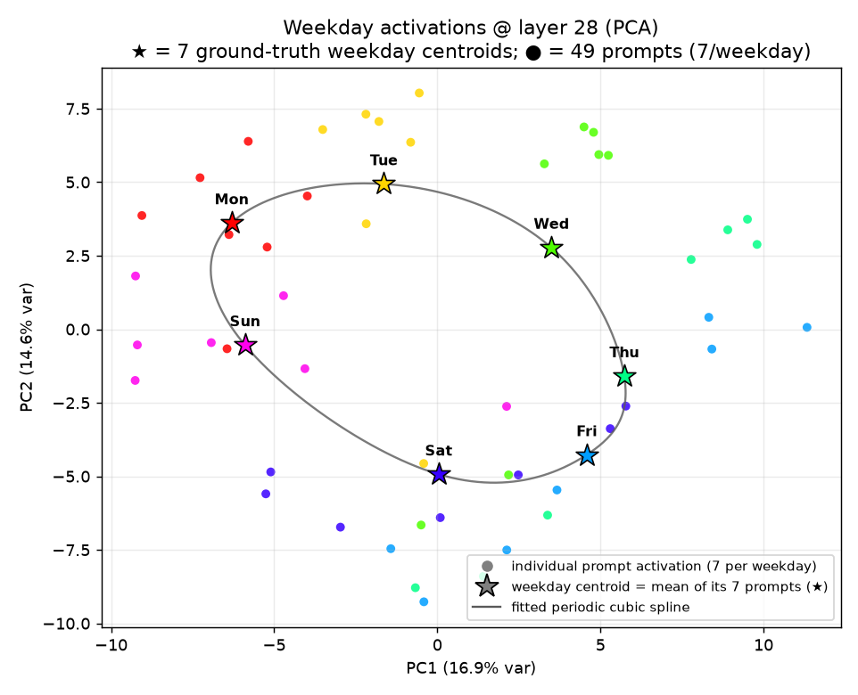
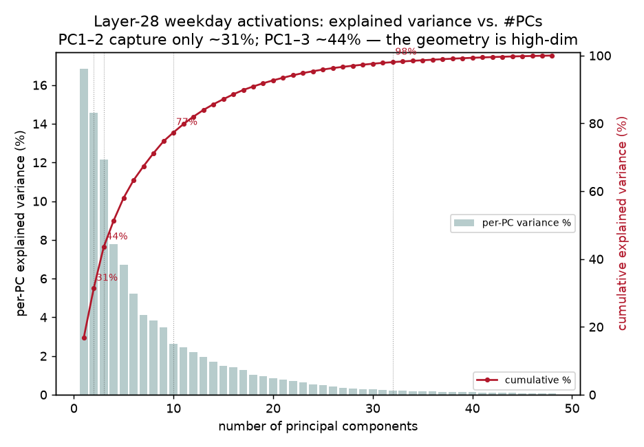
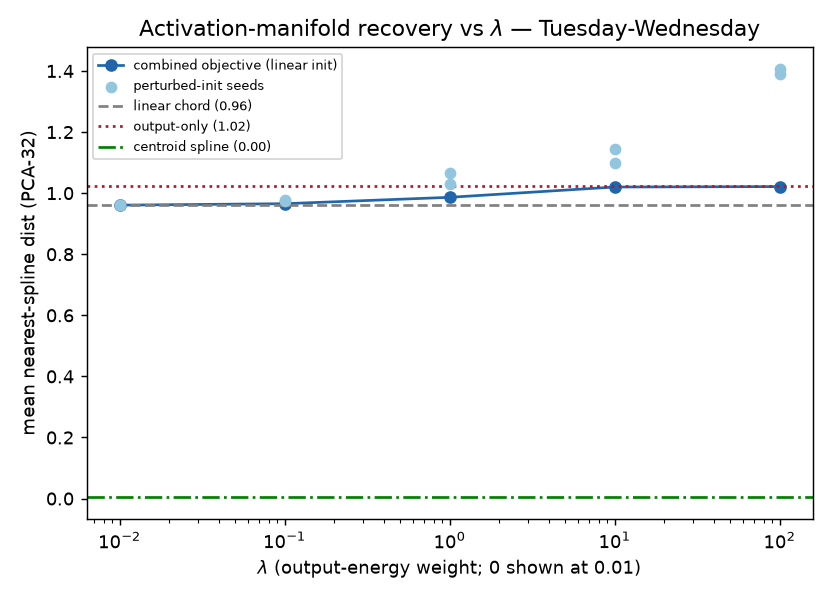
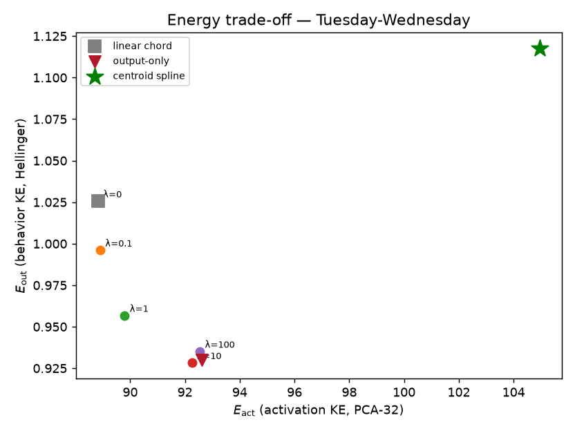
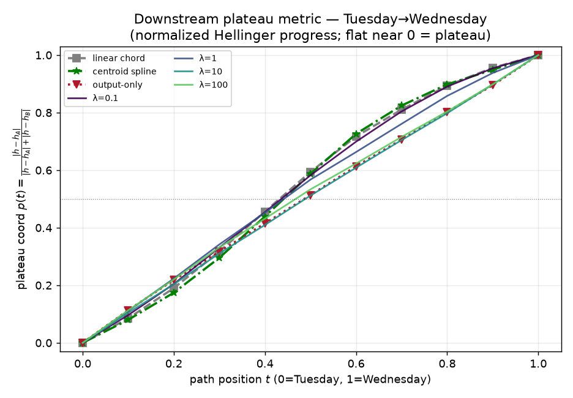
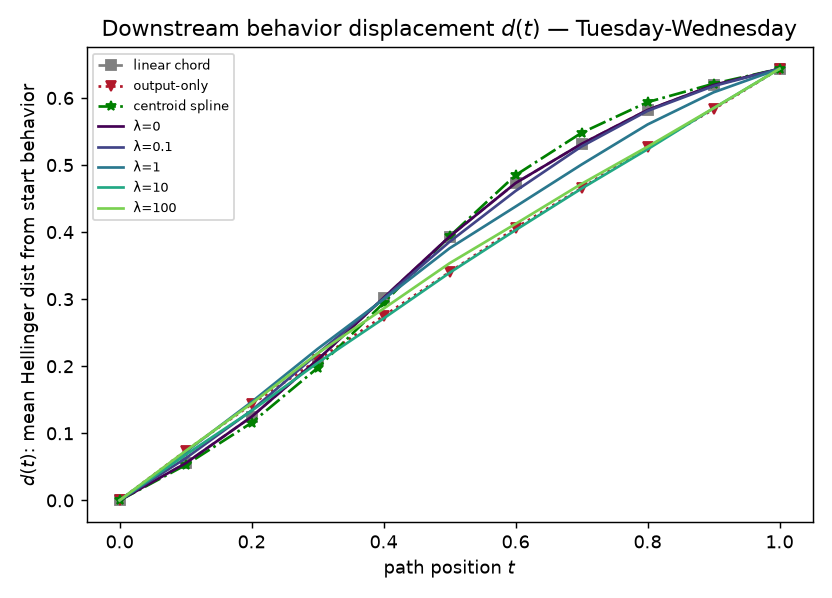
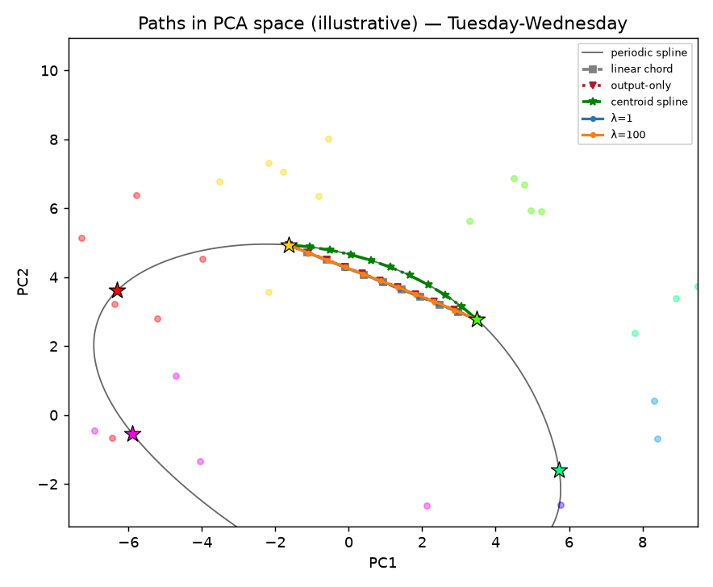
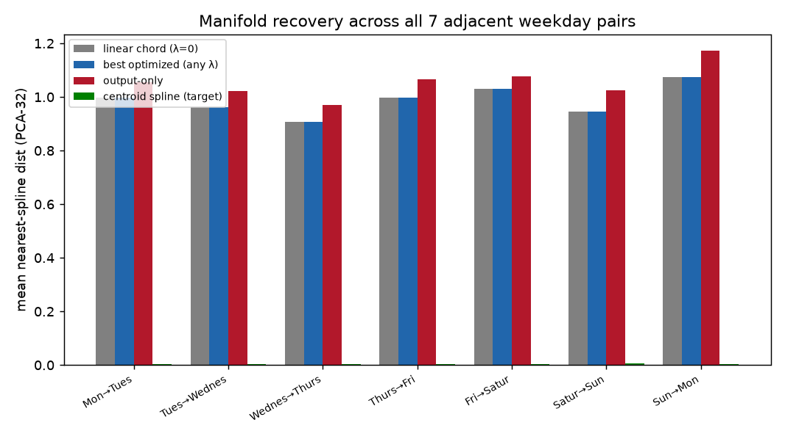
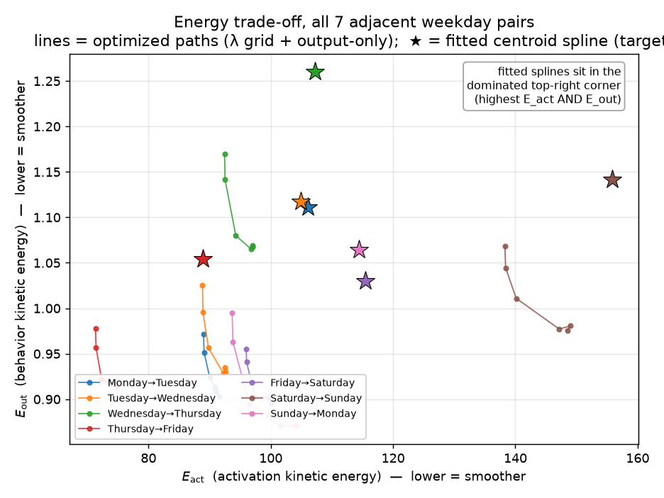

# RESULTS — Does combined path smoothness recover the weekday activation manifold?

> CURRENT-BEST ONLY. History lives in CHANGELOG.md. Read before rewriting.

**Question.** For fixed weekday-centroid endpoints, does optimizing a weighted mix of
*activation-space* kinetic energy and *downstream behavior-space* kinetic energy bend the
activation path closer to the paper's fitted weekday activation manifold (a periodic cubic spline
through the seven weekday centroids) than either extreme alone?

**Verdict — NO (decisive; holds for all seven adjacent weekday pairs).** No value of the trade-off
weight $\lambda$ brings the optimized path near the fitted spline. Recovery *monotonically worsens* as
$\lambda$ grows; the straight chord ($\lambda=0$) is the closest of all optimized paths, and it is
still far from the spline. The fitted spline is itself **dominated in both energies** (higher
activation *and* higher behavior kinetic energy than the chord) in every pair, so this smoothness
objective structurally cannot prefer it.

## Setup validation (S2) — Llama 3.1 8B base, layer 28, 49 prompts

**Sample sizes (feedback):** the dataset is exactly **49 prompts = 7 weekdays × 7 increments**, so
there are **7 prompt sequences per ground-truth weekday** (each averaged into one centroid). We use
**16 base prompts** (a fixed seeded subset of the 49) for every behavior-energy average.

| Quantity | Value | Read as |
|---|---|---|
| Task accuracy (argmax of 7 weekday bins == ground truth) | **0.939** (46/49) | Model solves the task. |
| Mean weekday probability mass (7 bins) | **0.743** | Most output mass on weekday tokens. |
| Mean `other` mass | **0.257** | Remainder over the rest of vocab. |
| Adjacent-centroid spacing (PCA-48, L2) | 8.5 – 11.8 | Seven centroids well separated; spline well-posed. |

**What are the stars? (feedback)** The **star (★) markers are the seven ground-truth weekday
centroids** — each is the *mean* PCA position of that weekday's 7 prompts. The small colored dots are
the 49 individual prompt activations, and the gray curve is the fitted periodic cubic spline the whole
experiment tries to reconstruct.

**Is 2-3 PCs representative? (feedback) — No.** PC1-PC2 capture only **31.4%** of the layer-28
activation variance and PC1-PC3 only **43.6%**; **18** PCs are needed for 90% and **32** reach 98.1%.
The 2-D scatter above is therefore only an illustrative shadow — the weekday geometry is genuinely
high-dimensional, which is exactly why every recovery/energy conclusion below is computed in the
**PCA-32** optimization subspace, not in the 2-D picture.

## Lambda sweep (S4) — Tuesday→Wednesday, 16 base prompts, 3 seeds

**Activation-manifold recovery** = mean nearest-point distance from the optimized waypoints to the
fitted periodic-spline arc, in the 32-dim PCA optimization subspace. **Lower = closer to the fitted
manifold.** For scale, adjacent weekday centroids are ~9.6 apart.

| init | λ=0 | λ=0.1 | λ=1 | λ=10 | λ=100 | output-only |
|---|---|---|---|---|---|---|
| linear      | **0.961** | 0.965 | 0.986 | 1.020 | 1.022 | 1.023 |
| perturbed #1| 0.961 | 0.975 | 1.029 | 1.099 | 1.390 | 1.400 |
| perturbed #2| 0.961 | 0.978 | 1.067 | 1.146 | 1.408 | 1.425 |
| **centroid spline (target)** | — | — | — | — | — | **0.004** |

- **λ=0 recovers the linear chord** (recovery 0.961 for all seeds; endpoint error 0; E_act = global
  min 88.8) — a passed sanity check.
- **Recovery worsens with λ for every seed.** No intermediate λ beats both extremes.
- **The target spline (0.004) is ~250× closer to itself than any optimized path.** The smallest gap
  to the spline is ~0.96 ≈ 10% of the endpoint separation — the whole optimized family misses it.
- **High-λ paths are initialization-dependent and wander:** from a perturbed start, output-only
  reaches E_act ≈ 306–313 vs 93 from the linear start (both with E_out ≈ 0.94). The behavior objective
  has a broad flat minimum, so it does **not pin down the activation path**.

### Energy trade-off (raw, Tuesday→Wednesday). Both energies lower = smoother.

| path | E_act (activation KE) | E_out (behavior KE) |
|---|---|---|
| linear chord (λ=0) | 88.8 | 1.026 |
| λ=1 | 89.8 | 0.957 |
| output-only (linear init) | 92.6 | 0.930 |
| **centroid spline (target)** | **104.9** | **1.118** |

The spline sits at the **worst corner**: it has the highest activation KE *and* the highest behavior
KE. Every optimized path dominates it in at least one energy and most in both. A smoothness objective
would never select it.

### Downstream plateau metric (feedback) — Tuesday→Wednesday

At the operator's request we add the normalized plateau coordinate

$$p(t) = \frac{|h(t)-h_A|}{|h(t)-h_A| + |h(t)-h_B|}$$

where $h(t)$ is the induced 8-bin behavior distribution at waypoint $t$ in Hellinger coordinates and
$h_A,h_B$ are the start/end endpoint behaviors (per base prompt, averaged over the 16). $p=0$ at the
start behavior, $p=1$ at the end; a *plateau* would appear as $p$ staying flat near 0 before a rapid
switch.

**Result:** there is **no sharp plateau** — $p(t)$ rises smoothly and nearly monotonically from 0 to 1
along *every* path, and, crucially, **the centroid spline's curve is essentially identical to the
linear chord's** (both pass ~0.59 at the midpoint). So by this downstream progress metric the fitted
manifold looks the same as the trivial straight line: downstream behavior does **not** single out the
on-manifold path. Higher-λ / output-only paths are only slightly flatter (midpoint ~0.51-0.53, i.e.
a more even spread), the expected effect of penalizing behavior kinetic energy.

### Downstream displacement d(t) and PCA geometry

## Generalization (S6) — all seven adjacent weekday pairs (linear init)

The same coarse grid + output-only, run for every adjacent pair. The pattern is identical everywhere:

| pair | linear chord | best optimized (any λ) | centroid spline (target) | spline dominated in both energies? |
|---|---|---|---|---|
| Mon→Tue | 0.998 | **0.998** | 0.004 | yes |
| Tue→Wed | 0.961 | **0.961** | 0.004 | yes |
| Wed→Thu | 0.908 | **0.908** | 0.004 | yes |
| Thu→Fri | 0.998 | **0.998** | 0.004 | yes |
| Fri→Sat | 1.031 | **1.031** | 0.004 | yes |
| Sat→Sun | 0.945 | **0.945** | 0.005 | yes |
| Sun→Mon | 1.075 | **1.075** | 0.004 | yes |
| **mean** | **0.988** | **0.988** | **0.004** | **7/7** |

**For all seven pairs the best optimized path over the entire λ grid exactly equals the linear chord** —
no $\lambda$ ever improves recovery — and the target spline is ~235× closer to itself (0.004) than the
best path (0.988). The centroid spline is Pareto-dominated in both energies in **every** pair.

## Headline
Generic combined kinetic smoothness (activation + behavior) does **not** explain the fitted weekday
activation manifold, for **any** of the seven adjacent weekday pairs. Adding behavior-smoothness never
improves recovery (the straight chord is always the closest path), the high-λ result is
initialization-dependent, and the fitted spline is the *least* smooth path by both energies in every
pair — Pareto-dominated, so these two kinetic terms give no reason to prefer it. The new plateau
metric adds a fourth strike: downstream behavior progresses identically along the spline and the
straight chord, so it cannot be what makes the manifold special.
