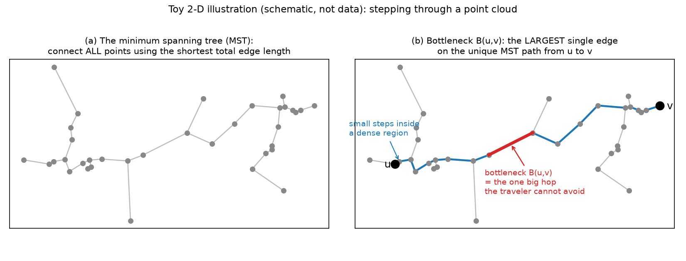
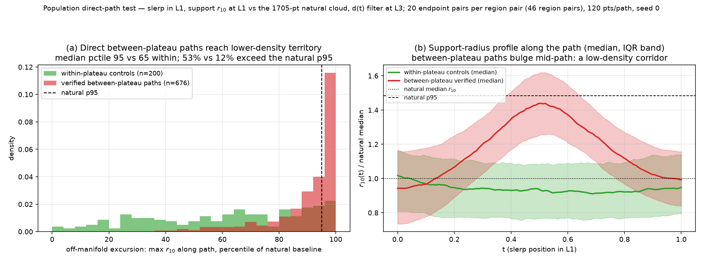
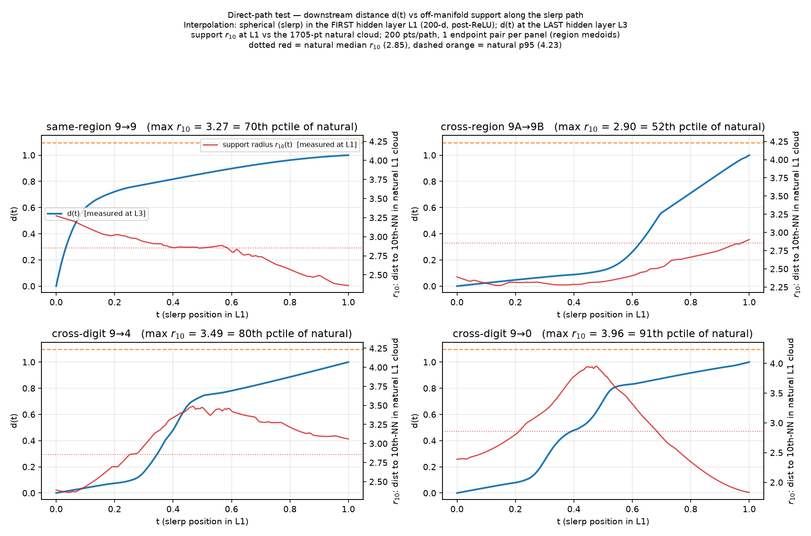
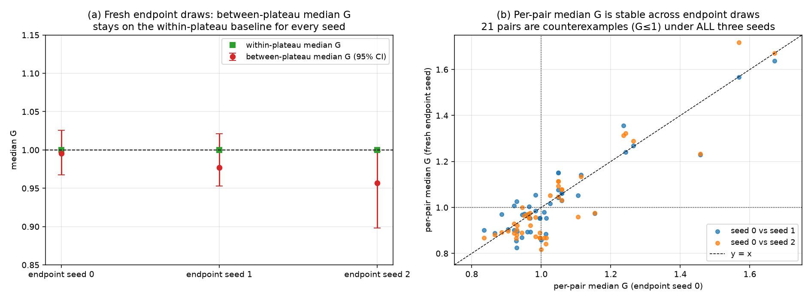
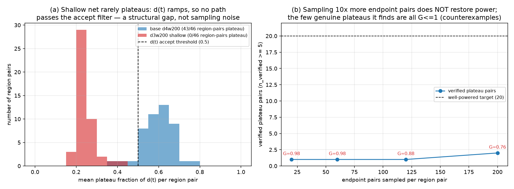

# REPORT — Do plateau transitions correspond to activation-manifold transitions?

> Final, presentable, current-best only (no history — see CHANGELOG.md). Read before rewriting.

## Summary

Interpretability research often pictures a network's internal activations as living on a
low-dimensional **manifold**: a thin, structured sheet inside the huge activation space, with distinct
behaviors on distinct, *separated* pieces of it. A **plateau** looks like direct evidence for this
picture. When we interpolate hidden activations from one example to another, the downstream
representation often does not slide smoothly. It stays put near output A, jumps abruptly, then stays
put near output B — as if a wall stood between two basins. If that wall were a real gap in the data,
we could monitor and steer behaviors by their manifold component. That is the safety stake.

We test what the wall actually is, across **every** sufficiently populated plateau pair of an MNIST
classifier — not one hand-picked case. Three principal findings:

1. **Plateaus are not separate manifold components.** Most verified plateau transitions connect
   through natural activations with no larger gap than normal travel *inside* a single plateau. This
   refutes the universal claim (one counterexample suffices; we find dozens, stable under resampling
   and replication).
2. **Plateau pairs are not even *typically* more separated** than within-plateau controls. The two
   distributions of our separation score lie on top of each other. The typical-association claim is
   not supported.
3. **The straight interpolation path does cross a low-density corridor.** The path's midpoint —
   exactly where the output jumps — sits in territory real activations essentially never visit. The
   corridor is real; it belongs to the straight-line route, not to the manifold.

**Verdict: a plateau marks the model's decision geometry, not a hole in the data manifold.** The
plateaus are connected; the straight path between them is not where the data lives. All supporting
numbers, counts, and robustness checks are in Results.

## Methods

### Data & Model

**Model.** The `image-models` checkpoint `mnist_mlp_d4_w200_relu`: a fully-connected MNIST classifier
784→200→200→200→10 with ReLU activations, trained with MSE to one-hot targets on a 1000-image subset.
Test accuracy **85.3%**. For replication we reuse four existing checkpoints trained the same way: a
**second seed** (d4w200, 86.9%) and three architectures — **d3w200** shallower (78.1%), **d4w400**
wider (86.9%), **d5w200** deeper (85.9%).

**Layers.** The interpolation is spherical linear interpolation (**slerp**: constant angular velocity,
magnitude interpolated linearly). It is performed in the **first hidden layer L1** (200-dim,
post-ReLU) — the "intervention layer". The downstream curve `d(t)` is measured at the **last hidden
layer L3** (200-dim). The support radius `r_10` of Investigation 2 is measured at **L1**, the same
layer the path lives in.

**Natural activation cloud.** The empirical manifold reference is the set of L1 activations of all
**1705** correctly-classified test images (of 2000).

**Plateau regions.** Regions are defined from *output* behavior, before any manifold test. We take the
**10 digit classes** as the stable output regions. Endpoints must be correctly classified and
confidently so: output margin (top-1 minus top-2 logit) ≥ 0.5. (Softmax is uninformative here because
the net regresses to one-hot targets.) 1604 examples pass, at least 130 per digit. Confidence is an
inclusion rule, never a reported metric. The previously-studied **digit-9 A/B sub-plateau** (a split of
the 9s into two output-side clusters) is included as one extra pair, treated exactly like any other.
We sample **20 endpoint pairs per region pair** (seed 0), and the same count for within-plateau
controls, so digit frequency cannot dominate.

### How to read the plots — the core vocabulary

Only three quantities matter. Everything else in this report is an internal filter or a normalizer.

> **`d(t)` — the plateau checker (a filter, never a score).** The output-side curve along an
> interpolation path, running from 0 (still looks like A downstream) to 1 (looks like B). We only use
> it to verify a path genuinely goes *flat → jump → flat*.
>
> **`G` — Investigation 1's only score: "how big a hop do you need?"** `G = 1` means the two plateaus
> connect through real activations as easily as two points inside one plateau. `G > 1` means an
> unusually large hop is required — evidence of separation. `G ≤ 1` is a counterexample to the
> universal claim.
>
> **`E` — Investigation 2's only score: "how empty does the straight path get?"** The path's worst
> local data density, as a percentile of natural points' own density. `E ≈ 50`: never less supported
> than a typical real activation. `E > 95`: the path visits near-empty territory.
>
> **Plot conventions:** red = between-plateau, green = within-plateau control; dashed reference lines
> mark `G = 1` or the natural 95th percentile ("p95").

### Metric definitions

**`d(t)` — verifying a path is plateau-to-plateau.** For a slerp path `x_t` in L1 from `x_0` (region
A) to `x_1` (region B), the normalized downstream distance at L3 is:

```math
d(t) \;=\; \frac{\lVert h_3(x_t) - h_3(x_0) \rVert}{\lVert h_3(x_t) - h_3(x_0) \rVert \;+\; \lVert h_3(x_t) - h_3(x_1) \rVert}
```

We **accept** a path as a verified plateau transition iff it spends at least half its length flat near
an endpoint (`d(t)<0.2` or `d(t)>0.8` — we call this its *plateau fraction*), starts below 0.2, and
ends above 0.8.

**What a minimum spanning tree (MST) is — in plain words.** Investigation 1 needs to answer: can you
walk from plateau A to plateau B *stepping only on real activations*, without ever making an unusually
big hop? Think of the 1705 natural activations as stepping stones. A **spanning tree** is a set of
bridges that joins every stone into one connected network with no loops. The **minimum** spanning tree
is the choice of bridges with the smallest possible total length — the cheapest skeleton of the cloud.
It has one classical property that makes it exactly the right tool here: for any two stones `u` and
`v`, the largest bridge on their (unique) MST path is the smallest "biggest hop" achievable by **any**
route through the cloud. So building one tree answers, for every pair at once: *what is the single
biggest step a traveler is forced to take to get from `u` to `v` through the data?* That forced step
is the **bottleneck** `B(u,v)`:

```math
B(u,v) \;=\; \min_{P:\,u\rightsquigarrow v}\ \max_{(p,q)\in P}\ \lVert a_p - a_q \rVert
```

where `a_p` are natural L1 activations and `P` ranges over all paths through the cloud. Two separate
manifold components show up as a large forced hop; a connected cloud keeps every forced hop small.



**`G` — the normalized bottleneck (Investigation 1's score).** Raw bottlenecks are not comparable
across regions of different density, so we normalize by the **within-plateau connection scale**. Let
`s_r` be the median bottleneck between same-region endpoint pairs of region `r` (frozen from the
control pairs, before any between-plateau result was examined). For endpoints in regions `i, j`:

```math
G \;=\; \frac{B(u,v)}{\max(s_i,\, s_j)}
```

`G` divides the forced hop by the hop a normal *within*-plateau trip needs. That is what licenses the
reading in the box above, and it fixes the counterexample threshold at `G = 1` before any
between-plateau data is seen.

**`E` — the off-manifold excursion (Investigation 2's score).** `G` asks whether the *data* is
connected. It says nothing about what the *straight path* passes through. For that we score local data
density at every path point by the distance to the 10th-nearest natural activation:

```math
r_k(x) \;=\; \lVert x - \mathrm{NN}_k(x) \rVert , \qquad k = 10
```

Large `r_10` = locally empty space. To calibrate "large", we use the natural cloud itself as baseline:
each natural point's own `r_10` (self excluded; median 2.85, p95 4.23 on the base model). A path's
excursion is its worst support along the way, as a percentile of that baseline:

```math
E \;=\; \mathrm{pctile}_{\mathrm{natural}}\!\left( \max_t\, r_k(x_t) \right)
```

### Baselines

**Within-plateau control.** The reference for both investigations is the set of **within-region**
endpoint pairs (same digit, same sampling rules). For `G` its median is 1 by construction; its spread
(p95 = 1.39 on the base model) is the yardstick a between-plateau pair must clearly exceed to show
real separation. For `E` the controls show what excursions ordinary same-region travel produces.

**Thresholds are frozen, not tuned.** `G = 1` follows from the within-plateau normalization; the `E`
baseline comes from the natural cloud itself. Both are fixed before any between-plateau result.

### Verdict rules

- **Universal claim refuted** iff at least one well-powered verified plateau pair has `G ≤ 1`, stably
  under resampling and replication.
- **Typical association supported** iff the between-plateau `G` distribution is consistently shifted
  above the within-plateau control across replications. Not supported if they overlap or the direction
  is unstable.
- **Low-density corridor real** iff verified between-plateau paths show systematically higher `E` than
  within-plateau controls.

## Results

### Investigation 1 — plateaus are not separate components

Across 45 cross-digit plateau pairs plus the digit-9 sub-plateau, all verified by `d(t)`:

| quantity | value |
|--|--|
| within-plateau `G`: median / 95th pct | 1.00 / 1.39 |
| **between-plateau median `G`** (45 verified pairs) | **0.996**  (95% CI 0.97–1.03) |
| between-plateau median `G`: min – max pair | 0.84 – 1.67 |
| verified pairs with median `G > 1` | 44% (20/45) |
| **counterexamples** (median `G ≤ 1`) | **25 / 45** |
| digit-9 A/B sub-plateau (original case) | **G = 1.00** |

**Universal claim — REFUTED.** 25 of 45 verified plateau transitions have `G ≤ 1`. Each one connects
through the natural cloud with no larger hop than normal within-plateau travel. The original digit-9
sub-plateau is one of them. A wall between plateaus is not required.

**Typical-association claim — NOT SUPPORTED.** The between-plateau median `G` (0.996) sits on the
within-plateau baseline (1.00). The bootstrap CIs overlap (0.97–1.03 vs 0.99–1.02). The largest bridge
any pair needs (`G = 1.67`) barely exceeds the *within*-plateau 95th percentile (1.39).


The few pairs with modestly larger `G` all involve digit **1** (1↔8 = 1.67, 0↔1 = 1.57, 1↔3 = 1.46).
Digit 1's activation cloud is elongated and thin, so its *own* internal scale `s_1` is small. That
inflates the ratio; it is not a genuine void. The heatmap below (median `G` for every digit pair,
diagonal = within-plateau = 1) shows no block structure — no set of digits forms its own component.


The `d(t)` filter itself behaves as intended. The next figure shows three representative verified
curves (x-axis: interpolation position `t`; y-axis: `d(t)`): the largest-`G` pair, the digit-9
sub-plateau, and the smallest-`G` pair. All are genuinely flat → jump → flat.


### Investigation 2 — the straight path crosses a low-density corridor

What does the straight slerp route itself traverse? Same frozen population (46 region pairs × 20
endpoint pairs, seed 0; 676 of 920 sampled paths pass the `d(t)` filter; 120 slerp points per path;
controls = 200 within-plateau paths, 20 per digit):

| quantity | between-plateau (verified, n=676) | within-plateau controls (n=200) |
|--|--:|--:|
| median excursion `E` | **95.4** (IQR 87.8–98.4) | 65.2 (IQR 38.3–86.1) |
| paths with max `r_10` > natural p95 | **53%** | 12% |

**The corridor is real.** The median verified path climbs to the 95th percentile of natural support —
the edge of where real activations exist. Over half go beyond the natural p95 outright. Controls stay
comfortably inside the cloud. In the profile panel below, the support radius bulges mid-path (to
~1.45× the natural median) exactly where the `d(t)` jump happens, and returns to normal at both
endpoints. Panel (a) plots the histogram of `E` per path; panel (b) plots median `r_10(t)` (relative
to the natural median, with interquartile bands) against slerp position `t`.



**Single-pair illustration.** The pilot figure that motivated this direction, regenerated with full
annotations. Each panel shows one endpoint pair (region medoids), 200 points per path: `d(t)` at L3 in
blue (left axis), support radius `r_10` at L1 in red (right axis), against the 1705-point natural
cloud; dotted red = natural median `r_10` (2.85), dashed orange = natural p95 (4.23).



The two investigations agree rather than conflict. The digit-9 sub-plateau (panel 2) is a *connected*
pair (`G = 1.00`) whose direct path never leaves the support (`E` = 52) — a plateau can occur entirely
on-manifold, purely from decision geometry. Typical cross-digit transitions keep `G ≈ 1` while their
straight route detours through near-empty space (median `E` = 95.4). The corridor belongs to the
straight-line route, not to the manifold's connectivity.

### Resampling stability

A counterexample produced by one lucky draw of endpoint pairs would refute nothing. We re-ran the
frozen pipeline on the base model with two fresh endpoint-sampling seeds. (Re-running seed 0
reproduced the published numbers exactly.)

| endpoint seed | between-plateau median `G` (95% CI) | counterexamples (`G≤1`) | digit-9 sub `G` |
|--:|--|--:|--:|
| 0 (frozen) | 0.996 (0.97–1.03) | 25 / 45 | 1.00 |
| 1 | 0.977 (0.95–1.02) | 25 / 46 | 0.86 |
| 2 | 0.957 (0.90–1.00) | 30 / 46 | 0.82 |

**21 plateau pairs — including the digit-9 sub-plateau — are counterexamples under all three
independent endpoint draws.** The between-plateau median never rises above the within-plateau
baseline. In the figure, panel (a) plots median `G` (with 95% bootstrap CI) per seed; panel (b) plots
each pair's median `G` at seed 0 (x-axis) against fresh seeds 1 and 2 (y-axis).



### Replication — second seed and three architectures

The identical frozen pipeline on the existing checkpoints:

| model (test acc) | verified pairs | between-plateau median `G` | % pairs `G>1` | counterexamples (`G≤1`) |
|--|--:|--:|--:|--:|
| base d4w200, seed 0 (85.3%) | 45 | **0.996** | 44% | 25 |
| seed 1 d4w200 (86.9%)       | 45 | **0.925** | 22% | 35 |
| d4w400 wider (86.9%)        | 46 | **0.987** | 43% | 26 |
| d5w200 deeper (85.9%)       | 46 | **0.982** | 30% | 32 |
| d3w200 shallower (78.1%)*   | 1  | 0.982 | 0% | 1 |

\*Excluded on structural grounds — see below. The four well-powered models agree: the between-plateau
median `G` stays at 0.93–1.00, never consistently above the baseline, and each finds many
counterexamples. In seed 1 the direction even reverses. Neither claim survives replication. The figure
plots, per model, the between-plateau median `G` with CI (panel a) and the fraction of pairs on each
side of `G = 1` (panel b).


### Why the shallow net is excluded

Is the shallow net's single verified pair just sampling noise? No — its deficit is structural. Its
`d(t)` *ramps* rather than plateaus. Its mean plateau fraction across all 46 region pairs is 0.25
(max 0.43), so 0 of 46 pairs reach the 0.5 accept threshold even on average, versus 0.60 (43/46 above
threshold) for the base net. Sampling 10× more endpoint pairs (20 → 200 per region pair) still yields
only 2 verified pairs. We do **not** relax the `d(t)` filter: a ramp is not a plateau, and scoring `G`
on non-plateau paths would not test the claim. The 1–2 genuine plateaus it does produce are all
counterexamples (`G ≤ 1`, median 0.76–0.98) — consistent with the other models. We therefore rest the
verdict on the four well-powered models. Panel (a) below plots each region pair's mean plateau
fraction for the shallow (red) and base (blue) nets against the accept threshold; panel (b) plots
verified-pair count against endpoint pairs sampled.



## Conclusion

Both Investigation 1 claims fail, and Investigation 2's corridor is real (full numbers in Results):

- **Universal claim REFUTED** — dozens of verified plateau pairs connect with `G ≤ 1`, 21 of them
  under every endpoint redraw, in every well-powered model, including the digit-9 case that first
  motivated this direction.
- **Typical-association claim NOT SUPPORTED** — the between- and within-plateau `G` distributions
  overlap almost completely, in every well-powered model.
- **The low-density corridor is REAL** — verified straight paths reach the edge of natural support at
  mid-path, exactly where the output jumps; controls do not.

**What this means.** A sharp plateau marks a place where the model's decision geometry changes
abruptly. The straight interpolation genuinely leaves the populated part of activation space — but the
two plateaus remain connected by ordinary high-density natural paths. For safety work this cuts both
ways. Caution: plateaus and low-density interpolations are **not** evidence that two behaviors occupy
disconnected regions of activation space. Opportunity: behavior boundaries between confident classes
sit in reliably low-density territory, so an interpolation that triggers a behavior flip is very
likely operating off-distribution — relevant when interpreting steering or patching experiments that
move activations along straight lines.

**Limitations.** (1) Finite samples can support or undermine an *empirical* component split but cannot
prove true topological disconnection; `G` measures connectivity at the sampled scale, nothing
stronger. (2) All models share the same 1000-image MNIST training subset. (3) The mild `G > 1` pairs
(digit 1) reflect an elongated cloud's small internal scale, not a genuine void — which is why the
verdict rests on the `G` distribution against the control band, not on any single pair. (4) `E` uses
`k = 10` neighbors; the between-vs-control contrast compares like with like under the same `k`, so it
is not an artifact of that choice.
