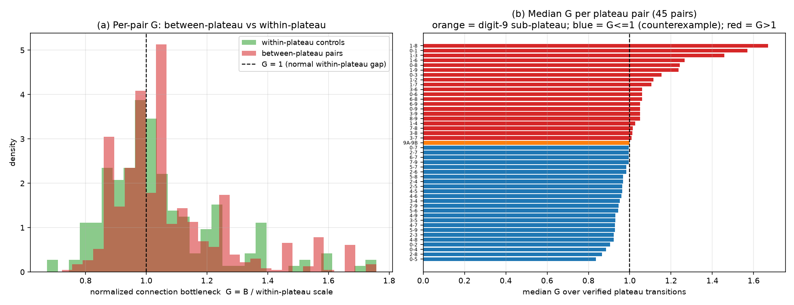
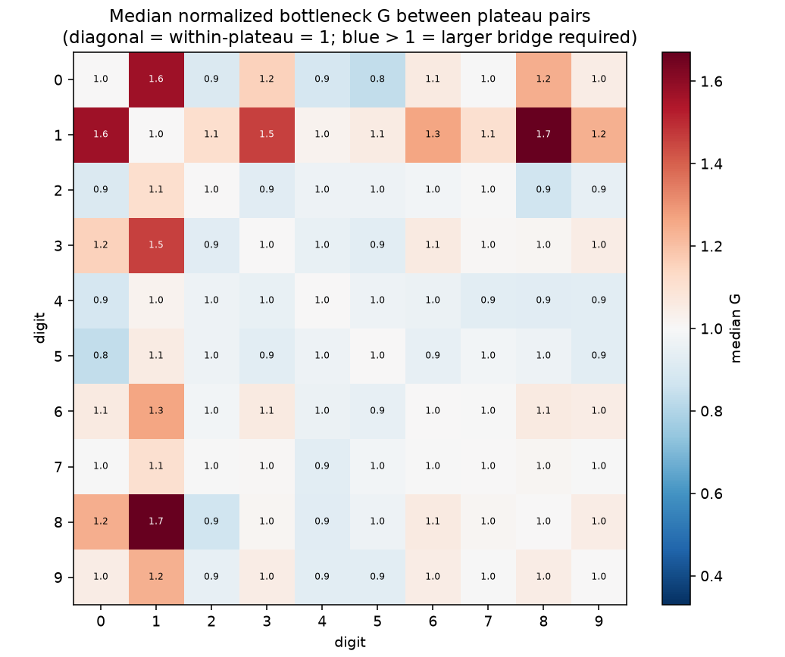
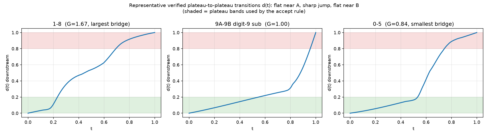
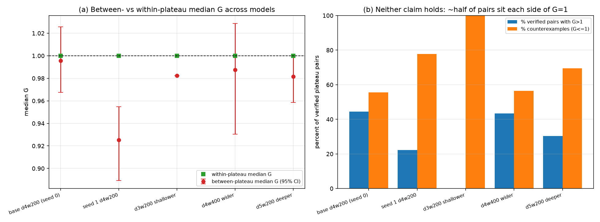

# RESULTS — Do plateau transitions correspond to activation-manifold transitions?

> CURRENT-BEST ONLY. One row per experiment. History lives in CHANGELOG.md. Read before rewriting.

**The safety question.** Interpretability often assumes a network's internal activations live on a
low-dimensional *manifold*, and that distinct behaviors occupy distinct, separated pieces of it. A
sharp **plateau** in an interpolation — the downstream representation sits still near output A, jumps
abruptly, then sits still near output B — looks like direct evidence for that picture: two stable
"basins" with a wall between them. If plateaus really marked *disconnected components of the data
manifold*, we could localize and monitor behaviors by their manifold component. This direction tests
that assumption at the population level, across the whole model, not on one hand-picked case.

**The precise question.** When an activation path moves from one stable output plateau to another, do
the two plateaus lie on **different empirical components of the natural activation manifold**, or are
they connected by a high-support natural path — with the plateau coming only from the straight-line
interpolation leaving the data manifold?

**Two claims we test separately:**
1. **Universal claim** — *every* plateau transition implies a manifold-component transition. One
   reliable counterexample refutes it.
2. **Typical-association claim** — plateau pairs are *usually* more separated in the natural activation
   cloud than within-plateau controls.

## Setup (frozen before looking at any between-plateau result)
- **Model:** the `image-models` MNIST MLP `mnist_mlp_d4_w200_relu` (784→200→200→200→10, ReLU, MSE to
  one-hot, test acc **85.3%**), plus four existing replication checkpoints (a second seed and three
  architectures).
- **Layers:** interpolate the **first hidden layer L1** (200-dim, post-ReLU); measure downstream
  distance at the **last hidden layer L3**.
- **Natural cloud:** L1 activations of all **1705** correctly-classified test images (of 2000).
- **Plateau regions:** the **10 digit classes** (class-aligned stable output regions), restricted to
  correct examples with output **margin** (top-1 − top-2 logit) **≥ 0.5** (a fixed confidence rule to
  drop ambiguous endpoints; 1604 pass, ≥130 per digit). The previously-studied **digit-9 A/B**
  sub-plateau (KMeans-2 on L3) is included as *one extra transition, treated exactly like any pair.*
- **Sampling:** 20 endpoint pairs per region pair (seed 0), same count for controls, so digit
  frequency cannot dominate.

## Metrics
**Plateau observable `d(t)`** — used *only* to verify a path is genuinely plateau-to-plateau (starts
stable near A, sharp jump, ends stable near B). A between-region slerp path is **accepted** as a
verified transition iff its plateau fraction (fraction of `t` with `d<0.2` or `d>0.8`) ≥ 0.5, it starts
below 0.2 and ends above 0.8. This is an *inclusion filter*, not a reported score.

**Manifold observable — normalized connection bottleneck `G`** (the single reported metric). Build a
Euclidean **minimum spanning tree (MST)** over the natural L1 cloud. For two endpoints `u,v`, the
bottleneck `B(u,v)` is the largest edge on their unique MST path — equivalently the *smallest step
size* at which they become connected through the sampled natural cloud. Normalize by the within-plateau
connection scale so the number is comparable across regions:

- `s_r` = median within-region bottleneck (frozen from within-plateau pairs);
- `G = B / max(s_i, s_j)` for a pair with endpoints in regions `i,j`.

**Read `G` like this:** `G = 1` means "no larger gap than is normally required inside a plateau";
`G > 1` means an unusually large bridge is needed (candidate component separation); `G ≤ 1` means the
two plateaus connect through natural activations as easily as two points *inside* one plateau — **a
counterexample to the universal claim.**

## Result — population verdict (base model, 45 cross-digit pairs + digit-9 sub-plateau)

| quantity | value |
|--|--|
| within-plateau `G`: median / p95 | 1.00 / 1.39 |
| **between-plateau median `G`** (over 45 verified pairs) | **0.996**  (95% CI 0.97–1.03) |
| between-plateau median `G`: min – max pair | 0.84 – 1.67 |
| verified pairs with median `G > 1` | **44%** (20 / 45) |
| **counterexamples** (verified pairs with median `G ≤ 1`) | **25 / 45** |
| digit-9 A/B sub-plateau (the original case) | **G = 1.00** (a counterexample) |

**Universal claim: REFUTED — decisively.** 25 of 45 verified plateau transitions connect through the
natural cloud with **no larger bottleneck than normal within-plateau travel** (`G ≤ 1`), including the
original digit-9 sub-plateau (`G = 1.00`). A wall between plateaus is not required.

**Typical-association claim: NOT SUPPORTED.** The between-plateau median `G` (0.996) sits essentially
*on top of* the within-plateau baseline (1.00) — its 95% bootstrap CI (0.97–1.03) overlaps the
within-plateau CI (0.99–1.02). The per-pair `G` distributions overlap almost completely (figure a):
44% of pairs fall above `G=1` and 56% at or below. The largest bridge any pair needs (`G=1.67`,
digit 1↔8) barely exceeds the *within*-plateau 95th percentile (1.39) — there is no pair separated by a
dramatic data hole. Plateau separation is **not** typically manifold-component separation.

The pairs that *do* need a modestly larger bridge (`G > 1`) are dominated by digit **1** (1↔8=1.67,
0↔1=1.57, 1↔3=1.46) — an elongated, thin activation manifold whose *own* internal scale `s_1` is small,
inflating the ratio — not by a genuine void. The heatmap shows no block structure: no cluster of digits
forms its own component.

Representative verified transitions confirm `d(t)` is doing its job — genuine flat→jump→flat plateaus —
yet even the largest-`G` pair only needs a bridge ~1.7× the normal within-plateau step:

## Resampling stability — the verdict does not depend on the endpoint draw
The verdict rules require counterexamples to be stable under **resampling**, not just model
replication. We re-ran the identical frozen pipeline on the base model with two *fresh*
endpoint-sampling seeds (all definitions unchanged; seed 0 re-run as a regression check reproduced
0.996 / 25 of 45 / digit-9 G = 1.00 exactly):

| endpoint seed | between-plateau median `G` (95% CI) | counterexamples (`G≤1`) | digit-9 sub `G` |
|--:|--|--:|--:|
| 0 (frozen) | 0.996 (0.97–1.03) | 25 / 45 | 1.00 |
| 1 | 0.977 (0.95–1.02) | 25 / 46 | 0.86 |
| 2 | 0.957 (0.90–1.00) | 30 / 46 | 0.82 |

**21 plateau pairs — including the digit-9 sub-plateau — are counterexamples under all three
endpoint draws**, and the between-plateau median `G` stays on (seeds 0–1) or below (seed 2) the
within-plateau baseline for every draw. Both verdicts are resampling-stable.

## Replication — second seed and three architectures
We re-ran the identical frozen pipeline on the existing checkpoints (`experiments/population_manifold.py`).

| model (test acc) | verified pairs | between-plateau median `G` | % pairs `G>1` | counterexamples (`G≤1`) |
|--|--:|--:|--:|--:|
| base d4w200, seed 0 (85.3%) | 45 | **0.996** | 44% | 25 |
| seed 1 d4w200 (86.9%)       | 45 | **0.925** | 22% | 35 |
| d4w400 wider (86.9%)        | 46 | **0.987** | 43% | 26 |
| d5w200 deeper (85.9%)       | 46 | **0.982** | 30% | 32 |
| d3w200 shallower (78.1%)*   | 1  | 0.982 | 0% | 1 |

\*The shallow net is excluded on **structural grounds**, not merely down-weighted (see next section):
it rarely produces *sharp* plateaus, so only 1 pair passes the `d(t)` accept filter. The four
well-powered models agree: between-plateau median `G` is **0.93–1.00 in every case — never a consistent
shift above the within-plateau baseline of 1.0** — and each finds many counterexamples. In seed 1 the
direction even *reverses* (median 0.925 < 1). Neither claim survives replication.

### Why the shallow net can't be powered up — and why that doesn't change the verdict
The natural question is whether the shallow net's single verified pair is just *sampling noise* that
more endpoint pairs would fix. It is not. The shallow net's downstream distance **ramps rather than
plateaus**: its mean plateau fraction across all 46 region pairs is **0.25** (max 0.43), so **0/46**
region pairs reach the 0.5 accept threshold even on average — versus **0.60** (43/46 pairs above 0.5)
for the base net. Sampling **10× more** endpoint pairs (20 → 200 per region pair) leaves it with only
**2** verified pairs, not 20 — confirming the gap is structural, not statistical. We deliberately do
**not** relax the `d(t)` filter to admit these ramps: a ramp is not a plateau, and scoring `G` on
non-plateau paths would not answer the question. Crucially, the 1–2 genuine plateau transitions the
shallow net *does* produce are **all counterexamples** (`G ≤ 1`; median `G` 0.76–0.98) — so its sparse
evidence points the same way as the four well-powered models, never against the verdict.

## Headline
**Both claims fail.** Across a depth-4 MNIST MLP and four replication checkpoints, plateau transitions
are **not** transitions between separate empirical manifold components.
- **Universal claim — REFUTED:** 25/45 verified plateau pairs (base), and 26–35/45–46 in every
  well-powered model, connect through the natural activation cloud with `G ≤ 1` — no larger gap than
  normal within-plateau travel. **21 pairs are counterexamples under all three independent endpoint
  draws** (resampling-stable), including the original digit-9 case (`G` = 1.00 / 0.86 / 0.82).
- **Typical-association claim — NOT SUPPORTED:** between-plateau median `G` (0.93–1.00) sits on the
  within-plateau baseline (1.00) in all four well-powered models, with overlapping bootstrap CIs and no
  consistent direction. The distributions overlap almost completely.

The plateau reflects the model's **decision geometry** (a straight slerp briefly leaving the data
manifold), **not a hole in the data manifold**. **Limitation (stated plainly):** finite activation
samples can support or undermine *empirical* component separation but cannot prove true *topological*
disconnection; and all models share the same 1000-image MNIST training subset. The mild `G>1` pairs
(digit-1) reflect an elongated manifold's small internal scale, not a genuine void.
