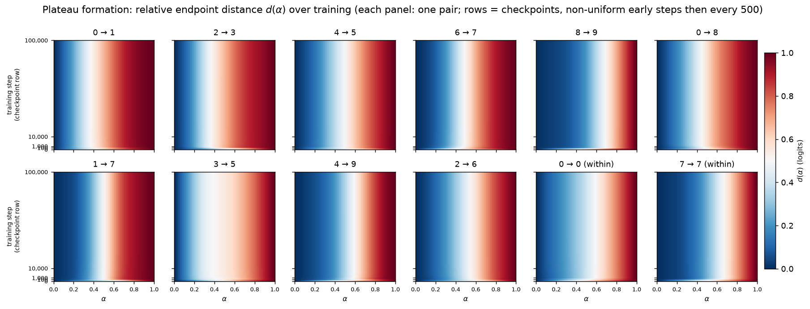

# Animating plateau formation through training in an MNIST MLP

## Summary

**The question.** Take two inputs, interpolate between their internal activations, and watch the
model's output. In trained networks the output often stays glued to one endpoint's output, then
snaps to the other across a narrow **boundary**. This *plateau → boundary → plateau* shape is an
"activation plateau" (Shinkle & Heimersheim, *Activation Plateaus: Where and How They Emerge*).
Plateaus mean the model organizes its internal states into discrete regions of near-constant
behavior. For safety this matters twice. Plateaus make behavior stable: small internal
perturbations, including imperfect steering vectors, do nothing. And boundaries concentrate all
the change: a tiny nudge across one flips the output. We ask *when during training* this
discreteness appears.

**What we did.** We trained a small ReLU MLP on MNIST for 100,000 steps under a learning-rate
schedule chosen — by an explicit scheduler search — so that the training loss **decreases
smoothly and genuinely converges** (per operator feedback 07161834, only smoothly converged
runs are shown in this report). We saved hundreds of checkpoints, ran the identical
activation-interpolation experiment on fixed image pairs at every checkpoint, and rendered the
result as a movie. We repeated the run on two more seeds, repeated it with cross-entropy in
place of the default MSE loss, and measured how well the network separates each digit pair
(pairwise AUROC). Finally — the reopened extension — we took the **same untrained
initializations** and trained them from scratch on **all 60,000 MNIST training images**
(instead of the fixed 1,000-image subset), ran the identical interpolation protocol at 104
checkpoints, and compared the two training regimes path-by-path, including on a frozen bank of
50 unfiltered 3→5 interpolation paths chosen before seeing any full-data result.

**Findings.**

1. **No plateaus at initialization.** The interpolation curve of the random network is a
   featureless diagonal.
2. **On the 1,000-image subset, all the structure forms in the first few hundred steps, then
   converged training freezes it.** The plateau fraction (PF, share of path points near an
   endpoint's output; diagonal floor ≈ 0.20) rises from 0.19 at step 0 to ~0.34 by step 100 and
   ~0.37 by step 300 — the same window in which accuracy rises — and then stays at 0.35–0.37
   for the remaining 99,700 steps, across all three seeds. Once the loss converges, the curves
   stop moving to about six decimal places per 500 steps. (Finding 5: the freeze *level* is a
   property of the small training set, not of training itself.)
3. **The training loss decides *where* the plateaus live, not *whether* they exist.** Under the
   default MSE-on-one-hot loss the (soft) plateaus appear in logit space. Under cross-entropy
   the logits morph almost linearly along the path, but the *softmax probabilities* develop
   genuinely sharp plateau→boundary→plateau curves (PF 0.86 at 100k, formed by step ~10k).
   Decision regions (the predicted class along the path) are piecewise-constant under both
   losses.
4. **The pair whose curve looks least like two plateaus, 3 vs 5, really is the hardest pair to
   classify** — worst pairwise AUROC of all 45 digit pairs, under both losses.
5. **On the 1,000-image subset, sharpening logit-space plateaus beyond PF ≈ 0.37 requires
   non-converged training — but that ceiling is a small-data effect, not a law of convergence.**
   In our scheduler search on the subset, every schedule whose loss converges freezes PF at the
   value it had when the learning rate collapsed (the never-converging constant-LR run reaches
   0.556, at the cost of a loss fluctuating over orders of magnitude and decaying test
   accuracy). Training the *same initialization* on all 60,000 images converges smoothly under
   the prescribed cosine schedule *and* keeps sharpening: PF 0.43 at step 300, 0.61 at 1,500,
   peak 0.73 at ~8,400, final 0.64–0.69 across three seeds — with test accuracy 0.976–0.979 and
   frozen late curves. With enough data, sharp logit-space plateaus and converged training
   coexist; on 1k examples they did not.
6. **On the frozen 3→5 paths, full-data training corrects endpoints; it does not merge
   sub-plateaus.** At matched step 30,000, 49/50 paths have both endpoints predicted correctly
   under full-data training vs 36/50 under 1k training (0/50 at step 0 in both — the untrained
   net classifies nothing). The original 3→5 path simplifies from `2 | 3 | 5` (misclassified
   "3" endpoint) to `3 | 5` in all three full-data seeds — an endpoint correction plus removal
   of a third-class detour, **not** a merge of same-class segments: detours are rare in both
   runs (4% vs 2% of the 50 paths), mean segment count ~2 in both, and no path in either run
   ends with two non-adjacent same-class segments.

**Verdict: activation plateaus are entirely learned and form early — soft logit-space structure
under MSE, sharp probability-space plateaus under CE — during the same steps in which the
network fits the data. What happens next is set by the data budget: on 1,000 examples every
smoothly converged run freezes the geometry within a few hundred steps, while on the full
60,000 images the same initialization keeps carving genuinely sharp logit-space plateaus for
thousands of steps and *then* freezes, at roughly double the plateau fraction. The loss
function chooses the output coordinates in which the discreteness is visible. On the fixed 3→5
paths, the benefit of full data is endpoint correction, not sub-plateau merging.**

## Methods

### Data, model, training

**Data.** MNIST, pixels in $[0,1]$, flattened to 784 dimensions. The **reference runs** train
on a fixed 1,000-image subset (drawn by `torch.randint` after `torch.manual_seed(seed)`, so the
subset is seed-determined); the **full-data extension** trains on all 60,000 training images
(its own Methods subsection below). All evaluation — the interpolation endpoints and every test
metric — uses only the **first 2,000 of the 10,000 test images** (per operator feedback
07161151).

**Model & training.** 4-layer ReLU MLP, 784→200→200→200→10, with a ReLU after every linear
layer except the last. "Hidden layer $L$" means the post-ReLU output of the $L$-th linear layer,
so $h_1, h_2, h_3$ are 200-dimensional and $h_3$ is the last hidden layer. Optimizer: AdamW
(initial learning rate $10^{-3}$, weight decay 0.01). Loss: mean squared error (MSE) to one-hot
targets. Batch 200, 100,000 steps. Model, data, and optimizer reproduce the training setup of
*Deep Networks Always Grok* (arXiv:2402.15555) used throughout this branch; the learning-rate
schedule is described next.

**The learning-rate schedule (all primary runs).** At a constant learning rate this training
never converges: from step ~2,000 the full-train loss fluctuates over 3–4 orders of magnitude
from step to step, forever. Operator feedback 07161834 asked for results from smoothly converged
training only, so we ran an explicit scheduler search (Results, first subsection) and selected
PyTorch's `ReduceLROnPlateau` with **factor 0.5 and patience 100**: after every optimization
step $s$ we recompute the loss on the full 1,000-image training subset (the per-batch loss is
far too noisy to monitor) and halve the learning rate whenever it has not improved for 100
consecutive steps. With $\mathcal{L}_s$ the full-train loss after step $s$ and
$\mathcal{L}^{\ast}_s = \min_{u \le s} \mathcal{L}_u$ the best loss so far:

```math
\eta_{s+1} =
\begin{cases}
\max\bigl(\tfrac{1}{2}\,\eta_s,\ 10^{-8}\bigr) &
\text{if } \mathcal{L}_u > (1 - 10^{-4})\,\mathcal{L}^{\ast}_u \text{ for the last 100 steps } u\\[2pt]
\eta_s & \text{otherwise.}
\end{cases}
```

The scheduler consumes no randomness, so every run in this report (three MSE seeds, the CE
variant, and every search candidate) shares its initialization, data subset, and batch sequence
with its counterparts of the same seed. Under this schedule the seed-0 MSE learning rate halves
16 times between steps 1,375 and 25,824 (from $10^{-3}$ down to $1.5\times10^{-8}$), and the
full-train loss decreases smoothly to $8.4\times10^{-9}$ — essentially the constant-LR run's
final loss, but reached as a converged flat line instead of the noisy floor of a fluctuating
process.

**Smoothness and convergence metrics (for the scheduler search).** "Smooth" and "converged"
need numbers to compare schedules. We use the per-step full-train-loss trace. The **spike
ratio** at step $s$ compares the loss to the best loss so far — a perfectly monotone trace has
ratio 1, and a loss that jumps four orders of magnitude above its own record has ratio $10^4$:

```math
r_s = \frac{\mathcal{L}_s}{\min_{u \le s} \mathcal{L}_u}, \qquad
\mathrm{spike}_{\max} = \max_{s > 1000} r_s
```

(we also report the fraction of steps with $r_s > 2$). The **tail range** measures convergence:
the ratio of the largest to the smallest loss over the final 5,000 steps — a converged run has
tail range ≈ 1. Both are consumed by the scheduler-search table in Results.

**The cross-entropy (CE) variant.** To test whether the results depend on the unusual MSE
objective, we retrained seed 0 with the standard classification loss — cross-entropy, which is
the maximum-likelihood (MLE) loss for a softmax classifier — keeping *everything* else
identical, including the schedule (its LR cascade lands at steps 15,941–17,650):

```math
\mathcal{L}_{\mathrm{CE}}(t) = -\frac{1}{N}\sum_{n=1}^{N}
\log\,\mathrm{softmax}\bigl(f(x_n;\theta_t)\bigr)_{y_n}
```

**Curve motion $M$ — testing "converged" on the plateau curves.** A flat loss alone does not
prove the plateau geometry stopped changing — a boundary can relocate without changing the loss
or the plateau fraction. So we measure how much the whole set of curves moves between adjacent
checkpoints $t_i, t_{i+1}$ (500 steps apart), as the mean absolute change of $d$ (defined below)
over the 45 cross-class pairs and 50 path points:

```math
M(t_i) = \frac{1}{45\cdot 50}\sum_{p=1}^{45}\sum_{k=1}^{50}
\bigl|\, d_{t_{i+1},p}(\alpha_k) - d_{t_i,p}(\alpha_k) \,\bigr|
```

Read it as: $M \approx 10^{-2}$ means curves visibly jitter from frame to frame; $M \lesssim
10^{-5}$ means the movie has stopped. It is quoted in the Results text (late-training values).

**Accuracy, confidence, and loss.** These curves appear in Figures 1–2 and in the animation
insets. Let $f(x;\theta_t)\in\mathbb{R}^{10}$ be the logits at checkpoint $t$ and $y_n$ the true
label of image $x_n$. Accuracy is the fraction of correct argmax predictions:

```math
\mathrm{acc}(t) = \frac{1}{N}\sum_{n=1}^{N}\mathbf{1}\Bigl[\arg\max_i f_i(x_n;\theta_t) = y_n\Bigr],
```

with $N=1{,}000$ (the training subset) for train accuracy and $N=2{,}000$ (the first 2,000 test
images) for test accuracy. Loss is the training objective itself; for the MSE run it is the MSE
to the one-hot target $e_{y_n}$:

```math
\mathcal{L}(t) = \frac{1}{10\,N}\sum_{n=1}^{N}\bigl\lVert f(x_n;\theta_t) - e_{y_n}\bigr\rVert_2^2
```

(the extra factor 10 is because `MSELoss` averages over the 10 output entries as well as over
images). Confidence needs care and differs between the losses. MSE-to-one-hot training drives
the target logit toward 1 rather than toward $+\infty$, so softmax probabilities saturate near
0.23 for every image and carry no information; for the MSE run we therefore define confidence as
the **maximum raw output**, averaged over images:

```math
\mathrm{conf}_{\mathrm{MSE}}(t) = \frac{1}{N}\sum_{n=1}^{N}\max_i f_i(x_n;\theta_t).
```

Read it as: near 1 = the model puts a full-strength one-hot answer on some class; near 0 = no
class is asserted. CE training does the opposite — it grows logits without bound while
saturating the softmax probability — so for the CE run confidence is the standard **mean maximum
softmax probability**:

```math
\mathrm{conf}_{\mathrm{CE}}(t) = \frac{1}{N}\sum_{n=1}^{N}\max_i\,
\mathrm{softmax}\bigl(f(x_n;\theta_t)\bigr)_i .
```

**Checkpoints.** Seed 0 is the primary run. It saves checkpoints at steps 0, 10, 30, 100, 300,
then every 500 up to 100,000 — 205 in total. Seeds 1 and 2 are confirmation runs with 55
checkpoints each (same early steps, then every 2,000); the CE variant uses the full seed-0
schedule. Every checkpoint stores a self-contained record of the protocol below — the distance
curves, per-point logits, predictions and softmax probabilities, and the endpoint activations at
every hidden layer — plus model weights at 16 anchor steps.
`experiments/manifest_check.py` verifies every expected file and field; all 520 records of the
four primary runs pass. Training is deterministic given the seed. The **early-phase zoom**
(every 5 steps from 0 to 1,000, on a linear time axis; Figures 5–6) was recorded from a
deterministic rerun and is **bit-exact** for the primary run: the schedule's first LR reduction
happens at step 1,375, after the zoom window ends, and we verified the records match the
scheduled run's checkpoints exactly through step 1,000.

### The full-data extension: the same initialization trained on all 60,000 images

The subset runs answer *when* plateaus form, but a model trained on 1,000 examples memorizes
them; whether its plateau geometry is representative of ordinary training is a fair worry. The
extension therefore trains **fresh models from the identical starting point on the full
dataset** and asks two questions: does the plateau evolution differ, and do the sub-plateau
structures on 3→5 paths (segments, detours) form, disappear, or merge differently?

**Initialization.** Each run loads the saved **step-0 untrained weights** of the corresponding
reference seed — never any trained checkpoint. Before training we assert that the loaded
weights are bit-identical to a fresh re-derivation of that seed's initialization (same RNG call
order) and to the constant-LR run's stored step-0 file; this proves they received no optimizer
update, while keeping the initialization exactly comparable across the two regimes
(`experiments/train_full60k.py`, asserted at startup of every run).

**Training.** All 60,000 MNIST training images, **shuffled without replacement each epoch**
(one epoch = 300 steps at batch 200; an assertion checks that the first epoch uses every index
exactly once). AdamW (lr $10^{-3}$, weight decay 0.01), MSE on one-hot, and the pre-registered
fixed cosine schedule over the whole run,

```math
\eta_s = 10^{-6} + \tfrac{1}{2}\left(10^{-3} - 10^{-6}\right)
\left(1 + \cos\frac{\pi s}{30{,}000}\right),
```

for 30,000 steps (100 epochs). The plan allowed replacing this schedule only on numerical
instability, judged from loss traces alone: none occurred. On full data the cosine schedule is
smooth where it matters — the full-train loss measured at checkpoints decays from $10^{-1}$ to
$2.3\times10^{-7}$ with mid-run transients of at most 17× its running minimum (the 1k
constant/cosine runs spiked by $10^{5}$–$10^{6}$ on the same measure), no transient after step
~21k, and a last-10-checkpoint range of 1.32. (The per-*batch* loss varies between batches by
construction; smoothness is judged on the full-train loss, as in the scheduler search.)

**Checkpoints and records.** Seed 0 (primary): steps 0, 10, 30, 100, then every 300 through
30,000 — 104 frames, one per epoch after the early phase. Seeds 1–2 (confirmation): 25 fallback
checkpoints (0, 10, 30, 100, 300, then every 1,500). Every checkpoint stores the identical
record schema as the reference runs (state dicts at 10 anchor steps); all 154 records pass the
manifest check. Frames are compared to the 1k reference **aligned by optimizer step**; because
the reference saves every 500 steps and the extension every 300, the synchronized animation
uses their common steps (0, 10, 30, 100, 300, then every 1,500 to 30,000).

**The frozen 3→5 bank.** In addition to the original 55 pairs, the extension evaluates **50
deterministic 3→5 pairs** — the rank-$i$ test image of class 3 paired with the rank-$i$ test
image of class 5 (test-set order, within the first 2,000 test images), $i = 0,\dots,49$ —
fixed before viewing any full-data result and **not** filtered for endpoint correctness.
Endpoint predictions and confidences are saved at step 0 and every checkpoint. To give these 50
paths a baseline from the *reference* regime, the converged 1k model was re-evaluated on the
identical 105-pair bank at its 16 anchor checkpoints (`experiments/eval_3v5_ref1k.py`).

### The frozen interpolation protocol

**Pair bank (fixed before any results were seen).** One pair for each unordered pair of distinct
digits (45 cross-class pairs) plus one same-digit pair per digit (10 within-class controls). For
cross pair $(a,b)$ with $a<b$ we take the rank-$b$ test image of class $a$ and the rank-$a$ test
image of class $b$ (ranks in test-set order); within-class pairs use ranks 10 and 11. All
indices land within the first 233 test images. Pairs were never replaced after seeing results.
The animations show a fixed subset of ten cross-class pairs chosen by digit identity in advance
— (0,1), (2,3), (4,5), (6,7), (8,9), (0,8), (1,7), (3,5), (4,9), (2,6) — with every digit
appearing exactly twice; all 55 pairs enter the saved records and the summary statistics.

**Interpolation.** For each pair we run both images through the checkpointed model and take
their post-ReLU first-hidden activations $h_1^A, h_1^B$. Straight linear interpolation would
shrink the vector's norm in the middle (the midpoint of two nearly-orthogonal vectors is much
shorter than either), pushing the interpolant off-distribution for a reason unrelated to
plateaus. Following the post's `slerp_rescale` convention (and this branch's `slerp_path`), we
instead rotate the direction at constant angular speed and interpolate the norm linearly
("spherical interpolation"). With $u_A = h_1^A/\lVert h_1^A\rVert$,
$u_B = h_1^B/\lVert h_1^B\rVert$, and $\theta = \arccos(u_A \cdot u_B)$:

```math
h_1(\alpha) = \Bigl[(1-\alpha)\,\lVert h_1^A\rVert + \alpha\,\lVert h_1^B\rVert\Bigr]\;
\frac{\sin\bigl((1-\alpha)\theta\bigr)\,u_A + \sin(\alpha\theta)\,u_B}{\sin\theta},
\qquad \alpha \in \{0, \tfrac{1}{49}, \dots, 1\}.
```

We use 50 evenly spaced $\alpha$ values including both endpoints. Both sine coefficients are
non-negative, so the interpolant of two non-negative (post-ReLU) vectors stays non-negative — it
remains a valid $h_1$. Each $h_1(\alpha)$ is **patched** in at hidden layer 1 and propagated
through the rest of the network, recording $h_2$, $h_3$, and the logits.

**Relative endpoint distance $d(\alpha)$ — the primary metric.** It answers: is the output stuck
to one endpoint, or morphing smoothly? Raw distances are not comparable across checkpoints
(activation scales change during training), so, following the post, we measure where the
propagated activation $x(\alpha)$ sits *between* the two endpoint outputs $x(0), x(1)$:

```math
d(\alpha) = \frac{\lVert x(\alpha) - x(0)\rVert_2}
{\lVert x(\alpha) - x(0)\rVert_2 + \lVert x(\alpha) - x(1)\rVert_2 + 10^{-10}}
```

$d$ runs from 0 (output equals endpoint $A$'s output) to 1 (equals endpoint $B$'s); the
$10^{-10}$ only guards the $\alpha=0$ division. **Unless a figure says otherwise, $d(\alpha)$ is
computed on the logits** — the closest analogue of the post's final-layer measurement; the
layerwise figure additionally shows $d$ at $h_2$ and $h_3$, which is saved at every checkpoint
too. For the CE comparison we also evaluate the same formula with
$x(\alpha) = \mathrm{softmax}$ of the logits — "$d$ in **probability space**" — because CE
saturates probabilities rather than logits, so logit distances and behavioral distances can
disagree (they do; see Results). Sanity checks: the patched $\alpha=0/1$ outputs reproduce the
unpatched endpoint outputs (max deviation 3.7e-4, float16 storage rounding); the vectorized
interpolation matches the reference `slerp_path` to 9.5e-7.

**Predicted class along the path.** For each of the 50 points we record the argmax of the
logits, shown as colored squares under each animation curve. This reveals *staircase* structure:
paths that pass through a third class's region on the way from $A$ to $B$.

**Segment metrics — answering the merge question without a plateau threshold.** The extension
asks whether sub-plateau structures "merge" under full-data training. The raw $d(\alpha)$
curves stay the definition of plateau phenomenology; to compare 50 paths across two runs we
annotate each path's predicted classes with three numbers, consumed by Figures 17–18. For a
path with predicted classes $c_1,\dots,c_{50}$, its **run-length encoding (RLE)** is the
sequence of maximal contiguous constant segments (e.g. `2,2,3,…,3,5,…,5` → `2 | 3 | 5`). The
**segment count** is the length of that sequence:

```math
\mathrm{seg} = 1 + \sum_{k=1}^{49} \mathbf{1}\left[c_{k+1} \neq c_k\right]
```

(2 = a clean two-region path; higher = staircase). The **third-class detour** indicator asks
whether the path visits a class that is neither endpoint's *prediction* — endpoint
misclassification alone must not count as a detour:

```math
\mathrm{detour} = \mathbf{1}\Bigl[\ \{c_1,\dots,c_{50}\} \setminus \{c_1, c_{50}\}
\neq \varnothing\ \Bigr]
```

**Endpoint correctness** is $\mathbf{1}[c_1 = 3 \land c_{50} = 5]$ (true labels of the bank).
The distinctions the plan requires: an **endpoint correction** is a change in $c_1$ or
$c_{50}$; a **segment disappearance** shortens the RLE; a **merge** is the narrow case where
two *non-adjacent segments of the same class* become contiguous. Only RLEs with a repeated
class (e.g. `3 | 2 | 3`) can merge, so we count those separately. All statements are about the
measured one-dimensional paths, not about global class-region topology.

**Plateau fraction PF — the one summary number.** Comparing emergence timing across seeds and
losses needs one number per checkpoint; the raw curves stay the primary evidence and no
per-curve "is it a plateau" threshold is imposed on them. We use the fraction of path points
sitting near either endpoint's output, averaged over the 45 cross-class pairs:

```math
\mathrm{PF}(t) = \frac{1}{45 \cdot 50} \sum_{p=1}^{45} \sum_{k=1}^{50}
\mathbf{1}\bigl[\,d_{t,p}(\alpha_k) < 0.1 \ \lor\ d_{t,p}(\alpha_k) > 0.9\,\bigr]
```

Reading it: the diagonal (no plateau) scores ≈ 0.20 — that is the floor, not zero, because the
diagonal itself spends its first and last tenth within 0.1 of an endpoint. A perfect two-plateau
step function scores 1. PF can be evaluated on $d$ in logit space or in probability space; both
appear in the loss-comparison figure (Figure 10).

### Pair-difficulty metrics (for the 3-vs-5 question)

The pair 3→5 has the least plateau-like curve of the ten animated pairs, which raises the
question: is the network genuinely worse at telling 3s from 5s, or does one odd curve just
reflect the two specific images we happened to fix? Test accuracy cannot answer this — it
aggregates over all ten classes. We need a *per-pair* discriminability score computed over many
images, and we compare it with two *per-pair* curve-shape scores computed from the single fixed
interpolation path.

**Pairwise AUROC** — how separable are classes $a$ and $b$ for this model? AUROC (area under the
receiver operating characteristic curve) is the probability that a random true-$a$ image scores
higher than a random true-$b$ image; 1.0 = perfectly separable, 0.5 = chance. We score each
image by its logit difference $s(x) = f_a(x) - f_b(x)$ and use the rank (Mann–Whitney)
estimator over the first 2,000 test images, restricted to images whose true label is $a$ or $b$
(roughly 200 of each; ties count one half):

```math
\mathrm{AUROC}(a,b) = \frac{1}{n_a n_b} \sum_{x \in a} \sum_{x' \in b}
\Bigl( \mathbf{1}\bigl[s(x) > s(x')\bigr] + \tfrac{1}{2}\,\mathbf{1}\bigl[s(x) = s(x')\bigr] \Bigr)
```

We also report the **pairwise confusion rate**: among true-$a$ and true-$b$ test images, the
fraction the model predicts as the *other* class of the pair.

**Curve-shape scores.** For each cross pair at step 100,000 we take (i) the **mid fraction** —
the share of the 50 path points with $0.1 < d(\alpha) < 0.9$, i.e. the complement of that pair's
plateau fraction, measuring how much of the path is spent away from the two endpoint plateaus —
and (ii) the **third-class fraction** — the share of path points whose predicted class is
neither $a$ nor $b$, measuring staircase detours through other digits' regions. Both are
correlated against AUROC across the 45 pairs (Spearman rank correlation) in Figure 13.

### Baselines

**Initialization (step 0)** — the built-in baseline of the movie: whatever the curves show at
step 0 is what random networks produce (empirically: the diagonal). Any departure from it is
learned.

**Diagonal reference** $d(\alpha)=\alpha$ — the fully smooth, structure-free response, drawn
dotted in every curve figure. Its plateau fraction (≈ 0.20) is the floor for PF.

**Within-class control pairs** (same digit) — a path between two activations of the same class
should stay inside one region and cross no boundary. They calibrate what "no structure" looks
like under the identical protocol.

### How to read the plots

> **All curve figures share one format.** X-axis: interpolation position $\alpha$ from 0 (image
> $A$) to 1 (image $B$). Y-axis: relative endpoint distance $d(\alpha)$, from 0 (output = $A$'s
> output) to 1 (output = $B$'s output), **computed on the logits unless labeled otherwise** (the
> CE figures also show $d$ on the softmax probabilities, always labeled). The gray dotted
> diagonal is the no-structure reference. A plateau → boundary → plateau curve hugs 0, jumps
> across a narrow $\alpha$ interval, and hugs 1. Colored squares under a curve give the
> predicted digit at each path point (matplotlib `tab10` colors, digit 0–9). Heatmaps show the
> same $d(\alpha)$ as color (blue 0 → red 1) with $\alpha$ on x and training step on y.
>
> **Primary metric:** $d(\alpha)$ at the logits. **Summary number:** plateau fraction PF.
> **Loss/pair-difficulty metrics** (their own Results subsections): probability-space $d$/PF,
> pairwise AUROC, mid fraction, third-class fraction. **Convergence metrics** (scheduler
> subsection): spike ratio, tail range, curve motion $M$. **Extension metrics** (last Results
> subsection): segment count, third-class detour, endpoint correctness. In comparison figures
> the 1k-subset run is drawn **blue** and the full-60k run **green**.

## Results

### Choosing a schedule that converges smoothly (the scheduler search)

Per operator feedback, all results shown below come from training runs whose loss decreases
smoothly and converges. Finding such a run required a search: five candidate schedules, all on
seed 0 with identical initialization, data, and batch order, scored on the metrics defined in
Methods (per-step full-train loss; PF at the final checkpoint; final test accuracy):

| schedule | spike max | steps with $r_s>2$ | tail range | final train loss | PF (logit) at 100k | test acc |
|---|---:|---:|---:|---:|---:|---:|
| constant LR $10^{-3}$ | $5.8\times10^{5}$ | 92.6% | $1.1\times10^{6}$ | $4.0\times10^{-9}$ | 0.556 | 0.8475 |
| cosine anneal → $10^{-6}$ | $1.5\times10^{5}$ | 84.2% | 2.29 | $2.6\times10^{-11}$ | 0.392 | 0.8685 |
| ReduceLROnPlateau f=0.5 p=10 | 1.04 | 0% | 1.011 | $2.9\times10^{-6}$ | 0.368 | 0.8795 |
| ReduceLROnPlateau f=0.9 p=50 | 1.88 | 0% | 1.042 | $7.2\times10^{-9}$ | 0.365 | 0.8815 |
| **ReduceLROnPlateau f=0.5 p=100 (chosen)** | **1.95** | **0%** | **1.006** | $8.4\times10^{-9}$ | **0.365** | **0.8815** |

Only the loss-adaptive `ReduceLROnPlateau` schedules are smooth: their loss never exceeds twice
its own running minimum. Constant LR and even a full-length cosine anneal spike over many orders
of magnitude for most of training (their plots are deliberately not shown here, per operator
preference; they remain on disk under `plots/`). Among the smooth candidates, **factor 0.5 /
patience 100** wins: it is as smooth as the patience-10 variant but reaches a ~350× lower final
loss ($8.4\times10^{-9}$, matching the constant-LR run's $4.0\times10^{-9}$ floor) and the best
test accuracy of any run (0.8815). It is the schedule of every run below. Note the pattern in
the PF column — it anticipates the last subsection: every converged schedule lands at PF ≈
0.37, and only the never-converging constant-LR run goes beyond.

Figure 1 documents the chosen schedule across all four primary runs. The per-step loss traces
are smooth and flat at the end (left); the LR cascades from $10^{-3}$ to $1.5\times10^{-8}$ in
16 halvings (middle; the MSE seeds start the cascade at steps 1,175–1,415 and finish by ~26k–31k,
the CE run compresses it into steps 15,941–17,650 because CE loss keeps improving longer); test
accuracy is flat from step ~300 on (right).


**Training context (seed 0).** Train accuracy reaches 1.0 by its step-300 checkpoint (the
5-step-resolution early zoom locates it at step 145); the 1,000-image subset is memorized. Test
accuracy reaches its ~0.88 plateau by step ~70–120 and then stays pinned at 0.881 to the end —
converged training shows none of the slow late test-accuracy decline of a constant-LR run.
Confidence (mean max raw output) saturates at ~0.82 alongside. So the entire visible history of
these runs after a few hundred steps is: nothing changes — which is exactly the point.


### The movie: structure grows out of a featureless diagonal, then freezes

One frame per checkpoint (205 frames), ten fixed pairs, training step in the title; insets track
accuracy/confidence (top) and train/test loss (bottom, both smooth) with the current step
marked. At step 0 every curve is the diagonal. Within the first tens of steps the curves bow
into soft sigmoids; by step ~300 the plateau fraction has essentially reached its final value
(0.19 → 0.34 at step 100 → 0.37 at step 300); after the LR cascade (steps ~1,400–26,000) the
movie is a still image. The mean curve motion per 500-step gap over the last 50,000 steps is
$M = 5.6\times10^{-7}$ — frozen to six decimal places (constant-LR reference: $2.4\times10^{-2}$,
with boundaries still relocating past step 80,000).


Static frames for reading without playback — note rows 1,000 / 20,000 / 100,000 are nearly
identical:


### The early phase on a linear time axis — where everything happens

The main movie's schedule compresses the beginning. To watch training start, we recorded a
deterministic rerun **every 5 steps from 0 to 1,000** — 201 frames on a linear time axis. This
zoom is bit-exact for the primary run (the schedule's first LR cut comes later, at step 1,375;
verified). The diagonal deforms within the first tens of steps; curves wobble rapidly while the
loss falls fastest (roughly the first 150–200 steps), then settle into the stable soft sigmoids
that the rest of training preserves. PF: 0.19 (step 0) → 0.27 (25) → 0.34 (100) → ~0.37
(200–1,000, already final).


The full-run heatmap (Figure 7) shows the same at full scale: the color pattern of every pair is
laid down in the first few hundred steps (bottom sliver of each panel) and the boundary — the
white stripe — then runs perfectly vertically for 100,000 steps. Within-class pairs (rightmost
panels) never develop a comparable two-plateau structure.



### Depth sharpens the transition; seeds agree

At a fixed checkpoint the transition gets sharper the deeper you measure: $d$ at $h_2$ is
smoothest, at $h_3$ sharper, at the logits sharpest. Early in training all layers are
near-diagonal. The discreteness is built up depth-wise, not inherited from layer 1. This is the
only figure where $d$ is shown at hidden layers.


All three seeds tell the same story: PF rises from the ~0.20 floor to 0.35–0.37 within ~300
steps and stays there (final values 0.365 / 0.365 / 0.351); the 45-pair curve fans are visually
indistinguishable across the three final columns. Emergence is gradual — there is no sudden
global transition anywhere. Final test accuracies: 0.8815 / 0.893 / 0.885. Per-seed numbers are
tabulated in RESULTS.md.


**Endpoint and control checks.** At step 100k, 3 of the 90 cross-pair endpoints are
misclassified on seed 0 (7 and 6 on seeds 1–2) — endpoints were fixed in advance, never
filtered. Within-class controls behave as predicted: 9/10, 9/10, and 8/10 paths keep a single
predicted class along the whole path, and every exception contains one endpoint the model
genuinely misclassifies, so those paths really do cross a decision boundary.

### Why the loss keeps falling at constant accuracy — and the cross-entropy version

**The explanation is generic, not an MSE artifact.** Accuracy only checks the *argmax* of the 10
outputs; the loss measures how far the whole output vector is from its target. Once every
training image is argmax-correct, accuracy is pinned at 1.0, but the outputs are still far from
the exact targets, so gradient descent keeps shrinking that residual — under MSE toward the
exact one-hot vectors, under CE by growing the true-class probability toward 1. The CE rerun
(identical init, data, batch order, and schedule; only the loss changed) reproduces the picture
exactly: train accuracy is 1.0 from its step-300 checkpoint onward while CE train loss keeps
falling smoothly until the LR collapses, converging at $1.2\times10^{-8}$. Two side
observations: CE's test loss drifts up late (mild overfit in likelihood at stable accuracy), and
under the converged schedule MSE generalizes slightly better (0.8815 vs 0.859) — neither changes
the plateau story.


**CE relocates the plateaus from logit space to probability space — and they are sharp.** In
logit space the CE run never leaves the diagonal: its PF stays at 0.24–0.26 throughout training
(floor ≈ 0.20) — CE growing the logit norms continuously along the path linearizes logit-space
distances. But measure the same paths in probability space (softmax of the same logits) and the
CE run has the only genuinely sharp plateau→boundary→plateau curves of this report: PF$_{\rm
prob}$ = 0.19 (step 0) → 0.58 (100) → 0.79 (1,000) → 0.85 (10,000) → **0.863 (100,000)**,
essentially all formed before the CE LR cascade at ~16k and preserved by it (late curve motion
in probability space $9\times10^{-5}$). The MSE run agrees across spaces (PF 0.365 logit / 0.357
prob — its outputs already sit near the one-hot simplex). And the decision regions along the
path (colored squares) are piecewise-constant with 1–3 sharp switches under both losses. So the
loss determines in which output coordinates the discreteness is visible; the underlying
decision-region structure is common.


The full CE animation (same format as Figure 3, logit-space $d$, CE insets) shows the
near-diagonal logit curves persisting through all 205 checkpoints while the predicted-class
squares still snap between discrete regions:


### What converged training does NOT show: the constant-LR comparison (numbers only)

The same seed trained at a constant LR of $10^{-3}$ — the branch's original configuration —
reaches a *higher* logit-space PF at 100k: 0.556 vs 0.365 (and 0.54 / 0.61 on seeds 1–2). But it
does so without ever converging: its full-train loss fluctuates over 3–4 orders of magnitude
from step ~2,000 onward (spike max $5.8\times10^{5}$), its curves keep moving late
($M = 2.4\times10^{-2}$ per 500 steps, including complete boundary relocations within ~150 steps
past step 80,000), and its test accuracy decays from 0.885 to 0.8475. The cosine-annealed run
interpolates: spiky for most of training, PF 0.392, tail range 2.3. The pattern across all five
schedules is clean — **on the 1,000-image subset, logit-space PF beyond the ~0.37 reached at LR
collapse occurs only while training is *not* converged**; every schedule that converges freezes
PF at its collapse-time value, and the CE run keeps its high probability-space PF only because
those plateaus form before its LR cascade. (The full-data extension, last subsection, shows this
ceiling is specific to the small training set: with 60,000 images, converged training reaches
PF 0.64–0.73.) Per operator preference, the plots of these non-converged runs are
omitted from this report (they remain on disk: `plots/plateau_evolution.gif`,
`plots/lr_scheduler_search.png`, and related files; numeric summaries in
`results/lr_scheduler_search.json`).

### Is 3 vs 5 actually harder? Pairwise AUROC and the shape of the 3→5 curve

**Yes — 3 vs 5 is the hardest digit pair for this model.** On the converged seed-0 model at step
100k, its AUROC over the first 2,000 test images is **0.9772, the worst of all 45 pairs** (next
worst: 7v9 at 0.9784, 4v9 at 0.9786; best pairs sit at 1.0000). Its pairwise confusion rate is
6.0%. The same holds under CE: AUROC(3,5) = 0.9697, again rank 1 of 45 from the worst. The
reviewer's read of the movie panel was therefore correct in substance: the pair whose
interpolation curve looks least like two plateaus is genuinely the hardest to separate.

**The 3→5 curve's shape comes from a misclassified endpoint plus a detour.** At step 100k the
3→5 path has three predicted-class segments: it starts in a region predicted **2** (the fixed
"3" endpoint is genuinely misclassified as 2), crosses into a **3** region with a soft mid-level
shelf at $d\approx0.5$, then rises to the **5** side (Figure 13, bottom right). Its mid fraction
is 0.84 — the path spends almost all its length between the endpoint plateaus. Across all 45
pairs, curve shape is only a weak proxy for pair difficulty: Spearman correlation of AUROC with
the mid fraction is $-0.30$, and with the third-class fraction $-0.56$ — one fixed image pair
per digit pair is a noisy readout, which is why we answer the difficulty question with AUROC
over ~400 images per pair rather than with the curve.


### The full-data extension: 60× more data breaks the converged-PF ceiling

**Training context first.** From the bit-identical initializations, the full-60k runs fit
slower per step early on (nothing is memorized after one pass) but generalize far better: test
accuracy 0.979 / 0.976 / 0.977 across seeds versus the 1k reference's 0.881, with confidence
(mean max raw output) saturating at ~0.985. The prescribed cosine schedule converges the
full-train loss smoothly to $2.3\times10^{-7}$ (Methods).


**The comparison movie: same beginning, different second act.** Aligned frame-by-frame at
common optimizer steps, the two regimes are indistinguishable through step ~100 — the diagonal
bows into the same soft sigmoids from the same initialization. Then they diverge: the 1k run
freezes at its soft-sigmoid stage (PF ≈ 0.37 from step 300 on), while the 60k run keeps
sharpening for thousands of steps, developing genuinely flat plateaus, near-vertical
boundaries, and visible intermediate sub-plateaus (mid-level shelves at $d\approx0.5$ where the
path crosses a third class's region — see pair 0→1 at step 30,000 in Figure 16). PF for the 60k
run: 0.35 (step 100) → 0.43 (300) → 0.61 (1,500) → 0.69 (3,000) → peak 0.73 (~8,400) → 0.64 at
30,000 (seeds 1–2 end at 0.69 / 0.65). The late PF decline is real but small, and the late
curves are frozen in the converged sense (curve motion $3\times10^{-4}$ per 300-step gap over
the last 3,000 steps). So the earlier "converged training freezes PF at ~0.37" result is the
1,000-example special case: **given enough data, sharp logit-space plateaus form during
smoothly converging training.** This also resolves the constant-LR puzzle the other way round —
non-converged optimization was how a 1k-subset model kept sharpening; a full-data model needs
no such help. At step 30,000 the 60k model misclassifies **0 of the 90** cross-pair endpoints
(1k reference: 3) and its within-class controls stay single-class on 9/10 paths (the exception
is a genuinely misclassified "2" endpoint predicted as 9).


**The 3→5 question: endpoint correction, not merging.** On the frozen 50-path bank, no path
has correct endpoint predictions at step 0 in either regime (the untrained net predicts one
class for everything), so the preregistered "already correct at step 0" subset is empty and we
report all 50 paths. Both regimes then diverge in one main respect — endpoint classification.
By step 30,000 the full-data model predicts both endpoints correctly on **49/50** paths; the
converged 1k model manages **36/50** (and does not improve by step 100,000). Everything else
about the sub-plateau structure is similar: mean segment count 2.04 (60k) vs 1.90 (1k) — the 1k
value is *lower* only because paths between two same-predicted (misclassified) endpoints count
a single segment; third-class detours sit at 4% vs 2% of paths; and repeated-class RLE patterns
— the only configurations that *could* merge — occur transiently on 2/50 (60k) and 1/50 (1k)
paths mid-training and on none at the final checkpoints. The original 3→5 pair is the picture
in miniature: `2 | 3 | 5` under 1k training (misclassified "3" endpoint, detour through the
3-region) becomes a clean `3 | 5` two-plateau curve in **all three** full-data seeds. Per the
plan's operational definitions, that is an **endpoint correction plus a segment
disappearance**, not a merge of same-class sub-plateaus — and with only 1-D paths we make no
claim about global region topology.


![Figure 18. The frozen 50-path 3->5 bank: full-60k vs 1k. Top left: the original 3->5 pair at matched step 30,000 (green 60k = clean plateau pair '3|5'; blue 1k = '2|3|5' staircase; predicted-class squares for both below). Top right: all 50 paths at step 30,000 (green 60k vs blue 1k). Bottom left: run-length segment count vs step (60k mean with IQR band; 1k mean at anchor steps). Bottom right: third-class detour fraction (solid) and endpoints-correct fraction (dashed) vs step for both runs - endpoint correctness is the dominant difference (49/50 vs 36/50).](plots/full_mnist_3v5_summary.png)

## Conclusion

Activation plateaus in this MLP are entirely learned, and they are learned **early**. They are
absent at initialization, and the structure begins forming during the same few hundred steps in
which the network fits the data, consistently across three seeds and both training regimes.
What happens after that depends on the data budget. On the fixed 1,000-image subset, every
smoothly converged run freezes soft logit-space sigmoids at plateau fraction ~0.37 (over a 0.20
floor) within a few hundred steps, and only never-converging constant-LR optimization sharpens
further (0.556) — at the cost of a loss fluctuating over orders of magnitude and decaying test
accuracy. Training the *same initialization* on all 60,000 images removes the trade-off: the
loss converges smoothly under a plain cosine schedule while the plateaus keep sharpening for
thousands of steps into genuinely flat, staircase-like curves (PF peaks at 0.73, ends at
0.64–0.69 across seeds, curves frozen late). The converged-PF ceiling was a small-data effect.
The loss chooses the coordinates: MSE carves its plateaus directly into the logits, CE carves
sharp ones into the softmax probabilities while leaving logit-space near-diagonal, with the
same piecewise-constant decision regions underneath. The pair whose curve looks least
plateau-like, 3 vs 5, is genuinely the model's hardest pair (worst AUROC under both losses);
on the frozen 50-path 3→5 bank the benefit of full data is almost entirely **endpoint
correction** (49/50 vs 36/50 correct endpoint pairs) plus the disappearance of rare
third-class detours — we found no same-class sub-plateau merges on any measured path. For a
safety reader the summary is: in this model, output discreteness is a product of fitting, its
sharpness grows with the data actually being fit, its late-training stability comes with
convergence, and the coordinate in which the discreteness is visible is set by which loss
saturates that coordinate.

**Limitations.** One architecture (depth-4, width-200 MLP), one dataset pair (1,000-image
subset vs full 60,000-image MNIST), three MSE seeds per regime; the CE variant is seed 0 only,
on the subset only. The 1k runs use a loss-adaptive schedule chosen by search, the 60k runs the
plan's fixed cosine schedule — schedule and data size therefore change together across regimes
(mitigated by the cosine candidate having been *non*-smooth on 1k data: data size, not the
schedule, is what changed the outcome; a full factorial was out of scope). The plateau fraction
depends on its 0.1/0.9 margins (used only as a cross-run timing summary; all raw curves are
saved and shown). Endpoints come from test images the model may misclassify — deliberate, but
a few "cross-class" paths therefore connect regions of the same predicted class. Pairwise
AUROC is reported at the final checkpoint of 1k seed 0. The early-phase zoom covers 1k seed 0
only. Sub-plateau conclusions are statements about the measured one-dimensional interpolation
paths, not about global class-region topology. The preregistered "endpoints already correct at
step 0" subset of the 3→5 bank turned out to be empty (an untrained network classifies nothing
correctly at step 0), so it could not be reported separately.
