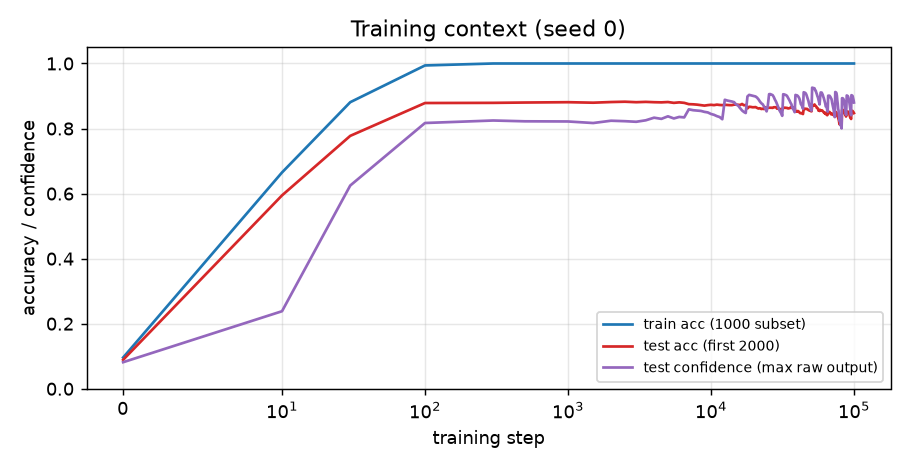
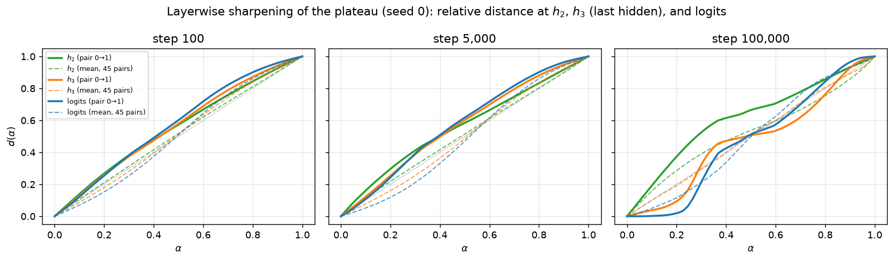
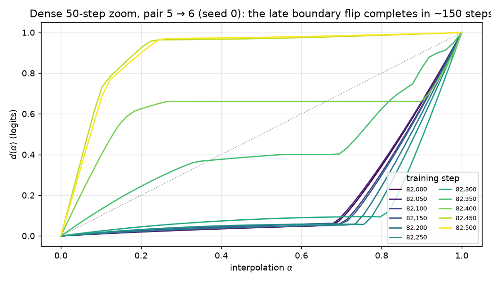
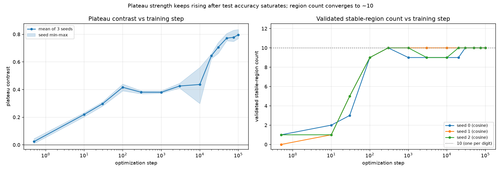

# Animating plateau formation through training in an MNIST MLP

## Summary

**Safety question.** Interpolate between the internal activations of two inputs and watch the
model's output: in trained networks the output often stays glued to one endpoint's output, then
snaps to the other across a narrow **boundary** — a *plateau → boundary → plateau* structure
("activation plateaus", after Shinkle & Heimersheim's post *Activation Plateaus: Where and How
They Emerge*). Plateaus mean the model's internal states are organized into discrete regions of
near-constant behavior. For safety this matters twice: plateaus make behavior *stable* (small
internal perturbations, including imperfect steering vectors, do nothing), and their boundaries
concentrate all the behavioral change (a tiny nudge across one flips the output). Knowing *when
during training* this discreteness appears — with generalization, or long after — tells us
whether it is a byproduct of learning the task or of continued overtraining.

**What we did.** We trained a small 4-layer ReLU MLP on 1,000 MNIST images for 100,000 steps,
saved 205 checkpoints (dense early steps, then every 500), and at every checkpoint ran exactly
the same frozen interpolation experiment: spherically interpolate the first-hidden-layer
activations of 55 fixed image pairs, patch each interpolated activation back into the network,
and record how the downstream layers and logits move between the two endpoint outputs. The
resulting per-checkpoint curves form a movie of plateau formation. Two extra seeds confirm the
picture; a deterministic 50-step-resolution rerun zooms into the largest late change.

**Findings.**

1. **At initialization there are no plateaus.** The relative-distance curve $d(\alpha)$ is the
   featureless diagonal: the random network morphs smoothly between the two outputs.
2. **Plateaus form gradually and mature long after test accuracy saturates.** Test accuracy
   reaches ~0.88 within a few hundred steps. The plateau structure is still soft then; it
   sharpens over tens of thousands of steps (plateau fraction ~0.34 at step 100 → 0.54–0.61 at
   100k; 22–29 of 45 cross-class pairs show textbook plateau→boundary→plateau curves at 100k).
   There is no sudden global transition, and pairs sharpen asynchronously.
3. **Late training keeps rearranging the boundaries, not the plateaus.** Even at step 80k+,
   boundary positions jump between adjacent 500-step frames; the largest jump (pair 5→6, steps
   82,000→82,500) is a complete boundary flip that completes within ~150 steps in a
   deterministic dense rerun. The discrete-region structure persists while its geometry keeps
   moving — concurrent with small late oscillations of test accuracy (0.88→0.85).
4. **Within-class controls show no boundaries.** 8/10 same-digit pairs keep a single predicted
   class along the entire path; the two exceptions have an endpoint the model genuinely
   misclassifies (so the path really does cross a decision boundary).
5. **A local-robustness control agrees.** Radial perturbations of natural activations
   (vs norm-and-sparsity-matched random activations) show flatness rising 0.42→0.80 from step
   100 to 100k — the same "robustness lags generalization" timing seen in the movie.

**Verdict: plateaus emerge gradually, not abruptly; different pairs do not synchronize; and
sharpening (plus outright boundary relocation) continues long after test accuracy stabilizes.**

## Methods

### Data, model, training

**Data.** MNIST, raw IDX files, pixels in $[0,1]$, flattened to 784-d. Training uses a fixed
1,000-image subset (drawn by `torch.randint` after `torch.manual_seed(seed)`, so the subset is
seed-determined). All evaluation — the interpolation endpoints and test accuracy — uses only
the **first 2,000 of the 10,000 test images** (per operator feedback 07161151).

**Model & training.** 4-layer ReLU MLP, 784→200→200→200→10 (ReLU after every linear layer
except the last; "hidden layer $L$" means the post-ReLU output of the $L$-th linear layer, so
$h_1, h_2, h_3$ are 200-d and $h_3$ is the last hidden layer). AdamW (lr $10^{-3}$, weight
decay 0.01), MSE loss on one-hot targets, batch 200, 100,000 steps. This reproduces the
training setup of *Deep Networks Always Grok* (arXiv:2402.15555) used throughout this branch.

**Checkpoints.** Seed 0 (primary): steps 0, 10, 30, 100, 300, then every 500 up to 100,000 —
205 checkpoints. Seeds 1–2 (confirmation): steps 0, 10, 30, 100, 300, then every 2,000 — 56
checkpoints. At every checkpoint we save the model `state_dict` and a self-contained record of
the frozen protocol below (relative-distance curves, per-point logits, predictions and softmax
probabilities, endpoint activations at every hidden layer; the full 50-point $h_1/h_2/h_3$
activation arrays additionally at 16 anchor steps — every frame is regenerable from the saved
state dicts either way, without retraining). `experiments/manifest_check.py` verifies every
expected file and field; all 205 + 56 + 56 records pass. Training is deterministic given the
seed: a from-scratch rerun reproduced the movie's records **bit-exactly**.

### The frozen interpolation protocol

**Pair bank (fixed before any results were seen).** One pair for each unordered pair of
distinct digits (45 cross-class pairs) plus one same-digit pair per digit (10 within-class
controls). For cross pair $(a,b)$ with $a<b$ we take the rank-$b$ test image of class $a$ and
the rank-$a$ test image of class $b$ (ranks in test-set order), so every pair uses distinct
images; within-class pairs use ranks 10 and 11. All indices land within the first 233 test
images. Pairs were never replaced after seeing results. The animation shows a fixed subset of
ten cross-class pairs chosen by digit identity in advance — (0,1), (2,3), (4,5), (6,7), (8,9),
(0,8), (1,7), (3,5), (4,9), (2,6), every digit appearing exactly twice; all 55 pairs are in the
saved records and the summary statistics.

**Interpolation (norm-rescaled SLERP).** For each pair we run both images through the
checkpointed model and take their post-ReLU first-hidden activations $h_1^A, h_1^B$. Straight
linear interpolation between two activations shrinks the vector's norm in the middle (the
midpoint of two nearly-orthogonal vectors is much shorter than either), which would push the
interpolant off-distribution for a reason that has nothing to do with plateaus. Following the
post's `slerp_rescale` convention (and this branch's `slerp_path`), we instead rotate the
direction along the great circle at constant angular speed and interpolate the norm linearly.
With $u_A = h_1^A/\lVert h_1^A\rVert$, $u_B = h_1^B/\lVert h_1^B\rVert$, and
$\theta = \arccos(u_A \cdot u_B)$:

```math
h_1(\alpha) = \Bigl[(1-\alpha)\,\lVert h_1^A\rVert + \alpha\,\lVert h_1^B\rVert\Bigr]\;
\frac{\sin\bigl((1-\alpha)\theta\bigr)\,u_A + \sin(\alpha\theta)\,u_B}{\sin\theta},
\qquad \alpha \in \{0, \tfrac{1}{49}, \dots, 1\}.
```

We use 50 evenly spaced $\alpha$ values including both endpoints. Because both sine
coefficients are non-negative, the interpolant of two non-negative (post-ReLU) vectors stays
non-negative — it remains a valid $h_1$. Each $h_1(\alpha)$ is **patched** in at hidden layer 1
and propagated through the rest of the network, recording $h_2$, $h_3$, and the logits.

**Relative endpoint distance** $d(\alpha)$ — answers "is the output stuck to one endpoint or
morphing smoothly?", and is the quantity animated in every figure. Raw distances are not
comparable across checkpoints (activation scales grow during training), so, following the post,
we measure at each recorded layer where the propagated activation $x(\alpha)$ sits *between*
the two endpoint outputs $x(0), x(1)$:

```math
d(\alpha) = \frac{\lVert x(\alpha) - x(0)\rVert_2}
{\lVert x(\alpha) - x(0)\rVert_2 + \lVert x(\alpha) - x(1)\rVert_2 + 10^{-10}}
```

$d$ runs from 0 (at the $A$-endpoint output) to 1 (at the $B$-endpoint output); the $10^{-10}$
only guards the $\alpha=0$ division. A **plateau → boundary → plateau** curve hugs 0, jumps
across a narrow $\alpha$ interval, and hugs 1; a smooth featureless response is the diagonal
$d(\alpha)\approx\alpha$ (drawn as a dotted reference in every figure). The primary animation
uses logit-space $d$ (closest analogue of the post's final-layer measurement); $h_2$ and $h_3$
curves are saved everywhere and shown in the layerwise figure. Sanity check at every
checkpoint: the patched $\alpha=0/1$ outputs reproduce the unpatched endpoint outputs
(max deviation 3.7e-4, float16 storage rounding); the vectorized SLERP matches the reference
`slerp_path` to 9.5e-7.

**Predicted class along the path.** For each of the 50 points we record
$\arg\max$ of the logits (shown as colored squares under each animation curve) and the max
softmax probability. This reveals *staircase* structure: paths that pass through a third
class's region on the way from $A$ to $B$.

**Plateau fraction** (the one curve-derived summary) — answers "when does plateau structure
emerge, and is the timing seed-stable?" (consumed by the seed-comparison figure and the table
in Results). The raw curves are the primary evidence and no per-curve "is a plateau" threshold
is imposed on them; but comparing three seeds' emergence timing needs one number per
checkpoint. We use the fraction of path points sitting near either endpoint's output, averaged
over the 45 cross-class pairs:

```math
\mathrm{PF}(t) = \frac{1}{45 \cdot 50} \sum_{p=1}^{45} \sum_{k=1}^{50}
\mathbf{1}\bigl[\,d_{t,p}(\alpha_k) < 0.1 \ \lor\ d_{t,p}(\alpha_k) > 0.9\,\bigr]
```

Reading it: the diagonal (no plateau) scores ≈ 0.20 — that is the floor, not zero, because the
diagonal itself spends its first and last tenth within 0.1 of an endpoint. A perfect two-plateau
step function scores 1. Higher = more of the path is "stuck" to an endpoint output.

**Confidence.** Training minimizes MSE to one-hot targets, so softmax probabilities saturate
near 0.23 and are uninformative as absolute confidence; we report the **maximum raw output**
(driven toward 1 for the target class) as confidence in the training-context figure and inset.

### Baselines

**Initialization (step 0)** is the built-in baseline of the movie: whatever structure the
curves show at step 0 is what random networks produce (empirically: the diagonal), so any
departure from it is learned.

**Diagonal reference** $d(\alpha)=\alpha$: the fully smooth, structure-free response, drawn
dotted in every curve figure; the plateau fraction of the empirical diagonal (≈ 0.20) is the
floor for PF.

**Within-class control pairs** (same digit): the path between two activations of the same
class should stay inside one region and cross no boundary; they calibrate what "no plateau
structure between distinct regions" looks like under the identical protocol.

**Matched-random activations** (perturbation control only): for the secondary radial-
perturbation experiment, each natural $h_1$ is compared to a random vector with the same L2
norm and the same number of positive entries (post-ReLU sparsity), so flatness beyond what
scale and sparsity mechanically produce is attributable to learned structure. Its scalar,
**plateau contrast** $=1-\overline{A_{\mathrm{data}}}/\overline{A_{\mathrm{rand}}}$ (area
under the small-radius response curve of natural vs matched-random activations, $\rho\le0.2$;
0 = no learned flatness, →1 = perfectly flat relative to control), is defined and validated in
this direction's earlier perturbation study; full definitions live in
`experiments/analyze_sweep.py`.

## Results

**Training context.** Train accuracy hits 1.0 by step ~100 (the 1,000-image subset is
memorized); test accuracy on the first 2,000 test images peaks at 0.88–0.90 by a few hundred
steps and then drifts slowly down (0.85–0.87 at 100k) with visible late oscillations.
Confidence (max raw output) keeps climbing after accuracy saturates. Every plateau development
below therefore happens in the *post-generalization* phase.



**The movie: plateaus grow out of a featureless diagonal.** One frame per checkpoint, ten
fixed pairs, logit-space $d(\alpha)$; squares under each curve give the predicted class at each
path point; the right panel tracks accuracy/confidence with the current step marked.


Static frames for reading without playback:


**Gradual consolidation, wandering boundaries.** The full-resolution heatmap (every checkpoint
as one row) shows both effects: plateaus (saturated blue/red) expand gradually over tens of
thousands of steps, and the white boundary stripe keeps shifting position throughout training —
including large late relocations. Within-class pairs (right two panels) show no comparable
two-plateau structure.


**Successive layers sharpen the same transition.** At a fixed checkpoint the transition gets
sharper the deeper you measure: $h_2$ is smoothest, $h_3$ sharper, logits sharpest. Early in
training all layers are near-diagonal; late in training the deep layers have hard plateaus
while $h_2$ still changes smoothly — the discreteness is built up depth-wise, not inherited
from layer 1.



**Consistent across seeds, with no synchronized transition.** Plateau fraction rises from the
diagonal floor (~0.20) through ~0.34 (step 100) and ~0.4 (step 10k) to 0.54–0.61 (step 100k) in
all three seeds — same gradual shape, no common jump time; the per-checkpoint fluctuations late
in training are the boundary relocations, not noise in the protocol (records are exact). The
overlaid raw curves show the same qualitative movie in every seed. Per-seed numbers are
tabulated in RESULTS.md.


**Late boundary flips are fast but not instantaneous.** The largest adjacent-frame change in
the movie (pair 5→6, between steps 82,000 and 82,500, seed 0) was rerun deterministically with
records every 50 steps (bit-exact match to the movie records at both ends). The boundary sits
near $\alpha\approx0.95$ until step ~82,300, then sweeps to $\alpha\approx0.1$ by step ~82,450,
passing through intermediate configurations — a ~150-step relocation, fast on the scale of the
500-step movie but resolved at 50-step resolution. At this point the model has been at
train-accuracy 1.0 for ~82,000 steps.



**Endpoint and control checks.** At step 100k, 9/90 cross-pair endpoints are misclassified
(consistent with 0.85 test accuracy; endpoints were fixed in advance and never filtered).
Within-class controls behave as predicted: 8/10 keep a single predicted class along the whole
path (no boundary), and the two exceptions (2→2, 7→7) each contain one endpoint the model
misclassifies — those paths genuinely start and end in different regions.

**Perturbation control (secondary).** The earlier radial-perturbation study in this direction
(13 log-spaced checkpoints, 3 seeds; norm-and-sparsity-matched random control) shows the same
timing from a different angle: plateau contrast rises 0.42 (step 100) → 0.80 (step 100k) while
test accuracy declines, the validated stable-region count converges to 10 (one per predicted
digit) by step ~300, and flatness tracks confidence, not correctness (confident-wrong 0.73 vs
confident-correct 0.85 vs uncertain 0.49 at 100k). Local robustness around natural activations
grows in step with the interpolation plateaus.



## Conclusion

In this MLP, activation plateaus are **not** present at initialization and are **not** created
at the moment the network generalizes. They emerge **gradually** out of a featureless diagonal
response: soft sigmoids appear within the first few hundred steps (while test accuracy is still
climbing), but genuine plateau→boundary→plateau structure — flat regions, sharp boundaries,
staircases through third-class regions — takes tens of thousands of further steps to mature,
long after test accuracy has saturated and begun to drift down. Different digit pairs sharpen
at different times (no synchronized transition), and the process never fully freezes: even past
step 80,000 the plateaus persist while their boundaries relocate in fast ~150-step events. The
within-class controls, the layerwise sharpening, and the matched-random perturbation control
all corroborate the same picture: training first solves the task, then continues to carve the
representation into increasingly discrete, confidently-held regions — including around
confidently *wrong* predictions.

**Limitations.** One architecture (d4/w200 MLP), one dataset (1,000-image MNIST subset,
MSE-on-one-hot training), three seeds; confirmation seeds use 2,000-step checkpoint spacing
(56 frames) rather than 500. The plateau fraction depends on its 0.1/0.9 margins (used only as
a cross-seed timing summary; all raw curves are saved and shown). Endpoint activations come
from test images the model may misclassify — deliberate, but it means a few "cross-class" paths
connect regions of the same predicted class. The dense 50-step zoom covers one interval of one
seed; other late flips were not individually resolved.
