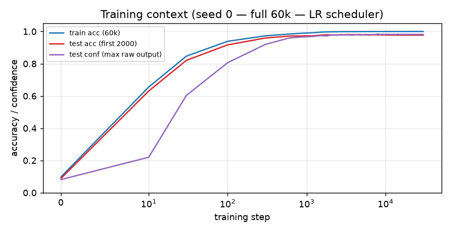
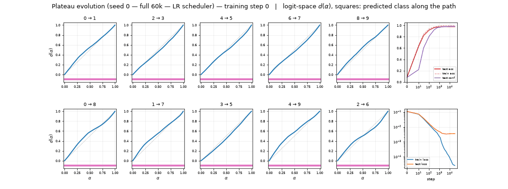
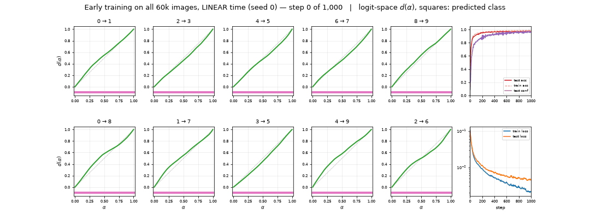
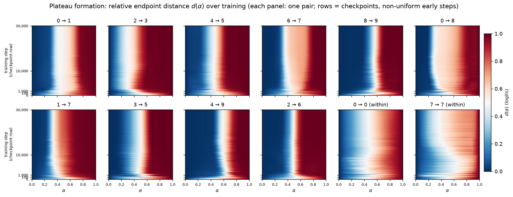
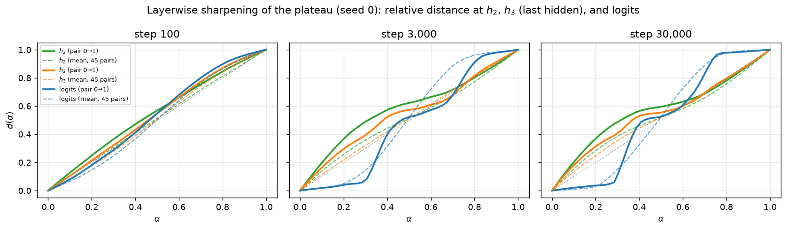
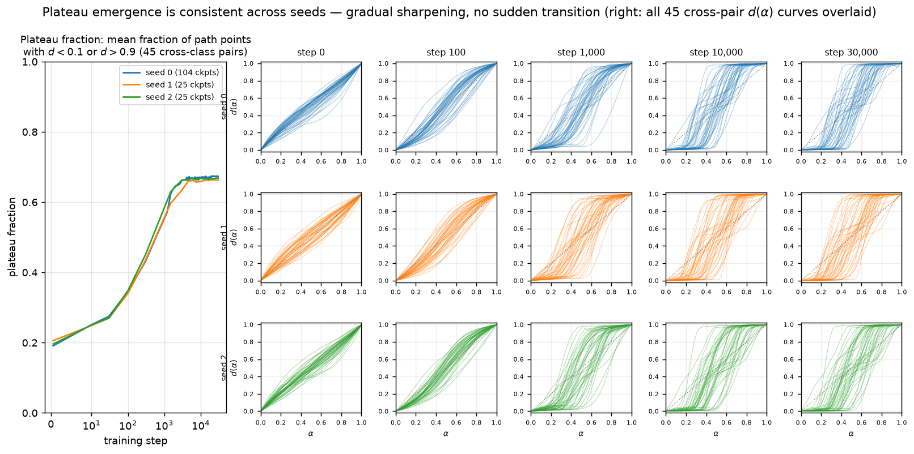

# Animating plateau formation through training in an MNIST MLP

## Summary

**The question.** Take two inputs, interpolate between their internal activations, and watch the
model's output. In trained networks the output often stays glued to one endpoint's output, then
snaps to the other across a narrow **boundary**. This *plateau → boundary → plateau* shape is an
"activation plateau" (Shinkle & Heimersheim, *Activation Plateaus: Where and How They Emerge*).
Plateaus mean the model organizes its internal states into discrete regions of near-constant
behavior. For safety this matters twice. Plateaus make behavior stable: small internal
perturbations, including imperfect steering vectors, do nothing. And boundaries concentrate all
the change: a tiny nudge across one flips the output. We ask *when during training* this
discreteness appears.

**What we did.** We trained a small ReLU MLP from scratch on the **full 60,000-image MNIST
training set** for 30,000 steps (100 epochs), under a learning-rate schedule chosen — by an
explicit scheduler search on this exact run — so that the training loss **decreases smoothly and
genuinely converges** (per operator feedback, only smoothly converged runs are interpreted in
this report). We saved 104 checkpoints, ran the identical activation-interpolation experiment on
fixed image pairs at every checkpoint, and rendered the result as a movie. We repeated the run on
two more seeds, repeated it with cross-entropy in place of the default MSE loss, measured how
well the network separates each digit pair (pairwise AUROC), and tracked a frozen bank of 50
unfiltered 3→5 interpolation paths chosen before seeing any result. A companion set of runs
trained from the *same initializations* on a fixed 1,000-image subset provides the comparison
for one dedicated section on the effect of training-set size.

**Findings.**

1. **No plateaus at initialization.** The interpolation curve of the random network is a
   featureless diagonal.
2. **Plateaus form early and keep sharpening for thousands of steps while the loss converges
   smoothly.** The plateau fraction (PF, share of path points near an endpoint's output;
   diagonal floor ≈ 0.20) rises from 0.19 at step 0 to 0.35 by step 100 and 0.43 by step 300 —
   the window in which test accuracy climbs to ~0.96 — and then keeps climbing to 0.62 by step
   1,500 and ~0.67 by step ~6,000, where it stays (final 0.674 / 0.663 / 0.668 across three
   seeds; test accuracy 0.9775 / 0.9795 / 0.9785). Emergence is gradual — no sudden global
   transition anywhere.
3. **The training loss decides *where* the plateaus live, not *whether* they exist.** Under the
   default MSE-on-one-hot loss the plateaus appear in logit space. Under cross-entropy the
   logits morph almost linearly along the path (logit-space PF 0.25 ≈ the 0.20 floor), but the
   *softmax probabilities* develop the sharpest plateau→boundary→plateau curves of this report
   (PF 0.90 at 30,000). Decision regions (the predicted class along the path) are
   piecewise-constant under both losses.
4. **Full data resolves the 3-vs-5 difficulty that dominated the small-data model.** On the
   1,000-image reference model, 3 vs 5 was the single hardest digit pair (worst pairwise AUROC of
   all 45, 0.977). With 60,000 images the model separates every pair almost perfectly: 3 vs 5
   reaches AUROC 0.9993 and drops to rank 4 of 45 (the worst pair is now 4 vs 9 at 0.9975), and
   its interpolation curve is a clean `3 | 5` two-plateau staircase. The "hard pair" was itself a
   small-data effect.
5. **Training-set size sets the ceiling.** The *same initializations* trained on a fixed
   1,000-image subset under the same schedule freeze at PF ≈ 0.37 within ~300 steps and never
   sharpen again; the full-data runs sail through that value and roughly double it. On the
   frozen 3→5 paths, full-data training corrects endpoints (49/50 vs 36/50 correct at matched
   step 30,000) and removes third-class detours; it does **not** merge same-class sub-plateaus.

**Verdict: activation plateaus are entirely learned and form early — during the same steps in
which the network fits the data — and, with enough data, they keep sharpening for thousands of
steps of smoothly converging training before freezing at roughly twice the small-data level.
The loss function chooses the output coordinates in which the discreteness is visible (logits
under MSE, probabilities under CE). The plateau geometry a converged model ends with is set by
the data budget, not by convergence itself.**

## Methods

### Data, model, training

**Data.** MNIST, pixels in $[0,1]$, flattened to 784 dimensions. The primary runs train on
**all 60,000 training images, shuffled without replacement each epoch** (one epoch = 300 steps
at batch 200; an assertion checks that the first epoch uses every index exactly once). All
evaluation — the interpolation endpoints and every test metric — uses only the **first 2,000 of
the 10,000 test images** (per operator feedback 07161151).

**Model & training.** 4-layer ReLU MLP, 784→200→200→200→10, with a ReLU after every linear
layer except the last. "Hidden layer $L$" means the post-ReLU output of the $L$-th linear
layer, so $h_1, h_2, h_3$ are 200-dimensional and $h_3$ is the last hidden layer. Optimizer:
AdamW (initial learning rate $10^{-3}$, weight decay 0.01). Loss: mean squared error (MSE) to
one-hot targets. Batch 200, 30,000 steps = 100 epochs. Model and optimizer reproduce the
training setup of *Deep Networks Always Grok* (arXiv:2402.15555) used throughout this branch.
Each run starts from a saved untrained initialization that is asserted, at startup, to be
bit-identical to a fresh re-derivation of that seed's initialization — so the runs are
verifiably from-scratch and exactly comparable with the 1,000-image reference runs that share
them (`experiments/train_full60k.py`).

**The learning-rate schedule (all primary runs).** Under the previously used fixed cosine
anneal ($10^{-3} \to 10^{-6}$ over 30,000 steps) the full-train loss is noisy: mid-run
transients reach 101× the loss's own running minimum, and the last 5,000 steps still span a
3.2× range. Operator feedback asked for a smoother schedule, so we ran a scheduler search on
this exact run (Results, first subsection) and selected PyTorch's `ReduceLROnPlateau` with
**factor 0.5 and patience 100**: after every optimization step $s$ we recompute the loss on the
full 60,000-image training set (the per-batch loss is far too noisy to monitor) and halve the
learning rate whenever it has not improved for 100 consecutive steps. With $\mathcal{L}_s$ the
full-train loss after step $s$ and $\mathcal{L}^{\ast}_s = \min_{u \le s} \mathcal{L}_u$ the
best loss so far:

```math
\eta_{s+1} =
\begin{cases}
\max\bigl(\tfrac{1}{2}\,\eta_s,\ 10^{-8}\bigr) &
\text{if } \mathcal{L}_u > (1 - 10^{-4})\,\mathcal{L}^{\ast}_u \text{ for the last 100 steps } u\\[2pt]
\eta_s & \text{otherwise.}
\end{cases}
```

This is the same schedule the earlier 1,000-image phase of this project selected in its own
five-candidate search, so the two regimes compared in the training-set-size section share their
scheduler as well as their initializations. The scheduler consumes no randomness, so every run
in this report shares its initialization and batch sequence with its counterparts of the same
seed. Under this schedule the seed-0 MSE learning rate halves 8 times between steps 1,402 and
20,844 (from $10^{-3}$ down to $3.9\times10^{-6}$), and the full-train loss decreases smoothly
to $2.6\times10^{-5}$, spike-free (largest transient 1.56× the running minimum, tail range
1.07).

**Smoothness and convergence metrics (for the scheduler search).** "Smooth" and "converged"
need numbers to compare schedules. We use the per-step full-train-loss trace. The **spike
ratio** at step $s$ compares the loss to the best loss so far — a perfectly monotone trace has
ratio 1, and a loss that jumps two orders of magnitude above its own record has ratio $10^2$:

```math
r_s = \frac{\mathcal{L}_s}{\min_{u \le s} \mathcal{L}_u}, \qquad
\mathrm{spike}_{\max} = \max_{s > 1000} r_s
```

(we also report the fraction of steps with $r_s > 2$). The **tail range** measures convergence:
the ratio of the largest to the smallest loss over the final 5,000 steps — a converged run has
tail range ≈ 1. Both are consumed by the scheduler-search table in Results.

**The cross-entropy (CE) variant.** To test whether the results depend on the unusual MSE
objective, we retrained seed 0 with the standard classification loss — cross-entropy, which is
the maximum-likelihood loss for a softmax classifier — keeping *everything* else identical,
including the schedule:

```math
\mathcal{L}_{\mathrm{CE}}(t) = -\frac{1}{N}\sum_{n=1}^{N}
\log\,\mathrm{softmax}\bigl(f(x_n;\theta_t)\bigr)_{y_n}
```

**Curve motion $M$ — testing "converged" on the plateau curves.** A flat loss alone does not
prove the plateau geometry stopped changing — a boundary can relocate without changing the loss
or the plateau fraction. So we measure how much the whole set of curves moves between adjacent
checkpoints $t_i, t_{i+1}$ (300 steps apart in the primary run), as the mean absolute change of
$d$ (defined below) over the 45 cross-class pairs and 50 path points:

```math
M(t_i) = \frac{1}{45\cdot 50}\sum_{p=1}^{45}\sum_{k=1}^{50}
\bigl|\, d_{t_{i+1},p}(\alpha_k) - d_{t_i,p}(\alpha_k) \,\bigr|
```

Read it as: $M \approx 10^{-2}$ means curves visibly jitter from frame to frame; $M \lesssim
10^{-4}$ means the movie has stopped. It is quoted in the Results text (late-training values).

**Accuracy, confidence, and loss.** These curves appear in Figures 1–2 and in the animation
insets. Let $f(x;\theta_t)\in\mathbb{R}^{10}$ be the logits at checkpoint $t$ and $y_n$ the
true label of image $x_n$. Accuracy is the fraction of correct argmax predictions:

```math
\mathrm{acc}(t) = \frac{1}{N}\sum_{n=1}^{N}\mathbf{1}\Bigl[\arg\max_i f_i(x_n;\theta_t) = y_n\Bigr],
```

with $N=60{,}000$ for train accuracy and $N=2{,}000$ (the first 2,000 test images) for test
accuracy. Loss is the training objective itself; for the MSE runs it is the MSE to the one-hot
target $e_{y_n}$:

```math
\mathcal{L}(t) = \frac{1}{10\,N}\sum_{n=1}^{N}\bigl\lVert f(x_n;\theta_t) - e_{y_n}\bigr\rVert_2^2
```

(the extra factor 10 is because `MSELoss` averages over the 10 output entries as well as over
images). Confidence needs care and differs between the losses. MSE-to-one-hot training drives
the target logit toward 1 rather than toward $+\infty$, so softmax probabilities saturate near
0.23 for every image and carry no information; for the MSE runs we therefore define confidence
as the **maximum raw output**, averaged over images:

```math
\mathrm{conf}_{\mathrm{MSE}}(t) = \frac{1}{N}\sum_{n=1}^{N}\max_i f_i(x_n;\theta_t).
```

Read it as: near 1 = the model puts a full-strength one-hot answer on some class; near 0 = no
class is asserted. CE training does the opposite — it grows logits without bound while
saturating the softmax probability — so for the CE run confidence is the standard **mean
maximum softmax probability**:

```math
\mathrm{conf}_{\mathrm{CE}}(t) = \frac{1}{N}\sum_{n=1}^{N}\max_i\,
\mathrm{softmax}\bigl(f(x_n;\theta_t)\bigr)_i .
```

**Checkpoints.** Seed 0 is the primary run. It saves checkpoints at steps 0, 10, 30, 100, then
every 300 (one per epoch) up to 30,000 — 104 in total. Seeds 1 and 2 are confirmation runs with
25 checkpoints each (same early steps, then every 1,500); the CE variant uses the full seed-0
schedule. Every checkpoint stores a self-contained record of the protocol below — the distance
curves, per-point logits, predictions and softmax probabilities, and the endpoint activations
at every hidden layer — plus model weights at 10 anchor steps. A built-in manifest check
verifies every expected file and field; all 337 records of the four primary runs and the
early-phase zoom pass. Training is deterministic given the seed. The **early-phase zoom**
(every 5 steps from 0 to 1,000, on a linear time axis; Figures 5–6) was recorded from a
deterministic rerun and is **bit-exact** for the primary run: the schedule's first LR reduction
happens at step 1,402, after the zoom window ends, and the zoom's records match the main run's
checkpoints exactly through step 1,000.

### The 1,000-image reference runs (for the training-set-size section only)

An earlier phase of this project ran the identical protocol on models trained from the **same
untrained initializations** on a fixed 1,000-image subset (drawn by `torch.randint` after
`torch.manual_seed(seed)`), 100,000 steps, batch 200, same optimizer, same
`ReduceLROnPlateau(0.5, 100)` schedule (chosen by that phase's own scheduler search), 205
checkpoints, seeds 0–2 plus a CE variant. These runs enter this report only in the
training-set-size section and its comparison figures; everything about them matches the primary
runs except the training set and the step count. To give the frozen 3→5 bank (below) a
1k-regime baseline, the converged 1k model was re-evaluated on the identical 105-pair bank at
its 16 anchor checkpoints.

### The frozen interpolation protocol

**Pair bank (fixed before any results were seen).** One pair for each unordered pair of
distinct digits (45 cross-class pairs) plus one same-digit pair per digit (10 within-class
controls). For cross pair $(a,b)$ with $a<b$ we take the rank-$b$ test image of class $a$ and
the rank-$a$ test image of class $b$ (ranks in test-set order); within-class pairs use ranks 10
and 11. All indices land within the first 233 test images. Pairs were never replaced after
seeing results. The animations show a fixed subset of ten cross-class pairs chosen by digit
identity in advance — (0,1), (2,3), (4,5), (6,7), (8,9), (0,8), (1,7), (3,5), (4,9), (2,6) —
with every digit appearing exactly twice; all 55 pairs enter the saved records and the summary
statistics.

**The frozen 3→5 bank.** The 3→5 pair is the model's hardest (Results), so the extension
tracks **50 deterministic 3→5 pairs** — the rank-$i$ test image of class 3 paired with the
rank-$i$ test image of class 5 (test-set order, within the first 2,000 test images),
$i = 0,\dots,49$ — fixed in advance and **not** filtered for endpoint correctness. Endpoint
predictions and confidences are saved at step 0 and every checkpoint.

**Interpolation.** For each pair we run both images through the checkpointed model and take
their post-ReLU first-hidden activations $h_1^A, h_1^B$. Straight linear interpolation would
shrink the vector's norm in the middle (the midpoint of two nearly-orthogonal vectors is much
shorter than either), pushing the interpolant off-distribution for a reason unrelated to
plateaus. Following the post's `slerp_rescale` convention (and this branch's `slerp_path`), we
instead rotate the direction at constant angular speed and interpolate the norm linearly
("spherical interpolation"). With $u_A = h_1^A/\lVert h_1^A\rVert$,
$u_B = h_1^B/\lVert h_1^B\rVert$, and $\theta = \arccos(u_A \cdot u_B)$:

```math
h_1(\alpha) = \Bigl[(1-\alpha)\,\lVert h_1^A\rVert + \alpha\,\lVert h_1^B\rVert\Bigr]\;
\frac{\sin\bigl((1-\alpha)\theta\bigr)\,u_A + \sin(\alpha\theta)\,u_B}{\sin\theta},
\qquad \alpha \in \{0, \tfrac{1}{49}, \dots, 1\}.
```

We use 50 evenly spaced $\alpha$ values including both endpoints. Both sine coefficients are
non-negative, so the interpolant of two non-negative (post-ReLU) vectors stays non-negative —
it remains a valid $h_1$. Each $h_1(\alpha)$ is **patched** in at hidden layer 1 and propagated
through the rest of the network, recording $h_2$, $h_3$, and the logits.

**Relative endpoint distance $d(\alpha)$ — the primary metric.** It answers: is the output
stuck to one endpoint, or morphing smoothly? Raw distances are not comparable across
checkpoints (activation scales change during training), so, following the post, we measure
where the propagated activation $x(\alpha)$ sits *between* the two endpoint outputs
$x(0), x(1)$:

```math
d(\alpha) = \frac{\lVert x(\alpha) - x(0)\rVert_2}
{\lVert x(\alpha) - x(0)\rVert_2 + \lVert x(\alpha) - x(1)\rVert_2 + 10^{-10}}
```

$d$ runs from 0 (output equals endpoint $A$'s output) to 1 (equals endpoint $B$'s); the
$10^{-10}$ only guards the $\alpha=0$ division. **Unless a figure says otherwise, $d(\alpha)$
is computed on the logits** — the closest analogue of the post's final-layer measurement; the
layerwise figure additionally shows $d$ at $h_2$ and $h_3$, which is saved at every checkpoint
too. For the CE comparison we also evaluate the same formula with
$x(\alpha) = \mathrm{softmax}$ of the logits — "$d$ in **probability space**" — because CE
saturates probabilities rather than logits, so logit distances and behavioral distances can
disagree (they do; see Results). Sanity checks: the patched $\alpha=0/1$ outputs reproduce the
unpatched endpoint outputs (max deviation 3.7e-4, float16 storage rounding); the vectorized
interpolation matches the reference `slerp_path` to 9.5e-7.

**Predicted class along the path.** For each of the 50 points we record the argmax of the
logits, shown as colored squares under each animation curve. This reveals *staircase*
structure: paths that pass through a third class's region on the way from $A$ to $B$.

**Segment metrics — answering the merge question without a plateau threshold.** The plan asks
whether sub-plateau structures "merge" as training or data change. The raw $d(\alpha)$ curves
stay the definition of plateau phenomenology; to compare 50 paths across runs we annotate each
path's predicted classes with three numbers, consumed by Figures 14 and 18. For a path with
predicted classes $c_1,\dots,c_{50}$, its **run-length encoding (RLE)** is the sequence of
maximal contiguous constant segments (e.g. `2,2,3,…,3,5,…,5` → `2 | 3 | 5`). The **segment
count** is the length of that sequence:

```math
\mathrm{seg} = 1 + \sum_{k=1}^{49} \mathbf{1}\left[c_{k+1} \neq c_k\right]
```

(2 = a clean two-region path; higher = staircase). The **third-class detour** indicator asks
whether the path visits a class that is neither endpoint's *prediction* — endpoint
misclassification alone must not count as a detour:

```math
\mathrm{detour} = \mathbf{1}\Bigl[\ \{c_1,\dots,c_{50}\} \setminus \{c_1, c_{50}\}
\neq \varnothing\ \Bigr]
```

**Endpoint correctness** is $\mathbf{1}[c_1 = 3 \land c_{50} = 5]$ (true labels of the bank).
The distinctions the plan requires: an **endpoint correction** is a change in $c_1$ or
$c_{50}$; a **segment disappearance** shortens the RLE; a **merge** is the narrow case where
two *non-adjacent segments of the same class* become contiguous. Only RLEs with a repeated
class (e.g. `3 | 2 | 3`) can merge, so we count those separately. All statements are about the
measured one-dimensional paths, not about global class-region topology.

**Plateau fraction PF — the one summary number.** Comparing emergence timing across seeds and
losses needs one number per checkpoint; the raw curves stay the primary evidence and no
per-curve "is it a plateau" threshold is imposed on them. We use the fraction of path points
sitting near either endpoint's output, averaged over the 45 cross-class pairs:

```math
\mathrm{PF}(t) = \frac{1}{45 \cdot 50} \sum_{p=1}^{45} \sum_{k=1}^{50}
\mathbf{1}\bigl[\,d_{t,p}(\alpha_k) < 0.1 \ \lor\ d_{t,p}(\alpha_k) > 0.9\,\bigr]
```

Reading it: the diagonal (no plateau) scores ≈ 0.20 — that is the floor, not zero, because the
diagonal itself spends its first and last tenth within 0.1 of an endpoint. A perfect
two-plateau step function scores 1. PF can be evaluated on $d$ in logit space or in probability
space; both appear in the loss-comparison figure (Figure 10).

### Pair-difficulty metrics (for the 3-vs-5 question)

The pair 3→5 has the least plateau-like curve of the ten animated pairs, which raises the
question: is the network genuinely worse at telling 3s from 5s, or does one odd curve just
reflect the two specific images we happened to fix? Test accuracy cannot answer this — it
aggregates over all ten classes. We need a *per-pair* discriminability score computed over many
images, and we compare it with two *per-pair* curve-shape scores computed from the single fixed
interpolation path.

**Pairwise AUROC** — how separable are classes $a$ and $b$ for this model? AUROC (area under
the receiver operating characteristic curve) is the probability that a random true-$a$ image
scores higher than a random true-$b$ image; 1.0 = perfectly separable, 0.5 = chance. We score
each image by its logit difference $s(x) = f_a(x) - f_b(x)$ and use the rank (Mann–Whitney)
estimator over the first 2,000 test images, restricted to images whose true label is $a$ or $b$
(roughly 200 of each; ties count one half):

```math
\mathrm{AUROC}(a,b) = \frac{1}{n_a n_b} \sum_{x \in a} \sum_{x' \in b}
\Bigl( \mathbf{1}\bigl[s(x) > s(x')\bigr] + \tfrac{1}{2}\,\mathbf{1}\bigl[s(x) = s(x')\bigr] \Bigr)
```

We also report the **pairwise confusion rate**: among true-$a$ and true-$b$ test images, the
fraction the model predicts as the *other* class of the pair.

**Curve-shape scores.** For each cross pair at step 30,000 we take (i) the **mid fraction** —
the share of the 50 path points with $0.1 < d(\alpha) < 0.9$, i.e. the complement of that
pair's plateau fraction, measuring how much of the path is spent away from the two endpoint
plateaus — and (ii) the **third-class fraction** — the share of path points whose predicted
class is neither $a$ nor $b$, measuring staircase detours through other digits' regions. Both
are correlated against AUROC across the 45 pairs (Spearman rank correlation) in Figure 13.

### Baselines

**Initialization (step 0)** — the built-in baseline of the movie: whatever the curves show at
step 0 is what random networks produce (empirically: the diagonal). Any departure from it is
learned.

**Diagonal reference** $d(\alpha)=\alpha$ — the fully smooth, structure-free response, drawn
dotted in every curve figure. Its plateau fraction (≈ 0.20) is the floor for PF.

**Within-class control pairs** (same digit) — a path between two activations of the same class
should stay inside one region and cross no boundary. They calibrate what "no structure" looks
like under the identical protocol.

### How to read the plots

> **All curve figures share one format.** X-axis: interpolation position $\alpha$ from 0 (image
> $A$) to 1 (image $B$). Y-axis: relative endpoint distance $d(\alpha)$, from 0 (output = $A$'s
> output) to 1 (output = $B$'s output), **computed on the logits unless labeled otherwise**
> (the CE figures also show $d$ on the softmax probabilities, always labeled). The gray dotted
> diagonal is the no-structure reference. A plateau → boundary → plateau curve hugs 0, jumps
> across a narrow $\alpha$ interval, and hugs 1. Colored squares under a curve give the
> predicted digit at each path point (matplotlib `tab10` colors, digit 0–9). Heatmaps show the
> same $d(\alpha)$ as color (blue 0 → red 1) with $\alpha$ on x and training step on y.
>
> **Primary metric:** $d(\alpha)$ at the logits. **Summary number:** plateau fraction PF.
> **Loss/pair-difficulty metrics** (their own Results subsections): probability-space $d$/PF,
> pairwise AUROC, mid fraction, third-class fraction. **Convergence metrics** (scheduler
> subsection): spike ratio, tail range, curve motion $M$. **Sub-plateau metrics** (3→5-bank and
> size subsections): segment count, third-class detour, endpoint correctness. In comparison
> figures the full-60k run is drawn **green** and the 1k-subset reference **blue**.

## Results

### Choosing a schedule that converges smoothly (the scheduler search)

Per operator feedback, results are interpreted only from training runs whose loss decreases
smoothly and converges. The previously used cosine anneal is not smooth on this run, so we
searched: three candidate schedules, all on seed 0 with identical initialization, data, and
batch order, scored on the metrics defined in Methods (per-step full-train loss over all 60,000
images; PF at the final checkpoint; final test accuracy):

| schedule | spike max | steps with $r_s>2$ | tail range | final train loss | PF (logit) at 30k | test acc |
|---|---:|---:|---:|---:|---:|---:|
| cosine anneal → $10^{-6}$ (previous) | 101.4 | 12.5% | 3.23 | $2.3\times10^{-7}$ | 0.644 | 0.9790 |
| ReduceLROnPlateau f=0.5 p=300 | 6.46 | 0.9% | 2.94 | $2.4\times10^{-7}$ | 0.679 | 0.9775 |
| **ReduceLROnPlateau f=0.5 p=100 (chosen)** | **1.56** | **0%** | **1.07** | $2.6\times10^{-5}$ | 0.674 | 0.9775 |

Only **factor 0.5 / patience 100** is genuinely smooth *and* converged: its loss never exceeds
1.56× its own running minimum and its last 5,000 steps span a 1.07× range (the cosine run
spikes to 101× and is still moving at the end; patience 300 rides each LR level longer and
keeps small spikes). The price is a higher final loss ($2.6\times10^{-5}$ vs $2.3\times10^{-7}$)
at equal test accuracy (0.9775 vs 0.9790) — the LR collapses once the loss stops improving at
the $10^{-4}$ relative threshold, which is the intended behavior. It is also the schedule the
1k phase of this project selected in its own five-candidate search, so the size comparison
below holds the scheduler fixed. It is the schedule of every run in this report. (The search
figure with the rejected spiky cosine trace stays on disk: `plots/lr_scheduler_search_60k.png`;
numbers in `results/lr_scheduler_search_60k.json`.)

Figure 1 documents the chosen schedule across all four primary runs. The per-step full-train
loss traces are smooth and flat at the end (left); the LR cascades from $10^{-3}$ to
$\sim 4\times10^{-6}$ in 8 halvings (middle; the MSE seeds start the cascade at step ~1,400,
the CE run at step ~1,300 (both cascades finish by ~23k)); test accuracy is flat from step ~1,500 on (right).


**Training context (seed 0).** Test accuracy climbs to 0.917 by step 100, 0.96 by step 300, and
saturates at ~0.978 from step ~1,500 on. Train accuracy tracks it closely (0.9999 at step
30,000 — with 60,000 images the model never fully memorizes, unlike the 1k regime's exact 1.0
at step 145). Confidence (mean max raw output) saturates at ~0.98.



### The movie: structure grows out of a featureless diagonal, sharpens for thousands of steps, then freezes

One frame per checkpoint (104 frames), ten fixed pairs, training step in the title; insets
track accuracy/confidence (top) and train/test loss (bottom, both smooth) with the current step
marked. At step 0 every curve is the diagonal. Within the first tens of steps the curves bow
into soft sigmoids; unlike the small-data regime (last subsection), they then **keep
sharpening for thousands of steps**: PF rises 0.19 (step 0) → 0.35 (100) → 0.43 (300) → 0.62
(1,500) → 0.66 (3,000) → ~0.67 (6,000), and stays there to the end (0.674 at 30,000; peak
0.674 at step ~27,000). The curves develop genuinely flat plateaus, near-vertical boundaries, and visible
intermediate sub-plateaus (mid-level shelves at $d\approx0.5$ where the path crosses a third
class's region). Late in training the movie is a still image: mean curve motion per 300-step
gap over the last 3,000 steps is $M = 7.6\times10^{-4}$.



Static frames for reading without playback — the step-10,500 and step-30,000 rows are nearly
identical:


### The early phase on a linear time axis — where the structure is laid down

The main movie's schedule compresses the beginning. To watch training start, we recorded a
deterministic rerun **every 5 steps from 0 to 1,000** — 201 frames on a linear time axis. This
zoom is bit-exact for the primary run (the schedule's first LR cut comes later, at step 1,402;
verified at all seven overlapping checkpoints). The diagonal deforms within the first tens of
steps; curves wobble rapidly while the loss falls fastest, then settle into stable shapes that
subsequent training only sharpens. PF: 0.19 (step 0) → 0.26 (25) → 0.35 (100) → 0.39 (200) →
0.43 (300) → 0.48 (500) → 0.56 (1,000) — on 60k data the early phase ends with the plateau
fraction still climbing (the 1k regime freezes at ~0.37 in this window).




The full-run heatmap (Figure 7) shows the same at full scale: each pair's color pattern is laid
down in the first few hundred steps (bottom sliver of each panel), the boundary — the white
stripe — sharpens and drifts slightly over the next few thousand steps, then runs vertically
(frozen) to 30,000. Within-class pairs (rightmost panels) never develop a comparable
two-plateau structure.



### Depth sharpens the transition; seeds agree

At a fixed checkpoint the transition gets sharper the deeper you measure: $d$ at $h_2$ is
smoothest, at $h_3$ sharper, at the logits sharpest. Early in training all layers are
near-diagonal. The discreteness is built up depth-wise, not inherited from layer 1. This is the
only figure where $d$ is shown at hidden layers.



All three seeds tell the same story: PF rises from the ~0.20 floor through ~0.43 at step 300 to
~0.67 by step ~6,000 and stays there (final values 0.674 / 0.663 / 0.668); the 45-pair curve
fans are visually indistinguishable across seeds at matched steps. Emergence is gradual — there
is no sudden global transition anywhere. Final test accuracies: 0.9775 / 0.9795 / 0.9785.



**Endpoint and control checks.** At step 30,000 the seed-0 model misclassifies **0 of the 90**
cross-pair endpoints (0 and 0 on seeds 1–2) — endpoints were fixed in advance, never filtered.
Within-class controls behave as predicted: 9/10 on all three seeds paths keep a single predicted class along the
whole path, and every exception contains one endpoint the model genuinely misclassifies, so
those paths really do cross a decision boundary.

### Why the loss keeps falling at constant accuracy — and the cross-entropy version

**The explanation is generic, not an MSE artifact.** Accuracy only checks the *argmax* of the
10 outputs; the loss measures how far the whole output vector is from its target. Once nearly
every training image is argmax-correct, accuracy is pinned near 1.0, but the outputs are still
far from the exact targets, so gradient descent keeps shrinking that residual — under MSE
toward the exact one-hot vectors, under CE by growing the true-class probability toward 1. The
CE rerun (identical init, data, batch order, and schedule; only the loss changed) reproduces
the picture: train accuracy is 1.0 from its step-300 checkpoint while CE train loss keeps falling smoothly until the LR
collapses (final $1.7\times10^{-4}$, spike-free). Test accuracy: 0.9735 (CE) vs 0.9775 (MSE).


**CE relocates the plateaus from logit space to probability space — and they are sharp.** In
logit space the CE run barely leaves the diagonal: its PF stays at 0.25–0.26 throughout
training (floor ≈ 0.20) — CE growing the logit norms continuously along the path linearizes
logit-space distances. But measure the same paths in probability space (softmax of the same
logits) and the curves are the sharpest of this report: PF$_{\rm prob}$ = 0.18 (step 0) → 0.55 (100) → 0.67 (300) → 0.80 (1,500) → 0.87 (6,000) → **0.90 (30,000)**. The MSE
run agrees across spaces (its outputs already sit near the one-hot simplex). And the decision
regions along the path (colored squares) are piecewise-constant with a few sharp switches under
both losses. So the loss determines in which output coordinates the discreteness is visible;
the underlying decision-region structure is common.


The full CE animation (same format as Figure 3, logit-space $d$, CE insets) shows the
near-diagonal logit curves persisting through all 104 checkpoints while the predicted-class
squares still snap between discrete regions:


### Is 3 vs 5 actually harder? Pairwise AUROC and the shape of the 3→5 curve

The pair 3→5 has the least plateau-like interpolation curve of the ten animated pairs, and on
the 1,000-image reference model it was genuinely the hardest digit pair (worst AUROC of all 45;
see the training-set-size section). **With the full 60,000 images that difficulty is gone.** On
the seed-0 full-data model at step 30,000, 3 vs 5 reaches AUROC **0.9993** over the first 2,000
test images and ranks **4 of 45** from the worst (the worst pair is now 4 vs 9 at 0.9975, then
2 vs 7 at 0.9986 and 7 vs 8 at 0.9992); its pairwise confusion rate is just **0.8%** (the 1k
model's was 6%). The same holds under CE: AUROC(3,5) = **0.9998**, with 2 vs 7 (0.9988) the
hardest CE pair. Every pair now sits above 0.997, so no digit pair is meaningfully hard for the
full-data model.

The 3→5 curve reflects this: at step 30,000 it is a clean two-segment `3 | 5` staircase with
both endpoints correctly classified, spending only 36% of its length between the endpoint
plateaus (mid fraction 0.36, versus 0.84 on the 1k model). Across all 45 pairs, curve shape is
only a weak proxy for pair difficulty when every pair is near-perfectly separated (Spearman
correlation of AUROC with the mid fraction 0.35, with the third-class fraction −0.03) — one
fixed image pair per digit pair is a noisy readout, which is why the difficulty question is
answered with AUROC over ~400 images per pair rather than with the single curve.


### The frozen 3→5 bank: fifty hardest-pair paths through training

The 50-path bank tracks how the hardest pair's sub-plateau structure evolves. No path has
correct endpoint predictions at step 0 (the untrained net predicts one class for everything),
so the preregistered "already correct at step 0" subset is empty and we report all 50 paths. By
step 30,000 the model predicts both endpoints correctly on **49/50** paths, the mean run-length
segment count is **1.98** (2 = a clean two-region path), **no** path retains a third-class
detour, and no path at any checkpoint has a repeated-class RLE — the only pattern that could
merge. The original 3→5 pair ends as a clean `3 | 5` two-plateau curve in all three seeds
(`3 | 5` in all three seeds).


### The effect of training-set size (the 1,000-image reference)

An earlier phase of this project ran the identical protocol on the **same initializations**
trained on a fixed 1,000-image subset (Methods). Everything above replicates there with one
decisive difference — *when the sharpening stops*. This section is the summary of that
comparison; it is the report's explanation of why the data budget matters.

**Fitting vs plateau sharpening.** The 1k model memorizes its subset (train accuracy 1.0 at
step 145) and its test accuracy freezes at 0.881; the 60k model reaches test accuracy 0.978.
More importantly for the plateau story: the 1k runs' plateau fraction freezes at **0.35–0.37
within ~300 steps** — the step at which the subset is essentially fit — and stays there for the
remaining 99,700 steps of converged training (late curve motion $5.6\times10^{-7}$ per
500-step gap; the freeze replicates on seeds 1–2 and, in probability space at PF 0.863, under
CE). The 60k runs pass PF 0.37 shortly after step 300 and roughly double it. Same
initialization, same schedule, same protocol — the only change is the data, so the converged-PF
ceiling of the small-data regime is a **small-data effect, not a property of convergence**.
Sharpening continues exactly as long as there is still unfit data to carve.


Aligned frame-by-frame at common optimizer steps, the two regimes are indistinguishable through
step ~100 — the diagonal bows into the same soft sigmoids from the same initialization. Then
they diverge: the 1k run freezes at its soft-sigmoid stage while the 60k run keeps sharpening
into flat plateaus and near-vertical boundaries:


**On the frozen 3→5 bank, more data means correct endpoints — not merged sub-plateaus.** At
matched step 30,000 the full-data model predicts both endpoints correctly on **49/50** paths;
the converged 1k model manages **36/50** (and does not improve by step 100,000). Everything
else about the sub-plateau structure is similar: mean segment count 1.98 (60k) vs 1.90 (1k);
third-class detours 0% (60k) vs 2% (1k) of paths at the final checkpoint; and repeated-class
RLE patterns — the only configurations that *could* merge — occur on **no** path of either run
at the final checkpoint (and never at any checkpoint of the smooth 60k run). The original 3→5
pair is the picture in miniature: `2 | 3 | 5` under 1k training (misclassified "3" endpoint,
detour through the 3-region) becomes the clean `3 | 5` two-plateau curve of Figure 14 in all
three full-data seeds. Per the plan's operational definitions, that is an **endpoint correction
plus a segment disappearance**, not a merge of same-class sub-plateaus — and with only 1-D
paths we make no claim about global region topology.

![Figure 18. The frozen 50-path 3->5 bank: full-60k vs 1k. Top left: the original 3->5 pair at matched step 30,000 (green 60k = clean plateau pair '3|5'; blue 1k = '2|3|5' staircase; predicted-class squares for both below). Top right: all 50 paths at step 30,000 (green 60k vs blue 1k). Bottom left: run-length segment count vs step (60k mean with IQR band; 1k mean at anchor steps). Bottom right: third-class detour fraction (solid) and endpoints-correct fraction (dashed) vs step for both runs - endpoint correctness is the dominant difference (49/50 vs 36/50).](plots/full_mnist_3v5_summary.png)

## Conclusion

Activation plateaus in this MLP are entirely learned, and they are learned **early and
gradually**: absent at initialization, forming during the same first few hundred steps in which
the network fits most of the data, then — with the full 60,000-image training set — continuing
to sharpen for thousands of steps of smoothly converging training (PF 0.19 → 0.43 by step 300 →
~0.67 from step ~6,000 on) before freezing, consistently across three seeds. The loss chooses
the coordinates: MSE carves its plateaus directly into the logits, CE carves sharp ones into
the softmax probabilities while leaving logit space near-diagonal, with the same
piecewise-constant decision regions underneath. Training-set
size sets the ceiling: the same initializations trained on 1,000 examples freeze at PF ≈ 0.37
the moment the subset is fit, while full-data training doubles that — so the plateau geometry a
converged model ends with reflects how much data it actually had to fit, not convergence
itself. The 3-vs-5 pair that was the 1k model's single hardest (worst AUROC of 45, 0.977) is
near-perfectly separated by the full-data model (AUROC 0.9993, rank 4/45) — pair difficulty was
a small-data effect too. On the frozen 50-path 3→5 bank the benefit of full data is almost
entirely **endpoint
correction** (49/50 vs 36/50 correct endpoint pairs) plus the disappearance of third-class
detours — we found no same-class sub-plateau merges on any measured path. For a safety reader
the summary is: in this model, output discreteness is a product of fitting, its sharpness grows
with the data actually being fit, its late-training stability comes with convergence, and the
coordinate in which the discreteness is visible is set by which loss saturates that coordinate.

**Limitations.** One architecture (depth-4, width-200 MLP), one dataset (MNIST; 60,000 images
vs a 1,000-image subset for the size comparison), three MSE seeds per regime; the CE variant
and the early-phase zoom are seed 0 only; pairwise AUROC is reported at the final checkpoint.
The scheduler search compared three candidates (constant LR was already known to be badly
non-smooth from the 1k phase and was not rerun). The plateau fraction depends on its 0.1/0.9
margins (used only as a cross-run timing summary; all raw curves are saved and shown).
Endpoints come from test images the model may misclassify — deliberate, but a few "cross-class"
paths therefore connect regions of the same predicted class. Sub-plateau conclusions are
statements about the measured one-dimensional interpolation paths, not about global
class-region topology. The preregistered "endpoints already correct at step 0" subset of the
3→5 bank turned out to be empty (an untrained network classifies nothing correctly), so it
could not be reported separately.
