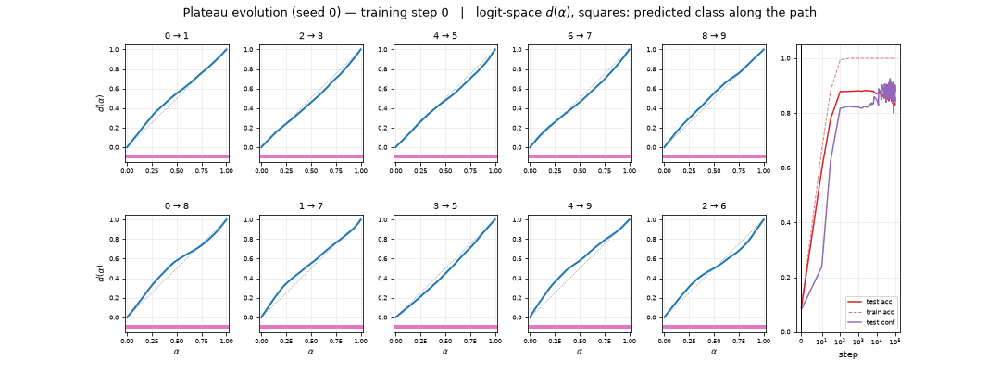
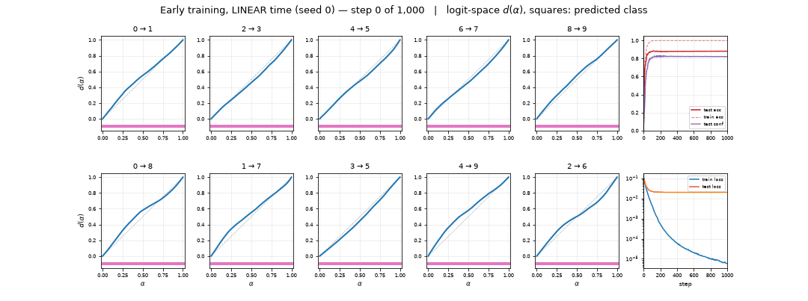
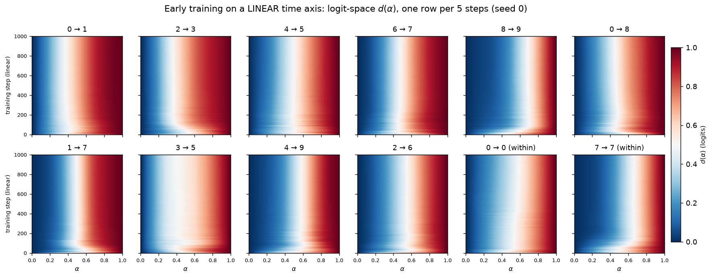
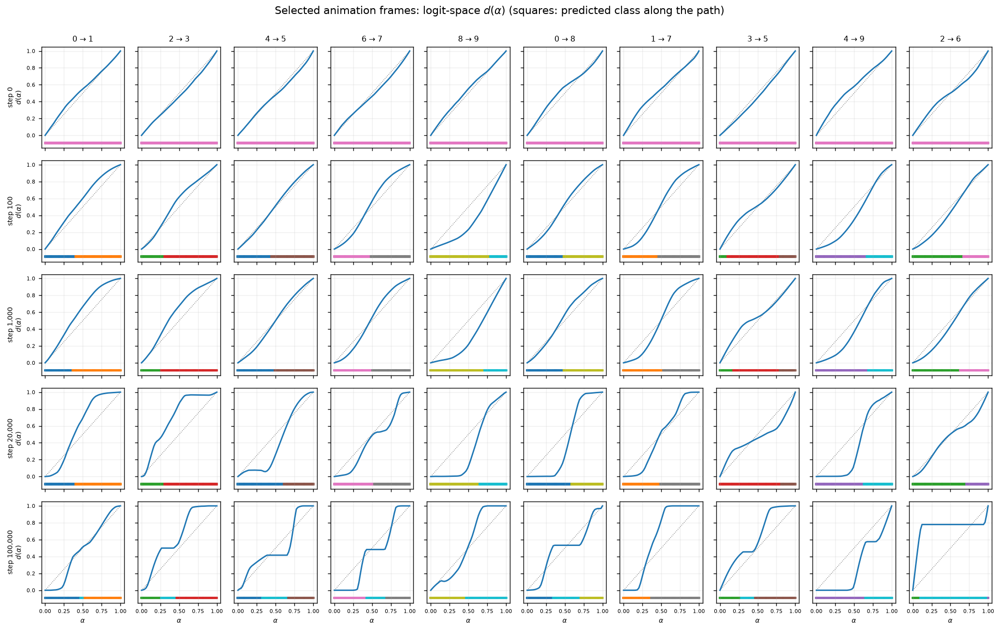
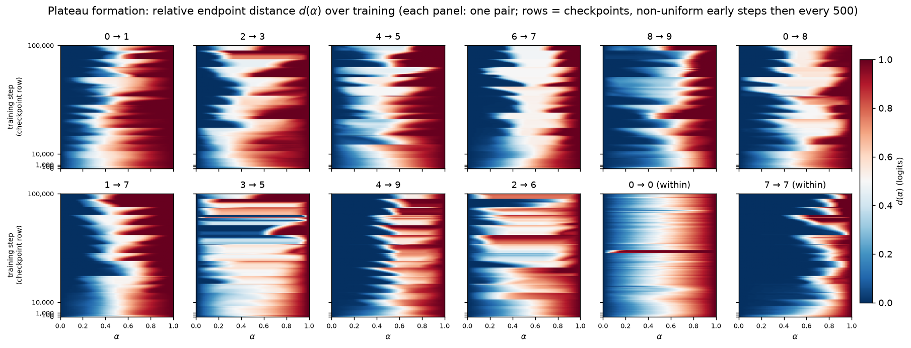
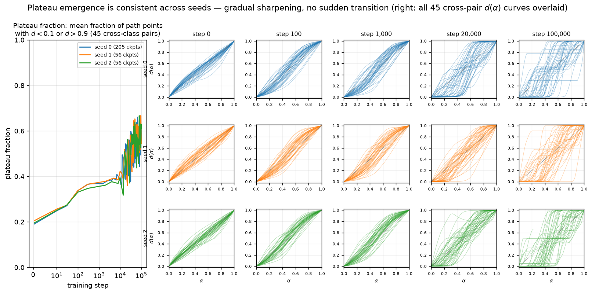
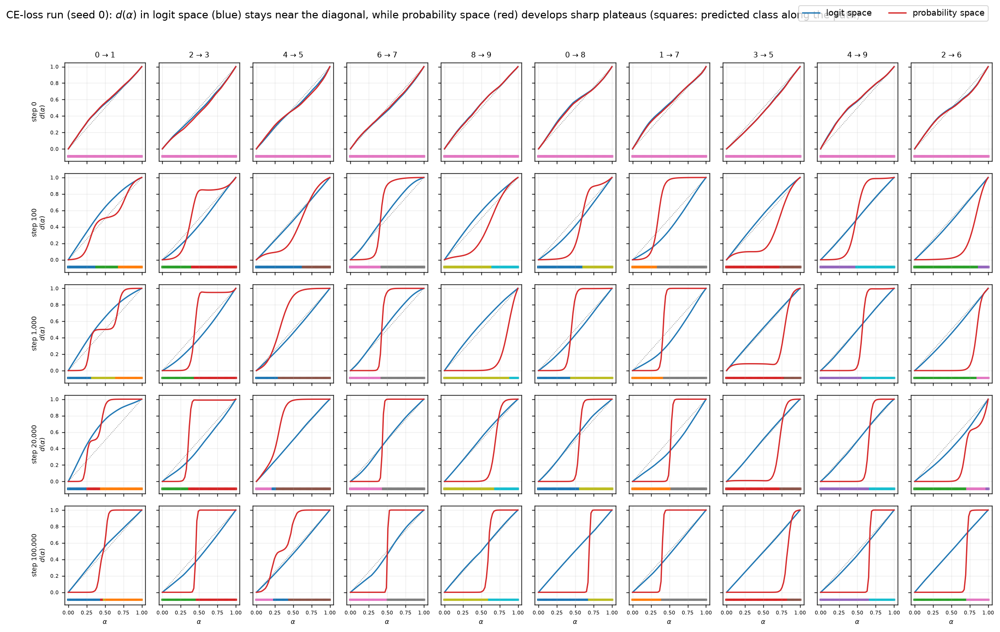
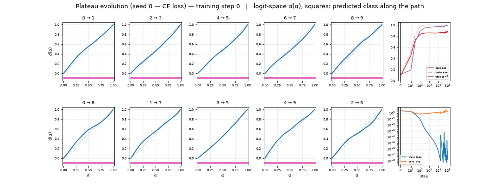
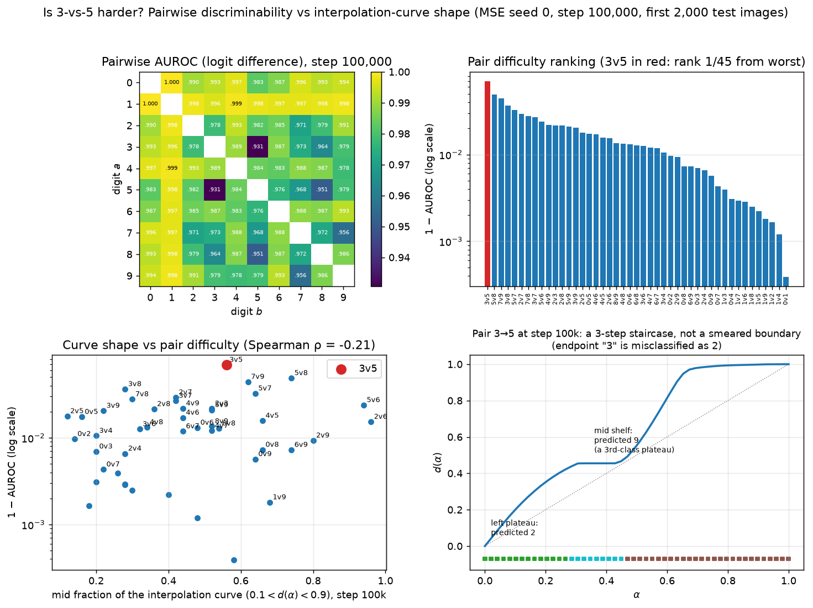

# RESULTS — Animating plateau formation through training (MNIST MLP)

> CURRENT-BEST ONLY. History lives in CHANGELOG.md. Full definitions in REPORT.md.
> Model: 4-layer ReLU MLP (784→200→200→200→10), 1,000-sample MNIST subset, AdamW
> (lr 1e-3, wd 0.01), MSE on one-hot, batch 200, 100k steps; plus a CE-loss (cross-entropy)
> rerun of seed 0 with identical init/data/batch order. Primary protocol: 50-point
> norm-rescaled SLERP between the post-ReLU first-hidden activations $h_1$ of two fixed test
> images, patched at $h_1$ and propagated; $d(\alpha)$ = relative L2 distance of the
> propagated **logits** to the two endpoint outputs (logit-space in every figure unless
> labeled otherwise; the CE figures also show $d$ on the softmax probabilities). 55 fixed
> pairs (45 cross-class, 10 within-class), all endpoints from the **first 2,000 test images**
> (operator feedback 07161151). Seed 0: 205 checkpoints (steps 0, 10, 30, 100, 300, then
> every 500 to 100k) plus two deterministic dense reruns (every 5 steps 0–1,000; every 50
> steps 82,000–82,500), both bit-exact vs the movie records; seeds 1–2: 56 checkpoints
> (every 2,000); CE seed 0: full 205-checkpoint schedule. All 317 MSE movie records verified
> complete by `experiments/manifest_check.py`. Additionally (feedback 07161721): seed-0 MSE and
> CE reruns with ReduceLROnPlateau (halve LR after 10 steps without full-train-loss improvement,
> relative threshold $10^{-4}$, min LR $10^{-8}$), full 205-checkpoint schedule, identical
> init/data/batches to their constant-LR twins.

## Headline

**Plateaus form gradually and keep sharpening (and moving) long after test accuracy has
stabilized — and the training loss decides *where* they live, not *whether* they exist.** At
initialization $d(\alpha)$ is the featureless diagonal — no plateaus. Test accuracy saturates
at ~0.88 by step ~70–120 (train accuracy 1.0 at step 145), but plateau–boundary–plateau
structure matures over tens of thousands of steps: the plateau fraction (share of path points
with $d<0.1$ or $d>0.9$; diagonal baseline ≈ 0.20) rises from ~0.20 at init to ~0.34 (step
100), ~0.4 (step 10k), and 0.54–0.61 at 100k across all three seeds, with no sudden global
transition. By 100k, 22–29 of 45 cross-class pairs show a textbook plateau→boundary→plateau
curve, many as multi-step staircases through third-class regions. Late in training the
plateaus persist but their **boundaries keep relocating abruptly**: the largest movie jump
(pair 5→6, steps 82,000→82,500, seed 0) is a complete boundary flip that the
50-step-resolution rerun resolves to ~150 steps. Within-class controls stay boundary-free
(8/10 pairs keep one predicted class along the whole path; the 2 exceptions have a genuinely
misclassified endpoint). The radial-perturbation control replicates the timing: plateau
contrast vs matched-random activations rises 0.42→0.80 between step 100 and 100k while test
accuracy declines.

**Early phase (linear time, every 5 steps, 0–1,000):** the diagonal deforms within the first
tens of steps; curves flicker rapidly while the loss falls fastest (first ~150–200 steps),
then settle into stable soft sigmoids. Plateau fraction: 0.19 (step 0) → 0.27 (25) → 0.34
(100) → ~0.37 (200–1,000, nearly frozen) — the early phase builds the soft structure, the
flattening into true plateaus happens over the following tens of thousands of steps.

**Loss comparison (feedback 07161650):** train accuracy is flat at 1.0 while train loss keeps
falling because accuracy only checks the argmax — the residual to the target keeps shrinking
under *any* loss. The CE rerun reproduces it exactly (train acc 1.0 from its step-300
checkpoint; CE train loss $1.7\times10^{-8}$ at 100k vs MSE $4.0\times10^{-9}$; CE test acc
0.881 vs MSE 0.848). Under CE the **logit-space** curves stay near the diagonal all through
training (PF 0.22 at 100k ≈ the 0.20 floor), but the same paths in **probability space**
(softmax) have the sharpest plateaus of any run: PF 0.89 at 100k vs 0.55 for MSE (MSE agrees
across spaces: 0.556 logit / 0.550 prob). Decision regions along the path are
piecewise-constant under both losses. MSE carves plateaus into the logits; CE carves them —
earlier and harder — into the probabilities.

**LR scheduler — training converges, plateau sharpening stops (feedback 07161721):** at a
constant LR the full-train loss never converges — from step ~2,000 (MSE) / ~10,000 (CE) it
spikes over 3–4 orders of magnitude to the end. With ReduceLROnPlateau the loss levels into a
genuine plateau: the LR halves 16 times (MSE: steps 767→1,949; CE: 4,350→11,298), landing at
$1.5\times10^{-8}$, and the loss trace goes flat ($2.9\times10^{-6}$ MSE / $2.4\times10^{-7}$
CE, spike-free). The plateau curves converge with it: late curve motion (mean $|\Delta d|$ per
500-step gap, checkpoints ≥ 50k) drops $2.4\times10^{-2} \to 3.2\times10^{-6}$ (MSE, logit
space) and $8.8\times10^{-3} \to 1.3\times10^{-4}$ (CE, probability space); no late boundary
flips remain. But the sharpening stops with the chaos: scheduled-MSE PF freezes at **0.37** —
the constant run's value at LR collapse (~step 2k) — vs 0.556 at constant LR; scheduled-CE
keeps its early-formed probability plateaus (PF 0.856 vs 0.892). Side effect: scheduled MSE
generalizes better (final test acc 0.8795, pinned from step ~1,000, vs 0.8475 constant — the
late test-acc decline is a constant-LR effect; CE: 0.8595 scheduled vs 0.881 constant).

**Is 3 vs 5 harder? (feedback 07161650):** yes — AUROC(3,5) = **0.9306 over the first 2,000
test images, the worst of all 45 digit pairs** (next: 5v8 0.9512, 7v9 0.9558; median 0.987;
best 0v1 1.0000); pairwise confusion 5.2%. Also worst under CE (0.9755). But the odd 3→5
curve is a *staircase*, not a smeared boundary: its "mid-level plateau" ($d\approx0.45$ for
~11 points) is a genuine activation plateau of a third class (predicted 9), and its left
endpoint "3" is genuinely misclassified as 2. Curve shape only weakly predicts pair
difficulty across the 45 pairs (Spearman of AUROC vs curve mid-fraction $-0.21$, vs
third-class fraction $-0.48$).

## Plateau fraction and test accuracy (seeds 0 / 1 / 2, MSE)

| step | plateau fraction (s0 / s1 / s2) | test acc on first 2,000 (s0 / s1 / s2) |
|-----:|:-------------------------------:|:--------------------------------------:|
|       0 | 0.19 / 0.21 / 0.20 | 0.089 / 0.097 / 0.109 |
|      10 | 0.25 / 0.26 / 0.25 | 0.595 / 0.654 / 0.594 |
|     100 | 0.34 / 0.34 / 0.33 | 0.878 / 0.891 / 0.877 |
|   1,000 | 0.37 / 0.37 / 0.35 | 0.881 / 0.891 / 0.886 |
|  10,000 | 0.38 / 0.42 / 0.39 | 0.873 / 0.896 / 0.889 |
|  20,000 | 0.53 / 0.41 / 0.41 | 0.865 / 0.871 / 0.882 |
|  50,000 | 0.47 / 0.65 / 0.64 | 0.854 / 0.873 / 0.869 |
| 100,000 | 0.56 / 0.54 / 0.61 | 0.848 / 0.869 / 0.858 |

Plateau fraction = mean over the 45 cross-class pairs of the fraction of the 50 path points
with $d<0.1$ or $d>0.9$ (the one curve-derived summary; a straight diagonal scores ≈ 0.20, a
perfect two-plateau step function scores 1). CE seed 0 for comparison, logit / probability
space: 0.19/0.19 (step 0), 0.25/0.35 (100), 0.26/0.51 (1,000), 0.26/0.77 (10,000), 0.22/0.89
(100,000). Protocol checks: patched $\alpha=0/1$ outputs reproduce the unpatched endpoint
outputs to 3.7e-4; the vectorized SLERP matches the branch `slerp_path` to 9.5e-7; both dense
reruns reproduce the movie records bit-exactly.

## Figures

All curve/heatmap figures: x = interpolation $\alpha$ (0 = image A, 1 = image B), $d$ =
logit-space relative endpoint distance unless labeled otherwise; squares under curves =
predicted class.

## MSE vs cross-entropy (seed 0, identical init/data/batches)

## Constant LR vs ReduceLROnPlateau (seed 0, MSE + CE)

## Pairwise AUROC: 3 vs 5 (seed 0, step 100k)

## Perturbation control (secondary; 13 log-spaced checkpoints, 3 seeds)

Local-robustness control consistent with the interpolation movie: plateau contrast of natural
$h_1$ activations vs norm-and-sparsity-matched random activations rises 0.42 (step 100) →
0.80 (step 100k) while the validated stable-region count converges to 10 (one per predicted
digit) by step ~300; contrast tracks confidence, not correctness (confident-wrong 0.73 vs
confident-correct 0.85 vs uncertain 0.49 at 100k).

