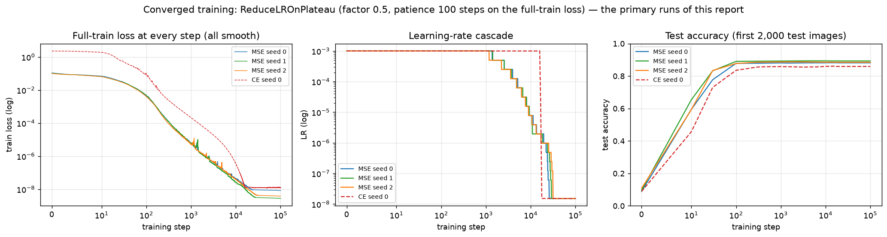
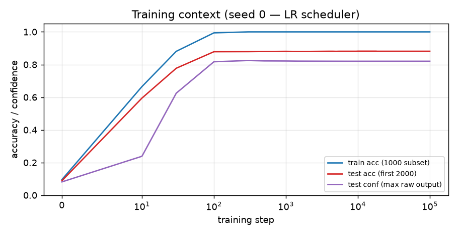
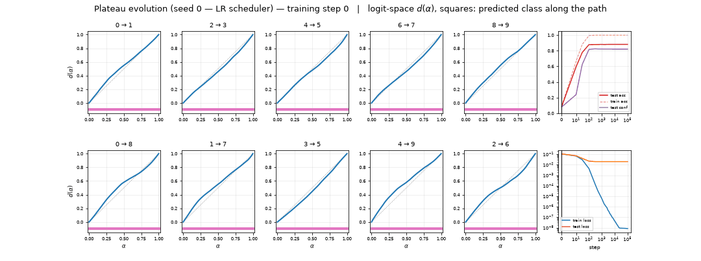
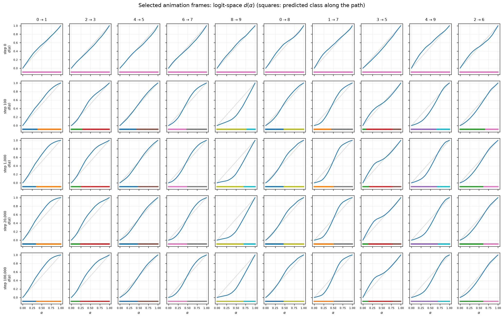
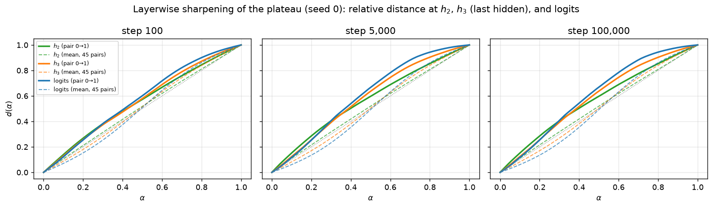
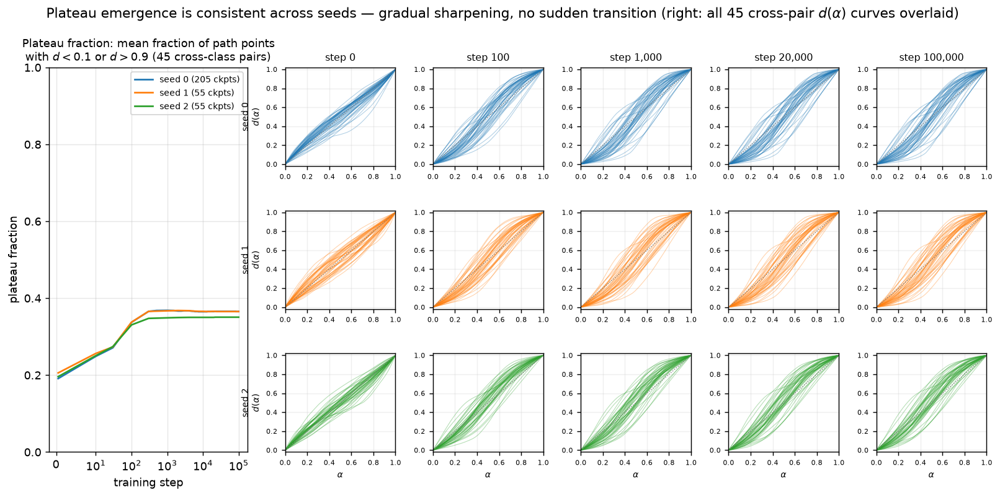
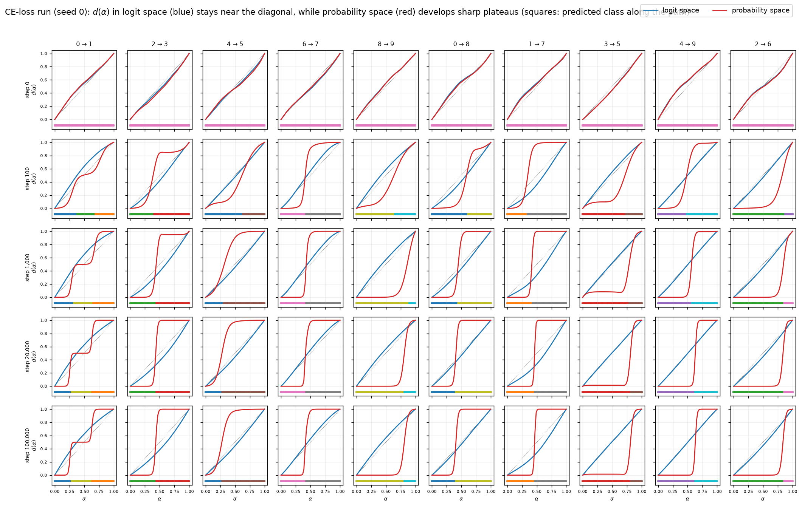
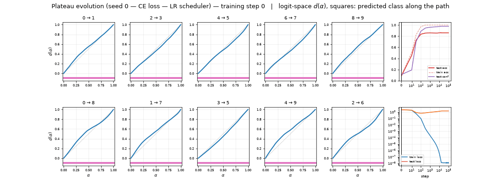

# RESULTS — Animating plateau formation through training (MNIST MLP)

> CURRENT-BEST ONLY. History lives in CHANGELOG.md. Full definitions in REPORT.md.
> Model: 4-layer ReLU MLP (784→200→200→200→10), AdamW (initial lr 1e-3, wd 0.01), MSE on
> one-hot, batch 200. **Reference runs:** 1,000-sample MNIST subset, 100k steps,
> ReduceLROnPlateau (factor 0.5, patience 100 on the per-step full-train loss, rel threshold
> $10^{-4}$, min LR $10^{-8}$) — chosen by an explicit scheduler search so the loss converges
> smoothly (operator feedback 07161834); seeds 0–2 plus a CE-loss (cross-entropy) seed-0 rerun.
> **Full-data extension (reopened plan):** the SAME untrained step-0 initializations trained
> from scratch on all 60,000 MNIST training images, shuffled without replacement each epoch
> (300 steps/epoch), cosine LR $10^{-3}\to10^{-6}$ over 30,000 steps; seed 0 at 104 checkpoints
> (0, 10, 30, 100, then every 300), seeds 1–2 at 25 fallback checkpoints. Primary protocol: 50-point
> norm-rescaled SLERP between the post-ReLU first-hidden activations $h_1$ of two fixed test
> images, patched at $h_1$ and propagated; $d(\alpha)$ = relative L2 distance of the propagated
> **logits** to the two endpoint outputs. 55 fixed pairs (45 cross-class, 10 within-class) plus,
> for the extension, a frozen bank of **50 unfiltered 3→5 pairs** (rank-$i$ test 3 with rank-$i$
> test 5, $i<50$, selected before viewing any full-data result); all endpoints from the
> **first 2,000 test images** (feedback 07161151). All records manifest-verified (520 reference
> + 154 extension + 16 re-evaluations of the 1k model on the 105-pair bank).

## Headline

**Plateau structure is entirely learned and forms early, but what happens next depends on the
data, not on convergence per se.** At initialization $d(\alpha)$ is the featureless diagonal.
On the fixed 1,000-example subset the plateau fraction (PF = share of path points with $d<0.1$
or $d>0.9$; diagonal floor ≈ 0.20) rises 0.19 → 0.34 (step 100) → 0.37 (step 300) and then
freezes for the rest of converged training in all three MSE seeds (late curve motion
$M = 5.6\times10^{-7}$ per 500-step gap). **Training the SAME initializations from scratch on
all 60,000 images breaks that ceiling: PF reaches 0.43 by step 300, 0.61 by 1,500, peaks at
0.73 (step ~8,400) and ends at 0.64–0.69 across seeds — while the loss still converges smoothly
(final train loss $2.3\times10^{-7}$, test acc 0.979, late curve motion $3\times10^{-4}$).**
The converged-1k PF ceiling of ~0.37 is therefore a small-data effect, not a property of
convergence: with 60× more data the network keeps carving sharp logit-space plateaus for
thousands of steps while fitting. Under CE the same protocol read in **probability space**
gives sharp plateaus on the 1k subset too (PF$_{\rm prob}$ 0.863 at 100k) while CE logit space
stays near-diagonal (0.24). Within-class controls stay boundary-free in all runs (9/10 typical;
every exception has a genuinely misclassified endpoint). 3 vs 5 is the hardest pair (worst
AUROC of 45 under both losses: 0.9772 MSE / 0.9697 CE).

**3→5 sub-plateau verdict (extension).** On the frozen 50-path 3→5 bank, the full-data model
mainly fixes the *endpoints*: 49/50 paths have both endpoints predicted correctly at step
30,000 vs 36/50 for the 1k model at the matched step (both start at 0/50 — no path had correct
endpoints at step 0, so that preregistered subset is empty). The original 3→5 path simplifies
from `2 | 3 | 5` (1k, misclassified "3" endpoint) to **`3 | 5` in all three full-data seeds** —
an **endpoint correction plus removal of the third-class detour, not a merge**: third-class
detours are rare in both runs (4% of paths at 30k for 60k-training vs 2% for 1k), mean segment
count is ~2 in both (2.04 vs 1.90), and no path in either run retains two non-adjacent
same-class segments at the final checkpoint (2/50 show one transiently mid-training under 60k).
These are statements about the measured 1-D paths, not about global class-region topology.

## Plateau fraction and test accuracy

Converged 1k reference (seeds 0/1/2, MSE): PF 0.19/0.21/0.20 (step 0) → 0.34/0.34/0.33 (100) →
0.37/0.37/0.35 (300) → 0.37/0.37/0.35 (100,000, frozen from ~300 on); test acc plateaus at
0.881/0.893/0.885. CE seed 0, logit/probability space: 0.19/0.19 (0), 0.25/0.58 (100),
0.26/0.79 (1k), 0.24/0.863 (100k). Full table history: CHANGELOG 2026-07-17 iter 8.

Full-60k from-scratch (seed 0; seeds 1–2 confirm at fallback steps):

| step | PF logit (60k s0) | PF (1k s0, matched step) | test acc (60k s0) | test acc (1k s0) |
|-----:|:---:|:---:|:---:|:---:|
|      0 | 0.19 | 0.19 | 0.089 | 0.089 |
|    100 | 0.35 | 0.34 | 0.918 | 0.878 |
|    300 | 0.43 | 0.37 | 0.960 | 0.879 |
|  1,500 | 0.61 | 0.37 | 0.973 | 0.880 |
|  3,000 | 0.69 | 0.37 | 0.978 | 0.880 |
|  8,400 | **0.73 (peak)** | 0.37 | 0.978 | 0.881 |
| 15,000 | 0.71 | 0.37 | 0.978 | 0.881 |
| 30,000 | 0.64 | 0.37 | 0.979 | 0.881 |

Final PF across 60k seeds: 0.64 / 0.69 / 0.65; final test acc 0.979 / 0.976 / 0.977. Step-0
weights verified bit-identical to the reference runs' initializations (and thus untrained);
first-epoch shuffling verified to use each of the 60,000 indices exactly once. The prescribed
cosine schedule is smooth on full data: full-train loss at checkpoints decays $10^{-1}\to
2.3\times10^{-7}$ with transients ≤17× the running minimum (vs $10^{5}$–$10^{6}$ for
constant/cosine on the 1k subset), none after step ~21k; last-10-checkpoint range 1.32.

## Figures

All curve/heatmap figures: x = interpolation $\alpha$ (0 = image A, 1 = image B), $d$ =
logit-space relative endpoint distance unless labeled otherwise; squares under curves =
predicted class (tab10 colors, digits 0–9). Figure numbers match REPORT.md.

## MSE vs cross-entropy (1k seed 0, identical init/data/batches/schedule)

## Pairwise AUROC: 3 vs 5 (converged 1k seed 0, step 100k)

## Full-data extension: same initialization, all 60,000 images

