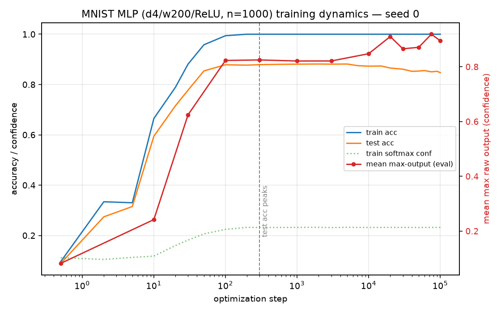
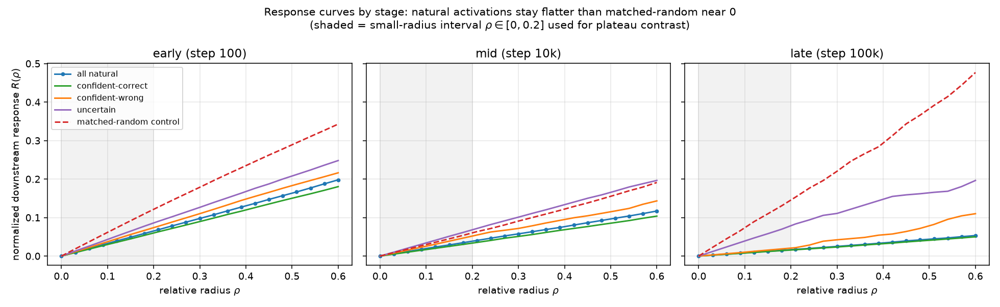
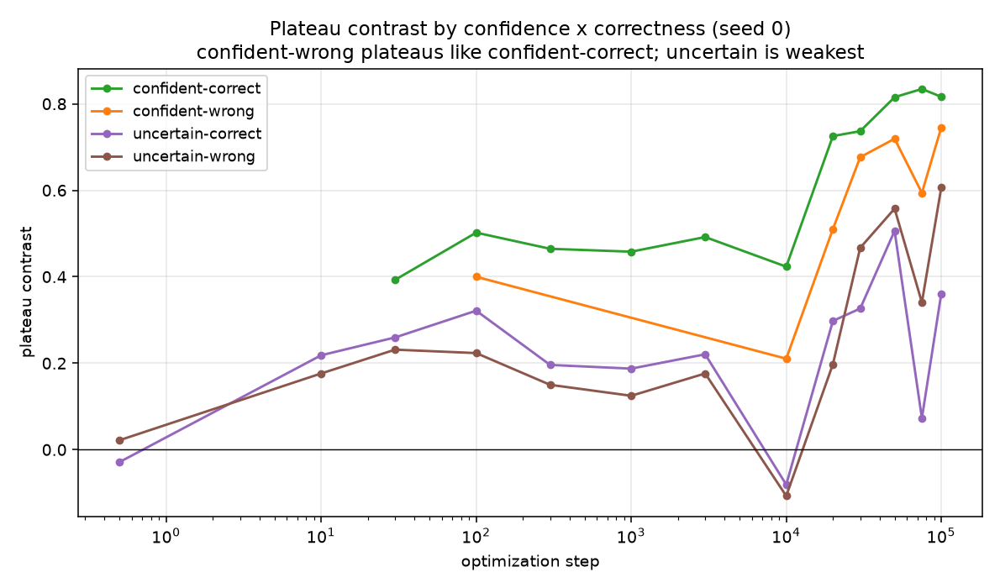

# RESULTS — How plateau/stable regions evolve during training (MNIST MLP)

> CURRENT-BEST ONLY. One row per experiment. History lives in CHANGELOG.md.
> Model: 4-layer ReLU MLP (784→200→200→200→10), 1000-sample MNIST subset, AdamW
> (lr 1e-3, wd 0.01), MSE on one-hot targets, batch 200, 100k steps. Perturb first
> hidden $h_1$ (post-ReLU), measure last-hidden $L_3$ displacement. Full definitions in REPORT.md.
> **3 seeds** (0 primary, 1–2 confirmation); numbers are mean [min, max] across seeds.

## Headline

**Plateaus emerge and keep strengthening *after* the network already generalizes.** Test accuracy
peaks by step ~300 (0.90) and then drifts down to ~0.87, but the **plateau contrast keeps climbing**
from 0.42 (step 100) to **0.80 (step 100k)** across all three seeds — the plateau/robustness phase
*lags* generalization, matching the delayed-robustness picture in *Deep Networks Always Grok*. The
number of validated stable regions **converges to exactly 10, one per predicted digit**, by step ~300
and stays there in every seed. Plateau strength tracks **confidence, not correctness**: confident-*wrong*
examples plateau strongly (contrast 0.73 at 100k) — nearly as strongly as confident-correct (0.85) —
while uncertain examples are weakest (0.49). **Verdict: expected monotonic emergence, replicated across
3 seeds.** A single-checkpoint dip at step 10k appears only in seed 0 (not seeds 1–2), so it is seed
noise, not a real split/merge — no escalation. **Membership-overlap lineage (seed 0) confirms
monotonic evolution:** regions are born one predicted-digit at a time, no digit ever hosts ≥2 validated
regions, and adjacent-checkpoint overlap matrices are clean near-permutations (0 splits, 0 merges).

## Metrics (mean [min, max] over seeds 0, 1, 2)

| step | plateau contrast | valid regions (cosine) | conf-correct | conf-wrong | uncertain | test acc (s0) |
|-----:|:----------------:|:----------------------:|:------------:|:----------:|:---------:|:-------------:|
| 0       | 0.02 [0.01, 0.05] | 1 [0, 1]   | —    | —    | 0.02 | 0.10 |
| 10      | 0.22 [0.20, 0.23] | 1 [1, 2]   | —    | —    | 0.21 | 0.60 |
| 30      | 0.30 [0.28, 0.31] | 4 [3, 5]   | 0.37 | —    | 0.25 | 0.77 |
| 100     | 0.42 [0.39, 0.44] | 9 [9, 9]   | 0.48 | 0.40 | 0.27 | 0.90 |
| 300     | 0.38 [0.37, 0.39] | 10 [10, 10]| 0.45 | —    | 0.19 | 0.90 |
| 1 000   | 0.38 [0.37, 0.39] | 10 [9, 10] | 0.45 | —    | 0.18 | 0.90 |
| 3 000   | 0.43 [0.41, 0.45] | 9 [9, 10]  | 0.49 | —    | 0.23 | 0.90 |
| 10 000  | 0.44 [0.30, 0.56] | 9 [9, 10]  | 0.53 | 0.20 | 0.08 | 0.89 |
| 20 000  | 0.65 [0.62, 0.66] | 10 [9, 10] | 0.71 | 0.47 | 0.31 | 0.89 |
| 30 000  | 0.71 [0.66, 0.74] | 10 [10, 10]| 0.77 | 0.63 | 0.37 | 0.88 |
| 50 000  | 0.77 [0.75, 0.81] | 10 [10, 10]| 0.83 | 0.68 | 0.41 | 0.87 |
| 75 000  | 0.78 [0.75, 0.83] | 10 [10, 10]| 0.85 | 0.60 | 0.38 | 0.86 |
| 100 000 | 0.80 [0.77, 0.84] | 10 [10, 10]| 0.85 | 0.73 | 0.49 | 0.87 |

Confidence = max raw output (MSE-to-one-hot drives the correct output→1; softmax saturates near 0.23
and is uninformative). "Confident" = max output ≥ 0.7. Group columns = mean plateau contrast for
confident-correct / confident-wrong / uncertain examples across seeds (dash = <10 such examples per
seed at that step, underpowered). Region count = average-linkage agglomerative clustering of $L_3$,
$k$ by silhouette; a region is *validated* only if ≥20 examples, ≥90% predicted-label purity, and its
plateau-contrast bootstrap CI excludes 0. Euclidean-metric clustering agrees (10 validated regions at
100k in all seeds).

## Figures

