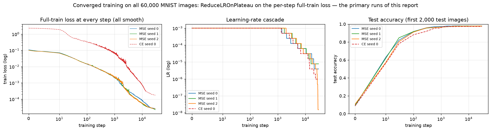
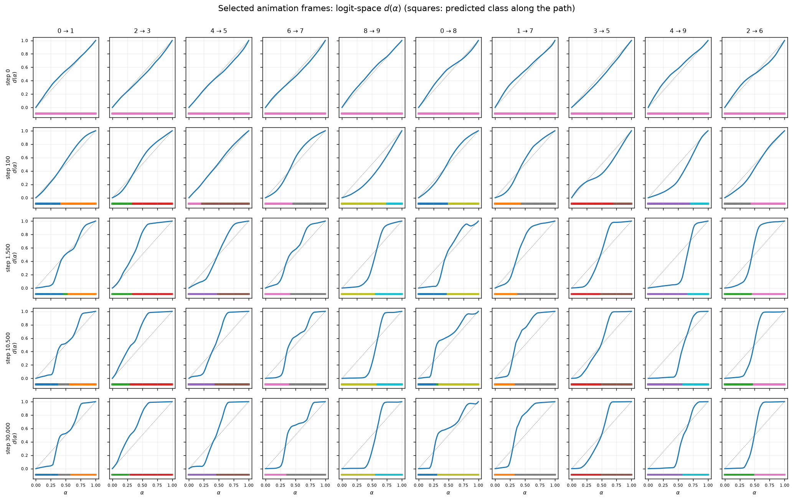
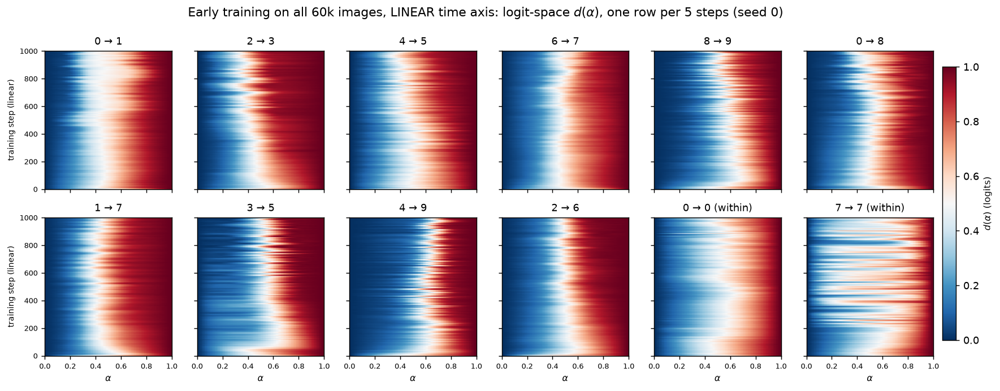
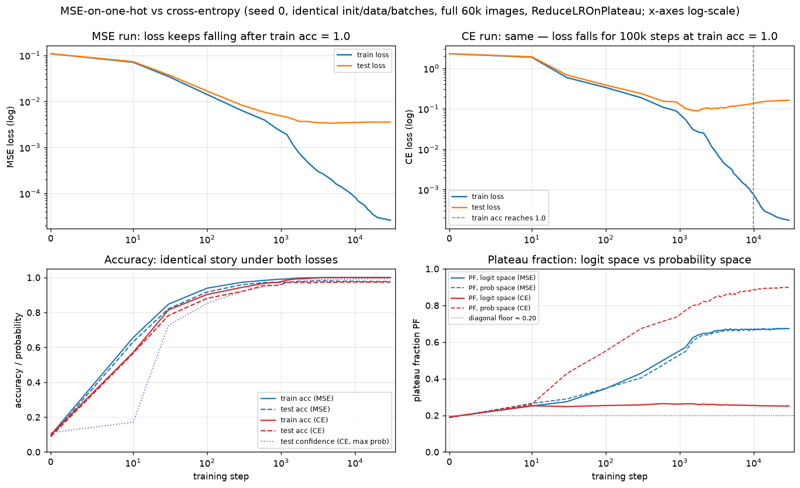
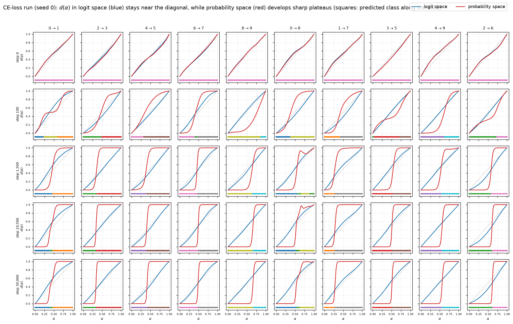
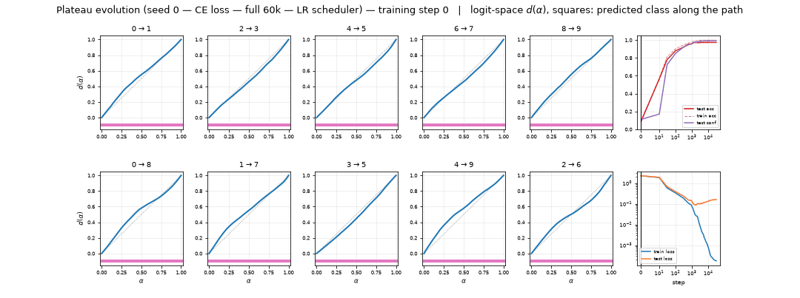

# RESULTS — Animating plateau formation through training (MNIST MLP)

> CURRENT-BEST ONLY. History lives in CHANGELOG.md. Full definitions in REPORT.md.
> **Model:** 4-layer ReLU MLP (784→200→200→200→10), AdamW (initial lr 1e-3, wd 0.01), MSE on
> one-hot, batch 200. **Primary runs (this report's focus):** trained from verified untrained
> step-0 initializations on **all 60,000 MNIST training images**, shuffled without replacement
> each epoch (300 steps/epoch), 30,000 steps = 100 epochs, with a `ReduceLROnPlateau(factor 0.5,
> patience 100 on the full-train loss, rel threshold $10^{-4}$, min LR $10^{-8}$)` schedule
> chosen by a scheduler search so the loss converges smoothly (operator feedback
> human_feedback_1). Seeds 0/1/2 (104/25/25 checkpoints) plus a CE-loss seed-0 rerun (104
> checkpoints). **Reference (one dedicated size section):** the SAME initializations trained on a
> fixed 1,000-image subset, 100k steps, same schedule; seeds 0–2 + CE. **Protocol:** 50-point
> norm-rescaled SLERP between the post-ReLU first-hidden activations $h_1$ of two fixed test
> images, patched at $h_1$ and propagated; $d(\alpha)$ = relative L2 distance of the propagated
> **logits** to the two endpoint outputs. 55 fixed pairs (45 cross-class, 10 within-class) plus a
> frozen bank of **50 unfiltered 3→5 pairs** (rank-$i$ test 3 with rank-$i$ test 5, $i<50$,
> chosen before viewing any result). All endpoints and metrics use the **first 2,000 test images**
> (feedback 07161151). All 258 primary 60k records + 201 early-zoom records manifest-verified.

## Headline

**Activation plateaus are entirely learned, form early, and — with enough data — keep sharpening
for thousands of steps of smoothly converging training before freezing.** At initialization
$d(\alpha)$ is the featureless diagonal. Training the full 60,000-image MNIST set, the plateau
fraction (PF = share of path points with $d<0.1$ or $d>0.9$; diagonal floor ≈ 0.20) rises 0.19
(step 0) → 0.35 (100) → 0.43 (300) → 0.62 (1,500) → ~0.67 (6,000) and freezes there (final
**0.674 / 0.663 / 0.668** across seeds; peak 0.674 at step ~27,000; late curve motion
$7.6\times10^{-4}$ per 300-step gap), while the loss converges smoothly (final full-train loss
$2.6\times10^{-5}$, spike-free) and test accuracy reaches **0.9775 / 0.9795 / 0.9785**. The loss
picks the coordinates: under cross-entropy the logit-space curves stay near-diagonal (PF 0.25 ≈
floor) but the softmax **probabilities** develop the sharpest plateaus of the study (PF 0.90 at
30,000). Within-class controls stay boundary-free (9/10 per seed; every exception has a
genuinely misclassified endpoint), and **0/90** cross-pair endpoints are misclassified at step
30,000.

**Training-set size sets the ceiling (dedicated section).** The *same initializations* trained on
a fixed 1,000-image subset under the *same schedule* freeze at PF ≈ 0.37 within ~300 steps — the
moment the subset is memorized — and never sharpen again (late curve motion $5.6\times10^{-7}$).
The 60k runs sail past 0.37 and roughly double it. So the converged-PF ceiling of the small-data
model is a **small-data effect, not a property of convergence.** The 3-vs-5 pair that was the 1k
model's single hardest (worst AUROC of 45, 0.977) is near-perfectly separated by the full-data
model (AUROC **0.9993**, rank 4/45; confusion 6% → 0.8%) — pair difficulty was a small-data
effect too.

**3→5 sub-plateau verdict.** On the frozen 50-path 3→5 bank the full-data model mainly fixes the
*endpoints*: **49/50** paths have both endpoints predicted correctly at step 30,000 (36/50 for
the 1k model at the matched step; both 0/50 at step 0, so the preregistered "correct at step 0"
subset is empty). The original 3→5 path simplifies from `2 | 3 | 5` (1k, misclassified "3"
endpoint) to **`3 | 5` in all three full-data seeds** — an **endpoint correction plus removal of
a third-class detour, not a merge**: mean segment count 1.98 (60k) vs 1.90 (1k), third-class
detours 0% vs 2% at the final checkpoint, and **no** path in the smooth 60k run has a
repeated-class RLE (the only merge-capable pattern) at any checkpoint. These are statements about
the measured 1-D paths, not global class-region topology.

## Plateau fraction and test accuracy (full-60k, primary)

| step | PF logit (60k s0) | PF (1k s0, matched) | test acc (60k s0) | test acc (1k s0) |
|-----:|:---:|:---:|:---:|:---:|
|      0 | 0.19 | 0.19 | 0.089 | 0.089 |
|    100 | 0.35 | 0.34 | 0.917 | 0.878 |
|    300 | 0.43 | 0.37 | 0.960 | 0.879 |
|  1,500 | 0.62 | 0.37 | 0.978 | 0.880 |
|  3,000 | 0.66 | 0.37 | 0.980 | 0.880 |
|  6,000 | 0.67 | 0.37 | 0.979 | 0.881 |
| 30,000 | **0.674** | 0.37 | 0.978 | 0.881 |

Final PF across 60k seeds: **0.674 / 0.663 / 0.668**; final test acc 0.9775 / 0.9795 / 0.9785;
0/90 cross-pair endpoints misclassified per seed. CE seed 0 (logit / probability space): 0.19/0.18
(step 0), 0.25/0.55 (100), 0.26/0.67 (300), 0.26/0.80 (1,500), **0.25/0.90 (30,000)**. Step-0
weights verified bit-identical to the reference initializations (untrained); first-epoch shuffling
verified to use each of the 60,000 indices exactly once. Chosen schedule (seed 0): LR halves 8×
between steps 1,402 and 20,844 to $3.9\times10^{-6}$; full-train loss decays $10^{-1}\to
2.6\times10^{-5}$ spike-free (largest transient 1.56× the running minimum, tail range 1.07).

## Figures

All curve/heatmap figures: x = interpolation $\alpha$ (0 = image A, 1 = image B), $d$ =
logit-space relative endpoint distance unless labeled otherwise; squares under curves = predicted
class (tab10 colors, digits 0–9). Comparison figures: full-60k green, 1k reference blue. Figure
numbers match REPORT.md.

## MSE vs cross-entropy (60k seed 0, identical init/data/batches/schedule)

## Pairwise AUROC: 3 vs 5 is no longer the hardest pair (60k seed 0, step 30k)

## The frozen 50-path 3→5 bank (60k)

## The effect of training-set size (1,000-image reference)

