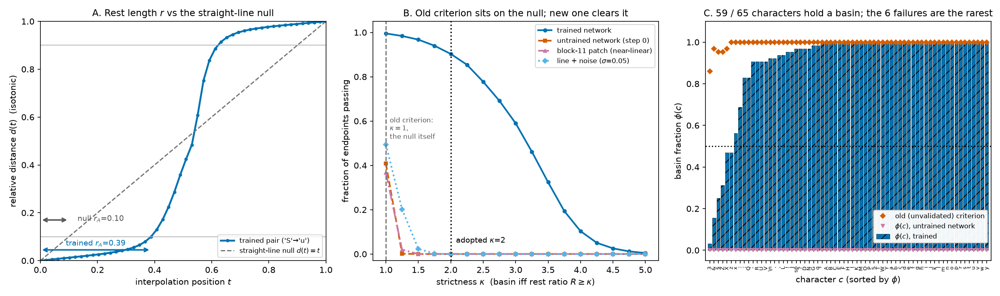
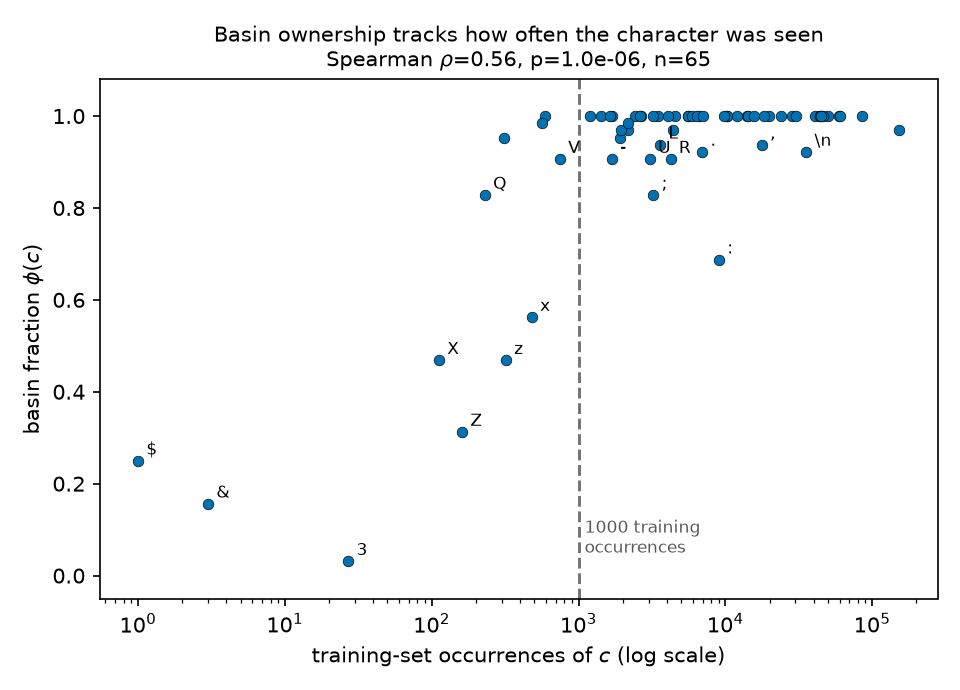
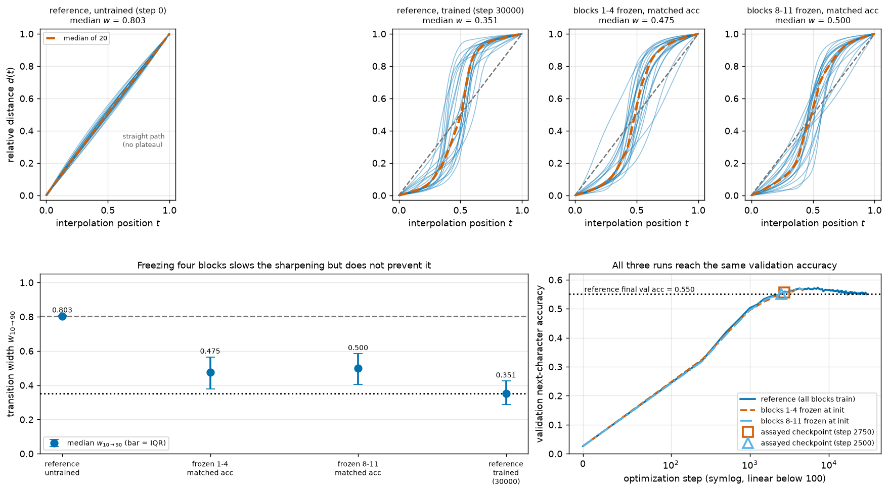
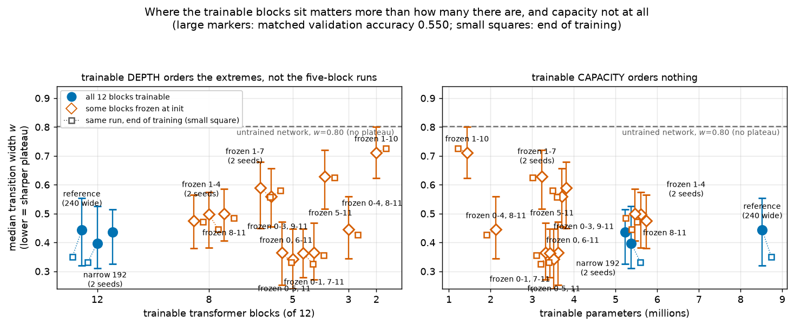
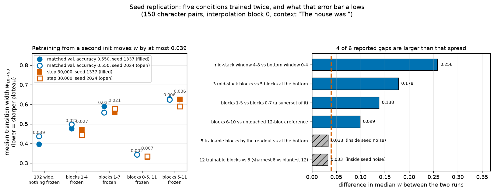
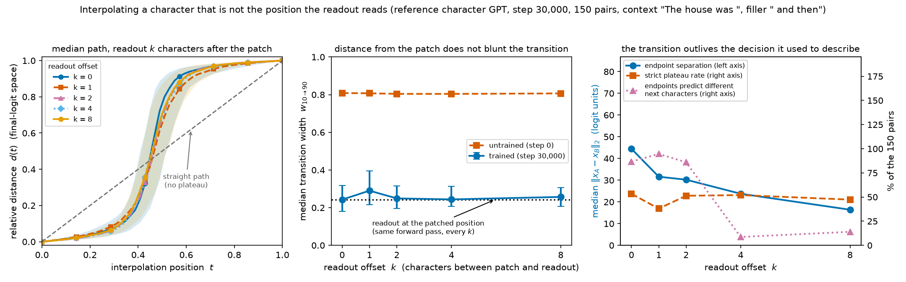
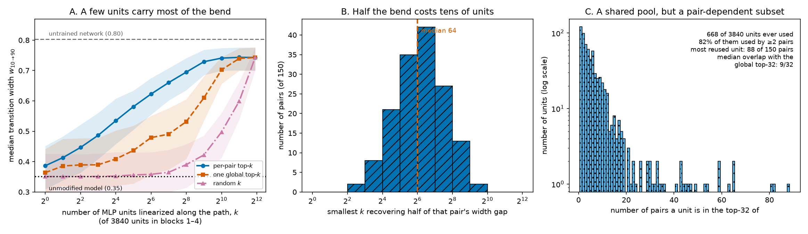
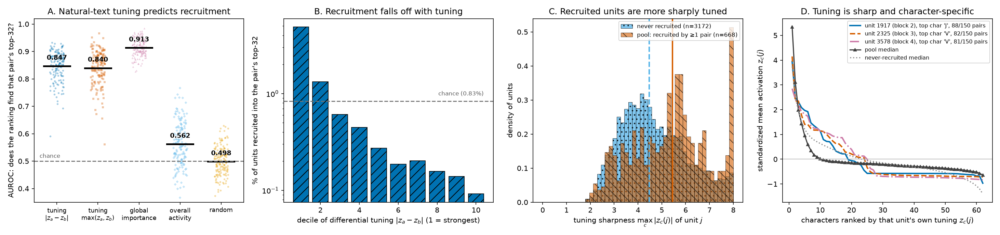
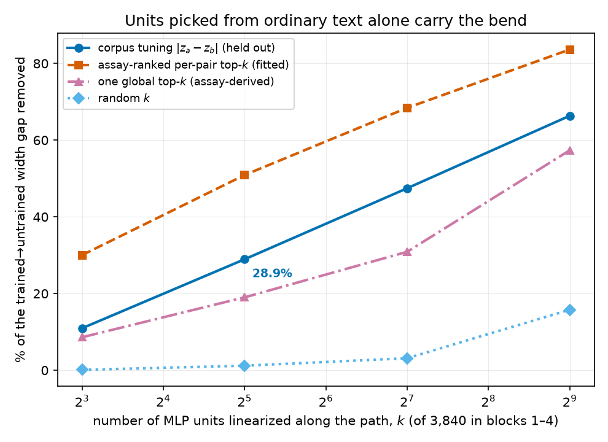
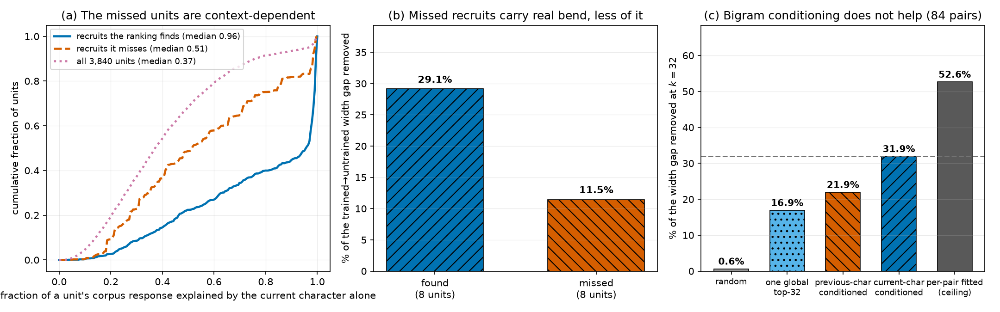

# REPORT — Do Grokking and Matthew-style activation plateaus emerge together?

> Final, presentable, current-best only (history in CHANGELOG.md).

## Summary

Matthew Shinkle & StefanHex's post *Activation Plateaus: Where and How They Emerge* reports a striking
geometry inside trained transformers: take two inputs, interpolate between their internal activations,
and the network's output does **not** morph gradually. Instead it stays locked to the first input's
output, snaps across a narrow boundary, and locks to the second input's output — a
**plateau–boundary–plateau** curve. If real, this matters for safety-relevant interpretability: it
means the network's computation is organized into discrete basins, so activation-space edits
(steering, patching) behave predictably inside a basin and abruptly across one, and jailbreak- or
backdoor-style behavior switches may live at such boundaries.

This direction asks the cheap gating question for one specific model: does the **12-layer, 12-head
character-level Shakespeare GPT** from *Deep Networks Always Grok and Here is Why* (its Figure 9) show
Matthew-style plateaus? The paper's GPT code and checkpoint are not public, so we trained a faithful
reconstruction (next-char accuracy 0.56 ≈ 37× chance) and ran the two-natural-endpoint interpolation
assay with everything frozen before any curve was inspected. One scope note up front: the grok
paper's own headline phenomenon is **grokking** — `ε=0.03`-PGD adversarial robustness emerging long
after training accuracy saturates, alongside a **second local-complexity descent**. We treat this as
an explicit **validity gate** (Methods §Figure-9 gate, Results §Figure-9 gate). **Both character runs
PASS this gate; the BPE run FAILs.** Test local complexity in the fresh 30k character run falls
1940 → 491 (step 15), turns back **up** to 989 (step 36) — a rise of 498 units against a 99% CI of
±4, traced by three measured checkpoints on a grid we densified to 24 points — and then descends for
the rest of training to 8.1, exactly Figure 9's first-descent → rise →
**second descent** shape; the second descent's onset (step 36) precedes the clean-accuracy peak
(step 4,994), and `ε=0.03` robustness rises from 0.001 at that onset to 0.53, continuing to climb
after clean accuracy has saturated. The 3,500-step pilot shows the same ordering (491 → 484 at step
19, up to 1043 at step 33, down to 68). The fresh BPE run does **not**: its only LC upturn is 30 units
(1.4% of the curve's range, below the preregistered 5% tolerance), so it has no second descent. The
consequence is that the **primary** relationship verdict stays **"not testable"** (PLAN case 5) —
Matthew's exact `big/in`, `big/large` tokens require the BPE model, and that is the run that fails —
while the **secondary** character evidence now sits on a run that *does* reproduce Figure 9, giving
**PLAN case 1 (temporally associated)** for the character analogues: the plateau sharpens inside the
same checkpoint window as the second LC descent and the emergence of delayed robustness. The paper's
role here is only to specify the model under test; the phenomenon under test is Matthew's activation
plateaus.

**Result: plateaus are present, we can time their emergence, and we can say what they are.** Each
interpolation curve plots the output's relative closeness to endpoint B (call it $d$, from 0 = "still
A's output" to 1 = "B's output"; defined precisely in Methods) against the interpolation position $t$;
the no-plateau reference is the **straight line** $d = t$ (transition width 0.8 — no flat segments).
Our **primary plateau evidence** runs Matthew's own code path with his exact context and two
preregistered single-token character controls (`b↔i`, `b↔l`) across six frozen training checkpoints.
The plateau is **absent at initialization** (curve is the straight line, width ≈ 0.80) and **emerges
during training**: by step ~831 it is a sharp plateau–boundary–plateau sigmoid (width ≈ 0.33) and stays
there to step 30k. That emergence sits **inside** the second-descent window (steps 36 → 30,000) and
straddles the sustained robustness onset (step 531) — the association behind the case-1 verdict — but
it occupies only the early part of that window and is complete long **before** robustness saturates at
step ~7,819, so the plateau is *not* waiting for grokking to finish.
Sweeps of increasing scope then pin the phenomenon down. Fixing one endpoint at the **comma** and
sweeping the other over all 64 remaining characters: no pair responds linearly (median width 0.340),
but only 1/64 clears the strict ≤ 0.25 bar, and sharpness tracks how likely the model thinks that
character is (rank correlation −0.74). Repeating that in **8 further contexts** from held-out text
(576 pairs): the shape result replicates exactly — **0/576** near-linear curves, per-context medians
0.313–0.436 — while the probability effect replicates only in **direction** (negative in 9/9 contexts,
sign test p = 0.004) at a more modest typical size (median ρ = −0.41). Finally, the exhaustive
**all-pairs sweep** — every one of the **2,080** character pairs — answers what the plateaus
correspond to: **59 of the 65 characters own a basin** against most of their partners — on a criterion
calibrated so that a plateau-free curve fails it (0 of 4,160 untrained-network endpoints pass), and the
six that fail are the six rarest characters in the training text — **78%** of the
variance in transition width is explained by per-character terms rather than pair-specific chemistry,
**91%** of the model's next-character prediction changes along a path fall inside the transition
window, and the whole structure is **learned** (median width 0.803 at init → 0.355 trained) and built
by the **shallow blocks** (0.34 patching at block 0 vs 0.81 at block 8). Two interventions then test
the mechanism: biasing the readout cannot move the plateau at all ($d(t)$ is exactly invariant to it),
while **scaling the MLPs of blocks 1–4 moves it directly** — deleting them returns the width to the
untrained value (0.35 → **0.80**, 0/150 pairs plateaued) and amplifying them sharpens it (→ 0.31,
strict pass rate 10% → 30%), with the same intervention on blocks 8–11 doing essentially nothing
($|\Delta w| \le 0.025$). Deleting those four MLPs one at a time shows the sharpness is **distributed**
across them (shares 41/28/18/11%, none dominant), and — measuring both candidate mechanisms under
every ablated model — the collapse tracks **neither** of them: the next-character decision survives
intact (80.7% of pairs still predict different characters at their endpoints) while $d(t)$ goes
straight, and the endpoint-plausibility landscape barely moves ($\rho(\Delta w,\Delta\max p)=+0.22$).
Nine retraining runs then show that even the "built in blocks 1–4" claim is about this particular
trained network rather than about training. Every one of them matches or beats the reference's
validation accuracy and still bends the paths, with the sharpening relocated into whichever blocks
were left trainable: freezing blocks 1–4 gives width **0.471** (vs 0.803 untrained) with the drop moved
to blocks 5–8; freezing blocks 8–11 instead costs just as much width (0.484); freezing blocks 1–7
relocates it into the only blocks left, 8–11 (**0.558**); and freezing the mirror-image group 5–11 —
the same 58% of parameters, the same five trainable blocks, but at the bottom of the stack — puts it
back in blocks 1–4 (**0.626**). The sharp transition is thus a **relocatable** computation. A fifth run
takes the trainable-depth axis to its limit: freezing blocks 1–10, so that block 11 is the only
trainable block downstream of the injection, lands at **0.726** — matching the trainable-depth
prediction of ≈0.70 and excluding the ≈0.56 that "one block beside the readout suffices" would give —
and there the plateau stops being a plateau, recovering only 17% of the reference sharpening with its
boundary no longer tracking the model's prediction flip. Every one of those runs removes trainable
blocks and trainable
parameters together, so a sixth run separates them: retrained **narrow** (`d_model` 192, nothing frozen,
5.38M parameters — 4% *below* frozen-early's trainable budget, at the reference's full depth), it lands at
**0.397** at matched accuracy and **0.332** at the end of training, i.e. at or below the full-width
reference's 0.443 and 0.351 rather than at the frozen runs' 0.47–0.48. Both ends of that comparison,
and all three runs carrying a positional claim, were then repeated from a second initialization: five
conditions trained twice, which bounds the across-seed spread on the median width at 0.040.
Parameter count is not the variable. **Nor, it turns out, is the number of trainable blocks.** A seventh
run puts the same five trainable blocks at the one position not yet tested — the *middle* of the stack,
freezing blocks 0–3 and 9–11 — and instead of landing between the two known five-block values (the
prediction on record was 0.58–0.60) it lands at **0.365** at matched accuracy and **0.331** at the end,
below every eight-block run and below the 12-block reference itself, with **24.7%** of pairs meeting
the strict plateau rule against the reference's 10.0% and 0–0.7% for every other frozen run. The three
five-block runs therefore span 0.365–0.629, a wider range than the entire 12-to-5 block series. The
eighth run separates the window's position from its size by shrinking it to **three** mid-stack blocks (5–7,
with 74.6% of the parameters frozen): it lands at **0.446**, statistically indistinguishable from the
full 12-block reference (0.443, $p = 0.17$) and 0.09–0.18 sharper than every five-block window at
either end, and a ninth run slides the five-block window one step off centre (blocks 2–6), where it
reproduces the mid-stack result exactly (**0.365**). What sets the sharpness is **where** the trainable
blocks sit, far more than how many there are, and the cleanest demonstration is a tenth run at blocks
1–5: it lands at **0.363** while blocks 0–7, a strict superset of it, land at 0.500, so *removing* two
trainable blocks sharpens the path. Which geometry of the window does this is not settled — the rule
that fit the first eight runs was refuted by the ninth.
Finally, the assay's one untested control — every number above patches the *last* character and reads
the logits at that same slot — turns out to change the interpretation rather than merely confirm it.
Moving the readout up to **8 characters downstream** of the patched character leaves the transition
width statistically **unchanged** (0.243 at offset 0 vs 0.244–0.257 at offsets 2–8, paired
$p = 0.22$–$0.43$), while the untrained network stays on the straight line (0.80) at every offset. At
offset 4 the two endpoints predict the *same* next character for **91.3%** of pairs — the
decision-basin description no longer applies there — and **52.0%** of pairs still give a strict
plateau. So what switches discretely is the network's state, which the patched position happens to
expose as a prediction flip.
With that settled, the last experiment opens the mechanism itself. Replacing an MLP unit's activation
along the path by the straight chord between its own endpoint values — which leaves both endpoints
exact and deletes only the unit's curvature in $t$ — removes **86.7%** of the sharpness when applied to
all 3,840 units of blocks 1–4. A pair's own **32** most path-nonlinear units, 0.83% of that population,
already remove **50.9%**, while 32 random units remove **1.2%** and random selection needs about 2,048
units to match the top-32. No fixed set does it for everyone: a single global set of 32 removes 19.0%,
and a typical pair shares only 9 of its 32 units with it. The bend is the work of a few dozen gated
units per path, recruited from a shared pool of 668 — neither a distributed rotation nor a reusable
circuit.
Those units then turn out to be identifiable from outside the experiment. Measuring each unit's
character tuning on 941,040 positions of ordinary Shakespeare — no interpolation, no patching, no
shared context — and ranking units by how differently they respond to a pair's two endpoint characters
predicts which units that pair recruits at **AUROC 0.847** (precision@32 **21.6%**, 26× chance), where
an activity-matched control reaches 0.562 and a shuffle 0.498. A recruited unit's most-preferred
character is one of that pair's own endpoints **9.8×** more often than chance, and the three most
reused units are capital-letter detectors whose top corpus contexts are proper-name onsets
(`DUCHESS OF Y`, `Henry the F`). Handing the selection rule to the corpus makes it causal: linearizing
the 32 units with the largest differential tuning — chosen blind to the assay — removes **28.9%** of the
trained→untrained width gap against 1.2% for 32 random units, beating every previous rule that does not
see the individual pair. A plateau boundary is where the character detectors for the two endpoints hand
over, and the units that will control a new pair can be named from corpus statistics before any
interpolation is run. The units that rule misses are identified too: their corpus response is
context-dependent rather than character-pure (median 51% of it explained by the character at the
position, against 96% for the units the rule finds) and they carry about a third as much bend each.
Conditioning the corpus profile on the preceding character does not select them — it improves the
ranking of the whole population (AUROC 0.886 vs 0.869) while making the top-32 selection causally
weaker (21.9% vs 31.9% of the gap), because what a 32-unit rule needs is precision at the top of the
ranking, not resolution across the tail.
**Verdict: plateaus are real in this model, and at the patched position they look like next-character
decision basins** — but that is a *description* read off one token slot, not the phenomenon: the sharp
switch is still there several characters downstream where the decision is not, and its mechanism sits
upstream in the early MLPs. Qualified further because we tested a reconstruction rather than the
paper's exact checkpoint, and because the sharpness is graded rather than step-like.

**Companion report.** `REPORT_followup.md` re-analyses the same 2,080-pair sweep along two axes this
report does not use — each character's training frequency and its linguistic class. Its three results:
transition width falls monotonically with training frequency (Spearman $\rho = -0.78$ over 65
characters), so dropping the 12 characters seen fewer than 1,000 times moves the median width from
0.355 to 0.320 and removes most of the near-linear tail; the individual curves are strongly asymmetric,
with the contextually plausible endpoint holding most of the interpolation path; and the width from a
letter to a partner is ordered by the partner's character class, consistently across all 43 well-trained
letters (Kendall $W = 0.42$; $W = 0.27$ after removing the frequency confound). It also tabulates the
prompt context and per-cell sample count behind every character-level figure below.

## Methods

### Data & Model

- **Task/data.** Next-character prediction on **Tiny Shakespeare** (`input.txt`, 1,115,394 chars,
  SHA-256 `86c4e6…565ed`); first 90% train, last 10% validation; character-level tokens (vocab 65).
- **Model.** A nanoGPT-style decoder-only GPT: **12 blocks, 12 heads, GeLU MLPs** (the paper's
  confirmed Figure-9 facts), pre-norm, learned positions, weight-tied head. Reconstruction choices
  (unspecified by the paper): `d_model = 240`, MLP hidden `4·d_model`, context 128, dropout 0.2,
  8.38M params. Every field is tagged confirmed-vs-reconstructed in `MODEL_SPEC.md`.
- **Why a reconstruction.** The official repo `AhmedImtiazPrio/grok-adversarial` (audited via the
  GitHub API, 2026-07-15) contains no GPT/Shakespeare code or checkpoint. All conclusions are
  explicitly about this reconstruction.
- **Training.** AdamW (betas 0.9/0.99, weight decay 0.1), peak LR 1e-3, 100-step warmup + cosine
  decay, batch 48×128, fp32. The pilot ran 3,500 steps → **val loss 1.494, val next-char accuracy
  0.560**; the fresh character run ran 30,000 steps → val accuracy 0.554 (peak 0.568). Seeds and
  provenance in `results/train_meta*.json`; curves in Figure 1.
- **Hook point.** We intervene on the **residual stream** — the running hidden vector that each
  transformer block reads from and adds to — at the **final sequence position**, after block $L$
  (`resid_post`). Because attention is causal, replacing only the final position's vector and
  re-running blocks $L{+}1..11$ is an exact continuation of the forward pass (verified below). The
  primary interpolation point is **block 0**, leaving 11 of 12 blocks downstream. **Logits** are the
  model's 65 raw pre-softmax output scores at the final position.
- **Sample sizes.** Matthew-faithful controls: 2 pairs × 50 interpolation steps × 12 interpolation
  blocks × 6 checkpoints. Comma sweep: 64 pairs × 50 steps × (6 checkpoints at block 0, plus all 12
  blocks at the final checkpoint). Context control: 9 contexts × 64 pairs × 50 steps. All-pairs sweep:
  2,080 pairs × 50 steps at block 0, at both the final and the initialization checkpoint, plus a
  200-pair subsample at blocks 4/8/11 and a 100-pair endpoint-swap replication. Exploratory 40-pair
  set: 40 pairs × 101 steps, recording at 11 downstream residual points + final logits.

### Constructing natural minimal pairs (frozen before any curve was seen)

The question is about interpolating between **two natural activations**, so each pair must be two
real, plausible inputs whose activations differ as little as possible — we use equal-length sequences
`prefix + char_A` vs `prefix + char_B`, identical except the final input character. Selection never
looks at interpolation curves (that would bias the frozen set toward or away from plateaus):

- 40 shared prefixes of length 127 sampled from held-out validation text (seed 20260717,
  deduplicated), giving full sequences of the model's context length 128.
- `char_A` = the character actually observed after the prefix in the corpus (guaranteed natural);
  `char_B` = the model's highest-probability next character, or its second if the top choice equals
  `char_A` (both endpoints plausible; median model probability of `char_B` is 0.146).
- **Degeneracy exclusion (frozen threshold):** a pair would be dropped only if its two endpoint logit
  vectors were numerically indistinguishable (L2 distance < 1e-3). None were: endpoint distances span
  8.7–64.4 (median 24.7). All pair metadata is in `results/prompt_pairs.json`.

### Matthew-faithful character-token controls across training (primary plateau assay)

The **primary** plateau evidence follows Matthew's released config/code path
(`experiments/run_matthew_ckpts.py`, `configs/matthew_char_control.yaml`) so it transfers his assay
with only the model adapter changed: shared context `"The house was"`, **exactly 50** evenly spaced
interpolation values including both endpoints, `slerp_rescale` (spherical direction + linear norm;
same equations below), patch **only the final sequence position**, and sweep **every** interpolation
layer (`resid_post` blocks 0–11), recording Matthew's downstream hooks (`attn_out`, `resid_mid`,
`mlp_post`, `mlp_out`, `resid_post`) plus final logits. Because the character model cannot represent
Matthew's `big/in/large` as single tokens, we use his two preregistered single-**character** controls
`b↔i` and `b↔l` (labelled tokenizer controls, *not* replications of his word examples). We run them at
**6 checkpoint phases frozen before any plateau curve was inspected** (`experiments/freeze_phases.py`
→ `results/frozen_phases_char.json`; the Figure-9 LC curve is monotone so the rule falls back to
log-spaced picks): steps **0, 56, 831, 7819, 17500, 30000**. This lets us plot plateau width *against*
the Grokking metrics on one training-step axis (Results §Primary plateau evidence).

### Comma against every other character (operator-requested sweep)

The two controls above are only two pairs, so an operator asked whether the plateau holds when one
endpoint is held fixed and the other is swept over the whole alphabet. We fix endpoint A at the comma
and use every other character as endpoint B, giving **64 pairs** (`experiments/comma_sweep.py`).
Everything else is unchanged from the primary assay: the same fresh character GPT and its saved
checkpoints, shared context `"The house was "`, endpoint A = context + `,`, endpoint B = context +
one other character, **50** evenly spaced interpolation values, `slerp_rescale`, patch of the final
position only, and $d(t)$ read in final-logit space.

Two extra quantities are measured at the final checkpoint, only to ask *why* some pairs switch more
sharply than others. The first asks whether sharpness tracks how ordinary the second character is in
this context. With $x_{\text{ctx}}$ the context `"The house was "` and $f$ the model, the model's
**next-character probability** for character $c$ is its softmax score at the final position:

```math
p(c)=\mathrm{softmax}\big(f(x_{\text{ctx}})\big)_c .
```

The second is a control against a trivial explanation — that flat curves merely mean the two
endpoints' outputs are hard to tell apart. **Endpoint separation** is the plain distance between the
two endpoint logit vectors $\ell_A$ and $\ell_B$:

```math
s(A,B)=\lVert \ell_{A}-\ell_{B}\rVert_2 .
```

Both are related to width by the **Spearman rank correlation** $\rho$ — the ordinary correlation
computed on ranks rather than raw values, so it measures "does one go up when the other goes down?"
without assuming a straight-line relation. With $R_i$ and $S_i$ the ranks of the two quantities for
pair $i$ over $n$ pairs:

```math
\rho = 1-\frac{6\sum_{i=1}^{n}(R_i-S_i)^2}{n\,(n^2-1)} .
```

$\rho$ runs from −1 (perfect opposite ordering) through 0 (no monotone relation) to +1. These two
quantities are consumed by Results §"Comma against every other character", by the context control
that follows it, and by the all-pairs sweep.

### Context control: the same sweep in eight further contexts

Every plateau number above is measured in the one shared context `"The house was "`, whose comma
endpoint is also an implausible continuation ($p = 1.0\times10^{-7}$). Both facts are candidate
confounds, so we repeat the whole comma sweep in **8 additional contexts** (`experiments/context_sweep.py`).
Contexts are 64-character windows sampled from held-out validation text (seed 20260725, 256
candidates), then chosen at nine evenly spaced ranks of $p(\texttt{,})$ — the model's probability of
a comma in that slot, from the same equation as above — so the set spans "a comma is impossible here"
to "a comma is almost certainly next". Adding the reference context gives 9 contexts × 64 pairs =
**576 pairs**, all at the final checkpoint (step 30,000), interpolation block 0, final logits, with
every other setting unchanged.

Two things are then asked of the data. First, **does the shape claim survive the change of context?**
— answered by the per-context width distribution and the count of near-linear curves. Second, **does
the width-vs-probability correlation replicate?** — answered by computing $\rho$ *within* each
context. Since nine correlations of varying strength cannot be summarized by their mean, we report
the median and range, and test only the direction with a **sign test**: under the null that sharpness
is unrelated to the model's probability, each context's $\rho$ is negative with probability $1/2$, so
observing $k$ negatives out of $n$ has two-sided p-value

```math
p = 2^{1-n}\sum_{j=k}^{n}\binom{n}{j} .
```

Finally, to test the implausible-endpoint worry directly, we correlate each context's **median width**
with its $p(\texttt{,})$ across the nine contexts. These are consumed by Results §"Does the plateau
depend on the context?".

### All-pairs sweep: every character against every other

The sweeps above always hold one endpoint fixed, so they cannot say whether *each* character sits in a
basin of its own or whether sharpness is a property of the particular pair. To decide that we run all
$\binom{65}{2} = 2080$ unordered character pairs (`experiments/allpairs_sweep.py`, analysed by
`experiments/analyze_allpairs.py`) through the identical frozen code path — context `"The house was "`,
50 evenly spaced $t$, `slerp_rescale`, final-position patch, $d(t)$ in final-logit space — at
interpolation block 0 of the step-30,000 character checkpoint. Endpoint order is fixed by vocabulary
index ($A$ = lower index) so the run is deterministic. Three additions are made to the same forward
passes, each motivated below: the per-$t$ prediction trace, a depth subsample, and an initialization
re-run.

**Endpoint-swap symmetry check.** $d(t)$ is not symmetric in $A$ and $B$ by definition, so before
drawing a symmetric $65\times65$ matrix we re-run 100 randomly chosen pairs with the endpoints swapped
and report the median $|w(A,B)-w(B,A)|$. If that is not negligible the full ordered matrix must be
drawn instead.

Three per-character statistics turn "is each character in its own plateau?" into a decidable question.
Let $P(c)$ be the 64 partners of character $c$, and let $t_{lo}$ and $t_{hi}$ be the start and end of
the transition on a pair's curve (defined under *Transition width* below).

**median width $\mathrm{med}_w(c)$** — how sharply $c$ is left, averaged over all partners; small
means every path in and out of $c$ is a quick switch:

```math
\mathrm{med}_w(c)=\underset{p\in P(c)}{\mathrm{median}}\ w_{10\to 90}(c,p).
```

**basin fraction $\phi(c)$** — the fraction of partners for which the path *rests* on $c$'s output
before leaving it, which is exactly the flat part of a plateau. The obvious way to measure resting is
to ask how much of the path stays within some tolerance $\delta$ of $c$'s output, but a raw length is
not interpretable on its own: the straight line $d(t)=t$, which has no plateau at all, still spends
$\delta$ of its length below $\delta$. Any threshold on the raw length is therefore either below the
null (accepting everything) or an arbitrary distance above it. So we measure the rest length **in
units of what the straight line gives**. Write the **rest length** of $c$ at tolerance $\delta$ as

```math
r_c(\delta)=\begin{cases} t\big(\tilde d=\delta\big) & \text{if } c=A,\\[2pt]
1-t\big(\tilde d=1-\delta\big) & \text{if } c=B,\end{cases}
```

read on the same isotonic copy $\tilde d$ used for the width, and define the **rest ratio**

```math
R_c(\delta)=\frac{r_c(\delta)}{\delta},\qquad R_c\equiv 1 \text{ for } d(t)=t \text{ at every } \delta .
```

$R=3$ means the output stays parked on $c$ three times as long as a uniform morph between the two
outputs would. The basin fraction counts partners whose rest ratio clears a strictness factor
$\kappa$:

```math
\phi(c)=\frac{1}{64}\sum_{p\in P(c)}\mathbf{1}\big[\ R_c(\delta)\ \ge\ \kappa\ \big],
\qquad \delta=0.10,\ \ \kappa=2 .
```

We fix $\delta=0.10$ (the tolerance already used for the transition width) and $\kappa=2$: a basin is
claimed only when the path rests on the character for at least twice the null's length, i.e.
$t_{lo}\ge0.20$ at the $A$ end and $t_{hi}\le0.80$ at the $B$ end. Both constants are arbitrary in the
same way every threshold is, so Results reports the whole curve of $\phi$ against $\kappa$ from 1 to 5
and repeats the count at $\delta\in\lbrace 0.05,0.10,0.20\rbrace$, and the null-curve baseline below
establishes what the criterion does when there is no basin to find.

**strict fraction $\sigma(c)$** — the fraction of $c$'s partners passing the frozen strict plateau rule
(below), i.e. the knife-edge version of the same question:

```math
\sigma(c)=\frac{1}{64}\sum_{p\in P(c)}\mathbf{1}\big[\ \text{pair }(c,p)\text{ passes the strict rule}\ \big].
```

**Per-character versus per-pair variance.** $\phi$ and $\mathrm{med}_w$ could both look structured even
if sharpness really lived in the pair. To separate the two we fit the additive model $w_{ij}\approx
\mu+a_i+a_j$ by least squares over all 2,080 widths (65 character effects, one intercept; the design is
rank-deficient by one, so the minimum-norm solution is used) and report the fraction of variance it
explains:

```math
R^2 = 1-\frac{\sum_{i<j}\big(w_{ij}-\hat w_{ij}\big)^2}{\sum_{i<j}\big(w_{ij}-\bar w\big)^2},
\qquad \hat w_{ij}=\hat\mu+\hat a_i+\hat a_j .
```

A high $R^2$ means each character carries its own sharpness into every pairing (PLAN verdicts i/ii);
a dominant residual $1-R^2$ means the sharpness lives in the pair (verdict iii). Because 65 free
parameters can fit noise, we also refit on 200 random permutations of $w$ to get the chance level.

**Readout-decision test.** The hypothesis we most want to test is that a plateau simply *is* the set of
residual states that decode to the same next character. We therefore record the model's predicted next
character $\arg\max f(h(t))$ at every $t$ and compare two locations. The **midpoint crossing** $t^{*}$
is where the curve is half-way across, read on the isotonic copy $\tilde d$:

```math
t^{*}=\min\{\,t:\ \tilde d(t)\ge 0.5\,\},
```

and the **first prediction flip** $t_{\text{flip}}$ is placed midway between the two grid points that
bracket the first change of the predicted character:

```math
t_{\text{flip}}=\tfrac{1}{2}\big(t_{k}+t_{k+1}\big),\qquad
k=\min\{\,m:\ \arg\max f(h(t_{m+1}))\neq\arg\max f(h(t_{m}))\,\}.
```

If the plateau boundary *is* the decision boundary then $t^{*}\approx t_{\text{flip}}$, paths visit
about two predictions, and — the sharper form of the test — every prediction change falls inside the
transition window $[t_{lo},t_{hi}]$, leaving each flat arm a single constant prediction. We report the
distribution of $t^{*}-t_{\text{flip}}$, the number of distinct predictions per path, the mean fraction
of changes inside the window, and the fraction of paths with single-prediction arms.

The readout-decision test above is correlational: $t^{*}$ and $t_{\text{flip}}$ could coincide because
the decision creates the plateau, or because both track one upstream change. To tell those apart we
**intervene on the readout only**. Let $a^{*}=\arg\max f(h(0))$ and $b^{*}=\arg\max f(h(1))$ be the two
endpoint predictions and let the **readout gap** be the logit difference between them along the path,
which starts positive and ends negative:

```math
g(t) = f(h(t))_{a^{*}} - f(h(t))_{b^{*}}.
```

The **decision boundary** $t_{\mathrm{gap}}$ is where that gap changes sign — the point on the path at
which the model stops predicting $a^{*}$ and starts predicting $b^{*}$ — found by linear interpolation
between the bracketing grid points:

```math
t_{\mathrm{gap}} = \min\{\, t:\ g(t) \le 0 \,\}.
```

Adding a constant $c$ to the unembedding row of $a^{*}$ replaces $g$ by $g-c$ and therefore moves
$t_{\mathrm{gap}}$, while every residual-stream activation on the path is untouched. Two bias sizes are
fixed in advance per pair — one equalising the endpoint predictions, one forcing the boundary to the
path midpoint:

```math
c_{\mathrm{eq}} = \tfrac{1}{2}\big(g(0)+g(1)\big), \qquad c_{\mathrm{half}} = g(0.5).
```

We report, for each bias, how far the boundary actually moves ($t^{c}_{\mathrm{gap}}-t_{\mathrm{gap}}$),
the bias size in nats relative to the endpoint gap span $g(0)-g(1)$, the resulting
$|t^{*}-t_{\mathrm{gap}}|$, and — as a numerical check on the algebra — the largest deviation between
$d(t)$ computed with and without the bias. The decision account predicts the plateau follows the
boundary; the measured invariance of $d(t)$ and the size of the shift decide it (Figure 22).

That probe rules the readout out but cannot say which upstream computation produces the sharp change.
The depth control (below) points at the earliest blocks, but only by moving where the patch is
injected — the model itself is never altered. To make that causal we scale the **MLP-branch output** of
a chosen set of blocks $S$ by a gain $g$, leaving attention, LayerNorm and all other blocks untouched:

```math
x \leftarrow x + \mathrm{attn}(\mathrm{LN}_1 x) + g\,\mathrm{mlp}(\mathrm{LN}_2 x), \qquad \text{for blocks } l \in S.
```

$g=1$ is the unmodified model, $g=0$ deletes those MLPs and $g=1.5$ amplifies them. Endpoints are
recomputed under each modified model, so $d(t)$ always measures the modified model's own path between
its own endpoints and the assay is otherwise unchanged. We run $S = \lbrace 1,2,3,4 \rbrace$ (the
**early** group the depth control implicates) and, as a specificity control, $S = \lbrace 8,9,10,11
\rbrace$ (the **late** group it does not), on a fixed random 150-pair subsample of the 2,080 at
interpolation block 0 of the step-30000 checkpoint. Reported per condition: median and interquartile
range of $w_{10\to90}$, the strict-rule pass rate, and the *paired* per-pair changes
$\Delta w = w^{g} - w^{g=1}$ and $\Delta t^{*} = t^{*g} - t^{*g=1}$ on the same pairs (Figure 23). The
"blocks 1–4 build the sharpness" account predicts a monotone widening as $g \to 0$ in the early group
and no such effect in the late group.

That gain experiment treats blocks 1–4 as one lump and cannot say what the width change it produces
*tracks*. So we run a **per-block scan**: the same intervention with $S=\lbrace l \rbrace$ for each
$l \in \lbrace 1,2,3,4 \rbrace$ separately at $g=0$, on the identical 150-pair subsample, plus
$S=\lbrace 1,2,3,4 \rbrace$ re-run in the same script as an in-run reference. To attribute a share of
the effect to each block we report its median paired widening as a fraction of the all-four widening:

```math
F_l=\frac{\mathrm{median}_i\,\big(w_i^{\lbrace l\rbrace}-w_i^{\mathrm{base}}\big)}{\mathrm{median}_i\,\big(w_i^{\lbrace 1,2,3,4\rbrace}-w_i^{\mathrm{base}}\big)}.
```

$F_l$ near $1$ would mean block $l$ alone reproduces the whole group effect (one block carries the
sharpness); values summing to about $1$ with none dominant mean the effect is distributed and roughly
additive. Under every condition we also re-measure the two accounts still standing, so that the same
forward passes decide between them.

**Plausibility mediator** — the endpoint plausibility $\max p_i=\max\big(p(A\mid \text{context}), p(B\mid \text{context})\big)$ recomputed *under the ablated model*, together with the endpoint logit separation $\mathrm{sep}_i$ it must be partialled against. Two questions are asked of it: does the width–plausibility association still hold within each ablated model (partial Spearman $\rho_{w,\max p \cdot \mathrm{sep}}$), and does it *mediate* the intervention — i.e. do the pairs whose plausibility moves most also widen most:

```math
\rho\big(\Delta w,\ \Delta \max p\big),\qquad \Delta \max p_i=\max p_i^{\,\text{ablated}}-\max p_i^{\,\text{base}}.
```

If plausibility were the mechanism, deleting the MLPs would widen the plateaus *by* flattening the
plausibility landscape, and this correlation would be strongly negative. A near-zero value with a
large $\Delta w$ dissociates the two.

**Decision mediator** — three descriptors of whether the path still crosses a next-character decision:
the fraction of pairs whose two endpoints predict different characters ($a^{*}\neq b^{*}$), the median
number of distinct $\arg\max$ characters visited along the path, and the median distance
$|t^{*}-t_{\mathrm{flip}}|$ between the plateau midpoint and the first prediction flip. If a plateau
simply *is* the decision region, destroying the plateau should destroy the decision structure with it;
a surviving decision alongside a straight $d(t)$ falsifies that reading (Figure 24).

**Two mandatory controls.** *Learned-vs-init*: the identical 2,080-pair sweep at the step-0 checkpoint.
If the width distribution at initialization already matched the trained one, the structure would be
architectural rather than learned, and no claim about training could stand. *Depth*: a fixed random
200-pair subsample re-patched at interpolation blocks 4, 8 and 11. Block 11 leaves only the final layer
norm and the unembedding downstream, so it is the near-linear readout reference; if $w$ grows toward
the deep end, the sharpness is produced by the intervening blocks rather than by the unembedding
geometry.

**Plausibility confound.** The comma sweep found width correlated with the model's next-character
probability, so before attributing anything to "plateaus" we recompute that on the all-pairs set using
$\max(p(A),p(B))$ and $|\log p(A)-\log p(B)|$, and — because plausibility and endpoint separation are
themselves correlated — report **partial** Spearman correlations. The partial correlation of $x$ and
$y$ given $z$ is the ordinary correlation of the residuals left after linearly regressing each of the
rank vectors $R_x,R_y$ on the rank vector $R_z$:

```math
\rho_{xy\cdot z}=\mathrm{corr}\big(R_x-\hat R_x(R_z),\ \ R_y-\hat R_y(R_z)\big).
```

### Frozen-block training test (does the sharpness have to be learned in a particular place?)

Every intervention above removes or rescales a component of an already-trained network. That can show
a trained block is load-bearing *at inference*, but it cannot show the sharpness had to be **learned
there**: a network denied those weights during training might simply build the same shape somewhere
else. So we retrain from scratch, holding a block group $S$ at its initialization for the whole run:

```math
\theta_l^{(k)}=\theta_l^{(0)}\quad\text{for every block } l\in S \text{ and every optimization step } k,
```

with every other detail identical to the reference fresh character run — same corpus and SHA-256, same
90/10 split, same model seed (so the frozen blocks hold *exactly* the reference run's random
initialization), same data order, same Adam(lr $10^{-3}$ cosine $\to 10^{-4}$, betas 0.9/0.99, weight
decay 0), same 30,000-step schedule, same batch size, same checkpoint grid. Seven runs, each launched
after the previous one's result was in:
$S=\lbrace 1,2,3,4\rbrace$ (**frozen-early**, the group the ablations implicate),
$S=\lbrace 8,9,10,11\rbrace$ (**frozen-late**, the same *number* of blocks at a depth those ablations
showed contributes almost nothing), $S=\lbrace 1,\dots,7\rbrace$ (**frozen-deep**, 58.0% of the
parameters, leaving blocks 0 and 8–11 trainable), $S=\lbrace 5,\dots,11\rbrace$ (**frozen-mirror**,
the mirror image: the same 58.0% of parameters and the same five trainable blocks, but at the bottom of
the stack) and $S=\lbrace 1,\dots,10\rbrace$ (**frozen-two**, 82.9% of the parameters, leaving only
blocks 0 and 11 trainable — the extreme of the trainable-depth axis). A sixth run,
$S=\lbrace 0,1,2,3,9,10,11\rbrace$ (**frozen-mid**), freezes the same seven blocks as frozen-deep and
frozen-mirror but leaves the trainable five in the *middle* of the stack (blocks 4–8), completing the
three positions a five-block group can occupy. A seventh,
$S=\lbrace 0,\dots,4,8,\dots,11\rbrace$ (**frozen-mid3**, 74.6% of the parameters), shrinks that
mid-stack window to three trainable blocks (5–7) to separate the window's *position* from its *size*.
An eighth, $S=\lbrace 0,1,7,\dots,11\rbrace$ (**frozen-mid-off**), returns to five trainable blocks and
the same 58.0% frozen fraction but slides the window one step off centre, to blocks 2–6.
Frozen-late is the specificity
control: if merely removing four blocks' worth of capacity
straightened the paths, it would straighten them too. Frozen-deep tests the successor prediction those
two generated — if the sharpening simply moves to whatever blocks remain trainable, squeezing the
trainable region up against the readout should still sharpen the paths, with the width drop appearing
between injection blocks 8 and 11. Frozen-mirror then separates *how many* trainable blocks are left
from *where* they sit, which frozen-deep alone confounds: it holds both the frozen parameter fraction
and the trainable block count fixed and moves only the position. Frozen-two pushes the resulting
two-term reading (trainable depth first, position second) to its limit: with blocks 1–10 frozen, the
only trainable block *downstream of a block-0 injection* is block 11, so it is the minimal case the
account has to survive.

The prediction is only meaningful at equal task performance — a network that simply failed to learn
would trivially have untrained-looking geometry. So we assay each frozen run at its **matched-accuracy
checkpoint**, the first step whose validation next-character accuracy reaches the reference run's final
value $a^{\mathrm{ref}}_{\mathrm{val}}(30000)=0.550$:

```math
k_{\mathrm{match}}=\min\lbrace k\ :\ a_{\mathrm{val}}(k)\ \ge\ a^{\mathrm{ref}}_{\mathrm{val}}(30000)\rbrace,
```

and again at its final checkpoint. The frozen assay then runs unchanged on the same fixed 150-pair
subsample at interpolation block 0, so every width is comparable to the ablation results above. Three
reference conditions are measured on those same pairs: the reference run at step 0 (untrained), at
step $2500$ (the checkpoint nearest $k_{\mathrm{match}}$, which separates "sharpness at matched
accuracy" from "sharpness this early in training"), and at step 30,000 (fully trained). On the trained
reference and on each frozen run's final model we also repeat the all-pairs **depth control** — inject
the interpolated activation at block 0, 2, 4, 8, 10 or 11 instead of only block 0 — which localizes the
sharpening: because injecting at block $b$ replaces the activation *after* block $b$, the drop in width
between injection points $b_1 < b_2$ is produced by blocks $b_1{+}1,\dots,b_2$, so a frozen network that
still sharpens reveals where the computation went. (Blocks 10 and 11 were added to the grid for
frozen-deep, whose only trainable blocks are 8–11 — block 11 leaves only the final layer-norm and the
unembedding downstream, so it is the near-linear readout reference — and block 2 for frozen-mirror,
whose trainable blocks are 0–4.) The original hypothesis predicted frozen-early stays near the
untrained width $\approx 0.80$ while frozen-late sharpens like the reference; the successor prediction,
fixed after those two runs, is that frozen-deep still sharpens well below 0.80 with its width drop
confined to injection blocks 8–11; the third, fixed after frozen-deep, is that if the *count* of
trainable blocks is what sets the width then frozen-mirror lands near frozen-deep's value with its drop
between injection blocks 0 and 4; and the fourth, fixed after frozen-mirror and recorded in `PLAN.md`
before frozen-two was launched, is that if trainable depth is the first-order term frozen-two lands
near $w\approx 0.70$ with its residual drop split between injection blocks $0\to 2$ and $10\to 11$,
whereas if a single trainable block beside the readout suffices it lands near frozen-deep's 0.558. The
fifth, recorded in `PLAN.md` before frozen-mid was scored, tests the position term as an *ordered*
three-point claim rather than a two-point contrast: if position is a genuine second-order effect
favouring the readout end, five trainable blocks in the middle should land between the two known
five-block values, near $w \approx 0.58$–$0.60$, and landing at or below frozen-deep's 0.559–0.590 or
at or above frozen-mirror's 0.626 falsifies the ordering. The sixth, recorded in `PLAN.md` before
frozen-mid3 was scored, follows from frozen-mid's outcome: if mid-stack position is what does the work
and the size of the trainable window is secondary, a three-block mid-stack window still beats five
blocks at either end, landing near $w \approx 0.40$–$0.50$; a value at or above frozen-deep's 0.558
would restore the block count as the leading term. The seventh, recorded before frozen-mid-off was
scored, tests the description frozen-mid suggested — that the cost tracks how the frozen blocks are
distributed around the trainable window: a window at blocks 2–6, with five frozen blocks below it
instead of three, should land between frozen-mid's $0.365$ and frozen-deep's $0.558$, near
$0.40$–$0.45$; a value at or below 0.365 counts against that description. (Freezing block 0 costs the measurement
nothing, since injecting at block 0 overwrites block 0's output anyway, so all five of frozen-mid's
trainable blocks sit downstream of the injection — as in frozen-deep, unlike frozen-two.) Any
other outcome falsifies them (Figure 25).

**The narrow run — separating trainable depth from trainable capacity.** Every frozen run removes
trainable blocks and trainable parameters together, so "width is set by how many blocks can train" and
"width is set by how many parameters can train" fit them equally well. The fifth prediction, recorded in
`PLAN.md` before this run was launched, breaks that confound by moving the other variable alone:
retrain with **nothing frozen** at width $n_{\mathrm{embd}}=192$ instead of 240, keeping every other
setting (12 blocks, 12 heads, corpus, split, seeds, optimizer, schedule, batch size, checkpoint grid)
identical. This **narrow** run holds trainable depth at its maximum of 12 blocks while cutting the
parameter count from 8,378,640 to 5,375,808 — 4.0% *below* frozen-early's 5,601,360 *trainable*
parameters (both counted the same way, with the tied embedding/unembedding weight counted once), so on
the capacity axis the narrow run is slightly handicapped rather than favoured. Writing $w$ for the median transition width, $B$ for the number of trainable blocks and $P$
for the number of trainable parameters, the two accounts make opposite point predictions for it:

```math
w_{\mathrm{narrow}} \approx w(B{=}12) \approx 0.35\text{--}0.44
\qquad\text{(depth account)},\qquad
w_{\mathrm{narrow}} \approx w(P{\approx}5.4\text{--}5.6\mathrm{M}) \approx 0.47
\qquad\text{(capacity account)}.
```

It is assayed exactly like the frozen runs — same 150 pairs, same interpolation block 0, same
matched-accuracy rule $k_{\mathrm{match}}$, same depth control — and compared against the reference at
*its* matched-accuracy checkpoint, so neither training length nor task performance differs (Figure 26).
It is also assayed at its final checkpoint, for comparison with the frozen runs' final checkpoints; the
harness time budget ended this one run at step 27,143 rather than 30,000, which is reported with the
result.

**Seed replication of the comparisons that carry the argument.** A gap between two runs is only
informative next to the spread between two runs that differ *only* by their initialization, so five
conditions are retrained from a second model seed (2024), with the corpus, split, data order,
optimizer, schedule, batch size, checkpoint grid and freeze mask all unchanged. The narrow run and
frozen-early are the 12-trainable-block and 8-trainable-block ends of the depth comparison. Frozen-deep
is the third, because the *position* term — five trainable blocks beside the readout (frozen-deep)
coming out sharper than five at the bottom of the stack (frozen-mirror) — rested on a single pair of
runs whose 0.068 gap is only about 1.7 times the seed spread the first two replicates measured. The
prediction recorded in `PLAN.md` before the frozen-deep replicate was launched: it lands within the
measured seed spread of frozen-deep's 0.558 and therefore clearly below frozen-mirror's 0.626; a
replicate at or above 0.626, or shifted by more than the ≈0.04 spread, falsifies the position term.

The last two replicates close the two remaining single-seed runs that carry a load-bearing comparison,
and both predictions were recorded in `PLAN.md` while the runs were still training and before either
was scored. **Frozen-high** (blocks 6–10 trainable) is the sharpest network in the study and supplies
the claim that a network with 58.0% of its parameters frozen at initialization is sharper than the
untouched 12-block reference; its replicate had to land within ≈0.04 of 0.342 and stay clearly below
the reference's 0.443, with a value at or above 0.443 retracting that claim. **Frozen-mirror** is the
blunt end of the position contrast; its replicate had to land within ≈0.04 of 0.629 and above *both*
frozen-deep seeds (0.559 and 0.590), with a value at or below 0.590 retracting the ordering.

Each replicate is scored by the identical rule, on the same 150 pairs, at its own $k_{\mathrm{match}}$
and at its final checkpoint. Four statistics are then read off: the paired per-pair shift between the
two seeds of one condition (how much of a difference in median width is seed noise), the largest such
spread over all five twice-trained conditions (the error bar every reported gap must clear), a rank
test across the six matched-accuracy runs of the depth comparison treating each *run's* median width as
one observation, and — for the position term — whether *every* frozen-deep seed falls below *every*
frozen-mirror seed (Figures 26 and 27).

### Readout offset: interpolating a character the readout does not read

Every assay above patches the **final** sequence position and reads the **final** logits, which leaves
two very different statements fused together: "the network's state switches sharply along the path"
and "the state at the position being read switches sharply". If the plateau is only the second, it is
a fact about one token slot and says little about the model's computation. To pull them apart we move
the readout away from the patch: the varied character stays at position $p = 14$ (immediately after the
shared context `"The house was "`) and a filler suffix of $k$ characters is appended after it, taken as
the first $k$ characters of `" and then"`, so the readout at the last position sits $k$ characters
downstream of the patched one. We sweep $k \in \lbrace 0,1,2,4,8\rbrace$ on the same 150 character
pairs, the same 50-point $t$ grid and the same width rule as every frozen-condition row.

The injection site has to change for this sweep, and the reason is worth stating because it is the one
place where the earlier assay's hook would silently give the wrong answer. Patching `resid_post` of
block 0 at a non-final position is **not** exact: the positions after $p$ have already read prompt A's
token at $p$ through block 0's attention, and no patch at $p$ can undo that, so $t = 1$ would not
reproduce prompt B. The single site that keeps both endpoints exact for every $k$ is the residual
stream **entering** block 0 — the sum of the token and position embeddings — because every block and
every position $> p$ is then recomputed from the interpolated vector. We inject there, at position $p$,
for all $k$ including $k = 0$, so the $k$-axis is internally consistent. Exactness is verified per pair
as the maximum absolute logit difference between the $t \in \lbrace 0,1\rbrace$ patched runs and the
two clean prompts; every pair in every condition is checked.

Because injecting at $k = 0$ through this hook is one block earlier than the report's standard block-0
`resid_post` assay, each checkpoint also gets an **anchor** row measured the standard way on the same
150 pairs, which ties the sweep to every other number in this report.

Two readouts come free from the same forward pass, and the second is a built-in check rather than a
result:

- **`read_final`** — the logits at the last position, $k$ characters after the patch. This is the
  question being asked.
- **`read_patch`** — the logits at position $p$ itself. Causal masking makes these independent of
  anything appended after $p$, so they must be **bit-identical for every $k$** and equal to the
  $k = 0$ condition. A discrepancy would mean the suffix is leaking backwards and the sweep is invalid.

Two further quantities are read at the readout position, because a width alone cannot tell whether a
sharp path is interesting. **Endpoint separation** $s$ is how far apart the two clean outputs are at the
readout, in raw logit units:

```math
s=\lVert x_A-x_B\rVert_2 .
```

It is the signal the later readout still has to work with; if $s$ collapses to zero the width becomes a
measurement of numerical noise rather than of a plateau, so $s$ must be reported next to every width in
this sweep. **Endpoint-decision disagreement** is the fraction of the 150 pairs whose two clean
endpoints predict a *different* next character at the readout — the decision the earlier
readout-rebalancing and per-block-scan analyses used as the plateau's description. Together they say
whether a surviving plateau at large $k$ can still be explained as a next-character decision boundary,
or whether the sharp switch outlives that description.

The trained network is compared against **its own initialization** at every $k$ (the same untrained
baseline used in the all-pairs controls), because a short prompt with a fixed suffix might bend paths
for reasons of geometry that have nothing to do with training.

### Chord linearization: which units in blocks 1–4 bend the path?

The gain and per-block interventions establish that the MLPs of blocks 1–4 make the transition sharp,
but deleting an MLP is a blunt instrument: it removes the unit's endpoint behaviour along with
everything else, so it cannot say whether the bend comes from a handful of units switching or from
thousands of small contributions. That distinction is what a mechanistic account needs, and it decides
a practical question too — whether a small unit set could be identified once and used to control the
geometry. So we intervene on individual MLP hidden units, and we remove from each one exactly the part
of its behaviour that can bend a path: its curvature in the interpolation parameter $t$.

Let $a_j(t)$ be the post-GeLU activation of hidden unit $j$ (in one of blocks 1–4) at the patched
position, on the same 50-point $t$ grid used everywhere. For a chosen set $S$ of units we substitute
the **chord** between that unit's own two endpoint activations:

```math
a_j(t)\;\longrightarrow\;\bar a_j(t)=(1-t)\,a_j(0)+t\,a_j(1),\qquad j\in S,
```

leaving every other unit, every attention head and every LayerNorm untouched. Two properties make this
the right knife. The substitution is exact at both ends ($\bar a_j(0)=a_j(0)$, $\bar a_j(1)=a_j(1)$),
so the two endpoint states that $d(t)$ is measured against are unchanged for any $S$ — verified per
pair as $|d(0)|$ and $|1-d(1)|$. And a straight $d(t)$ after the substitution means the units in $S$
were carrying the whole bend, since a set of units whose responses are all linear in $t$ can only add
a linear term to the residual stream.

Units are ranked by how far each pulls the residual stream off its own chord, weighting the deviation
by the norm of that unit's output (write) vector $W^{\mathrm{proj}}_{:,j}$, so a large activation
swing through a small write direction does not outrank a small swing through a large one:

```math
I_j=\bigl\lVert W^{\mathrm{proj}}_{:,j}\bigr\rVert_2\cdot\max_t\bigl|a_j(t)-\bar a_j(t)\bigr| .
```

Three selection rules are run at the same set of sizes $k$, and the comparison between them is the
experiment. **Per-pair top-$k$** takes the $k$ largest $I_j$ for that pair — how concentrated the bend
is for one path. **Global top-$k$** takes one fixed set of $k$ units, ranked by $I_j$ averaged over the
150 pairs after normalizing each pair to its own maximum — whether a single shared circuit accounts for
every pair. **Random $k$** draws $k$ units uniformly per pair — the control establishing that the
ranking, not the number of edited units, produces the effect.

The effect of a set is reported as the **recovered fraction** $\rho(S)$: how far linearizing $S$ moves
the median width from the trained model toward the untrained network's straight line, where
$\tilde w$ denotes the median over the 150 pairs:

```math
\rho(S)=\frac{\tilde w(S)-\tilde w_{\text{trained}}}{\tilde w_{\text{init}}-\tilde w_{\text{trained}}} .
```

$\rho=0$ means the edit changed nothing; $\rho=1$ means the paths are as straight as at initialization.
Per pair we also report the smallest $k$ whose per-pair top-$k$ reaches $\rho_i \ge 0.5$ on that pair's
own gap, which is the quantity Figure 29B plots. Reuse of units across pairs is summarized by how many
of the 150 pairs each unit appears in the top-32 of, and by the overlap between a pair's top-32 and the
global top-32.

Everything else matches the gain and per-block interventions exactly — the same 150-pair subsample, the
shared context `"The house was "`, block-0 interpolation and the step-30,000 character checkpoint — so
every width in this sweep is comparable to the rest of the report.

### Character tuning: what the recruited units respond to in ordinary text

The chord linearization counts the units that bend a path but leaves open whether they mean anything
outside the interpolation experiment — a few dozen units picked by an assay-derived ranking could
be an arbitrary subset. Answering that from inside the assay would be circular, so the tuning
measurement uses a different data source entirely: ordinary Shakespeare, with no interpolation, no
patched position and no shared context. If a measurement taken there predicts which pairs recruit a
unit, the recruited sets are describing something the network does in normal operation.

The model's own 90% training split is tiled into non-overlapping 128-character windows and run through
the trained network. Writing $a_j(p)$ for the post-GeLU activation of hidden unit $j$ (blocks 1–4) at
corpus position $p$, and $x_p$ for the character at that position, the **tuning profile** of unit $j$
is its mean activation conditioned on the current character:

```math
\mathrm{sel}_{c,j}=\frac{1}{|P_c|}\sum_{p\in P_c}a_j(p),\qquad
P_c=\lbrace p:\ x_p=c,\ p \bmod 128 \ge 8\rbrace .
```

The first 8 positions of each window are dropped because they carry too little context to be
representative; 941,040 of the 1,003,854 training positions are scored. Units differ by orders of
magnitude in scale, so the profile is standardized within each unit across the $V=65$ characters,
giving the **tuning score** — how much more unit $j$ fires on character $c$ than on a typical
character, in units of that unit's own spread across characters:

```math
z_{c,j}=\frac{\mathrm{sel}_{c,j}-\mu_j}{\sigma_j},\qquad
\mu_j=\frac1V\sum_c \mathrm{sel}_{c,j},\quad
\sigma_j^2=\frac1V\sum_c(\mathrm{sel}_{c,j}-\mu_j)^2 .
```

A unit's **tuning sharpness** is $\max_c|z_{c,j}|$, bounded above by $\sqrt{V-1}=8$, which is attained
only by a unit that departs from its baseline on exactly one character. It is used to compare the 668
units that the chord linearization ever recruited against the 3,172 it never did.

The prediction test then asks whether tuning at a pair's two endpoint characters says which units that
pair recruits. For pair $(a,b)$ every unit gets a score, and the ranking induced by that score is
compared with the recorded top-32 of Figure 29. The primary score is **differential tuning** — a unit
that fires at one endpoint and not at the other is the kind of unit whose activation can switch as the
path crosses — and the secondary score is the **maximum** over the two endpoints, which also selects
units firing at both:

```math
D_j(a,b)=\bigl|z_{a,j}-z_{b,j}\bigr|,\qquad M_j(a,b)=\max\lbrace z_{a,j},\,z_{b,j}\rbrace .
```

Quality of a ranking is reported two ways. **AUROC** is the probability that a recruited unit is
ranked above a non-recruited one, with ties counted as half; $0.5$ is chance and $1$ is a perfect
ranking. With $R$ the set of 32 recruited units and $\bar R$ the other 3,808,

```math
\mathrm{AUROC}=\frac{1}{|R|\,|\bar R|}\sum_{j\in R}\sum_{i\in\bar R}
\Bigl(\mathbf 1[s_j>s_i]+\tfrac12\mathbf 1[s_j=s_i]\Bigr).
```

**Precision@32** is the fraction of the ranking's own top 32 units that were actually recruited, whose
chance value is $32/3840$, i.e. 0.83%; it is the more practical of the two, since a practitioner would take
the top of a ranking rather than the whole ordering. Both are computed per pair, so the 150 pairs give
a paired distribution for confidence intervals (99%, 2,000 bootstrap resamples over pairs) and paired
Wilcoxon tests between rules.

Three baselines say what the result is worth. **Overall activity** ranks units by their mean activation
$\bar a_j$ over all 941,040 corpus positions, using no pair information; it separates "this unit
detects these characters" from "this unit is busy everywhere". **Global importance** ranks by the
assay-derived $I_j$ averaged over all 150 pairs (the global rule of the previous subsection) — an
in-domain reference that has seen the interpolation experiment but not the individual pair, so it
bounds how well any pair-blind ranking could do. **Random** shuffles the units and calibrates chance.
A fourth check, reported alongside, is how often a recruited unit's single most-preferred character
$\arg\max_c z_{c,j}$ is one of that pair's own two endpoints, against the same quantity over all 3,840
units as the base rate.

Three characters (`$`, `&`, `3`) occur fewer than 100 times in the corpus, so their conditional means
are noisy. The robustness variant re-standardizes each profile over the 62 characters with at least
100 occurrences and keeps only the 143 pairs built from those characters.

A ranking agreeing with another ranking is still not a causal claim, so the last step feeds the corpus
rule back into the intervention. For each pair the $k$ units with the largest $D_j(a,b)$ are
linearized by the same chord substitution and scored by the same recovered fraction $\rho(S)$ defined
above. The selection is **held out** in the strict sense: it uses no quantity computed from the assay —
not $d(t)$, not $I_j$, not the pair's own curve — so it is a prediction about which units matter, made
from ordinary text and tested causally. It is run at $k \in \lbrace 8,32,128,512\rbrace$ and compared
against the three rules already measured at those sizes: the assay's per-pair top-$k$ (fitted on the
curve it is tested on, hence an upper reference), the assay-derived global top-$k$ (pair-blind but not
assay-blind), and random $k$.

### Bigram tuning: is the residual explained by conditioning on only one character?

The corpus rule above recovers a bit more than half of what the fitted per-pair ranking recovers, so
some of the responsible units are invisible to it. The tuning profile itself is the obvious suspect,
because it conditions on the single character *at* the position and therefore summarizes a unit that
responds to a two-character pattern very badly. Two measurements test that, both from one further pass
over the same training split, which now tabulates the mean activation against the (previous, current)
character pair. Writing $x_{p-1}$ for the preceding character, the **bigram profile** of unit $j$ is

```math
m_{q,c,j}=\frac{1}{|P_{q,c}|}\sum_{p\in P_{q,c}}a_j(p),\qquad
P_{q,c}=\lbrace p:\ x_{p-1}=q,\ x_p=c,\ p \bmod 128 \ge 8\rbrace ,
```

with $n_{q,c}=|P_{q,c}|$. Cells with $n_{q,c}<20$ are dropped as too noisy to enter any average
(1,009 of the $65\times65$ cells survive). Marginalizing $m$ over $q$ reproduces $\mathrm{sel}_{c,j}$
above, which is used as a free consistency check between the two passes.

The first measurement asks **how much of a unit is the current character**. Each unit's surviving
cells are decomposed, weighted by their occupancy $n_{q,c}$, into a current-character main effect, a
previous-character main effect and a residual interaction. With $N=\sum n_{q,c}$, grand mean
$g_j=\frac1N\sum n_{q,c}m_{q,c,j}$, and the weighted marginals $\bar m^{\,\mathrm{cur}}_{c,j}$ and
$\bar m^{\,\mathrm{prev}}_{q,j}$, the total weighted variance splits as

```math
T_j=\frac1N\sum_{q,c} n_{q,c}\bigl(m_{q,c,j}-g_j\bigr)^2,\qquad
C_j=\frac1N\sum_{c} n_{\cdot c}\bigl(\bar m^{\,\mathrm{cur}}_{c,j}-g_j\bigr)^2,
```

```math
E_j=\frac1N\sum_{q,c} n_{q,c}\bigl(m_{q,c,j}-\bar m^{\,\mathrm{cur}}_{c,j}
-\bar m^{\,\mathrm{prev}}_{q,j}+g_j\bigr)^2 .
```

The **current-character share** $C_j/T_j$ is the quantity plotted: 1 means the unit's corpus response
is fully described by the character at the position, 0 means it is not described by it at all, and the
**interaction share** $E_j/T_j$ is the part no single-character profile of either kind can capture.
(The design is unbalanced, so the three shares need not sum exactly to 1.) These are compared between
the recruited units the character ranking **finds** — those in the top decile, rank $<384$ of 3,840, of
that pair's $D_j(a,b)$ — and the recruited units it **misses**. Since "found" is a graded quantity cut
at a threshold, the split is a convenience, and it is reported as such.

The second measurement is causal and is the one that could have replaced the corpus rule. The assay
interpolates the final character of `"The house was ␣X"`, so the patched position's previous character
is always a space $\sqcup$. Restricting the profile to that row gives a **context-matched tuning
score**, standardized exactly as $z$ was but over the 47 characters occurring at least 100 times after
a space:

```math
z^{\sqcup}_{c,j}=\frac{m_{\sqcup,c,j}-\mu^{\sqcup}_j}{\sigma^{\sqcup}_j},\qquad
D^{\sqcup}_j(a,b)=\bigl|z^{\sqcup}_{a,j}-z^{\sqcup}_{b,j}\bigr| .
```

$D^{\sqcup}$ is scored as a ranking (AUROC, precision@32) and then handed the selection: its top $k$
units are linearized by the same chord substitution and scored by the same recovered fraction
$\rho(S)$, at $k\in\lbrace 8,32,128\rbrace$. It is as blind to the assay as $D$ is. Because
$z^{\sqcup}$ only exists for well-sampled characters, every $k=32$ rule — random, global, $D$,
$D^{\sqcup}$ and the fitted per-pair ceiling — is re-scored on the 84 pairs whose two characters both
clear that bar, so the two corpus rules are compared like for like.

One further intervention separates the two recruit groups directly. For each pair, the strongest
$K=8$ found recruits and the strongest 8 missed recruits (both taken in $I_j$ order) are linearized as
separate sets, over the 138 pairs where each group has at least 8 members. Matching the set size makes
the comparison a statement about which units carry the bend rather than about how many were edited.

### Spherical interpolation and patching

A straight line between two activations cuts through low-norm regions the model never produces, which
would confound "off-distribution activation" with "between two inputs". Following Matthew's post we
therefore **slerp** (spherically interpolate) the directions and linearly interpolate the norms: for
$t \in [0,1]$, with $\theta$ the angle between $h_A$ and $h_B$,

```math
\hat h(t)=\frac{\sin((1-t)\theta)}{\sin\theta}\,\frac{h_A}{\lVert h_A\rVert}
+\frac{\sin(t\theta)}{\sin\theta}\,\frac{h_B}{\lVert h_B\rVert},
\qquad
h(t)=\Big[(1-t)\lVert h_A\rVert+t\lVert h_B\rVert\Big]\,\hat h(t),
```

```math
\theta=\arccos\!\left(\frac{h_A^{\top} h_B}{\lVert h_A\rVert\,\lVert h_B\rVert}\right)
\quad\text{(cosine clamped to } [-1,1]\text{; if } \theta<10^{-4}\text{, fall back to normalized linear interpolation).}
```

Each $h(t)$ is patched into the final position of the block-$L$ residual stream (all earlier positions
untouched — they are identical between A and B anyway, verified below) and the remaining blocks are
run. The $t$ values are evenly spaced and include both endpoints, identical for all pairs: **50**
values in every Matthew-faithful assay (his released setting), 101 in the older exploratory 40-pair
set.

### Metrics

**Relative distance $d(t)$** — *is the downstream output near endpoint A, near endpoint B, or in
between?* Raw distances are not comparable across pairs (endpoint separations vary 8.7–64.4), so we
use Matthew's normalized form, where $x(t)$ is the recorded downstream vector (final logits, or a
later block's final-position residual) and $x_A, x_B$ are the endpoints' vectors at the same point:

```math
d(t)=\frac{\lVert x(t)-x_A\rVert_2}{\lVert x(t)-x_A\rVert_2+\lVert x(t)-x_B\rVert_2}.
```

Read it as: $d \approx 0$ means "output still looks like A", $d \approx 1$ "like B". A
**plateau–boundary–plateau** curve hugs 0, crosses quickly, then hugs 1; a no-plateau response is
roughly the straight line $d = t$. By construction $d(0)=0$ and $d(1)=1$. The raw individual curves
are the primary evidence (Figures 6, 8, 18, 22).

**Transition width $w_{10\to 90}$** — *how narrow is the boundary?* Eyeballing thousands of curves
invites cherry-picking, so we summarize each curve with one boundary-position-invariant scalar: the
fraction of the path over which $d$ climbs from 0.1 to 0.9,

```math
w_{10\rightarrow 90}=t_{hi}-t_{lo},\qquad t_{lo}=t(d=0.1),\quad t_{hi}=t(d=0.9),
```

with the crossing points read off an **isotonic copy** $\tilde d$ of the curve (a least-squares
monotone fit via the pool-adjacent-violators algorithm) so that small non-monotonic wiggles cannot
create spurious crossings; plots always show the raw curve. Smaller is sharper. The straight line
scores $w = 0.8$; our synthetic step curve scores 0.089. Curves whose raw-vs-isotonic deviation exceeds
0.10 would be reported separately as non-monotone and excluded from width statistics (none ever
occurred).

**Candidate-plateau rule (frozen).** A pair counts as a strict plateau iff $w_{10\to 90} \le 0.25$
**and** the transition both starts after 10% and ends before 90% of the path ($t_{lo} \ge 0.10$,
$t_{hi} \le 0.90$ — i.e. the curve visibly rests near each endpoint) **and** the curve is near-monotone
(isotonic deviation ≤ 0.10). This yields the strict counts throughout Results.

### Baselines

**Straight-line (no-plateau) reference.** The line $d = t$ is what a downstream map that morphs
uniformly between the two outputs would produce; it scores $w_{10\to 90} = 0.8$. It is drawn as the
gray dashed reference line in every figure, and the depth-comparison test checks whether curves
collapse onto it.

**Synthetic calibration (assay unit test).** A synthetic step-like path (sharp sigmoid, boundary at
$t = 0.5$) must be detected as a narrow transition and a synthetic linear path must not:
measured $w = 0.089$ (detected) vs $w = 0.800$ (rejected). This shows the pipeline *can* find a
plateau if one exists and does not hallucinate one from a line.

**Initialization baseline (all-pairs sweep).** The same 2,080 pairs measured on the untrained network.
This is the baseline that decides whether any of the structure is learned; it is reported in Results
§Controls and is the reference against which the trained width distribution is read.

**Null-curve baseline for the basin criterion.** A criterion that no plateau-free curve can fail
proves nothing, so before using $\phi$ we measure its **false-positive rate** on four families of
curves that have no basin, all pushed through the identical measurement code
(`experiments/basin_criterion.py`). Two are analytic: the exact straight line $d(t)=t$, and the line
with independent Gaussian noise added at each of the 50 grid points ($\sigma\in\lbrace
0.01,0.02,0.05\rbrace$, 2,000 draws each, endpoints pinned to $d(0)=0$, $d(1)=1$). Two are measured
inside this model, and matter more because they carry its real curve shapes and numerical noise: the
**untrained network's** 2,080 curves (step 0), and the 200-pair **block-11 patch** subsample, where
only the final layer norm and the unembedding lie downstream of the injection and the response is
already known to be near-linear. Each family contributes two endpoints per curve, so the false-positive
rate is measured over 4,160, 4,000, 400 and 2 endpoint decisions respectively. The criterion is usable
only if these rates are near zero while the trained network's pass rate stays high; Results §"All pairs
of characters" reports both, together with the same rates for the earlier unvalidated version of $\phi$.

**Chance level for the variance decomposition.** 200 refits of $w_{ij}\approx\mu+a_i+a_j$ on permuted
widths, giving the $R^2$ that 65 free parameters achieve on noise (3.0%, 99th percentile 4.1%).

### Figure-9 grokking gate (validity gate for any joint claim)

PLAN forbids joining the plateau result to a Grokking claim unless the model qualitatively reproduces
*Deep Networks Always Grok* Fig. 9. We measure Fig. 9's three quantities on log-spaced checkpoints with
a pipeline **source-locked** to the official repo (`experiments/fig9.py`; our forward reimplementation
matches the repo's to 0.0 logit error). **Data/model/layer:** the same reconstruction GPT, evaluated at
its saved checkpoints; local complexity is read from the 12 GeLU pre-activations. **Checkpoint grid:**
13 checkpoints for the pilot char run, 10 for the fresh BPE run, and **24** for the fresh char run —
that last grid was densified from 14 to 24 by evaluating 10 already-saved checkpoints (steps 1, 2, 6,
9, 23, 36, 88, 138, 339, 531) so the gate's LC local maximum would rest on more than a single measured
point (Results §Figure-9 gate). All checkpoints go through the identical pipeline with the same frozen
evaluation points, so densifying changes only the grid, never the protocol.

**Local complexity (LC)** — *how many piecewise-linear regions does the network fold near the data?* For
each of the 12 GeLU layers we count, along short random line segments through the input, how many times
that layer's pre-activations change sign (a proxy for region boundaries crossed), and sum over layers.
With $N_{seg}$ segments of radius $r$ around a base point and $z_{\ell}(u)$ the layer-$\ell$
pre-activation at point $u$:

```math
\mathrm{LC} = \sum_{\ell=1}^{12} \mathbb{E}\big[\,\#\{\text{sign changes of } z_{\ell} \text{ along the segment}\}\,\big].
```

We report LC on 1,024 **train**, 1,024 **test**, and 1,024 **random** base points (`r=0.005`, `P=25`
samples per segment, 99% CIs) — the paper's defaults. Fig. 9's signature is a **second LC descent** that
begins before test accuracy peaks.

**Adversarial accuracy** — *does the model resist small input perturbations?* Next-token accuracy under an
`ε=0.03` `ℓ∞`-PGD attack in token-embedding space:

```math
\mathrm{adv\_acc} = \Pr\nolimits_{(x,y)}\Big[\ \arg\max \, f\big(x + \delta^\star\big) = y\ \Big],
\qquad \delta^\star = \arg\max_{\lVert\delta\rVert_\infty \le 0.03} \mathcal{L}\big(f(x+\delta), y\big).
```

Grokking = this rising **long after** clean accuracy saturates ("delayed robustness").

**Preregistered verdict rule** (`experiments/fig9_verdict.py`, applied identically to every run). Fig. 9's
shape is *descend → rise → descend again*, so the detector has to find that structure **in order**; the
tolerance below exists only to ignore checkpoint-to-checkpoint wiggles. Write $L_1,\dots,L_n$ for test LC
at the $n$ checkpoints and let

```math
\mathrm{tol} = 0.05\,\bigl(\max_k L_k - \min_k L_k\bigr).
```

Step 1, the **first significant local minimum** $i$: the earliest interior index with $L_i < L_{i-1}$ whose
following rise clears the tolerance. Step 2, the **local maximum** $j$ that opens the second descent: the
highest point between $i$ and the first later checkpoint that falls back below $L_i$, required to satisfy
$L_j - L_i > \mathrm{tol}$. Step 3, a **sustained second descent** after $j$:

```math
L_j - \min_{k>j} L_k > \mathrm{tol}, \qquad L_n \le \min_{k>j} L_k + \mathrm{tol}, \qquad L_n < L_i .
```

The last two conditions say the curve does not rebound before the horizon and ends below the *first*
minimum, i.e. it is a genuine second descent and not merely an undo of the rise. The onset of the second
descent is the step at index $j$.

Two ordering checks then decide the verdict (both preregistered in PLAN's "Grokking-paper signature").
**Onset before the accuracy peak:** step$(j)$ < step of the maximum clean test accuracy. **Robustness
rises during or after the descent**, with $A_k$ the `ε=0.03` PGD adversarial accuracy at checkpoint $k$:

```math
\max_{k \ge j} A_k - A_j \ge 0.05 \qquad\text{and}\qquad \max_{k \ge j} A_k \ge 0.05 .
```

We also report the *sustained* robustness onset — the first
checkpoint from which adv accuracy stays $\ge 0.05$ for the whole remainder of the run, so a
one-checkpoint transient cannot count — and whether it falls at or after step$(j)$.

**PASS** iff a sustained second descent exists **and** both ordering checks hold. **NOT ESTABLISHED** iff
there is no second descent, LC is still in its first monotone descent at the last checkpoint, *and*
robustness never emerges — the horizon was too short to decide. **FAIL** otherwise: valid measurements at
the planned horizon, but the Fig. 9 ordering is absent.

### Figure conventions

Every figure uses a colour-vision-deficiency-safe encoding (`experiments/cvd_style.py`): the
categorical palette is green-free, red-versus-green contrasts are never used, and **no series is
identified by colour alone** — each also carries a distinct linestyle, marker or hatch, which the
captions name. Continuous quantities use the `viridis` or `cividis` ramps, which stay monotone in
lightness and so remain readable in grayscale. Two reference lines recur: the gray dashed
no-plateau straight line ($w = 0.8$) and the black dotted strict plateau bar ($w = 0.25$).

**Rendering check.** Every equation and figure in this report is verified to render on GitHub by
`experiments/check_render.py`: it compiles each display equation and each inline expression with
KaTeX (applying GitHub's own backslash-stripping to inline math first), rejects macros GitHub's
renderer refuses (`\mathrm{softmax}` is used rather than `\operatorname{softmax}`, which GitHub
blocks), and confirms through the GitHub markdown API that every display equation renders as math and
that no figure is referenced by a bare path instead of an embedded image.

### Implementation checks (all passed before the full run)

- **Endpoint fidelity:** patched $t{=}0$ / $t{=}1$ forwards reproduce the direct unpatched forwards
  of A and B (max abs logit error < 1e-3), and $d(0) < 10^{-4}$, $d(1) > 1-10^{-4}$ for every pair.
  Across the 2,080 all-pairs runs the worst values are $d(0) = 3\times10^{-6}$ and $d(1) = 0.999998$.
- **Minimal-pair validity:** sequences differ only at the final character; the final-position patch
  is exact because all earlier-position activations of A and B match at every block (max abs
  difference < 1e-4; exactly 0.0 in the all-pairs sweep).
- **Batching:** batched interpolation matches a single-example reference to < 1e-5.
- **Slerp:** endpoints reproduced exactly; interpolated norms linear; near-collinear fallback tested.
- **Swap symmetry:** 100 all-pairs runs repeated with endpoints exchanged reproduce the width exactly
  (median and max $|\Delta w| = 0.000$).

## Results

**Training.** Val loss 1.494 / accuracy 0.560 for the pilot — a clearly trained network, not a random
one (Figure 1).


**Figure 1.** Training curves for the pilot character GPT. Left: cross-entropy loss in nats (y) vs
training step (x) for the train split (solid) and the validation split (dashed, square markers);
validation loss falls to ≈1.49. Right: validation next-character accuracy (y) vs training step (x),
rising to 0.56.

**Figure-9 gate — both character runs PASS, the BPE run FAILs (S3–S5).** We evaluated three models on
the identical LC/PGD pipeline at log-spaced checkpoints: the 3,500-step pilot, a fresh 30k-step
character run, and a fresh BPE run (budget-capped below the paper's ~1e5 steps; the BPE run was stopped
at 10k once its validation loss had been rising monotonically for 9k steps). Both character runs show
Fig. 9's *descend → rise → descend again* structure in test LC, with the rise far larger than the
measurement error:

| Figure-9 quantity | Pilot char (3.5k) | **Fresh char (30k)** | **Fresh BPE (10k)** |
|---|---|---|---|
| checkpoints evaluated | 13 | 24 | 10 |
| clean acc (peak / final) | 0.564 @ 3500 / 0.564 | 0.568 @ 4994 / 0.554 | 0.299 @ 831 / 0.274 |
| `ε=0.03` PGD adv acc (final) | 0.327 | **0.528** | **0.187** |
| test LC (first → 1st local min → local max → final) | 1940 → 484 @ 19 → 1043 @ 33 → 68 | 1940 → 491 @ 15 → **989 @ 36** → **8.1** | 2182 → — → — → 95 |
| points resolving the LC local maximum | 1 (step 33) | **3** (steps 23, 36, 56) | — |
| LC rise above tolerance (tol) | 558 ≫ 94 | **498 ≫ 96.8** | 30 < 104 → rejected |
| second LC descent? | **Yes**, onset step 33 | **Yes**, onset step 36 | No |
| onset before clean-accuracy peak? | Yes (33 < 3500) | Yes (36 < 4994) | n/a |
| adv acc at onset → max at/after onset | 0.000 → 0.327 | 0.001 → 0.530 | n/a |
| sustained robustness onset (adv ≥ 0.05 thereafter) | step 1,091 | step 531 | step 217 |
| **preregistered verdict** | **PASS** | **PASS** | **FAIL** |

The fresh character run is the cleanest case. Test LC drops to 491.2 ± 2.7 (99% CI) at step 15, rises to
989.1 ± 4.5 at step 36 — a 498-unit rise against a ±4 CI, and 5.1× the 96.8-unit tolerance — then falls
without rebound to 8.1 at step 30,000, well below the first minimum. Its onset (step 36) precedes the
clean-accuracy peak (step 4,994), and `ε=0.03` robustness climbs from 0.0012 at the onset to 0.53,
crossing 0.05 for good at step 531 and *continuing to rise* after clean accuracy has effectively
saturated (0.55 by step 2,038): delayed robustness in the Fig. 9 sense. The pilot shows the same
ordering on a shorter horizon (484 @ 19 → 1043 @ 33 → 68 @ 3,500), with the caveat that its clean
accuracy is still climbing at its last checkpoint, so its accuracy peak is unresolved — the ordering
check passes only because the peak cannot be earlier than the horizon.

The BPE run is the exception and it is the consequential one. Its LC curve dips to 459.5 at step 56 and
edges up to 489.2 at step 217, but that 30-unit rise is 1.4% of the curve's range — below the
preregistered 5% tolerance (104), i.e. within the band we fixed in advance for wiggles — after which LC
descends monotonically to 95.2 at the horizon. So the BPE model is scored as having **no** second
descent and **FAILs**, even though robustness does emerge (0.187). Two honest caveats on the passing
runs: (i) the LC turnaround happens very early (steps 15–56) rather than long after saturation as in the
paper, so the timescale is compressed relative to Fig. 9; and (ii) in the **pilot** run the local
maximum is still resolved by a single log-spaced checkpoint, so its *shape* there is coarse even though
its *height* is far outside the CIs. Caveat (ii) previously applied to the fresh character run too; we
removed it by densifying that run's grid (next paragraph). Both fresh runs also **overfit** in ordinary validation loss (character ≈step 3,750,
BPE ≈step 750) while train loss keeps falling — the LC/robustness ordering passes, but classic delayed
val-loss recovery does not appear.

**Grid-density check on the passing run.** A local maximum defined by one measured point is exactly the
kind of landmark that can be an artifact of where the checkpoints happened to fall, and the whole
character-side verdict rests on it. We therefore measured 10 checkpoints that the fresh character run
had already saved but that had never been evaluated — steps 1, 2, 6, 9, 23, 36, 88, 138, 339, 531 —
through the identical pipeline, frozen evaluation points and frozen detector, taking that run from 14
to 24 checkpoints. No training was extended and no threshold was changed. The turnaround is not an
artifact: LC rises from 491.2 at step 15 to 987.7 at step 23 and 989.1 at step 36 before falling to
769.4 at step 56, so three measured points now sit above the first minimum where one did before. The
detected local maximum moves from 769 @ 56 to 989 @ 36, the rise grows from 278 to 498 units (2.9× →
5.1× the tolerance), and the verdict stays **PASS**. The denser adversarial curve also moves the
sustained robustness onset earlier, from step 831 to step 531, because step 531 (adv 0.077) was
previously unmeasured. Figures 2–4 show the three gate curves with the detected landmarks
annotated; each is the evidence behind one column of the table.


**Figure 2.** Pilot char (3.5k) Figure-9 gate. Left y-axis: local complexity (sign-crossing units
summed over the 12 GeLU layers) for the train (solid), test (dashed) and random (dash-dot) base-point
sets, each with a 99% CI band. Right y-axis: next-token accuracy — black with circle markers = clean
test accuracy, black dotted with square markers = `ε=0.03` PGD adversarial accuracy. x-axis: training
step (log scale, step 0 drawn at 1). Grey vertical rules mark the detector's landmarks, labelled along
the top: the first LC local minimum (dash-dot, ▽), the local maximum that opens the second descent
(dashed, △), the sustained robustness onset (dotted) and the clean-accuracy peak. LC falls to 484 at
step 19, rises to 1043 at step 33, then descends to 68 while adversarial accuracy rises to 0.33 →
**PASS**.


**Figure 3.** Fresh char (30k) Figure-9 gate on the densified 24-checkpoint grid, same axes, line styles
and landmark rules as Figure 2. The LC turnaround at steps 15 → 36 (491 → 989, CIs ±3 and ±4) is visible
as the V-then-Λ notch between the ▽ and △ markers, and is now traced by three measured points above the
minimum (steps 23, 36, 56) rather than one. LC then descends to 8.1 while adversarial accuracy reaches
0.53, crossing 0.05 for good at step 531 and still rising after clean accuracy saturates → **PASS**.
This is the clearest of the three gate curves.


**Figure 4.** Fresh BPE (10k) Figure-9 gate, same axes and line styles as Figure 2 (only the robustness
onset and accuracy-peak rules appear, because no significant LC minimum/maximum was found). The small
step-56 → step-217 upturn is 30 units, inside the 104-unit tolerance band, so LC counts as descending to
95 while adversarial accuracy reaches 0.19 → **FAIL**. This is the run that would have carried Matthew's
exact `big/in`, `big/large` single tokens, so its failure is what keeps the primary relationship
untestable.

**Joint checkpoint timeline and bounded relationship verdict (S7).** Putting all three runs on one
training-step axis separates the two questions. The **primary** verdict is unchanged: Matthew's exact
`big/in` and `big/large` completions are single tokens only under BPE, and the BPE run is precisely the
one that FAILs the gate, so a Matthew-exact Grokking↔plateau test remains **PLAN case 5, "primary
relationship not testable."** The **secondary** character evidence, however, now rests on a run that
*does* reproduce Figure 9. On the fresh character run the second descent spans steps 36 → 30,000 and
sustained robustness begins at step 531; the `b↔i`/`b↔l` plateau collapses from width ≈ 0.80 (steps 0
and 56) to ≈ 0.33 by step 831. The sharpening therefore falls inside the second-descent window and
brackets the robustness onset, which is **PLAN case 1 (temporally associated)** for the character
analogues. We state it with two limits. First, association is not causation from one run. Second, the
second descent here opens at step 36 — so early that its window also contains ordinary initial fitting,
and the plateau is fully formed by step ~831 while robustness keeps rising to step ~7,819; a coarser
reading ("the plateau forms with initial fit") is not excluded by these six checkpoints. Figure 5 shows
the three runs together with the verdict summary.


**Figure 5.** Joint checkpoint timeline. Left: test local complexity (y) vs training step (x, log
scale) for the pilot char run (dotted, triangles), the fresh char run (solid, circles) and the fresh
BPE run (dashed, squares); each legend entry gives that run's Figure-9 gate verdict. Middle: `ε=0.03`
PGD adversarial accuracy (y) vs training step (x, log), same three line styles; the horizontal dashed
line marks the 0.05 robustness threshold used by the verdict rule. Right: text summary of the three
gate verdicts (PASS / PASS / FAIL), the plateau-assay reference, and the bounded relationship verdict.

**Primary plateau evidence: the Matthew-faithful char controls show the plateau emerging during
training (S6).** Running Matthew's code path (context `"The house was"`, 50-step slerp grid, full
interpolation-layer sweep) with the two frozen single-token controls `b↔i` and `b↔l` at the six frozen
checkpoint phases, the final-logit transition width at interpolation block 0 evolves as:

| training step | `b↔i` width | `b↔l` width | plateau? |
|---:|---:|---:|---|
| 0 (init) | 0.802 | 0.802 | no — straight line |
| 56 | 0.771 | 0.814 | no — straight line |
| 831 | 0.348 | 0.674 | forming |
| 7,819 | 0.364 | 0.326 | **yes** |
| 17,500 | 0.336 | 0.338 | **yes** |
| 30,000 | 0.331 | 0.330 | **yes** |

At init and step 56 the curve is the straight line (width ≈ 0.80, no plateau); it collapses to a sharp
sigmoid (≈ 0.33) by step ~831 and holds flat to 30k. That collapse happens **during the first LC
descent and the initial clean-accuracy rise, and is fully formed before `ε=0.03` robustness saturates**
(steps ~10³–10⁴). So even though this model never groks, the plateau still appears — but tied to
*initial fit*, with no temporal coupling to a second-descent/robustness window (which never opens).
The depth control holds here too: at step 30000, `b↔i` widens 0.33 (block 0) → 0.72 (block 3) → 0.80
(block 11) as fewer downstream layers remain. Figure 6 shows the raw curves the table summarises.


**Figure 6.** Matthew-faithful char-control `d(t)` (y) vs interpolation position `t` (x), at
interpolation block 0 in final-logit space, one panel per frozen checkpoint (steps 0→30000). The `b↔i`
pair is the solid line with circle markers, `b↔l` the dashed line with square markers; the gray dashed
straight line is the no-plateau reference `d = t`. Both curves lie on the straight line at init and
step 56, and are sharp plateau–boundary–plateau sigmoids by step 831, stable thereafter.

To read that emergence directly against the grokking metrics, Figure 7 puts both on one training-step
axis.


**Figure 7.** Grokking metrics vs plateau width on one timeline (fresh char run). Top: left y = local
complexity for the train (solid), test (dashed) and random (dash-dot) base-point sets with 99% CI
bands; right y = next-token accuracy, black with circles = clean, black dotted with squares = `ε=0.03`
PGD adversarial; x = training step (log). Bottom: transition width `w_10→90` (y) for `b↔i` (solid,
circles) and `b↔l` (dashed, squares) vs training step (log); the gray dashed line is the straight-line
value 0.80 and the black dotted line the strict plateau bar 0.25. Width hits its floor by step ~831 —
during the first LC descent, before robustness rises.

**Comma against every other character: the shape holds for all 64 pairs, but sharpness is graded.**
Holding endpoint A at the comma and sweeping endpoint B over the other 64 characters at the final
checkpoint (interpolation block 0, final logits), the median transition width is **0.340**
(inter-quartile range 0.305–0.409), against 0.80 for a straight line. Every curve is monotone
(isotonic deviation exactly 0 for all 64) and every curve rests near both endpoints (the transition
starts at median $t = 0.252$ and ends at median $t = 0.603$; no pair starts before $t=0.10$ or ends
after $t=0.90$). Nothing is near the straight line: the widest pair is 0.665 (`3`), the narrowest
0.245 (`c`). But under the strict frozen rule only **1 of 64** pairs qualifies as a plateau
(33/64 pass at $w \le 0.35$, 52/64 at $w \le 0.45$). The two preregistered controls `b↔i` (0.331) and
`b↔l` (0.330) land exactly at this sweep's median — they were typical pairs, not favourable ones.
Figure 8 shows all 64 raw curves, which are the primary evidence, beside their width distribution.


**Figure 8.** All 64 comma→character curves at step 30,000. Left: relative distance `d(t)` (y; 0 =
output still looks like the comma prompt, 1 = looks like the other character's prompt) vs
interpolation position `t` (x); one thin line per pair, shaded on the viridis scale by that pair's
transition width (see colour bar); the thick black line is the median over the 64 pairs and the gray
dashed line is the straight line `d = t` expected with no plateau. Right: histogram of transition
width (x) against number of pairs (y); the black dotted vertical line marks the strict rule 0.25, the
gray dashed line the straight-line value 0.80, and the thick black line the median 0.34.

The spread across characters is systematic rather than noisy: lower-case letters give the sharpest
switches (median width 0.313, n = 26), upper-case letters follow (0.355, n = 26), space and newline
sit between them (0.336, n = 2), and punctuation or the digit `3` are clearly the flattest (0.564,
n = 10). Figure 9 shows that ordering pair by pair.


**Figure 9.** Transition width (y) for each comma→character pair (x: one bar per character, sorted
sharpest to flattest; ␣ = space, `\n` = newline) at the final checkpoint, interpolation block 0, final
logits. Each character type carries its own bar hatch as well as its own colour: lower-case letter
(`//`), upper-case letter (`\\`), space/newline (`xx`), punctuation or digit (`..`). The black dotted
horizontal line marks the strict rule 0.25 and the gray dashed line the straight-line value 0.80.

**What predicts sharpness.** Width falls as the model's own probability for that character after
`"The house was "` rises: Spearman $\rho = -0.74$ (p = 2.7e-12, n = 64). Endpoint separation explains
much less ($\rho = -0.48$, p = 5.6e-5) and with the sign that rules out the trivial reading —
*wider*-separated endpoints switch *faster*, so flat curves are not "the two outputs are too similar
to distinguish". The comma endpoint is itself an implausible continuation here (model probability
1.0e-7), so the sharp cases are not driven by both endpoints being common inputs. Figure 10 puts the
two candidate predictors side by side.


**Figure 10.** Left: transition width (y) vs the model's probability of the other character after
`"The house was "` (x, log scale); one point per pair, with a distinct marker shape per character
type — circle = lower-case letter, square = upper-case letter, triangle = space/newline, diamond =
punctuation or digit; Spearman ρ = −0.74. Right: transition width (y) vs the L2 distance between the
two endpoints' final-logit vectors (x), same markers; Spearman ρ = −0.48. In both panels the black
dotted horizontal line marks the strict rule 0.25 and the gray dashed line the straight-line value
0.80.

**Both structural controls replicate with 32× more pairs.** Moving the interpolation point deeper
flattens the curve back onto the straight line — median width 0.34 (block 0), 0.51, 0.65, 0.72, 0.77,
0.79, then ≈0.80 for blocks 6–11 — and across training the transition narrows early and then stops
changing: 0.799 (init) → 0.751 (step 56) → 0.524 (831) → 0.328 (7,819) → 0.367 (17,500) → 0.340
(30,000). Both trends match the `b↔i`/`b↔l` result above; Figure 11 shows them.


**Figure 11.** Left: median transition width over the 64 pairs (y, solid line with circle markers) vs
interpolation block (x, 0–11; the residual stream after this block is the one replaced); the hatched
band is the inter-quartile range; the gray dashed horizontal line is the straight-line value 0.80 and
the black dotted line the strict rule 0.25. Right: median transition width (y, dashed line with square
markers) vs training step (x, log scale, step 0 drawn at 1) at interpolation block 0, over the six
frozen checkpoints; hatched band = inter-quartile range; same two reference lines.

**Discussion of this sweep.** Five points, in order of how much they change the picture.
*(1)* The plateau-like shape is the rule, not the exception in this model: with one endpoint fixed
and all 64 alternatives tried, no pair behaves linearly — the downstream stack always holds the
output near one endpoint, switches, and holds near the other. *(2)* Sharpness is a continuum and the
strict bar sits near its edge: 1/64 at $w \le 0.25$ but 33/64 at $w \le 0.35$, so any count of "how
many plateaus" in this model is mostly a statement about the threshold — we therefore report the full
distribution. *(3)* The switch is sharpest for characters the model actually expects there. A plain
reading of $\rho = -0.74$: when the second endpoint is a continuation the model has a confident,
well-practised output for, the downstream layers snap between two familiar outputs; when it is a
character the model essentially never predicts in that slot (`3`, `&`, `!`, `:`, `z`), the output
drifts across the path instead. *(4)* It does not change the joint question: these pairs are measured at a
single checkpoint of the character run, so they add nothing to the checkpoint-aligned verdict, and the
Matthew-exact (BPE) relationship remains PLAN case 5. *(5)* Caveats: one model, patching at a single position, and single characters as
endpoints. The two context-related worries — one shared context, and a comma endpoint that is itself
an unlikely input — are tested next.

**Does the plateau depend on the context? No — 0 of 576 curves is linear across nine contexts.**
Repeating the sweep in 8 further held-out contexts spanning $p(\texttt{,})$ from $5\times10^{-20}$ to
0.997 leaves the shape result untouched: **not one of the 576 curves is near the straight line**
($w \ge 0.70$), per-context median widths stay in the narrow band **0.313–0.436** (reference context
0.340; pooled median 0.381), and the strict bar stays hard to clear (11/576 at $w \le 0.25$; 198/576
at $w \le 0.35$). The implausible-endpoint worry is also settled: the context where a comma is nearly
certain (probability 0.997) gives median width 0.330 — indistinguishable from the reference — and
across the nine contexts the comma's own probability does not predict sharpness ($\rho = -0.32$,
p = 0.41, n = 9). Figure 12 shows both facts.


**Figure 12.** Left: transition width $w_{10\to90}$ (y) for the 64 comma→character pairs of each
context (x, one box per context, ordered by the model's probability of a comma there, which is printed
under each box; "ref" = `"The house was "`, the context behind every earlier plateau number, drawn with
a cross hatch; the 8 held-out contexts use a diagonal hatch). Boxes give the inter-quartile range with
the median as a horizontal bar, whiskers 1.5×IQR, dots outliers. Gray dashed = straight-line value
0.80, black dotted = strict rule 0.25. Right: each context's median width (y) vs its comma probability
(x, log scale); circles = held-out contexts, diamond = the reference context; same two reference lines.

**The width-vs-probability predictor replicates in direction, not in size.** Within each context the
rank correlation between transition width and the model's probability of the target character is
**negative in all nine cases** (sign test p = 0.004; individually significant at p < 0.05 in 7 of 9),
so "the switch is sharper for characters the model expects there" is a real repeatable tendency. Its
strength, however, ranges from −0.05 to −0.74 with median **−0.41**, and pooling all 576 pairs gives
$\rho = -0.23$. The context we reported first is the strongest of the nine, so the earlier −0.74
should be read as the top of a range rather than a typical value. Figure 13 shows the nine
correlations and the pooled scatter.


**Figure 13.** Left: Spearman ρ between transition width and the model's probability of the target
character (x) for each context (y, ordered by that context's comma probability; reference context
cross-hatched, held-out contexts diagonally hatched); the dash-dot vertical line marks the median over
contexts (−0.41). Right: transition width (y) vs the model's probability of the target character in
its own context (x, log scale) for all 576 pairs; circles = the 8 held-out contexts, diamonds = the
reference context; gray dashed = straight-line value 0.80, black dotted = strict rule 0.25.

### All pairs of characters: is every character in its own plateau, and what are the plateaus?

Every sweep so far holds one endpoint fixed, so none can say whether *each* character has a basin or
whether sharpness belongs to the pair. The all-pairs sweep runs all **2,080** character pairs at
interpolation block 0 of the step-30,000 checkpoint.

**Every diagnostic passes and the measurement is exactly symmetric.** No pair is dropped: the largest
$d(0)$ over all 2,080 pairs is $3\times10^{-6}$, the smallest $d(1)$ is 0.999998, the largest
endpoint-reproduction error is $1.7\times10^{-5}$, prefix activations match exactly (error 0.0), and
**every** curve is exactly monotone (isotonic deviation 0.0 for all 2,080). Re-running 100 randomly
chosen pairs with the endpoints **swapped** changes the width by a median — and a maximum — of
**0.000**. That is not luck: swapping endpoints maps $d(t)$ to $1-d(1-t)$ and our $t$ grid is
symmetric, so $w$ is invariant by construction. The check confirms the implementation matches the
algebra, and licenses drawing the width matrix symmetrically.

| quantity (2,080 pairs, step 30,000, block 0) | value |
|---|---|
| median transition width | **0.355** (inter-quartile range 0.298–0.444) |
| straight-line reference (no plateau) | 0.80 |
| pairs meeting the strict rule | **182 / 2,080 (8.8%)** |
| pairs near the straight line ($w \ge 0.70$) | 20 / 2,080 (1.0%) |
| pairs that are exactly monotone | 2,080 / 2,080 |
| per-character median width, range over the 65 characters | 0.264 (`o`) – 0.590 (`3`) |
| characters holding a basin against most partners ($\phi(c)\ge0.5$) | **59 / 65** (median $\phi$ 1.00, mean 0.90) |
| false-positive rate of that criterion on the untrained network | **0 / 4,160 endpoints** |
| variance in width explained by per-character terms | **78.2%** (adjusted 77.6%; chance level 3.0%) |

Figure 14 is the whole sweep in one image. The visible row/column striping — rather than a
checkerboard — is the first sign that width is carried by individual characters, which the variance
decomposition then quantifies.


**Figure 14.** Transition width $w_{10\to90}$ for all 2,080 character pairs at interpolation block 0
of the step-30,000 character GPT. x-axis: character B; y-axis: character A; both ordered by character
class (space/newline, punctuation & digits, upper case, lower case), with white lines separating the
classes and the diagonal masked (a character against itself is not a pair). Colour = width on the
viridis scale (dark = sharp switch, bright = close to the straight-line value 0.80); the matrix is
symmetric because swapping endpoints leaves the width unchanged. Bright rows and columns (`3`, `&`,
`$`, `X`, `Z`, `z`, `x`) are characters that are left gradually from *every* partner.

**The basin criterion is calibrated so that a plateau-free curve fails it.** Every null family lands
at a rest ratio of essentially exactly 1: median $R$ = 1.000 for the exact line, 0.996–1.001 for the
noisy lines, 0.980 for the untrained network's own 2,080 curves and 0.942 for the block-11 patch. The
adopted threshold $\kappa = 2$ therefore rejects **all** of them — 0 of 4,160 untrained endpoints, 0
of 400 block-11 endpoints, 0 of 12,000 noisy-line endpoints and 0 of 2 exact-line endpoints pass —
while the trained network passes at **90.3%** of its 4,160 endpoints with a median rest ratio of
**3.18**. The separation is not an artefact of where we put $\kappa$: the trained curve of $\phi$
against $\kappa$ stays above 0.5 out to $\kappa \approx 3.1$, whereas every null has collapsed below
1% by $\kappa = 1.5$ (Figure 15). It is not an artefact of the tolerance either — at
$\delta = 0.05$, $0.10$ and $0.20$ the trained pass rate is 92.5%, 90.3% and 52.0% against 0.0% for
the untrained network at all three. This matters because a threshold placed *at* the null value
cannot fail: an earlier version of this statistic asked only for $t_{lo}\ge0.10$, which the straight
line meets exactly, and it duly "found" a basin at 40.8% of untrained endpoints and at half of pure
noise-around-a-line endpoints. Those pass rates are what a criterion looks like when it is measuring
nothing.



**Figure 15.** The basin criterion, and what it does when there is no basin. **A** (left): how the
rest length is read. x: interpolation position $t$; y: the isotonic relative distance $\tilde d(t)$
for one trained pair (`S`→`u`, solid with circles) and for the straight-line null $d(t)=t$ (dashed).
The two horizontal arrows are the rest lengths $r_A$ at tolerance $\delta = 0.10$: 0.39 of the path
for the trained pair, exactly $\delta = 0.10$ for the null, giving rest ratios $R = 3.9$ and $R = 1$.
**B** (centre): x: the strictness factor $\kappa$; y: the fraction of endpoints called a basin at
$\delta = 0.10$. Series: the trained network (solid, circles), the untrained network at step 0
(dashed, squares), the block-11 patch (dash-dot, triangles) and a line plus Gaussian noise
$\sigma = 0.05$ (dotted, diamonds). The dashed vertical line at $\kappa = 1$ is the old criterion —
the null value itself — and the dotted vertical line marks the adopted $\kappa = 2$. **C** (right):
x: the 65 characters sorted by $\phi$; y: the basin fraction. Bars (hatched) are the trained
$\phi(c)$, downward triangles the same statistic on the untrained network (0.00 for every character),
diamonds the old criterion (0.86–1.00 for every character, i.e. no discrimination). The dotted
horizontal line is the $\phi = 0.5$ majority mark.

**Verdict on the per-character question: PLAN case (i) holds for the great majority of the vocabulary
but not for all of it.** Fifty-nine of the 65 characters hold a basin against at least half of their
partners, 55 against at least 90% of them, and 39 against every one; the median $\phi$ is 1.00 and the
mean 0.90. Six characters fail: `3` ($\phi = 0.03$), `&` (0.16), `$` (0.25), `Z` (0.31), `X` (0.47)
and `z` (0.47), with `x` (0.56) just above the line. For those, paths leave the character almost
immediately and drift the rest of the way, so calling their region a basin is not supported. What
differs among the 59 that do own one is *how sharply* it is left: median widths run from 0.264 (`o`)
to 0.590 (`3`). By the strict knife-edge rule no character qualifies for a majority of its partners
($\sigma(c) \ge 0.5$ for 0 of 65; $\ge 0.25$ for 6 — `o`, `s`, `a`, `I`, `\n`, `e`). Figure 16 puts
the two per-character statistics side by side, and shows that they agree: the characters with the
widest transitions are the ones that lose their basins.


**Figure 16.** Basin ownership and transition sharpness move together across the vocabulary.
x-axis: the 65 characters, sorted by median width (␣ = space, `\n` = newline). Left y-axis: the
distribution of $w_{10\to90}$ over that character's 64 partners as a box (box = inter-quartile range,
bar = median, whiskers 1.5×IQR, outliers hidden); each box's hatch gives the character class (`//`
space/newline, `\\` punctuation & digits, `xx` upper case, `..` lower case) per the legend below the
axis. Right y-axis (diamond markers): the basin fraction $\phi(c)$. Gray dashed = straight-line value
0.80; black dotted = strict rule 0.25. The diamonds sit at 1.0 across the sharp left-hand two thirds
and fall away only among the widest characters at the right.

**The six characters without a basin are the six the model barely saw.** `$` occurs once in the
training text, `&` three times and `3` twenty-seven times; `X`, `Z` and `z` occur 112, 161 and 320
times, against a median of 4,561 over the vocabulary. Across all 65 characters $\phi$ rises with
training frequency at Spearman $\rho = 0.56$ ($p = 1.0\times10^{-6}$, n = 65; Figure 17), and every
character seen at least 1,000 times has $\phi \ge 0.68$. This is the practical reading of the result: the basin
structure is something the model *builds per character as it learns that character*, not a generic
property of the architecture, and it is missing exactly where training data is missing. It also tells
a reader relying on this geometry — for steering or activation patching — which part of the
vocabulary the guarantee does not cover.



**Figure 17.** Basin ownership tracks how often the character appears in training. x: the number of
occurrences of the character in the 1.00M-character training split (log scale); y: the basin fraction
$\phi(c)$; one point per character, with every character below $\phi = 0.95$ labelled. The dashed
vertical line marks 1,000 occurrences, the under-training cutoff used in the companion report. Spearman
$\rho = 0.56$, $p = 1.0\times10^{-6}$, n = 65.

**Sharpness is a property of the character, not of the pair.** Fitting $w_{ij}\approx\mu+a_i+a_j$ over
all 2,080 widths explains **78.2%** of the variance (adjusted 77.6%), against a chance level of 3.0%
(99th percentile 4.1%) for the same 65 free parameters on permuted data. Only **21.8%** is
pair-specific residual. That rules out PLAN case (iii) ("the sharpness lives in the pair") and case
(ii) ("only a subset of characters has a basin"): each character carries its own transition sharpness
into every pairing it appears in. Figure 18 shows the raw curves behind this for six representative
characters — raw $d(t)$ remains the primary evidence, and the per-character bundles are visibly tight.


**Figure 18.** Raw $d(t)$ for six characters against all 64 of their partners. Each panel: relative
distance $d(t)$ (y; 0 = output looks like the named character's prompt, 1 = looks like the partner's)
vs interpolation position $t$ (x); one thin line per partner, all oriented so the named character sits
at $t = 0$; the gray dashed line is the straight-line reference $d = t$. Panels show the sharpest
character (`o`), the flattest (`3`), and one typical member of each character class; titles give that
character's median width and basin fraction. The `o` and `c` panels are what a basin looks like in raw
form — the curves sit on the floor, turn over once and flatten again — and the `3` panel is what its
absence looks like: those curves lift off the floor at once and track the straight-line reference,
which is the φ = 0.03 of Figure 15C seen directly.

**What do the plateaus correspond to?** Two measurements separate the candidate explanations. The
readout-decision test asks whether a plateau simply *is* the set of residual states that decode to the
same next character. Before that, Figure 19 answers the question it depends on — does the boundary sit
where the two characters become equally likely?


**Figure 19.** Where the switch happens versus which endpoint the model prefers. x-axis:
$\log_{10} p(A\mid\text{context}) - \log_{10} p(B\mid\text{context})$, the model's log-probability
preference between the two endpoint characters (positive = it prefers A). y-axis: the midpoint crossing
$t^{*}$, the interpolation position at which the isotonic curve reaches 0.5. One marker per pair,
shaped and coloured by the class of endpoint A (circle = space/newline, square = punctuation & digits,
triangle = upper case, diamond = lower case). Black dotted horizontal line = the symmetric position
$t^{*} = 0.5$; gray dashed vertical line = equal plausibility. Spearman ρ = 0.27: the more likely
endpoint keeps a slightly *larger* share of the path, so basin size tracks plausibility — but weakly,
and $t^{*}$ stays within 0.30–0.72 throughout.

Figure 20 is the readout-decision test itself.


**Figure 20.** The plateau boundary is the model's next-character decision boundary. Left: histogram
of $t^{*}-t_{\text{flip}}$ (x), the offset between the curve's midpoint and the first change in the
model's predicted next character; y = number of pairs; black dotted line at 0. Median
$|t^{*}-t_{\text{flip}}|$ = 0.045, i.e. 2.2 steps of the 50-point grid. Middle: number of distinct
next-character predictions a path visits (x) against number of pairs (y) — median 3, with 32% visiting
exactly 2. Right: three summary fractions (y) — the mean fraction of prediction changes falling inside
the transition window $[t_{lo},t_{hi}]$ (0.91), the fraction of pairs whose changes *all* fall inside
it (0.79), and the fraction of pairs whose two flat arms are each a single constant prediction (0.80).
Bars carry distinct hatches as well as colours.

The decision reading survives the sharper form of the test. Paths do not simply flip once: the median
path visits **3** distinct next-character predictions and only 32% visit exactly 2, so there are
usually one or two short-lived intermediate predictions. But those changes are **not spread over the
plateaus** — **91%** of all prediction changes fall inside the transition window, **79%** of pairs have
every change inside it, and **80%** of pairs have flat arms that are each a single prediction. The flat
parts of $d(t)$ are regions of constant model output; the boundary is where the output changes; and the
transition is a short scramble between two decisions rather than an instantaneous flip.

**Both mandatory controls are decisive** (Figure 21). *Learned, not architectural:* at initialization
**all 2,080** paths are straight lines (median width **0.803**, inter-quartile range 0.800–0.806,
**100%** at $w \ge 0.70$, **0** strict plateaus), against median **0.355** and 8.8% strict after
training (Mann–Whitney p < 1e-300). Without this control "learned structure" would be unsupported;
with it, the basin structure is entirely trained in. *Built by the shallow blocks:* patching later
destroys it — median width 0.344 at block 0, **0.763** at block 4, 0.806 at block 8 and 0.806 at block
11, which is the straight-line value. Essentially all of the sharpness is produced by blocks 1–4, and
the unembedding geometry contributes none of it.


**Figure 21.** Controls. Left: distribution of $w_{10\to90}$ (x) against number of pairs (y) for the
same 2,080 pairs at step 0 (initialization) and step 30,000 (final); the two histograms carry distinct
hatches and their medians appear in the legend. Gray dashed = straight-line value 0.80, black dotted =
strict rule 0.25. Right: median $w_{10\to90}$ (y) against the interpolation block at which the patch is
applied (x = 0, 4, 8, 11), on a fixed 200-pair random subsample of the final checkpoint; bars are the
inter-quartile range; gray dashed = straight-line reference 0.80. Block 11 leaves only the final layer
norm and the unembedding downstream, so it is the near-linear readout reference.

**The plausibility confound is real but does not subsume the effect.** Width falls as the more likely
of the two endpoints becomes more likely (Spearman $\rho = -0.46$ against $\max(p(A),p(B))$, n = 2,080)
and also as the endpoints' logit vectors move further apart ($\rho = -0.46$). These two predictors are
themselves correlated, so we take partial rank correlations: controlling for endpoint separation, width
vs $\max(p(A),p(B))$ is $-0.59$; controlling for plausibility, width vs separation is $-0.59$. Both
survive, so neither explains the other away. The per-character version is stronger still: a character's
median width against its own log-probability in this context gives $\rho = -0.60$ (n = 65,
p = 1.2e-7). The direction again rules out the trivial artifact — *better-separated* endpoints switch
*faster*, not slower.

#### The hypothesis

**A plateau in this model is the set of final-position residual states that decode to the same
next-character prediction, one basin per character — a shape that the MLPs of blocks 1–4 build and
everything downstream merely reads.** The evidence: 91% of all prediction changes along a path fall
inside the transition window and 80% of paths have single-prediction flat arms (Figure 20), every
character that the model saw more than a thousand times retains its own basin against most partners
($\phi \ge 0.68$ for all 53 such characters, 0/4,160 false positives on the untrained network) with
78% of the width variance explained by per-character terms alone (Figures 14–16), the structure is absent at
initialization (Figure 21), and deleting the block-1–4 MLPs returns the width to that untrained value
while amplifying them sharpens it further (0.80 → 0.35 → 0.31, Figure 23). That "decodes to the same
prediction" clause is a **description, not the mechanism**: the decision survives the ablation that
flattens $d(t)$ (80.7% of pairs still predict different characters at their endpoints, Figure 24), and
the leading alternative — that the basin is carved by endpoint *plausibility* — still predicts which
pairs are sharp (partial $\rho = -0.59$) even though it does not mediate the intervention
($\rho(\Delta w,\Delta\max p) = +0.22$). The "blocks 1–4 build it" clause survives only as a statement
about *this* trained network: six retraining runs show the sharpening **relocates** into whichever
blocks stay trainable — freeze 1–4 and it moves to blocks 5–8 ($w = 0.471$), freeze 1–7 and it moves to
8–11 ($0.558$), freeze 5–11 and it moves back to 1–4 ($0.626$), freeze 0–3 and 9–11 and it sits in the
middle window 4–8 ($0.331$), freeze all but blocks 5–7 and 96% of it lands in that three-block window
($0.427$), each at or above the reference's
validation accuracy (Figure 25) — so the site is contingent, and what freezing costs is sharpness,
governed mainly by *where* the trainable blocks sit. A seventh run tested the limit of the
trainable-depth reading and confirmed it there: freezing blocks 1–10, leaving block 11 as the only
trainable block downstream of the injection, gives $w = 0.726$, matching the $\approx 0.70$
trainable-depth prediction and excluding the $\approx 0.56$ that "one block beside the readout
suffices" implies. An eighth run separated trainable depth from trainable capacity: at full depth but
$n_{\mathrm{embd}}=192$ instead of 240 — 4% *fewer* trainable parameters than freezing blocks 1–4
leaves — it lands at $0.397$, the depth account's value rather than the capacity account's
$\approx 0.47$, and second seeds at both ends leave the two groups disjoint. The middle-window run
above then falsified the remaining count-first reading: five trainable blocks in mid-stack are enough
for the full plateau, shrinking that window to three (freeze 0–4 and 8–11) still lands level with
the 12-block reference at $0.446$, and sliding it one step off centre (blocks 2–6) reproduces $0.365$
exactly. Two further runs then refuted, in turn, both geometric rules
that fit the series. A window at blocks 1–5, predicted above $0.47$ because it touches the block
immediately after the injection, landed at $0.363$ with the sharp group; the coverage description that
replaced it — sharp exactly when the window covers mid-stack block 5 — required $0.55$ or above from a
window at blocks 6–10, which excludes block 5, and that window landed at $0.342$, the sharpest
matched-accuracy width in the study. Ten runs support no geometric summary. They do support two
network-to-network facts that need no rule: blocks 1–5 alone are 0.118 sharper than blocks 0–7, a
strict superset of them, and blocks 6–10 alone — five trainable blocks, 58% of the parameters left at
their random initialization — are 0.072 sharper than the untouched 12-block reference at the same
accuracy ($p=8.5\times10^{-18}$). The second fact also holds at the end of training, where both
networks have run all 30,000 steps: blocks 6–10 give median $w = 0.328$ against the reference's
$0.351$ (paired $-0.037$, 36.7% of pairs wider), and the run kept sharpening past its
matched-accuracy checkpoint ($0.342 \rightarrow 0.328$), so the matched-accuracy number understates
the gap. Removing trainable blocks can sharpen the path. What that relocatable computation *is* has now
been narrowed one level below the block: linearizing a pair's own 32 most path-nonlinear MLP units of
the 3,840 in blocks 1–4 removes half the sharpness, 32 random units remove 1.2%, and one fixed global
set of 32 removes 19.0%, so the bend is carried by a few dozen gated units recruited per path from a
shared pool (Figure 29). Those units are character detectors: each unit's tuning measured in ordinary
Shakespeare, with no interpolation involved, predicts which pairs recruit it at AUROC 0.847
(Figure 30).

#### The readout-rebalancing intervention: the plateau sits upstream of the decision

The hypothesis says a plateau is a set of states that *decode* to the same prediction. If decoding is
what creates the basin, moving the readout's decision boundary should drag the plateau boundary with
it. We tested that on all 1,873 of the 2,080 pairs whose endpoints predict different next characters
(the other 207 predict the same character at both ends, so they have no boundary to move). The
intervention adds a constant $c$ to one row of the unembedding output — a pure readout bias — leaving
every residual-stream activation on the path bit-identical. Two bias sizes were fixed before the
result was seen: **equalised** ($c_{\mathrm{eq}}$, median 2.44 nats), which makes the two endpoint
predictions score symmetrically, and **midpoint-forced** ($c_{\mathrm{half}}$, median 5.28 nats), which
puts the decision boundary exactly at the path midpoint. Figure 22 shows where the boundary lands.


**Figure 22.** Readout rebalancing on 1,873 character pairs, interpolation block 0, step 30000. Left
(a): number of pairs (y) against position along the path $t$ (x), for the plateau midpoint $t^{*}$
(solid) and the decision boundary $t_{\mathrm{gap}}$ under the unmodified readout (dashed), the
equalised bias (dash-dot) and the midpoint-forced bias (dotted — a spike at 0.5 by construction).
Right (b): shift of the decision boundary $t^{c}_{\mathrm{gap}} - t_{\mathrm{gap}}$ (y) against the
bias applied as a fraction of the endpoint logit-gap span (x); circles = midpoint-forced, triangles =
equalised. The inset gives the measured invariance of $d(t)$.

**The plateau cannot be moved by the readout at all — this is algebraic, and we verified it.** $d(t)$
is a ratio of distances *between* logit vectors, so adding the same bias vector to every point on the
path cancels exactly. The measured deviation between biased and unbiased $d(t)$ is
$1.3\times10^{-6}$ (float32 noise), so $w_{10\to90}$ and $t^{*}$ are **exactly invariant** to an
additive readout bias of any size. One consequence is a limit on the test itself: it cannot probe the
plausibility account's prediction that the *width* would change, because no readout-level change of
endpoint plausibility can alter $d(t)$ at all. If plausibility shapes the basins, it must do so through
the learned weights of blocks 1–11 — the same blocks the depth control identifies as where the
sharpness is built (Figure 21).

**The decision boundary barely moves either; it is pinned to the residual-stream transition.** The
logit gap swings a median 21.9 nats across the path, so it is extremely steep. The 2.44-nat equalising
bias moves the boundary by a median of only **0.020** in $t$ (80% of pairs move less than 0.05), and
even the 5.28-nat bias required to force the boundary to the midpoint moves it a median **0.052**.
Boundary and plateau midpoint stay aligned throughout: median $|t^{*}-t_{\mathrm{gap}}|$ is **0.025**
unmodified, **0.015** equalised and **0.035** midpoint-forced.

**What this changes.** The tight $t^{*}\approx t_{\mathrm{gap}}$ alignment reported above is *not*
evidence that the decision creates the plateau; the causal arrow runs the other way. The prediction
flip and the $d(t)$ transition coincide because both are driven by the same sharp change in the
residual stream, produced by blocks 1–4, and the readout is a steep but passive reader of it. So the
sentence "a plateau is the set of states that decode to the same prediction" survives as a
*description* of the basins, not as their mechanism; the mechanism sits upstream of the unembedding.

#### The MLP-gain intervention: blocks 1–4 causally set the sharpness

The readout probe moved the mechanism upstream without saying which upstream computation makes the
transition sharp. Scaling the MLP branch of blocks 1–4 answers that directly, and the late-block group
is the specificity control (Figure 23).


**Figure 23.** MLP-gain intervention, 150 character pairs, interpolation block 0, step-30000 fresh
character checkpoint. Left (A): median transition width $w_{10\to90}$ (y) against MLP-branch gain $g$
(x; $g=1$ is the unmodified model), shaded band = interquartile range; solid line with circles = gain
applied to blocks 1–4, dashed line with squares = blocks 8–11. The dashed horizontal reference is the
untrained (step-0) median width 0.803; the dotted one is the strict plateau threshold $w \le 0.25$.
Right (B): paired per-pair width change $\Delta w$ (y) relative to the unmodified model, one box per
condition (x); boxes hatched `//` = blocks 1–4, `..` = blocks 8–11; box = interquartile range, whisker
= 1.5×IQR, outliers hidden; the dotted line marks $\Delta w = 0$.

**Removing the early MLPs removes the plateau; amplifying them sharpens it.** Median width runs
**0.796** ($g=0$) → 0.533 ($g=0.5$) → 0.351 (unmodified) → **0.305** ($g=1.5$), a monotone
dose–response. At $g=0$ the width is back at the untrained value 0.803 and **0/150** pairs pass the
strict rule (15/150 unmodified); every pair widens (fraction with $\Delta w>0$ = 1.00, median
$\Delta w$ = +0.433). At $g=1.5$ the strict-rule pass rate triples, 10% → **30%**.

**The late blocks are nearly inert.** The same gains on blocks 8–11 give median widths 0.337 / 0.333 /
0.380 for $g = 0 / 0.5 / 1.5$, with median paired $|\Delta w| \le 0.025$ — at $g=0$ a 17× smaller
effect than deleting the early MLPs, even though four whole MLP layers are removed. The transition
also does not migrate: median $|\Delta t^{*}| = 0.074$ at $g=0$ and $\le 0.024$ in every other
condition, so the intervention changes the sharpness, not the location.

This is the first causal result in the series: the sharpness is manufactured by the MLPs of blocks 1–4
and merely read out downstream, which upgrades Experiment 5's depth *observation* to an intervention.
It narrows the plausibility alternative without eliminating it — that account must now act through
these same early weights.

#### The per-block scan: the sharpness is distributed, and tracks neither plausibility nor the decision

Two questions survive the gain experiment: *which* of blocks 1–4 carries the sharpness, and does the
width change track the **plausibility** confound or the **decision** structure. Deleting each early
block's MLP alone, and re-measuring both mediators under every ablated model, answers both.


**Figure 24.** Per-block MLP ablation, 150 character pairs, interpolation block 0, step-30000 fresh
character checkpoint. **A** (left): median transition width $w_{10\to90}$ (y; bars = interquartile
range) per condition (x: the unmodified model, then each single early block's MLP deleted at $g=0$,
then all four). Dashed horizontal reference = the untrained (step-0) median width 0.803, dotted =
the unmodified model's 0.351; the percentage above each point is that block's share $F_l$ of the
all-four effect. **B** (middle): the mediation test — per-pair width change $\Delta w$ (y) against
per-pair endpoint-plausibility change $\Delta\max p$ (x), one marker per pair, for the all-four
deletion; dashed horizontal = no width change, dotted vertical = no plausibility change. **C**
(right): decision structure per condition (x as in A) — solid line with circles (left y) = fraction of
the 150 pairs whose two endpoints still predict different next characters; dashed line with squares
(right y) = median $|t^{*}-t_{\mathrm{flip}}|$.

**No single block carries the sharpness; the contribution is graded and front-loaded.** Deleting one
block's MLP gives median widths 0.541 (block 1), 0.478 (block 2), 0.446 (block 3) and 0.402 (block 4)
against 0.351 unmodified and 0.796 for all four — shares $F_l$ = **41% / 28% / 18% / 11%**,
monotonically decreasing with depth and summing to 98%, so the four contributions are close to
additive and the largest single block recovers under half the effect. Every single-block deletion
widens nearly every pair (fraction with $\Delta w>0$ = 0.99 / 0.96 / 1.00 / 0.95) and cuts the strict
plateau rate from 10% to 0–3%.

**The widening does not track plausibility.** The association itself survives every ablation: the
partial correlation $\rho_{w,\max p \cdot \mathrm{sep}}$ is **−0.634** in the unmodified model —
reproducing Experiment 5's −0.587 on all 2,080 pairs, on this 150-pair subsample — and stays between
**−0.45 and −0.64** in all five ablated models, so plausibility still predicts *which* pairs are
sharp. But it does not mediate the intervention: $\rho(\Delta w,\Delta\max p)$ = +0.11, +0.15, −0.01,
+0.02 for the four single blocks and **+0.22** for all four (Figure 24B), while the plausibility
landscape barely moves at all (median $|\Delta\max p|\le 0.0007$) and the width moves by up to +0.433.
Where plausibility does move it moves the wrong way: deleting all four MLPs *raises* median $\max p$
from 0.0034 to 0.0136, and higher plausibility is associated with **narrower** plateaus, yet these
plateaus vanish.

**The decision survives the ablation that destroys the plateau.** With all four early MLPs deleted,
**80.7%** of pairs still predict different characters at their two endpoints (86.7% unmodified) and
the median number of distinct $\arg\max$ characters visited is **3**, unchanged in every condition —
yet $d(t)$ is now a straight line ($w=0.796$ against the untrained 0.803). The two also come apart in
position: median $|t^{*}-t_{\mathrm{flip}}|$ grows from **0.043** unmodified to **0.214** with all
four deleted, a five-fold decoupling.

**What this settles.** Neither account explains the intervention. A plateau is not the decision region
— the decision survives while the plateau does not — and the widening is not mediated by endpoint
plausibility, which stays put and, where it moves, moves against the predicted direction. Blocks 1–4
build a sharp change in the residual stream that is upstream of, and separable from, both; the
decision and the plausibility ranking are computed by the readout *from* that geometry rather than
being what creates it. Plausibility therefore survives as a description of which pairs get sharp
basins, and is excluded as the mechanism that makes them sharp. **Caveats:** 150 pairs, one context,
one checkpoint, one model; deleting four MLPs is a large perturbation and the decision structure,
while largely preserved, is not preserved perfectly (86.7% → 80.7%); and the near-additivity of the
$F_l$ is descriptive — single-block ablations need not compose linearly, and pairs or triples of
blocks were not tested.

#### The frozen-block training test: the sharpening relocates into whatever blocks stay trainable

Every intervention so far cuts into an already-trained network, so it can only show that a trained
component is load-bearing at inference. The hypothesis made a stronger, training-time claim, and the
frozen-block runs (Methods §Frozen-block training test) test it: retrain from scratch with a block
group held at its step-0 weights, then assay the result at matched validation accuracy and at the end
of the same 30,000-step schedule. Figure 25 collects the outcome of all seven runs.

All eight finished the full schedule and lost nothing on the task — each in fact ended *above* the
reference: final validation next-character accuracy **0.5625** (blocks 1–4 frozen), **0.5622** (blocks
8–11 frozen), **0.5742** (blocks 1–7 frozen), **0.5744** (blocks 5–11 frozen), **0.5728** (blocks 0–3
and 9–11 frozen), **0.5711** (blocks 0–4 and 8–11 frozen), **0.5744** (blocks 0–1 and 7–11 frozen) and **0.5668**
(blocks 1–10 frozen) against
the reference run's **0.5502**, reaching
the reference's final accuracy at $k_{\mathrm{match}}=2750$, $2500$, $3000$, $2750$, $3750$, $7000$,
$3500$ and $7000$.
The comparison is therefore between nine
networks that predict held-out Shakespeare at least as well as the reference. The four five-block runs
— frozen-deep, frozen-mirror, frozen-mid and frozen-mid-off — are matched on everything a capacity
argument can see:
4.86M of 8.38M parameters frozen (58.0%), five trainable blocks each, and final accuracies inside a
0.0016 band. They differ only in where those five blocks sit, which is what makes them the cleanest
comparison in the series.



**Figure 25.** Frozen-block training test, 150 character pairs, interpolation block 0. **Top row:** raw
relative distance $d(t)$ (y) against interpolation position $t$ (x) for the same 20 pairs under twelve
models — reference untrained (step 0), reference at step 2500, reference trained (step 30000), and
blocks 1–4, 8–11, 1–7, 0–3&9–11, 0–4&8–11, 0–1&7–11, 0&6–11, 5–11 and 1–10 frozen (each at its final step
30000); the eleventh frozen group, blocks 0–5&11 (trainable 6–10), is shown at its matched-accuracy
checkpoint in the panels below, which is this section's primary comparison axis (its step-30000 width,
0.328, is given in the text above and is sharper still). Thin lines are
individual pairs, the thick dashed line their median, and the gray dashed diagonal the straight-line
(no-plateau) reference $d=t$; panel titles give each model's median width. The tenth panel (blocks 0
and 6–11 frozen, five trainable blocks at 1–5) carries the sharpest median of any panel in
the figure, including the fully trained reference. **Bottom left:** median transition width
$w_{10\to90}$ (y) per condition (x), bars = interquartile range; gray dashed horizontal line = the
untrained value 0.803, black dotted line = the trained reference's 0.351. **Bottom middle (three
panels):** median
width (y) against the block at which the interpolated activation is injected (x: 0, 2, 4, 8, 10, 11);
a drop between two injection points means the blocks in between are what sharpen the path. The runs are
split across three panels so that no panel carries more than three hues. The first holds the
five-trainable-block runs whose window sits in the upper stack — blocks 0–5&11 frozen (trainable 6–10;
dash-dot-dash, hexagons), 0–3&9–11 frozen (dash-dot-dot, down-triangles) and 0–1&7–11 frozen
(long-dashed, left-triangles); the second holds the five-trainable-block runs at the bottom of the
stack plus the one whose trainable set is not a window — blocks 0&6–11 frozen (fine-dotted,
right-triangles), 5–11 frozen (long-dash-dot, plus-markers) and 1–7 frozen (trainable 0 and 8–11;
dotted, diamonds); the third holds the other freeze sizes — blocks 1–4 frozen (dashed, squares), 8–11
frozen (dash-dot, triangles), 0–4&8–11 frozen (fine-dotted, crosses) and 1–10 frozen (dash-dot-dash,
stars), all four in gray at four lightnesses. The trained reference (black, solid, circles)
appears in both panels as the anchor. **Bottom right:** validation
next-character accuracy (y) against optimization step (x, symlog, linear below 100) for the ten runs
in the same line styles — they are nearly coincident, which is the point: every run reaches the
reference's accuracy. The black dotted line is the reference run's final accuracy and the open markers
are each run's matched-accuracy checkpoint (steps 2750, 2500, 3000, 3750, 7000, 3500, 3500, 2750 and 7000 for
blocks 1–4, 8–11, 1–7, 0–3&9–11, 0–4&8–11, 0–1&7–11, 0&6–11, 5–11 and 1–10 frozen), which is the checkpoint
assayed above.

**The first prediction is falsified.** Freezing blocks 1–4 leaves the final median width at **0.471**
(IQR 0.403–0.524), nowhere near the predicted untrained 0.803. On the untrained-to-trained scale that
is **73%** of the reference run's sharpening (0.803 → 0.351) recovered without any trainable weights in
the implicated blocks.

**The specificity control fails the same way, which is what makes the falsification clean.** Freezing
blocks 8–11 — the group the gain and ablation experiments showed contributes almost nothing at
inference — ends at **0.484**, indistinguishable from the early group (paired median
$\Delta w = -0.015$ between the two). Both sit about 0.11–0.12 wider than the reference (paired median
$\Delta w = +0.107$ early and $+0.120$ late, with 94% and 96% of pairs widening), so the residual
shortfall is a generic cost of freezing a third of the stack rather than a depth-specific effect.
Measured against the reference *at the matched-accuracy step* (2500, width 0.443) the gap is small in
both cases ($\Delta w = +0.033$ and $+0.038$): freezing mainly *slows* the sharpening.

**The successor prediction is confirmed.** Freezing blocks 1–7 leaves only the top four blocks
trainable, and the paths still sharpen: median width **0.558** (IQR 0.471–0.621), narrower than the
untrained 0.803 for 149 of 150 pairs (Wilcoxon $p = 2\times10^{-26}$), i.e. **54%** of the reference
sharpening recovered with 58% of the parameters never updated — at what was then the highest validation
accuracy of any run.

**The computation relocates every time, and the depth control shows where it goes.** Re-running
Experiment 5's depth control on each final model gives median widths
$0.351/0.646/0.761/0.805/0.806/0.805$ at injection blocks $0/2/4/8/10/11$ for the trained reference —
the sharpening happens in blocks 1–4, front-loaded into blocks 1–2, and nothing above block 4
contributes. Blocks-8–11-frozen reproduces that profile ($0.484/0.739/0.793/0.806/0.806/0.806$).
Blocks-1–4-frozen does not: $0.471/\mathbf{0.471}/\mathbf{0.471}/0.788/0.804/0.809$ — injecting anywhere
inside the frozen group changes the width by 0.000, so those blocks contribute none of the sharpening
and it has moved to blocks 5–8. Blocks-1–7-frozen moves it again:
$0.558/\mathbf{0.558}/\mathbf{0.557}/0.695/0.767/0.805$; its frozen blocks contribute $-0.002$ and the
whole $0.248$ of sharpening is distributed across the four trainable blocks — $0.139$ over blocks 5–8,
of which only block 8 can train, then $0.071$ over blocks 9–10 and $0.039$ in block 11. That is
precisely the predicted signature: straight at injection block 11, sharpening monotonically as the
injection point descends to block 8, flat below it. Blocks-5–11-frozen moves it back to the bottom:
$0.626/0.764/\mathbf{0.805}/0.806/0.806/0.806$ — injecting at block 4 already gives the untrained
straight line, and all of the sharpening sits in blocks 1–4 ($0.138$ in blocks 1–2, $0.042$ in 3–4).
Blocks-0–3-and-9–11-frozen puts it in the middle: $0.331/0.342/0.525/\mathbf{0.802}/0.802/0.803$ — flat
above block 8, with $0.277$ of the total $0.471$ of sharpening over blocks 5–8 and $0.183$ over blocks
3–4 of which only block 4 can train, leaving $0.011$ for the frozen blocks 1–2.
Blocks-0–1-and-7–11-frozen shifts it one step down, into the window 2–6:
$0.355/0.525/0.737/\mathbf{0.807}/0.807/0.807$ — flat above block 8 again, with $0.382$ of its $0.452$
total falling across blocks 3–4 and 1–2 and only $0.070$ above block 4.
Blocks-0–4-and-8–11-frozen concentrates it into the three-block window 5–7:
$0.427/0.436/0.443/\mathbf{0.806}/0.806/0.806$ — $0.363$ of the total $0.380$ appears between injection
blocks 4 and 8, which spans the trainable window plus the frozen block 8, while the frozen blocks 1–4
and 9–11 account for $0.017$ between them.
Blocks-1–10-frozen is the limiting case: $0.726/0.725/0.724/0.725/0.725/\mathbf{0.803}$ — flat all the
way up, with the entire $0.077$ of sharpening appearing between injection blocks 10 and 11, produced by
block 11 alone. Eight runs, eight different sites, the same phenomenon.

**The count of trainable blocks does not fully determine the width — where they sit matters too.**
Frozen-deep and frozen-mirror are matched on frozen parameter fraction (58.0%),
trainable block count (five) and final accuracy (0.5742 vs 0.5744), and differ only in whether the
trainable blocks abut the readout or the embedding. Their widths differ: $0.558$ against $0.626$, a
paired median $\Delta w = +0.063$ with 81% of pairs wider ($p = 6\times10^{-17}$), i.e. **54%** vs
**39%** of the reference sharpening recovered. The count-only prediction is therefore falsified at the
margin, while its location claim holds exactly; a second frozen-deep seed, reported below, shows the
gap survives the initialization noise. Yet with *eight* trainable blocks the same contrast is
nearly nil (frozen-early 0.471 vs frozen-late 0.484, $\Delta w = -0.015$). Ranked by width, those five
runs read $0.351$ (12 trainable) $\to 0.471/0.484$ (8 trainable) $\to 0.558/0.626$ (5
trainable) $\to 0.726$ (2 trainable, only 1 of them usable), which invites the reading that the count
of trainable blocks is the first-order term and their position a small correction on top of it. The
third five-block position, run last and reported below, breaks that reading outright.
Five of the ten frozen runs also fail to recover the sharpest tail: the strict plateau rule is met by
10% of reference pairs but 0.7% (early) and 0% (late, deep, mirror, two). The five mid-stack-window
runs are the exceptions, at 28.0% (blocks 6–10, the highest rate of any condition measured), 24.7%,
21.3%, 19.3% and 9.3%. Measured against the reference *at
the matched-accuracy step* (2500, width 0.443) the four-block gaps are small ($+0.033$, $+0.038$),
the seven-block gaps are $+0.110$ and $+0.171$, and frozen-two's is $+0.276$: freezing a third of the
stack mainly *slows* the sharpening, freezing 58% of it also caps how far it gets, and freezing 83% of
it nearly removes it.

**The two-block run confirms the trainable-depth account and locates where the plateau breaks.** It is
the sharpest test available because its trainable blocks are 0 and 11, and injecting the interpolated
activation at block 0 *overwrites* block 0's output — so block 11 is the only trainable block the
measurement can see. The prediction on record was $\approx 0.70$ if trainable depth is the first-order
term versus $\approx 0.56$ if a single trainable block adjacent to the readout suffices. The outcome is
$w = 0.726$ (IQR 0.642–0.802), paired $\Delta w = +0.160$ against frozen-deep (97% of pairs,
$p = 7\times10^{-26}$) and $+0.094$ against frozen-mirror (89%, $p = 3\times10^{-21}$) — the
trainable-depth prediction, and far outside the one-block alternative. Only **17%** of the reference
sharpening is recovered. This run is also where the *shape* finally fails rather than merely blunting:
**26%** of its pairs are wider than the untrained network's (0–1.3% in the other seven runs), the boundary
comes unstuck from the model's prediction flip ($|t^{*}-t_{\mathrm{flip}}|$ 0.146 vs 0.043), and the
plausibility association largely collapses (partial $\rho = -0.18$ vs $-0.63$). It is the only run that
needed materially longer to reach the reference's accuracy ($k_{\mathrm{match}}=7000$ against
2500–3000), so the cost of extreme freezing shows up in optimization speed as well as in geometry.

**Everything else about the geometry is unchanged in the seven runs that retain a plateau.** The
boundary sits mid-path (median $t^{*}$ 0.491, 0.495, 0.486, 0.499, 0.475, 0.483 and 0.471 vs 0.488), the
endpoints still predict different characters for 84%, 93%, 87%, 87%, 92%, 88% and 83% of pairs (86.7%
reference), the
boundary stays glued to the prediction flip (median $|t^{*}-t_{\mathrm{flip}}|$ 0.062, 0.059, 0.092,
0.085, 0.045, 0.072 and 0.059 vs 0.043,
against 0.214 under the MLP ablation), and the plausibility association survives (partial $\rho$ =
−0.61, −0.60, −0.62, −0.54, −0.61, −0.56 and −0.51 vs −0.634). Frozen-two departs on the last two, as just described, while
still placing its boundary mid-path ($t^{*}=0.481$) with 87% of endpoint pairs predicting different
characters.

**Trainable capacity is not the variable at all.** The narrow run — all 12
blocks trainable, but only 5,375,808 parameters, 4.0% below frozen-early's trainable budget — reaches the reference's accuracy at step 2,750 (val 0.5543) and lands at median width
$w=0.397$ (IQR 0.311–0.526). That is the depth account's prediction and falsifies the capacity
account's $\approx 0.47$: paired against the same 150 pairs it is **−0.073** narrower than frozen-early
(only 23% of pairs wider, Wilcoxon $p=2.5\times10^{-15}$) and **−0.092** narrower than frozen-late (13%,
$p=1.8\times10^{-19}$), while against the reference at *its* matched-accuracy step it is no blunter
($-0.014$, 39% of pairs wider, $p=1.9\times10^{-4}$). Removing a third of the
parameters therefore costs nothing measurable; removing a third of the trainable blocks costs 0.11–0.12
of width. The narrow run also keeps the reference's front-loaded depth profile (median width 0.397,
0.569, 0.686, 0.763, 0.807, 0.832 at injection blocks 0, 2, 4, 8, 10, 11 — the sharpening made in the
first few blocks), its plausibility association (partial $\rho=-0.65$ vs −0.634) and its boundary
placement (median $|t^{*}-t_{\mathrm{flip}}|=0.061$), and it retains the sharpest tail as well:
**13.3%** of its pairs meet the strict plateau rule, against the reference's 12.7% and 0–0.7% for the
five frozen runs known at the time (the four mid-stack-window runs, reported below, later reached
24.7%, 21.3%, 19.3% and 9.3%). Narrowing the network is thus not a weak version of freezing it — on this measure it
is not a perturbation at all.

**Two seeds a side, and the depth step separates cleanly.** Every point on the depth axis was a single
initialization, so the load-bearing 0.397-versus-0.476 gap carried no error bar underneath it. Both
ends were therefore retrained from a fresh model seed (2024), holding the data order, schedule, freeze
mask and matched-accuracy rule fixed. The narrow run repeats at $w=0.437$ (IQR 0.326–0.514, strict rule
10.7%) against seed 1337's 0.397 — a small but detectable shift (paired $+0.015$, $p=0.015$).
Frozen-early repeats almost exactly, at $w=0.498$ against 0.476, and its per-pair widths are
statistically indistinguishable from the first seed's (paired $+0.001$, exactly half the pairs shifting
each way, $p=0.40$), the two distributions agreeing decile by decile (10th, 50th and 90th percentiles
0.286, 0.498, 0.653 against 0.308, 0.476, 0.647). It reproduces the relocation as well: injecting at
blocks 0, 2 and 4 gives 0.498, 0.498 and 0.501 at matched accuracy and 0.445, 0.444 and 0.443 at step
30,000, so its frozen group contributes nothing at either checkpoint, with the sharpening spread over
blocks 5–8 and 9–10. Seed noise on this measure is therefore at most 0.04, comfortably inside the
0.06–0.10 step it is asked to resolve, and it has no consistent sign: trained to step 30,000
(validation accuracy 0.5629 against seed 1337's 0.5625) the frozen-early replicate lands at $w=0.445$
where the first seed gave 0.471, 0.027 in the *opposite* direction (paired $-0.030$, $p=3.3\times
10^{-5}$). Ranked by median width, all three runs
with 12 trainable blocks (reference 0.443; narrow 0.397 and 0.437) fall below all three with 8
(frozen-early 0.476 and 0.498; frozen-late 0.500) — disjoint groups, which is the smallest one-sided
rank-sum $p$ a three-versus-three comparison can produce ($p=0.05$). All four narrow-versus-frozen-early
seed combinations also agree pair by pair ($-0.073$, $-0.067$, $-0.044$ and $-0.063$, each with
$p \le 2.7\times 10^{-8}$), so the gap does not depend on which initialization sits on which side. One
sub-claim does not survive the replication: narrow seed 2 is statistically indistinguishable from the
full-width reference at matched accuracy ($-0.004$, 46% of pairs wider, $p=0.17$), so removing a third
of the parameters costs nothing measurable rather than helping.

**The position term survives its own seed replication.** After the depth step was secured, the one
claim still resting on a single pair of runs was the smaller one: five trainable blocks beside the
readout (frozen-deep, 0.558) beating five at the bottom of the stack (frozen-mirror, 0.626). A 0.068
gap is only about 1.7 times the spread just measured, so frozen-deep was retrained from seed 2024 with
the prediction fixed beforehand — land within ≈0.04 of 0.558 and stay below 0.626. It reaches the
reference's accuracy at step 3,000, the same step as seed 1337 (val 0.5503), finishes at val 0.5730
(seed 1337: 0.5742), and gives $w = \mathbf{0.559}$ at matched accuracy against 0.590 and
$\mathbf{0.579}$ at step 30,000 against 0.558 — spreads of 0.031 and 0.021, once again with no
consistent sign (paired $-0.016$, $p=8.9\times10^{-4}$, then $+0.023$, $p=4.5\times10^{-5}$). Both
seeds fall below frozen-mirror on both framings, the worst of them by 0.039 (matched) and 0.046
(final), and pair by pair the replicate is $-0.060$ against frozen-mirror at matched accuracy (21% of
pairs wider, $p=5.9\times10^{-14}$) and $-0.040$ at the end of training (29%,
$p=3.4\times10^{-8}$). The relocation signature repeats exactly: injecting at blocks 0, 2 and 4 gives
0.559, 0.558, 0.557 at matched accuracy and 0.579, 0.578, 0.577 at step 30,000, so the frozen blocks
1–7 contribute nothing and the sharpening again lives entirely in blocks 8–11 (0.683 and 0.714 by
injection block 8). The rest of the geometry is unchanged (median $t^{*}$ 0.486, endpoints differ for
88% of pairs, 3 $\arg\max$ regions, $|t^{*}-t_{\mathrm{flip}}|$ 0.084, partial $\rho=-0.58$, strict
rate 0). The position effect is therefore real and larger than initialization noise. What the two runs
could not say is how large it can get, because between them they sample only the two *ends* of the
stack.

**The third position overturns the count-first reading: five trainable blocks in mid-stack are enough
for the whole plateau.** The two five-block runs so far differ by 0.068, small enough to read as a
correction on top of a count-driven trend. Frozen-mid puts the same five trainable blocks at the one
remaining position — blocks 4–8, with blocks 0–3 and 9–11 frozen, so the frozen fraction (58.0%) and
the trainable count are identical to both — and the pre-registered prediction was that it lands between
them, near 0.58–0.60. It does not. It reaches the reference's accuracy at step 3,750 (val 0.5519),
ends at val 0.5728, and gives $w = \mathbf{0.365}$ (IQR 0.253–0.471) at matched accuracy and
$\mathbf{0.331}$ (IQR 0.258–0.428) at step 30,000 — not between the other two five-block runs but
**far below both**, and below the *full 12-block reference* at its own matched checkpoint (0.443;
paired $-0.056$, only 25% of pairs wider, $p = 3\times10^{-14}$). Paired against its two positional
siblings the gaps are the largest in the series: $-0.211$ against frozen-deep seed 1 (1.3% of pairs
wider, $p = 3\times10^{-26}$), $-0.188$ against frozen-deep seed 2 (**0%** of pairs wider,
$p = 2\times10^{-26}$) and $-0.240$ against frozen-mirror (0.7%, $p = 2\times10^{-26}$). At the end of
training it is, if anything, sharper than the fully trained reference ($-0.023$, 37% of pairs wider,
$p = 0.004$). It is also the first frozen run to keep the sharpest tail, and it does not merely keep
it: **24.7%** of its pairs meet the strict plateau rule at matched accuracy and 22.7% at the end,
against the reference's 10.0% and the 0–0.7% of the five frozen runs before it — the highest strict
rate of any model measured anywhere in this report. The rest of the geometry is a normal plateau (median $t^{*}$
0.501, endpoints differ for 89% of pairs, 3 $\arg\max$ regions, $|t^{*}-t_{\mathrm{flip}}| = 0.048$
against the reference's 0.043, partial $\rho = -0.47$ at matched accuracy and $-0.61$ at the end).

Three consequences follow, and they replace the two-term reading above. First, **the number of
trainable blocks is not the first-order term**: the three five-block runs span 0.365 to 0.629, a range
wider than the entire 12-to-5 block series, and five mid-stack blocks beat every eight-block run
(0.476–0.500) and the 12-block reference itself. Second, **position is not a gradient toward the
readout** — it has an interior optimum, which the two-point contrast could not see because it sampled
only the ends. Third, what the three positions have in common is how the seven frozen blocks are
*distributed* around the trainable window rather than how many there are. All three freeze seven
blocks; frozen-mid splits them into two short runs of three on either side of the window (blocks 1–3
and 9–11, all downstream of the block-0 injection), whereas frozen-deep stacks all seven before the
window and frozen-mirror all seven after it. The run with no long frozen stretch adjacent to its
trainable window is much the sharpest (0.365 against 0.558–0.629), and between the two that do have
one, the stretch sitting *after* the window costs more than the same stretch before it (frozen-mirror
0.626 against frozen-deep 0.558). That reading was a description of three
points rather than a tested law, so we tested it.

**Three trainable blocks in mid-stack match the full network, and beat five blocks at either end.**
The test separates the window's position from its size: keep the mid-stack site and shrink the window
from five blocks to three (freeze 0–4 and 8–11, leaving blocks 5–7 — **74.6%** of the parameters
frozen, more than any run except frozen-two). The prediction on record was $w \approx 0.40$–$0.50$ if
position dominates, and $\ge 0.558$ if the block count reasserts itself. The outcome is
$w = \mathbf{0.446}$ (IQR 0.344–0.559) at matched accuracy and $\mathbf{0.427}$ (IQR 0.324–0.541) at
step 30,000 — inside the predicted interval, and **statistically indistinguishable from the full
12-block reference** at the matched checkpoint (0.443; paired $+0.009$, 55% of pairs wider,
$p = 0.17$). Against the five-block windows at the two ends it wins clearly on both framings: $-0.121$
against frozen-deep seed 1 (9.3% of pairs wider, $p = 7\times10^{-23}$), $-0.090$ against seed 2 (11%,
$p = 1\times10^{-21}$) and $-0.154$ against frozen-mirror (4.7%, $p = 1\times10^{-25}$), and at the end
of training $-0.111$ and $-0.184$. Its strict plateau rate is 9.3% at matched accuracy and 10.0% at the
end, matching the reference's 12.7% and 10.0% and beaten only by frozen-mid. The relocation is the
tightest in the series — 96% of its sharpening falls between injection blocks 4 and 8 — and the
geometry is a normal plateau (median $t^{*}$ 0.479, endpoints differ for 91% of pairs, 3 $\arg\max$
regions, $|t^{*}-t_{\mathrm{flip}}| = 0.079$, partial $\rho = -0.46$).

Window size is therefore not irrelevant — dropping from five mid-stack blocks to three costs
$+0.086$ of width (85% of pairs wider, $p = 3\times10^{-17}$), and the run needs 7,000 steps to reach
the reference's accuracy against frozen-mid's 3,750 — but it is dominated by position: **three**
trainable blocks in the middle beat **five** at either end by 0.09–0.18, and reproduce a 12-block
network's plateau geometry while nine of twelve blocks never leave their initialization.

**A fourth position falsifies the "adjacent frozen stretch" description and leaves a sharper one.**
The description above — that the cost tracks how the frozen blocks are distributed around the window —
predicts that a five-block window one step off-centre lands between frozen-mid and frozen-deep. So we
ran it: freeze blocks 0–1 and 7–11, leaving blocks 2–6 trainable, with a **five**-block frozen stretch
downstream of the window against frozen-mid's three. The prediction on record was $0.40$–$0.45$, and
anything at or below 0.365 was to count against it. The run reaches the reference's accuracy at step
3,500 (val 0.5507), finishes at the highest validation accuracy of any run in the study (0.5744), and
gives $w = \mathbf{0.365}$ (IQR 0.271–0.468) at matched accuracy and $\mathbf{0.355}$ (IQR 0.275–0.405)
at the end — **identical to frozen-mid** on both framings (paired $+0.014$, $p=0.06$, and $+0.007$,
$p=0.23$; neither reaches significance), sharper than the reference at its matched checkpoint
($-0.050$, 25% of pairs wider, $p=4\times10^{-12}$) and level with the fully trained reference
($-0.009$, $p=0.29$). Against the two end windows it is 0.17–0.26 sharper on every comparison
($p \le 3\times10^{-25}$), and 21.3% of its pairs meet the strict plateau rule. Doubling the frozen
stretch below the window cost nothing at all, so the distribution of frozen blocks is not what governs
the width, and that description is withdrawn.

After eight runs the widths separated perfectly on where the trainable blocks sit *relative to the
injection*. The block-0 patch overwrites block 0's output, so a run's **usable window** is its trainable
blocks intersected with 1–11. The three runs whose usable window was **strictly interior**, touching
neither block 1 nor block 11 (blocks 4–8, 2–6 and 5–7), gave 0.365, 0.365 and 0.446; the five whose
window **touched an end** (5–11, 1–7, 8–11, 1–4 and block 11 alone) gave 0.476, 0.500, 0.590, 0.629 and
0.712, with no overlap. That rule was recorded together with the experiment that would break it: a
five-block window at blocks 1–5 (freeze block 0 and blocks 6–11) touches block 1 and differs from the
sharp 2–6 window by a single block, so it had to land with the blunt group above $0.47$.

**The ninth run refuted it.** Blocks 1–5 reach the reference's accuracy at step 3,500 (val 0.5503),
finish at 0.5732, and give $w = \mathbf{0.363}$ (IQR 0.280–0.447) at matched accuracy and
$\mathbf{0.326}$ (IQR 0.258–0.416) at step 30,000 — the sharpest final width of the fourteen models in
this study. It is indistinguishable from the two mid-stack five-block windows ($+0.008$, $p=0.27$;
$-0.009$, $p=0.23$) and 0.10–0.23 sharper than every end window ($p \le 2\times10^{-21}$). The
interior/end split is withdrawn — the second post-hoc description in this series to die on the first
experiment aimed at it.

What the run establishes by itself survives the loss of the rule, because it is a direct comparison
between two trained networks. Its trainable blocks 1–5 are a strict **subset** of frozen-late's
trainable 0–7, and it is 0.118 sharper (4.7% of pairs wider, $p=2.2\times10^{-25}$). Deleting two
blocks from the set a network is allowed to train makes its interpolation paths sharper, which no
account that reads width off the number of trainable blocks can absorb. The description that replaced the split
was coverage: every usable window containing mid-stack **block 5** gave 0.363–0.500 and the three
excluding it 0.559–0.712. It was offered with no predictive credit and with its own test on record — a
five-block window at blocks 6–10 excludes block 5 while touching neither end, so it had to land at
0.55 or above.

**The tenth run refuted coverage as well, and it is the sharpest network in the study.** Blocks 6–10
(freeze 0–5 and 11, 58.0% of parameters frozen) reach the reference's accuracy at step 3,750 (val
0.5523) and give $w = \mathbf{0.342}$ (IQR 0.240–0.446) — not the required 0.55 but the lowest
matched-accuracy width of the fifteen models here, below the two mid-stack windows it was predicted to
lose to by 0.19 ($-0.014$, $p=0.025$ against blocks 4–8; $-0.024$, $p=9\times10^{-4}$ against blocks
1–5) and 0.14–0.25 below every end window ($p \le 1.2\times10^{-25}$). Its strict plateau rate, 28.0%,
is the highest of any condition measured. Coverage is withdrawn. Two post-hoc geometric descriptions
have each now died on the first experiment aimed at it, and the honest reading of ten runs is that
none of trainable count, trainable capacity or window geometry predicts the width.

What survives is a second rule-free comparison of the same kind as the ninth run's. Blocks 6–10 alone,
with 58.0% of the network never moved from its random initialization, are **0.072 sharper than the
untouched 12-block reference** at the same validation accuracy (18.7% of pairs wider,
$p=8.5\times10^{-18}$). Training fewer blocks did not blunt the plateau; it sharpened it.

The matched-accuracy comparison is the primary one, since it is the only axis on which runs of
different capacity are directly comparable, but the conclusion does not depend on it. Left to train on,
the narrow model reaches $w=0.332$ (IQR 0.288–0.389) at step 27,143 (validation accuracy 0.5639)
against the reference's fully-trained $0.351$ — paired, $-0.010$ with 43% of pairs wider
($p=2.1\times10^{-4}$), i.e. indistinguishable to slightly sharper — while the fully-trained frozen runs
stay far behind: $-0.124$ versus frozen-early's 0.471 (1.3% of pairs wider, $p=2.6\times10^{-26}$),
$-0.098$ versus frozen-early's second seed at 0.445 (11%, $p=6.5\times10^{-24}$) and $-0.146$ versus
frozen-late's 0.484 (3.3%, $p=3.6\times10^{-26}$). Its depth profile is still
front-loaded (0.332, 0.626, 0.746, 0.794, 0.802, 0.808 at injection blocks 0, 2, 4, 8, 10, 11), 12.0% of
pairs meet the strict rule against the reference's 10.0%, and the plausibility association holds
(partial $\rho=-0.51$). One caveat applies to this row alone: the harness time budget stopped the run at
27,143 of the planned 30,000 steps, so its cosine schedule had annealed only to $\eta=1.2\times10^{-4}$
rather than $1.0\times10^{-4}$. That truncation can only understate the run's final sharpness, because it
was still sharpening when it stopped ($w=0.397$ at the matched step versus $0.332$ here,
$p=3.1\times10^{-14}$).

To show that neither candidate variable orders the runs, we plot every run's median width against both
at once, with every run shown at matched validation accuracy and again at the end of its training.



**Figure 26.** Trainable depth versus trainable capacity, 150 character pairs, interpolation block 0.
y (both panels): median transition width $w_{10\to90}$ (lower = sharper plateau), bars = interquartile
range; the gray dashed horizontal line is the untrained value 0.803. **Left:** x = number of trainable
transformer blocks (axis reversed, 12 → 2). **Right:** x = trainable parameters in millions. Runs that
share an x on either axis are nudged apart so they can be told apart; where a label reads "(2 seeds)",
the two adjacent markers of that style are the same run trained from two model seeds. Large filled
circles are the three runs with all 12 blocks trainable (the 240-wide reference and the two seeds of
the 192-wide narrow run); large open diamonds are the fourteen runs with blocks frozen at
initialization (ten frozen groups, with two seeds each of frozen 1–4, frozen 1–7, frozen 0–5 & 11, and
frozen 5–11); labels for the crowded five-block column are parked in free space and joined to their
marker by a thin gray line. Each large marker is that run's first checkpoint to
reach the reference's final validation accuracy 0.550. The small open square joined to it by a dotted
line is the same run at the end of training. Neither axis orders the runs. On the right, at 5.4–5.6M
trainable parameters both narrow seeds (filled) are sharper than all three eight-block frozen runs
(open) while the 8.4M reference is no sharper than the 5.4M narrow runs, so capacity explains nothing.
On the left, the extremes are ordered by trainable depth but the middle of the axis is not: the six
diamonds at x = 5 run from 0.342 (frozen 0, 6–11 and the two other mid-stack windows, which land on top
of each other) to 0.629
(frozen 5–11), a spread wider than the whole 12-to-5 trend, and all four mid-stack windows — three at
x = 5 and one at x = 3 — sit below every eight-block run, with the three-block one level with the
12-block reference. The end-of-training squares preserve both patterns, so neither
is an artifact of the matching rule. Adjacent markers of one condition are its two seeds and the gap
between them is the across-seed spread: 0.397 vs 0.437 at 12 trainable blocks, 0.476 vs 0.498 at 8, and
0.590 vs 0.559, 0.342 vs 0.344 and 0.629 vs 0.624 at 5. Every spread is smaller than the positional
gaps it has to resolve, and the two five-block conditions replicated last agree to within 0.006.

**What this settles.** "Blocks 1–4 build the sharpness" holds for *this trained network at inference* —
deleting their MLPs still flattens $d(t)$ entirely — but fails as a training-time claim. The sharp
transition is a **relocatable** computation: denied blocks 1–4 training installs it in blocks 5–8;
denied blocks 1–7 it installs it in 8–11; denied blocks 5–11 it installs it back in 1–4; denied
blocks 0–3 and 9–11 it installs it in the middle window 4–8; denied blocks 0–1 and 7–11 it installs it
in the window 2–6; denied all but blocks 5–7 it packs 96% of
it into that three-block window; denied
everything but block 11 it crams what it can into block 11. In every case the network matches or beats
the reference's validation accuracy and still bends the path. What freezing costs is how sharp the
transition becomes, and that cost is governed by *where* the surviving trainable blocks sit: the same
five trainable blocks give 0.365 at blocks 4–8, 0.365 again at 2–6 and 0.363 at 1–5, against
0.558–0.590 beside the readout
and 0.626–0.629 at the bottom, and even a three-block mid-stack window (0.446, 74.6% of the parameters
frozen) is
indistinguishable from the full 12-block reference and clear of every five-block window at either end.
Blocks 1–5 are also 0.118 sharper than blocks 0–7, which contain them, so training fewer blocks can
help.
The plateau is thus not tied to particular weights or
a particular depth; it is something this architecture and objective produce wherever there is room. That
room has a floor, though: with one usable block the result is a 17%-strength remnant whose boundary no
longer tracks the prediction flip, so position is not the whole story either — below some amount of
trainable depth there is no plateau left to relocate. **Caveats:** two seeds for the narrow, frozen-early
and frozen-deep conditions and one seed for the other six, 150 pairs, one context, and eight frozen groups
out of many possible ones; the relocation is read off six injection depths
(0, 2, 4, 8, 10, 11), so within-group resolution is coarse — "blocks 5–8" for frozen-early cannot be
narrowed further, and for frozen-deep the $0.139$ attributed to block 8 is inferred from its frozen
neighbours 5–7 contributing nothing, not measured on block 8 alone. The position result rests on the
four five-block windows plus the three-block one, only one of which carries a second seed, and
frozen-two confounds "few trainable
blocks" with "83% of parameters frozen", so on its own it bounds the depth account rather than
isolating depth from parameter count — that separation is what the narrow run supplies. Five conditions
now carry a second seed, and how far that error bar reaches is the subject of the next subsection.

#### How much of this is initialization luck

Every conclusion above is a difference between two runs' median widths, so what decides whether any of
them means anything is how far a fresh initialization moves that median on its own. Five conditions
have been trained twice under identical data order, schedule, batch size, checkpoint grid and freeze
mask: the two ends of the depth comparison (the narrow run and frozen-early) and all three runs that
carry a positional claim (frozen-deep, blocks 6–10, blocks 0–4). Retraining moves the median width by
**0.002 to 0.040** — the largest shift being the narrow run's 0.397 → 0.437 at matched accuracy — and
in no consistent direction, with the second seed coming out sharper for four of the nine
condition-by-checkpoint pairs and blunter for the other five. That 0.040 is the error bar every reported gap
has to clear, so Figure 27 shows it beside the six gaps this section's conclusions rest on.



**Figure 27.** Seed replication, 150 character pairs, interpolation block 0, context `"The house was "`.
**Left:** median transition width $w_{10\to90}$ (y, lower = sharper) for the five conditions trained
twice (x); circles mark the matched-accuracy checkpoint (validation accuracy 0.550) and squares the
step-30,000 checkpoint, filled = model seed 1337 and open = seed 2024, the two seeds of a checkpoint
joined by a gray line with their absolute difference printed above. **Right:** the six between-run gaps
the conclusions rest on (y, one bar each) measured as the difference in median $w$ (x); the dashed
vertical line is the largest seed spread measured (0.040), and the two hatched gray bars are the gaps
that do not exceed it. Where a condition has two seeds the bar shows the *smallest* gap over all seed
pairings, so each claim is credited only with the margin its worst pair of initializations gives. Four
of six gaps — every one carrying a mid-stack-window conclusion — are 2.5 to 6.5 times the spread.

The two replicates run last were both pre-registered in `PLAN.md` while the runs were still training,
and both predictions held. **Blocks 6–10**, the sharpest network in the study, had to stay within
$\approx 0.04$ of 0.342 and clearly below the untouched reference's 0.443. It repeats at **0.344**
(step 3,750, validation accuracy 0.5530) — a spread of **0.002**, the smallest measured anywhere here,
with per-pair widths indistinguishable from the first seed's (paired $\Delta w = +0.007$, 53% of pairs
wider, $p=0.65$) — and at **0.335** against 0.328 at step 30,000. The comparison that makes it
interesting reproduces on both axes: against the reference it is $-0.071$ at matched accuracy (18.0% of
pairs wider, $p=1.9\times10^{-16}$) and $-0.021$ at step 30,000 (37.3%, $p=7.5\times10^{-4}$). So a
network with 58.0% of its parameters never moved from initialization being sharper than the untouched
12-block network is not an artefact of one lucky draw.

**Blocks 0–4** (freeze 5–11) is the blunt end of the position contrast, and its replicate had to land
within $\approx 0.04$ of 0.629 and above *both* frozen-deep seeds. It gives **0.624** at matched
accuracy (spread 0.006) and **0.590** at step 30,000 (spread 0.036). All four deep-versus-mirror seed
pairings keep five trainable blocks beside the readout sharper than five at the bottom, at both
checkpoints: $+0.031$ ($p=3.4\times10^{-10}$) and $+0.053$ ($p=1.8\times10^{-16}$) at matched accuracy,
$+0.038$ ($p=6.0\times10^{-9}$) and $+0.022$ ($p=3.1\times10^{-3}$) at step 30,000. The direction of
that ordering therefore survives two initializations a side; its *magnitude* is what the replicate
shrinks, since the closest median pairing is 0.033 at matched accuracy and 0.010 at the end of
training, at or inside the 0.040 spread. The ordering is reported here on the strength of the paired
per-pair tests, not of a median gap that clears seed noise by itself. Both replicates also reproduce
the relocation signature exactly — sharpening confined to the trainable blocks in each case, and none
of it in the frozen ones.

### Moving the readout away from the patch: the switch is not a fact about one token slot

Everything above patches the last character of the prompt and reads the logits at that same position,
which leaves the strongest and the weakest reading of the result indistinguishable. The weak reading is
that one token slot's output flips quickly when you interpolate that slot's input — a statement about a
readout, of limited interest. The strong reading is that the *network's state* switches discretely, in
which case the switch should still be visible from a position the interpolated character never
occupied. This subsection separates them by appending $k$ filler characters after the varied one and
reading the logits at the end of the prompt, $k$ characters downstream of the patch (Methods §Readout
offset). Four outcomes were pre-registered in `PLAN.md` before the untrained and step-30,000 rows
existed; all four held.

The first is an implementation check and it passes exactly: the logits **at the patched position**
give median width **0.2427** in all five conditions, bit-identical, as causal masking requires, and the
worst endpoint reconstruction error over every pair and condition is $1.9\times10^{-5}$ logit units. So
the suffix is not leaking backwards and the $k$-axis measures what it claims to.

The result is that distance from the patch costs essentially nothing. At step 30,000 the median
transition width is **0.243, 0.290, 0.249, 0.244, 0.257** for $k = 0, 1, 2, 4, 8$ — against the
straight line's 0.80 — and the paired per-pair comparison against $k = 0$ is **not significant** for
$k = 2, 4, 8$ ($\Delta w = +0.010, +0.005, +0.017$; $p = 0.27, 0.43, 0.22$; only $k = 1$ shifts
detectably, $+0.040$, $p = 7.4\times10^{-8}$). The strict plateau rule is met by **53.3%** of pairs at
$k = 0$ and **47.3%** at $k = 8$. The untrained network at the same $k$ produces the straight line every
time (**0.809, 0.807, 0.804, 0.804, 0.807**, 0/150 pairs plateaued), so the paired trained-vs-untrained
gap is $-0.51$ to $-0.57$ with $p = 2.3\times10^{-26}$ at every offset: this is a learned property of
the forward computation and not geometry supplied by the prompt shape (Figure 28).



**Figure 28.** Readout offset sweep on the reference character GPT at step 30,000, 150 character pairs,
context `"The house was "`, filler `" and then"`; the varied character sits at position 14 and the
readout at the last position, $k$ characters later. **Left:** median relative distance $d(t)$ (y) vs
interpolation position $t$ (x), one curve per offset $k$ (solid/dashed/dot-dash per the legend, marker
per series); shaded bands are the inter-quartile range across the 150 pairs for $k = 0$ and $k = 8$;
the gray dashed diagonal is the no-plateau straight line $d = t$. The five curves lie on top of one
another. **Middle:** median transition width $w_{10\to90}$ (y, lower = sharper) vs $k$ (x) for the
trained network (solid, circles; bars = inter-quartile range) and for the same network at
initialization (dashed, squares); the black dotted horizontal line is the width read at the *patched*
position, which is identical in every condition. **Right:** what the later readout has left to work
with — median endpoint separation $\lVert x_A-x_B\rVert_2$ in logit units (left axis, solid, circles)
and, on the right axis, the percentage of the 150 pairs meeting the strict plateau rule (dashed,
squares) and the percentage whose two clean endpoints predict a *different* next character (dotted,
triangles). The decision disagreement collapses at $k = 4$ while the strict plateau rate does not.

The right panel carries the subsection's most informative number. Endpoint separation at the readout
falls from 44.5 to 16.4 logit units as $k$ grows — the two prompts' outputs do become more similar four
characters later — but the fraction of pairs whose endpoints predict a *different next character*
collapses much faster, from 86.7% at $k = 0$ to **8.7%** at $k = 4$. At that offset more than nine in
ten pairs end at the same top-1 prediction, and yet **52.0%** of them still produce a strict
plateau–boundary–plateau curve. The sharp switch therefore outlives the description this report has
been using for it: "next-character decision basin" is what the boundary looks like *at the patched
position*, and four characters downstream the decision is gone while the discrete switch remains. What
switches is the model's internal state, which the logits at the patched position happen to expose as a
prediction flip.

Training builds the distance-independence rather than the sharpness alone, which the matched-accuracy
checkpoint shows by not having it yet. At step 2,500 — the checkpoint matched to the reference's final
validation accuracy (0.5522) — the widths do degrade with offset: **0.328, 0.363, 0.379, 0.434, 0.391**,
with every $k>0$ significantly wider than $k=0$ (up to $+0.094$ at $k = 4$,
$p = 5.6\times10^{-20}$) and the strict rate falling 28.0% → 7.3%. Between that checkpoint and step
30,000 the paths sharpen at *every* offset and the penalty for reading further away disappears. So the
late phase of training — the same window in which the second local-complexity descent and delayed
robustness are still developing — is where the plateau stops being local to the position that was
edited.

Two practical points follow. First, for anyone using activation patching or steering, an edit at one
token behaves like a discrete state switch when read several tokens later, not only in the edited slot,
so basin structure is a property of the forward computation that survives being read out elsewhere in
the sequence — the regime where such interventions are usually consumed. Second, the anchor rows tie
this sweep to the rest of the report and double as a reproduction check: measured the standard way
(block-0 `resid_post`, final position), this freshly retrained reference run gives median width
**0.803** at initialization, **0.4428** at matched accuracy and **0.3507** at step 30,000, reproducing
the reference run reported throughout this report (0.803 / 0.443 / 0.351) to three decimal places from
a fresh training run of the same recipe. The offset sweep's own $k = 0$ row is sharper (0.243) because
its injection site is one block earlier — the embedding sum rather than block-0 `resid_post` — which is
the same monotone "more downstream blocks, sharper path" effect reported in the exploratory layerwise
control below.

The scope of this result is one context, one filler string, one seed and $k \le 8$ characters (roughly
two words at this tokenization); it says the switch survives being read a short distance away, not that
it survives arbitrary distance or a change of context.

### What the early MLPs compute: a few dozen units per path, recruited from a shared pool

Everything to this point localises the sharpness (blocks 1–4 here, whichever blocks stay trainable
after retraining) and rules descriptions out (the next-character decision, endpoint plausibility, one
token slot). None of it says what those MLPs *compute*. Linearizing individual units along the path —
keeping each unit's endpoint values and deleting only its curvature in $t$, so both endpoints stay
exact (worst deviation $10^{-6}$ over every pair and condition) — answers the sharpest available
version of that question: is the bend the work of a few units that switch, or of thousands of small
contributions? Figure 29 gives the three readings that decide it.



**Figure 29.** Chord linearization of MLP hidden units in blocks 1–4, 150 character pairs,
interpolation block 0, step 30,000. **A** (left): median transition width $w_{10\to90}$ (y; shaded band
= inter-quartile range) against the number $k$ of linearized units (x, $\log_2$ scale, out of 3,840);
one series per selection rule — solid with circles = the pair's own top-$k$, dashed with squares = one
global top-$k$ shared by all pairs, dash-dotted with triangles = random $k$. The dashed horizontal
reference is the untrained network's median width 0.80, the dotted one the unmodified model's 0.35.
**B** (middle): distribution over the 150 pairs of the smallest $k$ (x, $\log_2$) whose per-pair
top-$k$ recovers half of that pair's own trained-to-untrained width gap; y = number of pairs; dashed
vertical line = median. **C** (right): unit reuse — x = number of pairs a unit appears in the top-32
of, y = number of units on a log scale, counting only units used at least once.

**The bend is the nonlinear-in-$t$ part of these MLPs, and almost all of it.** Linearizing all 3,840
units moves the median width from 0.351 to **0.743** — $\rho$ = **0.867** of the way to the untrained
0.803 — and drops the strict plateau rate from 10% to 0%, with both endpoints exact throughout.
Deleting the same four MLPs outright reaches 0.796; keeping every unit and removing only its curvature
costs nearly as much, which is what makes the following counts meaningful.

**A tiny fraction of units carries half of it, and the ranking is what does the work.** A pair's own
top-32 units — 0.83% of 3,840 — recover **50.9%** of the gap, its top-512 recover 83.6%, and per pair
the median number of units needed for half of its own gap is **64** (inter-quartile range 32–128,
defined for all 150 pairs). Thirty-two *random* units recover **1.2%**; random selection needs about
**2,048** units, 53% of the population, to reach what the top-32 reach with 32 — a roughly 64-fold
concentration. This is the first quantitative statement here about the computation rather than its
location: a few dozen gated units, not a distributed rotation across the early MLP population.

**There is a shared pool, but no single reusable circuit.** One fixed global set of 32 units recovers
**19.0%** where per-pair sets of the same size recover 50.9%, and it needs 1,024 units to pass 75%.
The reuse statistics agree: 668 of the 3,840 units ever enter a pair's top-32 and 82% of those serve
two or more pairs (the most reused serves 88 of 150), yet a typical pair shares only **9 of its 32**
units with the global set. So the units that bend paths are drawn from a common pool of about a sixth
of the early MLP population, while which subset bends a *given* path is pair-dependent. The practical
consequence is direct: an intervention that identifies a small unit set on one pair should not be
expected to control the geometry of another, even though the units come from the same pool.

**The carrying units sit deeper than the deletion effect suggested, and that is not a contradiction.**
Of the 4,800 top-32 slots, 16.0% / 18.8% / 27.8% / 37.4% lie in blocks 1 / 2 / 3 / 4 — increasing with
depth, the opposite ordering to single-block MLP deletion (41% / 28% / 18% / 11%). Deleting block 1's
MLP also changes the input every later block receives, so it inherits their contribution; chord
linearization asks which units bend the path as the network actually runs, and by that measure the
work is concentrated closer to the top of the implicated group.

**Caveats.** The per-pair ranking is measured on the same curve it is tested on, so the per-pair
series is a concentration measure rather than a held-out prediction; the global-set series is the
out-of-pair test and is deliberately reported as the weaker result. Linearizing units in block 1 also
changes the input to blocks 2–4, so the sweep is an intervention, not an additive decomposition.
One context, one checkpoint, one model, 150 pairs.

### What those units detect: character detectors, identified in ordinary text

The counts above leave the interpretation open. A "few dozen units per path" is compatible with an
arbitrary subset that means nothing outside the assay, and any evidence drawn from the interpolation
experiment itself would be circular. So the units are characterized from a separate source — the
model's own training corpus, run normally, with no interpolation, no patching and no shared context —
and the question becomes whether that independent description predicts which paths recruit them.

To show that it does, Figure 30 puts the corpus-derived rankings beside the pair-blind controls, and
shows what the most-reused units respond to.



**Figure 30.** Corpus character tuning versus recruitment in the interpolation assay; reference
character GPT at step 30,000, blocks 1–4, 3,840 hidden units, 150 pairs, context `"The house was "`.
**A** (left): AUROC (y) of each ranking rule (x), one point per pair (jittered), black bar = mean and
printed value; dashed line = chance 0.5. The two corpus rules are differential tuning $|z_a-z_b|$ and
$\max(z_a,z_b)$; "global importance" is the assay-derived pair-blind ranking of Figure 29; "overall
activity" ranks by mean corpus activation; "random" is a shuffle. **B**: percentage of units recruited
into a pair's top-32 (y, log scale) by decile of differential tuning (x; decile 1 = most sharply
differentiating); dashed line = the 0.83% chance rate. **C**: density (y) of tuning sharpness
$\max_c|z_{c,j}|$ (x) for the 668 units recruited by at least one pair (hatched `\\`, solid median
rule) and the 3,172 never recruited (hatched `..`, dashed median rule); the pile-up at the right edge
is the ceiling $\sqrt{64}=8$, reached by a unit that departs from baseline on exactly one character.
**D** (right): tuning profiles of the three most-reused units — $z_{c,j}$ (y) against characters sorted
by that unit's own tuning (x), one line each (solid / dashed / dash-dotted, labelled with block, top
character and recruitment count) — against the median profile of the pool (grey, triangles) and of the
never-recruited units (grey dotted).

**A measurement taken outside the experiment predicts recruitment inside it.** Ranking units by
differential tuning gives mean AUROC **0.847** (99% CI 0.834–0.858, median 0.857) and precision@32
**21.6%**, which is **26×** the 0.83% chance rate; a random ranking gives 0.498 and 0.79% (paired
Wilcoxon over 150 pairs, $p=2.3\times10^{-26}$). The $\max$ rule is statistically indistinguishable in
practice (0.840, precision@32 24.1%). For scale, the assay-derived global importance ranking — which
has seen the interpolation experiment, though not the individual pair — reaches 0.913, so corpus
tuning alone recovers most of what any pair-blind ranking can. The strength of this result is that the
two measurements share no data: the tuning profile is computed from 941,040 ordinary Shakespeare
positions and the recruitment labels from a 50-point interpolation on a fixed 14-character context, so
their agreement cannot be an artifact of the assay.

**It is character tuning, not general activity.** The pair-blind activity control reaches AUROC
**0.562** and precision@32 3.3%, far below the corpus tuning rules. Recruited units are not simply the
units that fire a lot; they are the ones that fire *for these two characters*. The relationship is also
graded rather than a threshold effect: recruitment falls monotonically from **4.9%** in the top decile
of differential tuning to **0.09%** in the bottom decile, a 53-fold range over a quantity computed
without running the assay once (Figure 30B).

**The units detect the pair's own characters.** A recruited unit's single most-preferred character is
one of that pair's two endpoints for **27.2%** of recruitments, against a **2.8%** base rate over all
3,840 units — a **9.8×** lift ($p=2.3\times10^{-26}$). Two characters out of 65 account for more than a
quarter of the preferences of the units that bend the path between them. And the pool identified in
Figure 29 is exactly the sharply tuned population: the 668 ever-recruited units have median sharpness
**5.45** against **4.47** for the other 3,172 (Mann–Whitney $p=5.8\times10^{-27}$, Figure 30C).

**They are legible one at a time.** The most reused unit (block 2, recruited by 88 of 150 pairs) is
tuned to capital letters — top characters `J`, `I`, `Y`, `P`, `V` — and its highest-activating corpus
contexts are proper-name onsets: `DUCHESS OF Y`, `Duke of Y`, `Bishop of Y`, `And I the house of Y`.
The next two most reused (blocks 3 and 4; 82 and 81 pairs) share that shape, with contexts such as
`on T`, `gentle T`, `Henry the F`. Nothing about these units is specific to interpolation; they are
ordinary character-identity detectors that the assay happens to drive through their switching point.

**Selecting the units from ordinary text is enough to flatten the path.** The result so far compares
two rankings, which leaves open whether tuning predicts the ranking without the tuned units carrying
the bend. To close that, the selection rule is handed to the corpus: for each pair, the 32 units with
the largest differential tuning are linearized, chosen without computing $d(t)$, the importance score
$I_j$, or anything else from the assay (Figure 31).



**Figure 31.** Chord linearization with units selected by corpus tuning alone; reference character GPT
at step 30,000, 150 pairs, block-0 interpolation, context `"The house was "`. x: number of units
linearized, $k$ (log$_2$ scale, of 3,840 in blocks 1–4); y: recovered fraction $\rho$ as a percentage
(0% = the edit changed nothing, 100% = the paths are as straight as at initialization). Solid/circles =
the held-out corpus rule $|z_a-z_b|$; dashed/squares = the assay's own per-pair top-$k$ of Figure 29,
fitted on the curve it is tested on and therefore the ceiling; dash-dotted/triangles = one fixed global
assay-derived set, the strongest previous rule blind to the individual pair; dotted/diamonds = random
$k$, the floor. The unmodified baseline reproduces per pair exactly (0.3507, max per-pair difference
0.000000) and both endpoints stay exact (worst deviation $10^{-6}$).

Thirty-two units picked from corpus statistics remove **28.9%** of the trained→untrained gap (median
width $0.351 \rightarrow 0.482$; 98% of pairs widen) against **1.2%** for 32 random units — a 24-fold
effect from a rule that never saw the experiment ($p=2.5\times10^{-26}$). It beats the assay-derived
global set, the strongest previous rule that is blind to the individual pair, at every size (28.9% vs
19.0% at $k=32$, paired $p=2.7\times10^{-11}$; 66.4% vs 57.4% at $k=512$), and falls below the fitted
per-pair ceiling of 50.9% ($p=7.3\times10^{-26}$), which is the expected ordering for a held-out
prediction against one fitted on its own test curve. The practical reading: the units that control a
new pair's interpolation geometry can be named from corpus statistics in advance, and editing them
does most of what the fitted ranking's edit does.

**Why this matters.** The mechanism now has content, not only a location and a count. A plateau
boundary is the place where the character detectors tuned to the two endpoints hand over: while the
same detectors stay on, the readout state barely moves, and the transition falls where the active set
switches. That also explains the pair-dependence of the previous subsection without a further
assumption — each pair recruits the detectors for *its* characters, so no fixed 32-unit circuit can
serve every pair, and the 668-unit pool is simply the sharply tuned part of the early MLP population.
It is the first result in this report that lets the units controlling a new pair's geometry be named
in advance, from corpus statistics, before any interpolation is run.

**Caveats.** The corpus-selected edit removes 28.9% of the gap where the fitted ranking's removes
50.9%, so tuning at the two endpoint characters identifies a large part of the responsible units but
not all of them; the next subsection characterises the remainder. AUROC 0.847 likewise
leaves real residual, and the assay-derived ranking's
0.913 bounds how much of it any pair-blind description could close, so endpoint-character tuning is
not the whole story. Three characters occur fewer than 100 times in the corpus; re-standardizing over
the 62 well-sampled characters and keeping the 143 pairs built from them slightly *raises* the result
(AUROC **0.858**, precision@32 21.4%), so rare-character noise is not driving it. Tuning is
conditioned on the current character only, so a unit responding to a longer pattern is summarized
crudely by this profile; the next subsection quantifies how many of the responsible units that
describes. One context, one checkpoint, one model, 150 pairs.

### The residual units are context-dependent, and a bigram profile does not select them

Half the effect sits in units the corpus rule does not find, and the profile's conditioning is the
obvious suspect: it describes a unit by the character *at* the position, which is a poor summary of a
unit that responds to a two-character pattern. Testing that needs two things — a description of what
the missed units actually are, and a check on whether the obvious fix selects them. Both come from one
further pass over the same training split, tabulating activations against the (previous, current)
character pair. Figure 32 shows the descriptive half in panel (a), the direct comparison of the two
recruit groups in (b), and the causal test of the fix in (c).



**Figure 32.** What the units missed by character tuning are, and whether previous-character
conditioning recovers them; reference character GPT at step 30,000, blocks 1–4, 3,840 units, 150 pairs,
block-0 interpolation, context `"The house was "`. **(a)** Cumulative fraction of units (y) against the
current-character share $C_j/T_j$ (x) defined in Methods. Solid = the 2,819 recruited units the
character ranking finds (top decile of $D_j$), dashed = the 1,981 it misses, dotted = all 3,840 units;
medians in the legend. **(b)** Recovered fraction $\rho$ as a percentage (y) from linearizing 8 found
recruits (hatched `//`) versus 8 missed recruits (hatched `\\`), matched in size, over the 138 pairs
where both groups have at least 8 members. **(c)** Recovered fraction at $k=32$ (y) for five selection
rules (x), all re-scored on the 84 pairs whose two characters are both well sampled after a space;
dashed line marks the current-character rule. Random and the fitted per-pair ceiling are Figure 31's
floor and ceiling, re-scored on the same 84 pairs.

**The missed units are the context-dependent ones.** For the recruits the character ranking finds, the
current character explains a median **96%** of the corpus response; for the ones it misses, **51%**,
while the interaction share $E_j/T_j$ rises from 18% to **49%** (Mann–Whitney
$p=1.4\times10^{-186}$). The population median is 37%, so the found recruits are the extreme tail of
character-purity and the missed recruits sit near an ordinary unit. This is the predicted shape: what
the profile misses is exactly what the profile cannot represent.

**They carry real bend, about a third as much per unit.** Eight missed recruits remove **11.5%** of
the gap against **29.1%** for eight found recruits at the same set size (paired
$p=1.2\times10^{-20}$). Since eight random units remove around 1%, the missed group is not ranking
noise — it is a genuine second population, weaker unit for unit.

**The obvious fix does not work.** Restricting the profile to corpus positions following a space —
the assay's own context, and still blind to $d(t)$ — gives a rule that ranks the whole population
*better*, mean AUROC **0.886** against **0.869** for the current-character rule on the same 84 pairs
($p=1.4\times10^{-5}$), and selects *worse*: its top 32 remove **21.9%** of the gap against **31.9%**
(paired $p=1.9\times10^{-11}$), where the fitted ceiling is 52.6% and random is 0.6%. Precision@32
foretells it (20.3% vs 25.6%): conditioning on the preceding space splits the corpus roughly fourteen
ways, and the resulting estimation noise bites hardest at the very top of the ranking, which is the
only part the intervention reads.

**Why this matters.** It resolves the residual of the previous subsection into a fact about the units
rather than a gap in the evidence: the second half of the path-bending population is context-dependent,
and its members contribute less individually. The negative half is the more useful one for anyone
building a text-statistics rule to predict which units govern a new pair's geometry. Improving the
*resolution* of the corpus description made the average ordering better and the practical selection
worse, because a rule that must name 32 units out of 3,840 is limited by precision at the top of the
ranking, not by fidelity across the tail. That is a design constraint on the whole approach, and it is
visible only because the ranking metric and the causal metric were both measured.

**Caveats.** Only the previous character was tested, so "context-dependent" means "not explained by the
current character alone"; it does not identify which longer patterns these units respond to, and a
richer conditioning — more history, or a learned feature — might select them well. The found/missed
split cuts a graded quantity at the top decile, and the ranking that defines "found" is the same one
whose misses are being described. Cells with fewer than 20 occurrences are dropped (1,009 of 4,225
survive) and only 47 of 65 characters occur at least 100 times after a space, which is why the
like-for-like comparison uses 84 of the 150 pairs. Free checks: marginalizing the bigram table
reproduces the previous subsection's tuning scores to 0.0000, the unmodified baseline reproduces per
pair to 0.3507, and both endpoints stay exact (worst deviation $10^{-6}$). One context, one
checkpoint, one model.

### Exploratory corroboration: 40 natural minimal pairs

*(Labelled exploratory and kept out of the headline — PLAN scope forbids a new 40-pair dataset in the
primary analysis. Retained because its layerwise and depth controls corroborate the above with 127-
character natural prefixes rather than one short shared context.)* With interpolation after block 0 and
recording at final logits, 14 of 40 pairs meet the strict frozen rule (IDs 0, 4, 5, 6, 7, 9, 14, 20,
21, 22, 28, 34, 36, 37); 24/40 have $w \le 0.35$; only 2/40 are near-straight (#10, #19, $w \ge 0.6$);
0/40 are non-monotone. Median width is 0.309 (range [0.110, 0.773]) against the straight line's 0.8.
The structure is visible pair by pair, with no averaging involved (Figure 33).


**Figure 33.** *(Exploratory.)* Raw relative distance $d(t)$ (y) vs interpolation position $t$ (x) in
final-logit space, one panel per frozen pair; panel titles give the pair ID, the two endpoint
characters, and the transition width $w$. Gray dashed = the straight-line reference $d = t$. Most
curves hug $d\approx0$, cross rapidly, then hug $d\approx1$; two (#10, #19) track the straight line.

**The boundary sharpens with depth, exactly as Matthew observed.** Fixing interpolation after block 0
and recording $d(t)$ at each later block's final-position residual, median width falls strictly
monotonically from 0.777 (block 1) to 0.445 (block 11) and 0.309 at the logits; the strict rule is
passed only at the logits (14 pairs), never at intermediate residuals. The plateau is *formed* by the
downstream stack, not present in the interpolated activation itself (Figure 34).


**Figure 34.** *(Exploratory.)* Layerwise emergence for four fixed representative pairs (IDs 0–3,
frozen before inspection): $d(t)$ (y) vs interpolation position $t$ (x). Thin lines are the recording
blocks, shaded on the cividis scale from block 1 (dark) to block 11 (light) per the colour bar; the
thick black line is the final logits and the gray dashed line the straight-line reference. Early-block
curves are near-straight and progressively sharpen into plateau–boundary–plateau by the output.

**Later interpolation kills the plateau — the predicted control.** If downstream layers create the
plateau, interpolating later (fewer layers left) must weaken it. It does, monotonically: median
$w_{10\to 90}$ = 0.309, 0.564, 0.647, 0.733, 0.757, 0.802 for interpolation blocks 0, 2, 4, 6, 8, 10 —
reaching the straight-line reference 0.8 when only one block remains (Figure 35).


**Figure 35.** *(Exploratory.)* Left: median final-logit $d(t)$ (y) vs interpolation position $t$ (x)
per interpolation block, shaded on the cividis scale from block 0 (dark) to block 10 (light) as given
in the legend; the block-0 curve is strongly sigmoid and later blocks collapse onto the gray dashed
straight line. Right: median transition width $w_{10\to90}$ (y; bars = inter-quartile range across the
40 pairs, solid line with circle markers) vs interpolation block (x); the black dotted horizontal line
is the strict rule 0.25 and the gray dashed line the straight-line reference 0.8.

Tidy per-curve data: `results/matthew_tidy.csv`; per-pair summary: `results/matthew_summary.json`.

## Conclusion

The reconstructed 12-layer character-level Shakespeare GPT **shows Matthew-style activation
plateaus**, and the exhaustive all-pairs sweep says what they are. Under a fully frozen assay, 14/40
natural minimal pairs produce individual plateau–boundary–plateau curves in final-logit space; both
predicted structural signatures hold — monotone sharpening across the downstream blocks and monotone
weakening as the interpolation point moves later. Sweeping one fixed endpoint (the comma) against all
64 other characters shows the same shape for every pair — none linear, median width 0.340 — while
showing that the sharpness is graded (1/64 at the strict ≤ 0.25 bar) and largest for characters the
model expects in that context; repeating that sweep in eight further held-out contexts (576 pairs)
shows the shape claim is not an artifact of the chosen context (**0/576** near-linear) and puts the
probability effect in proportion (negative in 9/9 contexts, median ρ = −0.41, not the −0.74 of the
first context alone). Running **all 2,080 character pairs** then answers the structural question:
**59 of the 65 characters own a basin** against most of their partners, on a criterion validated to
reject plateau-free curves (0/4,160 untrained-network endpoints, 0/400 block-11 endpoints, 0/12,000
noisy straight lines) — the six exceptions being the six characters the model saw least — **78%** of
the variance in transition
width is explained by per-character terms rather than pair chemistry, **91%** of the model's
next-character prediction changes fall inside the transition window, and the whole structure is
**learned** (median width 0.803 at initialization → 0.355 trained) and **built by blocks 1–4** (0.34
patching at block 0 vs 0.81 at block 8). Our reading: **a plateau here is a next-character decision
basin.** Two interventions locate its mechanism: no readout bias can move the plateau ($d(t)$ is
algebraically invariant to one), whereas scaling the MLP branch of blocks 1–4 sets the sharpness
directly and monotonically (width 0.80 at gain 0 → 0.35 unmodified → 0.31 at gain 1.5), while the same
manipulation of blocks 8–11 changes nothing. The basins are therefore *built* shallow and only *read*
at the unembedding. Deleting those four MLPs one at a time shows no single block carries the effect
(shares 41/28/18/11%, close to additive), and re-measuring both candidate mechanisms under every
ablated model dissociates the plateau from each: the next-character **decision survives** the ablation
that flattens $d(t)$ (80.7% of pairs still predict different characters at their two endpoints, median
3 $\arg\max$ regions unchanged, while $|t^{*}-t_{\mathrm{flip}}|$ decouples 0.043 → 0.214), and the
widening is **not mediated by plausibility** ($\rho(\Delta w,\Delta\max p)=+0.22$; median
$|\Delta\max p|\le 0.0007$; where plausibility moves it moves in the direction that predicts *sharper*
plateaus). So "decision basin" remains the right description of the geometry and is ruled out as its
cause: blocks 1–4 build a sharp residual-stream change from which the readout computes both the
decision and the plausibility ranking. Moving the readout off the patched character then bounds how
much of the description survives at all. With the interpolated character held eight positions from the
end, the transition is as sharp as at offset 0 (0.257 vs 0.243; paired $p = 0.22$) while the untrained
network stays on the straight line at every offset, and at offset 4 — where **91.3%** of pairs end at
the same next-character prediction — **52.0%** of pairs still meet the strict plateau rule. The
decision is therefore a *local readout* of the switch rather than the switch itself; what moves
discretely is the state the whole downstream stack computes. Eight training-time tests bound even that. Every one of them
matches or beats the reference's validation accuracy (0.5625, 0.5622, 0.5742, 0.5744, 0.5728, 0.5711,
0.5744, 0.5668 vs 0.5502)
and still bends the paths, with the depth control showing the computation simply moved: freezing blocks
1–4 gives width 0.471 with the sharpening in blocks 5–8; freezing blocks 8–11 costs the same width
(0.484) with the sharpening still in 1–4; freezing blocks 1–7 gives 0.558 with all of it inside the
only trainable blocks, 8–11; freezing the mirror-image group 5–11 gives 0.626 with all of it back in
blocks 1–4; freezing blocks 0–3 and 9–11 gives **0.331** with all of it in the middle window 4–8;
freezing blocks 0–1 and 7–11 gives **0.355** with all of it in the window 2–6;
freezing all but blocks 5–7 gives **0.427** with 96% of it in that three-block window; and
freezing blocks 1–10 gives 0.726 with all of it in block 11 alone. The site is
contingent, and what freezing costs is sharpness — set mainly by *where* the trainable blocks sit
rather than how many there are. The five runs that leave exactly five trainable blocks span
0.363–0.629 at matched accuracy, a wider range than the whole 12-to-5 block series; the three whose
window sits in mid-stack are sharper than the full 12-block reference on both framings, one of them
meeting the strict plateau rule on 24.7% of pairs against the reference's 10.0%; and shrinking the
mid-stack window to **three**
blocks, with 74.6% of the parameters frozen, still lands level with the 12-block reference (0.446 vs
0.443, $p = 0.17$) and 0.09–0.18 clear of every five-block window at either end. Three trainable
transformer blocks, placed inside the stack, install the entire phenomenon. The sharpest form of the point needs no fitted rule: blocks 1–5 alone come out 0.118
sharper than blocks 0–7, which contain them, so *removing* trainable blocks can sharpen the plateau.
What no longer holds is any tidy geometric summary — the interior/end split that fit the first eight
runs was refuted by the ninth, and the coverage description that replaced it was refuted by the tenth,
a window at blocks 6–10 that omits the block coverage called essential and is sharper (0.342) than
every run containing it.
The
phenomenon itself is not contingent at all — until depth runs out. At one usable block only 17% of the
sharpening survives and the boundary stops tracking the prediction flip, which is the one condition in
this study where a network at full task accuracy fails to build a recognisable plateau. The two runs
that carried load-bearing comparisons from a single initialization — blocks 6–10 and blocks 0–4 — have
since been replicated from a second seed against pre-registered predictions, and both held: the
sharpest network in the study repeats to within 0.002, and all four seed pairings preserve the
near-readout-versus-bottom ordering. The mechanistic question those runs left open is now partly
answered from the other side. Linearizing MLP units along the path — keeping each unit's endpoint
values and deleting only its curvature in $t$ — removes 86.7% of the sharpness when applied to all
3,840 units of blocks 1–4, and **32 units chosen per pair** (0.83% of them) already remove **50.9%**
against **1.2%** for 32 random units. The bend is carried by a few dozen gated units per path, not by
a distributed rotation. It is equally not a reusable circuit: one fixed global set of 32 removes only
19.0%, and a typical pair shares 9 of its 32 units with it, so the units come from a shared pool of
668 while the subset that bends a given path is pair-dependent. Those units are then identified from
outside the experiment: a unit's character tuning, measured on 941,040 ordinary corpus positions with
no interpolation, predicts which pairs recruit it at **AUROC 0.847** (precision@32 **21.6%**, 26×
chance, against 0.562 for an activity-matched control), a recruited unit's preferred character is one
of that pair's endpoints **9.8×** more often than chance, and the three most reused units are
capital-letter detectors firing on proper-name onsets. The rule is causal as well as predictive:
linearizing the 32 units it selects, blind to the assay, removes **28.9%** of the width gap against
1.2% for random units and 19.0% for the best assay-derived pair-blind set. A plateau boundary is where
the detectors for the two endpoint characters hand over. The remaining half of the responsible units
are the context-dependent ones — a median 51% of their corpus response is explained by the character
at the position against 96% for the units the rule finds — and they carry about a third as much bend
each; conditioning the profile on the preceding character ranks the population better (AUROC 0.886)
yet selects worse (21.9% vs 31.9% of the gap at 32 units). No geometric rule over which blocks must be trainable has
survived a test.

**Joint Grokking↔plateau verdict: primary not testable (PLAN case 5); character analogues temporally
associated (PLAN case 1).** The mandatory validity gate — reproducing *Deep Networks Always Grok*
Figure 9 — is **PASSed by both character runs** (pilot 3.5k: LC 484 @ 19 → 1043 @ 33 → 68; fresh 30k:
491 @ 15 → 989 @ 36 → 8.1 on a 24-checkpoint grid, with robustness rising to 0.53 after clean accuracy
saturates) and **FAILed
by the fresh BPE run**, whose only upturn (30 units) is inside the preregistered 5% tolerance. Because
the BPE model is the one required for Matthew's exact `big/in`, `big/large` single tokens, the
**Matthew-exact** relationship is still untestable here. On the character side the joint claim is now
available: running Matthew's assay with the `b↔i`/`b↔l` controls across six frozen checkpoints, the
plateau is absent at init (width ≈ 0.80), still absent at step 56, sharp by step ~831 (≈ 0.33) and flat
to 30k — i.e. it sharpens **inside** the second-descent window (36 → 30,000) and across the sustained
robustness onset (step 531). We report that as **temporal association only**: one run cannot show
causation, the window opens so early (step 36) that it overlaps ordinary initial fitting, and the
plateau is complete long before robustness saturates (~7,819). Strengthening this would need a run
whose second descent is well separated from initial fit — a far longer horizon or the paper's exact
recipe — outside this run's compute budget (~30k vs the paper's ~1e5 steps).

**Interpretation.** The interpolated block-0 activation itself carries a nearly linear image of the
input mixture; blocks 1–4 then collapse it toward one of the two endpoint computations, and the
remaining blocks add nothing. That collapse is the work of a few dozen MLP units per path (Figure 29),
drawn from a shared pool but selected pair by pair. The all-pairs sweep sharpens the earlier reading that plateaus are "a
distributed property of the whole stack": the sharpening is concentrated shallow, and what the basins
*index* is the model's next-character decision — the flat arms are constant-prediction regions and 91%
of prediction changes sit inside the boundary. Note this coexists with an earlier finding on the same
model (see CHANGELOG, 2026-07-15) that responses to *random-direction* perturbations are smooth and
saturating — that assay answered a different question; the plateau structure lives specifically along
natural activation-to-activation directions.

**Limitations.**
1. **Reconstruction, not the paper's checkpoint.** The verdict applies to a faithful, standard build
   of the Figure-9 architecture and training recipe, not the authors' exact weights.
2. **Strictness of the bar is arbitrary.** 14/40 exploratory pairs pass at $w \le 0.25$; 24/40 at 0.35.
   The exhaustive sweeps make this sharper still: 1/64 comma pairs and 182/2,080 all-pairs clear 0.25,
   even though almost no curve is linear (20/2,080, 1.0%). We report the full width distribution so
   readers can apply their own threshold; the depth, initialization and variance-decomposition results
   do not depend on any threshold.
3. **Basin ownership is a majority claim, not a universal one, and it depends on a threshold.** Six
   characters (`3`, `&`, `$`, `Z`, `X`, `z`) fail the criterion, and the count of characters with
   $\phi \ge 0.5$ would move if $\kappa$ or $\delta$ moved: at $\delta = 0.20$ the endpoint pass rate
   drops from 90.3% to 52.0%. What does *not* depend on the threshold is the separation from the
   nulls — the trained and untrained distributions of the rest ratio do not overlap in their bulk
   (medians 3.18 vs 0.98) — and the ordering over characters, which is what the frequency correlation
   and the variance decomposition use.
4. **Scope.** One model size, one training length (accuracy 0.56, not grokking-scale), one patched
   position per prompt, and endpoint pairs differing in exactly one character. Plateaus between more
   distant natural inputs are untested here. Two of the three scope worries have since been tested:
   context dependence (nine contexts, 576 pairs — the shape result holds) and the separation between
   the patched position and the readout (offsets up to eight characters — the width is unchanged),
   though the offset sweep itself covers one context, one filler string and one seed. What remains
   untested is other models, other tokenizers, and offsets beyond a few words.
5. **The joint result is on character analogues, not Matthew's exact tokens.** The BPE run FAILs the
   Figure-9 gate, so the checkpoint-aligned sweep with Matthew's exact `big/in`, `big/large` tokens on a
   *grokking* model was never run — PLAN case 5 stands for the primary question. The `b↔i`/`b↔l`
   character controls do sit on a run that PASSes the gate, giving PLAN case 1 (temporal association),
   but on a compressed timescale: the second descent opens at step 36, so its window overlaps ordinary
   initial fitting and the association cannot separate "sharpens with grokking" from "sharpens with
   initial fit". Six checkpoints, one run, no causal claim.
6. **Single-context correlations can overstate an effect.** The width-vs-probability rank correlation
   was −0.74 in the first context we measured but has median −0.41 (range −0.05 … −0.74) across nine
   contexts, and −0.46 on the all-pairs set. The direction is solid; the magnitude should be quoted as
   a range.
7. **"Decision basin" is a description, not a demonstrated mechanism.** The alignment between the
   transition and the prediction flip is correlational, and the three interventions since have taken
   the mechanism *away* from the decision rather than confirming it: no readout bias can move $d(t)$
   at all, the block-1–4 MLPs set the sharpness causally, and the decision structure survives the
   ablation that destroys the plateau. The plausibility account likewise survives as a predictor of
   *which* pairs are sharp (partial $\rho = -0.59$) but is excluded as the mechanism
   ($\rho(\Delta w,\Delta\max p) = +0.22$). What blocks 1–4 compute to produce the sharp change is now
   characterised — a few dozen gated MLP units per path, pair-dependent, drawn from a pool of 668
   (Figure 29), and identifiable in advance as the character detectors tuned to the pair's own
   endpoints (Figure 30, AUROC 0.847; linearizing 32 units chosen that way, blind to the assay,
   removes 28.9% of the width gap against 1.2% for random units) — though that corpus rule recovers
   less than the fitted per-pair ranking's 50.9%, and the units it misses are context-dependent rather
   than character-pure (Figure 32), which conditioning the profile on the preceding character does not
   fix,
   and the freezing
   experiments bound the claim further:
   networks trained with blocks 1–4, 1–7, 5–11, 0–3&9–11, 0–4&8–11, 0–1&7–11 or 1–10 held at
   initialization all
   reach at least the reference's accuracy and still bend the paths (0.471, 0.558, 0.626, 0.331, 0.427,
   0.355, 0.726),
   relocating the computation to blocks 5–8, 8–11, 1–4, 4–8, 5–7, 2–6 and block 11 respectively. So the
   mechanism is neither the decision, nor plausibility, nor those specific weights, nor any particular
   depth — a mid-stack window of three blocks reproduces it in full, while the extreme run that leaves
   one usable block no longer produces a recognisable plateau. The readout-offset sweep narrows the
   description one step further: four characters downstream of the patch the prediction flip is absent
   for 91.3% of pairs and the sharp transition is still present for 52.0% of them, so the decision is
   not even a complete description of *where* the geometry shows up.
8. **The frozen-block tests used ten frozen groups, with a second seed for four of them.** Blocks 1–4,
   8–11, 1–7, 5–11, 0–3&9–11, 0–4&8–11, 0–1&7–11, 0&6–11, 0–5&11 and 1–10 were frozen; other group
   sizes and other window positions were not run.
   The position result rests on the six five-block windows plus the three-block one, of which three
   carry a second initialization; the interior-window advantage (0.11–0.26 of width for the five-block
   windows, three to six times the 0.040 seed spread measured across five twice-trained conditions) is
   therefore safely outside seed noise. The *ordering of the two ends* now has two seeds a side and all
   four pairings agree in direction, but its margin is 0.033 at matched accuracy and 0.010 at the end of
   training — at or inside that spread — so it rests on the paired per-pair tests rather than on the
   median gap. One description has already been
   falsified here: that the cost tracks how the frozen blocks are distributed around the window, which
   the blocks-2–6 window (five frozen blocks below it, and no worse than the 3-and-3 split) rules out.
   The surviving interior-versus-end split was found after the fact, its narrowest gap (0.030, between
   the three-block interior window and frozen-early) is inside the seed spread, and its mechanism is
   not established here.
   The relocation is read off six injection depths
   (0, 2, 4, 8, 10, 11), so it localizes the sharpening only to a span of blocks, never to a single
   block: "blocks 5–8" for frozen-early cannot be narrowed, and frozen-deep's attribution of its largest
   step to block 8 is an inference from its frozen neighbours 5–7 contributing nothing, not a direct
   measurement. Frozen-two additionally confounds trainable depth with parameter count (82.9% of the
   parameters are frozen), so it bounds the trainable-depth account rather than isolating depth from
   capacity; the narrow run separates the two. Five conditions now carry a second seed — the narrow run
   (0.397 and 0.437), frozen-early (0.476 and 0.498), frozen-deep (0.590 and 0.559), blocks 6–10 (0.342
   and 0.344) and blocks 0–4 (0.629 and 0.624) — which bounds the across-seed spread at 0.040. The
   remaining six conditions (frozen-late, the mid-stack windows at 4–8, 2–6 and 1–5, the three-block
   window and frozen-two) are still one seed each, so a gap measured against one of them has a seed
   spread under only one of its two sides; those gaps are 0.14–0.26 wide, three to six times the
   measured spread.
