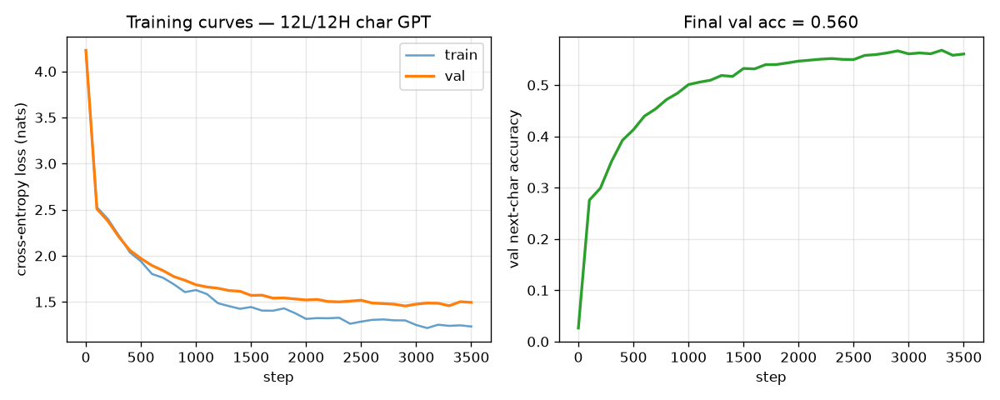

# REPORT — Does the 12-layer Shakespeare GPT show Matthew-style activation plateaus?

> Final, presentable, current-best only (history in CHANGELOG.md).

## Summary

Matthew Shinkle & StefanHex's post *Activation Plateaus: Where and How They Emerge* reports a striking
geometry inside trained transformers: take two inputs, interpolate between their internal activations,
and the network's output does **not** morph gradually. Instead it stays locked to the first input's
output, snaps across a narrow boundary, and locks to the second input's output — a
**plateau–boundary–plateau** curve. If real, this matters for safety-relevant interpretability: it
means the network's computation is organized into discrete basins, so activation-space edits
(steering, patching) behave predictably inside a basin and abruptly across one, and jailbreak- or
backdoor-style behavior switches may live at such boundaries.

This direction asks the cheap gating question for one specific model: does the **12-layer, 12-head
character-level Shakespeare GPT** from *Deep Networks Always Grok and Here is Why* (Figure 9) show
Matthew-style plateaus? The paper's GPT code and checkpoint are not public, so we trained a faithful
reconstruction (next-char accuracy 0.56 ≈ 37× chance) and ran the two-natural-endpoint interpolation
assay with everything frozen before any curve was inspected.

**Result: plateaus are present.** 14 of 40 frozen minimal pairs show plateau–boundary–plateau
structure in raw individual final-logit curves under a strict preregistered rule (transition width
≤ 0.25 of the path, vs 0.8 for the no-plateau diagonal); most other pairs show the same sigmoid shape
with a wider boundary. Two independent signatures behave exactly as predicted for real plateaus: the
boundary **sharpens monotonically through successive downstream layers**, and it **fades toward the
diagonal when the interpolation point moves later** (leaving fewer layers downstream). **Verdict: go**
for a plateau-mapping follow-up on this model — qualified, because we tested a reconstruction rather
than the paper's exact checkpoint.

## Methods

### Data & Model

- **Task/data.** Next-character prediction on **Tiny Shakespeare** (`input.txt`, 1,115,394 chars,
  SHA-256 `86c4e6…565ed`); first 90% train, last 10% validation; character-level tokens (vocab 65).
- **Model.** A nanoGPT-style decoder-only GPT: **12 blocks, 12 heads, GeLU MLPs** (the paper's
  confirmed Figure-9 facts), pre-norm, learned positions, weight-tied head. Reconstruction choices
  (unspecified by the paper): `d_model = 240`, MLP hidden `4·d_model`, context 128, dropout 0.2,
  8.38M params. Every field is tagged confirmed-vs-reconstructed in `MODEL_SPEC.md`.
- **Why a reconstruction.** The official repo `AhmedImtiazPrio/grok-adversarial` (audited via the
  GitHub API, 2026-07-15) contains no GPT/Shakespeare code or checkpoint. All conclusions are
  explicitly about this reconstruction (plan success-criterion 3).
- **Training.** AdamW (betas 0.9/0.99, weight decay 0.1), peak LR 1e-3, 100-step warmup + cosine
  decay, batch 48×128, fp32, 3,500 steps → **val loss 1.494, val next-char accuracy 0.560**. Seeds
  and provenance in `results/train_meta.json`; curves in Figure 1.
- **Hook point.** We intervene on the **residual stream** — the running hidden vector that each
  transformer block reads from and adds to — at the **final sequence position**, after block $L$
  (`resid_post`). Because attention is causal, replacing only the final position's vector and
  re-running blocks $L{+}1..11$ is an exact continuation of the forward pass (verified below). The
  primary interpolation point is **block 0**, leaving 11 of 12 blocks downstream. **Logits** are the
  model's 65 raw pre-softmax output scores at the final position.
- **Sample sizes.** 40 frozen pairs × 101 interpolation steps; recording at 11 downstream residual
  points + final logits; depth comparison over interpolation blocks {0, 2, 4, 6, 8, 10}.

### Constructing natural minimal pairs (frozen before any curve was seen)

The question is about interpolating between **two natural activations**, so each pair must be two
real, plausible inputs whose activations differ as little as possible — we use equal-length sequences
`prefix + char_A` vs `prefix + char_B`, identical except the final input character. Selection never
looks at interpolation curves (that would bias the frozen set toward or away from plateaus):

- 40 shared prefixes of length 127 sampled from held-out validation text (seed 20260717,
  deduplicated), giving full sequences of the model's context length 128.
- `char_A` = the character actually observed after the prefix in the corpus (guaranteed natural);
  `char_B` = the model's highest-probability next character, or its second if the top choice equals
  `char_A` (both endpoints plausible; median model probability of `char_B` is 0.146). This is
  option 2 of the plan; option 1 (two continuations of the same 127-char prefix observed in text) is
  infeasible — such long prefixes are unique in a 1.1M-char corpus.
- **Degeneracy exclusion (frozen threshold):** a pair would be dropped only if its two endpoint logit
  vectors were numerically indistinguishable (L2 distance < 1e-3). None were: endpoint distances span
  8.7–64.4 (median 24.7). All pair metadata is in `results/prompt_pairs.json`.

### Spherical interpolation and patching

A straight line between two activations cuts through low-norm regions the model never produces, which
would confound "off-distribution activation" with "between two inputs". Following Matthew's post we
therefore **slerp** (spherically interpolate) the directions and linearly interpolate the norms: for
$t \in [0,1]$, with $\theta$ the angle between $h_A$ and $h_B$,

```math
\hat h(t)=\frac{\sin((1-t)\theta)}{\sin\theta}\,\frac{h_A}{\lVert h_A\rVert}
+\frac{\sin(t\theta)}{\sin\theta}\,\frac{h_B}{\lVert h_B\rVert},
\qquad
h(t)=\Big[(1-t)\lVert h_A\rVert+t\lVert h_B\rVert\Big]\,\hat h(t),
```

```math
\theta=\arccos\!\left(\frac{h_A^{\top} h_B}{\lVert h_A\rVert\,\lVert h_B\rVert}\right)
\quad\text{(cosine clamped to } [-1,1]\text{; if } \theta<10^{-4}\text{, fall back to normalized linear interpolation).}
```

Each $h(t)$ is patched into the final position of the block-$L$ residual stream (all earlier positions
untouched — they are identical between A and B anyway, verified below) and the remaining blocks are
run. We use 101 evenly spaced $t$ values including both endpoints, identical for all pairs.

### Metrics

**Relative distance $d(t)$** — *is the downstream output near endpoint A, near endpoint B, or in
between?* Raw distances are not comparable across pairs (endpoint separations vary 8.7–64.4), so we
use Matthew's normalized form, where $x(t)$ is the recorded downstream vector (final logits, or a
later block's final-position residual) and $x_A, x_B$ are the endpoints' vectors at the same point:

```math
d(t)=\frac{\lVert x(t)-x_A\rVert_2}{\lVert x(t)-x_A\rVert_2+\lVert x(t)-x_B\rVert_2}.
```

Read it as: $d \approx 0$ means "output still looks like A", $d \approx 1$ "like B". A
**plateau–boundary–plateau** curve hugs 0, crosses quickly, then hugs 1; a no-plateau response is
roughly the diagonal $d = t$. By construction $d(0)=0$ and $d(1)=1$. The raw individual curves are
the primary evidence (Figures 2–4).

**Transition width $w_{10\to 90}$** — *how narrow is the boundary?* Eyeballing 40 curves invites
cherry-picking, so we summarize each curve with one boundary-position-invariant scalar: the fraction
of the path over which $d$ climbs from 0.1 to 0.9,

```math
w_{10\rightarrow 90}=t(d=0.9)-t(d=0.1),
```

with the crossing points read off an **isotonic copy** of the curve (a least-squares monotone fit via
the pool-adjacent-violators algorithm) so that small non-monotonic wiggles cannot create spurious
crossings; plots always show the raw curve. Smaller is sharper. The diagonal scores $w = 0.8$; our
synthetic step curve scores 0.089. Consumed by the per-pair panel titles (Figure 2) and the layerwise
and depth tables/figures (Figures 3–4). Curves whose raw-vs-isotonic deviation exceeds 0.10 would be
reported separately as non-monotone and excluded from width statistics (none occurred: 0/40).

**Candidate-plateau rule (frozen).** A pair counts as a plateau iff $w_{10\to 90} \le 0.25$ **and**
the transition both starts after 10% and ends before 90% of the path ($t_{lo} \ge 0.10$,
$t_{hi} \le 0.90$ — i.e. the curve visibly rests near each endpoint) **and** the curve is
near-monotone (isotonic deviation ≤ 0.10). This yields the headline count `14/40` in Results.

### Baselines

**Diagonal (no-plateau) reference.** The straight line $d = t$ is what a downstream map that morphs
uniformly between the two outputs would produce; it scores $w_{10\to 90} = 0.8$. It is drawn as the
gray dashed line in every figure, and the depth-comparison test checks whether curves collapse onto
it.

**Synthetic calibration (assay unit test).** A synthetic step-like path (sharp sigmoid, boundary at
$t = 0.5$) must be detected as a narrow transition and a synthetic linear path must not:
measured $w = 0.089$ (detected) vs $w = 0.800$ (rejected). This shows the pipeline *can* find a
plateau if one exists and does not hallucinate one from a line.

### Implementation checks (all passed before the full run)

- **Endpoint fidelity:** patched $t{=}0$ / $t{=}1$ forwards reproduce the direct unpatched forwards
  of A and B (max abs logit error < 1e-3), and $d(0) < 10^{-4}$, $d(1) > 1-10^{-4}$ for every pair.
- **Minimal-pair validity:** sequences differ only at the final character; the final-position patch
  is exact because all earlier-position activations of A and B match at every block (max abs
  difference < 1e-4).
- **Batching:** batched interpolation matches a single-example reference to < 1e-5.
- **Slerp:** endpoints reproduced exactly; interpolated norms linear; near-collinear fallback tested.

## Results

**Training.** Val loss 1.494 / accuracy 0.560 — a clearly trained network, not a random one.



**Primary result: 14/40 frozen pairs are plateaus; almost all curves are sigmoid.** With
interpolation after block 0 and recording at final logits, 14 of 40 pairs meet the strict frozen rule
(IDs 0, 4, 5, 6, 7, 9, 14, 20, 21, 22, 28, 34, 36, 37); 24/40 have $w \le 0.35$; only 2/40 are
near-diagonal (#10, #19, $w \ge 0.6$); 0/40 are non-monotone. Median width is 0.309 (range
[0.110, 0.773]) against the diagonal's 0.8. The structure is visible pair by pair — no averaging is
involved:


This is heterogeneity worth stating plainly: the strict 0.25 bar splits a continuum — the model's
typical curve is strongly sigmoid (three times sharper than the diagonal) rather than every pair
being an extreme step. No pair had to be discarded, and endpoint separation does not obviously
predict which pairs pass.

**The boundary sharpens with depth, exactly as Matthew observed.** Fixing interpolation after
block 0 and recording $d(t)$ at each later block's final-position residual: median width falls
strictly monotonically from 0.777 (block 1) to 0.445 (block 11) and 0.309 at the logits; the strict
rule is passed only at the logits (14 pairs), never at intermediate residuals. The plateau is
*formed* by the downstream stack, not present in the interpolated activation itself:


**Later interpolation kills the plateau — the predicted control.** If downstream layers create the
plateau, interpolating later (fewer layers left) must weaken it. It does, monotonically: median
$w_{10\to 90}$ = 0.309, 0.564, 0.647, 0.733, 0.757, 0.802 for interpolation blocks 0, 2, 4, 6, 8, 10
— reaching the diagonal reference 0.8 when only one block remains:


Tidy per-curve data: `results/matthew_tidy.csv`; per-pair summary: `results/matthew_summary.json`.

## Conclusion

The reconstructed 12-layer character-level Shakespeare GPT **shows Matthew-style activation
plateaus**. Under a fully frozen assay, 14/40 natural minimal pairs produce individual
plateau–boundary–plateau curves in final-logit space; the typical pair is a clear sigmoid three times
sharper than the no-plateau diagonal; and both predicted structural signatures hold — monotone
sharpening across the 11 downstream blocks and monotone weakening as the interpolation point moves
later. The gate is **go**: mapping and interpreting these plateau basins (where boundaries lie, what
they correspond to linguistically, how they evolve over training) is warranted on this model.

**Interpretation.** The interpolated block-0 activation itself carries a nearly linear image of the
input mixture; the downstream stack then collapses it toward one of the two endpoint computations,
with the decision boundary near $t \approx 0.5$. That the effect strengthens with every additional
downstream layer suggests plateaus here are an emergent, distributed property of the whole stack
rather than a single layer's thresholding. Note this coexists with an earlier finding on the same
model (see CHANGELOG, 2026-07-15) that responses to *random-direction* perturbations are smooth and
saturating — that assay answered a different question; the plateau structure lives specifically along
natural activation-to-activation directions.

**Limitations.**
1. **Reconstruction, not the paper's checkpoint.** The verdict applies to a faithful, standard build
   of the Figure-9 architecture and training recipe, not the authors' exact weights.
2. **Strictness of the bar is arbitrary.** 14/40 pass at $w \le 0.25$; 24/40 at 0.35. We report the
   full width distribution so readers can apply their own threshold; the depth and layerwise trends
   do not depend on any threshold.
3. **Scope.** One model size, one training length (accuracy 0.56, not grokking-scale), final-position
   interpolation only, and endpoint pairs differing in exactly one character. Plateaus between more
   distant natural inputs are untested here.
