# REPORT — Do Grokking and Matthew-style activation plateaus emerge together?

> Final, presentable, current-best only (history in CHANGELOG.md).

## Summary

Matthew Shinkle & StefanHex's post *Activation Plateaus: Where and How They Emerge* reports a striking
geometry inside trained transformers: take two inputs, interpolate between their internal activations,
and the network's output does **not** morph gradually. Instead it stays locked to the first input's
output, snaps across a narrow boundary, and locks to the second input's output — a
**plateau–boundary–plateau** curve. If real, this matters for safety-relevant interpretability: it
means the network's computation is organized into discrete basins, so activation-space edits
(steering, patching) behave predictably inside a basin and abruptly across one, and jailbreak- or
backdoor-style behavior switches may live at such boundaries.

This direction asks the cheap gating question for one specific model: does the **12-layer, 12-head
character-level Shakespeare GPT** from *Deep Networks Always Grok and Here is Why* (its Figure 9) show
Matthew-style plateaus? The paper's GPT code and checkpoint are not public, so we trained a faithful
reconstruction (next-char accuracy 0.56 ≈ 37× chance) and ran the two-natural-endpoint interpolation
assay with everything frozen before any curve was inspected. One scope note up front: the grok
paper's own headline phenomenon is **grokking** — `ε=0.03`-PGD adversarial robustness emerging long
after training accuracy saturates, alongside a **second local-complexity descent**. We treat this as
an explicit **validity gate** (Methods §Figure-9 gate, Results §Figure-9 gate). **Both character runs
PASS this gate; the BPE run FAILs.** Test local complexity in the fresh 30k character run falls
1940 → 491 (step 15), turns back **up** to 989 (step 36) — a rise of 498 units against a 99% CI of
±4, traced by three measured checkpoints on a grid we densified to 24 points — and then descends for
the rest of training to 8.1, exactly Figure 9's first-descent → rise →
**second descent** shape; the second descent's onset (step 36) precedes the clean-accuracy peak
(step 4,994), and `ε=0.03` robustness rises from 0.001 at that onset to 0.53, continuing to climb
after clean accuracy has saturated. The 3,500-step pilot shows the same ordering (491 → 484 at step
19, up to 1043 at step 33, down to 68). The fresh BPE run does **not**: its only LC upturn is 30 units
(1.4% of the curve's range, below the preregistered 5% tolerance), so it has no second descent. The
consequence is that the **primary** relationship verdict stays **"not testable"** (PLAN case 5) —
Matthew's exact `big/in`, `big/large` tokens require the BPE model, and that is the run that fails —
while the **secondary** character evidence now sits on a run that *does* reproduce Figure 9, giving
**PLAN case 1 (temporally associated)** for the character analogues: the plateau sharpens inside the
same checkpoint window as the second LC descent and the emergence of delayed robustness. The paper's
role here is only to specify the model under test; the phenomenon under test is Matthew's activation
plateaus.

**Result: plateaus are present, we can time their emergence, and we can say what they are.** Each
interpolation curve plots the output's relative closeness to endpoint B (call it $d$, from 0 = "still
A's output" to 1 = "B's output"; defined precisely in Methods) against the interpolation position $t$;
the no-plateau reference is the **straight line** $d = t$ (transition width 0.8 — no flat segments).
Our **primary plateau evidence** runs Matthew's own code path with his exact context and two
preregistered single-token character controls (`b↔i`, `b↔l`) across six frozen training checkpoints.
The plateau is **absent at initialization** (curve is the straight line, width ≈ 0.80) and **emerges
during training**: by step ~831 it is a sharp plateau–boundary–plateau sigmoid (width ≈ 0.33) and stays
there to step 30k. That emergence sits **inside** the second-descent window (steps 36 → 30,000) and
straddles the sustained robustness onset (step 531) — the association behind the case-1 verdict — but
it occupies only the early part of that window and is complete long **before** robustness saturates at
step ~7,819, so the plateau is *not* waiting for grokking to finish.
Sweeps of increasing scope then pin the phenomenon down. Fixing one endpoint at the **comma** and
sweeping the other over all 64 remaining characters: no pair responds linearly (median width 0.340),
but only 1/64 clears the strict ≤ 0.25 bar, and sharpness tracks how likely the model thinks that
character is (rank correlation −0.74). Repeating that in **8 further contexts** from held-out text
(576 pairs): the shape result replicates exactly — **0/576** near-linear curves, per-context medians
0.313–0.436 — while the probability effect replicates only in **direction** (negative in 9/9 contexts,
sign test p = 0.004) at a more modest typical size (median ρ = −0.41). Finally, the exhaustive
**all-pairs sweep** — every one of the **2,080** character pairs — answers what the plateaus
correspond to: **every character owns a basin** (`flat_frac` ≥ 0.86 for all 65), **78%** of the
variance in transition width is explained by per-character terms rather than pair-specific chemistry,
**91%** of the model's next-character prediction changes along a path fall inside the transition
window, and the whole structure is **learned** (median width 0.803 at init → 0.355 trained) and built
by the **shallow blocks** (0.34 patching at block 0 vs 0.81 at block 8). Two interventions then test
the mechanism: biasing the readout cannot move the plateau at all ($d(t)$ is exactly invariant to it),
while **scaling the MLPs of blocks 1–4 moves it directly** — deleting them returns the width to the
untrained value (0.35 → **0.80**, 0/150 pairs plateaued) and amplifying them sharpens it (→ 0.31,
strict pass rate 10% → 30%), with the same intervention on blocks 8–11 doing essentially nothing
($|\Delta w| \le 0.025$). Deleting those four MLPs one at a time shows the sharpness is **distributed**
across them (shares 41/28/18/11%, none dominant), and — measuring both candidate mechanisms under
every ablated model — the collapse tracks **neither** of them: the next-character decision survives
intact (80.7% of pairs still predict different characters at their endpoints) while $d(t)$ goes
straight, and the endpoint-plausibility landscape barely moves ($\rho(\Delta w,\Delta\max p)=+0.22$).
**Verdict: plateaus are real in this model, and they are next-character decision basins** — but
"decision basin" is a *description* of them, not their mechanism, which sits upstream in the early
MLPs. Qualified further because we tested a reconstruction rather than the paper's exact checkpoint,
and because the sharpness is graded rather than step-like.

## Methods

### Data & Model

- **Task/data.** Next-character prediction on **Tiny Shakespeare** (`input.txt`, 1,115,394 chars,
  SHA-256 `86c4e6…565ed`); first 90% train, last 10% validation; character-level tokens (vocab 65).
- **Model.** A nanoGPT-style decoder-only GPT: **12 blocks, 12 heads, GeLU MLPs** (the paper's
  confirmed Figure-9 facts), pre-norm, learned positions, weight-tied head. Reconstruction choices
  (unspecified by the paper): `d_model = 240`, MLP hidden `4·d_model`, context 128, dropout 0.2,
  8.38M params. Every field is tagged confirmed-vs-reconstructed in `MODEL_SPEC.md`.
- **Why a reconstruction.** The official repo `AhmedImtiazPrio/grok-adversarial` (audited via the
  GitHub API, 2026-07-15) contains no GPT/Shakespeare code or checkpoint. All conclusions are
  explicitly about this reconstruction.
- **Training.** AdamW (betas 0.9/0.99, weight decay 0.1), peak LR 1e-3, 100-step warmup + cosine
  decay, batch 48×128, fp32. The pilot ran 3,500 steps → **val loss 1.494, val next-char accuracy
  0.560**; the fresh character run ran 30,000 steps → val accuracy 0.554 (peak 0.568). Seeds and
  provenance in `results/train_meta*.json`; curves in Figure 1.
- **Hook point.** We intervene on the **residual stream** — the running hidden vector that each
  transformer block reads from and adds to — at the **final sequence position**, after block $L$
  (`resid_post`). Because attention is causal, replacing only the final position's vector and
  re-running blocks $L{+}1..11$ is an exact continuation of the forward pass (verified below). The
  primary interpolation point is **block 0**, leaving 11 of 12 blocks downstream. **Logits** are the
  model's 65 raw pre-softmax output scores at the final position.
- **Sample sizes.** Matthew-faithful controls: 2 pairs × 50 interpolation steps × 12 interpolation
  blocks × 6 checkpoints. Comma sweep: 64 pairs × 50 steps × (6 checkpoints at block 0, plus all 12
  blocks at the final checkpoint). Context control: 9 contexts × 64 pairs × 50 steps. All-pairs sweep:
  2,080 pairs × 50 steps at block 0, at both the final and the initialization checkpoint, plus a
  200-pair subsample at blocks 4/8/11 and a 100-pair endpoint-swap replication. Exploratory 40-pair
  set: 40 pairs × 101 steps, recording at 11 downstream residual points + final logits.

### Constructing natural minimal pairs (frozen before any curve was seen)

The question is about interpolating between **two natural activations**, so each pair must be two
real, plausible inputs whose activations differ as little as possible — we use equal-length sequences
`prefix + char_A` vs `prefix + char_B`, identical except the final input character. Selection never
looks at interpolation curves (that would bias the frozen set toward or away from plateaus):

- 40 shared prefixes of length 127 sampled from held-out validation text (seed 20260717,
  deduplicated), giving full sequences of the model's context length 128.
- `char_A` = the character actually observed after the prefix in the corpus (guaranteed natural);
  `char_B` = the model's highest-probability next character, or its second if the top choice equals
  `char_A` (both endpoints plausible; median model probability of `char_B` is 0.146).
- **Degeneracy exclusion (frozen threshold):** a pair would be dropped only if its two endpoint logit
  vectors were numerically indistinguishable (L2 distance < 1e-3). None were: endpoint distances span
  8.7–64.4 (median 24.7). All pair metadata is in `results/prompt_pairs.json`.

### Matthew-faithful character-token controls across training (primary plateau assay)

The **primary** plateau evidence follows Matthew's released config/code path
(`experiments/run_matthew_ckpts.py`, `configs/matthew_char_control.yaml`) so it transfers his assay
with only the model adapter changed: shared context `"The house was"`, **exactly 50** evenly spaced
interpolation values including both endpoints, `slerp_rescale` (spherical direction + linear norm;
same equations below), patch **only the final sequence position**, and sweep **every** interpolation
layer (`resid_post` blocks 0–11), recording Matthew's downstream hooks (`attn_out`, `resid_mid`,
`mlp_post`, `mlp_out`, `resid_post`) plus final logits. Because the character model cannot represent
Matthew's `big/in/large` as single tokens, we use his two preregistered single-**character** controls
`b↔i` and `b↔l` (labelled tokenizer controls, *not* replications of his word examples). We run them at
**6 checkpoint phases frozen before any plateau curve was inspected** (`experiments/freeze_phases.py`
→ `results/frozen_phases_char.json`; the Figure-9 LC curve is monotone so the rule falls back to
log-spaced picks): steps **0, 56, 831, 7819, 17500, 30000**. This lets us plot plateau width *against*
the Grokking metrics on one training-step axis (Results §Primary plateau evidence).

### Comma against every other character (operator-requested sweep)

The two controls above are only two pairs, so an operator asked whether the plateau holds when one
endpoint is held fixed and the other is swept over the whole alphabet. We fix endpoint A at the comma
and use every other character as endpoint B, giving **64 pairs** (`experiments/comma_sweep.py`).
Everything else is unchanged from the primary assay: the same fresh character GPT and its saved
checkpoints, shared context `"The house was "`, endpoint A = context + `,`, endpoint B = context +
one other character, **50** evenly spaced interpolation values, `slerp_rescale`, patch of the final
position only, and $d(t)$ read in final-logit space.

Two extra quantities are measured at the final checkpoint, only to ask *why* some pairs switch more
sharply than others. The first asks whether sharpness tracks how ordinary the second character is in
this context. With $x_{\text{ctx}}$ the context `"The house was "` and $f$ the model, the model's
**next-character probability** for character $c$ is its softmax score at the final position:

```math
p(c)=\mathrm{softmax}\big(f(x_{\text{ctx}})\big)_c .
```

The second is a control against a trivial explanation — that flat curves merely mean the two
endpoints' outputs are hard to tell apart. **Endpoint separation** is the plain distance between the
two endpoint logit vectors $\ell_A$ and $\ell_B$:

```math
s(A,B)=\lVert \ell_{A}-\ell_{B}\rVert_2 .
```

Both are related to width by the **Spearman rank correlation** $\rho$ — the ordinary correlation
computed on ranks rather than raw values, so it measures "does one go up when the other goes down?"
without assuming a straight-line relation. With $R_i$ and $S_i$ the ranks of the two quantities for
pair $i$ over $n$ pairs:

```math
\rho = 1-\frac{6\sum_{i=1}^{n}(R_i-S_i)^2}{n\,(n^2-1)} .
```

$\rho$ runs from −1 (perfect opposite ordering) through 0 (no monotone relation) to +1. These two
quantities are consumed by Results §"Comma against every other character", by the context control
that follows it, and by the all-pairs sweep.

### Context control: the same sweep in eight further contexts

Every plateau number above is measured in the one shared context `"The house was "`, whose comma
endpoint is also an implausible continuation ($p = 1.0\times10^{-7}$). Both facts are candidate
confounds, so we repeat the whole comma sweep in **8 additional contexts** (`experiments/context_sweep.py`).
Contexts are 64-character windows sampled from held-out validation text (seed 20260725, 256
candidates), then chosen at nine evenly spaced ranks of $p(\texttt{,})$ — the model's probability of
a comma in that slot, from the same equation as above — so the set spans "a comma is impossible here"
to "a comma is almost certainly next". Adding the reference context gives 9 contexts × 64 pairs =
**576 pairs**, all at the final checkpoint (step 30,000), interpolation block 0, final logits, with
every other setting unchanged.

Two things are then asked of the data. First, **does the shape claim survive the change of context?**
— answered by the per-context width distribution and the count of near-linear curves. Second, **does
the width-vs-probability correlation replicate?** — answered by computing $\rho$ *within* each
context. Since nine correlations of varying strength cannot be summarized by their mean, we report
the median and range, and test only the direction with a **sign test**: under the null that sharpness
is unrelated to the model's probability, each context's $\rho$ is negative with probability $1/2$, so
observing $k$ negatives out of $n$ has two-sided p-value

```math
p = 2^{1-n}\sum_{j=k}^{n}\binom{n}{j} .
```

Finally, to test the implausible-endpoint worry directly, we correlate each context's **median width**
with its $p(\texttt{,})$ across the nine contexts. These are consumed by Results §"Does the plateau
depend on the context?".

### All-pairs sweep: every character against every other

The sweeps above always hold one endpoint fixed, so they cannot say whether *each* character sits in a
basin of its own or whether sharpness is a property of the particular pair. To decide that we run all
$\binom{65}{2} = 2080$ unordered character pairs (`experiments/allpairs_sweep.py`, analysed by
`experiments/analyze_allpairs.py`) through the identical frozen code path — context `"The house was "`,
50 evenly spaced $t$, `slerp_rescale`, final-position patch, $d(t)$ in final-logit space — at
interpolation block 0 of the step-30,000 character checkpoint. Endpoint order is fixed by vocabulary
index ($A$ = lower index) so the run is deterministic. Three additions are made to the same forward
passes, each motivated below: the per-$t$ prediction trace, a depth subsample, and an initialization
re-run.

**Endpoint-swap symmetry check.** $d(t)$ is not symmetric in $A$ and $B$ by definition, so before
drawing a symmetric $65\times65$ matrix we re-run 100 randomly chosen pairs with the endpoints swapped
and report the median $|w(A,B)-w(B,A)|$. If that is not negligible the full ordered matrix must be
drawn instead.

Three per-character statistics turn "is each character in its own plateau?" into a decidable question.
Let $P(c)$ be the 64 partners of character $c$, and let $t_{lo}$ and $t_{hi}$ be the start and end of
the transition on a pair's curve (defined under *Transition width* below).

**median width $\mathrm{med}_w(c)$** — how sharply $c$ is left, averaged over all partners; small
means every path in and out of $c$ is a quick switch:

```math
\mathrm{med}_w(c)=\underset{p\in P(c)}{\mathrm{median}}\ w_{10\to 90}(c,p).
```

**basin fraction $\phi(c)$** (written `flat_frac` in the figures) — the fraction of partners for which
the path stays locked to $c$'s output for at least 10% of its length. This is the direct "$c$ has a
basin of its own" statistic: it asks whether the output *rests* on $c$ rather than leaving immediately,
which is exactly the flat part of a plateau. The condition is read at whichever end $c$ occupies:

```math
\phi(c)=\frac{1}{64}\sum_{p\in P(c)}
\mathbf{1}\Big[\ t_{lo}(c,p)\ge 0.10 \ \text{ if } c=A, \quad t_{hi}(c,p)\le 0.90 \ \text{ if } c=B\ \Big].
```

**strict fraction $\sigma(c)$** — the fraction of $c$'s partners passing the frozen strict plateau rule
(below), i.e. the knife-edge version of the same question:

```math
\sigma(c)=\frac{1}{64}\sum_{p\in P(c)}\mathbf{1}\big[\ \text{pair }(c,p)\text{ passes the strict rule}\ \big].
```

**Per-character versus per-pair variance.** $\phi$ and $\mathrm{med}_w$ could both look structured even
if sharpness really lived in the pair. To separate the two we fit the additive model $w_{ij}\approx
\mu+a_i+a_j$ by least squares over all 2,080 widths (65 character effects, one intercept; the design is
rank-deficient by one, so the minimum-norm solution is used) and report the fraction of variance it
explains:

```math
R^2 = 1-\frac{\sum_{i<j}\big(w_{ij}-\hat w_{ij}\big)^2}{\sum_{i<j}\big(w_{ij}-\bar w\big)^2},
\qquad \hat w_{ij}=\hat\mu+\hat a_i+\hat a_j .
```

A high $R^2$ means each character carries its own sharpness into every pairing (PLAN verdicts i/ii);
a dominant residual $1-R^2$ means the sharpness lives in the pair (verdict iii). Because 65 free
parameters can fit noise, we also refit on 200 random permutations of $w$ to get the chance level.

**Readout-decision test.** The hypothesis we most want to test is that a plateau simply *is* the set of
residual states that decode to the same next character. We therefore record the model's predicted next
character $\arg\max f(h(t))$ at every $t$ and compare two locations. The **midpoint crossing** $t^{*}$
is where the curve is half-way across, read on the isotonic copy $\tilde d$:

```math
t^{*}=\min\{\,t:\ \tilde d(t)\ge 0.5\,\},
```

and the **first prediction flip** $t_{\text{flip}}$ is placed midway between the two grid points that
bracket the first change of the predicted character:

```math
t_{\text{flip}}=\tfrac{1}{2}\big(t_{k}+t_{k+1}\big),\qquad
k=\min\{\,m:\ \arg\max f(h(t_{m+1}))\neq\arg\max f(h(t_{m}))\,\}.
```

If the plateau boundary *is* the decision boundary then $t^{*}\approx t_{\text{flip}}$, paths visit
about two predictions, and — the sharper form of the test — every prediction change falls inside the
transition window $[t_{lo},t_{hi}]$, leaving each flat arm a single constant prediction. We report the
distribution of $t^{*}-t_{\text{flip}}$, the number of distinct predictions per path, the mean fraction
of changes inside the window, and the fraction of paths with single-prediction arms.

The readout-decision test above is correlational: $t^{*}$ and $t_{\text{flip}}$ could coincide because
the decision creates the plateau, or because both track one upstream change. To tell those apart we
**intervene on the readout only**. Let $a^{*}=\arg\max f(h(0))$ and $b^{*}=\arg\max f(h(1))$ be the two
endpoint predictions and let the **readout gap** be the logit difference between them along the path,
which starts positive and ends negative:

```math
g(t) = f(h(t))_{a^{*}} - f(h(t))_{b^{*}}.
```

The **decision boundary** $t_{\mathrm{gap}}$ is where that gap changes sign — the point on the path at
which the model stops predicting $a^{*}$ and starts predicting $b^{*}$ — found by linear interpolation
between the bracketing grid points:

```math
t_{\mathrm{gap}} = \min\{\, t:\ g(t) \le 0 \,\}.
```

Adding a constant $c$ to the unembedding row of $a^{*}$ replaces $g$ by $g-c$ and therefore moves
$t_{\mathrm{gap}}$, while every residual-stream activation on the path is untouched. Two bias sizes are
fixed in advance per pair — one equalising the endpoint predictions, one forcing the boundary to the
path midpoint:

```math
c_{\mathrm{eq}} = \tfrac{1}{2}\big(g(0)+g(1)\big), \qquad c_{\mathrm{half}} = g(0.5).
```

We report, for each bias, how far the boundary actually moves ($t^{c}_{\mathrm{gap}}-t_{\mathrm{gap}}$),
the bias size in nats relative to the endpoint gap span $g(0)-g(1)$, the resulting
$|t^{*}-t_{\mathrm{gap}}|$, and — as a numerical check on the algebra — the largest deviation between
$d(t)$ computed with and without the bias. The decision account predicts the plateau follows the
boundary; the measured invariance of $d(t)$ and the size of the shift decide it (Figure 20).

That probe rules the readout out but cannot say which upstream computation produces the sharp change.
The depth control (below) points at the earliest blocks, but only by moving where the patch is
injected — the model itself is never altered. To make that causal we scale the **MLP-branch output** of
a chosen set of blocks $S$ by a gain $g$, leaving attention, LayerNorm and all other blocks untouched:

```math
x \leftarrow x + \mathrm{attn}(\mathrm{LN}_1 x) + g\,\mathrm{mlp}(\mathrm{LN}_2 x), \qquad \text{for blocks } l \in S.
```

$g=1$ is the unmodified model, $g=0$ deletes those MLPs and $g=1.5$ amplifies them. Endpoints are
recomputed under each modified model, so $d(t)$ always measures the modified model's own path between
its own endpoints and the assay is otherwise unchanged. We run $S = \lbrace 1,2,3,4 \rbrace$ (the
**early** group the depth control implicates) and, as a specificity control, $S = \lbrace 8,9,10,11
\rbrace$ (the **late** group it does not), on a fixed random 150-pair subsample of the 2,080 at
interpolation block 0 of the step-30000 checkpoint. Reported per condition: median and interquartile
range of $w_{10\to90}$, the strict-rule pass rate, and the *paired* per-pair changes
$\Delta w = w^{g} - w^{g=1}$ and $\Delta t^{*} = t^{*g} - t^{*g=1}$ on the same pairs (Figure 21). The
"blocks 1–4 build the sharpness" account predicts a monotone widening as $g \to 0$ in the early group
and no such effect in the late group.

That gain experiment treats blocks 1–4 as one lump and cannot say what the width change it produces
*tracks*. So we run a **per-block scan**: the same intervention with $S=\lbrace l \rbrace$ for each
$l \in \lbrace 1,2,3,4 \rbrace$ separately at $g=0$, on the identical 150-pair subsample, plus
$S=\lbrace 1,2,3,4 \rbrace$ re-run in the same script as an in-run reference. To attribute a share of
the effect to each block we report its median paired widening as a fraction of the all-four widening:

```math
F_l=\frac{\mathrm{median}_i\,\big(w_i^{\lbrace l\rbrace}-w_i^{\mathrm{base}}\big)}{\mathrm{median}_i\,\big(w_i^{\lbrace 1,2,3,4\rbrace}-w_i^{\mathrm{base}}\big)}.
```

$F_l$ near $1$ would mean block $l$ alone reproduces the whole group effect (one block carries the
sharpness); values summing to about $1$ with none dominant mean the effect is distributed and roughly
additive. Under every condition we also re-measure the two accounts still standing, so that the same
forward passes decide between them.

**Plausibility mediator** — the endpoint plausibility $\max p_i=\max\big(p(A\mid \text{context}), p(B\mid \text{context})\big)$ recomputed *under the ablated model*, together with the endpoint logit separation $\mathrm{sep}_i$ it must be partialled against. Two questions are asked of it: does the width–plausibility association still hold within each ablated model (partial Spearman $\rho_{w,\max p \cdot \mathrm{sep}}$), and does it *mediate* the intervention — i.e. do the pairs whose plausibility moves most also widen most:

```math
\rho\big(\Delta w,\ \Delta \max p\big),\qquad \Delta \max p_i=\max p_i^{\,\text{ablated}}-\max p_i^{\,\text{base}}.
```

If plausibility were the mechanism, deleting the MLPs would widen the plateaus *by* flattening the
plausibility landscape, and this correlation would be strongly negative. A near-zero value with a
large $\Delta w$ dissociates the two.

**Decision mediator** — three descriptors of whether the path still crosses a next-character decision:
the fraction of pairs whose two endpoints predict different characters ($a^{*}\neq b^{*}$), the median
number of distinct $\arg\max$ characters visited along the path, and the median distance
$|t^{*}-t_{\mathrm{flip}}|$ between the plateau midpoint and the first prediction flip. If a plateau
simply *is* the decision region, destroying the plateau should destroy the decision structure with it;
a surviving decision alongside a straight $d(t)$ falsifies that reading (Figure 22).

**Two mandatory controls.** *Learned-vs-init*: the identical 2,080-pair sweep at the step-0 checkpoint.
If the width distribution at initialization already matched the trained one, the structure would be
architectural rather than learned, and no claim about training could stand. *Depth*: a fixed random
200-pair subsample re-patched at interpolation blocks 4, 8 and 11. Block 11 leaves only the final layer
norm and the unembedding downstream, so it is the near-linear readout reference; if $w$ grows toward
the deep end, the sharpness is produced by the intervening blocks rather than by the unembedding
geometry.

**Plausibility confound.** The comma sweep found width correlated with the model's next-character
probability, so before attributing anything to "plateaus" we recompute that on the all-pairs set using
$\max(p(A),p(B))$ and $|\log p(A)-\log p(B)|$, and — because plausibility and endpoint separation are
themselves correlated — report **partial** Spearman correlations. The partial correlation of $x$ and
$y$ given $z$ is the ordinary correlation of the residuals left after linearly regressing each of the
rank vectors $R_x,R_y$ on the rank vector $R_z$:

```math
\rho_{xy\cdot z}=\mathrm{corr}\big(R_x-\hat R_x(R_z),\ \ R_y-\hat R_y(R_z)\big).
```

### Frozen-block training test (does the sharpness have to be learned in blocks 1–4?)

Every intervention above removes or rescales a component of an already-trained network. That can show
a trained block is load-bearing *at inference*, but it cannot show the sharpness had to be **learned
there**: a network denied those weights during training might simply build the same shape somewhere
else. So we retrain from scratch, holding a block group $S$ at its initialization for the whole run:

```math
\theta_l^{(k)}=\theta_l^{(0)}\quad\text{for every block } l\in S \text{ and every optimization step } k,
```

with every other detail identical to the reference fresh character run — same corpus and SHA-256, same
90/10 split, same model seed (so the frozen blocks hold *exactly* the reference run's random
initialization), same data order, same Adam(lr $10^{-3}$ cosine $\to 10^{-4}$, betas 0.9/0.99, weight
decay 0), same 30,000-step schedule, same batch size, same checkpoint grid. Two runs:
$S=\lbrace 1,2,3,4\rbrace$ (**frozen-early**, the group the ablations implicate) and
$S=\lbrace 8,9,10,11\rbrace$ (**frozen-late**, the same *number* of blocks at a depth those ablations
showed contributes almost nothing). Frozen-late is the specificity control: if merely removing four
blocks' worth of capacity straightened the paths, it would straighten them too.

The prediction is only meaningful at equal task performance — a network that simply failed to learn
would trivially have untrained-looking geometry. So we assay each frozen run at its **matched-accuracy
checkpoint**, the first step whose validation next-character accuracy reaches the reference run's final
value $a^{\mathrm{ref}}_{\mathrm{val}}(30000)=0.550$:

```math
k_{\mathrm{match}}=\min\lbrace k\ :\ a_{\mathrm{val}}(k)\ \ge\ a^{\mathrm{ref}}_{\mathrm{val}}(30000)\rbrace,
```

and again at its final checkpoint. The frozen assay then runs unchanged on the same fixed 150-pair
subsample at interpolation block 0, so every width is comparable to the ablation results above. Three
reference conditions are measured on those same pairs: the reference run at step 0 (untrained), at
step $2500$ (the checkpoint nearest $k_{\mathrm{match}}$, which separates "sharpness at matched
accuracy" from "sharpness this early in training"), and at step 30,000 (fully trained). The hypothesis
predicts frozen-early stays near the untrained width $\approx 0.80$ while frozen-late sharpens like the
reference; any other outcome falsifies it (Figure 23).

### Spherical interpolation and patching

A straight line between two activations cuts through low-norm regions the model never produces, which
would confound "off-distribution activation" with "between two inputs". Following Matthew's post we
therefore **slerp** (spherically interpolate) the directions and linearly interpolate the norms: for
$t \in [0,1]$, with $\theta$ the angle between $h_A$ and $h_B$,

```math
\hat h(t)=\frac{\sin((1-t)\theta)}{\sin\theta}\,\frac{h_A}{\lVert h_A\rVert}
+\frac{\sin(t\theta)}{\sin\theta}\,\frac{h_B}{\lVert h_B\rVert},
\qquad
h(t)=\Big[(1-t)\lVert h_A\rVert+t\lVert h_B\rVert\Big]\,\hat h(t),
```

```math
\theta=\arccos\!\left(\frac{h_A^{\top} h_B}{\lVert h_A\rVert\,\lVert h_B\rVert}\right)
\quad\text{(cosine clamped to } [-1,1]\text{; if } \theta<10^{-4}\text{, fall back to normalized linear interpolation).}
```

Each $h(t)$ is patched into the final position of the block-$L$ residual stream (all earlier positions
untouched — they are identical between A and B anyway, verified below) and the remaining blocks are
run. The $t$ values are evenly spaced and include both endpoints, identical for all pairs: **50**
values in every Matthew-faithful assay (his released setting), 101 in the older exploratory 40-pair
set.

### Metrics

**Relative distance $d(t)$** — *is the downstream output near endpoint A, near endpoint B, or in
between?* Raw distances are not comparable across pairs (endpoint separations vary 8.7–64.4), so we
use Matthew's normalized form, where $x(t)$ is the recorded downstream vector (final logits, or a
later block's final-position residual) and $x_A, x_B$ are the endpoints' vectors at the same point:

```math
d(t)=\frac{\lVert x(t)-x_A\rVert_2}{\lVert x(t)-x_A\rVert_2+\lVert x(t)-x_B\rVert_2}.
```

Read it as: $d \approx 0$ means "output still looks like A", $d \approx 1$ "like B". A
**plateau–boundary–plateau** curve hugs 0, crosses quickly, then hugs 1; a no-plateau response is
roughly the straight line $d = t$. By construction $d(0)=0$ and $d(1)=1$. The raw individual curves
are the primary evidence (Figures 6, 8, 16, 20).

**Transition width $w_{10\to 90}$** — *how narrow is the boundary?* Eyeballing thousands of curves
invites cherry-picking, so we summarize each curve with one boundary-position-invariant scalar: the
fraction of the path over which $d$ climbs from 0.1 to 0.9,

```math
w_{10\rightarrow 90}=t_{hi}-t_{lo},\qquad t_{lo}=t(d=0.1),\quad t_{hi}=t(d=0.9),
```

with the crossing points read off an **isotonic copy** $\tilde d$ of the curve (a least-squares
monotone fit via the pool-adjacent-violators algorithm) so that small non-monotonic wiggles cannot
create spurious crossings; plots always show the raw curve. Smaller is sharper. The straight line
scores $w = 0.8$; our synthetic step curve scores 0.089. Curves whose raw-vs-isotonic deviation exceeds
0.10 would be reported separately as non-monotone and excluded from width statistics (none ever
occurred).

**Candidate-plateau rule (frozen).** A pair counts as a strict plateau iff $w_{10\to 90} \le 0.25$
**and** the transition both starts after 10% and ends before 90% of the path ($t_{lo} \ge 0.10$,
$t_{hi} \le 0.90$ — i.e. the curve visibly rests near each endpoint) **and** the curve is near-monotone
(isotonic deviation ≤ 0.10). This yields the strict counts throughout Results.

### Baselines

**Straight-line (no-plateau) reference.** The line $d = t$ is what a downstream map that morphs
uniformly between the two outputs would produce; it scores $w_{10\to 90} = 0.8$. It is drawn as the
gray dashed reference line in every figure, and the depth-comparison test checks whether curves
collapse onto it.

**Synthetic calibration (assay unit test).** A synthetic step-like path (sharp sigmoid, boundary at
$t = 0.5$) must be detected as a narrow transition and a synthetic linear path must not:
measured $w = 0.089$ (detected) vs $w = 0.800$ (rejected). This shows the pipeline *can* find a
plateau if one exists and does not hallucinate one from a line.

**Initialization baseline (all-pairs sweep).** The same 2,080 pairs measured on the untrained network.
This is the baseline that decides whether any of the structure is learned; it is reported in Results
§Controls and is the reference against which the trained width distribution is read.

**Chance level for the variance decomposition.** 200 refits of $w_{ij}\approx\mu+a_i+a_j$ on permuted
widths, giving the $R^2$ that 65 free parameters achieve on noise (3.0%, 99th percentile 4.1%).

### Figure-9 grokking gate (validity gate for any joint claim)

PLAN forbids joining the plateau result to a Grokking claim unless the model qualitatively reproduces
*Deep Networks Always Grok* Fig. 9. We measure Fig. 9's three quantities on log-spaced checkpoints with
a pipeline **source-locked** to the official repo (`experiments/fig9.py`; our forward reimplementation
matches the repo's to 0.0 logit error). **Data/model/layer:** the same reconstruction GPT, evaluated at
its saved checkpoints; local complexity is read from the 12 GeLU pre-activations. **Checkpoint grid:**
13 checkpoints for the pilot char run, 10 for the fresh BPE run, and **24** for the fresh char run —
that last grid was densified from 14 to 24 by evaluating 10 already-saved checkpoints (steps 1, 2, 6,
9, 23, 36, 88, 138, 339, 531) so the gate's LC local maximum would rest on more than a single measured
point (Results §Figure-9 gate). All checkpoints go through the identical pipeline with the same frozen
evaluation points, so densifying changes only the grid, never the protocol.

**Local complexity (LC)** — *how many piecewise-linear regions does the network fold near the data?* For
each of the 12 GeLU layers we count, along short random line segments through the input, how many times
that layer's pre-activations change sign (a proxy for region boundaries crossed), and sum over layers.
With $N_{seg}$ segments of radius $r$ around a base point and $z_{\ell}(u)$ the layer-$\ell$
pre-activation at point $u$:

```math
\mathrm{LC} = \sum_{\ell=1}^{12} \mathbb{E}\big[\,\#\{\text{sign changes of } z_{\ell} \text{ along the segment}\}\,\big].
```

We report LC on 1,024 **train**, 1,024 **test**, and 1,024 **random** base points (`r=0.005`, `P=25`
samples per segment, 99% CIs) — the paper's defaults. Fig. 9's signature is a **second LC descent** that
begins before test accuracy peaks.

**Adversarial accuracy** — *does the model resist small input perturbations?* Next-token accuracy under an
`ε=0.03` `ℓ∞`-PGD attack in token-embedding space:

```math
\mathrm{adv\_acc} = \Pr\nolimits_{(x,y)}\Big[\ \arg\max \, f\big(x + \delta^\star\big) = y\ \Big],
\qquad \delta^\star = \arg\max_{\lVert\delta\rVert_\infty \le 0.03} \mathcal{L}\big(f(x+\delta), y\big).
```

Grokking = this rising **long after** clean accuracy saturates ("delayed robustness").

**Preregistered verdict rule** (`experiments/fig9_verdict.py`, applied identically to every run). Fig. 9's
shape is *descend → rise → descend again*, so the detector has to find that structure **in order**; the
tolerance below exists only to ignore checkpoint-to-checkpoint wiggles. Write $L_1,\dots,L_n$ for test LC
at the $n$ checkpoints and let

```math
\mathrm{tol} = 0.05\,\bigl(\max_k L_k - \min_k L_k\bigr).
```

Step 1, the **first significant local minimum** $i$: the earliest interior index with $L_i < L_{i-1}$ whose
following rise clears the tolerance. Step 2, the **local maximum** $j$ that opens the second descent: the
highest point between $i$ and the first later checkpoint that falls back below $L_i$, required to satisfy
$L_j - L_i > \mathrm{tol}$. Step 3, a **sustained second descent** after $j$:

```math
L_j - \min_{k>j} L_k > \mathrm{tol}, \qquad L_n \le \min_{k>j} L_k + \mathrm{tol}, \qquad L_n < L_i .
```

The last two conditions say the curve does not rebound before the horizon and ends below the *first*
minimum, i.e. it is a genuine second descent and not merely an undo of the rise. The onset of the second
descent is the step at index $j$.

Two ordering checks then decide the verdict (both preregistered in PLAN's "Grokking-paper signature").
**Onset before the accuracy peak:** step$(j)$ < step of the maximum clean test accuracy. **Robustness
rises during or after the descent**, with $A_k$ the `ε=0.03` PGD adversarial accuracy at checkpoint $k$:

```math
\max_{k \ge j} A_k - A_j \ge 0.05 \qquad\text{and}\qquad \max_{k \ge j} A_k \ge 0.05 .
```

We also report the *sustained* robustness onset — the first
checkpoint from which adv accuracy stays $\ge 0.05$ for the whole remainder of the run, so a
one-checkpoint transient cannot count — and whether it falls at or after step$(j)$.

**PASS** iff a sustained second descent exists **and** both ordering checks hold. **NOT ESTABLISHED** iff
there is no second descent, LC is still in its first monotone descent at the last checkpoint, *and*
robustness never emerges — the horizon was too short to decide. **FAIL** otherwise: valid measurements at
the planned horizon, but the Fig. 9 ordering is absent.

### Figure conventions

Every figure uses a colour-vision-deficiency-safe encoding (`experiments/cvd_style.py`): the
categorical palette is green-free, red-versus-green contrasts are never used, and **no series is
identified by colour alone** — each also carries a distinct linestyle, marker or hatch, which the
captions name. Continuous quantities use the `viridis` or `cividis` ramps, which stay monotone in
lightness and so remain readable in grayscale. Two reference lines recur: the gray dashed
no-plateau straight line ($w = 0.8$) and the black dotted strict plateau bar ($w = 0.25$).

**Rendering check.** Every equation and figure in this report is verified to render on GitHub by
`experiments/check_render.py`: it compiles each display equation and each inline expression with
KaTeX (applying GitHub's own backslash-stripping to inline math first), rejects macros GitHub's
renderer refuses (`\mathrm{softmax}` is used rather than `\operatorname{softmax}`, which GitHub
blocks), and confirms through the GitHub markdown API that every display equation renders as math and
that no figure is referenced by a bare path instead of an embedded image.

### Implementation checks (all passed before the full run)

- **Endpoint fidelity:** patched $t{=}0$ / $t{=}1$ forwards reproduce the direct unpatched forwards
  of A and B (max abs logit error < 1e-3), and $d(0) < 10^{-4}$, $d(1) > 1-10^{-4}$ for every pair.
  Across the 2,080 all-pairs runs the worst values are $d(0) = 3\times10^{-6}$ and $d(1) = 0.999998$.
- **Minimal-pair validity:** sequences differ only at the final character; the final-position patch
  is exact because all earlier-position activations of A and B match at every block (max abs
  difference < 1e-4; exactly 0.0 in the all-pairs sweep).
- **Batching:** batched interpolation matches a single-example reference to < 1e-5.
- **Slerp:** endpoints reproduced exactly; interpolated norms linear; near-collinear fallback tested.
- **Swap symmetry:** 100 all-pairs runs repeated with endpoints exchanged reproduce the width exactly
  (median and max $|\Delta w| = 0.000$).

## Results

**Training.** Val loss 1.494 / accuracy 0.560 for the pilot — a clearly trained network, not a random
one (Figure 1).


**Figure 1.** Training curves for the pilot character GPT. Left: cross-entropy loss in nats (y) vs
training step (x) for the train split (solid) and the validation split (dashed, square markers);
validation loss falls to ≈1.49. Right: validation next-character accuracy (y) vs training step (x),
rising to 0.56.

**Figure-9 gate — both character runs PASS, the BPE run FAILs (S3–S5).** We evaluated three models on
the identical LC/PGD pipeline at log-spaced checkpoints: the 3,500-step pilot, a fresh 30k-step
character run, and a fresh BPE run (budget-capped below the paper's ~1e5 steps; the BPE run was stopped
at 10k once its validation loss had been rising monotonically for 9k steps). Both character runs show
Fig. 9's *descend → rise → descend again* structure in test LC, with the rise far larger than the
measurement error:

| Figure-9 quantity | Pilot char (3.5k) | **Fresh char (30k)** | **Fresh BPE (10k)** |
|---|---|---|---|
| checkpoints evaluated | 13 | 24 | 10 |
| clean acc (peak / final) | 0.564 @ 3500 / 0.564 | 0.568 @ 4994 / 0.554 | 0.299 @ 831 / 0.274 |
| `ε=0.03` PGD adv acc (final) | 0.327 | **0.528** | **0.187** |
| test LC (first → 1st local min → local max → final) | 1940 → 484 @ 19 → 1043 @ 33 → 68 | 1940 → 491 @ 15 → **989 @ 36** → **8.1** | 2182 → — → — → 95 |
| points resolving the LC local maximum | 1 (step 33) | **3** (steps 23, 36, 56) | — |
| LC rise above tolerance (tol) | 558 ≫ 94 | **498 ≫ 96.8** | 30 < 104 → rejected |
| second LC descent? | **Yes**, onset step 33 | **Yes**, onset step 36 | No |
| onset before clean-accuracy peak? | Yes (33 < 3500) | Yes (36 < 4994) | n/a |
| adv acc at onset → max at/after onset | 0.000 → 0.327 | 0.001 → 0.530 | n/a |
| sustained robustness onset (adv ≥ 0.05 thereafter) | step 1,091 | step 531 | step 217 |
| **preregistered verdict** | **PASS** | **PASS** | **FAIL** |

The fresh character run is the cleanest case. Test LC drops to 491.2 ± 2.7 (99% CI) at step 15, rises to
989.1 ± 4.5 at step 36 — a 498-unit rise against a ±4 CI, and 5.1× the 96.8-unit tolerance — then falls
without rebound to 8.1 at step 30,000, well below the first minimum. Its onset (step 36) precedes the
clean-accuracy peak (step 4,994), and `ε=0.03` robustness climbs from 0.0012 at the onset to 0.53,
crossing 0.05 for good at step 531 and *continuing to rise* after clean accuracy has effectively
saturated (0.55 by step 2,038): delayed robustness in the Fig. 9 sense. The pilot shows the same
ordering on a shorter horizon (484 @ 19 → 1043 @ 33 → 68 @ 3,500), with the caveat that its clean
accuracy is still climbing at its last checkpoint, so its accuracy peak is unresolved — the ordering
check passes only because the peak cannot be earlier than the horizon.

The BPE run is the exception and it is the consequential one. Its LC curve dips to 459.5 at step 56 and
edges up to 489.2 at step 217, but that 30-unit rise is 1.4% of the curve's range — below the
preregistered 5% tolerance (104), i.e. within the band we fixed in advance for wiggles — after which LC
descends monotonically to 95.2 at the horizon. So the BPE model is scored as having **no** second
descent and **FAILs**, even though robustness does emerge (0.187). Two honest caveats on the passing
runs: (i) the LC turnaround happens very early (steps 15–56) rather than long after saturation as in the
paper, so the timescale is compressed relative to Fig. 9; and (ii) in the **pilot** run the local
maximum is still resolved by a single log-spaced checkpoint, so its *shape* there is coarse even though
its *height* is far outside the CIs. Caveat (ii) previously applied to the fresh character run too; we
removed it by densifying that run's grid (next paragraph). Both fresh runs also **overfit** in ordinary validation loss (character ≈step 3,750,
BPE ≈step 750) while train loss keeps falling — the LC/robustness ordering passes, but classic delayed
val-loss recovery does not appear.

**Grid-density check on the passing run.** A local maximum defined by one measured point is exactly the
kind of landmark that can be an artifact of where the checkpoints happened to fall, and the whole
character-side verdict rests on it. We therefore measured 10 checkpoints that the fresh character run
had already saved but that had never been evaluated — steps 1, 2, 6, 9, 23, 36, 88, 138, 339, 531 —
through the identical pipeline, frozen evaluation points and frozen detector, taking that run from 14
to 24 checkpoints. No training was extended and no threshold was changed. The turnaround is not an
artifact: LC rises from 491.2 at step 15 to 987.7 at step 23 and 989.1 at step 36 before falling to
769.4 at step 56, so three measured points now sit above the first minimum where one did before. The
detected local maximum moves from 769 @ 56 to 989 @ 36, the rise grows from 278 to 498 units (2.9× →
5.1× the tolerance), and the verdict stays **PASS**. The denser adversarial curve also moves the
sustained robustness onset earlier, from step 831 to step 531, because step 531 (adv 0.077) was
previously unmeasured. Figures 2–4 show the three gate curves with the detected landmarks
annotated; each is the evidence behind one column of the table.

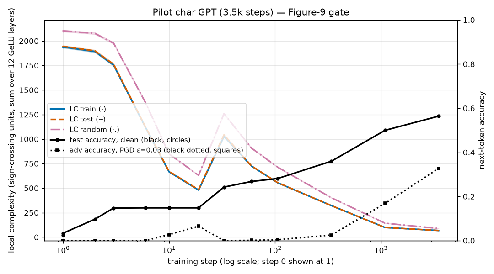

**Figure 2.** Pilot char (3.5k) Figure-9 gate. Left y-axis: local complexity (sign-crossing units
summed over the 12 GeLU layers) for the train (solid), test (dashed) and random (dash-dot) base-point
sets, each with a 99% CI band. Right y-axis: next-token accuracy — black with circle markers = clean
test accuracy, black dotted with square markers = `ε=0.03` PGD adversarial accuracy. x-axis: training
step (log scale, step 0 drawn at 1). Grey vertical rules mark the detector's landmarks, labelled along
the top: the first LC local minimum (dash-dot, ▽), the local maximum that opens the second descent
(dashed, △), the sustained robustness onset (dotted) and the clean-accuracy peak. LC falls to 484 at
step 19, rises to 1043 at step 33, then descends to 68 while adversarial accuracy rises to 0.33 →
**PASS**.

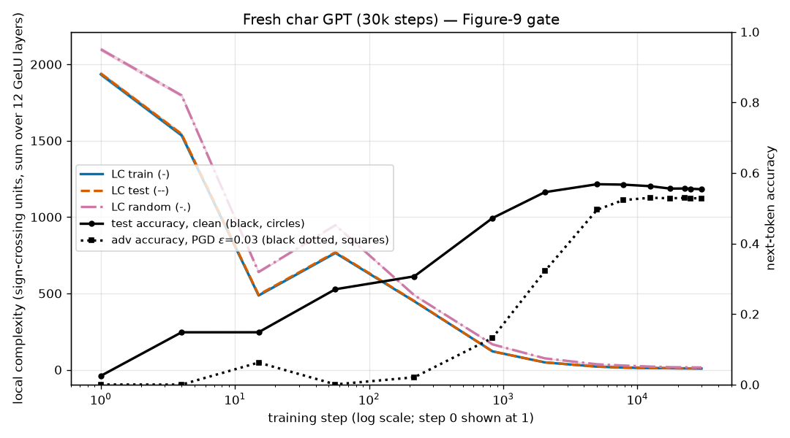

**Figure 3.** Fresh char (30k) Figure-9 gate on the densified 24-checkpoint grid, same axes, line styles
and landmark rules as Figure 2. The LC turnaround at steps 15 → 36 (491 → 989, CIs ±3 and ±4) is visible
as the V-then-Λ notch between the ▽ and △ markers, and is now traced by three measured points above the
minimum (steps 23, 36, 56) rather than one. LC then descends to 8.1 while adversarial accuracy reaches
0.53, crossing 0.05 for good at step 531 and still rising after clean accuracy saturates → **PASS**.
This is the clearest of the three gate curves.

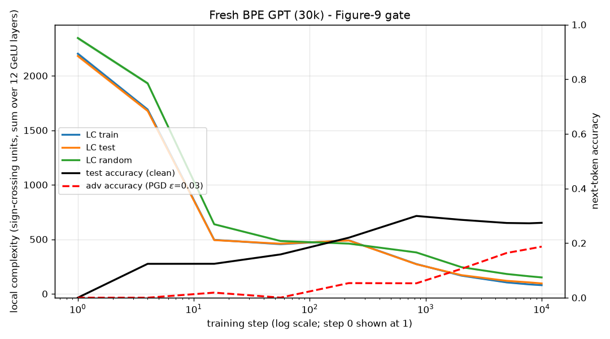

**Figure 4.** Fresh BPE (10k) Figure-9 gate, same axes and line styles as Figure 2 (only the robustness
onset and accuracy-peak rules appear, because no significant LC minimum/maximum was found). The small
step-56 → step-217 upturn is 30 units, inside the 104-unit tolerance band, so LC counts as descending to
95 while adversarial accuracy reaches 0.19 → **FAIL**. This is the run that would have carried Matthew's
exact `big/in`, `big/large` single tokens, so its failure is what keeps the primary relationship
untestable.

**Joint checkpoint timeline and bounded relationship verdict (S7).** Putting all three runs on one
training-step axis separates the two questions. The **primary** verdict is unchanged: Matthew's exact
`big/in` and `big/large` completions are single tokens only under BPE, and the BPE run is precisely the
one that FAILs the gate, so a Matthew-exact Grokking↔plateau test remains **PLAN case 5, "primary
relationship not testable."** The **secondary** character evidence, however, now rests on a run that
*does* reproduce Figure 9. On the fresh character run the second descent spans steps 36 → 30,000 and
sustained robustness begins at step 531; the `b↔i`/`b↔l` plateau collapses from width ≈ 0.80 (steps 0
and 56) to ≈ 0.33 by step 831. The sharpening therefore falls inside the second-descent window and
brackets the robustness onset, which is **PLAN case 1 (temporally associated)** for the character
analogues. We state it with two limits. First, association is not causation from one run. Second, the
second descent here opens at step 36 — so early that its window also contains ordinary initial fitting,
and the plateau is fully formed by step ~831 while robustness keeps rising to step ~7,819; a coarser
reading ("the plateau forms with initial fit") is not excluded by these six checkpoints. Figure 5 shows
the three runs together with the verdict summary.

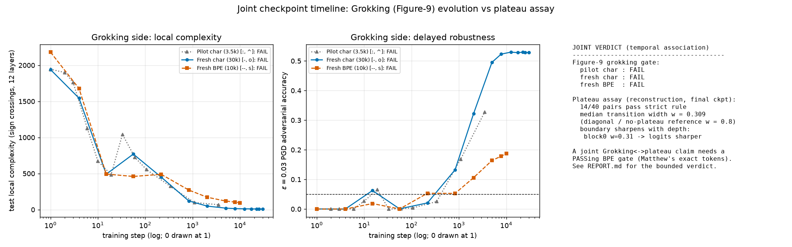

**Figure 5.** Joint checkpoint timeline. Left: test local complexity (y) vs training step (x, log
scale) for the pilot char run (dotted, triangles), the fresh char run (solid, circles) and the fresh
BPE run (dashed, squares); each legend entry gives that run's Figure-9 gate verdict. Middle: `ε=0.03`
PGD adversarial accuracy (y) vs training step (x, log), same three line styles; the horizontal dashed
line marks the 0.05 robustness threshold used by the verdict rule. Right: text summary of the three
gate verdicts (PASS / PASS / FAIL), the plateau-assay reference, and the bounded relationship verdict.

**Primary plateau evidence: the Matthew-faithful char controls show the plateau emerging during
training (S6).** Running Matthew's code path (context `"The house was"`, 50-step slerp grid, full
interpolation-layer sweep) with the two frozen single-token controls `b↔i` and `b↔l` at the six frozen
checkpoint phases, the final-logit transition width at interpolation block 0 evolves as:

| training step | `b↔i` width | `b↔l` width | plateau? |
|---:|---:|---:|---|
| 0 (init) | 0.802 | 0.802 | no — straight line |
| 56 | 0.771 | 0.814 | no — straight line |
| 831 | 0.348 | 0.674 | forming |
| 7,819 | 0.364 | 0.326 | **yes** |
| 17,500 | 0.336 | 0.338 | **yes** |
| 30,000 | 0.331 | 0.330 | **yes** |

At init and step 56 the curve is the straight line (width ≈ 0.80, no plateau); it collapses to a sharp
sigmoid (≈ 0.33) by step ~831 and holds flat to 30k. That collapse happens **during the first LC
descent and the initial clean-accuracy rise, and is fully formed before `ε=0.03` robustness saturates**
(steps ~10³–10⁴). So even though this model never groks, the plateau still appears — but tied to
*initial fit*, with no temporal coupling to a second-descent/robustness window (which never opens).
The depth control holds here too: at step 30000, `b↔i` widens 0.33 (block 0) → 0.72 (block 3) → 0.80
(block 11) as fewer downstream layers remain. Figure 6 shows the raw curves the table summarises.

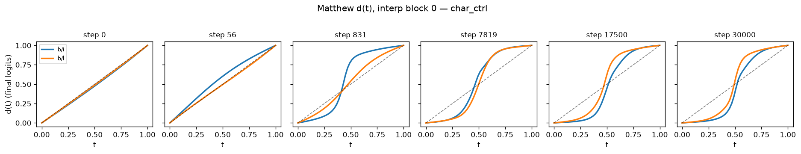

**Figure 6.** Matthew-faithful char-control `d(t)` (y) vs interpolation position `t` (x), at
interpolation block 0 in final-logit space, one panel per frozen checkpoint (steps 0→30000). The `b↔i`
pair is the solid line with circle markers, `b↔l` the dashed line with square markers; the gray dashed
straight line is the no-plateau reference `d = t`. Both curves lie on the straight line at init and
step 56, and are sharp plateau–boundary–plateau sigmoids by step 831, stable thereafter.

To read that emergence directly against the grokking metrics, Figure 7 puts both on one training-step
axis.

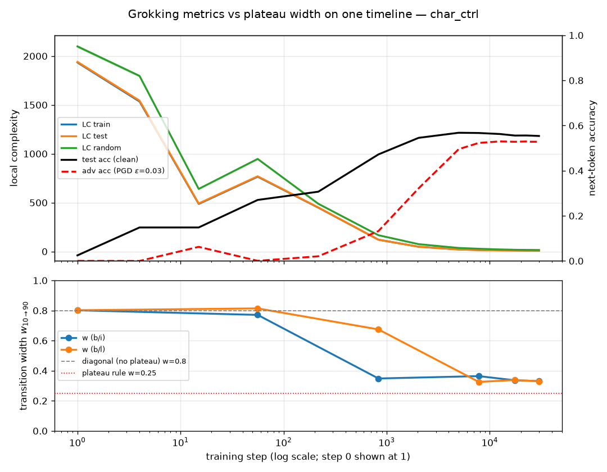

**Figure 7.** Grokking metrics vs plateau width on one timeline (fresh char run). Top: left y = local
complexity for the train (solid), test (dashed) and random (dash-dot) base-point sets with 99% CI
bands; right y = next-token accuracy, black with circles = clean, black dotted with squares = `ε=0.03`
PGD adversarial; x = training step (log). Bottom: transition width `w_10→90` (y) for `b↔i` (solid,
circles) and `b↔l` (dashed, squares) vs training step (log); the gray dashed line is the straight-line
value 0.80 and the black dotted line the strict plateau bar 0.25. Width hits its floor by step ~831 —
during the first LC descent, before robustness rises.

**Comma against every other character: the shape holds for all 64 pairs, but sharpness is graded.**
Holding endpoint A at the comma and sweeping endpoint B over the other 64 characters at the final
checkpoint (interpolation block 0, final logits), the median transition width is **0.340**
(inter-quartile range 0.305–0.409), against 0.80 for a straight line. Every curve is monotone
(isotonic deviation exactly 0 for all 64) and every curve rests near both endpoints (the transition
starts at median $t = 0.252$ and ends at median $t = 0.603$; no pair starts before $t=0.10$ or ends
after $t=0.90$). Nothing is near the straight line: the widest pair is 0.665 (`3`), the narrowest
0.245 (`c`). But under the strict frozen rule only **1 of 64** pairs qualifies as a plateau
(33/64 pass at $w \le 0.35$, 52/64 at $w \le 0.45$). The two preregistered controls `b↔i` (0.331) and
`b↔l` (0.330) land exactly at this sweep's median — they were typical pairs, not favourable ones.
Figure 8 shows all 64 raw curves, which are the primary evidence, beside their width distribution.

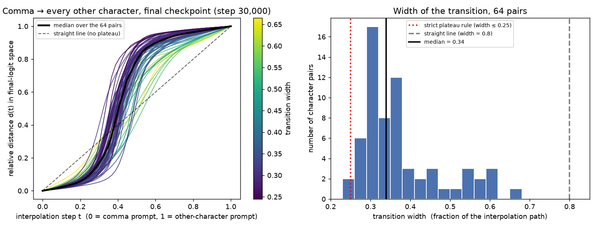

**Figure 8.** All 64 comma→character curves at step 30,000. Left: relative distance `d(t)` (y; 0 =
output still looks like the comma prompt, 1 = looks like the other character's prompt) vs
interpolation position `t` (x); one thin line per pair, shaded on the viridis scale by that pair's
transition width (see colour bar); the thick black line is the median over the 64 pairs and the gray
dashed line is the straight line `d = t` expected with no plateau. Right: histogram of transition
width (x) against number of pairs (y); the black dotted vertical line marks the strict rule 0.25, the
gray dashed line the straight-line value 0.80, and the thick black line the median 0.34.

The spread across characters is systematic rather than noisy: lower-case letters give the sharpest
switches (median width 0.313, n = 26), upper-case letters follow (0.355, n = 26), space and newline
sit between them (0.336, n = 2), and punctuation or the digit `3` are clearly the flattest (0.564,
n = 10). Figure 9 shows that ordering pair by pair.

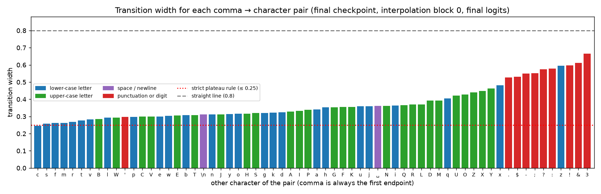

**Figure 9.** Transition width (y) for each comma→character pair (x: one bar per character, sorted
sharpest to flattest; ␣ = space, `\n` = newline) at the final checkpoint, interpolation block 0, final
logits. Each character type carries its own bar hatch as well as its own colour: lower-case letter
(`//`), upper-case letter (`\\`), space/newline (`xx`), punctuation or digit (`..`). The black dotted
horizontal line marks the strict rule 0.25 and the gray dashed line the straight-line value 0.80.

**What predicts sharpness.** Width falls as the model's own probability for that character after
`"The house was "` rises: Spearman $\rho = -0.74$ (p = 2.7e-12, n = 64). Endpoint separation explains
much less ($\rho = -0.48$, p = 5.6e-5) and with the sign that rules out the trivial reading —
*wider*-separated endpoints switch *faster*, so flat curves are not "the two outputs are too similar
to distinguish". The comma endpoint is itself an implausible continuation here (model probability
1.0e-7), so the sharp cases are not driven by both endpoints being common inputs. Figure 10 puts the
two candidate predictors side by side.

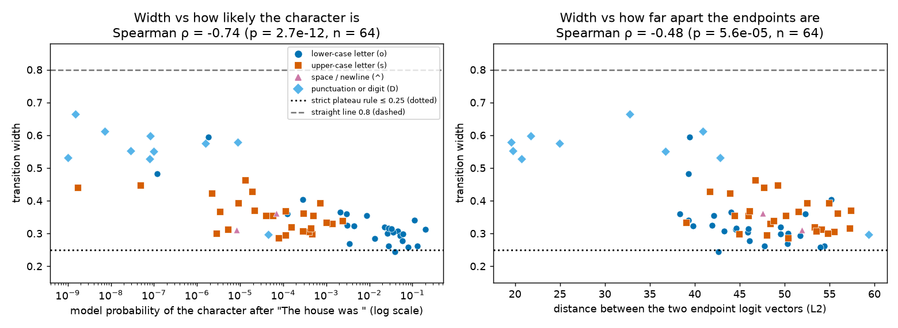

**Figure 10.** Left: transition width (y) vs the model's probability of the other character after
`"The house was "` (x, log scale); one point per pair, with a distinct marker shape per character
type — circle = lower-case letter, square = upper-case letter, triangle = space/newline, diamond =
punctuation or digit; Spearman ρ = −0.74. Right: transition width (y) vs the L2 distance between the
two endpoints' final-logit vectors (x), same markers; Spearman ρ = −0.48. In both panels the black
dotted horizontal line marks the strict rule 0.25 and the gray dashed line the straight-line value
0.80.

**Both structural controls replicate with 32× more pairs.** Moving the interpolation point deeper
flattens the curve back onto the straight line — median width 0.34 (block 0), 0.51, 0.65, 0.72, 0.77,
0.79, then ≈0.80 for blocks 6–11 — and across training the transition narrows early and then stops
changing: 0.799 (init) → 0.751 (step 56) → 0.524 (831) → 0.328 (7,819) → 0.367 (17,500) → 0.340
(30,000). Both trends match the `b↔i`/`b↔l` result above; Figure 11 shows them.

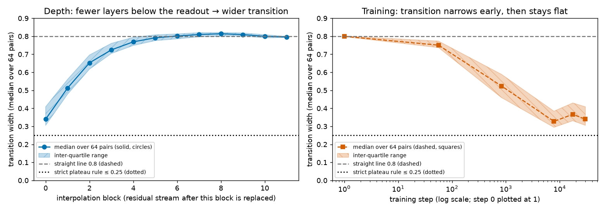

**Figure 11.** Left: median transition width over the 64 pairs (y, solid line with circle markers) vs
interpolation block (x, 0–11; the residual stream after this block is the one replaced); the hatched
band is the inter-quartile range; the gray dashed horizontal line is the straight-line value 0.80 and
the black dotted line the strict rule 0.25. Right: median transition width (y, dashed line with square
markers) vs training step (x, log scale, step 0 drawn at 1) at interpolation block 0, over the six
frozen checkpoints; hatched band = inter-quartile range; same two reference lines.

**Discussion of this sweep.** Five points, in order of how much they change the picture.
*(1)* The plateau-like shape is the rule, not the exception in this model: with one endpoint fixed
and all 64 alternatives tried, no pair behaves linearly — the downstream stack always holds the
output near one endpoint, switches, and holds near the other. *(2)* Sharpness is a continuum and the
strict bar sits near its edge: 1/64 at $w \le 0.25$ but 33/64 at $w \le 0.35$, so any count of "how
many plateaus" in this model is mostly a statement about the threshold — we therefore report the full
distribution. *(3)* The switch is sharpest for characters the model actually expects there. A plain
reading of $\rho = -0.74$: when the second endpoint is a continuation the model has a confident,
well-practised output for, the downstream layers snap between two familiar outputs; when it is a
character the model essentially never predicts in that slot (`3`, `&`, `!`, `:`, `z`), the output
drifts across the path instead. *(4)* It does not change the joint question: these pairs are measured at a
single checkpoint of the character run, so they add nothing to the checkpoint-aligned verdict, and the
Matthew-exact (BPE) relationship remains PLAN case 5. *(5)* Caveats: one model, interpolation at the final token only, and single characters as
endpoints. The two context-related worries — one shared context, and a comma endpoint that is itself
an unlikely input — are tested next.

**Does the plateau depend on the context? No — 0 of 576 curves is linear across nine contexts.**
Repeating the sweep in 8 further held-out contexts spanning $p(\texttt{,})$ from $5\times10^{-20}$ to
0.997 leaves the shape result untouched: **not one of the 576 curves is near the straight line**
($w \ge 0.70$), per-context median widths stay in the narrow band **0.313–0.436** (reference context
0.340; pooled median 0.381), and the strict bar stays hard to clear (11/576 at $w \le 0.25$; 198/576
at $w \le 0.35$). The implausible-endpoint worry is also settled: the context where a comma is nearly
certain (probability 0.997) gives median width 0.330 — indistinguishable from the reference — and
across the nine contexts the comma's own probability does not predict sharpness ($\rho = -0.32$,
p = 0.41, n = 9). Figure 12 shows both facts.

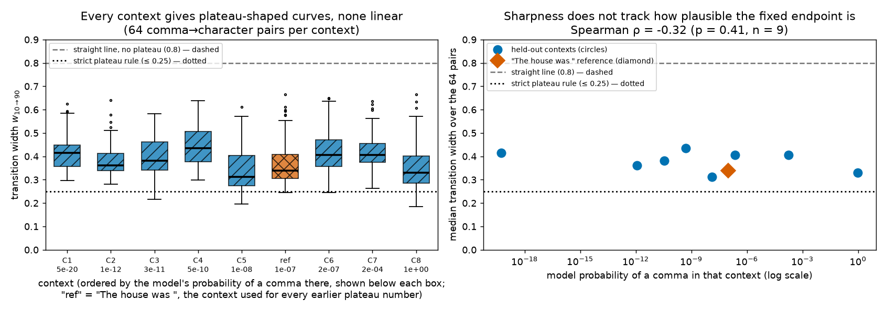

**Figure 12.** Left: transition width $w_{10\to90}$ (y) for the 64 comma→character pairs of each
context (x, one box per context, ordered by the model's probability of a comma there, which is printed
under each box; "ref" = `"The house was "`, the context behind every earlier plateau number, drawn with
a cross hatch; the 8 held-out contexts use a diagonal hatch). Boxes give the inter-quartile range with
the median as a horizontal bar, whiskers 1.5×IQR, dots outliers. Gray dashed = straight-line value
0.80, black dotted = strict rule 0.25. Right: each context's median width (y) vs its comma probability
(x, log scale); circles = held-out contexts, diamond = the reference context; same two reference lines.

**The width-vs-probability predictor replicates in direction, not in size.** Within each context the
rank correlation between transition width and the model's probability of the target character is
**negative in all nine cases** (sign test p = 0.004; individually significant at p < 0.05 in 7 of 9),
so "the switch is sharper for characters the model expects there" is a real repeatable tendency. Its
strength, however, ranges from −0.05 to −0.74 with median **−0.41**, and pooling all 576 pairs gives
$\rho = -0.23$. The context we reported first is the strongest of the nine, so the earlier −0.74
should be read as the top of a range rather than a typical value. Figure 13 shows the nine
correlations and the pooled scatter.

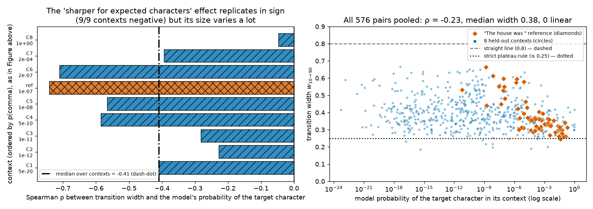

**Figure 13.** Left: Spearman ρ between transition width and the model's probability of the target
character (x) for each context (y, ordered by that context's comma probability; reference context
cross-hatched, held-out contexts diagonally hatched); the dash-dot vertical line marks the median over
contexts (−0.41). Right: transition width (y) vs the model's probability of the target character in
its own context (x, log scale) for all 576 pairs; circles = the 8 held-out contexts, diamonds = the
reference context; gray dashed = straight-line value 0.80, black dotted = strict rule 0.25.

### All pairs of characters: is every character in its own plateau, and what are the plateaus?

Every sweep so far holds one endpoint fixed, so none can say whether *each* character has a basin or
whether sharpness belongs to the pair. The all-pairs sweep runs all **2,080** character pairs at
interpolation block 0 of the step-30,000 checkpoint.

**Every diagnostic passes and the measurement is exactly symmetric.** No pair is dropped: the largest
$d(0)$ over all 2,080 pairs is $3\times10^{-6}$, the smallest $d(1)$ is 0.999998, the largest
endpoint-reproduction error is $1.7\times10^{-5}$, prefix activations match exactly (error 0.0), and
**every** curve is exactly monotone (isotonic deviation 0.0 for all 2,080). Re-running 100 randomly
chosen pairs with the endpoints **swapped** changes the width by a median — and a maximum — of
**0.000**. That is not luck: swapping endpoints maps $d(t)$ to $1-d(1-t)$ and our $t$ grid is
symmetric, so $w$ is invariant by construction. The check confirms the implementation matches the
algebra, and licenses drawing the width matrix symmetrically.

| quantity (2,080 pairs, step 30,000, block 0) | value |
|---|---|
| median transition width | **0.355** (inter-quartile range 0.298–0.444) |
| straight-line reference (no plateau) | 0.80 |
| pairs meeting the strict rule | **182 / 2,080 (8.8%)** |
| pairs near the straight line ($w \ge 0.70$) | 20 / 2,080 (1.0%) |
| pairs that are exactly monotone | 2,080 / 2,080 |
| per-character median width, range over the 65 characters | 0.264 (`o`) – 0.590 (`3`) |
| characters with a basin of their own ($\phi(c)$ measured) | **65 / 65** (min 0.86, median 1.00) |
| variance in width explained by per-character terms | **78.2%** (adjusted 77.6%; chance level 3.0%) |

Figure 14 is the whole sweep in one image. The visible row/column striping — rather than a
checkerboard — is the first sign that width is carried by individual characters, which the variance
decomposition then quantifies.

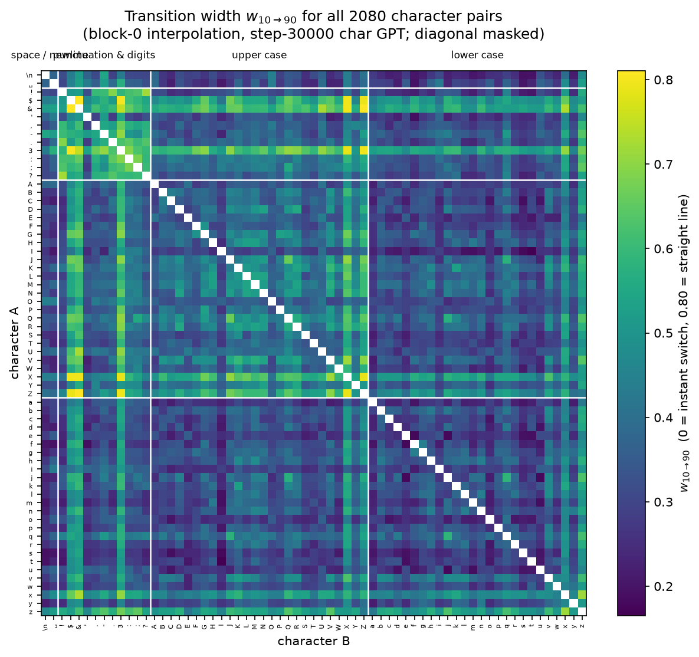

**Figure 14.** Transition width $w_{10\to90}$ for all 2,080 character pairs at interpolation block 0
of the step-30,000 character GPT. x-axis: character B; y-axis: character A; both ordered by character
class (space/newline, punctuation & digits, upper case, lower case), with white lines separating the
classes and the diagonal masked (a character against itself is not a pair). Colour = width on the
viridis scale (dark = sharp switch, bright = close to the straight-line value 0.80); the matrix is
symmetric because swapping endpoints leaves the width unchanged. Bright rows and columns (`3`, `&`,
`$`, `X`, `Z`, `z`, `x`) are characters that are left gradually from *every* partner.

**Verdict on the per-character question: PLAN case (i) — every character has a basin of its own — with
the sharpness graded rather than knife-edge.** The basin fraction $\phi(c)$ is 1.00 for 59 of the 65
characters and never falls below 0.86, so on essentially every path the output stays locked to each
endpoint for at least a tenth of the way before switching. What differs between characters is *how
sharply* the basin is left: median widths run from 0.264 (`o`) to 0.590 (`3`). By the strict knife-edge
rule no character qualifies for a majority of its partners ($\sigma(c) \ge 0.5$ for 0 of 65; $\ge 0.25$
for 6 — `o`, `s`, `a`, `I`, `\n`, `e`). Figure 15 is the direct answer to the question.

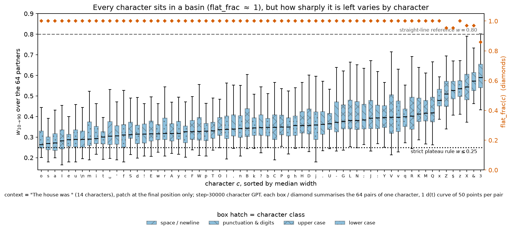

**Figure 15.** Every character sits in a basin, but how sharply it is left varies by character.
x-axis: the 65 characters, sorted by median width (␣ = space, `\n` = newline). Left y-axis: the
distribution of $w_{10\to90}$ over that character's 64 partners as a box (box = inter-quartile range,
bar = median, whiskers 1.5×IQR, outliers hidden); each box's hatch gives the character class (`//`
space/newline, `\\` punctuation & digits, `xx` upper case, `..` lower case) per the legend below the
axis. Right y-axis (diamond markers): the basin fraction $\phi(c)$, the fraction of partners whose path
rests on $c$ for at least 10% of the way. Gray dashed = straight-line value 0.80; black dotted =
strict rule 0.25.

**Sharpness is a property of the character, not of the pair.** Fitting $w_{ij}\approx\mu+a_i+a_j$ over
all 2,080 widths explains **78.2%** of the variance (adjusted 77.6%), against a chance level of 3.0%
(99th percentile 4.1%) for the same 65 free parameters on permuted data. Only **21.8%** is
pair-specific residual. That rules out PLAN case (iii) ("the sharpness lives in the pair") and case
(ii) ("only a subset of characters has a basin"): each character carries its own transition sharpness
into every pairing it appears in. Figure 16 shows the raw curves behind this for six representative
characters — raw $d(t)$ remains the primary evidence, and the per-character bundles are visibly tight.

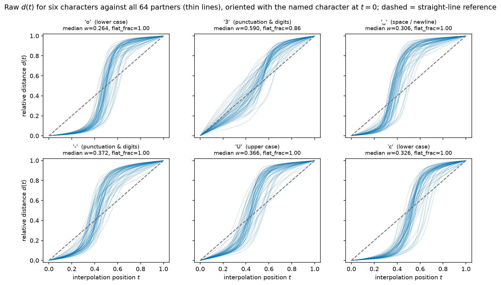

**Figure 16.** Raw $d(t)$ for six characters against all 64 of their partners. Each panel: relative
distance $d(t)$ (y; 0 = output looks like the named character's prompt, 1 = looks like the partner's)
vs interpolation position $t$ (x); one thin line per partner, all oriented so the named character sits
at $t = 0$; the gray dashed line is the straight-line reference $d = t$. Panels show the sharpest
character (`o`), the flattest (`3`), and one typical member of each character class; titles give that
character's median width and basin fraction.

**What do the plateaus correspond to?** Two measurements separate the candidate explanations. The
readout-decision test asks whether a plateau simply *is* the set of residual states that decode to the
same next character. Before that, Figure 17 answers the question it depends on — does the boundary sit
where the two characters become equally likely?

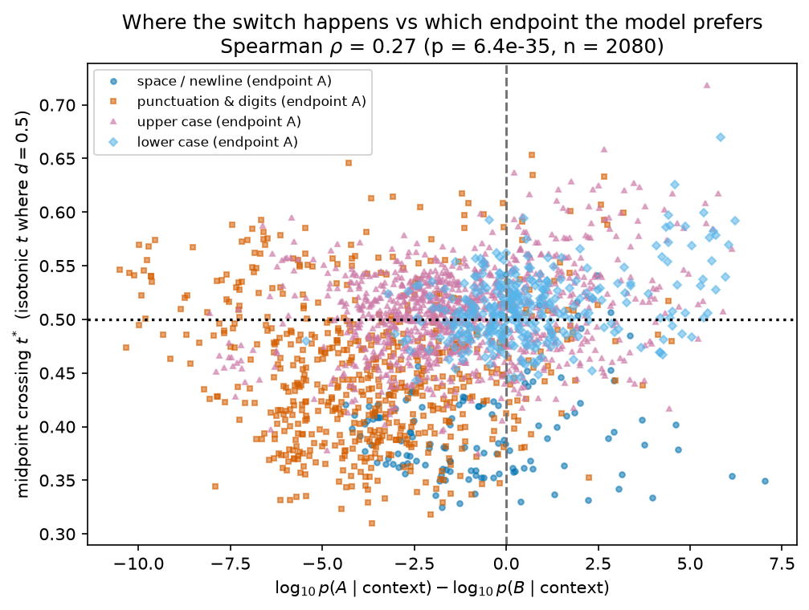

**Figure 17.** Where the switch happens versus which endpoint the model prefers. x-axis:
$\log_{10} p(A\mid\text{context}) - \log_{10} p(B\mid\text{context})$, the model's log-probability
preference between the two endpoint characters (positive = it prefers A). y-axis: the midpoint crossing
$t^{*}$, the interpolation position at which the isotonic curve reaches 0.5. One marker per pair,
shaped and coloured by the class of endpoint A (circle = space/newline, square = punctuation & digits,
triangle = upper case, diamond = lower case). Black dotted horizontal line = the symmetric position
$t^{*} = 0.5$; gray dashed vertical line = equal plausibility. Spearman ρ = 0.27: the more likely
endpoint keeps a slightly *larger* share of the path, so basin size tracks plausibility — but weakly,
and $t^{*}$ stays within 0.30–0.72 throughout.

Figure 18 is the readout-decision test itself.

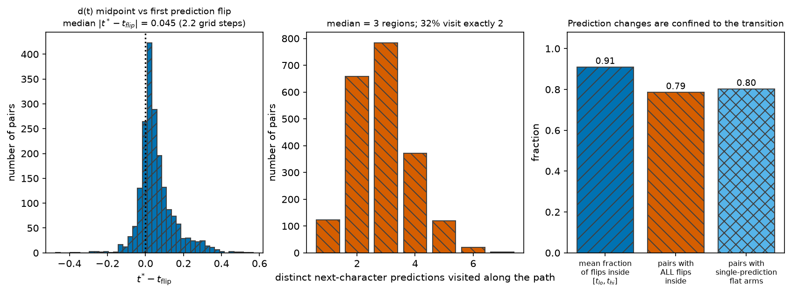

**Figure 18.** The plateau boundary is the model's next-character decision boundary. Left: histogram
of $t^{*}-t_{\text{flip}}$ (x), the offset between the curve's midpoint and the first change in the
model's predicted next character; y = number of pairs; black dotted line at 0. Median
$|t^{*}-t_{\text{flip}}|$ = 0.045, i.e. 2.2 steps of the 50-point grid. Middle: number of distinct
next-character predictions a path visits (x) against number of pairs (y) — median 3, with 32% visiting
exactly 2. Right: three summary fractions (y) — the mean fraction of prediction changes falling inside
the transition window $[t_{lo},t_{hi}]$ (0.91), the fraction of pairs whose changes *all* fall inside
it (0.79), and the fraction of pairs whose two flat arms are each a single constant prediction (0.80).
Bars carry distinct hatches as well as colours.

The decision reading survives the sharper form of the test. Paths do not simply flip once: the median
path visits **3** distinct next-character predictions and only 32% visit exactly 2, so there are
usually one or two short-lived intermediate predictions. But those changes are **not spread over the
plateaus** — **91%** of all prediction changes fall inside the transition window, **79%** of pairs have
every change inside it, and **80%** of pairs have flat arms that are each a single prediction. The flat
parts of $d(t)$ are regions of constant model output; the boundary is where the output changes; and the
transition is a short scramble between two decisions rather than an instantaneous flip.

**Both mandatory controls are decisive** (Figure 19). *Learned, not architectural:* at initialization
**all 2,080** paths are straight lines (median width **0.803**, inter-quartile range 0.800–0.806,
**100%** at $w \ge 0.70$, **0** strict plateaus), against median **0.355** and 8.8% strict after
training (Mann–Whitney p < 1e-300). Without this control "learned structure" would be unsupported;
with it, the basin structure is entirely trained in. *Built by the shallow blocks:* patching later
destroys it — median width 0.344 at block 0, **0.763** at block 4, 0.806 at block 8 and 0.806 at block
11, which is the straight-line value. Essentially all of the sharpness is produced by blocks 1–4, and
the unembedding geometry contributes none of it.

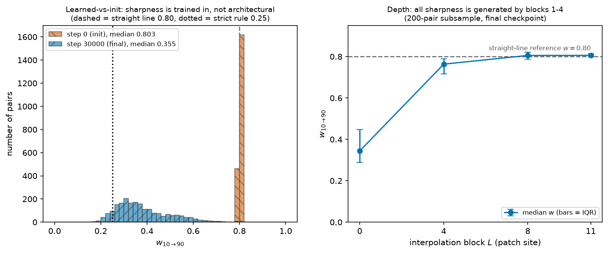

**Figure 19.** Controls. Left: distribution of $w_{10\to90}$ (x) against number of pairs (y) for the
same 2,080 pairs at step 0 (initialization) and step 30,000 (final); the two histograms carry distinct
hatches and their medians appear in the legend. Gray dashed = straight-line value 0.80, black dotted =
strict rule 0.25. Right: median $w_{10\to90}$ (y) against the interpolation block at which the patch is
applied (x = 0, 4, 8, 11), on a fixed 200-pair random subsample of the final checkpoint; bars are the
inter-quartile range; gray dashed = straight-line reference 0.80. Block 11 leaves only the final layer
norm and the unembedding downstream, so it is the near-linear readout reference.

**The plausibility confound is real but does not subsume the effect.** Width falls as the more likely
of the two endpoints becomes more likely (Spearman $\rho = -0.46$ against $\max(p(A),p(B))$, n = 2,080)
and also as the endpoints' logit vectors move further apart ($\rho = -0.46$). These two predictors are
themselves correlated, so we take partial rank correlations: controlling for endpoint separation, width
vs $\max(p(A),p(B))$ is $-0.59$; controlling for plausibility, width vs separation is $-0.59$. Both
survive, so neither explains the other away. The per-character version is stronger still: a character's
median width against its own log-probability in this context gives $\rho = -0.60$ (n = 65,
p = 1.2e-7). The direction again rules out the trivial artifact — *better-separated* endpoints switch
*faster*, not slower.

#### The hypothesis

**A plateau in this model is the set of final-position residual states that decode to the same
next-character prediction, one basin per character — a shape that the MLPs of blocks 1–4 build and
everything downstream merely reads.** The evidence: 91% of all prediction changes along a path fall
inside the transition window and 80% of paths have single-prediction flat arms (Figure 18), every
character retains its own basin against every partner ($\phi \ge 0.86$ for all 65) with 78% of the
width variance explained by per-character terms alone (Figures 14–15), the structure is absent at
initialization (Figure 19), and deleting the block-1–4 MLPs returns the width to that untrained value
while amplifying them sharpens it further (0.80 → 0.35 → 0.31, Figure 21). That "decodes to the same
prediction" clause is a **description, not the mechanism**: the decision survives the ablation that
flattens $d(t)$ (80.7% of pairs still predict different characters at their endpoints, Figure 22), and
the leading alternative — that the basin is carved by endpoint *plausibility* — still predicts which
pairs are sharp (partial $\rho = -0.59$) even though it does not mediate the intervention
($\rho(\Delta w,\Delta\max p) = +0.22$). **Falsifiable prediction:** freeze blocks 1–4 at their step-0
weights and train the rest of the network to the same validation accuracy — the paths should stay
straight (median width near 0.80) even though the trained readout still makes sharp next-character
decisions.

#### The readout-rebalancing intervention: the plateau sits upstream of the decision

The hypothesis says a plateau is a set of states that *decode* to the same prediction. If decoding is
what creates the basin, moving the readout's decision boundary should drag the plateau boundary with
it. We tested that on all 1,873 of the 2,080 pairs whose endpoints predict different next characters
(the other 207 predict the same character at both ends, so they have no boundary to move). The
intervention adds a constant $c$ to one row of the unembedding output — a pure readout bias — leaving
every residual-stream activation on the path bit-identical. Two bias sizes were fixed before the
result was seen: **equalised** ($c_{\mathrm{eq}}$, median 2.44 nats), which makes the two endpoint
predictions score symmetrically, and **midpoint-forced** ($c_{\mathrm{half}}$, median 5.28 nats), which
puts the decision boundary exactly at the path midpoint. Figure 20 shows where the boundary lands.

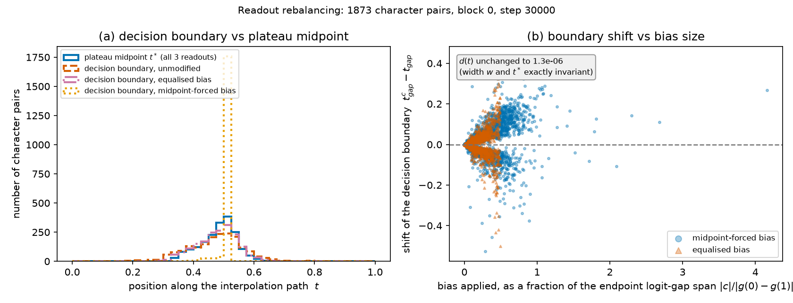

**Figure 20.** Readout rebalancing on 1,873 character pairs, interpolation block 0, step 30000. Left
(a): number of pairs (y) against position along the path $t$ (x), for the plateau midpoint $t^{*}$
(solid) and the decision boundary $t_{\mathrm{gap}}$ under the unmodified readout (dashed), the
equalised bias (dash-dot) and the midpoint-forced bias (dotted — a spike at 0.5 by construction).
Right (b): shift of the decision boundary $t^{c}_{\mathrm{gap}} - t_{\mathrm{gap}}$ (y) against the
bias applied as a fraction of the endpoint logit-gap span (x); circles = midpoint-forced, triangles =
equalised. The inset gives the measured invariance of $d(t)$.

**The plateau cannot be moved by the readout at all — this is algebraic, and we verified it.** $d(t)$
is a ratio of distances *between* logit vectors, so adding the same bias vector to every point on the
path cancels exactly. The measured deviation between biased and unbiased $d(t)$ is
$1.3\times10^{-6}$ (float32 noise), so $w_{10\to90}$ and $t^{*}$ are **exactly invariant** to an
additive readout bias of any size. One consequence is a limit on the test itself: it cannot probe the
plausibility account's prediction that the *width* would change, because no readout-level change of
endpoint plausibility can alter $d(t)$ at all. If plausibility shapes the basins, it must do so through
the learned weights of blocks 1–11 — the same blocks the depth control identifies as where the
sharpness is built (Figure 19).

**The decision boundary barely moves either; it is pinned to the residual-stream transition.** The
logit gap swings a median 21.9 nats across the path, so it is extremely steep. The 2.44-nat equalising
bias moves the boundary by a median of only **0.020** in $t$ (80% of pairs move less than 0.05), and
even the 5.28-nat bias required to force the boundary to the midpoint moves it a median **0.052**.
Boundary and plateau midpoint stay aligned throughout: median $|t^{*}-t_{\mathrm{gap}}|$ is **0.025**
unmodified, **0.015** equalised and **0.035** midpoint-forced.

**What this changes.** The tight $t^{*}\approx t_{\mathrm{gap}}$ alignment reported above is *not*
evidence that the decision creates the plateau; the causal arrow runs the other way. The prediction
flip and the $d(t)$ transition coincide because both are driven by the same sharp change in the
residual stream, produced by blocks 1–4, and the readout is a steep but passive reader of it. So the
sentence "a plateau is the set of states that decode to the same prediction" survives as a
*description* of the basins, not as their mechanism; the mechanism sits upstream of the unembedding.

#### The MLP-gain intervention: blocks 1–4 causally set the sharpness

The readout probe moved the mechanism upstream without saying which upstream computation makes the
transition sharp. Scaling the MLP branch of blocks 1–4 answers that directly, and the late-block group
is the specificity control (Figure 21).

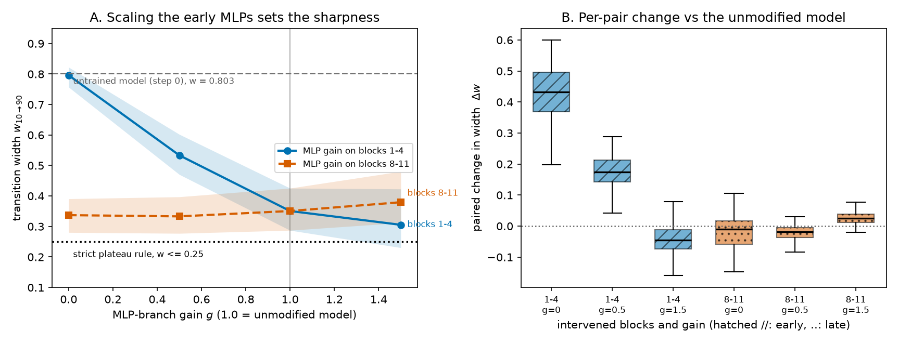

**Figure 21.** MLP-gain intervention, 150 character pairs, interpolation block 0, step-30000 fresh
character checkpoint. Left (A): median transition width $w_{10\to90}$ (y) against MLP-branch gain $g$
(x; $g=1$ is the unmodified model), shaded band = interquartile range; solid line with circles = gain
applied to blocks 1–4, dashed line with squares = blocks 8–11. The dashed horizontal reference is the
untrained (step-0) median width 0.803; the dotted one is the strict plateau threshold $w \le 0.25$.
Right (B): paired per-pair width change $\Delta w$ (y) relative to the unmodified model, one box per
condition (x); boxes hatched `//` = blocks 1–4, `..` = blocks 8–11; box = interquartile range, whisker
= 1.5×IQR, outliers hidden; the dotted line marks $\Delta w = 0$.

**Removing the early MLPs removes the plateau; amplifying them sharpens it.** Median width runs
**0.796** ($g=0$) → 0.533 ($g=0.5$) → 0.351 (unmodified) → **0.305** ($g=1.5$), a monotone
dose–response. At $g=0$ the width is back at the untrained value 0.803 and **0/150** pairs pass the
strict rule (15/150 unmodified); every pair widens (fraction with $\Delta w>0$ = 1.00, median
$\Delta w$ = +0.433). At $g=1.5$ the strict-rule pass rate triples, 10% → **30%**.

**The late blocks are nearly inert.** The same gains on blocks 8–11 give median widths 0.337 / 0.333 /
0.380 for $g = 0 / 0.5 / 1.5$, with median paired $|\Delta w| \le 0.025$ — at $g=0$ a 17× smaller
effect than deleting the early MLPs, even though four whole MLP layers are removed. The transition
also does not migrate: median $|\Delta t^{*}| = 0.074$ at $g=0$ and $\le 0.024$ in every other
condition, so the intervention changes the sharpness, not the location.

This is the first causal result in the series: the sharpness is manufactured by the MLPs of blocks 1–4
and merely read out downstream, which upgrades Experiment 5's depth *observation* to an intervention.
It narrows the plausibility alternative without eliminating it — that account must now act through
these same early weights.

#### The per-block scan: the sharpness is distributed, and tracks neither plausibility nor the decision

Two questions survive the gain experiment: *which* of blocks 1–4 carries the sharpness, and does the
width change track the **plausibility** confound or the **decision** structure. Deleting each early
block's MLP alone, and re-measuring both mediators under every ablated model, answers both.

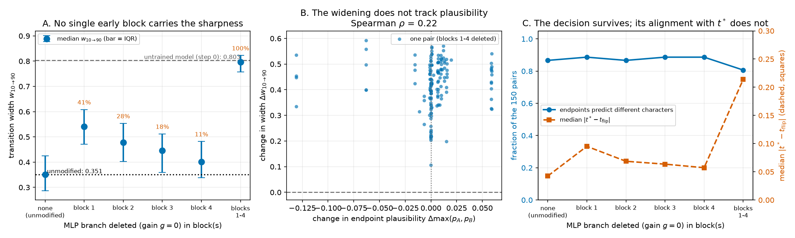

**Figure 22.** Per-block MLP ablation, 150 character pairs, interpolation block 0, step-30000 fresh
character checkpoint. **A** (left): median transition width $w_{10\to90}$ (y; bars = interquartile
range) per condition (x: the unmodified model, then each single early block's MLP deleted at $g=0$,
then all four). Dashed horizontal reference = the untrained (step-0) median width 0.803, dotted =
the unmodified model's 0.351; the percentage above each point is that block's share $F_l$ of the
all-four effect. **B** (middle): the mediation test — per-pair width change $\Delta w$ (y) against
per-pair endpoint-plausibility change $\Delta\max p$ (x), one marker per pair, for the all-four
deletion; dashed horizontal = no width change, dotted vertical = no plausibility change. **C**
(right): decision structure per condition (x as in A) — solid line with circles (left y) = fraction of
the 150 pairs whose two endpoints still predict different next characters; dashed line with squares
(right y) = median $|t^{*}-t_{\mathrm{flip}}|$.

**No single block carries the sharpness; the contribution is graded and front-loaded.** Deleting one
block's MLP gives median widths 0.541 (block 1), 0.478 (block 2), 0.446 (block 3) and 0.402 (block 4)
against 0.351 unmodified and 0.796 for all four — shares $F_l$ = **41% / 28% / 18% / 11%**,
monotonically decreasing with depth and summing to 98%, so the four contributions are close to
additive and the largest single block recovers under half the effect. Every single-block deletion
widens nearly every pair (fraction with $\Delta w>0$ = 0.99 / 0.96 / 1.00 / 0.95) and cuts the strict
plateau rate from 10% to 0–3%.

**The widening does not track plausibility.** The association itself survives every ablation: the
partial correlation $\rho_{w,\max p \cdot \mathrm{sep}}$ is **−0.634** in the unmodified model —
reproducing Experiment 5's −0.587 on all 2,080 pairs, on this 150-pair subsample — and stays between
**−0.45 and −0.64** in all five ablated models, so plausibility still predicts *which* pairs are
sharp. But it does not mediate the intervention: $\rho(\Delta w,\Delta\max p)$ = +0.11, +0.15, −0.01,
+0.02 for the four single blocks and **+0.22** for all four (Figure 22B), while the plausibility
landscape barely moves at all (median $|\Delta\max p|\le 0.0007$) and the width moves by up to +0.433.
Where plausibility does move it moves the wrong way: deleting all four MLPs *raises* median $\max p$
from 0.0034 to 0.0136, and higher plausibility is associated with **narrower** plateaus, yet these
plateaus vanish.

**The decision survives the ablation that destroys the plateau.** With all four early MLPs deleted,
**80.7%** of pairs still predict different characters at their two endpoints (86.7% unmodified) and
the median number of distinct $\arg\max$ characters visited is **3**, unchanged in every condition —
yet $d(t)$ is now a straight line ($w=0.796$ against the untrained 0.803). The two also come apart in
position: median $|t^{*}-t_{\mathrm{flip}}|$ grows from **0.043** unmodified to **0.214** with all
four deleted, a five-fold decoupling.

**What this settles.** Neither account explains the intervention. A plateau is not the decision region
— the decision survives while the plateau does not — and the widening is not mediated by endpoint
plausibility, which stays put and, where it moves, moves against the predicted direction. Blocks 1–4
build a sharp change in the residual stream that is upstream of, and separable from, both; the
decision and the plausibility ranking are computed by the readout *from* that geometry rather than
being what creates it. Plausibility therefore survives as a description of which pairs get sharp
basins, and is excluded as the mechanism that makes them sharp. **Caveats:** 150 pairs, one context,
one checkpoint, one model; deleting four MLPs is a large perturbation and the decision structure,
while largely preserved, is not preserved perfectly (86.7% → 80.7%); and the near-additivity of the
$F_l$ is descriptive — single-block ablations need not compose linearly, and pairs or triples of
blocks were not tested.

### Exploratory corroboration: 40 natural minimal pairs

*(Labelled exploratory and kept out of the headline — PLAN scope forbids a new 40-pair dataset in the
primary analysis. Retained because its layerwise and depth controls corroborate the above with 127-
character natural prefixes rather than one short shared context.)* With interpolation after block 0 and
recording at final logits, 14 of 40 pairs meet the strict frozen rule (IDs 0, 4, 5, 6, 7, 9, 14, 20,
21, 22, 28, 34, 36, 37); 24/40 have $w \le 0.35$; only 2/40 are near-straight (#10, #19, $w \ge 0.6$);
0/40 are non-monotone. Median width is 0.309 (range [0.110, 0.773]) against the straight line's 0.8.
The structure is visible pair by pair, with no averaging involved (Figure 24).

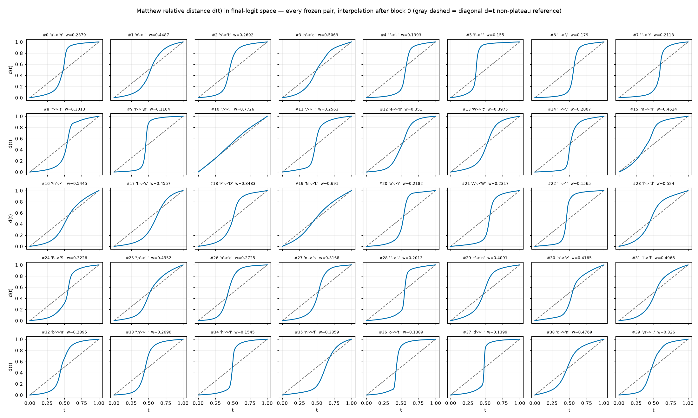

**Figure 24.** *(Exploratory.)* Raw relative distance $d(t)$ (y) vs interpolation position $t$ (x) in
final-logit space, one panel per frozen pair; panel titles give the pair ID, the two endpoint
characters, and the transition width $w$. Gray dashed = the straight-line reference $d = t$. Most
curves hug $d\approx0$, cross rapidly, then hug $d\approx1$; two (#10, #19) track the straight line.

**The boundary sharpens with depth, exactly as Matthew observed.** Fixing interpolation after block 0
and recording $d(t)$ at each later block's final-position residual, median width falls strictly
monotonically from 0.777 (block 1) to 0.445 (block 11) and 0.309 at the logits; the strict rule is
passed only at the logits (14 pairs), never at intermediate residuals. The plateau is *formed* by the
downstream stack, not present in the interpolated activation itself (Figure 25).

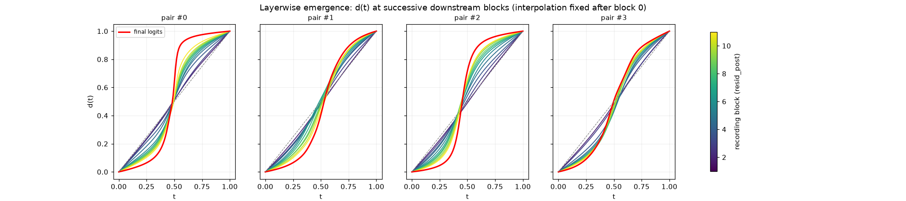

**Figure 25.** *(Exploratory.)* Layerwise emergence for four fixed representative pairs (IDs 0–3,
frozen before inspection): $d(t)$ (y) vs interpolation position $t$ (x). Thin lines are the recording
blocks, shaded on the cividis scale from block 1 (dark) to block 11 (light) per the colour bar; the
thick black line is the final logits and the gray dashed line the straight-line reference. Early-block
curves are near-straight and progressively sharpen into plateau–boundary–plateau by the output.

**Later interpolation kills the plateau — the predicted control.** If downstream layers create the
plateau, interpolating later (fewer layers left) must weaken it. It does, monotonically: median
$w_{10\to 90}$ = 0.309, 0.564, 0.647, 0.733, 0.757, 0.802 for interpolation blocks 0, 2, 4, 6, 8, 10 —
reaching the straight-line reference 0.8 when only one block remains (Figure 26).

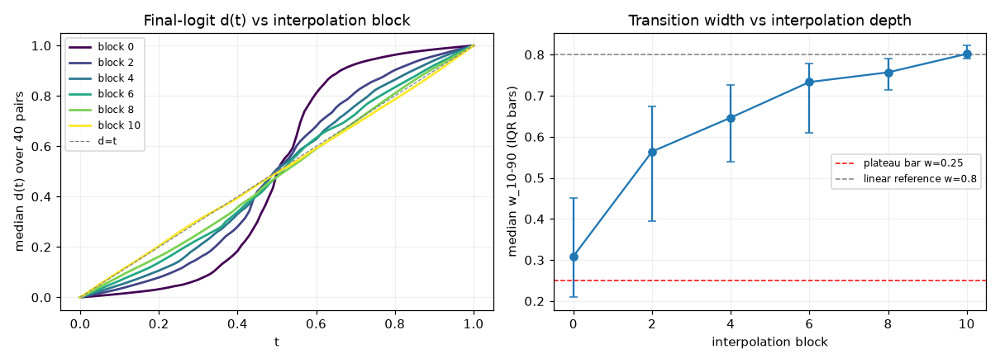

**Figure 26.** *(Exploratory.)* Left: median final-logit $d(t)$ (y) vs interpolation position $t$ (x)
per interpolation block, shaded on the cividis scale from block 0 (dark) to block 10 (light) as given
in the legend; the block-0 curve is strongly sigmoid and later blocks collapse onto the gray dashed
straight line. Right: median transition width $w_{10\to90}$ (y; bars = inter-quartile range across the
40 pairs, solid line with circle markers) vs interpolation block (x); the black dotted horizontal line
is the strict rule 0.25 and the gray dashed line the straight-line reference 0.8.

Tidy per-curve data: `results/matthew_tidy.csv`; per-pair summary: `results/matthew_summary.json`.

## Conclusion

The reconstructed 12-layer character-level Shakespeare GPT **shows Matthew-style activation
plateaus**, and the exhaustive all-pairs sweep says what they are. Under a fully frozen assay, 14/40
natural minimal pairs produce individual plateau–boundary–plateau curves in final-logit space; both
predicted structural signatures hold — monotone sharpening across the downstream blocks and monotone
weakening as the interpolation point moves later. Sweeping one fixed endpoint (the comma) against all
64 other characters shows the same shape for every pair — none linear, median width 0.340 — while
showing that the sharpness is graded (1/64 at the strict ≤ 0.25 bar) and largest for characters the
model expects in that context; repeating that sweep in eight further held-out contexts (576 pairs)
shows the shape claim is not an artifact of the chosen context (**0/576** near-linear) and puts the
probability effect in proportion (negative in 9/9 contexts, median ρ = −0.41, not the −0.74 of the
first context alone). Running **all 2,080 character pairs** then answers the structural question:
**every character owns a basin** ($\phi \ge 0.86$ for all 65), **78%** of the variance in transition
width is explained by per-character terms rather than pair chemistry, **91%** of the model's
next-character prediction changes fall inside the transition window, and the whole structure is
**learned** (median width 0.803 at initialization → 0.355 trained) and **built by blocks 1–4** (0.34
patching at block 0 vs 0.81 at block 8). Our reading: **a plateau here is a next-character decision
basin.** Two interventions locate its mechanism: no readout bias can move the plateau ($d(t)$ is
algebraically invariant to one), whereas scaling the MLP branch of blocks 1–4 sets the sharpness
directly and monotonically (width 0.80 at gain 0 → 0.35 unmodified → 0.31 at gain 1.5), while the same
manipulation of blocks 8–11 changes nothing. The basins are therefore *built* shallow and only *read*
at the unembedding. Deleting those four MLPs one at a time shows no single block carries the effect
(shares 41/28/18/11%, close to additive), and re-measuring both candidate mechanisms under every
ablated model dissociates the plateau from each: the next-character **decision survives** the ablation
that flattens $d(t)$ (80.7% of pairs still predict different characters at their two endpoints, median
3 $\arg\max$ regions unchanged, while $|t^{*}-t_{\mathrm{flip}}|$ decouples 0.043 → 0.214), and the
widening is **not mediated by plausibility** ($\rho(\Delta w,\Delta\max p)=+0.22$; median
$|\Delta\max p|\le 0.0007$; where plausibility moves it moves in the direction that predicts *sharper*
plateaus). So "decision basin" remains the right description of the geometry and is ruled out as its
cause: blocks 1–4 build a sharp residual-stream change from which the readout computes both the
decision and the plausibility ranking.

**Joint Grokking↔plateau verdict: primary not testable (PLAN case 5); character analogues temporally
associated (PLAN case 1).** The mandatory validity gate — reproducing *Deep Networks Always Grok*
Figure 9 — is **PASSed by both character runs** (pilot 3.5k: LC 484 @ 19 → 1043 @ 33 → 68; fresh 30k:
491 @ 15 → 989 @ 36 → 8.1 on a 24-checkpoint grid, with robustness rising to 0.53 after clean accuracy
saturates) and **FAILed
by the fresh BPE run**, whose only upturn (30 units) is inside the preregistered 5% tolerance. Because
the BPE model is the one required for Matthew's exact `big/in`, `big/large` single tokens, the
**Matthew-exact** relationship is still untestable here. On the character side the joint claim is now
available: running Matthew's assay with the `b↔i`/`b↔l` controls across six frozen checkpoints, the
plateau is absent at init (width ≈ 0.80), still absent at step 56, sharp by step ~831 (≈ 0.33) and flat
to 30k — i.e. it sharpens **inside** the second-descent window (36 → 30,000) and across the sustained
robustness onset (step 531). We report that as **temporal association only**: one run cannot show
causation, the window opens so early (step 36) that it overlaps ordinary initial fitting, and the
plateau is complete long before robustness saturates (~7,819). Strengthening this would need a run
whose second descent is well separated from initial fit — a far longer horizon or the paper's exact
recipe — outside this run's compute budget (~30k vs the paper's ~1e5 steps).

**Interpretation.** The interpolated block-0 activation itself carries a nearly linear image of the
input mixture; blocks 1–4 then collapse it toward one of the two endpoint computations, and the
remaining blocks add nothing. The all-pairs sweep sharpens the earlier reading that plateaus are "a
distributed property of the whole stack": the sharpening is concentrated shallow, and what the basins
*index* is the model's next-character decision — the flat arms are constant-prediction regions and 91%
of prediction changes sit inside the boundary. Note this coexists with an earlier finding on the same
model (see CHANGELOG, 2026-07-15) that responses to *random-direction* perturbations are smooth and
saturating — that assay answered a different question; the plateau structure lives specifically along
natural activation-to-activation directions.

**Limitations.**
1. **Reconstruction, not the paper's checkpoint.** The verdict applies to a faithful, standard build
   of the Figure-9 architecture and training recipe, not the authors' exact weights.
2. **Strictness of the bar is arbitrary.** 14/40 exploratory pairs pass at $w \le 0.25$; 24/40 at 0.35.
   The exhaustive sweeps make this sharper still: 1/64 comma pairs and 182/2,080 all-pairs clear 0.25,
   even though almost no curve is linear (20/2,080, 1.0%). We report the full width distribution so
   readers can apply their own threshold; the depth, initialization and variance-decomposition results
   do not depend on any threshold.
3. **Scope.** One model size, one training length (accuracy 0.56, not grokking-scale), final-position
   interpolation only, and endpoint pairs differing in exactly one character. Plateaus between more
   distant natural inputs are untested here. Context dependence *has* been tested (nine contexts, 576
   pairs) and the shape result holds; what remains untested is other models and other interpolation
   positions.
4. **The joint result is on character analogues, not Matthew's exact tokens.** The BPE run FAILs the
   Figure-9 gate, so the checkpoint-aligned sweep with Matthew's exact `big/in`, `big/large` tokens on a
   *grokking* model was never run — PLAN case 5 stands for the primary question. The `b↔i`/`b↔l`
   character controls do sit on a run that PASSes the gate, giving PLAN case 1 (temporal association),
   but on a compressed timescale: the second descent opens at step 36, so its window overlaps ordinary
   initial fitting and the association cannot separate "sharpens with grokking" from "sharpens with
   initial fit". Six checkpoints, one run, no causal claim.
5. **Single-context correlations can overstate an effect.** The width-vs-probability rank correlation
   was −0.74 in the first context we measured but has median −0.41 (range −0.05 … −0.74) across nine
   contexts, and −0.46 on the all-pairs set. The direction is solid; the magnitude should be quoted as
   a range.
6. **"Decision basin" is a description, not a demonstrated mechanism.** The alignment between the
   transition and the prediction flip is correlational, and the three interventions since have taken
   the mechanism *away* from the decision rather than confirming it: no readout bias can move $d(t)$
   at all, the block-1–4 MLPs set the sharpness causally, and the decision structure survives the
   ablation that destroys the plateau. The plausibility account likewise survives as a predictor of
   *which* pairs are sharp (partial $\rho = -0.59$) but is excluded as the mechanism
   ($\rho(\Delta w,\Delta\max p) = +0.22$). What blocks 1–4 actually compute to produce the sharp
   change is still uncharacterised; the freezing experiment named in the hypothesis is the next test.
