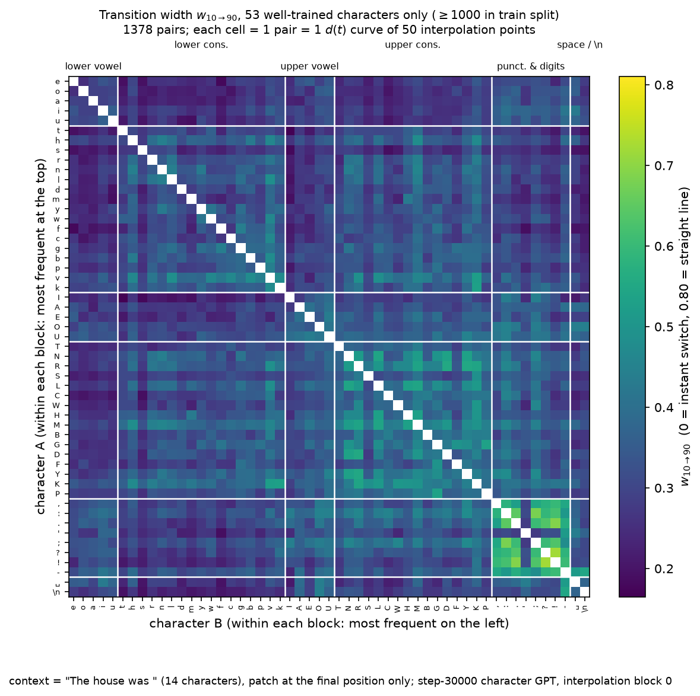
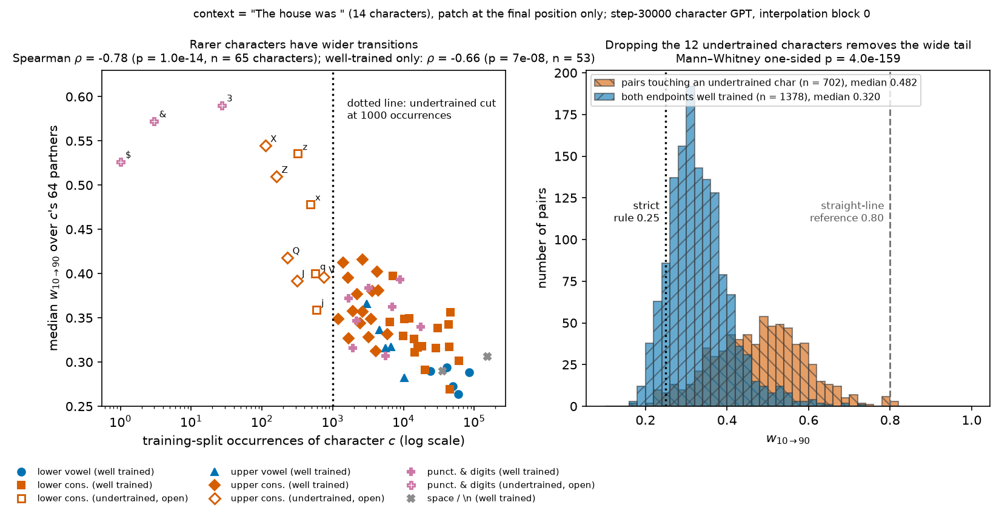
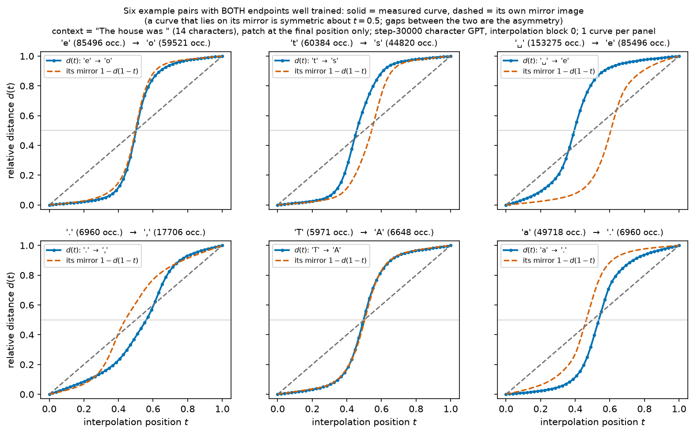
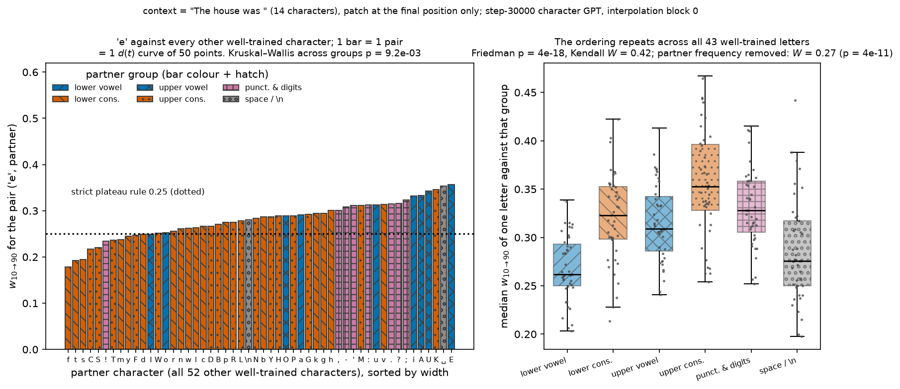

# Follow-up report — how training frequency and character class shape the activation plateau

*Companion to `REPORT.md`. It answers four questions raised in operator feedback #5 and is written to
stand on its own: everything needed to read it is defined below.*

## Summary

**The safety question behind all of this.** If we want to audit what a language model has learned, it
helps enormously if its internal states are organised into *discrete* regions — one region per output
decision — rather than blending smoothly from one answer into another. A model whose hidden states
blend smoothly has no crisp "this is the concept the model is using" to point at; a model whose hidden
states sit in flat basins with sharp walls between them does. `REPORT.md` establishes that a small
character-level GPT has exactly this structure: interpolate the hidden state between the states for two
different next characters and the model's output stays locked on the first character, then flips to the
second over a narrow band. This follow-up asks *which* characters get such a basin, how sharp the wall
is, and whether the walls are organised by anything a human would recognise.

**Four findings, all from the stored 2,080-pair sweep — no new training.**

1. **Sharpness is a function of how much training data the character got.** Across all 65 characters,
   the median transition width falls as the character's frequency in the training text rises
   (Spearman $\rho = -0.78$, $p = 1.0\times10^{-14}$). Dropping the 12 characters that occur fewer
   than 1,000 times leaves 53 well-trained characters whose 1,378 pairs have median width **0.320**,
   against **0.482** for the 702 pairs that touch an undertrained character
   ($p = 4.0\times10^{-159}$, Mann–Whitney). The wide tail of the width distribution is almost
   entirely the rare characters. This matters for auditing: the crisp structure is a property of what
   the model learned *well*, and it degrades gracefully towards "no structure" exactly where training
   signal was scarce.
2. **The trend survives inside the well-trained set** ($\rho = -0.66$, $p = 7\times10^{-8}$ over the
   53 kept characters), so it is not an artefact of a handful of near-unseen symbols; it is a
   continuous dose–response relationship between data and sharpness.
3. **The individual curves are strongly asymmetric, and the asymmetry is interpretable.** The switch
   rarely sits at the midpoint of the interpolation: the output holds the *contextually plausible*
   endpoint for most of the path and concedes the other one late. Two characters that are equally
   well trained can still split the path 60/40.
4. **The walls are organised by character class, consistently.** Taking one well-trained letter and
   looking at its width to every other well-trained character, the partner's class predicts the width
   (Kruskal–Wallis $p = 9.2\times10^{-3}$ for the letter `e`), and the *same ordering* — lower-case
   vowels and space sharpest, upper-case consonants and punctuation widest — repeats across all 43
   well-trained letters (Friedman $p = 4\times10^{-18}$, Kendall $W = 0.42$). It is not merely the
   frequency effect of finding 1 again: after removing partner frequency the ordering still holds
   ($W = 0.27$, $p = 4\times10^{-11}$). The model's basin geometry therefore tracks a linguistic
   grouping, not just a data-count.

**Scope.** Everything here is measured on one 12-block character-level GPT at one checkpoint and one
prompt context. The numbers are descriptive of that model; the claim that they generalise is not made.

## Methods

### Data & Model

All results reuse the all-pairs sweep already reported in `REPORT.md` §*All pairs of characters*, so no
network was retrained and no new forward pass was run. That sweep used:

- **Model:** a 12-block GPT (12 heads, width 240, context 128 tokens, dropout 0.2, 8.6M parameters)
  trained from scratch for 30,000 steps on character-level tinyshakespeare (vocabulary = the 65
  distinct characters of the corpus). All numbers come from the **step-30,000** checkpoint.
- **Data for the frequency variable:** the training split — the first 90% of the corpus, the exact
  split the model was trained on (SHA-256 of the corpus verified against the value recorded at
  training time, `86c4e6aa…c565ed`).
- **Hook point:** the residual stream after **block 0**, at the **final position only**.
- **Prompt:** the single shared context `"The house was "` (14 characters, including the trailing
  space), with one candidate next character appended. This is stated on every figure below.
- **Sample:** all $\binom{65}{2} = 2080$ unordered character pairs, one interpolation curve per pair,
  each curve sampled at 50 evenly spaced positions.

A practical note that constrains one of the four answers: the checkpoint files live on scratch storage
that has since been cleared, so this iteration could only analyse the **stored** curves. Where that
changes what could be measured, it is said in place (§*Asymmetry*).

### The two metrics inherited from the main report

Interpolating a hidden state is only informative if we can say where the *output* sits along the way.
Raw distances in logit space are not comparable across pairs (endpoint separations in this model range
over roughly 8.7–64.4), so the output position is measured in a normalized form. Let $x(t)$ be the
final-position logit vector produced when block 0's residual stream is replaced by the interpolated
state at position $t$, and let $x_A$, $x_B$ be the same vector for the two endpoint characters:

```math
d(t)=\frac{\lVert x(t)-x_A\rVert_2}{\lVert x(t)-x_A\rVert_2+\lVert x(t)-x_B\rVert_2}.
```

Read $d \approx 0$ as "the output still looks like character A" and $d \approx 1$ as "it now looks like
character B". By construction $d(0) = 0$ and $d(1) = 1$. A plateau–boundary–plateau curve hugs 0,
crosses fast, then hugs 1; a model with no discrete structure would give roughly the straight line
$d = t$.

Eyeballing 2,080 curves invites cherry-picking, so each curve is summarized by one number: the fraction
of the path over which $d$ climbs from 0.1 to 0.9, read off a monotone (isotonic) fit so that small
wiggles cannot create spurious crossings:

```math
w_{10\to 90}=t_{hi}-t_{lo},\qquad t_{lo}=t(d=0.1),\quad t_{hi}=t(d=0.9).
```

Smaller is sharper. **A straight line scores $w = 0.80$; a synthetic step scores 0.089; the frozen
"strict plateau" rule used throughout the main report is $w \le 0.25$** together with the transition
starting after 10% and ending before 90% of the path. Both reference values are drawn on every figure.

Per character, the summary used below is the median over that character's 64 partners $P(c)$ — "how
sharply is this character left, on average":

```math
\mathrm{med}_w(c)=\underset{p\in P(c)}{\mathrm{median}}\ w_{10\to 90}(c,p).
```

### What is new here: training frequency, character groups, and cross-letter agreement

**Training frequency $f(c)$** — the plain count of character $c$ in the training split. It is the
simplest available proxy for "how much evidence did the model get about this character", and the
operator's cut for *undertrained* is $f(c) < 1000$. Twelve characters fall below it and 53 survive:

| dropped (undertrained) | `$` | `&` | `3` | `X` | `Z` | `Q` | `J` | `z` | `x` | `q` | `j` | `V` |
|---|---|---|---|---|---|---|---|---|---|---|---|---|
| occurrences in train split | 1 | 3 | 27 | 112 | 161 | 230 | 312 | 320 | 480 | 563 | 588 | 746 |

**Character groups.** To ask whether the basins are organised by anything linguistic, each character is
assigned to one of six groups: lower-case vowel, lower-case consonant, upper-case vowel, upper-case
consonant, punctuation & digits, and whitespace (space or newline). Case and vowel-hood are the two
most obvious human-legible axes in a character vocabulary, and they are chosen before looking at any
width.

**Agreement across letters (Kendall's $W$).** A single letter's row could show group structure by
chance. The question that matters is whether *different* letters order the six groups the same way. For
$n$ letters each ranking $k = 6$ groups, with $R_g$ the sum of ranks of group $g$ over the letters,
Kendall's coefficient of concordance is

```math
W=\frac{12\sum_{g=1}^{k}\left(R_g-\tfrac{1}{k}\sum_{h}R_h\right)^{2}}{n^{2}\,(k^{3}-k)} .
```

$W = 0$ means the letters disagree completely about which partner groups give sharp transitions;
$W = 1$ means every letter produces an identical ordering. The accompanying Friedman test gives the
p-value for "all six groups are exchangeable". Both are used in Result 3.

**Removing the frequency confound.** Vowels are common, so a group effect could just be finding 1
again. Wherever that risk exists, the widths in a letter's row are converted to ranks, the ranks of the
partner's $\log_{10} f$ are linearly regressed out, and the group analysis is repeated on the residual
ranks — a rank-based partialling that leaves only the part of the group effect frequency cannot
explain.

**Supporting tests.** Two-sample comparisons of width distributions use the one-sided Mann–Whitney U
test (no normality assumption); monotone associations use Spearman's $\rho$; the six-group comparison
within a single letter's row uses Kruskal–Wallis. All are rank-based, which suits width distributions
that are visibly skewed.

### Context and sample counts behind every character-level figure (feedback item 4)

The operator asked whether the character-level GPT figures were produced *with* a prompt context, and
how many samples sit behind each cell. They were: every character-level interpolation figure in
`REPORT.md` and here uses a real prompt prefix and patches only the final position, so the interpolated
state is always read in context, never in isolation. The table gives the context and the per-cell count
for each character-level figure of `REPORT.md`; the six all-pairs figures (14–19) have now been
re-rendered with this information printed directly on the figure, and all four figures below carry it
too.

| `REPORT.md` figures | context used | samples behind one cell / point |
|---|---|---|
| 6 (`d(t)` by checkpoint) | `"The house was "` (14 chars) | 1 curve of 50 points per pair per checkpoint, 2 pairs |
| 8–11 (comma sweep) | `"The house was "` (14 chars) | 1 curve of 50 points per pair; 64 pairs per panel |
| 12–13 (context control) | 9 contexts: `"The house was "` plus 8 held-out passages of 64 chars | 1 curve of 50 points per pair; 64 pairs per context |
| 14–19 (all pairs) | `"The house was "` (14 chars) | 1 curve of 50 points per pair; 2,080 pairs (200 per block in the depth panel) |
| 20 (readout rebalancing) | `"The house was "` (14 chars) | 1 curve per pair; 1,873 pairs |
| 21–24 (MLP gain, block scan, frozen blocks, capacity) | `"The house was "` (14 chars) | 1 curve per pair; the same 150-pair subsample per condition |
| 1–5 (training / grokking gates) | not interpolation figures — whole-corpus evaluations | 500 held-out sequences per checkpoint |

## Results

### 1. Sharpness is bought with training data

The first question was what the pairwise picture looks like once undertrained characters are out of it.
Figure 1 is the width matrix restricted to the 53 well-trained characters, with the six groups blocked
out and, inside each block, the most frequent character first — so both the group structure and the
within-group frequency gradient are visible at once.



**Figure 1.** Transition width for every pair of well-trained characters. x-axis: character B; y-axis:
character A; both are ordered by group (lower-case vowels, lower-case consonants, upper-case vowels,
upper-case consonants, punctuation & digits, whitespace, separated by white rules) and, within a group,
by descending training frequency. Colour = $w_{10\to 90}$ on the `viridis` scale (dark = sharp switch,
bright = gradual); the colour range is fixed to the full 2,080-pair range so this figure is directly
comparable with Figure 14 of `REPORT.md`. Each cell is one pair — one $d(t)$ curve of 50 interpolation
points; the diagonal is undefined and left white. Two things stand out: the vowel rows at the top are
uniformly dark (every path into or out of a common vowel is a fast switch), and the punctuation block
at the bottom right is the one bright square in the figure — punctuation-to-punctuation transitions
are the model's least discrete region even after undertrained characters are removed.

Figure 1 shows structure but not the dose–response. Figure 2 puts width directly against training
frequency, and shows what removing the 12 rare characters does to the width distribution as a whole.



**Figure 2.** Left: per-character median width (y) against that character's occurrences in the training
split (x, log scale), one marker per character; marker shape and colour give the character group (see
legend, repeated below the panel), open markers are the 12 undertrained characters, which are labelled
individually. The dotted vertical line is the 1,000-occurrence cut. The relationship is monotone over
four orders of magnitude: Spearman $\rho = -0.78$ ($p = 1.0\times10^{-14}$, n = 65 characters), and
still $\rho = -0.66$ ($p = 7\times10^{-8}$) inside the 53 well-trained characters alone. Right:
distribution of $w_{10\to 90}$ (x) versus number of pairs (y) for the 1,378 pairs whose endpoints are
both well trained (hatched `//`) and the 702 pairs touching an undertrained character (hatched `\\`).
Dotted line = strict plateau rule 0.25; dashed line = straight-line reference 0.80.

The medians are **0.320** (well-trained pairs) against **0.482** (pairs touching a rare character), a
one-sided Mann–Whitney $p = 4.0\times10^{-159}$, and the fraction of pairs passing the strict plateau
rule rises from 8.8% over all 2,080 pairs to 11.8% over the 1,378 well-trained ones. Read the right
panel as a decomposition of the main report's width distribution: the long tail towards the
straight-line reference, which is the part of the data that looks *least* like a plateau, is
disproportionately made of characters the model barely saw. The practical consequence for anyone using
this structure as an interpretability handle is that the handle is reliable in proportion to training
exposure, and one should expect it to fail on the rare tokens — which is also where a model is most
likely to behave unpredictably.

The strongest form of the trend is that it does not need rare characters to exist: among the 53 kept
characters, spanning 1,265 (`k`) to 153,275 (space) occurrences, more frequent still means sharper.
The mechanism this points at is that sharpening is *learned per character*, accumulating with the
number of updates in which that character is the target, rather than being a fixed property of the
architecture — consistent with the main report's initialization control, where the untrained network
shows none of this structure.

### 2. The curves are asymmetric, and the plausible endpoint owns most of the path

The second question was whether the interpolation curves are symmetric. One reading is about the
endpoint *order*: the sweep always ran the pair in one fixed order, so it is fair to ask what the
reverse direction looks like. That has a clean answer with no new experiment. The interpolation path is
symmetric by construction — the state at position $t$ going A→B is the state at position $1-t$ going
B→A — so the reversed curve is exactly $1-d(1-t)$, and the 100-pair endpoint-swap control in
`REPORT.md` confirms it numerically: the maximum $|w(A,B)-w(B,A)|$ over those pairs is 0.000. (The
checkpoints have since been cleared from scratch storage, so re-running the swap was not possible this
iteration; the stored control already answers it exactly.)

That makes the informative question the *shape* of a single curve: does the output leave the first
character and reach the second at the same rate? Figure 3 answers it visually, as requested, with no
metrics attached: each panel plots one measured curve together with its own mirror image, so a
symmetric curve would lie on top of the dashed line and any gap is the asymmetry.



**Figure 3.** Six example pairs, both endpoints well trained (occurrence counts in each panel title).
x-axis: interpolation position $t$ from the first character (t = 0) to the second (t = 1); y-axis:
relative distance $d(t)$. Solid line with dots = the measured curve; dashed line = its own mirror
$1-d(1-t)$; grey dashed diagonal = the straight-line (no-plateau) reference; the thin horizontal line
marks $d = 0.5$. Where solid and dashed separate, the curve is asymmetric about the midpoint.

The asymmetry is large and it has an obvious direction. In the `␣`→`e` panel the crossing sits near
$t \approx 0.38$: the output stops looking like a space early and then rests on `e` for the remaining
60% of the path. In `a`→`.` and `.`→`,` the crossing sits past the midpoint, so the first character
holds the path. The pattern lines up with the main report's Figure 17, which found the crossing point
correlates with which endpoint the model finds more plausible in the context: after `"The house was "`
a lower-case letter is a far more plausible continuation than a space or a comma, and the more
plausible character occupies the larger share of the path. So the basins are not equal-sized cells
around each character — the context inflates the basin of the character it expects. `T`→`A` and
`e`→`o`, both plausible letter continuations, are the two panels that come closest to symmetric, which
is the same story seen from the other side.

### 3. The wall thickness is organised by character class

The third question was whether the widths from one well-trained letter to all other characters group
into anything semantic. Figure 4 takes `e` — the most frequent letter in the corpus — and shows its
width to each of the 52 other well-trained characters, then asks whether whatever ordering it produces
is idiosyncratic or shared.



**Figure 4.** Left: transition width (y) for each pair (`e`, partner), one bar per partner, sorted by
width; x-axis lists the partner character. Bar colour *and* hatch give the partner's group (legend);
dotted line = strict plateau rule 0.25. Each bar is one pair — one $d(t)$ curve of 50 points; 52 bars.
Right: for each of the six partner groups, the distribution over the 43 well-trained letters of that
letter's median width against that group (box = interquartile range, black bar = median, grey dots =
the 43 individual letters). y-axis: median $w_{10\to 90}$ of one letter against that group.

For `e` alone the six groups differ (Kruskal–Wallis $p = 9.2\times10^{-3}$), with lower-case consonants
sharpest at 0.262 and upper-case vowels widest at 0.333. Taken alone that is weak evidence — one letter,
52 pairs. The right panel is what makes it a finding: averaged over all 43 well-trained letters the
group medians order as lower-case vowels 0.270 < whitespace 0.286 < upper-case vowels 0.316 <
lower-case consonants 0.320 < punctuation 0.331 < upper-case consonants 0.356, and the letters agree on
that ordering far beyond chance (Friedman $p = 4\times10^{-18}$, Kendall $W = 0.42$ across 43 letters
ranking 6 groups). Once the partner's training frequency is regressed out of the ranks the concordance
drops but does not vanish ($W = 0.27$, $p = 4\times10^{-11}$), with vowels still ahead of consonants in
both cases. So class membership carries information about basin geometry that raw data volume does not.

Two honest qualifications. First, individual letters deviate: `e` itself puts lower-case consonants
ahead of lower-case vowels, the reverse of the aggregate, so the ordering is a population tendency and
not a rule for any single letter. Second, the two axes that carry most of the effect — vowel versus
consonant, and case — are correlated with *positional* statistics in English text (a vowel is a likely
continuation almost anywhere inside a word; a capital is not), so "semantic grouping" here is best read
as the model grouping characters by the role they play in a continuation, which is exactly the
information a next-character predictor is trained to represent.

## Conclusion

Removing the undertrained characters does not weaken the plateau picture in `REPORT.md` — it sharpens
it. The pairs that looked least like a plateau were concentrated on characters the model saw fewer than
1,000 times, and with those gone the median transition width drops from 0.355 to 0.320 and the strict
plateau rate rises from 8.8% to 11.8%. The underlying relationship is continuous rather than a
threshold effect: median width falls monotonically with training frequency across four orders of
magnitude, and still does so within the well-trained set alone.

Two further structures showed up in the same data. The curves are markedly asymmetric, with the
contextually plausible endpoint holding most of the interpolation path, which says basins are sized by
the prompt rather than being fixed cells around each character. And the width from a letter to a
partner depends on the partner's class in a way 43 letters agree on, surviving removal of the frequency
confound — lower-case vowels and whitespace give the sharpest walls, upper-case consonants and
punctuation the softest.

For safety-relevant interpretability the summary is a caveat and an encouragement in one sentence: the
discrete, auditable structure this model has is real but *unevenly distributed*, strongest exactly where
training data was plentiful and where the prompt makes the target likely, and weakest on rare symbols —
the regime where a model's behaviour is hardest to predict and where an interpretability tool would be
most useful. Any technique built on plateau structure should be validated on the rare tail rather than
on average.
