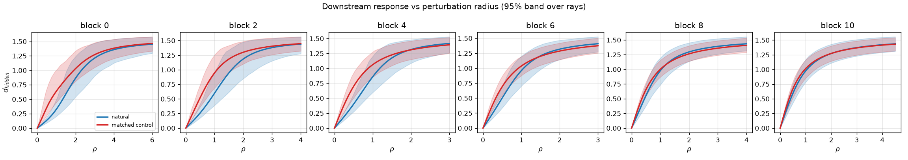
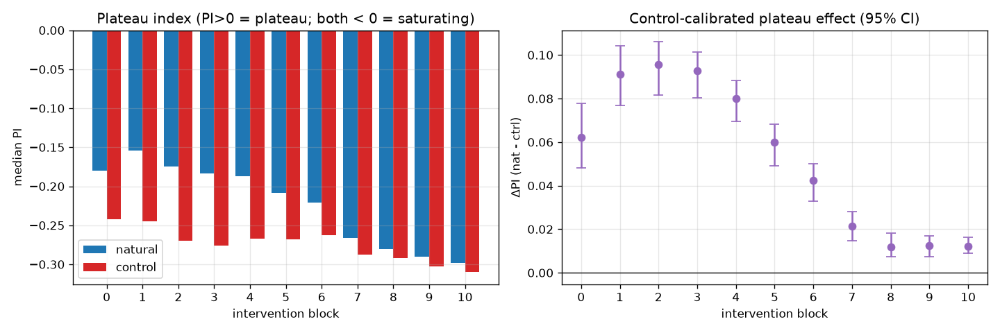
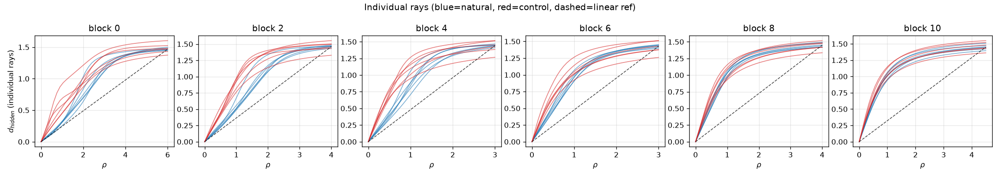

# RESULTS — Do the 12-layer Shakespeare GPT's activations show plateaus?

> CURRENT-BEST ONLY. History lives in CHANGELOG.md. Read before rewriting.

## Question & verdict

**Question (a go/no-go gate).** The paper *Deep Networks Always Grok and Here is Why* reports that a
trained MLP's activations have **plateaus**: perturb a hidden activation along a ray and the network's
downstream output barely moves for a while (a flat region), then changes sharply at a region boundary.
Its Figure 9 is a **12-layer, 12-head character-level Shakespeare GPT with GeLU MLPs**. Does *that*
model show the same plateaus at its residual stream? A yes justifies a follow-up study; a calibrated
no closes the direction.

**Verdict: NO plateaus detected (qualified).** In a faithful reconstruction of the Figure-9 model
(the paper's exact GPT code/checkpoint is **not publicly released** — audited 2026-07-15), the
downstream response to final-position residual perturbations is **smooth and saturating** (concave —
it rises fast then flattens), the *opposite* of a plateau, at **every** intervention block 0–10.
"Qualified" because we tested a reconstruction, not the paper's exact checkpoint (see Limitations).

## Model actually tested

Reconstruction 12-layer/12-head GeLU GPT (`d_model=240`, context 128, 8.38M params), trained on Tiny
Shakespeare to **val loss 1.494, next-char accuracy 0.560** (≈37× the 1/65 chance rate) — a
demonstrably trained model. Full provenance (corpus SHA-256, seeds, config) in `results/train_meta.json`;
every confirmed-vs-reconstructed field in `MODEL_SPEC.md`.

## Metrics (one row per intervention block; 48 held-out contexts × 8 directions)

The **plateau index** `PI` measures curve shape: `PI > 0` = delayed-then-steep (**plateau**);
`PI = 0` = straight line; `PI < 0` = **front-loaded/saturating**. `ΔPI = median(PI_natural) −
median(PI_control)` compares real activations to a norm-matched random control. Cliff's δ is the
effect size of that comparison (|δ|>0.47 = "large"). **Sharpness** = a ray's max finite-difference
slope over its mean slope (linear = 1.0; our synthetic plateau = 3.2); it indicates a plateau *edge*
only when paired with `PI > 0`. 95% CIs are hierarchical bootstraps over contexts then directions.

| Block | median PI (natural) | median PI (control) | ΔPI (hidden) | ΔPI 95% CI | Cliff's δ | ΔPI (JSD) | sharp nat / ctrl | flip frac @ max ρ |
|------:|--------------------:|--------------------:|-------------:|:----------:|----------:|----------:|:----------------:|------------------:|
| 0  | −0.180 | −0.242 | +0.062 | [0.048, 0.078] | +0.75 | +0.18 | 2.75 / 3.51 | 0.88 |
| 1  | −0.154 | −0.245 | +0.091 | [0.077, 0.104] | +0.85 | +0.26 | 2.27 / 2.99 | 0.83 |
| 2  | −0.174 | −0.270 | +0.096 | [0.082, 0.106] | +0.89 | +0.28 | 2.33 / 3.36 | 0.84 |
| 3  | −0.183 | −0.276 | +0.093 | [0.080, 0.101] | +0.91 | +0.25 | 2.26 / 3.57 | 0.85 |
| 4  | −0.187 | −0.267 | +0.080 | [0.070, 0.088] | +0.90 | +0.25 | 2.16 / 3.58 | 0.83 |
| 5  | −0.208 | −0.268 | +0.060 | [0.049, 0.068] | +0.82 | +0.23 | 2.27 / 3.65 | 0.84 |
| 6  | −0.220 | −0.263 | +0.043 | [0.033, 0.050] | +0.73 | +0.19 | 2.35 / 3.59 | 0.81 |
| 7  | −0.267 | −0.288 | +0.021 | [0.015, 0.028] | +0.53 | +0.14 | 2.97 / 4.26 | 0.82 |
| 8  | −0.280 | −0.292 | +0.012 | [0.008, 0.018] | +0.36 | +0.09 | 3.28 / 4.33 | 0.83 |
| 9  | −0.290 | −0.303 | +0.013 | [0.007, 0.017] | +0.34 | +0.09 | 3.61 / 4.62 | 0.81 |
| 10 | −0.298 | −0.310 | +0.012 | [0.009, 0.016] | +0.40 | +0.13 | 4.01 / 4.91 | 0.82 |

**How to read it.** `median PI (natural)` is **negative at every block** — the real activations are
saturating, never plateaued. `ΔPI` is positive everywhere (natural is *less* saturating than the
random control), and the hidden-state and next-char (JSD) metrics agree in sign — but that difference
is between two non-plateau shapes, so it does **not** meet the plateau bar. Sharpness values are
elevated, but with `PI < 0` the steepest segment is the *initial* rise, not a late plateau edge — and
natural rays are *less* sharp than control at every block, so there is no learned wall. `flip frac @
max ρ ≥ 0.81` confirms the perturbation range is large enough to change predictions (calibration
passed).

## Figures

## Calibration checks (all passed)

- Unit test: the assay scores a synthetic delayed-then-steep curve `PI = +0.33` and a linear curve `PI = 0.00` — it *can* detect a plateau if one exists.
- `α=0` partial-forward reproduces the full unmodified forward pass (max logit error < 1e-3).
- Radius 0 → distance 0 by construction; max radius flips top-1 for ≥81% of rays.
- Not an averaging artifact: every individual ray is saturating (figure above).
- Hidden-state and output (JSD) metrics give the same qualitative conclusion.

## Headline

The reconstructed 12-layer character-level Shakespeare GPT shows **no activation plateaus** at its
final-position residual stream: downstream responses are smooth and saturating at all 11 blocks, and
the (significant) natural-vs-random difference is between two non-plateau shapes. Under this
calibrated assay the follow-up plateau-mapping study is **not warranted** for this model (qualified:
a reconstruction, not the paper's exact checkpoint).
