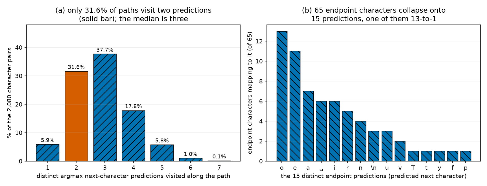
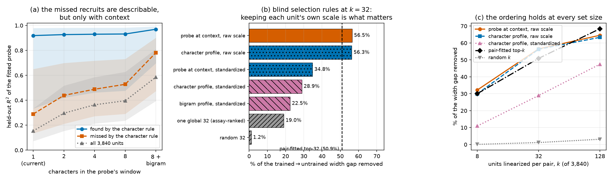
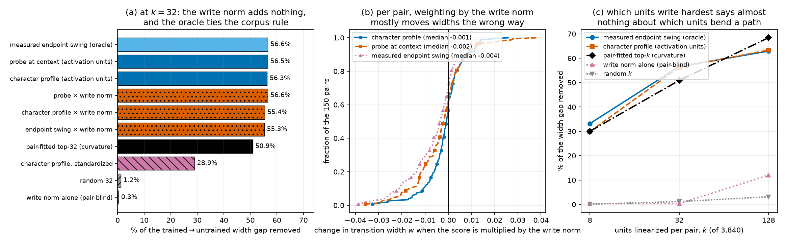
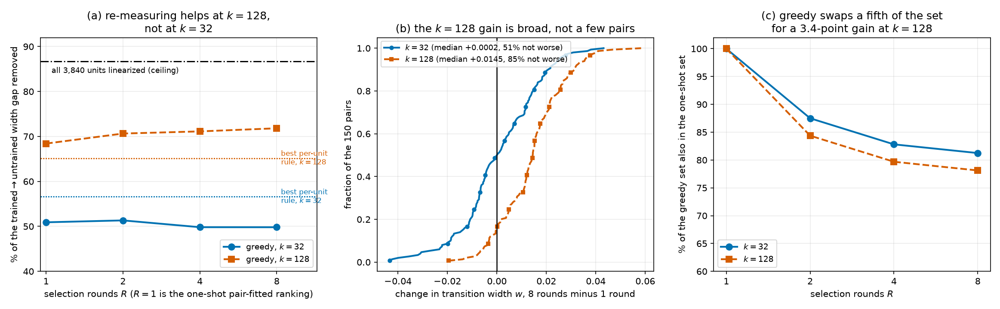
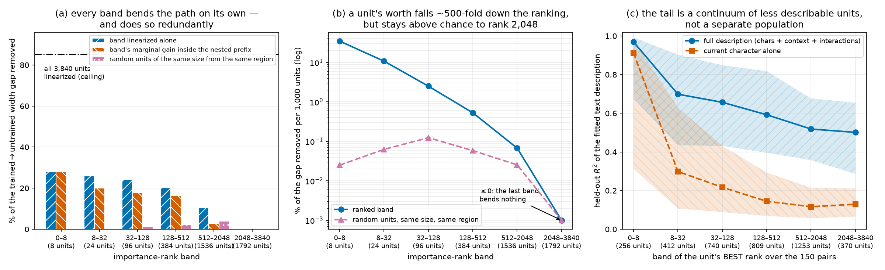
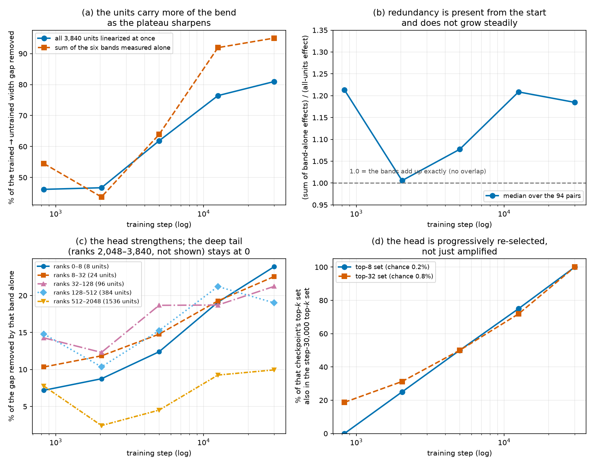
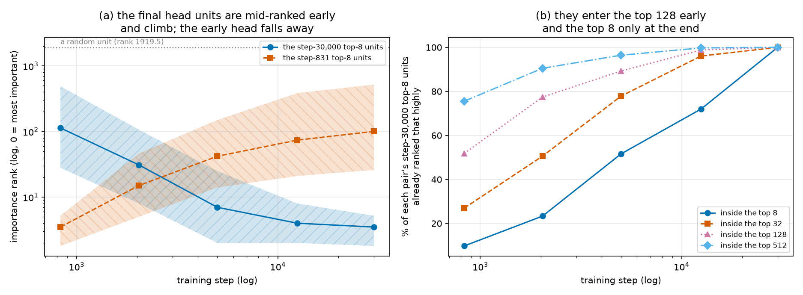
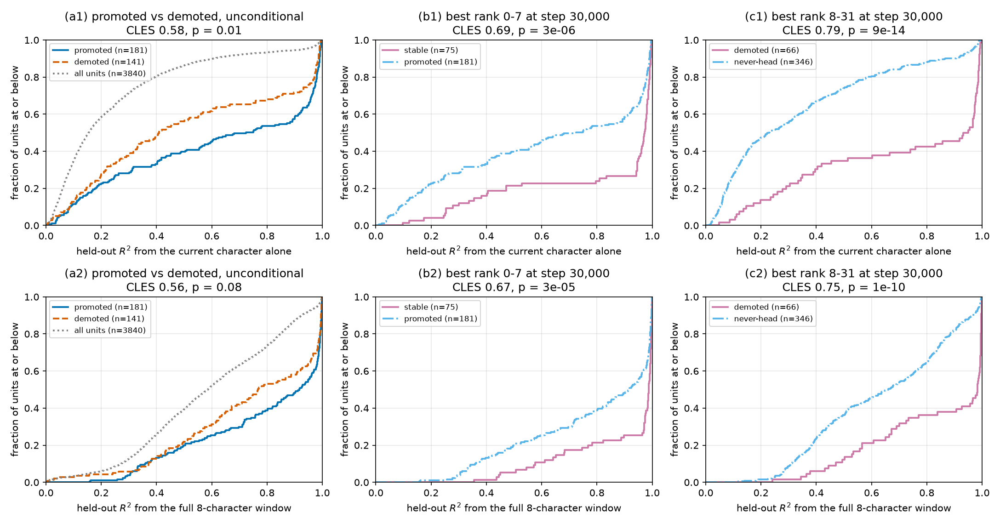
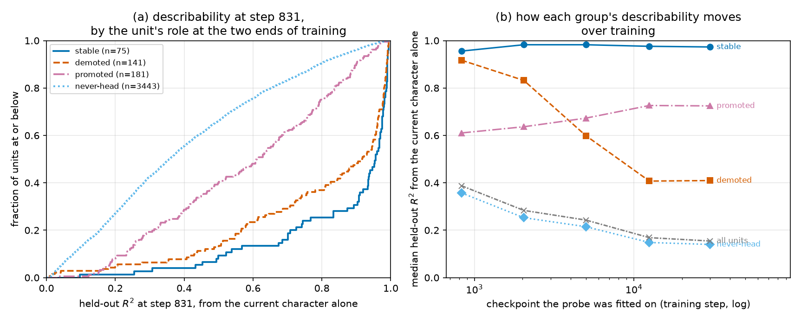
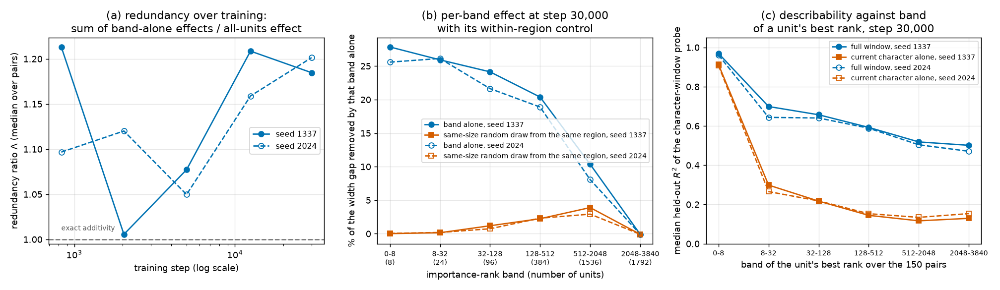

# RESULTS — Do Grokking and Matthew-style activation plateaus emerge together?

> CURRENT-BEST ONLY. History lives in CHANGELOG.md. Read before rewriting.

## Question & verdict

**Question.** In a 12-layer character-level Shakespeare GPT — the architecture of *Deep Networks
Always Grok* (Figure 9 of that paper) — do **Matthew-style activation plateaus** (Shinkle & Hex,
*Activation Plateaus: Where and How They Emerge*) appear or sharpen during the same training window as
the grokking signature (a **second local-complexity descent** plus **delayed `ε=0.03`-PGD adversarial
robustness**)? A "plateau" is this: interpolate between two natural inputs' final-position activations
and the downstream output stays locked near endpoint A, snaps across a narrow boundary, then locks near
endpoint B — a plateau–boundary–plateau `d(t)` curve, not a straight diagonal.

**Bounded verdict = PLAN case 5, "primary relationship not testable," for Matthew's exact tokens;
PLAN case 1, "temporally associated," for the character analogues.**

1. **Grokking gate: both character runs PASS, the BPE run FAILs.** Test local complexity in the fresh
   30k character run falls 1940 → 491 (step 15), turns back **up** to 989 (step 36; a 498-unit rise
   against a ±3 99% CI), then descends for the rest of training to 8.1 — Fig. 9's first-descent →
   rise → **second descent** shape. On a grid densified to 24 checkpoints the rise is resolved by
   three points (steps 23, 36, 56), not one. The onset (step 36) precedes the clean-accuracy peak
   (step 4,994) and `ε=0.03`-PGD robustness rises from 0.001 there to 0.53, still climbing after clean
   accuracy saturates. The 3,500-step pilot shows the same ordering (484 @ 19 → 1043 @ 33 → 68). The **BPE**
   run — the only tokenizer under which Matthew's exact `big/in`, `big/large` completions are single
   tokens — shows only a 30-unit upturn (1.4% of range, inside the preregistered 5% tolerance) and
   **FAILs**. So the **primary** Matthew-exact relationship is **not testable** here, while the
   character analogues now sit on a run that does reproduce Figure 9.

2. **Plateaus are present and we can time their emergence.** Using Matthew's exact config path
   (`shared_context = "The house was"`, 50-step slerp grid, full interpolation-layer sweep) with the
   two preregistered single-token **character controls** `b↔i` and `b↔l`, plateaus **emerge during
   training**: at initialization the `d(t)` curve is the diagonal (width ≈ 0.80, no plateau); by
   **step ~831** it is already a sharp sigmoid (width ≈ 0.33–0.35) and stays there to step 30k. That
   sharpening happens **inside** the fresh char run's second-descent window (steps 36 → 30,000) and
   straddles its sustained robustness onset (step 531).

3. **Bounded relationship claim.** For the character analogues this is **PLAN case 1, temporally
   associated**: the plateau sharpens in the same checkpoint interval as the second LC descent and the
   emergence of delayed robustness. Three limits keep it bounded — one training run cannot show
   causation; the second descent opens at step 36, early enough that its window also contains ordinary
   initial fitting, so "sharpens with grokking" and "sharpens with initial fit" are not separated here;
   and the plateau is complete by step ~831 while robustness keeps rising to ~7,819, so the plateau is
   not waiting on the grokking transition. Matthew's *exact* tokens remain untested (case 5).

4. **The plateau shape is general, but graded — and it survives a change of context.** Holding one
   endpoint fixed at the **comma** and interpolating to **all 64 other characters**, every pair bends
   away from the straight line — none is linear — yet only 1/64 meets the strict frozen plateau rule
   (transition width ≤ 0.25; median width 0.340 against 0.80 for a straight line). Repeating the whole
   sweep in **8 further contexts** taken from held-out text (**576 pairs**) replicates this exactly:
   **0/576** curves are near-linear and per-context median widths stay in a narrow band (0.313–0.436).
   The claim that sharpness tracks how likely the model thinks the other character is holds in
   **direction everywhere** (all 9 contexts give a negative rank correlation, sign test p = 0.004) but
   its **size is context-dependent** (median ρ = −0.41, range −0.05 to −0.74).

5. **Most characters own a logit-space basin, and its boundary coincides with a prediction change.**
   The exhaustive **all-pairs sweep** (all **2,080** character pairs) settles what the plateaus *are*:
   59 of the 65 characters are left only after the path has parked on them for at least twice as long
   as a straight-line morph would (basin fraction `φ ≥ 0.5`; the criterion fires on 0 of 4,160
   untrained-network endpoints, and the six characters that fail it are the six rarest in the training
   text), **78%** of the variance in how sharply a basin is
   left is explained by per-character terms alone, and **91%** of all next-character prediction changes
   along a path fall inside the transition window. That coincidence is not an identity, so we do not
   claim one next-character decision basin per character: the 65 endpoint characters produce only
   **15** distinct endpoint predictions, only **31.6%** of paths visit exactly two predictions (median
   **3**), and on **9.9%** of pairs both endpoints predict the same character while the path still
   rests near each end (Figure 16). The basins are **learned** — at initialization all
   2,080 paths are straight lines (median width 0.803 → 0.355 trained) — and are built by the
   **shallow blocks** (median width 0.34 patching at block 0 vs 0.81 at block 8). That site is
   contingent rather than necessary: seven retraining runs, each matching or beating the reference's
   validation accuracy, put the sharpening wherever blocks remain trainable — freeze 1–4 and it moves to
   blocks 5–8 (width 0.471), freeze 1–7 and it moves to 8–11 (0.558), freeze 5–11 and it moves back to
   1–4 (0.626), freeze 0–3 and 9–11 and it sits in the middle window 4–8 (**0.331**), freeze 0–1 and
   7–11 and it moves to 2–6 (**0.355**), freeze everything
   but blocks 5–7 and it packs 96% of the sharpening into that three-block window (**0.427**). The sharp
   transition is a **relocatable** computation this architecture and objective
   install wherever there is room; what freezing costs is *how* sharp it gets, and that cost is set by
   **where** the surviving trainable blocks sit, not how many there are — the same five trainable blocks
   give 0.365 at blocks 4–8, 0.365 again at 2–6 and 0.363 at 1–5, against 0.56–0.59 beside the readout
   and 0.63 at the bottom; all three mid-stack windows are sharper than the untouched 12-block
   reference; and even a three-block window at 5–7 with 74.6%
   of the parameters frozen ties that reference (0.446 vs 0.443, p = 0.17). The clearest single fact is
   that *training fewer blocks can help*: blocks 1–5 alone (0.363) beat blocks 0–7 (0.500), a strict
   superset of them, by 0.118 with 4.7% of pairs going the other way (p = 2e-25). An eighth run pushes
   trainable depth to its limit —
   freeze ten of twelve blocks so only block 11 remains usable — and there the plateau finally breaks
   down (0.726, just 17% of the reference sharpening, boundary no longer locked to the prediction flip).

## Models actually tested

Three models carry every number below, and which one carries which matters for how far the claims
reach: the fresh **character** GPT is the only model that both passes the grokking gate and supports
the plateau assays, so it does all the mechanistic work; the **BPE** GPT is the only one that can hold
Matthew's exact words as single tokens, and it fails the gate, which is precisely why the primary
Grokking↔plateau question stays untestable; the **pilot** run is kept only as a sanity check that
the recipe trains.

| Model | Tokenizer | Params | Trained to | Role |
|---|---|---|---|---|
| Fresh character GPT | char (vocab 65) | 8.38M | 30,000 steps, val acc 0.554 (peak 0.568) | Figure-9 control + **Matthew char-control assay** + all-pairs sweep |
| Fresh BPE GPT | GPT-2 BPE (vocab 50257) | — | 10,000 steps (killed; overfit) | primary Matthew bridge (`big/in`, `big/large`) — **gate FAILs** |
| Pilot character GPT | char (vocab 65) | 8.38M | 3,500 steps, val acc 0.560 | pilot only |

All are 12-layer/12-head GeLU GPTs (`d_model=240`, context 128). Provenance, seeds, corpus SHA-256 in
`results/train_meta*.json`; confirmed-vs-reconstructed fields in `MODEL_SPEC.md`. The paper's exact
GPT code/checkpoint is **not public** (repo audited 2026-07-15), so these are faithful reconstructions.
Figure 1 shows that the pilot run trains normally, which is the precondition for every measurement
taken on it.

**Figure 1.** Pilot character-model training. Left: cross-entropy loss in nats (y) vs training step
(x) for the train split (solid) and validation split (dashed, squares); validation bottoms at ≈1.49.
Right: validation next-character accuracy (y) vs training step (x), rising to 0.56. The model is
clearly trained, not random.

## Figure-9 grokking gate — both character runs PASS, the BPE run FAILs

PLAN makes a **validity gate** mandatory before any *joint* claim: the model must qualitatively
reproduce *Deep Networks Always Grok* Fig. 9 — a **second LC descent** beginning before the
test-accuracy peak, plus **delayed adversarial robustness** (`ε=0.03` `ℓ∞`-PGD accuracy rising while
that second descent continues). LC is the paper's sign-crossing count summed over the 12 GeLU layers
on 1,024 train/test/random points (`r=0.005`, `P=25`, 99% CIs); pipeline source-locked to the official
repo (`experiments/fig9.py`, 0.0 logit-reimplementation error). Preregistered PASS/FAIL rule in
`experiments/fig9_verdict.py`.

| Figure-9 quantity | Pilot char (3.5k) | **Fresh char (30k)** | **Fresh BPE (10k)** |
|---|---|---|---|
| checkpoints evaluated | 13 | 24 | 10 |
| clean acc (peak / final) | 0.564 / 0.564 | 0.568@4994 / 0.554 | 0.299@831 / 0.274 |
| `ε=0.03` PGD adv acc (final) | 0.327 | **0.528** | **0.187** |
| test LC (first → 1st local min → local max → final) | 1940 → 484 @ 19 → 1043 @ 33 → 68 | 1940 → 491 @ 15 → **989 @ 36** → **8.1** | 2182 → — → — → **95** |
| points resolving the LC local maximum | 1 (step 33) | **3** (steps 23, 36, 56) | — |
| LC rise vs 5%-of-range tolerance | 558 ≫ 94 | **498 ≫ 96.8** | 30 < 104 → rejected |
| second LC descent? | **Yes**, onset step 33 | **Yes**, onset step 36 | No |
| onset before clean-accuracy peak? | Yes (33 < 3500) | Yes (36 < 4994) | n/a |
| adv acc at onset → max at/after onset | 0.000 → 0.327 | 0.001 → 0.530 | n/a |
| sustained robustness onset (adv ≥ 0.05 thereafter) | step 1,091 | step 531 | step 217 |
| **preregistered verdict** | **PASS** | **PASS** | **FAIL** |

The fresh char run is the cleanest case: LC 491.2 ± 2.7 at step 15 → 989.1 ± 4.5 at step 36 (5.1× the
96.8-unit tolerance, ~110× the CI) → 8.1 at step 30,000 without rebound, well below the first minimum;
robustness crosses 0.05 for good at step 531 and keeps rising after clean accuracy saturates (0.55 by
step 2,038). Its grid was **densified from 14 to 24 checkpoints** this iteration (10 already-saved but
never-measured checkpoints at steps 1, 2, 6, 9, 23, 36, 88, 138, 339, 531 run through the identical
pipeline) specifically to test whether the turnaround was an artifact of one log-spaced point. It was
not: the rise is now traced by three points above the minimum (988 @ 23, 989 @ 36, 769 @ 56) and both
its height (278 → 498 units) and the verdict's margin grew. The BPE run's only upturn (459.5 @ 56 →
489.2 @ 217) is 1.4% of its LC range, inside the tolerance fixed in advance, so it is scored as no
second descent → **FAIL**. Two honest caveats remain on the passing runs: the turnaround happens very
early (steps 15–56) rather than long after saturation as in the paper, and in the **pilot** run the
local maximum is still resolved by a single log-spaced checkpoint. Both fresh
runs also **overfit** in ordinary validation loss (char ≈step 3,750, BPE ≈step 750), so classic delayed
val-loss recovery is absent even where the LC/robustness ordering passes. Figures 2–4 show the three
gate curves with the detected landmarks annotated.

**Figure 2.** Pilot char (3.5k) Figure-9 gate. Left y-axis: local complexity (sign-crossings summed
over the 12 GeLU layers) for the train (solid), test (dashed) and random (dash-dot) base-point sets,
with 99% CI bands. Right y-axis: next-token accuracy — black with circles = clean test accuracy,
black dotted with squares = `ε=0.03` PGD adversarial accuracy. x-axis: training step (log scale, step
0 drawn at 1). Grey vertical rules mark the detector's landmarks, labelled along the top: the first LC
local minimum (dash-dot, ▽), the local maximum opening the second descent (dashed, △), the sustained
robustness onset (dotted) and the clean-accuracy peak. LC falls to 484 at step 19, rises to 1043 at
step 33, then descends to 68 while adversarial accuracy climbs to 0.33 → **PASS**.

**Figure 3.** Fresh char (30k) Figure-9 gate on the densified 24-checkpoint grid, same axes, line
styles and landmark rules as Figure 2. The LC turnaround at steps 15 → 36 (491 → 989, CIs ±3 and ±4)
is the V-then-Λ notch between the ▽ and △ markers, now traced by three measured points above the
minimum (steps 23, 36, 56) rather than one; LC then descends to 8.1 while adversarial accuracy reaches
0.53, crossing 0.05 for good at step 531 and still rising after clean accuracy saturates → **PASS**.
This is the clearest of the three gate curves.

**Figure 4.** Fresh BPE (10k) Figure-9 gate, same axes and line styles as Figure 2 (only the
robustness-onset and accuracy-peak rules appear — no significant LC minimum/maximum was found). The
step-56 → step-217 upturn is 30 units, inside the 104-unit tolerance, so LC counts as descending to 95
while adversarial accuracy climbs to 0.19 → **FAIL**. This is the run that would
have carried Matthew's exact `big/in`, `big/large` tokens, so its failure is what makes the primary
relationship untestable.

**Joint timeline (S7).** On one training-step axis the two questions separate. The BPE bridge to
Matthew's exact tokens does not reproduce Figure 9, so the **primary** Matthew-exact relationship stays
untestable (PLAN case 5). On the fresh character run, which does pass, the second descent spans steps
36 → 30,000 and sustained robustness begins at step 531 — and the `b↔i`/`b↔l` plateau collapses from
width ≈ 0.80 (steps 0 and 56) to ≈ 0.33 by step 831, i.e. **inside** that window and straddling the
robustness onset. That is **PLAN case 1 (temporally associated)** for the character analogues, with two
limits: one run cannot show causation, and the window opens so early (step 36) that it also contains
ordinary initial fitting. Figure 5 puts all three runs side by side.

**Figure 5.** Joint checkpoint timeline. Left: test local complexity (y) vs training step (x, log) for
the pilot char run (dotted, triangles), fresh char run (solid, circles) and fresh BPE run (dashed,
squares); the legend gives each run's Figure-9 verdict. Middle: `ε=0.03` PGD adversarial accuracy (y)
vs step (x, log), same three line styles; the horizontal dashed line is the 0.05 robustness threshold
used by the verdict rule. Right: text summary of the three gate verdicts (PASS / PASS / FAIL) and the
bounded relationship verdict — the BPE FAIL is what keeps the Matthew-exact relationship untestable.

## Primary plateau evidence — Matthew-faithful char-token controls across training (S6)

This is the **plateau half** of the joint question, run through Matthew's own code path
(`experiments/run_matthew_ckpts.py`, config `configs/matthew_char_control.yaml`): shared context
`"The house was"`, **exactly 50** evenly spaced interpolation values, `slerp_rescale` (spherical
direction + linear norm), patch **only the final position**, and sweep **every** interpolation layer
(resid_post blocks 0–11) recording Matthew's downstream hooks + final logits. The two single-token
pairs are the preregistered controls `b↔i` and `b↔l` (each a single character token; the BPE
`big/in`, `big/large` bridge is non-decisive because the BPE model fails the gate). We evaluate the
**6 frozen phases** (`results/frozen_phases_char.json`, chosen from the Figure-9 curve **before**
inspecting any plateau curve): steps **0, 56, 831, 7819, 17500, 30000**.

**The plateau is absent at init and emerges during the first LC descent, then is stable.** At
interpolation block 0 (Matthew's default), the final-logit transition width `w_10→90` per pair:

| training step | `b↔i` width | `b↔l` width | plateau? |
|---:|---:|---:|---|
| 0 (init) | 0.802 | 0.802 | no — diagonal |
| 56 | 0.771 | 0.814 | no — diagonal |
| 831 | 0.348 | 0.674 | forming |
| 7,819 | 0.364 | 0.326 | **yes** |
| 17,500 | 0.336 | 0.338 | **yes** |
| 30,000 | 0.331 | 0.330 | **yes** |

Diagonal (no-plateau) reference = 0.80. The width collapses from the diagonal to ≈0.33 between steps
56 and 831 — i.e. **during the first LC descent and initial clean-accuracy rise**, and **fully formed
before** `ε=0.03` robustness saturates. The plateau then holds flat to step 30k. Figure 6 shows the
raw curves that this table summarises.

**Figure 6.** Matthew-faithful char-control `d(t)` (y) vs interpolation position `t` (x), at
interpolation block 0 in final-logit space, one panel per frozen checkpoint (steps 0→30000). The `b↔i`
pair is the solid line with circle markers, `b↔l` the dashed line with square markers; the gray dashed
straight line is the diagonal `d = t` expected with no plateau. Curves lie on the diagonal at init and
step 56 and are sharp plateau–boundary–plateau sigmoids by step 831, stable thereafter.

To read the plateau's emergence against the grokking metrics directly, Figure 7 puts both on one
training-step axis: the width reaches its floor between steps 56 and 831 — inside the second-descent
window (36 → 30,000) and straddling the sustained robustness onset (531), but long before robustness saturates
(~7,819). This is the association behind the case-1 verdict, and also its limit.

**Figure 7.** Both phenomena on one timeline (fresh char run). Top: left y = local complexity for the
train (solid), test (dashed) and random (dash-dot) base-point sets with 99% CI bands; right y =
next-token accuracy, black with circles = clean, black dotted with squares = `ε=0.03` PGD adversarial;
x = training step (log). Bottom: transition width `w_10→90` (y) for `b↔i` (solid, circles) and `b↔l`
(dashed, squares) vs step (log); the gray dashed line is the diagonal 0.80, the black dotted line the
strict plateau bar 0.25. Width collapses to its floor by step ~831 — during the first LC descent,
before robustness rises.

**Depth control also holds for the Matthew-faithful assay.** Within the final checkpoint, moving the
interpolation point later (fewer downstream layers) widens the boundary back toward the diagonal — e.g.
`b↔i` at step 30000: width 0.33 (block 0) → 0.72 (block 3) → 0.80 (block 11). So the plateau is built
by the downstream stack, matching Matthew's layerwise prediction. Raw `d(t)` for every (step, pair,
interp-layer, hook) in `results/matthew_char_ctrl_raw.npz`; widths in
`results/matthew_char_ctrl_summary.json`.

## Comma vs every other character — 64 pairs from one endpoint

An operator asked whether the plateau survives when we hold one endpoint fixed at the **comma** and
interpolate to **every other character in the vocabulary**. Same code path and same settings as the
`b↔i`/`b↔l` controls above (context `"The house was "`, 50 interpolation steps, `slerp_rescale`,
final-position patch, final-logit `d(t)`): endpoint A is always `"The house was ,"`, endpoint B is
`"The house was "` + one of the other **64** characters. Script `experiments/comma_sweep.py`; raw
curves in `results/comma_sweep_raw.npz`, widths in `results/comma_sweep_summary.json`.

**Answer: yes, but the sharpness is graded, and only 1 of 64 pairs meets the strict bar.** At the
final checkpoint (step 30,000, interpolation block 0):

| quantity (64 comma→character pairs) | value |
|---|---|
| median transition width | **0.340** (inter-quartile range 0.305–0.409) |
| narrowest / widest | 0.245 (`c`) / 0.665 (`3`) |
| straight-line reference (no plateau) | 0.80 |
| pairs meeting the strict rule (width ≤ 0.25 + rests near both endpoints) | **1 / 64** |
| pairs with width ≤ 0.35 / ≤ 0.45 | 33 / 64 and 52 / 64 |
| pairs that are near the straight line (width ≥ 0.7) | **0 / 64** |
| pairs whose curve rises without wiggling (isotonic deviation = 0) | 64 / 64 |
| median start / end of the transition | t = 0.252 / t = 0.603 |

Every one of the 64 curves is S-shaped: it stays near the comma prompt's output for roughly the first
quarter of the path, rises steeply, then stays near the other character's output for the last ~40%.
None is a straight line. But most transitions occupy about a third of the path rather than the ≤ 25%
demanded by the strict frozen rule, so "is there a plateau?" is a question of degree here, not a
yes/no. The two preregistered controls `b↔i` (0.331) and `b↔l` (0.330) sit right at this sweep's
median — they were typical pairs, not lucky ones. Figure 8 shows all 64 raw curves, which are the
primary evidence, next to their width distribution.

**Figure 8.** All 64 comma→character curves at step 30,000. Left: relative distance `d(t)` (y; 0 =
output still looks like the comma prompt, 1 = looks like the other character's prompt) vs
interpolation position `t` (x); one thin line per pair, shaded on the viridis scale by that pair's
transition width (colour bar); the thick black line is the median over the 64 pairs and the gray
dashed line the straight line `d = t`. Right: histogram of transition width (x) against number of
pairs (y); the black dotted vertical line is the strict rule 0.25, the gray dashed line the
straight-line value 0.80, the thick black line the median 0.34.

**Which character sits at the other end matters a lot.** Sorting the 64 pairs by width splits them by
character type: lower-case letters give the sharpest transitions (median 0.313, n = 26), upper-case
letters next (0.355, n = 26), space and newline in between (0.336, n = 2), and punctuation or the
digit `3` are clearly the flattest (0.564, n = 10). Figure 9 shows that per-character ordering.

**Figure 9.** Transition width (y) for each comma→character pair (x, one bar per character, sorted
sharpest to flattest; ␣ = space, `\n` = newline) at the final checkpoint, interpolation block 0, final
logits. Each character type carries its own bar hatch as well as its own colour: lower-case letter
(`//`), upper-case letter (`\\`), space/newline (`xx`), punctuation or digit (`..`). Black dotted
horizontal line = strict rule 0.25; gray dashed line = straight-line value 0.80.

**What predicts the width.** The single best predictor we found is how likely the model thinks that
character is in this context: transition width falls as the model's probability for the character
after `"The house was "` rises (Spearman rank correlation **ρ = −0.74**, p = 2.7e-12, n = 64). How
far apart the two endpoint outputs are explains less (ρ = −0.48, p = 5.6e-5) — and in the direction
that rules out a trivial artifact: *wider*-separated endpoints give *sharper*, not flatter,
transitions. Note the comma itself is an unlikely continuation here (model probability 1.0e-7), so
the sharp cases are not "both endpoints are common inputs" — what varies is the other character. The
context control below shows this correlation is the strongest of the nine contexts we measured, so
−0.74 should be read as the top of a range, not a typical value. Figure 10 shows both candidate
predictors side by side.

**Figure 10.** Left: transition width (y) vs the model's probability of the other character after
`"The house was "` (x, log scale), one point per pair, with a distinct marker per character type —
circle = lower-case letter, square = upper-case letter, triangle = space/newline, diamond =
punctuation or digit; Spearman ρ = −0.74. Right: transition width (y) vs the L2 distance between the
two endpoints' final-logit vectors (x), same markers; Spearman ρ = −0.48. In both panels the black
dotted horizontal line is the strict rule 0.25 and the gray dashed line the straight-line value 0.80.

**Both structural controls replicate at n = 64.** Moving the interpolation point deeper (fewer layers
left to act) flattens the curve back to the straight line — median width 0.34 (block 0), 0.51, 0.65,
0.72, 0.77, 0.79, then ≈0.80 for blocks 6–11. Across training the transition narrows early and then
stops changing: median width 0.799 (init) → 0.751 (step 56) → 0.524 (831) → 0.328 (7,819) → 0.367
(17,500) → 0.340 (30,000). Both match the `b↔i`/`b↔l` result with 32× more pairs; Figure 11 shows
both controls.

**Figure 11.** Left: median transition width over the 64 pairs (y, solid line with circle markers) vs
interpolation block (x, 0–11: the residual stream after this block is the one replaced); the hatched
band is the inter-quartile range; gray dashed = straight line 0.80, black dotted = strict rule 0.25.
Right: median transition width (y, dashed line with square markers) vs training step (x, log scale,
step 0 drawn at 1) at interpolation block 0; hatched band = inter-quartile range; same two reference
lines.

### Discussion of the comma sweep

1. **A plateau-shaped response is the rule, not the exception.** Fixing one endpoint and sweeping all
   64 alternatives, no pair behaves like a straight line. The downstream stack always resists the
   interpolation for a while, then switches.
2. **But sharpness is a continuum, and the strict bar is close to the edge of it.** Only 1/64 pairs
   passes width ≤ 0.25, while 33/64 pass at ≤ 0.35. Any headline count of "how many plateaus" in this
   model is therefore mostly a statement about the threshold. We report the whole distribution for
   that reason.
3. **The transition is sharpest for characters the model actually expects.** A plain reading: when the
   second endpoint is a continuation the model has a confident, well-practised output for, the
   downstream layers snap between two familiar outputs; when it is a character the model essentially
   never predicts there (`3`, `&`, `!`, `:`, `z`), the output drifts more gradually.
4. **It is not an artifact of endpoint geometry.** If wide transitions were just "endpoints too close
   to separate", width would grow with smaller endpoint separation *and* that would be the dominant
   effect. Separation correlates only −0.48, and the sign says well-separated endpoints transition
   *faster*.
5. **It does not change the grokking verdict.** These 64 pairs are measured on the character
   run at one checkpoint, so they add nothing to the checkpoint-aligned verdict.

## Does the plateau depend on the context? — 8 further contexts, 576 pairs

Every plateau number above comes from the single shared context `"The house was "`, and the fixed
comma endpoint is an implausible continuation there (model probability 1.0e-7). Either could be
driving the result. To test both at once we repeat the entire comma sweep in **8 additional
contexts** of 64 characters each, drawn from held-out validation text and chosen to span the model's
own probability of a comma in that slot — from 5e-20 ("a comma is impossible here") to 0.997 ("a
comma is almost certainly next"). Everything else is unchanged (step 30,000, interpolation block 0,
50 steps, `slerp_rescale`, final-logit `d(t)`), giving 9 contexts × 64 pairs = **576 pairs**. Script
`experiments/context_sweep.py`; raw curves `results/context_sweep_raw.npz`, summary
`results/context_sweep_summary.json`.

**Answer: the shape claim replicates everywhere; the "expected characters switch sharper" claim
replicates in direction but not in size.**

| quantity (576 pairs, 9 contexts) | value |
|---|---|
| curves near the straight line (width ≥ 0.70) | **0 / 576** |
| per-context median width | 0.313 – 0.436 (reference context 0.340) |
| pooled median width | 0.381 |
| pairs meeting the strict rule (width ≤ 0.25) | 11 / 576 |
| pairs with width ≤ 0.35 | 198 / 576 |
| within-context ρ (width vs the model's probability of the target character) | all 9 negative; median **−0.41**, range −0.05 … −0.74; p < 0.05 in 7/9 |
| sign test on those 9 correlations | p = 0.004 |
| median width vs the model's probability of a **comma** in that context | ρ = −0.32, p = 0.41 (n = 9) — no effect |

To show the shape claim does not depend on the chosen context, and that the fixed endpoint's own
plausibility does not set the sharpness, Figure 12 plots the width distribution for each context and
each context's median against its comma probability.

**Figure 12.** Left: transition width `w_10→90` (y) for the 64 comma→character pairs of each context
(x, one box per context ordered by the model's probability of a comma there, printed under each box;
"ref" = `"The house was "`, the context behind every earlier number, drawn with a cross hatch; the
held-out contexts use a diagonal hatch). Boxes show the inter-quartile range with the median as a
horizontal bar; whiskers 1.5×IQR; dots are outliers. Gray dashed = straight line 0.80, black dotted =
strict rule 0.25. Right: median transition width (y) vs the model's probability of a comma in that
context (x, log scale); circles = held-out contexts, diamond = the reference context; same two
reference lines.

Not one of the 576 curves is near-linear, and the per-context medians sit in a narrow band well below
the straight-line value — the plateau shape is a property of this model, not of the one context we
started with. The context in which a comma is essentially certain (probability 0.997) gives median
width 0.330, statistically indistinguishable from the reference context's 0.340, and across the nine
contexts the comma's plausibility does not predict sharpness at all (ρ = −0.32, p = 0.41). That
**retires the caveat** that the sweep was made artificially hard by an implausible fixed endpoint.

To check whether the predictor we reported for one context is a general rule, Figure 13 plots each
context's rank correlation and pools all 576 pairs.

**Figure 13.** Left: Spearman ρ between transition width and the model's probability of the target
character (x) for each context (y, ordered by the context's comma probability; the reference context
has a cross hatch, held-out contexts a diagonal hatch); the dash-dot vertical line is the median over
contexts (−0.41). Right: transition width (y) vs the model's probability of the target character in
its context (x, log scale) for all 576 pairs; circles = the 8 held-out contexts, diamonds = the
reference context; gray dashed = straight line 0.80, black dotted = strict rule 0.25.

The correlation is negative in **all nine** contexts (sign test p = 0.004), so "the switch is sharper
for characters the model expects" is a real, repeatable tendency. But its strength swings from −0.05
to −0.74, and the context we happened to report first is the strongest one; the median context gives
−0.41 and the pooled correlation over all 576 pairs is −0.23. The honest summary is a consistent but
modest effect, not the tight relationship a single context suggested.

## All pairs of characters — is every character in its own plateau? (2,080 pairs)

The sweeps above always hold one endpoint fixed. An operator asked the general version: interpolate
from **every** character to **every** other, and say whether each character sits in a plateau of its
own and what the plateaus correspond to. That is all **C(65,2) = 2,080** unordered pairs, run through
the same frozen code path (`experiments/allpairs_sweep.py`, analysis `experiments/analyze_allpairs.py`):
context `"The house was "`, 50 evenly spaced interpolation values, `slerp_rescale`, patch the final
position only, `d(t)` read in final-logit space, at interpolation block 0 of the step-30,000 character
checkpoint. Raw curves and the per-`t` prediction trace are in `results/allpairs_raw.npz`; every
statistic below is in `results/allpairs_summary.json`.

**Companion analyses of this same sweep live in `REPORT_followup.md`** (operator feedback #5): width
against each character's training frequency (Spearman ρ = −0.78 over 65 characters; median width 0.320
for the 1,378 pairs of well-trained characters vs 0.482 for the 702 pairs touching a character seen
fewer than 1,000 times), the shape asymmetry of individual curves, the ordering of width by the
partner's character class (Kendall W = 0.42 across 43 letters), and a table of the prompt context and
per-cell sample count behind every character-level figure.

**All diagnostics pass and the sweep is exactly symmetric.** No pair is dropped: the largest `d(0)`
over all 2,080 pairs is 3e-6, the smallest `d(1)` is 0.999998, the largest endpoint-reproduction error
is 1.7e-5, prefix activations of the two endpoints match exactly (error 0.0), and **every** curve is
exactly monotone (isotonic deviation 0.0 for all 2,080). Re-running 100 randomly chosen pairs with the
endpoints **swapped** changes the width by a median — and a maximum — of **0.000**. That is not luck:
swapping endpoints maps `d(t)` to `1 − d(1 − t)`, and our `t` grid is symmetric, so the width is
invariant by construction; the check confirms the implementation does what the algebra says, and it
licenses drawing the width matrix as a symmetric heatmap.

| quantity (2,080 pairs, step 30,000, block 0) | value |
|---|---|
| median transition width | **0.355** (inter-quartile range 0.298–0.444) |
| straight-line reference (no plateau) | 0.80 |
| pairs meeting the strict rule (width ≤ 0.25 + rests near both endpoints) | **182 / 2,080 (8.8%)** |
| pairs near the straight line (width ≥ 0.70) | 20 / 2,080 (1.0%) |
| pairs that are exactly monotone | 2,080 / 2,080 |
| per-character median width, range over the 65 characters | 0.264 (`o`) – 0.590 (`3`) |
| characters holding a basin against most partners (`φ(c) ≥ 0.5`) | **59 / 65** (median φ 1.00, mean 0.90) |
| false-positive rate of that criterion on the untrained network | **0 / 4,160 endpoints** |
| variance in width explained by per-character terms alone | **78.2%** (adjusted 77.6%; chance level 3.0%) |

Figure 14 is the whole result in one image: the pairwise width matrix, with characters grouped by
class. The visible row/column stripes — not a checkerboard — are the first sign that width is carried
by the individual characters rather than by pair-specific chemistry.

**Figure 14.** Transition width `w_10→90` for all 2,080 character pairs at interpolation block 0 of
the step-30,000 character GPT. x-axis: character B; y-axis: character A; both ordered by character
class (space/newline, punctuation & digits, upper case, lower case), with white lines separating the
classes and the diagonal masked (a character against itself is not a pair). Colour = width on the
viridis scale (dark = sharp switch, bright = close to the straight-line value 0.80); the matrix is
symmetric because swapping endpoints leaves the width unchanged. Bright rows/columns (`3`, `&`, `$`,
`X`, `Z`, `z`, `x`) are characters that are left gradually from *every* partner.

### Is each character in its own plateau?

We make this decidable with three per-character statistics over each character's 64 partners:
`med_w(c)` (median width — how sharply `c` is left), the **basin fraction** `φ(c)` ("`c` has a basin
of its own"), and `strict_frac(c)` (the fraction passing the frozen ≤ 0.25 plateau rule).

The basin fraction has to be defined so that a curve with no plateau can fail it. Asking that the path
rest within 0.1 of `c`'s output for at least 10% of its length does not: the straight line `d(t) = t`
rests within 0.1 for exactly 10% of its length, so it sits precisely on the threshold and passes. We
therefore measure the rest length **in units of the straight line's**. Let `r(δ)` be the fraction of
the path on which the isotonic curve stays within `δ` of `c`'s output, read at whichever end `c`
occupies; the **rest ratio** is `R = r(δ)/δ`, which equals 1 for the straight line at every `δ`. A
partner counts toward `φ(c)` when `R ≥ κ = 2` at `δ = 0.10` — the path parks on `c` for at least twice
as long as a uniform morph between the two outputs would.

**Validated against four families of plateau-free curves, the criterion never fires.** Median rest
ratio: 1.000 for the exact straight line, 0.996–1.001 for lines with Gaussian noise added at every
grid point (σ = 0.01/0.02/0.05, 2,000 draws each), 0.980 for the untrained network's own 2,080 curves,
0.942 for the 200-pair block-11 patch, where only the final layer norm and unembedding lie downstream.
At κ = 2 the pass rate is **0.0%** for all four — 0/2, 0/12,000, 0/4,160 and 0/400 endpoint decisions —
while the trained network passes at **90.3%** of 4,160 endpoints with median rest ratio **3.18**. The
old threshold, by contrast, passed 40.8% of untrained endpoints and ~50% of pure noise-around-a-line.
Figure 15 shows the criterion, the null families and the resulting per-character values.

**Figure 15.** The basin criterion and what it does when there is no basin. **A** (left): x =
interpolation position `t`, y = isotonic relative distance for one trained pair (`S`→`u`, solid with
circles) and the straight-line null (dashed); the two horizontal arrows are the rest lengths at
δ = 0.10 — 0.39 of the path for the trained pair, exactly 0.10 for the null (rest ratios 3.9 and 1.0).
**B** (centre): x = strictness κ, y = fraction of endpoints called a basin. Series: trained network
(solid, circles), untrained network at step 0 (dashed, squares), block-11 patch (dash-dot, triangles),
line + noise σ = 0.05 (dotted, diamonds). The dashed vertical line at κ = 1 is the old threshold — the
null's own value; the dotted vertical line is the adopted κ = 2. **C** (right): x = the 65 characters
sorted by `φ`, y = basin fraction; hatched bars = trained, downward triangles = untrained (0.00
everywhere), diamonds = the old criterion (0.86–1.00 everywhere, i.e. no discrimination); dotted
horizontal line = the φ = 0.5 majority mark.

### What labels a basin: the endpoint character, not the decision class

A basin is a region of the path the model refuses to leave. Two different labels can be attached to
one: the **endpoint character** that was patched in, or the model's **argmax next-character
prediction** at that position. Because the transitions coincide with prediction changes (91% of them
fall inside the transition window), it is tempting to merge the two and say the model holds "one
next-character decision basin per character". Counting the predictions the paths actually visit shows
that merge is wrong, and the counts come from the argmax already stored for all 2,080 pairs — no new
forward passes (Figure 16).

**Figure 16.** Endpoint characters and decision classes are not the same labelling. Reference character
GPT at step 30,000, interpolation after block 0, all 2,080 character pairs, argmax next-character
prediction read at the patched position over the 50-step path. **(a)** x: number of distinct argmax
predictions visited along a path; y: percentage of the 2,080 pairs. The solid bar is "exactly two", the
count a decision-space plateau–boundary–plateau story requires; hatched bars are everything else.
**(b)** x: the 15 distinct predictions produced by the 65 endpoint characters (`␣` = space, `\n` =
newline); y: how many endpoint characters map to that prediction. A many-to-one bar means those
characters cannot be told apart by the decision.

- **65 endpoint characters collapse onto 15 distinct endpoint predictions.** The largest class holds
  **13** characters and the next **11**; only 5 of the 15 predictions come from a single character. A
  decision label therefore cannot individuate the 59 characters that own a basin.
- **Only 31.6% of paths visit exactly two predictions.** The median path visits **3** (interquartile
  range 2–3, up to 7), so the typical path passes through at least one intermediate decision that
  belongs to neither endpoint — while the `d(t)` curve itself still shows a single plateau, boundary
  and plateau.
- **For 9.9% of pairs the two endpoints share one prediction.** No decision distinguishes those
  endpoints at all, yet the interpolation still rests near each end and switches sharply between them.

**What this means for the claim.** The basins are **character-conditioned and live in logit space**;
their boundaries *coincide with* prediction changes rather than being defined by them. Everything the
sweep measured — the rest-ratio criterion, the per-character basin fractions, the frequency
dependence, the 78% per-character variance share — is computed from the geometry of `d(t)` and stands
unchanged. What does not follow from it is a one-to-one map between basins and next-character
decisions, so that stronger phrasing is not used in this report. The 91% coincidence result keeps its
original and weaker meaning: where the path switches basins, the model's prediction usually changes
too.

**Verdict: case (i) holds for most of the vocabulary, not all of it.** Fifty-nine of the 65 characters
hold a basin against at least half their partners, 55 against ≥ 90% of them and 39 against all 64;
median `φ` = 1.00, mean 0.90. Six fail — `3` (0.03), `&` (0.16), `$` (0.25), `Z` (0.31), `X` (0.47),
`z` (0.47) — and for those, paths leave the character almost at once. Among the 59 that own a basin,
what differs is *how sharply* it is left: median widths run from 0.264 (`o`) to 0.590 (`3`), and no
character is a plateau by the strict ≤ 0.25 rule for the majority of its partners (`strict_frac` ≥ 0.5
for 0 of 65; ≥ 0.25 for 6 — `o`, `s`, `a`, `I`, `\n`, `e`). Figure 17 shows that the two per-character
statistics agree: the characters with the widest transitions are the ones that lose their basins.

**Figure 17.** Basin ownership and transition sharpness move together across the vocabulary. x-axis:
the 65 characters, sorted by median width (␣ = space, `\n` = newline). Left y-axis: the distribution
of `w_10→90` over that character's 64 partners as a box (box = inter-quartile range, bar = median,
whiskers 1.5×IQR, outliers hidden); each box's hatch gives the character class (`//` space/newline,
`\\` punctuation & digits, `xx` upper case, `..` lower case) as the legend below the axis states.
Right y-axis (diamonds): the basin fraction `φ(c)`. Gray dashed = straight-line value 0.80; black
dotted = strict rule 0.25. The diamonds sit at 1.0 across the sharp left-hand two thirds and fall
away only among the widest characters at the right.

**The six characters without a basin are the six the model barely saw.** `$` appears once in the
training text, `&` three times, `3` twenty-seven times; `X`, `Z` and `z` appear 112, 161 and 320 times
against a vocabulary median of 4,561. Over all 65 characters `φ` rises with training frequency at
Spearman ρ = 0.56 (p = 1.0×10⁻⁶, n = 65; Figure 18), and every character seen ≥ 1,000 times has
φ ≥ 0.68. The
basin structure is therefore something the model builds per character as it learns that character, and
it is missing exactly where the training data is missing — which is also where a practitioner relying
on this geometry for steering or patching should not.

**Figure 18.** Basin ownership tracks how often the character appears in training. x = occurrences of
the character in the 1.00M-character training split (log scale); y = basin fraction `φ(c)`; one point
per character, every character below φ = 0.95 labelled. Dashed vertical line = 1,000 occurrences, the
under-training cutoff used in the companion analysis. Spearman ρ = 0.56, p = 1.0×10⁻⁶, n = 65.

**It is a property of the character, not of the pair.** Fitting the additive model
`w_ij ≈ μ + a_i + a_j` by least squares over all 2,080 widths explains **78.2%** of the variance
(adjusted 77.6%); a permutation null with the same 65 free parameters explains only 3.0% (99th
percentile 4.1%). Only **21.8%** is pair-specific residual. That rules out PLAN case (iii)
("sharpness lives in the pair") and case (ii) ("only a subset of characters has a basin"): each
character carries its own transition sharpness into every pairing it appears in. Figure 19 shows the
raw curves behind this for six representative characters — the raw `d(t)` curves remain the primary
evidence, and they are visibly bundled per character.

**Figure 19.** Raw `d(t)` for six characters against all 64 of their partners. Each panel: relative
distance `d(t)` (y, 0 = output looks like the named character's prompt, 1 = looks like the partner's)
vs interpolation position `t` (x); one thin line per partner, all oriented so the named character is
at `t = 0`; the gray dashed line is the straight-line reference `d = t`. Panels are the sharpest
character (`o`), the flattest (`3`), and one typical member of each character class; titles give that
character's median width and basin fraction `φ`. The bundles are tight, which is the per-character
effect of Figure 17 seen in raw form. The `o` and `c` panels show the basin directly — every curve sits
on the floor before turning over once and flattening again — while the `3` panel shows what a lost
basin looks like: its curves lift off the floor immediately and track the straight-line reference for
much of the way, which is why `3` scores φ = 0.03.

### What do the plateaus correspond to?

Two measurements distinguish the obvious candidate explanations. The first asks whether a plateau is
simply **the set of residual states that decode to the same next character**: along every path we also
record the model's `argmax` prediction at each `t`, and compare where the `d(t)` curve crosses its
midpoint (`t*`) with where the prediction first changes (`t_flip`). The second asks **where the
sharpness is generated**, by re-patching at deeper blocks. Figure 20 answers a preliminary question the
first test needs — does the boundary sit where the two characters become equally likely?

**Figure 20.** Where the switch happens versus which endpoint the model prefers. x-axis:
`log10 p(A | context) − log10 p(B | context)`, the model's log-probability preference between the two
endpoint characters (positive = it prefers A). y-axis: the midpoint crossing `t*`, the interpolation
position at which the isotonic `d(t)` reaches 0.5. One marker per pair, shaped and coloured by the
class of endpoint A (circle = space/newline, square = punctuation & digits, triangle = upper case,
diamond = lower case). Black dotted horizontal line = the symmetric position `t* = 0.5`; gray dashed
vertical line = equal plausibility. Spearman ρ = 0.27: the more likely endpoint keeps a slightly
*larger* share of the path, so basin size tracks plausibility — but weakly, and `t*` stays within
0.30–0.72 throughout.

Figure 21 is the readout-decision test itself.

**Figure 21.** The plateau boundary coincides with the model's next-character prediction change (the
two labellings are compared in Figure 16). Left: histogram
of `t* − t_flip` (x), the offset between the `d(t)` midpoint and the first change in the model's
predicted next character; y = number of pairs; black dotted line at 0. Median `|t* − t_flip|` = 0.045,
i.e. 2.2 steps of the 50-point grid. Middle: how many distinct next-character predictions a path
visits (x) against number of pairs (y) — median 3, and 32% visit exactly 2. Right: three summary
fractions (y) — the mean fraction of prediction changes falling inside the transition window
`[t_lo, t_hi]` (0.91), the fraction of pairs whose prediction changes *all* fall inside it (0.79), and
the fraction of pairs whose two flat arms are each a single prediction (0.80). Bars carry distinct
hatches as well as colours.

The coincidence survives the sharper form of the test. Paths do not simply flip once: the median
path visits **3** distinct next-character predictions, and only 32% visit exactly 2, so there are
usually one or two short-lived intermediate predictions. But those changes are **not spread over the
plateaus** — **91%** of all prediction changes fall inside the transition window, **79%** of pairs
have every change inside it, and **80%** of pairs have flat arms that are each a single prediction.
In other words, the flat parts of `d(t)` are regions of constant model output and the boundary is
where the output changes; the transition is a short scramble between two decisions rather than an
instantaneous flip.

Finally, Figure 22 gives the two mandatory controls: is the structure learned, and which layers build
it?

**Figure 22.** Controls. Left: distribution of `w_10→90` (x) against number of pairs (y) for the same
2,080 pairs at step 0 (initialization) and step 30,000 (final); the two histograms carry distinct
hatches and their medians are in the legend. Gray dashed = straight line 0.80, black dotted = strict
rule 0.25. Right: median `w_10→90` (y) against the interpolation block at which the patch is applied
(x = 0, 4, 8, 11), on a fixed 200-pair random subsample of the final checkpoint; bars are the
inter-quartile range; gray dashed = straight-line reference 0.80. Block 11 leaves only the final layer
norm and the unembedding downstream, so it is the near-linear readout reference.

**Both controls are decisive.** *Learned, not architectural:* at initialization **all 2,080** paths
are straight lines (median width **0.803**, inter-quartile range 0.800–0.806, **100%** at width ≥ 0.70,
**0** strict plateaus), against median **0.355** and 8.8% strict after training (Mann–Whitney
p < 1e-300). The basin structure is entirely trained in. *Built by the shallow blocks:* patching later
destroys it — median width 0.344 at block 0, **0.763** at block 4, 0.806 at block 8 and 0.806 at
block 11, which is the straight-line value. So essentially all of the sharpness is produced by blocks
1–4; the unembedding geometry contributes none of it.

**The plausibility confound is real but does not subsume the effect.** Width falls as the more likely
of the two endpoints becomes more likely (Spearman ρ = **−0.46** against `max(p(A), p(B))`, n = 2,080)
and also as the endpoints' logit vectors move further apart (ρ = **−0.46**). These two predictors are
themselves correlated, so we take partial rank correlations: controlling for endpoint separation,
width vs `max(p(A), p(B))` is **−0.59**; controlling for plausibility, width vs separation is
**−0.59**. Both survive, so neither explains the other away. The per-character version is stronger
still: a character's median width against its own log-probability in this context gives ρ = **−0.60**
(n = 65, p = 1.2e-7). Note the direction rules out the trivial artifact once more — *better-separated*
endpoints switch *faster*, not slower.

### The hypothesis

**A plateau in this model is a character-conditioned basin in logit space, whose boundary coincides
with a change in the model's next-character prediction — a shape that the MLPs of blocks 1–4 build and
everything downstream merely reads.** The evidence: 91% of all prediction changes along a path fall
inside the transition window and 80% of paths have single-prediction flat arms (Figure 21), every
character seen more than a thousand times retains its own basin against most partners (`φ ≥ 0.68`
for all 53 such characters, 0/4,160 false positives on the untrained network) with 78% of the
width variance explained by per-character terms alone (Figures 14–17), the structure is absent at
initialization (Figure 22), and deleting the block-1–4 MLPs returns the width to that untrained value
while amplifying them sharpens it further (0.80 → 0.35 → 0.31, Figure 24). That "decodes to the same
prediction" clause is a **description, not the mechanism**: the decision survives the ablation that
flattens `d(t)` (80.7% of pairs still predict different characters at their endpoints, Figure 25), and
the leading alternative — that the basin is carved by endpoint *plausibility* — still predicts which
pairs are sharp (partial ρ = −0.59) even though it does not mediate the intervention
(ρ(Δw, Δmax_p) = +0.22). The "blocks 1–4 build it" clause survives only as a statement about *this*
trained network: six retraining runs show the sharpening simply **relocates** into whichever blocks
are left trainable — freeze 1–4 and it moves to 5–8 (width 0.471), freeze 1–7 and it moves to 8–11
(0.558), freeze 5–11 and it moves back into 1–4 (0.626), freeze 0–3 and 9–11 and it sits in the middle
window 4–8 (**0.331**), freeze all but blocks 5–7 and 96% of it lands in that three-block window
(**0.427**), always at or above the reference's validation
accuracy (Figure 26) — so the site is contingent and what freezing costs is sharpness, governed mainly
by *where* the trainable blocks sit. A seventh run tested the trainable-depth reading
at its limit and **confirmed** it there: freezing ten blocks so that only block 11 is both trainable and
downstream of the injection lands at **0.726**, matching the ≈0.70 trainable-depth prediction and
excluding the ≈0.56 "one block beside the readout suffices" alternative. An eighth run separated depth
from capacity: retrained at 12 trainable blocks but only 5.38M parameters (`n_embd` 192 instead of
240 — 4% *fewer* trainable parameters than freezing blocks 1–4 leaves), it lands at **0.397**, the
depth account's value rather than the capacity account's ≈0.47, and the second seed of each end of that
comparison leaves the two groups disjoint. The middle-window run then falsified what remained of the
count-first reading: five trainable blocks in mid-stack suffice for the full plateau, shrinking
that window to *three* (freeze 0–4 and 8–11) still lands level with
the 12-block reference at **0.446**, and sliding it one step off centre (blocks 2–6) reproduces
**0.365** exactly. Two further runs then killed the two geometric rules that had fit
the series. A window at blocks 1–5 was predicted above **0.47** because it touches the first block
after the injection, and landed at **0.363**; the coverage description that replaced it — sharp
exactly when the window covers mid-stack block 5 — required **0.55 or above** from a window at blocks
6–10, which excludes block 5, and that window landed at **0.342**, the sharpest matched-accuracy width
of any model in the study. Ten runs support no geometric summary at all. What they do support are two
direct network-to-network facts that need no rule: blocks 1–5 alone are 0.118 sharper than blocks 0–7
which contain them, and blocks 6–10 alone — five trainable blocks, 58% of the parameters frozen at
their random initialization — are 0.072 sharper than the full 12-block reference at the same accuracy
(p = 8.5e-18). The second of those was pre-registered and retrained from a fresh initialization, which
reproduced it to within 0.002 of width. What that relocatable computation *is* has now been narrowed
too: linearizing a pair's own 32 most path-nonlinear MLP units (of 3,840) removes half the sharpness
while 32 random units remove 1.2%, and no fixed global set reproduces that (19.0% at the same size),
so the bend is carried by a few dozen gated units recruited per path from a shared pool (Figure 30),
and those units are character detectors: their tuning measured in ordinary text, with no
interpolation involved, predicts which pairs recruit them at AUROC 0.847 (Figure 31), and units
selected by that tuning alone remove 28.9% of the width gap when linearized (Figure 32). The units
that rule misses are the ones whose corpus response depends on the preceding context rather than the
character at the position — they carry about a third as much bend each, and conditioning the corpus
profile on the previous character does not select them any better (Figure 33). Fitting the description
instead of hand-building it closes the gap: a ridge probe over an eight-character window explains a
median 78% of those missed units' corpus response out of sample, and scoring units by the activation
difference that probe predicts at the assay's own context removes **56.5%** of the width gap — past
the 50.9% of the pair's own fitted ranking — with the controls showing that keeping each unit's own
activation scale, not the added context, is what carries the improvement (Figure 34). That text-only
score is at the ceiling of its family: reading the network's own endpoint activations instead of
predicting them from the corpus does no better (56.6%, p = 0.27), and converting either score to
residual displacement by multiplying in the unit's write norm slightly hurts, because the write norms
span only a factor of 1.71 across the population (Figure 35).

### The readout-rebalancing intervention — the plateau is upstream of the decision

The hypothesis above says a plateau is a set of states that *decode* to the same prediction. If that
is causal, then moving the readout's decision boundary should move the plateau boundary with it. We
tested this on all 1,873 of the 2,080 pairs whose two endpoints predict different next characters
(207 pairs predict the same character at both ends and have no boundary to move). The intervention
adds a constant to one row of the unembedding output — a pure readout bias — so every residual-stream
activation along the path is bit-identical. Two bias sizes, both fixed before looking at the result:
one that makes the two endpoint predictions score symmetrically (**equalised**, median 2.44 nats), and
one that forces the decision boundary exactly to the path midpoint (**midpoint-forced**, median 5.28
nats). Figure 23 shows where the boundary lands.

**Figure 23.** Readout rebalancing on 1,873 character pairs, interpolation block 0, step 30000.
Left (a): number of pairs (y) against position along the path `t` (x) for the plateau midpoint `t*`
(solid) and for the decision boundary `t_gap` under the unmodified readout (dashed), the equalised
bias (dash-dot) and the midpoint-forced bias (dotted, a spike at 0.5 by construction). Right (b):
shift of the decision boundary `t_gap^c − t_gap` (y) against the bias applied as a fraction of the
endpoint logit-gap span (x); circles = midpoint-forced, triangles = equalised. The inset states the
measured invariance of `d(t)`.

Two findings, one of them algebraic and one empirical.

- **The plateau cannot be moved by the readout at all.** `d(t)` is a ratio of distances *between*
  logit vectors, so adding the same bias vector to every point on the path cancels exactly. Measured
  deviation between the biased and unbiased `d(t)` is **1.3 × 10⁻⁶** (float32 noise), so the width
  `w_10→90` and the midpoint `t*` are **exactly invariant** to any additive readout bias, of any size.
  This also means the intervention cannot test the plausibility account's prediction that the *width*
  would change: no readout-level change of endpoint plausibility can alter `d(t)`. Plausibility, if it
  acts at all, must act through the learned weights of blocks 1–11 — consistent with those blocks being
  where the sharpness is built (Figure 22).
- **The decision boundary barely moves either — it is pinned to the residual-stream transition.** The
  logit gap swings a median **21.9 nats** across the path, so it is very steep. A 2.44-nat equalising
  bias moves the boundary by a median of only **0.020** in `t` (80% of pairs move less than 0.05), and
  even the 5.28-nat bias needed to force the boundary to the midpoint moves it a median **0.052**.
  Boundary and plateau midpoint stay aligned throughout: median `|t* − t_gap|` = **0.025** unmodified,
  **0.015** equalised, **0.035** midpoint-forced.

**What this changes in the hypothesis.** The tight `t* ≈ t_gap` alignment reported above is *not*
evidence that the decision creates the plateau — the causal arrow runs the other way. The prediction
flip and the `d(t)` transition coincide because both are driven by the same sharp change in the
residual stream, produced by blocks 1–4; the readout is a steep but passive reader of it. The wording
"a plateau is the set of states that decode to the same prediction" is therefore never a mechanism —
that sits upstream of the unembedding — and only a loose *description*, since one prediction can label
the basins at both ends of a path (9.9% of pairs) and the typical path passes through a third
prediction belonging to neither endpoint (Figure 16).

### The MLP-gain intervention — blocks 1–4 causally set the sharpness

The readout probe pushed the mechanism upstream but could not say *which* upstream computation makes
the transition sharp. Experiment 5's depth control pointed at blocks 1–4 (width 0.34 patching at
block 0 vs 0.76–0.81 patching at blocks 4/8/11), but that is an observation about where the patch is
injected, not an intervention on the model. So we intervene: we multiply the MLP-branch output of a
group of blocks by a gain `g` (attention, LayerNorms and every other block untouched) and re-run the
identical assay, with the endpoints recomputed under the modified model. `g = 1` is the unmodified
model, `g = 0` deletes those MLPs, `g = 1.5` amplifies them. We do this for the **early** group
(blocks 1–4) and, as a specificity control, for a **late** group (blocks 8–11) that the depth
measurement says contributes almost nothing. 150 randomly chosen pairs (fixed seed) of the 2,080, at
interpolation block 0 of the step-30000 checkpoint, so widths are directly comparable to Experiment 5.

**Figure 24.** MLP-gain intervention, 150 character pairs, interpolation block 0, step 30000. Left
(A): median transition width `w_10→90` (y) against the MLP-branch gain `g` (x; 1.0 = unmodified
model), band = interquartile range; solid/circles = gain applied to blocks 1–4, dashed/squares =
blocks 8–11. The dashed horizontal reference is the untrained (step-0) median width 0.803 and the
dotted one is the strict plateau threshold `w ≤ 0.25`. Right (B): paired per-pair change in width
`Δw` relative to the unmodified model, one box per condition (boxes hatched `//` = blocks 1–4,
`..` = blocks 8–11); boxes are the interquartile range, whiskers 1.5×IQR, outliers hidden.

- **Deleting the early MLPs destroys the plateau completely.** Median width goes 0.351 (unmodified) →
  0.533 at `g = 0.5` → **0.796** at `g = 0`, i.e. back to the straight-line/untrained value 0.803, and
  the strict plateau rule is passed by **0/150** pairs instead of 15/150. Every single pair widens
  (fraction with `Δw > 0` = **1.00**, median `Δw` = **+0.433**).
- **Amplifying them sharpens it further.** At `g = 1.5` the median width falls to **0.305** and the
  strict-rule pass rate *triples*, 10% → **30%**. The dose–response is monotone across all four gains,
  which is what a "these MLPs build the sharpness" account predicts and a nuisance-side-effect account
  does not.
- **The late blocks do almost nothing.** The same gains on blocks 8–11 move the median width only
  0.337 / 0.333 / 0.380 for `g = 0 / 0.5 / 1.5` — median paired `|Δw| ≤ 0.025`, a 17× smaller effect at
  `g = 0` than the early group. Deleting four whole MLPs at the top of the stack barely registers.
- **The boundary stays put.** Median `|Δt*|` is 0.074 at `g = 0` and ≤ 0.024 elsewhere: the
  intervention changes how *sharp* the transition is, not where it sits.

This is the first causal statement in this series: the plateau's sharpness is manufactured by the
MLPs of blocks 1–4 and merely read out downstream. It also sharpens the live alternative rather than
killing it — the plausibility account can only act through these same weights.

### The per-block scan — the sharpness is distributed, and tracks neither plausibility nor the decision

The gain intervention left two questions open: *which* of blocks 1–4 carries the sharpness, and does
the width change it produces track the **plausibility** confound or the **decision** structure — the
two accounts still standing. We answer both from the same runs. We delete each early block's MLP on
its own (`g = 0`, one block at a time) on the identical 150-pair subsample, and under every condition
we re-measure the two candidate mediators for each pair: the endpoint plausibility
`max_p = max(p(A | context), p(B | context))` (Experiment 5's confound) and the decision structure
(whether the two endpoints still predict different next characters, how many distinct `argmax`
regions the path visits, and the gap `|t* − t_flip|` between the plateau midpoint and the prediction
flip). Deleting all four MLPs is re-run in the same script as an in-run reference.

**Figure 25.** Per-block MLP ablation, 150 character pairs, interpolation block 0, step 30000.
**A** (left): median transition width `w_10→90` (y; bars = interquartile range) for each condition
(x: unmodified model, each single early block's MLP deleted, then all four). The dashed horizontal
reference is the untrained (step-0) median width 0.803 and the dotted one is the unmodified model's
0.351; the percentage above each point is that block's median width change as a fraction of the
all-four effect. **B** (middle): the mediation test — per-pair change in width `Δw` (y) against the
per-pair change in endpoint plausibility `Δmax_p` (x), one point per pair, for the all-four deletion;
dashed horizontal line = no width change, dotted vertical = no plausibility change. **C** (right):
decision structure per condition (x as in A) — solid line with circles (left y) = fraction of the 150
pairs whose two endpoints still predict different next characters; dashed line with squares (right y)
= median `|t* − t_flip|`.

- **No single block carries it; the contribution is graded and front-loaded.** Deleting one block's
  MLP widens the median transition to 0.541 (block 1), 0.478 (block 2), 0.446 (block 3), 0.402
  (block 4), against 0.351 unmodified and 0.796 for all four. As a fraction of the all-four effect
  that is **41% / 28% / 18% / 11%** — monotonically decreasing with depth, and summing to 98%, so the
  four contributions are close to additive. The largest single block recovers under half the effect,
  and every single-block deletion widens almost every pair (fraction with `Δw > 0` = 0.99 / 0.96 /
  1.00 / 0.95) while dropping the strict plateau rate from 10% to 0–3%.
- **The widening does not track plausibility.** Two facts, and they point the same way. First, the
  plausibility association itself *survives* every ablation essentially unchanged: the partial
  Spearman correlation between width and `max_p`, controlling for endpoint separation, is **−0.634**
  in the unmodified model (reproducing Experiment 5's −0.587 on all 2,080 pairs) and stays between
  **−0.45 and −0.64** in all five ablated models. So plausibility keeps explaining *which pairs* are
  sharp. Second, it does not explain the *ablation effect*: the per-pair widening is essentially
  uncorrelated with the per-pair plausibility change (Spearman `ρ(Δw, Δmax_p)` = +0.11, +0.15, −0.01,
  +0.02 for the four single blocks and **+0.22** for all four — Figure 24B), and the plausibility
  landscape barely moves at all (median `|Δmax_p| ≤ 0.0007`) while the width moves by up to +0.433.
  Where plausibility *does* move, it moves the wrong way: deleting all four MLPs raises median `max_p`
  from 0.0034 to 0.0136, and higher plausibility is associated with *narrower* plateaus, yet these
  plateaus vanish.
- **The decision structure survives the ablation that destroys the plateau.** With all four early
  MLPs deleted, **80.7%** of pairs still predict different characters at their two endpoints (86.7%
  unmodified) and the median number of distinct `argmax` regions along the path is **3**, unchanged in
  every condition. So the path still crosses a decision boundary — but `d(t)` is now a straight line
  (0.796 ≈ the untrained 0.803). The two also come apart in position: median `|t* − t_flip|` grows
  from **0.043** unmodified to **0.214** with all four deleted, a 5× decoupling.

**What this settles.** The answer to PLAN's question is *neither*. A plateau is not the decision
region — you can keep the decision and lose the plateau — and the widening is not mediated by
endpoint plausibility, which stays put (and shifts against the predicted direction) while the width
doubles. What blocks 1–4 build is a sharp change in the residual stream that is upstream of, and
separable from, both: the decision and the plausibility ranking are things the readout computes
*from* that geometry, not things that create it. The plausibility association therefore survives as a
description of which pairs get sharp basins, but is now excluded as the mechanism that makes them
sharp.

**Caveats.** 150 pairs, one shared context, one checkpoint, one model. Deleting four MLPs is a large
perturbation that degrades the model broadly; the decision structure being largely preserved is what
licenses the comparison, but it is not preserved perfectly (86.7% → 80.7%). The near-additivity of
the four per-block fractions is descriptive — single-block ablations need not compose linearly, and
we did not test pairs or triples of blocks.

### The frozen-block training test — the sharpening relocates into whatever blocks stay trainable

Every intervention above cuts into an already-trained network, which can only show that a trained
component is load-bearing *at inference*. The hypothesis made a stronger, training-time claim, and we
tested it directly: retrain from scratch with a block group held at its step-0 weights for the whole
run, everything else identical to the reference character run (same corpus SHA, seeds, optimizer,
30,000-step schedule, batch, checkpoint grid). Seven runs, each with its prediction fixed beforehand,
each one written after seeing the previous. The sixth is the one that matters most: it was
predicted to land between its two positional siblings and instead beat every model in the study, which
is what moved the conclusion below from "how many blocks can train" to "where they sit". The seventh
then tested that new reading and confirmed it.

| run | blocks frozen at init | prediction on record | outcome |
|---|---|---|---|
| **frozen-early** | 1–4 (the group the ablations implicate) | stays near the untrained width 0.80 | **falsified** — 0.471 |
| **frozen-late** | 8–11 (specificity control, same *number* of blocks) | sharpens like the reference (≈0.35) | **falsified** — 0.484, same as early |
| **frozen-deep** | 1–7 (58% of the blocks; only 0 and 8–11 trainable) | still sharpens well below 0.80, with the width drop between injection blocks 8 and 11 | **confirmed** — 0.558, drop entirely inside blocks 8–11 |
| **frozen-mirror** | 5–11 (mirror image: same 58% frozen, same 5 trainable blocks, but at the *bottom*) | if only the *count* of trainable blocks matters, ≈0.558 again with the drop between injection blocks 0 and 4 | **split** — the drop is exactly where predicted, but the width is **0.626**, markedly straighter |
| **frozen-two** | 1–10 (82.9% of the parameters; only blocks 0 and 11 trainable) | ≈0.70 if trainable depth is the first-order term; ≈0.56 if one trainable block beside the readout suffices | **confirmed** — **0.726**, decisively on the trainable-depth side |
| **frozen-mid** | 0–3 and 9–11 (the *same* 58% frozen and the same 5 trainable blocks as deep/mirror, but in the *middle*: blocks 4–8) | between the two known five-block values, ≈0.58–0.60, if position is a second-order correction favouring the readout end | **falsified** — **0.365**, far below *both*, below every 8-block run, and below the 12-block reference |
| **frozen-mid3** | 0–4 and 8–11 (74.6% of the parameters; the mid-stack window shrunk to 3 trainable blocks, 5–7) | ≈0.40–0.50, still beating 5 blocks at either end, if position dominates window size; ≥0.558 if the block count returns as the leading term | **confirmed** — **0.446**, level with the 12-block reference (p = 0.17) and 0.09–0.18 clear of every 5-block end window |
| **frozen-mid-off** | 0–1 and 7–11 (same 58% frozen and same 5 trainable blocks as deep/mirror/mid, but one step off centre: blocks 2–6) | ≈0.40–0.45, between frozen-mid and frozen-deep, if the cost tracks how the frozen blocks are distributed around the window | **falsified** — **0.365**, identical to frozen-mid (p = 0.06) despite five frozen blocks below the window instead of three |

All eight runs completed the full 30,000 steps and none lost any task performance — in fact each ended
*above* the reference: final validation next-character accuracy **0.5625** (frozen-early), **0.5622**
(frozen-late), **0.5742** (frozen-deep), **0.5744** (frozen-mirror), **0.5728** (frozen-mid),
**0.5711** (frozen-mid3), **0.5744** (frozen-mid-off) and
**0.5668** (frozen-two) against
the reference run's **0.5502**, reaching the reference's final accuracy at steps 2,750 / 2,500 / 3,000 /
2,750 / 3,750 / **7,000** / 3,500 / **7,000**. So every comparison below is between networks that predict held-out
Shakespeare at least as well as the reference. Note in particular that frozen-deep, frozen-mirror,
frozen-mid and frozen-mid-off are matched on
everything a capacity argument can see — 4.86M of 8.38M parameters frozen (58.0%), five trainable
blocks each, and final accuracies inside a 0.0016 band — and differ only in *where* the
trainable blocks sit. That four-way comparison is the cleanest in the series. Four of the ten frozen
conditions were later repeated from a second initialization (frozen-early, frozen-deep, blocks 6–10 and
blocks 0–4, all four again above the reference at 0.5629, 0.5730, 0.5730 and 0.5750 final accuracy), so
every comparison the conclusions rest on has a measured seed spread under at least one of its sides,
and the positional ones under both.

**Figure 26.** Frozen-block training test, 150 character pairs, interpolation block 0. **Top row:** raw
`d(t)` (y, relative distance to endpoint A vs B) against interpolation position `t` (x) for the same 20
pairs under twelve models — reference untrained (step 0), reference at step 2500, reference trained
(step 30000), and blocks 1–4, 8–11, 1–7, 0–3&9–11, 0–4&8–11, 0–1&7–11, 0&6–11, 5–11 and 1–10 frozen (each at
its final step 30000); the eleventh frozen group, blocks 0–5&11 (trainable 6–10), appears in the panels
below at its matched-accuracy checkpoint, which is this section's primary comparison axis (its
step-30000 width, 0.328, is reported in the text below and is sharper still).
Thin lines are individual pairs, the thick dashed line is their median, and the gray dashed diagonal is
the straight-line (no-plateau) reference `d = t`; each panel title gives that model's median width. The
tenth panel — blocks 0 and 6–11 frozen, i.e. five trainable blocks at 1–5 — has the sharpest
median in the figure, sharper than the fully trained reference seven panels to its left.
**Bottom left:** median transition width `w_10→90` (y) per condition (x), bars = interquartile range;
the gray dashed horizontal line is the untrained value 0.803 and the black dotted line the trained
reference's 0.351. **Bottom middle (three panels):** median width (y) against the interpolation block at
which the
path is injected (x: 0, 2, 4, 8, 10, 11); a drop between two injection points means the blocks in
between are what sharpen the path. The runs are split across three panels so that no panel carries
more than three hues. Left: the five-trainable-block runs whose window sits in the upper stack —
blocks 0–5&11 frozen (trainable 6–10; dash-dot-dash, hexagons), 0–3&9–11 frozen (dash-dot-dot,
down-triangles) and 0–1&7–11 frozen (long-dashed, left-triangles). Middle: the five-trainable-block
runs at the bottom of the stack, plus the one whose trainable set is not a window — blocks 0&6–11
frozen (fine-dotted, right-triangles), 5–11 frozen (long-dash-dot, plus-markers) and 1–7 frozen
(trainable 0 and 8–11; dotted, diamonds). Right: the other freeze sizes —
blocks 1–4 frozen (dashed, squares), 8–11 frozen (dash-dot, triangles), 0–4&8–11 frozen (fine-dotted,
crosses) and 1–10 frozen (dash-dot-dash, stars), all four in gray at four lightnesses. The
trained reference (black, solid, circles) appears in all three panels as the anchor.
**Bottom right:** validation next-character accuracy (y) against optimization step (x, symlog,
linear below 100) for the ten runs, same line styles — they are nearly coincident, which is the point.
The black dotted line is the reference run's
final accuracy and the open markers are each run's matched-accuracy checkpoint (steps 2,750 / 2,500 /
3,000 / 3,750 / 7,000 / 3,500 / 3,500 / 2,750 / 7,000 for blocks 1–4, 8–11, 1–7, 0–3&9–11, 0–4&8–11,
0–1&7–11, 0&6–11, 5–11 and 1–10
frozen).

- **Freezing four blocks falsified the first prediction; freezing seven confirmed the successor.**
  Frozen-early ends at median width **0.471** (IQR 0.403–0.524), nowhere near the predicted untrained
  0.803, and frozen-late — the group the ablations said contributes nothing — ends at **0.484**, i.e.
  the same. Freezing *any* four blocks costs about the same 0.11–0.12 of width (paired median `Δw` vs
  the trained reference **+0.107** early and **+0.120** late; 94% and 96% of pairs widen). Frozen-deep
  then tested the successor prediction and confirmed it: with 7 of 12 blocks held at initialization the
  paths still sharpen to **0.558** (IQR 0.471–0.621), narrower than untrained for 149/150 pairs
  (Wilcoxon p = 2e-26).
- **The computation relocates every time, and the depth control shows exactly where it goes.**
  Re-running Experiment 5's depth control — inject the interpolated activation at block 0, 2, 4, 8, 10
  or 11 instead of only block 0 — gives 0.351 / 0.646 / 0.761 / 0.805 / 0.806 / 0.805 for the trained
  reference: the sharpening is made in blocks 1–4, front-loaded into blocks 1–2, and nothing above
  block 4 does anything. Frozen-late reproduces that profile (0.484 / 0.739 / 0.793 / 0.806 / 0.806 /
  0.806). Frozen-early gives 0.471 / **0.471** / **0.471** / 0.788 / 0.804 / 0.809 — injecting anywhere
  inside its frozen group changes the width by 0.000, so the computation has moved down to blocks 5–8.
  Frozen-deep gives 0.558 / **0.558** / **0.557** / 0.695 / 0.767 / 0.805: its frozen blocks again
  contribute nothing, and the whole 0.248 of sharpening is spread across the four trainable blocks —
  0.139 across blocks 5–8 (of which only block 8 can train), 0.071 across blocks 9–10 and 0.039 in
  block 11. Frozen-mirror relocates it back to the bottom: 0.626 / 0.764 / **0.805** / 0.806 / 0.806 /
  0.806, i.e. every bit of its sharpening happens in blocks 1–4 (0.138 in blocks 1–2, 0.042 in 3–4) and
  injecting at block 4 already gives the untrained straight line. Frozen-mid puts it in the middle:
  0.331 / 0.342 / 0.525 / **0.802** / 0.802 / 0.803 — flat above block 8, with 0.277 of its total 0.471
  over blocks 5–8, 0.183 over blocks 3–4 (of which only block 4 can train) and 0.011 left for the
  frozen blocks 1–2. Frozen-mid-off shifts it one step down, into the window 2–6:
  0.355 / 0.525 / 0.737 / **0.807** / 0.807 / 0.807 — flat above block 8 again, with 0.382 of its total
  0.452 across blocks 1–4 and only 0.070 above block 4. Frozen-mid3 concentrates it further still:
  0.427 / 0.436 / 0.443 / **0.806** / 0.806 / 0.806 — 0.363 of its total 0.380 between injection blocks
  4 and 8, with the frozen blocks 1–4 and 9–11 contributing 0.017 between them. Frozen-two is the
  limiting case:
  0.726 / 0.725 / 0.724 / 0.725 / 0.725 / **0.803** — flat all the way up, with the *entire* 0.077 of
  sharpening appearing between injection blocks 10 and 11, i.e. produced by block 11 alone. Eight runs,
  eight different sites, the same phenomenon.
- **The count of trainable blocks does not fully determine the width — where they sit matters too.**
  Frozen-deep and frozen-mirror freeze the *same* 58.0% of parameters and leave the *same*
  five trainable blocks, differing only in whether those blocks abut the readout (8–11) or the
  embedding (0–4). They do not come out equal: **0.558** vs **0.626**, a paired median `Δw` of +0.063
  (81% of pairs wider, p = 6e-17), i.e. 54% vs **39%** of the reference sharpening recovered. So the
  count-only prediction is falsified at the margin, and a second frozen-deep seed (below) confirms the
  gap is larger than seed noise. Yet with eight trainable blocks the same contrast
  is nearly nil (frozen-early 0.471 vs frozen-late 0.484, Δ = 0.015). Ranked by width, those five runs
  read **0.351** (12 trainable) → **0.471 / 0.484** (8 trainable) → **0.558 / 0.626** (5
  trainable) → **0.726** (2 trainable, and only 1 of them downstream of the injection) — which invites
  the reading that the count of trainable blocks is the first-order term and their position a small
  correction on top of it. The third five-block position, run last and reported below, breaks that
  reading outright.
- **One trainable block can still bend the path, but only barely — and this is where the plateau
  finally degrades.** Frozen-two is the strongest test of the depth account because its two trainable
  blocks are 0 and 11, and injecting at block 0 *overwrites* block 0's output, so block 11 is the only
  trainable block the measurement can see. It lands at **0.726** (IQR 0.642–0.802), far from the ≈0.56
  a "one block beside the readout is enough" account predicts and close to the ≈0.70 the trainable-depth
  account predicts — paired `Δw` **+0.160** vs frozen-deep (97% of pairs, p = 7e-26) and **+0.094** vs
  frozen-mirror (89%, p = 3e-21). It recovers only **17%** of the reference sharpening, and for the
  first time in this series the plateau is genuinely damaged rather than merely blunted: **26%** of its
  pairs are *wider* than the untrained network's (versus 0–1.3% in the other seven runs), the boundary
  drifts off the prediction flip (median `|t* − t_flip|` 0.146 vs 0.043 reference), and the
  plausibility association mostly collapses (partial ρ = −0.18 vs −0.63). It is also the only run that
  needed materially longer to reach the reference's accuracy (step 7,000 vs 2,500–3,000).
- **Five of the ten frozen runs lose the sharpest tail; the five mid-stack-window runs keep it.** The
  strict plateau rule
  (`w ≤ 0.25`, both margins ≥ 0.10, near-monotone) is met by 10% of reference pairs but 0.7%
  (frozen-early) and **0%** (frozen-late, frozen-deep, frozen-mirror, frozen-two) — against **28.0%**
  for blocks 6–10, the highest rate of any model in this study, 24.7%
  for frozen-mid, 21.3% for frozen-mid-off, 19.3% for
  frozen-mid-low and 9.3% for frozen-mid3 (all below).
  Against the reference *at the
  matched-accuracy step* (2500, width
  0.443) the four-block gaps almost vanish (+0.033, +0.038) while the seven-block gaps are +0.110 and
  +0.171 and frozen-two's is +0.276 — freezing a third of the stack mostly *slows* the sharpening;
  freezing 58% of it also caps how far it can go; freezing 83% of it nearly removes it.
- **The rest of the geometry is unchanged in the seven runs that retain a plateau.** The boundary still
  sits mid-path (median `t*` 0.491 / 0.495 / 0.486 / 0.499 / 0.475 / 0.483 / 0.471 vs 0.488), the
  endpoints still
  predict different characters for 84% / 93% / 87% / 87% / 92% / 88% / 83% of pairs (86.7% reference), the
  boundary stays
  glued to the prediction flip (median `|t* − t_flip|` 0.062 / 0.059 / 0.092 / 0.085 / 0.045 / 0.072 /
  0.059 vs
  0.043 — contrast 0.214 under the MLP ablation), and the plausibility association survives
  (partial ρ = −0.61 / −0.60 / −0.62 / −0.54 / −0.61 / −0.56 / −0.51 vs −0.634). Frozen-two is the exception on
  the last two, as noted above.

- **Depth, not parameter count: the confound is now broken.** Every frozen run removes trainable
  blocks *and* trainable parameters at once, so "width tracks trainable depth" and "width tracks
  trainable capacity" fit them all equally well. The narrow run separates them: `n_embd` 192 instead of
  240, **nothing frozen**, so all 12 blocks train but the network holds only **5,375,808** parameters —
  **4.0% fewer** than frozen-early's 5,601,360 trainable parameters (both counted the same way, with
  the tied embedding/unembedding weight counted once), so on the capacity axis the narrow run is if
  anything handicapped rather than favoured. The capacity account predicts
  frozen-early's ≈0.47; the depth account predicts the reference's ≈0.35–0.44. At matched accuracy
  (step 2,750, val 0.5543) it lands at **0.397** (IQR 0.311–0.526): paired `Δw` **−0.073** vs
  frozen-early (only 23% of pairs wider, p = 2.5e-15) and **−0.092** vs frozen-late (13%, p = 1.8e-19),
  while against the reference at *its* matched step it is not worse but slightly **sharper**, −0.014
  (39% of pairs wider, p = 1.9e-4). Cutting a third of the parameters costs nothing; cutting a third of
  the trainable blocks costs 0.11–0.12. The rest of the narrow run's geometry matches the reference
  too — front-loaded depth profile (0.397 / 0.569 / 0.686 / 0.763 / 0.807 / 0.832 at injection blocks
  0 / 2 / 4 / 8 / 10 / 11, the reference's shape), partial ρ = −0.65 (reference −0.634), median
  `|t* − t_flip|` 0.061 — and it keeps the sharpest tail too, meeting the
  strict plateau rule on **13.3%** of pairs against the reference's 12.7% and 0–0.7% for the five
  frozen runs known at the time (the four mid-stack-window runs, below, later reached 24.7%, 21.3%,
  19.3% and 9.3%).

- **Both ends of the load-bearing comparison also carry a second seed, and seed noise is small.** The
  depth conclusion rests on runs with 12 trainable blocks coming out sharper than runs with 8, and
  until now every point on that axis was a single initialization — so a 0.397-vs-0.476 gap had no error
  bar under it. Both ends were therefore retrained from a fresh model seed (2024; identical data order,
  schedule, freeze mask and matched-accuracy rule). The **narrow** run repeats at median width
  **0.437** (IQR 0.326–0.514, strict rule 10.7%) against seed 1337's 0.397 — a small but detectable
  shift (paired `Δw` +0.015, p = 0.015). **Frozen-early** repeats almost exactly: **0.498** against
  0.476, and its per-pair widths are statistically indistinguishable from the first seed's (paired `Δw`
  **+0.001**, exactly half the pairs shifting each way, p = 0.40), with the two distributions agreeing
  decile by decile (10th/50th/90th percentile 0.286 / 0.498 / 0.653 against 0.308 / 0.476 / 0.647).
  Seed noise on this measure is therefore **≤ 0.04**, comfortably inside the 0.06–0.10 step it is being
  asked to resolve, and it has no consistent direction: trained on to step 30,000 (val accuracy 0.5629,
  against seed 1337's 0.5625) the second frozen-early seed comes out at **0.445** where the first gave
  0.471, i.e. 0.027 in the *opposite* direction (paired `Δw` −0.030, p = 3.3e-5). The second seed also
  reproduces the *relocation*: injecting at blocks 0, 2 and 4 gives 0.498 / 0.498 / 0.501 at matched
  accuracy and 0.445 / 0.444 / 0.443 at step 30,000 — its frozen group contributes nothing at either
  checkpoint — with the sharpening spread over blocks 5–8 and 9–10, the same signature as seed 1337.

- **With two seeds a side the depth step is a clean separation, not an overlap.** Ranking the six
  matched-accuracy runs by median width puts all three with 12 trainable blocks (reference 0.443,
  narrow 0.397 and 0.437) below all three with 8 (frozen-early 0.476 and 0.498, frozen-late 0.500):
  the two groups are **disjoint**, which is the smallest one-sided rank-sum p a 3-versus-3 comparison
  can produce (**p = 0.05**). All four narrow-versus-frozen-early seed combinations agree pair by pair
  as well — `Δw` −0.073, −0.067, −0.044 and −0.063, each with p ≤ 2.7e-8 — so the gap does not depend
  on which initialization is placed on which side. The one sub-claim a second seed **retracts** is that
  the narrow run beats the full-width reference at matched accuracy: narrow seed 2 is statistically
  indistinguishable from the reference's 0.443 (paired `Δw` −0.004, 46% of pairs wider, p = 0.17), so
  the honest statement is that removing a third of the parameters costs nothing measurable, not that it
  helps.

- **Trained on to the end, the narrow run is if anything sharper than the full-width reference.** The
  matched-accuracy comparison above is the primary one, because it is the only axis on which runs of
  different capacity are directly comparable; but the same conclusion holds at the end of training.
  Left to run, the narrow model reaches median width **0.332** (IQR 0.288–0.389) at step 27,143 (val
  accuracy 0.5639), against the reference's fully-trained **0.351**: paired over the same 150 pairs
  that is **−0.010**, with only 43% of pairs wider (p = 2.1e-4), i.e. indistinguishable-to-slightly-
  sharper. Against the fully-trained frozen runs the gap is large and one-sided — **−0.124** vs
  frozen-early (0.471; just 1.3% of pairs wider, p = 2.6e-26), **−0.098** vs frozen-early's second seed
  (0.445; 11%, p = 6.5e-24) and **−0.146** vs frozen-late (0.484; 3.3%, p = 3.6e-26). Its depth profile stays front-loaded (0.332 / 0.626 / 0.746 / 0.794 / 0.802 /
  0.808 at injection blocks 0 / 2 / 4 / 8 / 10 / 11), 12.0% of pairs meet the strict rule (reference
  10.0%), and the plausibility association holds (partial ρ = −0.51). One caveat on this row only: the
  harness time budget stopped it at 27,143 of the planned 30,000 steps, so its cosine schedule had
  annealed to lr 1.2e-4 rather than 1.0e-4 — a truncation that can only *understate* how sharp it
  would end up, since the run was still sharpening (0.397 at its matched step → 0.332 here, p = 3.1e-14).

- **Five trainable blocks beside the readout really do beat five at the bottom — the position term
  replicates.** This was the last sub-claim resting on a single pair of runs, and its 0.068 gap is
  small enough that seed noise could have produced it. Frozen-deep was therefore retrained from a
  second initialization (seed 2024, everything else fixed); the prediction fixed beforehand was that it
  lands within the measured ≈0.04 seed spread of 0.558 and stays below frozen-mirror's 0.626. It does,
  at both framings. At matched accuracy (step 3,000, val 0.5503 — the same step as seed 1337) it gives
  **0.559** against seed 1337's 0.590, and at step 30,000 (val 0.5730) **0.579** against 0.558: a
  within-condition spread of 0.031 and 0.021, again with no consistent sign (paired `Δw` −0.016 at
  matched accuracy, p = 8.9e-4, and +0.023 at the end of training, p = 4.5e-5). Both seeds sit below
  frozen-mirror on both axes — the *worst* frozen-deep seed is still 0.039 (matched) and 0.046 (final)
  narrower — and pair by pair the replicate is **−0.060** against frozen-mirror at matched accuracy
  (only 21% of pairs wider, p = 5.9e-14) and **−0.040** at the end of training (29%, p = 3.4e-8). The
  relocation signature reproduces exactly: injecting at blocks 0, 2 and 4 gives 0.559 / 0.558 / 0.557
  at matched accuracy and 0.579 / 0.578 / 0.577 at step 30,000, so the frozen blocks 1–7 again
  contribute nothing and all the sharpening sits in the trainable blocks 8–11 (0.683 and 0.714 by
  injection block 8). Geometry unchanged as well (median `t*` 0.486, endpoints differ for 88% of pairs,
  3 `argmax` regions, `|t* − t_flip|` 0.084, partial ρ = −0.58, strict rate 0). What those two runs
  cannot say is how large the position effect gets, because between them they sample only the two *ends*
  of the stack.

- **The third position overturns the count-first reading: five trainable blocks in mid-stack install
  the whole plateau.** Frozen-mid puts the same five trainable blocks at the one untested position —
  blocks 4–8, freezing 0–3 and 9–11, so the frozen fraction (58.0%) and the trainable count match both
  siblings exactly. The prediction on record was 0.58–0.60, between them. It lands at **0.365** (IQR
  0.253–0.471) at matched accuracy (step 3,750, val 0.5519) and **0.331** (IQR 0.258–0.428) at step
  30,000 (val 0.5728) — not between them but far below both, below every eight-block run, and below the
  untouched 12-block reference at its own matched checkpoint (0.443; paired `Δw` −0.056, only 25% of
  pairs wider, p = 2.7e-14). Against its positional siblings the gaps are the largest anywhere in the
  series: **−0.211** vs frozen-deep seed 1 (1.3% of pairs wider, p = 3.3e-26), **−0.188** vs seed 2
  (**0%** of pairs wider, p = 2.3e-26) and **−0.240** vs frozen-mirror (0.7%, p = 2.3e-26). At the end
  of training it is if anything sharper than the fully trained reference (−0.023, 37% of pairs wider,
  p = 0.004), and it is the only frozen run to keep the sharpest tail — **24.7%** of pairs meet the
  strict rule at matched accuracy and 22.7% at the end, against the reference's 10.0% and 0–0.7% for
  every other frozen run. Its geometry is an ordinary plateau (median `t*` 0.501, endpoints differ for
  89% of pairs, 3 `argmax` regions, `|t* − t_flip|` 0.048 against the reference's 0.043, partial
  ρ = −0.47 at matched accuracy and −0.61 at the end).

- **What that replaces.** Three things follow. (i) The number of trainable blocks is **not** the
  first-order term: the three five-block runs span 0.365–0.629, a wider range than the whole 12→5 block
  series, and five mid-stack blocks beat all three eight-block runs (0.476–0.500) and the 12-block
  reference. (ii) Position is **not** a gradient toward the readout — it has an interior optimum that
  the two-point contrast could not see, because that contrast sampled only the ends. (iii) What the
  three positions differ in is how the seven frozen blocks are *distributed* around the trainable
  window, not how many there are: frozen-mid splits them into two short runs of three either side
  (blocks 1–3 and 9–11, all downstream of the block-0 injection), while frozen-deep stacks all seven
  before the window and frozen-mirror all seven after it. The run with no long frozen stretch beside
  its window is much the sharpest (0.365 vs 0.558–0.629), and of the two that have one, the stretch
  *after* the window costs more than the same stretch before it (0.626 vs 0.558). That reading
  described three points rather than testing a law, so we tested it.

- **Three trainable blocks in mid-stack match the full network and beat five blocks at either end.**
  The test keeps the mid-stack site and shrinks the window from five blocks to three (freeze 0–4 and
  8–11, leaving blocks 5–7 — **74.6%** of the parameters frozen, more than any run but frozen-two). The
  prediction on record was 0.40–0.50 if position dominates, ≥ 0.558 if the block count reasserts
  itself. Outcome: **0.446** (IQR 0.344–0.559) at matched accuracy (step 7,000, val 0.5518) and
  **0.427** (IQR 0.324–0.541) at step 30,000 (val 0.5711) — inside the predicted window and
  **statistically indistinguishable from the 12-block reference** at the matched checkpoint (0.443;
  paired `Δw` +0.009, 55% of pairs wider, p = 0.17). Against the five-block windows at the two ends it
  wins on both framings: **−0.121** vs frozen-deep seed 1 (9.3% of pairs wider, p = 7.2e-23),
  **−0.090** vs seed 2 (11%, p = 1.4e-21), **−0.154** vs frozen-mirror (4.7%, p = 1.3e-25); at the end
  of training **−0.111** and **−0.184**. Strict plateau rate 9.3% (matched) / 10.0% (final), matching
  the reference's 12.7% / 10.0%. Its relocation is the tightest in the series — 96% of the sharpening
  falls between injection blocks 4 and 8 — and its geometry is an ordinary plateau (median `t*` 0.479,
  endpoints differ for 91% of pairs, 3 `argmax` regions, `|t* − t_flip|` 0.079, partial ρ = −0.46).
  Window size is not irrelevant: dropping from five mid-stack blocks to three costs **+0.086** of width
  (85% of pairs wider, p = 3.0e-17) and the run needs 7,000 steps to reach the reference's accuracy
  against frozen-mid's 3,750. But it is dominated by position — **three** trainable blocks in the middle
  beat **five** at either end by 0.09–0.18 and reproduce a 12-block network's plateau geometry while
  nine of twelve blocks never leave their initialization.

- **A fourth position falsifies the "adjacent frozen stretch" description and leaves a sharper one.**
  That description predicts that sliding the five-block window one step off centre — freeze 0–1 and
  7–11, leaving blocks 2–6, so five frozen blocks sit below the window instead of three — costs
  something, landing between frozen-mid and frozen-deep (prediction on record: **0.40–0.45**, with
  anything at or below 0.365 counting against it). It costs nothing. The run matches the reference's
  accuracy at step 3,500 (val 0.5507), ends at the highest validation accuracy in the study (0.5744),
  and gives **0.365** (IQR 0.271–0.468) at matched accuracy and **0.355** (IQR 0.275–0.405) at step
  30,000 — **identical to frozen-mid** (paired `Δw` +0.014, p = 0.06; +0.007, p = 0.23), sharper than
  the reference at its matched checkpoint (−0.050, 25% of pairs wider, p = 4.2e-12) and level with the
  fully trained reference (−0.009, p = 0.29). Against the two end windows it is 0.17–0.26 sharper on
  every comparison (all p ≤ 3e-25), and 21.3% of its pairs meet the strict rule. So the distribution of
  frozen blocks is not what governs the width, and that description is withdrawn.

- **A ninth run, run to test the interior/end split, refuted it.** After eight runs the widths
  separated exactly on whether a run's *usable* window — its trainable blocks intersected with 1–11,
  since patching at block 0 overwrites block 0's output — touched an end of the stack. That rule was
  written down with the prediction it makes before the test was run: a five-block window at blocks 1–5
  (freeze block 0 and blocks 6–11) touches block 1, so it had to land above **0.47** with the blunt
  group; near 0.365 would refute the rule. It matched the reference's accuracy at step 3,500 (val
  0.5503), finished at 0.5732, and gives **0.363** (IQR 0.280–0.447) at matched accuracy and
  **0.326** (IQR 0.258–0.416) at step 30,000 — the sharpest final width of any of the fourteen models
  in this study. It is indistinguishable from the two mid-stack windows (paired `Δw` +0.008, p = 0.27
  against blocks 4–8; −0.009, p = 0.23 against 2–6) and 0.10–0.23 sharper than every end window
  (p ≤ 2e-21). The interior/end rule is therefore **withdrawn**, and it is the second post-hoc
  description of this series to die on its first test.

- **What the ninth run establishes on its own does not depend on any rule.** Its trainable blocks 1–5
  are a strict *subset* of frozen-late's trainable 0–7, and it is 0.118 sharper (4.7% of pairs wider,
  p = 2.2e-25). Removing two trainable blocks from a network makes its interpolation paths sharper.
  No account in which the number of trainable blocks sets the width survives that, and it needs no
  regularity fitted to nine points.

- **A tenth run refuted the replacement description too, and it is the sharpest network in the
  study.** The coverage description — sharp exactly when the usable window covers mid-stack **block
  5** — was recorded with its prediction before the test: a five-block window at blocks 6–10 (freeze
  0–5 and 11) excludes block 5 while touching neither end, so it had to land at **0.55 or above**. It
  reached the reference's accuracy at step 3,750 (val 0.5523) and gives **0.342** (IQR 0.240–0.446),
  the sharpest matched-accuracy width of the fifteen models here — sharper even than the two mid-stack
  windows it was supposed to beat by 0.19 (paired `Δw` −0.014, p = 0.025 against blocks 4–8; −0.024,
  p = 9e-4 against blocks 1–5) and 0.14–0.25 sharper than every end window (p ≤ 1.2e-25). Its strict
  plateau rate, 28.0%, is the highest of any condition measured. **Coverage is withdrawn.** Two
  post-hoc geometric descriptions have now each died on the first experiment aimed at it, and the
  honest reading is that ten runs support no geometric summary of which blocks must be trainable.

- **What replaces the rule is a second rule-free network-to-network fact.** Blocks 6–10 alone, with
  58.0% of the parameters left at their random initialization, are **0.072 sharper than the untouched
  12-block reference** at the same validation accuracy (18.7% of pairs wider, p = 8.5e-18). The
  comparison holds at the end of training as well, where both networks have run the full 30,000 steps:
  blocks 6–10 give median `w` **0.328** (IQR 0.252–0.395, strict plateau rate 24.0%) against the
  reference's 0.351, a paired **−0.037** with 36.7% of pairs wider. The run also kept sharpening after
  the matched-accuracy checkpoint (0.342 → 0.328), so the matched-accuracy comparison is the
  conservative one. Together
  with the ninth run's subset comparison, this is what the frozen-block series establishes without
  fitting anything: training fewer blocks does not blunt the plateau and can sharpen it, so width is
  not read off trainable count, trainable capacity, or window geometry.

- **That fact now carries a second initialization, and the pre-registered prediction held exactly.**
  Blocks 6–10 was retrained from model seed 2024, with corpus, split, data order, optimizer, schedule,
  batch size, checkpoint grid and freeze mask unchanged; the prediction went into `PLAN.md` while the
  run was still training and before it was scored — stay within ≈0.04 of 0.342 and clearly below the
  reference's 0.443, with a replicate at or above 0.443 retracting the claim. It repeats at **0.344**
  (IQR 0.278–0.418; step 3,750, val 0.5530), a seed spread of **0.002** — the smallest measured
  anywhere in this study — with per-pair widths indistinguishable from the first seed's (paired
  `Δw` +0.007, 53% of pairs wider, p = 0.65), and **0.335** against 0.328 at step 30,000 (spread
  0.007, p = 0.068). The comparison itself reproduces on both axes: **−0.071** against the reference at
  matched accuracy (18.0% of pairs wider, p = 1.9e-16) and **−0.021** at step 30,000 (37.3% wider,
  p = 7.5e-4); it is also statistically indistinguishable from the sharpest mid-stack window
  (−0.005 against blocks 4–8, p = 0.18). The relocation signature is the first seed's block for block —
  injecting at 0 / 2 / 4 gives 0.344 / 0.356 / 0.365 and at 8 / 10 / 11 gives 0.722 / 0.821 / 0.821, so
  the frozen blocks 0–5 again contribute nothing and every bit of sharpening sits in the trainable
  6–10 — and so is the geometry (median `t*` 0.466, endpoints differ for 88% of pairs, 3 `argmax`
  regions, `|t* − t_flip|` 0.048, partial ρ = −0.57, strict plateau rate 18.0% at matched accuracy and
  20.7% at the end).

- **The position ordering also survives a second seed a side — but at the end of training its margin
  is the size of seed noise.** Blocks 0–4 (freeze 5–11) is the blunt end of that contrast and was the
  last single-seed run under a load-bearing comparison. Its pre-registered prediction: within ≈0.04 of
  0.629 and above *both* frozen-deep seeds (0.559 and 0.590), with a replicate at or below 0.590
  retracting the ordering. It lands at **0.624** at matched accuracy (step 2,750, val 0.5504; spread
  0.006, paired `Δw` +0.004, p = 0.35) and **0.590** at step 30,000 (spread 0.036, `Δw` −0.021,
  p = 1.2e-4). All four seed pairings keep five trainable blocks beside the readout sharper than five
  at the bottom, on both axes: at matched accuracy the replicate is **+0.031** wider than frozen-deep
  seed 1 (72% of pairs wider, p = 3.4e-10) and **+0.053** wider than seed 2 (83%, p = 1.8e-16); at step
  30,000 it is **+0.038** (72%, p = 6.0e-9) and **+0.022** (68%, p = 3.1e-3). What the replicate does
  change is how large that ordering may be called: the closest median pairing is 0.033 at matched
  accuracy and only **0.010** at the end of training, both at or inside the 0.040 largest seed spread
  measured here, so the ordering rests on the per-pair tests rather than on a median gap that clears
  seed noise by itself. Everything else reproduces — sharpening confined to the trainable 0–4
  (0.624 / 0.748 / 0.823 at injection blocks 0 / 2 / 4) and the same blunt geometry as seed 1337
  (2 `argmax` regions, `|t* − t_flip|` 0.120, strict plateau rate 0).

To show that neither candidate variable orders the runs, Figure 27 plots each run's median width
against both at once, with every run shown at the same validation accuracy and again at the end of its
training.

**Figure 27.** Trainable depth versus trainable capacity, 150 character pairs, interpolation block 0.
y (both panels): median transition width `w_10→90` (lower = sharper plateau), bars = interquartile
range; the gray dashed horizontal line is the untrained value 0.803. **Left:** x = number of trainable
transformer blocks (axis reversed, 12 → 2). **Right:** x = trainable parameters in millions. Runs that
share an x on either axis are nudged apart so they can be told apart; where a label says "(2 seeds)",
the two adjacent markers of that style are the same run trained from two model seeds. Large filled
circles are the three runs with all 12 blocks trainable (the 240-wide reference and the two seeds of
the 192-wide narrow run); large open diamonds are the fourteen runs with blocks frozen at
initialization (ten frozen groups, with two seeds each of frozen 1–4, frozen 1–7, frozen 0–5 & 11, and
frozen 5–11); labels for the crowded five-block column are parked in free space and joined to their
marker by a thin gray line. Each large marker is that run's first checkpoint to
reach the reference's final validation accuracy 0.550. The small open square joined to it by a dotted
line is the same run at the end of training. Neither axis orders the runs. On the right, at 5.4–5.6M
trainable parameters both narrow seeds (filled) are sharper than all three eight-block frozen runs
(open) while the 8.4M reference is no sharper than the 5.4M narrow runs, so capacity explains nothing.
On the left, the extremes are ordered by trainable depth but the middle of the axis is not: the six
diamonds at x = 5 run from 0.342 (frozen 0, 6–11 and the two other mid-stack windows, which land on top
of each other) to 0.629
(frozen 5–11), a spread wider than the whole 12-to-5 trend, and all four mid-stack windows — three at
x = 5 and one at x = 3 — sit below every eight-block run, with the three-block one level with the
12-block reference. The end-of-training squares preserve both patterns, so neither
is an artifact of the matching rule. Markers of one condition that sit adjacent are its two seeds, and
the gap between them is the across-seed spread: 0.397 vs 0.437 at 12 blocks, 0.476 vs 0.498 at 8, and
0.590 vs 0.559, 0.342 vs 0.344 and 0.629 vs 0.624 at 5 — every spread smaller than the positional
gaps it has to resolve, and two of the three five-block spreads are under 0.01.

**What this settles.** "Blocks 1–4 build the sharpness" is true of *this trained network at inference*
— deleting their MLPs still flattens `d(t)` completely — but false as a claim about training. The sharp
transition is a **relocatable** computation: denied blocks 1–4 it moves to 5–8; denied 1–7 it moves into
8–11; denied 5–11 it moves back into 1–4; denied 0–3 and 9–11 it settles in the middle window 4–8;
denied 0–1 and 7–11 it settles in 2–6; denied block 0 and 6–11 it settles in 1–5; denied all but blocks
5–7 it packs 96% of itself into that three-block window;
denied everything but block 11 it crams into block 11. In
every case the network reaches at least the reference's validation accuracy and still bends the path.
What freezing costs is *how* sharp the transition gets, and that cost is governed by **where** the
surviving trainable blocks sit rather than how many there are. The five runs that leave exactly five
trainable blocks span 0.363 (blocks 1–5), 0.365 (blocks 4–8), 0.365 (blocks 2–6), 0.558–0.590 (beside
the readout) and 0.626–0.629 (at the bottom)
— a wider range than the entire 12→5 block series — and all three mid-stack windows beat the untouched
12-block reference on both framings, one of them meeting the strict plateau rule on 24.7% of pairs
against the
reference's 10.0%. The sharpest statement of the point needs no fitted rule at all: blocks 1–5 alone are
0.118 sharper than blocks 0–7, which contain them, so *removing* trainable blocks can sharpen the
plateau. Shrinking the mid-stack window to **three** blocks, with 74.6% of the parameters
frozen, still ties the 12-block reference (0.446 vs 0.443, p = 0.17) and stays 0.09–0.18 clear of every
five-block window at either end. Three trainable transformer blocks, placed inside the stack, install
the whole phenomenon. What no longer holds is any tidy geometric summary: the interior/end split that
fit the first eight runs was refuted by the ninth, and the coverage description that replaced it was
refuted by the tenth, which excluded the block coverage called essential and came out sharper than
every run that contained it (0.342). The plateau is therefore not tied to particular weights or a particular depth; it is
something this architecture and objective produce wherever there is room for it. But "wherever there is
room" has a floor: with one usable block the shape survives only as a 17%-strength remnant whose
boundary no longer tracks the prediction flip, so some trainable depth is what makes a plateau a
plateau at all.

**How much of this is initialization luck.** Every claim above is a difference between two runs' median
widths, so the number that decides whether any of them means anything is how far a fresh
initialization moves that median on its own. Five conditions — the two ends of the depth comparison
(the narrow run and frozen-early) and all three runs carrying a positional claim (frozen-deep, blocks
6–10 and blocks 0–4) — have now been trained twice under identical data order, schedule and freeze
mask. Figure 28 puts that spread and the section's six load-bearing gaps on one scale.

**Figure 28.** Seed replication, 150 character pairs, interpolation block 0, context `"The house was "`.
**Left:** median transition width `w_10→90` (y, lower = sharper) for the five conditions trained twice
(x); circles are the matched-accuracy checkpoint (validation accuracy 0.550), squares the step-30,000
checkpoint, filled = model seed 1337 and open = seed 2024, the two seeds of a checkpoint joined by a
gray line with their absolute difference printed above. **Right:** the six between-run gaps the
section's conclusions rest on (y, one bar each) measured as the difference in median `w` (x); the
dashed vertical line is the largest seed spread measured (0.040) and the two hatched gray bars are the
gaps that do not exceed it. Where a condition has two seeds the bar shows the *smallest* gap over all
seed pairings, so each claim is credited only with the margin its worst pair of initializations gives.
Retraining moves the median by 0.002–0.040, and four of the six gaps — including every one that
carries a positional conclusion about mid-stack windows — are 2.5–6.5 times that spread. The two that
are not (the 12-versus-8 trainable-block step, 0.033, and the near-readout-versus-bottom ordering,
0.033) are the two the text flags as resting on the paired per-pair tests rather than on their median
gap.

**What the seed work settles and what it leaves.** Both replicates were pre-registered and both
predictions held: the study's sharpest network is not an initialization artefact (0.342 → 0.344, a
0.002 spread), and every one of the four deep-versus-mirror seed pairings keeps five trainable blocks
beside the readout sharper than five at the bottom. The honest qualification is on the *size* of that
last ordering rather than its direction — 0.033 at matched accuracy and 0.010 at the end of training,
against a 0.040 largest spread. The six remaining conditions (frozen-late, the three mid-stack windows
at blocks 4–8, 2–6 and 1–5, the three-block window, and frozen-two) still have one seed each; the
gaps they carry are 0.14–0.26, three to six times the spread, so a second initialization would have to
be far more variable than any measured here to reach them.

## Moving the readout away from the patch — the switch is not a fact about one token slot

Every number above patches the last character of the prompt and reads the logits at that same
position, which fuses two very different claims: that one token slot's output flips quickly when you
interpolate that slot's input, and that the network's *state* switches discretely. To separate them the
varied character is held at position 14 and `k` filler characters are appended after it (from
`" and then"`), so the readout sits `k` characters downstream of the patch; `k` = 0, 1, 2, 4, 8 on the
same 150 pairs. Injection moves to the residual stream *entering* block 0, the only site that keeps
both endpoints exact at a non-final position. Four outcomes were pre-registered in `PLAN.md` before the
untrained and step-30,000 rows existed, and all four held.

- **Implementation check (pre-registered).** The logits read **at the patched position** give median
  width **0.2427** in all five conditions, identical as causal masking requires; worst endpoint
  reconstruction error over all pairs and conditions **1.9e-5** logit units.
- **Distance costs essentially nothing (pre-registered: median `w` < 0.55 at every `k`).** At step
  30,000, median `w` = **0.243 / 0.290 / 0.249 / 0.244 / 0.257** for `k` = 0/1/2/4/8, against the
  straight line's 0.80. Paired against `k` = 0 the difference is **not significant** for `k` = 2, 4, 8
  (Δ`w` = +0.010, +0.005, +0.017; p = 0.27, 0.43, 0.22); only `k` = 1 shifts (+0.040, p = 7.4e-8).
  Strict plateau rate **53.3%** at `k` = 0 and **47.3%** at `k` = 8.
- **It is learned (pre-registered: untrained blunter by ≥ 0.15 at every `k`, p < 1e-6).** The same
  network at initialization gives **0.809 / 0.807 / 0.804 / 0.804 / 0.807** and 0/150 plateaus, so the
  paired trained-vs-untrained gap is **−0.51 to −0.57** with **p = 2.3e-26** at every offset.
- **The transition outlives the decision that describes it.** Endpoint separation at the readout falls
  44.5 → 16.4 logit units with `k`, but the fraction of pairs whose endpoints predict a *different*
  next character collapses far faster, 86.7% → **8.7%** at `k` = 4 — where **52.0%** of pairs still
  meet the strict plateau rule. Four characters downstream the next-character decision is gone and the
  discrete switch is still there.

Figure 29 shows all three readings on the fully trained checkpoint: the paths at every offset, the
width against the untrained baseline, and what signal the later readout still has.

**Figure 29.** Readout offset sweep, reference character GPT at step 30,000, 150 character pairs,
context `"The house was "`, filler `" and then"`. **Left:** median relative distance `d(t)` (y) vs
interpolation position `t` (x), one curve per offset `k` (own linestyle and marker per the legend);
shaded bands are the inter-quartile range for `k` = 0 and `k` = 8; the gray dashed diagonal is the
no-plateau line `d = t`. The five curves lie on top of one another. **Middle:** median transition width
`w_10→90` (y, lower = sharper) vs `k` (x), trained (solid, circles; bars = inter-quartile range) and at
initialization (dashed, squares); the black dotted horizontal line is the width read at the *patched*
position, identical in every condition. **Right:** median endpoint separation `||x_A − x_B||` in logit
units (left axis, solid, circles), and on the right axis the percentage of pairs meeting the strict
plateau rule (dashed, squares) and the percentage whose endpoints predict a different next character
(dotted, triangles).

**Training builds the distance-independence, not just the sharpness.** At the matched-accuracy
checkpoint (step 2,500, validation accuracy 0.5522) the widths *do* degrade with offset — **0.328 /
0.363 / 0.379 / 0.434 / 0.391**, every `k` > 0 significantly wider than `k` = 0 (up to +0.094 at
`k` = 4, p = 5.6e-20), strict rate 28.0% → 7.3%. Between that checkpoint and step 30,000 the paths
sharpen at every offset and the penalty for reading further away disappears.

**Anchor rows (and a reproduction check).** Measured the standard way (block-0 `resid_post`, final
position) on the same 150 pairs, this freshly retrained reference run gives median `w` **0.803** at
initialization, **0.4428** at matched accuracy and **0.3507** at step 30,000 — reproducing the
reference run used throughout this report (0.803 / 0.443 / 0.351) from a fresh training run of the same
recipe. The sweep's own `k` = 0 row is sharper (0.243) because its injection site is one block earlier.

**Scope.** One context, one filler string, one seed, `k` ≤ 8 characters. The claim is that the switch
survives being read a short distance away, not at arbitrary distance or across contexts.
Data: `results/pos_assay.json`, `results/pos_assay_raw.npz`; code: `experiments/pos_assay.py`.

## What the early MLPs compute — a sparse, pair-dependent set of units carries the bend

Everything above says *where* the sharpness can live (the MLPs of blocks 1–4 here, and whichever
blocks stay trainable in a retrained network) and what it is *not* (the next-character decision,
endpoint plausibility, one token slot). None of it says what those MLPs compute. The smallest
mechanistic question that forward passes can answer is whether the bend is produced by a **few units
that switch** along the path or by thousands of small contributions, so we ask exactly that.

The intervention is gentler than deleting an MLP. For a chosen set `S` of MLP hidden units in blocks
1–4 we replace each unit's post-GeLU activation at the patched position by the **chord** of its own
two endpoint values, `a_j(t) → (1−t)·a_j(0) + t·a_j(1)`: the unit keeps its endpoint behaviour and
loses only the part of its response that is nonlinear in the interpolation parameter `t`. Because the
chord agrees with the true activation at `t` = 0 and `t` = 1, both endpoints — the very things `d(t)`
is measured against — are reproduced exactly under any `S` (worst deviation over every pair and every
condition: **1e-6**). Units are ranked per pair by how far they pull the residual stream off that
chord, and the same sizes `k` are run under three selection rules: the pair's own top-`k`, one
**global** top-`k` fixed across all 150 pairs, and a **random** `k`. Same 150 pairs, same context,
same block-0 interpolation and same step-30,000 checkpoint as the gain and per-block interventions,
so widths are directly comparable (unmodified model 0.351, untrained 0.803).

**Figure 30.** Chord linearization of MLP units in blocks 1–4, 150 character pairs, interpolation
block 0, step 30,000. **A** (left): median transition width `w_10→90` (y; shaded band = inter-quartile
range) against the number `k` of linearized units (x, log₂ scale, out of 3,840 units); series =
selection rule — solid/circles = the pair's own top-`k`, dashed/squares = one global top-`k` shared by
all pairs, dash-dotted/triangles = random `k`. The dashed horizontal reference is the untrained
network's median width 0.80 and the dotted one the unmodified model's 0.35. **B** (middle):
distribution over the 150 pairs of the smallest `k` (x, log₂) whose per-pair top-`k` recovers half of
that pair's own trained→untrained width gap; y = number of pairs; the dashed vertical line is the
median. **C** (right): reuse — x = the number of pairs a unit appears in the top-32 of, y = number of
units (log scale); only units used at least once are counted.

- **The bend is the nonlinear-in-`t` part of these MLPs, almost entirely.** Linearizing *all* 3,840
  units takes the median width from 0.351 to **0.743**, i.e. **86.7%** of the way to the untrained
  network's 0.803, and the strict plateau rate from 10% to **0%** — while both endpoints stay exact.
  Deleting the same MLPs outright reaches 0.796; keeping every unit and removing only its curvature
  along the path costs nearly as much.
- **A tiny fraction of units carries half of it.** The pair's own top-32 units — **0.83%** of the
  3,840 — recover **50.9%** of the gap (median width 0.581), and its top-512 recover **83.6%**. Per
  pair, the median number of units needed for half of that pair's own gap is **64** (IQR 32–128,
  1.7% of the units; defined for 150/150 pairs).
- **The ranking, not the count, is what does it.** Linearizing 32 *random* units recovers **1.2%**,
  and random selection needs about **2,048** units (53% of them) to reach the 54.8% that the top-32
  reaches with 32 — a roughly **64×** concentration.
- **There is a shared pool but no single circuit.** One fixed global set of 32 units recovers only
  **19.0%** against the per-pair top-32's 50.9%, and needs 1,024 units to pass 75%. Consistently,
  668 of the 3,840 units ever appear in a pair's top-32, 82% of those appear for two or more pairs
  and the most reused unit serves 88 of the 150 pairs — but a typical pair shares only **9 of its 32**
  units with the global set. The units are drawn from a common pool of about a sixth of the early
  MLP population; which subset bends a given path is pair-dependent.
- **The carrying units sit deeper than the deletion effect suggested.** Of the 4,800 top-32 slots,
  16.0% / 18.8% / 27.8% / 37.4% fall in blocks 1 / 2 / 3 / 4, increasing with depth — the opposite
  ordering to the single-block deletion effect (41% / 28% / 18% / 11%). Both are consistent:
  deleting block 1's MLP also changes the input every later block sees, whereas this measure asks
  which units bend the path *as the network actually runs*.

**What this adds.** The mechanism is now bounded from the other side. It is not a distributed
rotation spread over the whole early MLP population: for a given pair, a few dozen units out of 3,840
account for half the sharpness, which is the first quantitative handle on what the trainable blocks
are doing rather than on where they are. It is also not a fixed, reusable "plateau circuit" — the
global-set curve is far below the per-pair curve at every size, so a practitioner cannot identify one
small unit set and expect it to control the geometry for a new pair. The natural reading, consistent
with all of it, is a population of gated feature detectors that switch at different places along
different paths, with each path recruiting its own few dozen.

**Caveats.** The per-pair ranking is measured on the same curve it is then tested on, so the top-`k`
series is a concentration measure and not a held-out prediction; the global-set series is the
out-of-pair test, and it is the weaker one. Linearizing units in block 1 also changes the input to
blocks 2–4, so the intervention is not an additive decomposition. 150 pairs, one context, one
checkpoint, one model. Data: `results/neuron_path_summary.json`, `results/neuron_path_raw.npz`;
code: `experiments/neuron_path.py`.

## What those units detect — character detectors, measured in ordinary text

The previous section counts the units that bend a path but says nothing about what they are for, and
the count alone is compatible with an uninterpretable answer: the "few dozen" could be an arbitrary
subset with no meaning outside the interpolation experiment. To find out, we measure each unit's
behaviour **outside that experiment entirely** — in ordinary Shakespeare, with no interpolation, no
patching and no shared context — and then ask whether that independent measurement predicts which
paths recruit it. Because the two measurements share no data, agreement between them cannot be an
artifact of the assay.

We tile the model's own 90% training split into non-overlapping 128-character windows (7,842 windows,
941,040 scored positions after dropping the first 8 positions of each window, which have too little
context), run them through the trained network, and record for every block-1–4 hidden unit its mean
post-GeLU activation conditioned on the character sitting at that position. Standardizing each unit's
65-character profile gives a **tuning score** `z_c(j)`: how much more unit `j` fires on character `c`
than on a typical character, in units of its own spread. For a pair (`a`, `b`) we then rank all 3,840
units by **differential tuning** `|z_a(j) − z_b(j)|` — a unit that fires at one endpoint and not the
other is the kind of unit that could switch along the path — and score that ranking against the
recorded top-32 by AUROC (the chance a recruited unit is ranked above a non-recruited one; 0.5 is
chance) and precision@32 (of the 32 units the ranking picks, how many were actually recruited; chance
is 32/3,840 = 0.83%).

**Figure 31.** Character tuning measured on the training corpus versus recruitment in the
interpolation assay; reference character GPT at step 30,000, blocks 1–4, 150 pairs, 3,840 units.
**A**: AUROC (y) of each ranking rule (x); one point per pair (jittered), black bar = mean, printed
above; dashed line = chance 0.5. Rules: differential tuning `|z_a−z_b|` and `max(z_a,z_b)` are
computed from the corpus only; "global importance" is the assay-derived global ranking of Figure 30
(an in-domain reference that sees the assay but not the pair); "overall activity" is each unit's mean
activation over all corpus positions (pair-blind control); "random" is a shuffled ranking. **B**:
percentage of units recruited into a pair's top-32 (y, log scale) against the decile of differential
tuning (x, 1 = most sharply differentiating); dashed line = the 0.83% chance rate. **C**: density (y)
of tuning sharpness `max_c |z_c(j)|` (x) for the 668 units recruited by at least one pair (hatched
`\\`, solid median line) and the 3,172 never recruited (hatched `..`, dashed median line); the
right-hand pile-up sits at the ceiling √64 = 8, reached by a unit that fires on exactly one character.
**D**: tuning profile of the three most-reused units — standardized activation `z_c(j)` (y) against
characters sorted by that unit's own tuning (x), one line per unit (solid, dashed, dash-dotted, each
labelled with its block, top character and recruitment count) — against the median profile of the pool
(grey, triangles) and of the never-recruited units (grey dotted).

- **Corpus tuning predicts recruitment, and it is not close.** Differential tuning reaches mean AUROC
  **0.847** (99% CI 0.834–0.858; median 0.857) and precision@32 **21.6%**, i.e. **26×** the chance
  rate, against **0.498** / 0.79% for a random ranking (paired p = 2.3e-26 over the 150 pairs). A
  ranking that knows the assay but not the pair — the global importance ordering of Figure 30 —
  reaches 0.913, so a measurement taken entirely outside the experiment recovers most of the
  predictable structure.
- **It is the tuning, not general activity.** Ranking units by overall mean activation gives AUROC
  **0.562** and precision@32 3.3%. Recruited units are not simply the busy ones.
- **The relationship is graded.** Units in the top decile of differential tuning are recruited at
  **4.9%**, falling monotonically to **0.09%** in the bottom decile — a 53× range across a quantity
  measured without ever running the assay.
- **The units detect the pair's own characters.** A recruited unit's single most-preferred character
  is one of that pair's two endpoints for **27.2%** of recruitments, against a **2.8%** base rate
  across all units — a **9.8×** lift (paired p = 2.3e-26). Two characters out of 65 account for over a
  quarter of the preferences of the units that bend the path between them.
- **The pool is the sharply tuned population.** The 668 units ever recruited have median sharpness
  `max_c |z_c|` **5.45** against **4.47** for the other 3,172 (Mann–Whitney p = 5.8e-27). Which units
  can be recruited is visible in their natural-text behaviour alone.
- **They are legible.** The most reused unit (block 2, recruited by 88 of 150 pairs) is tuned to
  capital letters — top characters `J`, `I`, `Y`, `P`, `V` — and its top-activating corpus contexts
  are proper-name onsets: `DUCHESS OF Y`, `Duke of Y`, `Bishop of Y`, `And I the house of Y`. The next
  two (blocks 3 and 4, 82 and 81 pairs) share that profile with contexts such as `on T`, `gentle T`,
  `Henry the F`. The units bending these paths are ordinary character-identity detectors, not
  interpolation-specific machinery.

**A held-out causal test.** Everything above compares two rankings, so the obvious objection is that
tuning might predict the *ranking* without the tuned units actually carrying the bend. Figure 32
settles that by handing the selection rule to the corpus: for each pair we take the 32 units with the
largest differential tuning — chosen without ever computing `d(t)`, the importance score, or anything
else from the assay — and linearize exactly those.

**Figure 32.** Chord linearization with units selected by corpus tuning alone. x: number of units
linearized, `k` (log₂, of 3,840 in blocks 1–4); y: percentage of the trained→untrained median width gap
removed (0% = no change, 100% = paths as straight as at initialization). Solid/circles = the held-out
corpus-tuning rule `|z_a−z_b|`; dashed/squares = the assay's own per-pair top-`k`, which is fitted on
the very curve it is tested on and so is the ceiling; dash-dotted/triangles = one fixed global set from
the assay, the strongest previous rule that does not see the individual pair; dotted/diamonds = random
`k`, the floor. Same 150 pairs, block-0 interpolation, step-30,000 checkpoint; the unmodified baseline
reproduces to 0.3507 per pair exactly, and both endpoints stay exact (worst deviation 1e-6).

Thirty-two units picked from corpus statistics remove **28.9%** of the gap (median width 0.351 → 0.482;
98% of pairs widen), against **1.2%** for 32 random units — a 24× effect from a rule that never saw the
experiment. It beats the best previous pair-blind rule, the assay-derived global set, at every size
(28.9% vs 19.0% at `k` = 32, paired p = 2.7e-11; 66.4% vs 57.4% at `k` = 512), and it sits below the
fitted per-pair ceiling of 50.9% (p = 7.3e-26), which is what an honest held-out prediction should do.
So the character detectors are not merely correlated with the units the assay selects: choosing units
by what they detect in ordinary text is enough to remove a quarter of the sharpness with 0.83% of the
population.

**What this adds.** The mechanism now has content rather than only a location and a count. A plateau
boundary is where the character detectors tuned to the two endpoints hand over: the path stays flat
while the same detectors keep firing, and turns where the set that is on switches. That also explains
the pair-dependence of Figure 30 without any extra assumption — each pair recruits the detectors for
*its* characters, so no fixed 32-unit circuit can serve every pair, and the 668-unit pool is simply
the sharply tuned part of the early MLP population. It gives a practitioner something usable: the
units that will control a new pair's geometry can be identified from corpus statistics, before running
any interpolation.

**Caveats.** The corpus-selected edit removes 28.9% of the gap where the fitted per-pair ranking's
removes 50.9%, so endpoint-character tuning identifies much of the responsible population but not all
of it; the section below characterises what the rest responds to. AUROC 0.847 leaves real residual too: tuning at the two endpoint characters is not the whole story, and the 0.913 of the
assay-derived ranking bounds how much of the gap is recoverable at all. Three characters (`$`, `&`,
`3`) occur fewer than 100 times in the corpus, so their tuning means are noisy; re-standardizing over
the 62 well-sampled characters and keeping only the 143 pairs built from them *raises* the result
slightly (AUROC 0.858, precision@32 21.4%), so the rare characters are not driving it. Tuning is
conditioned on the current character only, which is why the profiles read as character identity; a
unit that responds to a longer pattern would be summarized crudely — the next section measures how
many of the responsible units that is. 150 pairs, one context, one
checkpoint, one model. Data: `results/neuron_feature_summary.json`,
`results/neuron_feature_raw.npz`; code: `experiments/neuron_feature.py`.

## The other half of the responsible units are context-dependent — and a bigram profile does not catch them

The result above leaves a specific hole. Selecting 32 units by what they detect in ordinary text
removes 28.9% of the width gap, while selecting 32 by fitting the pair's own curve removes 50.9%. Half
the effect therefore sits in units that a single-character tuning profile does not find. The natural
suspect is the summary itself: a profile that conditions only on the character *at* the position
describes a unit that responds to a two-character pattern very badly. So we tested that suspicion two
ways, from one extra pass over the same training corpus, now tabulating each unit's mean activation
against the (previous, current) character pair.

The first test is descriptive: for each unit, how much of its corpus response does the current
character alone explain? The second is causal, and it is the one that could have changed the story:
the assay always interpolates the final character of `"The house was ␣X"`, so the patched position's
previous character is *always* a space. Restricting the tuning profile to corpus positions that follow
a space gives a profile measured in the assay's own context — still with no interpolation involved,
still blind to `d(t)` — and we can hand that rule the selection and re-run the linearization.

**Figure 33.** What the units missed by character tuning are, and whether conditioning on the previous
character recovers them. Reference character GPT at step 30,000, blocks 1–4, 3,840 units, 150 pairs.
**(a)** Cumulative fraction of units (y) against the fraction of that unit's corpus response explained
by the current character alone (x, the current-character share of Methods' two-way decomposition).
Solid = the 2,819 recruited units that the character ranking finds (top decile of `|z_a−z_b|`),
dashed = the 1,981 it misses, dotted = all 3,840 units; medians printed in the legend. **(b)** Percentage
of the trained→untrained median width gap removed (y) by linearizing 8 found recruits (hatched `//`)
versus 8 missed recruits (hatched `\\`), matched in size and both taken in importance order, over the
138 pairs where each group has at least 8 members. **(c)** Percentage of the gap removed at `k` = 32 (y)
by five selection rules (x), all scored on the 84 pairs whose two characters are both well sampled
after a space, so the two corpus rules are compared like for like; dashed line marks the current-char
rule. Random and the fitted per-pair ceiling are the floor and ceiling from Figure 32.

- **The missed units are the context-dependent ones.** For recruits the character ranking finds, the
  current character explains a median **96%** of the corpus response; for the ones it misses, **51%**,
  with the interaction (previous × current) share rising from 18% to **49%** (Mann–Whitney
  p = 1.4e-186). Across all 3,840 units the current-character share is 37%, so the found recruits are
  the extreme tail of character-purity and the missed ones sit near the population. This is exactly the
  shape the caveat predicted: the ranking misses units whose response depends on what came before.
- **Those units carry real bend, less of it per unit.** Eight missed recruits remove **11.5%** of the
  gap against **29.1%** for eight found recruits (paired p = 1.2e-20). They are not noise in the
  importance ranking — 11.5% is ten times what eight random units do — but the character-pure units
  are the stronger half.
- **Conditioning on the previous character does not recover them.** On the 84 pairs where both rules
  are well estimated, the context-matched top-32 removes **21.9%** against the current-character
  rule's **31.9%** (paired p = 1.9e-11), against a 52.6% fitted ceiling and 0.6% for random. The
  bigram-conditioned rule is a *better ranking overall* — mean AUROC **0.886** vs **0.869** on the same
  pairs (p = 1.4e-5) — and a worse selector, which is not a contradiction: precision@32 already falls
  (20.3% vs 25.6%). Conditioning on a space splits the data roughly fourteen ways, so each cell is
  estimated from far fewer positions, and the noise lands hardest exactly where the intervention reads
  the ranking — at the very top.

**What this adds.** It closes the open half of the mechanism with a negative and a positive. The
positive: the units character tuning misses are identified — they are the ones whose corpus response is
context-dependent rather than character-pure, and they carry about a third as much bend per unit. The
negative: the obvious fix does not work. Sharpening the *conditioning* of the corpus profile improves
the ordering of the whole 3,840-unit population and still selects worse, because a corpus rule good
enough to pick 32 units needs its estimates to be precise at the top of the ranking, not merely
correctly ordered on average. For anyone trying to predict which units will control a new pair's
geometry from text statistics, that is the operative constraint: buy precision at the top, not
resolution in the tail.

**Caveats.** Only the previous character was tested, so "context-dependent" here means "not explained
by the current character alone" — it does not identify *which* longer patterns those units respond to,
and a richer conditioning (more history, or a learned feature) might yet select them well. The
found/missed split uses a top-decile cut on the character ranking; it is a convenient dichotomy over a
graded quantity, and the ranking that defines "found" is the same one whose misses are being
characterised. Cells with fewer than 20 occurrences are dropped from the decomposition (1,009 of 4,225
survive), and only 47 of 65 characters occur at least 100 times after a space, which is why the
like-for-like comparison uses 84 of 150 pairs. As a free check, the all-context profile recomputed by
marginalizing this bigram table reproduces the previous section's to 0.0000 in `z`, the unmodified
baseline reproduces to 0.3507 per pair, and both endpoints stay exact (worst deviation 1e-6). 150
pairs, one context, one checkpoint, one model. Data: `results/neuron_bigram_summary.json`,
`results/neuron_bigram_raw.npz`; code: `experiments/neuron_bigram.py`.

## A fitted description reads the missed units — and shows the real limit was the standardization

The section above left "context-dependent" as a label, not a description: it said what the missed
units are *not* (character-pure) without saying what they read. It also left a puzzle — hand-built
bigram conditioning ranked the population better and selected worse. Both are answered by replacing
the hand-built profile with a **fitted** one. For every block-1–4 unit we fit a ridge regression that
predicts its post-GeLU activation from the characters in the eight-position window ending at that
position, plus a full previous×current interaction table, on the model's own training split, with
windows split 80/10/10 so the penalty is chosen on one held-out slice and every $R^2$ is reported on
another. Shrinkage is exactly what the raw bigram table lacked: a rare cell is pulled toward the
additive fit instead of being estimated from a handful of positions.

That gives two things at once. First, a *describability* measurement: how much of each unit's corpus
response a short character window explains, and how much of that needs history. Second, a new blind
selection rule — evaluate the fitted probe at the assay's own context `"The house was ␣X"`, score unit
$j$ for pair (a, b) by the predicted activation difference $|\hat{y}_j(\text{ctx}+a) -
\hat{y}_j(\text{ctx}+b)|$, linearize the top 32 and measure how much of the width gap disappears. Both
halves are shown in Figure 34.

**Figure 34.** A fitted probe describes the missed recruits and selects better than the hand-built
profiles. Reference character GPT at step 30,000, blocks 1–4, 3,840 units, 150 pairs, 94,080 held-out
corpus positions. **(a)** Median held-out $R^2$ of the fitted probe (y) against how many characters
its window covers (x: 1 = current character only, then 2, 4, 8, then 8 characters plus the
previous×current interaction table); bands are the interquartile range. Solid = the 2,819 recruits the
character ranking finds, dashed = the 1,981 it misses, dotted = all 3,840 units. **(b)** Percentage of
the trained→untrained median width gap removed (y) by linearizing the top 32 units chosen by each
blind rule (x). Bars hatched `//` are assay-derived or random references, `\\` are the standardized
corpus profiles from the previous two sections, `..` are the two rules that isolate scale and context,
solid is the fitted probe; the dashed vertical line is the pair-fitted top-32, which is fitted on the
curve it is scored against. **(c)** Percentage of the gap removed (y) against how many units are
linearized per pair (x, log scale), for the fitted probe, the raw-scale character profile, the
standardized character profile, the pair-fitted ranking and random selection.

- **The missed units are readable from a short character window.** Their median held-out $R^2$ rises
  **0.29 → 0.53 → 0.78** as the window grows from the current character to eight characters and then
  gains the previous×current interaction, against **0.92 → 0.93 → 0.97** for the units the character
  rule finds (Mann–Whitney p = 1.5e-116 on the full model). "Context-dependent" is therefore literal
  and local: roughly half of a missed unit's response is invisible to the current character
  (p = 8.3e-185 for the context gain) and most of that half is recovered by the seven characters before
  it. They are not diffuse.
- **The fitted rule beats every hand-built one, and beats the fitted per-pair ranking.** Its top-32
  removes **56.5%** of the width gap against **28.9%** for the standardized character profile, 22.5%
  for the bigram profile and 1.2% for random (all paired p ≤ 2.3e-26, 150 pairs), and it clears the
  50.9% of the pair's own fitted top-32 (paired p = 2.3e-17). A selection rule that has never seen
  `d(t)` beating one fitted to it says the fitted ranking was never a ceiling: it ranks units by
  individual importance, so it cannot see that a set of units works better together than its members
  do apart.
- **Almost all of that gain is the activation scale, not the context.** Two controls split the
  difference: the character profile *without* per-unit standardization removes **56.3%**, and the
  probe's prediction *with* standardization removes **34.8%**. So dropping the standardization is
  worth about 27 points and the fitted context about 6, and the two together are worth 0.2 points more
  than scale alone (paired p = 0.0022, so the increment is real but tiny). The two rules also disagree
  about which units to take — a median of **9 of 32** shared between the probe rule and the
  standardized character rule.

**What this adds.** It replaces a label with a measurement and corrects the previous section's
diagnosis. The measurement: the half of the mechanism that single-character tuning missed is not
mysterious — an eight-character window plus one interaction table explains a median 78% of those
units' corpus response out of sample, so what they read is short, local character context. The
correction: the reason those units were not being *selected* was mostly not conditioning at all, but
the per-unit standardization that both earlier rules applied. Standardizing asks "which character does
this unit prefer"; the intervention cares "how many activation units does swapping the character
move", and a residual stream is moved by absolute displacement. Restoring the scale takes a blind,
text-only rule from 28.9% to 56.3%, past the ranking that was fitted to the curve. For anyone
predicting which units govern a new pair's geometry from text statistics, the operative advice
reverses: keep the units in their own scale first, and refine the conditioning second.

**Caveats.** The probe is linear in one-hot characters with a single interaction table, so "readable
from a short window" is a statement about that family; a unit needing longer or non-local structure
would show up as low $R^2$, and the missed group's median 0.78 leaves a fifth of its response
unexplained. The found/missed split is the previous section's top-decile cut on a graded quantity. The
scale-versus-context decomposition is measured at $k=32$; at $k=128$ the pair-fitted ranking is ahead
again (68.4% vs 64.6%), so "beats the fitted ranking" is a statement about small sets. Selection rules
are compared on all 150 pairs here, unlike the previous section's 84-pair like-for-like subset, because
the fitted probe is defined for every character. Free checks: the unmodified baseline reproduces to
0.3507 per pair (max per-pair deviation 0.000000) and both endpoints stay exact (worst deviation 1e-6).
150 pairs, one context, one checkpoint, one model. Data: `results/neuron_probe_summary.json`,
`results/neuron_probe_raw.npz`, `results/neuron_probe_control.json`; code:
`experiments/neuron_probe.py`, `experiments/neuron_probe_control.py`.

## The score has saturated: neither the write norm nor the network's own activations improve on it

"Keep each unit's own scale" left two things unfinished, and both have an obvious next move that turns
out to be wrong. First, *which* scale: a hidden unit reaches the residual stream only through its write
vector $W_\text{proj}[:,j]$, so the displacement it actually causes is the activation swing times that
vector's length $n_j = \lVert W_\text{proj}[:,j]\rVert_2$. Every blind rule so far ignores $n_j$; the
pair-fitted ranking includes it but measures curvature along the path rather than endpoint
displacement. Second, *whether the estimate is the limit*: the corpus rules predict a unit's endpoint
swing from text, and the network's own activations at those endpoints can simply be read off — an
oracle for exactly the quantity being estimated. Five more selection rules, run through the identical
chord intervention on the same 150 pairs, close both questions (Figure 35). Three predictions were
registered before running; the first two failed, which is the informative part.

**Figure 35.** Neither converting the score to residual-displacement units nor replacing the corpus
estimate with the network's own activations improves selection. Reference character GPT at step
30,000, blocks 1–4, 3,840 units, 150 pairs, top-$k$ units chord-linearized. **(a)** Percentage of the
trained→untrained median width gap removed (y) by each selection rule (x); `//` hatching marks the
pair-blind and random controls, `\\` the standardized corpus profile, `..` the three scores multiplied
by the write norm, solid the scores in plain activation units, and the black bar the pair-fitted
ranking that is fitted to the curve it is scored against. **(b)** Empirical cumulative distribution
(y: fraction of the 150 pairs) of the per-pair change in transition width $w$ caused by multiplying a
score by the write norm (x; negative = the weighted rule removes less of the gap). Solid = character
profile, dashed = fitted probe, dotted = measured endpoint swing; the vertical line is no change.
**(c)** Percentage of the gap removed (y) against units linearized per pair (x, log scale) for the
oracle, the raw-scale character profile, the pair-fitted ranking, the write norm alone and random
selection.

- **Weighting by the write norm does not help, and slightly hurts.** At $k=32$ the character profile
  goes **56.3% → 55.4%** (paired p = 0.049, only 39% of pairs improve), the fitted probe holds its
  median (56.5% → 56.6%) while losing on 62% of pairs individually (mean change −0.003 in width,
  paired p = 2.7e-4), and the oracle goes **56.6% → 55.3%** (paired p = 1.1e-9). The mechanism is
  visible in the weights themselves: write norms are nearly uniform across the 3,840 units — median
  **1.66**, interquartile range 1.49–1.82, a factor of only **1.71** between the 5th and 95th
  percentiles — so multiplying by $n_j$ mostly reshuffles the top of the ranking without adding
  information.
- **The oracle ties the text-only estimate.** Reading the network's own endpoint activations at the
  assay's context and ranking by the true swing $|a_j(1)-a_j(0)|$ removes **56.6%**, against the
  probe's **56.5%** — indistinguishable (paired p = 0.27). A rule computed from Shakespeare character
  statistics alone, which never touches the assay, is as good as one that measures the network doing
  the thing. So at $k=32$ the corpus rules are not estimation-limited; the remaining distance to the
  pair-fitted ranking at larger sets ($k=128$: 62.9% for the oracle against 68.4%) is a property of
  the score's *form* — every rule here ranks units by their individual displacement, and none of them
  can see that a set of units works better together than its members do apart.
- **Endpoint displacement beats path curvature.** The pair-fitted ranking scores units by their
  maximum deviation from their own chord, already weighted by the write norm; ranking the same units
  by endpoint displacement instead removes **55.3%** against its **50.9%** (paired p = 2.2e-17),
  despite the two rules sharing a median **20 of 32** units. How far a unit moves between the endpoints
  predicts its causal role better than how far its trajectory bows in between.
- **Which units write hardest says nothing about which units bend a path.** The write norm alone —
  the same 32 units for every pair — removes **0.3%** of the gap at $k=32$, below the 1.2% of random
  selection, and only 12.0% at $k=128$. Selection has to be pair-dependent; there is no "these are the
  big units" shortcut.

**What this adds.** It marks the end of this family of rules rather than another step up it. The
practical statement is now sharp: to predict which units govern a new pair's plateau boundary from
text alone, score each unit by the raw activation swing the endpoint swap causes, and stop — do not
standardize it (that costs 27 points), do not convert it to residual displacement (that costs about
one), and do not expect the network's own activations to do better (they do not). The one score that
still beats it at larger set sizes is fitted per pair *and* measures something different in kind
(joint rather than individual effect), which is where any further improvement has to come from. The
negative result on the write norm is worth stating on its own: the intuitive picture in which a few
"loud" units dominate the residual stream is wrong here — the units are near-uniform writers and what
distinguishes them is entirely what they compute, not how loudly they say it.

**Caveats.** All comparisons are at three set sizes (8, 32, 128) on 150 pairs at one checkpoint, one
context and one model, and the write-norm effects are small — 0.9 to 1.3 points of recovered fraction,
significant because the test is paired across 150 pairs, not because any single pair moves much. The
oracle reads endpoint activations only; a rule using the whole recorded path would be a different and
strictly stronger oracle, and the pair-fitted ranking is exactly that. "The score has saturated" is a
statement about scores of the form "rank by individual displacement", not about text-only prediction in
general. Free checks: the unmodified baseline reproduces the stored per-pair widths exactly (median
0.3507, max per-pair deviation 0.000000) and both endpoints stay exact under every rule (worst
deviation 1e-6). Data: `results/neuron_scale_summary.json`, `results/neuron_scale_raw.npz`; code:
`experiments/neuron_scale.py`.

## Units interact, but only in the tail: joint selection is worth 3.4 points at $k=128$ and nothing at $k=32$

Every selection rule above scores each unit **alone** and takes the top $k$, which cannot notice that
two units might carry the same piece of bend, or that one unit's contribution only appears once
another is straightened. That limitation was the standing explanation for the gap left between the
best rule and the 86.7% removed by linearizing all 3,840 units. It is testable directly: keep the
selection fitted, but make it *sequential* — build the set in $R$ equal rounds and, before each round,
re-measure every unit's importance with the units already chosen linearized, so a unit is scored by
how much of the **remaining** bend it carries. $R=1$ is exactly the one-shot pair-fitted ranking, so
it is both the control and a free reproduction check: the only thing that changes as $R$ grows is that
later rounds see the network after the earlier picks are straightened, and any gain is therefore a
joint effect. Three predictions were registered before running; two failed (Figure 36).

**Figure 36.** Re-measuring importance between selection rounds helps only once the set is large.
Reference character GPT at step 30,000, blocks 1–4, 3,840 units, 150 pairs, top-$k$ units
chord-linearized. **(a)** Percentage of the trained→untrained median width gap removed (y) against the
number of selection rounds $R$ (x, log scale; $R=1$ is the one-shot pair-fitted ranking). Solid with
circles = $k=32$, dashed with squares = $k=128$; the dotted horizontal line at each set size is the
best per-unit rule measured anywhere in this report, and the black dash-dotted line is the ceiling
reached by linearizing all 3,840 units. **(b)** Empirical cumulative distribution (y: fraction of the
150 pairs) of the per-pair change in transition width $w$ between eight rounds and one round (x;
positive = greedy removes more of the gap). **(c)** Median percentage of the greedy set that is also
in the one-shot set (y) against $R$ (x, log scale), same two series.

- **At $k=32$, joint selection buys nothing.** Recovery goes 50.9% ($R=1$) → 51.3% → 49.8% → 49.8%
  ($R=8$); none of these differs from the one-shot ranking (paired p = 0.24, 0.41, 0.43 for
  $R=2,4,8$), and only 50.7% of pairs are not worse — a coin flip. The prediction that four rounds
  would gain at least 5 points, and that eight rounds would clear the 56.6% of the best per-unit rule,
  both fail by a wide margin.
- **At $k=128$, joint selection is real, monotone and broad.** Recovery rises 68.4% → 70.7% → 71.1% →
  **71.8%**, every step significant (paired p = 9.4e-17, 1.5e-19, 6.1e-21 against one round; even the
  last doubling, $R=4\rightarrow8$, gives p = 6.0e-6), and it is not a few pairs carrying the median:
  **84.7%** of the 150 pairs are not worse under eight rounds, median gain +0.0145 in width.
- **The joint effect is a small perturbation of the same set, not a different circuit.** Eight rounds
  keeps a median **100 of 128** units ($k=128$) and **26 of 32** ($k=32$) from the one-shot set. So
  swapping about a fifth of the picks is worth 3.4 points — and at $k=32$, swapping a fifth is worth
  nothing at all.

**What this adds.** It puts a number on the last open explanation in this thread, and the number is
small. Joint effects among the units that carry a plateau boundary exist, but they close only
**3.4 of the 18.3 points** (about a fifth) that separated the best one-shot ranking from the all-units
ceiling at $k=128$, and **none** of the gap at $k=32$. The pattern across the two set sizes says where
they live: the top of the ranking is made of units whose contributions are close to independent, so
re-measuring cannot improve on scoring them alone, while the tail is nearly interchangeable, and there
re-measuring reallocates picks towards whichever units still bend the path after the leaders are
straightened. This also corrects the reading carried by the previous section. The reason a blind
text-only rule beats the fitted per-pair ranking at $k=32$ is **not** that the fitted ranking is blind
to joint structure — a selection that sees joint structure perfectly does no better there. It is the
form of the per-unit score itself, which the previous section already localized: endpoint displacement
predicts a unit's causal role better than deviation from its own chord. The practical advice is
unchanged and now bounded: score each unit by the activation swing the endpoint swap causes, take the
top $k$, and expect a sequential refinement to be worth a few points only for sets in the hundreds.

**Caveats.** Rounds are equal-sized and the largest is $R=8$ (16 units per round at $k=128$); a fully
greedy search — one unit at a time, each candidate evaluated by its actual effect on $d(t)$ rather
than by residual curvature — is the strictly stronger test and costs roughly $k$ times more forward
passes, so "joint effects are worth about a fifth of the remaining gap" is a lower bound from this
approximation, not the maximum any set of 128 units could reach. Two set sizes, 150 pairs, one
context, one checkpoint, one model. Free checks, all exact: $R=1$ reproduces `neuron_path.py`'s
pair-fitted widths per pair (max deviation 0.000000 at both $k$), the unmodified baseline reproduces
to 0.3507 per pair (max deviation 0.000000), and both endpoints stay exact under every selection
(worst deviation 1e-6). Data: `results/neuron_greedy_summary.json`, `results/neuron_greedy_raw.npz`;
code: `experiments/neuron_greedy.py`.

## The tail of the ranking is weak, redundant and continuous — and training keeps rewriting the head

Everything above leaves one feature of the ranking unexplained. The top 32 units remove about half of
the trained→untrained width gap and it takes thousands more units to remove the rest. Two very different
pictures produce that shape: the units far down the ranking may each carry a small amount of the same
kind of bend, or they may be a different kind of unit that bends a path only in company. The nested
top-$k$ curve cannot separate them, because every prefix contains the leaders. Measuring each slice of
the ranking **on its own** can.

**How.** Cut the per-pair importance ranking into six **bands** at rank edges 0, 8, 32, 128, 512, 2,048,
3,840 (sizes 8, 24, 96, 384, 1,536, 1,792) and chord-linearize each band alone, scoring it with the same
recovered fraction $\rho$ — the percentage of the trained→untrained median width gap that the edit
removes. Alongside each band we measure (i) its **marginal contribution** inside the nested prefix, i.e.
what it adds once every unit above it is already linearized; (ii) a random set of the same size drawn
from all 3,840 units; and (iii) a random set of the same size drawn only from the units ranked at or
below that band's own lower edge. Control (iii) is the one the claims rest on: a random draw of 1,536
units already contains about 40% of the top 32, so control (ii) inherits the leaders' effect. The
**redundancy ratio** $\Lambda$ is the sum of the six band-alone fractions divided by the fraction
recovered when all 3,840 units are linearized at once, computed per pair and then medianed: $\Lambda=1$
means the bands add up exactly, $\Lambda>1$ means they overlap in what they bend. Here $\rho$ is formed
per pair and then medianed, where earlier sections form the ratio of median widths, so the nested-prefix
column reproduces the published $\rho(k)$ curve to within 1.5 points and acts as the internal check.
Pairs with a trained→untrained gap below 0.10 are dropped (all 150 pass at step 30,000). Same 150 pairs,
same context `"The house was "`, interpolation after block 0, step-30,000 checkpoint; forward passes
only, 63 s.

**Figure 37.** The ranking is redundant, its signal stops at rank 2,048, and its tail is a continuum of
less describable units. Reference character GPT at step 30,000, blocks 1–4, 3,840 units, 150 pairs.
**(a)** Percentage of the trained→untrained median width gap removed (y) against importance-rank band
(x; band size in the tick label). Solid blue with `//` hatch = band linearized alone; vermillion with
`\\` hatch = that band's marginal contribution inside the nested prefix; pink dotted with `..` hatch =
a random set of the same size drawn from the same region. The black dash-dotted line is the ceiling
reached by linearizing all 3,840 units. **(b)** Percentage of the gap removed per 1,000 units (y, log
scale) against band (x); circles = the ranked band, dashed triangles = the same-size same-region random
control. **(c)** Held-out $R^2$ of the fitted character-window probe (y) against the band of each unit's
**best** rank over the 150 pairs (x; units assigned in the tick label); circles (solid) = full
description (characters, context, interactions), squares (dashed) = current character alone. Envelopes
are interquartile ranges over units.

- **Redundant, not independent.** Band-alone effects are 27.9%, 25.9%, 24.1%, 20.4%, 10.4% and −0.1%
  from the top band down. They sum to **111.5%** against an all-units ceiling of **85.2%**, giving
  $\Lambda=1.29$ (paired p = 6e-20; 86.7% of the 150 pairs above 1). Band by band, each band alone
  exceeds its own marginal contribution inside the prefix (25.9 vs 20.0%, 24.1 vs 17.9%, 20.4 vs 16.5%,
  10.4 vs 2.7%; all p ≤ 2e-8), with the excess growing down the ranking. A band far down the ranking can
  straighten a quarter of the path on its own and add almost nothing once the leaders are straight.
- **The ordering carries signal to rank 2,048 and none below.** Every band but the last beats a
  same-size draw from its own region — 25.9 vs 0.15%, 24.1 vs 1.19%, 20.4 vs 2.24%, 10.4 vs 3.90%, all
  p ≤ 1e-25 on 98–100% of pairs. The last 1,792 units remove −0.1%, indistinguishable from their own
  control (which for the bottom band *is* the band). Per-unit worth falls about 500-fold along the way:
  34.8% of the gap per 1,000 units in the top band, 0.067% in the 512–2,048 band.
- **A continuum, not a second population.** Sorting units by their best rank over the 150 pairs, the
  probe's held-out $R^2$ declines smoothly across bands: 0.97, 0.70, 0.66, 0.59, 0.52, 0.50 for the full
  description and 0.91, 0.30, 0.22, 0.14, 0.12, 0.13 for the current character alone. Head (best rank
  < 32, n = 668) vs tail (best rank ≥ 512, n = 1,623): 0.80 vs 0.51 (p = 2e-67) and 0.42 vs 0.12
  (p = 2e-97), Mann–Whitney over distinct units. The step down comes immediately after the top 8 and
  then flattens. This is a rank-describability association at one checkpoint and names no mechanism.

Redundancy and weakness describe the finished network. Whether training built them is a separate
question, answered by repeating the decomposition at five checkpoints (steps 831, 2,038, 5,000, 12,500,
30,000) and by asking, with no ablations at all, which units occupy the head at each one. Early
checkpoints have fewer pairs with a usable gap (94, 140, 146, 148, 150 clear the 0.10 filter), so the
developmental trend is read on the **94 pairs usable at every checkpoint**. Both answers came out
against the guess that motivated the run.

**Figure 38.** Redundancy is present as soon as there is a bend to share; what training builds is a head
whose membership it keeps rewriting. Same run and 150 pairs, interpolation after block 0; panels (a)–(c)
use the 94 pairs usable at every checkpoint. **(a)** Percentage of the trained→untrained width gap
removed (y) against training step (x, log scale): circles (solid) = all 3,840 units at once, squares
(dashed) = the sum of the six bands measured alone. **(b)** Redundancy ratio $\Lambda$ (y, the ratio of
those two curves per pair, median over the 94 pairs) against training step (x, log scale); the gray
dashed line at 1.0 is exact additivity. **(c)** Percentage of the gap removed by each band alone (y)
against training step (x, log scale), one series per band with its own marker and line style; the bottom
band (ranks 2,048–3,840) sits at zero throughout and is omitted. **(d)** Percentage of a checkpoint's
per-pair top-$k$ units that are also in that pair's step-30,000 top-$k$ (y, median over 150 pairs)
against training step (x, log scale): circles (solid) $k=8$, squares (dashed) $k=32$; chance is 0.2% and
0.8%.

- **Redundancy is there from the start.** $\Lambda$ reads 1.21, 1.01, 1.08, 1.21, 1.18 across the five
  checkpoints of this run — a dip at step 2,038 and no net change end to end; the second training run
  repeats the level and drifts up a little (Figure 43). The overlap between bands is already there at step 831,
  where the median width on these pairs is still 0.52. What grows is how much of the bend these units
  account for at all: 46.2% → 81.0% for all units at once, concentrated at the top of the ranking (top-8
  band 7.2% → 23.9%, the 512–2,048 band 7.8% → 10.0%, the bottom band zero throughout).
- **The head is re-selected, not amplified.** Median overlap between a checkpoint's per-pair top-8 and
  the same pair's step-30,000 top-8 is 0, 2, 4, 6, 8 units across the five checkpoints (top-32: 6, 10,
  16, 23, 32), against chance overlaps of 0.02 and 0.27 units. At step 831 the top eight units already
  remove 7.2% of the gap and **none** of them is a unit the finished network ranks in its top eight.
  Consecutive-checkpoint overlap (3, 3, 5, 6 of 8) shows the turnover continuing late.

Zero overlap says the final head units were not in the head early. It does not say where they were, and
two developmental stories fit: they might already sit near the top and climb slot by slot, or sit
anonymously in the middle and jump in late. The same recording pass gives every unit's **rank** (0 = most
important of 3,840, so a unit drawn at random sits at 1,919.5), so reading the rank of each pair's
step-30,000 top-8 units at every earlier checkpoint — and the mirror trajectory of its step-831 top-8 at
every later one — separates the two.

**Figure 39.** The finished network's head units climb from just below the head; they do not appear from
nowhere. Same run, 150 pairs, interpolation after block 0, no ablations. **(a)** Importance rank (y, log
scale; 0 = most important, 3,839 = least) against training step (x, log scale): circles (solid) = each
pair's step-30,000 top-8 units read at every checkpoint, squares (dashed) = each pair's step-831 top-8
units read at every checkpoint. Bands are interquartile ranges over the 1,200 pair–unit trajectories;
the gray dotted line at 1,919.5 is the expected rank of a randomly drawn unit. **(b)** Percentage of each
pair's step-30,000 top-8 units already ranked inside the checkpoint's top 8, 32, 128 and 512 (y) against
training step (x, log scale), one series per threshold with its own marker and line style.

- **They are promoted from just below the head.** At step 831 a pair's eventual top-8 units sit at
  median rank **113.5** of 3,840 (random: 1,919.5), with **51.8%** already inside that checkpoint's top
  128 and 75.5% inside its top 512. They climb smoothly — median rank 113.5 → 31 → 7 → 4 → 3.5 — with
  **75%** of the climb done by step 2,038, while entry into the top 8 itself comes last (9.8%, 23.3%,
  51.6%, 72.0%, 100%). The displaced early leaders drift to median rank 3.5 → 15 → 42 → 74 → 100.5,
  still an order of magnitude above chance. Training rewrites the ordering inside a broad candidate pool
  that is recognizable early, which matches the shared pool of 668 units the per-pair top-32 sets are
  drawn from.

Ranks say *when* a unit joins the head, not what it computes. The fitted character-window probe answers
that, so every unit is labelled by its role at the two ends of training — **promoted** (in some pair's
top 8 at step 30,000, in no pair's top 8 at step 831), **demoted** (the reverse), **stable** (both) and
**never-head** (neither) — and the groups are compared on the probe's held-out $R^2$, from the full
8-character description and from the current character alone, with a two-sided Mann–Whitney test over
distinct units. The effect size quoted is the common-language one, $U/(n_1 n_2)$: the chance that a unit
from the first group scores above one from the second, 0.5 meaning no difference. Comparing promoted
against demoted units on their own is confounded, because a promoted unit's best rank at step 30,000 is
at most 7 and a demoted unit's is at least 8, and best rank already tracks describability (Figure 37c).
So the comparison is repeated **within** a band of best rank, where both groups share a level of present
importance.

**Figure 40.** Once present importance is held fixed, the describable units are the ones that held the
head early, not the ones training promoted. Reference character GPT, blocks 1–4, 3,840 units; probe
$R^2$ measured on the step-30,000 model, unit roles read from the step-831 and step-30,000 top-8 sets of
the same 150 pairs. Each panel is a cumulative distribution: x = held-out $R^2$ (0 = no better than the
unit's mean, 1 = the unit's corpus response fully described), y = the fraction of that group's units at
or below that value, so a curve further **right** is the more describable group. Top row (a1, b1, c1):
current character alone; bottom row (a2, b2, c2): the full 8-character window with the interaction term.
**(a)** promoted (solid) vs demoted (dashed), with all 3,840 units as a gray dotted reference.
**(b)** among units of best rank 0–7: stable (solid) vs promoted (dash-dot). **(c)** among units of best
rank 8–31: demoted (solid) vs never-head (dash-dot). Panel titles give the effect size and the
Mann–Whitney $p$.

- **Unconditionally, the promoted units look like the describable ones.** Median held-out $R^2$ 0.72
  (promoted, n = 181) against 0.41 (demoted, n = 141) from the current character alone (effect size
  0.58, p = 0.013), and 0.92 against 0.77 from the full window (0.56, p = 0.079); both groups sit far
  above the all-unit medians of 0.15 and 0.59 (Figure 40a).
- **Holding present rank fixed reverses it.** Within the finished head (best rank 0–7), the 75 units
  that also held the head at step 831 beat the 181 promoted ones: 0.97 against 0.72 from the current
  character (effect size 0.69, p = 3e-6) and 0.99 against 0.92 from the full window (0.67, p = 3e-5)
  (Figure 40b). One band down (best rank 8–31), the 66 demoted units beat the 346 units of the same rank
  that were never in either head: 0.94 against 0.23 (0.79, p = 9e-14) and 0.98 against 0.66 (0.75,
  p = 1e-10) (Figure 40c). At the final checkpoint, then, early-head membership rather than present rank
  is what describability tracks: the units this network leaned on after 831 steps are close to what a
  single character predicts, and they stay so after being displaced.

One model cannot say whether training keeps a fixed set of describable units and adds harder ones, or
whether a unit is describable exactly while it holds the head. Refitting the same probe from scratch at
each of the five checkpoints — same corpus, window, splits and $\lambda$ grid — gives every unit an
$R^2$ trajectory across training and separates the two. Two contrasts also look *forward* from step 831,
with bands taken from that checkpoint's own top-8 and top-32 sets: inside the early head, the units that
keep it against those that lose it; one band below, the units that will be promoted against those that
never hold it. The step-30,000 refit reproduces the published per-unit $R^2$ to 3e-14, which is the
pipeline check.

**Figure 41.** In the reference run, character describability travels with head membership: the promoted
units gain it while the network as a whole loses it, and the demoted units lose it faster than the
network. Figure 42 repeats this at a second seed, where the promoted half does not hold. Same 3,840
block-1..4 units and the same probe as Figure 40, refitted at each of the five checkpoints; same four
role groups. **(a)** Cumulative distribution at step 831: x = held-out $R^2$ from the current character
alone, y = the fraction of that group's units at or below it, so a curve further **right** is the more
describable group; stable (solid), demoted (dashed), promoted (dash-dot), never-head (dotted).
**(b)** Median held-out $R^2$ from the current character alone (y) against the training step of the
checkpoint the probe was fitted on (x, log scale), one line per group with its own marker and line style,
each labelled at its right-hand end; the gray line marked with crosses is all 3,840 units.

- **The network as a whole gets less character-readable.** The median unit's $R^2$ from the current
  character falls 0.39 → 0.28 → 0.24 → 0.17 → 0.15 across the five checkpoints (0.64 → 0.59 for the full
  window at the ends). That is the background every group is read against.
- **The promoted units gain describability, the demoted units lose it — in this run.** Median $R^2$ from
  the current
  character: promoted 0.61 → 0.64 → 0.67 → 0.73 → 0.72 (per-unit median change +0.05; the second seed
  below does not repeat this half), demoted
  0.92 → 0.83 → 0.60 → 0.41 → 0.41 (−0.25), never-head 0.36 → 0.14 (−0.17), stable steady at 0.96–0.98
  (Figure 41b). Most of the demoted fall happens between steps 2,038 and 12,500, the same span over
  which their replacements take the head (top-8 overlap with the final head 2 → 6 of 8, Figure 38d). A
  unit is character-readable while it holds the head, and readability moves in both directions with
  membership rather than marking a fixed set of units.
- **Little of this is visible in advance.** Inside the step-831 head the 75 units that would keep it are
  barely separable from the 141 that would lose it (0.96 against 0.92, effect size 0.59, p = 0.035);
  one band below (step-831 best rank 8–31) the 68 future promotions beat the 337 units that never hold
  the head by more (0.80 against 0.64, effect size 0.63, p = 7e-4).

Every number so far comes from one training run, which is the weakest point of a developmental claim: a
single initialization and data order can produce a trend that no second run repeats. The reference
recipe was therefore trained again with model seed **2024** — corpus, architecture, optimizer, schedule,
batch size, data seed and checkpoint grid identical, 23 minutes, final validation accuracy 0.551 against
0.550 — and all three measurements repeated on its checkpoints with the same code, the same 150 pairs,
the same context and the same five checkpoints. Roles are defined inside each run from that run's own
top-8 sets, since unit indices are not comparable across initializations.

**Figure 42.** The structural developmental facts reproduce in a second training run; the promoted
units' rise in describability does not. Same 150 pairs, context, block-0 interpolation and checkpoints in
both runs. In every panel x = training step of the checkpoint (log scale); seed 1337 is drawn with filled
markers on solid lines, seed 2024 with open markers on dashed lines, and each series has its own marker
shape as well as its own colour. **(a)** y = fraction of a pair's step-30,000 top-$k$ units already held
at that checkpoint (median over pairs), for k = 8 and k = 32. **(b)** y = median importance rank of 3,840
(log scale; 0 = most important) for each pair's step-30,000 top-8 units and for its step-831 top-8 units,
read at every checkpoint; the gray dotted line at 1,919.5 is a uniformly drawn unit's expected rank.
**(c)** y = median held-out probe $R^2$ from the current character alone, for the promoted group, the
demoted group and all 3,840 units.

- **The sharpening and the turnover reproduce.** Median transition width across the five checkpoints
  0.641 → 0.472 → 0.376 → 0.345 → 0.338 (reference run 0.653 → 0.484 → 0.368 → 0.365 → 0.351). Median
  overlap of a pair's top-8 with its own step-30,000 top-8: 1, 2, 4, 6, 8 units (reference 0, 2, 4, 6, 8);
  top-32 sets 7, 12, 15, 22, 32 (reference 6, 10, 16, 23, 32) (Figure 42a).
- **Promotion from just below the head reproduces.** The step-30,000 head units sit at median rank 126 of
  3,840 at step 831 against a chance rank of 1,919.5 (reference 113.5), 50.2% of them inside that
  checkpoint's top 128 (reference 51.8%), climbing 126 → 20 → 7 → 4 → 3.5 with 86.5% of the climb done by
  step 2,038 (reference 75%); the displaced early leaders settle at median rank 98 (reference 100.5)
  (Figure 42b).
- **Describability draining away with lost head membership reproduces.** All units 0.40 → 0.28 → 0.27 →
  0.19 → 0.17 (reference 0.39 → 0.15); the 153 demoted units 0.92 → 0.89 → 0.68 → 0.44 → 0.42, a per-unit
  median change of −0.27 (reference −0.25); the 86 stable units steady at 0.96–0.99 (Figure 42c). The two
  band-matched contrasts at step 30,000 also hold and are larger here: stable beats promoted inside the
  head 0.98 against 0.47 (effect size 0.77, p = 6e-13; reference 0.97 against 0.72, 0.69), and demoted
  beats never-head one band down 0.81 against 0.22 (0.78, p = 5e-15; reference 0.94 against 0.23, 0.79).
- **The promoted units' gain does not reproduce.** Their median $R^2$ from the current character *falls*
  slightly, 0.60 → 0.56 → 0.56 → 0.50 → 0.47 (per-unit median change −0.02, against +0.05 in the
  reference run); relative to the falling background they still rise, from 1.5× to 2.7× the all-unit
  median (reference 1.6× to 4.7×), and on the full window they still gain a little absolutely (+0.02,
  reference +0.09) (Figure 42c).
- **The forward-looking contrast fails outright.** One band below the step-831 head, the 74 units that
  will be promoted are indistinguishable from the 322 that never hold the head (0.69 against 0.68, effect
  size 0.53, p = 0.4; reference 0.80 against 0.64, p = 7e-4). Inside the early head the mirror contrast is
  stronger than in the reference run (stable 0.96 against demoted 0.92, effect size 0.64, p = 4e-4;
  reference 0.59, p = 0.035). What two runs support is the backward-looking statement — readability
  drains away with head membership — and not a prediction of which units will be promoted.

The band decomposition itself (Figures 37 and 38) was also measured on one run, and the seed-2024
checkpoints let it be repeated with forward passes alone: the band-alone and all-units effects at all
five checkpoints, and at step 30,000 the same-size same-region random control, the per-unit worth, and
the character-window probe refitted on that run and read by the band of each unit's best rank. Three
parts are not repeated because the second-seed comparison does not turn on them: the marginal column
inside the nested prefix, the naive draw from all 3,840 units, and the greedy re-selection.

**Figure 43.** The band decomposition reproduces at a second seed; the one measurement that differs is
the direction of the small drift in redundancy over training. Same 150 pairs, context, block-0
interpolation, six bands and checkpoints in both runs; seed 1337 filled markers on solid lines, seed
2024 open markers on dashed lines. **(a)** y = redundancy ratio $\Lambda$ (sum of the six band-alone
effects divided by the all-units effect, per pair), median over the pairs usable at every checkpoint
(94 in seed 1337, 103 in seed 2024); x = training step (log scale); the gray dashed line at 1.0 marks
exact additivity. **(b)** y = percentage of the trained→untrained width gap removed at step 30,000;
x = importance-rank band (band size in the tick label); circles = the band linearized alone, squares =
a same-size random draw from the same region of the ranking. **(c)** y = median held-out $R^2$ of the
character-window probe refitted on each run's own step-30,000 model; x = the band of a unit's best rank
over the 150 pairs; circles = full description, squares = current character alone.

- **The band effects and the reach of the ranking reproduce.** Band-alone effects at step 30,000 are
  25.6%, 26.1%, 21.6%, 18.9%, 8.1% and −0.1% from the top band down (reference 27.9, 25.9, 24.1, 20.4,
  10.4, −0.1 — every band within 2.5 points), summing to **105.6%** against an all-units ceiling of
  **84.0%**, i.e. $\Lambda=1.28$ (paired p = 6e-23, 90.0% of the 150 pairs above 1; reference 1.29 and
  86.7%). Every band above rank 2,048 again beats a same-size draw from its own region (25.6 vs 0.05,
  26.1 vs 0.19, 21.6 vs 0.74, 18.9 vs 2.3, 8.1 vs 2.9%, all p ≤ 8e-26 on 95–100% of pairs), the bottom
  1,792 units again do nothing, and per-unit worth again collapses along the ranking, 32.0% of the gap
  per 1,000 units in the top band to 0.053% in the 512–2,048 band — 610-fold, against 520-fold in the
  reference run (Figure 43b).
- **The rank–describability gradient reproduces.** Held-out $R^2$ by best-rank band: 0.96, 0.64, 0.64,
  0.59, 0.50, 0.47 for the full description and 0.91, 0.27, 0.22, 0.15, 0.13, 0.15 from the current
  character alone (reference 0.97, 0.70, 0.66, 0.59, 0.52, 0.50 and 0.91, 0.30, 0.22, 0.14, 0.12, 0.13).
  Head units (best rank under 32, n = 707) reach 0.72 and 0.34 against 0.49 and 0.14 for the 1,664 tail
  units (p = 6e-72 and 4e-66; reference 0.80 and 0.42 against 0.51 and 0.12) (Figure 43c).
- **Whether redundancy grows is not settled by two runs.** In the reference run $\Lambda$ ends where it
  began (1.21 at step 831, 1.18 at step 30,000; per-pair median change −0.01, p = 0.9). In the second
  run it starts lower and drifts up: 1.10, 1.12, 1.05, 1.16, 1.20 (per-pair median change +0.10,
  p = 2e-5, 68% of pairs up) (Figure 43a). Both runs agree on what the claim rests on — at the earliest
  checkpoint, with the median width still 0.52 and 0.56 and the paths barely sharpened, the bands
  already overlap by 10–20% — so the redundancy is present as soon as there is a bend to share, and in
  both runs the change over all of training is small beside the standing distance from additivity.

**What this adds.** The concentrated picture suggested by the top-$k$ curve is an artifact of scoring
nested prefixes, in both training runs: the same bend is available in several places at once, so straightening the top 32 units
removes the most efficient copy of a capability and leaves others behind — an ablation argument built on
a prefix curve would overstate what it had removed, and the band-alone measurement is what settles it.
The ranking is worth trusting to about rank 2,048 and worth nothing below, which tells a unit-selection
method where to stop. And because the head's membership is rewritten as training proceeds, unit identity
found at one checkpoint transfers poorly to another in this run even though the number of units needed
barely changes — bounded by Figure 39: half of the finished head is already inside the early top 128, so
an early checkpoint gets the right neighbourhood of the ranking and the wrong order within it. Figures 40
to 42 add the consequence for describing such a head: at the final checkpoint the units a short
character window explains well are the early-selected ones at every rank we can condition on, and both
training runs show readability draining away from the units that lose the head while the network as a
whole becomes less character-readable. A description harvested at one checkpoint describes that
checkpoint's head, so a claim that some fraction of a mechanism is "interpretable" needs the checkpoint
attached to it. The second run also fixes the limit of that reading: whether promotion comes with a gain
in absolute describability is seed-dependent, and neither run lets an early checkpoint predict which
units will be promoted.

**Caveats.** Two training runs, one context, one interpolation site, 150 pairs (94 for the developmental
panels),
five checkpoints; the band edges reuse the existing $k$ grid and are not fitted. Band-alone effects are
properties of this chord intervention. Figure 37c is an association at the final checkpoint. Figures 42
and 43 give a second seed to turnover, promotion, the describability trajectories, the band-alone and
all-units effects at every checkpoint, the within-region control and the rank–describability gradient;
the marginal column inside the nested prefix, the naive draw from all 3,840 units and the greedy
re-selection remain reference-run measurements. Two runs show whether a trend has the same sign and
rough size without estimating the spread across initializations, and where they disagree in sign — the
drift in $\Lambda$ — neither settles it. Figures 40 to 42
stay associational:
nothing in them shows that a unit is promoted *because* of what it computes. Of Figure 40's six tests,
five survive a Holm correction across the six; the exception is the unconditional full-window contrast
(p = 0.079), which does not separate promoted from demoted units at all. "Describable" means describable
by this probe: a unit reading longer-range or non-character structure scores low, and the whole-network
decline in Figure 41b is consistent with the network coming to compute things an 8-character window
cannot express. Free checks: the nested-prefix column
reproduces the published curve to within 1.5 points at every $k$ (27.9 / 47.3 / 65.6 / 82.5 / 85.3 /
85.2% here against 30.0 / 50.9 / 68.4 / 83.6 / 86.8 / 86.7% there, the difference being per-pair versus
median-of-medians $\rho$), both endpoints stay exact under every edit (worst deviation 1e-6), and both
rank trajectories in Figure 39 hit their tautological endpoints exactly (median 3.5 at their own
checkpoint). Data: `results/neuron_bands_summary.json`, `results/neuron_bands_time_summary.json`,
`results/neuron_head_identity_summary.json`, `results/neuron_head_origin_summary.json`,
`results/neuron_head_describe_summary.json`, `results/neuron_probe_early_summary.json`,
`results/neuron_seed2_summary.json`, `results/neuron_bands_seed2_summary.json`; code:
`experiments/neuron_bands.py`, `experiments/neuron_bands_time.py`,
`experiments/neuron_head_identity.py`, `experiments/neuron_head_origin.py`,
`experiments/neuron_head_describe.py`, `experiments/neuron_probe_early.py`,
`experiments/neuron_seed2.py`, `experiments/neuron_bands_seed2.py`.

## Standalone exploratory evidence — 40 natural minimal pairs (character model, final checkpoint)

> **Clearly labelled as exploratory and out of the headline** (PLAN out-of-scope forbids a new
> 40-pair minimal-pair dataset in the *primary* analysis). It is retained because its **layerwise**
> and **depth** controls corroborate the Matthew-faithful result above with much larger `n`, using the
> same slerp/patch machinery on 40 natural Shakespeare minimal pairs (`prefix + char_A` vs
> `prefix + char_B`) frozen before any curve was inspected (`results/prompt_pairs.json`).

- **14/40** pairs meet the strict frozen plateau rule (width ≤ 0.25, rests near each endpoint,
  near-monotone); 24/40 have width ≤ 0.35; only 2/40 are near-diagonal; **0/40** non-monotone. Median
  width **0.309** vs diagonal 0.80.
- **Boundary sharpens with depth:** median width falls monotonically 0.777 (block 1) → 0.445 (block 11)
  → 0.309 (logits); strict rule passed only at the logits.
- **Later interpolation weakens the plateau:** median width 0.309, 0.564, 0.647, 0.733, 0.757, 0.802
  for interpolation blocks 0, 2, 4, 6, 8, 10 — reaching the diagonal when one block remains.

Because this set uses 127-character natural prefixes rather than one shared context, it is the widest
test that the plateau shape is not an artifact of the short shared prompt; Figure 44 shows every
frozen pair individually.

**Figure 44.** *(Exploratory.)* Raw `d(t)` (y) vs interpolation position `t` (x) in final-logit space,
one panel per frozen pair; panel titles give the pair ID, the two endpoint characters and the width
`w`. Gray dashed = the straight-line reference `d = t`. Most curves hug `d ≈ 0`, cross rapidly near
`t ≈ 0.5`, then hug `d ≈ 1`; two (#10, #19) track the straight line.

Figure 45 shows the same pairs read at successively deeper recording points, which is the layerwise
signature Matthew predicts.

**Figure 45.** *(Exploratory.)* Layerwise emergence for four fixed pairs (IDs 0–3): `d(t)` (y) vs
interpolation position `t` (x). Thin lines are the recording blocks on the cividis scale (dark = early
block, light = late); the thick black line is the final logits and the gray dashed line the
straight-line reference. Curves start near-straight and sharpen into plateaus by the logits — the
plateau is formed by the downstream stack, not present in the patched activation.

Figure 46 is the converse control: moving the patch later leaves fewer blocks to build the plateau.

**Figure 46.** *(Exploratory.)* Left: median final-logit `d(t)` (y) vs interpolation position `t` (x)
per interpolation block, cividis scale (dark = block 0 → light = block 10) as labelled in the legend;
the block-0 curve is sigmoid and later blocks approach the gray dashed straight line. Right: median
width `w_10→90` (y, inter-quartile-range bars, solid line with circle markers) vs interpolation block
(x); black dotted = strict rule 0.25, gray dashed = straight-line value 0.80.

## Implementation checks (all passed)

- `t=0` / `t=1` patched forwards reproduce the direct unpatched endpoint forwards (max logit error
  < 1e-3); `d(0) < 1e-4`, `d(1) > 1 − 1e-4` for every pair/checkpoint, including all 2,080 all-pairs
  runs (max `d(0)` = 3e-6, min `d(1)` = 0.999998).
- Prefix positions differ only at the final character; all earlier-position activations of A and B
  match at every block (max abs diff < 1e-4; exactly 0.0 in the all-pairs sweep).
- Batched interpolation matches a single-example reference to < 1e-5.
- Synthetic step path detected (w = 0.089); synthetic linear path rejected (w = 0.800).
- Slerp endpoints exact; norms interpolate linearly; documented near-collinear fallback.
- Endpoint-swap symmetry re-verified on 100 all-pairs runs (median and max |Δw| = 0.000).
- Both deliverables are checked to render on GitHub by `experiments/check_render.py` (KaTeX-compiles
  every equation, rejects macros GitHub's math renderer blocks such as `\operatorname`, and confirms
  every figure is an embedded image rather than a bare path).

## Headline

Both character runs reproduce *Deep Networks Always Grok* Figure 9's ordering (fresh char: LC
1940 → 491 @ 15 → 989 @ 36 → 8.1 on a 24-checkpoint grid, robustness 0.53 still rising after clean
accuracy saturates), but the
BPE run — the only one carrying Matthew's exact `big/in`, `big/large` tokens — **FAILs**, so the
**primary Grokking↔plateau relationship remains not testable** (PLAN case 5). The Matthew-faithful
char-token controls (`b↔i`, `b↔l`) do give a checkpoint-aligned answer for the character analogues: the
plateau is **absent at initialization**, sharpens from width 0.80 to 0.33 between steps 56 and 831 —
**inside** the second-descent window and straddling the sustained robustness onset — and is flat to 30k.
That is **temporal association** (PLAN case 1), bounded by one run, six checkpoints, and a second
descent that opens early enough (step 36) to overlap ordinary initial fitting.
Sweeping the comma against all 64 other characters — and repeating that sweep in 8 further held-out
contexts, 576 pairs in all — shows the same shape everywhere (**0/576** curves near the straight line)
while making clear that sharpness is graded: only 11/576 clear the strict ≤ 0.25 bar. The exhaustive
**all-pairs sweep (2,080 pairs)** then says what the plateaus *are*: **59 of the 65 characters own a
basin** against most of their partners — on a criterion validated to reject plateau-free curves (0 of
4,160 untrained-network endpoints pass), the six exceptions being the six rarest characters —
**78%** of the variance in transition width is explained by
per-character terms rather than pair chemistry, **91%** of the model's next-character prediction
changes fall inside the transition window, and the whole structure is **learned** (median width
0.803 at init → 0.355 trained) and **built by blocks 1–4** (0.34 at block 0 vs 0.81 at block 8).
That last coincidence is not an identity, and the counts say so: the 65 endpoint characters produce
only **15** distinct endpoint predictions, the median path visits **3** predictions rather than two
(exactly two on 31.6% of paths), and on **9.9%** of pairs both endpoints share one prediction while the
plateau is still there. The basins are therefore character-conditioned and live in logit space; a
prediction change marks a boundary but cannot label a basin one-to-one.
Four interventions then bound the mechanism: no readout bias can move `d(t)` at all; scaling the
block-1–4 MLPs sets the sharpness monotonically (0.80 at gain 0 → 0.31 at gain 1.5) while the same
scaling of blocks 8–11 does nothing; deleting those MLPs one at a time shows the effect is distributed
(41/28/18/11%) and tracks **neither** the next-character decision (which survives) nor endpoint
plausibility; and five retraining runs with a block group **frozen at initialization** all reach or
beat the reference validation accuracy and still bend the paths, relocating the sharpening into
whichever blocks stay trainable (blocks 5–8 at width 0.471, blocks 8–11 at 0.558, blocks 1–4 at 0.626,
and block 11 alone at 0.726). So the plateau is a character-conditioned logit-space *basin* by
description, produced by a
**relocatable** computation carried by a few dozen MLP units per path (Figure 30), whose sharpness is set by how much
trainable depth is left rather than by any particular weights or site — and which degrades into a
17%-strength remnant once only one usable block remains. Both orderings now carry a seed check on both
sides: with two initializations at each end of the depth step, the three runs with 12 trainable blocks
(0.397–0.443) stay disjoint from the three with 8 (0.476–0.500); and with two initializations of each
five-block end condition, both near-readout runs (0.559, 0.590) stay below both bottom-of-stack runs
(0.624, 0.629). Retraining from a second initialization moves the median width by 0.002–0.040 across
the five twice-trained conditions — smaller than either step, though the bottom-of-stack ordering is
only 0.033 wide at matched accuracy and 0.010 at the end of training, so it rests on the per-pair
tests rather than on the medians alone.
The assay's last untested control moves the **readout away from the patched character**, and it
narrows what the prediction flip can mean: with the readout up to **8 characters downstream**, the
transition width is statistically unchanged (0.243 at offset 0, 0.244–0.257 at offsets 2–8, paired
p = 0.22–0.43) while the untrained network stays on the straight line at every offset (0.804–0.809,
paired p = 2.3e-26). At offset 4, **91.3%** of pairs end at the *same* next-character prediction and
**52.0%** of them still give a strict plateau — so the discrete switch is a property of the network's
state, and the next-character decision is how the patched position happens to display it.
Finally, the computation itself is opened one layer further: replacing each block-1–4 MLP unit's
activation along the path by the straight chord between its own endpoint values — which keeps the
endpoints exact — removes **86.7%** of the sharpness when applied to all 3,840 units, and a pair's own
**32** best units (0.83% of them) already remove **50.9%**, against **1.2%** for 32 random units.
No fixed set does it for everyone: one global set of 32 removes 19.0%, and a typical pair shares only
9 of its 32 units with it. The bend is carried by a few dozen gated units per path, drawn from a
shared pool of about 668, not by a distributed rotation and not by a single reusable circuit.
Those units are legible: each unit's character tuning, measured in ordinary Shakespeare with no
interpolation and no patching, predicts which pairs recruit it at **AUROC 0.847** (precision@32
**21.6%**, 26× chance, against 0.562 for an activity-matched control), a recruited unit's preferred
character is one of that pair's own endpoints **9.8×** more often than chance, and the three most
reused units are capital-letter detectors that fire on proper-name onsets. Selecting units by that
corpus tuning alone — blind to the assay — and linearizing them removes **28.9%** of the width gap
against 1.2% for random units and 19.0% for the best assay-derived pair-blind set, so the tuning is
causal and not only predictive. A plateau boundary is where the detectors for the two endpoint
characters hand over. The half of the recruited units that this single-character rule misses is
context-dependent rather than mysterious: a ridge probe over the eight characters ending at the
position, fitted on the training corpus and scored out of sample, explains a median **78%** of those
units' response (against 29% from the current character alone). Scoring units by the activation
difference that probe predicts at the assay's own context removes **56.5%** of the width gap — more
than the 50.9% of the ranking fitted to the curve itself, so that ranking was never a ceiling. The
controls locate the gain: the same character profile with per-unit standardization *removed* already
reaches 56.3%, while the fitted context alone reaches 34.8%. What a text-only rule needs in order to
find the units that bend a path is each unit's own activation scale first and finer conditioning
second. That rule is then at the ceiling of its family: the oracle that reads the network's own
endpoint activations instead of predicting them removes **56.6%** (p = 0.27 against the probe), and
multiplying any of these scores by the unit's write norm — the physically natural conversion into
residual displacement — costs about a point rather than gaining one, because the write norms are
nearly uniform (a factor of 1.71 between the 5th and 95th percentiles). Ranking by that norm alone,
the same units for every pair, removes **0.3%**: the units that carry a plateau boundary are
distinguished entirely by what they detect, not by how loudly they write.
The last explanation left standing — that all these rules score units one at a time and so miss units
that only matter jointly — is now measured and turns out to be small. Rebuilding the set in eight
rounds, re-measuring each unit's importance with the units already chosen straightened, gains
**3.4 points at $k=128$** (68.4% → **71.8%**, p = 6.1e-21, 84.7% of pairs not worse) and **nothing at
$k=32$** (50.9% → 49.8%, p = 0.43). Joint effects therefore close about a fifth of the distance from
the best one-shot ranking to the all-units ceiling, and only in the tail: the leading units carry the
bend nearly independently of one another, and it is the interchangeable remainder that a sequential
rule can reallocate.
Cutting that ranking into six bands and linearizing each band **on its own** finally changes how the
whole top-$k$ curve should be read. Every band but the bottom one straightens between a tenth and a
quarter of the path by itself, and the six band-alone effects sum to **111.5%** against the 85.2%
all-units ceiling, so the same bend is carried in several places at once and a nested-prefix curve makes
the mechanism look more concentrated than it is. The ordering keeps predicting causal effect down to
about rank 2,048 — every band beats a same-size random draw from its own region, p ≤ 1e-25 — and
predicts nothing below it, where the last 1,792 units bend the path not at all. Across five checkpoints
the redundancy is already there at the first one (1.21, 1.01, 1.08, 1.21, 1.18) rather than
accumulating, and a second training run repeats the whole decomposition — every band alone within 2.5
points, the same roughly 600-fold decline in per-unit worth, a ratio above 1 at every checkpoint —
differing only in drifting up slightly over training where the reference run ends where it began. What training builds is a head whose membership it keeps rewriting — at step 831 a pair's top
eight units already remove 7.2% of its gap, and **none** of them is a unit the finished network ranks in
that pair's top eight. Those eventual head units are promoted from just below the head: at step 831 they
already sit at median rank **113.5** of 3,840 (random: 1,919.5), half of them inside that checkpoint's
top 128, and they climb smoothly from there. What those units compute changes in step with that
turnover: refitting the character-window probe at every checkpoint leaves the median unit *more*
describable early than late (median $R^2$ from the current character **0.39** against **0.15**), and the
units that lose the head fall faster still (**0.92 → 0.41**) — character readability drains away with
head membership rather than marking a fixed set of units. A second training run of the same recipe
(model seed 2024) reproduces the turnover, the promotion from just below the head and this draining, but
not the reference run's rise in the promoted units' describability.
