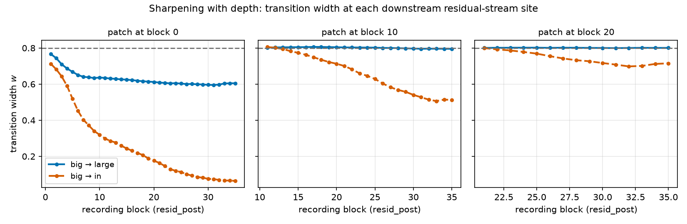
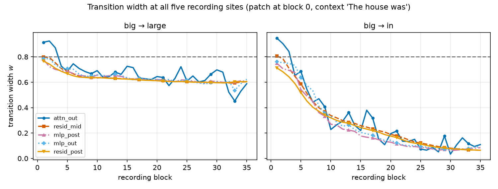
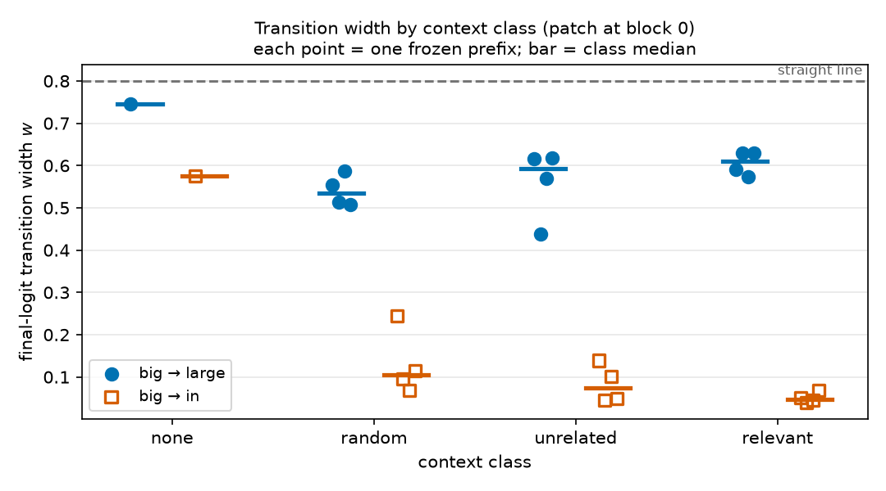

# Do activation plateaus depend on context, or on the endpoint words?

> Final, presentable, current-best only (no history — see CHANGELOG.md).

## Summary

If you nudge a language model's internal activations a little, its output usually does not change
at all — and then, past some threshold, it flips. Those flat regions are called **activation
plateaus**. They matter for safety because they tell us how much of a model's internal state is
*causally inert*: an interpretability tool that reads a direction inside a plateau may be reading
something the model's output does not currently depend on, and a monitoring system that trips on
small activation changes may be watching a region where nothing can happen.

Matthew Shinkle and StefanHex documented these plateaus by *interpolating* between the residual-stream
activations of two prompts that differ in one word (`The house was big` vs `The house was large`).
This direction asks a narrower, controlled question: **is the plateau a property of the two endpoint
words, or does the surrounding context control it?** Using GPT-2 Large and the source method
unchanged, we find both, with very different sizes:

1. **The endpoint pair dominates.** Under the identical prefix `The house was`, interpolating
   `big → in` produces a textbook plateau at the model's output (transition width
   $w = 0.050$ of the interpolation path), while `big → large` produces no plateau at all
   ($w = 0.592$, against $0.800$ for a perfectly gradual straight line). Same context, same layer,
   same code — a factor of ~12 in sharpness.
2. **Context is required, and natural language beats random tokens.** With the transition held
   fixed at `big → in`, deleting the context destroys the plateau (width $0.575$, i.e. nearly
   gradual). Any 3-token prefix restores it, and *natural* prefixes restore it far more than random
   tokens: pooling two independently frozen prefix banks (36 prefixes), median width $0.054$ for
   natural English vs $0.141$ for random tokens (exact rank-sum $p = 8\times10^{-7}$, n = 24 vs 12)
   vs $0.575$ with no context. Whether the prefix is *topically relevant* to the endpoint word
   matters much less: relevant $0.049$ vs natural-but-unrelated $0.063$ pooled ($p = 0.045$),
   and not separable within either bank alone.

**Verdict.** Plateaus in GPT-2 Large are not a fixed property of a token pair *or* of a context —
they need both. Whether a plateau exists at all is decided mainly by which two endpoint activations
you connect; given a pair that plateaus, how sharp it is depends strongly on whether the prefix is
present and grammatical, and only weakly on what it says. All results are for the frozen prompts
below; we do not claim a general semantic law.

## Methods

### Data & Model

**Model.** GPT-2 Large from Hugging Face (`gpt2-large`, revision `main`): 774M parameters,
36 transformer blocks, residual width 1280. Weights in float32 on one CUDA device, `eval()` mode
(dropout off). PyTorch 2.8.0.dev20250319+cu128, Transformers 5.14.1. No training or fine-tuning is
involved; every number comes from forward passes with one activation patched.

**Data.** There is no dataset — the inputs are hand-written prompts, frozen in
`results/manifest.json` (exact strings, token ids, decoded tokens, seed) *before* any curve was
inspected. Every prompt is a prefix plus one **endpoint token**, and the endpoint tokens are the
single GPT-2 tokens `" big"` (id 1263), `" large"` (id 1588), `" in"` (id 287).

* **Experiment 1** fixes the prefix to the source post's `The house was` (ids 464, 2156, 373) and
  varies the pair: `big → large` and `big → in`.
* **Experiment 2** fixes the pair and varies the prefix over four preregistered **context classes**:
  **none** (the endpoint token alone, 1-token prompt); **random** (3 tokens sampled uniformly from
  the GPT-2 vocabulary, numpy seed 0, special token excluded — e.g. `kas Cosmic Sell`);
  **unrelated** (natural English that does not set up a size adjective — `She quickly walked`,
  `He apologized for`, `Water boils at`, `The meeting began`); **relevant** (natural English that
  makes `big`/`large` a natural continuation — `The house was`, `The room was`, `The rock was`,
  `Her bag was`). Four prefixes per non-empty class, all exactly 3 tokens (the selection rule was
  "first four candidates of the listed order that tokenize to 3 tokens", fixed in advance).
  Experiment 2 was run for `big → large` (the preregistered pair) and, as a positive control, for
  `big → in` — a context effect *on plateaus* can only be measured where a plateau exists.
* **Confirmatory replication (bank 2).** Bank 1's four prefixes per class left the
  relevant-vs-unrelated comparison undecided, so a second bank of **eight new prefixes per class**
  (random seed 1, no string shared with bank 1) was frozen in `results/manifest_bank2.json` and run
  before its curves were examined, using the identical assay, grid and thresholds. Bank 1 and bank 2
  are reported separately as well as pooled.

**Hook points.** We patch the **residual stream after block $L$** (`resid_post`, i.e. the output of
transformer block $L$), at the **final sequence position only**, and sweep $L$ over all 36 blocks.
Downstream of the patch we record, at the final position of every later block: `attn_out` (the
attention sub-layer output), `resid_mid` (the residual stream between the attention and MLP
sub-layers, i.e. the input to `ln_2`), `mlp_post` (the post-GELU hidden activation of the MLP),
`mlp_out` (the MLP sub-layer output), `resid_post`, and the model's **final logits**.

**Sample sizes.** 50 evenly spaced interpolation steps including both endpoints (the source
configuration). Experiment 1: 2 pairs × 36 patch layers = 6,372 recorded curves. Experiment 2:
13 contexts × 2 pairs × 36 patch layers = 82,836 curves; bank 2 adds 24 contexts × 2 pairs ×
36 layers = 152,928 curves. Headline numbers use the final logits with
the patch at block 0, which is the configuration with the most downstream computation and therefore
the strongest plateau signal; the full layer sweep is reported beside it so no conclusion rests on
one layer.

### Interpolation

We reproduce the source method exactly. Let $h_A$ and $h_B$ be the final-position `resid_post`
activations of block $L$ for the two prompts. The interpolated activation slerps the direction and
linearly interpolates the norm ("slerp-rescale"), so intermediate points keep a realistic activation
magnitude instead of shrinking toward the origin the way a straight line would:

```math
h(t) \;=\; \Big[(1-t)\lVert h_A\rVert + t\lVert h_B\rVert\Big]\cdot
\frac{\sin\big((1-t)\theta\big)\,\hat h_A + \sin\big(t\theta\big)\,\hat h_B}{\sin\theta},
\qquad \theta=\arccos\big(\hat h_A\cdot\hat h_B\big),
\qquad t \in \{0, \tfrac{1}{49}, \dots, 1\}
```

with $\hat h = h/\lVert h\rVert$. For nearly collinear endpoints ($\theta < 10^{-4}$) we fall back to
renormalized linear interpolation, which agrees to $O(\theta^2)$. We then run the remaining blocks
with $h(t)$ in place of the final-position activation.

### Metrics

We need one number per interpolation step that says "how far along the path from prompt A's answer
to prompt B's answer is the model right now". Raw distances are not comparable across sites, because
activation norms grow by an order of magnitude with depth. The source post's **relative endpoint
distance** removes that scale: it is 0 when the recorded activation equals prompt A's, 1 when it
equals prompt B's, and 0.5 halfway. For a recorded vector $x(t)$ at any site with endpoint values
$x_A, x_B$:

```math
d(t) \;=\; \frac{\lVert x(t)-x_A\rVert_2}{\lVert x(t)-x_A\rVert_2+\lVert x(t)-x_B\rVert_2}
```

The raw $d(t)$ curves are the primary evidence in every figure below. A plateau looks like a curve
pinned near 0, then a sharp rise, then pinned near 1. No plateau looks like a diagonal.

To compare many curves compactly we need a scalar for "how sharp". The obvious choice — the maximum
slope — is noisy on a 50-point grid, so we use the **transition width**: how much of the path the
curve spends between the two endpoint regions. Let $\tilde d$ be the isotonic (monotone
least-squares, pool-adjacent-violators) fit of $d$, which removes small non-monotone wiggles without
smoothing away the transition, and let $t(c)$ be the first crossing of level $c$, linearly
interpolated on the grid:

```math
w \;=\; t(1-\nu) - t(\nu), \qquad \nu = 0.10
```

**Lower $w$ means a sharper plateau.** $w$ is undefined (reported as such, never imputed) if either
crossing is missing. Width is the quantity every headline comparison uses.

We also report **where** the flip happens, to check that context changes sharpness rather than just
shifting the switch point:

```math
t_{1/2} \;=\; t(0.5)
```

Finally, a bounded yes/no **plateau presence** rule, frozen before any GPT-2 curve was seen: the
curve must be near-monotone (max $|d - \tilde d| \le 0.10$), have a defined width, and spend at
least 20% of the grid within $\nu = 0.10$ of *each* endpoint:

```math
\mathrm{plateau} \;=\; \big[\,\mathrm{run}(d \le \nu) \ge 0.2K\,\big] \wedge
\big[\,\mathrm{run}(d \ge 1-\nu) \ge 0.2K\,\big] \wedge \big[\,w \text{ defined}\,\big] \wedge
\big[\max|d-\tilde d| \le 0.10\,\big]
```

where $K = 50$ and $\mathrm{run}(\cdot)$ is the longest consecutive run satisfying the condition.
The 20% threshold is calibrated so the straight line $d(t)=t$ — which spends exactly 10% of the
path within 0.1 of each endpoint — is rejected by construction. This boolean is deliberately
permissive and we report it only with its threshold sensitivity; the width is the informative
statistic.

### Baselines

**Straight-line (no-plateau) reference.** The null shape is $d(t) = t$: the output moves at a
constant rate along the path, which is what you see if the model has no plateau at all. Its width is

```math
w_{\text{line}} \;=\; t(0.9) - t(0.1) \;=\; 0.9 - 0.1 \;=\; 0.800
```

Every width figure draws this value as a dashed rule; a curve at 0.8 has no plateau and a curve well
below it does.

**Source reference configuration.** Before interpreting anything, we reproduce the source post's
configuration unchanged (GPT-2 Large, prefix `The house was`, pairs `big → large` and `big → in`,
50 steps, slerp-rescale, `resid_post` patch at the last position). Experiment 1 *is* that
reproduction; Experiment 2 only swaps the frozen prefix.

**No-context baseline for the context experiment.** The `none` class (endpoint token alone) is the
reference point for "what does the assay do with no context to work with".

**Endpoint-geometry control.** A context could change the plateau simply by moving the two endpoint
activations closer together or apart, with nothing linguistic involved. We therefore record two
geometric covariates at the patch site — the endpoint cosine
$\cos = \hat h_A \cdot \hat h_B$ and the norm ratio $\lVert h_B\rVert / \lVert h_A\rVert$ — and
correlate each with the measured width across the 13 contexts (Spearman rank correlation).

### Validity checks (all passed)

* **Tokenization.** Every endpoint is a single token, identical across all contexts; prefixes are
  identical within a pair; all ids and decoded strings are stored in `results/manifest.json`.
* **Endpoint fidelity.** At $t=0$ and $t=1$ the patched run must reproduce the unpatched prompt.
  Worst case over all conditions and layers: max absolute logit difference $9.2\times10^{-5}$
  (relative to the largest logit: $2.4\times10^{-6}$), max residual-site difference
  $4.9\times10^{-4}$ — float32 rounding. Correspondingly $d(0) \le 5.9\times10^{-6}$ and
  $1-d(1) \le 5.9\times10^{-6}$ everywhere.
* **Determinism.** A re-run of one configuration reproduces the stored curves bit-for-bit
  (max difference 0.0). The reference condition appears in both experiment scripts and the two
  independent runs agree bit-for-bit across all 36 layers (max difference 0.0).

## Results

### 1. Under a fixed context, the endpoint pair decides whether there is a plateau

This is the source reproduction and the first controlled comparison: identical prefix, identical
code, one endpoint token changed. To see whether the plateau is a property of the pair, we plot the
raw final-logit $d(t)$ for both pairs at six patch depths.


`big → in` (dashed) is pinned at the `big` output for the first ~45% of the path, flips within about
two grid steps, and is pinned at the `in` output thereafter — a plateau. `big → large` (solid) tracks
the diagonal. Headline numbers, final logits, patch at block 0:

| condition (prefix `The house was`) | width $w$ | location $t_{1/2}$ | plateau rule |
|---|---|---|---|
| `big → in` | **0.050** | 0.457 | yes |
| `big → large` | 0.592 | 0.476 | no |
| straight-line reference | 0.800 | 0.500 | no (by construction) |

The gap is large — the sharp pair's transition occupies 5% of the path, the other 59% — and it is
not an artifact of the threshold $\nu$: across the nine settings $\nu \in \lbrace 0.05, 0.10, 0.15 \rbrace$ ×
minimum-run $\in \lbrace 0.15, 0.20, 0.30 \rbrace$, `big → in` is called a plateau in 9/9 and `big → large` in
2/9 (only the loosest settings). At $\nu = 0.05$ the widths are 0.119 vs 0.761.

Both pairs share the endpoint `big`, so this is a controlled statement about replacing `large` with
`in`, not a measurement of "semantic similarity" in general. Note also that the two pairs differ
geometrically (endpoint cosine 0.73 for `big → large` vs 0.62 for `big → in` at block 0), which we
cannot separate from the linguistic difference with two pairs.

### 2. The plateau only exists when the patch has depth left to act on

A plateau is not visible at the patch site itself — it has to be built by the layers that follow.
To show this, we sweep the patch depth and read the width at the output.


`big → in` degrades smoothly from $w = 0.050$ (patch at block 0) to $w = 0.804$ (patch at block 35,
where only the final layer norm and unembedding remain): with fewer downstream blocks, less
sharpening. `big → large` is essentially flat at 0.59–0.80 — extra depth does not manufacture a
plateau for that pair. The transition location stays in a narrow band (0.43–0.56) for both pairs, so
what depth changes is sharpness, not where the switch sits.

The same story read the other way — fix the patch at block $L$ and walk *down* the recording sites:



With the patch at block 0, `big → in` sharpens monotonically with depth, from $w = 0.71$ at block 1
to $w = 0.07$ at block 35, while `big → large` only falls from 0.77 to 0.60. Plateau formation is
gradual and cumulative, not a single-layer event.

Is one component type responsible? We read all five recorded sites at every block.



All five sites sharpen together and stay within roughly 0.05 width of each other from block 10 on;
`attn_out` is the noisiest (it is the smallest-norm signal). No single sub-layer type carries the
plateau in this configuration — the sharpening accumulates in the residual stream.

### 3. With the transition fixed, context controls plateau sharpness

Now the endpoint pair is frozen and only the prefix changes. The raw curves are the primary evidence:


Bottom row: with no context the `big → in` curve is a gentle S; with any 3-token prefix it becomes a
step, and the step is sharpest for the relevant prefixes. Top row: `big → large` stays near-diagonal
in every context — no context we tested creates a plateau for that pair. The compact summary at the
headline configuration (final logits, patch at block 0):

| context class | n | `big → in` width: median [min, max] | `big → large` width: median [min, max] | `big → in` $t_{1/2}$ median |
|---|---|---|---|---|
| none | 1 | 0.575 | 0.746 | 0.470 |
| random | 4 | 0.105 [0.069, 0.245] | 0.534 [0.507, 0.586] | 0.438 |
| unrelated | 4 | 0.074 [0.045, 0.139] | 0.593 [0.438, 0.617] | 0.437 |
| relevant | 4 | **0.048** [0.040, 0.068] | 0.611 [0.572, 0.630] | 0.458 |



Three things to read off. **(i) Having a context matters most.** The no-context width (0.575) is more
than twice the largest prefixed width (0.245) — deleting the context nearly abolishes the plateau,
even though the endpoint tokens are unchanged. **(ii) Content matters.** The class medians are
ordered relevant < unrelated < random; relevant vs random separates completely (exact two-sided
rank-sum $p = 0.029$, n = 4 vs 4) while the two adjacent comparisons do not ($p = 0.49$ each). Four
prefixes per class cannot resolve which contrast is doing the work, which is what the replication
below settles. **(iii) Context moves sharpness, not timing.** The median transition location stays
within 0.437–0.470 across all four classes.

Under the frozen plateau rule, `big → in` is called a plateau in 12/12 prefixed contexts at every one
of the nine threshold settings, while `none` flips with the threshold (plateau at $\nu \ge 0.10$ with
run 0.15–0.20, not at $\nu = 0.05$ or run 0.30) — consistent with it being a borderline, gradual
curve rather than a plateau.

Does the effect survive at other patch depths?


For `big → in`, the class ordering (relevant ≲ random ≲ unrelated, all far below none) holds from
block 0 to about block 25, after which every condition converges to the straight-line value because
too little computation remains. The no-context curve is above all prefixed curves at every block.
For `big → large` all contexts sit near 0.8 from block 5 onward — no context rescues that pair. So
the context effect is a property of the whole early-to-middle sweep, not a block-0 artifact.

### 4. Replication on a second frozen prefix bank: the real contrast is natural vs random

Bank 1 could not separate relevant from unrelated prefixes, so we froze a second, disjoint bank of
eight new prefixes per class and re-ran the identical assay. To show the class ordering is a property
of the context classes and not of four lucky sentences, we plot both banks side by side.


Bank 2 (final logits, patch at block 0, `big → in`) gives medians random 0.213 [0.094, 0.349],
unrelated 0.063 [0.039, 0.094], relevant 0.050 [0.035, 0.077]. The natural-vs-random gap is now
decisive — relevant vs random $p = 1.6\times10^{-4}$ and unrelated vs random $p = 3.1\times10^{-4}$
(exact rank-sum, n = 8 vs 8, complete or near-complete separation) — while relevant vs unrelated
stays undecided ($p = 0.083$). Pooling both banks:

| pooled comparison (`big → in`, block 0) | medians | n | exact rank-sum $p$ |
|---|---|---|---|
| natural English (relevant + unrelated) vs random tokens | 0.054 vs 0.141 | 24 vs 12 | $8\times10^{-7}$ |
| relevant vs natural-but-unrelated | 0.049 vs 0.063 | 12 vs 12 | 0.045 |

So the replicated, well-powered claim is **grammatical natural-language context sharpens the plateau
roughly 2.6× relative to random tokens, which in turn sharpens it ~4× relative to no context**;
topical relevance adds a further small effect that only reaches significance after pooling and should
be treated as suggestive. The right-hand panel shows the natural-vs-random gap holds across patch
blocks 0–25, not just at block 0.

For the non-plateauing pair `big → large`, bank 2 shows the opposite, smaller ordering (relevant
0.585 vs unrelated 0.499 median width, $p = 0.002$): relevant context makes that pair's output
response slightly *more* gradual. This is one of several secondary comparisons and we flag it as
exploratory rather than a claim.

### 5. Is the context effect just endpoint geometry?

A prefix changes the two endpoint activations, so a wider transition might reflect endpoints that sit
closer together rather than anything about context. Across the 13 contexts, width correlates with the
endpoint cosine at the patch site at Spearman $\rho = +0.49$ ($p = 0.09$) for `big → in` and with the
norm ratio at $\rho = +0.15$ ($p = 0.62$). So geometry explains part of the spread but is not
statistically established as the driver, and it cannot explain the largest effect: the no-context
condition has an endpoint cosine (0.60) in the same range as the prefixed contexts yet is nearly four
times wider than the widest of them. We report this as an unresolved confound, not a controlled
dissociation.

## Conclusion

Activation plateaus in GPT-2 Large are **jointly** determined by the endpoint activations and the
context, and the two effects are not the same size:

* **Endpoint pair (large effect).** Under the identical prefix `The house was`, `big → in` plateaus
  ($w = 0.050$) and `big → large` does not ($w = 0.592$; straight line $= 0.800$). No context we
  tested produced a plateau for `big → large`.
* **Context (large presence effect, replicated naturalness effect, weak relevance effect).** For the
  pair that plateaus, removing the context nearly abolishes the plateau ($w = 0.575$ vs
  $\le 0.349$ for every 3-token prefix across 36 prefixes). Natural-language prefixes are far
  sharper than random-token prefixes (pooled medians 0.054 vs 0.141, $p = 8\times10^{-7}$,
  replicated in two independently frozen banks), while topical relevance adds only a small extra
  effect (0.049 vs 0.063 pooled, $p = 0.045$; not significant within either bank).
* **Mechanism.** Plateaus are built gradually by the blocks after the patch — width falls
  monotonically with recording depth and rises monotonically with patch depth — and no single
  sub-layer type (attention or MLP) is responsible.

**Why this matters for safety.** The size of the "causally inert" region around an activation is not
a fixed property of the model or of a token: the same edit at the same site is inert under one prefix
and immediately effective under another. Interpretability or monitoring methods that perturb
activations and watch the output will therefore see very different sensitivity depending on the
prompt they happen to test, and a plateau measured on one context should not be assumed to transfer.

**Limitations.**

* One model (GPT-2 Large), one patch position (final token), three endpoint tokens, 37 frozen
  contexts (13 in bank 1, 24 in bank 2). These are controlled comparisons on hand-written prompts,
  not a survey of English.
* The two endpoint pairs differ in part of speech *and* in activation geometry; with two pairs we
  cannot attribute the Experiment 1 gap to semantics.
* The endpoint-geometry covariate correlates with width ($\rho = +0.49$, $p = 0.09$) and is not
  controlled by design, only reported.
* The 50-point grid limits width and location resolution to about 0.02; widths below that should be
  read as "sharp", not as exact values. Class comparisons use exact rank-sum tests on 4–12 frozen
  prefixes per class, so we report medians and full ranges rather than confidence intervals. Several
  secondary comparisons are reported without multiple-comparison correction and are labelled
  exploratory.
* Nothing here is a causal claim about semantics: we tested sensitivity to specific frozen prompts.

**Reproducing.** `experiments/manifest.py` and `bank2.py` (frozen prompts) → `run_exp1.py`,
`run_exp2.py`, `run_bank2.py` (sweeps, ~5 min total on one GPU) → `analyze.py`, `analyze_bank2.py`
(tables, tests) → `plot_exp1.py`, `plot_exp2.py`, `plot_bank2.py`. All curves are stored in
`results/exp1.npz`, `exp2.npz` and `bank2.npz`, so every figure can be regenerated without running
GPT-2 Large again.
