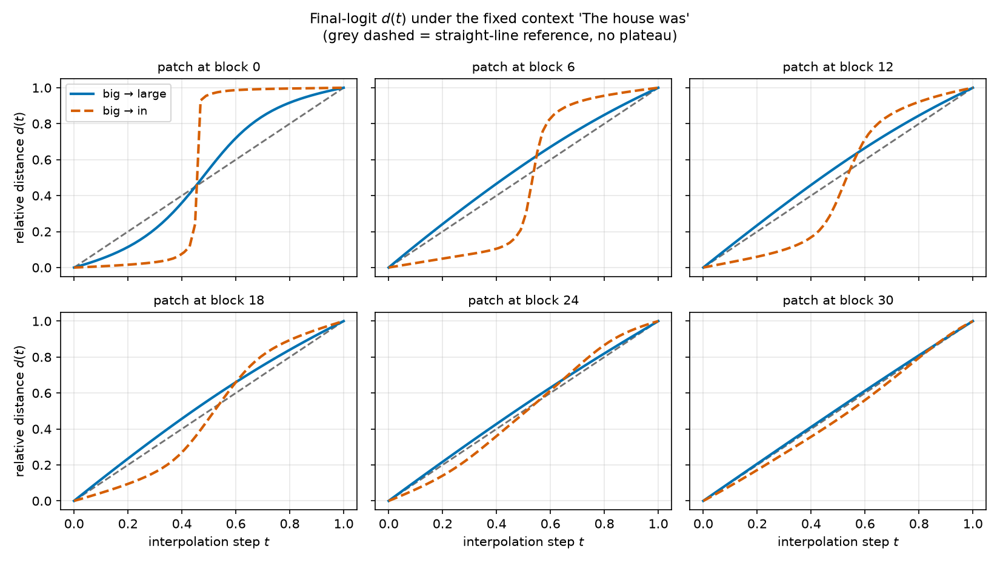
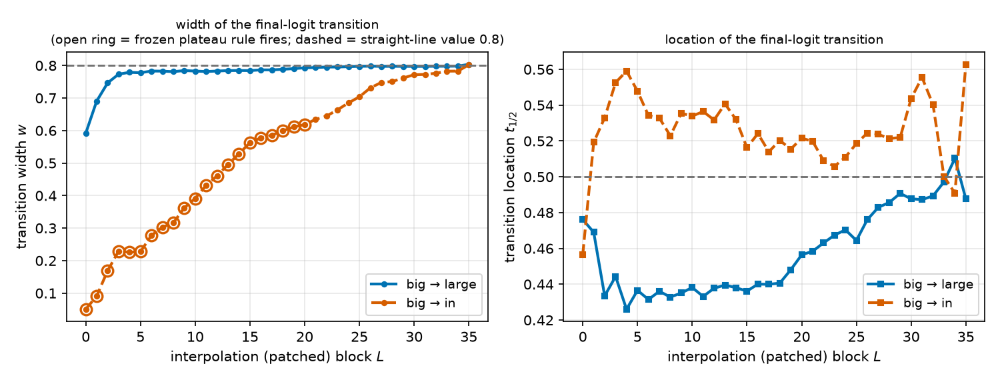
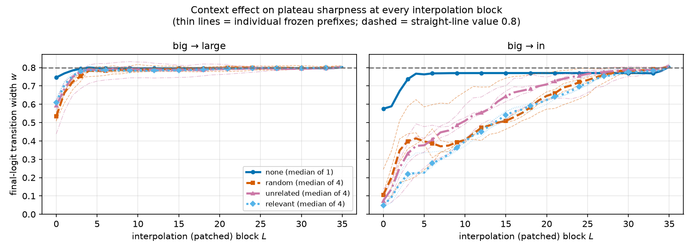

# RESULTS — Do activation plateaus depend on context?

> CURRENT-BEST ONLY. One row per experiment. No history, no superseded/weaker variants
> (those live in CHANGELOG.md). Full method, metric definitions and caveats: `REPORT.md`.

**Setup.** GPT-2 Large (774M, 36 blocks, float32). Patch the final-position residual stream after
block $L$ with a slerp-rescale interpolation between two prompts that differ in one token, run the
rest of the network, and score every downstream site with the relative endpoint distance
$d(t) = \lVert x(t)-x_A\rVert / (\lVert x(t)-x_A\rVert + \lVert x(t)-x_B\rVert)$ on 50 steps.
**Transition width $w$** = the fraction of the path between the first crossings of $d = 0.1$ and
$d = 0.9$ (lower = sharper plateau; a gradual straight line gives $w = 0.800$).
Headline configuration = final logits, patch at block 0.

## Metrics

### Experiment 1 — fixed context `The house was`, endpoint pair varied

| condition | width $w$ | location $t_{1/2}$ | plateau rule | threshold-robust? |
|---|---|---|---|---|
| `big → in` | **0.050** | 0.457 | yes | plateau in 9/9 threshold settings |
| `big → large` | 0.592 | 0.476 | no | plateau in 2/9 (loosest only) |
| straight-line reference | 0.800 | 0.500 | no by construction | — |

Same prefix, same layer, same code: the endpoint pair decides whether a plateau exists at all
(~12× difference in sharpness). Patching deeper removes the plateau for `big → in`
($w$: 0.050 at block 0 → 0.804 at block 35); no patch depth creates one for `big → large`.

### Experiment 2 — fixed pair, context class varied (4 frozen prefixes per class, 3 tokens each)

| context class | n | `big → in` width: median [min, max] | `big → large` width: median [min, max] | `big → in` $t_{1/2}$ median |
|---|---|---|---|---|
| none (endpoint token alone) | 1 | 0.575 | 0.746 | 0.470 |
| random tokens (seed 0) | 4 | 0.105 [0.069, 0.245] | 0.534 [0.507, 0.586] | 0.438 |
| natural, unrelated | 4 | 0.074 [0.045, 0.139] | 0.593 [0.438, 0.617] | 0.437 |
| natural, relevant | 4 | **0.048** [0.040, 0.068] | 0.611 [0.572, 0.630] | 0.458 |

Exact two-sided rank-sum on width (`big → in`): relevant vs random $p = 0.029$ (no overlap);
relevant vs unrelated $p = 0.49$; unrelated vs random $p = 0.49$. Context changes sharpness, not
timing (transition location 0.437–0.470 across all classes). Endpoint-geometry control: width vs
endpoint cosine, Spearman $\rho = +0.49$ ($p = 0.09$, n = 13) — a reported confound, not a controlled
dissociation.

### Confirmatory replication — bank 2 (8 new prefixes per class, no string shared with bank 1)

| `big → in`, block 0 | random | natural, unrelated | natural, relevant |
|---|---|---|---|
| bank 1 median [min, max] (n=4) | 0.105 [0.069, 0.245] | 0.074 [0.045, 0.139] | 0.048 [0.040, 0.068] |
| bank 2 median [min, max] (n=8) | 0.213 [0.094, 0.349] | 0.063 [0.039, 0.094] | 0.050 [0.035, 0.077] |

| pooled comparison (both banks) | medians | n | exact rank-sum $p$ |
|---|---|---|---|
| natural English vs random tokens | 0.054 vs 0.141 | 24 vs 12 | $8\times10^{-7}$ |
| relevant vs natural-but-unrelated | 0.049 vs 0.063 | 12 vs 12 | 0.045 |

Bank 2 alone: relevant vs random $p = 1.6\times10^{-4}$, unrelated vs random $p = 3.1\times10^{-4}$,
relevant vs unrelated $p = 0.083$. The replicated effect is **natural language vs random tokens**;
topical relevance adds only a small effect that reaches significance only after pooling.

### Validity checks (all passed)

| check | worst value over all conditions and all 36 layers |
|---|---|
| endpoint reproduction, logits | max abs diff $9.2\times10^{-5}$ (relative $2.4\times10^{-6}$) |
| endpoint reproduction, residual sites | max abs diff $4.9\times10^{-4}$ |
| $d(0)$ / $1-d(1)$ | $\le 5.9\times10^{-6}$ |
| deterministic re-run, and reference condition run by two independent scripts | max diff 0.0 (bit-identical) |
| tokenization | all endpoints single-token and identical across contexts (`results/manifest.json`) |

## Figures

The primary evidence is the raw curve shape. Under a fixed prefix, does swapping one endpoint token
change whether the output plateaus?

A plateau must be built by the layers after the patch, so sharpness should depend on how much
computation is left. Sweeping the patch depth tests that:

Read the other way — fixing the patch and walking down the recording blocks — shows the sharpening is
gradual rather than a single-layer event:

Is one sub-layer type responsible? All five recorded sites tell the same story:

With the transition frozen, do the four context classes change the curve?

The per-prefix spread behind the class medians, at the headline configuration:

Whether the context effect is specific to block 0 or holds across the sweep:

And whether the class ordering is a property of the classes rather than of four lucky sentences:

## Headline

Activation plateaus in GPT-2 Large need **both** the right endpoint pair and a context: which pair
you interpolate decides whether a plateau exists at all (`big → in` $w = 0.050$ vs `big → large`
$w = 0.592$ under the same prefix), and for the pair that plateaus, deleting the context nearly
abolishes it ($w = 0.575$ vs $\le 0.349$ across 36 frozen prefixes) while natural-language context
sharpens it ~2.6× beyond random tokens (pooled medians 0.054 vs 0.141, $p = 8\times10^{-7}$,
replicated in two independent prefix banks).
