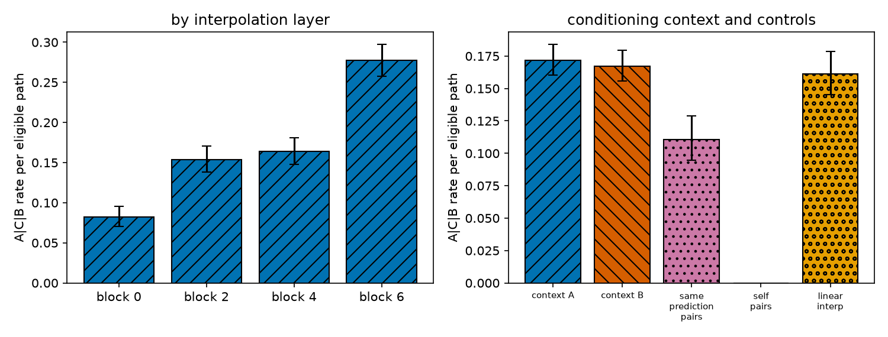
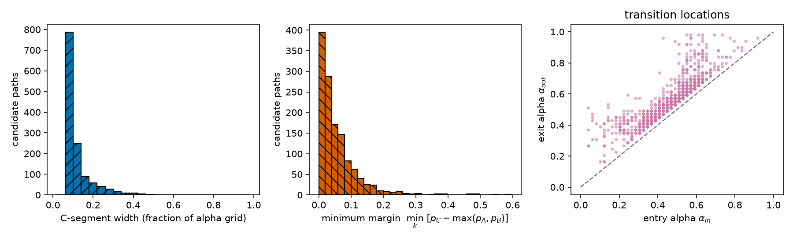
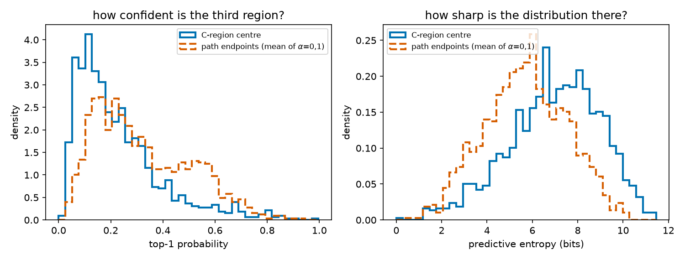
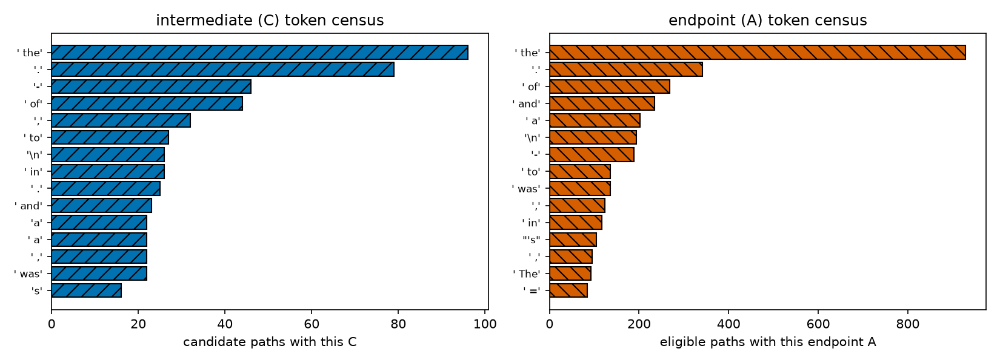
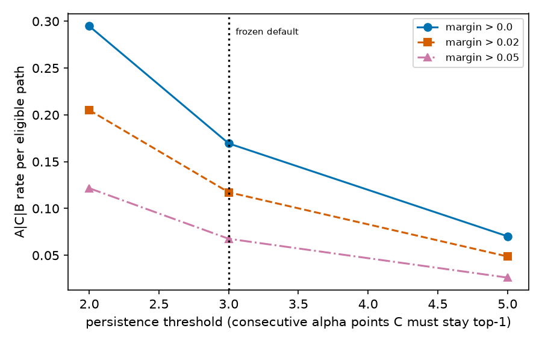

# RESULTS — Random search for LLM activation sub-plateaus (`A | C | B`)

> CURRENT-BEST ONLY. One row per experiment. No history (see CHANGELOG.md).
> Full method, definitions and equations: **REPORT.md**.

**Question.** Interpolate between the final-position residual-stream activations of two *random*
held-out natural contexts at an early GPT-2 Large block and patch the interpolant back in. How often
does the model's next-token prediction pass through a **persistent third token** `C` on the way from
`A` to `B` — the language-model analogue of the `A → C → B` paths seen earlier in MNIST — and when it
does, is that third region a real **plateau** (a flat shelf of the model's output) or just a label
flicker inside the boundary?

**Setup in one line.** GPT-2 Large (774M, 36 blocks), 32-token WikiText-103 validation windows,
`resid_post` at blocks 0/2/4/6, `slerp_rescale` over 50 alphas, 1,000 random primary pairs × 4 blocks
× 2 conditioning contexts = 8,000 paths; frozen rule (C top-1 for ≥3 consecutive alphas, beating both
endpoint tokens at every point, with a real distribution change at both boundaries).

## Metrics

### Prevalence of `A | C | B` (primary screen, frozen rule)

| quantity | value | 95% CI (Wilson) |
|---|---|---|
| paths screened / eligible (`A≠B`) | 8,000 / 7,611 (95.1%) | — |
| **candidate paths** | **1,290 → 16.9% of eligible paths** | [16.1%, 17.8%] |
| pairs with ≥1 candidate path (of 8) | 610 / 991 → 61.6% | [58.5%, 64.5%] |
| **clean** `A,C,B` (exactly 3 top-1 runs) | 283 → 21.9% of candidates, 3.7% of eligible paths | — |
| complex with a persistent C region | 1,007 → 78.1% of candidates | — |
| endpoint fidelity, own-context end | max&#124;Δlogit&#124; = 1.5e-05; top-1 reproduced on 100% of paths | — |
| determinism (20 paths re-run, different batch layout) | 0 / 1,000 top-1 mismatches; max Δp = 2.7e-06 | — |
| batching invariance (32 contexts, singly vs batched) | 0 top-1 changes; max&#124;Δlogit&#124; = 4.2e-05; no padding used | — |

### Is the third region a real sub-plateau? (output geometry, all 1,290 candidates)

Flatness `ρ` = how far the output distance `d` travels inside the C run ÷ the run's width in `α`.
`ρ = 1` is the no-plateau diagonal; `ρ < 1` is flatter than the diagonal; `ρ < 0.5` is a shelf.

| quantity | candidates | matched non-candidate windows |
|---|---|---|
| median flatness ρ of the C window | **2.05** (IQR 1.15–3.38) | 1.09 (IQR 0.47–2.99) |
| ρ < 1 (flatter than the diagonal) | 20.2% → 3.43% of eligible paths [3.04, 3.86] | 47.3% |
| **ρ < 0.5 (true sub-plateau)** | **8.2% → 1.39% of eligible paths [1.15, 1.68]** | 26.4% |
| mean output distance across the C run, `d̄_C` | median 0.518; 97.3% inside (0.2, 0.8) | — |
| whole-path transition width `w(10→90)` | median 0.459 | 0.302 |
| median ρ, lowest → highest decile of the frozen score | 2.65 → 0.93 (Spearman −0.34, p ≈ 2e−36) | — |
| median ρ by interpolation block 0 / 2 / 4 / 6 | 2.52 / 2.58 / 2.38 / 1.54 | — |
| the 106 sub-plateaus: mean C-run length; share at block 6; share clean | 8.1 of 50 points; 55/106; 16.0% | all candidates: 5.2; 41%; 21.9% |

### Exploratory depth sweep (same 1,000 pairs, same frozen detector, blocks 12–30; NOT in the headline)

| interpolation block | 0 | 2 | 4 | 6 | 12 | 18 | 24 | 30 |
|---|---|---|---|---|---|---|---|---|
| third-token rate (% of eligible paths) | 8.2 | 15.4 | 16.4 | **27.7** | 22.8 | 13.6 | 5.9 | 1.7 |
| true sub-plateau rate, ρ < 0.5 (%) | 0.95 | 1.16 | 0.58 | **2.87** | 0.10 | 0.00 | 0.00 | 0.00 |
| median flatness ρ | 2.52 | 2.58 | 2.38 | 1.54 | 2.07 | 2.03 | 1.47 | 1.24 |
| eligible paths | 1,899 | 1,896 | 1,900 | 1,916 | 1,956 | 1,974 | 1,987 | 1,999 |

The depth trend inside the preregistered window turns over outside it: the phenomenon is
**early-to-mid network**, maximal near block 6 of 36, and gone by block 18.

### Confirmation on the disjoint validation bank (rule applied unchanged, nothing retuned)

| bank | eligible paths | candidates | rate | 95% CI |
|---|---|---|---|---|
| primary (1,000 pairs) | 7,611 | 1,290 | 16.9% | [16.1%, 17.8%] |
| **validation (300 disjoint pairs)** | 2,261 | 401 | **17.7%** | [16.2%, 19.4%] |

### Controls

| control | eligible paths | rate | 95% CI | reading |
|---|---|---|---|---|
| primary screen | 7,611 | 16.9% | [16.1%, 17.8%] | reference |
| self-pairs (context with itself) | **0** | 0% | — | detector cannot fire on a constant path |
| same-prediction pairs (different contexts, same unpatched top-1) | 1,284 | 11.1% | [9.5%, 12.9%] | two thirds of the rate survives *without* any A/B disagreement |
| linear interpolation instead of `slerp_rescale` | 1,904 | 16.1% | [14.5%, 17.8%] | not a spherical-geometry artefact |
| foreign endpoint reproduces its home prediction | 1,409 of 8,000 (17.6%) | 14.0% | [12.3%, 15.9%] | rate barely moves on the transfer-consistent subset |

### Is the third region a *confident* state? (1,290 candidates)

| quantity | C-region centre | path endpoints (mean of α=0,1) |
|---|---|---|
| top-1 probability | 0.227 ± 0.165 | 0.323 ± 0.182 |
| predictive entropy (bits) | 6.97 ± 1.99 | 5.70 ± 1.82 |
| candidates where C is sharper than the endpoints | 26.8% | — |
| minimum dominance margin > 0.05 / > 0.2 | 39.9% / 3.6% | — |
| C is one of the 10 most common endpoint tokens (' the', '.', …) | 32.3% | — |

### Do C-region activations look natural? (2,000 held-out reference contexts, exact cosine search)

| query type | median cosine distance to nearest natural activation | fraction of top-10 neighbours predicting the query's own top-1 token |
|---|---|---|
| natural context (control) | **0.086** [0.061, 0.131] | **14.1%** [11.6%, 16.8%] |
| A-region point | 0.140 [0.120, 0.160] | 8.1% [7.1%, 9.1%] |
| B-region point | 0.153 [0.133, 0.169] | 8.1% [7.1%, 9.1%] |
| **C-region point** | **0.160** [0.154, 0.166] | **4.5%** [3.8%, 5.3%] |

### Continuations from the C region (6 frozen inspected candidates: 3 top-scoring + 3 random)

| quantity | value |
|---|---|
| greedy C-region continuations that are fluent, context-appropriate English | 6 / 6 |
| identical greedy tokens across the first/middle/last alpha of the C run (of 20) | 20, 20, 8, 1, 1, 1 |
| C activation inserted into the *other* endpoint's context | reverts to that context's own unpatched continuation in 6 / 6 |

## Worked examples — which texts, which sequence, from where to where

The single highest-scoring candidate of 1,290 (block 6, conditioned on context B's tokens):

| | |
|---|---|
| **context A** (32 tokens) | `" , emerging at night to feed . The diet of H. gammarus mostly consists of other benthic invertebrates . These include crabs ,"` |
| **context B** (conditioning context) | `" in early 1942 to repair a damaged light cruiser and ordered to return home in May . She was sunk en route by the American submarine USS Salmon , although most of"` |
| **interpolate from → to** | context A's block-6 `resid_post` at its last token → context B's, over 50 steps |
| **endpoints** | A = `' which'` (α = 0), B = `' her'` (α = 1) |
| **top-1 sequence** | `' which'` (0–0.10) → `' a'` (0.12) → `' including'` (0.14–0.18) → **`' if'` (0.20–0.41)** → `' her'` (0.43–1.00) |
| **C-region text** | *"if not all of her crew survived. The USS Bismarck was sunk by a…"* — identical 20 tokens across the whole C run |
| **geometry** | shelf at `d̄_C` = 0.44, ρ = 0.16 (6× flatter than the diagonal) |

The two flattest sub-plateaus of the whole screen (both block 2, both from the same random pair):

| | ρ = 0.04 | ρ = 0.08 |
|---|---|---|
| context A | `" Art exhibitions were originally held in Lamar Hotel in downtown Meridian , but after a name change to Meridian Art Association in 1949 , exhibitions were held at various locations around the"` | same |
| context B | `" the dance appears in The Pirate by Sir Walter Scott . The writer and journalist John Sands lived on Papa Stour and Foula for a while during"` | same |
| top-1 sequence | `' year'` (0–0.47) → `','` (0.49) → `' was'` (0.51) → **`'.'` (0.53–0.61)** → `' the'` (0.63–1.00) | `' city'` (0–0.51) → **`','` (0.53–0.65)** → `' the'` (0.67–1.00) — clean `A, C, B` |
| shelf height `d̄_C` | 0.48 | 0.51 |

## Figures

The screen's headline number and where it comes from — the rate rises monotonically with block depth
and is identical under either conditioning context, while the self-pair control is exactly zero:

Candidates are extremely heterogeneous, so a single example would misrepresent them. The top-ranked
paths show wide, confident third plateaus with two clearly separated distribution changes; randomly
drawn qualifying paths show narrow, low-probability blips:

Do those paths look like plateaus when we plot the *output* instead of three token probabilities? Here
are the same six pre-frozen inspection paths in the plateau-post format — relative output distance
`d(t)` against the interpolation coefficient, with the no-plateau diagonal for reference:

![Matthew-style plateau curves for the six pre-frozen inspection paths. x-axis: interpolation coefficient t, 0 = context A's activation, 1 = context B's. y-axis: relative output distance d(t) on the final logits, 0 = output looks like endpoint A, 1 = like endpoint B; dashed grey = the no-plateau reference d = t. Hatched grey band = the detected third-token (C) run; thin vertical lines mark every top-1 token change. Top row: 3 highest-scoring candidates; bottom row: 3 random candidates. Titles give block, C-run alpha range and flatness ρ.](plots/matthew_dt_frozen.png)

The top-scoring paths are staircases (ρ = 0.16 / 0.79 / 0.30); the random ones are not (0.71 / 3.07 /
3.71). Over all 1,290 candidates the second picture dominates — the C run is usually inside the
boundary, and only its flat tail is a genuine sub-plateau:

![Left: distribution of the flatness ρ of the C window (range of d ÷ width in t) for the 1,290 candidates (solid) and the same alpha windows on 1,290 matched non-candidate paths (dashed); values above 6 are clipped into the last bin. Dashed vertical line = ρ = 1 (as steep as the diagonal), dotted vertical line = the post-hoc ρ = 0.5 sub-plateau cut. Middle: median ρ (circles) with inter-quartile range (hatched) against the decile of the frozen candidate score, 10 = highest. Right: histogram of the mean output distance d across the C run; vertical rules mark the endpoints d = 0 and d = 1.](plots/subplateau_dwell.png)

This is what the flat tail looks like — the 106 candidates with ρ < 0.5 are textbook
plateau–boundary–sub-plateau–boundary–plateau curves:

The preregistered blocks stop at 6, where both curves are still rising, so we swept deeper with the
same pairs and the same detector to see whether the trend continues. It does not — it turns over:

![Left: percentage of eligible paths with a persistent third top-1 token (solid, circles) and with a true sub-plateau, flatness ρ < 0.5 (dashed, squares), against the interpolation block L of GPT-2 Large; error bars are 95% Wilson intervals, the hatched region marks the preregistered blocks 0–6. Right: median flatness ρ of the C window against L; preregistered blocks solid with circles, exploratory blocks dashed with squares; dashed horizontal line ρ = 1 (as steep as the no-plateau diagonal), dotted line the ρ = 0.5 sub-plateau cut.](plots/depth_sweep.png)

Back to the label view. That heterogeneity is the rule, not the exception — most C segments are only
3–5 of the 50 grid points wide and win by a small margin, and both transitions sit in the middle of
the path:

If the third region were a genuine extra state we would expect it to be at least as confident as the
endpoints. It is not — it is flatter and less certain:

And the C tokens themselves are not distinctive concepts: they are drawn from the same generic
high-frequency pool as the endpoint predictions:

Because the headline rate depends on two frozen thresholds, we show what happens when they move —
the effect degrades smoothly and never collapses to zero:

Finally, two probes of whether a C region behaves like a real model state. Its points sit *further*
from real activations than the endpoint-region points do, and their natural neighbours rarely predict
C:

Yet the text the C region produces is fluent, and in a third of inspected cases it is reproducible
across the whole C run rather than at a single grid point:

## Headline

**The `A → C → B` phenomenon is real and common in GPT-2 Large — about 1 in 6 random interpolation
paths (16.9%, CI [16.1, 17.8]) shows a third token holding top-1 for ≥3 consecutive alphas while
beating both endpoints, reproduced at 17.7% on a disjoint bank — but the typical third region is a
weak, high-entropy band whose token is a generic frequency default, sits further off the natural
activation manifold than the endpoints, and appears almost as often (11.1%) when the two contexts do
not even disagree.** Measured as *plateaus* rather than as labels, the split is sharper still: the
median candidate's third region has flatness ρ = 2.05 — the output is sweeping through the boundary,
not resting — and only **1.39% of eligible paths (CI [1.15, 1.68], 1 in 72) hold a true flat
sub-plateau (ρ < 0.5)**. Those genuine ones behave exactly as the MNIST work predicted: a shelf at
`d̄_C` ≈ 0.5 between two sharp boundaries, longer than average, concentrated at block 6, and ranked at
the top by a score frozen before any curve was seen. An exploratory sweep to blocks 12–30 shows the
effect is **early-to-mid network**: it peaks around block 6 of 36 and is gone by block 18. The verdict is therefore
**"robust third output region, mostly fragile"** — not a null result, and not, for most paths, the
crisp third-class plateau seen in MNIST.
