# RESULTS — Random search for LLM activation sub-plateaus (`A | C | B`)

> CURRENT-BEST ONLY. One row per experiment. No history (see CHANGELOG.md).
> Full method, definitions and equations: **REPORT.md**.

**Question.** Walk from one model input to another and watch the next-token prediction. How often does
it pass through a **persistent third token** `C` on the way from `A` to `B` — the language-model
analogue of the `A → C → B` paths seen earlier in MNIST — and when it does, is that third region a
real **plateau** (a flat shelf of the model's output) or just a label flicker inside the boundary?
Three path constructions answer it: **one token swapped inside a fixed context** (the sharpest form —
a single degree of freedom), a whole **context-to-context** activation interpolation, and a
**real-text** path that uses no patching at all.

**Setup in one line.** GPT-2 Large (774M, 36 blocks), 32-token WikiText-103 validation windows,
`slerp_rescale` over 50 alphas, and one frozen rule everywhere (C top-1 for ≥3 consecutive alphas,
beating both endpoint tokens at every point, with a real distribution change at both boundaries):
1,000 **token pairs** sharing 31 of their 32 tokens × 5 hook points = 5,000 paths (+300 on a disjoint
confirmation bank); 1,000 random **context pairs** × 4 blocks × 2 conditioning contexts = 8,000 paths
(+300 disjoint pairs); 2,000 **real-language** paths.

## Metrics

### Same context, one token changed — the cleanest sub-plateau in this direction

Both endpoints are real 32-token sentences that share their first 31 tokens; only the final token
differs (`t_A` → `t_B`), and the path interpolates that token's **embedding**, so the context the
model attends to is byte-identical at every point. A **true sub-plateau** here means the third
region's output window is both flat (ρ < 0.5) *and* at an intermediate height (0.2 < d̄_C < 0.8) —
the height condition matters because a token-swap path is flat almost everywhere, so a flat window
by itself is not evidence.

| quantity | token-embedding path | matched control window | context-to-context path |
|---|---|---|---|
| paths screened (all eligible, `A≠B`) | 1,000 | 72 | 7,611 |
| **persistent third token** (frozen rule) | **7.2% [5.8, 9.0]** | — | 16.9% [16.1, 17.8] |
| clean `A, C, B` (exactly 3 top-1 runs) | 30.6% of candidates | — | 21.9% of candidates |
| **true sub-plateau** (flat *and* intermediate) | **1.70% [1.06, 2.71]** | **0 / 72** | 1.34% [1.11, 1.62] |
| median transition width `w(10→90)` | **0.103** | — | 0.459 |
| median motion concentration κ | **0.83** | — | 0.51 |
| median top-1 runs per path | 3 | — | 3 |
| flatness ρ of the window: median / share < 0.5 | 1.40 / 25% | 0.66 / 43% | 2.05 / 8.2% |
| height d̄ of the window: share inside (0.2, 0.8) | 97% | 29% | — |
| endpoint fidelity (both ends, all 5 hook points) | max&#124;Δlogit&#124; ≤ 2.3e-05 | — | 1.5e-05 (own end only) |

A token swap is a **near-step function**: the output holds at A across 90% of the path, jumps, and
holds at B (`w(10→90)` = 0.103 against 0.459 for a context swap; κ = 0.83, where a single
instantaneous boundary gives 1 and a smooth ramp 0.1). On 7.2% of paths that step is interrupted by a
third prediction, and on 1.70% the interruption is a genuine shelf at intermediate height — a rate
that beats the context screen (1.34%) on a design with 31 of 32 tokens held fixed. Not one of the 72
matched control windows is flat *and* intermediate, even though 43% of them are flat: an ordinary flat
window on a token path sits on one of the two endpoint plateaus (71% of control windows have d̄ below
0.2 or above 0.8), while 97% of the C windows sit between them.

| hook point where the endpoints are interpolated | token embedding | block 0 | block 2 | block 4 | block 6 |
|---|---|---|---|---|---|
| persistent third token (% of 1,000 paths) | 7.2 | 6.9 | 14.2 | 19.5 | 18.3 |
| **true sub-plateau (%)** | **1.70** | 0.20 | 0.60 | 0.00 | 0.00 |
| median flatness ρ | **1.40** | 2.53 | 2.66 | 2.53 | 2.49 |
| median transition width `w(10→90)` | 0.103 | 0.136 | 0.274 | 0.366 | 0.423 |
| median motion concentration κ | 0.83 | 0.79 | 0.62 | 0.52 | 0.44 |

Interpolating the same token pair deeper in the network produces **more** third-token labels and
**fewer** plateaus: by block 4 the third token appears on 19.5% of paths but no path holds a shelf,
because the patched vector has stopped corresponding to any token and the boundary has smeared across
a third of the path. The staircase lives at the embedding.

Greedy continuations decoded from inside the third region test whether it is one state or one lucky
grid point (all 72 candidates, 20 tokens, same shared context):

| quantity (common greedy prefix, of 20 tokens) | value |
|---|---|
| A-region point vs unpatched endpoint A / B-region vs endpoint B | 20 / 20 (median) — the patch is a no-op on the plateaus |
| **across the C run** (first vs middle vs last grid point), all candidates | **median 7**; 56% agree on ≥ 5 tokens |
| **across the C run, the 17 true sub-plateaus** | **median 11**; 53% ≥ 10 tokens; 29% identical for all 20 |
| C-run centre vs endpoint A's / endpoint B's continuation | 0 / 0 (median) — the third region writes its own text |

Four controls test whether the 7.2% could come from something other than a third region — a different
interpolation geometry, endpoints that agree, endpoints that are identical, and a path of real tokens:

| control (all at the token-embedding hook) | paths | third-token detour rate | 95% CI |
|---|---|---|---|
| token pairs (primary) | 1,000 | 7.2% | [5.8, 9.0] |
| linear interpolation instead of `slerp_rescale` | 1,000 | 11.8% | [9.9, 13.9] |
| same-prediction pairs (`A = B`, held out of the denominator) | 161 | 2.5% | [1.0, 6.2] |
| self-pairs (`t_A = t_B`) | 300 | 0% | [0, 1.3] |
| nearest real token at every α (no patching anywhere) | 500 | 0% | [0, 0.8] |

The same-prediction control is the informative one: when the two tokens lead to the *same* next-token
prediction, the third-token detour is roughly three times rarer (2.5% vs 7.2%), so on token paths the
third region really is tied to the endpoints disagreeing. The discrete control is the sharpest
limitation: snapping every interpolated embedding to its nearest real vocabulary token yields a median
of **2 distinct tokens per path** — the nearest real token is always `t_A` or `t_B`. GPT-2's
vocabulary contains nothing between two tokens, so the sub-plateau is reachable by editing
activations and by no real input.

The rule was then applied, unchanged, to 300 pairs built from the 3,980 windows the primary token bank
never touched (seed 22):

| bank | eligible paths | third token | true sub-plateau | median `w(10→90)` | median κ |
|---|---|---|---|---|---|
| primary token bank (seed 21) | 1,000 | 7.2% [5.8, 9.0] | 1.70% [1.06, 2.71] | 0.103 | 0.83 |
| **disjoint validation bank (seed 22)** | 300 | **7.7% [5.2, 11.2]** | **2.00% [0.92, 4.29]** | 0.107 | 0.82 |

Persistence sensitivity at the token-embedding hook (min run 2 / 3 / 5 grid points): 17.6% / **7.2%**
/ 2.8%; the frozen default is 3.

### Prevalence of `A | C | B` (primary screen, frozen rule)

A persistent third prediction is common when two whole contexts are interpolated, and the screen that
measures it reproduces its endpoints exactly and its own numbers on re-runs:

| quantity | value | 95% CI (Wilson) |
|---|---|---|
| paths screened / eligible (`A≠B`) | 8,000 / 7,611 (95.1%) | — |
| **candidate paths** | **1,290 → 16.9% of eligible paths** | [16.1%, 17.8%] |
| pairs with ≥1 candidate path (of 8) | 610 / 991 → 61.6% | [58.5%, 64.5%] |
| **clean** `A,C,B` (exactly 3 top-1 runs) | 283 → 21.9% of candidates, 3.7% of eligible paths | — |
| complex with a persistent C region | 1,007 → 78.1% of candidates | — |
| endpoint fidelity, own-context end | max&#124;Δlogit&#124; = 1.5e-05; top-1 reproduced on 100% of paths | — |
| determinism (20 paths re-run, different batch layout) | 0 / 1,000 top-1 mismatches; max Δp = 2.7e-06 | — |
| batching invariance (32 contexts, singly vs batched) | 0 top-1 changes; max&#124;Δlogit&#124; = 4.2e-05; no padding used | — |

### Is the third region a real sub-plateau? (output geometry, all 1,290 candidates)

Flatness `ρ` = how far the output distance `d` travels inside the C run ÷ the run's width in `α`.
`ρ = 1` is the no-plateau diagonal; `ρ < 1` is flatter than the diagonal; `ρ < 0.5` is a shelf. On
context paths the height condition used in the token screen barely bites — 97.3% of C runs already sit
at an intermediate height — so the two definitions almost coincide (1.39% against 1.34%).

| quantity | candidates | matched non-candidate windows |
|---|---|---|
| median flatness ρ of the C window | **2.05** (IQR 1.15–3.38) | 1.09 (IQR 0.47–2.99) |
| ρ < 1 (flatter than the diagonal) | 20.2% → 3.43% of eligible paths [3.04, 3.86] | 47.3% |
| **ρ < 0.5 (flat shelf)** | **8.2% → 1.39% of eligible paths [1.15, 1.68]** | 26.4% |
| ρ < 0.5 *and* 0.2 < d̄_C < 0.8 (**true sub-plateau**, as in the token screen) | 1.34% of eligible paths [1.11, 1.62] | 20 of 1,290 windows |
| mean output distance across the C run, `d̄_C` | median 0.518; 97.3% inside (0.2, 0.8) | — |
| whole-path transition width `w(10→90)` | median 0.459 | 0.302 |
| median ρ, lowest → highest decile of the frozen score | 2.65 → 0.93 (Spearman −0.34, p ≈ 2e−36) | — |
| median ρ by interpolation block 0 / 2 / 4 / 6 | 2.52 / 2.58 / 2.38 / 1.54 | — |
| the 106 sub-plateaus: mean C-run length; share at block 6; share clean | 8.1 of 50 points; 55/106; 16.0% | all candidates: 5.2; 41%; 21.9% |

### Does the sub-plateau exist in **real language data**? (no patching anywhere)

Every point of these paths is a real 32-token sequence run through the unmodified model: step `k`
is context B's first `k` tokens followed by context A's remaining `32−k`, so `k=0` is context A,
`k=32` is context B, and all 33 points are ordinary GPT-2 inputs. Because a text path's last run is
often the single final grid point, all four columns below use one **symmetric** rule — the A, C and
B runs must *each* last ≥3 grid points — including the two activation columns, which are re-scored
with it (that costs the activation screen almost nothing: 16.9% → 16.0%).

| | activation interp., blocks 0–6 | activation interp., block 6 | **real text, final-token-matched pairs** | real text, random pairs |
|---|---|---|---|---|
| eligible paths | 7,611 | 1,916 | 1,000 | 1,000 |
| persistent third token (frozen rule) | 16.9% [16.1, 17.8] | 27.7% [25.8, 29.8] | 57.0% [53.9, 60.0] | 59.2% [56.1, 62.2] |
| **symmetric rule** (A, C, B runs all ≥3) | 16.0% [15.2, 16.9] | 25.3% [23.4, 27.3] | **14.9% [12.8, 17.2]** | 0.6% [0.3, 1.3] |
| **symmetric + ρ < 0.5 (sub-plateau)** | 1.29% [1.06, 1.57] | 2.61% [1.99, 3.42] | **7.9% [6.4, 9.7]** | 0.4% [0.2, 1.0] |
| median flatness ρ of the C window | 2.05 | 1.54 | **0.45** | 0.36 |
| median ρ, matched non-candidate window | 1.09 | — | 0.58 | 0.46 |
| candidates with ρ < 0.5 | 8.2% | — | 55.6% | 68.4% |
| median shelf height `d̄_C` | 0.52 | — | 0.42 | 0.36 |
| median transition width `w(10→90)` | 0.46 (cand.) / 0.30 (ordinary) | — | 0.90 | 0.91 |
| median number of top-1 runs per path | 3 | — | 7 | 7 |
| motion concentration κ (share of Σ&#124;Δd&#124; in the sharpest 10% of steps) | 0.51 | — | 0.49 | 0.58 |
| clean `A,C,B` share of candidates | 21.9% | — | 5.8% | 3.5% |
| B first becomes top-1 only at the final step | — | — | 0% (by construction) | 90.8% |
| persistence sensitivity (min run 2 / 3 / 5, frozen rule) | — | — | 68.5 / 57.0 / 38.7% | 71.8 / 59.2 / 41.6% |

**The sub-plateau is six times more common in real language than on interpolated activations**
(7.9% vs 1.29%), and the median third region flips from steep (ρ = 2.05) to flat (ρ = 0.45). The
catch: a real-language path is a **many-step** staircase — 7 distinct predictions per path against 3
— so the shelf is one step of a long climb, not the middle of a clean `A → C → B` triple. The
random-pair bank is dominated by its final token (B arrives only at the last step on 90.8% of paths,
because that is where the predicted-from token switches), which is why the final-token-matched bank
carries the answer.

### Exploratory depth sweep (same 1,000 pairs, same frozen detector, blocks 12–30; NOT in the headline)

Both measures rise and then fall with depth, so the phenomenon has a location in the network rather
than growing monotonically with it:

| interpolation block | 0 | 2 | 4 | 6 | 12 | 18 | 24 | 30 |
|---|---|---|---|---|---|---|---|---|
| third-token rate (% of eligible paths) | 8.2 | 15.4 | 16.4 | **27.7** | 22.8 | 13.6 | 5.9 | 1.7 |
| true sub-plateau rate, ρ < 0.5 (%) | 0.95 | 1.16 | 0.58 | **2.87** | 0.10 | 0.00 | 0.00 | 0.00 |
| median flatness ρ | 2.52 | 2.58 | 2.38 | 1.54 | 2.07 | 2.03 | 1.47 | 1.24 |
| eligible paths | 1,899 | 1,896 | 1,900 | 1,916 | 1,956 | 1,974 | 1,987 | 1,999 |

The depth trend inside the preregistered window turns over outside it: the phenomenon is
**early-to-mid network**, maximal near block 6 of 36, and gone by block 18.

### Confirmation on the disjoint validation bank (rule applied unchanged, nothing retuned)

The headline rate is not a property of the pairs it was measured on — 300 pairs that no threshold ever
saw give the same answer:

| bank | eligible paths | candidates | rate | 95% CI |
|---|---|---|---|---|
| primary (1,000 pairs) | 7,611 | 1,290 | 16.9% | [16.1%, 17.8%] |
| **validation (300 disjoint pairs)** | 2,261 | 401 | **17.7%** | [16.2%, 19.4%] |

### Controls

Each control removes one possible non-explanation of the rate; the detector is silent where it must be
(self-pairs) and unchanged where the geometry changes (linear interpolation):

| control | eligible paths | rate | 95% CI | reading |
|---|---|---|---|---|
| primary screen | 7,611 | 16.9% | [16.1%, 17.8%] | reference |
| self-pairs (context with itself) | **0** | 0% | — | detector cannot fire on a constant path |
| same-prediction pairs (different contexts, same unpatched top-1) | 1,284 | 11.1% | [9.5%, 12.9%] | two thirds of the rate survives *without* any A/B disagreement |
| linear interpolation instead of `slerp_rescale` | 1,904 | 16.1% | [14.5%, 17.8%] | not a spherical-geometry artefact |
| foreign endpoint reproduces its home prediction | 1,409 of 8,000 (17.6%) | 14.0% | [12.3%, 15.9%] | rate barely moves on the transfer-consistent subset |

### Is the third region a *confident* state? (1,290 candidates)

If a third region were an extra stable state, it should be at least as confident as the endpoints it
sits between. It is the opposite — flatter and less certain:

| quantity | C-region centre | path endpoints (mean of α=0,1) |
|---|---|---|
| top-1 probability | 0.227 ± 0.165 | 0.323 ± 0.182 |
| predictive entropy (bits) | 6.97 ± 1.99 | 5.70 ± 1.82 |
| candidates where C is sharper than the endpoints | 26.8% | — |
| minimum dominance margin > 0.05 / > 0.2 | 39.9% / 3.6% | — |
| C is one of the 10 most common endpoint tokens (' the', '.', …) | 32.3% | — |

### Do C-region activations look natural? (2,000 held-out reference contexts, exact cosine search)

A third region that corresponded to a real model state should sit where real activations sit and have
neighbours that share its prediction. Neither holds:

| query type | median cosine distance to nearest natural activation | fraction of top-10 neighbours predicting the query's own top-1 token |
|---|---|---|
| natural context (control) | **0.086** [0.061, 0.131] | **14.1%** [11.6%, 16.8%] |
| A-region point | 0.140 [0.120, 0.160] | 8.1% [7.1%, 9.1%] |
| B-region point | 0.153 [0.133, 0.169] | 8.1% [7.1%, 9.1%] |
| **C-region point** | **0.160** [0.154, 0.166] | **4.5%** [3.8%, 5.3%] |

### Continuations from the C region (6 frozen inspected candidates: 3 top-scoring + 3 random)

Text generated from inside the third region tests whether it behaves like one state across its whole
run or only at a single grid point:

| quantity | value |
|---|---|
| greedy C-region continuations that are fluent, context-appropriate English | 6 / 6 |
| identical greedy tokens across the first/middle/last alpha of the C run (of 20) | 20, 20, 8, 1, 1, 1 |
| C activation inserted into the *other* endpoint's context | reverts to that context's own unpatched continuation in 6 / 6 |

## Worked examples — which texts, which sequence, from where to where

**One context, one token, a clean three-step staircase** (token-embedding path, the highest-scoring
true sub-plateau of the 1,000; Figure 2, top right):

| | |
|---|---|
| **shared context** (31 tokens, identical at every α) | `" are : Dennis Ray \" Oil Can \" Boyd , former Major League Baseball pitcher ; Negro league baseball catcher Paul Hardy ; professional basketball player Derrick Mc"` |
| **the one token that changes** | `'Key'` (α = 0) → `' renamed'` (α = 1) |
| **endpoints** | A = `' ;'` (continue the list), B = `' "'` (open a quotation) |
| **top-1 sequence** | `' ;'` (0–0.47) → **`'e'` (0.49–0.61)** → `' "'` (0.63–1.00) — a **clean `A, C, B`** |
| **geometry** | shelf at `d̄_C` = 0.35, ρ = 0.23 (4× flatter than the diagonal), both boundaries one grid step wide |

With `'Key'` the model reads a finished surname and predicts the list separator; with `' renamed'` it
predicts an opening quote. Halfway between the two embeddings it predicts `'e'` — it treats the
chimeric token as an unfinished word and tries to complete it — and it holds that prediction across
seven grid points before the second boundary. Third predictions on token paths are frequently
word-completion fragments like this, which is what an embedding halfway between two real tokens looks
like to the model.

**The cleanest example in the whole direction, and it needs no patching at all** (real-language path,
final-token-matched bank, rank 3 by the frozen score):

| | |
|---|---|
| **context A** (32 tokens) | `"…ige to re @-@ evaluate the situation and to issue new orders for the advance towards the Hari and Mivo Rivers . As they waited for the advance"` |
| **context B** (32 tokens, same final token) | `" Body battalions in place by 14 : 00 , but they did not reach their assembly areas until after 22 : 00 . Oka was also delayed in his advance"` |
| **path** | replace A's leading tokens with B's, one at a time — 33 real 32-token sequences, no hooks |
| **endpoints** | A = `','` (step 0), B = `' by'` (step 32) |
| **top-1 sequence** | `','` (steps 0–15) → **`' of'` (16–28)** → `' by'` (29–32) — a **clean `A, C, B`** |
| **text at the centre of the shelf** | `" Body battalions in place by 14 : 00 , but they did not reach their assembly areas until after 22 : Mivo Rivers . As they waited for the advance"` |
| **geometry** | shelf at `d̄_C` = 0.50, ρ = 0.26 (4× flatter than the diagonal) |

The single highest-scoring candidate of the 1,290 **activation** paths (block 6, conditioned on
context B's tokens):

| | |
|---|---|
| **context A** (32 tokens) | `" , emerging at night to feed . The diet of H. gammarus mostly consists of other benthic invertebrates . These include crabs ,"` |
| **context B** (conditioning context) | `" in early 1942 to repair a damaged light cruiser and ordered to return home in May . She was sunk en route by the American submarine USS Salmon , although most of"` |
| **interpolate from → to** | context A's block-6 `resid_post` at its last token → context B's, over 50 steps |
| **endpoints** | A = `' which'` (α = 0), B = `' her'` (α = 1) |
| **top-1 sequence** | `' which'` (0–0.10) → `' a'` (0.12) → `' including'` (0.14–0.18) → **`' if'` (0.20–0.41)** → `' her'` (0.43–1.00) |
| **C-region text** | *"if not all of her crew survived. The USS Bismarck was sunk by a…"* — identical 20 tokens across the whole C run |
| **geometry** | shelf at `d̄_C` = 0.44, ρ = 0.16 (6× flatter than the diagonal) |

The two flattest sub-plateaus of the whole activation screen (both block 2, both from the same random
pair):

| | ρ = 0.04 | ρ = 0.08 |
|---|---|---|
| context A | `" Art exhibitions were originally held in Lamar Hotel in downtown Meridian , but after a name change to Meridian Art Association in 1949 , exhibitions were held at various locations around the"` | same |
| context B | `" the dance appears in The Pirate by Sir Walter Scott . The writer and journalist John Sands lived on Papa Stour and Foula for a while during"` | same |
| top-1 sequence | `' year'` (0–0.47) → `','` (0.49) → `' was'` (0.51) → **`'.'` (0.53–0.61)** → `' the'` (0.63–1.00) | `' city'` (0–0.51) → **`','` (0.53–0.65)** → `' the'` (0.67–1.00) — clean `A, C, B` |
| shelf height `d̄_C` | 0.48 | 0.51 |

## Figures

Start with the tightest design — one context, two tokens. Figure 1 asks whether a single-token swap
reproduces the phenomenon at all, where in the network it survives, what shape the path has, and
whether the flat windows we count are distinguishable from ordinary stretches of the same paths:

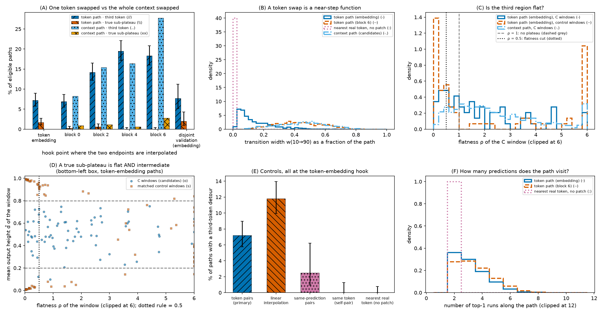

**Figure 1.** Interpolating one token inside a fixed 31-token context. **(A)** percentage of eligible
paths with a persistent third top-1 token (hatched `//`) and with a true sub-plateau — flat *and* at
intermediate height (hatched `\\`) — per hook point, next to the context-to-context screen scored the
same way (hatched `..` and `xx`); the rightmost group repeats the token-embedding screen on the
disjoint validation bank; error bars are 95% Wilson intervals; the context screen has no
token-embedding hook. **(B)** transition width w(10→90), the fraction of the path over which the
output distance climbs from 0.1 to 0.9 (smaller = sharper). **(C)** flatness ρ of the C window (range
of d ÷ width in α), clipped at 6. **(D)** every C window (circles) and every matched control window
(squares) of the token-embedding screen, plotted as flatness ρ (x, clipped at 6) against mean output
height d̄ (y); the true sub-plateaus are the points left of the dotted rule and between the two dashed
rules. **(E)** third-token detour rate for each control (y: % of paths), where the detour rate is the
frozen rule with the `A≠B` requirement dropped so the same-prediction control can be scored on the
same scale. **(F)** number of top-1 runs per path.

Panel D says the counting rule separates C windows from ordinary windows; these are the curves behind
it (Figure 2), and Figure 3 asks whether the shelves they show are one state or one lucky grid point:

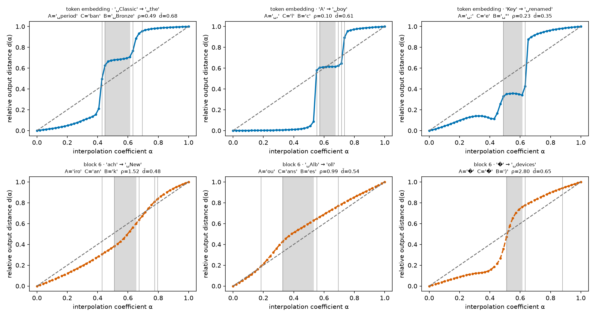

**Figure 2.** Six token-swap paths in output geometry. x: interpolation coefficient α between the two
final-token embeddings (0 = `t_A`, 1 = `t_B`); y: relative output distance d(α) on the final logits,
0 = the output looks like endpoint A's prediction, 1 = like endpoint B's. Dashed grey = the
no-plateau diagonal d = α; shaded band = the detected C run; thin vertical lines = top-1 token
changes. Panel titles give the two swapped tokens (␣ marks a leading space), the decoded A, C and B
predictions, the flatness ρ and the shelf height d̄. **Top row:** the three highest-scoring
token-embedding paths that qualify as true sub-plateaus — flat at A, one sharp boundary, a shelf at
intermediate height, a second boundary, flat at B. **Bottom row:** the three highest-scoring block-6
candidates for the same bank; no block-6 path is both flat and intermediate, and the curves show why —
the third token sits inside a smeared boundary.

Text decoded from inside those shelves separates a genuine third state from three points that merely
share an argmax (Figure 3):

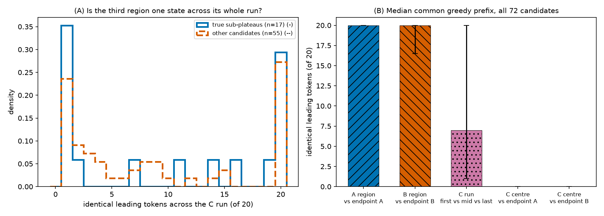

**Figure 3.** Does the third region generate the same text throughout its run? **(A)** distribution of
the common greedy prefix — the number of leading tokens (of 20) identical across continuations decoded
at the first, middle and last grid point of the C run (x); y: density; solid = the 17 true
sub-plateaus, dashed = the other 55 candidates. The shape is bimodal: a C region is usually either a
single-point coincidence (prefix 1) or a fully stable state (prefix 20). **(B)** median common greedy
prefix over all 72 candidates for five comparisons, with inter-quartile ranges; the A-region and
B-region points reproduce their unpatched endpoints exactly, so the patch is a no-op on the plateaus.

The screen's headline number and where it comes from — the rate rises with block depth and is
identical under either conditioning context, while the self-pair control is exactly zero (Figure 4):

**Figure 4.** `A|C|B` rate under the frozen rule. **Left:** percentage of eligible paths with a
persistent third top-1 token, per interpolation block of GPT-2 Large (x: block L; y: % of eligible
paths). **Right:** the same rate split by which context supplied the tokens the patched activation
runs inside, and for each control condition. Error bars are 95% Wilson intervals; the self-pair bar
is exactly zero because a constant path has no eligible endpoints.

Candidates are extremely heterogeneous, so a single example would misrepresent them: the top-ranked
paths show wide, confident third plateaus with two clearly separated distribution changes, while
randomly drawn qualifying paths show narrow, low-probability blips (Figure 5):

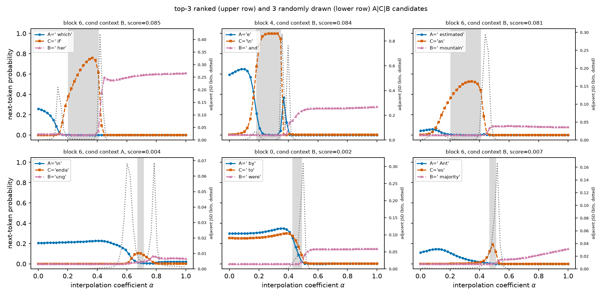

**Figure 5.** Next-token probability of the three named tokens along the path. x: interpolation
coefficient α (0 = context A's activation, 1 = context B's); left y: probability of A (solid,
circles), C (dashed, squares) and B (dash-dot, triangles); right y: Jensen–Shannon divergence between
neighbouring α in bits (dotted grey). The shaded band is the detected C run. **Top row:** the three
highest-scoring candidates. **Bottom row:** three candidates drawn at random from the qualifying set.

Do those paths look like plateaus when we plot the *output* instead of three token probabilities?
Here are the same six pre-frozen inspection paths as relative output distance `d(t)` against the
interpolation coefficient, with the no-plateau diagonal for reference (Figure 6):

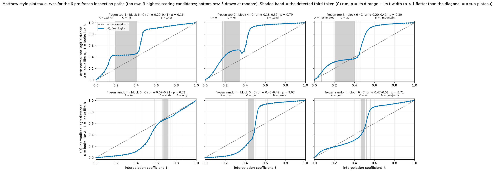

**Figure 6.** The six pre-frozen inspection paths in output geometry. x: interpolation coefficient t
(0 = context A's activation, 1 = context B's); y: relative output distance d(t) on the final logits,
0 = the output looks like endpoint A, 1 = like endpoint B. Dashed grey = the no-plateau reference
d = t; shaded band = the detected C run; thin vertical lines = top-1 token changes. **Top row:** the
three highest-scoring candidates (staircases, ρ = 0.16 / 0.79 / 0.30). **Bottom row:** three random
candidates (not staircases, ρ = 0.71 / 3.07 / 3.71).

Over all 1,290 candidates the second picture dominates — the C run is usually inside the boundary,
and only its flat tail is a genuine sub-plateau (Figure 7):

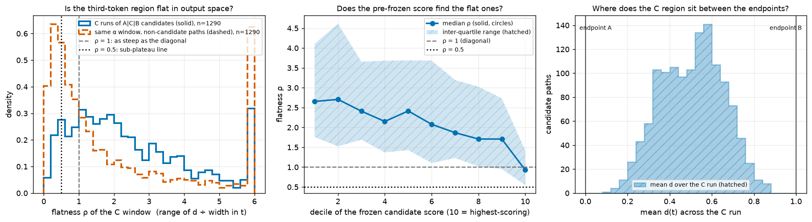

**Figure 7.** Is the third region a shelf? **Left:** distribution of the C-window flatness ρ (x: ρ =
range of d ÷ width in t, clipped at 6; y: density) for the 1,290 candidates (solid) and for the same
α windows on 1,290 matched non-candidate paths (dashed); dashed rule at ρ = 1, dotted rule at the
post-hoc ρ = 0.5 cut. **Middle:** median ρ (circles) with inter-quartile range (hatched) against the
decile of the frozen candidate score (10 = highest). **Right:** histogram of the mean output distance
across the C run.

This is what the flat tail looks like — the 106 candidates with ρ < 0.5 are textbook
plateau–boundary–sub-plateau–boundary–plateau curves (Figure 8):

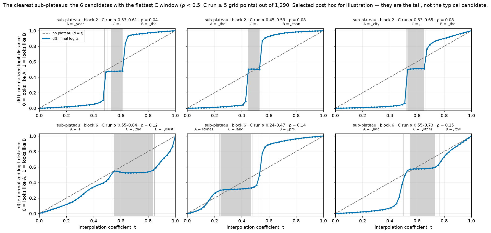

**Figure 8.** The six flattest sub-plateaus of the 1,290 candidates (post-hoc selection: ρ < 0.5 and
C run ≥ 5 grid points). Axes as in Figure 6 — x: interpolation coefficient t; y: relative output
distance d(t); dashed grey = the no-plateau diagonal; shaded band = the C run; thin vertical lines =
top-1 token changes. Titles give the block, the C-run α range and ρ.

Every path above is built by patching a **synthetic** activation, and Figure 16 below shows those
points sit off the natural manifold — so does any of this happen in real language? Rebuilding the path in
text space, with no patching anywhere, makes the flat third region *more* common, not less
(Figure 9):

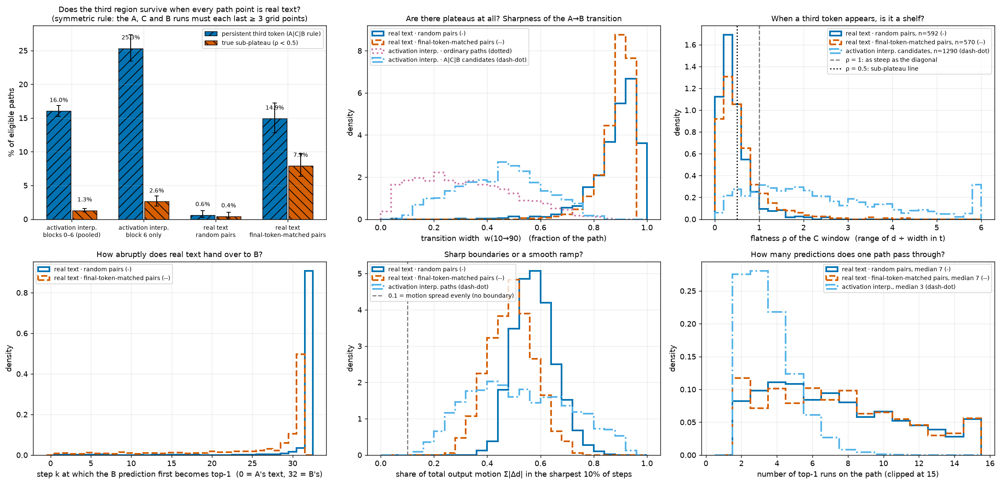

**Figure 9.** Real-language paths versus activation interpolation. **(A)** rate per eligible path
under the symmetric rule (A, C and B runs each ≥ 3 grid points) for a persistent third token (hatched
`//`) and for a true sub-plateau, ρ < 0.5 (hatched `\\`); error bars are 95% Wilson intervals.
**(B)** transition width w(10→90) as a fraction of the path. **(C)** flatness ρ of the C window,
clipped at 6. **(D)** the step k at which context B's prediction first becomes top-1 (0 = A's text,
32 = B's). **(E)** motion concentration κ, the share of total output motion Σ|Δd| carried by the
sharpest 10% of steps; 0.1 (dashed rule) would mean a perfectly smooth ramp. **(F)** number of top-1
runs per path, clipped at 15. In B–F, solid = real text with random pairs, dashed = real text with
final-token-matched pairs, dash-dot = activation-interpolation paths, dotted = ordinary
(non-candidate) activation paths.

And this is what a real-language sub-plateau looks like: a flat shelf at an intermediate output
height, produced entirely by feeding the model real token sequences (Figure 10):

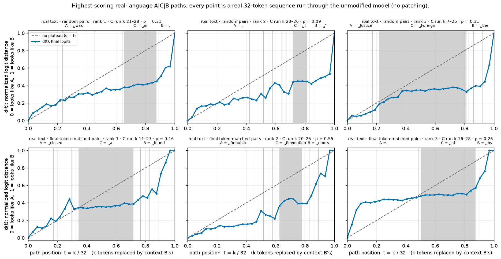

**Figure 10.** Real-language `A|C|B` paths — no patching anywhere; every marker is a real 32-token
sequence run through the unmodified model. x: path position t = k/32, where k is the number of
leading tokens already replaced by context B's; y: relative output distance d(t) on the final logits,
0 = the output looks like context A's prediction, 1 = like context B's. Dashed grey = the no-plateau
diagonal; shaded band = the detected C run; thin vertical lines = top-1 token changes; the A/C/B
labels above each panel give the decoded tokens (␣ marks a leading space). **Top row:** the three
highest-scoring qualifying paths from the random-pair bank. **Bottom row:** the same from the
final-token-matched bank. The bottom-right panel is the clean `A, C, B` worked example above.

The preregistered blocks stop at 6, where both curves are still rising, so we swept deeper with the
same pairs and the same detector to see whether the trend continues. It does not — it turns over
(Figure 11):

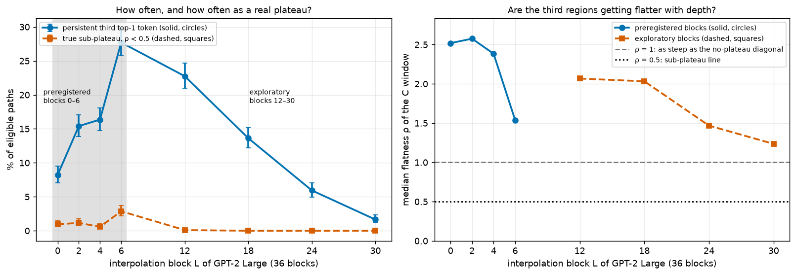

**Figure 11.** Where in the network the effect lives (exploratory: same 1,000 pairs, so not
independent evidence). **Left:** percentage of eligible paths with a persistent third top-1 token
(solid, circles) and with a true sub-plateau, ρ < 0.5 (dashed, squares), against the interpolation
block L (x, 0–30 of 36); error bars are 95% Wilson intervals and the hatched region marks the
preregistered blocks 0–6. **Right:** median flatness ρ of the C window against L; preregistered
blocks solid with circles, exploratory blocks dashed with squares; dashed rule at ρ = 1, dotted rule
at ρ = 0.5.

Back to the label view. Heterogeneity is the rule, not the exception — most C segments are only 3–5
of the 50 grid points wide, win by a small margin, and both transitions sit in the middle of the path
(Figure 12):

**Figure 12.** What a typical activation-path candidate looks like, over all 1,290. **Left:**
C-segment width as a fraction of the 50-point α grid. **Middle:** minimum dominance margin of C over
both endpoint tokens (probability units). **Right:** entry α versus exit α of the C run, with the
dashed diagonal marking zero width.

If the third region were a genuine extra state we would expect it to be at least as confident as the
endpoints. It is not — it is flatter and less certain (Figure 13):

**Figure 13.** Is the third region confident? x: top-1 probability (left panel) and predictive
entropy in bits (right panel); y: number of candidate paths. Solid = the centre of the C region,
dashed = the mean of the two path endpoints, over all 1,290 candidates.

And the C tokens themselves are not distinctive concepts: they come from the same generic
high-frequency pool as the endpoint predictions (Figure 14):

**Figure 14.** Which tokens play the third role. **Left:** the 15 commonest intermediate (C) tokens
over the 1,290 candidate paths. **Right:** the 15 commonest endpoint (A) tokens over the 7,611
eligible paths. x: number of paths; y-axis labels are the decoded token strings.

Because the headline rate depends on two frozen thresholds, we show what happens when they move —
the effect degrades smoothly and never collapses to zero (Figure 15):

**Figure 15.** Robustness of the headline rate. x: persistence threshold (2, 3 or 5 consecutive α
points that C must stay top-1); y: `A|C|B` rate per eligible path. The three line styles are
minimum-dominance-margin floors of 0, 0.02 and 0.05; the dotted vertical line marks the frozen
default (persistence 3, margin > 0).

Two probes of whether a C region behaves like a real model state. Its points sit *further* from real
activations than the endpoint-region points do, and their natural neighbours rarely predict C
(Figure 16):

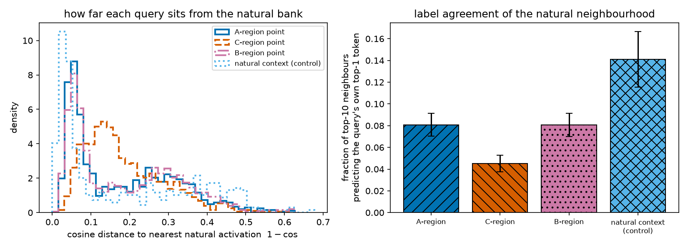

**Figure 16.** Do C-region activations sit where real activations sit? **Left:** distribution of
cosine distance to the nearest of 2,000 held-out natural activations (x: cosine distance, lower =
more natural; y: density) for A-region, C-region and B-region interpolation points and for natural
contexts used as queries. **Right:** fraction of the 10 nearest natural neighbours whose own
unpatched top-1 next token equals the query's own top-1 token, with 95% bootstrap intervals.

Yet the text the C region produces is fluent, and in a third of inspected cases it is reproducible
across the whole C run rather than at a single grid point (Figure 17):

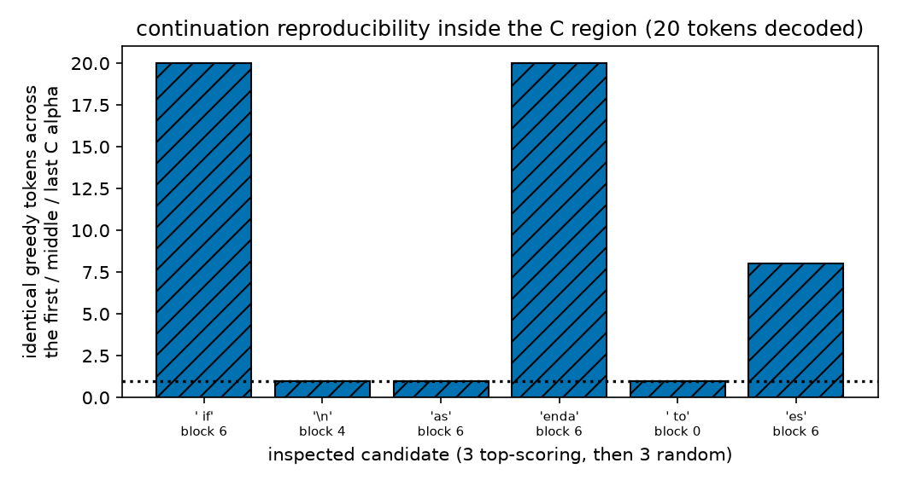

**Figure 17.** Is the C region the same state throughout its run? x: the six inspected candidates,
labelled with their C token and interpolation block; y: number of leading greedy-decoded tokens (out
of 20) that are identical across continuations generated at the first, middle and last α of the C
run. The dotted line at 1 is the trivial floor, since the first decoded token is C by construction.

## Headline

**Holding the context fixed and moving a single token is enough.** With 31 of 32 tokens identical at
both ends, a token-embedding path is a near-step function (transition width 0.103 of the path,
motion concentration κ = 0.83), and **7.2% of 1,000 such paths [5.8, 9.0] hold a persistent third
prediction, 1.70% [1.06, 2.71] a true sub-plateau — flat and at intermediate height — against 0 of 72
matched control windows** and 1.34% [1.11, 1.62] for whole-context interpolation — reproduced at 7.7% and 2.00% on
300 pairs built from windows the primary token bank never touched. Those shelves hold their own
behaviour: greedy text decoded from inside them is identical across a median 11 of 20 tokens over the
whole run and shares a median 0 tokens with either endpoint's continuation. So the third state
is not a by-product of blending two passages: one token is enough to produce it, and the resulting
staircases are the cleanest in this direction. The same token pairs interpolated deeper (blocks 0–6)
give more third-token *labels* (up to 19.5%) and no shelves at all, and snapping every interpolated
embedding to its nearest real token collapses the path to a 2-token step function — the sub-plateau
lives between vocabulary items, reachable by editing activations and by no real input.

**The `A → C → B` phenomenon is real and common in GPT-2 Large — about 1 in 6 random interpolation
paths (16.9%, CI [16.1, 17.8]) shows a third token holding top-1 for ≥3 consecutive alphas while
beating both endpoints, reproduced at 17.7% on a disjoint bank — but the typical third region is a
weak, high-entropy band whose token is a generic frequency default, sits further off the natural
activation manifold than the endpoints, and appears almost as often (11.1%) when the two contexts do
not even disagree.** Measured as *plateaus* rather than as labels, the split is sharper still: the
median candidate's third region has flatness ρ = 2.05 — the output is sweeping through the boundary,
not resting — and only **1.39% of eligible paths (CI [1.15, 1.68], 1 in 72) hold a true flat
sub-plateau (ρ < 0.5)**. Those genuine ones behave exactly as the MNIST work predicted: a shelf at
`d̄_C` ≈ 0.5 between two sharp boundaries, longer than average, concentrated at block 6, and ranked at
the top by a score frozen before any curve was seen. An exploratory sweep to blocks 12–30 shows the
effect is **early-to-mid network**: it peaks around block 6 of 36 and is gone by block 18.

**And it is not an artefact of leaving the activation manifold.** Rebuilt in text space — every point
a real 32-token sequence, no patching anywhere — the flat third region becomes *more* common, not
less: **7.9% of real-language paths (CI [6.4, 9.7]) hold a sub-plateau against 1.29% of activation
paths (CI [1.06, 1.57])** under the same symmetric rule, and the median third region's flatness flips
from ρ = 2.05 to ρ = 0.45. The right picture for real language is a **staircase with many steps**: as
context is swapped token by token the output holds still, jumps, and holds still again, about seven
times over 32 tokens, with sharp boundaries (motion concentration κ = 0.49, where a smooth ramp would
give 0.1). The verdict is therefore **"robust third output region, fragile on interpolated
activations, genuinely flat in real language — but rarely a clean three-step `A → C → B`"**.
