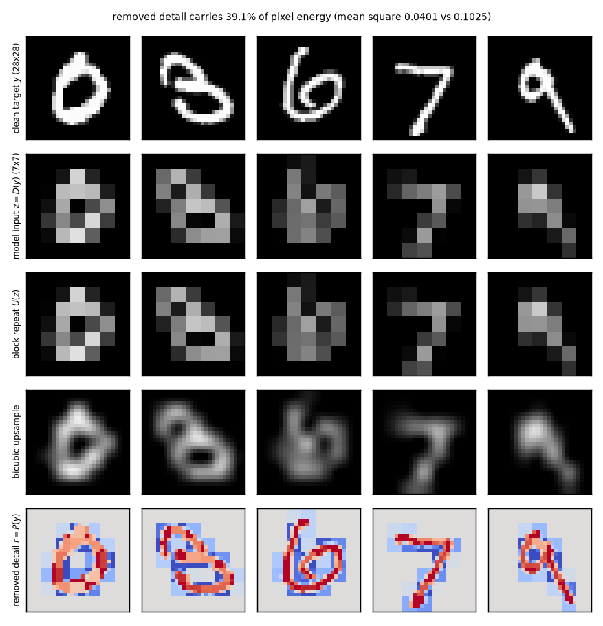
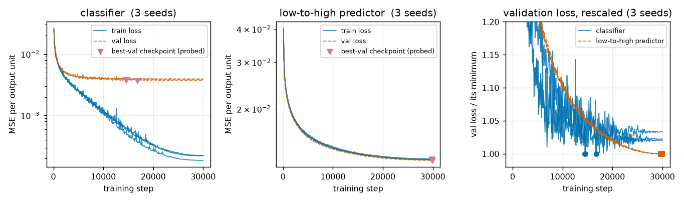
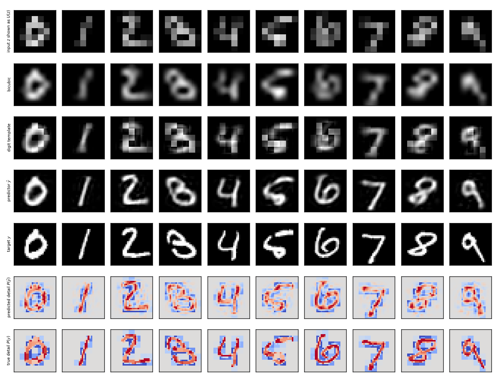
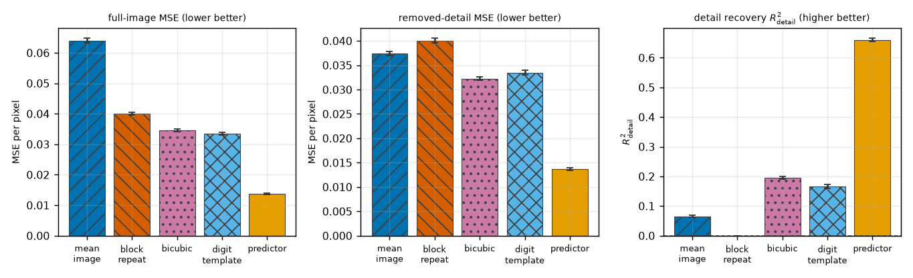
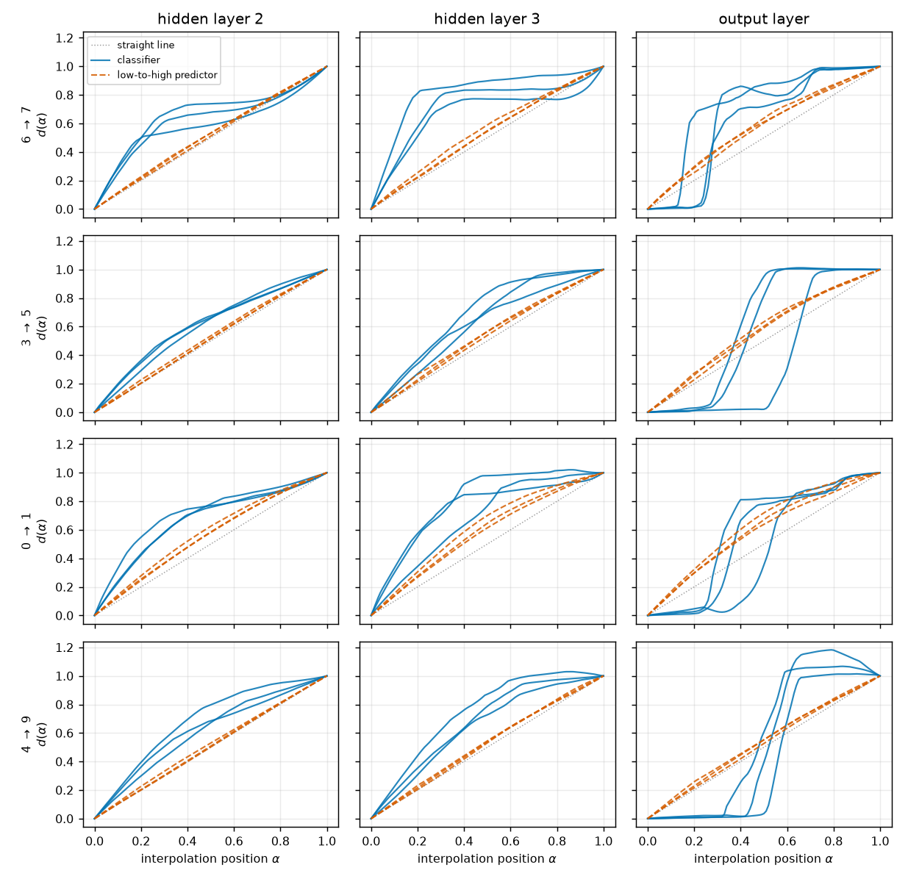
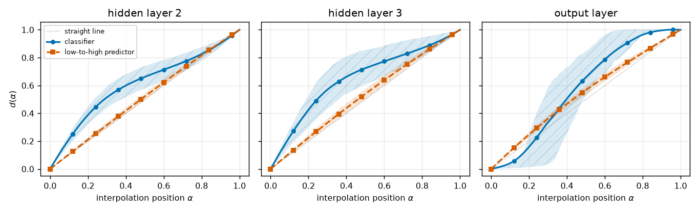
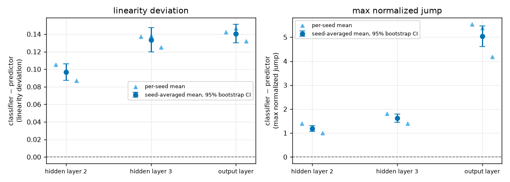
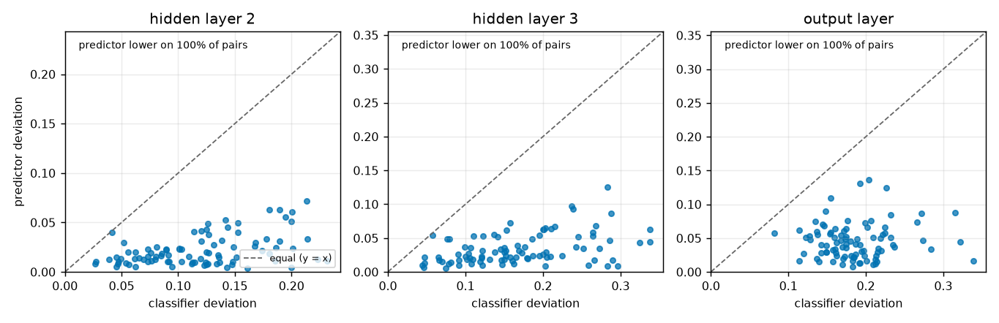
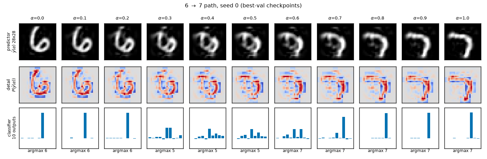
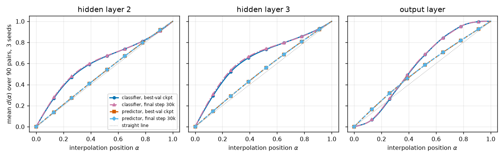

# Do continuous low-to-high-resolution targets reduce activation plateaus?

> Final, presentable, current-best only (no history — see CHANGELOG.md).

## Summary

When you interpolate between two inputs *inside* a neural network — patch the hidden activations
partway between the activations of image A and image B, then let the rest of the network run — the
network's later representations often do not move smoothly. They sit still for a while, then lurch.
We call the flat stretches **activation plateaus** and the lurch a **cliff**. Plateaus matter for AI
safety because a model whose internal state jumps discontinuously is a model whose behaviour can
change abruptly for an input that looks, from the outside, only slightly different — and abrupt,
hard-to-anticipate changes are exactly what monitoring and interpretability tools need to catch.

A previous experiment in this project (direction 16) found that swapping a classification target for
a *continuous* target removed most of the plateau behaviour. But that continuous target was a
**downsampled** version of the input — the model only had to throw information away. Smooth
activations might just be what an information-discarding task looks like, not what continuous
supervision does.

This report closes that loophole. Both models here receive the **same** 49-value input: a clean MNIST
digit average-pooled from 28x28 down to 7x7. One model predicts the digit label; the other predicts
the **original 28x28 image**, which contains spatial detail the 7x7 input does not carry (39.1% of
the image's pixel energy lives in that discarded detail). The continuous task now has to *add*
predicted structure rather than discard it.

**The result is a robust positive.** The predictor genuinely learns held-out detail — it recovers
66.0% of the removed-detail energy, versus 19.5% for bicubic upsampling and 16.5% for a privileged
baseline that is handed the true digit label — and its internal representation is still **4.9x
closer to a constant-rate transition** than the classifier's at the last shared hidden layer, on
**90 of 90** frozen digit pairs, at every layer, on every seed, under both plateau metrics and both
normalizations. Continuous supervision, not information discarding, is what smooths the
representation.

---

## Methods

### Data & Model

**Dataset.** The official MNIST handwritten-digit split, pixels scaled to $[0,1]$. All 60,000
training images are used for training. The 10,000 test images are split once and frozen: test
indices `0:2000` are the **untouched evaluation and interpolation-endpoint pool** (never used for
training or checkpoint selection), and test indices `2000:10000` are the **checkpoint-validation
set**. No Gaussian corruption is added anywhere; downsampling is the only lossy transformation.

**The low-to-high setup.** Let $y$ be a clean 28x28 image flattened to 784 values. Three fixed linear
operators define the task:

```math
D:\ \mathbb{R}^{784}\!\to\!\mathbb{R}^{49}\ \text{(non-overlapping }4\times4\text{ average pooling)},
\qquad
U:\ \mathbb{R}^{49}\!\to\!\mathbb{R}^{784}\ \text{(copy each }7\times7\text{ cell into its }4\times4\text{ block)},
\qquad
P = I - UD .
```

$D$ is the downsampler, $U$ is block repetition, and $P$ is the **removed-detail projector**. The
single input given to *both* models is $z = D(y)$, the 7x7 image (49 numbers). The removed detail is
$r = P(y)$: the part of the image that averages to zero inside every 4x4 block, and is therefore not
determined by $z$. We verified numerically on the endpoint pool that $D(U(z)) = z$, $D(P(y)) = 0$ and
$UD + P = I$, each to a maximum absolute error of $2.4\times10^{-7}$, and that $r$ carries
**39.1%** of the mean squared pixel value (0.0401 of 0.1025). That last number is the audit that the
784-value target really does contain structure absent from the 49-value input.

**Models.** Two 4-linear-layer ReLU multilayer perceptrons (MLPs) with an identical shared trunk
$49 \to 200 \to 200 \to 200$ (ReLU after each hidden linear layer) and different heads:

- **classifier:** $200 \to 10$, trained against the one-hot digit label;
- **low-to-high predictor:** $200 \to 784$, trained against the clean image $y$.

No batch normalization, dropout, skip connections, or auxiliary losses. Both use mean-squared error
(MSE) **averaged per output unit**, so the loss scale does not depend on the head dimension. For each
seed the two models are built from the same torch seed with the trunk constructed first, so their
initial weights in all three shared layers are **bit-identical** (asserted at run time), and they see
the same batches in the same order.

**Training.** Seeds 0, 1, 2; AdamW, learning rate $10^{-3}$, weight decay 0.01, batch size 200,
30,000 steps (100 epochs over 60,000 images, reshuffled each epoch), cosine decay to $10^{-6}$.
Train/validation loss recorded every 100 steps. Two checkpoints per model are kept: the
**best-validation-loss** checkpoint — the primary probe checkpoint, fixed by this rule before any
interpolation was run, never chosen for smoothness — and the final step-30,000 weights, used only as
a control.

**Hook point and sample sizes.** The probe patches the **post-ReLU first hidden layer** $h_1$ (200
units) and reads out the **post-ReLU second and third hidden layers** $h_2, h_3$ (200 units each) and
the raw output. 90 frozen endpoint pairs x 101 interpolation points x 3 seeds x 2 models x 2
checkpoint conditions. Task quality is measured on all 2,000 untouched pool images.

### The interpolation probe

To ask whether a representation moves smoothly from one input's state to another's, we need a path
between them that both models traverse identically. We reuse this project's frozen protocol without
any task-dependent tuning. For a pair of endpoint images $(x_a, x_b)$ we record their first-hidden
activations $h_1(x_a), h_1(x_b)$, then build a 101-point path by **norm-rescaled spherical
interpolation (SLERP)** — spherical interpolation of the directions with linearly interpolated
lengths — and push each point through the remaining layers:

```math
h_1(\alpha) \;=\; \Big[(1-\alpha)\lVert h_1(x_a)\rVert + \alpha\lVert h_1(x_b)\rVert\Big]\cdot
\frac{\sin\!\big((1-\alpha)\theta\big)\,\hat{u}_a + \sin\!\big(\alpha\theta\big)\,\hat{u}_b}{\sin\theta},
\qquad \alpha \in \{0, 0.01, \dots, 1\}.
```

Here $\hat{u}_a, \hat{u}_b$ are the unit vectors of the two endpoint activations and $\theta$ is the
angle between them. SLERP rather than straight-line mixing because ReLU activations live at a
characteristic norm; a straight line would shrink the vector in the middle and confound "the model
plateaus" with "the activation got small".

We check that $\alpha=0$ and $\alpha=1$ reproduce the *unpatched* endpoint activations and outputs
(maximum error $1.4\times10^{-6}$, tolerance $10^{-4}$) and that every probe rerun is bit-identical.

**Path coordinate $d_\ell(\alpha)$ — the quantity every plateau metric is computed from.** We want
one number per interpolation point saying "how far along the way from A to B is this layer now?", so
that a plateau shows up as a flat stretch. We measure distance from the A-endpoint activation in
units of the total A-to-B distance, at each equal-width hidden layer $\ell$:

```math
d_\ell(\alpha) \;=\; \frac{\lVert h_\ell(\alpha) - h_\ell(0)\rVert}{\lVert h_\ell(1) - h_\ell(0)\rVert}
```

$d_\ell(0)=0$ and $d_\ell(1)=1$ by construction. A representation that moves at a constant rate gives
$d_\ell(\alpha)=\alpha$, the diagonal. A plateau is a flat stretch; a cliff is a near-vertical rise.
Figures 5, 6 and 10 plot this curve directly.

### Metrics

Every metric below is consumed by a specific result; nothing is defined that no claim uses.

**Linearity deviation LD (primary plateau metric).** Reading 90 curves by eye does not scale, and we
need a single per-pair number to bootstrap. The simplest faithful summary of "how far is this curve
from a constant-rate transition" is its mean absolute distance from the diagonal. Lower is smoother;
0 means perfectly constant-rate. Used by the main comparison table and Figures 7 and 8:

```math
\mathrm{LD}_\ell \;=\; \frac{1}{101}\sum_{i=0}^{100}\big| d_\ell(\alpha_i) - \alpha_i \big|
```

**Max normalized jump MJ (secondary).** LD is an average, so a curve could have a low LD and still
contain one violent cliff. MJ targets the cliff directly: the largest single step of the 101-point
path, rescaled so that a perfectly constant-rate path scores exactly 1. Larger means a sharper
lurch. Used by the plateau-shape table and the right panel of Figure 7:

```math
\mathrm{MJ}_\ell \;=\; 100 \cdot \max_{i}\big| d_\ell(\alpha_{i+1}) - d_\ell(\alpha_i) \big|
```

**Alternative fraction normalization (robustness only).** $d_\ell$ divides by the *endpoint-to-endpoint*
distance, which is sensitive to a path that bulges outward. As a check that the verdict is not an
artifact of that choice, we recompute LD from a normalization that cannot exceed 1 by construction,
and report it as a robustness row only — it never replaces $d_\ell$:

```math
f_\ell(\alpha) \;=\; \frac{\lVert h_\ell(\alpha)-h_\ell(0)\rVert}
{\lVert h_\ell(\alpha)-h_\ell(0)\rVert + \lVert h_\ell(\alpha)-h_\ell(1)\rVert}
```

**Full-image MSE (task quality).** Before comparing plateaus we must show the continuous task was
actually learned; otherwise a "smooth" model might just be a model that outputs almost nothing.
Mean squared error per pixel between prediction $\hat{y}$ and target $y$ over the $N=2000$ untouched
pool images. Lower is better. Used by Figure 4 (left) and the task-quality table:

```math
\mathrm{MSE} \;=\; \frac{1}{784N}\sum_{n=1}^{N}\lVert \hat{y}_n - y_n\rVert^2
```

**Removed-detail MSE (task quality).** Full-image MSE is a weak test here, because simply copying the
input through $U$ already gets the block means exactly right. The informative question is how well
the *unavailable* component is predicted, so we score only the removed-detail part. Lower is better.
Used by Figure 4 (middle):

```math
\mathrm{MSE}_{\mathrm{detail}} \;=\; \frac{1}{784N}\sum_{n=1}^{N}\lVert P(\hat{y}_n) - P(y_n)\rVert^2
```

**Detail recovery $R^2_{\mathrm{detail}}$ (the headline task-quality number).** An MSE is hard to
read on its own — is 0.0136 good? This normalizes it into a fraction-of-variance-explained scale
against the natural "no recovery" reference, block repetition $U(z)$, whose detail error equals the
full detail energy. So **0 means no detail recovered beyond a block-constant image, 1 means perfect
recovery**, and higher is better. Used by Figure 4 (right) and the predictor gate:

```math
R^2_{\mathrm{detail}} \;=\; 1 - \frac{\sum_n \lVert P(\hat{y}_n) - P(y_n)\rVert^2}
{\sum_n \lVert P(y_n)\rVert^2}
```

**Low-resolution consistency MSE (sanity check).** A model could lower its detail error while
drifting away from the block means it was actually given. This checks it did not: how far the
prediction's own downsampling strays from the supplied input. Lower is better; reported as a column
of the task-quality table:

```math
\mathrm{MSE}_{\mathrm{lowres}} \;=\; \frac{1}{49N}\sum_{n=1}^{N}\lVert D(\hat{y}_n) - z_n\rVert^2
```

**Top-1 accuracy (classifier gate).** The fraction of pool images whose largest raw output unit is
the true digit. Higher is better; the gate is 95%.

### Baselines

Four evaluation-only baselines were frozen before training. None is trained; each maps the 7x7 input
$z$ (or, for the last one, $z$ plus the true label) to a 28x28 prediction, and each is scored with
exactly the metrics above.

**Mean training image** — the constant prediction that ignores the input entirely; the floor any
image model must clear:

```math
\hat{y}^{\,\mathrm{mean}} = \frac{1}{60000}\sum_{n=1}^{60000} y_n
```

**Block repetition** — copy each 7x7 value into its 4x4 block. This is the "use the input, predict no
detail" reference: its detail error is exactly the full detail energy, which is why it defines
$R^2_{\mathrm{detail}} = 0$:

```math
\hat{y}^{\,\mathrm{block}} = U(z)
```

**Bicubic upsampling** — the standard fixed interpolation, PyTorch `interpolate` with
`mode="bicubic"`, `align_corners=False`, clipped to $[0,1]$. A smooth resize does recover some detail
(edges get less blocky), so this is the real bar a "genuine super-resolution" claim must clear.

**Privileged digit template** — block repetition plus the average removed detail of that digit class,
computed on the *training* set but indexed by the **true test label**, which the models never see:

```math
\hat{y}^{\,\mathrm{tmpl}} = U(z) + \frac{1}{|\mathcal{T}_c|}\sum_{n \in \mathcal{T}_c} P(y_n),
\qquad c = \text{true label},\quad \mathcal{T}_c=\{\text{training images of digit } c\}
```

This is a diagnostic, not a pass/fail gate. It represents the best any *prototype-level* predictor
could do: the right block means plus the average handwriting of that digit. Beating it is what
separates "the model learned instance-specific detail" from "the model learned ten digit templates".

### Statistics and the preregistered decision rule

The paired effect is always **classifier metric − predictor metric on the same pair and seed**;
positive means the predictor is smoother. For each layer we average the paired effect over the 3
seeds and form a 95% percentile bootstrap confidence interval (CI) from 10,000 resamples of the 90
pair identifiers. Task-quality CIs bootstrap the 2,000 pool images the same way.

Verdicts were fixed before any interpolation was viewed. **Robust positive** requires both task gates
to pass, the 95% CI for the LD difference to lie above zero at *both* hidden layers 2 and 3, and the
effect to be positive at every seed. A positive LD verdict contradicted by the jump metric would be
**mixed**, not robust positive. The **classifier gate** is ≥95% top-1 accuracy on the untouched pool.
The **predictor gate** is: beat both block repetition and bicubic on full-image MSE *and* on
removed-detail MSE with paired 95% CIs excluding zero, and have a lower 95% bound on
$R^2_{\mathrm{detail}}$ above zero.

### Frozen pair bank

90 endpoint pairs from the untouched test pool: two replicas for each of the 45 unordered digit
pairs, constructed identically to earlier directions so the hand-selected transitions (including
6→7) are directly comparable. Pair identifiers, source indices, labels, and manifest checksums were
saved before probing, and the list is identical across models, checkpoints and seeds. No pair was
removed or added after seeing a curve.

---

## Results

### The target really does contain detail the input does not

The whole premise is that the 784-value target is not recoverable from the 49-value input. Figure 1
shows what each operator does to a real digit and how much signal the removed component carries.



**Figure 1.** Rows top-to-bottom: the clean target $y$; the only model input $z = D(y)$ (7x7); block
repetition $U(z)$; bicubic upsample; the removed detail $r = P(y)$. Columns are five test digits.
The four grayscale rows use a fixed $[0,1]$ scale; the detail row uses a diverging blue↔red colormap
over $[-0.5, 0.5]$ with white at zero. The detail row is far from blank — it holds 39.1% of the
image's pixel energy — so predicting $y$ from $z$ is a genuine prediction problem, not a copy.

### Both models trained stably, and the probed checkpoints are principled

The comparison is only fair if neither model was starved or over-trained relative to the other, and
if the checkpoint we probe was chosen by a rule fixed in advance. Figure 2 shows the loss histories
with the probed checkpoint marked.



**Figure 2.** x: training step; y: MSE per output unit (log scale in the first two panels). Left =
classifier, middle = predictor; solid = training loss, dashed = validation loss, downward triangle =
the best-validation checkpoint that every headline number is computed at. Right panel: validation
loss divided by its own minimum for both models — classifier (solid, circles) and predictor (dashed,
squares) — so the two tasks' very different loss scales can be compared. The classifier's validation
loss bottoms out around step 14,500–16,800 and then drifts up as it memorizes; the predictor's is
still improving slowly at step 29,700–29,900. Both are smooth; neither is broken.

### The predictor passes its gate by a wide margin — and it is not prototype matching

A "smooth" model that had learned nothing would be a trivial and uninteresting result, so the
continuous task must be shown to work before its plateaus mean anything. Figure 3 shows the
predictions next to every baseline.



**Figure 3.** One column per digit 0–9, taken from the untouched pool. Rows: the input $z$ rendered
as $U(z)$; bicubic upsampling; the privileged digit template; the predictor's output $\hat{y}$; the
target $y$; the predicted detail $P(\hat{y})$; and the true detail $P(y)$. Grayscale rows share the
$[0,1]$ scale, the two detail rows share the diverging $[-0.5,0.5]$ scale of Figure 1. The
predictor's strokes are sharp and follow *this* digit's handwriting — compare the blurry bicubic row
and the generic template row — and its detail map reproduces the true detail's structure.

Figure 4 turns that visual impression into numbers with uncertainty.



**Figure 4.** Bars with 95% bootstrap intervals over the 2,000 pool images; series are distinguished
by hatch pattern as well as hue. Left: full-image MSE per pixel; middle: removed-detail MSE per
pixel (both lower = better); right: $R^2_{\mathrm{detail}}$ (higher = better, 0 = nothing recovered
beyond a block-constant image). Block repetition sits at exactly 0 on the right panel by
construction. The trained predictor is far below every baseline on both error panels and far above
all of them on detail recovery.

**Task quality on the untouched pool (test[:2000], best-validation checkpoints, seed-averaged):**

| predictor of `y` | full-image MSE | removed-detail MSE | $R^2_{\mathrm{detail}}$ [95% CI] | low-res consistency MSE |
|---|---|---|---|---|
| mean training image | 0.0640 | 0.0375 | 0.065 [0.062, 0.069] | 2.7e-02 |
| block repetition `U(z)` | 0.0401 | 0.0401 | 0.000 [-0.000, 0.000] | 9.1e-16 |
| bicubic 7x7→28x28 | 0.0346 | 0.0323 | 0.195 [0.191, 0.199] | 2.3e-03 |
| privileged digit template | 0.0335 | 0.0335 | 0.165 [0.158, 0.172] | 3.0e-16 |
| **trained predictor** | **0.0137** | **0.0136** | **0.660 [0.654, 0.666]** | 1.1e-04 |

The paired margins over the two fixed upsamplers are all strictly positive: versus block repetition,
0.0263 [0.0259, 0.0268] on full MSE and 0.0265 [0.0260, 0.0269] on detail MSE; versus bicubic,
0.0209 [0.0205, 0.0212] and 0.0186 [0.0183, 0.0190]. The lower bound on $R^2_{\mathrm{detail}}$ is
0.654, well above zero. **The predictor gate passes.** The predictor also beats the *privileged*
digit template on detail MSE by 0.0198 [0.0195, 0.0202] — the template is given the true label and
still loses by a factor of 2.5 — so the recovered detail is **instance-specific**, not a per-digit
prototype. Low-resolution consistency is 1.1e-04, roughly 1/360 of the detail error, so the model
kept the block means it was given.

The classifier gate also passes: top-1 accuracy on the untouched pool is **95.8 / 96.3 / 96.8%** for
seeds 0 / 1 / 2 (minimum 95.8% ≥ the 95% requirement). Both gates pass, so the plateau comparison is
valid.

### The classifier plateaus; the low-to-high predictor does not

With both tasks established as adequate, the preregistered comparison can be read. Figure 5 shows the
raw path coordinate on the four hand-selected transitions — the shape of the effect before any
averaging.



**Figure 5.** x: interpolation position $\alpha$; y: the endpoint-relative path coordinate
$d_\ell(\alpha)$ defined in Methods. Rows are the four preregistered transitions 6→7, 3→5, 0→1, 4→9;
columns are hidden layer 2, hidden layer 3, and the output layer. Solid curves = classifier, dashed =
low-to-high predictor, three seeds drawn per model; the dotted diagonal is a perfectly constant-rate
path. The classifier curves bow away from the diagonal into the S-shape that is the
plateau-and-cliff signature; the predictor curves hug it.

Figure 6 confirms this is the typical behaviour over the whole frozen bank, not a property of four
chosen pairs.



**Figure 6.** x: $\alpha$; y: mean $d_\ell(\alpha)$ across all 90 pairs and 3 seeds. Shaded,
hatched bands give the interquartile range across pairs and seeds. Solid with circles = classifier,
dashed with squares = predictor, dotted = the straight line. The predictor's mean curve is visually
on the diagonal at all three layers, with a band several times narrower than the classifier's.

**Main comparison — linearity deviation LD (lower = smoother), best-validation checkpoints:**

| layer | classifier | predictor | paired diff (clf − pre) [95% CI] | ratio | pairs predictor smoother |
|---|---|---|---|---|---|
| hidden 2 | 0.1187 | 0.0219 | **0.0968** [0.0873, 0.1063] | 5.4x | 90 / 90 |
| hidden 3 | 0.1677 | 0.0342 | **0.1335** [0.1197, 0.1474] | 4.9x | 90 / 90 |
| output   | 0.1858 | 0.0455 | **0.1403** [0.1300, 0.1510] | 4.1x | 90 / 90 |

Both hidden-layer intervals are far above zero, and every seed agrees: the per-seed paired
differences at hidden layer 3 are 0.1373, 0.1381 and 0.1251. Figure 7 shows the effect and its
uncertainty for both metrics at once.



**Figure 7.** x: layer; y: the paired classifier − predictor difference, left panel for LD and right
panel for MJ (positive = predictor smoother). Circles with error bars = the seed-averaged mean with
its 95% bootstrap CI over the 90 pairs; upward triangles = the three individual seed means. Every
interval sits above the dashed zero line, and no seed crosses it.

**Plateau-and-cliff shape — max normalized jump MJ (1 = perfectly constant rate):**

| layer | classifier | predictor | paired diff [95% CI] | ratio |
|---|---|---|---|---|
| hidden 2 | 2.32 | 1.13 | **1.19** [1.08, 1.31] | 2.1x |
| hidden 3 | 2.86 | 1.24 | **1.62** [1.44, 1.80] | 2.3x |
| output   | 6.42 | 1.38 | **5.04** [4.62, 5.47] | 4.6x |

MJ agrees with LD in sign and significance at every layer. The predictor's largest single step is
1.13–1.24 times the constant-rate step — essentially a smooth traversal — while the classifier's
representation covers up to 2.9 steps' worth of ground in one 1/100th of the path, and its output
layer up to 6.4. Because the secondary metric confirms rather than contradicts the primary one, the
preregistered verdict is **robust positive**, not mixed.

The effect is also not carried by a handful of extreme pairs, which Figure 8 checks pair by pair.



**Figure 8.** x: classifier LD; y: predictor LD, one point per frozen pair (averaged over seeds), one
panel per layer. The dashed line is equality. All 90 points fall below it at every layer — the
predictor is smoother on **every single pair**, not on average.

Figure 9 makes the difference concrete in output space: what each model actually emits as the hidden
state is dragged from one digit to the other.



**Figure 9.** The 6→7 path at 11 evenly spaced values of $\alpha$ (seed 0, best-validation
checkpoints). Top row: the predictor's output $\hat{y}(\alpha)$ rendered as a 28x28 image on the
$[0,1]$ grayscale. Middle row: its removed-detail component $P(\hat{y}(\alpha))$ on the diverging
$[-0.5,0.5]$ scale. Bottom row: the classifier's 10 raw output units, x = digit class, with the
argmax class printed underneath. The predicted image deforms continuously — a 6 whose loop opens and
straightens into a 7, staying a sharp digit-like image throughout — while the classifier's decision
holds at 6, snaps through an unrelated 5 in the middle of the path, then snaps to 7. Note that the
predictor keeps producing high-frequency detail *off* the data manifold, mid-path; smoothness here is
not blurring.

### Robustness controls

Three preregistered checks ask whether the verdict depends on choices we could have made differently.

| control | hidden 2 | hidden 3 | output |
|---|---|---|---|
| alternative fraction normalization $f_\ell$, LD diff [95% CI] | 0.0626 [0.0575, 0.0679] | 0.0730 [0.0665, 0.0796] | 0.1196 [0.1094, 0.1306] |
| final step-30,000 checkpoints, LD diff [95% CI] | 0.1008 [0.0910, 0.1108] | 0.1409 [0.1264, 0.1558] | 0.1440 [0.1338, 0.1543] |

The alternative normalization shrinks the absolute numbers (it is bounded above by 1 by
construction) but keeps every interval well above zero. The checkpoint control is shown directly in
Figure 10.



**Figure 10.** x: $\alpha$; y: mean $d_\ell(\alpha)$ over 90 pairs and 3 seeds, one panel per layer.
Four series distinguished by line style and marker: classifier at its best-validation checkpoint
(solid, circles) and at final step 30,000 (dash-dot, triangles); predictor at its best-validation
checkpoint (dashed, squares) and at final step 30,000 (dash-dot-dot, diamonds); dotted = straight
line. The best-validation and final curves nearly coincide for both models, so probing the fully
trained weights instead would not change the verdict — with both models at step 30,000 the hidden
layer 3 difference is 0.1409 [0.1264, 0.1558], still 90/90 pairs.

Protocol integrity: the operator identities hold to $\le 2.4\times10^{-7}$; every $\alpha=0$ and
$\alpha=1$ activation and output reproduces its unpatched value to $\le 1.4\times10^{-6}$ (tolerance
$10^{-4}$); every probe rerun was bit-identical; the trunk initializations were asserted
bit-identical between the two models at every seed.

---

## Conclusion

**Verdict: robust positive.** Under the preregistered rule — both task gates passed, both hidden-layer
95% CIs for the LD difference above zero, every seed positive — continuous supervision reduces
activation plateaus even when the continuous target is *high-resolution structure the input does not
contain*. The predictor's representation is 4.9x closer to a constant-rate transition than the
classifier's at the last shared hidden layer, on 90 of 90 pairs, and the secondary jump metric, the
alternative normalization and the final-checkpoint control all agree.

This rules out the main alternative explanation for direction 16's result. There, the continuous
target was a downsampled copy of the input, so smooth activations could have reflected an
information-*discarding* task. Here the input is the low-resolution image and the target is the
high-resolution one; the model must *predict* the missing detail, and it demonstrably does
(66.0% detail recovery, beating even a baseline handed the true digit label). The smoothing therefore
tracks the continuity of the target, not the direction of information flow.

The safety-relevant reading is modest but concrete: **what a network is trained to output shapes how
abruptly its internal state can change.** With a 10-way label the network is rewarded for collapsing
a continuum of inputs onto a handful of decisions, and its representation moves in lurches — visible
in Figure 9 as a decision that snaps 6 → 5 → 7. With a dense continuous target every intermediate
state must decode to a plausible intermediate image, and the same trunk traverses the gap evenly.
Auxiliary dense/continuous objectives are worth investigating as a cheap lever on representational
smoothness, which in turn is what makes internal states interpolatable and monitorable.

**Limitations.**

- Endpoint activations are in distribution, but the interpolated path between them need not be. This
  assay compares two objectives under a common off-manifold probe; it does not show that these
  intermediate states arise for natural inputs.
- Low-to-high prediction is one-to-many. An MSE-trained model estimates conditional means and will
  blur genuinely ambiguous detail. $R^2_{\mathrm{detail}} = 0.660$ demonstrates learned statistical
  prediction of the discarded component — it is **not** recovery of information-theoretically
  unknowable sample-specific pixels, and no such claim is made.
- The heads differ in dimension and parameter count (10 versus 784), so the shared hidden layers are
  the causal comparison; the output-layer numbers are descriptive only. The verdict rests on hidden
  layers 2 and 3, which are architecturally identical.
- One architecture (a 4-layer MLP), one dataset (MNIST), one probe (first-hidden-layer SLERP), three
  seeds. Whether the effect survives convolutional or transformer architectures, or richer datasets,
  is untested here.
- Direction 16 used a different input (corrupted 28x28) as its task required. Numerical differences
  between that direction and this one are historical context, not a controlled cross-direction
  contrast; the controlled comparison is the classifier-versus-predictor pair *within* this report.
