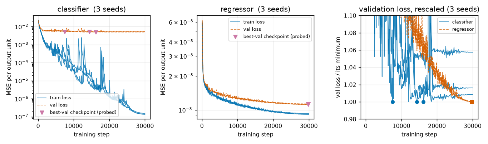
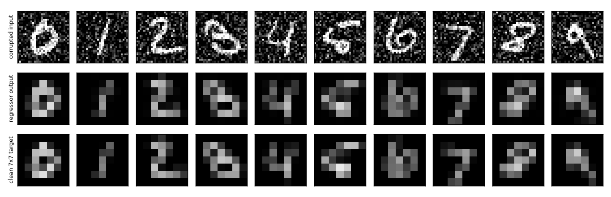
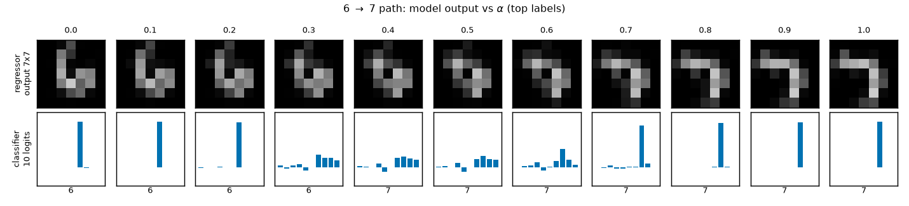
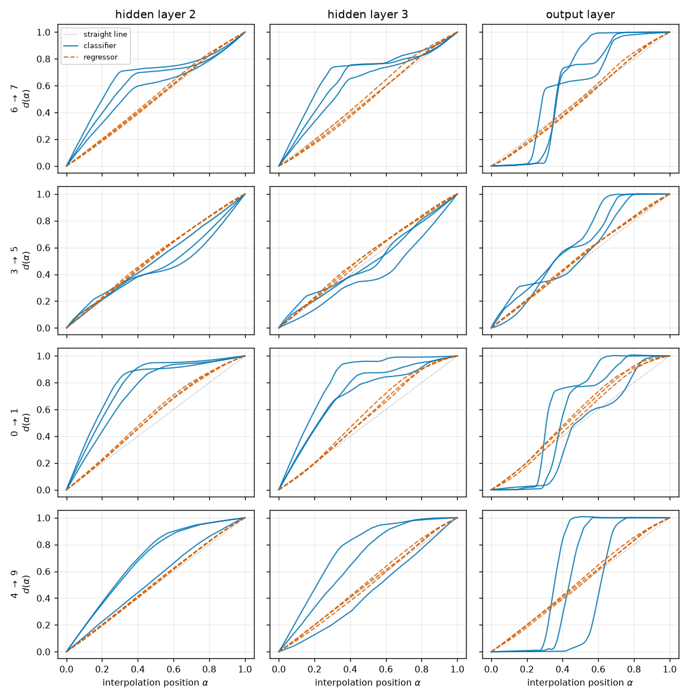
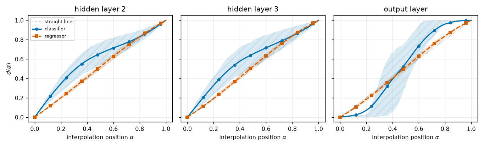
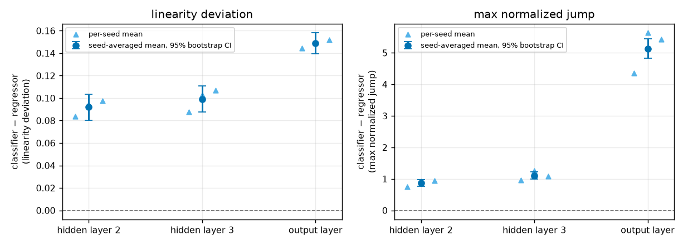
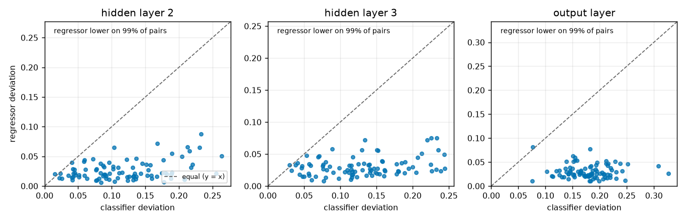
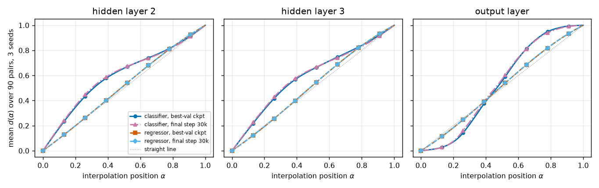

# Do continuous targets reduce activation plateaus?

A matched classifier-vs-regressor test on corrupted MNIST.

> Final, presentable, current-best only (no history — see CHANGELOG.md).

## Summary

Deep networks do not change their internal representation smoothly. If you take the hidden
activations of two real inputs and walk a path between them, the network's deeper layers tend to sit
still for a stretch, then lurch — an **activation plateau**. Plateaus matter for AI safety because a
model that snaps between internal states, rather than sliding between them, is a model whose
behaviour near a decision boundary is hard to predict, hard to probe, and hard to steer: a small
nudge to an input can leave everything unchanged nine times and flip the whole computation the tenth.

This report asks a simple mechanistic question: **are plateaus partly caused by the discreteness of
the training target?** Classification asks a network to emit one of ten one-hot vectors, a target
that is by construction piecewise constant in the input. Perhaps the network builds internal
piecewise-constant structure to match. We test this by training two networks that differ in *nothing*
except the target: same corrupted MNIST inputs, same architecture, same initial weights, same batch
order, same optimizer, same number of steps, same MSE loss. One predicts the digit label; the other
reconstructs the clean image, downsampled to 7x7 — a continuous target that varies smoothly with the
input.

**Every model is probed at its best-validation-loss checkpoint** (see Methods → *Checkpoint
selection*), so each network is measured at the point where it generalizes best rather than at an
arbitrary stopping step.

**The answer is a clear yes, and the effect is large.** Under the identical interpolation probe, the
regressor's activations move along an almost perfectly straight, even path, while the classifier's
plateau and lurch. Averaged over 90 fixed cross-digit test pairs and 3 seeds, the classifier's
departure from a straight transition is **4.3x** the regressor's at the last hidden layer
(0.130 vs 0.030; paired difference 0.099, 95% bootstrap CI [0.087, 0.111]) and **5.9x** at the output
layer. The regressor is smoother on **89 of 90 pairs at every layer** — there is essentially no
subset of digit transitions where discreteness fails to matter. A control shows the verdict does not
depend on this checkpoint choice: probing the final step-30,000 weights instead changes the numbers
by at most 6%.

The caveat that keeps this from being the whole story: the two hidden layers we measure are shared
architecture, and the regressor is *not* perfectly linear either — its deviation is small but nonzero
and grows slightly with depth. Continuous supervision strongly reduces plateaus in this setting; it
does not abolish them.

## Methods

### Data & model

**Dataset.** MNIST, pixels scaled to $[0,1]$, 60,000 training and 10,000 test images. Both models see
**bit-identical inputs**: the clean image plus one fixed draw of Gaussian noise with
$\sigma = 0.3$, clipped back to $[0,1]$ (drawn once under a fixed seed, so the corruption is the same
tensor for every model and every training seed). The corruption exists so that image reconstruction
is not a trivial identity map — the regressor has to denoise, which forces it to learn digit
structure rather than copy pixels.

Each image carries **two targets**, and the two models differ only in which one they are trained on:

- **classifier target** — the digit label as a 10-dimensional one-hot vector;
- **regressor target** — the **clean** (uncorrupted) image average-pooled from 28x28 to 7x7 by
  non-overlapping 4x4 mean pooling, flattened to 49 continuous values in $[0,1]$.

**Model.** A 4-layer ReLU multi-layer perceptron (MLP), $784 \to 200 \to 200 \to 200 \to n_{\text{out}}$,
with $n_{\text{out}} = 10$ (classifier) or $49$ (regressor). This reuses the MNIST plateau
configuration from the sibling direction `dir12_plateau_during_training`. No batch normalization, no
dropout. "Hidden layer $L$" always means the post-ReLU output of the $L$-th linear layer, so hidden
layers 1, 2 and 3 are all 200-dimensional; the "output layer" is the final linear layer's raw output
(10 logits or 49 predicted pixels).

**Matching.** For a given seed, the three shared layers are constructed before the head, so the
classifier and the regressor receive **bit-identical initial weights** in layers 1-3 (asserted at
runtime). Both use AdamW (learning rate $10^{-3}$, weight decay 0.01), batch size 200, 30,000 steps
(100 epochs over the 60k training set, reshuffled without replacement each epoch, same shuffle RNG
so the batch order is identical), cosine learning-rate decay to $10^{-6}$, and mean-squared-error
loss. Three seeds: 0, 1, 2.

**Splits.** Interpolation endpoints are drawn from the first 2,000 test images (matching dir12).
The validation split used for checkpoint selection and the training curves is test images
2,000-9,999, disjoint from the endpoint pool. Reported test accuracy / test MSE use all 10,000 test
images.

### Checkpoint selection

Which weights should the probe measure? Training to a fixed step count and probing the last
iterate mixes two things we want to keep separate: the effect of the *target type*, and the effect
of how far past its best-generalizing point each model happens to have run. The classifier here
drives its training loss to $\sim 10^{-7}$ (full memorization) and its validation loss turns up
again, while the regressor's validation loss is still flat-to-falling at step 30,000 — so the final
iterate is a *different kind* of solution for the two models.

**We therefore evaluate every interpolation at each model's best-validation-loss checkpoint.**
Validation loss (MSE against that model's own target on test images 2,000-9,999, disjoint from the
interpolation endpoint pool) is evaluated every 100 steps, and the weights at its minimum are saved
and used for every number and figure in this report:

```math
\theta^{\star} \;=\; \arg\min_{\theta_t,\; t \in \lbrace 0, 100, 200, \dots, 30000 \rbrace} \; \mathcal{L}_{\text{val}}(\theta_t)
```

The selected steps are **7,500 / 16,200 / 14,400** for the classifier (seeds 0/1/2) and **29,800**
for the regressor in all three seeds — i.e. the classifier is caught well before it memorizes, and
the regressor's best checkpoint is essentially its final one. This also means the comparison is not
a memorization artifact by construction: at $\theta^{\star}$ the classifier's training MSE is
$1.1\times10^{-4}$ / $3.6\times10^{-6}$ / $8.0\times10^{-6}$, not $10^{-7}$.

The final step-30,000 weights are kept only for a **checkpoint control** (Figure 8) that re-runs the
whole comparison on them, to show the verdict does not hinge on this choice.

### The probe: interpolating activations, not inputs

To ask whether a representation changes smoothly, we need a path between two real internal states.
Interpolating raw *pixels* would produce ghostly double-exposures that are nothing like real digits,
so instead we interpolate at the **first hidden layer** and let the network finish the computation.

For each fixed test-image pair $(x_a, x_b)$ we record the post-ReLU first-hidden activations
$h_1^a, h_1^b \in \mathbb{R}^{200}$ and build a 101-point spherical (SLERP) path between them —
spherical rather than straight because ReLU activations have very different norms, and a
great-circle direction with a linearly interpolated magnitude keeps every intermediate point at a
realistic scale. This is the frozen protocol from dir12, unchanged. With
$u = h/\lVert h \rVert$, $\theta = \arccos(u_a \cdot u_b)$, and $\alpha \in [0,1]$:

```math
h_1(\alpha) \;=\; \Big[\tfrac{\sin((1-\alpha)\theta)}{\sin\theta}\,u_a \;+\; \tfrac{\sin(\alpha\theta)}{\sin\theta}\,u_b\Big]\;\Big[(1-\alpha)\lVert h_1^a\rVert + \alpha\lVert h_1^b\rVert\Big]
```

Each $h_1(\alpha)$ is then pushed through the remaining layers to give $h_2(\alpha)$, $h_3(\alpha)$
and the output $y(\alpha)$. Identical pairs, identical $\alpha$ grid, identical code for both models.

**Pair set.** 90 fixed cross-digit test pairs: two independent image pairs for each of the 45
unordered digit pairs $(a,b)$, $a<b$. Replica 0 of each digit pair is exactly dir12's pair (the
rank-$b$ image of class $a$ with the rank-$a$ image of class $b$, ranks in test order within the
first 2,000 test images), so the hand-selected transitions carried over for visual comparison —
including $6 \rightarrow 7$ — are the same images used there; replica 1 shifts both ranks by 12. The
list is frozen across models and seeds.

### Metrics

We want a number that says "did the representation slide, or did it sit and then jump?". The natural
first step is to ask how far along the transition the representation has travelled at each point on
the path.

**relative distance $d_\ell(\alpha)$** — for layer $\ell$, how far the activation has moved from its
$\alpha=0$ endpoint, as a fraction of the total endpoint-to-endpoint distance. It is 0 at the start
and 1 at the end by construction, and a representation that changes at a constant rate traces
$d_\ell(\alpha)=\alpha$. Reading it: a **flat stretch means a plateau** (the representation is not
moving even though the input activation is), and a steep stretch means a lurch.

```math
d_\ell(\alpha) \;=\; \frac{\lVert h_\ell(\alpha) - h_\ell(0)\rVert_2}{\lVert h_\ell(1) - h_\ell(0)\rVert_2}
```

This is the curve plotted in Figures 4, 5 and 8. We also compute dir12's variant
$d^{\text{frac}}_\ell(\alpha) = \lVert h_\ell(\alpha)-h_\ell(0)\rVert / (\lVert h_\ell(\alpha)-h_\ell(0)\rVert + \lVert h_\ell(\alpha)-h_\ell(1)\rVert)$,
which normalizes by the path rather than the chord, purely as a robustness check that the verdict
does not depend on the normalization choice.

To compare 90 pairs x 3 seeds x 2 models we need one scalar per curve. The plan's main comparison is
how far the whole curve sits from the constant-rate line:

**linearity deviation** — the mean absolute gap between the observed curve and the straight
transition, averaged over the 101 $\alpha$ values. Lower is better (smoother). 0 means a perfectly
even transition; a curve that sits at 0 for half the path and at 1 for the other half scores 0.25.

```math
\mathrm{LD}_\ell \;=\; \frac{1}{101}\sum_{\alpha} \big| d_\ell(\alpha) - \alpha \big|
```

Linearity deviation alone cannot distinguish "smooth but curved" from "flat then cliff", and it is the
cliff that is the plateau signature, so we add one complementary scalar:

**max normalized jump** — the largest single-step change in $d_\ell$ along the path, rescaled so that
a perfectly even transition scores exactly 1. Reading it: 1 = constant rate, 5 = somewhere on the
path the representation covers five times its fair share of the distance in one $\alpha$ step of
size $1/100$.

```math
\mathrm{MJ}_\ell \;=\; 100 \cdot \max_{i} \big| d_\ell(\alpha_{i+1}) - d_\ell(\alpha_i) \big|
```

Both scalars are reported as the **paired difference** classifier $-$ regressor, computed pair by
pair on the same images (so pair difficulty cancels), averaged over the 3 seeds, with a
**95% percentile bootstrap confidence interval** over the 90 pairs (10,000 resamples of the pair
index). A CI excluding 0 means the difference is not attributable to which pairs we happened to
choose. These feed Figures 6 and 7.

### Baselines

**straight transition** — the reference every $d_\ell(\alpha)$ curve is scored against: a
representation that moves at a constant rate along the path, $d_\ell(\alpha) = \alpha$, i.e.
$\mathrm{LD} = 0$ and $\mathrm{MJ} = 1$. Shown as a dotted line in every $d(\alpha)$ figure.

Two baselines establish that the regressor actually solved its task rather than learning a shortcut
(a degenerate regressor would trivially be "smooth"):

**mean-target predictor** — always output the average training target, ignoring the input. Its test
MSE is the variance of the target and is what any informative model must beat:

```math
\mathrm{MSE}_{\text{mean}} \;=\; \frac{1}{49N}\sum_{i=1}^{N}\big\lVert \bar{t} - t_i \big\rVert_2^2, \qquad \bar{t} = \frac{1}{N_{\text{train}}}\sum_j t_j
```

**pooled-corrupted-input predictor** — output the *corrupted input* pooled to 7x7, i.e. do no
denoising at all. Beating this proves the network removes noise rather than passing pixels through:

```math
\mathrm{MSE}_{\text{pool}} \;=\; \frac{1}{49N}\sum_{i=1}^{N}\big\lVert \mathrm{pool}_{7\times7}(\tilde{x}_i) - t_i \big\rVert_2^2
```

where $\tilde{x}_i$ is the corrupted input and $t_i$ the clean pooled target.

**classifier accuracy reference** — dir12's matched 60k-MNIST MSE classifier (same architecture, same
optimizer, same 30,000 steps) reached 97.9-98.1% on test images 0-1,999 with *clean* inputs. Our
classifier is trained and evaluated on $\sigma=0.3$ corrupted inputs, so it should land somewhat
below that; we quote accuracy on the same 2,000-image pool for the like-for-like comparison and on
all 10,000 test images as the headline number.

**final-checkpoint control** — the identical comparison with both models probed at step 30,000
instead of at $\theta^{\star}$. This is the sensitivity check on the checkpoint rule above: if
picking the best-validation-loss weights were doing the work, the two versions would disagree.
Consumed by Figure 8.

## Results

### Both models trained adequately

Before comparing smoothness we have to rule out the boring explanation that one model simply failed
to learn. Figure 1 shows the loss curves for both models and all three seeds, and marks the
best-validation-loss checkpoint that everything downstream is measured at.



**Figure 1.** Training adequacy and checkpoint selection, 3 seeds per panel. x: training step
(0-30,000). y (left, middle): mean-squared error per output unit, log scale — solid = training loss
(measured on a fixed 10,000-image training subset), dashed = validation loss (test images
2,000-9,999); the down-triangle marks the validation minimum, i.e. the checkpoint the probe uses.
y (right): each model's validation loss divided by its own minimum, linear scale, so the
minimum-then-rise is visible; circles = classifier minima, square = regressor minimum. The
classifier drives training loss to $\sim 1.4\times10^{-7}$ (full memorization) while validation loss
bottoms out at step 7,500-16,200 and then rises 0.8-5.7% — the mild overfitting the plan asks for.
The regressor's validation loss falls monotonically to a flat floor (minimum at step 29,800, i.e.
its best checkpoint is essentially its final one): it converges but does not overfit, an asymmetry
discussed under Limitations.

At its selected checkpoint the classifier reaches test accuracy 96.34 / 96.39 / 96.37% (seeds 0/1/2)
on the full 10,000-image test set. On dir12's 2,000-image pool, the like-for-like comparison, ours
scores 95.00 / 94.50 / 94.65% against dir12's 97.9-98.1% with clean inputs — a 3.0-3.5 point gap that
is the expected cost of the $\sigma=0.3$ input corruption, not a training failure. The regressor
reaches a test MSE of 0.001117 (mean over seeds), which is **26.0x better** than the mean-target
predictor (0.02907) and **11.6x better** than pooling the corrupted input (0.01292). It is doing real
denoising, not memorizing an average and not copying pixels. Figure 2 confirms this visually.



**Figure 2.** The regressor solves its task. Columns: the first test image of each digit 0-9. Top
row: the corrupted 28x28 input the model actually sees ($\sigma=0.3$ Gaussian noise, clipped). Middle
row: the model's 49-value output reshaped to 7x7 (seed 0, best-validation checkpoint). Bottom row:
the clean 7x7 target. All panels use the same grayscale range $[0,1]$. Outputs are visibly denoised
and preserve digit shape, matching the targets closely.

### The qualitative picture: morphing versus snapping

The clearest way to see what the two objectives do is to look at what each model *outputs* while we
walk the same activation path. Figure 3 does exactly that for the $6 \rightarrow 7$ transition.



**Figure 3.** The same interpolation path, seen through each model's output (seed 0, pair
$6 \rightarrow 7$, replica 0, both at their best-validation checkpoint). Columns are 11 evenly spaced
positions on the path; the number above each column is $\alpha$. Top row: the regressor's 49-value
output as a 7x7 image, grayscale $[0,1]$ — the 6 continuously deforms into a 7, with genuinely
intermediate shapes in the middle. Bottom row: the classifier's 10 raw logits as a bar chart
(x: digit class 0-9, y: logit value, fixed range $[-0.4, 1.2]$); the digit below each panel is the
arg-max prediction. The classifier holds a confident "6" through the first part of the path,
collapses into a low-confidence smear across the middle, and snaps to a confident "7" near the end —
flat regions separated by jumps, the plateau signature. Note the regressor's outputs stay image-like
everywhere on the path, whereas the classifier's collapse to near-uniform logits in the middle.

### Every transition, every layer: the regressor is smoother

Figure 4 shows the underlying $d(\alpha)$ curves for four hand-selected transitions carried over from
prior work, so the aggregate below can be checked against individual cases rather than taken on
trust.



**Figure 4.** Relative distance $d(\alpha)$ on four hand-selected transitions; all three seeds are
drawn, so three lines per model per panel. Rows: the transitions $6\to7$, $3\to5$, $0\to1$, $4\to9$
(replica 0 of each). Columns: hidden layer 2, hidden layer 3, output layer. x: interpolation
position $\alpha$; y: $d(\alpha)$ as defined in Methods. Solid = classifier, dashed = regressor,
dotted = the straight-transition baseline $d=\alpha$. The regressor (dashed) tracks the straight line
closely in every panel. The classifier (solid) shows the plateau-and-cliff shape most sharply at the
output layer — for $6\to7$ and $4\to9$ it is nearly flat until $\alpha\approx0.3$-$0.5$, then rises
almost vertically. Seed-to-seed variation shifts *where* the cliff falls but not whether there is
one.

Aggregating those curves over the full 90-pair set gives Figure 5.



**Figure 5.** The average transition shape over all 90 pairs and 3 seeds. x: interpolation position
$\alpha$; y: $d(\alpha)$. Circles/solid = classifier, squares/dashed = regressor, dotted = straight
transition; shaded bands (hatched `//` classifier, `\\` regressor) are the interquartile range across
all 270 pair-seed curves. The regressor's mean curve is nearly indistinguishable from the straight
line at every layer, with a narrow band. The classifier bows well above the line in the hidden layers
and, at the output layer, shows the classic S-shape: flat until $\alpha\approx0.25$, a steep rise
across the middle, then flat again — averaged plateaus, with a wide band because the cliff position
varies by pair.

The headline numbers are the paired differences in Figure 6 and the table below.



**Figure 6.** Paired difference (classifier $-$ regressor) for both scalars, per layer. x: layer
(hidden 2, hidden 3, output). y: the difference in linearity deviation (left) and in max normalized
jump (right); positive means the classifier is less smooth. Circles with error bars are the
seed-averaged mean over 90 pairs with a 95% percentile bootstrap CI (10,000 resamples over pairs);
small triangles are the three individual seed means. The dashed line at 0 is "no difference". Every
interval sits far above 0, and the three seeds cluster tightly — the effect is not seed-specific.

| layer | LD classifier | LD regressor | paired diff [95% CI] | ratio | pairs where regressor is smoother |
|---|---|---|---|---|---|
| hidden 2 | 0.1182 | 0.0263 | **0.0918** [0.0804, 0.1036] | 4.5x | 89 / 90 |
| hidden 3 | 0.1295 | 0.0304 | **0.0990** [0.0874, 0.1107] | 4.3x | 89 / 90 |
| output   | 0.1792 | 0.0304 | **0.1487** [0.1395, 0.1580] | 5.9x | 89 / 90 |

| layer | MJ classifier | MJ regressor | paired diff [95% CI] | ratio |
|---|---|---|---|---|
| hidden 2 | 2.01 | 1.14 | **0.87** [0.77, 0.97] | 1.8x |
| hidden 3 | 2.31 | 1.21 | **1.11** [0.99, 1.23] | 1.9x |
| output   | 6.35 | 1.21 | **5.13** [4.82, 5.45] | 5.2x |

Read the max-jump row for the output layer literally: at its steepest point the classifier's output
covers **6.3x** its fair share of the transition in a single 1/100 step of $\alpha$, while the
regressor covers 1.2x — barely more than a constant-rate walk. Under the alternative
$d^{\text{frac}}$ normalization the verdict is unchanged (hidden 3: 0.0923 vs 0.0238, paired
difference 0.0685, CI [0.0621, 0.0754]), so nothing here is an artifact of how we normalized the
distance.

An aggregate can hide a bimodal population, so Figure 7 checks whether the gap is a property of every
transition or an average over a few extreme ones.



**Figure 7.** Per-pair check, one point per digit-pair (90 points, each averaged over the 3 seeds).
x: classifier linearity deviation; y: regressor linearity deviation, on the same scale. Dashed line
is $y = x$ (equal smoothness); points below it are pairs where the regressor is smoother. 89 of 90
points lie below the diagonal at all three layers, and the regressor's spread is much tighter — the
effect is essentially universal across digit transitions, not driven by a subset. The hardest
classifier pairs (rightmost points, deviation $>0.25$) are not the regressor's hardest pairs.

### Control: the verdict does not depend on which checkpoint we probe

The result above measures each model where it generalizes best. Would we conclude the same thing
from the final step-30,000 weights — where the classifier has memorized its training set and the
regressor has not? Figure 8 re-runs the whole comparison on those weights.



**Figure 8.** Checkpoint sensitivity. x: interpolation position $\alpha$; y: mean $d(\alpha)$ over
90 pairs and 3 seeds. Circles/solid = classifier at its best-validation checkpoint (the reported
result); up-triangles/dash-dot = classifier at step 30,000; squares/dashed = regressor at its
best-validation checkpoint; diamonds/dash-dot-dot = regressor at step 30,000; dotted = straight
transition. Each model's two curves lie almost on top of each other, and the classifier pair stays
far from the regressor pair at every layer. Numerically, the classifier's linearity deviation is
0.118 / 0.129 / 0.179 at hidden 2 / hidden 3 / output at $\theta^{\star}$ versus 0.125 / 0.135 /
0.180 at step 30,000 — at most 6% higher when overtrained — while the regressor's is 0.0263 / 0.0304 /
0.0304 either way (its best checkpoint is step 29,800). Probing the final weights instead gives
paired differences of 0.099 [0.087, 0.112], 0.104 [0.093, 0.116] and 0.150 [0.140, 0.159], the same
verdict. So the smoothness gap is a target-type effect: neither the checkpoint rule nor the
classifier's memorization creates it.

## Conclusion

**Verdict: positive, and large.** Holding architecture, initialization, data, batch order, optimizer,
step count and loss function fixed, swapping a discrete 10-way label target for a continuous 49-value
image-reconstruction target makes the network's internal representation change roughly **4-6x more
smoothly** under the standard activation-interpolation probe, with each model measured at its
best-validation-loss checkpoint. The gap is significant at every layer (all bootstrap CIs exclude 0
by a wide margin), consistent across 3 seeds, present on **89 of the 90 digit transitions**, robust
to the choice of distance normalization, and unchanged if the final step-30,000 weights are probed
instead. Qualitatively (Figure 3) the regressor morphs a 6 into a 7 while the classifier snaps
between confident digits.

For the broader plateau question this is evidence that **plateaus are substantially a property of
what we ask the network to output, not only of depth and ReLU geometry**. If plateaus were purely
architectural, two networks sharing three identical layers and identical initial weights should
plateau alike; they do not. A practical reading: representations trained with information-preserving,
continuous objectives (reconstruction, prediction of continuous quantities) should be easier to probe
and interpolate than representations trained with hard categorical objectives — which is relevant
when choosing which model's internals to trust for interpretability or steering work.

**Limitations.**

1. *Not abolished, only reduced.* The regressor's linearity deviation is small but nonzero
   (0.026 -> 0.030 -> 0.030 across layers) and grows slightly with depth, and its max normalized
   jump is 1.14-1.21 rather than 1.0. Shared architectural compression plausibly contributes a
   residual effect that continuous supervision does not remove.
2. *Asymmetric training regime.* Matching step count exactly (the more important control) means the
   two models sit at different points of their own trajectories: the classifier's best-validation
   checkpoint arrives at step 7,500-16,200, the regressor's at 29,800, and the regressor's validation
   loss never turns up at all, so the plan's mild-overfitting adequacy criterion is met by the
   classifier only. Selecting each model's best-validation checkpoint (Methods) is what makes the
   comparison as fair as it can be under a matched budget; the untested opposite direction — training
   the regressor until it overfits — would need many more steps or less data.
3. *Different output dimensionality.* The output-layer comparison puts a 10-d logit vector against a
   49-d pixel vector, which is not a like-for-like space. The hidden-layer-2 and -3 comparisons are
   immune to this (both 200-d, same architecture, same initial weights) and show the same effect at
   4.3-4.5x, so the conclusion does not rest on the output layer.
4. *Off-manifold path.* The endpoints are activations of real test images, but nothing guarantees the
   interpolated points correspond to any real input. This experiment asks whether continuous
   supervision changes behaviour under a fixed probe; it does not establish that every intermediate
   activation is on the data manifold.
5. *One architecture, one dataset.* A 4-layer MLP on corrupted MNIST. Whether the same holds for
   convolutional networks, transformers, or larger label spaces is untested here.
