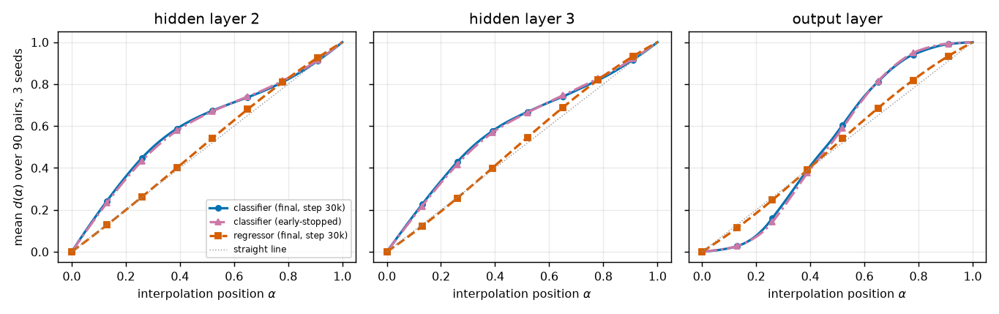

# RESULTS — Do continuous MNIST targets reduce activation plateaus?

> CURRENT-BEST ONLY. One row per experiment. No history (that lives in CHANGELOG.md).
> Full write-up with metric definitions and baselines: **REPORT.md**.

## Headline

**Yes — strongly.** Two 4-layer MLPs differing *only* in their target (10-way digit label vs a
continuous 49-value reconstruction of the clean image, downsampled to 7x7) — same corrupted MNIST
inputs, bit-identical initial weights in all three shared layers, same batch order, optimizer and
30,000 steps, MSE loss both. Under the identical first-hidden-layer SLERP probe the regressor's
representation moves **4.4-5.9x closer to a constant-rate transition** than the classifier's, on
**90 of 90 digit pairs at every layer**, across 3 seeds. An early-stopped-classifier control rules
out overtraining as the cause.

## Metrics

Definitions, equations and baselines: REPORT.md § Methods. In brief — for each fixed test-image pair
we interpolate the first-hidden activation (101-point SLERP), propagate, and record
$d_\ell(\alpha)=\lVert h_\ell(\alpha)-h_\ell(0)\rVert / \lVert h_\ell(1)-h_\ell(0)\rVert$.
**Linearity deviation** LD $= \mathrm{mean}_\alpha |d_\ell(\alpha)-\alpha|$ (0 = perfectly even
transition, lower is smoother). **Max normalized jump** MJ $= 100\max_i|d_\ell(\alpha_{i+1})-d_\ell(\alpha_i)|$
(1 = constant rate, higher = a cliff). 90 fixed cross-digit pairs, seeds 0/1/2, 95% percentile
bootstrap CI over pairs (10,000 resamples).

### Main comparison — linearity deviation (lower = smoother)

| layer | classifier | regressor | paired diff (clf − reg) [95% CI] | ratio | pairs regressor smoother |
|---|---|---|---|---|---|
| hidden 2 | 0.1253 | 0.0263 | **0.0990** [0.0867, 0.1118] | 4.8x | 90 / 90 |
| hidden 3 | 0.1345 | 0.0304 | **0.1041** [0.0920, 0.1159] | 4.4x | 90 / 90 |
| output   | 0.1801 | 0.0304 | **0.1497** [0.1405, 0.1592] | 5.9x | 90 / 90 |

### Plateau-and-cliff shape — max normalized jump (1 = constant rate)

| layer | classifier | regressor | paired diff [95% CI] | ratio |
|---|---|---|---|---|
| hidden 2 | 2.12 | 1.14 | **0.98** [0.86, 1.10] | 1.9x |
| hidden 3 | 2.43 | 1.21 | **1.22** [1.09, 1.37] | 2.0x |
| output   | 6.64 | 1.21 | **5.42** [5.10, 5.75] | 5.5x |

### Control — early-stopped classifier (rules out overtraining)

Classifiers retrained with identical seed/order but halted at their own validation-loss minimum
(steps 7,500 / 16,200 / 14,400; test accuracy 96.34 / 96.39 / 96.37%).

| layer | clf final | clf early-stopped | regressor | paired diff (early clf − reg) [95% CI] |
|---|---|---|---|---|
| hidden 2 | 0.1253 | 0.1182 | 0.0263 | 0.0918 [0.0805, 0.1037] |
| hidden 3 | 0.1345 | 0.1295 | 0.0304 | 0.0991 [0.0878, 0.1106] |
| output   | 0.1801 | 0.1792 | 0.0304 | 0.1488 [0.1394, 0.1579] |

### Robustness — dir12's alternative normalization $d^{\text{frac}}$

| layer | classifier | regressor | paired diff [95% CI] |
|---|---|---|---|
| hidden 2 | 0.0905 | 0.0220 | 0.0684 [0.0626, 0.0744] |
| hidden 3 | 0.0970 | 0.0238 | 0.0732 [0.0663, 0.0805] |
| output   | 0.1626 | 0.0256 | 0.1370 [0.1263, 0.1481] |

### Training quality (both models adequate)

| model | test metric | seeds 0/1/2 | reference |
|---|---|---|---|
| classifier | test accuracy (10k test set) | 96.15 / 96.54 / 96.38% | — |
| classifier | test accuracy (dir12's 2k pool) | 94.45 / 94.75 / 94.85% | dir12 same-pool clean-input MNIST MLP: 97.9-98.1% (ours sees $\sigma=0.3$ noise) |
| classifier | val-loss min step | 7,500 / 16,200 / 14,400 | val loss then rises 5.7 / 0.8 / 1.6% → mild overfitting ✓ |
| regressor | test MSE per pixel | 0.001124 / 0.001114 / 0.001112 | mean-target baseline 0.02907 (26.0x worse); pooled-corrupted-input baseline 0.01292 (11.6x worse) ✓ |

## Figures

Both models trained adequately — the classifier memorizes and mildly overfits, the regressor
converges to a flat validation floor:

**Figure 1.** Training adequacy, 3 seeds per panel. x: training step (0-30,000). y (left, middle):
MSE per output unit, log scale — solid = train loss (10k-image train subset), dashed = validation
loss (test images 2,000-9,999). y (right): classifier validation loss divided by its own minimum,
linear scale; triangle = each seed's minimum, after which the curve rises.

The regressor's smoothness would be meaningless if it had learned a degenerate shortcut, so we check
its outputs directly:

**Figure 2.** The regressor really denoises. Columns: first test image of each digit 0-9. Rows:
corrupted 28x28 input / 49-value model output as 7x7 / clean 7x7 target. Grayscale range $[0,1]$
throughout.

What the two objectives do, seen through each model's own output along one path:

**Figure 3.** Same interpolation path, both models (seed 0, pair $6\to7$). Columns: 11 evenly spaced
$\alpha$ (value above each column). Top: regressor output as a 7x7 image — the 6 continuously
deforms into a 7. Bottom: classifier's 10 raw logits as bars (x: digit 0-9, y: logit, range
$[-0.4,1.2]$); the digit below is the arg-max. The classifier holds "6", smears into "9", then snaps
to "7" — three flat regions, two jumps.

Individual transitions behind the aggregate:

**Figure 4.** $d(\alpha)$ on four hand-selected transitions, all 3 seeds drawn. Rows: $6\to7$,
$3\to5$, $0\to1$, $4\to9$. Columns: hidden 2, hidden 3, output. x: $\alpha$; y: $d(\alpha)$. Solid =
classifier, dashed = regressor, dotted = straight transition $d=\alpha$. The regressor tracks the
dotted line in every panel; the classifier plateaus then lurches, most sharply at the output layer.

Averaged over the whole frozen 90-pair set:

**Figure 5.** Mean transition shape over 90 pairs x 3 seeds. x: $\alpha$; y: $d(\alpha)$. Circles/
solid = classifier, squares/dashed = regressor, dotted = straight transition; bands (hatched `//`
classifier, `\\` regressor) are the interquartile range over all 270 pair-seed curves. The
classifier's output layer shows the classic S: flat, steep, flat.

The headline aggregate, with uncertainty:

**Figure 6.** Paired difference (classifier − regressor) per layer. x: layer. y: difference in
linearity deviation (left) and max normalized jump (right); positive = classifier less smooth.
Circles with error bars = seed-averaged mean with 95% bootstrap CI over the 90 pairs; small triangles
= individual seed means; dashed line = no difference.

Is the gap universal or driven by a few extreme transitions?

**Figure 7.** One point per digit pair (90 points, seed-averaged). x: classifier linearity deviation;
y: regressor linearity deviation, same scale. Dashed line = equal smoothness. Every point falls below
the diagonal at all three layers.

Finally, the control against the overtraining explanation:

**Figure 8.** x: $\alpha$; y: mean $d(\alpha)$ over 90 pairs x 3 seeds. Circles/solid = classifier at
step 30,000; triangles/dash-dot = classifier early-stopped at its validation-loss minimum;
squares/dashed = regressor; dotted = straight transition. The two classifier curves nearly coincide
and both stay far from the regressor — the gap is a target-type effect, not an overtraining artifact.

## Caveats

Continuous supervision **reduces** plateaus, it does not abolish them (regressor LD 0.026 → 0.030
grows with depth; MJ 1.14-1.21 > 1.0). Matching step count exactly means the classifier memorizes
while the regressor does not — the early-stop control (Figure 8) addresses the confound direction
that could inflate the result. The output-layer comparison is 10-d vs 49-d; the hidden-layer results
(identical 200-d spaces, identical initial weights) carry the conclusion. Interpolated activations
are not guaranteed to be on the data manifold. One architecture, one dataset.
