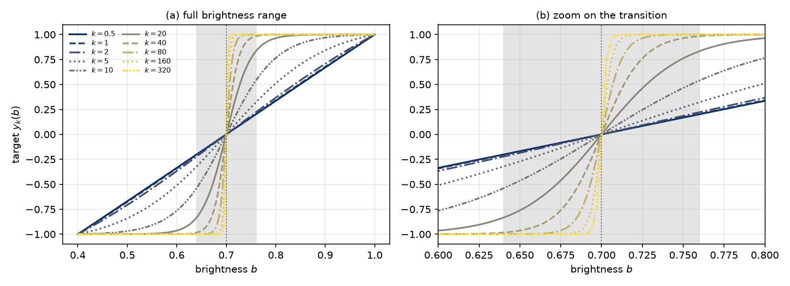
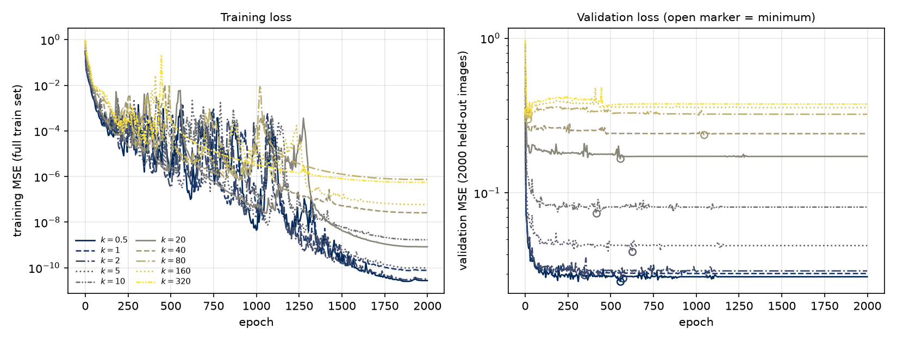
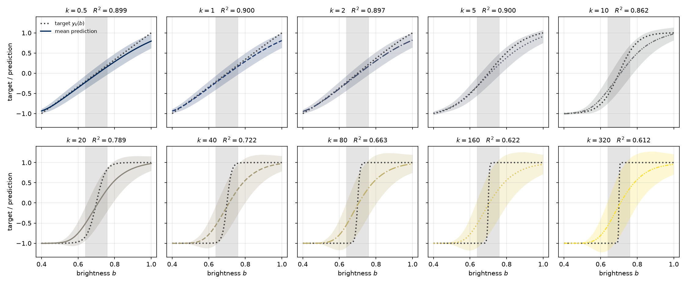
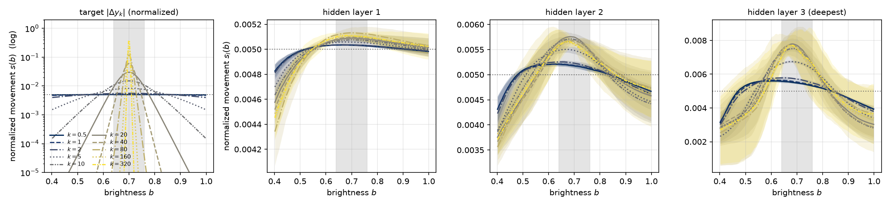
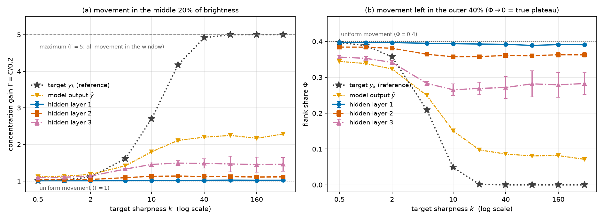
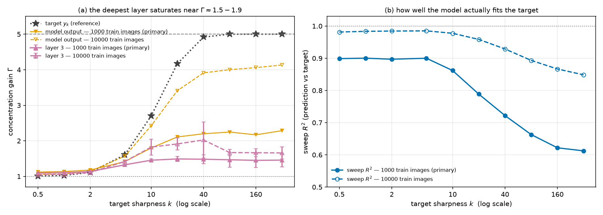
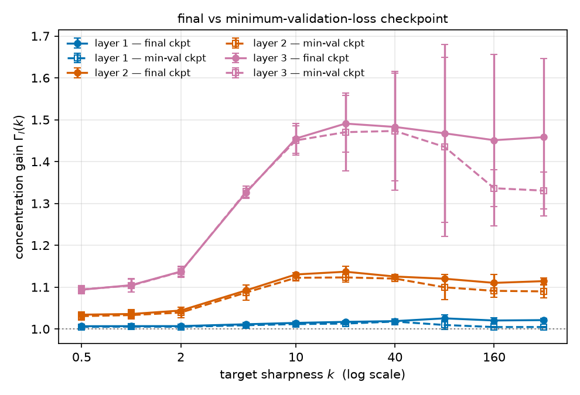
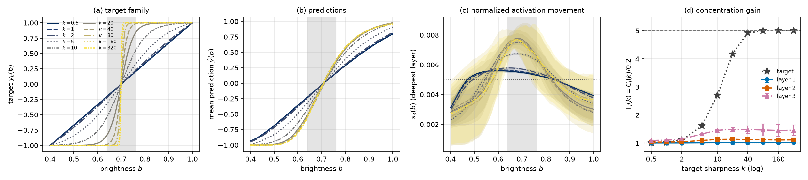

# RESULTS — Can a switch-like *continuous* target create activation plateaus?

> CURRENT-BEST ONLY. One row per experiment. No history, no superseded/weaker variants
> (those live in CHANGELOG.md). Full write-up: [REPORT.md](REPORT.md).

## Headline

**No — target sharpness alone is not sufficient.** We morph a continuous MNIST brightness-regression
target from a straight line ($k=0.5$) all the way to a **step function** ($k=320$), holding inputs,
architecture, loss and schedule fixed. Activation movement does concentrate near the target's transition
— monotonically in $k$, more strongly in deeper layers, consistently across 3 seeds — but it **saturates
early and far below the target**. Past $k=20$ the deepest hidden layer stops responding entirely, even
as the target sharpens a further 16-fold to a literal step. The decisive control: with 10x training data
at $k=320$ the network's **output** is 78% of the way from uniform to a perfect switch, while its
**deepest hidden layer** is only 16% of the way. A network can compute an almost-discrete function
through a representation that still slides smoothly.

## Setup and metrics

**Setup.** 4-layer ReLU MLP ($784 \to 200 \to 200 \to 200 \to 1$); MNIST images $L_2$-normalized then
scaled to brightness $b \sim U(0.4,1)$; target $y_k(b) = \tanh(k(b-b_0))/\tanh(0.3k)$ with $b_0 = 0.7$;
MSE, AdamW, 10k steps with cosine decay — identical for every $k$. Probe: 100 digit-balanced held-out
**test** images x 201 brightness values, post-ReLU hidden layers 1–3, 3 seeds.

**Scores** (equations in [REPORT.md](REPORT.md) § Methods):

- **$\Gamma_l(k)$ — concentration gain.** Share of layer $l$'s total activation movement falling in the
  central 20% of the brightness range, divided by $0.2$. **$1.0$ = perfectly uniform, $5.0$ = maximum
  (all movement inside the window); higher = more plateau-like.**
- **$\Phi_l(k)$ — flank share.** Share of movement left in the outer 40% of the range. **$0.4$ = uniform,
  $0$ = perfect plateau; lower = more plateau-like.** $\Gamma$ alone cannot tell "a bump grew in the
  middle" from "the ends went quiet"; $\Phi$ can.
- **sweep $R^2$** — goodness of fit of prediction to target on held-out images. A validity check, not a
  result. ($R^2$ in this report *only* ever means goodness of fit; the concentration score is written
  $\Gamma$, not $R$, to avoid exactly that collision.)

## Primary result — 1000 training images (passes the pre-registered training-adequacy gate)

Final checkpoint; mean over 100 held-out images and 3 seeds; $\pm$ = 95% CI across seeds.

**Table 1 — concentration gain $\Gamma$** (1.0 = uniform, 5.0 = maximum).

| $k$ | target curve | model output | hidden layer 1 | hidden layer 2 | hidden layer 3 (deepest) |
|---:|---:|---:|---:|---:|---:|
| 0.5 | 1.01 | 1.12 | 1.007 ± 0.001 | 1.034 ± 0.006 | 1.094 ± 0.010 |
| 1   | 1.03 | 1.14 | 1.007 ± 0.001 | 1.036 ± 0.010 | 1.105 ± 0.016 |
| 2   | 1.11 | 1.18 | 1.007 ± 0.001 | 1.044 ± 0.007 | 1.137 ± 0.011 |
| 5   | 1.61 | 1.42 | 1.011 ± 0.003 | 1.092 ± 0.013 | 1.326 ± 0.015 |
| 10  | 2.70 | 1.80 | 1.014 ± 0.003 | 1.130 ± 0.004 | 1.455 ± 0.036 |
| 20  | 4.17 | 2.11 | 1.017 ± 0.003 | 1.137 ± 0.013 | 1.491 ± 0.068 |
| 40  | 4.92 | 2.20 | 1.019 ± 0.003 | 1.125 ± 0.005 | 1.483 ± 0.128 |
| 80  | 5.00 | 2.25 | 1.025 ± 0.008 | 1.120 ± 0.001 | 1.468 ± 0.212 |
| 160 | 5.00 | 2.17 | 1.020 ± 0.007 | 1.110 ± 0.019 | 1.451 ± 0.205 |
| 320 | 5.00 | 2.29 | 1.021 ± 0.004 | 1.114 ± 0.008 | 1.458 ± 0.189 |

**Table 2 — flank share $\Phi$** (0.4 = uniform, 0 = perfect plateau; lower is more plateau-like).

| $k$ | target curve | model output | hidden layer 1 | hidden layer 2 | hidden layer 3 (deepest) |
|---:|---:|---:|---:|---:|---:|
| 0.5 | 0.397 | 0.344 | 0.397 | 0.384 | 0.356 ± 0.004 |
| 1   | 0.389 | 0.339 | 0.397 | 0.384 | 0.353 ± 0.005 |
| 2   | 0.357 | 0.323 | 0.397 | 0.381 | 0.342 ± 0.005 |
| 5   | 0.209 | 0.249 | 0.395 | 0.364 | 0.283 ± 0.005 |
| 10  | 0.048 | 0.151 | 0.394 | 0.357 | 0.265 ± 0.016 |
| 20  | 0.002 | 0.098 | 0.393 | 0.358 | 0.269 ± 0.018 |
| 40  | 0.000 | 0.086 | 0.392 | 0.361 | 0.272 ± 0.031 |
| 80  | 0.000 | 0.081 | 0.389 | 0.360 | 0.282 ± 0.036 |
| 160 | 0.000 | 0.082 | 0.391 | 0.363 | 0.279 ± 0.034 |
| 320 | 0.000 | 0.071 | 0.391 | 0.363 | 0.283 ± 0.030 |

**Table 3 — fit and training diagnostics** (mean over 3 seeds). $\rho_{\mathrm{val}}$ = final validation
loss divided by its minimum; the pre-registered gate is $\le 1.2$.

| $k$ | sweep $R^2$ | final validation MSE | $\rho_{\mathrm{val}}$ | val-min epoch (of 2000) |
|---:|---:|---:|---:|---:|
| 0.5 | 0.899 | 0.031 | 1.058 | 547 |
| 1   | 0.900 | 0.031 | 1.058 | 648 |
| 2   | 0.897 | 0.034 | 1.056 | 583 |
| 5   | 0.900 | 0.048 | 1.079 | 663 |
| 10  | 0.862 | 0.088 | 1.064 | 548 |
| 20  | 0.789 | 0.174 | 1.040 | 438 |
| 40  | 0.722 | 0.251 | 1.041 | 1050 |
| 80  | 0.663 | 0.311 | 1.048 | 340 |
| 160 | 0.622 | 0.343 | 1.062 | 15 |
| 320 | 0.612 | 0.369 | 1.094 | 15 |

All 30 runs (10 values of $k$ x 3 seeds) pass the gate: validation minimum before the last epoch, final
validation loss 1.7–10.9% above it, training loss ending within 0.1% of its own minimum. Caveat: at
$k=160$ and $k=320$ the validation minimum arrives at epoch 15, because those targets are essentially
unlearnable in detail from 1000 images — the numeric gate holds but the minimum-validation checkpoint
there is a barely-trained network. Spread across the 100 probe *images* is much larger than across seeds
and grows with $k$: image-level SD of $\Gamma_3$ is $0.036$ at $k=0.5$ and $0.507$ at $k=320$.

## Decisive control — same grid, 10x more training data

Necessary because the primary grid under-fits the step ($R^2 = 0.61$ at $k=320$), which would otherwise
confound "the representation doesn't plateau" with "the function was never learned". With 10,000 images
the network **does** learn the step at its output — and the representation still does not plateau.
(This grid is *secondary* because it shows essentially no validation overfitting,
$\rho_{\mathrm{val}} \approx 1.005$, so it fails the adequacy gate in spirit.)

**Table 4 — 10,000-image grid**, final checkpoint, same averaging as above.

| $k$ | $\Gamma$ target | $\Gamma$ model output | $\Gamma$ hidden layer 3 | $\Phi$ model output | $\Phi$ hidden layer 3 | sweep $R^2$ |
|---:|---:|---:|---:|---:|---:|---:|
| 0.5 | 1.01 | 1.06 | 1.045 ± 0.004 | 0.370 | 0.377 | 0.981 |
| 1   | 1.03 | 1.07 | 1.055 ± 0.001 | 0.365 | 0.372 | 0.984 |
| 2   | 1.11 | 1.14 | 1.109 ± 0.002 | 0.337 | 0.353 | 0.985 |
| 5   | 1.61 | 1.57 | 1.419 ± 0.016 | 0.213 | 0.263 | 0.985 |
| 10  | 2.70 | 2.42 | 1.823 ± 0.222 | 0.066 | 0.204 | 0.978 |
| 20  | 4.17 | 3.41 | 1.913 ± 0.173 | 0.010 | 0.239 | 0.959 |
| 40  | 4.92 | 3.91 | 2.024 ± 0.504 | 0.003 | 0.242 | 0.929 |
| 80  | 5.00 | 4.00 | 1.670 ± 0.091 | 0.003 | 0.284 | 0.893 |
| 160 | 5.00 | 4.06 | 1.665 ± 0.114 | 0.003 | 0.281 | 0.867 |
| 320 | 5.00 | 4.13 | 1.659 ± 0.168 | 0.005 | 0.279 | 0.848 |

At $k=320$: output $\Gamma = 4.13$ / $\Phi = 0.005$ (a switch), hidden layer 3 $\Gamma = 1.659$ /
$\Phi = 0.279$ (nearly uniform). Effect is **larger** than the primary grid at every $k$, so the primary
numbers are a lower bound; verdict identical.

**Checkpoint robustness.** For $k \le 80$ the minimum-validation checkpoint agrees with the final one to
within $0.035$ in $\Gamma_3$ (e.g. $1.455$ vs $1.451$ at $k=10$). No conclusion depends on it.

## Figures

The ten targets differ only in sharpness — amplitude is normalized away, so $k$ is the only variable, and
$k \ge 80$ is a step at the resolution of the probe grid:

**Figure 1.** x: brightness $b$; y: target $y_k(b)$. Ten series, dark blue ($k=0.5$) to yellow ($k=320$),
each with its own line style. Dotted vertical line = transition centre $b_0 = 0.7$; grey band = the
central window $[0.64, 0.76]$. **(a)** full range; **(b)** zoom on $b \in [0.60,0.80]$, where the sharpest
five separate.

A plateau claim from a badly trained model means nothing, so we verify training adequacy first:

**Figure 2.** Left — x: epoch, y: training MSE on the full 1000-image training set (log scale). Right —
x: epoch, y: validation MSE on 2000 held-out images (log scale); open circle = each curve's minimum.
Ten series coloured/styled by $k$ as in Figure 1 (seed 0; other seeds visually identical). Every run ends
at a smooth floor slightly past a validation minimum; the vertical ordering is the difficulty gradient.

The concentration scores are only meaningful if the models learned the map — and how *sharply* they
learned it is itself part of the story:

**Figure 3.** x: brightness $b$; y: target / prediction (shared scale). Dark dotted = true target; coloured
= mean prediction over 100 held-out images and 3 seeds, styled by $k$ as in Figure 1; band = $\pm 1$ SD
across images; grey band = central window. Sweep $R^2$ in each title. At 1000 training images every
$k \ge 40$ gets much the same soft sigmoid, no matter how sharp the target.

The direct test of the hypothesis — where along the brightness path does the representation move?

**Figure 4.** x: brightness $b$; y: normalized local movement $s(b)$ (share of the path's total travel).
Panels: the target's own $|\Delta y_k|$ (log y-axis), then hidden layers 1, 2, 3 (deepest), linear axes.
Ten series per panel styled by $k$ as in Figure 1; bands = 95% CI across seeds; dotted horizontal line =
uniform value $0.005$; grey band = central window. **Y-scales differ per panel** — layer 1 spans only
$0.0042$–$0.0052$. In layer 3 the $k \ge 10$ curves lie almost on top of one another.

Reduced to one number per curve, both the positive and the negative half of the verdict:

**Figure 5.** x (both): target sharpness $k$ (log scale). **(a)** y: concentration gain $\Gamma$, higher =
more plateau-like; lower dotted line = uniform $\Gamma = 1$, upper dashed line = maximum $\Gamma = 5$.
**(b)** y: flank share $\Phi$, lower = more plateau-like; dotted line = uniform $\Phi = 0.4$. Series in
both: target reference (dark dotted, star), model output (orange dash-dot, inverted triangle), hidden
layers 1/2/3 (blue solid circle / vermillion dashed square / pink dash-dot triangle). Error bars = 95% CI
across 3 seeds. The target reaches both extremes; the hidden layers reach neither.

Is the ceiling just a failure to fit? No — with 10x data the output becomes a switch and layer 3 still
does not:

**Figure 6.** x (both): $k$ (log scale). Solid + filled markers = 1000 training images (primary); dashed +
open markers = 10,000 training images. **(a)** y: concentration gain $\Gamma$; series = target reference
(dark dotted, star), model output (orange, inverted triangle), hidden layer 3 (pink, triangle); lower
dotted line = uniform $\Gamma = 1$, upper dashed line = maximum $\Gamma = 5$. **(b)** y: sweep $R^2$ (blue,
circles); dotted line = perfect fit. More data lifts the output nearly to the target while layer 3 stays
below $\Gamma = 2$.

Reading the minimum-validation-loss checkpoint instead of the final one changes nothing:

**Figure 7.** x: $k$ (log scale); y: concentration gain $\Gamma_l(k)$; dotted line = uniform baseline.
Hidden layers 1/2/3 (blue circle / vermillion square / pink triangle), each drawn twice: solid + filled =
final checkpoint, dashed + open = minimum-validation-loss checkpoint. Error bars = 95% CI across 3 seeds.
The $k \ge 160$ gap reflects that checkpoint being the barely-trained epoch-15 network (see Table 3).

The whole experiment in one figure:

**Figure 8.** All panels use the ten-$k$ scheme of Figure 1; grey bands in (a)–(c) = central window
$[0.64,0.76]$. **(a)** x: $b$, y: target $y_k(b)$. **(b)** x: $b$, y: mean prediction $\hat y(b)$.
**(c)** x: $b$, y: normalized movement $s_3(b)$ in the deepest layer, 95% CI bands, dotted line = uniform
$0.005$. **(d)** x: $k$ (log), y: $\Gamma_l(k)$ for the target reference (dark dotted, star) and hidden
layers 1–3 (blue circle / vermillion square / pink triangle); dotted line = uniform $\Gamma = 1$, dashed
line = maximum $\Gamma = 5$. The gap between the star curve and the layer curves in (d) is the result.
