# Does training-corpus next-token divergence predict how sharply a model separates two words?

> Final, presentable, current-best only (no history — see CHANGELOG.md).

## Summary

Large language models appear to carve their internal activation space into discrete regions: if you
take the hidden state the model computes for one input and slide it continuously toward the hidden
state for a different input, the model's *output* often does not move smoothly. It stays put, then
flips. These flat stretches are called **activation plateaus**. They matter for safety because a
model that computes over a small number of discrete internal states is a model whose behaviour might
be enumerable and auditable — and because a sharp flip is a place where a small perturbation
produces a large behavioural change.

This report asks an observational question: **can a statistic computed from the training corpus tell
you which pairs of inputs the model will separate sharply?** From 2.05 billion tokens of Pythia's
actual released training stream we estimate, for each candidate word, the distribution of the token
that comes *immediately* after it, and we take the Jensen-Shannon divergence (JSD) between two words'
distributions as the predictor. We then interpolate the model's internal state between the two words
and measure how abruptly the output swings from one word's logits to the other's.

**The association is there and it is robust.** The precise headline is:

> Within a stratified bank of high-frequency, model-plausible **single-token word-start** endpoint
> pairs, **held-out corpus immediate-next-token JSD** is associated with **narrower median 10%–90%
> relative-logit transitions**.

On `pythia-1.4b-deduped` at its final checkpoint, the primary bank of 60 endpoint-disjoint pairs
gives Spearman $\rho = -0.525$ (95% CI $[-0.701, -0.304]$, $p = 1.7\times10^{-5}$; negative means
*higher divergence → narrower transition*). A secondary bank of **1,000 pairs** over the same 123
endpoints, selected without looking at any transition curve, gives $\rho = -0.486$ with an
endpoint-clustered bootstrap CI of $[-0.603, -0.353]$ and an endpoint-label permutation
$p < 0.00025$; its binned medians fall monotonically across the divergence range, so the relationship
is not an artefact of the small matched bank and is not visibly non-monotone. Those same 1,000 pairs
at step 0 give $\rho = -0.008$ (clustered CI $[-0.126, +0.109]$). The 60-pair bank
at **step 0**, before any training, likewise shows no relationship ($\rho = -0.056$, CI $[-0.314, +0.211]$) —
though its widths are squeezed into a 2%-wide band just under the linear-response value, a
**restricted-range (near-ceiling) condition**, so that control is weaker than it looks.
`pythia-410m-deduped` gives $\rho = -0.512$ as a **cross-scale robustness check** (same corpus
estimates, same pair bank — not an independent replication). Corpus divergence predicts even more
strongly a distinction the model demonstrably learned: its own output divergence in the same context
($\rho = +0.751$, $p = 4.9\times10^{-12}$).

Three qualifications, all developed below. First, $w$ is specifically the **10%–90% transition width
of the relative-logit coordinate** $d(t)$ — smaller means a sharper flip. A flat $d(t)$ means that
*this one relative coordinate* barely moves; it does not show that the full logit vector or the
output distribution stays put, so we write "relative-logit-coordinate plateau" throughout. Our
flatness metric (edge drift 0.076 against 0.184 for a straight line) says the curves really are
plateau-shaped in that coordinate, but flatness and width correlate at $+0.971$ across pairs, so this
design cannot separate the two. Second, **the headline is a total association.** It weakens to
$-0.384$ after adjusting for endpoint frequency, continuation entropy, surprisal and block-0
geometry; to $-0.277$ ($p = 0.032$, still significant) after adjusting instead for the model's own
output divergence; and to $-0.204$ ($p = 0.119$, **not significant**) after adjusting for both. The
association is attenuated after adjustment, and the fully adjusted estimate is not statistically
significant. Third, four intermediate checkpoints **contradict the plan's expected pattern**: the
relationship was expected to *strengthen* during training, but it is already comparable to later
checkpoints at the earliest measured checkpoint (step 1000, $\rho = -0.582$), while the transitions
themselves keep narrowing through step 64000 (median $w$ 0.831 → 0.512) before a modest late reversal
to 0.541. This is an observational predictor test: it does not show that divergence *causes*
plateaus.

One concrete check makes the shape of the effect visible without any statistics. Interpolating between
*"My house is big"* and *"My house is in"* produces a textbook plateau — flat, an abrupt jump at
mid-path, flat again, $w = 0.357$, sharper than any pair in the bank — while *"My house is big"* to
*"My house is large"* produces the straight line of a model with no plateau at all ($w = 0.773$). The
reason is visible once absolute movement is measured: the trained model puts those two sentences only
0.035 bits apart, so the interpolation path never leaves a single plateau and never crosses a boundary
(Figure 13).

---

## Methods

### Data & Model

**Model.** `EleutherAI/pythia-1.4b-deduped` (1.4B parameters, 24 transformer blocks, residual width
2048), at revision `step143000` (the final checkpoint) and revision `step0` (the untrained
initialisation). Formation subset: the same model at revisions `step1000`, `step8000`, `step32000`
and `step64000`. Cross-scale check: `EleutherAI/pythia-410m-deduped` at `step143000`. Native Hugging
Face GPT-NeoX modules, `eval()` mode, `torch.inference_mode()`, float32. Every checkpoint is run on
the **same frozen 60-pair bank** with the same corpus estimates.

**Hook point.** The residual stream at the **final token position, immediately after transformer
block 0**. This is the single site we interpolate and patch; blocks 1–23 then run normally and we
read the final-position logits after the final LayerNorm and unembedding. One control (Figure 12)
repeats the assay patching after blocks 0, 6, 12, 18 and 23 instead.

**Corpus.** `EleutherAI/pile-deduped-pythia-preshuffled` — the exact tokenised, pre-shuffled stream
Pythia was trained on. We did **not** reconstruct the full 602 GB. The dataset is one concatenated
`uint16` array of 146,432,000 sequences of exactly 2049 tokens; we verified this against the official
Megatron index header (magic `MMIDIDX`, version 1, dtype code 8 = `uint16`, length 146,432,000, every
listed sequence size 2049) and confirmed the arithmetic is byte-exact: the index file is 1,757,184,042
bytes as predicted by $34 + 12L + 8D$, and the data shards total 600,078,336,000 bytes, which equals
$146{,}432{,}000 \times 2049 \times 2$. The byte offset of training row $i$ is therefore exactly
$4098i$, so a row-aligned sample is a plain HTTP byte range.

**The two corpus splits, and what each is for.** We took **two distant, row-aligned samples of
500,000 rows each**. The **selection split** starts at global row 1,000,000; the **holdout split**
starts at global row 73,300,000, roughly halfway through the run. Each split is 1,024,500,000 tokens
(2.05B total, ~4.1 GB). We count only the 2,048 adjacent transitions *inside* each row and **never
join two rows**. The division of labour: the **selection split** defines the divergence strata and
picks which endpoint pairs enter the bank; the **holdout split** supplies the predictor used in every
reported test, so the reported correlations cannot be inflated by selecting on the same sampling
noise that is later correlated with the outcome. The holdout split is **not untouched**: an endpoint
is eligible only if it occurs at least 20,000 times in *each* split, and the within-pair frequency
matching uses the *summed* counts of both splits. What the holdout split never touches is the
*ordering* of pairs by divergence and the choice of which pairs to assay. Because the two estimates
agree at Spearman 0.99972, this distinction turns out to be immaterial (reported as a sensitivity
check in Results).

**Sample sizes.** 10,000 word pairs for the reliability bank; **60** endpoint-disjoint pairs in the
frozen primary bank (14/13/11/10/12 across the five divergence quintiles); **1,000** pairs over the
same 123 endpoints in the secondary bank; 3 carrier contexts per pair; 50 interpolation positions per
curve — so 180 raw curves per checkpoint in the primary bank and 3,000 in the secondary one; 50,060
valid target token IDs. The two named reference pairs (Figure 13) add 24 curves: 2 pairs × 4 carrier
contexts (`My house is` plus the three project carriers) × 3 model settings (1.4B trained, 1.4B step 0,
410M trained), with their corpus divergences counted in the same two splits.

### Metrics

Everything below is motivated by one chain of questions: *(i) is our corpus estimate stable enough to
be a predictor at all? (ii) how sharp is the model's transition, and is it plateau-shaped? (iii) does
corpus divergence predict that sharpness, and how do we do inference when endpoints recur? (iv) is
the prediction about something the model actually learned, or about architecture and token geometry?*

**(i) Held-out corpus immediate-next-token JSD** — the predictor. For an endpoint token $u$ we
estimate the distribution of the token that comes *immediately* after it, averaged over all contexts
in which it occurs, by counting adjacent token pairs in the training stream:

```math
\widehat P_{\mathrm{hold}}(y_{i+1} = y \mid y_i = u) \;=\; \frac{N_{\mathrm{hold}}(u, y)}{\sum_{y'} N_{\mathrm{hold}}(u, y')},
```

where $N(u,y)$ counts adjacent $(u,y)$ pairs inside training rows. The predictor for an endpoint pair
$(u,v)$ is the symmetric, unsmoothed, base-2 Jensen-Shannon divergence between those two
distributions, restricted to target IDs that actually occur in the sampled stream:

```math
\widehat J_{\mathrm{hold}}(u,v) \;=\; JSD\!\left(\widehat P_{\mathrm{hold}}(y_{i+1}\mid y_i=u),\;
                                                 \widehat P_{\mathrm{hold}}(y_{i+1}\mid y_i=v)\right),
```

```math
JSD(p, q) \;=\; \tfrac12 D_{KL}\!\left(p \,\Vert\, m\right) + \tfrac12 D_{KL}\!\left(q \,\Vert\, m\right),
\qquad m = \tfrac12 (p + q).
```

This is a **context-averaged, immediate-next-token** divergence: it uses only the single token that
follows each endpoint occurrence, never a multi-token continuation sequence, and it does not condition
on what preceded the endpoint. It is measured in **bits** and ranges from 0 (the two words are
continued identically) to 1 (their continuations never overlap). We use JSD rather than, say, cosine
similarity of embeddings because it is a property of the *data*: the predictor itself is computed
from corpus statistics with no reference to the model. (Endpoint *filtering* and *matching* do use the
trained model — see "Pair bank construction" — so the pipeline as a whole is not model-free.)
$\widehat J_{\mathrm{sel}}(u,v)$, the identical quantity computed on the selection split, is used
**only** to bin and select pairs. Consumed by Figures 1, 4, 5, 7, 8, 9, 10 and 11.

**Reliability and the sampling-noise floor** — a count-based divergence is only meaningful if it is
stable across samples. Two checks, both prespecified as gates before any transition curve was viewed.
The first is the rank agreement of the two independent estimates, the Spearman correlation of
$\widehat J_{\mathrm{sel}}$ with $\widehat J_{\mathrm{hold}}$ on 10,000 pairs (gate: at least 0.90).
The second asks how much divergence we would measure between two estimates of the *same* word — pure
sampling noise. Splitting the selection split into two disjoint halves $S_1$ and $S_2$, the noise
ratio is the median same-word divergence over the median between-word divergence:

```math
\text{noise ratio} \;=\; \frac{\mathrm{median}_u \; JSD\!\left(\widehat P^{S_1}_u,\; \widehat P^{S_2}_u\right)}
                              {\mathrm{median}_{(u,v)} \; \widehat J_{\mathrm{hold}}(u,v)}
```

Gate: below 0.25, i.e. the typical between-word signal must be at least four times the typical
same-word noise. This is a ratio of medians, not a decomposition of the measured divergence into
signal and noise components. Consumed by Figure 1.

**(ii) Relative-logit coordinate and 10%–90% transition width** — the outcome. We build the two
endpoint prompts (a carrier context plus endpoint token $u$ or $v$), take their final-position
post-block-0 residual states $x_u$ and $x_v$, and interpolate between them with **norm-rescaled
spherical linear interpolation (SLERP)** at 50 evenly spaced positions $t$ in $[0,1]$. Writing
$\hat e$ for a unit vector and $\Omega$ for the angle between $\hat e_u$ and $\hat e_v$:

```math
x(t) \;=\; \big[(1-t)\lVert x_u\rVert + t\lVert x_v\rVert\big]\cdot
           \frac{\sin\!\big((1-t)\Omega\big)\,\hat e_u + \sin\!\big(t\Omega\big)\,\hat e_v}{\sin \Omega}
```

We use SLERP rather than straight-line interpolation because residual states have a large, roughly
constant norm; a straight line dips through a low-norm region the model never sees. When $\sin\Omega$
falls below $10^{-6}$ the formula is numerically unstable and we fall back to renormalised linear
interpolation (this never triggered in the reported runs). We patch $x(t)$ into the final position
only, run the remaining blocks, and read the final-position logit vector $z(t)$ restricted to valid
target IDs. The outcome curve is the **relative-logit coordinate**: how far along the segment from
endpoint $u$'s logits to endpoint $v$'s logits the output currently sits,

```math
d(t) \;=\; \frac{\lVert z(t) - z_u \rVert_2}{\lVert z(t) - z_u \rVert_2 + \lVert z(t) - z_v \rVert_2},
```

so $d(0) = 0$ and $d(1) = 1$. **What a flat $d(t)$ does and does not mean:** it means this single
relative endpoint-distance coordinate changes little as $t$ advances. It does **not** establish that
the full logit vector, or the output distribution, is unchanged — movement orthogonal to the
$z_u \to z_v$ direction, or movement along it that keeps the two distances in proportion, is
invisible to $d$. We therefore call a flat stretch a **relative-logit-coordinate plateau**, and we
never claim the output "stays put". We summarise each curve by its **10%–90% transition width**:

```math
w \;=\; t(d = 0.9) \;-\; t(d = 0.1),
```

linearly interpolated on the 50-point grid. **Smaller $w$ means the relative-logit coordinate crosses
from 10% to 90% over a shorter stretch of the interpolation path**; it is not a general "transition
strength", and on its own it does not isolate plateau flatness (see edge drift below, which correlates
with $w$ at $+0.971$). A perfectly linear output response gives $w \approx 0.8$; a step function gives
$w$ near 0. Each pair's outcome is the **median $w$ across its valid carrier contexts**. Consumed by
Figures 2, 3, 4, 5, 6, 8, 9, 10, 11 and 12.

**Curve validity** — $w$ is only meaningful for a curve that rises once, cleanly, through both levels.
A curve that wanders back down, or crosses a level several times, has no well-defined width, and the
plan requires such curves to be *shown* rather than forced into the correlation. We therefore apply
three explicit criteria to every raw curve. **Span:** $d(0) \le 0.1$ and $d(1) \ge 0.9$, so both
levels are actually attained. **Single crossing:** the curve crosses $d = 0.1$ exactly once and
$d = 0.9$ exactly once, counting crossings in either direction. **Monotonicity:** the largest
*backslide* — the furthest the curve ever falls below its own running maximum —

```math
B \;=\; \max_{t}\Big(\max_{s \le t} d(s) \;-\; d(t)\Big)
```

must be at most 0.02. A curve failing any criterion gets $w = $ NaN and is dropped from the
correlations; a pair with fewer than two valid contexts is itself dropped. Invalid rates are reported
per divergence bin, and all raw curves are committed (`results/curves_*.npy`, and
`results/curves_*.csv.gz` as a plain-text export) so the criteria can be re-applied independently.
Consumed by Figure 2 and the validity table.

**Curve flatness (edge drift)** — width alone cannot tell a plateau (flat, flat, jump) from a steeper
straight line, and "plateau" is the concept under test. So we also measure how far the relative-logit
coordinate moves away from its endpoint values inside the outer 20% of the path:

```math
E \;=\; \frac{1}{|T_0|}\sum_{t \in T_0}\big(d(t) - d(0)\big)
    \;+\; \frac{1}{|T_1|}\sum_{t \in T_1}\big(d(1) - d(t)\big),
\qquad T_0 = \{t \le 0.2\},\; T_1 = \{t \ge 0.8\}.
```

$E = 0$ means perfectly flat ends in this coordinate. The **no-plateau reference** is the straight
line $d(t) = t$, which gives $E = 0.184$ on our grid; anything near or above that has no plateau at
all. Lower is flatter. Consumed by Figures 6 and 13.

**Absolute output movement** — $d(t)$ is a normalised coordinate: it runs from 0 to 1 by
construction, no matter how little the output actually changes along the path. For two near-synonyms
whose outputs are almost identical, that normalisation can manufacture the appearance of a transition
out of a difference of a few hundredths of a bit. So for the two named reference pairs we also record
how far the output distribution has moved away from where it started, in bits:

```math
M(t) \;=\; JSD\big(\mathrm{softmax}(z(t)),\; \mathrm{softmax}(z(0))\big),
```

over the same valid target IDs, so $M(0) = 0$ and $M(1) = JSD_{\mathrm{out}}$ for that context.
$M$ answers the question $d$ cannot: a flat stretch of $M$ is a stretch where the output distribution
genuinely does not move, and a pair whose $M(1)$ is near zero has no boundary between its endpoints to
cross in the first place. Consumed by Figure 13.

**Learned sharpening** — the trained width $w$ mixes two things: how sharp a pair *starts out* under
random initialisation and how much training narrowed it. Comparing trained and untrained models at the
group level (Figure 4) does not remove the first. Since the same frozen bank is run at both
checkpoints, we can subtract each pair's own untrained baseline and ask what training *did* to that
specific pair:

```math
\Delta w \;=\; w_{\text{trained}} \;-\; w_{\text{step }0}.
```

$\Delta w$ is negative when training narrowed the transition, and more negative means more narrowing.
Correlating $\widehat J_{\mathrm{hold}}$ with $\Delta w$ is the within-pair version of the primary
test. Consumed by Figure 8.

**Mediation by the model's own output divergence** — the natural causal story is that the corpus makes
the model separate the two words' outputs ($JSD_{\mathrm{out}}$, below), and that separation is what
produces a narrow transition. If so, $JSD_{\mathrm{out}}$ is a *mediator*, and adjusting for it should
attenuate the association. We therefore report the same partial Spearman as in the sensitivity model,
adjusting for (a) $JSD_{\mathrm{out}}$ alone and (b) $JSD_{\mathrm{out}}$ together with the five
covariates. This is a rank-based *adjustment*, not a formal causal mediation estimate: with an
observational design and one hook point we cannot separate a mediator from a confounder, so a
shrinking coefficient is consistent with the mediation story but does not establish it. $p$-values for
these adjusted correlations come from the rank correlation of the residuals, not corrected for the
covariate degrees of freedom, so they are mildly optimistic. Consumed by Figure 8.

**Late-reversal test** — median width falls from step 0 to step 64000 and then rises slightly at the
final checkpoint. A change in a median over 60 pairs can easily be noise, so we test it at the pair
level with a two-sided **paired Wilcoxon signed-rank test** on $w_{143000} - w_{64000}$ (the same 60
pairs at both checkpoints), and report how many pairs ended blunter. Consumed by Figure 9.

**(iii) Association, and inference under endpoint reuse** — the association is the Spearman rank
correlation $\rho$ between $\widehat J_{\mathrm{hold}}$ and $w$. How to attach uncertainty to it
depends on the bank.

*Primary bank (60 pairs).* The bank is **endpoint-disjoint** — no token appears in two pairs — so
resampling pairs resamples endpoints as intact clusters. We report a 95% CI from 10,000 bootstrap
resamples over pairs. Endpoint-disjointness removes *direct* dependence through a shared endpoint; it
does not make the pairs fully statistically independent (all pairs share the same three carrier
contexts, the same corpus estimate and the same model). Consumed by Figures 4, 5, 8, 9 and 10.

*Secondary bank (1,000 pairs).* Here endpoints recur — 1,000 pairs are built from only 123 endpoints,
each used up to 20 times — so pairs are dyadic observations, not independent ones, and a naive
Spearman $p$-value would be badly anti-conservative. We use two endpoint-level procedures instead.
The **dyadic (pigeonhole) bootstrap** resamples the 123 *endpoints* with replacement, giving endpoint
$u$ a multiplicity $m_u$, and recomputes a weighted Spearman in which the pair $(u,v)$ carries weight
$m_u m_v$; the CI is the 2.5–97.5 percentile range over 4,000 such resamples. The **endpoint-label
permutation test** (a quadratic-assignment-style test) draws a random relabelling $\pi$ of the 123
endpoints and recomputes

```math
\rho_\pi \;=\; \rho\Big(\widehat J_{\mathrm{hold}}\big(\pi(u), \pi(v)\big),\; w(u,v)\Big),
```

so each assayed pair keeps its measured width but inherits the corpus divergence of a different
endpoint pair, destroying the association while preserving the entire dependence structure of the
endpoint reuse. The $p$-value is the fraction of 4,000 permutations with $|\rho_\pi| \ge |\rho|$.
Consumed by Figure 11.

**(iv) Model output divergence** — the validity check on the predictor. Corpus divergence is a global,
context-free statistic, while the assay runs in specific carrier contexts. If corpus divergence did
not even predict how differently the model itself continues the two endpoints *in those contexts*, a
width null would be uninterpretable. For each carrier context we take the two endpoint logit vectors,
**restricted to the 50,060 target IDs observed in the sampled corpus** (the same restriction used for
$d(t)$), softmax them, and take the base-2 JSD; the pair's value is the **median over the three
carrier contexts**:

```math
JSD_{\mathrm{out}} \;=\; \mathrm{median}_{c}\; JSD\!\big(\mathrm{softmax}(z_u^{(c)}),\; \mathrm{softmax}(z_v^{(c)})\big).
```

Higher means the model draws a bigger distinction between the two endpoints. It is also the mediator
in the adjustment ladder above. Consumed by Figures 7, 8 and 9.

**Sensitivity (partial Spearman)** — divergent words might simply be rarer, more surprising, or
geometrically further apart at block 0, and any of those could drive sharpness. We rank-transform
$\widehat J_{\mathrm{hold}}$, $w$ and five covariates — mean endpoint log-frequency in the corpus,
mean continuation entropy in bits, mean endpoint surprisal under the model in the carrier context, and
the block-0 cosine similarity and Euclidean distance between $x_u$ and $x_v$ — regress the first two
on the covariates, and correlate the residuals. Reported alongside the unadjusted result, never in
place of it.

**Split sensitivity** — because the selection split defined the strata, we also report the primary
correlation using $\widehat J_{\mathrm{sel}}$ as the predictor, to show that the choice of split is
not doing any work.

### Baselines and controls

**Step 0 (untrained) checkpoint** — the primary baseline. The identical frozen bank and identical
assay, run on `pythia-1.4b-deduped` revision `step0`. Any width relationship surviving here is
produced by architecture, tokenisation, and random initialisation rather than by learning. Its
interpretation has a limit worth stating up front: the untrained network's widths are almost constant
(IQR 0.006) and sit just under the linear-response value 0.8, a **restricted range near the ceiling**
of what $w$ can be — so a null correlation there partly reflects that there is very little variation
for any predictor to explain.

**Same-token split-half divergence** — the noise baseline for the predictor, defined by the noise-ratio
equation above. It answers "how large a JSD would we see for two *identical* words, purely from finite
counts?"

**Linear-response reference** — if the output moved proportionally with the interpolation position,
$w$ would be $0.9 - 0.1 = 0.8$ and edge drift would be $E = 0.184$. Values near those mean "no
plateau"; the step-0 medians (0.831 and 0.213) sit at or slightly beyond this reference, and so does
the deepest block-scan point.

**Secondary 1,000-pair bank** — the generality check. Same eligible endpoints, same frequency-ratio
rule, same carrier contexts as the primary bank; endpoint-disjointness is replaced by a cap of 20
pairs per endpoint, and 200 pairs are taken in each selection-split divergence quintile. No transition
curve was consulted in selecting it. Because endpoints recur it is an **endpoint-dependent robustness
analysis**, not 1,000 independent confirmations, and it is analysed with the endpoint-clustered
procedures above. Reported in Figure 11.

**Post-hoc top-512 bank** — a secondary bank of 75 pairs built by relaxing the endpoint filter (see
below) from the prespecified top-256 to top-512. It is **not** a prespecified fallback; it exists only
to check that the conclusion does not depend on where the filter is drawn, and it is reported as a
clearly labelled post-hoc analysis in Figure 10.

**Fragment-dropped bank** — the prespecified top-256 bank minus the single pair whose endpoint ` un`
is a word-start fragment rather than a whole word (n = 59). A second robustness check on the same
figure.

**Block scan (blocks 0, 6, 12, 18, 23)** — patching later leaves fewer blocks to compute a sharp
response. If sharpness is produced by downstream computation rather than by readout geometry, $w$
should grow as the patch moves later. Run on **10 pairs only** (the 5 lowest and 5 highest
$\widehat J_{\mathrm{hold}}$) and in **one carrier context only** (`The thing was`).

**Assay self-tests** — patching at $t=0$ and $t=1$ must reproduce the unpatched endpoint logits (worst
case across all runs: $6.3\times10^{-5}$ relative error); swapping which endpoint is $u$ and which is
$v$ must leave $w$ unchanged (worst case over 20 pairs: $1.1\times10^{-5}$, against a grid spacing of
0.0204); and within a pair the two prompts must share every prefix token and every prefix block-0
residual (measured difference: exactly 0.0).

### Pair bank construction

Endpoints are **single-token word-start** tokens: one token that GPT-NeoX BPE marks as beginning a
word (the `Ġ` prefix), whose remaining characters are at least two lowercase ASCII letters. This
admits word-start *fragments* — ` un` is the one that survives into the bank, out of 120 endpoints —
so we do not claim every endpoint is a complete word, and we report the sensitivity check that drops
that pair (Figure 10). Endpoints must also be among the trained model's **top-256** eligible word
continuations of **all three** carrier contexts (`The thing was`, `They said it was`,
`I thought it was`), which makes the endpoints **model-plausible under those carrier contexts**. That
is a statement about the model's own ranking of the final token, not a proof that the exact prompts
are in-distribution for the training corpus.

Further rules, all fixed in advance: each endpoint occurs at least 20,000 times in **each** corpus
split (123 of the top-256 tokens qualify); the two endpoint frequencies within a pair differ by at
most a factor of two (1,763 candidate pairs survive); **no endpoint token is reused anywhere in the
primary bank**; and pairs are taken in each $\widehat J_{\mathrm{sel}}$ quintile, round-robin across
quintiles, choosing at each step the pair closest to the bank-wide median in corpus log-frequency and
model surprisal.

**Appendix A gives the full sampling procedure step by step and lists all 60 pairs** with their
counts, both divergence estimates and their trained and untrained widths.

**Why only 60 pairs?** The strict top-256 filter leaves 123 eligible endpoints, and forbidding
endpoint reuse therefore permits at most $\lfloor 123/2 \rfloor = 61$ disjoint pairs; we obtain 60,
distributed 14/13/11/10/12 across quintiles Q1→Q5. This design removes *direct* dependence through
shared endpoints — it does not make the 60 observations fully independent. Covariate balance across
bins holds in the sense that we **detected no significant imbalance** (Kruskal-Wallis $p = 0.52$ for
log-frequency, $p = 0.21$ for surprisal; a non-significant test is not proof of equality).
$\widehat J_{\mathrm{hold}}$ across the bank ranges from 0.14 (` of`/` in`) to 0.94
(` extremely`/` happening`). The bank is stored with all token IDs, counts, and both divergence values
in `results/pair_manifest_top256.json`, and a 15-pair calibration subset (three per quintile) passed
the prespecified dynamic-range gate before the full analysis (IQR of $w$ = 0.109, gate $\ge 0.05$; all
curves valid, gate $\ge 0.80$).

**What was prespecified.** The top-256 selection rules were prespecified, and the exact-pair
transition curves were not used during pair selection. That is the claim we can defend; we do not
claim the whole analysis was frozen before any related curve had ever been examined (an earlier,
relaxed top-512 bank had been run before the prespecified bank was rebuilt, which is why it is
reported as an explicitly post-hoc secondary analysis).

---

## Results

### The corpus predictor is reliable

Before looking at a single transition curve we checked whether a count-based divergence estimated from
2.05B tokens is stable. Figure 1 shows both prespecified gates, and both pass by a wide margin.

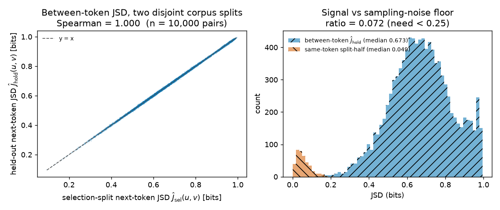

**Figure 1.** The corpus predictor is highly reliable. *Left:* each point is one of 10,000 word pairs;
x is $\widehat J_{\mathrm{sel}}(u,v)$ (bits, selection split), y is $\widehat J_{\mathrm{hold}}(u,v)$
(bits, holdout split, completely disjoint training rows). The dashed line is $y = x$. Rank agreement
is Spearman 0.9998, far above the 0.90 gate. *Right:* x is JSD in bits, y is the number of word pairs
(or words) per histogram bin. The `//`-hatched distribution is between-word
$\widehat J_{\mathrm{hold}}$ (median 0.673); the `\\`-hatched distribution is the same-word split-half
divergence — the sampling-noise floor — with median 0.049. The ratio of the two medians is 0.072, well
under the 0.25 gate: a typical between-word divergence is about fourteen times a typical same-word
noise value. (This ratio compares two medians; it is not an additive split of the measured divergence
into signal and noise.)

### Every raw curve, and the validity audit

The 10%–90% width $w$ is our summary, but the original post defined no such summary, so the raw curves
are the primary evidence — and the only way to check the validity criteria is to look at them.

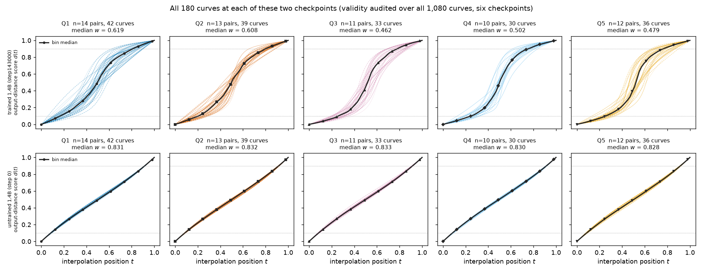

**Figure 2.** All 180 curves of the primary bank at each of the **two** checkpoints shown here. x is
the interpolation position $t$ along the block-0 residual SLERP path (0 = endpoint $u$'s state,
1 = endpoint $v$'s state); y is the relative-logit coordinate $d(t)$. Columns are the five
$\widehat J_{\mathrm{sel}}$ quintiles (Q1 = most similar continuations); the top row is the trained
1.4B model and the bottom row the untrained step-0 model — the other four checkpoints and the 410M run
are not drawn here. Thin lines are the three carrier contexts of every pair in that bin, drawn
separately with one line style per context; the thick dark line with markers is the bin's pointwise
median across those curves; dotted horizontals mark $d = 0.1$ and $d = 0.9$. The validity audit is
broader than the figure: across **all 1,080 curves of the six 60-pair checkpoint runs, plus the 6,000
curves of the two secondary-bank runs**, zero failed the span, single-crossing or monotonicity criteria and the
largest backslide anywhere was $0.0000$. The untrained network (bottom) is a straight line in every
bin; the trained one (top) bends into an S, more so in the higher-divergence bins.

Individual pairs are noisy, so the effect should be read as distributional, not pair-by-pair. Figure 3
makes that concrete with the extremes of the divergence range.

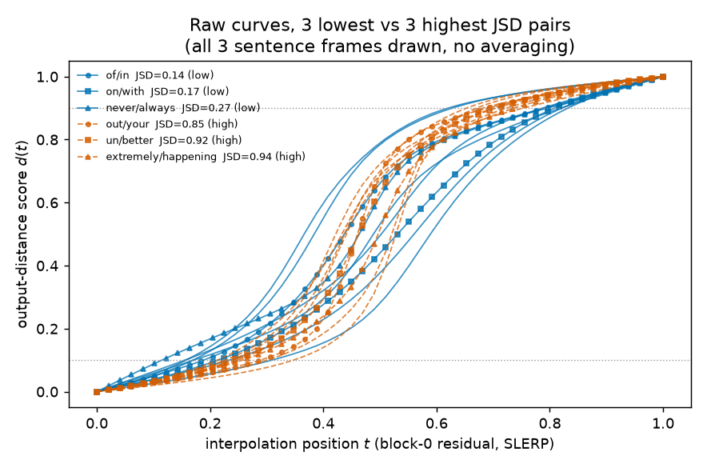

**Figure 3.** The trend does not hold pair by pair. x is $t$, y is $d(t)$, as in Figure 2. Solid lines
with round/square/triangle markers are the three **lowest**-$\widehat J_{\mathrm{hold}}$ pairs
(` of`/` in`, ` on`/` with`, ` never`/` always`; 0.14–0.27 bits); dashed lines are the three
**highest** (` out`/` your`, ` un`/` better`, ` extremely`/` happening`; 0.85–0.94 bits). All three
carrier contexts of each pair are drawn separately, with no averaging. The two function-word pairs at
the bottom of the divergence range are indeed the widest curves here, but ` never`/` always` — also
low divergence — is among the sharpest. Note too that even the sharpest curve is far from a step
function: these are moderate plateaus in the relative-logit coordinate, not hard switches.

### Primary result: corpus divergence predicts narrower transitions, but only after training

Figure 4 is the main test.

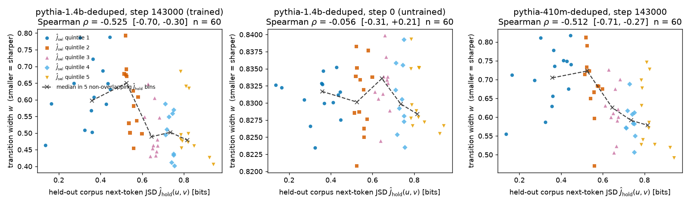

**Figure 4.** Held-out corpus next-token divergence predicts the 10%–90% transition width in trained
models and not in an untrained one. In every panel x is $\widehat J_{\mathrm{hold}}(u,v)$ (bits) and y
is $w$ (**smaller = sharper**). **Each dot is one endpoint pair** — its $w$ is the median over the
three carrier contexts, and each context's $w$ comes from a 50-position interpolation curve — so every
panel contains exactly **60 pair-level observations**, and the three panels re-use the same 60 pair
identities (same bank, different checkpoint/model). Marker shape and hue give the pair's
$\widehat J_{\mathrm{sel}}$ **stratum** (the selection-split quintile used to build the bank), whereas
the dashed line with `x` markers is a set of **five non-overlapping equal-count medians after
re-binning the same 60 pairs by $\widehat J_{\mathrm{hold}}$** — those five crosses are not extra
observations and not a running median. **The three panels have very different y-ranges:** trained 1.4B
spans 0.40–0.80, while untrained step 0 spans only 0.820–0.840. *Left (trained 1.4B):*
$\rho = -0.525$, CI $[-0.701, -0.304]$. *Middle (step 0):* $\rho = -0.056$, CI $[-0.314, +0.211]$ —
consistent with zero, but the whole panel is squeezed into a 2%-wide band just under the
linear-response value 0.83, a restricted range near the ceiling of $w$. *Right (410M):*
$\rho = -0.512$, CI $[-0.711, -0.272]$.

**Split sensitivity.** Using the selection split's divergence as the predictor instead of the
holdout split's changes nothing: $\rho(\widehat J_{\mathrm{sel}}, w) = -0.526$ against
$\rho(\widehat J_{\mathrm{hold}}, w) = -0.525$ at 1.4B ($-0.053$ vs $-0.056$ at step 0; $-0.511$ vs
$-0.512$ at 410M), which is unsurprising given
$\rho(\widehat J_{\mathrm{sel}}, \widehat J_{\mathrm{hold}}) = 0.99972$ on the bank. The two splits
are interchangeable as predictors; we report the holdout one because it is the split that played no
part in ordering or choosing the pairs.

The bin view in Figure 5 shows how much of the trend survives aggregation, and how far it is from a
clean monotone staircase.

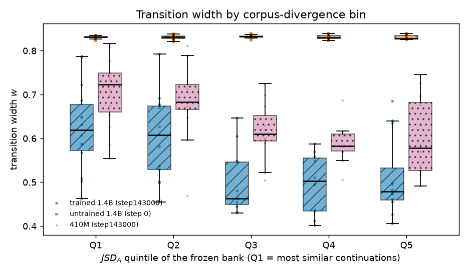

**Figure 5.** Lower width in the higher-divergence bins — monotonically at 410M, noisily at 1.4B, not
at all at step 0. x is the $\widehat J_{\mathrm{sel}}$ quintile of the frozen bank (Q1 = most similar
continuations); y is $w$. Three box-and-scatter groups sit side by side at each quintile, distinguished
by hatch and marker: `//` with round markers = trained 1.4B, `\\` with square markers = step-0 1.4B,
`..` with triangular markers = 410M. Boxes show the interquartile range with the median as a horizontal
bar; individual pairs are overplotted. 410M medians run 0.723 → 0.683 → 0.610 → 0.582 → 0.578 across
Q1→Q5, a clean monotone fall; trained 1.4B runs 0.619 → 0.608 → 0.462 → 0.502 → 0.479, where Q3 dips
below Q4 and Q5, so at n ≈ 12 pairs per bin the bin-level trend is real but noisy; step 0 runs
0.831 → 0.832 → 0.833 → 0.830 → 0.828, a total spread of 0.005. All 60 pairs were valid in every bin
at every checkpoint, so no bin's result comes from selective exclusion.

### Are these really plateaus?

A smaller $w$ could mean a genuine plateau in the relative-logit coordinate (flat, flat, jump) or
merely a steeper straight line. Since "plateau" is the concept under test, we measure endpoint
flatness separately with edge drift $E$ and compare it to the no-plateau reference $E = 0.184$.

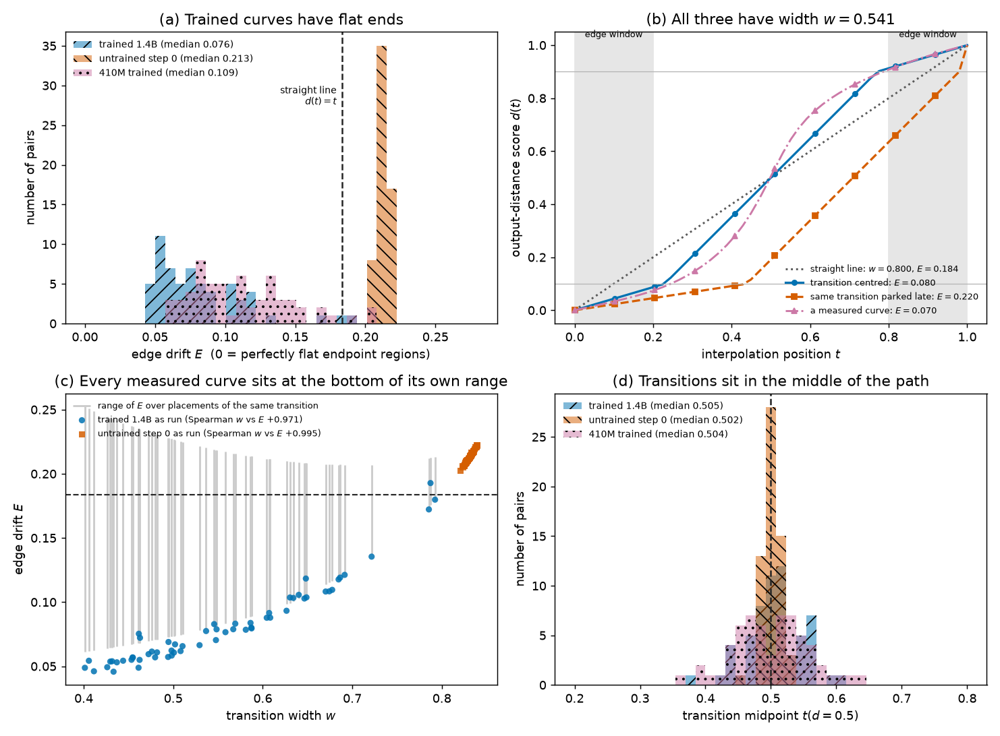

**Figure 6.** The trained curves are plateau-shaped in the relative-logit coordinate, but flatness and
width are redundant. *Left:* x is edge drift $E$ (mean movement of $d$ away from its endpoint value
inside the outer 20% of the path; 0 = perfectly flat ends), y is the number of pairs. `//`-hatched =
trained 1.4B (median 0.076), `\\`-hatched = untrained step 0 (0.213), `..`-hatched = 410M (0.109); the
dashed vertical is the no-plateau reference $E = 0.184$ for a straight line. Every trained pair sits
well below the reference — the ends really are flat in this coordinate — while the untrained ones sit
slightly *above* it. *Right:* x is $w$, y is $E$; round markers = trained 1.4B, square markers =
step 0; the dashed horizontal is again the reference. Spearman$(w, E) = +0.971$: at the pair level the
two metrics carry the same information, which is why we report the association in terms of width and
make no separate claim about flatness.

### The predictor tracks something the model actually learned

A global next-token distribution could have been too coarse to matter in one specific sentence.
Figure 7 shows it is not.

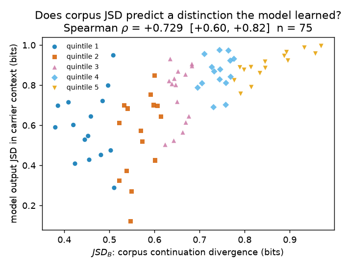

**Figure 7.** Corpus divergence predicts a distinction the trained model demonstrably encodes. x is
$\widehat J_{\mathrm{hold}}(u,v)$ (bits, corpus); y is $JSD_{\mathrm{out}}$ (bits) — the median over
the three carrier contexts of the JSD between the two endpoint next-token distributions the 1.4B model
outputs, restricted to the 50,060 corpus-observed target IDs; marker shapes and hues give the
$\widehat J_{\mathrm{sel}}$ stratum as in Figure 4. $\rho = +0.751$, CI $[+0.615, +0.843]$,
$p = 4.9\times10^{-12}$. At step 0 the same correlation is $+0.145$ (CI $[-0.122, +0.394]$,
$p = 0.27$), as expected for an untrained readout. This rules out the prespecified "global next-token
distribution is too coarse" verdict, under which a width null would have been uninterpretable.

### How much of the width association is independent of that learned separation?

Figure 7 gives the natural causal story a name: corpus divergence → learned output separation →
narrow transition. Two analyses test it, both in Figure 8. First, because the same frozen bank runs at
step 0, we can ask what training did to *each pair*, using $\Delta w$ as the outcome.
Second, we adjust the association for the candidate mediator $JSD_{\mathrm{out}}$, alone and together
with the five covariates.

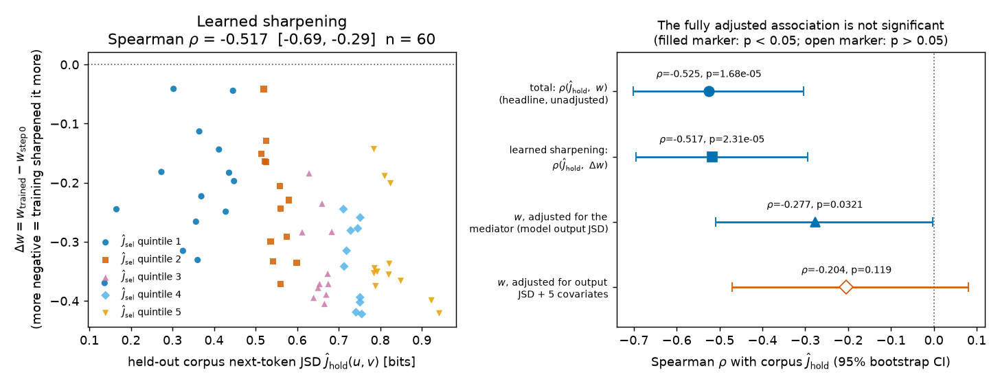

**Figure 8.** Corpus divergence predicts how much training narrowed each pair's transition; the
association is attenuated after adjusting for the model's own output separation. *Left:* x is
$\widehat J_{\mathrm{hold}}(u,v)$ (bits); y is $\Delta w = w_{\text{trained}} - w_{\text{step }0}$,
where more negative means training narrowed that pair's transition more; marker shape and hue give the
$\widehat J_{\mathrm{sel}}$ stratum as in Figure 4; the dotted horizontal is "training changed
nothing". Every pair lies below it — training narrowed all 60 — and the higher-divergence pairs narrow
most: $\rho = -0.517$, CI $[-0.694, -0.294]$, $p = 2.3\times10^{-5}$, median $\Delta w = -0.287$.
*Right:* a forest plot of four analyses (listed top to bottom on the y-axis); x is the Spearman $\rho$
with $\widehat J_{\mathrm{hold}}$ and the bars are 95% bootstrap CIs; a filled marker means
$p < 0.05$, an open marker $p > 0.05$; the dotted vertical is zero. The total association is $-0.525$;
the learned-sharpening version is essentially the same, $-0.517$, so the result is not an artefact of
pairs that started out sharp. Adjusting for the mediator $JSD_{\mathrm{out}}$ alone leaves $-0.277$,
which is **still significant** ($p = 0.032$); adjusting for the mediator plus the five covariates
leaves $-0.204$ with $p = 0.119$ — not significant. Using $\Delta w$ in the adjusted rows gives the
same picture ($-0.263$, $p = 0.042$; $-0.198$, $p = 0.129$).

The honest reading: **the headline $-0.525$ is a total association**, and it is a real, strongly
significant one. The association is attenuated after adjustment, and the fully adjusted estimate is
not statistically significant at n = 60. That is what the mediation story predicts — and also what a
plain common-cause story predicts, which is why we cannot decide between them here.

### When during training does the relationship appear?

Figure 4 shows the relationship needs training, but not *how much*. The plan predicted it would grow
stronger as training proceeded. Running the same frozen bank at four intermediate checkpoints shows
otherwise, and Figure 9 separates two things that move differently: how well corpus divergence
*predicts* width, and how sharp the transitions actually *are*.

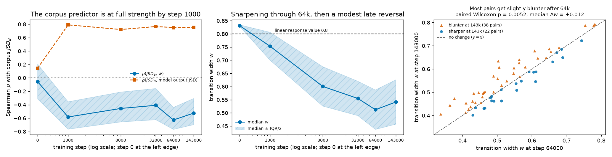

**Figure 9.** The corpus predictor is already comparable to later checkpoints at the earliest measured
step; transitions narrow through step 64000 and then partly reverse. The left and middle panels share
an x-axis: training step on a log scale, with step 0 drawn at the left edge (it cannot sit on a log
axis) and ticks at 0, 1k, 8k, 32k, 64k, 143k. *Left:* y is the Spearman $\rho$ of corpus
$\widehat J_{\mathrm{hold}}$ with each outcome. The solid line with round markers is $\rho$ with $w$
(shaded `//`-hatched band = 95% bootstrap CI); the dashed line with square markers is $\rho$ with
$JSD_{\mathrm{out}}$; the dotted horizontal is zero. Both jump from ≈ 0 at step 0 to their full
magnitude by **step 1000, which is the earliest checkpoint we measured** ($-0.582$ and $+0.791$);
afterwards the width correlation moves between $-0.408$ and $-0.628$ with heavily overlapping CIs — no
reliable trend either way — and the output correlation is flat at about $+0.75$. Nothing here
constrains what happened between step 0 and step 1000. *Middle:* y is median $w$ across the 60 pairs,
with a `//`-hatched band spanning median ± IQR/2; the dashed horizontal marks the linear-response
value $w = 0.8$. Median $w$ falls 0.831 → 0.753 → 0.601 → 0.555 → 0.512 and then **rises** to 0.541.
*Right:* the per-pair check on that rebound. x is $w$ at step 64000, y is $w$ at step 143000, one
point per pair; triangles are the 38 pairs that end blunter, circles the 22 that end sharper; the
dashed line is $y = x$ (no change). The reversal is systematic, not a median artefact: two-sided
paired Wilcoxon $p = 0.0052$, median per-pair $\Delta w = +0.012$.

Read together: **transitions narrow over the first tens of thousands of steps, are narrowest at step
64000, and then blunt slightly by the end of training — while the corpus statistic's ability to say
*which* pairs are sharp is already at full strength at the earliest step we measured and never
improves.** The plan's expected pattern — a relationship that strengthens with training — is not what
happens. The late reversal is small (about 6% of the 64k median) but consistent across pairs; we have
no mechanism for it, and with one trajectory, one bank, one model, and no resolution below step 1000
or between 64k and 143k, both the reversal and the flat correlation are suggestive observations rather
than established training-dynamics results.

### The result does not depend on how the bank was filtered

Two alternative banks test whether the top-256 filter matters: a larger 75-pair bank built by relaxing
the filter to top-512 (post-hoc, so it cannot carry the headline), and the top-256 bank minus the one
pair whose endpoint ` un` is a word-start fragment.

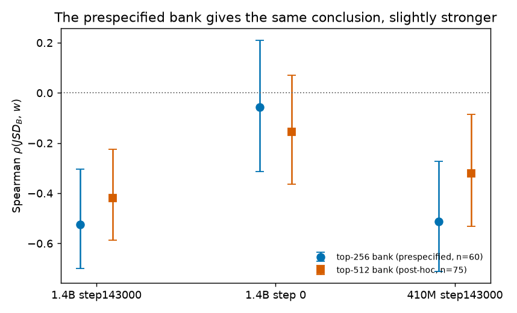

**Figure 10.** All three versions of the bank give the same conclusion. x is the checkpoint; y is
Spearman $\rho(\widehat J_{\mathrm{hold}}, w)$ with 95% bootstrap CI bars; round markers =
prespecified top-256 bank (n = 60), square markers = post-hoc top-512 bank (n = 75), triangular
markers = top-256 without the ` un`/` better` fragment pair (n = 59); the dotted horizontal is zero.
Trained 1.4B: $-0.525$ / $-0.419$ / $-0.502$ (the last with $p = 5.2\times10^{-5}$). Step 0: $-0.056$
/ $-0.155$ / $-0.019$, all consistent with zero. 410M: $-0.512$ / $-0.320$ / $-0.491$. The CIs overlap
heavily everywhere, so the differences between the banks are not themselves findings — the point is
that neither the filter threshold nor the single word-fragment endpoint drives the result.

### Generality: 1,000 pairs, with endpoint-clustered inference

Sixty pairs is a small, carefully matched bank, and endpoint-disjointness is what caps it there. Does
the association survive on a bank an order of magnitude larger, and is it monotone across the whole
divergence range? We assayed 1,000 pairs drawn from the same 123 endpoints (200 per selection-split
quintile, at most 20 pairs per endpoint, median 17; no transition curve consulted during selection) on
the trained 1.4B checkpoint. Because endpoints necessarily recur, these are **not** 1,000 independent
observations and we do not report a naive $p$-value for them.

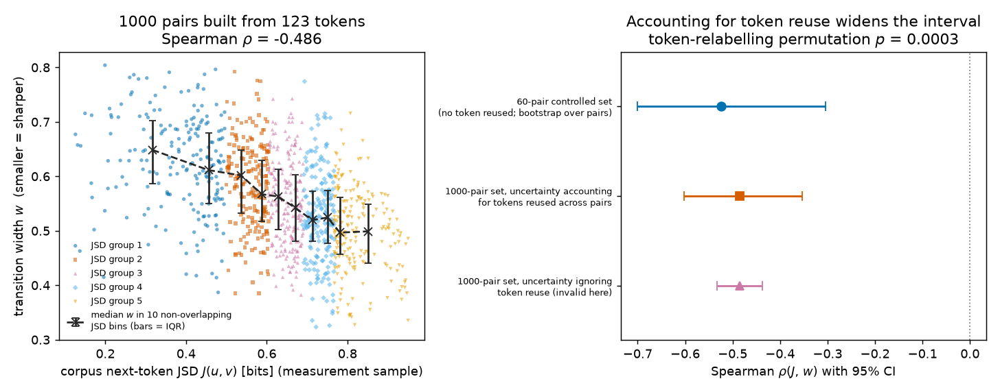

**Figure 11.** The association holds on a ten-times-larger, endpoint-reusing bank, and it is monotone
across the divergence range. *Left:* x is $\widehat J_{\mathrm{hold}}(u,v)$ (bits), y is $w$; each of
the 1,000 small markers is one endpoint pair (median $w$ over three carrier contexts), coloured and
shaped by its $\widehat J_{\mathrm{sel}}$ stratum. The dashed line with `x` markers gives the median
$w$ in **ten non-overlapping equal-count $\widehat J_{\mathrm{hold}}$ bins** (100 pairs each; bars =
interquartile range) — these are summaries of the same 1,000 pairs, not extra observations. Bin
medians fall from 0.649 to 0.499 essentially monotonically (0.649, 0.611, 0.602, 0.567, 0.563, 0.542,
0.520, 0.524, 0.497, 0.499), with the decline flattening above ≈ 0.75 bits; there is no sign of a
non-monotone or threshold-like relationship. Spearman $\rho = -0.486$. *Right:* x is Spearman
$\rho(\widehat J_{\mathrm{hold}}, w)$ with 95% CI bars, y lists three estimates. Top (round marker):
the primary 60-pair endpoint-disjoint bank, $-0.525$ $[-0.701, -0.304]$. Middle (square marker): the
1,000-pair bank with the **dyadic endpoint bootstrap**, $-0.486$ $[-0.603, -0.353]$. Bottom (triangle
marker): the same 1,000 pairs with a **naive pair bootstrap**, $[-0.533, -0.437]$ — shown only to
quantify how badly ignoring endpoint reuse understates uncertainty; its interval is 2.6 times narrower
(bootstrap SD 0.025 versus 0.064) and it is **not** a valid interval here. The endpoint-label
permutation test gives $p < 0.00025$: **none** of 4,000 relabellings reached $|\rho| = 0.486$, and the
97.5th percentile of $|\rho_\pi|$ was only 0.116.

We also ran the identical 1,000 pairs on the untrained **step-0** network as the same control used
for the primary bank: $\rho = -0.008$ with a clustered CI of $[-0.126, +0.109]$ and permutation
$p = 0.86$, and $\rho(\widehat J_{\mathrm{hold}}, JSD_{\mathrm{out}}) = +0.001$. With 1,000 pairs
the untrained null is tightly bounded rather than merely non-significant, which strengthens the
"requires training" reading — though the restricted-range caveat still applies, since the untrained
widths span an IQR of only 0.005 around 0.831.

On this bank the predictor also reproduces the output-divergence validation
($\rho(\widehat J_{\mathrm{hold}}, JSD_{\mathrm{out}}) = +0.729$), the choice of corpus split again
makes no difference ($\rho = -0.485$ with the selection split), and all 3,000 curves pass the strict
validity criteria with a largest backslide of 0.0000. Median $w$ is 0.555 (IQR 0.129), close to the
primary bank's 0.541 (IQR 0.169). The point estimate is slightly smaller in magnitude than the primary
bank's, which is expected: the large bank is *not* frequency-and-surprisal matched pair by pair the way
the 60-pair bank is, and it includes many more pairs in the crowded middle of the divergence range.
Read this as an endpoint-dependent robustness analysis that confirms the direction, magnitude and
monotonicity of the association — not as 1,000 independent confirmations.

### The sharpness is produced downstream of the patch

Finally, a control on the assay itself: if the sharp transition were an artefact of readout geometry
rather than of computation, moving the patch later would not matter.

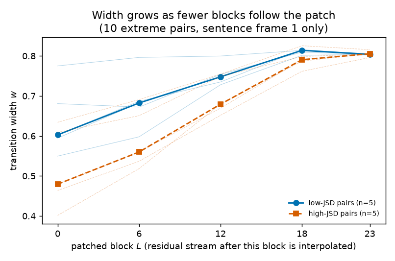

**Figure 12.** Width grows as fewer blocks follow the patch. x is the patched block index $L$ (the
residual stream is interpolated after this block; 23 is the last of the 24 blocks, so almost no
computation remains); y is $w$. The solid line with round markers is the median over the 5
**lowest**-$\widehat J_{\mathrm{hold}}$ pairs, the dashed line with square markers the median over the
5 **highest**; faint lines are individual pairs. Median $w$ rises monotonically 0.599 → 0.661 → 0.741
→ 0.805 → 0.804 as the patch moves from block 0 to block 23, converging on the linear-response value
of about 0.8. **Scope:** this scan uses only these **10 extreme pairs** and only **one carrier
context**, so it is consistent with a role for downstream computation but does not establish that
downstream blocks are generally required for the effect.

### The two named example pairs: `big`/`large` against `big`/`in`

Everything so far is distributional. The concrete question a reader is most likely to ask is about two
specific sentences from the source post: does Pythia plateau between *"My house is big"* and *"My house
is large"*, and between *"My house is big"* and *"My house is in"*? We ran both pairs through the same
assay, in the carrier `My house is` and in the three project carriers, at all three model settings, and
added the absolute output movement $M(t)$ so that "the output stays put" can be checked directly rather
than inferred from a normalised coordinate. Their corpus divergences were counted in the same two
splits as the rest of the study: $\widehat J_{\mathrm{hold}} = 0.412$ bits for ` big`/` large` and
$0.701$ bits for ` big`/` in`, against split-half sampling noise of 0.070, 0.059 and 0.003 bits for
` big`, ` large` and ` in` respectively.

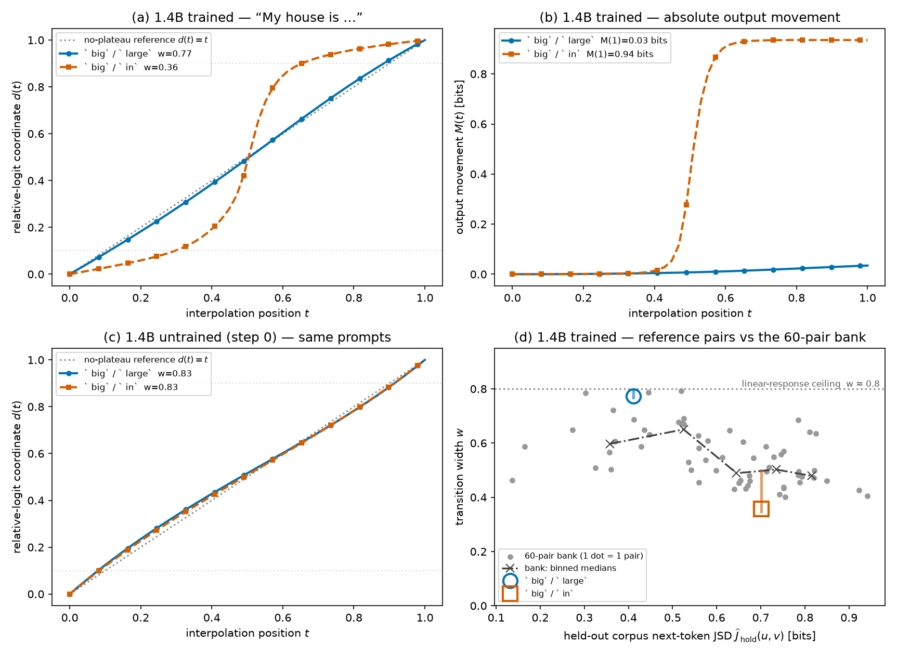

**Figure 13.** The plateau is on ` big`/` in`; ` big`/` large` shows the no-plateau straight line.
*(a)* x is the interpolation position $t$, y is the relative-logit coordinate $d(t)$, for the trained
1.4B model in the carrier `My house is`. The solid line with round markers is ` big`/` large`
($w = 0.773$); the dashed line with square markers is ` big`/` in` ($w = 0.357$); the gray dotted
diagonal is the no-plateau reference $d(t) = t$ and the faint horizontals mark $d = 0.1$ and $d = 0.9$.
*(b)* The same two pairs and line styles, with y the absolute output movement $M(t)$ in bits.
` big`/` large` moves 0.035 bits across the entire path (0.008 bits by the midpoint); ` big`/` in`
moves 0.935 bits, essentially all of it between $t = 0.4$ and $t = 0.6$. *(c)* The same prompts on the
untrained step-0 network, same axes as (a): both pairs lie on the diagonal ($w = 0.834$ and $0.829$).
*(d)* Where the two pairs sit relative to the primary bank: x is $\widehat J_{\mathrm{hold}}(u,v)$
(bits), y is $w$; small gray dots are the 60 bank pairs, the dash-dotted line with `x` markers is
their median $w$ in five non-overlapping equal-count $\widehat J_{\mathrm{hold}}$ bins, the large open
circle and open square are the two reference pairs at their `My house is` width, and the vertical bar
through each spans that pair's width across the other three carrier contexts.

The measured numbers state the result plainly. ` big`/` in` crosses in about a third of the path with
nearly flat ends, ` big`/` large` takes three quarters of the path with ends that drift about as much
as a straight line does, and the untrained network does neither.

| Quantity (carrier `My house is`) | ` big`/` large` | ` big`/` in` |
|---|---|---|
| Held-out corpus next-token JSD $\widehat J_{\mathrm{hold}}(u,v)$ [bits] | 0.412 | 0.701 |
| Endpoint occurrences in the holdout split | 122,257 / 175,159 | 122,257 / 9,821,847 |
| Trained 1.4B: $w$ (no-plateau reference $\approx 0.8$) | 0.773 | **0.357** |
| Trained 1.4B: edge drift $E$ (no-plateau reference 0.184) | 0.162 | **0.043** |
| Trained 1.4B: $M(1)$ / $M(0.5)$ [bits] | 0.035 / 0.008 | 0.935 / 0.505 |
| Trained 1.4B: $w$ in the three other carriers | 0.767–0.793 | 0.348–0.500 |
| Untrained step 0: $w$ / $E$ | 0.834 / 0.216 | 0.829 / 0.211 |
| 410M trained: $w$ / $E$ | 0.794 / 0.198 | 0.494 / 0.075 |

**What this shows.** ` big`/` in` is a textbook plateau: flat, a jump at mid-path, flat again, with
$w = 0.357$ — sharper than every one of the 60 bank pairs, whose minimum is 0.401 — and edge drift
0.043 against 0.184 for a straight line. ` big`/` large` produces the opposite shape, indistinguishable
from linear response ($w = 0.773$, $E = 0.162$, above 95% of the bank). $M(t)$ explains why the two
results belong to the same picture. The trained model's continuations of *"My house is big"* and
*"My house is large"* differ by 0.035 bits, so no boundary lies between them: the whole path stays
**inside a single plateau**, the output has moved 0.008 bits by the midpoint, and $d(t)$ — which
divides that near-zero movement by itself — records the leftover as a straight line. ` big` and ` in`
land in **different** plateaus, so the path has to cross a boundary, and it crosses abruptly. Both
behaviours are learned: at step 0 the two pairs are indistinguishable from each other and from the
diagonal, and the 410M model reproduces the trained pattern (0.794 against 0.494).

Practically, this is the cheapest available check that the assay measures what its name suggests, and
it is the one a reader can run on their own sentences: a pair whose $M(1)$ is near zero has no
transition to measure, and any width computed for it describes noise. It also sits in the direction of
the main result — the higher-divergence pair is the sharper one — but as an illustration rather than
evidence. Two caveats. The gap is wider than the bank trend: bank pairs near 0.41 bits have median
$w = 0.639$ and pairs near 0.70 bits have $w = 0.502$, against 0.773 and 0.357 here, which is the
pair-level scatter Figure 3 already documented. And ` in` occurs about 80 times more often than ` big`,
so this pair would fail the bank's 2× frequency-matching rule; word class and frequency are confounded
with divergence in this single comparison.

### Current-best numbers

On the primary bank of 60 endpoint-disjoint pairs, the association is strong and negative in both
trained models and absent at initialisation.

| Result | Trained 1.4B (step143000) | Untrained 1.4B (step0) | 410M (step143000) |
|---|---|---|---|
| Spearman $\rho$ of $\widehat J_{\mathrm{hold}}$ with $w$ | **−0.525** [−0.701, −0.304], $p=1.7\times10^{-5}$ | −0.056 [−0.314, +0.211], $p=0.67$ | −0.512 [−0.711, −0.272], $p=2.9\times10^{-5}$ |
| Same, using $\widehat J_{\mathrm{sel}}$ (sensitivity) | −0.526 | −0.053 | −0.511 |
| Partial $\rho$ (5 covariates adjusted) | −0.384 | −0.142 | −0.396 |
| Spearman $\rho$ of $\widehat J_{\mathrm{hold}}$ with $JSD_{\mathrm{out}}$ | **+0.751** [+0.615, +0.843] | +0.145 [−0.122, +0.394] | +0.749 [+0.611, +0.838] |
| Median $w$ (IQR) | 0.541 (0.169) | 0.831 (0.006) | 0.640 (0.133) |
| Median edge drift $E$ (no-plateau reference 0.184) | 0.076 | 0.213 | 0.109 |
| Valid-curve rate (strict criteria) | 1.000 | 1.000 | 1.000 |
| Max endpoint-patch relative error | $4.6\times10^{-5}$ | $3.3\times10^{-6}$ | $6.3\times10^{-5}$ |

The secondary 1,000-pair bank reproduces that association on the trained 1.4B model under
endpoint-clustered inference, at a slightly smaller magnitude and with a wider valid interval.

| Quantity | Value |
|---|---|
| Pairs / endpoints / uses per endpoint (min, median, max) | 1,000 / 123 / (1, 17, 20) |
| Spearman $\rho(\widehat J_{\mathrm{hold}}, w)$ | **−0.486** |
| Dyadic endpoint-bootstrap 95% CI (4,000 resamples) | [−0.603, −0.353] |
| Endpoint-label permutation $p$ (4,000 relabellings) | **< 0.00025** (0 of 4,000 reached $\lvert\rho\rvert$) |
| Naive pair-bootstrap CI — invalid here, shown for contrast | [−0.533, −0.437] |
| Spearman $\rho(\widehat J_{\mathrm{sel}}, w)$ | −0.485 |
| Spearman $\rho(\widehat J_{\mathrm{hold}}, JSD_{\mathrm{out}})$ | +0.729 |
| Median $w$ (IQR) / valid-curve rate | 0.555 (0.129) / 1.000 |
| **Same 1,000 pairs at step 0**: $\rho$, clustered CI, permutation $p$ | **−0.008** [−0.126, +0.109], $p = 0.86$ |
| Same 1,000 pairs at step 0: $\rho$ with $JSD_{\mathrm{out}}$ / median $w$ (IQR) | +0.001 / 0.831 (0.005) |

Learned sharpening and the adjustment ladder, trained 1.4B against its own step-0 baseline (n = 60):

| Association with corpus $\widehat J_{\mathrm{hold}}$ | $\rho$ | 95% CI | $p$ |
|---|---|---|---|
| Trained width $w$ — **headline, total association** | **−0.525** | [−0.701, −0.304] | $1.7\times10^{-5}$ |
| Learned sharpening $\Delta w = w_{\text{trained}} - w_{\text{step }0}$ | **−0.517** | [−0.694, −0.294] | $2.3\times10^{-5}$ |
| $w$, adjusted for the mediator $JSD_{\mathrm{out}}$ | −0.277 | [−0.509, −0.002] | 0.032 |
| $w$, adjusted for $JSD_{\mathrm{out}}$ + the 5 covariates | −0.204 | [−0.471, +0.080] | **0.119 (n.s.)** |
| $w$, adjusted for the 5 covariates only | −0.384 | [−0.623, −0.110] | 0.0024 |
| $\Delta w$, adjusted for $JSD_{\mathrm{out}}$ / for $JSD_{\mathrm{out}}$ + 5 covariates | −0.263 / −0.198 | — | 0.042 / 0.129 |

Median $\Delta w = -0.287$, and all 60 pairs have $\Delta w < 0$: training narrowed every pair's
transition, by about 0.29 of the interpolation path at the median.

Across six checkpoints of `pythia-1.4b-deduped` on the same frozen bank, the correlation reaches its
full magnitude at the earliest measured step while the widths keep falling until step 64000.

| Training step | 0 | 1000 | 8000 | 32000 | 64000 | 143000 |
|---|---|---|---|---|---|---|
| Spearman $\rho$ of $\widehat J_{\mathrm{hold}}$ with $w$ | −0.056 | **−0.582** | −0.456 | −0.408 | −0.628 | −0.525 |
| 95% CI | [−0.31, +0.21] | [−0.77, −0.36] | [−0.66, −0.21] | [−0.62, −0.16] | [−0.77, −0.44] | [−0.70, −0.31] |
| Spearman $\rho$ of $\widehat J_{\mathrm{hold}}$ with $JSD_{\mathrm{out}}$ | +0.145 | +0.791 | +0.721 | +0.766 | +0.750 | +0.751 |
| Median $w$ (IQR) | 0.831 (0.006) | 0.753 (0.107) | 0.601 (0.150) | 0.555 (0.131) | **0.512** (0.150) | 0.541 (0.169) |
| Median edge drift $E$ | 0.213 | 0.153 | 0.088 | 0.077 | 0.069 | 0.076 |
| Valid-curve rate | 1.000 | 1.000 | 1.000 | 1.000 | 1.000 | 1.000 |

Supporting checks (trained 1.4B): reliability Spearman 0.9998; noise ratio 0.072; per-context $\rho$ =
−0.486, −0.411 and −0.504 for `The thing was`, `They said it was` and `I thought it was` respectively,
so no single context drives the result; reversal changes $w$ by at most $1.1\times10^{-5}$; prefix
block-0 residuals within a pair differ by exactly 0.0; zero curves out of 1,080 (primary banks) and
6,000 (secondary bank, two checkpoints) failed any validity criterion, with a largest backslide of $0.0000$; dropping
the one word-fragment pair (` un`/` better`) leaves $\rho = -0.502$ ($p = 5.2\times10^{-5}$, n = 59);
the 64k → 143k late reversal has 38 of 60 pairs blunter, paired Wilcoxon $p = 0.0052$, median
$\Delta w = +0.012$.

---

## Conclusion

Held-out corpus immediate-next-token divergence is a usable predictor of how sharply a trained Pythia
model separates two words. The evidence supports two claims, in this order of strength. **First, it
predicts learned output separation:** the JSD between the two endpoints' next-token distributions in
the carrier contexts tracks corpus divergence at $\rho = +0.751$ ($p = 4.9\times10^{-12}$).
**Second, it predicts the 10%–90% relative-logit transition width** at $\rho = -0.525$ on the primary
60-pair bank, $-0.486$ on a 1,000-pair endpoint-reusing bank (endpoint-clustered CI
$[-0.603, -0.353]$, permutation $p < 0.00025$, monotone across the divergence range), $-0.512$ on the
410M cross-scale check, consistently across all three carrier contexts, and not in the untrained
network. The trained curves are plateau-shaped in that coordinate (edge drift 0.076 against 0.184 for
a straight line), so "relative-logit-coordinate plateau" is a fair description of what we measure —
but width and flatness are $+0.971$ correlated across pairs, so this design cannot attribute the
association to flatness specifically rather than to overall transition width. The two named example
pairs show the same thing concretely and add the caveat that comes with it: ` big`/` in` plateaus
sharply while ` big`/` large` traces the no-plateau line, because the model separates the second pair's
outputs by only 0.035 bits — a width computed on a pair like that is describing noise, which is why
absolute output movement $M(t)$ belongs next to $w$ whenever a single pair is inspected. The headline is a
**total** association: corpus divergence also predicts how much training narrowed each pair's
transition ($\rho = -0.517$ on $\Delta w$), but the association is attenuated after adjustment
($-0.277$, $p = 0.032$, for the model's own output divergence alone) and the fully adjusted estimate
is not statistically significant ($-0.204$, $p = 0.119$).

**The training trajectory did not go as predicted.** The plan expected the negative relationship to
strengthen during training. Instead it is already comparable to later checkpoints at the earliest
measured checkpoint (step 1000) and afterwards fluctuates within overlapping confidence intervals.
Meanwhile the transitions themselves narrow through step 64000 (median $w$ 0.831 → 0.512) and then
partly reverse, ending at 0.541 with 38 of 60 pairs blunter than they were at 64k (paired Wilcoxon
$p = 0.0052$). Narrowing continues long after the corpus statistic has stopped explaining more of it,
and then undoes a little of itself. A natural next test is whether a *context-conditioned* divergence
estimate does better at the late checkpoints, where the global one has stopped improving.

**What this does not show.** (1) *Not causation.* This is an observational predictor test; we did not
intervene on divergence. (2) *Not an independent effect.* Adjusting for endpoint frequency,
continuation entropy, surprisal, and block-0 cosine/distance cuts the association from $-0.525$ to
$-0.384$; adjusting for the model's own output divergence cuts it to $-0.277$; adjusting for both
leaves $-0.204$, $p = 0.119$. Because that geometry plausibly lies *on the causal path* from training
targets to transition shape, the adjusted numbers are lower bounds rather than "true" effects — but
this design cannot demonstrate an independent contribution. (3) *Not a clean untrained control.* The
step-0 network's widths have an IQR of 0.006 just under the linear-response ceiling, a restricted
range, so its null correlation is not purely an absence of association. (4) *Not sharp switching.*
Even the sharpest pairs have $w \approx 0.40$; these are moderate plateaus, not step functions.
(5) *Not a model-free pipeline.* The JSD predictor itself is computed from corpus statistics, but
endpoint filtering (top-256 in all three contexts) and covariate matching use trained-model
probabilities and surprisal. (6) *Not necessity.* Nothing here says plateaus are required for low
training loss.

**Scope of the data and compute.** 2.05B tokens (2 × 500,000 rows) byte-range-sampled from a 300B-token
released stream — about 0.68% of it — so the next-token estimate is well-sampled but *global,
context-free and single-token*; a context-conditioned estimate was explicitly out of scope. Three
carrier contexts, one hook point (post-block-0, final position), 60 primary pairs plus 1,000 secondary
pairs, 50 interpolation positions, six `pythia-1.4b-deduped` checkpoints plus one 410M checkpoint, on
one shared RTX PRO 4500 GPU. The 410M result is a cross-scale robustness check, not an independent
replication — it re-uses the same corpus estimates and the same frozen bank, as does every formation
checkpoint.

**Reproduction.** `experiments/download_splits.py` (byte-range corpus sample), `count_jsd.py` (bigram
counts and reliability gates), `select_endpoints.py` and `build_pairs.py --pool strict` (primary
bank), `build_large_bank.py` (secondary 1,000-pair bank), `assay.py` with `run_assay.py` (the
transition assay), `curve_metrics.py` with `rescore.py` (validity criteria and raw-curve export),
`block_scan.py`, `checks.py`, `formation.py` (intermediate checkpoints), `reference_jsd.py` with
`reference_house.py` and `plot_reference_house.py` (the two named example pairs), `revisions.py` (learned
sharpening, adjustment ladder, late-reversal test, fragment sensitivity), `split_sensitivity.py`,
`large_analysis.py` (endpoint-clustered inference), and `analyze.py` (figures and statistics).
Manifests, per-pair summaries and all summary statistics are in `results/`. **The raw curves are
committed**, as `results/curves_*.npy` and as a plain-text `results/curves_*.csv.gz` export — one row
per pair × context × grid point — so every width, flatness and validity number in this report can be
recomputed from disk without a GPU. (The repo-wide `.gitignore` excludes `*.npy` and `*.gz`; this
direction ships its own `.gitignore` that un-ignores `results/curves_*`.)

---

## Appendix A — the 60-pair bank: how it was sampled, and what is in it

### A.1 The sampling procedure

The bank had to satisfy three things at once: every prompt has to be a sentence the model would
plausibly produce, every endpoint has to be counted often enough in the corpus for its next-token
distribution to be estimated, and the pairs have to cover the whole divergence range without letting
frequency or surprisal drift along with divergence. The procedure below was fixed before the pairs
were assayed; no transition curve entered any step of it.

**Step 1 — eligible token type.** Every token in the `pythia-1.4b-deduped` vocabulary that GPT-NeoX
BPE marks as starting a word (the `Ġ` prefix) and whose remaining characters are at least two
lowercase ASCII letters. Two-letter minimum excludes single letters; the filter still admits word-start
*fragments*, and exactly one (` un`) survives into the bank, which is why Figure 10 reports the bank
with that pair dropped.

**Step 2 — model-plausibility filter.** Keep the tokens that are among the trained model's **top-256**
eligible word continuations of **all three** carrier contexts (`The thing was`, `They said it was`,
`I thought it was`). The intersection over the three contexts is what makes the endpoint plausible in
every carrier it is used in. This uses the trained model's own ranking of the final token; it is not a
claim that the exact prompts occur in the training corpus.

**Step 3 — corpus count filter.** Keep the endpoints that occur at least **20,000 times in each** of
the two 500,000-row splits, so that both the selection and the holdout estimate of the next-token
distribution rest on at least that many observations. **123 endpoints** pass steps 1–3.

**Step 4 — candidate pairs.** Form every unordered pair of those 123 endpoints whose corpus
frequencies differ by at most a factor of two, which keeps the rarer endpoint of a pair from being
systematically noisier. **1,763 candidate pairs** survive.

**Step 5 — divergence strata.** Compute $\widehat J_{\mathrm{sel}}(u,v)$ for all 1,763 candidates and
cut them at their own quintiles. The bin edges in bits are 0.118, 0.499, 0.605, 0.691, 0.768, 0.971,
so Q1 holds the pairs whose training-corpus continuations are most alike and Q5 the pairs that are
most different.

**Step 6 — balanced, endpoint-disjoint selection.** Inside each quintile, rank the candidates by how
close the pair sits to the middle of the eligible-endpoint distribution on two nuisance variables that
could otherwise track divergence — corpus frequency and how surprising the endpoint is to the model in
the carrier contexts. Writing $\ell(u) = \log_{10}$ of $u$'s corpus count and $s(u)$ for $u$'s mean
surprisal in bits across the three carriers, with $\tilde\ell, \tilde s$ the medians and
$\sigma_\ell, \sigma_s$ the standard deviations over the 123 eligible endpoints:

```math
\mathrm{cost}(u,v) \;=\;
\frac{\left\lvert \tfrac12\left(\ell(u)+\ell(v)\right) - \tilde\ell \right\rvert}{\sigma_\ell}
\;+\;
\frac{\left\lvert \tfrac12\left(s(u)+s(v)\right) - \tilde s \right\rvert}{\sigma_s}.
```

Then walk the five quintiles **round-robin**, taking at each visit the cheapest remaining pair in that
quintile whose two endpoints have not been used yet, until each quintile holds 15 pairs or runs out of
disjoint candidates. Round-robin order matters because endpoint-disjointness is the binding
constraint: filling Q1 to quota first would consume endpoints that Q5 then could not replace.

**Step 7 — what came out.** 60 pairs, distributed **14 / 13 / 11 / 10 / 12** across Q1→Q5. The ceiling
is 61 pairs: 123 eligible endpoints admit at most $\lfloor 123/2 \rfloor$ disjoint pairs, which is why
the primary analysis has 60 observations and not more. Balance across bins was checked afterwards with
a Kruskal-Wallis test and no significant imbalance was detected ($p = 0.52$ for mean pair
log-frequency, $p = 0.21$ for mean pair surprisal). A **15-pair calibration subset** (three per
quintile, drawn with seed 0) was then frozen and run first, to check the dynamic-range gate
(IQR of $w$ = 0.109 against a gate of 0.05) before the remaining pairs were assayed.

### A.2 The 60 pairs

The table lists the whole bank in the order it is stored in `results/pair_manifest_top256.json`, so
every number in this report can be traced to a named pair. Reading down it shows what the divergence
strata mean in practice: Q1 pairs are near-synonyms and function words with near-identical
continuations (` nice`/` beautiful`, ` simple`/` easy`, ` of`/` in`), while Q5 pairs mix word classes
and continuation habits (` out`/` your`, ` un`/` better`, ` extremely`/` happening`). The widths in the
last two columns are the per-pair outcomes behind Figures 4, 5 and 8 — each is the median over the
three carrier contexts, and the step-0 column shows the same pair in the untrained network. An asterisk
marks the 15 calibration pairs. Counts are occurrences summed over both corpus splits (2.05B tokens),
which is the quantity the factor-of-two frequency rule uses.

| # | Q | endpoint $u$ | endpoint $v$ | count $u$ | count $v$ | $\widehat J_{\mathrm{sel}}$ | $\widehat J_{\mathrm{hold}}$ | $w$ trained | $w$ step 0 |
|---|---|---|---|---|---|---|---|---|---|
| 1 | Q1 | ` of` | ` in` | 32,363,014 | 19,653,700 | 0.137 | 0.137 | 0.463 | 0.833 |
| 2 | Q1 | ` on` | ` with` | 7,209,037 | 8,111,006 | 0.166 | 0.165 | 0.587 | 0.832 |
| 3 | Q1 | ` never` | ` always` | 446,707 | 374,368 | 0.273 | 0.273 | 0.649 | 0.830 |
| 4 | Q1 | ` nice` | ` beautiful` | 96,521 | 88,378 | 0.308 | 0.303 | 0.786 | 0.827 |
| 5 | Q1 | ` as` | ` from` | 6,469,579 | 4,655,652 | 0.324 | 0.325 | 0.508 | 0.823 |
| 6 | Q1 | ` for` | ` that` | 10,254,522 | 11,789,305 | 0.357 | 0.357 | 0.567 | 0.833 |
| 7 | Q1 | ` up` | ` like` | 1,720,825 | 1,469,617 | 0.361 | 0.361 | 0.502 | 0.833 |
| 8* | Q1 | ` fun` | ` fine` | 126,321 | 123,522 | 0.369 | 0.365 | 0.722 | 0.835 |
| 9* | Q1 | ` only` | ` now` | 1,356,539 | 845,631 | 0.371 | 0.370 | 0.607 | 0.830 |
| 10 | Q1 | ` dangerous` | ` wonderful` | 49,452 | 46,873 | 0.416 | 0.412 | 0.686 | 0.830 |
| 11* | Q1 | ` great` | ` real` | 414,940 | 311,449 | 0.432 | 0.428 | 0.586 | 0.835 |
| 12 | Q1 | ` after` | ` because` | 1,059,302 | 930,891 | 0.436 | 0.436 | 0.648 | 0.831 |
| 13 | Q1 | ` simple` | ` easy` | 182,845 | 169,288 | 0.440 | 0.446 | 0.787 | 0.832 |
| 14 | Q1 | ` true` | ` done` | 317,220 | 292,371 | 0.444 | 0.448 | 0.630 | 0.828 |
| 15* | Q2 | ` not` | ` all` | 4,479,000 | 2,543,606 | 0.514 | 0.514 | 0.678 | 0.829 |
| 16 | Q2 | ` absolutely` | ` totally` | 47,922 | 44,568 | 0.519 | 0.520 | 0.792 | 0.834 |
| 17 | Q2 | ` well` | ` much` | 893,658 | 713,200 | 0.521 | 0.522 | 0.674 | 0.838 |
| 18 | Q2 | ` important` | ` big` | 356,949 | 244,672 | 0.526 | 0.525 | 0.670 | 0.835 |
| 19 | Q2 | ` impossible` | ` amazing` | 54,276 | 54,896 | 0.535 | 0.525 | 0.691 | 0.821 |
| 20 | Q2 | ` something` | ` far` | 459,994 | 298,064 | 0.538 | 0.536 | 0.529 | 0.829 |
| 21 | Q2 | ` written` | ` interesting` | 148,633 | 107,905 | 0.538 | 0.542 | 0.501 | 0.833 |
| 22 | Q2 | ` working` | ` clear` | 263,580 | 211,582 | 0.558 | 0.560 | 0.581 | 0.825 |
| 23 | Q2 | ` difficult` | ` dead` | 141,745 | 107,540 | 0.559 | 0.558 | 0.627 | 0.832 |
| 24 | Q2 | ` so` | ` about` | 1,794,363 | 1,847,382 | 0.560 | 0.560 | 0.455 | 0.826 |
| 25 | Q2 | ` cool` | ` meant` | 74,127 | 75,657 | 0.577 | 0.575 | 0.537 | 0.828 |
| 26* | Q2 | ` nothing` | ` bad` | 225,433 | 172,704 | 0.580 | 0.580 | 0.608 | 0.838 |
| 27* | Q2 | ` over` | ` being` | 1,221,299 | 730,384 | 0.598 | 0.599 | 0.498 | 0.834 |
| 28 | Q3 | ` almost` | ` getting` | 216,416 | 212,073 | 0.612 | 0.612 | 0.548 | 0.832 |
| 29 | Q3 | ` hot` | ` gone` | 102,169 | 104,476 | 0.631 | 0.629 | 0.646 | 0.831 |
| 30 | Q3 | ` taking` | ` quite` | 182,994 | 180,384 | 0.640 | 0.640 | 0.430 | 0.824 |
| 31 | Q3 | ` mostly` | ` strange` | 65,432 | 43,209 | 0.651 | 0.651 | 0.453 | 0.831 |
| 32 | Q3 | ` still` | ` called` | 600,680 | 338,899 | 0.653 | 0.654 | 0.462 | 0.834 |
| 33* | Q3 | ` either` | ` kind` | 302,187 | 229,323 | 0.659 | 0.660 | 0.604 | 0.840 |
| 34 | Q3 | ` some` | ` made` | 1,333,069 | 720,328 | 0.664 | 0.666 | 0.432 | 0.837 |
| 35 | Q3 | ` one` | ` my` | 2,373,054 | 1,934,081 | 0.670 | 0.670 | 0.444 | 0.833 |
| 36 | Q3 | ` completely` | ` obvious` | 117,920 | 60,588 | 0.671 | 0.674 | 0.480 | 0.834 |
| 37* | Q3 | ` our` | ` most` | 1,395,429 | 897,862 | 0.677 | 0.675 | 0.462 | 0.833 |
| 38* | Q3 | ` her` | ` there` | 1,992,015 | 1,702,234 | 0.686 | 0.683 | 0.546 | 0.829 |
| 39 | Q4 | ` me` | ` no` | 1,493,290 | 1,590,571 | 0.711 | 0.712 | 0.587 | 0.832 |
| 40 | Q4 | ` simply` | ` wrong` | 170,783 | 149,429 | 0.716 | 0.719 | 0.510 | 0.825 |
| 41 | Q4 | ` moving` | ` definitely` | 99,094 | 58,488 | 0.716 | 0.713 | 0.494 | 0.836 |
| 42 | Q4 | ` coming` | ` worth` | 159,609 | 94,561 | 0.731 | 0.729 | 0.548 | 0.829 |
| 43 | Q4 | ` more` | ` when` | 2,085,158 | 1,721,054 | 0.743 | 0.742 | 0.411 | 0.831 |
| 44* | Q4 | ` part` | ` already` | 573,233 | 302,072 | 0.748 | 0.746 | 0.558 | 0.836 |
| 45 | Q4 | ` hard` | ` actually` | 254,661 | 238,176 | 0.752 | 0.751 | 0.437 | 0.839 |
| 46 | Q4 | ` his` | ` also` | 3,004,245 | 1,665,707 | 0.752 | 0.752 | 0.433 | 0.827 |
| 47* | Q4 | ` enough` | ` probably` | 301,509 | 189,618 | 0.755 | 0.752 | 0.569 | 0.828 |
| 48* | Q4 | ` at` | ` this` | 4,829,314 | 4,613,793 | 0.757 | 0.756 | 0.401 | 0.824 |
| 49 | Q5 | ` such` | ` right` | 1,107,844 | 729,410 | 0.785 | 0.785 | 0.685 | 0.828 |
| 50 | Q5 | ` their` | ` what` | 2,157,976 | 1,468,488 | 0.785 | 0.785 | 0.482 | 0.835 |
| 51* | Q5 | ` you` | ` by` | 5,502,298 | 5,285,670 | 0.787 | 0.786 | 0.495 | 0.839 |
| 52 | Q5 | ` under` | ` good` | 759,838 | 689,371 | 0.792 | 0.793 | 0.476 | 0.827 |
| 53 | Q5 | ` different` | ` really` | 648,101 | 473,897 | 0.793 | 0.789 | 0.455 | 0.830 |
| 54 | Q5 | ` pretty` | ` exactly` | 144,095 | 109,622 | 0.812 | 0.811 | 0.640 | 0.829 |
| 55 | Q5 | ` going` | ` too` | 542,097 | 516,617 | 0.821 | 0.821 | 0.472 | 0.828 |
| 56 | Q5 | ` perfect` | ` supposed` | 104,753 | 60,519 | 0.824 | 0.825 | 0.634 | 0.835 |
| 57* | Q5 | ` just` | ` very` | 1,226,924 | 808,786 | 0.824 | 0.822 | 0.498 | 0.835 |
| 58 | Q5 | ` out` | ` your` | 1,865,829 | 2,085,989 | 0.849 | 0.849 | 0.461 | 0.827 |
| 59 | Q5 | ` un` | ` better` | 577,883 | 394,876 | 0.922 | 0.923 | 0.426 | 0.826 |
| 60* | Q5 | ` extremely` | ` happening` | 64,188 | 42,333 | 0.946 | 0.942 | 0.406 | 0.827 |

Every column here is reproducible from disk: `results/pair_manifest_top256.json` holds the token IDs,
counts, surprisals, entropies and both divergence estimates; `results/assay_step143000_t256.json` and
`results/assay_step0_t256.json` hold the per-pair, per-context widths; and the raw 50-point curves are
in `results/curves_step143000_t256.npy` and its `.csv.gz` export. `experiments/appendix_bank.py`
regenerates this table.
