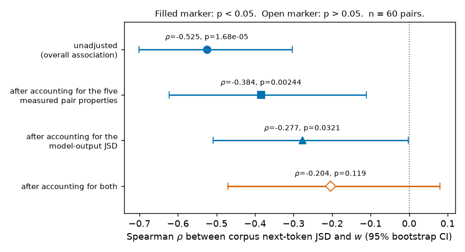

# Do tokens with more different next-token distributions have narrower transitions?

> Final, presentable, current-best only. All history is in CHANGELOG.md.

## Summary

Language models do not always respond smoothly to their own internal states. If you take the hidden
state a model computes for one input, slide it gradually toward the hidden state for a different
input, and watch the model's output at every step along the way, the output sometimes barely moves for
most of the path and then swings quickly. Where that swing is narrow, a small change to the internal
state produces a large behavioural change — which is exactly the kind of place a safety auditor wants
to be able to find in advance, ideally without running the model at all.

This report tests one cheap candidate for finding those places in advance: a statistic you can compute
from the training corpus alone. For each candidate token we count which token comes **immediately
after** it across 2.05 billion tokens of the stream Pythia was actually trained on, and we compare two
tokens by the **Jensen-Shannon divergence (JSD)** between their two next-token distributions. JSD is a
symmetric, bounded measure of how different two probability distributions are: 0 bits means the two
tokens are followed by exactly the same mix of tokens, 1 bit means their sets of followers never
overlap. The question is:

> Do token pairs with more different immediate-next-token distributions tend to have narrower
> transitions in the trained model's output-distance score `d(t)`?

`d(t)` is the score we measure while sliding between the two tokens' internal states. At each position
`t` along the path it says how far the model's current output logits have travelled from the first
token's output logits toward the second's — 0 at the start, 1 at the end. The outcome we report is
**`w`, the fraction of the path over which `d(t)` climbs from 0.1 to 0.9**. Small `w` means the output
swings over a short stretch of the path; a model whose output moved in exact proportion to `t` would
give `w = 0.8`.

**The answer is yes, and it is a sizeable effect.** On `pythia-1.4b-deduped` at its final checkpoint,
across **1,000 token pairs**, the rank correlation between corpus next-token JSD and `w` is
$\rho = -0.486$ (negative = more different next-token distributions, narrower transition), with a 95%
interval of $[-0.603, -0.353]$ from an uncertainty calculation that accounts for tokens being reused
across pairs. A **controlled 60-pair analysis**, in which no token is reused and the pairs are matched
on corpus frequency and on how surprising each token is to the model, gives $\rho = -0.525$
($p = 1.7\times10^{-5}$). Both are near zero on the same pairs in the untrained network. A 410M model
reproduces the 60-pair estimate at $\rho = -0.512$.

Two things bound how far this can be pushed. First, the corpus statistic predicts the model's *own*
output difference between the two tokens even more strongly ($\rho = +0.751$), and once we account for
that model-output difference together with all five measured pair properties, the remaining
association is $-0.204$ with $p = 0.119$ — no longer significant at n = 60. The overall association is
strong; an independent contribution over and above what the model already encodes is not something
this design can demonstrate. Second, `w` and our separate flatness measure agree at $\rho = +0.971$
across pairs, so this experiment measures one thing, not two.

The honest statement of the finding is therefore:

> Across a large 1,000-pair analysis and a controlled 60-pair analysis, tokens with more different
> immediate-next-token distributions tend to have narrower transitions in the trained model's
> output-distance score. This is an observational endpoint-level relationship; it does not show that
> each plateau corresponds to one continuation distribution or that corpus JSD causes the transition.

---

## Methods

This section defines the model, the data, and every quantity used in Results. Pair construction, the
sample-split check, alternative pair sets, and the full 60-pair listing are in the Appendices.

### Data & model

**Model.** `EleutherAI/pythia-1.4b-deduped` (1.4 billion parameters, 24 transformer blocks, residual
width 2048) at revision `step143000`, the final checkpoint. The same model at revision `step0` — the
random initialisation, before any training — is the baseline. `EleutherAI/pythia-410m-deduped` at
`step143000` is a cross-scale check. Hugging Face GPT-NeoX modules, `eval()` mode,
`torch.inference_mode()`, float32.

**Where we intervene.** The residual stream at the **final token position, immediately after
transformer block 0**. We interpolate at that one site; blocks 1–23 then run normally and we read the
final-position logits after the final LayerNorm and unembedding.

**Corpus.** `EleutherAI/pile-deduped-pythia-preshuffled`, the exact tokenised, pre-shuffled stream
Pythia was trained on. We did not download all 602 GB. The dataset is one concatenated `uint16` array
of 146,432,000 rows of exactly 2049 tokens each, so the byte offset of row $i$ is exactly $4098i$ and a
row-aligned sample is a plain HTTP byte range. We verified this against the official Megatron index
header and confirmed the arithmetic is byte-exact (index file 1,757,184,042 bytes; data shards
600,078,336,000 bytes $= 146{,}432{,}000 \times 2049 \times 2$).

**Two corpus samples, and what each is for.** We took **two distant, row-aligned samples of 500,000
rows each**: the **pair-selection sample** starting at global row 1,000,000, and the **measurement
sample** starting at global row 73,300,000, roughly halfway through the training run. Each is
1,024,500,000 tokens; together 2.05 billion, about 0.68% of the released 300B-token stream. We count
only the 2,048 adjacent transitions *inside* each row and never join two rows. The pair-selection
sample decides which pairs enter the analysis and how they are grouped; the measurement sample
supplies the JSD value used in every reported correlation, so a pair cannot be selected and scored on
the same sampling noise. The two samples are not fully independent by construction: a token is
eligible only if it occurs at least 20,000 times in *each* sample, and the frequency-matching rule
uses the summed counts. What the measurement sample never touches is the *ordering* of pairs by JSD
and the choice of which pairs to run. Appendix B reports the check that this distinction changes
nothing.

**Sample sizes.** 10,000 token pairs for the reliability check; **1,000 pairs** built from 123
eligible tokens for the main analysis; **60 pairs** with no token reused for the controlled analysis;
3 fixed sentence frames per pair; 50 interpolation positions per curve. That is 3,000 raw curves for
the 1,000-pair analysis and 180 for the 60-pair analysis at each model setting. Logits are restricted
throughout to the 50,060 token IDs observed as followers in the sampled corpus. The two named example
pairs add 24 curves (2 pairs × 4 sentence frames × 3 model settings).

**Fixed sentence frames.** Every pair is run in three frames — `The thing was`, `They said it was`,
`I thought it was` — with the pair's two tokens as the final token. A pair's outcome is the median
across its frames. The frames are held fixed so that any difference between pairs comes from the
tokens, not from the surrounding text.

### The predictor: corpus next-token JSD

We want a predictor that costs nothing at inference time and does not presuppose anything about the
model's internals, so we compute it from token counts in the training stream. For a token $u$ we
estimate the distribution of the token that immediately follows it, averaged over every context in
which $u$ occurs:

```math
\widehat P(y_{i+1} = y \mid y_i = u) \;=\; \frac{N(u, y)}{\sum_{y'} N(u, y')},
```

where $N(u,y)$ counts adjacent $(u,y)$ pairs inside corpus rows. The predictor for a pair $(u,v)$ is
the unsmoothed base-2 Jensen-Shannon divergence between the two estimated distributions, computed on
the **measurement sample**:

```math
J(u,v) \;=\; \tfrac12 D_{KL}\!\left(P_u \,\Vert\, m\right) + \tfrac12 D_{KL}\!\left(P_v \,\Vert\, m\right),
\qquad m = \tfrac12 (P_u + P_v).
```

$J$ is measured in **bits** and runs from 0 (identical continuation habits) to 1 (disjoint ones).
$J_{\mathrm{sel}}(u,v)$ denotes the same quantity computed on the pair-selection sample; it is used
only to group and choose pairs. This is a **context-averaged, single-token** statistic: it uses the one
token that follows each occurrence, and it does not condition on what came before. Figures 1, 2, 3, 5
and 9 use it.

A count-based statistic is only worth using if it is stable, so before running any interpolation we
fixed two gates. The first is the rank agreement between the two samples' estimates, Spearman
$\rho(J_{\mathrm{sel}}, J)$ over 10,000 pairs; the gate was at least 0.90. The second asks how much
divergence we would measure between two estimates of the *same* token — pure sampling noise. Splitting
the pair-selection sample into two disjoint halves $S_1$ and $S_2$:

```math
\text{noise ratio} \;=\; \frac{\mathrm{median}_u \; JSD\!\left(\widehat P^{S_1}_u,\; \widehat P^{S_2}_u\right)}
                              {\mathrm{median}_{(u,v)} \; J(u,v)}
```

The gate was below 0.25: a typical between-token divergence must be at least four times a typical
same-token noise value. This is a ratio of two medians, not a decomposition of $J$ into signal and
noise. Figure 3 reports both gates.

### The outcome: the output-distance score and its transition width

To turn "how sharply does the model separate these two tokens" into a number, we run an
**interpolation experiment**. We build the two prompts (a sentence frame ending in token $u$, and the
same frame ending in token $v$), take their final-position residual states after block 0, $x_u$ and
$x_v$, and interpolate between them at 50 evenly spaced positions $t$ in $[0,1]$ using norm-rescaled
spherical linear interpolation (SLERP). With $\hat e$ a unit vector and $\Omega$ the angle between
$\hat e_u$ and $\hat e_v$:

```math
x(t) \;=\; \big[(1-t)\lVert x_u\rVert + t\lVert x_v\rVert\big]\cdot
           \frac{\sin\!\big((1-t)\Omega\big)\,\hat e_u + \sin\!\big(t\Omega\big)\,\hat e_v}{\sin \Omega}
```

SLERP keeps the interpolated state on the sphere of realistic residual norms; a straight line would dip
through a low-norm region the model never sees. We patch $x(t)$ into the final position, run the
remaining blocks, and read the final-position logit vector $z(t)$. The **output-distance score** says
how far along the segment from $z_u$ to $z_v$ the output currently sits:

```math
d(t) \;=\; \frac{\lVert z(t) - z_u \rVert_2}{\lVert z(t) - z_u \rVert_2 + \lVert z(t) - z_v \rVert_2},
```

so $d(0) = 0$ and $d(1) = 1$ by construction. **A flat stretch of $d(t)$ means only that this one
relative distance score changes slowly there.** Movement of the logits perpendicular to the
$z_u \to z_v$ direction, or movement that keeps the two distances in proportion, does not show up in
$d$. The summary of a curve is its **transition width**:

```math
w \;=\; t(d = 0.9) \;-\; t(d = 0.1),
```

linearly interpolated on the 50-point grid — the fraction of the path needed for $d(t)$ to move from
0.1 to 0.9. **Smaller $w$ = narrower transition.** A model whose output moved in exact proportion to
$t$ gives $w = 0.8$; a step function gives $w$ near 0. Every figure in Results except Figures 3 and 5
uses $w$.

`w` is only meaningful for a curve that rises once, cleanly, through both levels, so we apply three
criteria to every raw curve before using it. **Span:** $d(0) \le 0.1$ and $d(1) \ge 0.9$.
**Single crossing:** the curve crosses $d = 0.1$ exactly once and $d = 0.9$ exactly once, in either
direction. **Monotonicity:** the largest *backslide* — the furthest the curve ever falls below its own
running maximum —

```math
B \;=\; \max_{t}\Big(\max_{s \le t} d(s) \;-\; d(t)\Big)
```

is at most 0.02. A curve failing any criterion gets $w =$ NaN and is dropped; a pair with fewer than
two valid frames is dropped entirely. Figure 4 shows the curves this audits.

### Three quantities that tell us what `w` is and is not measuring

A narrow transition could mean the score is flat at both ends and moves quickly in the middle, or it
could simply mean the whole curve is a steeper straight line. To tell those apart we measure how far
$d$ drifts from its endpoint values inside the outer 20% of the path:

```math
E \;=\; \frac{1}{|T_0|}\sum_{t \in T_0}\big(d(t) - d(0)\big)
    \;+\; \frac{1}{|T_1|}\sum_{t \in T_1}\big(d(1) - d(t)\big),
\qquad T_0 = \{t \le 0.2\},\; T_1 = \{t \ge 0.8\}.
```

$E = 0$ means perfectly flat ends; the straight line $d(t) = t$ gives $E = 0.184$ on our grid, which is
the **no-transition reference**. Figure 7 reports $E$ and shows how much independent information it
adds over $w$.

$d(t)$ is normalised to run from 0 to 1 however little the output actually changes, which makes it
uninformative for a pair whose two outputs are nearly identical to begin with. For the two named
example pairs we therefore also record how far the output distribution has moved from where it
started, in bits:

```math
M(t) \;=\; JSD\big(\mathrm{softmax}(z(t)),\; \mathrm{softmax}(z(0))\big).
```

$M(0) = 0$ by construction, and $M(1)$ is the total distance between the two tokens' output
distributions in that frame. Figure 9 uses $M$.

Corpus JSD is a global, context-free statistic while the experiment runs in three specific frames, so
before interpreting any result about $w$ we check that corpus JSD predicts a difference the model
itself makes in those frames. The **model-output JSD** is the base-2 JSD between the two tokens'
output distributions, over the same 50,060 target IDs, median over the three frames:

```math
JSD_{\mathrm{out}} \;=\; \mathrm{median}_{c}\; JSD\!\big(\mathrm{softmax}(z_u^{(c)}),\; \mathrm{softmax}(z_v^{(c)})\big).
```

Higher means the model draws a bigger distinction between the two tokens in context. Figures 5 and 6
use it.

### How the association and its uncertainty are computed

The association is always the Spearman rank correlation $\rho$ between $J(u,v)$ and $w$. Rank
correlation is used because neither quantity is expected to be linearly related to the other and both
have outliers. How uncertainty is attached depends on the analysis.

**1,000-pair analysis — tokens are reused.** The 1,000 pairs are built from only 123 tokens, each used
up to 20 times, so the pairs are not 1,000 independent observations and an ordinary $p$-value would be
far too confident. Two token-level procedures replace it. The **uncertainty calculation that accounts
for tokens reused across pairs** resamples the 123 *tokens* with replacement, giving token $u$ a
multiplicity $m_u$, and recomputes a weighted Spearman in which pair $(u,v)$ carries weight $m_u m_v$;
the interval is the 2.5–97.5 percentile range over 4,000 resamples. The **token-relabelling permutation
test** draws a random relabelling $\pi$ of the 123 tokens and recomputes

```math
\rho_\pi \;=\; \rho\Big(J\big(\pi(u), \pi(v)\big),\; w(u,v)\Big),
```

so each measured pair keeps its width but inherits another pair's corpus JSD. This destroys the
association while preserving the entire reuse structure. The $p$-value is the fraction of 4,000
permutations with $|\rho_\pi| \ge |\rho|$. For contrast we also report the interval you would get by
ignoring reuse entirely; it is not a valid interval here.

**60-pair analysis — no token is reused.** Resampling pairs therefore resamples tokens as intact
units, and we report a 95% interval from 10,000 bootstrap resamples over pairs. No token is shared
between two pairs, which removes direct dependence through a shared token; the 60 pairs are still not
fully independent, since all of them share the same three sentence frames, the same corpus estimates
and the same model.

**Accounting for other pair properties.** Tokens with divergent continuations might simply be rarer,
more surprising, or geometrically further apart at block 0. We rank-transform $J$, $w$ and five
measured pair properties — mean token log-frequency in the corpus, mean continuation entropy in bits,
mean token surprisal under the model in the frames, and the block-0 cosine similarity and Euclidean
distance between $x_u$ and $x_v$ — regress the first two on the properties, and correlate the
residuals. We report the same partial correlation after accounting for $JSD_{\mathrm{out}}$, and after
accounting for both. $p$-values come from the rank correlation of the residuals and are not corrected
for the degrees of freedom spent on the adjustment, so they are mildly optimistic. Figure 6 reports
this ladder. Because $JSD_{\mathrm{out}}$ may sit on the causal path from training data to transition
shape rather than beside it, an attenuated estimate here is not a corrected effect size; it is a bound
on what this design can attribute to the corpus statistic alone.

### Baselines

**Untrained network (step 0).** The identical pairs and the identical interpolation experiment on
`pythia-1.4b-deduped` revision `step0`. Any relationship that survives here comes from architecture,
tokenisation and random initialisation rather than from learning. One limit is worth stating up front:
the untrained network's widths are nearly constant (interquartile range 0.006) and sit just under 0.8,
so there is very little variation there for any predictor to explain, and its null correlation is
weaker evidence than a null with a full spread of widths would be.

**No-transition reference.** A model whose output moved in proportion to $t$ gives $w = 0.8$ and
$E = 0.184$. Values near those mean the output is simply tracking the interpolation.

**Same-token sampling-noise floor.** The median JSD between two half-sample estimates of the *same*
token's next-token distribution, defined by the noise-ratio equation above; it says how much of a
measured $J$ could be finite-count noise.

**Cross-scale check.** `pythia-410m-deduped` at `step143000`, run on the identical 60 pairs with the
identical corpus estimates. It shares the data and the pair set with the main model, so it tests
whether the relationship depends on model scale, not whether it replicates independently.

---

## Results

### 1. On 1,000 token pairs, more divergent continuations go with narrower transitions

The main evidence is the largest analysis, because it covers the whole range of corpus JSD with enough
pairs to see the shape of the relationship rather than just its sign. We ran 1,000 pairs built from
123 eligible tokens (200 pairs in each of five JSD groups, at most 20 pairs per token, median 17) on
the trained 1.4B model, selecting them without looking at any interpolation curve. Tokens are
necessarily reused across these pairs, so every uncertainty statement below comes from the token-level
procedures in Methods, and no ordinary $p$-value is reported.


**Figure 1.** More divergent next-token distributions go with narrower transitions, and the trend runs
smoothly across the whole JSD range. *Left:* x = corpus next-token JSD $J(u,v)$ in bits, measured on
the measurement sample; y = transition width $w$ (smaller = narrower). Each of the 1,000 small markers
is one token pair, its $w$ being the median over the three sentence frames; marker shape and hue give
which of the five JSD groups the pair was drawn from (group 1 = most similar continuations), a
selection label only. The dashed line with `x` markers is the median $w$ in **ten non-overlapping
equal-count JSD bins** (100 pairs each, bars = interquartile range) — a summary of the same 1,000
pairs, not extra data. Bin medians fall 0.649 → 0.499 essentially without reversal (0.649, 0.611,
0.602, 0.567, 0.563, 0.542, 0.520, 0.524, 0.497, 0.499), flattening above about 0.75 bits.
Spearman $\rho = -0.486$. *Right:* x = Spearman $\rho$ between $J$ and $w$, with 95% interval bars;
the three rows are the controlled 60-pair analysis (round marker), the 1,000-pair analysis with
uncertainty that accounts for token reuse (square marker), and the same 1,000 pairs with reuse ignored
(triangular marker), shown only to size the error that ignoring reuse makes.

The relationship is not driven by a few extreme pairs at the ends of the range: the ten bin medians
decline steadily from 0.649 to 0.499, and the only reversal is a 0.002 wobble between bins 8 and 9.
Between the lowest and highest bin, the typical transition narrows by about 0.15 of the interpolation
path, roughly a fifth of the 0.8 that a purely proportional response would occupy. That is a large
effect for a predictor that requires no forward pass through the model.

The uncertainty statements below make the size of the effect defensible rather than merely visible.

| 1,000 pairs, trained `pythia-1.4b-deduped` step143000 | Value |
|---|---|
| Pairs / tokens / uses per token (min, median, max) | 1,000 / 123 / (1, 17, 20) |
| Spearman $\rho$ between $J$ and $w$ | **−0.486** |
| 95% interval accounting for tokens reused across pairs (4,000 resamples) | [−0.603, −0.353] |
| Token-relabelling permutation $p$ (4,000 relabellings) | **< 0.00025** (0 of 4,000 reached that magnitude) |
| Interval ignoring token reuse — invalid here, shown for contrast | [−0.533, −0.437] |
| Spearman $\rho$ using the pair-selection sample's JSD instead | −0.485 |
| Spearman $\rho$ between $J$ and model-output JSD | +0.729 |
| Median $w$ (interquartile range) / valid-curve rate over 3,000 curves | 0.555 (0.129) / 1.000 |
| **Same 1,000 pairs at step 0:** $\rho$, interval, permutation $p$ | **−0.008** [−0.126, +0.109], $p = 0.86$ |
| Same 1,000 pairs at step 0: $\rho$ with model-output JSD / median $w$ | +0.001 / 0.831 |

Accounting for token reuse matters and we can say by how much: the valid interval is 2.6 times wider
than the one you get by treating the 1,000 pairs as independent (bootstrap standard deviation 0.064
against 0.025). Even so, the association survives comfortably — the permutation test, which keeps the
reuse structure intact and destroys only the pairing between JSD and width, never once reached
$|\rho| = 0.486$ in 4,000 relabellings, and its 97.5th percentile was only 0.116.

Running the identical 1,000 pairs on the untrained network gives $\rho = -0.008$ with an interval of
$[-0.126, +0.109]$. That is a tightly bounded null rather than merely a non-significant one, so
whatever produces the association is acquired during training and is not a property of the
architecture or the tokeniser. The caveat from Methods still applies: untrained widths span an
interquartile range of 0.005, so there is little variation there to correlate with anything.

### 2. The controlled 60-pair analysis, where no token is reused

The 1,000-pair analysis buys coverage at the cost of reused tokens and unmatched pair properties. The
controlled analysis buys the opposite: 60 pairs in which **no token appears in more than one pair**,
chosen to span the full JSD range while sitting close to the middle of the eligible-token distribution
on corpus frequency and on model surprisal, so that neither of those can drift along with JSD.
Appendix A gives the construction and lists all 60 pairs. Because tokens are not shared, ordinary
bootstrap intervals over pairs are valid here.


**Figure 2.** The relationship holds in the controlled set and needs training. In all three panels
x = corpus next-token JSD $J(u,v)$ in bits and y = transition width $w$; each dot is one of the same 60
pairs, its $w$ the median over the three sentence frames. Marker shape and hue give the pair's JSD
group (a selection label); the dashed `x`-marked line is the median $w$ in five non-overlapping
equal-count JSD bins, a re-binning of the same 60 pairs rather than extra data. **The three panels have
very different y-ranges.** *Left,* trained 1.4B: widths run 0.40–0.80, $\rho = -0.525$. *Middle,*
untrained step 0: the entire panel spans 0.820–0.840, $\rho = -0.056$. *Right,* 410M trained: widths
run 0.47–0.82, $\rho = -0.512$.

The controlled estimate is slightly stronger than the 1,000-pair one, which is what pair-by-pair
matching should do — it removes frequency and surprisal variation that adds noise to the larger set,
and it drops the crowded middle of the JSD range where many pairs sit at nearly the same predictor
value. The two analyses have different weaknesses (reused tokens and unmatched properties on one side,
only 60 observations on the other) and they agree.

The table below gives every current-best number from this analysis, including both baselines.

| Quantity, 60 controlled pairs | Trained 1.4B (step143000) | Untrained 1.4B (step0) | 410M (step143000) |
|---|---|---|---|
| Spearman $\rho$ between $J$ and $w$ | **−0.525** [−0.701, −0.304], $p=1.7\times10^{-5}$ | −0.056 [−0.314, +0.211], $p=0.67$ | −0.512 [−0.711, −0.272], $p=2.9\times10^{-5}$ |
| Same, using the pair-selection sample's JSD | −0.526 | −0.053 | −0.511 |
| $\rho$ after accounting for the 5 measured pair properties | −0.384 | −0.142 | −0.396 |
| Spearman $\rho$ between $J$ and model-output JSD | **+0.751** [+0.615, +0.843], $p=4.9\times10^{-12}$ | +0.145 [−0.122, +0.394], $p=0.27$ | +0.749 [+0.611, +0.838] |
| Median $w$ (interquartile range) | 0.541 (0.169) | 0.831 (0.006) | 0.640 (0.133) |
| Median $w$ by JSD group 1→5 | 0.619, 0.608, 0.462, 0.502, 0.479 | 0.831, 0.832, 0.833, 0.830, 0.828 | 0.723, 0.683, 0.610, 0.582, 0.578 |
| Median edge drift $E$ (0 = flat ends; 0.184 = no transition) | **0.076** | 0.213 | 0.109 |
| Valid-curve rate under the three criteria, in every group | 1.000 | 1.000 | 1.000 |

Three details in that table are worth reading. The 410M model gives essentially the same correlation
as the 1.4B model on the identical pairs, so the relationship is not specific to one model size in this
family. The group medians fall in a stepwise but noisy way at 1.4B — group 3 (0.462) dips below groups
4 and 5 — which at roughly 12 pairs per group is what a real but noisy trend looks like; the 410M
medians happen to fall in strict order. And the relationship is not carried by one sentence frame:
computed separately inside `The thing was`, `They said it was` and `I thought it was`, $\rho$ is
−0.486, −0.411 and −0.504.

### 3. Checks that make those numbers mean something

**The corpus statistic is reliable.** A JSD estimated from finite counts could be mostly sampling
noise, in which case the correlation above would be a correlation with noise. Figure 3 shows both
prespecified gates, which we fixed before running any interpolation.


**Figure 3.** The predictor is stable across two disjoint corpus samples and sits far above its noise
floor. *Left:* each point is one of 10,000 token pairs; x = the JSD estimated on the pair-selection
sample, y = the JSD estimated on the measurement sample (the axis labels read "selection-split" and
"held-out"); the dashed line is $y = x$. Rank agreement is Spearman 0.9998, far above the 0.90 gate.
*Right:* x = JSD in bits, y = number of pairs (or tokens) per bin. The `//`-hatched distribution is
between-token JSD on the measurement sample, median 0.673; the `\\`-hatched distribution is the
same-token half-sample divergence, the pure sampling-noise floor, median 0.049. Their ratio is 0.072,
well under the 0.25 gate — a typical between-token divergence is about fourteen times a typical
same-token noise value.

**The curves are well behaved, so `w` is well defined.** $w$ assumes a curve that rises once through
both levels. Figure 4 shows every curve of the controlled set at both 1.4B checkpoints, which is also
the audit of that assumption.


**Figure 4.** Every curve rises once and cleanly; the trained curves bend into an S, the untrained ones
do not. x = interpolation position $t$ (0 = token $u$'s residual state, 1 = token $v$'s); y = the
output-distance score $d(t)$. Columns are the five JSD groups, labelled Q1–Q5 in the panel titles with
Q1 = most similar continuations; the top row is the trained 1.4B model and the bottom row the untrained
step-0 model. Thin lines are the three sentence frames of every pair in that group, drawn separately
with one line style per frame; the thick dark line with markers is the group's pointwise median; dotted
horizontals mark $d = 0.1$ and $d = 0.9$. Across the 6,000 curves of the two 1,000-pair runs and the
540 curves of the three 60-pair runs reported here, **zero** curves failed the span, single-crossing or
monotonicity criteria, and the largest backslide anywhere was 0.0000. No result in this report comes
from selectively excluding curves.

**The corpus statistic predicts a difference the model actually makes.** Corpus JSD is context-free,
while the experiment runs in three specific frames. If the corpus statistic did not even predict how
differently the model continues the two tokens *in those frames*, then a result about $w$ would be hard
to interpret at all. Figure 5 settles that.


**Figure 5.** Corpus JSD strongly predicts the model's own output difference. x = corpus next-token JSD
$J(u,v)$ in bits; y = model-output JSD in the sentence frame, in bits — the median over the three
frames of the JSD between the two tokens' output distributions, restricted to the 50,060
corpus-observed target IDs. Marker shape and hue give the JSD group. $\rho = +0.751$
[+0.615, +0.843], $p = 4.9\times10^{-12}$; on the same pairs at step 0 it is $+0.145$ ($p = 0.27$).

This is the strongest relationship in the report, and it is worth separating from the width result:
corpus counts predict *what the model encodes about two tokens* better than they predict *the shape of
the path between them*.

**How much of the width association is left after accounting for everything else we measured.** Since
corpus JSD predicts the model's own output difference so well, the obvious question is whether the
width relationship is anything more than a restatement of that. Figure 6 answers it directly.



**Figure 6.** The overall association is strong; the fully adjusted one is not significant. x =
Spearman $\rho$ between corpus next-token JSD and $w$, with 95% bootstrap interval bars; the four rows,
top to bottom, are the unadjusted association, the association after accounting for the five measured
pair properties, after accounting for the model-output JSD, and after accounting for both. A filled
marker means $p < 0.05$, an open marker $p > 0.05$; the dotted vertical is zero. Values: $-0.525$
($p = 1.7\times10^{-5}$), $-0.384$ ($p = 0.0024$), $-0.277$ ($p = 0.032$), $-0.204$ ($p = 0.119$).

Read plainly: the overall association is strong and it survives adjustment for token frequency,
continuation entropy, surprisal and block-0 geometry at $-0.384$. Accounting for the model's own output
difference cuts it to $-0.277$, and accounting for both leaves $-0.204$ with $p = 0.119$ — not
significant at n = 60. Corpus JSD is a good *predictor* of transition width; this design gives no
significant evidence that it explains width beyond the output separation the model has already learned.
Both a story in which the corpus difference acts *through* the learned output separation and a story in
which some third factor drives both would produce this pattern, and 60 observations at one hook point
cannot distinguish them.

### 4. What the score does not capture

**Flatness and width are nearly the same measurement here.** A narrow transition could mean flat ends
with a quick move in the middle, or just a steeper straight line. Figure 7 measures endpoint flatness
separately and shows how much independent information it carries.


**Figure 7.** The trained curves do have flat ends, but flatness adds almost nothing beyond width.
*Left:* x = edge drift $E$ (mean movement of $d$ away from its endpoint values inside the outer 20% of
the path; 0 = perfectly flat ends), y = number of pairs. `//`-hatched = trained 1.4B (median 0.076),
`\\`-hatched = untrained step 0 (0.213), `..`-hatched = 410M (0.109); the dashed vertical is the
no-transition reference $E = 0.184$ for a straight line. Every trained pair sits well below the
reference; the untrained ones sit slightly above it. *Right:* x = $w$, y = $E$; round markers = trained
1.4B, square markers = step 0. Spearman between them is $+0.971$.

Because $w$ and $E$ agree at $+0.971$ across pairs, this experiment cannot tell "more divergent tokens
have flatter ends" apart from "more divergent tokens have narrower transitions". The claim we make is
the second one, and it is the weaker of the two.

**The trend is distributional, not pair-by-pair.** Figure 8 draws the raw curves of the three
lowest-JSD and three highest-JSD pairs of the controlled set, which is the clearest available picture
of how much scatter sits behind $\rho = -0.525$.


**Figure 8.** Individual pairs deviate from the trend. x = interpolation position $t$; y = the
output-distance score $d(t)$. Solid lines with round/square/triangle markers are the three
**lowest**-JSD pairs (` of`/` in`, ` on`/` with`, ` never`/` always`; 0.14–0.27 bits); dashed lines are
the three **highest** (` out`/` your`, ` un`/` better`, ` extremely`/` happening`; 0.85–0.94 bits). All
three sentence frames of each pair are drawn separately with no averaging. The two function-word pairs
at the bottom of the JSD range are indeed the widest curves here, but ` never`/` always` — also
low-JSD — is among the narrowest. Even the narrowest curve is far from a step: these are moderate
transitions.

**The score is uninformative when the two outputs are nearly identical.** Two specific pairs make this
concrete, and they are the pairs a reader is most likely to have an intuition about: interpolating
between *"My house is big"* and *"My house is large"*, and between *"My house is big"* and *"My house
is in"*. We ran both through the same interpolation experiment in the frame `My house is` and in the
three project frames, at all three model settings, and added the absolute output movement $M(t)$.


**Figure 9.** ` big`/` in` gives a narrow transition; ` big`/` large` gives the straight line of a pair
whose outputs never separate. *(a)* x = interpolation position $t$, y = output-distance score $d(t)$,
trained 1.4B, frame `My house is`. Solid with round markers = ` big`/` large` ($w = 0.773$); dashed
with square markers = ` big`/` in` ($w = 0.357$); the gray dotted diagonal is the no-transition
reference $d(t) = t$, faint horizontals mark $d = 0.1$ and $0.9$. *(b)* Same two pairs and line styles;
y = absolute output movement $M(t)$ in bits. ` big`/` large` moves 0.035 bits over the entire path
(0.008 bits by the midpoint); ` big`/` in` moves 0.935 bits, almost all of it between $t = 0.4$ and
$t = 0.6$. *(c)* The same prompts on the untrained network, axes as in (a): both lie on the diagonal
($w = 0.834$ and $0.829$). *(d)* Where the two pairs fall against the controlled set: x = corpus
next-token JSD in bits, y = $w$; small gray dots are the 60 controlled pairs, the dash-dotted
`x`-marked line is their median $w$ in five equal-count JSD bins, the large open circle and open square
are the two named pairs at their `My house is` width, and the vertical bar through each spans that
pair's width across the other three sentence frames.

The numbers behind that figure separate a real narrow transition from an artefact of the score: the
two pairs differ by a factor of two in width, but they also differ by a factor of 27 in how far the
output moves at all, and only the second pair's width describes a transition the model actually makes.

| Quantity, trained 1.4B, frame `My house is` | ` big`/` large` | ` big`/` in` |
|---|---|---|
| Corpus next-token JSD $J(u,v)$ [bits] | 0.412 | 0.701 |
| Token occurrences in the measurement sample | 122,257 / 175,159 | 122,257 / 9,821,847 |
| Transition width $w$ (no-transition reference $\approx 0.8$) | 0.773 | **0.357** |
| Edge drift $E$ (no-transition reference 0.184) | 0.162 | **0.043** |
| Absolute output movement $M(1)$ / $M(0.5)$ [bits] | 0.035 / 0.008 | 0.935 / 0.505 |
| $w$ across the three project sentence frames | 0.767–0.793 | 0.348–0.500 |
| Untrained step 0: $w$ / $E$ | 0.834 / 0.216 | 0.829 / 0.211 |
| 410M trained: $w$ / $E$ | 0.794 / 0.198 | 0.494 / 0.075 |

**The lesson from ` big`/` large` is a caution about the score itself.** The trained model's outputs
after *"My house is big"* and after *"My house is large"* differ by only 0.035 bits — 0.008 bits of
that has accumulated by the midpoint of the path. $d(t)$ divides that near-zero movement by itself and
records the leftover as a straight line, so **$d(t)$ is uninformative for a pair whose endpoint outputs
are already almost identical**, and any $w$ computed for such a pair is describing noise rather than a
transition. Checking $M(1)$ first is the cheapest guard against this, and it costs two forward passes.
` big`/` in`, whose outputs are 0.935 bits apart, has a genuine transition to measure, and it is
narrow: $w = 0.357$, narrower than every one of the 60 controlled pairs (minimum 0.401), with
$E = 0.043$. Both behaviours are learned — at step 0 the two pairs are indistinguishable from each
other and from the diagonal — and the 410M model reproduces them.

As an illustration of the main result this pair of examples points the right way: the higher-JSD pair
is the narrower one, in the direction $\rho = -0.525$ describes. Two things keep it an illustration
rather than evidence. The gap is far wider than the trend predicts (controlled pairs near 0.41 bits
have median $w = 0.639$ and pairs near 0.70 bits have 0.502, against 0.773 and 0.357 here), which is
the pair-level scatter Figure 8 documents. And ` in` occurs about 80 times more often than ` big`, so
this pair would fail the controlled set's factor-of-two frequency-matching rule; word class and
frequency are not separated from JSD in this single comparison.

### 5. Limitations

**This is an observational relationship between two token-level properties.** We did not intervene on
corpus JSD, and nothing here shows that corpus JSD causes a narrow transition. The one adjustment we
can run points the other way about independence: after accounting for the model's own output difference
and the five measured pair properties, the remaining association is $-0.204$ with $p = 0.119$.

**Only the two endpoints were measured, so nothing here describes the path.** We measure the
distribution of the single next token after $u$ and after $v$ in the corpus, and the model's outputs at
the two ends and along the interpolation. We never measured continuation distributions at intermediate
points of the path. This report therefore makes no claim that a flat stretch corresponds to one
continuation distribution, and none that continuation distributions jump anywhere along the path.

**`w` and edge drift are almost the same measurement** ($\rho = +0.971$ across pairs), so the
association cannot be attributed to flatness specifically. Related: a flat $d(t)$ means this one
relative distance score changes slowly, and does not establish that the logits or the output
distribution are stationary.

**The untrained baseline is a restricted-range control.** Step-0 widths span an interquartile range of
0.006 just under 0.8, so its null correlation partly reflects having almost no variation to explain.
The 1,000-pair version of that control is tighter ($\rho = -0.008$, interval $[-0.126, +0.109]$) but
has the same restriction.

**Scope.** One model family, one hook point (post-block-0, final position), three sentence frames, 50
interpolation positions, a single-token context-averaged corpus statistic estimated from 0.68% of the
released training stream, and a token pool restricted to high-frequency word-start tokens that the
trained model ranks in its top 256 continuations of all three frames. The 410M run shares the corpus
estimates and the pair set with the main model, so it checks scale rather than replicating
independently. Transitions here are moderate — even the narrowest controlled pair has $w \approx 0.40$
— not step functions. Finally, the pipeline is not model-free end to end: the JSD predictor comes from
corpus counts, but token filtering and property matching use trained-model probabilities and
surprisal.

---

## Conclusion

Corpus next-token JSD — a statistic you can compute from token counts, with no forward pass — predicts
how narrow a trained Pythia model's transition between two tokens will be. Across 1,000 pairs the rank
correlation is $-0.486$, with a 95% interval of $[-0.603, -0.353]$ once tokens reused across pairs are
accounted for and a token-relabelling permutation $p < 0.00025$; the binned medians fall smoothly from
0.649 to 0.499 across the JSD range. In a controlled set of 60 pairs where no token is reused and pairs
are matched on frequency and surprisal, the correlation is $-0.525$ ($p = 1.7\times10^{-5}$), it holds
in all three sentence frames, and the 410M model gives $-0.512$ on the identical pairs. The same pairs
in the untrained network give $-0.008$ and $-0.056$.

The predictor is on firmer ground about what the model *encodes* than about the *shape of the path*:
corpus JSD tracks the model's own output difference between the two tokens at $\rho = +0.751$. And
after accounting for that output difference together with all five measured pair properties, the width
association falls to $-0.204$ with $p = 0.119$. So the overall association is strong and well
established, while an independent contribution beyond what the model already encodes is not something
these data support.

Stated at full strength and no further:

> Across a large 1,000-pair analysis and a controlled 60-pair analysis, tokens with more different
> immediate-next-token distributions tend to have narrower transitions in the trained model's
> output-distance score. This is an observational endpoint-level relationship; it does not show that
> each plateau corresponds to one continuation distribution or that corpus JSD causes the transition.

The natural next test is a **context-conditioned** estimate: our statistic averages over every context
in which a token appears, while the interpolation experiment runs in three specific frames. A
conditional estimate might explain the width residual that the global statistic leaves behind. Also
worth doing: extend the 1,000-pair analysis to a second model family, since everything here is Pythia.

**Reproduction.** `experiments/download_splits.py` (byte-range corpus sampling), `count_jsd.py`
(adjacent-token counts and the two reliability gates), `select_endpoints.py` and `build_pairs.py
--pool strict` (the 60 controlled pairs), `build_large_bank.py` (the 1,000 pairs), `assay.py` with
`run_assay.py` (the interpolation experiment), `curve_metrics.py` with `rescore.py` (validity criteria
and the raw-curve export), `large_analysis.py` (token-level uncertainty), `revisions.py` and
`plot_adjustment.py` (the adjustment ladder), `split_sensitivity.py`, `reference_jsd.py` with
`reference_house.py` and `plot_reference_house.py` (the two named pairs), `block_scan.py`, `checks.py`,
`appendix_bank.py`, and `analyze.py` (figures and statistics). Manifests and per-pair summaries are in
`results/`. **Every raw 50-point curve is committed** as `results/curves_*.npy` and as a plain-text
`results/curves_*.csv.gz` export, so every width, flatness and validity number above can be recomputed
without a GPU. (The repo-wide `.gitignore` excludes `*.npy` and `*.gz`; this direction ships its own
`.gitignore` that un-ignores `results/curves_*`.)

---

## Appendix A — how the 60 controlled pairs were built, and what they are

### A.1 Construction

The controlled set had to satisfy three things at once: every prompt has to be a sentence the model
would plausibly produce, every token has to be counted often enough for its next-token distribution to
be estimated, and the pairs have to cover the whole JSD range without letting frequency or surprisal
drift along with JSD. The procedure was fixed before the pairs were run, and no interpolation curve
entered any step of it.

**Step 1 — eligible token type.** Every token in the `pythia-1.4b-deduped` vocabulary that GPT-NeoX
byte-pair encoding marks as starting a word (the `Ġ` prefix) and whose remaining characters are at
least two lowercase ASCII letters. The two-letter minimum excludes single letters. The filter still
admits word-start *fragments*; exactly one (` un`) survives into the set, which is why Appendix B
reports the analysis with that pair dropped.

**Step 2 — model-plausibility filter.** Keep tokens that are among the trained model's **top-256**
eligible word continuations of **all three** sentence frames. Intersecting over the three frames is
what makes a token plausible in every frame it is used in. This uses the model's own ranking of the
final token; it is not a claim that these exact prompts occur in the training corpus.

**Step 3 — corpus count filter.** Keep tokens occurring at least **20,000 times in each** of the two
500,000-row corpus samples, so both estimates of the next-token distribution rest on at least that many
observations. **123 tokens** pass steps 1–3.

**Step 4 — candidate pairs.** Form every unordered pair of those 123 tokens whose corpus frequencies
differ by at most a factor of two, which stops the rarer token of a pair from being systematically
noisier. **1,763 candidate pairs** survive.

**Step 5 — JSD groups.** Compute $J_{\mathrm{sel}}(u,v)$ on the pair-selection sample for all 1,763
candidates and cut them into five equal-count groups. The bin edges in bits are 0.118, 0.499, 0.605, 0.691, 0.768,
0.971, so group 1 holds the pairs whose corpus continuations are most alike and group 5 the pairs that
are most different.

**Step 6 — balanced selection with no token reused.** Inside each group, rank candidates by how close
the pair sits to the middle of the eligible-token distribution on the two nuisance variables that could
otherwise track JSD. Writing $\ell(u) = \log_{10}$ of $u$'s corpus count and $s(u)$ for $u$'s mean
surprisal in bits across the three frames, with $\tilde\ell, \tilde s$ the medians and
$\sigma_\ell, \sigma_s$ the standard deviations over the 123 eligible tokens:

```math
\mathrm{cost}(u,v) \;=\;
\frac{\left\lvert \tfrac12\left(\ell(u)+\ell(v)\right) - \tilde\ell \right\rvert}{\sigma_\ell}
\;+\;
\frac{\left\lvert \tfrac12\left(s(u)+s(v)\right) - \tilde s \right\rvert}{\sigma_s}.
```

Then walk the five groups **round-robin**, taking at each visit the cheapest remaining pair in that
group whose two tokens have not been used yet, until each group holds 15 pairs or runs out of
candidates with unused tokens. Round-robin order matters because no-reuse is the binding constraint:
filling group 1 to quota first would consume tokens that group 5 could then not replace.

**Step 7 — what came out.** 60 pairs, distributed **14 / 13 / 11 / 10 / 12** across groups 1→5. The
ceiling is 61 pairs, because 123 eligible tokens admit at most $\lfloor 123/2 \rfloor$ pairs with no
token reused; that is why the controlled analysis has 60 observations and not more. Balance across
groups was checked afterwards with a Kruskal-Wallis test and no significant imbalance was detected
($p = 0.52$ for mean pair log-frequency, $p = 0.21$ for mean pair surprisal; a non-significant test is
not proof of equality). A **15-pair calibration subset** (three per group, seed 0) was frozen and run
first to confirm the widths had usable spread (interquartile range of $w$ = 0.109 against a
prespecified gate of 0.05) before the remaining pairs were run.

**What was prespecified.** The top-256 selection rules were fixed in advance and no interpolation curve
for any of these exact pairs was consulted during selection. An earlier, looser top-512 pool had been
run before this set was built, which is why Appendix B labels that pool explicitly post-hoc.

### A.2 The 60 pairs

The table lists the whole set in the order it is stored in `results/pair_manifest_top256.json`, so
every number in this report can be traced to a named pair. Reading down it shows what the JSD groups
mean in practice: group 1 holds near-synonyms and function words with near-identical continuations
(` nice`/` beautiful`, ` simple`/` easy`, ` of`/` in`), while group 5 mixes word classes and
continuation habits (` out`/` your`, ` un`/` better`, ` extremely`/` happening`). The last two columns
are the per-pair outcomes behind Figures 2 and 6 — each the median over the three sentence frames, with
the step-0 column showing the same pair in the untrained network. An asterisk marks the 15 calibration
pairs. Counts are occurrences summed over both corpus samples, which is the quantity the
factor-of-two frequency rule uses.

| # | group | token $u$ | token $v$ | count $u$ | count $v$ | $J_{\mathrm{sel}}$ | $J$ | $w$ trained | $w$ step 0 |
|---|---|---|---|---|---|---|---|---|---|
| 1 | 1 | ` of` | ` in` | 32,363,014 | 19,653,700 | 0.137 | 0.137 | 0.463 | 0.833 |
| 2 | 1 | ` on` | ` with` | 7,209,037 | 8,111,006 | 0.166 | 0.165 | 0.587 | 0.832 |
| 3 | 1 | ` never` | ` always` | 446,707 | 374,368 | 0.273 | 0.273 | 0.649 | 0.830 |
| 4 | 1 | ` nice` | ` beautiful` | 96,521 | 88,378 | 0.308 | 0.303 | 0.786 | 0.827 |
| 5 | 1 | ` as` | ` from` | 6,469,579 | 4,655,652 | 0.324 | 0.325 | 0.508 | 0.823 |
| 6 | 1 | ` for` | ` that` | 10,254,522 | 11,789,305 | 0.357 | 0.357 | 0.567 | 0.833 |
| 7 | 1 | ` up` | ` like` | 1,720,825 | 1,469,617 | 0.361 | 0.361 | 0.502 | 0.833 |
| 8* | 1 | ` fun` | ` fine` | 126,321 | 123,522 | 0.369 | 0.365 | 0.722 | 0.835 |
| 9* | 1 | ` only` | ` now` | 1,356,539 | 845,631 | 0.371 | 0.370 | 0.607 | 0.830 |
| 10 | 1 | ` dangerous` | ` wonderful` | 49,452 | 46,873 | 0.416 | 0.412 | 0.686 | 0.830 |
| 11* | 1 | ` great` | ` real` | 414,940 | 311,449 | 0.432 | 0.428 | 0.586 | 0.835 |
| 12 | 1 | ` after` | ` because` | 1,059,302 | 930,891 | 0.436 | 0.436 | 0.648 | 0.831 |
| 13 | 1 | ` simple` | ` easy` | 182,845 | 169,288 | 0.440 | 0.446 | 0.787 | 0.832 |
| 14 | 1 | ` true` | ` done` | 317,220 | 292,371 | 0.444 | 0.448 | 0.630 | 0.828 |
| 15* | 2 | ` not` | ` all` | 4,479,000 | 2,543,606 | 0.514 | 0.514 | 0.678 | 0.829 |
| 16 | 2 | ` absolutely` | ` totally` | 47,922 | 44,568 | 0.519 | 0.520 | 0.792 | 0.834 |
| 17 | 2 | ` well` | ` much` | 893,658 | 713,200 | 0.521 | 0.522 | 0.674 | 0.838 |
| 18 | 2 | ` important` | ` big` | 356,949 | 244,672 | 0.526 | 0.525 | 0.670 | 0.835 |
| 19 | 2 | ` impossible` | ` amazing` | 54,276 | 54,896 | 0.535 | 0.525 | 0.691 | 0.821 |
| 20 | 2 | ` something` | ` far` | 459,994 | 298,064 | 0.538 | 0.536 | 0.529 | 0.829 |
| 21 | 2 | ` written` | ` interesting` | 148,633 | 107,905 | 0.538 | 0.542 | 0.501 | 0.833 |
| 22 | 2 | ` working` | ` clear` | 263,580 | 211,582 | 0.558 | 0.560 | 0.581 | 0.825 |
| 23 | 2 | ` difficult` | ` dead` | 141,745 | 107,540 | 0.559 | 0.558 | 0.627 | 0.832 |
| 24 | 2 | ` so` | ` about` | 1,794,363 | 1,847,382 | 0.560 | 0.560 | 0.455 | 0.826 |
| 25 | 2 | ` cool` | ` meant` | 74,127 | 75,657 | 0.577 | 0.575 | 0.537 | 0.828 |
| 26* | 2 | ` nothing` | ` bad` | 225,433 | 172,704 | 0.580 | 0.580 | 0.608 | 0.838 |
| 27* | 2 | ` over` | ` being` | 1,221,299 | 730,384 | 0.598 | 0.599 | 0.498 | 0.834 |
| 28 | 3 | ` almost` | ` getting` | 216,416 | 212,073 | 0.612 | 0.612 | 0.548 | 0.832 |
| 29 | 3 | ` hot` | ` gone` | 102,169 | 104,476 | 0.631 | 0.629 | 0.646 | 0.831 |
| 30 | 3 | ` taking` | ` quite` | 182,994 | 180,384 | 0.640 | 0.640 | 0.430 | 0.824 |
| 31 | 3 | ` mostly` | ` strange` | 65,432 | 43,209 | 0.651 | 0.651 | 0.453 | 0.831 |
| 32 | 3 | ` still` | ` called` | 600,680 | 338,899 | 0.653 | 0.654 | 0.462 | 0.834 |
| 33* | 3 | ` either` | ` kind` | 302,187 | 229,323 | 0.659 | 0.660 | 0.604 | 0.840 |
| 34 | 3 | ` some` | ` made` | 1,333,069 | 720,328 | 0.664 | 0.666 | 0.432 | 0.837 |
| 35 | 3 | ` one` | ` my` | 2,373,054 | 1,934,081 | 0.670 | 0.670 | 0.444 | 0.833 |
| 36 | 3 | ` completely` | ` obvious` | 117,920 | 60,588 | 0.671 | 0.674 | 0.480 | 0.834 |
| 37* | 3 | ` our` | ` most` | 1,395,429 | 897,862 | 0.677 | 0.675 | 0.462 | 0.833 |
| 38* | 3 | ` her` | ` there` | 1,992,015 | 1,702,234 | 0.686 | 0.683 | 0.546 | 0.829 |
| 39 | 4 | ` me` | ` no` | 1,493,290 | 1,590,571 | 0.711 | 0.712 | 0.587 | 0.832 |
| 40 | 4 | ` simply` | ` wrong` | 170,783 | 149,429 | 0.716 | 0.719 | 0.510 | 0.825 |
| 41 | 4 | ` moving` | ` definitely` | 99,094 | 58,488 | 0.716 | 0.713 | 0.494 | 0.836 |
| 42 | 4 | ` coming` | ` worth` | 159,609 | 94,561 | 0.731 | 0.729 | 0.548 | 0.829 |
| 43 | 4 | ` more` | ` when` | 2,085,158 | 1,721,054 | 0.743 | 0.742 | 0.411 | 0.831 |
| 44* | 4 | ` part` | ` already` | 573,233 | 302,072 | 0.748 | 0.746 | 0.558 | 0.836 |
| 45 | 4 | ` hard` | ` actually` | 254,661 | 238,176 | 0.752 | 0.751 | 0.437 | 0.839 |
| 46 | 4 | ` his` | ` also` | 3,004,245 | 1,665,707 | 0.752 | 0.752 | 0.433 | 0.827 |
| 47* | 4 | ` enough` | ` probably` | 301,509 | 189,618 | 0.755 | 0.752 | 0.569 | 0.828 |
| 48* | 4 | ` at` | ` this` | 4,829,314 | 4,613,793 | 0.757 | 0.756 | 0.401 | 0.824 |
| 49 | 5 | ` such` | ` right` | 1,107,844 | 729,410 | 0.785 | 0.785 | 0.685 | 0.828 |
| 50 | 5 | ` their` | ` what` | 2,157,976 | 1,468,488 | 0.785 | 0.785 | 0.482 | 0.835 |
| 51* | 5 | ` you` | ` by` | 5,502,298 | 5,285,670 | 0.787 | 0.786 | 0.495 | 0.839 |
| 52 | 5 | ` under` | ` good` | 759,838 | 689,371 | 0.792 | 0.793 | 0.476 | 0.827 |
| 53 | 5 | ` different` | ` really` | 648,101 | 473,897 | 0.793 | 0.789 | 0.455 | 0.830 |
| 54 | 5 | ` pretty` | ` exactly` | 144,095 | 109,622 | 0.812 | 0.811 | 0.640 | 0.829 |
| 55 | 5 | ` going` | ` too` | 542,097 | 516,617 | 0.821 | 0.821 | 0.472 | 0.828 |
| 56 | 5 | ` perfect` | ` supposed` | 104,753 | 60,519 | 0.824 | 0.825 | 0.634 | 0.835 |
| 57* | 5 | ` just` | ` very` | 1,226,924 | 808,786 | 0.824 | 0.822 | 0.498 | 0.835 |
| 58 | 5 | ` out` | ` your` | 1,865,829 | 2,085,989 | 0.849 | 0.849 | 0.461 | 0.827 |
| 59 | 5 | ` un` | ` better` | 577,883 | 394,876 | 0.922 | 0.923 | 0.426 | 0.826 |
| 60* | 5 | ` extremely` | ` happening` | 64,188 | 42,333 | 0.946 | 0.942 | 0.406 | 0.827 |

Every column is reproducible from disk: `results/pair_manifest_top256.json` holds the token IDs,
counts, surprisals, entropies and both JSD estimates; `results/assay_step143000_t256.json` and
`results/assay_step0_t256.json` hold the per-pair, per-frame widths; the raw 50-point curves are in
`results/curves_step143000_t256.npy` and its `.csv.gz` export. `experiments/appendix_bank.py`
regenerates the table.

---

## Appendix B — robustness checks

### B.1 Which corpus sample supplies the predictor makes no difference

The measurement sample supplies the reported predictor, but the two samples agree so closely
($\rho(J_{\mathrm{sel}}, J) = 0.99972$ on the controlled set) that swapping them changes nothing. On
the controlled set the correlation with $w$ becomes $-0.526$ against $-0.525$ at trained 1.4B
($-0.053$ against $-0.056$ at step 0, $-0.511$ against $-0.512$ at 410M); on the 1,000 pairs it becomes
$-0.485$ against $-0.486$.

### B.2 Neither the token filter nor the one word-fragment token drives the result

Two alternative pair sets test the top-256 filter: a looser pool of 75 pairs built by relaxing the
filter to the model's top-512 continuations (built before the controlled set, so it is explicitly
post-hoc), and the controlled set minus the one pair whose token ` un` is a word-start fragment rather
than a whole word.


**Figure 10.** All three pair sets give the same conclusion. x = model setting; y = Spearman $\rho$
between corpus next-token JSD and $w$, with 95% bootstrap interval bars (the y-axis label still reads
$\rho(\hat J_{\mathrm{hold}}, w)$, which is the same quantity as $\rho(J, w)$ here). Round markers =
the controlled top-256 set (n = 60), square markers = the post-hoc top-512 pool (n = 75), triangular
markers = top-256 without the ` un`/` better` pair (n = 59); the dotted horizontal is zero. Trained
1.4B: $-0.525$ / $-0.419$ / $-0.502$. Step 0: $-0.056$ / $-0.155$ / $-0.019$, all consistent with zero.
410M: $-0.512$ / $-0.320$ / $-0.491$. The intervals overlap heavily, so the differences between the
sets are not themselves findings.

### B.3 The interpolation experiment behaves as designed

Every self-test of the interpolation experiment, plus a scan over where the patch is applied, is listed
below with its measured value; all pass.

| Check | Value | Requirement |
|---|---|---|
| Rank agreement of the two corpus samples' JSD, 10,000 pairs | 0.9998 | ≥ 0.90 ✔ |
| Same-token noise floor / between-token JSD (ratio of medians) | 0.072 | < 0.25 ✔ |
| Validity failures (span / monotone / single-crossing), 6,540 curves | 0 / 0 / 0 | shown, not assumed ✔ |
| Largest backslide on any curve | 0.0000 | ≤ 0.02 ✔ |
| Calibration spread, interquartile range of $w$ on 15 frozen pairs | 0.109 | ≥ 0.05 ✔ |
| Patching at $t = 0, 1$ reproduces the unpatched logits, max relative error | $6.3\times10^{-5}$ | ≈ 0 ✔ |
| Swapping which token is $u$ and which is $v$, max change in $w$ | $1.1\times10^{-5}$ | ≪ grid spacing 0.0204 ✔ |
| Block-0 residuals of the shared prefix within a pair | 0.0 | exactly 0 ✔ |
| Group balance on frequency / surprisal (Kruskal-Wallis $p$) | 0.52 / 0.21 | no significant imbalance ✔ |
| Correlation computed separately in each sentence frame | −0.486, −0.411, −0.504 | consistent ✔ |

One further sanity check asks whether the narrow transitions are produced by the blocks that run after
the patch, or are already fixed by the readout geometry. If the former, patching later — leaving fewer
blocks to respond — should widen the transition.


**Figure 11.** Transitions widen as fewer blocks follow the patch. x = the patched block index $L$
(the residual stream is interpolated after this block; 23 is the last of the 24 blocks, so almost no
computation remains); y = transition width $w$. The solid line with round markers is the median over
the 5 lowest-JSD pairs, the dashed line with square markers the median over the 5 highest; faint lines
are individual pairs. The overall median rises 0.599 → 0.661 → 0.741 → 0.805 → 0.804, converging on
the no-transition value of about 0.8. This scan covers 10 extreme pairs in one sentence frame, so it is
consistent with downstream computation mattering without establishing that it is generally required.
