# When do activation plateaus form, and when does corpus statistics start to predict them?

> Direction `dir19_jsd_plateau_formation`. Final, presentable, current-best only. History lives in
> `CHANGELOG.md`.

## Summary

Large language models appear to compute in a piecewise way: you can move a hidden activation a long
distance and the model's output barely changes, then cross an invisible boundary and the output
flips. The flat parts are called **activation plateaus**. They matter for safety because most
interpretability tooling works by perturbing activations — activation steering, activation patching,
feature attribution. Inside a plateau those perturbations return nothing; near a boundary they return
everything. So the shape of this landscape controls what our tools can see.

Earlier work in this project established a *correlate* of the boundaries in one model: for a pair of
single-token continuations, the more the two tokens are followed by different words in the training
corpus, the **sharper** the transition between them. This report asks a timing question: during
training, does the model first learn *which* pairs get sharp boundaries, or does it first make
*all* transitions sharp? We scan 20 released checkpoints of Pythia-1.4B-deduped, from step 0 to step
143000, running one frozen 60-pair bank at every checkpoint.

The two events are separated by roughly two orders of magnitude in training steps, and they come in
the surprising order:

1. **Corpus statistics start sorting the pairs between step 8 and step 32** — within the first 32 of
   143,000 steps, at a learning rate still in warmup. At step 32 the correlation is already
   $\rho = -0.428$, two-thirds of its final value ($-0.525$), and it never returns to zero. What
   appears at step 32 is the top end of the divergence range rather than a graded axis: deleting the
   highest-divergence quintile removes the effect entirely, deleting any other quintile leaves it
   untouched, and on 600 middle-range pairs of the larger bank there is nothing at step 32
   ($\rho = -0.055$, $p = 0.35$) where the same pairs give $-0.300$ at the end of training. **The
   rest of the range fills in by step 128** — those same 600 pairs reach $\rho = -0.257$
   ($p^{\mathrm{fw}} = 0.0004$) there — so the whole divergence axis is in place within the first 128
   steps.
2. **At either of those moments there are no plateaus at all.** Median transition width at step 32 is
   0.827, statistically indistinguishable from the straight-line reference value of 0.8 and from the
   untrained model's 0.831. The model has ranked the pairs correctly across a total spread of
   0.006 in width. At step 128, where the ordering is fully graded and the full bank is at mature
   strength ($\rho = -0.478$ against a final $-0.486$), the 1,000-pair median width is still 0.832:
   the bank separates by divergence around an unchanged median, with the top quintile at 0.806 and
   the rest at 0.837.
3. **Plateau shape appears much later, between step 1000 and step 2000**, and the single interval
   that produces the largest global sharpening (step 512 → 1000) does not sort pairs by corpus
   statistics at all ($\rho = +0.035$, 95% CI $[-0.241, +0.307]$).

So the ordering is not a by-product of sharpening: it is laid down first, in a regime where the
quantity it orders is barely varying, and later training sharpens nearly every pair together while
keeping corpus divergence pointing the same way throughout. Redefining "width" from the 10%/90%
levels to anything between 10%/90% and 30%/70% leaves the ordering bracket exactly where it is and
moves the shape bracket by at most one checkpoint, so the separation is a property of the model, not
of the ruler. It is not a property of the three sentence frames either: recomputed inside each frame
on its own, with no averaging, both brackets land on the same two checkpoints all three times.

A third measurement says how much of the *final* answer the model holds at step 32, and the answer
is: only the divergence-aligned part of it. The per-pair ranking of widths at step 32 agrees with the
final model's ranking at just $\pi = 0.161$ — inside the chance envelope — and once corpus divergence
is partialled out, the agreement is nothing at all ($-0.082$). The pair-specific detail of the final
ranking arrives between step 64 and step 128, a third clock sitting between the other two. Measured
on the 1,000-pair bank at the same checkpoints, that clock and the graded ordering are one checkpoint
apart and both fall inside step 32 → 128, so we read them as a single early episode that decides
which pairs will get sharp boundaries, ~8× before any boundary exists. This is
not a measurement-noise artefact: the three carrier sentences agree on each pair's width at step 32
at $\bar r = 0.83$, so $\pi$ could have reached 0.94 had the rankings matched. Nor is it an artefact
of scoring against the last released checkpoint — the same bracket comes back when the ranking is
scored against step 8000, 32000, 64000 or 128000 instead, and inside two of the three carrier
sentences taken alone (the third, noisier on its own, closes one checkpoint later).

Because the step-32 ordering sits on such a tiny spread, we
also check it against chance directly: under 20,000 relabellings it gives $p = 0.0007$, and
$p = 0.0072$ after paying for having examined all 19 checkpoints. On the 1,000-pair bank, where
permuting the 123 endpoint labels prices the token reuse into the null, the same bracket holds
($p = 0.64$ at step 8, $p = 0.0031$ at step 32). We also confirm a **late reversal** — transitions get
*blunter* over the last third of training — on an independent 1,000-pair bank with inference that
accounts for reuse of endpoint tokens (median $\Delta w = +0.0158$, 95% CI $[+0.0081, +0.0224]$).

A by-product of the scan: the artefact that Hugging Face serves as revision `step16` of
`EleutherAI/pythia-1.4b-deduped` **is not a step-16 model — it is the fully trained final model**.
Its held-out loss is 2.320 nats where its neighbours are near 9, and hashing the 2.63 GiB tensor
payload straight from the Hub gives the same SHA-256 as `step143000`. Auditing all 21 revisions we
touched shows it is the only one affected. Anyone using Pythia's early checkpoints should check this;
it costs one 34 KB range request per revision.

---

## Methods

### Data & Model

**Model.** `EleutherAI/pythia-1.4b-deduped` (1.4B parameters, GPT-NeoX architecture, 24 blocks,
hidden size 2048), in `float32`. We use 20 released revisions: steps 0, 1, 2, 4, 8, 32, 64, 128,
256, 512, 1000, 2000, 4000, 8000, 16000, 32000, 64000, 96000, 128000, 143000. Revision `step16` was
assayed and then **excluded**; the evidence is in Result 9. The tokenizer for each revision is loaded
from that same revision.

**Hook point.** The final token position of the residual stream immediately after **block 0**. This
is the same patch point used by the upstream work this direction continues, so all numbers are
directly comparable.

**Pair bank (primary).** 60 pairs of single-token continuations, frozen once and never reselected.
Each pair is two lowercase alphabetic word-start tokens that are among the model's top-256
continuations in all three carrier sentences, occur at least 20,000 times per corpus split, differ
in corpus frequency by at most a factor of two, and are balanced across five corpus-divergence
quintiles on log-frequency and surprisal. The bank is **endpoint-disjoint**: no token appears in two
pairs, so the 60 pairs are independent observations. Each pair is measured in three carrier
sentences — `"The thing was"`, `"They said it was"`, `"I thought it was"` — giving 180 curves per
checkpoint and 3,600 curves in total across the scan.

**Pair bank (validation).** 1,000 pairs built from 123 endpoint tokens under the same corpus rules.
Endpoint tokens recur across pairs here, so these 1,000 observations are not independent and need
clustered inference (defined below). This bank is measured at ten checkpoints — steps 0, 8, 32,
64, 128, 256, 1000, 8000, 64000 and 143000 — which is 10,000 curves.

**Corpus statistics.** The Pile-deduped sample used upstream: two disjoint 500,000-row splits of
2,049 tokens each. Split A selected the pairs; split B is the held-out split all reported
divergences come from. The split-half reliability of the divergence estimate is high
(Spearman between splits $= 0.9998$; median split-half divergence is 7.2% of the median
between-token divergence).

**Timing context.** At every checkpoint we also evaluate next-token cross-entropy on one frozen
held-out sample — the last 256 rows of split B, truncated to 512 tokens, never used for pair
selection — and record the published learning rate.

**Interpolation.** Between the two endpoint activations we take 50 evenly spaced positions
$t \in [0, 1]$ using norm-rescaled spherical linear interpolation (SLERP): directions are
interpolated on the unit sphere and the norm is interpolated linearly, so intermediate states keep a
plausible magnitude. Only the final token position of block 0's output is replaced; the remaining
23 blocks run normally.

**Validity.** A curve is used only if it starts at or below 0.1, ends at or above 0.9, never
backslides by more than 0.02, and crosses each of the 0.1 and 0.9 levels exactly once. **All 3,600
curves passed** at every checkpoint, so no result below is affected by curve rejection. Patching at
$t=0$ and $t=1$ reproduces the unpatched endpoint logits to a maximum relative error of
$4.6 \times 10^{-5}$ across the entire scan.

**Checkpoint provenance check.** A timing study is only as good as the labels on its checkpoints, and
one of these revisions turned out to be mislabelled (Result 9). Behavioural evidence — a loss outlier,
duplicated curves — shows that *something* is wrong but not *what*, and it cannot rule out a corrupted
local download. So we verify the artefacts at the source, byte by byte, without loading a model. For a
revision $R$, `model.safetensors` begins with an 8-byte header length followed by a JSON header giving
each tensor's dtype, shape and byte range; everything after it is the tensor payload. We stream that
payload straight from the Hugging Face CDN and hash it, $\mathrm{SHA256}(\text{payload}(R))$, and
separately hash each of 10 sampled tensors' byte ranges so a match can be localised rather than resting
on one whole-file digest. Two revisions carry identical weights exactly when their payload digests
agree. We then audit all 21 revisions cheaply, using only the ~34 KB header and the SHA-256 that the
Hub publishes for each file: 20 of them share one byte-identical header layout, so for those, equal
weights would force equal file digests, and all-distinct file digests prove all-distinct weights.

### Metrics

The scan needs one number per pair that says *how sharp* the transition is, one that says *how flat
the ends are*, one that says *how selectively* training acts, and one that says *where along the path
the model's output actually changes*. We build them in that order.

**Relative logit distance $d(t)$.** Reading a plateau off raw logits is hard because logit scale
changes enormously during training — comparing step 0 to step 143000 in absolute units is
meaningless. Normalising by the distance between the two endpoints removes the scale, so $d$ always
runs from 0 to 1 and is comparable across checkpoints. With $z(t)$ the final-position logits
restricted to the 50,060 tokenizer IDs that occur in the corpus sample, and $z_A = z(0)$,
$z_B = z(1)$:

```math
d(t) \;=\; \frac{\lVert z(t) - z_A\rVert_2}{\lVert z(t) - z_A\rVert_2 \;+\; \lVert z(t) - z_B\rVert_2}
```

$d = 0$ means the output is still exactly what endpoint $A$ produced; $d = 1$ means it has fully
become endpoint $B$. A plateau shows up as a curve that stays near 0, then rises steeply, then stays
near 1.

**Transition width $w$ (primary shape metric).** The steepness of that rise, measured as the
fraction of the path spent between the 10% and 90% levels:

```math
w \;=\; t(d = 0.9) \;-\; t(d = 0.1)
```

Smaller $w$ means a sharper boundary. A model with no plateau structure at all, whose output moves
uniformly along the path ($d(t) = t$), gives $w = 0.8$; this is the **straight-line reference** we
compare against throughout. Per pair we take the median $w$ over the three carrier sentences.
Results 2, 3 and 5 consume this metric.

**Edge drift $E$.** Width alone can be fooled: a curve could have a steep middle and still creep
steadily at the ends, which is not a plateau. $E$ measures exactly that creep — how far $d$ moves
away from its endpoint values inside the outer 20% of the path:

```math
E \;=\; \frac{1}{|L|}\sum_{t \in L}\bigl(d(t) - d(0)\bigr) \;+\; \frac{1}{|R|}\sum_{t \in R}\bigl(d(1) - d(t)\bigr),
\qquad L = \{t \le 0.2\},\; R = \{t \ge 0.8\}
```

$E \approx 0$ means genuinely flat ends. The straight line $d(t) = t$ gives $E = 0.184$. Result 2
uses $E$ as the independent confirmation that narrow transitions really are plateaus.

**Corpus next-token divergence $J$.** The property of a token pair we test as a predictor: how
differently the corpus continues after token $u$ versus token $v$. With $P_u$ the empirical
distribution of the token that follows $u$ in held-out split B, this is the base-2 Jensen–Shannon
divergence (JSD) — a symmetric, bounded measure of how far apart two distributions are, in bits:

```math
J(u,v) \;=\; \tfrac{1}{2}\mathrm{KL}\!\left(P_u \,\Vert\, M\right) \;+\; \tfrac{1}{2}\mathrm{KL}\!\left(P_v \,\Vert\, M\right),
\qquad M = \tfrac{1}{2}\left(P_u + P_v\right)
```

$J = 0$ means the two tokens are followed by identical word distributions; $J = 1$ bit means their
continuations share no support. $J$ is a fixed property of the corpus and does not change with the
checkpoint.

**Cross-sectional ordering $\rho_s$ (primary selectivity metric).** At checkpoint $s$, how well does
corpus divergence rank the pairs by sharpness? We use Spearman rank correlation, which cares only
about ordering, because the *scale* of $w$ changes drastically over training while the question is
about rank:

```math
\rho_s \;=\; \mathrm{Spearman}\bigl(J,\; w_s\bigr)
```

A **negative** $\rho_s$ is the effect of interest: higher corpus divergence goes with *smaller*
width, i.e. sharper boundaries. $\rho_s = 0$ means corpus statistics carry no information about which
pairs are sharp. Result 1 is a trajectory of this quantity.

**Simultaneous 95% band.** Reading an onset off 20 checkpoints means asking 20 questions at once, so
pointwise intervals would find a "first significant checkpoint" by chance alone. We resample the 60
pairs with replacement 4,000 times, recompute the *whole* trajectory from each resample (the same
resampled pairs at every checkpoint, so the trajectory stays paired), and take the constant $c$ that
covers the maximum deviation across all checkpoints 95% of the time:

```math
c \;=\; Q_{0.95}\Bigl(\max_{s}\bigl|\rho_s^{(b)} - \rho_s\bigr|\Bigr), \qquad \text{band} = \rho_s \pm c
```

Here $c = 0.324$. The band is wider than a pointwise interval by construction; an onset call that
survives it is not a multiple-comparison artefact.

**Interval-specific selectivity.** A cross-sectional correlation at checkpoint $s$ can persist purely
because it was established earlier and never undone. To separate *establishing* the ordering from
*inheriting* it, we correlate $J$ with the change in width produced inside each interval:

```math
\Delta w_{s_1 \rightarrow s_2} \;=\; w_{s_2} - w_{s_1}, \qquad \rho^{\Delta}_{s_1 \rightarrow s_2} \;=\; \mathrm{Spearman}\bigl(J,\; \Delta w_{s_1 \rightarrow s_2}\bigr)
```

A negative $\rho^{\Delta}$ says that in *that interval* the high-divergence pairs sharpened more than
the low-divergence ones. A $\rho^{\Delta}$ near zero says the interval's sharpening was blind to
corpus statistics, whatever the cross-sectional correlation looks like. Result 3 is built on this,
and it is what makes the timing claim more than a restatement of Result 1.

**Ranking persistence $\pi(s)$.** Knowing that corpus divergence ranks the pairs at step 32 still
leaves open whether that ranking is the one the trained model ends up with. It could be a
divergence-shaped ordering the model later discards and re-derives. So we score the per-pair width
ranking at checkpoint $s$ against the final model's ranking directly:

```math
\pi(s) \;=\; \mathrm{Spearman}\bigl(w_s,\; w_{143000}\bigr)
```

$\pi = 1$ means the model already ranks the 60 pairs exactly as it finally will; $\pi = 0$ means the
current ranking tells you nothing about the final one. Because $J$ correlates with both ends, some
agreement is guaranteed by the ordering itself, so we also report the part that is *not* explained by
corpus divergence — the partial Spearman, computed by ranking $w_s$, $w_{143000}$ and $J$, regressing
the first two on $\mathrm{rank}(J)$, and correlating the residuals:

```math
\pi^{\perp}(s) \;=\; \mathrm{Spearman}\bigl(w_s,\; w_{143000} \;\big|\; J\bigr)
```

$\pi^{\perp}$ asks whether the early widths carry pair-specific information about the final ranking
beyond what $J$ already supplies. Result 8 consumes both, under the same paired bootstrap and the same
single-permutation-per-trajectory null defined below (relabelling the 60 pairs of $w_s$ against
$w_{143000}$).

**Reliability of $w$, and the ceiling it puts on $\pi$.** A near-zero $\pi$ early in training has a
boring explanation: at step 32 the entire spread of $w$ is 0.006, so $w$ might simply be too noisy
there to correlate with anything. The three carrier sentences are three independent measurements of
the same pair, so their agreement measures that noise. With $\bar r$ the mean pairwise Spearman
between per-sentence widths, the Spearman–Brown formula gives the reliability of the 3-sentence
median we actually use:

```math
\mathrm{rel}(s) \;=\; \frac{3\,\bar r_s}{1 + 2\,\bar r_s}, \qquad
\pi_{\max}(s) \;=\; \sqrt{\mathrm{rel}(s)\cdot \mathrm{rel}(143000)}
```

$\pi_{\max}$ is the largest $\pi$ attainable even if the underlying rankings were identical. Result 8
reports it next to the observed $\pi$, so a low value can be read as a real disagreement rather than
as measurement noise.

**Persistence against other references, $\pi_{\mathrm{ref}}$ (robustness).** Calling step 143000 "the
final ranking" is a choice about where to stop, not something the model marks. If the ordering kept
drifting late in training, the step 64 → 128 bracket could be an artefact of that choice, so we
recompute the same statistic against four earlier mature checkpoints as well:

```math
\pi_{\mathrm{ref}}(s) \;=\; \mathrm{Spearman}\bigl(w_s,\; w_{\mathrm{ref}}\bigr), \qquad
\mathrm{ref} \in \lbrace 8000,\; 32000,\; 64000,\; 128000,\; 143000 \rbrace
```

Each reference gets its own bootstrap, its own permutation null and its own application of the onset
rule, searched only over checkpoints strictly before that reference. Result 11 consumes this.

**Ranking persistence on the 1,000-pair bank, $\Delta\pi(s)$.** The ranking lock-in (step 64 → 128,
Result 8) and the graded-ordering onset (step 32 → 128, Result 14) are measured on different banks at
different checkpoints, and their windows overlap, so they could be one event. Measuring both on the
*same* bank at the *same* checkpoints is what separates them, which is why the 1,000-pair bank was run
at step 64 and step 128. On that bank $\pi$ needs one modification. Untrained widths already agree
with final widths there ($\pi(0) > 0$) for reasons that have nothing to do with training — pairs
differ in how far apart their endpoints sit — so the statistic that dates an *event* is the agreement
training adds:

```math
\Delta\pi(s) \;=\; \pi_{\mathrm{L}}(s) - \pi_{\mathrm{L}}(0), \qquad
\pi_{\mathrm{L}}(s) \;=\; \mathrm{Spearman}\bigl(w_s,\; w_{143000}\bigr) \ \text{over the 1,000 pairs}
```

$\Delta\pi = 0$ means training has moved the ranking no closer to its final form than the random
initialisation already was. Inference is the dyadic endpoint bootstrap used everywhere else on this
bank, with the same resampled endpoints at every checkpoint so a simultaneous band over all ten
measured checkpoints follows from the maximum deviation rule. A label permutation is deliberately not
used here: both variables in $\pi_{\mathrm{L}}$ are widths, so there is no label to relabel. The onset
rule is otherwise the primary one. Result 15 consumes this, together with $\pi^{\perp}_{\mathrm{L}}$,
the same statistic with $\mathrm{rank}(J)$ partialled out of both widths. Result 16 re-runs the whole
construction with $w_{143000}$ replaced in turn by $w_{8000}$ and $w_{64000}$ — written
$\pi_{\mathrm{L,ref}}$ — so that the bracket does not rest on the assumption that the last released
checkpoint is where the ranking has settled; the simultaneous band is then taken over the checkpoints
at or before that reference and the bracket is searched strictly before it.

**Width at other levels, $w_a$ (robustness).** The 10%/90% levels in $w$ are a convention inherited
from the upstream work, not something the data chose, and they are load-bearing: a wider band gives
weight to the flat ends, a narrower one only to the steep middle, so the two could in principle place
the onsets differently. To check that the timing is a property of the model rather than of the
convention, we recompute everything with

```math
w_a \;=\; t(d = 1-a) \;-\; t(d = a), \qquad a \in \{0.10,\, 0.15,\, 0.20,\, 0.25,\, 0.30\}
```

whose straight-line reference is $1 - 2a$ (so $a = 0.1$ recovers $w$ and the 0.8 reference). Curve
*validity* stays pinned to the original 0.1/0.9 rules, so exactly the same curves enter every
trajectory and only the width definition changes. Levels below 0.10 are not used, because validity
criterion V1 guarantees only $d(0) \le 0.1$ and $d(1) \ge 0.9$, so a 5% level need not be attained at
all. Result 10 re-runs both onset rules on each definition.

**Single-sentence width, $w^{(c)}$ (robustness).** Every width above is a median over the three fixed
carrier sentences, which is what makes it reliable enough to correlate at step 32 but also hides
whether one frame is carrying the result on its own. So we recompute each pair's width from one
context at a time, with no averaging:

```math
w^{(c)}_s(i) \;=\; t\bigl(d^{(c)}_{s,i} = 0.9\bigr) \;-\; t\bigl(d^{(c)}_{s,i} = 0.1\bigr), \qquad
c \in \lbrace 1, 2, 3 \rbrace
```

and re-run all three onset rules on each of the three resulting trajectories, with its own bootstrap
and its own permutation null. A single context is a noisier measurement than the median of three, so
attenuation can only push a bracket *later*; what the check tests is whether any frame disagrees about
the brackets or their order. Result 12 consumes this.

**Model output divergence.** As a co-developing check, the base-2 JSD between the model's own
next-token distributions at the two endpoints, $\mathrm{JSD}(\mathrm{softmax}(z_A),
\mathrm{softmax}(z_B))$. We track $\mathrm{Spearman}(J, \text{output JSD})$ to see when the model's
own predictions start to reflect the corpus divergence. Result 3 reports it; it is a temporal
observation, not evidence of mediation.

**Output movement along the path.** $d(t)$ compresses the whole output into one number, so it can
look sharp without the model's actual predictions being concentrated anywhere. We therefore measure
movement directly: between neighbouring interpolation positions, the JSD in bits between the model's
full next-token distributions $q(t) = \mathrm{softmax}(z(t))$ over the 50,060 valid IDs:

```math
m_j \;=\; \mathrm{JSD}\bigl(q(t_j),\, q(t_{j+1})\bigr), \qquad j = 1,\dots,49
```

The total $T = \sum_j m_j$ is how far the output travels in bits, before any normalisation. Paths
with $T < 10^{-8}$ bits would be normalised by nothing; none occurred. For the rest we normalise,
$r_j = m_j / T$, and summarise concentration by the **normalised entropy**:

```math
H(r) \;=\; -\frac{1}{\log 49}\sum_{j} r_j \log r_j
```

$H = 1$ means the output moves by the same amount at every step along the path — no concentration.
Smaller values mean the movement is bunched into a few steps. As a **location** check we also report
the movement mass inside a fixed window of width 0.2 in $t$, centred on the position where $d$
crosses 0.5. Its width does not depend on $w$, so a narrowing transition cannot inflate it
mechanically; under uniform movement it equals 0.2. Result 4 consumes both.

**Divergence-subset ordering, $\rho^{(S)}$.** A rank correlation measured across a wide range can be
produced entirely by that range's extremes. If only the very-highest-divergence and
very-lowest-divergence pairs differ in width, then "corpus divergence orders the pairs" is really a
two-group contrast, and the onset we date is the moment two extreme groups separate rather than the
moment a graded relationship appears — a materially weaker claim than the one the Summary makes. To
tell these apart we split the bank into quintiles of $J$ and recompute the ordering on subsets $S$
that delete one quintile at a time, and on the subset that deletes both tails at once:

```math
\rho^{(S)}_s \;=\; \mathrm{Spearman}\bigl(\lbrace J_i\rbrace_{i \in S},\; \lbrace w_{s,i}\rbrace_{i \in S}\bigr)
```

Deleting a quintile removes pairs *and* divergence range, and either alone shrinks a rank
correlation, so a smaller $\rho^{(S)}$ is not by itself evidence about that quintile. The control
holds the sample size fixed and randomises which pairs go: we draw $N = 4{,}000$ uniform random
subsets $R_b$ of the same size and report where the quintile-drop value falls among them,

```math
u \;=\; \frac{1}{N}\sum_{b=1}^{N} \mathbf{1}\bigl[\rho^{(R_b)}_{32} \le \rho^{(S)}_{32}\bigr], \qquad |R_b| = |S|
```

so $u \approx 0.5$ means the drop did nothing beyond losing pairs and $u \approx 1$ means no random
subset of that size was as weak — the deleted quintile was carrying the correlation. Result 13
consumes both, on both banks; on the 1,000-pair bank the significance of each $\rho^{(S)}$ comes from
the same endpoint-label permutation used everywhere else, restricted to $S$.

**Graded-ordering onset, and the group gap $G_s$.** Result 13 leaves one question open. The graded
relation across the middle of the divergence range is absent at step 32 and strong at the end, so
when does it arrive — with the ordering, or with the plateau shape? Dating it needs the 1,000-pair
bank at intermediate checkpoints, so we ran it at steps 64, 128, 256, 1000 and 8000 as well, giving
ten measured checkpoints there (0, 8, 32, 64, 128, 256, 1000, 8000, 64000, 143000). The graded-ordering
onset then applies the same two-consecutive-checkpoint bracket rule as the primary ordering onset,
but to $\rho^{(S)}_s$ with $S$ = the middle three divergence quintiles (600 pairs, $J$ from 0.500 to
0.767 bits). The envelope is simultaneous over those ten checkpoints: the 95th percentile of the
largest $|\rho^{(S)}|$ that any single endpoint relabelling produces anywhere on the trajectory.

A correlation measured inside a subset is blind to a group of pairs moving as a block, which is what
Result 13 says happens first. We therefore also measure that separation directly, as the gap in
median width between the top divergence quintile $Q_5$ and the other four:

```math
G_s \;=\; \mathrm{median}_{i \in Q_5} w_{s,i} \;-\; \mathrm{median}_{i \notin Q_5} w_{s,i}
```

Negative $G_s$ means the most-divergent fifth of the pairs is sharper than the rest; it is a
difference in width, in the same units as $w$. Its interval comes from the dyadic endpoint bootstrap
and its $p$-value from 5,000 endpoint relabellings, under which quintile membership moves with $J$.
Result 14 consumes $\rho^{(S)}_s$ and $G_s$ together: the first says when the range becomes graded,
the second says when the top of it detaches.

### Baselines and references

**Straight-line (no-plateau) reference.** The curve $d(t) = t$, i.e. output moving uniformly along
the interpolation path. It gives $w = 0.8$ and $E = 0.184$, and is the reference the "has plateau
shape yet?" test is run against.

**Untrained model (step 0).** The same 60 pairs in the randomly initialised network. It gives
median $w = 0.831$, $E = 0.213$, $\rho_0 = -0.056$, and movement entropy $1.000$ — no plateau shape
and no ordering. Every claim about training creating something is measured against this.

**Uniform-movement reference.** $H(r) = 1$ and fixed-window mass $= 0.2$, the values obtained when
output movement is spread evenly along the path.

**Endpoint-clustered inference (1,000-pair bank).** Because endpoint tokens recur across pairs there,
a bootstrap over pairs would understate uncertainty. We resample the **123 endpoint tokens** with
replacement and weight each pair by the product of its two endpoints' multiplicities (a dyadic
bootstrap), then take weighted medians and weighted Spearman correlations. Results 5 and 6 use this.

**Label-permutation null (chance reference).** Every interval above is a bootstrap: it asks how much
the statistic would wobble if we redrew the pairs. That leaves the sceptic's question unanswered at
the earliest checkpoints, where the entire ordered spread in width is 0.006 — how large a $|\rho|$
does this design produce when corpus divergence carries *no* information about width at all? A
permutation test answers exactly that, by destroying the link between divergence and width while
keeping every measured curve intact. On the 60-pair bank the pairs are endpoint-disjoint, so the
exact null relabels pairs: draw $\pi$ uniformly from the permutations of the 60 pairs and recompute

```math
\rho^{\pi}_s \;=\; \mathrm{Spearman}\bigl(J_{\pi(i)},\; w_{s,i}\bigr)
```

over $B = 20{,}000$ draws. The two-sided $p$-value counts how often chance beats the observation, with
the usual $+1$ so it can never be exactly zero:

```math
p_s \;=\; \frac{1 + \bigl|\{\, b \,:\, |\rho^{\pi_b}_s| \ge |\rho_s| \,\}\bigr|}{1 + B}
```

The same $\pi$ is applied at *every* checkpoint, so the null trajectory keeps
the across-checkpoint dependence of the real one, and the maximum of $|\rho^{\pi}_s|$ over checkpoints
gives a family-wise $p$-value that already pays for having looked at 19 of them:

```math
p^{\mathrm{fw}}_s \;=\; \Pr\Bigl(\max_{s'}\bigl|\rho^{\pi}_{s'}\bigr| \;\ge\; |\rho_s|\Bigr)
```

The same permutations, applied to $\Delta w$, test the interval statistic across the 18 intervals.

**Endpoint-label permutation for the 1,000-pair bank.** Permuting pairs there would be invalid,
because its 1,000 pairs are built from only 123 endpoint tokens and pairs sharing a token are
dependent. Instead we permute the **endpoint labels**: draw $\sigma$ over the 123 tokens and look each
pair's divergence up in the frozen $123 \times 123$ held-out divergence matrix at the relabelled
position, leaving its measured width, the pairing graph and the per-endpoint use counts untouched:

```math
\rho^{\sigma} \;=\; \mathrm{Spearman}\Bigl(J\bigl[\sigma(u_p),\, \sigma(v_p)\bigr],\; w_p\Bigr)
```

Only the correspondence between token identity and divergence is broken, so the null inherits the
bank's clustering. This is the standard quadratic-assignment permutation for dyadic data. Result 7
consumes both nulls.

**Onset rules (fixed before reading the trajectories).** The *ordering onset* bracket opens after the
last checkpoint whose simultaneous band contains zero and closes at the first of **two consecutive**
checkpoints whose band lies entirely below zero. The *shape onset* bracket uses the same two-in-a-row
requirement, with the condition that median $w$ and its band lie below 0.8 **and** median $E$ and its
band lie below 0.184.

---

## Results

All numbers below are on the 60-pair endpoint-disjoint bank at post-block-0, unless the 1,000-pair
bank is named. Brackets are 95% intervals; $\rho$ intervals in Result 1 are the simultaneous band.

### Result 1 — Corpus divergence starts ordering the pairs between step 8 and step 32

This is the report's main finding, and it is far tighter than the previous bound of "present by step
1000." To locate the onset we plot the cross-sectional correlation $\rho_s$ with its simultaneous
band, alongside the two global shape metrics, so the reader can see selectivity and shape on the same
time axis.

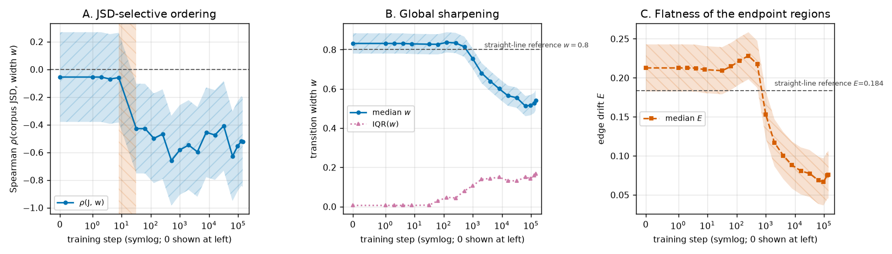

**Figure 1.** Onset of ordering (A) long before onset of plateau shape (B, C). x in all panels:
training step on a symmetric-log axis, so step 0 sits at the left edge next to step 1. **A** y:
Spearman $\rho$ between corpus next-token divergence $J$ and transition width $w$; the shaded band
(hatched `//`) is the simultaneous 95% band over all 20 checkpoints, the horizontal dashed line is
$\rho = 0$, and the vertical hatched stripe marks the step 8 → 32 onset bracket. **B** y: transition
width; solid-circle series is the median $w$ over the 60 pairs with its simultaneous band, the
dotted-triangle series is the interquartile range of $w$, and the dashed horizontal line is the
straight-line reference $w = 0.8$. **C** y: edge drift $E$ (dashed squares, with simultaneous band)
against its straight-line reference $E = 0.184$.

The correlation is flat and centred on zero for the first five measured checkpoints —
$\rho_0 = \rho_1 = \rho_2 = -0.056$, $\rho_4 = -0.070$, $\rho_8 = -0.060$, all with bands comfortably
spanning zero — and then drops to $\rho_{32} = -0.428$ $[-0.753, -0.104]$, the first checkpoint whose
band excludes zero. It stays below zero at every one of the remaining 14 checkpoints, ending at
$\rho_{143000} = -0.525$ $[-0.849, -0.200]$, which reproduces the upstream final-checkpoint value
exactly. By step 32 the effect has reached 82% of its final magnitude.

Panels B and C show what makes this surprising: at step 32 **nothing has sharpened**. Median
$w = 0.827$, against 0.831 in the untrained model and 0.8 for a straight line; median $E = 0.209$,
*above* the straight-line 0.184. The model has no plateaus, and it has already sorted the pairs.

The ordering at that moment lives in an extremely small dynamic range, and we show it rather than
smoothing it away: the interquartile range of $w$ at step 32 is **0.008**, and the five
corpus-divergence quintile medians are 0.8298, 0.8279, 0.8275, 0.8267, 0.8241 — perfectly monotone in
$J$, spanning 0.0057 in total. A rank statistic is the right tool for exactly this situation, but the
honest reading is that the ordering is real and reliable while the thing being ordered is, at step 32,
a set of near-identical curves. What Result 3 adds is that this tiny early ordering is not a
coincidence of the ranking: the *change* in width during that interval is itself divergence-ordered.
Result 8 adds the complementary limit — the step-32 ranking is not yet the final ranking in detail,
only in its divergence-aligned part.

### Result 2 — Global plateau shape appears between step 1000 and step 2000, ~60× later

Figure 1B and 1C also carry the second onset. Median $w$ sits within 0.02 of the untrained value
through step 512 (0.831, 0.831, 0.831, 0.831, 0.829, 0.827, 0.827, 0.837, 0.834, 0.814), then falls
to 0.753 at step 1000, 0.680 at 2000, 0.639 at 4000, and on down to 0.512 at 64000. Edge drift
tracks it, falling from 0.217 at step 512 to 0.153 at 1000, 0.117 at 2000 and 0.069 at 64000 —
well below the straight-line 0.184, confirming that the narrowing transitions really do have flat
ends and are not just steep-in-the-middle ramps.

Applying the prespecified shape rule: at step 1000 the median width's simultaneous band still reaches
0.805, just failing the 0.8 threshold; at steps 2000 and 4000 both $w$ (bands up to 0.732 and 0.691)
and $E$ (bands up to 0.147 and 0.131) clear their references. The shape onset bracket is therefore
**after step 1000, by step 2000**, against **after step 8, by step 32** for the ordering — a
separation of roughly two orders of magnitude in training steps.

### Result 3 — The largest single sharpening event is blind to corpus statistics

A cross-sectional correlation cannot tell an ordering that is being *created* from one that is merely
being *carried forward*. To separate them we ask, for each interval between adjacent checkpoints,
whether corpus divergence predicts the width change produced *inside that interval*.

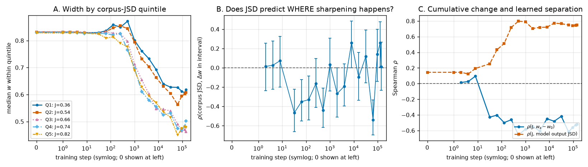

**Figure 2.** Where in training the divergence-selectivity is actually generated. x in all panels:
training step (symmetric-log). **A** y: median transition width within each corpus-divergence
quintile, Q1 (lowest $J$, solid circles) through Q5 (highest $J$, dashed triangles); the legend gives
each quintile's median $J$ in bits. **B** y: Spearman correlation between $J$ and the width change
$\Delta w$ produced within the interval ending at that step, with pointwise 95% bootstrap bars;
dashed line at zero. **C** y: Spearman correlation of $J$ with the cumulative change since step 0
(solid circles) and with the model's own endpoint output divergence (dashed squares).

The interval test independently confirms the step 8 → 32 onset: in that interval
$\rho^{\Delta} = -0.466$ $[-0.663, -0.223]$, even though the median width change is only $-0.0011$.
Corpus divergence predicts which pairs move, at a point when almost nothing moves.

The dissociation appears at the other end. The single largest global sharpening happens between step
512 and step 1000 — median $\Delta w = -0.0618$ $[-0.0721, -0.0537]$, Wilcoxon $p = 1.9\times10^{-11}$,
a change 56× larger than the step 8 → 32 interval produced — and in that interval corpus divergence
predicts nothing: $\rho^{\Delta} = +0.035$ $[-0.241, +0.307]$. The same pattern holds for step
4000 → 8000 ($\rho^{\Delta} = +0.258$, median $\Delta w = -0.033$; not distinguishable from chance
once all 18 intervals are accounted for, see Result 7) and step 16000 → 32000
($\rho^{\Delta} = +0.119$, median $\Delta w = -0.024$). Selectivity does reappear in some later
intervals — step 256 → 512 ($-0.439$), step 1000 → 2000 ($-0.267$), step 32000 → 64000 ($-0.540$) —
so the process is not confined to the first 32 steps, but the bulk sharpening events themselves are
divergence-blind.

Figure 2A makes the same point visually: all five quintile trajectories start on top of each other
near 0.831, fan out slightly and in the correct order by step 32, and then all five fall together
through the step-1000 sharpening while keeping their relative order.

Figure 2C adds the timing of a third quantity. The correlation between corpus divergence and the
model's *own* endpoint output divergence is 0.145 at step 0, still only 0.253 at step 32 where the
ordering onset occurs, and reaches 0.720 by step 512 and 0.798 by step 1000. The model's predictions
come to reflect corpus divergence on the same timescale as global sharpening, well after the width
ordering is in place. Temporal order alone does not establish a mechanism, and we do not claim one.

### Result 4 — Output movement concentrates onto the boundary, on the shape timescale

Narrow $d(t)$ could in principle be an artefact of the distance summary. The direct question is
whether the model's full next-token distribution actually stops changing away from the boundary. To
answer it we track how the total output movement is distributed along the path.

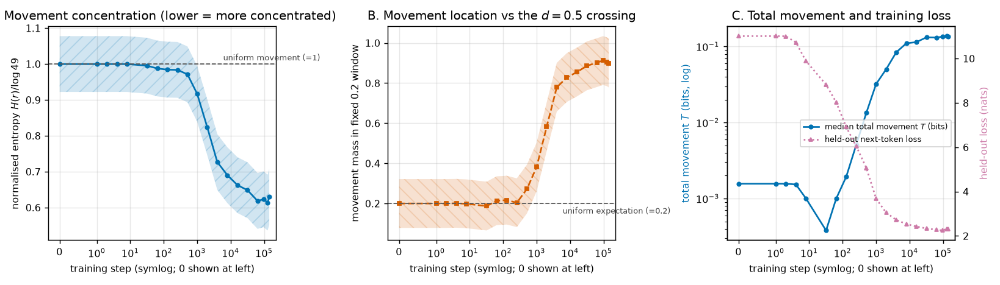

**Figure 3.** Movement concentration develops with plateau shape, not with the ordering. x in all
panels: training step (symmetric-log). **A** y: normalised entropy $H(r)$ of the movement profile
with its simultaneous band; the dashed line at 1 is the uniform-movement reference and lower means
more concentrated. **B** y: fraction of total movement inside the fixed 0.2-wide window centred on the
$d = 0.5$ crossing (dashed squares, with band); the dashed line at 0.2 is the uniform expectation.
**C** left y (solid circles, log scale): median total movement $T$ in bits; right y (dotted
triangles): held-out next-token loss in nats.

Movement is exactly uniform in the untrained model ($H = 1.000$, window mass $0.200$) and stays that
way through step 512 ($H = 0.971$, mass $0.272$). It then concentrates steadily: $H = 0.917$ and mass
$0.382$ at step 1000, $H = 0.824$ and mass $0.583$ at 2000, $H = 0.690$ and mass $0.828$ at 8000,
reaching $H = 0.630$ and mass $0.900$ at the final checkpoint. By the end of training, **90% of the
model's entire output change along the path happens in the middle 20% of it.** This answers the
question the plan posed with a clear yes, and it puts movement concentration on the *shape* timeline
(onset around step 1000–2000), not the ordering timeline.

Figure 3C shows that concentration is not the model simply moving less: total movement *grows* by two
orders of magnitude, from 0.0016 bits at step 0 to 0.135 bits at the end. The model moves much
further and does it in a much smaller region. The held-out loss on the same axis falls monotonically
from 11.010 to 2.245 nats and gives the training-progress context for every timing claim here.

The shape of the profile itself, in Figure 4, is the most direct picture of the phenomenon.

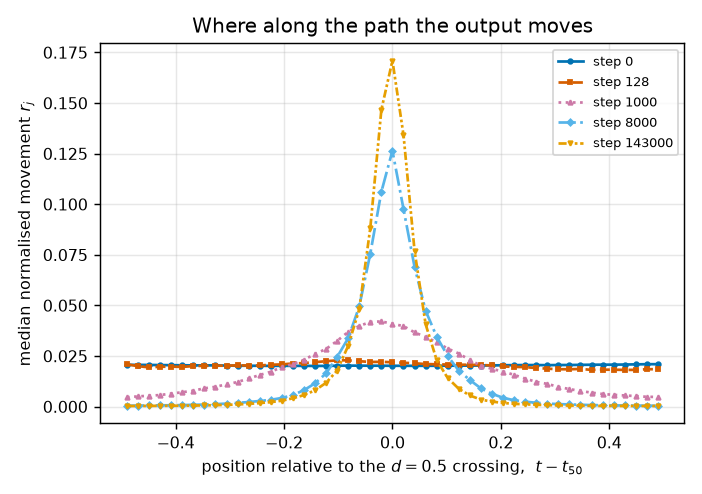

**Figure 4.** From a flat profile to a spike. x: interpolation position relative to the $d = 0.5$
crossing, $t - t_{50}$, so 0 is the boundary. y: median normalised movement $r_j$ across all 60 pairs
and 3 carrier sentences. The five series are checkpoints — step 0 (solid circles), 128 (dashed
squares), 1000 (dotted triangles), 8000 (dash-dot diamonds) and 143000 (long-dash triangles). At steps
0 and 128 the profile is flat at $1/49 \approx 0.020$; by step 143000 a single step at the crossing
carries 0.17 of the total movement, roughly 8× the uniform value.

### Result 5 — The late widening is real, and reproduces on 1,000 independent pairs

Median width does not decrease monotonically to the end: it bottoms out at 0.512 at step 64000 and
rises to 0.517, 0.528 and 0.541 at steps 96000, 128000 and 143000. A median over 60 pairs is easy to
move by chance, so this was flagged upstream as possibly noise. We re-test it on the frozen
1,000-pair bank (Figure 5), with inference that accounts for the reuse of endpoint tokens.

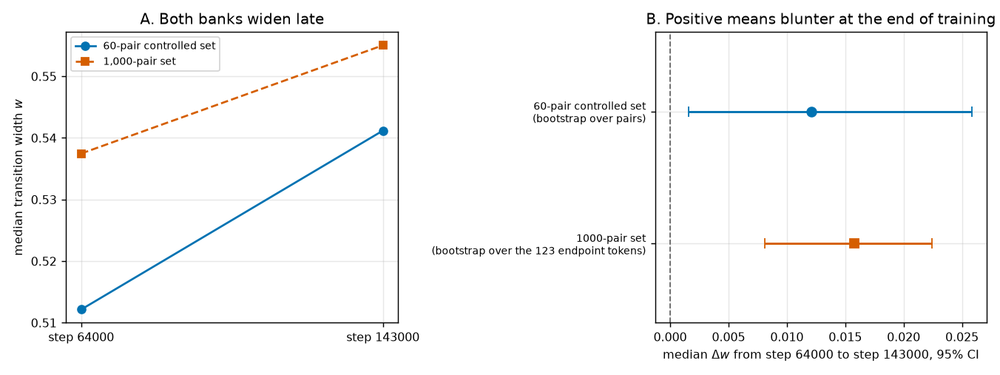

**Figure 5.** The late reversal survives on the larger bank. **A** x: the two checkpoints, step 64000
and step 143000; y: median transition width $w$. Solid circles are the 60-pair controlled set, dashed
squares the 1,000-pair set. **B** x: median paired change $\Delta w$ from step 64000 to step 143000,
with 95% intervals; positive means blunter at the end of training; the dashed vertical line is zero.
y lists the two banks and the resampling unit used for each — pairs for the controlled set, the 123
endpoint tokens for the 1,000-pair set.

On the 60-pair set, median $\Delta w = +0.0121$ $[+0.0016, +0.0259]$, with 38 of 60 pairs blunter
(paired Wilcoxon $p = 0.0052$). On the 1,000-pair set, median $\Delta w = +0.0158$
$[+0.0081, +0.0224]$ with 65.1% of pairs blunter (95% CI 57.6% to 71.8%) — a tighter interval, in the same
direction, under the clustered bootstrap that is the conservative choice for that bank. The reversal
is a property of this training run, not of the small bank.

Two things coincide with the late widening and are worth recording without over-reading. The learning
rate is in the tail of its cosine decay ($1.26\times10^{-4}$ at step 64000 down to $2.0\times10^{-5}$
at the end), and our held-out loss also stops improving over the same window, rising from 2.245 nats
at step 96000 to 2.314 at 128000 and 2.322 at the end. Whether these are causally linked is not
something a single training run can answer.

### Result 6 — The step 8 → 32 onset bracket replicates on the 1,000-pair bank

The onset in Result 1 rests on 60 pairs, so the plan required re-running the two checkpoints that
*define* the bracket on the larger bank. We assayed all 1,000 pairs at step 8 and step 32 and applied
the same endpoint-clustered bootstrap; Figure 6 puts both banks on one axis.

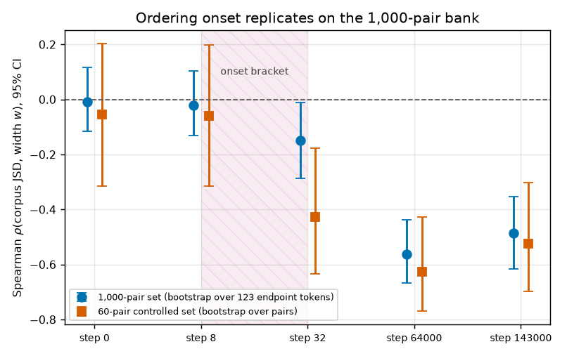

**Figure 6.** The bracket survives on an independent, 17× larger bank. x: the five checkpoints
measured on both banks; y: Spearman $\rho$ between corpus divergence and transition width, with 95%
intervals. Circles are the 1,000-pair set (interval from the dyadic bootstrap over its 123 endpoint
tokens); squares are the 60-pair controlled set (bootstrap over pairs, shown pointwise here). The
hatched stripe marks the step 8 → 32 onset bracket; the dashed line is $\rho = 0$.

The large bank places the onset in the same interval: $\rho = -0.021$ $[-0.132, +0.104]$ at step 8,
which contains zero, and $\rho = -0.149$ $[-0.286, -0.011]$ at step 32, which excludes it. It also
reproduces the endpoints of the trajectory — $-0.008$ $[-0.117, +0.115]$ at step 0, $-0.563$
$[-0.668, -0.438]$ at step 64000, $-0.486$ $[-0.617, -0.354]$ at step 143000 — and shows no
sharpening at step 32 either (median $w = 0.828$, IQR 0.007, against 0.831 at step 0).

The effect size at step 32 is markedly smaller on the large bank ($-0.149$ vs $-0.428$), while by the
final checkpoint the two banks nearly agree ($-0.486$ vs $-0.525$). That gap is worth stating
plainly: the 1,000-pair bank is not matched on frequency or surprisal, reuses endpoint tokens, and
fills the crowded middle of the divergence range, so it is the harder test and it dilutes a weak
early signal. The bracket replicates; the *magnitude* of the step-32 ordering should be read from the
controlled bank, with the large bank establishing that the timing is not an artefact of 60 pairs.

### Result 7 — Chance never produces this ordering, on either bank

Every interval so far is a bootstrap, which measures wobble rather than chance. The claim that most
needs a chance reference is the earliest one: at step 32 the ordering lives on a width spread of
0.006, and a reader is entitled to ask whether rank structure that fine is simply what *any* labelling
of 60 pairs would give. We therefore recomputed each statistic under 20,000 label permutations, and
under the endpoint-label permutation for the clustered bank; Figure 7 shows both nulls.

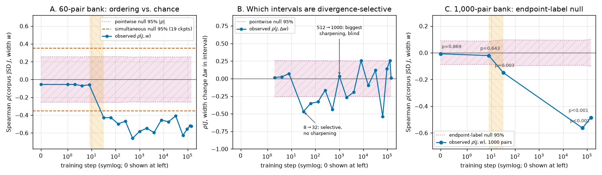

**Figure 7.** The observed ordering sits far outside what relabelling produces, and the two
divergence-blind intervals sit inside it. x in all panels: training step (symmetric-log). y in **A**
and **C**: Spearman $\rho$ between corpus divergence $J$ and transition width $w$; y in **B**:
$\rho$ between $J$ and the within-interval width change $\Delta w$, plotted at the interval's end
step. In every panel the hatched band bounded by dotted lines is the pointwise 95% envelope of
$|\rho|$ under the null, and the solid-circle series is the observed value. **A** (60-pair bank) adds
the dashed horizontal lines at $\pm 0.353$: the *simultaneous* null envelope covering all 19
checkpoints at once. The vertical hatched stripe in A and C marks the step 8 → 32 onset bracket;
**C** (1,000-pair bank, endpoint-label null) is annotated with each checkpoint's two-sided $p$.

The onset survives the strictest form of the test. Through step 8 the observed correlation lies well
inside the null envelope ($p = 0.67$, $0.67$, $0.67$, $0.60$, $0.65$ at steps 0, 1, 2, 4, 8); at step
32 it is outside it, $p = 0.0007$, and the family-wise value that pays for all 19 checkpoints at once
is $p^{\mathrm{fw}} = 0.0072$. Every later checkpoint has $p^{\mathrm{fw}} \le 0.013$. Chance
labellings of 60 pairs reach $|\rho| = 0.26$ pointwise and $0.35$ simultaneously, against an observed
$0.428$ — so the step-32 ordering is not what fine-grained noise looks like, even though the curves it
orders are nearly identical.

The interval statistic separates the two regimes just as sharply, and this is the test the
dissociation rests on. Step 8 → 32 gives $\rho^{\Delta} = -0.466$ with $p = 0.0003$ and
$p^{\mathrm{fw}} = 0.0035$ across all 18 intervals, while the largest sharpening event, step
512 → 1000, gives $p = 0.78$ — indistinguishable from a random relabelling. The interval that moves
width the most is, by this test, exactly as divergence-selective as chance.

The permutation also corrects one reading of Result 3. The positive $\rho^{\Delta} = +0.258$ at step
4000 → 8000 has a bootstrap interval that just excludes zero, but its permutation $p = 0.045$ does not
survive the 18-interval correction ($p^{\mathrm{fw}} = 0.55$). That interval is best described as
divergence-blind rather than as reversed selectivity; the four intervals that do survive correction
are step 8 → 32, 256 → 512, 1000 → 2000 and 32000 → 64000, all negative.

On the 1,000-pair bank the endpoint-label null does something the bootstrap could not: it prices the
clustering directly. Because those 1,000 pairs come from only 123 tokens, relabelling produces
$|\rho|$ up to 0.09 by chance — half again the 0.062 that 1,000 genuinely independent pairs would
give. Measured against that inflated bar, step 0 ($p = 0.87$) and step 8 ($p = 0.64$) are null, step
32 is not ($\rho = -0.149$, $p = 0.0031$, $p^{\mathrm{fw}} = 0.0082$), and both late checkpoints have
$p < 0.001$. The bracket that Result 6 established with a clustered bootstrap therefore holds under a
second, independent form of inference that makes no distributional assumption at all — which matters
because $-0.149$ was the weakest number in this report.

### Result 8 — At step 32 the model holds only the divergence-aligned part of the final ranking

Results 1 and 7 establish that corpus divergence orders the pairs at step 32. They do not establish
that this is the *same* ordering the trained model ends up with, and a reader should not assume it:
the step-32 widths span 0.006, and an ordering that fine could be discarded and re-derived later
without leaving a trace in $\rho_s$. Figure 8 tests it directly, by scoring every checkpoint's
per-pair ranking against the final model's.

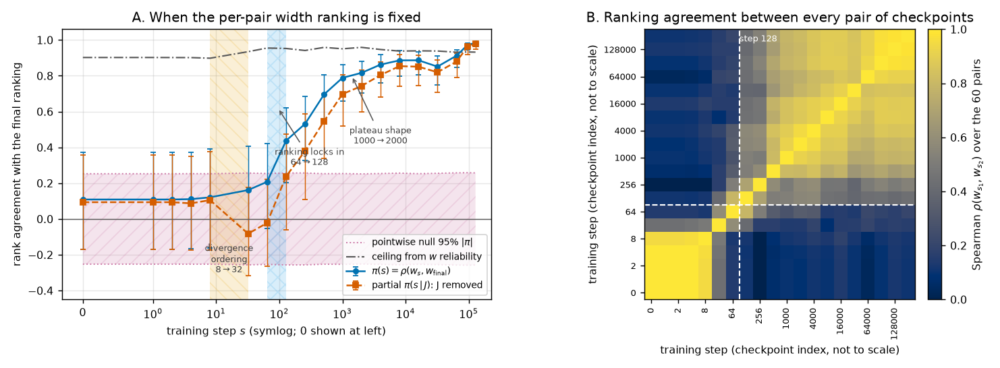

**Figure 8.** The width ranking locks in between step 64 and step 128 — after the ordering, before
the shape. **A** x: training step (symmetric-log). y: rank agreement with the final checkpoint's
ranking of the 60 pairs. Solid circles are $\pi(s)$, dashed squares are the partial version
$\pi^{\perp}(s)$ with corpus divergence $J$ removed, both with pointwise 95% bootstrap bars; the
hatched band between dotted lines is the pointwise 95% envelope of $|\pi|$ under 20,000 pair
relabellings; the dash-dot gray line is the attenuation ceiling $\pi_{\max}$ set by the reliability
of $w$. The left vertical stripe (`\\` hatch) is the step 8 → 32 divergence-ordering bracket, the
right one (`xx` hatch) the step 64 → 128 ranking bracket. **B** x and y: the 20 checkpoints in
training order (index spacing, not to scale); colour: Spearman $\rho$ between the per-pair widths at
those two checkpoints, on the `cividis` scale at right. The dashed white lines mark step 128.

Persistence is flat and inside the chance envelope for every checkpoint through step 64:
$\pi = +0.109$ $[-0.169, +0.373]$ at step 0, $+0.121$ at step 8, $+0.161$ $[-0.089, +0.405]$ at step
32 ($p = 0.21$), $+0.207$ at step 64 ($p = 0.11$). It then jumps to $+0.437$ $[+0.202, +0.623]$ at
step 128 — the first checkpoint outside the envelope, $p = 0.0007$ and $p^{\mathrm{fw}} = 0.0053$
across all 19 checkpoints — and climbs steadily after that: $0.532$ at 256, $0.696$ at 512, $0.788$
at 1000, and above $0.85$ from step 4000 on.

The partial version is what makes this a statement about the *ordering* rather than about widths in
general. At step 32, $\pi^{\perp} = -0.082$ $[-0.317, +0.177]$, $p = 0.53$: once corpus divergence is
removed, the step-32 ranking and the final ranking have nothing in common. The observed $\pi = 0.161$
is close to the $(-0.428)\times(-0.525) = 0.225$ that the two divergence correlations alone imply. So
the model at step 32 holds the divergence-aligned component of the final ordering and no more.
Pair-specific detail beyond $J$ first clears the family-wise bar at step 256
($\pi^{\perp} = +0.380$, $p^{\mathrm{fw}} = 0.0275$; at step 128 it is $+0.238$ with
$p^{\mathrm{fw}} = 0.39$).

The obvious objection is attenuation — that $w$ at step 32 is too noisy to agree with anything — and
it does not hold. Across three unrelated carrier sentences, per-pair widths agree at
$\bar r = 0.830$ at step 32, giving a reliability of 0.936 and a ceiling of $\pi_{\max} = 0.935$.
Width at step 32 is a reliable measurement of a stable pair property, it correlates with corpus
divergence at $-0.428$, and it still shares only 0.161 of its ranking with the final model. The same
holds at step 0, where reliability is already 0.872: even the untrained network ranks the pairs
consistently across sentences, and that ranking is not the final one.

Figure 8B shows the same thing as structure rather than as a trajectory. Checkpoints from step 0
through step 64 form a block that agrees with itself ($\rho(w_0, w_{32}) = 0.435$) and disagrees with
everything later; from step 128 on, every checkpoint agrees with every later one, with the agreement
rising smoothly towards the diagonal. Step 128 is where the model stops rearranging which pairs are
sharp relative to each other.

This adds a third clock, and it tightens rather than weakens the report's main claim. The three
events are ordered: divergence starts selecting pairs (step 8 → 32), the pair ranking becomes the
final one (step 64 → 128), and only much later do the transitions actually become plateaus
(step 1000 → 2000). Corpus divergence is not merely present before the shape — it is the *first*
component of the final ordering to appear, ahead of the pair-specific detail that fills in around it.

### Result 9 — The released `step16` revision of Pythia-1.4B-deduped is not a step-16 model

The scan surfaced a data-integrity problem that anyone studying Pythia's early checkpoints should
know about. We report it because it would silently corrupt exactly the kind of early-training
analysis this report performs, and because it is cheap to check and nobody appears to check it.
Figure 9 shows how the revision stands out behaviourally, what its weights actually are, and that no
other revision shares the defect.

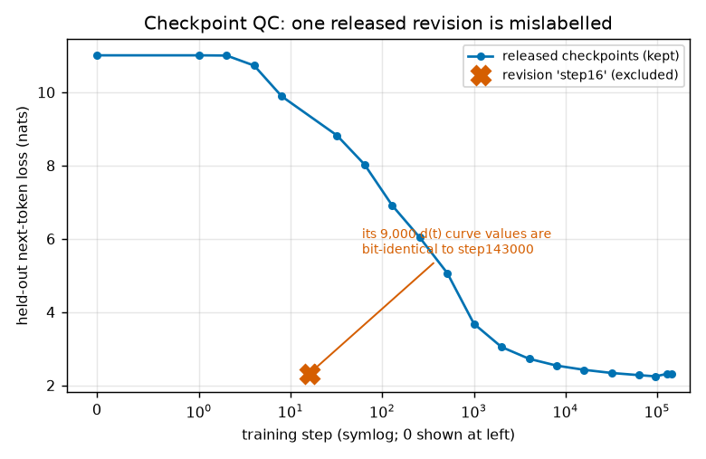

**Figure 9.** Revision `step16` ships the final model's weights, and it is the only revision that
does. **A** x: training step (symmetric-log); y: held-out next-token loss in nats on the frozen
256-row sample; connected circles are the 20 checkpoints kept, the large cross is `step16`. **B**
x: the revision compared against `step143000`; y: how many of 10 sampled tensors have byte-identical
contents (embeddings, unembedding, final layer norm, and the attention output weight and bias of
blocks 0, 11 and 23); the label above each bar reports whether the *whole* 2.63 GiB payload digest
matches. **C** x: training step (symmetric-log); y: length in bytes of the safetensors JSON header
for each of the 21 revisions; circles have a `__metadata__` field, the cross does not.

The behavioural evidence came first. `step16`'s held-out loss is 2.320 nats where step 8 gives 9.889
and step 32 gives 8.824 — a 6.5-nat improvement and 6.5-nat regression inside 24 steps at a learning
rate of $2\times10^{-6}$, which no optimiser trajectory produces (Figure 9A). Its 60 pairs × 3
sentences × 50 positions = 9,000 measured $d(t)$ values are bit-identical to `step143000`'s (maximum
absolute difference exactly $0$), as are its 8,820 movement values.

The byte-level check settles what it is. Streaming each revision's tensor payload from the Hugging
Face CDN and hashing it gives, for `step16` and `step143000`, the *same* SHA-256 over all 2.63 GiB:
`fbd54ccec4e0f5ee…`. Its two neighbours differ from the final model, as they must (`step8`
`48c2b6a93871…`, `step32` `0459bf847197…`). All 10 individually hashed tensors match `step143000`
byte for byte and none match `step8` or `step32` (Figure 9B). The revision does not merely behave
like the final model — it *is* the final model's parameters, served under an early-checkpoint name.

What differs is only packaging: `step16`'s header omits the `__metadata__` field
(`{"format": "pt"}`) that all 20 other revisions carry, making its header 32 bytes shorter and its
file 2,829,329,888 bytes against 2,829,329,920 elsewhere (Figure 9C). That is the signature of a
file re-serialised by a different tool, and it is a 34 KB range request away — a check anyone can run
before spending GPU hours on a checkpoint.

The audit says the damage is contained. Across all 21 revisions this study touches, the other 20
share one byte-identical header layout (34,296 bytes, 292 tensors, identical dtypes, shapes and
offsets), so for them equal weights would force equal file digests; their 20 published SHA-256 digests
are all distinct, and none equals `step143000`'s. There is no second duplicated checkpoint hiding
where our loss check would not have flagged it — for instance among the closely spaced late
checkpoints, where two adjacent models genuinely do look alike.

The cost to this report is a resolution limit, not a bias: `step16` is excluded from every trajectory
here, and because no genuine step-16 weights exist in this repository, the ordering-onset bracket
cannot be narrowed below **after step 8, by step 32** from released artefacts. Its assay output is
retained in `results/assay_step16.json`, the behavioural checks in `results/ckpt_qc.json`, and the
byte-level evidence in `results/step16_forensics.json` and `results/revision_audit.json`.

### Result 10 — The separation is not an artefact of how "width" is defined

Every number above flows from one metric, $w = t(0.9) - t(0.1)$, with levels fixed by convention. If
the ~60× separation were an artefact of that choice it would be the most consequential error in the
report, so we re-ran both prespecified onset rules on all five width definitions $w_a$ from Methods
(Figure 10).

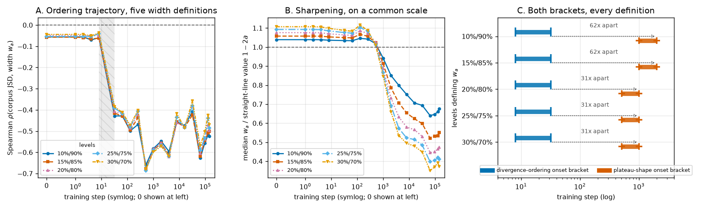

**Figure 10.** Both onsets, and the gap between them, survive every width definition. The series in
panels A and B are the five level pairs defining $w_a$: 10%/90% (solid circles), 15%/85% (dashed
squares), 20%/80% (dotted up-triangles), 25%/75% (dash-dot diamonds), 30%/70% (long-dash
down-triangles). **A** x: training step (symmetric-log); y: Spearman $\rho$ between corpus
divergence $J$ and $w_a$; the hatched vertical stripe is the step 8 → 32 bracket. **B** x: training
step (symmetric-log); y: median $w_a$ divided by its own straight-line reference $1 - 2a$, which puts
all five definitions on one scale — 1.0 is the no-plateau value and the dashed line marks it.
**C** x: training step (log); y: the five definitions. Each row shows the divergence-ordering bracket
(left bar) and the plateau-shape bracket (right bar), with the dotted arrow and the label giving the
ratio between the two closing checkpoints.

The ordering onset is completely insensitive to the definition: **all five give the same bracket,
after step 8 and by step 32**, and the correlation at step 32 moves only from $-0.428$ to $-0.385$
across the whole range. The interval statistic is steadier still — $\rho^{\Delta}$ over step 8 → 32
is $-0.466$, $-0.461$, $-0.456$, $-0.452$, $-0.452$ at the five levels. The early divergence
selectivity is a property of the curves, not of where we place the ruler's tick marks.

The shape onset does move, and in the direction one would predict: the three wider levels
($a \ge 0.20$), which only look at the steep middle of the curve, detect sharpening one checkpoint
earlier, giving **after step 512, by step 1000** instead of after step 1000, by step 2000. The
separation between the two events is therefore 31× rather than 62× under those definitions — smaller,
but the same phenomenon and the same order of events. No definition brings the two brackets within a
factor of 30 of each other.

The dissociation of Result 3 also holds throughout: over step 512 → 1000, the largest sharpening
event, $\rho^{\Delta}$ is $+0.035$, $+0.142$, $+0.229$, $+0.275$, $+0.312$ at the five levels — never
negative, so that interval is never divergence-selective under any definition, and at the wider levels
it mildly favours the *low*-divergence pairs. (Those four alternative values were not permutation-tested;
at the primary definition the permutation $p$ is 0.78.) Figure 10B shows why the wider definitions are
more sensitive rather than differently behaved: all five curves sit at or above their own straight-line
value until step 512, then fall together, with the wider bands simply falling faster.

### Result 11 — The third clock does not depend on which checkpoint we call "final"

Result 8's bracket is defined against step 143000, the last released checkpoint. That reference is a
choice about where training stopped being published, not a property of the model: if the ranking kept
drifting through the last third of training, "the ranking locks in at step 128" would really mean
"step 128 is where the model starts to resemble what it happens to look like at step 143000". Since
Result 5 shows the widths *do* still move late — transitions get blunter between step 64000 and the
end — this is a live worry rather than a formality. Figure 11 re-runs the whole persistence analysis
against five references, applying the same two-in-a-row family-wise rule to each.

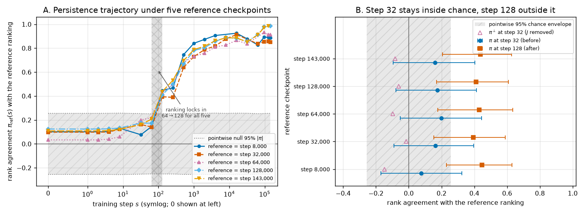

**Figure 11.** The step 64 → 128 bracket is the same under every reference. **A** x: training step
(symmetric-log). y: rank agreement $\pi_{\mathrm{ref}}(s)$ between the widths at step $s$ and the
widths at the reference checkpoint. The five series are the references: step 8000 (solid circles),
32000 (dashed squares), 64000 (dotted up-triangles), 128000 (dash-dot diamonds), 143000 (long-dash
down-triangles); each series omits the point where it would score against itself. The hatched
horizontal band between the dotted lines is the pointwise 95% envelope of $|\pi|$ under 20,000 pair
relabellings; the hatched vertical stripe (`xx`) is the step 64 → 128 bracket. **B** x: rank
agreement with that row's reference; y: the five reference checkpoints. Filled circles are $\pi$ at
step 32, filled squares $\pi$ at step 128, both with 95% bootstrap intervals; open triangles are
$\pi^{\perp}$ at step 32, with corpus divergence removed. The hatched vertical band is the pointwise
95% chance envelope at step 32.

Every reference returns **after step 64, by step 128** — the identical bracket. At step 128 the
agreement is $+0.447$, $+0.394$, $+0.430$, $+0.410$, $+0.437$ against the five references, with
family-wise $p$ of 0.0045, 0.018, 0.0059, 0.012 and 0.0050; at step 64 no reference comes close
($p^{\mathrm{fw}}$ between 0.47 and 0.89). The step-32 reading is equally stable: $\pi$ there is
$+0.077$, $+0.163$, $+0.200$, $+0.174$, $+0.161$, inside the chance envelope in every case
($p \ge 0.13$), and the divergence-free part $\pi^{\perp}$ is at or below zero for all five ($-0.147$,
$-0.015$, $-0.098$, $-0.062$, $-0.082$). The claim that at step 32 the model holds the
divergence-aligned component of its mature ordering and nothing more is therefore a statement about
the mature model generally, not about the last checkpoint in particular.

Figure 11A also shows why: the five trajectories are nearly on top of each other from step 128
onward, separating only above step 8000 where each curve bends up towards its own reference. The late
widening of Result 5 changes the *magnitude* of the widths without reshuffling which pairs are
sharpest — agreement between step 8000 and step 143000 is 0.89 — which is why the choice of reference
does not reach back to the bracket.

### Result 12 — No single carrier sentence is carrying the result

The three onsets are measured on widths that were averaged over three sentence frames, and averaging
is a good way to turn one context's quirk into an apparently general fact. If, say, only `"I thought
it was"` happened to rank the pairs by divergence at step 32, the median of three would still show a
correlation, and the report would be reading a property of one English sentence as a property of
training. Figure 12 removes the averaging: each pair's width is recomputed from a single context, and
all three onset rules are re-run on each of the three trajectories separately.

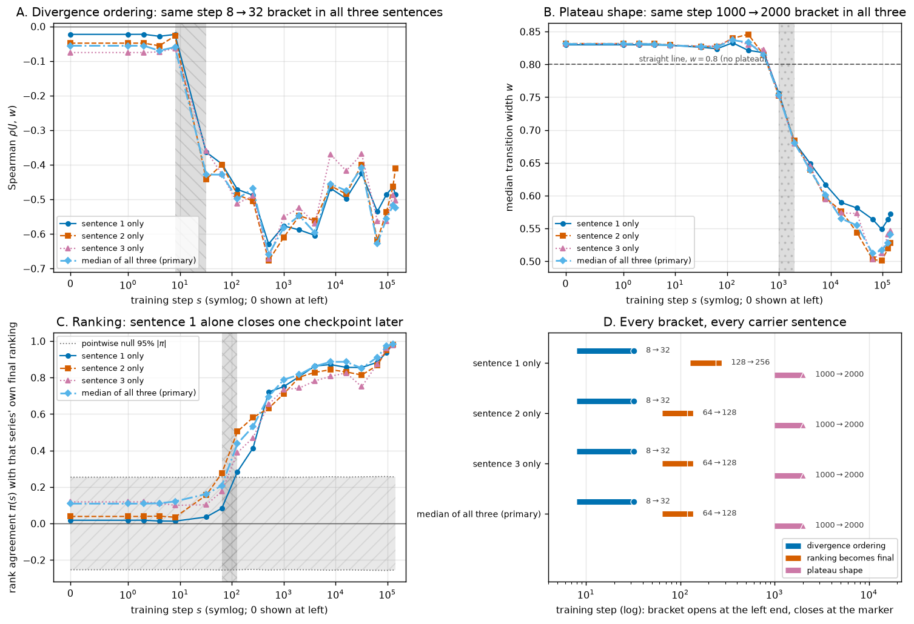

**Figure 12.** All three onsets reproduce inside each carrier sentence on its own. The series in
**A**, **B** and **C** are the frames used to build the width — sentence 1 `"The thing was"` (solid
circles), sentence 2 `"They said it was"` (dashed squares), sentence 3 `"I thought it was"` (dotted
triangles), and the primary median of all three (dash-dot diamonds). **A** x: training step
(symmetric-log); y: Spearman $\rho(J, w)$; hatched stripe (`\\`) = the step 8 → 32 ordering bracket.
**B** x: training step (symmetric-log); y: median transition width $w$; dashed horizontal line = the
straight-line reference 0.8; hatched stripe (`..`) = the step 1000 → 2000 shape bracket. **C** x:
training step (symmetric-log); y: rank agreement $\pi(s)$ between the widths at step $s$ and that
same series' own final widths; hatched horizontal band between the dotted lines = the pointwise 95%
envelope of $|\pi|$ under 20,000 pair relabellings; hatched stripe (`xx`) = the step 64 → 128 ranking
bracket. **D** x: training step (log); y: the four width definitions; each row shows the three
brackets as bars from the opening to the closing checkpoint, labelled with those two steps.

The ordering bracket is **step 8 → 32 in every single sentence**, and so is the shape bracket at
step 1000 → 2000. The per-sentence correlations at step 32 are $-0.363$, $-0.442$ and $-0.359$
against $-0.428$ for the median, each with a simultaneous band excluding zero, and the median widths
at step 32 are 0.826, 0.827 and 0.828 — no plateau in any frame. That the weakest single frame still
clears the bar on 60 pairs is the useful part: the ~60× separation is not an artefact of pooling
three contexts, and it does not need pooling to be visible.

The one bracket that moves is the third clock, and it moves in the direction attenuation predicts.
Sentence 1 alone closes at step 256 rather than 128 ($\pi_{128} = +0.284$, $p^{\mathrm{fw}} = 0.19$;
$\pi_{256} = +0.413$, $p^{\mathrm{fw}} = 0.012$), while sentences 2 and 3 return step 64 → 128 like
the primary analysis ($\pi_{128} = +0.504$ and $+0.388$). This is the expected cost of dropping two
thirds of the measurement: at step 128 a single context can reach at most $\pi_{\max} = 0.871$ against
0.953 for the median of three, and step 64 to 256 is exactly the stretch where $\pi$ climbs through
the chance envelope, so a noisier series needs one more checkpoint to clear it. No frame ever reverses the order of the three events, and none places the ranking bracket
anywhere near either of the other two.

### Result 13 — At its onset the ordering is a top-quintile effect, not a graded one

Everything above dates *when* corpus divergence starts ordering the pairs. It does not say **which
pairs** produce that ordering, and the two readings differ in what they claim about the model. A
graded relation at step 32 would mean the model has already spread all 60 pairs along a
divergence-shaped axis. A top-quintile effect would mean something narrower and more mechanical: the
handful of pairs with the most distinct corpus continuations pull away first, and the rest are still
interchangeable. Figure 13 separates these by deleting one divergence quintile at a time and
re-running the ordering rule on what is left.

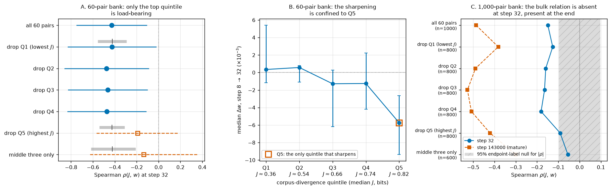

**Figure 13.** The step-32 ordering lives in the highest-divergence quintile; the graded relation
across the bulk of the range arrives later. **A** x: Spearman $\rho(J, w)$ at step 32 on the 60-pair
bank; y: the subset used, from all 60 pairs down to the middle three quintiles. Circles (solid bars)
= subsets whose simultaneous 95% band still excludes zero, open squares (dashed bars) = subsets whose
band includes zero; bars are the simultaneous band. The gray bar above a row is the 2.5–97.5%
envelope of $\rho_{32}$ over 4,000 *random* subsets of that same size, with its median tick — the
size-matched control. **B** x: corpus-divergence quintile Q1 (lowest $J$) to Q5 (highest), labelled
with each quintile's median $J$ in bits; y: median width change $\Delta w$ over step 8 → 32, in units
of $10^{-3}$, with 95% bootstrap intervals; the dotted line is zero and the open square marks Q5.
**C** x: Spearman $\rho(J, w)$ on the 1,000-pair bank; y: the same subsets, with the number of pairs
each retains. Circles (solid) = step 32, squares (dashed) = step 143000; the hatched band is the 95%
envelope of $|\rho|$ under 20,000 endpoint-label permutations.

Deleting the **lowest** divergence quintile changes nothing: $\rho_{32}$ goes from $-0.428$ to
$-0.426$, which is exactly the median of random 46-pair subsets ($u = 0.49$). The same holds for Q2,
Q3 and Q4, all of which leave $\rho_{32}$ between $-0.46$ and $-0.48$ with a band excluding zero, and
the step 8 → 32 bracket intact. Deleting the **highest** quintile collapses it: $\rho_{32} = -0.191$
with a band spanning zero ($p^{\mathrm{fw}} = 0.77$), and the ordering bracket moves from step 8 → 32
out to step 64 → 128. That is not the cost of dropping 12 pairs — every one of the 4,000 random
48-pair subsets gave a *more* negative correlation ($u = 1.000$, random median $-0.425$). Removing
both tails leaves $\rho_{32} = -0.134$ ($u = 0.996$) and pushes the bracket to step 256 → 512.
Panel B says the same thing in the units the effect is actually made of: over step 8 → 32, quintiles
Q1 through Q4 do not move at all (median $\Delta w$ from $+0.0006$ to $-0.0013$, every interval
covering zero), while Q5 sharpens by $-0.0057$ $[-0.0094, -0.0026]$.

The obvious objection is power: the 60-pair bank holds only 10 to 14 pairs per quintile, so "no
graded relation in the middle" could just mean "not enough pairs in the middle". The frozen
1,000-pair bank answers that, because it was built to fill exactly that crowded middle and leaves 600
pairs after both tails are removed. It agrees (Figure 13C). At step 32, dropping Q5 takes
$\rho$ from $-0.149$ ($p = 0.0023$) to $-0.091$ ($p = 0.081$), and the middle three quintiles alone
give $-0.055$ with $p = 0.35$ across 600 pairs. The same 600 pairs at step 143000 give $-0.300$ with
$p < 0.0001$ — so the bulk relation is measurable on this bank, is strongly present at the end of
training, and is absent at step 32. The middle of the divergence range is not too small to see; there
is nothing there yet.

This narrows the headline in a way worth stating plainly. What appears between step 8 and step 32 is
not a fully graded divergence axis but its top end: the pairs whose corpus continuations diverge most
(here $J \gtrsim 0.78$ bits) begin to sharpen while the rest stay flat and interchangeable. The
timing claim survives — that top-end separation happens ~60× before any plateau exists, it is what
the bracket dates, and it replicates on the larger bank — but the mechanism it points to is a
threshold-like early selection of the most distinguishable pairs, with the graded ordering across the
middle of the range filling in later, on its way to the mature $\rho = -0.486$.

### Result 14 — The graded ordering fills in by step 128, still before any plateau exists

Result 13 dates only half of the divergence axis. The top quintile detaches between step 8 and step
32; the graded relation across the middle of the range is absent at step 32 and strong at the end,
and nothing so far says when it appeared. The two possible answers change the report's central claim.
If the middle of the range only becomes ordered when the curves sharpen, then most of the divergence
axis is a by-product of sharpening after all and only its top end is genuinely early. To settle it we
ran the 1,000-pair bank at step 64, step 128, step 256, step 1000 and step 8000 — the checkpoints
missing between step 32 and step 64000 — and re-ran the ordering rule on the middle three quintiles
alone (Figure 14).

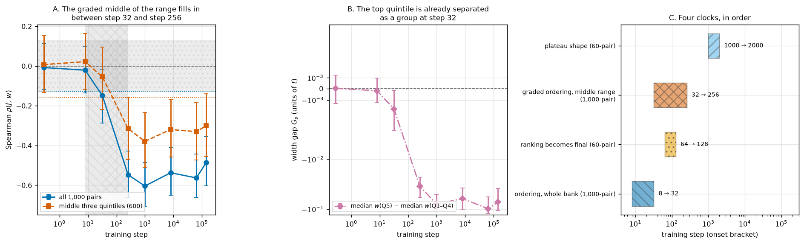

**Figure 14.** The graded ordering is complete by step 128, at which point the widths have not moved.
**A** x: training step (symmetric-log); y: Spearman $\rho(J, w)$ on the 1,000-pair bank, with 95%
dyadic endpoint-bootstrap bars. Solid circles = all 1,000 pairs, dashed squares = the 600 pairs in
divergence quintiles 2–4. The dotted horizontal band is the simultaneous 95% chance envelope for the
full bank under endpoint relabelling; the two dotted lines are each series' own one-sided
simultaneous threshold. Vertical stripes = the onset brackets: `\\` for the full bank (step 8 → 32),
`xx` for the middle three quintiles (step 64 → 128). **B** x: training step (symmetric-log); y: the
group gap $G_s$, median width of the top divergence quintile minus median width of the other four,
on a symmetric-log scale, with 95% bootstrap bars; the dashed line at 0 is no separation and negative
means the top quintile is sharper. **C** x: training step (log); y: the four dated events, each drawn
as a bar spanning its onset bracket and labelled with it.

The middle three quintiles (600 pairs, $J$ from 0.500 to 0.767 bits) go from $\rho = -0.055$ at step
32 — inside the chance envelope, $p = 0.34$ — through $-0.157$ at step 64 (which does not survive the
correction for ten checkpoints, $p^{\mathrm{fw}} = 0.088$) to $-0.257$ at step 128, with a 95%
interval of $[-0.409, -0.106]$ and $p^{\mathrm{fw}} = 0.0004$. It then rises slightly and holds for
the remaining 142,872 steps ($-0.315$, $-0.379$, $-0.319$, $-0.330$, $-0.300$). The prespecified
bracket rule returns **after step 32, by step 128**. The full bank moves one bracket earlier and is
already at mature strength by step 128: $-0.149$ at step 32, $-0.351$ at step 64, $-0.478$ at step
128, against a final $-0.486$.

What makes step 128 the informative checkpoint is what the widths are doing there: nothing. Median
$w$ over all 1,000 pairs is 0.832 at step 128, against 0.831 untrained, 0.828 at step 32, and a
straight-line reference of 0.8 — the bank is, if anything, a shade blunter than at initialisation.
The graded ordering is therefore complete, at essentially its mature strength, ~8× before the shape
bracket opens, at a checkpoint whose global width is indistinguishable from the untrained model's.
Figure 14B shows how the bank manages that without sharpening: at step 128 the top divergence
quintile sits at median width 0.806 while the other four sit at 0.837. The bank has been pulled apart
around an unchanged median.

The gap $G_s$ also dates the group-level event without going through a correlation at all. It is
$0.0000$ at step 0 and $-0.0002$ at step 8 (both $p > 0.65$), $-0.0018$ $[-0.0037, -0.0001]$ at step
32 ($p = 0.0040$), then $-0.0149$ at step 64, $-0.0308$ at step 128 and $-0.0794$ at step 1000. The
two halves of the ordering are thus separated by roughly half an order of magnitude in training time
and a factor of ~17 in size: a small but statistically clear detachment of the top fifth by step 32,
and the full graded spread across the range by step 128.

One limit on how tightly this dates the event. The large bank is measured at steps 0, 8, 32, 64, 128,
256, 1000, 8000, 64000 and 143000, so "by step 128" is the tightest statement the released checkpoint
spacing supports; the 60-pair bank has the same early checkpoints but, with 10–14 pairs per quintile,
cannot resolve a middle-range relation at all.

### Result 15 — The ranking lock-in and the graded ordering are one early event, not two

Results 8 and 14 date two things that sound different — the per-pair width ranking becoming the final
ranking (step 64 → 128, 60 pairs) and the graded divergence relation filling in across the middle of
the range (step 32 → 128, 1,000 pairs). Their windows overlap, and they were measured on different
banks, so the honest question is whether there are two events here or one. Running the 1,000-pair bank
at step 64 and step 128 puts both statistics on the same pairs at the same checkpoints, which is what
Figure 15 shows.

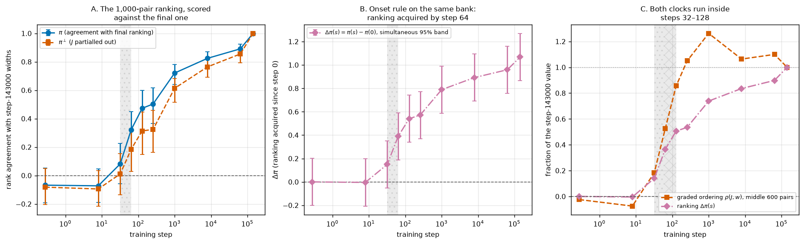

**Figure 15.** Both clocks run inside steps 32–128 on one bank. **A** x: training step
(symmetric-log); y: rank agreement between the 1,000 per-pair widths at that step and at step 143000.
Solid circles = $\pi_{\mathrm{L}}(s)$, dashed squares = $\pi^{\perp}_{\mathrm{L}}(s)$ with corpus
divergence partialled out; bars are 95% dyadic endpoint-bootstrap intervals. **B** x: training step
(symmetric-log); y: $\Delta\pi(s) = \pi_{\mathrm{L}}(s) - \pi_{\mathrm{L}}(0)$, the agreement training
has added, with its simultaneous 95% band over all ten checkpoints; dashed line at 0. **C** x:
training step (symmetric-log); y: each clock as a fraction of its own step-143000 value — the graded
ordering $\rho(J, w)$ over the middle 600 pairs (dashed squares) and the ranking $\Delta\pi$ (dash-dot
diamonds); dotted line at 1.0. Dotted vertical stripe in all panels = the step 32 → 64 ranking
bracket; the `xx` stripe in **C** = the step 64 → 128 graded-ordering bracket.

On this bank the ranking is acquired between step 32 and step 64: $\Delta\pi$ is $+0.150$ at step 32
with a simultaneous band of $[-0.053, +0.352]$ that includes zero, and $+0.389$ $[+0.187, +0.592]$ at
step 64, staying above the band at every later checkpoint. The part not explained by corpus
divergence moves with it — $\pi^{\perp}_{\mathrm{L}}$ is $+0.011$ $[-0.135, +0.154]$ at step 32 and
$+0.184$ $[+0.028, +0.329]$ at step 64 — so the model is acquiring genuinely pair-specific structure,
not just inheriting the divergence axis. That reproduces the 60-pair result of Result 8 on a 17×
larger bank and moves its bracket one checkpoint earlier.

The two clocks are therefore one checkpoint apart, in the order ranking → graded ordering, and both
sit inside step 32 → 128. Figure 15C makes the practical point: as a fraction of their final values
the two trajectories are almost superimposed, reaching about half of the final value by step 128 and
nearly all of it by step 1000. We read this as a single early episode in which *which* pairs will end
up with sharp boundaries is decided, rather than as two mechanisms that a 60-pair bank had blurred
together; the one-checkpoint offset is smaller than the released checkpoint spacing can resolve, and
we do not claim a causal order within it. What the episode does not include is any sharpening: at both
step 64 and step 128 the 1,000-pair median width (0.826 and 0.832) is that of the untrained model
(0.831).

### Result 16 — The 1,000-pair ranking bracket is not an artefact of the reference checkpoint

Result 15 scores every checkpoint against step 143000, which is where the released trajectory stops
rather than where the model settles — and Result 5 shows the widths are still moving between step
64000 and step 143000. If the ranking kept drifting late, some of the "agreement with the final
ranking" that appears at step 64 could be an accident of that one endpoint, and the third clock would
be a property of the reference rather than of the model. Result 11 answered this on the 60-pair bank;
Figure 16 answers it on the bank where Result 15 lives, by rebuilding the whole analysis against
step 8000 and step 64000 as well.

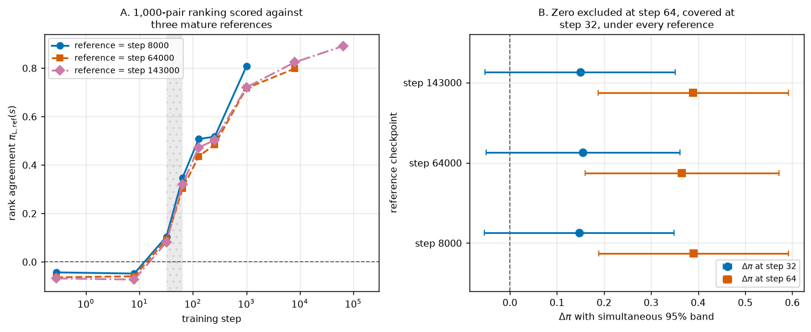

**Figure 16.** The step 32 → 64 bracket is the same under every reference. **A** x: training step
(symmetric-log); y: rank agreement $\pi_{\mathrm{L,ref}}(s)$ between the 1,000 per-pair widths at step
$s$ and at the reference. Series are the references — step 8000 (solid circles), step 64000 (dashed
squares), step 143000 (dash-dot diamonds); each series omits the point where it would score against
itself. Dotted vertical stripe = the step 32 → 64 bracket; dashed line at 0. **B** x: $\Delta\pi$ with
its simultaneous 95% band (dyadic endpoint bootstrap, 2,000 resamples of the 123 endpoint tokens); y:
the reference checkpoint. Circles = $\Delta\pi$ at step 32, squares = $\Delta\pi$ at step 64; dashed
vertical line at 0.

The prespecified rule returns **after step 32, by step 64 under all three references**. At step 32
$\Delta\pi$ is $+0.148$, $+0.155$ and $+0.150$ against step 8000, 64000 and 143000, with simultaneous
bands of half-width 0.201–0.206 that cover zero in every case; at step 64 it is $+0.391$, $+0.365$ and
$+0.389$, excluding zero in every case, and it stays outside the band at every later checkpoint. The
three trajectories in Figure 16A are nearly superimposed below step 1000 and only separate afterwards,
where the reference choice starts to matter for how much of the *late* drift a checkpoint has
absorbed — which is exactly the region the timing claim does not depend on.

The divergence-independent part is the one place the picture is not uniform. $\pi^{\perp}_{\mathrm{L}}$
at step 64 is $+0.202$ $[+0.043, +0.345]$ against step 8000 and $+0.184$ $[+0.028, +0.329]$ against
step 143000, but $+0.135$ $[-0.033, +0.283]$ against step 64000, whose interval just covers zero. So
the claim that pair-specific structure — not merely more of the divergence axis — is acquired at step
64 holds against two of the three references and is suggestive but not significant against the third.
The bracket itself, which is what the onset table reports, is unaffected: it rests on $\Delta\pi$,
which excludes zero under all three.

Together with Result 11, this makes all three clocks reference-robust: the ranking bracket is the same
under five references on the 60-pair bank and three on the 1,000-pair bank, so the ordering
divergence-selection → pair ranking → plateau shape does not depend on treating step 143000 as a
converged model.

### Summary of the onsets

The table below collects the timing verdicts. Each row is an event, the bracket the prespecified rule
returned, the statistic that moved, and what the *other* phenomena were doing at the same moment —
which is the comparison the whole report turns on. Read down the first column: the three onsets are
separated, and they run in the order divergence-selection → pair ranking → plateau shape.

| Event | Onset bracket | Statistic at onset | State of the other phenomena |
|---|---|---|---|
| Divergence-selective ordering | after step 8, by step 32 | $\rho_{32} = -0.428$ $[-0.753, -0.104]$, permutation $p^{\mathrm{fw}} = 0.0072$; interval $\rho^{\Delta}_{8\to32} = -0.466$ $[-0.663, -0.223]$, $p^{\mathrm{fw}} = 0.0035$ | no sharpening: median $w = 0.827$ vs 0.831 untrained, IQR 0.008, $E = 0.209$ above the straight line; ranking not yet final ($\pi = 0.161$) |
| Graded ordering across the divergence range | after step 32, by step 128 | 600 middle-range pairs: $\rho = -0.055$ ($p = 0.34$) at step 32 → $-0.257$ $[-0.409, -0.106]$ ($p^{\mathrm{fw}} = 0.0004$) at step 128; group gap $G$ $-0.0018 \to -0.0308$ | still no sharpening: 1,000-pair median $w = 0.832$ at step 128 vs 0.831 untrained; the bank separates around an unchanged median |
| Pair ranking becomes final | after step 64, by step 128 (60 pairs); after step 32, by step 64 (1,000 pairs) | $\pi = +0.437$ $[+0.202, +0.623]$, $p^{\mathrm{fw}} = 0.0053$, against a ceiling of 0.95; $\Delta\pi = +0.389$ $[+0.187, +0.592]$ and $\pi^{\perp}_{\mathrm{L}} = +0.184$ $[+0.028, +0.329]$ at step 64 | still no sharpening: median $w = 0.837$ (60 pairs), 0.826 (1,000 pairs), $E = 0.222$, above the straight-line reference |
| Global plateau shape | after step 1000, by step 2000 | median $w = 0.680$ $[\text{band} \le 0.732]$, $E = 0.117$ $[\text{band} \le 0.147]$ | ordering already 2,000 steps old and near its final value; ranking already at $\pi = 0.82$ |
| Movement concentration | with the shape (step 1000–2000) | $H = 0.824$, window mass 0.583 at step 2000 | uniform ($H = 1.000$, mass 0.200) at step 32 when ordering appeared |
| Late widening | step 64000 → 143000 | 60-pair $+0.0121$ $[+0.0016, +0.0259]$; 1,000-pair $+0.0158$ $[+0.0081, +0.0224]$ | ordering persists ($\rho = -0.525$) |

The same bracket on the 1,000-pair bank, under the endpoint-label null that prices in its token
reuse: $p = 0.87$ at step 0, $p = 0.64$ at step 8, $p = 0.0031$ at step 32, $p < 0.001$ at both late
checkpoints. Under the four alternative width definitions of Result 10 the ordering bracket is
unchanged and the shape bracket moves at most one checkpoint earlier, leaving a separation of 31× to
62×. Under the four alternative reference checkpoints of Result 11 the ranking bracket is unchanged on
the 60-pair bank, and under the two alternative references of Result 16 it is unchanged on the
1,000-pair bank.
Recomputed inside each carrier sentence separately (Result 12), the ordering and shape brackets are
unchanged in all three and the ranking bracket moves one checkpoint later in one of the three. The
one qualification the robustness checks do impose is on content rather than timing: by Result 13 the
first row of this table is carried by the highest-divergence quintile, so "divergence-selective
ordering" at step 32 means the top of the divergence range separating. By Result 14 the rest of the
range follows quickly — the second row — and the whole divergence axis is in place by step 128, still
at a checkpoint whose median width is that of the untrained model. Rows two and three are one
checkpoint apart when both are measured on the 1,000-pair bank (Result 15), so they are best read as
one episode rather than two clocks.

---

## Conclusion

In this Pythia-1.4B-deduped run, learning *which* activation-space boundaries should be sharp and
learning *to make them sharp* are separate processes that happen ~60× apart in training time. Corpus
next-token divergence ranks the pairs correctly by step 32 — inside the learning-rate warmup, when
median transition width is 0.827 against 0.831 in the untrained model and the whole ordered spread is
0.006. Plateau shape arrives between step 1000 and step 2000, and the concentration of the model's
full output movement onto the boundary arrives with it, reaching 90% of movement inside 20% of the
path by the end of training. The interval that does the most sharpening (step 512 → 1000) sorts
pairs by corpus divergence not at all.

Between those two events sits a third. The per-pair ranking of widths only becomes the final ranking
between step 64 and step 128; at step 32 it agrees with the final model at $\pi = 0.161$, and at
nothing once corpus divergence is partialled out. The 1,000-pair bank reproduces that on 17× more
pairs and one checkpoint earlier ($\Delta\pi = +0.389$ $[+0.187, +0.592]$ at step 64, with the
divergence-independent part at $+0.184$ $[+0.028, +0.329]$). So the order of assembly is: corpus
divergence selects first, pair-specific detail fills in around it within the next few dozen steps,
and the geometry that makes any of it visible as a plateau comes last.

The early step of that assembly is narrower than a correlation alone suggests. Removing the
highest-divergence quintile removes the step-32 ordering completely, while removing any other
quintile leaves it untouched, and on the 600 middle-range pairs of the 1,000-pair bank there is no
relation at step 32 ($\rho = -0.055$, $p = 0.35$) although the same pairs reach $-0.300$ by the end.
So what training does first is pull the most distinguishable pairs away from an otherwise
undifferentiated field. The rest of the range follows within about a hundred steps: those same
600 middle-range pairs reach $\rho = -0.257$ by step 128, where the 1,000-pair median width is 0.832
against 0.831 untrained. The whole divergence axis is therefore in place while the curves are still
straight lines — the top quintile at width 0.806, the other four at 0.837, and the median unmoved.
Measured on that bank, the graded ordering and the ranking lock-in are a single episode inside step
32 → 128 rather than two separable clocks.

Read together, these say the corpus-divergence correlate reported upstream is not a side effect of
plateaus forming. It is present before there is anything to be a side effect of, it is the first part
of the final ordering to appear, and it survives a sharpening process that is itself largely
indifferent to it. For interpretability practice, the useful consequence is that the *ranking* of
which pairs will end up with sharp boundaries is available very early in training — by step 128, a
thousandth of the way through — while the *magnitude* of the boundary is not, so an intervention
budget aimed at plateau structure can be targeted long before the structure exists.

**What this does not show.** (i) One training run of one model. An onset bracket measured here is not
a universal training law, and we deliberately avoid the phrase "phase transition": the prespecified
rule for that language requires reproducing an abrupt change on an independent run, which we have
not done. (ii) The endpoint pairs were filtered partly by what the *final* model considers a
plausible continuation, so every timing claim is conditional on endpoints the fully trained model
finds plausible; a bank selected by an early checkpoint could behave differently. (iii) Temporal
order is not causality. The model's own output divergence catches up to corpus divergence on the
shape timescale, but we do not claim it mediates anything. (iv) The corpus divergence is an
immediate-next-token, context-averaged quantity, and it is not measured along the interpolation path;
it does not license the claim that each plateau corresponds to one continuation distribution.
(v) The step-32 ordering, though it clears both a simultaneous bootstrap band and a family-wise
permutation test on both banks, sits on a width spread of 0.006 — a real rank effect on nearly
identical curves, and it should be described that way.

**Reproducibility.** All code is in `experiments/`; `scan.py` drives the checkpoint scan (one
checkpoint on disk at a time), `run_assay.py` measures one checkpoint, `analyze.py` produces
`results/checkpoint_metrics.json`, `ckpt_qc.py` produces `results/ckpt_qc.json`, `large_late.py`
produces `results/large_late.json`, `permtest.py` produces `results/permutation.json`,
`persistence.py` produces `results/persistence.json`, `persistence_ref.py` produces
`results/persistence_ref.json`, `threshold_robustness.py` produces
`results/threshold_robustness.json`, `sentence_jackknife.py` produces
`results/sentence_jackknife.json`, `quintile_loo.py` and `quintile_large.py` produce
`results/quintile_loo.json` and `results/quintile_large.json`, `bulk_onset.py` produces
`results/bulk_onset.json`, `large_persistence.py` and `large_persistence_ref.py` produce
`results/large_persistence.json` and `results/large_persistence_ref.json`,
`step16_forensics.py` and `revision_audit.py`
produce `results/step16_forensics.json` and `results/revision_audit.json` (network only, no GPU and
nothing written to disk beyond those files), and `plot_formation.py`, `plot_perm.py`,
`plot_persistence.py`, `plot_persistence_ref.py`, `plot_threshold.py`, `plot_jackknife.py`,
`plot_quintile.py`, `plot_bulk.py`, `plot_large_persistence.py` and `plot_large_persistence_ref.py`
produce every figure above. The frozen
pair manifests, corpus manifests and inherited upstream results were copied unmodified from
`dir18_continuation_jsd_plateau` and their SHA-256 hashes are recorded in
`results/INHERITED_HASHES.txt`. Re-running the assay at step 0 reproduced the upstream curves
bit-for-bit (maximum absolute difference $0$ over all 9,000 values), and our final-checkpoint
$\rho = -0.525$ matches the upstream value to four decimals. Raw 50-point $d(t)$ curves and 49-point
movement profiles are saved per checkpoint in `results/`.
