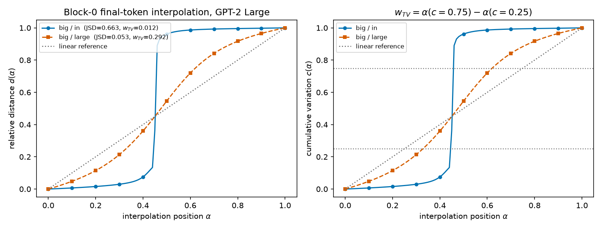
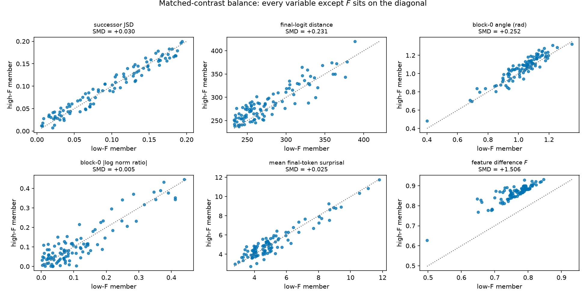
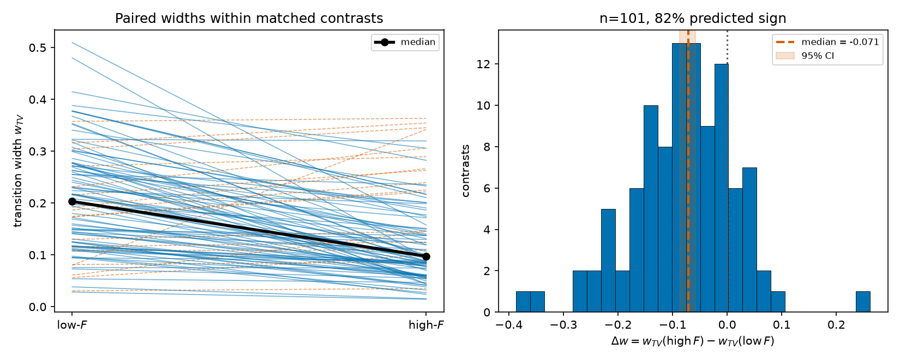
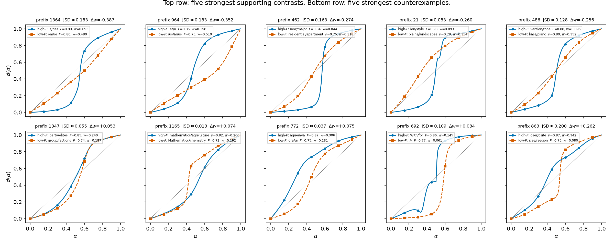
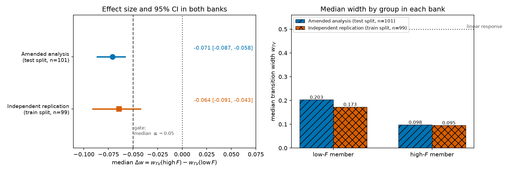
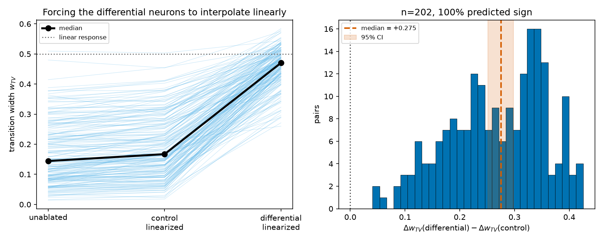

# Why do two prompts with the same prediction switch at different speeds? Matched-pair evidence that internal feature differences set transition width

## Summary

A recurring hope in interpretability is that we can read a model's internal state as a set of
human-meaningful features, and that walking between two internal states walks between two
interpretations. If that picture is right, the *way* a model moves between two internal states should
tell us something real about the features involved. If it is wrong — if the movement is governed by
geometry, by output divergence, or by nothing we can name — then interpolation experiments are a
mirage, and so are safety arguments built on them ("the model has one mode here and another mode
there").

This report takes a concrete version of that question. Take a prompt, replace its last token with two
different tokens, and interpolate the internal activation of that position from one to the other while
running the rest of the network normally. Sometimes the model's output flips from answer A to answer B
inside a narrow window — it behaves like a switch. Sometimes it drifts across proportionally. Both
happen for pairs whose *outputs* are about equally far apart, so output divergence does not explain the
difference. Something internal does.

**Hypothesis under test.** Among pairs matched on how much their predictions differ and on basic
endpoint geometry, the pair that engages more *different* downstream MLP neurons switches more sharply.

**What we did.** In GPT-2 Large we scored all 385020 candidate final-token pairs drawn from 1395
held-out WikiText-103 **test** paragraphs, and locked 101 within-prefix contrasts — each a pair of
prompt-pairs sharing a prefix, using four distinct final tokens, matched on successor divergence and
four endpoint-geometry confounds and differing only in the feature-difference score $F$ — writing the
manifest and its SHA-256 to disk before computing a single interpolation curve. Then we swept them.
We call this the **amended analysis**, for a reason stated in the next paragraph. We then ran a
second, fully pre-registered **independent replication** on a different corpus split, with the bank
size and the stopping rule fixed in writing before any of its data was scored.

**Why "amended".** The written plan fixed the bank at 300 prefixes and said to stop and report an
underpowered verdict if fewer than 40 matched contrasts survived. At 300 prefixes only 21 survived,
and the bank was enlarged to 1395 prefixes instead of stopping. Nothing about the analysis changed
and no transition width had been computed at the time, so the enlargement could not have been steered
by the outcome — but it broke a rule that had been frozen in advance, and a result whose sample size
was chosen after looking at the data is no longer a clean pre-registered test. The 101-contrast result
is therefore reported as an amended analysis throughout, and the confirmatory claim rests on the
replication described below rather than on it.

**What we found.** The prediction holds in both banks, with a large effect and a mechanism behind it.

- *Amended analysis (101 contrasts).* The higher-feature-difference member has the sharper switch in
  **83 of 101** contrasts. Median transition width drops from $w_{TV} = 0.203$ to $0.098$; the median
  paired difference is $\Delta w = -0.071$ with a bootstrap 95% CI of $[-0.087, -0.058]$ and a paired
  permutation $p < 10^{-4}$.
- *Independent replication (99 contrasts, pre-registered, bank size and stopping rule frozen before
  any of its data was seen).* The effect reappears at nearly the same size: median
  $\Delta w = -0.064$, 95% CI $[-0.091, -0.043]$, 78.8% with the predicted sign, permutation
  $p < 10^{-4}$. All four clauses of the replication's pre-registered gate are met, so the
  association is reported as a confirmed result.
- The matching works: successor divergence, block-0 norm ratio and token surprisal are balanced to
  within 3% of a standard deviation, against a 1.51-standard-deviation separation on $F$.
- A residual quarter-standard-deviation imbalance on two confounds does not produce the effect. In the
  subsets where it points the other way the effect stays significant, and a covariate-adjusted estimate
  is slightly larger ($-0.085 \pm 0.013$) than the raw one.
- The neurons are causal. Forcing the ~1.7% of downstream MLP neurons that distinguish the two
  endpoints to interpolate linearly — leaving both endpoints bit-identical — takes the median width
  from $0.144$ to $0.471$, essentially a proportional response. A size- and statistics-matched control
  set moves it to $0.167$. All 202 pairs show the gap.

**Why this matters for safety.** It supplies a falsifiable link between a feature-level description of
a model and a behaviour you can measure without any feature labels. If you want to claim that two
inputs put a model in genuinely different internal configurations, the sharpness of the switch between
them is evidence you can collect cheaply, and this report shows what it is made of: not how different
the answers are, but how disjoint the machinery producing them is. The same result warns against the
opposite reading — a sharp switch alone tells you a *different set of neurons* is engaged, and nothing
about whether either set is interpretable.

**Scope.** One model (GPT-2 Large), one patch site (block-0 `resid_post` at the final token), one
interpolation rule, and a neuron-level proxy for "feature". In both banks the pre-specified primary
calipers yielded very few contrasts (4 and 5), so the single pre-specified relaxation was applied,
which is what produced the 101 and the 99. "Independent" in this report means independent data and a
frozen protocol: the replication draws from a corpus split no analysis in this direction has touched,
and its sample size and stopping rule were written down before any of its data was scored. It was run
by the same code and the same authors, so replication by another group remains outstanding. The causal
experiment was run on the amended bank only.

---

## Methods

### Data & Model

**Model.** `gpt2-large` (774M parameters, 36 transformer blocks, $d_{model} = 1280$, 5120 MLP neurons
per block), the pretrained Hugging Face checkpoint, frozen, `eval()` mode, float32, `torch.no_grad()`,
no sampling anywhere. This is the model the phenomenon was originally reported in, which is why it is
the only model here.

**Corpus (amended analysis).** The **test** split of WikiText-103 (raw). Every paragraph of at least
400 characters that does not begin with a section marker qualifies; there are 1395 of them. From each
we take one random contiguous span of 20–40 tokens (NumPy generator seeded at 31) as a shared
**prefix**. Using the test split, and every eligible paragraph in it, keeps this bank disjoint from any
earlier exploratory work in this direction.

**Corpus (independent replication).** The **train** split of the same corpus, which no analysis in this
direction has ever touched. 80000 rows are drawn uniformly at random (generator seed 132) and scanned
in order under the identical paragraph filter until **exactly 1400** prefixes are collected, one 20–40
token span each (generator seed 131). The bank size was fixed at 1400 in writing before any of these
paragraphs was scored; the reason this matters, and the protocol it belongs to, are given under
*Pre-registration, locking, and the amendment* below.

**Candidate final tokens.** For each prefix we run the model once and take the top 24 next tokens that
are printable and non-special. A **pair** is the prefix plus one of these tokens as its final token,
against the prefix plus another. Building inputs as `prefix_ids + [token_id]` makes "identical prefix,
exactly one differing single final token" exact by construction. All $\binom{24}{2} = 276$ unordered
pairs per prefix are scored: 385020 candidate pairs in the amended bank and 386400 in the replication
bank.

**Hook point and interpolation site.** The patch site is `resid_post` after block 0 — the residual
stream immediately after the first transformer block — at the **final token position only**. Because
the prefix is identical between the two prompts and attention is causal, every earlier position is
bit-identical, so a single forward pass per interpolation point fully determines the run. Blocks 1–35
are the "downstream" blocks referred to throughout; block 0 is excluded from the feature score because
its output is the thing being interpolated.

**Sample sizes.** 806 interpolation sweeps of 101 forward evaluations each: 2 for the S1 sanity check,
202 for the amended analysis's matched test (both members of 101 contrasts), 198 for the replication's
matched test (both members of 99 contrasts), and 404 for the causal test (two intervention conditions
on each of the amended analysis's 202 pairs). Endpoint reproduction error never exceeded
$9.2 \times 10^{-7}$ (relative L2 on the final-token logit vector) in any of them.

### Metrics

The chain of reasoning is: define what "the two prompts predict the same thing" means, define what
"they use different machinery" means, define what "it switched sharply" means — then match on the
first, contrast on the second, and measure the third.

**Interpolation path.** A straight line between two high-dimensional activations passes through vectors
much shorter than either endpoint, which the network sees as an out-of-distribution magnitude and which
would confound "the switch" with "the norm collapsed". We interpolate direction along the sphere and
length linearly. With $h_A, h_B$ the block-0 activations, $\hat h = h / \lVert h \rVert$ and
$\Omega = \arccos(\hat h_A \cdot \hat h_B)$:

```math
h_\alpha \;=\; \big[(1-\alpha)\lVert h_A\rVert + \alpha\lVert h_B\rVert\big] \cdot
\frac{\sin\!\big((1-\alpha)\Omega\big)\,\hat h_A + \sin(\alpha\Omega)\,\hat h_B}{\sin \Omega},
\qquad \alpha \in \{0, 0.01, \ldots, 1\}.
```

At $\alpha = 0$ this is exactly $h_A$ and at $\alpha = 1$ exactly $h_B$, so the sweep reproduces both
original runs and the endpoint error is a real check rather than a formality.

**Successor JSD — the matching variable.** We need a symmetric, bounded measure of how differently the
two complete prompts predict the *next* token, so that "same continuation" is a number we can match on.
With $p_A, p_B$ the full-vocabulary next-token distributions of the two complete prompts and
$m = (p_A + p_B)/2$:

```math
\mathrm{JSD}(A,B) \;=\; \tfrac{1}{2} D_{KL}(p_A \Vert m) \;+\; \tfrac{1}{2} D_{KL}(p_B \Vert m),
\qquad D_{KL}(p \Vert q) = \sum_v p_v \log \frac{p_v}{q_v},
```

in natural-log units, so it ranges from 0 (identical predictions) to $\log 2 \approx 0.693$ (disjoint
support). This is measured at inference time on these two prompts; it is not a corpus statistic. Low
JSD is what makes a contrast interesting — if two prompts already predict different things, of course
the model treats them differently. It is consumed by the eligibility filter and by the balance table.

**Feature difference $F$ — the independent variable.** We want "these two prompts light up different
machinery" as one number, computed from the endpoints alone and fixed before any width is seen. Raw
activation magnitude is the wrong quantity: a large post-GELU activation on a neuron whose output
weights are tiny changes nothing downstream. So we weight each neuron's activation by how much it can
write into the residual stream. For neuron $j$ in block $l$ with post-GELU activation $a_{l,j}$ at the
final token and output-weight row $W^{out}_{l,j}$:

```math
s_{l,j} \;=\; \lvert a_{l,j} \rvert \cdot \lVert W^{out}_{l,j} \rVert_2 .
```

For each endpoint we keep the top 64 neurons by $s$ **within each of blocks 1–35**, treat the pair
$(l, j)$ as a feature identity, and call the resulting 2240-element set $S_A$ (resp. $S_B$). The score
is the Jaccard distance between them:

```math
F(A,B) \;=\; 1 - \frac{\lvert S_A \cap S_B \rvert}{\lvert S_A \cup S_B \rvert} \;\in\; [0, 1].
```

$F = 0$ means the two prompts engage an identical top set; $F = 1$ means completely disjoint sets.
Per-block top-$k$ selection (as against a global top-$k$) keeps the measure from being dominated by
whichever blocks happen to have the largest activations. This is an **MLP feature proxy**: a
top-scoring neuron is a unit of computation the prompt engages, and nothing here shows it is a
human-interpretable feature. $F$ was frozen before any interpolation curve was computed, and it is the
variable the contrasts in Results are built on.

**Relative distance $d(\alpha)$ — the response curve.** To say where along the path the output "is", we
place each interpolated final-token logit vector $x_\alpha$ on the segment between the two endpoint
logit vectors $x_A, x_B$:

```math
d(\alpha) \;=\; \frac{\lVert x_\alpha - x_A \rVert_2}{\lVert x_\alpha - x_A \rVert_2 + \lVert x_\alpha - x_B \rVert_2}.
```

$d(0) = 0$, $d(1) = 1$, and $d$ is invariant to the overall scale of the logits. A model that responds
proportionally traces $d(\alpha) = \alpha$; a model that switches stays near 0, jumps, and stays near 1.

**Transition width $w_{TV}$ — the outcome.** The obvious sharpness statistic, the $\alpha$-distance
between the first crossings of $d = 0.1$ and $d = 0.9$, is undefined whenever a curve overshoots or
doubles back, and mining a corpus guarantees some curves do. So the primary outcome is built on
cumulative variation, which is always defined. With $d_i = d(\alpha_i)$ over the 101 grid points:

```math
c_k \;=\; \frac{\sum_{i=1}^{k} \lvert d_i - d_{i-1} \rvert}{\sum_{i=1}^{100} \lvert d_i - d_{i-1} \rvert},
\qquad
w_{TV} \;=\; \alpha(c = 0.75) - \alpha(c = 0.25),
```

with $\alpha(c)$ obtained by linear interpolation of the $c$ grid. In words: $w_{TV}$ is the width of
the $\alpha$-window in which the middle half of the curve's total movement happens. **Smaller is
sharper.** It is bounded in $(0, 1]$; a proportional response gives exactly $0.5$ and a perfect step
approaches $0$. Two secondary diagnostics are reported alongside: $w_{10\text{-}90}$, the classical
first-crossing width, and a non-monotonicity score $\sum_{i: \Delta d_i < 0} \lvert \Delta d_i \rvert /
\sum_i \lvert \Delta d_i \rvert$, the share of the curve's movement that runs backwards (0 = monotone).
No pair is ever labelled "plateau" or "no plateau"; the analysis is entirely on the continuous width.

**Paired effect $\Delta w$ — the test statistic.** Each locked contrast $i$ contributes one number,

```math
\Delta w_i \;=\; w_{TV}(\text{high-}F)_i - w_{TV}(\text{low-}F)_i ,
```

and the hypothesis predicts $\Delta w < 0$. Because both members share a prefix, the pairing removes
prefix-level variation in width, which is large. We summarise with the median (robust to the heavy
right tail of widths), a bootstrap 95% CI over contrasts (10000 resamples), the fraction with the
predicted sign, and a paired permutation $p$-value that flips each contrast's sign independently
(10000 draws).

**Balance — standardized mean difference.** To show the contrast really isolates $F$ we report, for
each matched variable $v$, the gap between the two groups in units of the pooled spread:

```math
\mathrm{SMD}(v) \;=\; \frac{\bar v_{\text{high-}F} - \bar v_{\text{low-}F}}{\mathrm{sd}\big(v_{\text{high-}F} \cup v_{\text{low-}F}\big)} .
```

Values near 0 mean matched; the conventional threshold for "well balanced" in matched observational
designs is $\lvert \mathrm{SMD} \rvert \le 0.25$.

**Causal intervention — differential-neuron linearization.** An association between $F$ and width could
run either way, or through something both depend on. The intervention tests direction by removing
exactly the nonlinearity the hypothesis blames. Let $D$ be the symmetric difference $S_A \triangle S_B$
— the neurons in one endpoint's top set but not the other's. At every $\alpha$, for every $j \in D$,
we overwrite that neuron's post-GELU activation at the final token with the straight line between its
two endpoint values:

```math
a'_j(\alpha) \;=\; (1-\alpha)\, a_j(A) \;+\; \alpha\, a_j(B), \qquad j \in D,
```

while the block-0 patch and every other neuron run normally. At $\alpha = 0$ the forced values equal
$a_j(A)$ exactly and the block-0 activation is $h_A$, so the whole run is bit-identical to prompt A's
clean run (and likewise at $\alpha = 1$): the intervention preserves both endpoints, so $w_{TV}$ still
describes that condition's own switch. The reported statistic is the per-pair gap against the control
condition defined below,

```math
g \;=\; \big[w_{TV}(\text{differential}) - w_{TV}(\text{unablated})\big] - \big[w_{TV}(\text{control}) - w_{TV}(\text{unablated})\big],
```

with the prediction $g > 0$, summarised by its median, bootstrap CI, sign fraction and permutation
$p$-value exactly as for $\Delta w$.

### Baselines

**The linear response.** The reference for "no compression at all" is a model whose output moves
proportionally to $\alpha$: $d(\alpha) = \alpha$, giving $w_{TV} = 0.5$. Every width in this report is
read against it, and it is drawn as a dotted line in every curve figure. It is the natural null because
it is what a network with no nonlinear switching between these two states would produce.

**The low-$F$ member — the matched baseline.** The comparison that carries the primary result is
internal to each contrast. Two pairs share a prefix, use four distinct final tokens, have successor JSD
within a caliper of each other, and sit within a caliper in the confound space; one has higher $F$ and
is labelled high-$F$, the other low-$F$. The low-$F$ member is the baseline against which the high-$F$
member's width is scored. Prefix-level width variation cancels, and the only systematic difference left
is $F$.

**Matching rule and its single relaxation.** The confound distance between two candidate pairs $a, b$
is the standardized Euclidean distance over four endpoint-geometry variables — final-logit L2 distance,
block-0 endpoint angle, block-0 absolute log norm ratio, and mean surprisal of the two final tokens
under the shared prefix — using each variable's standard deviation $\sigma_c$ over the eligible bank:

```math
\mathrm{dist}(a,b) \;=\; \sqrt{\sum_{c \in \mathcal{C}} \left(\frac{a_c - b_c}{\sigma_c}\right)^{2}},
\qquad \mathcal{C} = \{\text{logit dist},\ \text{angle}_0,\ \lvert \log \text{norm ratio} \rvert,\ \text{surprisal}\}.
```

Eligibility, fixed in advance: $0.005 \le \mathrm{JSD} \le 0.20$ and final-logit distance above the
bank's 10th percentile (the latter stops near-identical endpoints from making $d(\alpha)$
noise-dominated). Primary calipers: $\lvert \Delta \mathrm{JSD} \rvert \le 0.01$,
$\mathrm{dist} \le 0.50$, $\Delta F \ge 0.10$. One pre-specified relaxation, to be applied only if
fewer than 80 contrasts survive: $\lvert \Delta \mathrm{JSD} \rvert \le 0.02$, $\mathrm{dist} \le 0.75$,
$\Delta F \ge 0.08$. Within a prefix at most one contrast is kept, chosen to maximise $\Delta F$ and
then minimise $\mathrm{dist}$.

**The matched control neuron set.** For the causal test, the baseline is an equal-size set of neurons
that is *not* differential. For each block we take $\lvert D_l \rvert$ neurons from outside
$S_A \cup S_B$, each the nearest unused neuron to a differential neuron in the standardized 3-D space
of (mean contribution magnitude $\tfrac{1}{2}(\lvert a_j(A)\rvert + \lvert a_j(B)\rvert)\lVert W^{out}_j \rVert$,
endpoint activation gap $\lvert a_j(A) - a_j(B) \rvert$, output-weight norm $\lVert W^{out}_j \rVert$).
The control therefore linearizes the same count of neurons, in the same blocks, with the same activation
statistics — so any difference in effect is attributable to which neurons were chosen.

**Pre-registration, locking, and the amendment.** Pre-registration here means writing the metrics,
filters, sample size and decision rule to disk before any of the data that will be analysed has been
scored, so that the analysis cannot be tuned to the answer. Every metric, caliper and success
criterion above was written into `PLAN.md` before the bank was mined. The chosen contrasts, their
endpoint metrics and the matching version were written to `results/matched_pairs.json` and its SHA-256
(`2415f5ff6dfcf88fb9cc7a67b87c93d859434296310f4b8d406c6f545e23ff56`) recorded before any interpolation
curve existed. The success gate — $n \ge 80$, median $\Delta w \le -0.05$, at least 60% with the
predicted sign, and a 95% CI entirely below zero — was likewise fixed in advance.

One clause was not honoured. The plan fixed the bank at 300 prefixes and instructed us to stop with an
underpowered verdict if fewer than 40 contrasts survived; at 300 prefixes 21 survived, and the bank was
extended to all 1395 eligible test paragraphs. All definitions, filters and calipers were unchanged and
no interpolation curve had been computed, so the enlargement was blind to the outcome, but the stopping
rule was frozen and we departed from it. Everything computed on that bank is labelled the **amended
analysis** for this reason.

**The independent replication and its frozen protocol.** To recover a clean pre-registered test, a
second bank was built and the following was written to `JOURNAL.md` before a single replication prefix
was scored: corpus = the WikiText-103 **train** split (the only split untouched by any analysis in this
direction; the amended analysis used *test*, earlier exploratory work used *validation*), 80000 rows
sampled with generator seed 132, same paragraph filter, one 20–40 token span per paragraph with
generator seed 131; **bank size fixed at exactly 1400 prefixes**; the bank to be run **once**, with no
enlargement, re-seeding or re-drawing for any reason and no second relaxation of the calipers; every
other element of the protocol — model, patch site, interpolation rule, 101 $\alpha$ values, top-24
candidate tokens, top-64 neurons per block, $F$, the eligibility window, the primary calipers and the
one pre-specified relaxation — identical to the amended analysis; the same four-clause gate as the
decision rule, with $40 \le n < 80$ to be reported as underpowered and $n < 40$ as a failure to power.
The 1400 figure follows from the amended analysis's observed yield of 101 contrasts per 1395 prefixes,
which puts the expected replication yield just above the gate's $n \ge 80$. The replication bank was
locked to `results/matched_pairs_rep.json` with SHA-256
(`ed1df0866f012b6195521dcda0d81306c7c6cb9d00e5dca2b30cda62e9af6d6b`) before its first interpolation
curve was computed. No replication width existed at any point while these choices were being made.

---

## Results

### The measurement harness reproduces the originally reported contrast

Before mining anything, the harness has to reproduce the observation that motivates the whole question,
on the two prompt pairs it was first reported with, through the identical frozen protocol. The gate was
set in advance at endpoint reconstruction error below $10^{-4}$ and the plateau case coming out sharper
than the smooth case. Both passed, the error by three orders of magnitude.

| Pair | successor JSD | $w_{TV}$ | $w_{10\text{-}90}$ | non-monotonicity | endpoint error |
|---|---|---|---|---|---|
| `The house was` + ` big` / ` in` | 0.663 | **0.012** | 0.044 | 0.000 | $3.5\times10^{-7}$ |
| `The house was` + ` big` / ` large` | 0.053 | **0.292** | 0.592 | 0.000 | $3.2\times10^{-7}$ |

The gap is 24-fold in $w_{TV}$, so the outcome variable has plenty of dynamic range for the matched
test. This check also illustrates why the matched design is necessary: these two pairs differ 13-fold
in successor JSD as well as in width, so on their own they cannot separate "different predictions" from
"different features". To show the curve and the statistic read off it, Figure 1 plots both.



**Figure 1.** The block-0 final-token interpolation in GPT-2 Large for the two originally reported
pairs. Left — x: interpolation position $\alpha \in [0,1]$; y: relative distance $d(\alpha)$, the
fraction of the way the final-token logit vector has moved from prompt A to prompt B. Right — x:
$\alpha$; y: cumulative variation $c(\alpha)$, the share of the curve's total movement completed by
position $\alpha$; the dotted horizontals mark the 0.25 and 0.75 levels whose $\alpha$-gap defines
$w_{TV}$. Solid with circles = ` big`/` in` (the plateau case); dashed with squares = ` big`/` large`
(the smooth case); dotted gray = the linear response $d(\alpha) = \alpha$.

### 101 contrasts, matched on everything except the feature difference (amended analysis)

The design's whole claim to causal relevance is that the contrasts were chosen without any knowledge of
the outcome, so this subsection reports what the locking produced before reporting any width. Across
1395 prefixes, 385020 candidate pairs were scored; 26275 passed the eligibility window; the primary
calipers left 4 contrasts, so the single pre-specified relaxation was applied and 101 survived. The
1395 prefixes are themselves the amendment: the plan had fixed 300, which yielded 21, below the plan's
own floor of 40 at which it required us to stop. Sections up to and including the counterexamples below
report this amended bank; the replication follows.

| Quantity | Value |
|---|---|
| Prefixes (WikiText-103 test, seed 31, 20–40 tokens) | 1395 |
| Candidate final-token pairs (24 candidates per prefix) | 385020 |
| Eligible pairs ($0.005 \le \mathrm{JSD} \le 0.20$, logit distance $>$ p10 $= 233.2$) | 26275 |
| Contrasts under the primary calipers | 4 |
| Contrasts under the single pre-specified relaxation (used) | **101** |
| $\Delta F$ across the locked contrasts (median, range) | 0.095 (0.080–0.187) |
| Confound distance across the locked contrasts (median, cap) | 0.62 (0.75) |

What made the design tight was the eligibility window, not the calipers: only 6.8% of candidate pairs
predict similarly enough to qualify, because two arbitrary high-probability continuations of the same
prefix usually imply different next tokens (bank median JSD 0.562). And $F$ is high and narrow across
the bank — median 0.904, 5th–95th percentile 0.723–0.954 — so two prompts almost always engage mostly
different top neurons, and the usable contrast in $F$ lives in tenths. That is why $\Delta F \ge 0.08$
is a meaningful spread here and why relaxing from 0.10 to 0.08 changed the yield so much.

The balance table is the design's own audit: if the confounds are matched and $F$ is not, then a
difference in width is attributable to $F$.

| Matched variable | high-$F$ mean | low-$F$ mean | standardized mean difference |
|---|---|---|---|
| successor JSD (nats) | 0.0967 | 0.0951 | **+0.030** |
| block-0 \|log norm ratio\| | 0.1147 | 0.1143 | **+0.005** |
| mean final-token surprisal (nats) | 5.218 | 5.175 | **+0.025** |
| final-logit L2 distance | 288.0 | 279.1 | +0.231 |
| block-0 endpoint angle (rad) | 1.0614 | 1.0267 | +0.252 |
| feature difference $F$ (the variable under test) | 0.8652 | 0.7622 | **+1.506** |

Successor JSD — the variable the whole question is posed at fixed value of — is balanced to 3% of a
standard deviation, and the two groups differ by 1.5 standard deviations on $F$. That 50-fold ratio is
what lets a width difference be read as a feature effect. The final-logit distance and block-0 angle
retain about a quarter of a standard deviation of imbalance, at the conventional boundary for "well
balanced" and both in the direction that would flatter the hypothesis; the robustness subsection below
removes them explicitly. Figure 2 shows the same information per contrast, which also reveals that the
balance is not an averaging artifact — individual points hug the diagonal.



**Figure 2.** Balance of the 101 locked contrasts. Each panel is one variable; x: its value for the
low-$F$ member of the contrast, y: its value for the high-$F$ member; the dotted line is $y = x$.
Points on the diagonal mean the variable is matched — the five confound panels are, and the sixth,
feature difference $F$, sits entirely above the diagonal because it is the variable the contrast
varies. Panel titles give the standardized mean difference.

### Pairs that engage more different features switch more sharply (amended analysis)

This is the primary result of the amended analysis. Every locked contrast was swept identically — 101
interpolation points at block-0 `resid_post` of the final token, readout at the final-token logits —
with endpoint reproduction exact to $9.2 \times 10^{-7}$ across all 202 sweeps, so the widths describe
the model and not patching error. Because the bank reached this size by breaking the plan's stopping
rule, the gate column below records that the amended analysis clears the same four thresholds the plan
set, not that a pre-registered test was passed; the pre-registered test is the replication two
subsections down.

| Summary | Value | Gate | Met |
|---|---|---|---|
| Contrasts $n$ | 101 | $\ge 80$ | yes |
| Median $\Delta w = w_{TV}(\text{high-}F) - w_{TV}(\text{low-}F)$ | **$-0.0708$** | $\le -0.05$ | yes |
| Bootstrap 95% CI on the median | $[-0.0866, -0.0582]$ | below 0 | yes |
| Fraction with the predicted sign ($\Delta w < 0$) | **82.2%** (83/101) | $\ge 60$% | yes |
| Paired permutation $p$ (10000 sign flips) | $< 10^{-4}$ | — | — |
| Median $w_{TV}$, low-$F$ → high-$F$ | $0.203 \rightarrow 0.098$ | — | — |
| Median $w_{10\text{-}90}$, low-$F$ → high-$F$ | $0.512 \rightarrow 0.316$ | — | — |
| **Verdict** | **supported** | | |

The effect is large in the units that matter. The median low-$F$ pair completes the middle half of its
output movement across 20% of the interpolation range; its matched high-$F$ partner does it across 10%.
That factor of two comes from a median $\Delta F$ of 0.095 — roughly a 10-percentage-point difference in
how much of their top-neuron sets the two endpoints share. The secondary width $w_{10\text{-}90}$ moves
the same way ($0.512 \rightarrow 0.316$), so this is a property of the curves and not of the
total-variation definition. The strength of the design is that this is the one comparison in which
successor divergence is held fixed: cross-pair correlations between divergence and sharpness have been
reported before and are uninformative about mechanism, because divergence and feature overlap move
together in a free-range bank. Within a matched contrast they do not, and the feature term survives.



**Figure 3.** The primary result. Left — each thin line is one contrast; x: which member (low-$F$ at
left, high-$F$ at right); y: transition width $w_{TV}$ (smaller = sharper switch). Solid lines fall
(the predicted direction), dashed lines rise; the heavy black line with circles joins the two medians,
$0.203 \rightarrow 0.098$. Right — x: the paired difference $\Delta w$; y: number of contrasts. The
dotted vertical is zero, the dashed vertical the median $-0.071$, and the shaded band its bootstrap
95% CI.

**Robustness to the residual imbalance.** The two confounds that are not perfectly matched both favour
the hypothesis, so they have to be ruled out explicitly. Two checks do it. Restricting to the contrasts
where the high-$F$ member is *not* favoured on one of them keeps a significant effect at a quarter of
the sample size; and a linear model of $\Delta w$ on the five paired confound differences puts the
effect for a perfectly matched contrast in its intercept.

| Analysis | $n$ | median $\Delta w$ | 95% CI | fraction $< 0$ |
|---|---|---|---|---|
| All locked contrasts (primary) | 101 | $-0.0708$ | $[-0.0866, -0.0582]$ | 0.822 |
| Contrasts where high-$F$ has the smaller final-logit distance | 30 | $-0.0562$ | $[-0.0918, -0.0185]$ | 0.733 |
| Contrasts where high-$F$ has the smaller block-0 angle | 25 | $-0.0823$ | $[-0.1557, -0.0260]$ | 0.840 |
| Both at once | 5 | $-0.0253$ | $[-0.1992, +0.0185]$ | 0.800 |
| Covariate-adjusted intercept ($\pm$ s.e.) | 101 | $-0.0847 \pm 0.0131$ | $[-0.1104, -0.0590]$ | — |

The adjusted estimate is slightly *larger* in magnitude than the raw one, and the five confound
differences together explain only 5.2% of the variance in $\Delta w$, so the residual imbalance is
suppressing the effect if anything. These analyses were run after the primary result and are labelled
post-hoc; the amended analysis's primary number stands unchanged at $-0.0708$. The both-at-once cell
has 5 contrasts and settles nothing.

**Where the prediction fails.** A median can hide a bimodal population, so Figure 4 plots the extremes
of the $\Delta w$ distribution as raw curves.



**Figure 4.** Raw curves at the two extremes. Each panel is one contrast; x: interpolation position
$\alpha$; y: relative distance $d(\alpha)$; dotted gray is the linear response. Solid with circles =
the high-$F$ member, dashed with squares = the low-$F$ member; each legend entry gives that member's
two final tokens, its $F$ and its $w_{TV}$, and the panel title gives the prefix index, the contrast's
successor JSD and its $\Delta w$. Top row: the five strongest supporting contrasts (to
$\Delta w = -0.387$). Bottom row: the five strongest counterexamples (to $\Delta w = +0.262$).

The counterexamples have a common shape. In the largest one (prefix 863) the low-$F$ member
`ices`/`ression` is already a near-perfect step at $w_{TV} = 0.080$, so there is no sharpness left for
its high-$F$ partner to add and the comparison can only go the wrong way. The prediction has no
headroom when the baseline member is already maximally sharp — a floor effect, and one that biases the
reported effect toward zero.

### The independent replication passes its pre-registered gate

Everything above rests on a bank whose size was chosen after seeing that a smaller bank was too small.
That is enough to make the amended analysis a hypothesis-generating result rather than a confirmatory
one, however blind the enlargement was: with the stopping rule broken once, a reader has no guarantee
it would not have been broken again had the numbers come out differently. The replication removes that
doubt by committing in advance to a bank size and to running the bank once, on a corpus split that has
never been analysed here, and then reporting whatever came out.

The commitment held. The replication bank produced 1400 prefixes, 386400 candidate pairs and 25321
eligible pairs; the primary calipers left 5 contrasts, so the one pre-specified relaxation was applied
and 99 survived — enough for the gate, and not enlarged, re-seeded or re-drawn. The confound balance
came out as in the amended bank: standardized mean differences of $+0.03$ on successor JSD, $-0.05$ on
the block-0 log norm ratio and $+0.09$ on surprisal, against $+1.63$ on the feature difference $F$,
with the same residual imbalance of about a fifth to three-tenths of a standard deviation on
final-logit distance ($+0.20$) and block-0 angle ($+0.29$).

| Summary | Amended analysis | Replication | Gate | Replication meets gate |
|---|---|---|---|---|
| Contrasts $n$ | 101 | 99 | $\ge 80$ | yes |
| Median $\Delta w$ | $-0.0708$ | **$-0.0641$** | $\le -0.05$ | yes |
| Bootstrap 95% CI on the median | $[-0.0866, -0.0582]$ | $[-0.0908, -0.0426]$ | below 0 | yes |
| Fraction with the predicted sign | 82.2% (83/101) | **78.8%** (78/99) | $\ge 60$% | yes |
| Paired permutation $p$ (10000 sign flips) | $< 10^{-4}$ | $< 10^{-4}$ | — | — |
| Median $w_{TV}$, low-$F$ → high-$F$ | $0.203 \rightarrow 0.098$ | $0.173 \rightarrow 0.095$ | — | — |
| Corpus split | test | train | — | — |
| **Verdict** | supported (amended) | **supported (pre-registered)** | | |

The replication reproduces the amended analysis closely: an effect of $-0.064$ against $-0.071$, with
each estimate inside the other's confidence interval, and the same near-halving of the median width
from the low-$F$ to the high-$F$ member. Its confidence interval is wider — $0.048$ across against
$0.028$ — which is what 99 contrasts drawn from a different split of the corpus should look like, and
its upper end sits at $-0.043$, still clear of zero but closer to it than the amended estimate's
$-0.058$. Figure 5 puts the two side by side so the agreement and the difference in precision can be
read directly.



**Figure 5.** The amended analysis against the pre-registered independent replication. Left — x: median
paired difference $\Delta w = w_{TV}(\text{high-}F) - w_{TV}(\text{low-}F)$, negative meaning the
high-$F$ member switches more sharply; each horizontal bar is one bank's bootstrap 95% CI with its
median marked (circle = amended analysis, test split, $n = 101$; square = replication, train split,
$n = 99$); the dashed vertical is the gate threshold $-0.05$ and the dotted vertical is zero. Right —
x: which member of the contrast; y: that group's median transition width $w_{TV}$; bars hatched `//`
are the amended analysis and `xx` the replication; the dotted horizontal at $0.5$ marks a perfectly
proportional response.

The consequence for the report's claim is specific. The association between feature difference and
transition sharpness is now a confirmed result: it was predicted in advance, tested once on data
chosen in advance, and passed every clause of a decision rule written before that data was scored.
The 202 amended contrasts still supply the report's better-powered estimate and are the pairs the
causal experiment below was run on, but the claim that the effect exists no longer depends on them.

### The differential neurons cause the switch

The matched design supports the association but cannot order the causation, so the final experiment
intervenes on exactly the quantity the hypothesis names. It was run on the amended analysis's bank,
before the replication existed, and has no pre-registered counterpart of its own. For both members of
all 101 amended contrasts — 202 pairs — the sweep was re-run twice: once with the symmetric-difference neurons forced to interpolate
linearly, once with the size- and statistics-matched control set forced the same way. Both conditions
reproduce both endpoints bit-identically (verified to $8.9 \times 10^{-7}$), so all three widths
describe switches between the same two states.

| Condition | median $w_{TV}$ | median change from unablated |
|---|---|---|
| Unablated (the primary sweeps) | 0.144 | — |
| Control set linearized (1.7% of neurons) | 0.167 | $+0.019$ |
| Differential set linearized (1.7% of neurons) | **0.471** | $+0.308$ |
| Gap (differential $-$ control), median | | **$+0.275$**, 95% CI $[0.251, 0.298]$ |
| Pairs with the predicted sign | 202/202 (**100%**) | permutation $p < 10^{-4}$ |

Linearizing a median of 3063 neurons — 1.7% of the 179200 MLP neurons below the patch — takes the
median pair from a switch completing in 14% of the interpolation range to a response within 0.03 of
proportional. The control touches the same number of neurons, in the same blocks, with matched
activation magnitude, endpoint gap and output-weight norm, and moves the median by 0.019: a
sixteenth of the effect. The mechanism is therefore specific to which neurons were selected, not to the
amount of intervention.

The most informative number here is the convergence. Under the intervention the high-$F$ member goes
$0.098 \rightarrow 0.467$ and the low-$F$ member $0.203 \rightarrow 0.474$: the two groups that
differed by a factor of two in the primary result land in the same place, within 0.007 of each other.
The width difference the primary result measured is carried by the neurons that distinguish the
endpoints, and neutralising their nonlinearity removes both the switch and the group difference at
once. This is what makes the report's claim mechanistic and not just predictive — a practitioner who
wants to know *why* an interpolation snaps has a specific, testable answer and a 1.7%-of-neurons
handle on it. Figure 6 shows that this is not a story about the median: every one of the 202 pairs
moves the same way.



**Figure 6.** The causal test. Left — each thin line is one of the 202 pairs; x: condition (unablated,
control linearized, differential linearized); y: transition width $w_{TV}$; the heavy black line with
circles joins the medians and the dotted horizontal marks the linear response $w_{TV} = 0.5$. Right —
x: the per-pair gap $g$, how much more the differential linearization widened the switch than the
control did; y: number of pairs. The dotted vertical is zero, the dashed vertical the median $+0.275$,
and the shaded band its bootstrap 95% CI; the entire distribution lies above zero.

### Limitations

**One model, one site, one path.** Everything is GPT-2 Large, patched at block-0 `resid_post` of the
final token, along a rescaled-SLERP path. Whether the same accounting holds at other depths, in other
architectures, or under a different interpolation rule is untested here.

**"Feature" is a proxy.** $F$ counts top-scoring MLP neurons weighted by output-weight norm. Nothing in
this report shows those neurons are monosemantic or human-interpretable. The honest reading of the
causal result is that the *set of neurons that differ between the endpoints* carries the switch; a
sparse-autoencoder or attention-head version of the same test would be a different experiment.

**The relaxation was used in both banks.** The pre-specified primary calipers produced 4 contrasts in
the amended bank and 5 in the replication bank, so both reported samples come from the relaxed rule
($\lvert \Delta \mathrm{JSD} \rvert \le 0.02$, confound distance $\le 0.75$, $\Delta F \ge 0.08$).
The relaxation was fixed in advance and applied once in each bank, but the resulting contrasts are
matched somewhat less tightly than the primary design intended, which is visible in the residual
standardized mean differences of $+0.20$ to $+0.29$ on final-logit distance and block-0 angle. The
robustness checks above address that imbalance in the amended bank; they were not repeated in the
replication, whose role is the single pre-registered decision.

**The amended analysis broke the plan's stopping rule, and only the replication is confirmatory.** The
plan specified 300 prefixes and required us to stop with an underpowered verdict if fewer than 40
contrasts survived; at 300 prefixes 21 survived and the bank was extended to all 1395 eligible test
paragraphs instead. All metric definitions, eligibility filters and calipers were unchanged and no
width had been computed, so the change was blind to the outcome and cannot have selected the effect —
but it is a departure from a rule frozen in advance, and everything computed on that bank is labelled
an amended analysis for that reason. The pre-registered replication is what supports the confirmatory
claim.

**The replication is independent in data, not in personnel.** Its corpus split, sample size and
stopping rule were fixed before any of its data was scored, and it was run once. It was nevertheless
run with the same code, the same patch site and the same authors as the amended analysis, so it cannot
detect a systematic error shared by both — a bug in the width metric or in the patching harness, for
instance. Replication by another group, and on another model, remains outstanding. The causal
experiment has no pre-registered replication at all: it was run on the amended bank only, so the
mechanism it supports should be read as the amended analysis's strongest evidence rather than as a
confirmed result.

**The intervention is large in effect and specific in target, but blunt in one respect.** Forcing 3063
activations to a straight line is a strong manipulation; the control set establishes that the *choice*
of neurons matters, and does not establish that a smaller, better-targeted subset would suffice. The
minimal sufficient set is unmeasured.

---

## Conclusion

Among GPT-2 Large prompt pairs matched on successor JSD and endpoint geometry, the pair that engages
more different downstream MLP features has the sharper block-0 transition. Two banks say so. The
amended analysis — 101 contrasts on the test split, whose size was set after seeing that the planned
300 prefixes were too few — gives median $\Delta w = -0.071$, 95% CI $[-0.087, -0.058]$, 82.2% with the
predicted sign, permutation $p < 10^{-4}$. The pre-registered independent replication — 99 contrasts on
the train split, with the bank size and the single-run stopping rule written down before any of its
data was scored — gives $-0.064$, 95% CI $[-0.091, -0.043]$, 78.8% predicted sign, $p < 10^{-4}$, and
meets all four clauses of its gate (Figure 5). The association is therefore reported as a confirmed
result, and the amended analysis as the better-powered estimate of its size.

Two further findings come from the amended bank alone and are labelled accordingly. The effect survives
the residual confound imbalance under both subset and covariate-adjusted analyses. And a causal test
supports the mechanism — forcing the 1.7% of neurons that distinguish the two endpoints to interpolate
linearly collapses the switch from $w_{TV} = 0.144$ to $0.471$, essentially proportional response,
while a size- and statistics-matched control set leaves it at $0.167$, in all 202 pairs.

The practical upshot is a cheap, label-free probe of an internal claim. Sharpness of the switch between
two prompts' activations measures how disjoint the machinery producing their outputs is — a quantity
you would otherwise need a feature dictionary to estimate. The corresponding caution is that a sharp
switch says the neuron sets are different and says nothing about whether either set means anything;
interpretation still has to be earned separately.

**Verdict: supported — the matched association is confirmed by a pre-registered independent
replication; the causal mechanism rests on the amended analysis and awaits one.**
