# RESULTS — When does interpolating one token's activation produce a plateau?

> CURRENT-BEST ONLY. One row per experiment. No history (that lives in CHANGELOG.md).

## Headline

Matthew's reported contrast **reproduces in his own model**. In GPT-2 Large (36 blocks), interpolating
the final token's block-0 activation gives a near-perfect step for `The house was big` / `in`
($w_{10-90}=0.044$) and a smooth, near-linear response for `big` / `large` ($w_{10-90}=0.592$). It does
**not** reproduce in GPT-2 Medium, where `big`/`in` gives $w_{10-90}=0.516$ — above the plateau
criterion. Plateau strength is governed by the **fraction of the stack below the patch**, not the block
count: GPT-2 Large patched at block 12 and GPT-2 Medium patched at block 0 have the same 23 blocks
below and differ 3.2-fold in transition width. But depth is necessary, not sufficient — `big`/`large`
stays smooth in GPT-2 Large with 35 blocks below the patch, so whether a given interpolation sharpens
depends on the pair, not on depth alone.

The practical caution is a **base rate**: in a bank of 200 corpus-mined pairs per model, 83.5% of GPT-2
Large pairs and 73.0% of GPT-2 Medium pairs plateau under the plan's predefined criterion
($w_{10-90}<0.5$). A plateau observed for one chosen pair is therefore weak evidence on its own.

The advisor's hypothesis — *holding output divergence low, different circuits or features may occupy
different plateaus* — splits into two readings that come out differently. As a claim about
**intermediate** resting points it fails with power: across 1120 pairs whose next-token predictions
nearly agree, no measure of circuit or feature difference predicts an intermediate plateau in any of
three models ($\rho$ between $-0.11$ and $+0.12$, none surviving multiple-comparison correction, at
sample sizes that would have detected $\lvert\rho\rvert \ge 0.10$). As a claim that **each prompt sits
on its own plateau**, with the interpolation snapping between them, it holds — and in GPT-2 Large it
holds causally. With outputs matched, pairs that engage more disjoint attention heads, MLP neurons or
sparse-autoencoder features switch more sharply (14 of 14 instrument-model tests negative, up to
$\rho=-0.36$). Mean-ablating the 3% of heads that write most differently for the two prompts widens
GPT-2 Large's median transition by 81% ($w_{TV}$ $0.198 \to 0.358$), and at 10% of heads the model
stops switching and responds proportionally ($0.484$ against the linear response's $0.5$); an
engagement-matched control set of the same size changes nothing ($0.198 \to 0.200$).

Those heads turn out to be **mostly shared across pairs rather than pair-specific**. One fixed set of
22 GPT-2 Large heads, ranked on half the prefixes and ablated on the other half, widens the median
switch to $0.485$ — more than the per-pair sets do. But the fixed set does its work through seven heads
in **block 0**, which sit *above* the patch site, so they act by shaping the two activation vectors
being interpolated rather than by processing them: exclude block 0 and the same construction leaves
$0.198 \to 0.217$ ($+0.012$, $p = 5\times10^{-24}$ against the control). Interpolation between two
activations is therefore as much about what got written into those two vectors as about the depth that
processes them.

None of this depends on the interpolated token being the **last** token. Appending the model's own
continuation to both prompts, so the readout sits up to four positions downstream and can reach the
patched activation only through attention, leaves the median transition width unchanged in all three
GPT-2 models (GPT-2 Large $w_{TV}$ $0.148 \to 0.193$, paired $\Delta = +0.001$, $p = 0.65$) — even
though those four shared tokens shrink the two prompts' output divergence 15-fold. So endpoint
divergence, which correlates with sharpness *across* pairs, does not set sharpness *within* a pair.

Finally, **the circuit and the depth are not two separate ingredients — the circuit needs the depth.**
Repeating the identical fixed-set ablation with the patch moved to the middle of each stack takes GPT-2
Large's effect from $+0.187$ to $-0.002$, and leaves nothing measurable in the other two models. At that
site the unablated switch is already gone — median $w_{TV} = 0.501$ in GPT-2 Large against the linear
response's $0.5$ — so there is no compression left for the heads to supply. GPT-2 Large's outsized
causal effect is a property of *that model at that patch site*, not of the model.

## Experiment 1 — Matthew's two pairs, plus four test pairs, in five models

All 6 pairs tokenized validly in all five models (identical prefix, exactly one differing single final
token). Across all 17206 sweeps in this report, patching at $\alpha=0$ and $\alpha=1$ reproduced the
clean runs to $|d| \le 3.6\times10^{-4}$, so the interpolation harness is correct. The one exception is
Experiment 10, where the two endpoints are deliberately driven to near-coincidence and the bound is
$2.1\times10^{-3}$; it is discussed there.

The two `The house was` pairs are Matthew's own. `big`/`in` is his **positive plateau example**;
`big`/`large` is his **smooth comparison**, the pair he reports as *not* plateauing. Neither is a
negative control for continuation similarity. The other four pairs are ours, chosen so the two versions
plausibly continue the same way while differing in some internal property.

Lower $w_{10-90}$ and $w_{TV}$ mean a sharper transition; higher PF (plateau fraction) means more of
the sweep sits pinned at an endpoint. The plan's predefined plateau criterion is $w_{10-90}<0.5$
against a linear-response reference of $0.8$; the threshold-free statistic $w_{TV}$ has reference
$0.5$ and sharp threshold $0.25$; PF has reference $0.2$.

| Model | Prompt pair (final tokens) | endpoint JSD (nats) | $w_{10-90}$ | $w_{TV}$ | PF | plateau? |
|---|---|---|---|---|---|---|
| gpt2-large | *M. plateau case:* The house was ` big` / ` in` | 0.663 | **0.044** | **0.012** | 0.95 | yes |
| gpt2-large | *M. smooth case:* The house was ` big` / ` large` | 0.053 | 0.592 | 0.292 | 0.42 | no |
| gpt2-large | The answer is ` four` / ` Four` | 0.283 | 0.133 | 0.020 | 0.86 | yes |
| gpt2-large | gave a book to ` Mary` / ` her` | 0.051 | 0.288 | 0.144 | 0.71 | yes |
| gpt2-large | clue identify? ` Au` / ` 79` | 0.312 | 0.448 | 0.139 | 0.55 | yes |
| gpt2-large | Two plus two is ` four` / ` 4` | 0.048 | 0.485 | 0.216 | 0.52 | yes |
| gpt2-medium | *M. plateau case:* The house was ` big` / ` in` | 0.659 | 0.516 | 0.272 | 0.50 | no |
| gpt2-medium | *M. smooth case:* The house was ` big` / ` large` | 0.042 | 0.719 | 0.398 | 0.29 | no |
| gpt2-medium | The answer is ` four` / ` Four` | 0.377 | **0.120** | **0.058** | 0.88 | yes |
| gpt2-medium | gave a book to ` Mary` / ` her` | 0.068 | 0.586 | 0.114 | 0.51 | no |
| gpt2-medium | clue identify? ` Au` / ` 79` | 0.342 | 0.358 | 0.117 | 0.64 | yes |
| gpt2-medium | Two plus two is ` four` / ` 4` | 0.138 | 0.454 | 0.232 | 0.55 | yes |
| gpt2-small | *M. plateau case:* The house was ` big` / ` in` | 0.658 | 0.691 | 0.254 | 0.32 | no |
| gpt2-small | *M. smooth case:* The house was ` big` / ` large` | 0.053 | 0.760 | 0.456 | 0.25 | no |
| gpt2-small | The answer is ` four` / ` Four` | 0.358 | **0.548** | **0.225** | 0.46 | no |
| gpt2-small | gave a book to ` Mary` / ` her` | 0.030 | 0.556 | 0.276 | 0.45 | no |
| gpt2-small | clue identify? ` Au` / ` 79` | 0.355 | 0.906 | 0.781 | 0.10 | no |
| gpt2-small | Two plus two is ` four` / ` 4` | 0.173 | 0.607 | 0.352 | 0.40 | no |
| opt-350m | *M. plateau case:* The house was ` big` / ` in` | 0.646 | **0.143** | **0.068** | 0.85 | yes |
| opt-350m | *M. smooth case:* The house was ` big` / ` large` | 0.042 | 0.831 | 0.598 | 0.18 | no |
| opt-350m | The answer is ` four` / ` Four` | 0.472 | 0.530 | 0.293 | 0.48 | no |
| opt-350m | gave a book to ` Mary` / ` her` | 0.038 | 0.734 | 0.356 | 0.28 | no |
| opt-350m | clue identify? ` Au` / ` 79` | 0.296 | 0.705 | 0.177 | 0.31 | no |
| opt-350m | Two plus two is ` four` / ` 4` | 0.027 | 0.907 | 0.680 | 0.11 | no |
| pythia-410m | *M. plateau case:* The house was ` big` / ` in` | 0.665 | 0.425 | 0.137 | 0.57 | yes |
| pythia-410m | *M. smooth case:* The house was ` big` / ` large` | 0.042 | 0.802 | 0.505 | 0.21 | no |
| pythia-410m | The answer is ` four` / ` Four` | 0.271 | **0.340** | **0.135** | 0.66 | yes |
| pythia-410m | gave a book to ` Mary` / ` her` | 0.033 | 0.582 | 0.268 | 0.43 | no |
| pythia-410m | clue identify? ` Au` / ` 79` | 0.385 | 0.598 | 0.254 | 0.41 | no |
| pythia-410m | Two plus two is ` four` / ` 4` | 0.056 | 0.758 | 0.451 | 0.25 | no |

**The reproduction works, in the right model.** In GPT-2 Large the contrast is stark and matches what
Matthew reports: `big`/`in` moves through 80% of the gap in 4% of the sweep — a near-step with 95% of
the grid pinned at an endpoint — while `big`/`large` needs 59% of the sweep and sits close to the
diagonal. In GPT-2 Medium the same `big`/`in` pair gives $w_{10-90}=0.516$, which fails the predefined
criterion, and in GPT-2 Small it gives $0.691$. **GPT-2 Medium is not a reproduction of a GPT-2 Large
result**, and any earlier conclusion drawn from the `big`/`in` curve in GPT-2 Medium does not transfer.

**`big`/`large` is smooth everywhere.** It is the widest or second-widest transition in all five models
($w_{10-90}$ from $0.592$ to $0.831$), including in GPT-2 Large, which has more blocks below the patch
than any other model here. That single cell rules out the strong form of "depth produces the plateau":
35 downstream blocks did not sharpen this pair.

**Plateaus are not universal among hand-picked pairs.** Under the predefined criterion $w_{10-90}<0.5$,
**11 of the 30** model-pair cells qualify (14 of 30 under $w_{TV}<0.25$) — a minority, and concentrated
in the deeper models: 5/6 in GPT-2 Large, 3/6 in GPT-2 Medium, 2/6 in Pythia-410m, 1/6 in OPT-350m and
0/6 in GPT-2 Small.

Figure 1 shows every raw sweep, which is the only way to see the shapes behind these statistics.

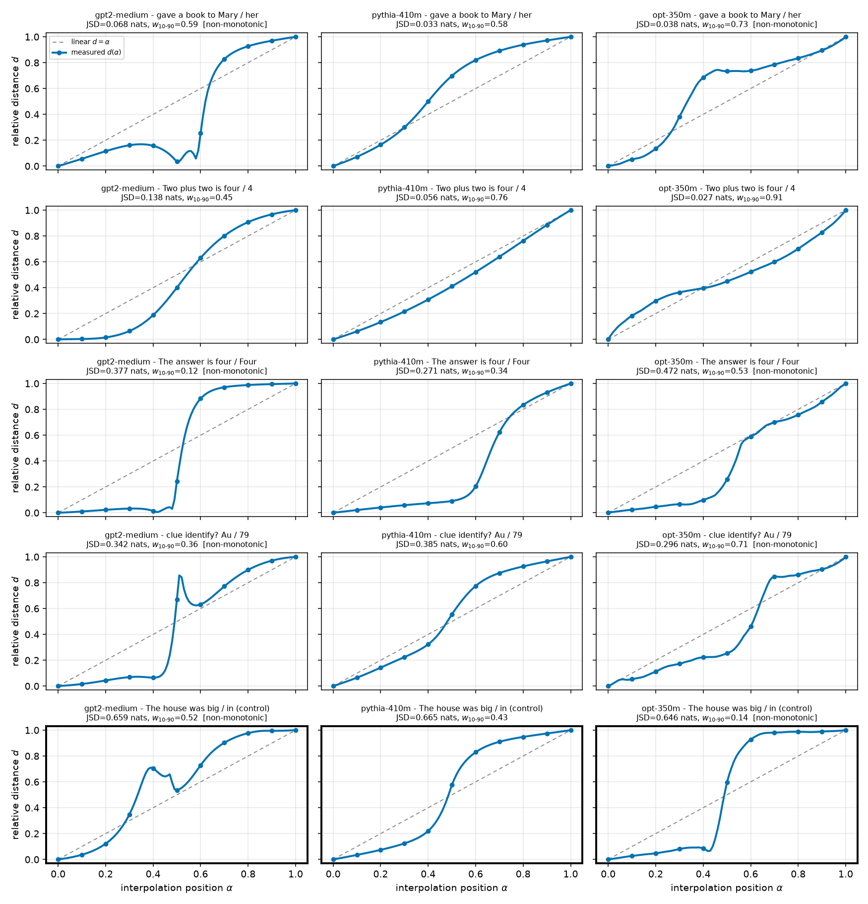

**Figure 1.** The `big`/`in` versus `big`/`large` contrast reproduces in GPT-2 Large and weakens with
model depth. x: interpolation position $\alpha$ from prompt A (0) to prompt B (1); y: relative distance
$d$ (0 = at A's logits, 1 = at B's logits). Solid curve with circles = measured $d(\alpha)$; gray
dashed = the linear reference $d=\alpha$. Columns are models, ordered by depth (GPT-2 Large 36 blocks →
Pythia-410m 24). Rows are prompt pairs; the two bottom rows (thick frames) are Matthew's pair — row 5
his plateau case `big`/`in`, row 6 his smooth case `big`/`large`. Each panel title gives that cell's
endpoint JSD and $w_{10-90}$. Row 5 is a near-vertical step in the GPT-2 Large panel and drifts toward
the diagonal as model depth falls; row 6 stays near the diagonal in every model.

## Experiment 2 — how often does an arbitrary pair plateau?

A single pair's plateau means little without knowing how often arbitrary pairs do the same. Each mined
pair is a WikiText-103 prefix (40 prefixes, 10–40 tokens) plus the model's own top-1 next token versus
a token at rank $r$, with $r$ log-uniform in $[1,5000]$, so endpoint JSD spans its whole range.
Figure 2 shows where the hand-picked pairs fall inside that distribution.

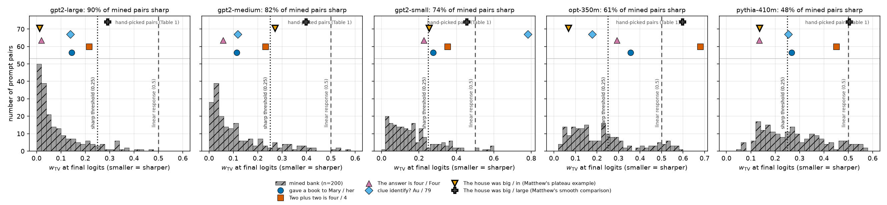

**Figure 2.** Plateaus are common for arbitrary prompt pairs, increasingly so in deeper models. x:
$w_{TV}$ at the final logits (smaller = sharper); y: number of mined pairs per bin (gray hatched
histogram, $n=200$ per model). Gray dashed = linear response (0.5), dotted = sharpness threshold
(0.25). The markers on the strip above each histogram are the hand-picked pairs of Table 1 at their
$w_{TV}$ values (shape and color per the legend, Matthew's pairs with a thick black edge); their y
position carries no meaning.

| Model (blocks) | % with $w_{10-90}<0.5$ (predefined) | % with $w_{TV}<0.25$ | median $w_{10-90}$ | median $w_{TV}$ |
|---|---|---|---|---|
| gpt2-large (36) | 83.5% | 89.5% | 0.155 | 0.047 |
| gpt2-medium (24) | 73.0% | 82.0% | 0.241 | 0.080 |
| gpt2-small (12) | 60.5% | 74.0% | 0.417 | 0.153 |
| opt-350m (24) | 47.0% | 61.0% | 0.511 | 0.221 |
| pythia-410m (24) | 30.0% | 47.5% | 0.593 | 0.266 |

The base rate is high in the GPT-2 family and falls with depth: in GPT-2 Large five pairs in six
plateau under the predefined criterion. So observing a plateau for a chosen pair in GPT-2 Large is
close to uninformative on its own — the interesting quantity is how a pair compares against this
distribution, not whether it crosses a threshold. Note the contrast with the hand-picked set, where
only 11/30 cells plateau: our four test pairs are unusually smooth relative to random pairs, which is
itself a reason to distrust conclusions drawn from a handful of chosen prompts.

## Experiment 3 — endpoint divergence and transition width

This experiment measures a descriptive relationship in the mined bank. It does not bear on the
advisor's hypothesis, which concerns matched output divergence; Experiments 6 and 7 do that. It is
reported because it is a strong and consistent regularity that any user of this method will run into.
Figure 3 plots it in all five models.

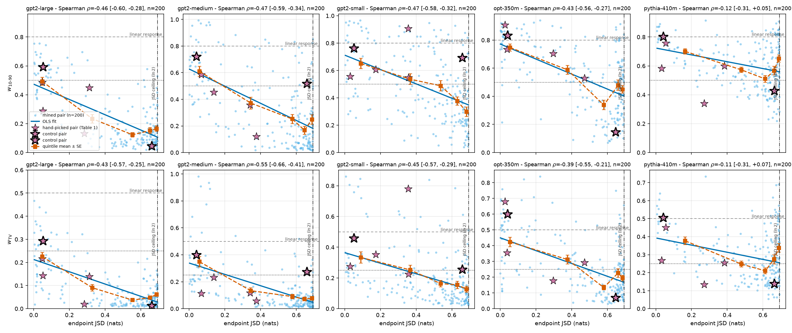

**Figure 3.** Across mined pairs, more divergent endpoints go with sharper transitions in all five
models. x (all panels): endpoint JSD in nats (larger = more different next-token predictions); the
dash-dot vertical line is the $\ln 2$ ceiling JSD attains for disjoint predictions. y: $w_{10-90}$
(top) and $w_{TV}$ (bottom) at the final logits, smaller = sharper. Columns are models. Light circles =
the 200 mined pairs; solid line = OLS fit; dashed line with squares = quintile means of JSD with
$\pm1$ SE; stars = the hand-picked pairs (thick black edge = Matthew's pairs). Gray dashed = linear
response, dotted = plateau threshold.

Restricted to pairs below the $\ln 2$ ceiling, where JSD can still order pairs, the rank correlation
between endpoint divergence and $w_{TV}$ is negative in every model:

| Model | $n$ (JSD $<0.65$) | $\rho$ ($w_{TV}$) | $p$ | $\rho$ ($w_{10-90}$) | $p$ |
|---|---|---|---|---|---|
| gpt2-large | 137 | $-0.64$ | $6.1\times10^{-17}$ | $-0.61$ | $2.3\times10^{-15}$ |
| gpt2-medium | 142 | $-0.61$ | $1.5\times10^{-15}$ | $-0.54$ | $4.9\times10^{-12}$ |
| opt-350m | 129 | $-0.57$ | $1.3\times10^{-12}$ | $-0.59$ | $3.1\times10^{-13}$ |
| pythia-410m | 127 | $-0.45$ | $9.0\times10^{-8}$ | $-0.47$ | $2.3\times10^{-8}$ |
| gpt2-small | 147 | $-0.44$ | $2.7\times10^{-8}$ | $-0.36$ | $7.8\times10^{-6}$ |

The relationship is descriptive and its direction is worth knowing — pairs that predict *more*
different next tokens give *sharper* transitions — but it says nothing about whether two prompts with
*matched* predictions differ internally, which is the question the hypothesis asks.

Figure 4 compares models inside fixed JSD bins, showing the cross-model differences in Table 2 are not
an artifact of the banks landing at different divergences.

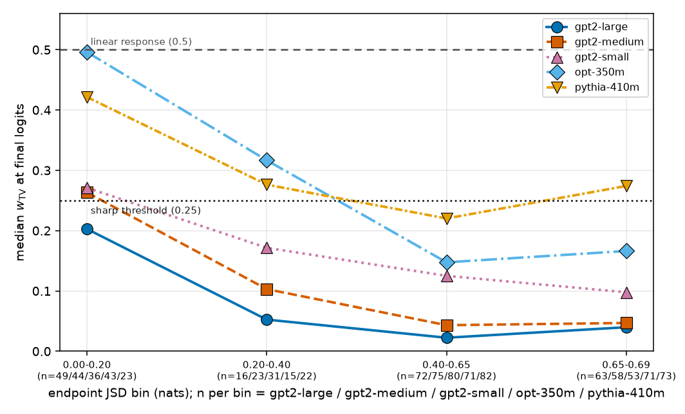

**Figure 4.** The cross-model sharpness ordering survives matching on endpoint divergence. x: endpoint
JSD bin in nats (the last bin is the $\ln 2$ ceiling), annotated with the number of mined pairs per
model; y: median $w_{TV}$ at the final logits over the pairs in the bin (smaller = sharper). One line
per model, each with its own color, line style and marker (see legend). Gray dashed = linear response
(0.5), dotted = sharp threshold (0.25). GPT-2 Large and GPT-2 Medium are sharpest in every bin, and all
lines fall from left to right.

## Experiment 4 — where the sharpness accumulates, and what happens when depth is removed

Before intervening on depth it is worth seeing where along the stack the sharpness appears, which
Figure 5 answers by reading the same sweep out at every block.

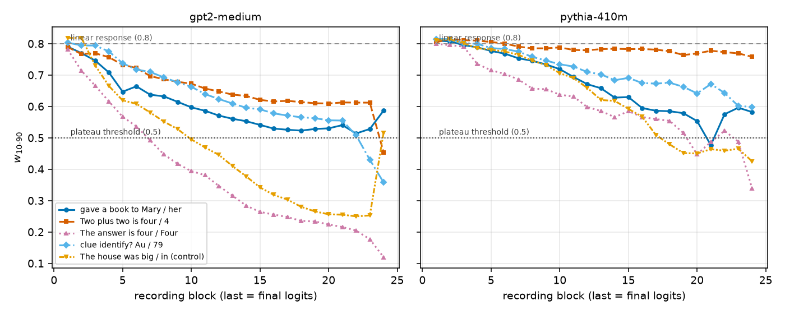

**Figure 5.** The plateau is built up gradually across depth, not created at the patch site. x: block
whose `resid_post` is read out (patch is applied after block 0; the last x value is the final logits);
y: $w_{10-90}$ at that read-out point. One line per prompt pair (color, line style and marker all vary
together; see legend); panels are models. Gray dashed = linear response (0.8), dotted = plateau
threshold (0.5). Every pair starts near 0.8 just after the patch; some narrow steeply with depth and
`big`/`large` stays near the top in every model.

Reading out earlier is not the same as computing less, so the causal version moves the patch site
instead. Re-running the identical 200-pair bank with the interpolated vector inserted after block 12
and after block 20 leaves 11 and 3 blocks to process it instead of 23. Figure 6 gives the result.

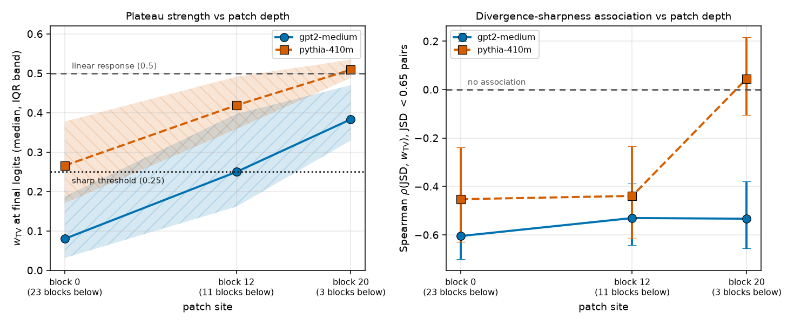

**Figure 6.** Removing downstream blocks removes the plateau. x (both panels): the patch site — the
block whose `resid_post` at the final token is replaced by the interpolated vector — labelled with the
number of blocks remaining below it. Left y: median $w_{TV}$ at the final logits over the 200 mined
pairs (smaller = sharper), shaded band = interquartile range, gray dashed = linear response (0.5),
dotted = sharp threshold (0.25). Right y: Spearman $\rho$ between endpoint JSD and $w_{TV}$ over the
pairs below the $\ln 2$ ceiling, error bars = 95% cluster bootstrap over the 40 prefixes, gray dashed =
no association. gpt2-medium = circles, solid; pythia-410m = squares, dashed; opt-350m = triangles,
dotted.

| Model | patch site | blocks below | median $w_{TV}$ | % sharp | median $w_{10-90}$ |
|---|---|---|---|---|---|
| gpt2-medium | block 0 | 23 | 0.080 | 82.0% | 0.241 |
| gpt2-medium | block 12 | 11 | 0.250 | 50.5% | 0.556 |
| gpt2-medium | block 20 | 3 | 0.383 | 10.0% | 0.701 |
| opt-350m | block 0 | 23 | 0.221 | 61.0% | 0.511 |
| opt-350m | block 12 | 11 | 0.307 | 36.5% | 0.641 |
| opt-350m | block 20 | 3 | 0.420 | 1.0% | 0.741 |
| pythia-410m | block 0 | 23 | 0.266 | 47.5% | 0.593 |
| pythia-410m | block 12 | 11 | 0.419 | 2.5% | 0.749 |
| pythia-410m | block 20 | 3 | 0.509 | 0.0% | 0.808 |

Sharpness falls off monotonically as depth is removed, in all three models. The clearest single number
is pythia-410m at block 20: median $w_{TV} = 0.509$ against the linear response's $0.5$ — with 3 blocks
left, not one of its 200 pairs is sharp. Depth below the patch is what allows a plateau to form. It is
not sufficient on its own: `big`/`large` has 35 blocks below the patch in GPT-2 Large and stays smooth
(Table 1), so the interpolation path matters too.

## Experiment 5 — it is the fraction of the stack below the patch, not the block count

Experiment 4 leaves the units of "depth" ambiguous, because all three models have 24 blocks. The two
readings give opposite advice for any other model. We separate them inside one family, where tokenizer,
architecture and training corpus are fixed and only depth changes: `gpt2` (12 blocks), `gpt2-medium`
(24) and `gpt2-large` (36), each with its own 200-pair bank swept at sites chosen so the three line up
either on blocks-below or on the relative depth $f = (N-1-L)/(N-1)$ — the fraction of the stack below
patch site $L$ in an $N$-block model.

| Model (blocks) | patch site | blocks below | $f$ | median $w_{TV}$ | % sharp | median $w_{10-90}$ |
|---|---|---|---|---|---|---|
| gpt2-small (12) | block 0 | 11 | 1.000 | 0.153 | 74.0% | 0.417 |
| gpt2-small (12) | block 6 | 5 | 0.455 | 0.289 | 35.5% | 0.632 |
| gpt2-small (12) | block 8 | 3 | 0.273 | 0.363 | 12.0% | 0.703 |
| gpt2-small (12) | block 10 | 1 | 0.091 | 0.456 | 3.5% | 0.768 |
| gpt2-medium (24) | block 0 | 23 | 1.000 | 0.080 | 82.0% | 0.241 |
| gpt2-medium (24) | block 12 | 11 | 0.478 | 0.250 | 50.5% | 0.556 |
| gpt2-medium (24) | block 20 | 3 | 0.130 | 0.383 | 10.0% | 0.701 |
| gpt2-large (36) | block 0 | 35 | 1.000 | 0.047 | 89.5% | 0.155 |
| gpt2-large (36) | block 12 | 23 | 0.657 | 0.255 | 47.0% | 0.570 |
| gpt2-large (36) | block 18 | 17 | 0.486 | 0.342 | 22.5% | 0.673 |
| gpt2-large (36) | block 24 | 11 | 0.314 | 0.444 | 1.5% | 0.754 |
| gpt2-large (36) | block 31 | 4 | 0.114 | 0.495 | 0.0% | 0.796 |

**The absolute reading is refuted by a direct comparison.** gpt2-large patched at block 12 and
gpt2-medium patched at block 0 both have exactly 23 blocks below the patch, and are not alike: median
$w_{TV}$ is $0.255$ against $0.080$, a factor of 3.2, and 47.0% of pairs sharp against 82.0%. At 11
blocks below, the three models give $0.153$, $0.250$ and $0.444$ — the model with the *fewest* total
blocks is the sharpest, which the absolute reading cannot express. Figure 7 puts the two readings of
depth side by side.

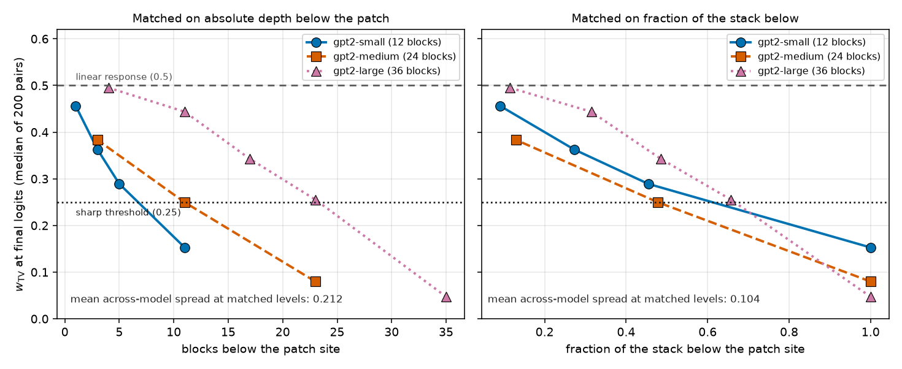

**Figure 7.** Relative depth, not absolute depth, organises the plateau. Both panels: y = median
$w_{TV}$ at the final logits over that model's 200 mined pairs (smaller = sharper); gray dashed =
linear response (0.5), dotted = sharp threshold (0.25). x, left panel: number of blocks below the patch
site; x, right panel: the same runs against $f$, the fraction of the stack below the patch site.
gpt2-small = circles, solid; gpt2-medium = squares, dashed; gpt2-large = triangles, dotted. The
annotation in each panel is the mean across-model spread of median $w_{TV}$ at matched levels (the
table below); smaller = the three models agree better under that reading. On the left the three curves
are separated and ordered by model size; on the right they nearly superimpose.

| Matched on | level | gpt2-small | gpt2-medium | gpt2-large | spread |
|---|---|---|---|---|---|
| blocks below | 11 blocks | 0.153 | 0.250 | 0.444 | **0.291** |
| blocks below | 3–4 blocks | 0.363 | 0.383 | 0.495 | **0.133** |
| relative depth $f$ | $f=1.00$ | 0.153 | 0.080 | 0.047 | **0.106** |
| relative depth $f$ | $f=0.46$–$0.49$ | 0.289 | 0.250 | 0.342 | **0.093** |
| relative depth $f$ | $f=0.09$–$0.13$ | 0.456 | 0.383 | 0.495 | **0.112** |

Averaged over levels the fractional reading halves the disagreement, $0.212 \to 0.104$. The residual
has a readable sign: at matched $f$ the deeper model is somewhat sharper ($0.153 \to 0.080 \to 0.047$
at $f=1$), so absolute depth adds a second-order effect. Since width rises with depth inside this
family, that second-order term cannot be assigned to depth or width separately.

## Experiment 6 — the hypothesis, tested with real features

The hypothesis is: *holding output JSD low, different circuits or features may occupy different
plateaus.* Output divergence is a control to be held low, so Experiment 3 does not bear on it. What it
predicts about the curve admits two readings, and both are tested here: a resting point **between** A
and B (scored by IPW, the intermediate-plateau width) or **each prompt on its own plateau** with a snap
between them (scored by $w_{TV}$, with divergence held low).

Both need an independent variable that says *which machinery* the two prompts use. We identify features
and heads directly: sparse-autoencoder (SAE) feature sets in GPT-2 Small, where public SAEs cover every
residual-stream location (SFD = Jaccard distance between active feature sets, SFC = angle between
feature-activation profiles), and attention-head contributions (HCD, HSD) and MLP neuron sets (NSD) in
all three models. IRD, the residual-stream cosine distance used as a proxy before, is kept so the
upgrade can be priced. Pairs are mined specifically for low divergence, which takes $n$ from 38 to
$\approx 370$ per model.

The SAEs behave as they should on this bank's prompts, which is what licenses reading SFD as a feature
measurement: reconstruction explains 77–91% of the variance at every hook point, with 20–77 of the
24576 features active per token. Figure 8 shows that check alongside the two readings.

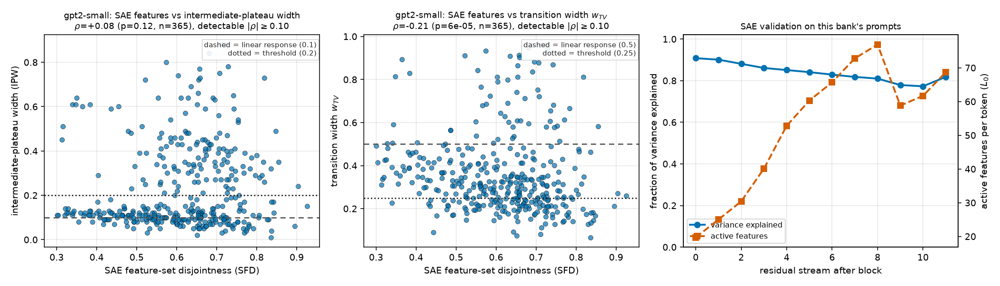

**Figure 8.** In GPT-2 Small, prompts that fire more disjoint SAE feature sets do not rest at
intermediate levels (left) but do switch more sharply (middle). Left and middle: one point per low-JSD
mined pair ($n = 365$); x = SFD, the Jaccard distance between the two prompts' active feature sets
(0 = identical features, 1 = no shared feature); y = IPW, the intermediate-plateau width (left) and
$w_{TV}$, the transition width (middle). Dashed = the linear-response value of that statistic (0.10 and
0.5); dotted = the threshold for calling it an intermediate plateau (0.20) or sharp (0.25). Right: the
autoencoder validation — x = the block after which the residual stream is read; solid circles, left y
= fraction of activation variance the SAE reconstructs; dashed squares, right y = active features per
token ($L_0$).

Every pair below has $\mathrm{JSD} < 0.1$: the two prompts predict nearly the same next token. "%
intermediate" is the share with $\mathrm{IPW} > 0.20$; "% sharp" the share with $w_{TV} < 0.25$. The
primary test is the most direct set-of-features instrument available in that model against IPW,
Holm-corrected across the three models.

| Model | $n$ | prefixes | median JSD | % intermediate | % sharp | primary test | $\rho$ | $p$ | Holm $p$ | detectable $\lvert\rho\rvert$ |
|---|---|---|---|---|---|---|---|---|---|---|
| gpt2-small | 365 | 102 | 0.035 | 40.0% | 31.5% | SFD → IPW | $+0.08$ | 0.12 | 0.24 | 0.10 |
| gpt2-medium | 399 | 119 | 0.035 | 37.3% | 47.1% | HSD → IPW | $-0.04$ | 0.40 | 0.40 | 0.10 |
| gpt2-large | 356 | 113 | 0.039 | 2.0% | 64.0% | HSD → IPW | $-0.11$ | 0.04 | 0.13 | 0.10 |

**The intermediate-plateau reading fails, and now it fails with power.** No primary test survives
correction, and the exploratory ones agree: across all fourteen instrument-model combinations the
correlation with IPW runs from $-0.11$ to $+0.12$, inside the band these sample sizes cannot
distinguish from zero. At $n \approx 370$ any association of $\lvert\rho\rvert \ge 0.10$ would have
shown up. GPT-2 Large makes the point most starkly: 64% of its low-JSD pairs switch sharply, yet only
2.0% pause anywhere in between. Its curves step once; they do not climb a staircase.

**The endpoint-plateau reading holds, on every instrument and in every model.** All fourteen tests
against $w_{TV}$ are negative — more different machinery, sharper switch — thirteen significant at
$p<0.05$ and eleven with cluster-bootstrap intervals excluding zero. IQR below is each measure's own
interquartile range; the partial column repeats the $w_{TV}$ test with residual JSD inside the low band
and the block-0 angle $\Omega$ regressed out.

| Model | measure | IQR | $\rho$ → IPW | $\rho$ → $w_{TV}$ | 95% CI ($w_{TV}$) | partial $\rho$ → $w_{TV}$ |
|---|---|---|---|---|---|---|
| gpt2-small | SFD (SAE features) | 0.52–0.71 | $+0.08$ | $-0.21$ | $[-0.34, -0.07]$ | $-0.17$ |
| gpt2-small | SFC (SAE profile) | 0.34–0.64 | $+0.04$ | $-0.12$ | $[-0.25, +0.01]$ | $-0.04$ |
| gpt2-small | HCD (head contributions) | 0.022–0.047 | $+0.07$ | $-0.21$ | $[-0.34, -0.08]$ | $-0.21$ |
| gpt2-small | HSD (head sets) | 0.07–0.21 | $+0.00$ | $-0.18$ | $[-0.31, -0.05]$ | $-0.13$ |
| gpt2-small | NSD (neuron sets) | 0.58–0.73 | $+0.12$ | $-0.20$ | $[-0.32, -0.08]$ | $-0.16$ |
| gpt2-small | IRD (representation geometry) | 0.09–0.18 | $+0.10$ | $-0.17$ | $[-0.30, -0.04]$ | $-0.15$ |
| gpt2-medium | HCD (head contributions) | 0.021–0.054 | $-0.10$ | $\mathbf{-0.36}$ | $[-0.47, -0.25]$ | $-0.43$ |
| gpt2-medium | HSD (head sets) | 0.11–0.21 | $-0.04$ | $-0.23$ | $[-0.34, -0.09]$ | $-0.25$ |
| gpt2-medium | NSD (neuron sets) | 0.60–0.77 | $+0.03$ | $-0.23$ | $[-0.35, -0.10]$ | $-0.32$ |
| gpt2-medium | IRD (representation geometry) | 0.046–0.106 | $+0.05$ | $-0.13$ | $[-0.26, +0.00]$ | $-0.28$ |
| gpt2-large | HCD (head contributions) | 0.045–0.096 | $-0.03$ | $-0.29$ | $[-0.44, -0.12]$ | $-0.38$ |
| gpt2-large | HSD (head sets) | 0.15–0.29 | $-0.11$ | $\mathbf{-0.31}$ | $[-0.45, -0.17]$ | $-0.28$ |
| gpt2-large | NSD (neuron sets) | 0.64–0.81 | $-0.03$ | $-0.26$ | $[-0.42, -0.09]$ | $-0.34$ |
| gpt2-large | IRD (representation geometry) | 0.11–0.25 | $+0.10$ | $-0.11$ | $[-0.29, +0.07]$ | $-0.19$ |

**Where this is strongest, and why it matters.** The effect is largest in the two deeper GPT-2 models
and on the head-level instruments — $\rho = -0.36$ in GPT-2 Medium for HCD and $-0.31$ in GPT-2 Large
for HSD — and it survives partialling out residual divergence inside the low band and the block-0
geometry of the patched vectors; for HCD the partial correlation is *larger* than the raw one
($-0.43$ and $-0.38$). This is the first quantity in this report that predicts plateau strength **from
the pair itself**: everything through Experiment 5 said sharpness is manufactured by depth, with output
divergence sorting which pairs sharpen most, whereas here depth and outputs are both held fixed and the
pair's internal machinery still orders the curves.

**How much the feature-level measurement bought.** IRD, the residual-stream proxy, is the weakest
instrument in both deep models — $-0.13$ in GPT-2 Medium and $-0.11$ in GPT-2 Large, the only two rows
whose confidence interval touches zero — while head-level measurement on the identical pairs reaches
$-0.36$ and $-0.29$. Distance between representations and difference of machinery are not the same
quantity, and the proxy was diluting the signal by roughly a factor of three. In GPT-2 Small the SAE
instrument matches the head-level ones ($-0.21$ against $-0.21$): two very different ways of asking
"are different features involved" agree.

Figure 9 puts all fourteen tests on one axis, which is the clearest way to see that the two readings of
the hypothesis separate.

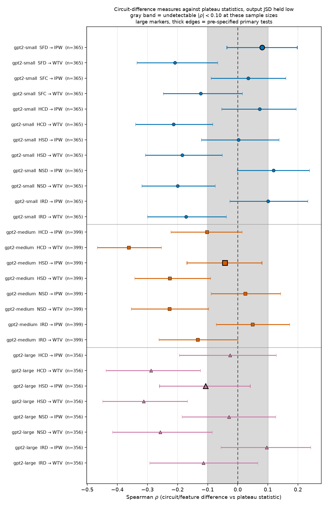

**Figure 9.** Everything pointed at intermediate plateaus lands in the undetectable band; everything
pointed at transition width lands left of zero. x: Spearman $\rho$ between the circuit-difference
measure and the plateau statistic named in the row label (IPW = intermediate-plateau width, WTV =
transition width $w_{TV}$); bars = 95% cluster-bootstrap intervals over prefixes. y: one row per
model-measure-statistic combination, grouped by model (gpt2-small circles, gpt2-medium squares,
gpt2-large triangles, separated by horizontal rules). The gray band marks $\lvert\rho\rvert < 0.10$,
the smallest correlation these sample sizes can detect; the dashed vertical line is no association.
Large markers with thick edges are the three pre-specified primary tests.

These are rank correlations of $0.2$–$0.4$, so circuit difference orders the curves without determining
them, and the instruments are correlated with each other by construction — one effect seen from six
angles, not fourteen independent replications. Nothing here intervenes on which heads fire, which is
what Experiment 7 does.

## Experiment 7 — deleting the differentially-engaged heads

An association between circuit difference and sharpness could come from some third property of a pair
producing both. So we delete the machinery and see whether the switch survives. For each low-JSD pair
we mean-ablate, at the final token only, the $k$ heads that write most differently for the two prompts
— largest $\delta_h = (\lVert c_h^A\rVert + \lVert c_h^B\rVert)(1 - \cos(c_h^A, c_h^B))$ — and compare
against deleting $k$ heads matched on how much they write but chosen to write *similarly* for the two
prompts. Both conditions remove about the same amount of attention output (median ratio of removed
write magnitude $1.01$–$1.02$ in GPT-2 Large, $1.08$–$1.12$ in GPT-2 Medium, $1.00$–$1.09$ in GPT-2
Small). Both endpoints are re-run under the ablation, and the identity check still holds
($|d(0)|, |d(1)-1| \le 3.5\times10^{-4}$).

$\Delta$ is the *paired* median of $w_{TV}$(differential) $-$ $w_{TV}$(control), with a 95% cluster
bootstrap over prefixes and a Wilcoxon signed-rank $p$. "HCD left" is median head-contribution distance
after the differential ablation as a fraction of its unablated value — the manipulation check.

| Model | dose ($k$) | median $w_{TV}$: none | control | differential | $\Delta$ | 95% CI | $p$ | pairs with $\Delta>0$ | HCD left |
|---|---|---|---|---|---|---|---|---|---|
| gpt2-large | 3% (22) | 0.198 | 0.198 | **0.358** | $+0.097$ | $[+0.054, +0.146]$ | $1.4\times10^{-43}$ | 83% | 0.76 |
| gpt2-large | 6% (43) | 0.198 | 0.196 | **0.441** | $+0.145$ | $[+0.093, +0.201]$ | $1.8\times10^{-48}$ | 87% | 0.65 |
| gpt2-large | 10% (72) | 0.198 | 0.200 | **0.484** | $+0.199$ | $[+0.125, +0.268]$ | $3.3\times10^{-47}$ | 87% | 0.54 |
| gpt2-medium | 3% (12) | 0.257 | 0.251 | 0.264 | $+0.009$ | $[+0.000, +0.014]$ | $0.019$ | 55% | 0.71 |
| gpt2-medium | 6% (23) | 0.257 | 0.248 | 0.258 | $+0.009$ | $[+0.001, +0.016]$ | $0.010$ | 56% | 0.61 |
| gpt2-medium | 10% (38) | 0.257 | 0.250 | 0.263 | $+0.010$ | $[+0.002, +0.018]$ | $0.014$ | 56% | 0.52 |
| gpt2-small | 3% (4) | 0.315 | 0.312 | 0.345 | $+0.014$ | $[+0.008, +0.025]$ | $1.7\times10^{-4}$ | 63% | 0.73 |
| gpt2-small | 6% (9) | 0.315 | 0.315 | 0.325 | $+0.019$ | $[+0.006, +0.030]$ | $1.6\times10^{-3}$ | 59% | 0.57 |
| gpt2-small | 10% (14) | 0.315 | 0.315 | 0.350 | $+0.025$ | $[+0.010, +0.041]$ | $6.5\times10^{-4}$ | 59% | 0.47 |

**In GPT-2 Large the sharp switch is caused by these heads.** Deleting 22 of 720 heads takes the median
transition width from $0.198$ to $0.358$, an 81% widening; 10% of heads takes it to $0.484$, the linear
response to within 3% — the model has stopped switching and started responding proportionally. The
matched control does nothing at any dose, so this is not the generic effect of removing attention
output. The effect appears in 83–87% of individual pairs, grows monotonically with dose, and tracks the
manipulation check. Since GPT-2 Large is the model in which the phenomenon was reported, this names
what produces it there: a small set of attention heads, identifiable in advance from the two clean
forward passes. Experiment 8 shows that set is largely shared across pairs.

**In the two smaller GPT-2 models the same intervention barely moves the curve.** It replicates in
both — GPT-2 Medium $+0.009$, $+0.009$, $+0.010$ and GPT-2 Small $+0.014$, $+0.019$, $+0.025$, every
interval excluding zero, every dose ordered as predicted — but it is 4 to 15 times smaller than in
GPT-2 Large, with 56–63% of pairs moving in the predicted direction rather than 83–87%. The
manipulation was not weaker in the small models: it removed *more* of the circuit difference (HCD down
to 0.52 and 0.47 at the top dose, against 0.54 in GPT-2 Large). The effect is also not ordered by model
size — GPT-2 Small sits above GPT-2 Medium — so the GPT-2 Large result is a property of that model, not
a trend in depth. GPT-2 Medium also had the *stronger* correlation in Experiment 6 ($\rho=-0.36$ against
$-0.29$), so the size of an association was a poor guide to what the intervention would do.

Figure 10 shows the dose-response for the two deeper models alongside the manipulation check.

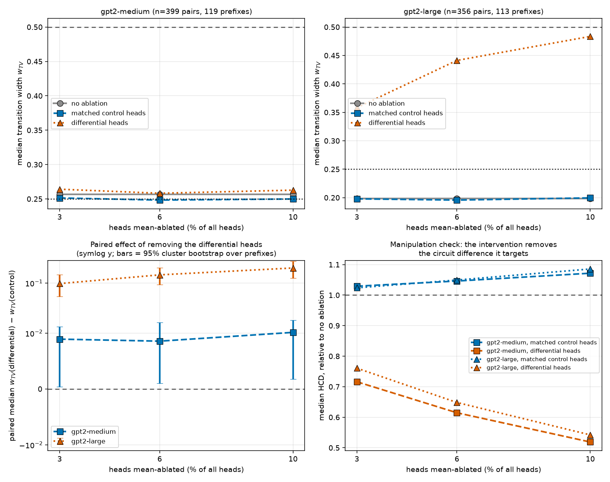

**Figure 10.** Removing the heads that write differently for the two prompts flattens the switch in
GPT-2 Large and hardly touches GPT-2 Medium. x in all four panels: ablation dose, as a percentage of all
attention heads in the model (3%, 6%, 10%). Top row, y: median $w_{TV}$ over that model's whole low-JSD
bank (smaller = sharper); circles solid = no ablation, squares dashed = matched control heads, triangles
dotted = differential heads; gray dashed = linear response (0.5), dotted = sharp threshold (0.25). The
top-left panel uses the same range as the top-right, which is why GPT-2 Medium's three conditions nearly
coincide — its effect is real but 15 times smaller, and the bottom-left panel is where to read it.
Bottom left, y (symmetric log scale): the paired median of $w_{TV}$(differential) $-$
$w_{TV}$(control), bars = 95% cluster bootstrap over prefixes, gray dashed = no effect; gpt2-medium
squares dashed, gpt2-large triangles dotted. Bottom right, y: median HCD after ablation as a fraction of
its unablated value, for the control (squares) and differential (triangles) sets in both models; gray
dashed = no change.

The heads are selected per pair by the same quantity that defines HCD, so this shows the measured
construct is causally load-bearing in GPT-2 Large rather than validating an independently-discovered
circuit. Mean-ablation also holds a head's output at a bank average instead of removing it from the
computation graph, which is why the matched control at the identical dose is the comparison that
carries the claim. GPT-2 Small's dose curve is plotted with the other two in Figure 11D; Experiment 8
asks whether the per-pair selection was necessary at all, and where in the stack the effect comes from.

## Experiment 8 — one fixed set of heads, and where in the stack it acts

Experiment 7 picks a fresh head set for every pair, so it establishes that a *construct* is
load-bearing without saying whether there is a circuit to name. Two questions follow. Do the same heads
keep being selected across pairs? And if a single set works for pairs it was not chosen from, does it
act on the computation *below* the patch, or on the two activation vectors being interpolated?

The first question is answered by how much per-pair sets overlap. Because pairs sharing a WikiText
prefix are not independent, the number that matters is the overlap between pairs from *different*
prefixes, compared against random sets of the same size and against the top-$k$ heads by write
magnitude — a set that recurs trivially, because the same heads are always the loudest.

| Model | $k$ (3% of heads) | most-selected head, and its rate | Jaccard, different prefixes: differential | by magnitude | random | selections in the top $k$ heads |
|---|---|---|---|---|---|---|
| gpt2-large | 22 of 720 | block 0, head 14 — 78.9% | 0.090 | 0.160 | 0.016 | 30.7% |
| gpt2-medium | 12 of 384 | block 1, head 4 — 46.1% | 0.064 | 0.412 | 0.016 | 24.7% |
| gpt2-small | 4 of 144 | block 0, head 1 — 85.8% | 0.280 | not run | 0.016 | 58.7% |

**The differential heads recur far above chance, but they are not a fixed list.** Across prefixes the
overlap runs 4× (GPT-2 Medium), 6× (GPT-2 Large) and 18× (GPT-2 Small) the random rate, and one head in
GPT-2 Large is selected for four pairs in five. At the same time GPT-2 Large's overlap is well under
its magnitude-ranked set's, and its 22 most frequently selected heads account for only 30.7% of all
selections. So there is a recurring core plus a long pair-specific tail, and the core is tighter in the
smaller model.

The causal version of the question is stronger than the counting version, so we ran it: split the bank
by prefix parity, rank heads by selection frequency on one half, and ablate that **single fixed set**
— the same 22 heads for every pair — on the held-out half. This is a real generalisation test; the
pairs being ablated had no say in which heads were chosen.

| Model | $n$ (held out) | median $w_{TV}$: none | matched control | per-pair set | fixed set | fixed $\Delta$ vs none | 95% CI | $p$ vs control | fraction of the per-pair effect |
|---|---|---|---|---|---|---|---|---|---|
| gpt2-large | 356 | 0.198 | 0.198 | 0.358 | **0.485** | $+0.189$ | $[+0.140, +0.249]$ | $4\times10^{-51}$ | 198% |
| gpt2-medium | 399 | 0.257 | 0.251 | 0.264 | 0.254 | $+0.004$ | $[+0.000, +0.007]$ | $0.033$ | 70% |

**In GPT-2 Large a fixed set is not just as good as per-pair selection — it is better.** Ablating the
same 22 heads for every held-out pair takes the median transition width to $0.485$, the linear response
to within 3%, against $0.358$ for sets tailored to each pair ($p = 1\times10^{-17}$ for the
difference), even though a fixed set shares only 29.4% of its heads with the average pair's own top-22.
Tailoring per pair adds noise; the shared core is what matters. GPT-2 Medium behaves the same way in
miniature — the fixed set recovers 70% of its (very small) per-pair effect — so the machinery is shared
in both models.

That result carries a mechanistic sting, because the most frequently selected heads sit in **block 0**,
and the interpolated vector replaces the final token's residual stream *after* block 0. A block-0 head
therefore cannot influence the sweep by processing the interpolated vector; it can only change the two
endpoint activations that are interpolated. To separate the two channels we rebuilt the fixed set from
the same held-out ranking with block 0 excluded, so every ablated head is genuinely downstream.

| GPT-2 Large, held-out fixed set | median $w_{TV}$ | $\Delta$ vs none | 95% CI | $p$ vs control | fraction of per-pair effect |
|---|---|---|---|---|---|
| all blocks (22 heads) | 0.485 | $+0.189$ | $[+0.140, +0.249]$ | $4\times10^{-51}$ | 198% |
| block 0 excluded (22 heads) | 0.217 | $+0.012$ | $[+0.009, +0.017]$ | $5\times10^{-24}$ | 13% |

**Most of the effect is upstream of the patch.** Removing block 0 from the fixed set costs 94% of the
widening. What survives is small but unambiguous — $+0.012$ with an interval far from zero and
$p = 5\times10^{-24}$ against the matched control — so heads below the patch do contribute, just an
order of magnitude less than the block-0 heads that decide what the interpolated vector contains in the
first place. Figure 11 shows the recurrence, the depth profile, the held-out fixed-set ablation and the
three-model dose response together.

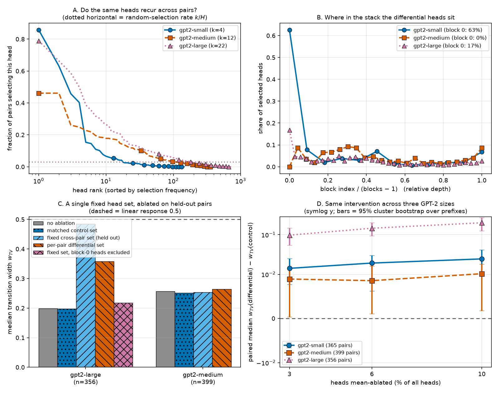

**Figure 11.** The differential heads are a shared core dominated by block 0, and a single fixed set
transfers to held-out pairs. **A** — x: head rank after sorting all heads by how often they enter a
pair's top-$k$ differential set (log scale); y: that fraction. Dotted horizontals = the rate expected
if pairs chose heads at random ($k/H$, $H$ = total heads). gpt2-small circles solid, gpt2-medium
squares dashed, gpt2-large triangles dotted, throughout the figure. **B** — x: relative depth, the
block index divided by (blocks $-$ 1), so the three models share an axis; y: the share of all selected
heads sitting in that block; the legend gives each model's block-0 share. **C** — y: median $w_{TV}$
over the held-out pairs (smaller = sharper), for no ablation, the per-pair matched control, the fixed
cross-pair set, the per-pair differential set, and (gpt2-large only) the fixed set with block-0 heads
excluded; gray dashed = linear response (0.5). **D** — x: ablation dose as a percentage of all heads;
y (symmetric log): the paired median of $w_{TV}$(differential) $-$ $w_{TV}$(control) from Experiment 7,
bars = 95% cluster bootstrap over prefixes, gray dashed = no effect. GPT-2 Small sits above GPT-2
Medium, so the effect is not ordered by model size.

**Why this matters for anyone using interpolation as a probe.** Sharpness has two sources that a curve
cannot distinguish. Depth below the patch supplies the capacity to compress a change (Experiments 4–5),
but *what* gets compressed is fixed before the patch: a handful of early heads write the discriminating
part of the activation, and a sweep between two vectors that differ in that part snaps. So a plateau is
partly a fact about the model's downstream processing and partly a fact about the geometry of the two
vectors chosen as endpoints — and the second part is set by the prompts and the patch site, not by the
mechanism the probe is usually taken to reveal.

**What this leaves for Experiment 9.** The block-0 share does not explain the cross-model gap: GPT-2
Small draws 62.6% of its differential heads from block 0 against GPT-2 Large's 16.7%, yet its
intervention effect is 4–7 times smaller. The fixed set is also not magnitude-matched pair by pair the
way the Experiment 7 control is, so its comparison rests on the per-pair control and on the
block-0-excluded variant, both run at the identical dose.

## Experiment 9 — the circuit's causal effect only exists where the depth does

Experiments 4–5 say depth below the patch supplies the compression; Experiments 7–8 say a small set of
early heads supplies the difference to be compressed. Those could be two independent contributions that
add up, or one could be a precondition for the other. The way to tell them apart is to hold the head
intervention fixed and move the patch. So we re-ran Experiment 8's held-out fixed-set ablation with
exactly one thing changed — the patch site moved to the middle block of each stack (block 6 of 12,
12 of 24, 18 of 36; relative depth $f = 0.455$, $0.478$, $0.486$) — and added the block-0 fixed-set run
for GPT-2 Small that Experiment 8 had skipped, giving three models at two patch sites. Head selection,
the prefix-parity fold split, the 3% dose and the engagement-matched control are unchanged.

$\Delta$ is the paired median of $w_{TV}$(fixed set) $-$ $w_{TV}$(control) with a 95% cluster bootstrap
over prefixes and a Wilcoxon signed-rank $p$. $\hat\Delta$ expresses the same effect as a fraction of
the headroom that remains — the distance from the control condition to the linear response — because a
mid-stack patch leaves much less room to widen the switch than a block-0 patch does. The last column is
the share of the fixed set sitting at or below the patch, where a head can only act on the two endpoint
activations and not on the interpolated vector.

| Model | patch site | $f$ | $n$ | median $w_{TV}$: none | control | fixed set | $\Delta$ | 95% CI | $p$ vs control | $\hat\Delta$ | fixed-set heads at or below the patch |
|---|---|---|---|---|---|---|---|---|---|---|---|
| gpt2-small | block 0 | 1.000 | 365 | 0.315 | 0.312 | 0.337 | $+0.015$ | $[+0.006, +0.021]$ | $1.6\times10^{-3}$ | 8.1% | 100% |
| gpt2-small | block 6 | 0.455 | 365 | 0.448 | 0.445 | 0.444 | $+0.003$ | $[-0.002, +0.008]$ | $0.43$ | 5.0% | 100% |
| gpt2-medium | block 0 | 1.000 | 399 | 0.257 | 0.251 | 0.254 | $+0.005$ | $[+0.001, +0.009]$ | $0.033$ | 2.0% | 0% |
| gpt2-medium | block 12 | 0.478 | 399 | 0.420 | 0.420 | 0.421 | $+0.002$ | $[-0.001, +0.005]$ | $0.14$ | 2.0% | 88% |
| gpt2-large | block 0 | 1.000 | 356 | 0.198 | 0.198 | **0.485** | $+0.187$ | $[+0.139, +0.249]$ | $4\times10^{-51}$ | 61.9% | 32% |
| gpt2-large | block 18 | 0.486 | 356 | 0.501 | 0.501 | 0.493 | $-0.002$ | $[-0.005, +0.000]$ | $2.9\times10^{-3}$ | n/a | 100% |

**GPT-2 Large's causal effect does not survive moving the patch, and the reason is that the plateau
does not either.** At the middle block its median $w_{TV}$ without any ablation is $0.501$ — the linear
response to three decimal places. There is no compression left to destroy, and the same 22-head
intervention that widened the switch by $+0.187$ at block 0 now moves it by $-0.002$. GPT-2 Small and
GPT-2 Medium tell the same story one order of magnitude down: their small block-0 effects ($+0.015$ and
$+0.005$) fall to $+0.003$ and $+0.002$, neither distinguishable from the control. $\hat\Delta$ is what
rules out the deflationary reading that this is only a ceiling artifact: normalising by the headroom
that remains, GPT-2 Large goes from covering 62% of the available distance at block 0 to covering none
of it, while GPT-2 Small halves (8.1% → 5.0%) and GPT-2 Medium is flat (2.0% → 2.0%). For GPT-2 Large
$\hat\Delta$ is undefined at the mid patch because the control condition already sits past the linear
response.

**So the two sources of sharpness multiply rather than add.** The early heads decide how much
difference there is between the two interpolated vectors; the blocks below the patch decide whether
that difference is compressed into a switch. Remove either and there is no plateau: Experiment 5
removes the depth, Experiment 8 removes the heads, and Experiment 9 shows that removing the depth
also removes the heads' effect. That is a stronger statement than "both matter", and it has a direct
consequence for practice — a head-ablation result of the kind Experiment 8 reports is only meaningful
at a patch site where the unablated curve actually plateaus.

**What it does not explain.** The cross-model gap stays a description. Relative depth cannot account
for it, because the three models were *already* matched on $f$ at the block-0 comparison ($f = 1$ in
all three) and matching them at a second value of $f$ silences all three rather than equalising them.
GPT-2 Large's advantage is therefore specific to the $f = 1$ site rather than a global property of that
model, but what makes that site special in that model is still open. Two smaller caveats: at the mid
patch GPT-2 Large's tiny $-0.002$ runs *opposite* to the block-0 effect with $p = 2.9\times10^{-3}$ and
45% of pairs above control — a real but negligible reversal, 1% of the block-0 effect, which we flag
rather than interpret; and at the mid patch every fixed-set head in GPT-2 Large and GPT-2 Small sits at
or below the patch, so all of them are endpoint-only there. Endpoint-only action is not what limits the
effect, though — at block 0 the seven block-0 heads were endpoint-only too and carried 94% of the
largest effect in the report.

Figure 12 shows the two patch sites side by side and the collapse of the effect between them.

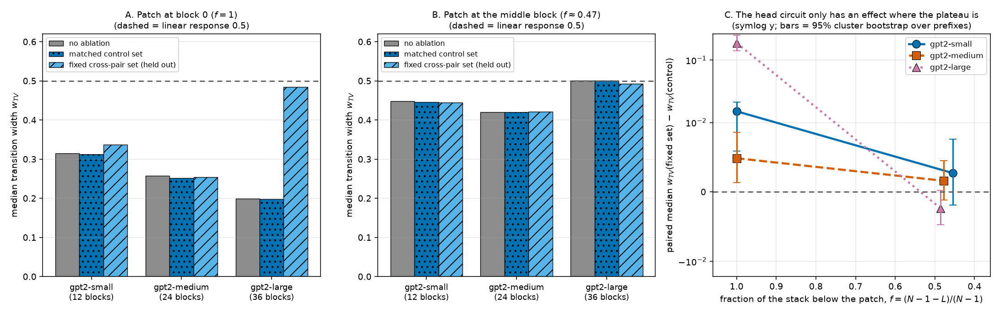

**Figure 12.** Moving the patch to mid-stack removes the plateau and the head circuit's effect
together. **A** and **B**, y: median $w_{TV}$ over the held-out low-JSD pairs (smaller = sharper); x:
model, with its block count; bars within each model are no ablation (gray, unhatched), the per-pair
engagement-matched control set (dotted hatch) and the held-out fixed cross-pair set (diagonal hatch);
gray dashed = the linear response, $w_{TV} = 0.5$. **A** patches after block 0 ($f = 1$), **B** after
the middle block ($f \approx 0.47$). The tall hatched bar in **A** is GPT-2 Large's fixed-set effect;
in **B** all nine bars sit at the linear response. **C** — x: relative depth $f$, plotted from $1$ on
the left to $0.4$ on the right so the patch moves deeper into the stack from left to right; y
(symmetric log): the paired median of $w_{TV}$(fixed set) $-$ $w_{TV}$(control), bars = 95% cluster
bootstrap over prefixes, gray dashed = no effect. gpt2-small circles solid, gpt2-medium squares dashed,
gpt2-large triangles dotted.

## Experiment 10 — the plateau is not an artifact of reading out at the interpolated position

Every sweep above shares one design choice that never varies: the token that differs is the **last**
token of the prompt, and the readout is the very next distribution. The interpolated vector therefore
sits in the same residual stream position that produces the answer, so a sharp switch could be a
property of that shortcut rather than of the computation. It also leaves an alternative reading of
Experiment 3 open — endpoint divergence and sharpness correlate *across* pairs, but nothing so far
manipulates divergence *within* a pair.

This experiment changes only the position. For each low-JSD pair we take the model's own greedy
continuation of the A prompt, $s$ tokens long, and append that same continuation to **both** prompts:

```math
A = \text{prefix} + [a] + \sigma, \qquad B = \text{prefix} + [b] + \sigma, \qquad \sigma = \text{greedy}_s(\text{prefix} + [a]).
```

The block-0 SLERP patch is still applied at the differing position, but the logits are now read $s$
tokens later, so the patched activation can only reach the readout through attention. $s = 0$ is the
original design and reproduces the stored sweeps exactly (maximum difference in $w_{TV}$: $0$), which
is the harness check for this experiment. Because the pairs are re-swept as a paired design, every
number below compares the same pairs at different $s$.

| Model | $n$ | median $w_{TV}$, $s{=}0$ | $s{=}1$ | $s{=}2$ | $s{=}4$ | paired $\Delta$ ($s{=}4$ vs $0$) | 95% CI | $p$ | % sharp $s{=}0 \to 4$ | median endpoint JSD $s{=}0 \to 4$ |
|---|---|---|---|---|---|---|---|---|---|---|
| gpt2-small | 120 | 0.311 | 0.293 | 0.338 | 0.303 | $-0.003$ | $[-0.042, +0.040]$ | $0.60$ | 25.8% → 28.3% | 0.0378 → 0.0024 |
| gpt2-medium | 60 | 0.252 | 0.257 | 0.266 | 0.284 | $+0.019$ | $[-0.014, +0.055]$ | $0.11$ | 48.3% → 45.0% | 0.0344 → 0.0021 |
| gpt2-large | 45 | 0.148 | 0.172 | 0.159 | 0.193 | $+0.001$ | $[-0.015, +0.026]$ | $0.65$ | 60.0% → 53.3% | 0.0499 → 0.0034 |

**The switch survives the move, in all three models.** Pushing the readout four tokens downstream
leaves the median transition width statistically indistinguishable from the original design in every
model, and leaves GPT-2 Large's curve far sharper than the other two exactly as before ($0.193$ against
the linear response's $0.5$). The plateau is therefore a property of how the model resolves the
interpolated activation into a downstream computation, not of reading the answer out of the interpolated
position itself. This closes the most obvious methodological escape route for every result in this
report: the whole report's design choice can be relaxed without changing the conclusions.

**More informative than the invariance itself is what it happens against.** The shared continuation
collapses the two prompts' output difference: median endpoint JSD falls 15–16-fold, from $0.050$ to
$0.0034$ in GPT-2 Large and from $0.038$ to $0.0024$ in GPT-2 Small. Four tokens of agreed-on text are
enough to almost erase the disagreement the differing token created. And the transition width does not
follow. Experiment 3's across-pair regularity — more divergent endpoints go with sharper switches — does
**not** hold when divergence is manipulated within a pair. Endpoint divergence is a marker of some other
property of the pair (Experiment 6 argues it is how disjoint the engaged features are), not the quantity
that sets sharpness. That is a direct, causal-style check on a correlation that this report has so far
only been able to describe.

Figure 13 shows the invariance and the collapse side by side, together with the mean switch curves.

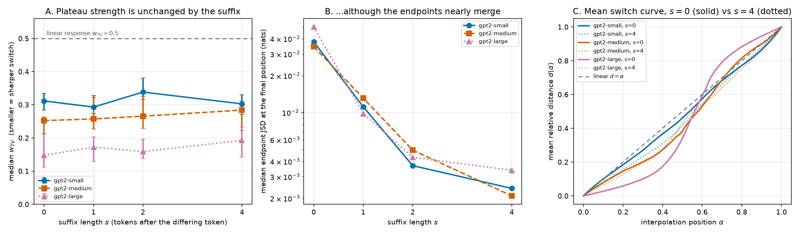

**Figure 13.** The switch is unchanged when the interpolated token stops being the last token, even
though the two prompts' outputs nearly merge. **A** — x: suffix length $s$, the number of shared tokens
appended after the differing token ($s = 0$ is the design used everywhere else in this report); y:
median $w_{TV}$ over the swept pairs, smaller = sharper switch, bars = 95% bootstrap over pairs; gray
dashed = the linear response $w_{TV} = 0.5$. **B** — same x; y (log scale): median Jensen-Shannon
divergence in nats between the two complete prompts' next-token distributions at the final position.
**C** — x: interpolation position $\alpha$; y: mean relative distance $d(\alpha)$ over the swept pairs,
solid = $s = 0$, dotted = $s = 4$, gray dashed = the linear response $d = \alpha$. In all three panels
gpt2-small is circles/solid, gpt2-medium squares/dashed, gpt2-large triangles/dotted.

**Caveats.** The two larger models are swept on subsamples of their banks ($n = 60$ and $n = 45$ against
365–399 in Experiments 7–9) to fit the compute budget, so the $s{=}0$ medians here differ from those
tables; every comparison is paired within this subsample and the confidence intervals reflect it. At
$n = 45$ the interval on GPT-2 Large's paired shift is $\pm 0.02$, small against the $0.15 \to 0.5$
range the metric spans, so this is a usefully tight null rather than an absence of power. The shared
continuation is natural text for prompt A and imposed on prompt B, which is the price of holding the
continuation identical. Finally, endpoint reproduction is looser here than elsewhere: for $s > 0$ the
worst error is $2.1\times10^{-3}$ rather than $3.6\times10^{-4}$, because the two endpoint logit vectors
come to within $10^{-3}$ of each other and float32 kernels vary with batch shape. The endpoint
references are computed inside the identical batched path as the swept rows to keep that error two
orders of magnitude below the signal.
