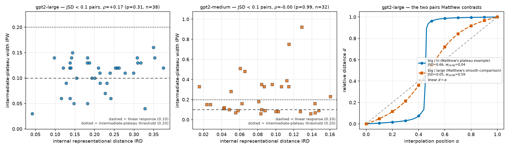

# RESULTS — When does interpolating one token's activation produce a plateau?

> CURRENT-BEST ONLY. One row per experiment. No history (that lives in CHANGELOG.md).

## Headline

Matthew's reported contrast **reproduces in his own model**. In GPT-2 Large (36 blocks), interpolating
the final token's block-0 activation gives a near-perfect step for `The house was big` / `in`
($w_{10-90}=0.044$) and a smooth, near-linear response for `big` / `large` ($w_{10-90}=0.592$). It does
**not** reproduce in GPT-2 Medium, where `big`/`in` gives $w_{10-90}=0.516$ — above the plateau
criterion. Plateau strength is governed by the **fraction of the stack below the patch**, not the block
count: GPT-2 Large patched at block 12 and GPT-2 Medium patched at block 0 have the same 23 blocks
below and differ 3.2-fold in transition width. But depth is necessary, not sufficient — `big`/`large`
stays smooth in GPT-2 Large with 35 blocks below the patch, so whether a given interpolation sharpens
depends on the pair, not on depth alone.

The practical caution is a **base rate**: in a bank of 200 corpus-mined pairs per model, 83.5% of GPT-2
Large pairs and 73.0% of GPT-2 Medium pairs plateau under the plan's predefined criterion
($w_{10-90}<0.5$). A plateau observed for one chosen pair is therefore weak evidence on its own.

The advisor's hypothesis — *holding output JSD low, different circuits/features may occupy different
plateaus* — gets its first direct test here, and the result is **null**: among pairs with matched
next-token predictions (JSD $<0.1$), how differently the two prompts are represented internally does
not predict whether the interpolation rests at an intermediate level (Spearman $\rho=+0.17$, $p=0.31$,
$n=38$ in GPT-2 Large; $\rho=-0.00$, $p=0.99$, $n=32$ in GPT-2 Medium). The test is under-powered and
uses a proxy for "different features", so this is a first negative datapoint, not a refutation.

## Experiment 1 — Matthew's two pairs, plus four test pairs, in five models

All 6 pairs tokenized validly in all five models (identical prefix, exactly one differing single final
token). Across all 3645 sweeps in this report, patching at $\alpha=0$ and $\alpha=1$ reproduced the
clean runs to $|d| \le 4\times10^{-4}$, so the interpolation harness is correct.

The two `The house was` pairs are Matthew's own. `big`/`in` is his **positive plateau example**;
`big`/`large` is his **smooth comparison**, the pair he reports as *not* plateauing. Neither is a
negative control for continuation similarity. The other four pairs are ours, chosen so the two versions
plausibly continue the same way while differing in some internal property.

Lower $w_{10-90}$ and $w_{TV}$ mean a sharper transition; higher PF (plateau fraction) means more of
the sweep sits pinned at an endpoint. The plan's predefined plateau criterion is $w_{10-90}<0.5$
against a linear-response reference of $0.8$; the threshold-free statistic $w_{TV}$ has reference
$0.5$ and sharp threshold $0.25$; PF has reference $0.2$.

| Model | Prompt pair (final tokens) | endpoint JSD (nats) | $w_{10-90}$ | $w_{TV}$ | PF | plateau? |
|---|---|---|---|---|---|---|
| gpt2-large | *M. plateau case:* The house was ` big` / ` in` | 0.663 | **0.044** | **0.012** | 0.95 | yes |
| gpt2-large | *M. smooth case:* The house was ` big` / ` large` | 0.053 | 0.592 | 0.292 | 0.42 | no |
| gpt2-large | The answer is ` four` / ` Four` | 0.283 | 0.133 | 0.020 | 0.86 | yes |
| gpt2-large | gave a book to ` Mary` / ` her` | 0.051 | 0.288 | 0.144 | 0.71 | yes |
| gpt2-large | clue identify? ` Au` / ` 79` | 0.312 | 0.448 | 0.139 | 0.55 | yes |
| gpt2-large | Two plus two is ` four` / ` 4` | 0.048 | 0.485 | 0.216 | 0.52 | yes |
| gpt2-medium | *M. plateau case:* The house was ` big` / ` in` | 0.659 | 0.516 | 0.272 | 0.50 | no |
| gpt2-medium | *M. smooth case:* The house was ` big` / ` large` | 0.042 | 0.719 | 0.398 | 0.29 | no |
| gpt2-medium | The answer is ` four` / ` Four` | 0.377 | **0.120** | **0.058** | 0.88 | yes |
| gpt2-medium | gave a book to ` Mary` / ` her` | 0.068 | 0.586 | 0.114 | 0.51 | no |
| gpt2-medium | clue identify? ` Au` / ` 79` | 0.342 | 0.358 | 0.117 | 0.64 | yes |
| gpt2-medium | Two plus two is ` four` / ` 4` | 0.138 | 0.454 | 0.232 | 0.55 | yes |
| gpt2-small | *M. plateau case:* The house was ` big` / ` in` | 0.658 | 0.691 | 0.254 | 0.32 | no |
| gpt2-small | *M. smooth case:* The house was ` big` / ` large` | 0.053 | 0.760 | 0.456 | 0.25 | no |
| gpt2-small | The answer is ` four` / ` Four` | 0.358 | **0.548** | **0.225** | 0.46 | no |
| gpt2-small | gave a book to ` Mary` / ` her` | 0.030 | 0.556 | 0.276 | 0.45 | no |
| gpt2-small | clue identify? ` Au` / ` 79` | 0.355 | 0.906 | 0.781 | 0.10 | no |
| gpt2-small | Two plus two is ` four` / ` 4` | 0.173 | 0.607 | 0.352 | 0.40 | no |
| opt-350m | *M. plateau case:* The house was ` big` / ` in` | 0.646 | **0.143** | **0.068** | 0.85 | yes |
| opt-350m | *M. smooth case:* The house was ` big` / ` large` | 0.042 | 0.831 | 0.598 | 0.18 | no |
| opt-350m | The answer is ` four` / ` Four` | 0.472 | 0.530 | 0.293 | 0.48 | no |
| opt-350m | gave a book to ` Mary` / ` her` | 0.038 | 0.734 | 0.356 | 0.28 | no |
| opt-350m | clue identify? ` Au` / ` 79` | 0.296 | 0.705 | 0.177 | 0.31 | no |
| opt-350m | Two plus two is ` four` / ` 4` | 0.027 | 0.907 | 0.680 | 0.11 | no |
| pythia-410m | *M. plateau case:* The house was ` big` / ` in` | 0.665 | 0.425 | 0.137 | 0.57 | yes |
| pythia-410m | *M. smooth case:* The house was ` big` / ` large` | 0.042 | 0.802 | 0.505 | 0.21 | no |
| pythia-410m | The answer is ` four` / ` Four` | 0.271 | **0.340** | **0.135** | 0.66 | yes |
| pythia-410m | gave a book to ` Mary` / ` her` | 0.033 | 0.582 | 0.268 | 0.43 | no |
| pythia-410m | clue identify? ` Au` / ` 79` | 0.385 | 0.598 | 0.254 | 0.41 | no |
| pythia-410m | Two plus two is ` four` / ` 4` | 0.056 | 0.758 | 0.451 | 0.25 | no |

**The reproduction works, in the right model.** In GPT-2 Large the contrast is stark and matches what
Matthew reports: `big`/`in` moves through 80% of the gap in 4% of the sweep — a near-step with 95% of
the grid pinned at an endpoint — while `big`/`large` needs 59% of the sweep and sits close to the
diagonal. In GPT-2 Medium the same `big`/`in` pair gives $w_{10-90}=0.516$, which fails the predefined
criterion, and in GPT-2 Small it gives $0.691$. **GPT-2 Medium is not a reproduction of a GPT-2 Large
result**, and any earlier conclusion drawn from the `big`/`in` curve in GPT-2 Medium does not transfer.

**`big`/`large` is smooth everywhere.** It is the widest or second-widest transition in all five models
($w_{10-90}$ from $0.592$ to $0.831$), including in GPT-2 Large, which has more blocks below the patch
than any other model here. That single cell rules out the strong form of "depth produces the plateau":
35 downstream blocks did not sharpen this pair.

**Plateaus are not universal among hand-picked pairs.** Under the predefined criterion $w_{10-90}<0.5$,
**11 of the 30** model-pair cells qualify (14 of 30 under $w_{TV}<0.25$) — a minority, and concentrated
in the deeper models: 5/6 in GPT-2 Large, 3/6 in GPT-2 Medium, 2/6 in Pythia-410m, 1/6 in OPT-350m and
0/6 in GPT-2 Small.

Figure 1 shows every raw sweep, which is the only way to see the shapes behind these statistics.

**Figure 1.** The `big`/`in` versus `big`/`large` contrast reproduces in GPT-2 Large and weakens with
model depth. x: interpolation position $\alpha$ from prompt A (0) to prompt B (1); y: relative distance
$d$ (0 = at A's logits, 1 = at B's logits). Solid curve with circles = measured $d(\alpha)$; gray
dashed = the linear reference $d=\alpha$. Columns are models, ordered by depth (GPT-2 Large 36 blocks →
Pythia-410m 24). Rows are prompt pairs; the two bottom rows (thick frames) are Matthew's pair — row 5
his plateau case `big`/`in`, row 6 his smooth case `big`/`large`. Each panel title gives that cell's
endpoint JSD and $w_{10-90}$. Row 5 is a near-vertical step in the GPT-2 Large panel and drifts toward
the diagonal as model depth falls; row 6 stays near the diagonal in every model.

## Experiment 2 — how often does an arbitrary pair plateau?

A single pair's plateau means little without knowing how often arbitrary pairs do the same. Each mined
pair is a WikiText-103 prefix (40 prefixes, 10–40 tokens) plus the model's own top-1 next token versus
a token at rank $r$, with $r$ log-uniform in $[1,5000]$, so endpoint JSD spans its whole range.

**Figure 2.** Plateaus are common for arbitrary prompt pairs, increasingly so in deeper models. x:
$w_{TV}$ at the final logits (smaller = sharper); y: number of mined pairs per bin (gray hatched
histogram, $n=200$ per model). Gray dashed = linear response (0.5), dotted = sharpness threshold
(0.25). The markers on the strip above each histogram are the hand-picked pairs of Table 1 at their
$w_{TV}$ values (shape and color per the legend, Matthew's pairs with a thick black edge); their y
position carries no meaning.

| Model (blocks) | % with $w_{10-90}<0.5$ (predefined) | % with $w_{TV}<0.25$ | median $w_{10-90}$ | median $w_{TV}$ |
|---|---|---|---|---|
| gpt2-large (36) | 83.5% | 89.5% | 0.155 | 0.047 |
| gpt2-medium (24) | 73.0% | 82.0% | 0.241 | 0.080 |
| gpt2-small (12) | 60.5% | 74.0% | 0.417 | 0.153 |
| opt-350m (24) | 47.0% | 61.0% | 0.511 | 0.221 |
| pythia-410m (24) | 30.0% | 47.5% | 0.593 | 0.266 |

The base rate is high in the GPT-2 family and falls with depth: in GPT-2 Large five pairs in six
plateau under the predefined criterion. So observing a plateau for a chosen pair in GPT-2 Large is
close to uninformative on its own — the interesting quantity is how a pair compares against this
distribution, not whether it crosses a threshold. Note the contrast with the hand-picked set, where
only 11/30 cells plateau: our four test pairs are unusually smooth relative to random pairs, which is
itself a reason to distrust conclusions drawn from a handful of chosen prompts.

## Experiment 3 — endpoint divergence and transition width

This experiment measures a descriptive relationship in the mined bank. **It does not test the
advisor's hypothesis**, which concerns different features occupying different plateaus at matched
output divergence; Experiment 6 does that. Reported here because it is a strong and consistent
regularity that any user of this method will run into.

**Figure 3.** Across mined pairs, more divergent endpoints go with sharper transitions in all five
models. x (all panels): endpoint JSD in nats (larger = more different next-token predictions); the
dash-dot vertical line is the $\ln 2$ ceiling JSD attains for disjoint predictions. y: $w_{10-90}$
(top) and $w_{TV}$ (bottom) at the final logits, smaller = sharper. Columns are models. Light circles =
the 200 mined pairs; solid line = OLS fit; dashed line with squares = quintile means of JSD with
$\pm1$ SE; stars = the hand-picked pairs (thick black edge = Matthew's pairs). Gray dashed = linear
response, dotted = plateau threshold.

Restricted to pairs below the $\ln 2$ ceiling, where JSD can still order pairs, the rank correlation
between endpoint divergence and $w_{TV}$ is negative in every model:

| Model | $n$ (JSD $<0.65$) | $\rho$ ($w_{TV}$) | $p$ | $\rho$ ($w_{10-90}$) | $p$ |
|---|---|---|---|---|---|
| gpt2-large | 137 | $-0.64$ | $6.1\times10^{-17}$ | $-0.61$ | $2.3\times10^{-15}$ |
| gpt2-medium | 142 | $-0.61$ | $1.5\times10^{-15}$ | $-0.54$ | $4.9\times10^{-12}$ |
| opt-350m | 129 | $-0.57$ | $1.3\times10^{-12}$ | $-0.59$ | $3.1\times10^{-13}$ |
| pythia-410m | 127 | $-0.45$ | $9.0\times10^{-8}$ | $-0.47$ | $2.3\times10^{-8}$ |
| gpt2-small | 147 | $-0.44$ | $2.7\times10^{-8}$ | $-0.36$ | $7.8\times10^{-6}$ |

The relationship is descriptive and its direction is worth knowing — pairs that predict *more*
different next tokens give *sharper* transitions — but it says nothing about whether two prompts with
*matched* predictions differ internally, which is the question the hypothesis asks.

Comparing models inside fixed JSD bins shows the cross-model differences in Table 2 are not an artifact
of the banks landing at different divergences.

**Figure 4.** The cross-model sharpness ordering survives matching on endpoint divergence. x: endpoint
JSD bin in nats (the last bin is the $\ln 2$ ceiling), annotated with the number of mined pairs per
model; y: median $w_{TV}$ at the final logits over the pairs in the bin (smaller = sharper). One line
per model, each with its own color, line style and marker (see legend). Gray dashed = linear response
(0.5), dotted = sharp threshold (0.25). GPT-2 Large and GPT-2 Medium are sharpest in every bin, and all
lines fall from left to right.

## Experiment 4 — where the sharpness accumulates, and what happens when depth is removed

**Figure 5.** The plateau is built up gradually across depth, not created at the patch site. x: block
whose `resid_post` is read out (patch is applied after block 0; the last x value is the final logits);
y: $w_{10-90}$ at that read-out point. One line per prompt pair (color, line style and marker all vary
together; see legend); panels are models. Gray dashed = linear response (0.8), dotted = plateau
threshold (0.5). Every pair starts near 0.8 just after the patch; some narrow steeply with depth and
`big`/`large` stays near the top in every model.

Reading out earlier is not the same as computing less, so the causal version moves the patch site
instead. Re-running the identical 200-pair bank with the interpolated vector inserted after block 12
and after block 20 leaves 11 and 3 blocks to process it instead of 23.

**Figure 6.** Removing downstream blocks removes the plateau. x (both panels): the patch site — the
block whose `resid_post` at the final token is replaced by the interpolated vector — labelled with the
number of blocks remaining below it. Left y: median $w_{TV}$ at the final logits over the 200 mined
pairs (smaller = sharper), shaded band = interquartile range, gray dashed = linear response (0.5),
dotted = sharp threshold (0.25). Right y: Spearman $\rho$ between endpoint JSD and $w_{TV}$ over the
pairs below the $\ln 2$ ceiling, error bars = 95% cluster bootstrap over the 40 prefixes, gray dashed =
no association. gpt2-medium = circles, solid; pythia-410m = squares, dashed; opt-350m = triangles,
dotted.

| Model | patch site | blocks below | median $w_{TV}$ | % sharp | median $w_{10-90}$ |
|---|---|---|---|---|---|
| gpt2-medium | block 0 | 23 | 0.080 | 82.0% | 0.241 |
| gpt2-medium | block 12 | 11 | 0.250 | 50.5% | 0.556 |
| gpt2-medium | block 20 | 3 | 0.383 | 10.0% | 0.701 |
| opt-350m | block 0 | 23 | 0.221 | 61.0% | 0.511 |
| opt-350m | block 12 | 11 | 0.307 | 36.5% | 0.641 |
| opt-350m | block 20 | 3 | 0.420 | 1.0% | 0.741 |
| pythia-410m | block 0 | 23 | 0.266 | 47.5% | 0.593 |
| pythia-410m | block 12 | 11 | 0.419 | 2.5% | 0.749 |
| pythia-410m | block 20 | 3 | 0.509 | 0.0% | 0.808 |

Sharpness falls off monotonically as depth is removed, in all three models. The clearest single number
is pythia-410m at block 20: median $w_{TV} = 0.509$ against the linear response's $0.5$ — with 3 blocks
left, not one of its 200 pairs is sharp. Depth below the patch is what allows a plateau to form. It is
not sufficient on its own: `big`/`large` has 35 blocks below the patch in GPT-2 Large and stays smooth
(Table 1), so the interpolation path matters too.

## Experiment 5 — it is the fraction of the stack below the patch, not the block count

Experiment 4 leaves the units of "depth" ambiguous, because all three models have 24 blocks. The two
readings give opposite advice for any other model. We separate them inside one family, where tokenizer,
architecture and training corpus are fixed and only depth changes: `gpt2` (12 blocks), `gpt2-medium`
(24) and `gpt2-large` (36), each with its own 200-pair bank swept at sites chosen so the three line up
either on blocks-below or on the relative depth $f = (N-1-L)/(N-1)$ — the fraction of the stack below
patch site $L$ in an $N$-block model.

| Model (blocks) | patch site | blocks below | $f$ | median $w_{TV}$ | % sharp | median $w_{10-90}$ |
|---|---|---|---|---|---|---|
| gpt2-small (12) | block 0 | 11 | 1.000 | 0.153 | 74.0% | 0.417 |
| gpt2-small (12) | block 6 | 5 | 0.455 | 0.289 | 35.5% | 0.632 |
| gpt2-small (12) | block 8 | 3 | 0.273 | 0.363 | 12.0% | 0.703 |
| gpt2-small (12) | block 10 | 1 | 0.091 | 0.456 | 3.5% | 0.768 |
| gpt2-medium (24) | block 0 | 23 | 1.000 | 0.080 | 82.0% | 0.241 |
| gpt2-medium (24) | block 12 | 11 | 0.478 | 0.250 | 50.5% | 0.556 |
| gpt2-medium (24) | block 20 | 3 | 0.130 | 0.383 | 10.0% | 0.701 |
| gpt2-large (36) | block 0 | 35 | 1.000 | 0.047 | 89.5% | 0.155 |
| gpt2-large (36) | block 12 | 23 | 0.657 | 0.255 | 47.0% | 0.570 |
| gpt2-large (36) | block 18 | 17 | 0.486 | 0.342 | 22.5% | 0.673 |
| gpt2-large (36) | block 24 | 11 | 0.314 | 0.444 | 1.5% | 0.754 |
| gpt2-large (36) | block 31 | 4 | 0.114 | 0.495 | 0.0% | 0.796 |

**The absolute reading is refuted by a direct comparison.** gpt2-large patched at block 12 and
gpt2-medium patched at block 0 both have exactly 23 blocks below the patch, and are not alike: median
$w_{TV}$ is $0.255$ against $0.080$, a factor of 3.2, and 47.0% of pairs sharp against 82.0%. At 11
blocks below, the three models give $0.153$, $0.250$ and $0.444$ — the model with the *fewest* total
blocks is the sharpest, which the absolute reading cannot express.

**Figure 7.** Relative depth, not absolute depth, organises the plateau. Both panels: y = median
$w_{TV}$ at the final logits over that model's 200 mined pairs (smaller = sharper); gray dashed =
linear response (0.5), dotted = sharp threshold (0.25). x, left panel: number of blocks below the patch
site; x, right panel: the same runs against $f$, the fraction of the stack below the patch site.
gpt2-small = circles, solid; gpt2-medium = squares, dashed; gpt2-large = triangles, dotted. The
annotation in each panel is the mean across-model spread of median $w_{TV}$ at matched levels (the
table below); smaller = the three models agree better under that reading. On the left the three curves
are separated and ordered by model size; on the right they nearly superimpose.

| Matched on | level | gpt2-small | gpt2-medium | gpt2-large | spread |
|---|---|---|---|---|---|
| blocks below | 11 blocks | 0.153 | 0.250 | 0.444 | **0.291** |
| blocks below | 3–4 blocks | 0.363 | 0.383 | 0.495 | **0.133** |
| relative depth $f$ | $f=1.00$ | 0.153 | 0.080 | 0.047 | **0.106** |
| relative depth $f$ | $f=0.46$–$0.49$ | 0.289 | 0.250 | 0.342 | **0.093** |
| relative depth $f$ | $f=0.09$–$0.13$ | 0.456 | 0.383 | 0.495 | **0.112** |

Averaged over levels the fractional reading halves the disagreement, $0.212 \to 0.104$. The residual
has a readable sign: at matched $f$ the deeper model is somewhat sharper ($0.153 \to 0.080 \to 0.047$
at $f=1$), so absolute depth adds a second-order effect. Since width rises with depth inside this
family, that second-order term cannot be assigned to depth or width separately.

## Experiment 6 — a first test of the advisor's hypothesis

The hypothesis is: *holding output JSD low, different circuits/features may occupy different plateaus.*
It requires holding output divergence low rather than varying it, and it predicts something about
**intermediate** plateaus — resting points partway between A and B — not about how narrow the A-to-B
transition is. Experiments 3–5 do not test it.

The test restricts to mined pairs with JSD $<0.1$ (the two prompts predict nearly the same next token),
uses **internal representational distance** IRD — the mean over blocks of $1-\cos(h_A^l, h_B^l)$ at the
final token, i.e. how differently the two prompts are represented inside the model given matched
outputs — as the independent variable, and **intermediate-plateau width** IPW — the longest $\alpha$
span over which $d$ stays within $0.10$ of a level between $0.15$ and $0.85$ — as the dependent
variable. A linear response gives IPW $=0.10$ by construction, so IPW $>0.20$ counts as an intermediate
plateau.

**Figure 8.** No detectable link between internal representational difference and intermediate
plateaus. Left and middle panels: one point per mined pair with JSD $<0.1$ (GPT-2 Large $n=38$, GPT-2
Medium $n=32$); x = IRD, y = IPW; dashed line = the linear-response value of IPW (0.10), dotted = the
intermediate-plateau threshold (0.20). Note the two panels use different y ranges. Right panel: the two
pairs Matthew contrasts, in his model — x = interpolation position $\alpha$, y = relative distance $d$;
solid with circles = `big`/`in`, dashed with squares = `big`/`large`, gray dashed = linear $d=\alpha$.

| Model | $n$ (JSD $<0.1$) | prefixes | median IRD | median IPW | % with intermediate plateau | $\rho$(IRD, IPW) | $p$ |
|---|---|---|---|---|---|---|---|
| gpt2-large | 38 | 19 | 0.205 | 0.120 | 0.0% | $+0.17$ | 0.31 |
| gpt2-medium | 32 | 18 | 0.086 | 0.155 | 40.6% | $-0.00$ | 0.99 |

**The result is null in both models.** Pairs whose internal representations differ more do not rest at
intermediate levels more often. In GPT-2 Large no low-JSD pair reaches the intermediate-plateau
threshold at all: its curves go from A to B without pausing. In GPT-2 Medium 41% do show an
intermediate rest, but IRD does not predict which ones ($\rho = -0.00$), and GPT-2 Medium's curves are
predominantly non-monotonic, so some of those apparent rests are dips rather than stable states.

**This is a first datapoint, not a refutation.** At $n=38$ only $|\rho| \ge 0.32$ would be detectable,
so a modest association would be missed. IRD is a proxy for "different circuits/features" built from
residual-stream geometry; a sharper test would identify the features directly (for example with a
sparse autoencoder or by path patching) rather than inferring difference from representation distance.
Both are worth doing before treating the hypothesis as answered.
