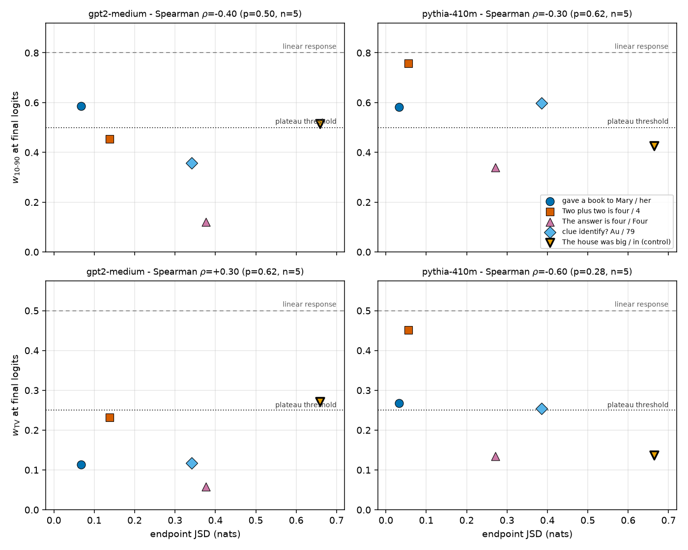

# RESULTS — Do last-token activation interpolations induce plateaus?

> CURRENT-BEST ONLY. One row per experiment. No history (that lives in CHANGELOG.md).

## Headline

Interpolating a **single token's** block-0 activation between two prompts produces a flat-then-abrupt
("plateau") logit response in **every** case we tested — including the control pair whose two
continuations are the most different of all. Endpoint next-token similarity does **not** predict how
sharp the plateau is (pooled Spearman $\rho = -0.37$, $p = 0.29$, $n = 10$; the sign even flips
between models and between sharpness statistics). A plateau in this kind of interpolation is
therefore the default response of the network, not evidence that two prompts share a continuation
while differing in an internal feature.

## Metrics

All 5 prompt pairs tokenized validly in both models: identical prefix, exactly one differing
single final token. Patching at $\alpha=0$ and $\alpha=1$ reproduced the clean runs to
$|d| \le 10^{-4}$, so the interpolation harness is correct. Lower $w_{10-90}$ and $w_{TV}$ mean a
sharper transition; higher PF (plateau fraction) means more of the sweep sits at an endpoint value.
The linear-response reference is $w_{10-90}=0.8$, $w_{TV}=0.5$, $\mathrm{PF}=0.2$.

| Model | Prompt pair (final tokens) | endpoint JSD (nats) | $w_{10-90}$ | $w_{TV}$ | PF | monotonic |
|---|---|---|---|---|---|---|
| gpt2-medium | gave a book to ` Mary` / ` her` | 0.068 | 0.586 | 0.114 | 0.51 | no |
| gpt2-medium | Two plus two is ` four` / ` 4` | 0.138 | 0.454 | 0.232 | 0.55 | yes |
| gpt2-medium | The answer is ` four` / ` Four` | 0.377 | **0.120** | **0.058** | 0.88 | no |
| gpt2-medium | clue identify? ` Au` / ` 79` | 0.342 | 0.358 | 0.117 | 0.64 | no |
| gpt2-medium | *control:* The house was ` big` / ` in` | 0.659 | 0.516 | 0.272 | 0.50 | no |
| pythia-410m | gave a book to ` Mary` / ` her` | 0.033 | 0.582 | 0.268 | 0.43 | yes |
| pythia-410m | Two plus two is ` four` / ` 4` | 0.056 | 0.758 | 0.451 | 0.25 | yes |
| pythia-410m | The answer is ` four` / ` Four` | 0.271 | **0.340** | **0.135** | 0.66 | yes |
| pythia-410m | clue identify? ` Au` / ` 79` | 0.385 | 0.598 | 0.254 | 0.41 | yes |
| pythia-410m | *control:* The house was ` big` / ` in` | 0.665 | 0.425 | 0.137 | 0.57 | yes |

The two pairs the plan expected to plateau most strongly — the ones with the *smallest* endpoint
divergence (`Mary`/`her` at 0.033–0.068 nats, `four`/`4` at 0.056–0.138 nats) — give the
**widest**, most nearly linear transitions in the table. The sharpest cell is `four`/`Four`, a pair
with 5× that divergence. The control, at the largest divergence of all, is sharper than both
low-JSD pairs in gpt2-medium on $w_{TV}$ and sharper than three of the four test pairs in
pythia-410m.

The rank correlations between endpoint JSD and each sharpness statistic contradict one another,
which is what an absent relationship looks like: pooled over all 10 model-pair cells,
$\rho = -0.37$ ($p=0.29$) for $w_{10-90}$, $-0.15$ ($p=0.68$) for $w_{TV}$, and $+0.32$ ($p=0.37$)
for PF. Within gpt2-medium alone the $w_{TV}$ correlation is $+0.30$; within pythia-410m it is
$-0.60$. No cell reaches significance at $n=5$ or $n=10$.

The next table lists the top-3 next-token predictions at each endpoint, which are the distributions
the JSD column compares. They make the low-JSD pairs concrete: after ` Mary` and after ` her`,
pythia-410m predicts the same three tokens in the same order, and these are exactly the two cells
that produced the widest, most linear transitions in the table above.

| Model | Pair | top-3 after A | top-3 after B |
|---|---|---|---|
| gpt2-medium | ` Mary` / ` her` | ` and`, `,`, `.` | ` and`, `,`, `.` |
| gpt2-medium | ` four` / ` 4` | `,`, ` plus`, `.` | `.`, `,`, ` +` |
| gpt2-medium | ` four` / ` Four` | `fold`, `-`, `.` | `.`, `teen`, `,` |
| gpt2-medium | ` Au` / ` 79` | `?`, `,`, `.` | `.`, `%`, `\n` |
| gpt2-medium | *control* ` big` / ` in` | ` enough`, `,`, ` and` | ` a`, ` the`, ` good` |
| pythia-410m | ` Mary` / ` her` | `.`, `,`, ` and` | `.`, `,`, ` and` |
| pythia-410m | ` four` / ` 4` | `.`, `,`, ` plus` | `.`, `,`, ` plus` |
| pythia-410m | ` four` / ` Four` | `.`, `,`, `:` | `.`, `-`, `,` |
| pythia-410m | ` Au` / ` 79` | `?`, `,`, `(` | `.`, `\n`, `%` |
| pythia-410m | *control* ` big` / ` in` | ` and`, ` enough`, `,` | ` a`, ` the`, ` ruins` |

## Figures

The verdict rests first on the shape of the raw sweeps, so we show all ten before any summary
statistic. If plateaus tracked continuation similarity, the top two rows (lowest JSD) would be the
flattest and the bottom row (the control) the most linear.

**Figure 1.** Final-logit response to interpolating one token's block-0 activation. x: interpolation
position $\alpha$ from prompt A (0) to prompt B (1); y: relative distance $d$ (0 = at A's logits,
1 = at B's logits). Solid curve with circles = measured $d(\alpha)$; gray dashed = the linear
reference $d=\alpha$. Rows are prompt pairs, columns are models; the bottom row (thick frame) is the
control pair, whose continuations differ most. Every panel except pythia-410m `four`/`4` bends well
away from the diagonal into a flat-then-jump shape, and the control bends as much as the test pairs.

Figure 1 shows plateaus are present everywhere; the question the direction actually asks is whether
their sharpness is explained by how similar the two continuations are. Figure 2 puts the two
quantities on the same axes.

**Figure 2.** Endpoint divergence does not predict transition sharpness. x (both rows): endpoint JSD
in nats — larger means the two prompts predict more different next tokens. y: $w_{10-90}$ (top row)
and $w_{TV}$ (bottom row), both at the final logits, smaller = sharper. Columns are models; each
marker is one prompt pair (shape and color per the legend; the control has a thick black edge).
Gray dashed = linear-response value, dotted = the plateau threshold. Under the hypothesis, points
would rise from left to right; they do not, and the control (rightmost marker) sits at or below the
threshold in three of the four panels.

Sharpness has to come from somewhere. To locate it we recompute the same width at every block's
residual stream, which shows the response starting linear and sharpening with depth.

**Figure 3.** The plateau is built up gradually across depth, not created at the patch site.
x: block whose `resid_post` is read out (patch is applied after block 0; the last x value is the
final logits); y: $w_{10-90}$ at that read-out point. One line per prompt pair (color, line style and
marker all vary together; see legend). Gray dashed = linear response (0.8), dotted = plateau
threshold (0.5). Every pair starts near 0.8 just after the patch and narrows monotonically with
depth in both models; the control (triangles, dash-dot) is among the fastest to sharpen.
