# What explains transition-width variation beyond successor JSD?

> Final, presentable, current-best only (no history — see CHANGELOG.md).

## Summary

A language model does not always respond smoothly to its own internal state. If you take the hidden
state the model computes for one input, slide it gradually toward the hidden state for a different
input, and read the model's output at every step, the output sometimes barely moves for most of the
path and then swings quickly. **Transition width** `w` is the fraction of the path over which that
swing happens. Narrow transitions matter for safety auditing: they are places where a small change to
an internal state produces a large behavioural change, so an auditor would like to know where they are
without running an interpolation experiment for every pair of inputs — of which there are quadratically
many.

Earlier work in this project (direction `dir18`) showed that one cheap corpus statistic —
how different two tokens' immediate-next-token distributions are, measured by Jensen-Shannon
divergence (JSD) — predicts `w` on average, with a rank correlation of $-0.486$ over 1,000 token
pairs. It also leaves a lot unexplained: pairs with nearly identical corpus JSD can have widths of
0.34 and 0.77. This report asks what the leftover variation is.

**The leftover is mostly a property of the individual tokens, not of the pairing.** Fitting
$w(u,v) \approx \mu + a_u + a_v$ — one number per token, no interaction — takes held-out $R^2$ from
0.149 (corpus JSD alone) to 0.578 (corpus JSD plus the per-token term), against a reproducibility
ceiling of 0.934 estimated from agreement across sentence frames. The per-token term alone (0.365)
beats corpus JSD (0.149) and beats the model's own endpoint output difference (0.187). So a token
carries its own width contribution into whatever pair it appears in: ` un`, ` in`, ` his`, ` my` pull
transitions narrow; ` kind`, ` real`, ` now`, ` never` push them wide.

**The per-token quantity can be measured directly, and it transfers.** The additive fit is a
description with 123 free parameters, so we tested it against the model. We measured each token's
width against **six anchor tokens that appear in none of the 1,000 pairs**, giving one number per
token from outside the pair bank. That measured number predicts the fitted effect at Spearman
$\rho = +0.70$ ($p = 5\times10^{-19}$), and at the pair level **two free parameters** on the sum of two
measured token widths reach held-out $R^2 = 0.350$ — matching the 123-parameter fit (0.365) and more
than doubling corpus JSD (0.149).

**As a screen, it works on tokens the fit never saw.** We took 40 tokens appearing nowhere in the
1,000-pair bank, measured only their anchor widths, and predicted the width of all 780 pairs among them
using a slope and intercept taken from the bank — no parameter fitted on the new tokens. On the 718
pairs that pass the gate, the prediction lands at $R^2 = 0.397$, Spearman $\rho = +0.66$, mean absolute
error 0.047 width units, and it beats the model's own endpoint output difference on the same pairs
($\rho = -0.51$) while needing 40 per-token measurements instead of one per pair. Sorting the new pairs
by the screen's prediction separates median widths of 0.50 / 0.57 / 0.62 across terciles — before any
of those pairs is run.

**The number the screen needs is largely readable from the token's static embedding.** A ridge probe
on the 2048-dimensional embedding row predicts a held-out token's measured width at $\rho = +0.76$
($R^2 = 0.51$ over 50 random 80/43 splits), well above the embedding-norm baseline ($\rho = +0.60$) and
a shuffled-target control ($\rho = -0.20$). Used forward, with the probe fitted only on the original
123 tokens, it predicts the widths of the 718 unseen pairs at $R^2 = 0.213$ and $\rho = +0.53$ without
running the model at all. That is weaker than measuring the widths (0.397), because ridge shrinkage
compresses the predicted range, but it makes the screen a table over the vocabulary rather than a
per-token experiment, and it still ranks unseen pairs about as well as the model's own endpoint output
difference, which needs both endpoints of every pair to be run. What the probe reads is narrower than
"the width", though: it ranks how plateau-shaped a token's curves are, and the width follows because in
this model the two orderings nearly coincide.

**The part of the width that curve shape does not explain is readable — but only once enough tokens are
measured.** Removing the shape ranking from the width ranking leaves a separately measured quantity that
the static embedding cannot predict (pattern 41), and for a long stretch of this report nothing else
could either: not the block-0 MLP output or the post-block-0 residual state (pattern 44), not the
residual stream at blocks 6, 12 or 18 (pattern 45), not RBF kernel ridge or nearest neighbours in place
of ridge (pattern 46), and not training sets of 30, 50, 80 or 100 tokens (pattern 47). Every one of
those tests was run on the same 123 measured tokens, and that is the assumption that fails. Measuring
127 further tokens by the identical protocol lifts the residual stream after block 6 to $\rho = +0.265$
on this target against a permutation null of $\pm 0.13$ — 0.38 of the ceiling its measurement noise
allows — and the same probe reaches $+0.286$ on those 127 new tokens *alone*, a sample no earlier probe
was fitted on (pattern 48). The negative that stood through four experiments was a statement about the
sample size, not about the representation. A width-specific screen therefore does exist: it costs one
forward pass as far as block 6, and enough measured tokens to fit it.

**The ranking is a token property; the level belongs to the context.** Re-measuring the same 123
tokens in four differently shaped contexts — a mid-sentence continuation, an interrogative, a
colon-list and a code prefix — keeps the token ranking at $\rho = +0.844$, $+0.770$, $+0.735$ and
$+0.501$ against the original. The first of those matches the $+0.82$ that two of the original frames
achieve with each other, so in a nearby context the measurement transfers essentially without loss, and
even the code prefix stays above the agreement between two disjoint anchor sets. The absolute widths do
move: the median runs from 0.530 in the list context to 0.705 in code. A vocabulary table therefore
ranks tokens usefully in an unfamiliar context, while a width threshold calibrated in one context
should not be carried into another.

Three results bound the claim. First, the measurement is not anchor-free: two disjoint anchor sets —
six function words and six rare content words — rank the 123 tokens at only $\rho = +0.46$, though each
recovers the fitted token effect ($\rho = +0.57$ and $+0.61$, against $+0.70$ for the mixed set used
throughout). A common per-token component is there whichever anchors are used, with an anchor-specific
component on top, so the anchor set belongs to the method rather than being a free choice. Second, the
per-token contribution is **not** a simple corpus statistic: it correlates only weakly with corpus
frequency ($\rho = -0.33$), continuation entropy ($-0.24$), and how surprising the token is to the model
in context ($+0.26$), so it has to be read from the model rather than looked up in a count table.
Third, genuine pair-specific structure survives the additive fit: residuals from the additive model
still agree at $r = 0.67$ across independent sentence frames, and block-0 endpoint geometry recovers
part of it (held-out $R^2$ 0.723). Additivity is the dominant term, not the whole story.

Moving the interpolation site through the network shows where the effect comes from. The ranking of
tokens is stable — anchor widths measured at block 18 still agree with the block-0 ranking at
$\rho = +0.72$ — but the transitions themselves flatten out: the median anchor width rises from 0.553
at block 0 to 0.800 at block 18, exactly the value of a perfectly proportional response, and the spread
across tokens shrinks fivefold. Which token is narrow is settled early; how sharp any transition gets
depends on how much of the network still lies below the site. Pushing the site the other way, below
block 0 to the input embedding, leaves the ranking essentially intact ($\rho = +0.79$), which is what
makes the embedding lookup possible.

What produces the trait is still open, and the attempt to find a handle on it produced the one causal
result in this report. A per-token basin of output insensitivity, the mechanism we set out to test,
does not explain the trait. Nor does the probe's own embedding direction: editing a token's embedding
along it, with the step grown until the model's next-token distribution moves 0.05–0.2 bits, does move
width — by 0.10 to 0.15 width units — but a random direction matched on that same output movement moves
it just as much, and all 144 edits widen even though the probe predicts opposite signs for opposite
steps. Instead of sliding tokens along a width axis, every edit lands them near a common width of 0.68,
with the spread across tokens collapsing from 0.083 to 0.02 and the narrowest tokens moving furthest.
A displacement ladder then says what is doing the destroying, and the answer is behaviour rather than
geometry: at a fixed displacement of norm 1.8, an edit chosen to move the token's output as little as
possible (0.049 bits) leaves the ordering of the twelve tokens intact ($\rho = +0.94$), while an edit
of the same size chosen to move it as much as possible (0.402 bits) leaves nothing of it
($\rho = +0.08$). Narrow transitions are a fragile property, but the property is behavioural — which is
what makes the vocabulary-wide lookup a reading of what a token does to the model rather than of where
its embedding row happens to sit.

Moving the intervention out of embedding space narrows the mechanism to one component. Mean-ablating
each of the 102 attention heads and MLPs in blocks 0–5 in turn leaves the token ordering untouched in
101 cases (median $\rho = +0.99$); only the block-0 MLP collapses the spread across tokens (sd
$0.084 \to 0.018$) and erases the ordering ($\rho = -0.10$). That component is also the only one whose
removal the model feels (0.451 bits of output movement, against $\le 0.007$ for every other), so the
localisation arrived with a confound attached. A dose–response resolves it: softening the ablation and
matching every dose against a random perturbation of the same residual stream *that moves each
individual token's output by the same number of bits*, the MLP arm keeps less of the ordering at every
rung where an ordering survives (at 0.014 bits, $\rho = +0.64$ against $+0.91$; 15 of 15 rung × seed
comparisons) and moves each token's width about twice as far as that token's own matched control
(Wilcoxon $p \le 0.005$). The margin is modest — the MLP reaches a given loss of ordering at about
1.3× less output movement — and it is smaller than a control matched only on the 12-token average
would suggest, because such a control mis-doses individual tokens by factors of 0.08 to 8.5.
Disturbance of any kind flattens the level; the block-0 MLP is what the ordering is sensitive to.

Reading that component rather than breaking it closes the mechanism. Overwriting one token's block-0
MLP output vector $m_u$ with another token's, and changing nothing else, transports the width almost
completely: the recipient's new width is set by the donor ($\rho = +0.968$, slope $+0.913$) while the
untouched part of its state contributes nothing ($\rho = -0.104$). In this architecture that vector is
computed from the token's embedding row alone — its cosine across three different sentence frames is
1.0000 — so a token's transition width is fixed by the first MLP before any context is read, which is
why the free static-embedding lookup works. The vector is not compressible, though: transplanting only
its top 64 principal components, carrying 79% of the across-token variance, delivers 30% of the
transfer while causing 95% of the output movement, so the trait is spread over the whole vector rather
than sitting in a few directions an auditor could watch. What the write hands over is the whole curve:
scoring the same 132 transplants on how plateau-shaped the recipient's curves become gives a transported
slope of $+0.970$, alongside $+0.913$ for the width, and each property still transports with the donor's
other property held constant (pattern 43). So the causal result is not a narrower claim than it looked —
editing this vector moves where the model's behaviour is sensitive, not one summary statistic of it.

None of this is a quirk of one network. Measuring the same 123 tokens in Pythia-160M, 410M and 1B at
the same checkpoint, with the same anchors and frames, shows that **410M, 1B and 1.4B rank the tokens
identically to within measurement noise**: $\rho = +0.88$ to $+0.90$ raw, and $+0.98$ to $+1.00$ once
each correlation is divided by what the six-anchor measurement's own reliability allows. The absolute
level is the network's — median width falls 0.749 → 0.658 → 0.620 → 0.549 as the models grow, so
transitions sharpen with scale — but the ordering is the token's. The lookup travels with it: the probe
read off Pythia-1.4B's embedding matrix ranks 410M's measured widths at $\rho = +0.760$ and 1B's at
$+0.745$, against $+0.765$ in the model it was fitted in, so an auditor builds the table once and reuses
it across the family. Pythia-160M is the exception and locates the transition: its ranking agrees at
only $+0.21$ (ceiling-corrected $+0.26$, against its own reliability of 0.73), so the trait is acquired
between 160M and 410M. The block-0 MLP is again the single early component whose removal erases the
ordering in every model — though the finer claim that it does so faster *per bit* than a matched random
disturbance holds only at 1.4B, and the reproducible evidence for the component is the transplant.

**And it is learned almost immediately, but it is not a count table.** Repeating the measurement in 17
released checkpoints of Pythia-410M shows nothing at initialisation (spread across tokens sd $= 0.003$
against 0.060 at the end; agreement with the final ranking $\rho = +0.015$) and an ordering that is
$0.87$ of the way to the final one, relative to what measurement noise allows, after **512 of 143,000
optimizer steps**. It is complete by `step2000` and does not change for the remaining 98.6% of
training, while the *level* goes on sharpening (median width 0.833 → 0.595 between `step256` and
`step64000`). The trait is built in two stages. Up to `step128` it is purely a frequency statistic —
rank correlation with $\log_{10}$ unigram count $-0.72$ there, stronger than the $-0.53$ it ends at,
with nothing left once frequency and successor entropy are partialled out. From `step256` a second
component appears that those two corpus statistics do not contain: they explain only 0.375 of the final
ranking's rank variance, and the agreement between an early checkpoint and the finished model survives
partialling them out at $+0.6$ to $+0.8$. So the free lookup cannot be replaced by a count table, and
what it reads is fixed very early rather than refined late.

**One vector carries part of the trait across training, but it is not a portable code.** Combining the
last two results would suggest that what training installs is the block-0 MLP output $m_u$. Testing it
directly — writing `step143000`'s $m_u$ into the `step128` network, changing no weights — gives a small
positive answer with a hard ceiling on it. `step128`'s widths then rank with the finished model's
ordering at $+0.33$ (as measured) and $+0.19$ (after matching vector length), where the same vectors
written with the token identities shuffled give $-0.03$ and $-0.14$; the gaps are $+0.357$ and $+0.324$
with 95% bootstrap intervals clear of zero, and in the length-matched case the recipient's own ordering
is wiped out ($-0.009$) so the residual agreement can only have come from the transplanted vectors. But
every transplant leaves `step128` *further* from the final ordering than doing nothing ($+0.443$
untouched), and the geometry says why: the same token's $m_u$ at the two checkpoints has a cosine of
only $+0.18$, and the tokens' arrangement relative to each other agrees at $\rho = +0.03$. Training
rewrites this component's output space, so the vector arrives in a code the receiving network never
learned to read. The trait travels in $m_u$ together with the weights that consume it.

**The trait belongs to a token of a training corpus, not to the string.** Measuring the same 123
strings in GPT-2 small — a different corpus, a different BPE vocabulary, a serial residual block —
gives a ranking that correlates with Pythia-1.4B's at $\rho = -0.22$, where two Pythia sizes agree at
$+0.88$; the free lookup transfers at $-0.20$, and a probe refitted inside GPT-2's own embedding matrix
recovers only 0.30 of the ordering its target allows, against 0.81 inside Pythia — so the lookup, the
cheapest form of the screen, is a Pythia result. The measurement fails there first: 88.8% of GPT-2's block-0 curves are non-monotone, so `w`
is undefined for them, and its per-token width has a split-half reliability of 0.32 against Pythia's
0.89 — at every one of six interpolation sites we tried, including the ones where its curves are well
behaved. So the screen is per-model, and the split-half reliability check, which needs no reference
model, is what tells an auditor whether it applies to theirs.

**GPT-2 disagrees; Pythia-160M barely has transitions to disagree about.** A width can be computed on a
curve that has no plateau in it, which would make a failed transfer meaningless. To rule that out we
score every curve by its **edge drift** $E$ — how far the output moves inside the outer tenth of the
path at each end, near 0 for a plateau and exactly 0.2 for a straight line. GPT-2's block-0 curves are
as plateau-shaped as Pythia-1.4B's at the median ($E = 0.087$ against 0.081), so it does form
transitions; keeping only its plateau-shaped curves ($E \le 0.1$, 56% of them) doubles its measurement
reliability to 0.66 and lifts the ceiling to 0.77, while its agreement with Pythia stays at $-0.19$.
GPT-2 therefore has a real, reproducible width ordering that has nothing to do with Pythia's. The 160M
floor turns out to be a different failure: it is the least plateau-shaped configuration we measured
($E = 0.183$, essentially a straight ramp, with 87% of its curves above the 0.1 cut against 22% of
Pythia-1.4B's), and plateau structure sharpens with scale across the three Pythias. Two negatives, two
causes.

We also ruled out the most deflationary explanation. Because `w` is a *fraction* of the path, a
transition of fixed absolute size would look narrower on a longer path. If that were the mechanism,
converting `w` into residual-stream distance units would make it more homogeneous. It does the
opposite: the coefficient of variation rises from 0.158 to 0.216.

---

## Methods

### Data & model

**Model and hook point.** `EleutherAI/pythia-1.4b-deduped` (1.4B parameters, 24 blocks, residual width
2048) at revision `step143000`, the final checkpoint. All quantities are read at the **final token
position of the residual stream immediately after transformer block 0**; blocks 1–23 then run
normally and the final-position logits are read after the final LayerNorm and unembedding. The
cross-model section repeats the per-token measurement, the embedding probe and a block-level ablation
in `pythia-160m-deduped` (12 blocks, width 768), `pythia-410m-deduped` (24 blocks, width 1024) and
`pythia-1b-deduped` (16 blocks, width 2048) at the same revision and the same hook point. The
checkpoint sweep repeats the per-token measurement and the embedding probe in `pythia-410m-deduped` at
17 revisions — `step0`, `2`, `8`, `16`, `32`, `64`, `128`, `256`, `512`, `1000`, `2000`, `4000`,
`8000`, `16000`, `32000`, `64000` and `143000` — again at the same hook point, tokens, anchors and
frames.

**Pairs and frames.** The 1,000 token pairs built in `dir18` from 123 eligible endpoint tokens, each
run in three fixed sentence frames — `The thing was`, `They said it was`, `I thought it was` — with the
pair's token as the final token, at 50 interpolation positions per curve. A pair's `w` is the median
over its three frames. Everything about those 1,000 pairs is re-analysed from the stored artifacts.
The probes and the forward screen described below add new inference on the same model and hook point:
the basin sweep (123 tokens × 3 frames × 12 directions × 26 steps), the anchor widths (123 tokens ×
3 frames × 6 anchors × 50 steps), and the forward screen (40 unseen tokens, their anchor widths plus
all 780 pairs among them × 3 frames × 50 steps) and the anchor-set swap (123 tokens × 3 frames ×
12 further anchors × 50 steps) and the layer sweep (the anchor-width run repeated at blocks 6, 12 and
18, and once more at the input embedding) and the vocabulary-wide test (32 tokens from outside the pool
× 3 frames × 6 anchors × 50 steps), the frame-shape control (123 tokens × 4 new contexts × 6 anchors ×
50 steps) and the two embedding interventions (16 tokens × 9 edits and 12 tokens × 13 edits, each edit
re-measured over 3 frames × 6 anchors × 50 steps) and the displacement-norm ladder (12 tokens × 4 rungs
× 24 probed directions plus 3 re-measurements each) and the two mode-split experiments (12 tokens ×
24 probed directions plus 2 calibrated re-measurements each, twice) and the two site-probe experiments
(123 tokens × 3 frames of single-token forward passes each, no interpolation) — about 1.6 million forward passes
in total, roughly four and a half hours on one GPU shared with three other jobs.

**Corpus.** `EleutherAI/pile-deduped-pythia-preshuffled`, the tokenised stream Pythia was trained on.
Corpus quantities come from a 500,000-row sample (1.02 billion tokens) starting at global row
73,300,000, counting only adjacent token transitions inside a row.

### Inherited quantities

Three quantities come from `dir18` unchanged and are defined here so this report stands alone.

**Corpus successor JSD** `J(u,v)` — the predictor whose leftovers we are studying. For token $u$,
$P_u(y)$ is the empirical distribution of the token that immediately follows $u$ in the corpus sample.
`J` is the base-2 Jensen-Shannon divergence between the two tokens' successor distributions, in bits,
running from 0 (identical continuation habits) to 1 (disjoint ones):

```math
J(u,v) \;=\; \tfrac{1}{2} D_{\mathrm{KL}}\!\left(P_u \,\Vert\, m\right)
           + \tfrac{1}{2} D_{\mathrm{KL}}\!\left(P_v \,\Vert\, m\right),
\qquad m = \tfrac{1}{2}\left(P_u + P_v\right).
```

**The interpolation and the output-distance score** `d(t)` — how the outcome is measured. With $x_u$
and $x_v$ the two endpoint residual states, $\hat e$ the corresponding unit vectors and $\Omega$ the
angle between them, the path is norm-rescaled spherical interpolation, which keeps the interpolated
state at realistic residual norms:

```math
x(t) \;=\; \big[(1-t)\lVert x_u\rVert + t\lVert x_v\rVert\big]\cdot
           \frac{\sin\!\big((1-t)\Omega\big)\,\hat e_u + \sin\!\big(t\Omega\big)\,\hat e_v}{\sin \Omega}.
```

Writing $z(t)$ for the final-position logits produced by patching in $x(t)$, the output-distance score
says how far along the segment from $z_u$ to $z_v$ the output currently sits, so $d(0)=0$ and
$d(1)=1$ by construction:

```math
d(t) \;=\; \frac{\lVert z(t) - z_u \rVert_2}{\lVert z(t) - z_u \rVert_2 + \lVert z(t) - z_v \rVert_2}.
```

**Transition width** `w` — the outcome variable, the fraction of the path needed for the output to
cross from one endpoint's neighbourhood to the other's, linearly interpolated on the 50-point grid:

```math
w \;=\; t(d = 0.9) \;-\; t(d = 0.1).
```

**Smaller `w` = narrower transition.** A model whose output moved in exact proportion to $t$ gives
$w = 0.8$; a step function gives $w$ near 0. Observed values run from 0.32 to 0.80.

### Is `w` informative for this pair? The endpoint-movement gate

`d(t)` is normalised to run from 0 to 1 however little the output actually changes, so for a pair
whose two outputs are nearly identical `w` measures the shape of a movement that barely happened.
To separate those cases we use the **endpoint output movement**: the base-2 JSD between the two
tokens' output distributions in a given frame $c$, in bits, and we take the **minimum over the three
frames** so that a pair is kept only if the model separates the two tokens in every frame it is
measured in:

```math
JSD_{\mathrm{out}}^{\min}(u,v) \;=\; \min_{c}\;
JSD\Big(\mathrm{softmax}\big(z^{(c)}_u\big),\; \mathrm{softmax}\big(z^{(c)}_v\big)\Big).
```

The gate is $JSD_{\mathrm{out}}^{\min} \ge 0.2$ bits, which keeps 929 of the 1,000 pairs. Figure 1
shows what the gate removes; every later analysis runs on the 929 gated pairs.

### How much of `w` is explainable at all? The reproducibility ceiling

No model can predict the part of `w` that is frame-to-frame noise, so we need a ceiling to compare
against. Each pair is measured in three sentence frames; treating the frames as parallel measurements,
$\bar r$ is the mean correlation between frames across pairs, and the Spearman-Brown formula gives the
reliability of a median over three frames:

```math
R^2_{\mathrm{ceiling}} \;=\; \frac{3\,\bar r}{1 + 2\,\bar r}.
```

This is the fraction of the variance of `w` that reproduces when the sentence frame changes, and it is
the upper bound for every held-out $R^2$ reported below.

### Matched narrow-vs-wide contrasts

To show that the leftover variation is real rather than a smear of noise around a trend, we look for
*matched contrasts*: two pairs whose corpus JSD and whose endpoint output movement are both nearly the
same, but whose widths are far apart. Matching on $JSD_{\mathrm{out}}$ as well as `J` matters, because
otherwise a difference in how far apart the two endpoints are could masquerade as a difference in the
shape of the movement. A contrast is a pair of gated pairs $p, q$ with

```math
|J_p - J_q| \le 0.02 \text{ bits},\qquad
|JSD_{\mathrm{out},p} - JSD_{\mathrm{out},q}| \le 0.05 \text{ bits},\qquad
w_q - w_p \ge 0.15,
```

plus a reproducibility requirement that the ordering hold in every frame:
$\max_c w_p^{(c)} < \min_c w_q^{(c)}$. Figures 1 and 2 show the contrasts this yields.

### The decomposition: is the leftover per-token or per-pair?

The central question is whether width is a property each token carries with it, or something that
arises from the chemistry of a specific pairing. The two hypotheses make different predictions, so we
fit the **token-additive model**, with one free parameter $a_u$ per endpoint token and no interaction
term:

```math
w(u,v) \;=\; \mu + a_u + a_v + \varepsilon.
```

If width is carried by individual tokens, this fits well; if it comes from the pairing, it cannot. The
model has 123 free parameters for 929 observations, so an in-sample fit would flatter it. We therefore
score every model by **held-out $R^2$** under 5-fold cross-validation over pairs (identical folds for
every model, ridge term $10^{-3}$ for numerical stability), where $\hat w_{-k(i)}$ is the prediction
for pair $i$ from a fit that excluded the fold containing $i$:

```math
R^2_{\mathrm{CV}} \;=\; 1 \;-\;
\frac{\sum_i \big(w_i - \hat w_{-k(i)}\big)^2}{\sum_i \big(w_i - \bar w\big)^2}.
```

$R^2_{\mathrm{CV}} = 0$ means no better than predicting the mean width; 1 means perfect prediction;
negative means worse than the mean. Repeating the whole comparison under five different random fold
assignments moves each reported value by at most 0.01 (token-additive + `J`: 0.575–0.586; corpus JSD:
0.149–0.153), so none of the gaps below depends on a lucky split. Figures 3 and 4 report it for these
models:

- **corpus JSD** `J` (and a quadratic version, to check the shortfall is not just curvature);
- **model-output JSD** $JSD_{\mathrm{out}}$, the model's own endpoint separation;
- **five pair covariates + `J`**: summed continuation entropy, mean corpus log-frequency, summed model
  surprisal of the two tokens, and the two block-0 geometry terms below;
- **token-additive**, alone and combined with `J`, with $JSD_{\mathrm{out}}$, and with block-0 geometry.

**Block-0 geometry** is the pair's endpoint arrangement at the interpolation site: the cosine
similarity $\cos_0$ between $x_u$ and $x_v$ and their Euclidean distance $d_0 = \lVert x_u - x_v\rVert$,
median over frames. These are pair-specific by construction, so they are the natural candidate for
whatever additivity misses.

### Two probes that measure a single token, with no partner involved

A fitted $a_u$ is a description, not a measurement: it exists only inside the pair bank and could be
absorbing anything that varies token by token. To turn it into something an auditor could compute, we
ran two probes on the model itself. Both use six **anchor tokens** — ` and`, ` significant`, ` close`,
` playing`, ` bigger`, ` buried` — drawn from the same eligible pool but appearing in **none** of the
1,000 pairs, so nothing measured here shares a partner with the bank. Both probes run on
`pythia-1.4b-deduped` @ `step143000` at the same block-0 hook point, in the same three frames.

**Anchor width** $\hat w_u$ — the transfer test. We run the interpolation protocol exactly as above
between token $u$ and each anchor, apply the same validity criteria, and take the median width over
the six anchors and three frames (18 curves per token; all 18 valid for every token):

```math
\hat w_u \;=\; \mathrm{median}_{\,c,\;\alpha \in \text{anchors}} \; w\big(u, \alpha; c\big).
```

If width is a per-token property, $\hat w_u$ — measured against partners the bank never used — should
predict $a_u$, and the sum $\hat w_u + \hat w_v$ should predict the width of a bank pair with only a
slope and an intercept to fit. Figure 6 reports both.

**Basin radius** $r_u(\tau)$ — a mechanistic candidate for *why* a token has the width it does. If each
token sits in a region within which the model's output hardly changes, the size of that region should
set how long the output stays put. Starting from the token's post-block-0 state $x_u$, we travel along
a great circle at fixed norm in a direction $\hat\delta$ orthogonal to $x_u$,

```math
x(\theta) \;=\; \lVert x_u \rVert \,\big(\cos\theta \cdot \hat e_u + \sin\theta \cdot \hat\delta\big),
```

and record how far the output distribution has moved from the token's own output, in bits:

```math
M_u(\theta) \;=\; JSD\Big(\mathrm{softmax}\big(z(\theta)\big),\; \mathrm{softmax}\big(z_u\big)\Big).
```

The radius is the first angle at which that movement crosses a threshold,
$r_u(\tau) = \min\lbrace \theta : M_u(\theta) \ge \tau \rbrace$, linearly interpolated on a 26-point
grid over $\theta \in [0, 1]$ radians. We use two families of directions and report both, because they
ask different questions: **random** directions (6 fixed Gaussian directions, shared across tokens) ask
whether the token is generically insensitive, and **anchor** directions (toward each anchor's state)
ask whether it is insensitive along the kind of direction the pair experiment actually travels.
Thresholds $\tau \in \lbrace 0.05, 0.1, 0.2 \rbrace$ bits; we report $\tau = 0.2$ for anchor directions
and $\tau = 0.1$ for random ones, the largest threshold each family reaches inside the sweep. Because
a peaked output distribution registers more bits of JSD per unit of logit movement than a flat one, we
also record each token's output entropy and report the radius correlation with entropy partialled out.

### The forward screen: predicting pairs of tokens the fit never saw

Every quantity above is computed on the same 123 tokens, so a good fit could still be a property of
that particular token set. The screen is therefore tested forward. We take **40 tokens that appear in
none of the 1,000 pairs and are not anchors**, measure only their anchor widths $\hat w_u$, and predict
the width of **all 780 pairs** among them with

```math
\hat w(u,v) \;=\; \beta_0 + \beta_1\big(\hat w_u + \hat w_v\big),
```

where $\beta_0$ and $\beta_1$ are estimated **on the 929 bank pairs only** and then frozen. No
parameter, and no token, is shared with the pairs being predicted. The new pairs are then run through
the full interpolation protocol and scored with the same validity criteria and the same 0.2-bit
movement gate (718 of 780 pairs survive), using

```math
R^2_{\mathrm{fwd}} \;=\; 1 - \frac{\sum_i \big(w_i - \hat w_i\big)^2}{\sum_i \big(w_i - \bar w\big)^2},
```

which is a genuine prediction error: the mean $\bar w$ is the new set's own mean, so a model that
merely knew the average width of the bank would score below zero. Corpus JSD cannot enter this
comparison — the corpus count arrays are no longer on disk — so the baseline here is the model's own
endpoint output difference $JSD_{\mathrm{out}}$, which requires running both endpoints of each pair.
Figure 7 reports the result.

### The anchor-set swap: is $\hat w_u$ a token trait or a relation to the anchors?

The six anchors above are ordinary content words, so a high $\hat w_u$ might mean "this token behaves
this way generally" or only "this token is far from a typical content word". To separate those we
recompute the anchor width for all 123 endpoint tokens against two further anchor sets, disjoint from
each other and from the original: six **function words** (` he`, ` it`, ` we`, ` but`, ` they`,
` them`) and six **rare content words** (` surreal`, ` creepy`, ` unbelievable`, ` disgusting`,
` ironic`, ` tempting`, selected as the highest-id alphabetic tokens in the pool, since GPT-NeoX BPE
merges are frequency-ordered so a high id means a rare token). If $\hat w_u$ is a trait, the anchor set
is an arbitrary measuring stick and the two rankings agree; if it is a relation, they diverge. Figure 8
reports the rank agreement between the sets and each set's agreement with the fitted effect $a_u$.

### The layer sweep: where is the trait established?

Every measurement above is taken at one site, after block 0, which leaves open whether the per-token
trait is already present in the state entering the network or is built by the blocks that follow. We
therefore repeat the anchor-width measurement with the interpolation site moved to **blocks 6, 12 and
18**, using the same six anchors and the same protocol — only the hook point changes, so blocks
$L+1 \ldots 23$ are what remains to produce the output. Two things are compared across sites: the rank
agreement of $\hat w_u^{(L)}$ with the block-0 values (does the network reorder the tokens?), and how
much of the block-0 *pair* widths each site's measurement predicts. Figure 9 reports both.

### The embedding probe: can the per-token number be looked up instead of measured?

The screen still costs 18 interpolation curves per token, which is cheap but not free, and the layer
sweep says the token ranking is already present at the earliest site tested. That raises a practical
question: is the trait visible in the token's **static embedding** — the row $W_E[u]$ of the embedding
matrix, the 2048-dimensional vector the model looks up before any computation happens? If so, an
auditor needs no forward pass at all. Two measurements answer it.

**The embedding site.** We repeat the anchor-width measurement with the interpolation site moved
*below* block 0, to the input embedding, using the same six anchors and the same protocol, and compare
the resulting $\hat w_u^{\mathrm{emb}}$ with the block-0 values. This asks how much of the trait exists
before block 0 runs.

**The probe.** We fit a ridge regression from the static embedding row to the block-0 anchor width,

```math
\hat w_u \;\approx\; \beta_0 + \boldsymbol{\beta}^{\top} \tilde W_E[u],
\qquad
\boldsymbol{\beta} = \arg\min_{\boldsymbol{b}} \sum_{u \in \mathrm{train}}
\big(\hat w_u - \beta_0 - \boldsymbol{b}^{\top}\tilde W_E[u]\big)^2 + \lambda \lVert \boldsymbol{b}\rVert^2 ,
```

where $\tilde W_E[u]$ is the embedding row standardised using the training tokens' means and standard
deviations. The probe is fitted on 80 of the 123 endpoint tokens and scored on the other 43, repeated
over 50 random splits; $\lambda$ is chosen inside each training set by 5-fold cross-validation over
$10^{-1} \ldots 10^{5}$. We report the mean held-out Spearman $\rho$ and $R^2$ across splits, and two
controls. The first is a **shuffled-target control**: the identical procedure with the targets randomly
permuted, which measures how much apparent skill 2048 features can manufacture from 80 training points.
One permuted draw is a noisy estimate of that quantity, so where the probe's accuracy is small enough
for the comparison to matter — the GPT-2 probes of patterns 37 and 38 — we draw 50 independent
permutations instead, each scored over the same 50 splits, and report the mean and spread of those 50
values together with a **permutation $p$-value**: the fraction of permuted draws whose mean $\rho$ is at
least the probe's, computed as (number of such draws + 1) / 51.
The second is an **embedding-norm baseline**: the same probe using only $\lVert W_E[u]\rVert$ as its
single feature, since embedding norm tracks token frequency in Pythia and would be the boring
explanation for any probe success.

**The lookup screen.** Finally we run the forward screen again with the measurement replaced by the
lookup. The probe is fitted on the 123 bank tokens, applied to the embedding rows of the 40 tokens
outside the bank, and the pair-level slope and intercept are re-estimated on the bank pairs using
out-of-fold probe predictions and then frozen. The same 718 gated pairs are scored, so the two screens
— measured and looked-up — are directly comparable. Nothing in this path runs a forward pass on the new
tokens. Figure 10 reports all of it.

### The vocabulary-wide test: does the lookup hold outside the curated pool?

Every token used anywhere above comes from `dir18`'s eligibility pool of common, single-token,
alphabetic words, so a probe that works there might have learned a property of that word class rather
than of tokens in general. We therefore apply the probe — fitted on the 123 bank tokens — to all 50,304
embedding rows and select 32 tokens from **four classes the pool excludes or under-samples**: ordinary
words outside the pool, subword fragments (no leading space), punctuation and numerals, and capitalised
names. Within each class the eight tokens are spaced evenly over that class's predicted-width
quantiles, so each class covers the probe's range instead of clustering at one end. Their anchor widths
are then measured at block 0 with the same six anchors, the same three frames and the same protocol,
and compared with the predictions. Figure 11 reports the comparison and where each class sits.

### The frame-shape control: a token property or a token-in-this-slot property?

All three frames used so far are short declarative prefixes with the token in final position, so
$\hat w_u$ might describe the token in that particular slot rather than the token. We therefore repeat
the anchor-width measurement for the same 123 tokens and the same six anchors in four contexts of
deliberately different shape — a mid-sentence continuation (`She kept walking because everything
felt`), an interrogative (`Is it really`), a colon-list (`The report mentions the following:`) and a
code prefix (`def solve(x):` followed by a newline and `    return`) — and correlate each context's
token ranking with the original one.

That correlation needs a reference, because two measurements of the *same* quantity in different frames
do not agree perfectly either. We therefore also compute the agreement among the three original frames,
each summarised the same way (median over the six anchors within one frame), and read the new contexts
against it. Figure 12 shows both, together with the widths themselves so that changes in level are
visible separately from changes in ranking.

### The embedding intervention: is the probe's direction a lever?

A probe that predicts a quantity has found a direction along which that quantity varies; it has not
shown that the direction *sets* it. The test is to edit the model. Writing $\boldsymbol{\beta}$ for the
probe's weights on standardised features and $s_j$ for the training standard deviation of coordinate
$j$, the gradient of the probe's prediction with respect to the raw embedding row is

```math
g_j \;=\; \frac{\beta_j}{s_j},
\qquad\text{so a step}\quad
\delta \;=\; \frac{\Delta}{\lVert g\rVert^2}\, g
\quad\text{changes the probe's own prediction by exactly } \Delta .
```

For 16 tokens spread evenly over the measured-width range we add $\delta$ to the token's embedding row
for $\Delta \in \lbrace -0.05, -0.025, +0.025, +0.05\rbrace$ width units, re-measure that token's
anchor width with the standard protocol, and restore the row. If the direction is causal, the measured
$\Delta\hat w_u$ tracks the requested $\Delta$ with slope 1. Two controls come with it: a **random
direction** rescaled to the same step norm, which says whether any perturbation of that size moves
width; and the **output shift**, the JSD in bits between the token's next-token distribution before and
after the edit, which says whether the edit changed the model's behaviour at all. Figure 13 reports the
result.

### The behaviour-calibrated intervention: was the null just too small a step?

The intervention above sizes its step by the *probe's* opinion of it, and the output shift it reports —
a ten-thousandth of a bit — says the model never noticed. An edit the model does not notice cannot be
expected to change anything the model does, so the null is uninformative until the edit is made large
enough to matter. The fix is to let the model set the step size. For a unit direction $\hat d$ we grow
the step $c\,\hat d$ until the token's next-token distribution has moved a chosen number of bits,

```math
c^{\star}(B) \;=\; \min\lbrace c > 0 : \tfrac{1}{3}\textstyle\sum_{f=1}^{3}
\mathrm{JSD}\big(p_f^{\text{base}},\, p_f^{c\hat d}\big) = B \rbrace ,
\qquad B \in \lbrace 0.05,\,0.1,\,0.2 \rbrace \text{ bits},
```

where $p_f$ is the model's next-token distribution with the token in frame $f$ and JSD is measured in
bits as everywhere else in this report. We find $c^{\star}$ by scanning a geometric ladder of step
norms and interpolating in log–log, then re-measure the token's anchor width at that step and record
the output shift actually achieved.

Three things make this a sharper test than the first one. The step is taken in **both signs**: the
probe says $+\hat d$ widens and $-\hat d$ narrows, so a lever must produce opposite-signed width
changes, and a perturbation effect must not. The control is a **random unit direction calibrated to the
same output shift**, not merely to the same step norm — matching on behaviour rather than on geometry
is what makes "the probe direction does more than an arbitrary one" a meaningful comparison. And the
three budgets $B$ trace out a dose–response curve, so a small effect at 0.05 bits growing at 0.2 bits
is distinguishable from no effect. We run 12 tokens spread over the measured-width range, giving
12 tokens × 2 directions × 2 signs × 3 budgets = 144 re-measurements. Figure 14 reports the result.

### The displacement-norm ladder: is the collapse about the move or about the model's response?

The calibrated intervention grows the step norm and the output movement together, so it cannot say
which of the two the collapse follows. Is width tied to *where* the embedding sits, so that any large
displacement erases it, or to the *behaviour* the embedding induces, so that only displacements the
model responds to erase it? The two readings have opposite consequences for the screen: if the trait is
positional, the vocabulary-wide lookup is reading a geometric accident of where training happened to
place each row; if it is behavioural, the lookup is reading something about what the token makes the
model do.

To separate them we compare, **at the same displacement norm**, a direction the model barely responds
to against one it responds to strongly. For each token $u$ and each rung $c$ of the ladder
$c \in \lbrace 0.15,\, 0.4,\, 0.9,\, 1.8 \rbrace$ — against a median embedding-row norm of 0.98 — we
draw $N = 24$ random unit directions $u_j$ and measure what each one actually does to the token's
next-token distribution **at that norm**, averaged over the three frames:

```math
B_j(c) \;=\; \tfrac{1}{3}\sum_{f=1}^{3} \mathrm{JSD}\big(p_f^{\text{base}},\;
p_f^{\,W_E[u] + c\, u_j}\big) \quad \text{bits}.
```

The **quiet** direction at rung $c$ is $\arg\min_j B_j(c)$ and the **loud** one is $\arg\max_j B_j(c)$;
a fixed $u_1$ serves as a plain random control. Selecting by measured response at the rung itself is
what makes the contrast real: the earlier version of this test built the two directions from the
model's *linear* response at a step of 0.05 and extrapolated, and at a displacement of 1.8 the
extrapolation had failed badly enough that the "quiet" direction was no quieter than a random one. We
then re-measure anchor width at each of the three directions and every rung, giving 12 tokens × 4 rungs
× 3 directions = 144 re-measurements.

Two quantities separate the readings. The **level**, mean $\hat w_u$ after the edit, says how far the
tokens have been pushed toward a generic width. The **ordering**, $\rho$(before, after) across the 12
tokens, says whether the trait itself — the thing a screen reads — is still there. Positional
destruction predicts that quiet and loud behave alike at equal norm; behavioural destruction predicts
the quiet direction preserves the ordering where the loud one does not. Figure 15 reports the result.

### The mode split: which successors does a disruptive edit move?

The ladder says the trait dies when the model's output moves, but the output is a distribution over
50,304 successors and "it moved" does not say which part of it moved. The distinction matters for the
whole direction: corpus successor JSD, the statistic this project started from, is dominated by a
token's few high-mass continuations, so if the width collapse tracks disturbance of *those*, the
per-token trait is a rediscovery of the same object and a cheaper corpus-side estimator should exist.
If instead the collapse tracks the tail, the embedding probe is reading something corpus counts cannot
see, and the two quantities are genuinely separate.

We therefore split every edit's output change by successor token. The Jensen–Shannon divergence is a
sum of non-negative per-successor terms, so it partitions exactly. With $p_f$ the token's next-token
distribution in frame $f$ before the edit, $q_f$ the same after it, $m_f = (p_f + q_f)/2$, and
$T_f$ the set of the $K = 32$ successors with the largest $p_f$, the per-successor term and the
**top-mass share** of the divergence are:

```math
J_f(v) \;=\; \tfrac{1}{2}\Big( p_f(v)\log_2\tfrac{p_f(v)}{m_f(v)} \;+\; q_f(v)\log_2\tfrac{q_f(v)}{m_f(v)} \Big),
\qquad
S \;=\; \frac{1}{3}\sum_{f=1}^{3} \frac{\sum_{v \in T_f} J_f(v)}{\sum_{v} J_f(v)}.
```

$S = 1$ means the edit rearranged only the token's top successors; $S = 0$ means it left them alone and
churned the tail. The reference point is the base mass $\frac{1}{3}\sum_f \sum_{v \in T_f} p_f(v)$: an
edit that disturbs the distribution in proportion to mass has $S$ near that value, so $S$ below it means
the damage is tail-weighted.

The experiment reuses the ladder's top rung. For each of the same 12 tokens we draw $N = 24$ random
unit directions, apply each at norm 1.8, and record both the total movement $B_j$ in bits and the share
$S_j$. That gives the descriptive half: where the loud direction — the one that erased the ordering —
actually puts its damage. For the causal half we take the most top-heavy direction $\arg\max_j S_j$ and
the most tail-heavy $\arg\min_j S_j$, **rescale each by a log-log calibration scan until both move the
output by the same 0.4 bits**, and re-measure $\hat w_u$. Matching on total movement is what makes the
comparison about *which* successors moved rather than *how much* moved. Top-heavy edits doing more
damage to the ordering would tie the trait to high-mass continuations; equal damage says the collapse
is indifferent to where in the distribution the disturbance lands. Figure 16 reports the result.

### Can the split be steered on purpose?

Selecting the extreme of 24 random draws is a weak instrument: the draws barely differ in $S$, so the
matched-movement comparison above has little contrast to work with. The last experiment therefore
**constructs** the two directions. For a small displacement the per-successor divergence is quadratic
in the logit response, $J_v \propto p(v)\tilde\delta(v)^2$ with $\tilde\delta$ the logit change
centred under $p$, so inside the span of $m$ probe directions the share $S$ is a Rayleigh quotient in
the mixing coefficients $c \in \mathbb{R}^m$:

```math
S(c) \;=\; \frac{c^{\top} A c}{c^{\top} B c},
\qquad
A_{jl} = \sum_{f}\sum_{v \in T_f} p_f(v)\,\tilde\delta_{j,f}(v)\,\tilde\delta_{l,f}(v),
\qquad
B_{jl} = \sum_{f}\sum_{v} p_f(v)\,\tilde\delta_{j,f}(v)\,\tilde\delta_{l,f}(v).
```

$A$ restricts the sum to the token's top-$K$ successors and $B$ runs over the whole vocabulary, so the
generalised eigenvectors of $(A, B)$ give the $S$-maximising and $S$-minimising combinations in closed
form. We build them from $m = 24$ random probe directions applied at displacement norm 0.6 — small
enough for the quadratic approximation, so each eigenvalue is a **predicted** $S$ for a small step in
that combination. Both constructed directions are then rescaled to the same 0.4 bits by the same
log-log calibration, and $\hat w_u$ is re-measured. Reporting the predicted $S$ next to the $S$ the
rescaled edit actually achieves is what makes this a test of the method as well as of the hypothesis.
Figure 17 reports the result.

### Component ablation: which early computation carries the trait?

Every intervention so far edits the token's embedding, and all of them end the same way — the trait
dies from disturbance rather than moving where the probe points. The remaining place to look is the
computation between the embedding and the interpolation site. The layer sweep says which tokens are
narrow is already fixed at the input while the sharpening is produced by the blocks below the site, so
if the trait is carried by a small number of components they are early ones.

We therefore **mean-ablate** one component at a time in blocks 0–5: each of the 16 attention heads per
block (by replacing that head's 128-dimensional slice of the input to the block's output projection)
and each block's MLP (by replacing its output), always at the final token position only, and always by
the mean that component produces at that position over the 18 endpoint prompts (12 tokens + 6 anchors)
run with nothing ablated. Endpoints, interpolation bank and $\hat w_u$ are then recomputed from
scratch with the ablation in place, so a component below the interpolation site is scored through its
effect on the endpoint states as well as on the readout. Two numbers score each of the 102 components:

```math
\mathrm{sd}_c = \sqrt{\frac{1}{n-1}\sum_{u}\bigl(\hat w^{(c)}_u - \overline{\hat w^{(c)}}\bigr)^2},
\qquad
\rho_c = \rho\bigl(\hat w^{(0)}_u,\; \hat w^{(c)}_u\bigr),
\qquad
B_c = \frac{1}{n}\sum_u \mathrm{JSD}\bigl(p^{(0)}_u \,\Vert\, p^{(c)}_u\bigr)
```

Here $\hat w^{(c)}_u$ is token $u$'s anchor width with component $c$ ablated, $\hat w^{(0)}_u$ the
unablated one, and $p^{(c)}_u$ the model's unpatched next-token distribution after token $u$. A
component that carries the trait shows a small $\mathrm{sd}_c$ (the tokens stop differing) and a low
$\rho_c$ (the ordering is gone); $B_c$, in bits, says how much of the model's ordinary behaviour the
ablation destroyed, which is what tells a genuine carrier apart from a component that is merely large.
Run for the 12 tokens of the intervention experiments against the 6 anchors in the first frame.
Figure 18 reports the result.

### Separating a carrier from a loud component: the matched-bits dose–response

A single ablation cannot tell a component that *computes* a quantity from one that is merely the
largest thing in the neighbourhood, because a big enough disturbance destroys the trait wherever it is
applied. The fix is to make loudness the x-axis instead of a nuisance. We soften the ablation into a
dose $\alpha \in [0,1]$ applied to the block-0 MLP's final-position output and pair every dose with a
control that perturbs the same residual stream by a random unit direction $r$, scaled so that the
control moves the model's output by the same number of bits as the dose did. The scale is chosen
**separately for every endpoint prompt**. Writing $p$ for one of the 18 prompts the measurement uses
(the 12 tokens and the 6 anchors) and $m_p$ for the MLP's final-position output on that prompt:

```math
m_p^{\mathrm{mlp}}(\alpha) = (1-\alpha)\, m_p + \alpha\, \bar m,
\qquad
m_p^{\mathrm{ctrl}}(c_p) = m_p + c_p\, r,
\qquad
c_p(\alpha):\; B_p\bigl(m^{\mathrm{ctrl}}\bigr) = B_p\bigl(m^{\mathrm{mlp}}(\alpha)\bigr)
```

$\bar m$ is the same mean replacement vector the ablation used, and $B_p$ is *that prompt's own*
output movement — the divergence between its perturbed and unperturbed next-token distributions,

```math
B_p = \mathrm{JSD}\bigl(P_p^{\mathrm{pert}} \,\Vert\, P_p^{\mathrm{base}}\bigr)
```

in bits, so matching happens token by token rather than on the 12-token average. This distinction is
not cosmetic. The conclusion is about the *ordering* of individual tokens' widths, and the dose does
not hit them equally: at full ablation the per-token movement ranges over 0.254–0.710 bits, a factor
of 2.8. A single control scale matched on the average therefore over-perturbs some tokens and
under-perturbs others — measured below, by factors from 0.08 to 8.5 — which is exactly the kind of
mismatch that could manufacture a difference in rank agreement. Each $c_p$ is found by bisection on
$B_p$, needing no interpolation curves, and the whole comparison is repeated for three independent
draws of $r$ (seeds 0–2) so the control's own variability is visible.

Both arms are scored with the rank agreement $\rho$ and the across-token spread $\mathrm{sd}$ of
$\hat w_u$ from the ablation, plotted against $B$. Because a rank correlation over 12 tokens is a
blunt instrument (its standard error is near 0.3), we add a **paired per-token statistic**: each
token's own width change $\Delta \hat w_u$ under the dose against its change under that token's
exactly matched control, compared with a Wilcoxon signed-rank test over the 12 tokens. We report it
twice — on $\lvert \Delta \hat w_u \rvert$, which includes any shift of the overall level, and on the
level-free deviation

```math
\bigl\lvert \Delta \hat w_u - \overline{\Delta \hat w} \bigr\rvert ,
```

which subtracts each arm's mean shift and so responds only to tokens being *rearranged*. Separated
curves and a significant level-free difference place the trait in the component; coincident curves say
only that disturbance kills it. Figure 19 reports the result.

### Reading the component instead of breaking it: probe and transplant

Every intervention so far has been destructive, and destruction can only show that a component is
*necessary*. Two cheap tests ask whether the block-0 MLP's final-position output $m_u$ is also
*sufficient*, and whether the width is more readable there than upstream.

**Probe.** A ridge probe from $m_u$ to the measured anchor width $\hat w_u$ over the 123 endpoint
tokens, using the embedding probe's protocol unchanged (80 training tokens, 43 test, 50 random splits,
inner 5-fold selection of the ridge strength, shuffled-target control). Two references are fitted on
the same tokens and splits: the static embedding row $W_E[u]$, and the full post-block-0 residual state
$x_u$ — the latter says whether $m_u$ is special or whether any early activation would do. A probe from
$m_u$ that beats the embedding's $\rho = +0.76$ would mean the component makes the trait more explicit;
equal accuracy means it merely passes it along.

**Transplant.** Pythia's blocks are parallel-residual, so the final-position state after block 0 splits
exactly into the MLP's contribution and everything else:

```math
x_u \;=\; \underbrace{W_E[u] + a_u}_{\text{rest}_u} \;+\; m_u ,
\qquad
m_u = \mathrm{MLP}_0\bigl(\mathrm{LN}(W_E[u])\bigr)
```

with $a_u$ the block-0 attention output. Because block 0's MLP reads the residual stream *before*
attention writes to it, $m_u$ at the final position is a function of the token embedding alone — no
context enters, which we confirm by measuring its cosine across the three sentence frames. The
transplant overwrites the recipient's $m_u$ with a donor's, giving the hybrid state
$\text{rest}_r + m_d$, and re-measures the recipient's anchor width. The six anchor prompts are left
unedited, so transplanting a token with its own $m_u$ must reproduce its baseline width exactly — a
sanity check the experiment reports. Running all 12 × 12 ordered pairs makes the comparison symmetric,
because the hybrid $\text{rest}_r + m_d$ appears once with $r$ as recipient and once with $d$ as
recipient, and the two questions can be read off the same matrix:

**donor dependence** — with the recipient fixed, the Spearman $\rho$ between the donor's own width and
the width the recipient lands on, averaged over the 12 recipients; the slope of the same relation says
how *far* the trait travels (1.0 = complete transfer):

```math
\rho_{\mathrm{donor}} = \frac{1}{12} \sum_{r} \rho\bigl(\hat w_d,\; \hat w(\text{rest}_r + m_d)\bigr)_{d \neq r}
```

**recipient dependence** — the same with the donor fixed and the recipient varying, which is the
control: if the part of the state the transplant leaves alone carried the trait, this would be the
large number instead.

```math
\rho_{\mathrm{recip}} = \frac{1}{12} \sum_{d} \rho\bigl(\hat w_r,\; \hat w(\text{rest}_r + m_d)\bigr)_{r \neq d}
```

Because a transplant is a large edit, we also report how large: the output movement it causes in bits,
the share of the state's norm and of its across-token spread that $m_u$ accounts for, and where the
hybrid state sits on the line from the recipient's own state to the donor's. Figure 20 reports all of
it.

**Partial transplant: how many directions does the trait need?** A trait carried by a few directions
could be monitored or edited as a unit, which is what an auditor would want; a trait spread over the
whole vector cannot. We take the principal components of $m$ across the 123 endpoint tokens (their
centred matrix has rank 122) and transplant only the part of the difference lying in the top $k$ of
them:

```math
m_{\mathrm{write}} = m_r + P_k\,(m_d - m_r), \qquad P_k = V_k V_k^{\top}
```

with $V_k$ the top $k$ components. $k = 122$ reproduces the complete transplant exactly, so the sweep
interpolates between no edit and the full one. Two controls run at the same $k$: the **bottom** $k$
components — the low-variance tail the top-$k$ projection discards — and a **random** $k$-dimensional
subspace, which says whether any $k$ directions would do. Alongside the transfer slope we record the
output movement in bits and the mean and spread of the resulting widths, because a partial transplant
can disturb the model without transferring anything, and those two failure modes need to be told apart.
Figure 21 reports the sweep.

### Does the trait belong to the token or to this network? The cross-model protocol

Everything above is measured in one network, and the deliverable with practical value — a lookup table
read off an embedding matrix — is only worth building if a token's width is a property of the token
rather than a calibration of `pythia-1.4b-deduped`. To find out we repeat the cheap end of the pipeline
in **Pythia-160M, 410M and 1B** (all `-deduped`, same `step143000` checkpoint): the same 123 endpoint
tokens, the same 6 anchor tokens, the same 3 sentence frames, the same block-0 hook point and the same
50-step interpolation, giving each model its own $\hat w_u$ for every token. All Pythia sizes share one
tokenizer, so a token id denotes the same string in every model; the script asserts this before
measuring. Inside each model we also refit the embedding probe (same 80/43 splits, 50 repetitions,
shuffled-target control) from *that* model's embedding matrix to *that* model's measured widths, and
mean-ablate every MLP and every whole attention block in blocks 0–5, exactly as in the component sweep
but at block rather than head resolution.

Comparing two models' rankings needs a yardstick, because a weak correlation can mean either that the
models disagree or that one of them measures width unreliably. We measure reliability inside each model
by splitting the six anchors into two halves — the even-indexed anchors and the odd-indexed ones — and
recomputing every token's width from each half. The Spearman correlation $\rho_{\mathrm{half}}$ between
the two halves scores a *three*-anchor measurement, so it is corrected to the six-anchor case with the
Spearman–Brown formula:

```math
R_M \;=\; \frac{2\,\rho_{\mathrm{half}}}{1 + \rho_{\mathrm{half}}} .
```

$R_M$ is the **noise ceiling** of model $M$: no correlation involving its widths can exceed
$\sqrt{R_M}$, and no correlation between two models can exceed the geometric mean of their ceilings.
The **disattenuated agreement** between models $A$ and $B$ divides the observed rank correlation by that
ceiling, so that 1.0 means "identical up to measurement noise":

```math
\rho^{*}_{AB} \;=\; \frac{\rho\!\left(\hat w^{A}, \hat w^{B}\right)}{\sqrt{R_A R_B}} .
```

Both numbers are reported, because $\rho^{*}$ can exceed 1 by chance and is only meaningful next to the
raw value it corrects. Finally we test whether the *free* screen travels: the out-of-fold predictions
$\tilde w_u$ of the ridge probe fitted on **Pythia-1.4B's** embedding matrix (the lookup of pattern 10)
are correlated with each other model's *measured* widths, which asks whether an auditor could build one
table and reuse it. Figures 22 and 23 report these.

One more control is needed for the localisation. The component sweep in each model has the confound the
1.4B sweep had — the block-0 MLP is the only early component whose removal the model registers — so the
per-token movement-matched dose–response is rerun in Pythia-410M with `dose2.py`'s dose, per-prompt
binary search and measurement code unchanged: the MLP's output is blended toward its mean with weight
$\alpha \in \lbrace 0.1, \dots, 1 \rbrace$, and at each $\alpha$ a random direction added to the same
residual stream is rescaled per endpoint prompt so that each token's output moves the same number of
bits. Two statistics from that experiment carry the comparison. The raw paired per-token movement
$\lvert \Delta \hat w_u \rvert$ asks whether the dose moves a token's width further than that token's
own matched control; the **level-free** version removes each arm's mean shift first, so that only
rearrangement of the tokens counts:

```math
\Delta^{\mathrm{free}}_u \;=\; \Bigl\lvert\, (\hat w_u^{\mathrm{after}} - \hat w_u^{\mathrm{before}})
\;-\; \overline{\left(\hat w^{\mathrm{after}} - \hat w^{\mathrm{before}}\right)} \,\Bigr\rvert .
```

Both are compared between arms with a Wilcoxon signed-rank test over the 12 tokens. Figure 24 reports
the result.

### When is the trait learned, and is it just a corpus statistic? The checkpoint sweep

The cross-model result leaves the trait's origin open. It is learned rather than architectural — 160M
does not have it, 410M does — and it is shared by networks that differ in shape but share a training
corpus. Two very different stories fit that. The ordering could be a repackaging of a statistic of the
data itself, such as how often a token occurs or how predictable its successors are, in which case the
embedding lookup is a roundabout way of reading a count table and an auditor needs no model at all. Or
it could be something the network builds as it learns each token's successor distribution, in which
case the lookup reads a genuinely learned property and has to be read from a model. Training
checkpoints separate the two: a property of the data is available from the first optimizer steps, while
one that has to be learned accrues as the loss falls.

Pythia releases its intermediate weights, so we repeat the per-token measurement in
**`pythia-410m-deduped` at 17 checkpoints** spanning `step0` (random initialisation) to `step143000`
(end of training), keeping everything else fixed: the same 123 endpoint tokens, the same 6 anchor
tokens, the same 3 sentence frames, the same block-0 hook point and the same 50-step interpolation. The
grid is deliberately dense over the first 512 steps (`step2`, `8`, `16`, `32`, `64`, `128`, `256`,
`512`) because that is where the ordering turns out to appear. Each checkpoint gets its own split-half
reliability $R_M$ and its own refitted embedding probe (same 80/43 splits, 50 repetitions,
shuffled-target control), and we additionally score the **fixed** lookup — the out-of-fold predictions
of the probe fitted on Pythia-1.4B's embedding matrix — against every checkpoint's measured widths.
Agreement with the end of training is reported raw and divided by the noise ceiling
$\sqrt{R_M R_{\mathrm{final}}}$, exactly as in the cross-model comparison, so that an early checkpoint
is not penalised for being measured noisily.

Two statistics of the training corpus come per token from `dir18`'s manifest and need no model at all.
The **unigram count** $N_u$ is the number of times token $u$ occurs in `dir18`'s corpus sample. The
**successor entropy** $H_u$ is the Shannon entropy, in bits, of that token's empirical next-token
distribution $q_u$ over the same sample — low for a token with one habitual continuation, high for a
token that can be followed by anything:

```math
H_u \;=\; -\sum_{v} q_u(v)\,\log_2 q_u(v) .
```

These two are the "free explanation" of the width ordering, and $\log_{10} N_u$ is used rather than the
raw count because counts span five orders of magnitude. The question is not merely whether they
correlate with $\hat w_u$ — they do — but whether they account for the part of the ordering that is
already in place early. That is a **partial Spearman correlation**: rank-transform every variable, then
correlate what is left of an early checkpoint's ranking and of the final ranking after both have had
the two corpus rankings regressed out of them,

```math
\rho^{\mathrm{part}} \;=\; \rho\bigl(e^{(t)},\, e^{(T)}\bigr), \qquad
e^{(t)} \;=\; \mathrm{r}\bigl(\hat w^{(t)}\bigr) \;-\; P\,\mathrm{r}\bigl(\hat w^{(t)}\bigr),
```

where $\mathrm{r}(\cdot)$ is the rank transform over the 123 tokens, $t$ indexes the checkpoint, $T$ is
`step143000`, and $P$ is the least-squares projection onto the span of an intercept,
$\mathrm{r}(\log_{10} N_u)$ and $\mathrm{r}(H_u)$. If the early agreement is nothing but the corpus
statistics, $\rho^{\mathrm{part}}$ collapses toward zero; if it survives, the two checkpoints share
something the counts do not contain. The share of the final ordering those counts explain on their own
is the $R^2$ of the same projection,

```math
R^2_{\mathrm{corpus}} \;=\; 1 \;-\;
\frac{\lVert \mathrm{r}(\hat w^{(T)}) - P\,\mathrm{r}(\hat w^{(T)}) \rVert^2}
     {\lVert \mathrm{r}(\hat w^{(T)}) - \overline{\mathrm{r}(\hat w^{(T)})} \rVert^2} .
```

Figures 25 and 26 report these.

### Can the block-0 MLP output install the ordering? The cross-checkpoint transplant

Two results above are correlational with respect to training. The checkpoint sweep shows *when* the
ordering appears; the transplant (pattern 23) shows that inside the finished model one vector, $m_u$,
moves a token's width. Neither shows that $m_u$ is what training installs. The checkpoints make a
direct test possible, because they give two networks that differ in how much of the ordering they
have: at `step128` the ranking agrees with the end of training at $\rho = +0.443$, half of the
$0.883$ its measurement noise allows, and at `step143000` it is complete by definition. If $m_u$ is
what carries the trait, then copying `step143000`'s $m_u$ into the `step128` network — changing
nothing else, not one weight — should push `step128`'s widths toward `step143000`'s ranking.

The write is the same hook used in pattern 23: during the forward pass that produces the token's
endpoint state, the block-0 MLP's output at the final position is replaced by a supplied vector. The
interpolation path itself is unaffected, because measuring a curve overwrites the entire post-block-0
state with the interpolation bank, so the substitution can only act through the endpoint the path
starts from. Anchors are never edited. Each condition is a complete anchor-width sweep of the 123
tokens against the 6 anchors in all 3 frames, and $m_u$ is captured per frame in the donor checkpoint,
so a token receives the vector its donor computed in that same sentence.

Six conditions run in each direction, and the last two are what make the result readable:

**base** — nothing written. Reproduces the checkpoint sweep's stored widths and gives the ordering the
recipient network already had.

**self** — the recipient's own $m_u$ written back. This must return the baseline exactly; it is the
check that the hook writes where we think it does.

**donor** — the other checkpoint's $m_u$, at the length it was measured.

**donor_scaled** — the same vectors multiplied by one global constant that matches the two
checkpoints' typical vector length, since the block-0 MLP output grows during training (median
$\lVert m_u \rVert$ is 1.94 at `step128` and 11.06 at `step143000`) and an oversized write would be a
different intervention from a transplant:

```math
\kappa \;=\; \frac{\mathrm{median}_u \lVert m_u^{\text{recipient}} \rVert}
                  {\mathrm{median}_u \lVert m_u^{\text{donor}} \rVert} .
```

**shuffle** and **shuffle_scaled** — the same donor vectors under a fixed permutation with no token
kept in place, so every token receives some other token's vector. This is the control the experiment
turns on. A transplant necessarily disturbs the network, and any disturbance of this kind flattens the
width ordering (pattern 15), so the question is never "did the widths change" but "did they change in
a way that depends on *which* token's vector arrived". The shuffled write is matched in everything
except that dependence.

Each condition is scored by two rank correlations over the same 123 tokens: agreement with the **donor
checkpoint's** own measured ordering (the ordering we are asking about) and agreement with the
**recipient's** own baseline ordering (the one it started with). A transplant that installs the trait
raises the first and lowers the second; a write that merely damages the measurement lowers both. Since
the recipient's ordering is itself correlated with the donor's ($+0.443$), we also report the partial
Spearman correlation with the donor's ordering after regressing out the recipient's baseline ranking,
using the rank-projection defined above — the part of the agreement that cannot be inherited from what
the recipient already had. A second partial additionally removes the donor vector's length
$\lVert m_u \rVert$, which rules out a transplant that works only by writing longer vectors into some
tokens than others. Uncertainty on the difference between two agreements measured on the same tokens
comes from a paired bootstrap over tokens (2,000 resamples, percentile interval), which needs no
distributional assumption. We also record the median Jensen-Shannon divergence in bits between the
token's next-token distribution before and after the write, so the size of each disturbance can be
compared with its matched control, and the split-half reliability of every condition's widths.

Finally, three measurements ask whether the two checkpoints' block-0 MLP outputs are even written in
the same coordinates, which decides how a negative result should be read. **Same-token cosine** is
$\cos(m_u^{(T)}, m_u^{(t)})$ averaged over the 123 tokens, computed on the raw vectors and after
subtracting the across-token mean (the mean is the part every token shares, so the centred version
isolates what distinguishes tokens). **Arrangement agreement** compares the two checkpoints' internal
geometry without requiring their axes to match: form all 7,503 pairwise cosines within one checkpoint,

```math
G_{uv} \;=\; \frac{\langle m_u,\, m_v \rangle}{\lVert m_u \rVert \, \lVert m_v \rVert},
\qquad u < v ,
```

and take the Spearman correlation between the two checkpoints' $G$. This is high when both checkpoints
place the same tokens near each other, even if the whole space has rotated. Figure 31 and the table
beside it report all of this.

### Does the ordering survive a different tokenizer and corpus? The GPT-2 protocol, and a width that always exists

The four Pythia sizes and the 17 checkpoints share one tokenizer and one training corpus, so "the
ordering belongs to the token" is so far a claim about tokens *of the Pile*. **GPT-2 small** (124M, 12
blocks, width 768, trained on WebText, its own BPE vocabulary, and a serial rather than parallel
residual block) tests that claim at the lowest possible cost in comparability: all 123 endpoint token
strings and all 6 anchor strings are single tokens in GPT-2's vocabulary as well, so the *same strings*,
anchors and three frames transfer with no substitution. We measure $\hat w_u$ there exactly as in every
Pythia run — final-token residual state at the output of block 0, 50-step norm-rescaled SLERP toward
each anchor's state — refit the embedding probe inside GPT-2 (its own $W_E$, same 80/43 splits and
shuffled-target control), and mean-ablate the MLP and the attention block of blocks 0–5 on the same 12
tokens used for every intervention above.

That GPT-2 probe is later refitted twice more (patterns 37 and 38), against the 50-permutation null
just defined. The first refit changes only the target: instead of a token's width over all 18 of its
curves it uses the width over that token's plateau-shaped curves alone (the $E \le 0.1$ filter defined
below), which is the same tokens scored more reliably. The second changes the features: a probe with
exactly two of them, $\log_{10} N_u$ and the successor entropy $H_u$, both of which an auditor can count
from a corpus without touching the model. It is the reference an embedding probe has to beat before its
768 dimensions can be said to hold anything specific to the model. Both refits read stored curves and
GPT-2's embedding matrix and run no forward passes.

One thing has to change, and it is itself a result. Transition width `w` is only defined when `d(t)`
rises monotonically and crosses 0.1 and 0.9 exactly once each; that holds for every Pythia curve in
this report and for one GPT-2 curve in nine. To compare models at all we score every curve with the
**envelope width**, which replaces the curve by its running maximum

```math
e(t) \;=\; \max_{s \le t} d(s),
```

and measures the same 0.1-to-0.9 rise on it:

```math
\hat w^{\mathrm{env}} \;=\; t\bigl(e = 0.9\bigr) \;-\; t\bigl(e = 0.1\bigr).
```

Because $e$ is non-decreasing and runs from $d(0) = 0$ to $d(1) = 1$ by construction, each level is
crossed exactly once and $\hat w^{\mathrm{env}}$ exists for every curve; on a monotone curve $e = d$ and
$\hat w^{\mathrm{env}} = w$ exactly. The substitution is validated inside Pythia, where both statistics
are defined, before it is used on GPT-2: it must reproduce `w`'s ranking there. Reliability $R_M$,
the noise ceiling and the disattenuated agreement $\rho^{*}_{AB}$ are the split-half quantities defined
in the cross-model protocol above, computed on $\hat w^{\mathrm{env}}$.

Two further controls decide how to read a negative. First, **site**: GPT-2's block 0 is not at Pythia's
relative depth, so the whole measurement is repeated with the interpolation site at blocks 0, 1, 2, 4, 6
and 8, and validity, reliability, level and agreement with Pythia are reported at each. Second,
**corpus statistics**: the agreement with Pythia is recomputed with the token's unigram count
$\log_{10} N_u$ and successor entropy $H_u$ (`dir18`'s manifest, the same two used in the checkpoint
sweep) partialled out of both rankings, so that a mismatch in what the two corpora contain cannot by
itself explain the result. Figures 27 and 28 report all of this.

### Is there a plateau to measure at all? Edge drift

The envelope width above is defined for every curve — including a curve that rises steadily from the
first step. That is a problem for interpreting a negative result, because a steadily rising curve has
no plateau in it: its "width" is near 1 by construction and describes nothing about the model. Two very
different situations therefore look alike in a width ranking that fails to transfer. A model can have
plateau-shaped transitions in a *different* token order, or it can have no plateau structure for a
width to describe. To tell them apart we score each curve by how much it moves inside the outer tenth
of the path at each end:

```math
E \;=\; d(0.1) \;+\; \bigl(1 - d(0.9)\bigr).
```

$d(0) = 0$ and $d(1) = 1$ by construction, so the first term is the rise over the first tenth of the
path and the second is the rise over the last tenth. We call $E$ the **edge drift**. A curve that sits
still near both endpoints and jumps in the middle — the plateau shape this report is about — has
$E \approx 0$; the straight line $d(t) = t$ gives exactly $E = 0.2$, which is the reference value every
number below is read against. Lower is more plateau-shaped. $E$ needs no new forward passes: it is
computed from the same 50-step curves already stored for each model and site.

Edge drift is used in two ways. First as a **description**: the distribution of $E$ over all
$123 \times 6 \times 3 = 2{,}214$ curves per configuration, for GPT-2 at blocks 0, 4 and 8 and for
Pythia-160M, 410M and 1.4B at block 0, with Pythia-160M as the prediction test — it is the one Pythia
that does not carry the width ordering, so if a missing ordering goes with missing plateau structure it
should resemble GPT-2 here. We also report the rank correlation between a token's median $E$ and its
median $\hat w^{\mathrm{env}}$ inside each model, which says how much of the width ranking is just the
curve leaving its endpoint earlier.

Second as a **filter**. Calling a curve plateau-shaped when $E \le 0.1$ (half the straight-line value),
we recompute each token's width from only its plateau-shaped curves and redo two of the cross-model
quantities on the result: the split-half reliability $R_M$ and the agreement with Pythia-1.4B's ranking
against its ceiling. If a model's disagreement with Pythia is an artifact of scoring curves that have
no plateau, discarding those curves should raise the agreement; if the model simply orders tokens
differently, discarding them should raise the reliability and leave the agreement where it was.
Filtering curves rather than tokens keeps all 123 tokens in the correlation, so the comparison is not
confounded by a narrower range of widths. Figure 29 reports both uses.

### Shape or width? Separating the two curve properties a probe could be fitting

The embedding probe inside GPT-2 (Figure 30) reaches only a third of the accuracy its target's
measurement noise allows. Two different situations produce that number and they are different claims
about the model. The embedding may hold the same trait it holds inside Pythia — the crossing width —
only faintly; or it may hold a *different* property of the curve, namely how plateau-shaped the curve
is, with the width probe working only to the extent that shape and width happen to be correlated. Edge
drift $E$ already measures shape on every stored curve, so the two readings can be told apart without a
forward pass. This matters for the report's practical recommendation: a lookup that ranks tokens by
curve shape is not the screen an auditor wants, because the screen's purpose is to say which token pairs
have a narrow crossing.

Each token $u$ gets two targets from its $c = 1, \dots, 18$ curves (6 anchors $\times$ 3 frames), the
shape target $E_u$ and the width target $w_u$ that Figure 30 already used:

```math
E_u \;=\; \mathrm{median}_{c} \; E_{u,c},
\qquad
w_u \;=\; \mathrm{median}_{c \,:\, E_{u,c} \le 0.1} \; \hat w^{\mathrm{env}}_{u,c}.
```

$E_u$ is low for a token whose curves sit still near both endpoints and high for a token whose curves
start moving immediately; $w_u$ is the fraction of the path its plateau-shaped curves spend crossing.
Both are medians over the same measurements, so neither is favoured by having more data behind it.

The two are correlated across tokens, so fitting one and scoring it says little on its own. To ask what
the embedding holds *specifically*, we build two further targets in which one property is removed from
the other. Writing $r^{w}$ and $r^{E}$ for the across-token ranks of $w_u$ and $E_u$, the width residual
is the part of a token's width ranking that its shape ranking does not explain,

```math
\tilde w_u \;=\; r^{w}_u \;-\; \hat a \;-\; \hat b \; r^{E}_u ,
```

with $\hat a, \hat b$ the least-squares fit of $r^{w}$ on $r^{E}$ and the result standardised to unit
variance; the shape residual $\tilde E_u$ swaps the roles. Ranks are used because every accuracy in this
section is a Spearman correlation. Reading the four probes together answers the question: if the
embedding holds shape and nothing else, the shape residual stays predictable and the width residual
collapses to chance.

Each target is scored against the ceiling its own measurement noise allows, $\sqrt{R}$, where $R$ is the
split-half reliability over the six anchors with the Spearman-Brown correction defined in the
cross-model protocol above. For the two residual targets the residual is formed *inside* each half
separately, so that $R$ describes the residual rather than the quantities it was built from. Because a
"fraction of ceiling" divides by $\sqrt{R}$ and becomes unstable when $R$ is small, every reliability is
reported with a 95% percentile interval from 2,000 bootstrap resamples of the 123 tokens, and no
fraction of ceiling is quoted where the interval covers zero.

The probe itself is unchanged from the embedding probe above: ridge regression from the token's static
embedding row (768 dimensions in GPT-2, 2,048 in Pythia-1.4B) to the target, 80 training tokens and 43
held-out, ridge strength chosen by 5-fold cross-validation inside the training tokens only, repeated
over 50 random splits. **All four targets use the same 50 splits**, so two probes can be compared split
by split with a Wilcoxon signed-rank test on the 50 paired differences, which is the comparison this
section relies on. Chance is 50 independent permutations of the target evaluated through the identical
protocol; the permutation $p$-value is the number of those draws that reach the probe's accuracy, plus
one, divided by 51. Its smallest attainable value is therefore 0.020, so these $p$-values say whether a
probe is above chance and cannot rank probes against each other. Pythia-1.4B runs the identical four probes as the contrast case — the model
where the width probe already reaches its ceiling. Figure 32 reports all eight.

### Scoring the transplant on shape as well as width

The probe result above is a statement about what can be *read* from a token's embedding. The strongest
causal result in this report — the transplant of $m_u$ described earlier — is a statement about what
*carries* the trait, and it was scored on width alone. Since $m_u$ is computed from that same embedding
row one block later, the transplant's outcome might itself be a shape result showing through a
correlated statistic. The question this section answers is therefore: **when the donor's $m_u$ is
written into the recipient, does the recipient's curve shape move to the donor's as completely as its
width does?**

The experiment is the token-to-token transplant repeated unchanged — the same 12 endpoint tokens, the
same 6 anchors, the same sentence frame, the same hook overwriting the block-0 MLP's final-position
output — with the edge drift $E$ recorded on every curve alongside the width $w$. Both statistics come
from the same forward passes, so nothing about the comparison depends on the two being measured on
matched data. Writing $q$ for whichever of the two is being scored, $q_d$ for the donor's own unedited
value and $q(\text{rest}_r + m_d)$ for the value the recipient lands on after the write, three
statistics are computed per recipient over its 11 cross donors.

**transported slope** — the least-squares slope of the recipient's post-transplant value on the donor's
own value, averaged over the 12 recipients. A slope of 1.0 means the donor's value arrives whole; 0
means the write moves the recipient without carrying the donor's identity with it. This is the
statistic that answers "as completely as":

```math
\beta^{(q)} \;=\; \frac{1}{12} \sum_{r} \;
\mathrm{slope}\bigl(q_d \;\mapsto\; q(\text{rest}_r + m_d)\bigr)_{d \neq r} ,
\qquad q \in \lbrace w, E \rbrace .
```

**partial rank correlation** — across these 12 tokens the two baseline properties rank at
$\rho = +0.937$, so a donor with a wide crossing is nearly always also a donor whose curves start
drifting early. A marginal statistic on one property can therefore be inherited whole from the other.
Holding the donor's *other* property constant asks which one the write actually carries. With
$\mathrm{rk}(\cdot)$ the rank transform over the 11 donors and $y^{\perp z}$ the residual of $y$ after
least-squares removal of $z$:

```math
\rho^{(w)}_{\mathrm{part}} \;=\; \frac{1}{12} \sum_{r} \;
\rho\Bigl( \mathrm{rk}(w_d)^{\perp \mathrm{rk}(E_d)} , \;\;
\mathrm{rk}\bigl(w(\text{rest}_r + m_d)\bigr)^{\perp \mathrm{rk}(E_d)} \Bigr)_{d \neq r} ,
```

and $\rho^{(E)}_{\mathrm{part}}$ with the roles of $w$ and $E$ exchanged. Both are averages of
within-recipient correlations, so each recipient contributes one number and the 12 numbers are the
sample; the reported $p$-value is a Wilcoxon signed-rank test that those 12 are above zero, and the
comparison between the two scorings is a Wilcoxon signed-rank test on the 12 paired differences.

**recipient dependence** — the control, computed exactly as for the width in the original transplant:
the donor is held fixed and the recipient varies, so this asks whether the untouched part of the
recipient's state predicts where it lands. If it does, the write is not what is carrying the property.

A slope is attenuated by noise in the quantity it regresses on, so a genuinely noisier baseline would
depress one of the two scorings for a reason that has nothing to do with the mechanism. We therefore
also report each baseline's split-half reliability — the rank correlation between the token medians
taken over the first 3 anchors and over the last 3 — with a 95% percentile interval from 2,000
bootstrap resamples of the 12 tokens. No disattenuation is applied to any number in this section: where
an interval covers zero, the honest reading is that the corresponding comparison is not resolved, and
that is what the Results say. Figure 33 reports all of it.

### Reading the same four targets from two sites one block later

The four probes above ask what a token's *embedding row* holds. The transplant asks what a token's
$m_u$ — the block-0 MLP's output at the final position — *carries*. Those are different questions, and
after the transplant result they meet at one point: the width-specific component travels with $m_u$, so
the natural follow-up is whether it can be **read** from $m_u$ as well. This matters for the report's
practical recommendation. The free lookup ranks curve shape; a screen that ranks the crossing width
specifically would be a better instrument, and if one forward pass through the first block made that
component explicit, the upgrade would cost almost nothing.

The experiment changes only the features. Two new feature sets replace the embedding row, both taken at
the same final position as the transplant:

**mlp out $m_u$** — the block-0 MLP's output at the token's own position, the exact 2,048-dimensional
vector the transplant overwrites.

**post-block-0 residual $x_u$** — the residual stream immediately after block 0 at that position, which
is the embedding plus what block 0's attention and MLP wrote into it. It asks whether any early
activation carries the component, not just the MLP's contribution.

Both depend on the sentence frame, whereas an embedding row does not, so each token's feature vector is
the mean over the three frames — one vector per token, matching the embedding row's form. For $m_u$
that averaging costs nothing at all, since this report already measured its cosine across the three
frames at $1.0000$ (pattern 23): block 0's MLP output at the token's own position does not see the
frame. For $x_u$ the average is a genuine simplification, because the attention path does read the
frame.

Everything else is held fixed: the same 123 tokens, the same four targets and their ceilings, the same
ridge probe with 80 training tokens and 43 held out, the same 50 train/test splits, and the same
50-permutation null per target. The splits are identical across feature sets as well as across targets,
so any two of the three sites can also be compared split by split with a Wilcoxon signed-rank test on
the 50 paired differences. The embedding probes are refit alongside rather than quoted from the earlier
run; because the protocol is deterministic given the splits, they must reproduce the earlier numbers
exactly, and that is checked. Figure 34 reports all twelve probes.

A second round of the same experiment moves the site down the network instead of the feature type. The
three sites above are all within one block of the input, and the report's layer sweep shows the
crossing being sharpened over the blocks that follow, so the component could be decided early and
stated later:

**residual after block $\ell$** — the residual stream at the same final token position after block
$\ell$, for $\ell \in \lbrace 0, 6, 12, 18 \rbrace$ (Pythia-1.4B has 24 blocks), read from the model's
`hidden_states` and again averaged over the three frames.

Nothing else changes: same tokens, targets, ceilings, ridge probe, 50 splits and 50-permutation nulls,
and the same paired Wilcoxon comparison, here run against block 0. The $\ell = 0$ site is the same
$x_u$ the first round measured, so refitting it is a tie-check that the two ways of reaching that state
— the forward hook above and `hidden_states` here — agree; because the protocol is deterministic, the
four numbers must match, and that is checked. Figure 35 reports these sixteen probes.

### Two more readouts on those same six feature sets

Both rounds above vary the *features* and keep one *readout*: ridge regression, which can only use a
weighted sum of the 2,048 numbers in a feature vector. A quantity can be present in a representation and
invisible to that readout — for instance if it is written as how far the state sits from some region
rather than as its projection on a direction. So a third round keeps the six feature sets, the four
targets, the ceilings, the 50 splits and the 50 permutations exactly as they are, and changes only how
the target is predicted from the features. Two readouts join ridge, both of them nonlinear:

**RBF kernel ridge** — ridge regression applied not to the features themselves but to their
similarities, so the fitted function can bend. Similarity between two standardised feature vectors
$x_i$ and $x_j$ is the radial basis function (RBF) kernel, which is 1 for identical vectors and decays
to 0 as they separate:

```math
K_{ij} = \exp\!\left(-\gamma \lVert x_i - x_j \rVert^2\right)
```

The prediction for a held-out token is a weighted sum of the training targets, with weights solved as in
ridge but in this similarity space:

```math
\hat y_\ast = \sum_{i \in \text{train}} \alpha_i K_{\ast i}, \qquad
\alpha = (K + \lambda I)^{-1} (y_{\text{train}} - \bar y_{\text{train}})
```

Here $\lambda$ is the same penalty grid ridge uses and $\gamma$ sets the kernel width; both are tuned per
split. This is the strictly more general readout — as $\gamma$ shrinks, kernel ridge approaches linear
ridge — so it is the fairer of the two tests of "was linearity the constraint?".

**$k$-nearest-neighbour ($k$-NN) regression** — predict a held-out token's target as the plain average
of the targets of its $k$ closest training tokens, by Euclidean distance in the same standardised
feature space:

```math
\hat y_\ast = \frac{1}{k} \sum_{i \in N_k(\ast)} y_i
```

This assumes only that tokens near each other in the representation have similar targets, with no
functional form at all. It is the weaker learner of the two on any target that needs many features at
once, which is exactly why it is informative: it says whether the representation is organised so that
"nearby" means "similar width".

Both new readouts are tuned the way the ridge penalty is — 5-fold cross-validation *inside the 80-token
training half of each split*, choosing the setting with the best training-half $R^2$, so no held-out
token influences any choice. The grids are $\gamma \in \lbrace 0.25, 0.5, 1, 2, 4 \rbrace$ times the
median-heuristic value $1/\mathrm{median}\lVert x_i - x_j \rVert^2$ over training pairs, $\lambda$ over
ridge's own 13-point grid, and $k \in \lbrace 1, 3, 5, 9, 15, 25, 39 \rbrace$. Kernels and neighbour
orderings depend on the features and the split but never on the target, so each is built once per split
and reused for all four targets and all 51 target vectors (the real one plus the 50 permutations). Ridge
is refit here as a tie-check against the two rounds above; its permutation null is the one already
published for each site and target, which is the same 50 numbers by construction, since the null is a
deterministic function of the features, splits and permutation seeds this round holds fixed. Figure 36
reports the resulting 18 site-by-readout cells per target.

### How much of the negative is just 80 training tokens?

After three readout families and six feature sets, one property is shared by every probe above and by
nothing else: each is fitted on 80 of the 123 tokens. A probe can miss a real signal simply because it
was not given enough examples to find it, and no single fit can tell that apart from the signal being
absent. What separates them is the *trend*: a signal a probe is merely short of data for improves as the
training set grows, whereas an absent one does not move.

So a fourth round changes only the number of training tokens. **Training size $n$** takes the values 30,
50, 80 and 100, with the other $123 - n$ tokens (93, 73, 43, 23) held out and scored as before. The
features, the four targets, the ceilings, the readouts' hyper-parameter grids and the permutation seeds
are the ones already defined; the 50 random splits and the 50 permutation nulls are redrawn at each size,
because both depend on how the tokens are divided. $n = 80$ reproduces the earlier runs exactly, which
is the tie-check that nothing else moved. Two readouts are carried through it — linear ridge and RBF
kernel ridge, the strict generalisation of it — since these two bracket the question and $k$-NN adds a
third curve without a distinct answer.

Two things make this curve readable. First, the **control targets set the scale**: shape $E_u$ and raw
width $w_u$ are recovered well above chance at every site, so their curves show how much a real signal in
these features gains from 30 extra training tokens, and the width residual is read against that. Second,
raising $n$ shrinks the test half, which makes every held-out $\rho$ noisier and widens the permutation
null — a rising null band, not a rising probe, is the sign of that. Comparing each probe to its own null
at its own size, rather than comparing raw $\rho$ across sizes, keeps the two effects apart. Figure 37
reports the resulting 4 sizes $\times$ 6 sites $\times$ 2 readouts, per target.

### Measuring 127 more tokens, and reading the one cell that stayed open

The round above holds the *pool* of measured tokens fixed at 123 and moves the training/test boundary
inside it, so every configuration it can reach trades training tokens against test tokens. It also
quantified what that costs: the spread of the permutation null on the width residual tracked
$0.572/\sqrt{n_{\text{test}}}$ across all 48 of its cells, which puts a floor on the smallest correlation
any 123-token configuration can distinguish from chance. Enlarging the pool is the only way past it, so
this round measures more tokens.

**The new tokens.** dir18 chose the original 123 by ranking a pool of 527 single-token candidates by
their mean log-probability as the next token under the three sentence frames, and taking the top of that
ranking. The 127 new tokens are simply the next entries in that same ranking, so the sample is extended
the way it was drawn rather than by a new criterion. They occupy ranks 48–262 of the pool against the
originals' 0–186, and none of them was used anywhere earlier in this report. Each is put through the
identical measurement: the same six anchor tokens, the same three frames, the same block-0 interpolation
site and the same SLERP path, giving the same 18 curves per token from which $E_u$ and $w_u$ are computed
exactly as before. The result is a pool of 250 tokens whose measurements are interchangeable with the
originals by construction.

**What is refit.** Only the cell that pattern 47 left open: the residual stream after block 6, with RBF
kernel ridge, plus linear ridge alongside it as the reference. The four targets, the plateau filter, the
ceilings, the hyper-parameter grids, the 50 random splits and the 50-permutation null are all as defined
above, redrawn at each new sample size because they depend on how the tokens are divided. Block-6
features for the new tokens are built by the same code path as the originals, and reproduce the cached
features of the original 123 exactly (largest absolute difference 0.0), so old and new tokens sit in one
feature space.

Four configurations answer four different questions, and one control removes the artifact that pooling
two samples can create:

- **original 123, 80 train / 43 test** — the tie-check. This must reproduce the published cell, and does, to four decimals.
- **new 127, 80 train / 47 test** — an independent replication on tokens no earlier probe has seen, at essentially the original sample size and the original statistical power.
- **all 250, 80 train / 170 test** and **all 250, 125 train / 125 test** — the powered tests, whose test halves of 170 and 125 are well past the ~58 the pricing rule asked for.
- **the within-sample control** — pooling two samples that differ on the target would let a probe score by telling the samples apart instead of by ranking tokens inside either. To close that route the residual targets are formed *within* each sample and z-scored there before pooling, so the two groups have equal means by construction and knowing which sample a token came from says nothing about its target.

One reading note applies throughout this round. The permutation $p$ is the fraction of 50 shuffled draws
at or above the measured $\rho$, so its smallest attainable value is $1/51 = 0.02$; several cells report
exactly that and it should be read as "no shuffle came close", not as a precise probability. The
informative quantity is the margin between $\rho$ and the null's mean plus two standard deviations, which
is reported alongside it. Figure 38 shows all five configurations against their own nulls.

### Is anything left after the additive model, or is it noise?

A held-out $R^2$ below the ceiling could mean either that real structure is missing or that the
ceiling is optimistic. To tell those apart we fit the additive model **separately within each sentence
frame**, take the residuals $r^{(c)}$, and correlate them **across frames**. Structure that reproduces
in an independent frame is real pair-specific signal; noise correlates at zero. We report the mean
across the three frame pairs, and convert it to a variance share with the same Spearman-Brown formula.

### The deflationary alternative: is `w` just path length?

`w` is a fraction of a path, so a transition of fixed absolute size sitting on a longer path would
automatically look narrower. That would make width variation an artifact of how far apart the two
endpoint states happen to be. The check converts `w` into residual-stream distance units,

```math
w_{\mathrm{abs}} \;=\; w \cdot d_0 ,
```

and compares the spread of the two, using the coefficient of variation
$\mathrm{CV}(x) = \mathrm{sd}(x)/\mathrm{mean}(x)$. If path length were the mechanism, $w_{\mathrm{abs}}$
would be markedly *less* variable than `w`.

---

## Results

### Observed patterns

This section reports direct evidence only; interpretation is in **Candidate hypotheses** below.

**1. `w` is highly reproducible, and the movement gate removes interpretation risk, not noise.**
Across all 1,000 pairs the mean between-frame correlation of `w` is $\bar r = 0.825$, giving a
reproducibility ceiling of $R^2_{\mathrm{ceiling}} = 0.934$. The 71 pairs failing the 0.2-bit movement
gate are not noisier (their median across-frame spread in `w` is 0.02–0.04, no larger than the rest),
but they are systematically wide (median `w` 0.687 versus 0.545 for gated pairs) and sit at low corpus
JSD (median 0.401 versus 0.665 bits). Keeping them would let "the model barely distinguishes these two
tokens" be read as "this pair has a wide transition". On the 929 gated pairs the headline correlation
falls from $\rho = -0.486$ ($p = 2.6\times10^{-60}$) to $\rho = -0.409$ ($p = 1.0\times10^{-38}$), so
part of the original association came from the uninformative tail. The model's own endpoint separation
gives $\rho(JSD_{\mathrm{out}}, w) = -0.357$ ($p = 3.1\times10^{-29}$).

To show both the scatter that motivates this direction and what the gate does, Figure 1 plots width
against the corpus statistic and against endpoint movement.

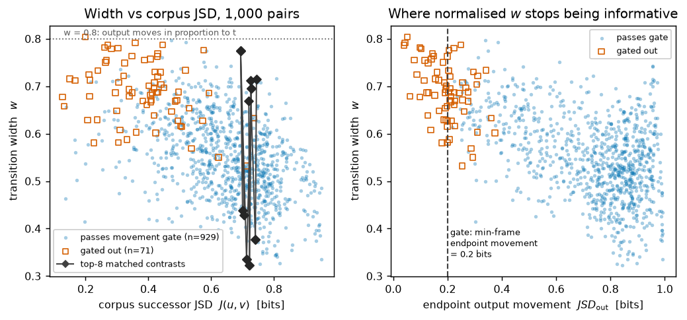

**Figure 1.** Left: transition width `w` (y) against corpus successor JSD `J` in bits (x) for all 1,000
pairs. Circles pass the endpoint-movement gate, open squares fail it. Black diamonds joined by lines
are the eight largest matched contrasts — pairs of pairs at nearly the same `J` and nearly the same
endpoint movement whose widths differ by up to 0.44. The dotted line at $w = 0.8$ is the width of a
model whose output moves in proportion to `t`. Right: the same `w` (y) against endpoint output
movement $JSD_{\mathrm{out}}$ in bits (x); the dashed line is the 0.2-bit gate. Pairs below the gate
cluster at high `w` because a normalised score cannot describe a movement that barely happened.

**2. Matched narrow-vs-wide contrasts are abundant, not anecdotal.** Under the criteria above there
are **1,529** matched contrasts among the 929 gated pairs; only 21 of them share a token between the
two pairs, so the effect is not one token dragging its partners around. The largest is
` her` / ` when` ($w = 0.34$) against ` kind` / ` wrong` ($w = 0.77$) at $J \approx 0.70$ bits and
endpoint movements of 0.86 and 0.90 bits — a 0.44 difference in width at matched endpoints.

The strongest contrasts are listed below; each row is a narrow pair and a wide pair matched on corpus
JSD to within 0.02 bits and on endpoint movement to within 0.05 bits, with the width ordering holding
in all three sentence frames. The narrow side is consistently built from function words (determiners,
possessives, prepositions, `when`), the wide side from evaluative adjectives and adverbs
(`kind`, `wrong`, `never`, `nothing`, `most`, `now`) — the pattern that motivates the per-token
analysis that follows.

| narrow pair | `w` | wide pair | `w` | $\Delta w$ | `J` (bits) | $JSD_{\mathrm{out}}$ narrow / wide |
|---|---|---|---|---|---|---|
| ` her` / ` when` | 0.34 | ` kind` / ` wrong` | 0.77 | 0.44 | 0.70 | 0.86 / 0.90 |
| ` our` / ` very` | 0.32 | ` never` / ` nothing` | 0.69 | 0.37 | 0.73 | 0.84 / 0.82 |
| ` from` / ` one` | 0.43 | ` kind` / ` wrong` | 0.77 | 0.35 | 0.70 | 0.90 / 0.90 |
| ` our` / ` very` | 0.32 | ` most` / ` now` | 0.67 | 0.35 | 0.72 | 0.84 / 0.83 |
| ` one` / ` when` | 0.38 | ` hard` / ` kind` | 0.72 | 0.34 | 0.74 | 0.91 / 0.96 |
| ` completely` / ` interesting` | 0.44 | ` kind` / ` wrong` | 0.77 | 0.34 | 0.70 | 0.90 / 0.90 |
| ` because` / ` being` | 0.45 | ` kind` / ` wrong` | 0.77 | 0.33 | 0.69 | 0.90 / 0.90 |

**3. The contrast is a difference in curve shape, not in how far the output travels.** Figure 2 shows
the full `d(t)` curves behind three of these contrasts, one curve per sentence frame, and answers
whether the width difference is a summary-statistic artifact.

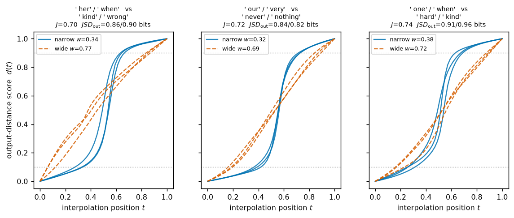

**Figure 2.** Output-distance score `d(t)` (y) against interpolation position `t` (x) for three matched
contrasts, all three sentence frames drawn per pair. Solid = the narrow pair, dashed = the wide pair;
the pairs in each panel are matched on corpus JSD `J` and on endpoint output movement
$JSD_{\mathrm{out}}$ (values in each panel title). Dotted horizontal lines mark $d = 0.1$ and $d = 0.9$,
whose separation along `t` defines `w`. The narrow pairs are flat near both endpoints and swing in the
middle; the wide pairs rise almost in proportion to `t`. The three frames of one pair lie nearly on top
of each other, which is the reproducibility the ceiling quantifies.

**4. The leftover variation is mostly a per-token additive effect.** Figure 3 answers the direction's
core question by asking which model of `w` predicts held-out pairs best.

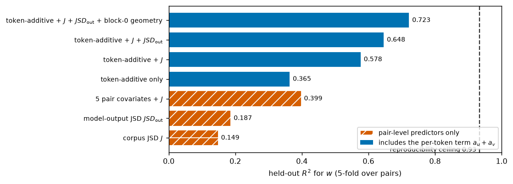

**Figure 3.** Held-out $R^2$ for `w` under 5-fold cross-validation over the 929 gated pairs (x), for
seven models (y). Hatched bars use pair-level predictors only; solid bars include the per-token term
$a_u + a_v$. The dashed vertical line is the reproducibility ceiling of 0.934 estimated from
across-frame agreement — no model can exceed it. Corpus JSD reaches 0.149; adding one number per token
takes it to 0.578, and the per-token term on its own (0.365) outperforms every pair-level predictor
tested.

Reading the bars: corpus JSD 0.149, a quadratic in corpus JSD 0.165 (so the shortfall is not simply
curvature), model-output JSD 0.187, five pair covariates plus corpus JSD 0.399, token-additive alone
0.365, token-additive + corpus JSD **0.578**, plus model-output JSD 0.648, plus block-0 geometry 0.723.
Against a ceiling of 0.934, the token-additive term plus corpus JSD captures 62% of the explainable
variance where corpus JSD alone captures 16%.

The gain is a shift of the whole distribution, not a few lucky pairs, which Figure 4 makes visible.

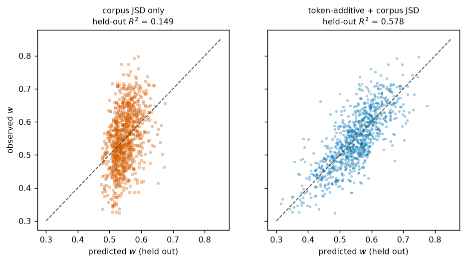

**Figure 4.** Observed `w` (y) against held-out predicted `w` (x) for every gated pair, under corpus
JSD alone (left, squares) and corpus JSD plus the per-token term (right, circles). Dashed line is
$y = x$. Corpus JSD compresses every prediction into 0.47–0.67 and cannot reach the narrow tail at all;
adding the per-token term spreads predictions across the observed range and removes most of the
vertical scatter.

**5. The per-token contribution is real but is not a simple corpus statistic.** Figure 5 shows the
fitted token effects and tests the obvious explanation, that frequent tokens behave differently.

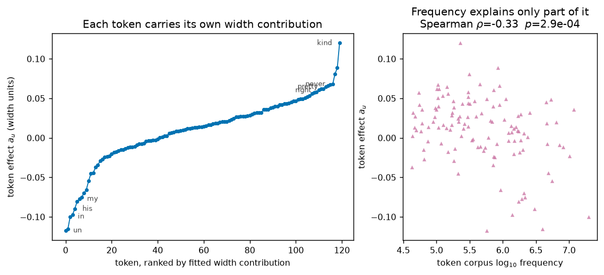

**Figure 5.** Left: the fitted token effect $a_u$ in width units (y) for the 120 endpoint tokens
appearing in at least four gated pairs, ranked (x); the extremes are labelled. The range is 0.24 width
units, comparable to the full observed spread of `w`. Right: $a_u$ (y) against the token's corpus
log-frequency (x), one marker per token. The relation is real but loose (Spearman
$\rho = -0.33$, $p = 2.9\times10^{-4}$), so frequency is not the underlying variable.

Narrow-pulling tokens are ` un`, ` in`, ` his`, ` my`, ` when`, ` our`; wide-pushing tokens are
` kind`, ` real`, ` now`, ` never`, ` perfect`. All three corpus-side candidates explain only a slice:
corpus log-frequency $\rho = -0.33$ ($p = 2.9\times10^{-4}$), corpus continuation entropy
$\rho = -0.24$ ($p = 0.008$), and the model's surprisal at seeing the token in the frame
$\rho = +0.26$ ($p = 0.004$). Together with the five-covariate model in Figure 3 reaching only 0.399,
these say the per-token effect has to be measured from the model rather than looked up in a count
table.

**6. The per-token effect is real, measurable, and transfers to partners outside the bank.** Figure 6
tests whether the additive description survives contact with the model: it compares each token's width
measured against six anchor tokens used in no pair with the effect fitted inside the bank, and asks
what the two probes buy at the pair level.

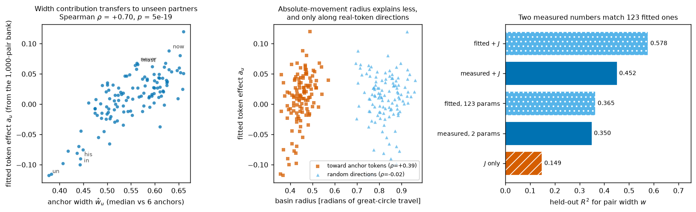

**Figure 6.** Left: fitted token effect $a_u$ (y, width units, from the 1,000-pair bank) against anchor
width $\hat w_u$ (x, median width against six tokens that appear in no pair), one marker per token,
extremes labelled. Middle: the same $a_u$ (y) against basin radius (x, radians of great-circle travel
before the output moves $\tau$ bits) — squares are directions toward anchor tokens ($\tau = 0.2$),
triangles are random directions ($\tau = 0.1$). Right: held-out $R^2$ for pair width `w` (x) for five
models (y); hatched = corpus JSD, solid = the two *measured* token widths, dotted = the 123 *fitted*
token effects.

Anchor width predicts the fitted effect at $\rho = +0.70$ ($p = 5\times10^{-19}$), and still
$\rho = +0.67$ with output entropy partialled out. At the pair level, replacing 123 fitted numbers by
two measured ones costs almost nothing: held-out $R^2 = 0.350$ against 0.365 fitted, rising to 0.452
with corpus JSD added (against 0.578 fitted). Anchor width and the fitted effect are the same metric
computed over disjoint partner sets, so this is a transfer test, not a re-description: the six anchors
are shared by all 123 tokens, so the spread in $\hat w_u$ can only come from the token.

**7. The screen predicts pairs of tokens it has never seen.** Figure 7 asks the question an auditor
would ask: measure 40 unfamiliar tokens once, and can you say which of their pairings will have sharp
transitions before running any of them?

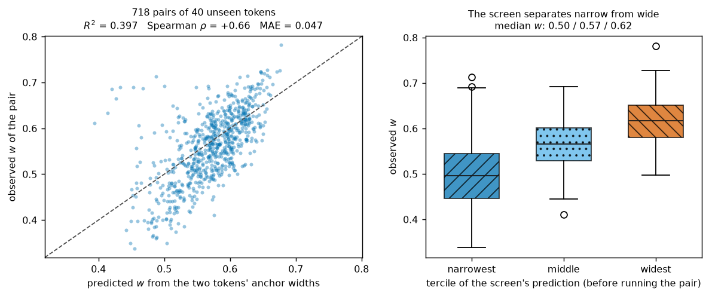

**Figure 7.** Left: observed width `w` (y) of 718 pairs built from 40 tokens absent from the 1,000-pair
bank, against the width predicted from the two tokens' anchor widths alone (x); the slope and intercept
come from the bank, so nothing is fitted here. Dashed line is $y = x$. Right: observed `w` (y) grouped
by tercile of the screen's prediction (x), boxes showing median, quartiles and 1.5 IQR whiskers, with
distinct hatching per tercile.

The forward prediction reaches $R^2 = 0.397$, $\rho = +0.66$ ($p = 1.5\times10^{-89}$), and a mean
absolute error of 0.047 width units on an observed range of 0.34–0.78. On the same pairs the model's
own endpoint output difference gives $\rho = -0.51$, so the per-token screen is the stronger predictor
while also being the cheaper one: 40 token measurements cover all 780 pairings, and the cost of the
endpoint statistic grows with the number of pairs. The 40 new tokens are a broader mix than the bank's
(` re`, ` do`, ` time`, ` life`, ` maybe`, ` delicious`, ` extraordinary`, ` awkward` …), and the
screen's slope transfers to them without adjustment.

**8. The trait is real, but the measuring stick is not neutral: $\hat w_u$ depends on the anchor set.**
Figure 8 asks whether the anchor tokens can be swapped freely.

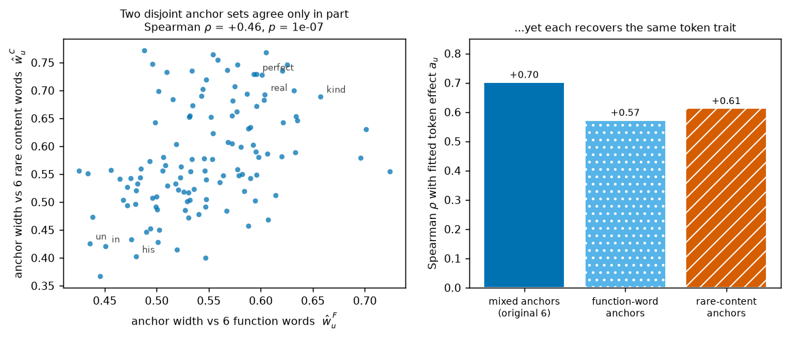

**Figure 8.** Left: anchor width measured against six rare content words (y) against anchor width
measured against six function words (x), one marker per endpoint token, extremes of the fitted effect
labelled. Right: Spearman $\rho$ between each anchor set's widths and the fitted token effect $a_u$
(y), for the original mixed anchors, the function-word anchors and the rare-content anchors (x).

The two disjoint sets rank the 123 tokens at $\rho = +0.46$ ($p = 1.0\times10^{-7}$) — agreement well
above chance, well below identity. Yet each set independently recovers the fitted effect: $\rho = +0.57$
for function-word anchors and $+0.61$ for rare-content anchors, against $+0.70$ for the original mixed
set. As pair-level predictors they separate more sharply: held-out $R^2 = 0.146$ (function),
0.265 (rare content), 0.350 (mixed), and 0.318 when the function and rare-content widths are used
together. So there is a common per-token component that every anchor set finds, and on top of it a
component specific to which anchors were used. The practical consequence is that **the anchor set is
part of the method and must be reported with it**, and that a mixed set of common words is the better
measuring stick — which is also the set the forward screen used.

**9. The token ranking is set early; the size of the effect needs the depth below it.** Figure 9 moves
the interpolation site down the network and asks what survives.

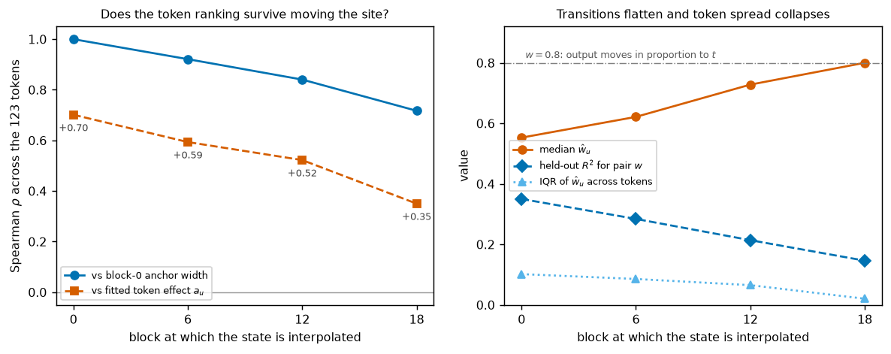

**Figure 9.** Left: Spearman $\rho$ across the 123 tokens (y) against the block at which the state is
interpolated (x) — solid, circles: agreement with the block-0 anchor widths; dashed, squares: agreement
with the fitted token effect $a_u$. Right, same x-axis: median anchor width (solid, circles), held-out
$R^2$ for the block-0 pair widths from that site's measurement (dashed, diamonds), and the interquartile
range of $\hat w_u$ across tokens (dotted, triangles). The dash-dotted line marks $w = 0.8$, the width
of a perfectly proportional response.

Which token is relatively narrow barely changes with depth: $\rho$ with block 0 is $+0.92$ at block 6,
$+0.84$ at block 12 and $+0.72$ at block 18. What collapses is the *effect itself*. The median anchor
width climbs 0.553 → 0.621 → 0.728 → 0.800, arriving exactly at the proportional-response value, and the
spread across tokens shrinks by a factor of five (interquartile range 0.102 → 0.020). Interpolate five
blocks from the output and there is almost no transition left to measure, in any token. Sharp,
token-specific transitions are therefore produced by the stack *below* the interpolation site, while the
ordering of tokens is fixed early — consistent with the plateau literature's attribution of sharpening
to downstream MLPs. The falling $\rho$ with $a_u$ (0.70 → 0.35) and the falling held-out $R^2$
(0.350 → 0.146) partly reflect that compression: with an interquartile range of 0.02 there is little
signal left to correlate.

**10. Most of the per-token trait is already in the static embedding, so the screen can be a lookup.**
Figure 10 asks whether the number the screen needs can be read off the embedding matrix instead of
measured, and what that costs.

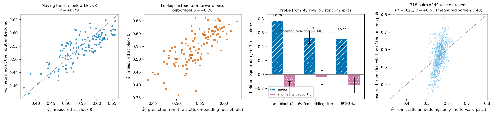

**Figure 10.** Far left: anchor width $\hat w_u$ measured with the interpolation site at the input
embedding (y) against the same quantity measured after block 0 (x), one marker per endpoint token,
dashed line $y = x$. Centre left: block-0 $\hat w_u$ (y) against the value predicted from the token's
static embedding row alone (x), out-of-fold so no token predicts itself. Centre right: mean held-out
Spearman $\rho$ on the 43 test tokens (y) over 50 random 80/43 splits, for three targets (x); hatched
bars are the probe, dotted bars the shuffled-target control, and the dotted horizontal line is the
embedding-norm baseline for the block-0 target. Error bars are $\pm 1$ standard deviation across
splits. Far right: observed width `w` (y) of the same 718 unseen pairs as Figure 7 against the width
predicted from static embeddings alone (x) — no forward pass anywhere in the prediction — with the
measured screen's $R^2$ quoted for comparison; dashed line $y = x$.

Three things follow. First, the trait exists before the network runs: anchor widths measured at the
input embedding agree with the block-0 values at $\rho = +0.79$ ($p = 2.0\times10^{-27}$) and recover
the fitted token effect at $\rho = +0.60$. Second, a ridge probe on the 2048-dimensional static
embedding predicts a held-out token's block-0 anchor width at $\rho = +0.764 \pm 0.045$ and
$R^2 = 0.514 \pm 0.073$, positive in 50 of 50 splits, against $\rho = -0.20$ for the same procedure with
shuffled targets and $\rho = +0.597 \pm 0.071$ ($R^2 = 0.190$) for embedding norm alone. Norm — which
tracks token frequency — carries a good part of it, and the rest of the embedding carries more. The
probe reaches $\rho = +0.505$ against the *fitted* effect $a_u$, about what the measured anchor width
achieves through a different route.

Third, the lookup survives being used forward. Fitting the probe on the 123 bank tokens and applying it
to the 40 tokens the analysis never saw reproduces their measured anchor widths at $\rho = +0.66$
($p = 3.4\times10^{-6}$), and predicting all 718 of their gated pairs from static embeddings alone gives
$R^2 = 0.213$, $\rho = +0.526$, mean absolute error 0.055, with tercile medians 0.51 / 0.57 / 0.61.
That is a real loss against the measured screen (0.397, $\rho = +0.66$, MAE 0.047) and it is the
expected one: a ridge probe shrinks its predictions, so the looked-up widths span a narrower range than
the measured ones (visible as the compressed x-axis in Figure 10, far right). What it buys is that the
prediction costs **no forward passes at all** — the screen becomes a table over the vocabulary — while
still ranking unseen pairs about as well as the model's own endpoint output difference ($\rho = -0.51$),
which requires running both endpoints of every pair.

**11. The lookup keeps working on token types the analysis never touched.** Every token used above is
a common single-token alphabetic word from `dir18`'s eligibility pool, so the probe could have learned
a property of that word class. Figure 11 tests it outside the pool.

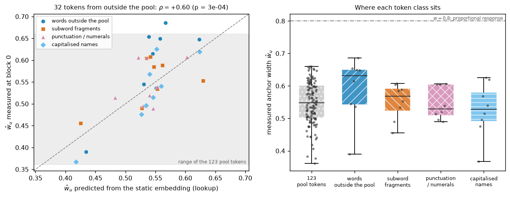

**Figure 11.** Left: measured anchor width $\hat w_u$ at block 0 (y) against the width predicted from
the static embedding (x) for 32 tokens drawn from four classes outside the pool — circles: ordinary
words the pool excludes, squares: subword fragments, triangles: punctuation and numerals, diamonds:
capitalised names. Eight tokens per class, spaced evenly over that class's predicted range. Dashed
line $y = x$; the shaded band is the range of measured widths over the 123 pool tokens. Right: measured
$\hat w_u$ (y) by token class (x), with the 123 pool tokens as the reference group; boxes are median,
quartiles and 1.5 IQR whiskers, hatched distinctly, individual tokens overplotted. The dash-dotted
line marks $w = 0.8$, a perfectly proportional response.

The ranking transfers: over the 32 tokens the predicted and measured widths correlate at
$\rho = +0.60$ ($p = 3.0\times10^{-4}$), with mean absolute error 0.046 and all 576 curves valid. Within
each class of eight the estimates are noisy, as expected at that sample size ($\rho$ from $+0.24$ for
punctuation to $+0.83$ for capitalised names), but no class inverts the relationship. Two honest
caveats show in the figure. The lookup under-disperses — measured widths spread over a standard
deviation of 0.073 against the prediction's 0.047, the same ridge shrinkage seen in pattern 10 — and
the classes sit at different levels: rarer ordinary words are wider (median 0.632) than fragments
(0.569), punctuation and numerals (0.529) or capitalised names (0.527), against 0.549 for the pool.
The practically useful part is that measured widths outside the pool span 0.367–0.686, essentially the
pool's own range, so the extremes an auditor would want to find are present in this wider vocabulary and
the lookup ranks them.

**12. The token ranking survives a change of context; the level of `w` does not.** The three frames
used everywhere above share one shape — a short declarative prefix with the token in final position —
so $\hat w_u$ could have been a property of that slot. Figure 12 re-measures it in four structurally
different contexts.

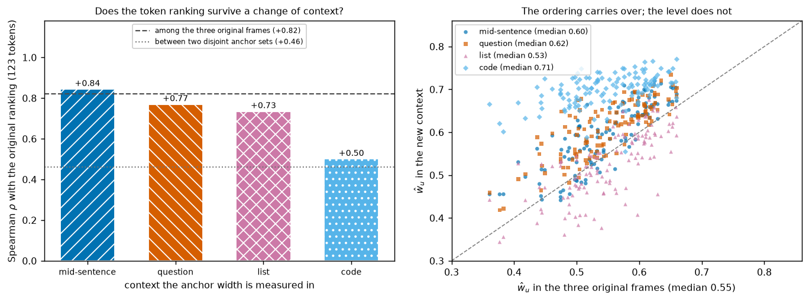

**Figure 12.** Left: Spearman $\rho$ between the token ranking measured in each new context and the
original ranking (y) for the four contexts (x), each bar hatched distinctly. The dashed line is the
mean agreement among the three *original* frames (+0.82) — the ceiling this comparison should be read
against, since it is what two measurements of the same shape achieve. The dotted line is the agreement
between two disjoint anchor sets (+0.46) from pattern 8, for scale. Right: $\hat w_u$ measured in each
new context (y) against $\hat w_u$ in the original three frames (x), one marker per token per context,
markers and colours matching the contexts on the left; dashed line $y = x$.

The ranking transfers. A mid-sentence continuation (`She kept walking because everything felt`) agrees
with the original at $\rho = +0.844$ — indistinguishable from the +0.82 that two original frames achieve
with each other — and an interrogative (`Is it really`) and a colon-list (`The report mentions the
following:`) reach $+0.770$ and $+0.735$. The furthest context, a code prefix
(`def solve(x):\n    return`), still gives $+0.501$, above the agreement between two disjoint anchor
sets. Curve validity stays at 99.6–100%.

What does move is the level. Median $\hat w_u$ runs 0.530 in the list context, 0.549 in the original
frames, 0.599 mid-sentence, 0.623 in the question and 0.705 in code, and the code context also
compresses the spread across tokens (interquartile range 0.049 against 0.107–0.123 elsewhere). Reading
the two panels together: which tokens have narrow transitions is a property the token carries between
contexts, while how narrow transitions are in absolute terms is set by the context — the same split
seen across depth in pattern 9 and across anchor sets in pattern 8. For the screen this means a
vocabulary-wide table ranks tokens usefully in unfamiliar contexts, but a width threshold calibrated in
one context should not be reused in another.

**13. The probe's embedding direction is a correlate, not a lever — editing the embedding along it
does not move width.** Everything above is correlational. Figure 13 reports the first intervention.

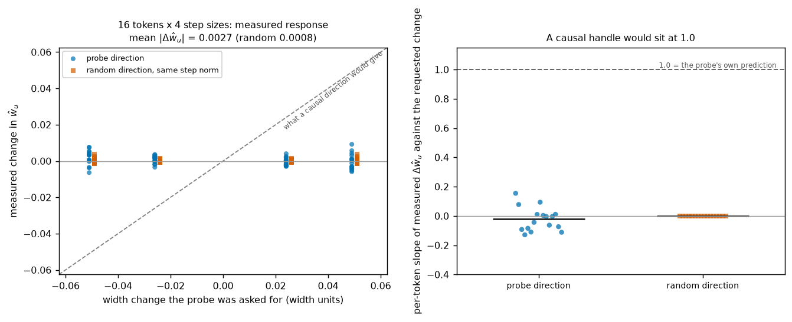

**Figure 13.** Left: measured change in a token's anchor width $\Delta\hat w_u$ (y) against the change
the probe was asked for (x), for 16 tokens at four step sizes; circles are steps along the probe
direction, squares are random directions of the same step norm, jittered slightly for visibility. The
dashed line is what a causal direction would give ($y = x$); the horizontal line is no change. Right:
the per-token slope of measured against requested change (y) for the two directions (x), one marker per
token, thick bar = mean; the dashed line at 1.0 is what the probe predicts.

Adding a step to a token's embedding row along the probe's direction, sized so the probe's own
prediction moves by 0.05 width units, moves the measured width by 0.0027 on average — 5% of what was
asked — with no consistent sign (slope $-0.023$, sign agreement 0.39, per-token slopes scattered from
$-0.13$ to $+0.15$). A random direction of the same norm moves it by 0.0008. The steps are not
negligible in size: their norm is 0.053 against a median embedding-row norm of 0.984, about 5%. They
are, however, nearly invisible to the model — the token's next-token distribution shifts by 0.0001 bits
— which is the honest caveat on this null: at a perturbation this functionally small the model's
behaviour hardly changes at all, so what the experiment establishes is that the probe's direction is
not an *efficient* lever, not that no lever exists. What it rules out is the strong reading of pattern
10: the probe finds a direction along which embeddings of narrow and wide tokens differ, and that
direction does not itself set width.

**14. Once the edit is large enough for the model to notice, width moves a great deal — but every
direction moves it the same way, toward a common value.** Pattern 13 leaves one loophole: the edits
were behaviourally invisible. Calibrating the step on the model instead of on the probe closes it, and
turns the null into a positive statement about where the trait lives. Figure 14 reports it.

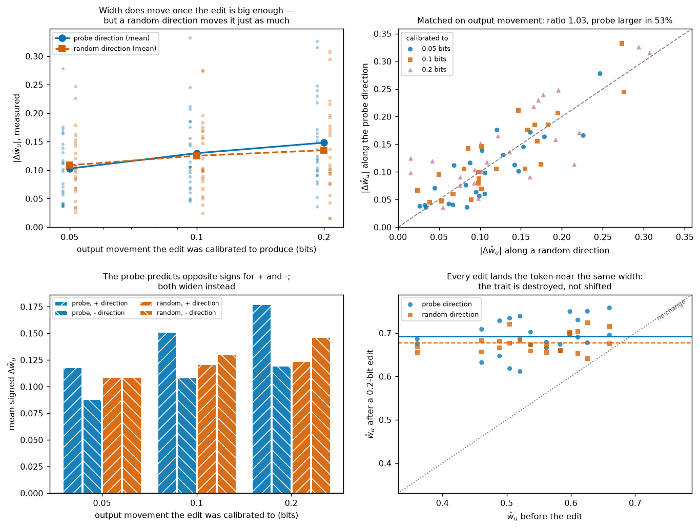

**Figure 14.** Twelve tokens, each edited along the probe direction and along a random direction, in
both signs, at three calibrated output budgets. Top left: mean $|\Delta\hat w_u|$ (y) against the
output movement the edit was calibrated to produce (x, bits, log scale); solid circles = probe
direction, dashed squares = random direction, faint markers = individual edits. Top right:
$|\Delta\hat w_u|$ along the probe direction (y) against $|\Delta\hat w_u|$ along the random direction
for the same token and budget (x); marker shape gives the budget, dashed line $y = x$. Bottom left:
mean *signed* $\Delta\hat w_u$ (y) for each direction and sign (x), hatched distinctly — the probe
predicts that $+$ and $-$ have opposite signs. Bottom right: $\hat w_u$ after a 0.2-bit edit (y)
against $\hat w_u$ before it (x); dotted line = no change, horizontal lines = the mean landing point
for each direction.

The step sizes now reach the model: a 0.05-bit budget needs a step of norm 0.87 along the probe
direction, about 90% of a median embedding row, and the calibration lands on target (median achieved /
requested output movement 1.00, interquartile range 0.91–1.05). At that size width moves by 0.10 on
average and by 0.15 at the 0.2-bit budget — fifty times pattern 13's 0.003, so the earlier null was
indeed a step-size null.

The specificity test fails all the same, and it fails in every way it can. A random direction matched
to the same output movement moves width by 0.123 against the probe direction's 0.127 (Wilcoxon
$p = 0.47$ over 72 matched edits; the probe is larger in 53% of them). The probe says $+\hat d$ widens
and $-\hat d$ narrows; instead **all 144 edits widen**, mean $+0.118$ for $+\hat d$ and $+0.088$ for
$-\hat d$ at the smallest budget. Regressing measured against predicted width change gives a slope of
$-0.002$ ($\rho = +0.06$, $p = 0.61$).

What the edits do instead is visible in the bottom-right panel, and it is the informative part. The
landing point is nearly the same wherever the token started: after a 0.2-bit edit the twelve tokens sit
at mean $\hat w_u$ 0.691 (probe) and 0.678 (random) with a standard deviation across tokens of 0.022
and 0.015, against 0.083 before the edit — a fourfold collapse of the spread that carries the whole
result of this direction. Tokens that started narrow move furthest ($\rho$(base $\hat w_u$,
$\Delta\hat w_u$) $= -0.85$ to $-0.94$). So a behaviourally sized displacement of the embedding row, in
any direction, does not slide a token along a width axis: it **compresses** the token's width trait
toward a generic value near 0.68 — close to the 0.8 of a perfectly proportional response and well above
the pool median of 0.549. The compression is strong but not total, and the residue decays with edit
size: the ranking of the edited tokens still agrees with the original at $\rho = +0.73$ and $+0.85$
after a 0.05-bit edit and at $+0.57$ and $+0.36$ after a 0.2-bit one (12 tokens, so these are
indicative). Narrow transitions are a fragile property of the particular embedding training produced,
not a robust consequence of the region it sits in.

One asymmetry is worth recording because it says the probe direction is not arbitrary, only irrelevant
to width. Reaching a given output movement takes a *smaller* step along the probe direction than along
a random one — norm ratio 1.54, 1.66 and 1.76 at the three budgets — so the probe found a direction the
model is unusually sensitive to. It is a behaviourally special direction that does not carry width.

**15. What destroys the trait is behaviour, not displacement: at the same step norm, a quiet direction
keeps the token ordering and a loud one erases it.** Pattern 14 leaves the collapse's cause ambiguous,
because its steps grew in norm and in output movement together. The ladder separates them by putting
directions of very different loudness at identical displacement.

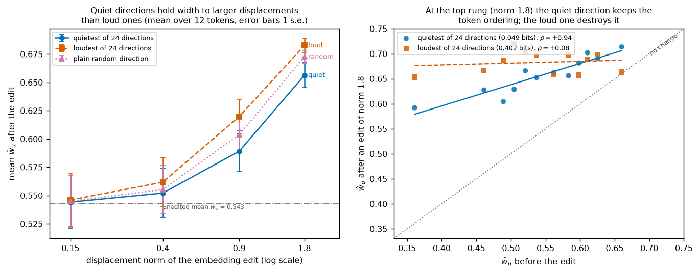

**Figure 15.** Twelve tokens edited along the quietest and loudest of 24 random directions, rebuilt at
each rung from their measured output movement there, plus one plain random direction. Left: mean
$\hat w_u$ after the edit (y) against the displacement norm of the edit (x, log scale, four rungs
0.15–1.8 against a median embedding-row norm of 0.98); solid/circles = quiet, dashed/squares = loud,
dotted/triangles = random, error bars 1 s.e. over the 12 tokens; the dash-dotted line is the unedited
mean $\hat w_u = 0.543$. Right: $\hat w_u$ after an edit of norm 1.8 (y) against $\hat w_u$ before it
(x) for the quiet (circles, solid fit) and loud (squares, dashed fit) directions, with the median
output movement each produced in the legend; dotted line = no change.

| displacement norm | quiet: bits / mean $\hat w_u$ / $\rho$(before, after) | loud: bits / mean $\hat w_u$ / $\rho$(before, after) | paired $p$ |
|---|---|---|---|
| *before any edit* | *— / 0.543 / —* | *— / 0.543 / —* | \- |
| 0.15 | 0.0001 / 0.544 / $+1.00$ | 0.0003 / 0.546 / $+1.00$ | 0.09 |
| 0.40 | 0.0006 / 0.552 / $+0.99$ | 0.0027 / 0.562 / $+0.99$ | 0.02 |
| 0.90 | 0.0053 / 0.589 / $+0.91$ | 0.0221 / 0.620 / $+0.87$ | 0.0005 |
| **1.80** | **0.0489 / 0.656 / $+0.94$** | **0.4023 / 0.683 / $+0.08$** | 0.09 |

The construction now works: selecting by measured response at each rung separates the two directions by
a factor of 8 in output movement at norm 1.8 (0.049 against 0.402 bits), where the previous
linear-extrapolation version separated them not at all. That is what makes the comparison in the last
row possible, and it is the row that carries the result. **At one and the same displacement — 1.8,
nearly twice a median embedding row — the quiet edit leaves the token ordering essentially untouched
($\rho = +0.94$, $p = 4\times10^{-6}$) and the loud edit leaves nothing of it ($\rho = +0.08$,
$p = 0.80$).** Geometry cannot distinguish those two edits; only what they do to the model can. The
paired comparison points the same way at every rung — the quiet direction widens less than the loud one
in 12 of 12 tokens at norm 0.9 (Wilcoxon $p = 5\times10^{-4}$) and at norm 0.4 ($p = 0.02$) — and the
two rungs where the paired test only reaches $p = 0.09$ are the ones where nothing happens at all
(norm 0.15, both directions under 0.0003 bits) and where the loud direction has saturated (norm 1.8).

The *level* of `w` is a different matter, and it does follow the displacement. Every direction, quiet
included, raises the mean: 0.543 → 0.656 for the quietest direction at norm 1.8, with the spread across
tokens falling from 0.083 to 0.038 (loud: 0.022). So a large enough edit compresses everything toward
a generic width whatever it does to the model, but only a behaviourally loud edit scrambles which
token is which. Read together with pattern 14, where a random direction matched on *output movement*
moved width as much as the probe direction did, the picture is consistent: width responds to how much
the edit disturbs the token's behaviour and not to which direction delivers the disturbance. For the
screen this is the reassuring answer — the vocabulary-wide lookup (pattern 10) is reading a property
tied to what the token makes the model do, not an accident of where its row happens to sit.

**16. The damage an edit does is tail-weighted, and the ordering dies wherever in the distribution it
lands.** Pattern 15 says the trait dies when the model's output moves, and the natural follow-up is
whether "the output" here means the token's few high-mass continuations — the object corpus successor
JSD is built from — or the rest of the distribution. Figure 16 answers both halves of that: where a
large embedding edit actually puts its damage, and whether steering the damage toward the top
successors changes what the edit does to width.

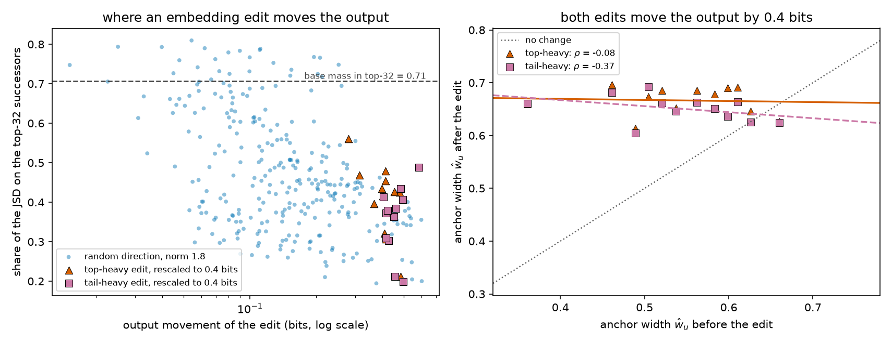

**Figure 16.** Twelve tokens, the same ones as Figures 14–15. Left: the top-mass share $S$ of the
output change (y, fraction of the JSD landing on the token's 32 most likely successors) against the
total output movement of the edit (x, bits, log scale); small circles are the 24 random directions per
token applied at displacement norm 1.8, triangles the most top-heavy and squares the most tail-heavy
direction after rescaling to 0.4 bits; the dashed line is the mean probability mass those 32 successors
hold before any edit (0.71). Right: anchor width $\hat w_u$ after the edit (y) against $\hat w_u$
before it (x) for the top-heavy (triangles, solid fit) and tail-heavy (squares, dashed fit) edits, with
each one's rank agreement with the pre-edit ordering in the legend; dotted line = no change.

| edit at displacement norm 1.8 (12 tokens) | output movement (bits) | top-mass share $S$ | mean $\hat w_u$ | sd across tokens | $\rho$(before, after) |
|---|---|---|---|---|---|
| *before any edit* | \- | \- | *0.543* | *0.083* | \- |
| loudest of 24 random directions | 0.402 | **0.389** | 0.683 | 0.022 | $+0.08$ |
| most top-heavy, rescaled | 0.410 | 0.408 | 0.666 | 0.027 | $-0.08$ ($p = 0.81$) |
| most tail-heavy, rescaled | 0.453 | 0.355 | 0.651 | 0.025 | $-0.37$ ($p = 0.24$) |

The descriptive half is clear and points away from high-mass continuations. The 32 most likely
successors carry 0.71 of the token's probability mass, but only **0.389** of the divergence a loud edit
produces lands on them: relative to mass, the disturbance is concentrated in the tail. That tilt grows
with the size of the edit — across the 24 random directions per token, louder directions are *more*
tail-weighted ($\rho(B_j, S_j) = -0.36$, median over tokens). So the behaviour whose disruption
coincides with the trait's collapse is not mainly the behaviour corpus successor JSD scores.

The causal half is a null with a real limit. Selecting the extreme directions from a random draw buys
only a narrow contrast — $S$ spans 0.358 to 0.564 across 24 directions for the median token, never
reaching the mass-proportional 0.71 — and at matched output movement the two extremes do the same
thing: both widen every token toward a common value (0.666 and 0.651 against a pre-edit 0.543) and both
leave nothing of the pre-edit ordering ($\rho = -0.08$ and $-0.37$, neither distinguishable from zero
at $n = 12$). One difference survives the pairing: the top-heavy edit widens slightly more than the
tail-heavy one (mean $\Delta\hat w_u$ $+0.124$ vs $+0.108$, Wilcoxon $p = 0.009$) even though it moved
the output *less* (0.410 vs 0.453 bits), a weak hint that top-mass disturbance is the more efficient
way to inflate the level. It does not extend to the ordering, which is the quantity a screen consumes.

Read with pattern 15, the picture is that any disturbance the model genuinely feels destroys the token
ordering, and it does not matter much which successors it rearranges. For the direction's central
question that is a mildly favourable answer: the per-token trait does not reduce to the token's
high-mass continuations, which is consistent with the embedding lookup carrying information that corpus
successor JSD does not (patterns 3 and 10). The honest caveat is that random directions are a blunt
instrument for this question — a direction built from the unembedding rows of the token's top
successors would give a much larger contrast in $S$, and that is the test that could turn this
suggestion into a result.

**17. The top-mass split is steerable only while the edit is small; at a behaviourally meaningful step
the damage is tail-weighted whatever direction delivers it.** Pattern 16 could not decide whether
steering the damage toward a token's high-mass successors matters, because random draws span too little
of $S$. Constructing the directions from the generalised eigenproblem removes that excuse, and Figure 17
shows what happens when it does.

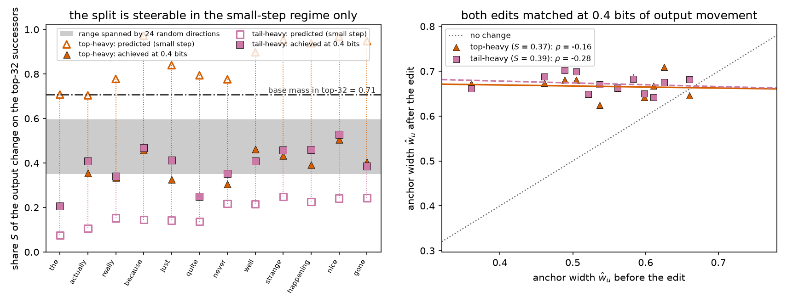

**Figure 17.** Twelve tokens, the same ones as Figures 14–16. Left: top-mass share $S$ (y, fraction of
the output change landing on the token's 32 most likely successors) for each token (x, token strings);
open markers = the $S$ the construction predicts for a small step (the generalised eigenvalues),
filled markers = the $S$ the same direction actually delivers once rescaled to 0.4 bits, joined by a
dotted line; triangles = the $S$-maximising ("top-heavy") combination, squares = the $S$-minimising
("tail-heavy") one; the gray band is the range 24 random directions span (pattern 16) and the
dash-dotted line is the probability mass those 32 successors hold before any edit (0.71). Right:
anchor width $\hat w_u$ after the edit (y) against $\hat w_u$ before it (x), triangles/solid fit =
top-heavy, squares/dashed fit = tail-heavy; dotted line = no change.

| edit rescaled to 0.4 bits (12 tokens) | predicted $S$ (small step) | achieved $S$ | output movement (bits) | mean $\hat w_u$ | sd across tokens | $\rho$(before, after) |
|---|---|---|---|---|---|---|
| *before any edit* | \- | \- | \- | *0.543* | *0.083* | \- |
| constructed top-heavy | **0.856** | 0.369 | 0.422 | 0.666 | 0.023 | $-0.16$ ($p = 0.62$) |
| constructed tail-heavy | **0.179** | 0.390 | 0.419 | 0.672 | 0.020 | $-0.28$ ($p = 0.38$) |

The construction works where it is supposed to. In the small-step regime the two combinations are
predicted to put $0.856$ and $0.179$ of the divergence on the top-32 successors — a separation of
0.68, three times the 0.21 a random draw of 24 supplies, and the top-heavy end reaches past the
mass-proportional 0.71. The instrument the previous experiment lacked exists.

It buys nothing. Rescaled to the 0.4 bits at which width actually responds, the two edits land at
$S = 0.369$ and $S = 0.390$ — indistinguishable, both far below the base mass 0.71, and both inside
the band a random direction already occupies. The paired difference is not significant and runs
*backwards* (the top-heavy construction ends marginally more tail-weighted, $p = 0.09$). Everything
downstream follows: both edits move the output by the same amount (0.422 vs 0.419 bits), both widen
every token to a common $\hat w_u \approx 0.67$, and neither leaves any of the pre-edit ordering
($\rho = -0.16$ and $-0.28$, $n = 12$).

Two things are settled by that. First, about the model: **the tail-weighting of a large embedding edit
is not a property of the direction, it is a property of the step size.** A direction chosen to hit the
top successors and nothing else does so only while the perturbation is small; grown until the model's
output moves 0.4 bits, it churns the tail like any other. The linear picture of an embedding edit
expires well before the displacement at which width responds — the same expiry that made the earlier
fixed-displacement test misleading (pattern 15). Second, about this direction's question: since $S$
cannot be held apart at a step the model feels, the tail-versus-top-mass hypothesis is not just
unsupported but **untestable by embedding edits**, and the two arms agree on the outcome that matters
— any disturbance large enough to register erases the token ordering regardless of where it lands. The
per-token trait is a property of the token's whole output map rather than of any identifiable slice of
its next-token distribution, which is the reading under which the vocabulary-wide static-embedding
lookup (pattern 10) is the right level of description: there is no smaller behavioural object to point
at.

**18. The basin picture is only weakly supported, and not in the direction the simple version
predicts.** Radius along random directions is unrelated to the token effect ($\rho = -0.02$,
$p = 0.87$): generic insensitivity of the residual stream explains nothing. Radius along anchor
directions does correlate ($\rho = +0.39$, $p = 1.1\times10^{-5}$; $+0.33$ with output entropy
partialled out) but with the *opposite* sign to the naive prediction — tokens that hold their output
distribution longer contribute *wider*, not narrower, transitions. At the pair level the radius sum
plus corpus JSD reaches only 0.299 and adds 0.012 on top of anchor width. Two of the probe's own
by-products behave the same way: output entropy $\rho = -0.30$, endpoint logit norm $\rho = -0.23$. So
"how far the state can move before the output moves in absolute terms" is not the quantity behind
width; what transfers is the *shape* measure itself.

**19. Pair-specific structure survives the additive model.** Residuals of the additive-plus-`J` model,
fitted separately in each sentence frame, correlate across frames at $\bar r = 0.67$ (variance share
0.86 of what is left) — a large amount of reproducible pair-specific structure. Adding model-output
JSD and block-0 geometry to the fit lowers that residual agreement to $\bar r = 0.54$, so the endpoint
arrangement at the interpolation site accounts for part of it and something still unmeasured accounts
for the rest.

**20. Width is not a fixed absolute transition divided by path length.** Converting `w` into
residual-stream distance units makes the distribution *more* dispersed, not less: coefficient of
variation 0.158 for `w` against 0.216 for $w_{\mathrm{abs}} = w \cdot d_0$ (median $d_0 = 24.0$). The
sign is wrong too — longer endpoint separations go with slightly *wider* transitions
($\rho(d_0, w) = +0.17$, $p = 4.2\times10^{-7}$), where the artifact story predicts narrower. Endpoint
angle carries a little independent signal ($\rho(\cos_0, w) = -0.25$, $p = 2.4\times10^{-14}$): more
nearly parallel endpoint states go with narrower transitions.

**21. Of 102 early components, only the block-0 MLP carries the trait — and it is also the only one the
model feels.** Mean-ablating each attention head and MLP in blocks 0–5 one at a time leaves the token
ordering intact in 101 cases (median $\rho = +0.99$ across components; every one of the 96 heads
$\ge +0.97$, every MLP above block 0 $\ge +0.90$). Removing the block-0 MLP instead collapses the
across-token spread from sd $0.084$ to $0.018$, lifts every token to $\hat w_u \approx 0.82$ and leaves
$\rho = -0.10$. Figure 18 shows both panels of that contrast.

| mean-ablated component (12 tokens, 6 anchors, 1 frame) | mean $\hat w_u$ | sd across tokens | $\rho$(before, after) | output movement (bits) |
|---|---|---|---|---|
| *nothing ablated* | *0.565* | *0.084* | \- | \- |
| **block-0 MLP** | **0.822** | **0.018** | $-0.10$ | **0.451** |
| MLPs of blocks 1–5, worst of the five | 0.585 | 0.091 | $+0.90$ | 0.007 |
| attention heads, worst of the 96 | 0.563 | 0.076 | $+0.97$ | 0.0004 |
| *median over all 102 components* | \- | *0.084* | *$+0.99$* | \- |

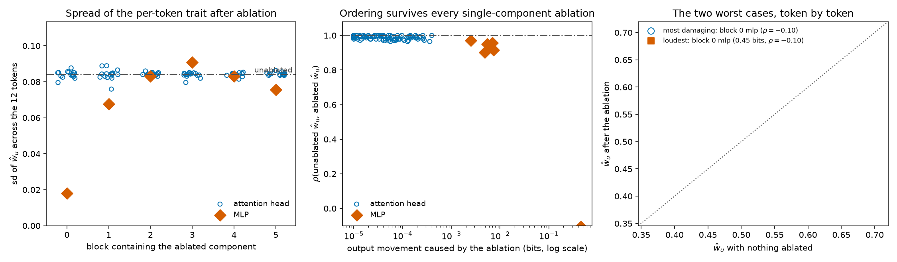

**Figure 18.** Each of the 102 attention heads and MLPs in blocks 0–5 mean-ablated one at a time, for
the same 12 tokens as Figures 14–17. Left: standard deviation of $\hat w_u$ across the 12 tokens (y)
against the block containing the ablated component (x, heads jittered horizontally); open circles =
attention heads, diamonds = MLPs; dash-dotted line = the unablated spread 0.084. Centre: rank agreement
$\rho$(unablated $\hat w_u$, ablated $\hat w_u$) (y) against the output movement the ablation causes
(x, bits, log scale), same markers; dash-dotted line = perfect agreement. Right: $\hat w_u$ after the
ablation (y) against $\hat w_u$ before it (x) for the two extreme components; dotted line = no change.
Only the block-0 MLP leaves the cluster on either panel.

The negative half is the informative half for the mechanism: the trait is not spread thinly across
early attention, because no head carries a detectable share of it, and it is not re-derived layer by
layer, because no MLP above block 0 matters either. The positive half comes with a confound that
ablation alone cannot remove. The block-0 MLP moves the output by 0.451 bits, sixty times more than
any other component here and almost exactly the 0.4-bit rung at which pattern 15's displacement ladder
showed that *any* disturbance flattens the ordering. So either the block-0 MLP computes the per-token
width trait, or it is merely the only single early component large enough to reach the regime where the
trait dies. Pattern 22 separates those two readings.

**Pattern 22 — at output movement matched token by token, the block-0 MLP damages the ordering more
than a random perturbation does, by a factor of about 1.3× in bits.** Softening the ablation into a
dose and giving every dose a random perturbation of the same residual stream, rescaled so that *each
individual token's* output moves the same number of bits, gives the two curves in the left panel of
Figure 19. In the survivable band up to 0.03 bits the MLP arm sits below its matched control at every
rung and for every one of three control seeds — 15 of 15 rung × seed comparisons — falling through
$\rho = 0.6$ at 0.031 bits where the control needs 0.041.

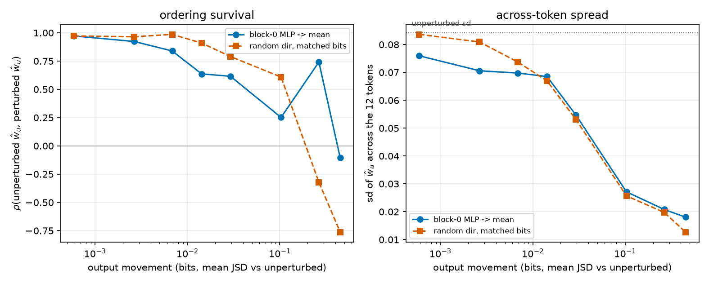

**Figure 19.** Dose–response for the block-0 MLP (solid, circles: final-position output blended toward
its mean, $\alpha = 0.1 \dots 1$) against a random direction added to the same residual stream and
rescaled so each token's output moves the same number of bits (dashed, squares; mean of three seeds,
error bars 1 sd across seeds). Panel 1 x: output movement $B$ in bits, log scale — the mean over the
12 tokens of the JSD between perturbed and unperturbed next-token distributions. Panel 1 y: rank
agreement $\rho$ between each token's anchor width $\hat w_u$ before and after the perturbation
(1 = ordering intact, 0 = destroyed); the dotted triangles show the same control matched only on the
12-token *mean* movement. Panel 2, same x: sd of $\hat w_u$ across the 12 tokens, unperturbed value
0.084 marked. Panel 3 x: the dose's output movement; y: each token's control-to-dose ratio of output
movement, one marker per token per dose (log scale, 1.0 = exact match) — open triangles the
mean-matched control, filled squares the per-token-matched one. Panel 4 x: the 12 tokens, ordered by
their unperturbed width; y: $\lvert \Delta \hat w_u \rvert$ at the 0.0068-bit dose.

| output movement $B$ (bits) | $\rho$, block-0 MLP dose | $\rho$, per-token-matched control | sd, MLP | sd, control |
|---|---|---|---|---|
| 0.0006 | +0.97 | $+1.00 \pm 0.00$ | 0.076 | 0.081 |
| 0.0027 | +0.92 | $+0.99 \pm 0.01$ | 0.071 | 0.078 |
| 0.0068 | +0.84 | $+0.98 \pm 0.02$ | 0.070 | 0.074 |
| 0.0143 | +0.64 | $+0.91 \pm 0.04$ | 0.069 | 0.068 |
| 0.0292 | +0.62 | $+0.76 \pm 0.12$ | 0.055 | 0.060 |
| 0.1033 | +0.25 | $+0.15 \pm 0.12$ | 0.027 | 0.055 |
| 0.2651 | +0.74 | $+0.24 \pm 0.10$ | 0.021 | 0.035 |
| 0.4506 | −0.10 | $-0.06 \pm 0.04$ | 0.018 | 0.016 |

Matching the control per token is what makes this table trustworthy, and the third panel of Figure 19
shows why. A control matched only on the 12-token average moves individual tokens by anywhere from
0.08× to 8.5× the amount the dose moved them, because the dose itself is uneven — at full ablation the
per-token movement spans 0.254–0.710 bits. The per-token search removes that slack (ratio 1.000 for
every token at every dose), and it costs the earlier reading a good deal of its margin: the properly
matched control crosses $\rho = 0.6$ at 0.041 bits rather than the 0.086 bits the mean-matched control
suggested, so the MLP's advantage is 1.3×, not the 2.8× the same crossing rule gives for the loose
control. Above 0.03 bits the mean-matched control was simply under-dosed — at the 0.103-bit rung it
received 0.078 bits and kept $\rho = +0.68$, while an honestly matched control at 0.103 bits lands at
$\rho = +0.15$, *below* the MLP arm. The three rungs from 0.10 bits up therefore rank neither arm
above the other; with $n = 12$ a single $\rho$ has a standard error near 0.3, and both arms are at
noise there.

The rank statistic is blunt at this sample size, so the load-bearing evidence is the paired per-token
test in the fourth panel, which compares each token against its own exactly matched control. The dose
moves a token's width about twice as far as its control does, at every dose from 0.0006 to 0.265 bits
(at 0.0068 bits: $0.074$ against $0.036$ width units, Wilcoxon $p = 0.0010$, $n = 12$), converging only
at full ablation ($0.257$ vs $0.250$, $p = 0.27$), where both arms have saturated. Part of that gap is
a larger shift of the overall level, so we repeat the test on each token's deviation from its arm's
mean shift, which is the part that reorders tokens: the dose still moves tokens apart more than its
control at 0.0068 bits ($0.034$ vs $0.014$, $p = 0.034$) and 0.0143 bits ($0.047$ vs $0.022$,
$p = 0.016$), marginally at 0.0292 bits ($p = 0.052$), and not at all once the ordering is dead
($p \ge 0.47$ above 0.1 bits).

So the confound is broken in the block-0 MLP's favour, but by a smaller margin than the mean-matched
comparison implied. An ordinary disturbance of the same per-token loudness leaves more of the ordering
intact than the dose does, in the one band where there is an ordering left to lose; the ablation's
single hit among 102 components is therefore not purely a size effect. This is the direction's
positive mechanistic localisation, and it says the trait is realised in one component's contribution to
the final-position residual stream — which fits the layer sweep, where the ordering is already fixed at
the input and the blocks *below* the interpolation site do the sharpening.

The second panel separates two effects the intervention experiments had been conflating. Through
0.014 bits the across-token spread collapses along the same trajectory in both arms (0.070/0.074 and
0.069/0.068 at matched bits): pushing the residual stream around by any means compresses every token
toward $\hat w_u \approx 0.82$, as pattern 15's displacement ladder found for embedding edits. Beyond
that the dose compresses harder than its control (0.027 vs 0.055 at 0.103 bits), so the level is not
purely a disturbance effect at large doses either — but the ordering is the channel that distinguishes
the arms where the trait still exists, and the level is not.

The caveats are the same scale as the experiment: one frame, 12 tokens, three control seeds, and
above 0.1 bits both arms are at noise, so the top three rungs are reported but carry no ranking
information.

**Pattern 23 — transplanting the block-0 MLP's output vector transplants the width, at 91% of full
transfer.** Every result so far came from breaking something. Overwriting one token's $m_u$ with
another's, and changing nothing else, shows the vector is sufficient as well as necessary: the width
the recipient lands on is set by the donor ($\rho_{\mathrm{donor}} = +0.968$, minimum $+0.95$ over the
12 recipients, Wilcoxon $p = 5\times10^{-4}$; slope $+0.913$ on the donor's own width), and the part of
the state the transplant leaves untouched contributes nothing ($\rho_{\mathrm{recip}} = -0.104$,
$p = 0.64$). The heat map in Figure 20 is banded vertically: read across a row — one recipient, twelve
donors — and the width sweeps the donors' whole range; read down a column and it barely moves.
Between-donor variance is 66× the between-recipient variance. A token transplanted with its own $m_u$
returns its baseline width to four decimal places, which is the check that the pipeline is doing what
it claims.

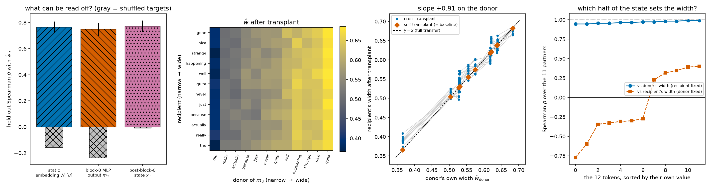

**Figure 20.** Left: held-out Spearman $\rho$ (y) between predicted and measured $\hat w_u$ for ridge
probes from three representations (x), 80 train / 43 test tokens over 50 random splits, error bars
$\pm 1$ sd across splits, bars hatched distinctly; gray cross-hatched bars = the same probe with
shuffled targets. Centre left: measured $\hat w$ after transplant (colour, `cividis`) for every
recipient (y) × donor (x) pair, both axes ordered narrow → wide by the token's own unedited width.
Centre right: the recipient's width after transplant (y) against the donor's own width (x); circles =
cross transplants, diamonds = self transplants, gray lines join one recipient's twelve donors, dashed
line $y = x$ (complete transfer). Right: Spearman $\rho$ over the 11 partners (y) for each of the 12
tokens, sorted by its own value (x) — circles: recipient fixed, against the donor's width; squares:
donor fixed, against the recipient's width.

| transplanting $m_u$ (12 recipients × 11 donors, frame 1) | value |
|---|---|
| **$\rho_{\mathrm{donor}}$ — width follows the donor** | **$+0.968$** (min $+0.95$, $p = 5\times10^{-4}$) |
| **slope on the donor's own width** | **$+0.913$** (1.0 = complete transfer) |
| $\rho_{\mathrm{recip}}$ — width follows the recipient's remaining state | $-0.104$ ($p = 0.64$) |
| between-donor ÷ between-recipient variance | $66\times$ |
| self-transplant vs baseline | $\rho = +1.000$, max difference $0.0000$ |
| $m_u$ replaced by the 12-token mean | $\hat w = 0.663 \pm 0.017$, from $0.565 \pm 0.084$ |
| median output movement of a cross transplant | 0.738 bits |
| $m_u$ share of the post-block-0 state: norm / across-token spread | 0.79 / 0.76 |
| $m_u$ cosine across the three sentence frames | 1.0000 |

Two consequences. First, this closes the mechanism as far as this setup can: the per-token width is
carried by one 2048-dimensional vector, produced by the first MLP from the token embedding **with no
context in it at all** — the cosine of 1.0000 across three different sentence frames is exact, not
approximate, because block 0's MLP reads the residual stream before attention writes to it. That is
why a per-token width exists at all, why it survives changing the frame (pattern 12), and why a lookup
from the static embedding works (pattern 10). Second, the intervention is large and must be read that
way: it moves the output by a median 0.738 bits, and since $m_u$ is 79% of the state's norm and 76% of
its across-token spread, the hybrid state sits about three-quarters of the way from the recipient to
the donor. The transfer slope, 0.913, is higher than that fraction, and the control settles what the
remaining quarter does — nothing. So the supported claim is that the width-relevant content of the
block-0 state lives in the MLP's contribution, not that a small edit suffices.

**Pattern 24 — the block-0 MLP carries the width without making it more readable.** The probe half of
the same experiment is a null, and it is worth stating because it constrains what kind of object the
trait is.

| representation the probe reads (80 train / 43 test tokens, 50 splits) | held-out $\rho$ | held-out $R^2$ |
|---|---|---|
| static embedding row $W_E[u]$ | $+0.764 \pm 0.045$ | $0.514$ |
| **block-0 MLP output $m_u$** | $+0.748 \pm 0.049$ | $0.511$ |
| post-block-0 residual state $x_u$ | $+0.772 \pm 0.044$ | $0.558$ |
| shuffled targets (control, worst of the three) | $-0.234$ | \- |

All three land within one standard deviation of each other, so passing through the first MLP does not
make the width easier to read linearly than it already was in the embedding row. The trait is therefore
transported by that vector rather than computed into a new, more explicit direction — which fits
pattern 13, where edits along the embedding probe's direction failed to steer width even though the
probe predicts it well. For a practitioner the practical consequence is convenient: the free
static-embedding lookup of pattern 10 gives up nothing to a probe placed deeper in the model.

**Pattern 25 — the trait needs the whole vector: no low-dimensional part of $m_u$ carries it.** The
obvious hope after pattern 23 is that a few directions of $m_u$ do the work, which would turn the
width trait into a feature an auditor could watch. Transplanting only the top $k$ principal components
of the donor–recipient difference refutes it.

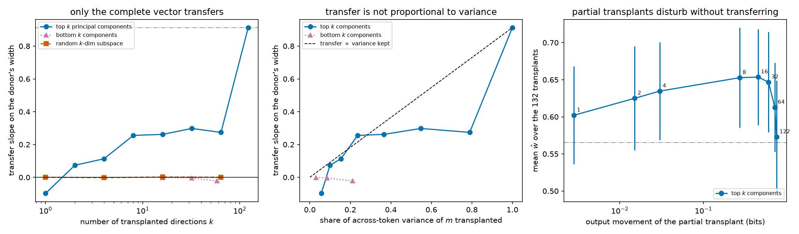

**Figure 21.** Left: transfer slope on the donor's width (y) against the number of transplanted
directions $k$ (x, log scale); circles = top $k$ principal components of $m$ across the 123 tokens,
triangles = bottom $k$, squares = a random $k$-dimensional subspace; dash-dotted line = the complete
transplant's $+0.913$. Centre: the same slope (y) against the share of the across-token variance of $m$
that the transplanted subspace carries (x); dashed line = transfer proportional to variance kept.
Right: mean $\hat w$ over the 132 transplants (y, error bars 1 sd across transplants) against the
output movement the partial transplant causes (x, bits, symmetric log scale), each point labelled with
its $k$; dash-dotted line = the unedited mean 0.565.

| directions transplanted | variance carried | transfer slope | $\rho$ | mean $\hat w$ | output movement |
|---|---|---|---|---|---|
| top 8 principal components | 0.24 | $+0.256$ | $+0.40$ | 0.653 | 0.271 bits |
| top 32 | 0.55 | $+0.298$ | $+0.47$ | 0.647 | 0.599 bits |
| top 64 | 0.79 | $+0.274$ | $+0.58$ | 0.613 | 0.713 bits |
| **all 122 (the complete vector)** | **1.00** | **$+0.913$** | **$+0.97$** | **0.573** | 0.750 bits |
| bottom 58 (the low-variance tail) | 0.21 | $-0.022$ | $+0.01$ | 0.601 | 0.016 bits |
| random 64-dimensional subspace | \- | $+0.000$ | $-0.09$ | 0.570 | 0.001 bits |
| *reference: no edit* | \- | \- | \- | *0.565* | \- |

The 64 components that carry 79% of the across-token variance of $m$ buy 30% of the transfer
($+0.274$ against $+0.913$) while already causing 95% of the full transplant's output movement, and the
tail they discard carries nothing on its own ($-0.022$, at 0.016 bits — those directions are almost
behaviourally inert). Adding the two pieces would give $+0.25$; the intact vector gives $+0.913$. A
random subspace of the same dimension does nothing at all, as it must, since it captures a vanishing
share of the difference.

The right-hand panel separates the two ways a transplant can fail, and this is the part that makes the
result more than a curve. Every truncated transplant behaves exactly like the disturbances of patterns
14–22: it lifts the mean width from 0.565 toward 0.65 and compresses the spread. The complete
transplant does neither — it returns a mean of 0.573 and a spread of 0.076 against the unedited 0.565
and 0.084, having simply exchanged which token has which width. Truncation therefore keeps all of the
damage and loses most of the transfer.

So the per-token width is a property of the block-0 MLP's output vector as a whole, not of a small
readable subspace of it. That agrees with what patterns 16 and 17 found from the other side — the trait
is not carried by an identifiable slice of the token's next-token distribution either — and it explains
why every steering attempt in this report has failed while the transplant succeeds: only an exact,
whole-vector substitution moves the trait. The honest caveat is that a truncated $m$ is a vector no
token ever produces, so this is evidence about a distributed code only in so far as the model's
response to off-manifold states is informative.

**Pattern 26 — three other networks rank the tokens the same way, and after correcting for measurement
noise they rank them identically.** Repeating the measurement in Pythia-160M, 410M and 1B at the same
checkpoint gives each model its own $\hat w_u$ for the same 123 tokens.

| model (same checkpoint, tokens, anchors, frames) | median $\hat w_u$ | sd across tokens | reliability $R_M$ | $\rho$ with 1.4B | disattenuated $\rho^{*}$ | embedding probe, held-out $\rho$ |
|---|---|---|---|---|---|---|
| Pythia-160M (12 blocks, $d = 768$) | 0.749 | 0.079 | 0.734 | $+0.207$ | $+0.256$ | $+0.233 \pm 0.104$ |
| **Pythia-410M** (24 blocks, $d = 1024$) | 0.658 | 0.060 | 0.891 | $+0.884$ | $\mathbf{+0.995}$ | $\mathbf{+0.774 \pm 0.055}$ |
| **Pythia-1B** (16 blocks, $d = 2048$) | 0.620 | 0.063 | 0.932 | $+0.898$ | $\mathbf{+0.989}$ | $\mathbf{+0.755 \pm 0.051}$ |
| Pythia-1.4B (24 blocks, $d = 2048$) | 0.549 | 0.066 | 0.885 | \- | \- | $+0.764 \pm 0.045$ |

410M, 1B and 1.4B agree at $+0.88$ to $+0.90$ raw and $+0.98$ to $+1.00$ once divided by what each
model's own measurement reliability permits (410M vs 1B: $+0.890$ raw, $+0.977$ corrected). Three
networks that differ in depth (16–24 blocks) and width (1024–2048) therefore contain the *same* ranking
of tokens by transition width, to the limit of what six anchors can resolve. The level is a property of
the network, not the token: median $\hat w_u$ falls monotonically with size (0.749 → 0.658 → 0.620 →
0.549), i.e. transitions sharpen as models grow, the same level-versus-ordering split the frame-shape
control found for context (pattern 12).

**Pattern 27 — the free lookup transfers to other models with no measurable loss, but only above 160M.**
The out-of-fold predictions of the probe fitted on Pythia-1.4B's embedding matrix rank 410M's measured
widths at $\rho = +0.760$ ($p = 2 \times 10^{-24}$) and 1B's at $+0.745$ ($p = 5\times10^{-23}$),
against $+0.765$ on the model it was fitted in — a table built once and reused across the family costs
nothing in accuracy. Refitting the probe inside each model gives the same picture ($+0.774$, $+0.755$
against $+0.764$), so nothing about the 1.4B embedding space was special. Pythia-160M is the exception,
and not because its measurement is noisy: its reliability is 0.734, so its ceiling against 1.4B is
0.806, and it reaches 0.207 — a quarter of what is available — while the 1.4B lookup tells us nothing
at all about it ($\rho = +0.043$, $p = 0.63$). The trait, and with it the transferable screen, is
acquired somewhere between 160M and 410M.

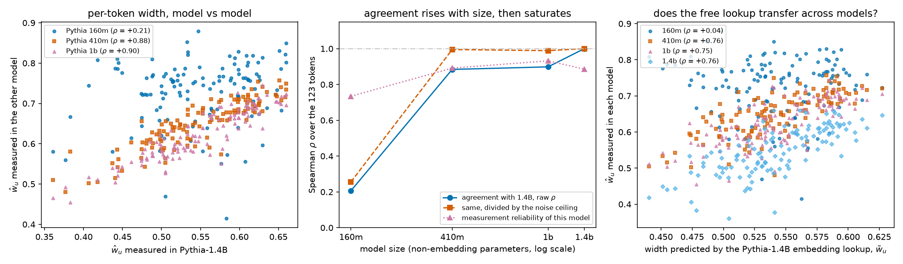

**Figure 22.** Left: each model's measured anchor width $\hat w_u$ (y) against Pythia-1.4B's (x), one
marker per token; circles = 160M, squares = 410M, triangles = 1B. Centre: Spearman $\rho$ over the 123
tokens (y) against model size (x, log scale, tick labels name the model) — circles/solid = raw
agreement with 1.4B, squares/dashed = the same divided by the noise ceiling $\sqrt{R_A R_B}$,
triangles/dotted = that model's own reliability $R_M$; dash-dotted line = perfect agreement. Right:
each model's measured width (y) against $\tilde w_u$, the width predicted by the ridge probe read off
**Pythia-1.4B's** embedding matrix (x); circles = 160M, squares = 410M, triangles = 1B, diamonds = 1.4B.

**Pattern 28 — the block-0 MLP is again the single early carrier in every model, but the matched-control
margin does not replicate.** Mean-ablating each MLP and each whole attention block in blocks 0–5 leaves
the ordering intact everywhere except one component, in all three new models.

| mean-ablated component (12 tokens, 6 anchors, 1 frame) | 160M | 410M | 1B | 1.4B |
|---|---|---|---|---|
| unablated sd of $\hat w_u$ across tokens | 0.169 | 0.071 | 0.096 | 0.084 |
| **block-0 MLP**: sd after ablation | **0.023** | **0.021** | **0.019** | **0.018** |
| **block-0 MLP**: $\rho$(before, after) | $+0.55$ | $-0.06$ | $-0.14$ | $-0.10$ |
| **block-0 MLP**: output movement | 0.404 bits | 0.438 bits | 0.445 bits | 0.451 bits |
| every other early component: median $\rho$ | $+0.91$ | $+0.97$ | $+0.98$ | $+0.99$ |
| every other early component: worst $\rho$ | $+0.67$ | $+0.93$ | $+0.86$ | $+0.90$ |
| every other early component: loudest | 0.030 bits | 0.017 bits | 0.013 bits | 0.007 bits |

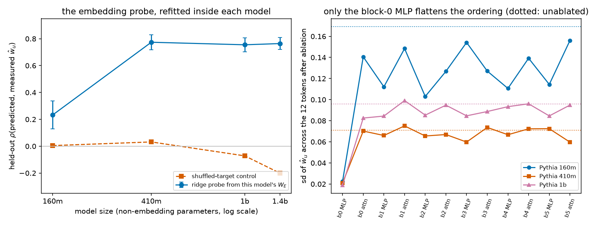

**Figure 23.** Left: held-out Spearman $\rho$ between predicted and measured $\hat w_u$ (y) for a ridge
probe fitted inside each model from that model's own embedding matrix, against model size (x, log
scale); circles/solid = probe, error bars $\pm 1$ sd over 50 random 80/43 splits; squares/dashed = the
same probe with shuffled targets. Right: standard deviation of $\hat w_u$ across the 12 test tokens (y)
after mean-ablating one early component (x: the MLP and the whole attention block of blocks 0–5);
circles = 160M, squares = 410M, triangles = 1B; each model's dotted horizontal line is its own
unablated spread. Pythia-1.4B's finer sweep over all 102 individual heads and MLPs is Figure 18.

Rerunning the per-token movement-matched dose–response in Pythia-410M splits the 1.4B result in two.
The part that replicates is the raw per-token movement: the dose moves a token's width further than
that token's own exactly matched control at the low rungs (0.016 vs 0.008 at 0.0010 bits, 0.049 vs
0.032 at 0.0074 bits, 0.062 vs 0.048 at 0.0117 bits; Wilcoxon $p = 0.002$, $0.005$, $0.012$), and it
compresses the across-token spread harder at every matched dose (0.038 vs 0.051 at 0.026 bits). The
part that does **not** replicate is the part the localisation claim rested on. With each arm's mean
shift removed, the level-free paired test is null at all nine rungs ($p \ge 0.62$ in the live band,
against $p = 0.034$ and $0.016$ at 1.4B), and the ordering is not damaged faster by the dose: over the
six rungs below 0.05 bits the MLP arm sits below its matched control in 9 of 18 rung × seed
comparisons — exactly chance — and the $\rho = 0.6$ crossing puts the control at 0.023 bits against the
MLP's 0.035, so the ratio runs backwards ($0.66\times$ here against $1.3\times$ at 1.4B).

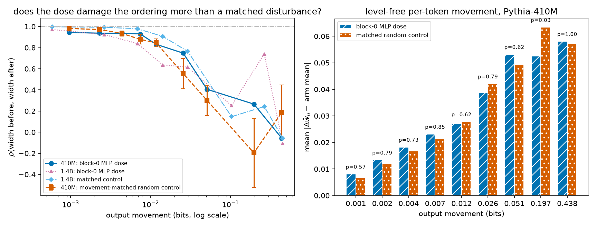

**Figure 24.** Left: rank agreement $\rho$ between each token's anchor width before and after the
perturbation (y) against the output movement it causes (x, bits, log scale). Circles/solid = the 410M
block-0 MLP dose ($\alpha = 0.1 \dots 1$), squares/dashed = a random direction added to the same
residual stream, rescaled so **each token's** output moves the same number of bits (mean of 3 seeds,
error bars 1 sd across seeds); triangles/dotted and diamonds/dash-dotted = the same two arms in
Pythia-1.4B (Figure 19); gray dash-dotted line = ordering intact. Right: the level-free per-token width
change $\Delta^{\mathrm{free}}_u$ averaged over the 12 tokens (y) at each dose (x, bits); hatched `//`
bars = the MLP dose, dotted `..` bars = the matched control; annotations are Wilcoxon $p$.

Read together, patterns 26–28 move the weight of the mechanistic claim. What reproduces across four
model sizes is the **site**: the block-0 MLP's contribution to the final-position residual stream is
where the width-relevant information sits, it is the only early component whose removal collapses the
across-token spread by a factor of 3–7, and disturbing it changes the level and spread of $\hat w_u$
more than an equally loud random disturbance. What does not reproduce is the finer claim that it
rearranges the *ordering* faster per bit than a generic disturbance of the same stream — modest at 1.4B
($1.3\times$, $n = 12$), absent and sign-reversed at 410M. The reproducible positive evidence for the
component is therefore the transplant (patterns 23–25), which does not depend on a matched control at
all: its evidence is that the *donor's identity* sets the recipient's width.

**Pattern 29 — the ordering does not exist at initialisation and is essentially complete after 512 of
143,000 training steps.** At `step0` there is nothing to rank: the spread of $\hat w_u$ across the 123
tokens is sd $= 0.003$ against $0.060$ at the end of training, the six-anchor measurement's own
split-half reliability is $0.570$ (so most of what little variation exists is measurement noise), and
the agreement with the final ranking is $\rho = +0.015$. That is still true at `step16`. The ordering
then appears over less than two orders of magnitude of training: agreement with `step143000` runs
$+0.17$ (`step32`), $+0.29$ (`step64`), $+0.44$ (`step128`), $+0.66$ (`step256`), $+0.79$ (`step512`)
and $+0.80$ (`step1000`), which after dividing by each checkpoint's noise ceiling is $+0.87$ already at
`step512`. The last tenth arrives by `step2000` ($+0.94$ disattenuated) and then nothing moves:
$+0.95$, $+0.94$, $+0.97$, $+0.99$, $+0.98$ at `step4000` through `step64000`. **The level keeps
changing long after the ordering has stopped**: the median $\hat w_u$ falls from $0.833$ at `step256`
to $0.595$ at `step64000` — transitions go on sharpening for two orders of magnitude of training after
which tokens are narrow has been settled (the final checkpoint's $0.658$ interrupts that trend, the one
non-monotone point in the sweep). This is the training-time version of the split the frame-shape
control and the four-model comparison both found: ordering and level are separate channels.

To show when the trait appears and to separate its two channels, Figure 25 plots agreement with the end
of training, and the level and spread of the measurement, against training step.

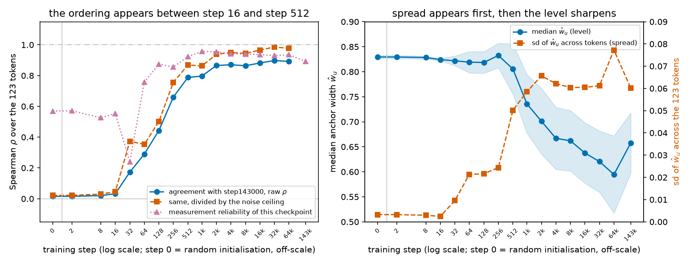

**Figure 25.** Pythia-410M-deduped at 17 released checkpoints, same 123 tokens, 6 anchors, 3 frames and
block-0 site throughout. x (both panels): training step, log scale; `step0` (random initialisation) is
drawn off-scale to the left of the vertical rule. Left, y: Spearman $\rho$ over the 123 tokens —
circles/solid = raw agreement of that checkpoint's ranking with `step143000`'s, squares/dashed = the
same divided by the noise ceiling $\sqrt{R_M R_{\mathrm{final}}}$, triangles/dotted = that checkpoint's
own split-half reliability $R_M$; dash-dotted line = perfect agreement. The final checkpoint is omitted
from the two agreement series because it would be compared with itself. Right: median $\hat w_u$
(y-left, circles/solid, shaded band $\pm 1$ sd across tokens) and the across-token sd itself (y-right,
squares/dashed). Spread appears from `step32` and saturates by `step512`; the level keeps falling until
`step64000`.

**Pattern 30 — the trait is built in two stages, and only the first one is unigram frequency.** The
first thing the model learns about width is a frequency statistic: the rank correlation between
$\hat w_u$ and $\log_{10} N_u$ goes $-0.03$ (`step16`), $-0.39$ (`step32`), $-0.63$ (`step64`),
$-0.72$ (`step128`) — *stronger* at `step128` than at the end of training ($-0.53$) — while at those
same checkpoints the agreement with the final ranking, with $\log_{10} N_u$ and $H_u$ partialled out,
sits at zero ($-0.05$, $-0.08$, $+0.15$). In other words, everything a `step128` model knows about
which tokens have narrow transitions is *rare tokens are narrow*, and none of it is the part that
survives to the end. The second stage begins at `step256`: the successor-entropy correlation moves from
$-0.15$ to $-0.46$, and the partial agreement with the final ranking climbs to $+0.45$ (`step256`),
$+0.60$ (`step512`), $+0.65$ (`step1000`), $+0.75$ (`step2000`) and $+0.79$ to $+0.82$ thereafter. In
the finished model the two corpus statistics explain $R^2_{\mathrm{corpus}} = 0.375$ of the final
ranking's rank variance in 410M and $0.378$ in 1.4B, and the measured width tracks $\log_{10} N_u$ at
$-0.53$ and $-0.52$ in those two models. (Pattern 5's weaker $-0.33$ is a different quantity — the
token effect $a_u$ *fitted* inside the pair bank, not the directly measured $\hat w_u$.)

**So the answer to "corpus statistic or learned property" is: both, in that order, and the learned part
is the larger one.** Two-thirds of the final ordering's rank variance is not in unigram frequency or
successor entropy, and the part an early checkpoint shares with the finished model survives partialling
both out at $+0.6$ to $+0.8$. An auditor cannot replace the lookup with a count table; but the lookup
is reading something a model acquires in its first few hundred optimizer steps, not a late refinement
of that token's successor distribution.

**Pattern 31 — a mature model's lookup detects the trait before the young model's own embedding
expresses it.** The *fixed* free lookup — the probe fitted once on Pythia-1.4B's embedding matrix —
ranks each checkpoint's measured widths at $+0.21$ (`step32`), $+0.40$ (`step64`), $+0.54$ (`step128`),
$+0.71$ (`step256`), $+0.81$ (`step512`), and $+0.77$ to $+0.84$ at every later checkpoint; it tracks
the trait from the step it first appears, and it ranks `step2000`'s widths ($+0.836$) slightly better
than the finished model's ($+0.760$). A probe refitted *inside* each checkpoint lags an order of
magnitude behind in steps: it is indistinguishable from its shuffled-target control through `step256`
($-0.02$ to $+0.08$), reaches $+0.25$ at `step512`, $+0.65$ at `step2000`, and only attains its final
$+0.77$–$+0.81$ from `step4000` on. The behaviour is therefore in place well before that model's own
embedding row encodes it linearly, which is a useful asymmetry for an auditor: a table built on a
trained model reads a checkpoint whose embeddings could not have produced that table. The lag should
not be over-read — each refit trains on 80 tokens and its sd is $\pm 0.10$ in the early regime, and
`step32`'s reliability of 0.241 makes its disattenuated agreement unstable.

To ask whether the ordering is a repackaged corpus statistic, and to compare the two ways of reading it
off an embedding matrix, Figure 26 plots the corpus correlations and both lookups against training step.

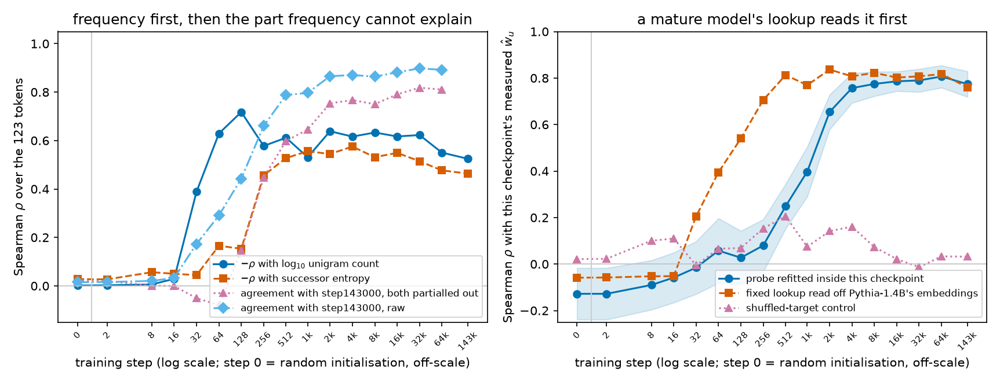

**Figure 26.** Same sweep and same x-axis as Figure 25. Left, y: Spearman $\rho$ over the 123 tokens —
circles/solid = $-\rho$ between $\hat w_u$ and $\log_{10} N_u$ (the token's unigram count in `dir18`'s
corpus sample), squares/dashed = $-\rho$ with the successor entropy $H_u$ (both negated so that "more
of the ordering explained" points up), diamonds/dash-dotted = raw agreement with `step143000`,
triangles/dotted = that agreement with both corpus statistics partialled out
($\rho^{\mathrm{part}}$). Right, y: Spearman $\rho$ between each checkpoint's measured $\hat w_u$ and
two predictions of it — circles/solid = a ridge probe refitted inside that checkpoint (shaded band
$\pm 1$ sd over 50 random 80/43 splits), squares/dashed = the fixed lookup read off Pythia-1.4B's
embedding matrix, triangles/dotted = the refitted probe with shuffled targets.

### GPT-2: the ordering is a property of the token *in a training corpus*, not of the string

Every generalisation above holds the tokenizer and the training data fixed, so "the ordering belongs to
the token" was still a statement about Pythia and the Pile. GPT-2 small is the cheapest way outside
that family — a different corpus (WebText), a different BPE vocabulary, and a serial rather than
parallel residual block — and it costs nothing in comparability, because **all 123 endpoint token
strings and all 6 anchor strings are single tokens in GPT-2's vocabulary too**. The same strings, the
same anchors, the same three frames, the same block-0 site.

The first thing the test found is not about the ordering at all: **dir18's width `w` is undefined for
most GPT-2 curves.** `w` requires the output-distance score `d(t)` to rise monotonically and to cross
0.1 and 0.9 once each. Every Pythia curve in this report does (validity 1.000 at 410M and at 1.4B,
median backslide 0.000). At GPT-2's block 0, **88.8% of curves fail** — they rise, fall back and rise
again, with a median backslide of 0.107. So we score every curve with an **envelope width** $\hat w_u$,
which replaces `d` by its running maximum and is therefore defined for every curve; on monotone curves
it is exactly `w`. Inside Pythia the substitution changes nothing (rank correlation with `w` = 1.0000
per curve and per token, both models), which is what licenses using it on GPT-2.

To show what breaks, Figure 27 puts three raw curves from each model side by side and then compares the
per-token rankings, with a second Pythia size as the positive control.

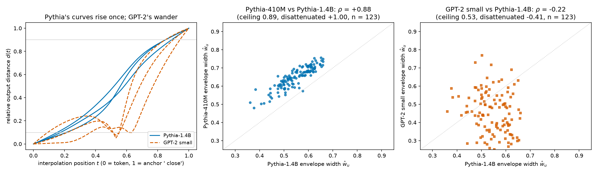

**Figure 27.** Left: raw `d(t)` for three endpoint tokens against the anchor ` close` in the first of the three frames,
Pythia-1.4B (solid) and GPT-2 small (dashed); x = interpolation position `t`, y = relative output
distance `d(t)`; grey lines mark the 0.1 and 0.9 levels whose crossings define the width. Pythia's
curves rise once; GPT-2's fall back below a level they have already crossed. Middle and right: each
model's per-token envelope width $\hat w_u$ (y) against Pythia-1.4B's (x), one point per token, 123
tokens, same axes in both panels; dotted line = equality. Middle is the positive control
(Pythia-410M), right is GPT-2. Titles give raw $\rho$, the noise ceiling $\sqrt{R_A R_B}$ from the two
models' split-half reliabilities, and $\rho$ divided by it.

| | GPT-2 small | Pythia-410M | Pythia-1.4B |
|---|---|---|---|
| strict-validity rate of `w` | **0.112** | 1.000 | 1.000 |
| median curve backslide | 0.107 | 0.000 | 0.000 |
| median $\hat w_u$ (level) | 0.442 | 0.658 | 0.549 |
| sd of $\hat w_u$ across tokens | 0.132 | 0.060 | 0.066 |
| split-half reliability | **0.319** | 0.891 | 0.885 |
| $\rho$ with Pythia-1.4B's ranking (÷ ceiling) | $\mathbf{-0.219}$ ($-0.41$) | $+0.884$ ($+0.99$) | — |
| fixed 1.4B embedding lookup → this model | $-0.200$ | $+0.760$ | $+0.765$ |
| probe refitted inside this model | $+0.295$ | $+0.774$ | $+0.764$ |
| $\rho$ with $\log_{10}$ unigram count $N_u$ | $-0.038$ | $-0.525$ | $-0.517$ |

**Pattern 32 — nothing transfers to GPT-2: not the ordering, not the lookup, not even the frequency signal.** GPT-2 ranks the 123 tokens at $\rho = -0.219$ with Pythia-1.4B and $-0.189$ with
410M, against $+0.884$ between the two Pythias; the free lookup read off Pythia-1.4B's embedding matrix
ranks GPT-2's widths at $-0.200$ where it reaches $+0.76$ on both Pythias; a probe refitted inside
GPT-2 reaches $+0.295$ where the same probe reaches $+0.76$–$+0.77$ inside either Pythia (how far above
chance that is takes a better control than this run used — pattern 37); and even the frequency signal
that survives everything else in Pythia ($-0.52$) is absent ($-0.038$). Removing unigram count and successor
entropy leaves the cross-model figure where it was ($-0.211$), so this is not a corpus-statistic
mismatch.

**And this is not simply GPT-2 being too noisy to say.** Its measurement reliability is 0.319 against
0.885, which caps any correlation it could show at 0.53 — but the observed $|\rho| \le 0.22$ is well
inside that cap, and the sign is not even stable ($-0.22$ at block 0, $+0.01$ to $+0.14$ at every other
site below). The correct reading is *no relationship*, not a reversed one.

The obvious objection is the site: block 0 of GPT-2's 12 blocks is not block 0 of Pythia's 24, and
GPT-2's curves are badly behaved exactly there. Figure 28 answers it by repeating the whole measurement
at six depths.

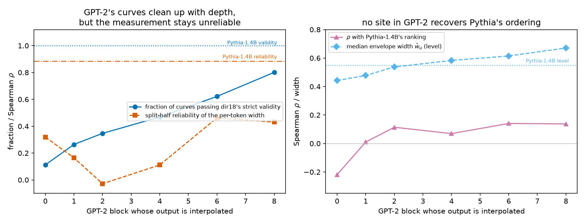

**Figure 28.** GPT-2 small, same 123 tokens, 6 anchors and 3 frames, with the interpolation site moved
across blocks 0, 1, 2, 4, 6 and 8 (x, both panels). Left, y: fraction of curves passing dir18's strict
validity (circles/solid) and the split-half reliability of the per-token width (squares/dashed);
horizontal dotted and dash-dotted lines mark Pythia-1.4B's values (1.000 and 0.885). Right, y: Spearman
$\rho$ between GPT-2's ranking at that site and Pythia-1.4B's block-0 ranking (triangles/solid) and
GPT-2's own median envelope width (diamonds/dashed, the level), with Pythia-1.4B's level (0.549) dotted.

**Pattern 33 — depth repairs GPT-2's curves but does not recover the trait.** Moving down GPT-2, the curves become well behaved —
validity 0.112 → 0.801 and median backslide 0.105 → 0.000 between blocks 0 and 8 — and the level rises
0.442 → 0.671, the same sharpening-with-depth direction Pythia shows. But the per-token measurement
never becomes reliable (peak 0.462 at block 6, against Pythia's 0.885) and agreement with Pythia's
ranking never leaves noise (maximum $+0.141$, $p = 0.12$; $p > 0.2$ at every site except block 0's
negative). At GPT-2's most reliable site the ceiling is 0.64 and the observed value is 0.14.

**Pattern 34 — the one thing that replicates is the site.** Mean-ablating each early component of GPT-2 in turn (12 tokens, first frame)
leaves the block-0 MLP as the only one the model feels — 0.228 bits of output movement against
$\le 0.011$ for the other eleven — and the only one that inflates the across-token spread (0.116 →
0.201) and erases what ordering there is ($\rho = +0.06$, against $+0.38$ to $+0.97$ elsewhere). With
12 tokens and a reliability of 0.32 this is suggestive, not established, but the site of the effect is
where Pythia puts it.

### Two models fail the screen for two different reasons: is there a plateau to measure?

Two negatives are now on the table, and they have been read as one story. GPT-2 ranks the tokens
differently from Pythia (pattern 32), and Pythia-160M ranks them differently from the larger Pythias
(pattern 26). Both were reported as "the trait is absent here", but a width ranking can fail to
transfer for two quite different reasons: the model may have plateau-shaped transitions in a different
token order, or it may have no plateau structure at all, in which case a width is a number without a
referent. Edge drift $E$ separates them (Methods): it is how far the curve moves in the outer tenth of
the path at each end, $\approx 0$ for a plateau and exactly 0.2 for a straight line. It costs no
forward passes. Figure 29 (left) gives the whole distribution of $E$ for six configurations, and
Figure 29 (right) asks whether GPT-2's disagreement with Pythia survives throwing away every curve that
is not plateau-shaped.

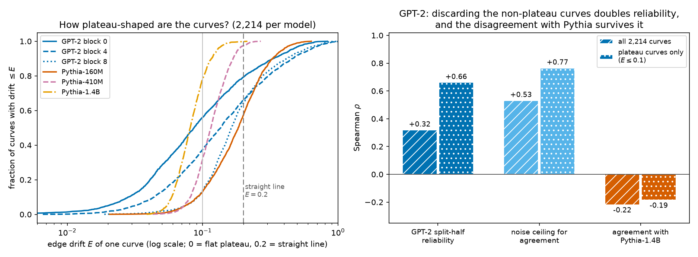

**Figure 29.** Left, x: edge drift $E$ of a single interpolation curve (log scale), y: fraction of that
configuration's 2,214 curves (123 tokens × 6 anchors × 3 frames) with drift at most $E$; a curve
further left is more plateau-shaped. The dashed vertical line is the straight-line reference
$E = 0.2$ and the thin solid line is the $E \le 0.1$ cut used on the right. Series: GPT-2 small at
blocks 0 (solid), 4 (dashed) and 8 (dotted), and Pythia-160M (solid), 410M (dashed) and 1.4B
(dash-dotted) at block 0. Right, y: Spearman $\rho$. Three quantities for GPT-2 block 0 — its
split-half reliability, the noise ceiling $\sqrt{R_A R_B}$ for agreement with Pythia-1.4B, and the
measured agreement — each computed on all 2,214 curves (hatched `//`) and on the 56% that are
plateau-shaped (dotted fill).

| | GPT-2 block 0 | GPT-2 block 4 | GPT-2 block 8 | Pythia-160M | Pythia-410M | Pythia-1.4B |
|---|---|---|---|---|---|---|
| median edge drift $E$ (straight line = 0.2) | 0.087 | 0.136 | 0.164 | **0.183** | 0.115 | **0.081** |
| 10th–90th percentile of $E$ | 0.028–0.333 | 0.044–0.461 | 0.093–0.418 | 0.091–0.328 | 0.081–0.168 | 0.059–0.116 |
| fraction of curves with $E > 0.1$ | 0.440 | 0.627 | 0.861 | 0.868 | 0.682 | 0.221 |
| median $\hat w^{\mathrm{env}}$ (level) | 0.435 | 0.587 | 0.670 | 0.743 | 0.649 | 0.545 |
| $\rho$ between $E$ and $\hat w^{\mathrm{env}}$ across tokens | +0.770 | +0.731 | +0.556 | +0.927 | +0.963 | +0.967 |
| $\rho$ of this configuration's $E$ ranking with Pythia-1.4B's | −0.167 | +0.122 | −0.049 | +0.243 | +0.887 | — |

**Pattern 35 — GPT-2 does have plateaus; the model that does not is Pythia-160M.** GPT-2's block-0
curves are as plateau-shaped at the median as Pythia-1.4B's ($E = 0.087$ against 0.081, on a scale
where 0.2 is a straight line), so its disagreement with Pythia is not a case of measuring a width where
there is no plateau. The prediction we made from the earlier negative fails, and informatively: the
Pythia size that lacks the width ordering is the *least* plateau-shaped configuration of the six
($E = 0.183$, essentially the straight-line value, with 87% of its curves above 0.1 against 22% of
Pythia-1.4B's). Within Pythia, plateau structure strengthens with scale — median $E$ falls
0.183 → 0.115 → 0.081 from 160M to 410M to 1.4B — and the size at which the ordering appears (410M,
pattern 26) is the size at which the curves stop looking like ramps. That is a correspondence between
two measurements at one checkpoint each, not a demonstration that one causes the other. What GPT-2 does
have is a much wider *spread* of curve shapes than any Pythia: its 10th–90th range spans
0.028–0.333, so 44% of its curves drift more than a plateau should while the rest are as flat as
Pythia's best. Depth makes this worse rather than better — median $E$ rises to 0.164 by block 8 — which
sits alongside pattern 33's finding that the same depth repairs strict validity: GPT-2's deeper sites
give tidier curves that are also closer to straight ramps.

**Pattern 36 — GPT-2 has a reproducible width ordering of its own, and it is not Pythia's.** Keeping
only the 56% of GPT-2 curves that are plateau-shaped and re-deriving each token's width from what
survives more than doubles its split-half reliability, from 0.319 to 0.661, which lifts the ceiling on
any cross-model agreement from 0.53 to 0.77. The agreement with Pythia-1.4B does not follow it up: it
stays at $-0.185$ ($p = 0.04$, 123 tokens) where it was $-0.219$. This is the result that turns
pattern 32 from a statement we could not fully back into a measured one. Before, the honest reading was
"GPT-2's measurement is too noisy for its $-0.22$ to mean much"; now GPT-2's plateau-shaped curves rank
its tokens consistently with each other — the ordering is real and reproducible inside GPT-2 — and it is
uncorrelated with Pythia's at less than a quarter of the ceiling. The same filter cannot be run at
Pythia-160M: only 13.2% of its curves pass the $E \le 0.1$ cut, leaving 83 tokens and a measurement
with no reliability left (split-half $-0.139$), so whether *its* disagreement would survive the filter
is untestable with these curves. Measured on all its curves, though, 160M behaves like GPT-2 in the one
respect that matters here — a reproducible ordering of its own (reliability 0.699) that is close to
unrelated to Pythia-1.4B's ($+0.213$ against a ceiling of 0.787). Both models that fail the screen have
their own consistent answer; neither has Pythia-1.4B's.

**A caveat this exposes about `w` itself.** Inside each Pythia, a token's width and its edge drift rank
the tokens almost identically ($\rho = +0.93$, $+0.96$, $+0.97$ at 160M, 410M and 1.4B), and the two
statistics also transfer between models to the same degree (410M–1.4B: $+0.887$ for $E$ against
$+0.884$ for $\hat w^{\mathrm{env}}$). So the per-token trait this report screens for can equally be
described as *how long the output stays put near the endpoints* rather than as the width of the
crossing in the middle. That is a restatement of the same measurement, not a second finding — but it
means a reader should not picture two independent curve properties where there is essentially one. The
two descriptions do separate once something has to predict them, and patterns 41 and 42 below show that
the static embedding holds the shape description and not the width one.

**What this costs the report.** The width ordering is a property of a token *as trained in a particular
corpus*, not of the token string: GPT-2 orders the same 123 strings reproducibly (reliability 0.66 on
its plateau-shaped curves) and its order has nothing to do with Pythia's ($-0.19$ against a ceiling of
0.77). The practical screen is therefore per-model, and an auditor's first step is the split-half
reliability check, which needs no reference model — but it must be computed on plateau-shaped curves,
because scoring every curve is what hid GPT-2's own ordering behind a reliability of 0.32. The
reliability check alone is also not the whole story: Pythia-160M passes it (0.699) and still disagrees
with the larger Pythias, while being the configuration whose curves are nearest to straight ramps. Both
checks are cheap and neither needs a reference model, so the honest recommendation is to run both — the
edge-drift distribution to see whether the model has plateaus, and the split-half reliability on the
plateau-shaped curves to see whether its widths are measurable.

### Does GPT-2's embedding hold GPT-2's own widths?

The cheapest form of this report's screen is the lookup: inside Pythia, a token's width can be read off
its static embedding row by a ridge probe at $\rho = +0.76$, so an auditor can rank tokens without
running the model at all (pattern 10). Whether that shortcut exists in a second model decides how much
of the method ports. Pattern 36 is what makes the question answerable — until GPT-2 had a reproducible
width ordering there was no target worth fitting, because a probe cannot beat the noise in its own
labels. We now refit the same probe inside GPT-2, against the plateau-filtered widths (reliability
0.661, so a probe can reach at most $\sqrt{0.661} = 0.813$), and against the all-curve widths for
comparison.

Doing this exposed a flaw in how every probe in this report was checked against chance. The
shuffled-target control permutes the targets once and reuses that permutation across the 50 splits, so
it reports one draw from the chance distribution. Figure 30 (left) draws 50 of them. To read a probe's
accuracy against the chance distribution rather than against one sample of it, Figure 30 (right) puts
each probe next to the ceiling its target allows and next to the spread of those 50 draws.

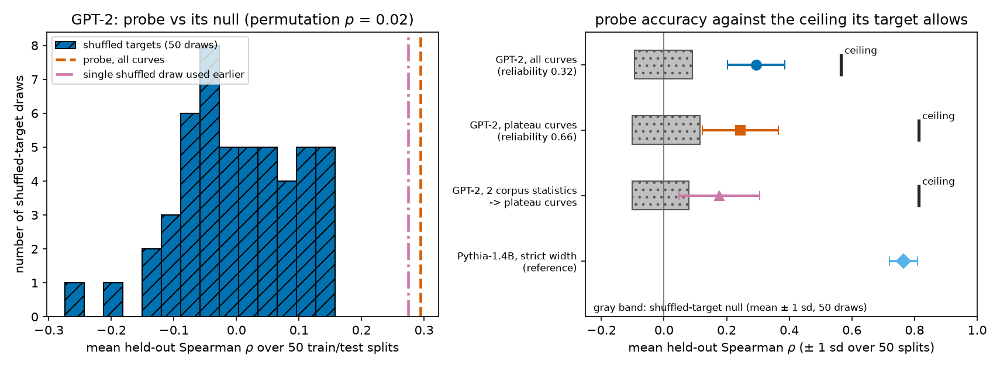

**Figure 30.** Left, x: mean held-out Spearman $\rho$ over the 50 train/test splits, y: how many of 50
independently shuffled targets landed there (bars, hatched). The dashed vertical line is GPT-2's actual
probe on the all-curve target ($+0.295$); the dash-dotted vertical line is the single shuffled draw the
earlier run used as its control ($+0.275$). Right, x: mean held-out $\rho$ with error bars of $\pm 1$
standard deviation across the 50 splits; y: four probes, top to bottom — GPT-2's embedding against its
all-curve widths (circle), against its plateau-filtered widths (square), two corpus statistics against
the plateau-filtered widths (triangle), and Pythia-1.4B's embedding against its strict widths (diamond,
for scale). Gray dotted bands are the 50-draw null (mean $\pm 1$ sd); the black vertical tick marked
"ceiling" is $\sqrt{R}$ for that row's target reliability $R$. Pythia's row has no null band because
only one shuffled draw was run for it.

**Pattern 37 — the "probe sits on its control" reading was an artifact of a one-draw control.** GPT-2's
control value of $+0.275$ reproduces exactly, and it is the largest of 50 independent shuffled draws,
whose distribution is centred at $-0.002$ with a standard deviation of $0.093$ and a range of $-0.274$
to $+0.157$ (Figure 30, left). One permutation of 123 targets is therefore worth about $\pm 0.2$ of
apparent skill, which is the size of every effect being tested here. Against the full distribution
GPT-2's probe is above chance: $+0.295$, permutation $p = 0.020$. The same caution applies to the other
single-draw controls in this report ($+0.032$ at 410M, $-0.201$ at 1.4B); it changes nothing there,
because those probes sit at $+0.77$, far outside any draw we observed, but it is why the GPT-2 numbers
had to be recomputed before anything could be concluded from them.

**Pattern 38 — GPT-2's embedding holds a weak trace of its width ordering, worth about two corpus
statistics, and a more reliable target does not improve it.** The table below reads across the four
probes of Figure 30 (right).

| | GPT-2, all curves | GPT-2, plateau curves | GPT-2, 2 corpus statistics | Pythia-1.4B (reference) |
|---|---|---|---|---|
| features | 768 embedding dims | 768 embedding dims | $\log_{10} N_u$, $H_u$ | 2048 embedding dims |
| target reliability $R$ | 0.319 | 0.661 | 0.661 | 0.885 |
| ceiling $\sqrt{R}$ | 0.565 | 0.813 | 0.813 | 0.941 |
| held-out $\rho$ | $+0.295 \pm 0.092$ | $+0.244 \pm 0.122$ | $+0.176 \pm 0.129$ | $+0.764 \pm 0.045$ |
| $\rho$ ÷ ceiling | $+0.52$ | $+0.30$ | $+0.22$ | $+0.81$ |
| held-out $R^2$ | $+0.025$ | $-0.021$ | $-0.036$ | $+0.514$ |
| 50-draw null | $-0.002 \pm 0.093$ | $+0.006 \pm 0.108$ | $-0.012 \pm 0.090$ | (one draw: $-0.201$) |
| permutation $p$ | 0.020 | 0.020 | 0.039 | — |

Three things follow, and the first is the one an auditor should act on. **The lookup does not port.**
Inside GPT-2 the probe recovers 0.30 of the ordering its target allows, against 0.81 inside
Pythia-1.4B, and its held-out $R^2$ is $-0.021$ — it ranks tokens slightly better than chance and
predicts none of the variance in the width itself. A practitioner who wants GPT-2 widths has to measure
them; the free lookup is a Pythia result, and pattern 36's finding that GPT-2 *has* a reproducible
ordering does not make that ordering readable from the embedding.

**The reliable target did not help, which localises where the shortfall is.** The plateau-filtered
target is measured more than twice as reliably, yet the probe on it scores $0.051$ *lower*
($\pm 0.140$ across the 50 splits, which both probes share; the filtered target wins in 16 of 50 splits,
paired Wilcoxon $p = 0.023$). Attenuation from label noise was therefore not the binding constraint: the
part of GPT-2's width that its embedding predicts is disproportionately the part the filter discards.
The two targets themselves rank the tokens at $\rho = +0.750$, so this is a shift in emphasis inside a
largely shared ordering, and with 123 tokens we can say the reliable target is no easier to predict —
not why.

**Two numbers you can count from a corpus get most of the way there.** A probe with only
$\log_{10} N_u$ and successor entropy $H_u$ as features reaches $+0.176$ on the same target and splits
(permutation $p = 0.039$); 768 embedding dimensions beat it by $0.067 \pm 0.164$, winning 34 of 50
shared splits (paired Wilcoxon $p = 0.009$). The margin is real but small, and it comes almost entirely
from successor entropy ($\rho = +0.191$ with the filtered widths, $p = 0.034$) since frequency is
absent in GPT-2 ($-0.018$, $p = 0.84$) — the same frequency signal that carries $-0.52$ in both Pythias.
Inside Pythia the embedding probe clears both corpus statistics by a wide margin (pattern 30: they
explain 0.375 of the ranking's rank variance where the probe reaches $+0.76$), so the contrast between
the models is in how much the embedding adds over free statistics, and in GPT-2 the answer is: a little.

The two models' lookups also disagree with each other, which is what pattern 32 predicts and this
measurement confirms from the embedding side: GPT-2's out-of-fold lookup ranks its own filtered widths
at $+0.196$ ($p = 0.03$) and Pythia-1.4B's widths at $-0.174$ ($p = 0.05$), and the two models' lookups
rank the 123 tokens at $-0.204$ ($p = 0.02$) with each other. Whatever weak signal GPT-2's embedding
carries, it is not Pythia's signal.

**What this settles for the report's recommendation.** The two-check recommendation above stands
unchanged, and this adds a third statement to it: a model that passes both checks still may not support
the *free* version of the screen. The porting order for a new model is therefore the edge-drift
distribution, then split-half reliability on the plateau-shaped curves, then — and only if a lookup is
wanted — a refit of the embedding probe against a properly estimated permutation null, benchmarked
against a probe on $\log_{10} N_u$ and $H_u$, which costs nothing and is the bar GPT-2's embedding
barely clears.

### Can one vector install the ordering in a network that only half has it?

Every causal claim in this report so far lives inside one finished network. The checkpoint sweep
(patterns 29–31) says the ordering is in place within a few hundred optimizer steps; the transplant
(pattern 23) says that in the finished model one vector moves a token's width. Putting those together
into "the block-0 MLP output is what training installs" would be reading a mechanism out of two
correlations, so we tested it directly, by writing `step143000`'s $m_u$ into the `step128` network and
asking whether `step128`'s width ranking moves toward `step143000`'s. To show that any movement depends
on *which* token's vector arrived, each transplant is run beside a write of the same vectors with the
token identities shuffled. Figure 31 puts every condition on one axis.

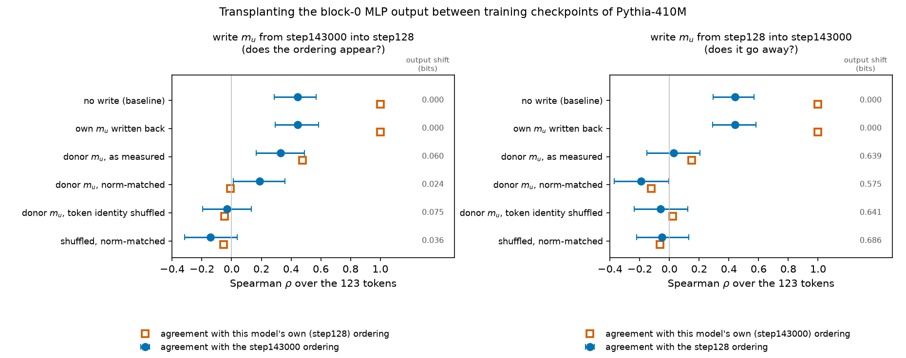

**Figure 31.** Pythia-410M-deduped, 123 tokens, 6 anchors, 3 frames, block-0 site. x: Spearman $\rho$
over the 123 tokens; y: the six write conditions defined in Methods. Filled circles are agreement with
the *donor* checkpoint's own measured width ordering, with 95% bootstrap intervals over tokens; open
squares are agreement with the *recipient's* own baseline ordering (no interval drawn — the baseline
row is a self-comparison and sits at $+1.0$ by construction). The gray numbers on the right of each
panel are the median output shift the write causes, in bits of Jensen-Shannon divergence between the
token's next-token distribution before and after. Left: `step143000`'s $m_u$ written into `step128`.
Right: the reverse. The two lower rows in each panel are the identity-shuffled controls.

**Pattern 39 — the vector carries the ordering across training time, but only a fraction of it.** The
sanity check passes first: writing a network's own $m_u$ back reproduces its baseline widths exactly
(agreement $+1.000$, 0.000 bits), so the hook edits what we claim it edits. With the correct donor's
vector in place, `step128`'s widths agree with `step143000`'s ordering at $+0.329$ (donor as measured)
and $+0.189$ (norm-matched, $\kappa = 0.176$). The shuffled writes, which move the output by as much or
more (0.075 and 0.036 bits against 0.060 and 0.024), land at $-0.030$ and $-0.141$. The gap is
$+0.357$ (95% bootstrap interval $[+0.151, +0.553]$) and $+0.324$ ($[+0.075, +0.572]$) — so which
token's vector arrives changes where that token's width ends up, in a network that never learned to
produce that vector.

The norm-matched condition is the cleaner of the two, because it erases the recipient's own ordering
entirely: after the write, `step128`'s widths rank at $-0.009$ with the widths `step128` produced
untouched, while still agreeing with `step143000`'s ordering at $+0.189$. That residual agreement has
nowhere to come from except the transplanted vectors. The partial correlations say the same thing in
one number: removing the recipient's baseline ranking leaves $+0.240$, and additionally removing the
donor vector's length leaves $+0.272$. Length is not the channel — $\lVert m_u \rVert$ in the final
checkpoint ranks that checkpoint's own widths at only $-0.098$.

What the experiment does *not* show is equally clear, and it is the reason the headline is "a fraction
of it". Every transplant lowers agreement with the final ordering relative to doing nothing: `step128`
already ranks at $+0.443$ untouched, and the best transplant leaves it at $+0.329$. The write costs
more than it delivers. So $m_u$ is partially sufficient across training time — enough to be detected
against a matched control, far short of enough to install the trait — and the strong sufficiency claim
in pattern 23 remains a statement about token-to-token substitution inside one network, not about
transplanting across training.

**Pattern 40 — the two checkpoints do not write $m_u$ in the same coordinates, which bounds what the
transplant could have shown.** The table reads the geometry of the same 123 vectors in the two
checkpoints.

| | `step128` vs `step143000` |
|---|---|
| median $\lVert m_u \rVert$ | 1.94 vs 11.06 |
| cosine between the same token's two vectors | $+0.178$ |
| the same, after subtracting the across-token mean | $+0.198$ |
| rank agreement of $\lVert m_u \rVert$ across tokens | $-0.043$ |
| rank agreement of the 7,503 within-checkpoint pairwise cosines | $+0.031$ |
| the same, after centring | $+0.096$ |

These numbers are close to what unrelated vectors would give. The same token's block-0 MLP output at
the two checkpoints points in almost unrelated directions, the tokens are not arranged the same way
relative to each other, and even the ordering of vector lengths does not survive. Training rewrites
this component's output space, so the transplanted vector arrives in a code the receiving network never
learned to read. Read against that, pattern 39's $+0.19$ to $+0.33$ is the more surprising half of the
result: enough of the width trait survives translation into a foreign code for a matched control to
detect it. It also explains why the transplant cannot install the ordering outright, and it makes the
reverse direction uninformative — writing `step128`'s $m_u$ into the finished model destroys that
model's ordering ($+1.000 \to +0.148$) without replacing it with `step128`'s ($+0.027$, and its gap
over the shuffled control is $+0.088$, interval $[-0.091, +0.263]$, indistinguishable from zero). That
write moves the output by 0.64 bits, well past the 0.4 bits at which pattern 15 showed a disturbance of
any kind flattens the ordering, so the finished model is in the regime where the measurement stops
discriminating. The informative direction is the one that writes a well-trained vector into an early
network, where the disturbance stays under 0.08 bits.

Two limits belong with this. It is one model and one pair of checkpoints, and the conclusion that the
trait travels in $m_u$ *as read by a particular network* — a vector plus the weights that consume it —
rather than in a vector that means the same thing throughout training, rests on patterns 39 and 40
together: the transfer is real and small, and the geometry says why it could not have been large.

### What does the embedding lookup actually rank — the crossing, or the flat start?

The free lookup is the cheapest thing this report offers an auditor: inside Pythia-1.4B a ridge probe
on a token's static embedding row ranks its measured width at $\rho = +0.76$ with no forward pass
(pattern 10), and inside GPT-2 the same probe manages a weak version of it (pattern 38). Both
statements assume the probe is fitting the property the screen cares about — how *narrowly* the model
crosses between two tokens. A curve has a second property the same measurements already record: how
plateau-shaped it is, scored by the edge drift $E$. These two orderings largely coincide, at
$\rho = +0.537$ in GPT-2 and $\rho = +0.809$ in Pythia-1.4B over the 123 tokens (pattern 35's table
gives higher values, $+0.770$ and $+0.967$, because it uses the width taken over all curves; here both
targets are the ones the probes were actually fitted to, and the width is taken only over the
plateau-shaped curves). With the two orderings that close, a probe fitted to one of them will score on
the other, so the earlier results cannot say which property the embedding holds. To find out, Figure 32
fits four probes per model on identical features and identical splits: shape alone, width alone, and
each with the other's ranking removed.

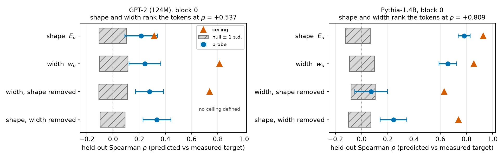

**Figure 32.** x: mean held-out Spearman $\rho$ between predicted and measured target over the 50
train/test splits, error bars $\pm 1$ standard deviation across those splits. y: the four targets, top
to bottom — the token's median edge drift $E_u$ (shape), its plateau-filtered width $w_u$, the width
with the shape ranking regressed out, and the shape with the width ranking regressed out. Circles are
the probes, hatched gray bars the 50-permutation null (mean $\pm 1$ sd), and the triangle on each row is
the ceiling $\sqrt{R}$ set by that target's own split-half reliability $R$; the bottom-left row has no
triangle because its reliability estimate is negative, so no ceiling is defined. Left: GPT-2 small
(124M), block 0, 768 embedding dimensions. Right: Pythia-1.4B, block 0, 2,048 dimensions. Each panel
title gives the rank correlation between that model's two targets.

**Pattern 41 — inside Pythia-1.4B the lookup ranks curve shape, and the width-specific part of the
ordering is not in the embedding at all.** The table reads the right-hand panel of Figure 32.

| Pythia-1.4B, block 0 | shape $E_u$ | width $w_u$ | width, shape removed | shape, width removed |
|---|---|---|---|---|
| target reliability $R$ | 0.859 | 0.734 | 0.397 | 0.546 |
| 95% interval for $R$ | [0.798, 0.901] | [0.598, 0.834] | [0.098, 0.591] | [0.310, 0.698] |
| ceiling $\sqrt{R}$ | 0.927 | 0.857 | 0.630 | 0.739 |
| held-out $\rho$ | $+0.783 \pm 0.046$ | $+0.658 \pm 0.067$ | $+0.072 \pm 0.125$ | $+0.243 \pm 0.102$ |
| $\rho$ ÷ ceiling | $+0.84$ | $+0.77$ | $+0.11$ | $+0.33$ |
| held-out $R^2$ | $+0.543$ | $+0.375$ | $-0.096$ | $+0.043$ |
| permutation $p$ | 0.020 | 0.020 | 0.255 | 0.020 |

The shape probe is the better of the two unresidualised probes — $+0.783$ against $+0.658$, ahead in 47
of the 50 shared splits, paired Wilcoxon $p = 3.4 \times 10^{-14}$ — and it is the residual probes that
settle the question. Remove the shape ranking from the width ranking and the probe falls to $+0.072$,
inside the null band and the only probe in this section that is not above chance ($p = 0.255$). Remove
the width ranking from the shape ranking and the probe holds at $+0.243$, a third of its ceiling and
above chance, beating the other residual by $+0.171$ in 45 of 50 splits ($p = 2.6 \times 10^{-11}$).

The reason this is not an artifact of residualising away everything is the reliability row. The width
residual is a real, reproducible measurement — split-half reliability 0.397 with a 95% interval of
[0.098, 0.591], meaning tokens genuinely differ in how wide their crossing is relative to what their
curve shape predicts, and that difference survives changing which anchors it is measured against. The
embedding simply does not know about it. What a token's embedding row carries into block 0 is how flat
its transitions start out; the width ranking comes along because in this model the two orderings nearly
coincide.

This qualifies pattern 10's interpretation without touching its practical claim. The lookup still ranks
measured widths at $+0.76$ and still predicts the widths of 718 pairs it never saw (patterns 10 and 12),
because for a screen what matters is that the prediction tracks the measured width. What changes is what
an auditor should expect it to resolve: among tokens whose curves have similar shape, the lookup carries
no information about which crossing is narrower, and any attempt to improve it by finding a better
readout of the embedding is aimed at information the embedding does not contain.

**Pattern 42 — GPT-2's weak lookup is not merely a shape lookup; both components survive there.** The
same table for the left-hand panel of Figure 32.

| GPT-2 (124M), block 0 | shape $E_u$ | width $w_u$ | width, shape removed | shape, width removed |
|---|---|---|---|---|
| target reliability $R$ | 0.099 | 0.661 | 0.543 | $-0.155$ |
| 95% interval for $R$ | [$-0.317$, 0.374] | [0.501, 0.777] | [0.343, 0.698] | [$-0.719$, 0.174] |
| ceiling $\sqrt{R}$ | 0.315 | 0.813 | 0.737 | not defined |
| held-out $\rho$ | $+0.216 \pm 0.125$ | $+0.244 \pm 0.122$ | $+0.280 \pm 0.107$ | $+0.335 \pm 0.106$ |
| $\rho$ ÷ ceiling | not quoted | $+0.30$ | $+0.38$ | not defined |
| held-out $R^2$ | $-0.035$ | $-0.021$ | $-0.016$ | $+0.042$ |
| permutation $p$ | 0.020 | 0.020 | 0.020 | 0.020 |

All four GPT-2 probes are above chance, and the two unresidualised ones are indistinguishable from each
other ($-0.028 \pm 0.173$ paired over the 50 shared splits, shape ahead in 26 of 50, $p = 0.40$). Both
residuals survive: the width with shape removed reaches $+0.280$, 0.38 of the ceiling its own
reliability allows and slightly above the unresidualised width probe, and the shape with width removed
reaches $+0.335$. The shape residual is the better of the two by $+0.055$ (ahead in 31 of 50 splits,
$p = 0.011$), a margin small enough that the honest summary is that GPT-2's embedding holds a little of
each. The practical consequence is the useful one: GPT-2's shortfall as a lookup (pattern 38) is not
explained away as "it is really ranking shape" — there is genuine width-specific signal in its embedding
— it is simply weak, 0.38 of what its target's reliability allows against 0.77 for Pythia's
unresidualised width.

Two of GPT-2's reliability figures are worth stating on their own. Its shape target reproduces across
anchor halves at only $R = 0.099$, with an interval of [$-0.317$, 0.374] that covers zero, so no
fraction of ceiling is quoted for it: in GPT-2, how plateau-shaped a curve is depends more on which
anchor it is measured against than on the token, where in Pythia-1.4B it is a stable token property
($R = 0.859$, interval [0.798, 0.901]). And GPT-2's shape residual returns a *negative* reliability
estimate. Since the probe nevertheless predicts that target above chance on tokens it never saw, the
target cannot be pure noise; the split-half estimate is biased downwards for residual targets, because
each half's residual is formed from two noisy half-medians. We therefore quote the raw $\rho$ there and
no ceiling.

Three limits belong with both patterns. $E$ and $w$ are computed from the same curves, so their
measurement noise is shared and removing one ranking from the other also removes part of that shared
noise — this makes the residual probes conservative, and it cannot explain why the shape residual
survives in both models while the width residual survives in only one. The width target is defined
using $E$ (only curves with $E \le 0.1$ enter it), so the two quantities are coupled by construction as
well as by the model. And this is two models at one site each, 123 tokens; the pattern that shape is the
more embedding-readable of the two properties has been checked twice, the claim that width-specific
signal is entirely absent has been checked once, in Pythia-1.4B.

### Does the transplant move the curve's shape too?

Patterns 41 and 42 are about what can be read out of a token's embedding, and they said the readable
property is curve shape. The transplant of $m_u$ (pattern 23) is the report's strongest causal result,
it operates on a vector computed from that same embedding row one block later, and it was scored on
width alone — so it is open to the reading that it too was really a shape result. Figure 33 settles
that by repeating the transplant unchanged and scoring both properties on the same curves.

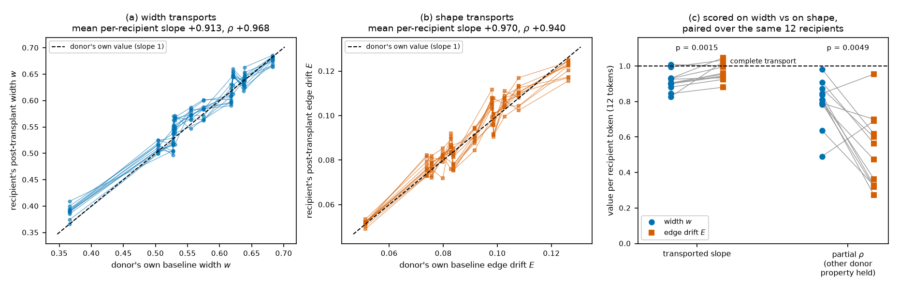

**Figure 33.** Pythia-1.4B, block 0, the 12 endpoint tokens of the original transplant, 6 anchors, one
sentence frame; 132 cross transplants. (a) x: the donor token's own unedited median width $w$; y: the
width the recipient lands on after the donor's $m_u$ is written into it. (b) the same 132 transplants
with both axes replaced by the edge drift $E = d(0.1) + (1 - d(0.9))$, the total movement of the curve
over the outer tenth of the path at each end — low for a plateau-shaped curve, 0.2 for a straight line.
In (a) and (b) each thin line joins one recipient's 11 donors and the dashed line is $y = x$, where the
donor's value arrives whole. (c) the two scorings paired over the same 12 recipients: the transported
slope (left pair) and the partial rank correlation with the donor's other property held constant (right
pair), circles = scored on width, squares = scored on edge drift, gray lines join the same recipient's
two values, dashed line at 1.0 = complete transport, $p$-values from Wilcoxon signed-rank tests on the
12 paired differences.

**Pattern 43 — the transplant moves the curve's shape at least as completely as it moves the width, so
the readout result and the causal result are not in conflict.** Both scorings of the same 132
transplants are shown in the table.

| transplanting $m_u$, scored two ways (12 recipients × 11 donors, frame 1) | width $w$ | edge drift $E$ |
|---|---|---|
| **donor dependence $\rho$ — the recipient lands where the donor was** | **$+0.968$** ($p = 5\times10^{-4}$) | **$+0.940$** ($p = 5\times10^{-4}$) |
| **transported slope** (1.0 = the donor's value arrives whole) | **$+0.913$** | **$+0.970$** |
| partial $\rho$, donor's other property held constant | $+0.796$ (min $+0.49$, $p = 5\times10^{-4}$) | $+0.517$ (min $+0.27$, $p = 5\times10^{-4}$) |
| recipient dependence $\rho$ — the untouched state predicts nothing | $-0.104$ ($p = 0.64$) | $-0.025$ ($p = 0.75$) |
| baseline reliability $R$, 3 anchors vs 3 | 0.671 [0.196, 0.871] | 0.552 [$-0.036$, 0.865] |
| self-transplant reproduces the baseline | $\rho = +1.000$ | $\rho = +1.000$ |

Panels (a) and (b) of Figure 33 look alike, and that is the result. Writing a donor's $m_u$ into a
recipient hands over the donor's curve shape as faithfully as it hands over the donor's crossing width:
the transported slope is $+0.970$ for shape against $+0.913$ for width, and shape is the more completely
transported of the two in 11 of the 12 recipients ($p = 0.0015$). The direction of that difference
matters less than its size — both are close enough to 1.0 that the donor's value effectively arrives
intact. The control behaves the same way for both: with the donor held fixed, the recipient's own
untouched state predicts neither where its width lands ($-0.104$) nor where its shape lands ($-0.025$),
so in both scorings the written vector is doing the work. Two checks confirm this run is the original
experiment and not a near-neighbour of it: the baseline widths reproduce pattern 23's to the last stored
digit (maximum difference $0.0000$), and the width control reproduces its $\rho_{\mathrm{recip}}$ of
$-0.104$ exactly.

This answers the question the previous section left open. The possibility to rule out was that the
transplant only appeared to move width because width rides along with shape; instead, both move, and the
mechanism the report has been tracking does not split into a readable half and a causal half at block 0.
The practical value of that is in what it licenses: an intervention that changes a token's $m_u$ changes
the whole curve, not one summary of it, so an auditor who found a way to edit this vector would be
changing where the model's behaviour is sensitive, not just how a width statistic scores.

The partial correlations add something the marginal statistics cannot, and they are also where the
evidence gets thinner. Across these 12 tokens baseline width and baseline shape rank at $\rho = +0.937$,
so the two columns of the table are largely two views of one ordering, and any claim that one property
is transported *specifically* has to survive holding the other constant. Both do: the donor's width
predicts the recipient's landing width at $+0.796$ with the donor's shape held fixed, and the donor's
shape predicts the recipient's landing shape at $+0.517$ with the donor's width held fixed, each above
zero in every one of the 12 recipients ($p = 5\times10^{-4}$). The first of those is worth stating
plainly, because it is the one place in this report where the width-specific part of the ordering shows
up at all: a probe on the static embedding could not recover it (pattern 41 put that probe at $+0.072$,
$p = 0.255$), yet substituting $m_u$ one block later transports it. That is the same asymmetry the
partial-transplant sweep already found in a different form — an exact substitution of this vector
succeeds where every attempt to read or steer along a fitted direction fails — and it means the
width-specific information is present in the block-0 MLP output even though no linear readout of the
embedding has recovered it. It does not mean the embedding lacks that information; a failed readout
bounds what a probe of that form can extract, not what the vector contains.

Three limits. The gap between the two partial correlations ($+0.796$ against $+0.517$, width ahead in 10
of 12 recipients, $p = 0.0049$) should not be read as "width transports more specifically than shape".
A partial correlation is attenuated by noise in the quantity being held constant and in the regressor,
and the shape baseline is the noisier of the two here: its split-half reliability is 0.552 with an
interval of [$-0.036$, 0.865] that covers zero, against 0.671 [0.196, 0.871] for width. With an interval
that wide no correction is defensible, so the firm claim is the one both columns support — each property
transports specifically — and not the ordering between them. Second, the partials rest on the small part
of the donor ranking that the two properties do not share, over 11 donors per recipient; they are a real
test, but a low-powered one. Third, this is 12 tokens, one sentence frame, one model, and the two
properties are computed from the same curves, so their measurement noise is shared.

### Can the width-specific component be read anywhere early in the network?

Patterns 41 and 43 together leave one question open, and it is the question an auditor would ask next.
The part of the width ordering that curve shape does not explain is not recoverable from a token's
embedding row ($+0.072$, permutation $p = 0.255$), yet writing $m_u$ into another token transports that
same component at $+0.796$. Nothing is contradictory there — a linear probe failing bounds the probe,
not the vector — but it does not say whether the component becomes *readable* one block later, in the
vector that demonstrably carries it. If it did, this report's practical output would improve: the free
lookup ranks curve shape, and a one-forward-pass readout that ranks the crossing width specifically
would be the screen an auditor actually wants. Figure 34 refits the four probes from $m_u$ and from the
post-block-0 residual state $x_u$, with the embedding probes refit alongside as a reference.

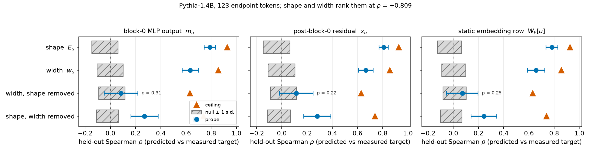

**Figure 34.** Pythia-1.4B, the same 123 endpoint tokens, four targets per site, 50 shared train/test
splits. Each panel is one feature set the ridge probe reads: (left) the block-0 MLP output $m_u$,
(middle) the post-block-0 residual state $x_u$, (right) the static embedding row $W_E[u]$ as the
reference. y: the four targets — the shape target $E_u$ (median edge drift), the width target $w_u$
(median plateau-filtered envelope width), and each with the other's across-token rank regressed out.
x: mean held-out Spearman $\rho$ between predicted and measured target over the 50 splits, with the bar
its standard deviation across splits. The hatched strip is the 50-permutation null ($\pm 1$ s.d. around
its mean), the caret is the ceiling $\sqrt{R}$ that the target's own measurement noise allows, and a
printed $p$ marks the probes whose permutation $p$-value exceeds 0.05. Higher is better; the ceilings
are properties of the targets, so they are identical in all three panels.

**Pattern 44 — the width-specific component is not linearly readable at any of the three early sites,
including the vector that transports it.** The three panels of Figure 34 are nearly the same picture.

| held-out $\rho$, 123 tokens, 50 shared splits | $m_u$ | $x_u$ | $W_E[u]$ | ceiling |
|---|---|---|---|---|
| shape $E_u$ | $+0.789$ | $+0.808$ | $+0.783$ | 0.927 |
| width $w_u$ | $+0.634$ | $+0.666$ | $+0.658$ | 0.857 |
| **width, shape removed** | **$+0.084$** ($p = 0.31$) | **$+0.115$** ($p = 0.22$) | **$+0.072$** ($p = 0.26$) | 0.630 |
| shape, width removed | $+0.271$ | $+0.281$ | $+0.243$ | 0.739 |

Every probe except the three in the bold row is above chance at the smallest attainable permutation
$p$-value of 0.020. The bold row is the result: at all three sites the width-with-shape-removed target
sits inside its own permutation null, reaching at most 0.18 of a ceiling of 0.630 — and that ceiling is
not the problem, since the target is reliably measured ($R = 0.397$, interval [0.098, 0.591]). Moving
from the embedding row through the first MLP and on to the full post-block-0 state changes no probe by
more than $+0.042$. The refit embedding probes reproduce pattern 41's numbers to three decimals
($+0.783$, $+0.658$, $+0.072$, $+0.243$), which is what makes the three panels comparable rather than
merely similar.

The differences that are statistically detectable are small and go one way. Read split by split, $x_u$
beats the embedding row on three of the four targets — $+0.025$ on shape (80% of 50 splits,
$p = 5\times10^{-7}$), $+0.042$ on the width residual (80%, $p = 1\times10^{-5}$) and $+0.038$ on the
shape residual (82%, $p = 7\times10^{-7}$) — while $m_u$ alone is $0.024$ *behind* it on the width
target (26%, $p = 6\times10^{-4}$). So block 0 does add a little linearly readable information about
these curves, and it arrives in the residual stream rather than in the MLP's contribution by itself.
The addition is far too small to change any conclusion: $+0.042$ on a probe whose value is $+0.072$
still leaves it inside the null.

This is the sharper version of the report's central negative, and it is worth stating in full because
it is unusual to have both halves measured on the same quantity. The width-specific component of the
token ordering is **carried** by $m_u$ — substituting one token's $m_u$ for another's moves the
recipient's crossing width to the donor's at $+0.796$ with shape held constant (pattern 43) — and it is
**not readable** from that same vector by a ridge probe that has 2,048 dimensions and 80 training
tokens to work with. Transport and linear decodability come apart here. Pattern 24 had already found
the three sites equivalent when the probe was fitted to the raw anchor width; splitting that target
into its shape and width-specific parts shows the equivalence holds component by component, and that
the component the transplant moves is the one no site makes explicit.

The practical consequence is negative and useful: there is no cheap upgrade from the free lookup to a
width-specific screen by moving the probe deeper. A single forward pass through block 0 buys $+0.042$
on the component that matters, which is not a screen. What the free lookup ranks is curve shape, and
for now that is what a practitioner gets.

Three limits bound the claim. First, "not readable" means "not by this probe": ridge regression on
2,048 features from 80 training tokens. A different probe family, a nonlinear readout, or a training
set several times larger could still recover the component, and the permutation test says only that
this probe does not. Second, the two components are entangled in the data — shape and width rank the
123 tokens at $+0.809$ — so the width residual is built from the smaller part of a strong correlation
and is the least reliable of the four targets ($R = 0.397$ against 0.859 for shape). Third, these are
the three earliest sites only; the next section takes the same probes down the network.

### Does the component become explicit deeper in the network?

Pattern 44 bounds three representations that all sit within one block of the input, and the report's own
layer sweep says that is the wrong end of the network to look for a sharp crossing. Re-measuring the
same 123 tokens at blocks 6, 12 and 18 (pattern 9) keeps the token ordering intact — block 18 still
ranks the tokens at $\rho = +0.72$ against block 0 — while the median width climbs from 0.553 to 0.800
and the spread across tokens collapses fivefold. The crossing is being sharpened over that depth, so if
any representation states the crossing width explicitly rather than merely carrying it, the middle of
the network is where to expect it. That question has a practical edge: a mid-network probe would still
be one forward pass, so an auditor could afford it, and unlike the free lookup it would rank the
quantity they actually care about. Figure 35 refits the four probes from the residual state at those
three depths, with block 0 refit alongside.

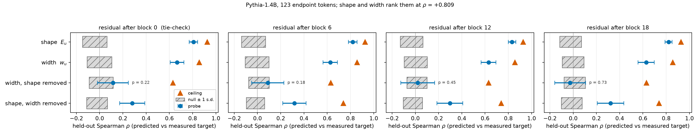

**Figure 35.** Pythia-1.4B, the same 123 endpoint tokens, four targets per depth, the same 50 shared
train/test splits used throughout. Each panel is the residual-stream state at the final token position
after one block: (left to right) blocks 0, 6, 12 and 18. y: the four targets — the shape target $E_u$
(median edge drift), the width target $w_u$ (median plateau-filtered envelope width), and each with the
other's across-token rank regressed out. x: mean held-out Spearman $\rho$ between predicted and measured
target over the 50 splits, the bar its standard deviation across splits. The hatched strip is the
50-permutation null ($\pm 1$ s.d. around its mean), the caret is the ceiling $\sqrt{R}$ that the
target's own measurement noise allows, and a printed $p$ marks probes whose permutation $p$-value
exceeds 0.05. Higher is better; the ceilings belong to the targets, so they are identical across panels.

**Pattern 45 — the width-specific component is at chance at every depth, and what movement there is
runs the wrong way.** Depth does not rescue the probe.

| held-out $\rho$, 123 tokens, 50 shared splits | block 0 | block 6 | block 12 | block 18 | ceiling |
|---|---|---|---|---|---|
| shape $E_u$ | $+0.808$ | $+0.820$ | $+0.832$ | $+0.821$ | 0.927 |
| width $w_u$ | $+0.666$ | $+0.627$ | $+0.630$ | $+0.628$ | 0.857 |
| **width, shape removed** | **$+0.115$** ($p = 0.22$) | **$+0.089$** ($p = 0.18$) | **$+0.021$** ($p = 0.45$) | **$-0.026$** ($p = 0.73$) | 0.630 |
| shape, width removed | $+0.281$ | $+0.318$ | $+0.297$ | $+0.322$ | 0.739 |

The bold row never leaves its permutation null: the best of the four depths reaches 0.18 of a ceiling of
0.630, and by block 18 the probe is at zero. Its trajectory is monotone downward, and read split by
split against block 0 the decline is not noise — $-0.026$ at block 6 (higher in 40% of 50 splits,
Wilcoxon $p = 0.034$), $-0.094$ at block 12 (16%, $p = 2\times10^{-9}$) and $-0.141$ at block 18 (10%,
$p = 3\times10^{-12}$). The honest reading of that trend is narrow, because both ends of it are inside
the null: it says the small amount the probe had at block 0 is gone by block 18, not that the network
destroys information. What it rules out is the possibility this experiment was run to test. Going deeper
was the one remaining way the component might have become linearly explicit, and it moves away from
readable rather than towards it.

The rest of the table is close to flat, which is what makes the bold row interpretable. The shape target
is read at $+0.81$ to $+0.83$ everywhere and peaks at block 12 ($+0.024$ over block 0, higher in 80% of
splits, $p = 2\times10^{-5}$); the shape residual is likewise slightly better deeper ($+0.037$ at block
6, $+0.041$ at block 18). The raw width target loses a little with depth ($-0.036$ to $-0.040$, 20–30%
of splits), which is worth noticing: the deeper residual stream is not a degraded representation in
general — it reads shape slightly better — it is specifically no better for the width, and no better at
all for the part of the width that shape does not explain. The block-0 panel reproduces pattern 44's
four numbers to four decimals ($+0.808$, $+0.666$, $+0.115$, $+0.281$, each differing by $0.0000$),
reached here from `hidden_states` rather than from the forward hook pattern 44 used. That tie makes the
four panels a comparison of depth rather than of runs, and independently confirms the two routes to the
post-block-0 state agree.

The claim this licenses is the strong form of the report's central negative. Across four residual-stream
depths spanning three-quarters of Pythia-1.4B, plus the static embedding row and the block-0 MLP output
(pattern 44), no site makes the width-specific component available to a ridge readout — while the same
component is transported intact by writing one of those very vectors into another token (pattern 43,
$+0.796$ with shape held constant). Six representations now sit on the "carries it but does not state
it" side of that line, and none on the other. For an auditor the consequence is concrete: there is no
depth at which a one-forward-pass linear probe becomes the width screen. What is cheaply readable
anywhere in this model is how plateau-shaped a token's curves are, and measuring the widths remains the
only route to the width itself.

The same three limits apply, with the third now narrowed. "Not readable" still means "not by ridge on
2,048 features from 80 training tokens", and this experiment tests four more feature sets rather than a
second probe family, so it widens the negative across sites without touching that caveat — which is why
the next experiment below changes the readout instead of the site. Shape and width remain entangled at
$+0.809$ across the 123 tokens, making the width residual the least reliable of the four targets
($R = 0.397$ against 0.859 for shape). And these are residual-stream states at four depths, at one token
position, in one model: an MLP's internal hidden layer, an attention output, or another model could
still hold the component in a form a linear readout would find.

### Is the component unreadable, or only unreadable by a linear probe?

Everything above tests six representations with one kind of readout. Ridge regression predicts the
target from a weighted sum of the 2,048 numbers in a feature vector, so it will report chance for any
quantity the representation encodes in a form no weighted sum captures — a distance from a region, a
product of two coordinates, a threshold. That caveat has ridden along with every statement of this
negative, and it is the last one that can be tested without new measurements: the features are already
built, so two more readouts cost only CPU. Figure 36 puts RBF kernel ridge and a $k$-nearest-neighbour
readout beside ridge on all six feature sets, with the same targets, ceilings, 50 splits and 50
permutations.

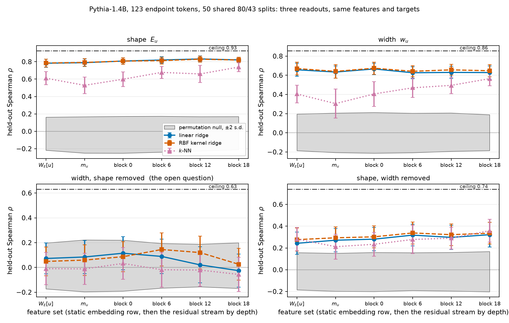

**Figure 36.** Pythia-1.4B, the same 123 endpoint tokens and the same 50 shared 80/43 train/test splits
used throughout. Each panel is one target: shape $E_u$ (median edge drift), width $w_u$ (median
plateau-filtered envelope width), and each with the other's across-token rank regressed out. x: the six
feature sets in depth order — the static embedding row $W_E[u]$, the block-0 MLP output $m_u$, and the
residual stream after blocks 0, 6, 12 and 18. y: mean held-out Spearman $\rho$ between predicted and
measured target over the 50 splits, error bars $\pm 1$ standard deviation across splits. The three
lines are the readouts: linear ridge (solid, circles), RBF kernel ridge (dashed, squares) and $k$-NN
(dotted, triangles). The hatched gray strip is the permutation null ($\pm 2$ standard deviations around
its mean, taking whichever of the three readouts gives the widest band at that site), and the dash-dot
line is the ceiling $\sqrt{R}$ that the target's own measurement noise allows. Higher is better. The
bottom-left panel is the open question; the other three are controls that say whether the readouts work
at all.

**Pattern 46 — no readout finds the width-specific component, and the two nonlinear ones work fine on
everything else.** The negative does not depend on linearity.

| width with shape removed, held-out $\rho$ (ceiling 0.630) | $W_E[u]$ | $m_u$ | block 0 | block 6 | block 12 | block 18 |
|---|---|---|---|---|---|---|
| linear ridge | $+0.072$ ($p = 0.25$) | $+0.084$ ($p = 0.31$) | $+0.115$ ($p = 0.22$) | $+0.089$ ($p = 0.18$) | $+0.021$ ($p = 0.45$) | $-0.026$ ($p = 0.73$) |
| RBF kernel ridge | $+0.049$ ($p = 0.33$) | $+0.059$ ($p = 0.31$) | $+0.087$ ($p = 0.24$) | $+0.145$ ($p = 0.12$) | $+0.120$ ($p = 0.18$) | $+0.026$ ($p = 0.41$) |
| $k$-NN | $-0.009$ ($p = 0.63$) | $-0.012$ ($p = 0.71$) | $+0.033$ ($p = 0.39$) | $-0.018$ ($p = 0.61$) | $-0.021$ ($p = 0.71$) | $-0.056$ ($p = 0.76$) |

All 18 cells sit inside their own permutation null. The closest any readout comes is kernel ridge at
block 6, $+0.145$ with permutation $p = 0.118$ — 0.23 of a ceiling of 0.630, and a result that would
arise by chance about one time in eight. Kernel ridge is a strict generalisation of ridge, so this is
the informative half of the test: given the freedom to bend the fit, cross-validation on the training
half declines to use it. At every site the tuner picks the largest penalty in the grid
($\lambda = 10^5$) for this target, meaning the best training-half fit available to it is nearly a
constant. There is one real pattern inside the null — kernel ridge beats ridge on this target at the
three deeper sites ($+0.056$ at block 6, $+0.099$ at block 12 in 88% of splits, $+0.052$ at block 18)
and loses to it at the three early ones ($-0.024$ to $-0.028$). Both readouts are indistinguishable
from chance at every one of those sites, so this says something about which readout degrades more
gracefully, not about where the component lives.

The other three targets are what license reading the bold table as a fact about the representation
rather than about broken code. Kernel ridge tracks ridge on shape to within $0.008$ everywhere
($+0.785$ against $+0.783$ at the embedding, $+0.819$ against $+0.821$ at block 18) and is slightly but
consistently better on the raw width ($+0.670$ against $+0.658$ at the embedding, $+0.657$ against
$+0.630$ at block 12 in 88% of splits) — a nonlinear readout does buy a little on a target that is
genuinely there. $k$-NN is the weaker learner and behaves like one: it recovers shape at $+0.53$ to
$+0.74$ and width at $+0.31$ to $+0.57$, far above its null (permutation $p = 0.02$ in every case) but
$0.06$ to $0.33$ below ridge. Its accuracy also climbs steadily with depth on both targets, which is a
small positive result of its own: the deeper residual stream arranges these 123 tokens so that
neighbouring states have similar curve shapes, and averaging the 5 to 39 nearest training tokens
suffices to rank them.

Three readout families, six representations, 18 cells, none above chance. The report's central negative
can now be stated without the qualifier it has carried since pattern 41: within Pythia-1.4B, the part
of a token's crossing width that its curve shape does not already explain is not recoverable from any of
these six activation vectors by a linear probe, by a tuned kernel method, or by nearest neighbours, at
80 training tokens. The same component is transported intact when one of those very vectors is written
into another token (pattern 43, $+0.796$ with shape held constant), so "carried but not stated" is now a
statement about three readout families rather than one.

Two limits survive and one narrows. The sample-size caveat is unchanged and is now the binding one: 80
training tokens is little for any readout, and $k$-NN's shortfall on the easy targets is a direct
demonstration that this sample size costs a flexible learner accuracy. Shape and width remain entangled
at $+0.809$ across the 123 tokens, so the width residual stays the least reliable of the four targets
($R = 0.397$). What no longer applies is "not readable means not readable by ridge": that was the
motivation for this experiment, and it is answered.

### Would more training tokens have found it?

Every probe in this report was fitted on 80 of the 123 tokens. A probe can also miss a real signal for
the dull reason that 80 examples in 2,048 dimensions are not many, and one fit cannot distinguish that
from the signal being absent. A learning curve can: a signal a probe is merely short of data for gets
better as the training set grows. Figure 37 refits ridge and kernel ridge at four training sizes — 30,
50, 80 and 100 tokens, leaving 93, 73, 43 and 23 held out — on the same six feature sets, with the
splits and permutation nulls redrawn at each size. The three control targets say what "getting better"
looks like on these same features.

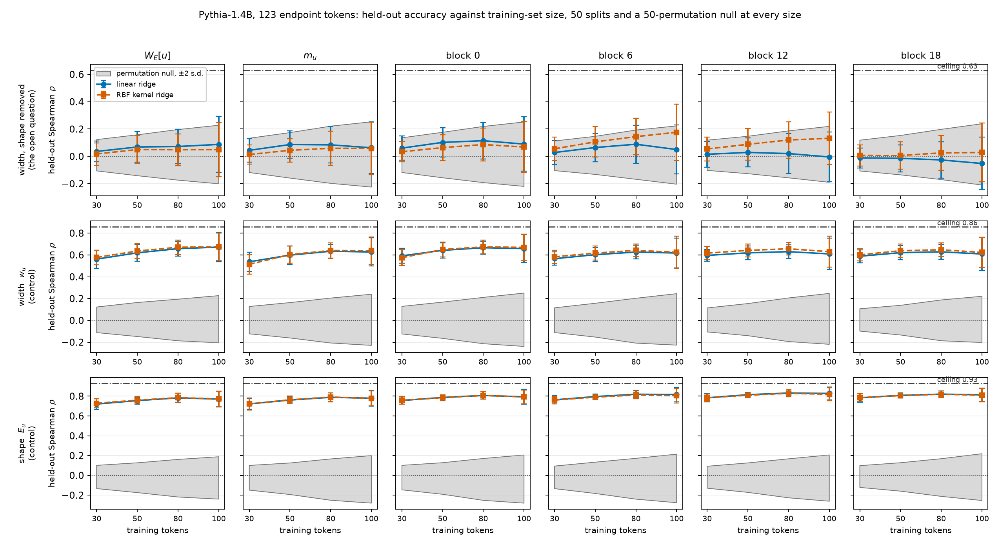

**Figure 37.** Pythia-1.4B, the same 123 endpoint tokens. Columns are the six feature sets in depth
order — the static embedding row $W_E[u]$, the block-0 MLP output $m_u$, and the residual stream after
blocks 0, 6, 12 and 18. Rows are targets: width with shape removed (top, the open question), raw width
$w_u$ (middle, control) and shape $E_u$ (bottom, control), where $E_u$ is the token's median edge drift
and $w_u$ its median plateau-filtered envelope width. x: number of training tokens, 30 to 100 of 123.
y: mean held-out Spearman $\rho$ between predicted and measured target over 50 random splits at that
size, error bars $\pm 1$ standard deviation across splits. Lines are the readouts: linear ridge (solid,
circles) and RBF kernel ridge (dashed, squares). The hatched gray strip is the permutation null at that
size ($\pm 2$ standard deviations around its mean, whichever readout gives the wider band), and it
widens to the right because raising the training size shrinks the test half. The dash-dot line is the
ceiling $\sqrt{R}$ that the target's own measurement noise allows.

**Pattern 47 — 30 more training tokens are worth about $+0.05$ on a target that is there, and nothing
on the width residual.** All 48 cells stay inside their nulls.

| width with shape removed, held-out $\rho$ (ceiling 0.630) | $W_E[u]$ | $m_u$ | block 0 | block 6 | block 12 | block 18 |
|---|---|---|---|---|---|---|
| linear ridge, 30 tokens | $+0.036$ ($p = 0.29$) | $+0.044$ ($p = 0.31$) | $+0.061$ ($p = 0.25$) | $+0.028$ ($p = 0.29$) | $+0.016$ ($p = 0.39$) | $-0.011$ ($p = 0.67$) |
| linear ridge, 50 | $+0.069$ ($p = 0.24$) | $+0.087$ ($p = 0.24$) | $+0.102$ ($p = 0.16$) | $+0.065$ ($p = 0.20$) | $+0.029$ ($p = 0.37$) | $-0.014$ ($p = 0.67$) |
| linear ridge, 80 | $+0.072$ ($p = 0.25$) | $+0.084$ ($p = 0.31$) | $+0.115$ ($p = 0.22$) | $+0.089$ ($p = 0.18$) | $+0.021$ ($p = 0.45$) | $-0.026$ ($p = 0.73$) |
| linear ridge, 100 | $+0.088$ ($p = 0.27$) | $+0.063$ ($p = 0.35$) | $+0.090$ ($p = 0.37$) | $+0.050$ ($p = 0.37$) | $-0.004$ ($p = 0.61$) | $-0.052$ ($p = 0.78$) |
| kernel ridge, 30 | $+0.017$ ($p = 0.37$) | $+0.014$ ($p = 0.37$) | $+0.034$ ($p = 0.29$) | $+0.055$ ($p = 0.18$) | $+0.054$ ($p = 0.16$) | $+0.007$ ($p = 0.51$) |
| kernel ridge, 50 | $+0.050$ ($p = 0.27$) | $+0.045$ ($p = 0.27$) | $+0.064$ ($p = 0.20$) | $+0.106$ ($p = 0.10$) | $+0.088$ ($p = 0.14$) | $+0.006$ ($p = 0.47$) |
| kernel ridge, 80 | $+0.049$ ($p = 0.33$) | $+0.059$ ($p = 0.31$) | $+0.087$ ($p = 0.24$) | $+0.145$ ($p = 0.12$) | $+0.120$ ($p = 0.18$) | $+0.026$ ($p = 0.41$) |
| kernel ridge, 100 | $+0.050$ ($p = 0.41$) | $+0.059$ ($p = 0.37$) | $+0.068$ ($p = 0.35$) | $+0.176$ ($p = 0.08$) | $+0.132$ ($p = 0.16$) | $+0.028$ ($p = 0.41$) |

The controls are what make the top row of Figure 37 a measurement rather than a shrug. Averaged over the
six feature sets, ridge on the shape target goes $+0.755 \to +0.787 \to +0.809$ as the training set goes
30 → 50 → 80, and on raw width $+0.573 \to +0.617 \to +0.640$; kernel ridge moves the same way
($+0.756 \to +0.807$ and $+0.578 \to +0.655$). So on these very features, 50 extra training tokens are
worth roughly $+0.05$ to $+0.07$ in held-out $\rho$ when the target is present. The width residual over
the same range goes $+0.029 \to +0.059$ (ridge) and $+0.030 \to +0.081$ (kernel ridge) — movement in the
same direction, but a fifth of the size, and its null moves with it.

That last point is the one the curve exists to settle, so it is worth reading off the figure rather than
the table. Adding training tokens costs test tokens, one for one, out of a fixed pool of 123. The
permutation null's $\pm 2$ standard-deviation band on the width residual therefore widens from $0.114$
at 93 test tokens to $0.145$, $0.183$ and $0.217$ at 73, 43 and 23 — the flaring gray strips in the top
row of Figure 37. Every cell is compared with the null at *its own* size for that reason, and on that
comparison the answer is flat: at each of the four sizes, 0 of the 12 site-by-readout cells clear their
null's mean by 2 standard deviations, and no permutation $p$ falls below 0.078. The best cell moves from
$+0.061$ at 30 tokens to $+0.176$ at 100, and gets no closer to significance because the yardstick grows
just as fast.

Two secondary readings. The controls peak at 80 training tokens and dip slightly at 100 (shape
$+0.809 \to +0.800$, width $+0.640 \to +0.632$): with 123 tokens in total, the last 20 training tokens
cost more precision on a 23-token test half than they buy, so 80/43 was a reasonable operating point and
not a limitation this pool can escape. And the tie-check is exact — at 80 training tokens all 24 ridge
probes reproduce patterns 44 and 45 to four decimals, including all 50 permutation draws of each
(largest absolute difference $0.0000$), so the four sizes differ in nothing but sample size.

One cell is left open, and it is worth naming precisely because the rest of the picture is flat. Kernel
ridge at block 6 is the only cell that rises at every step — $+0.055$, $+0.106$, $+0.145$, $+0.176$,
reaching 0.28 of the ceiling with permutation $p = 0.078$ at 100 training tokens. Three of the 12 cells
rise monotonically, and with 48 cells in the experiment a handful below $p = 0.10$ is what chance
produces, so this is a candidate and not a finding. It is also a testable one, and the curve says what
the test costs. The null's spread on this target follows $0.572/\sqrt{n_{\text{test}}}$ across all 48
cells, so a true correlation of $+0.15$ would sit two null standard deviations clear given a test half of
about 58 tokens — a pool of roughly 150 tokens measured the same way, against the 123 that exist. The
decisive experiment is therefore not a better probe but about 60 more measured tokens.

The sample-size caveat is not removed by this; it is priced. Within the range this pool allows, more
training tokens raise the readable targets and leave the width-specific component inside its null, so
the report's negative is not an artifact of fitting 80 tokens — while a genuine effect of size $+0.15$
would still be invisible here, which is exactly why the next test needs more tokens rather than more
readouts.

### Buying the tokens: the open cell on a pool of 250

The experiment above ends by naming its own successor. It leaves one cell unresolved — kernel ridge at
block 6 — and it states the price of resolving it: about 60 more measured tokens. So we measured 127,
by the identical protocol, and refit that one cell. Figure 38 puts all five configurations side by side.
The three panels of its top row are the three targets; the two panels below them ask whether the new
tokens are comparable to the old ones, and the last whether the null still behaves as the 123-token run
predicted.

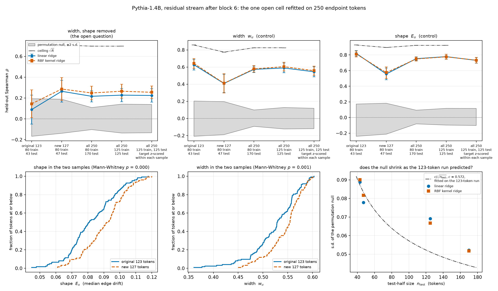

**Figure 38.** Pythia-1.4B, residual stream after block 6, 2,048 features. **Top row**, one panel per
target: width with shape removed (left, the open question), raw width $w_u$ (middle, control) and shape
$E_u$ (right, control). x: the five fitting configurations, labelled with the sample, the number of
training tokens and the number of held-out tokens; the fifth is the within-sample control, in which each
sample's residual target is z-scored inside that sample before the two are pooled. y: mean held-out
Spearman $\rho$ over 50 random splits, error bars $\pm 1$ standard deviation across splits. Lines are the
readouts: linear ridge (solid, circles) and RBF kernel ridge (dashed, squares). The hatched gray band is
the permutation null at that configuration ($\pm 2$ standard deviations around its mean, whichever
readout gives the wider band); it narrows to the right because the test half grows. The dash-dot line
with tick markers is the ceiling $\sqrt{R}$ that the target's own measurement noise allows, which is
sample-specific and so is not drawn for the z-scored control. **Bottom row, left and middle:** the
cumulative distribution of shape $E_u$ and width $w_u$ over the original 123 tokens (solid) and the 127
new ones (dashed) — x is the target value, y the fraction of tokens at or below it. **Bottom right:** the
standard deviation of the permutation null (y) against the number of held-out tokens (x), for every
configuration and both readouts, with the $0.572/\sqrt{n_{\text{test}}}$ rule fitted on the 123-token run
drawn as the dash-dot curve.

**Pattern 48 — with 250 measured tokens the width-specific component is readable from block 6, by both
readouts.** The result that stood through patterns 44–47 reverses.

| width with shape removed, held-out $\rho$ | original 123, 80/43 | new 127, 80/47 | all 250, 80/170 | all 250, 125/125 | within-sample control |
|---|---|---|---|---|---|
| linear ridge | $+0.089$ | $+0.264$ | $+0.216$ | $+0.228$ | $+0.224$ |
| RBF kernel ridge | $+0.145$ | $+0.286$ | $+0.248$ | $+0.265$ | $+0.255$ |
| null mean $+2$ s.d. (the bar to clear) | $+0.193$ | $+0.188$ | $+0.104$ | $+0.131$ | $+0.129$ |
| ceiling $\sqrt{R}$ | $0.630$ | $0.708$ | $0.698$ | $0.698$ | — |

Read across the top row of the table: the original 123 tokens put kernel ridge at $+0.145$ against a bar
of $+0.193$ — inside the null, which is the published result, reproduced here to four decimals. Every
other column clears its bar. On the full 250 tokens kernel ridge reaches $+0.265$ against a bar of
$+0.131$, which is $0.38$ of the ceiling that this target's measurement noise allows, and linear ridge
clears the bar too ($+0.228$). The permutation $p$ is $0.02$ in every one of those cells, the smallest
value 50 shuffles can produce.

**The result does not depend on pooling two samples.** Two checks establish that, and they matter more
than the pooled number itself. First, the 127 new tokens on their own — a sample disjoint from every
probe fitted anywhere in this report, at 80 training tokens and 47 held out, so with essentially the
statistical power the original 123 had — give $+0.286$ (kernel ridge) and $+0.264$ (ridge) against a bar
of $+0.188$. The effect is present in a sample that has never been fitted before, at the sample size
where the original negative was measured. Second, the within-sample control: forming each sample's
residual target inside that sample and z-scoring it there makes the two groups identical in mean, so no
probe can gain by recognising which sample a token came from. It changes almost nothing ($+0.265 \to
+0.255$ for kernel ridge, $+0.228 \to +0.224$ for ridge, last column of the table and rightmost point in
the top-left panel of Figure 38). What the probe has learned is a ranking of tokens, not a group label.

**Why 123 tokens missed it.** The bar the original sample had to clear was $+0.193$, and the effect
measured on 250 tokens is about $+0.25$ — so the old configuration sat right at the edge of being able to
see an effect of this size, and its own estimate came in below the bar at $+0.145$. Both the limited
power and an unlucky sample estimate contribute, and this experiment does not separate them: what it
settles is that the component *is* readable, which the disjoint 127-token sample shows without any help
from the original 123. The controls confirm the fits themselves are healthy at the new size — shape is
recovered at $+0.776$ and raw width at $+0.604$ on the 250-token pool (kernel ridge, 125 training
tokens), both far above their nulls, and the residual target is also better measured in the larger pool
(reliability $R = 0.487$, interval $[0.317, 0.607]$, against $0.397$, $[0.098, 0.591]$ for the original
123).

Two honest qualifications attach to this. The first is that the new tokens are not a copy of the old
ones. They sit lower in the context-probability ranking, and they measure differently: median shape
$0.092$ against $0.081$ and median width $0.554$ against $0.529$ (bottom-left and bottom-middle panels of
Figure 38; Mann-Whitney $p < 0.001$ and $p = 0.001$), and $0.652$ of their curves pass the plateau filter
against $0.779$. The 250-token pool is therefore a broader sample of tokens than the original 123, and
the claim this experiment supports is that the component is readable across that broader pool — not that
it would have been readable inside the narrow original sample, where it still measures $+0.145$.

The second concerns the pricing rule that motivated the experiment. It held where it was fitted and
drifted where it was extrapolated: at 43 and 47 held-out tokens the null's spread matched
$0.572/\sqrt{n_{\text{test}}}$ to within 3%, but at 125 and 170 held-out tokens the real null was 18–35%
wider than predicted (bottom-right panel of Figure 38). The extrapolation was optimistic, so the actual
bar on 250 tokens is $\pm 0.13$ rather than the $\pm 0.09$ it implied. The effect clears the real bar
comfortably; the rule should be read as an order-of-magnitude guide to how many tokens an experiment
needs, not as a precise null width at sizes it was never fitted on.

### Candidate hypotheses

This section is interpretation, ranked by how well each fits the evidence above.

**H1 — Transition width is a per-token trait that each token carries into any pairing.** This is the
hypothesis the evidence supports best. It predicts additivity (pattern 4), the abundance of matched
contrasts at fixed corpus JSD (pattern 2), and — the part it was tested on and passed — that a token's
width measured against strangers predicts its behaviour inside the bank (patterns 6 and 7). *What it
does not explain:* the reproducible pair-specific remainder (pattern 19), which is roughly a third of the
explainable variance, and the anchor-set dependence of $\hat w_u$ (pattern 8): the trait is real but
each measurement of it also carries a component specific to the anchors used. *Alternative reading:*
$\hat w_u$ is largely "how far this token is from a typical token" — a similarity statistic in
disguise. The swap partly adjudicates this: a pure similarity statistic would not survive replacing the
anchors with a disjoint set from a different word class, and here both replacements still recover the
fitted effect at $\rho \approx 0.6$. *Cheapest remaining experiment:* measure $\hat w_u$ with a
single anchor repeated across many frames rather than many anchors in three frames. If the trait is a
token property, the frame-averaged single-anchor measurement should track $a_u$ about as well as the
six-anchor one; if it is a relation, it should not.

**H2 — The trait is how sharply the model reads the token in context, not the token string.** Corpus
frequency ($\rho = -0.33$), continuation entropy ($-0.24$), in-frame surprisal ($+0.26$), output entropy
($-0.30$) and endpoint logit norm ($-0.23$) all point the same way: tokens the model reads confidently
and predicts sharply from pull transitions narrow. Every one of those correlations is weak, so this is
a component, not the mechanism. *Alternative reading:* all five are proxies for a function-word /
content-word split, and the operative variable is which of the model's output modes the token belongs
to. *Cheapest discriminating experiment:* hold the token fixed and change the frame so that its
surprisal moves by several bits (a frame where ` kind` is expected against one where it is not), then
re-measure $\hat w_u$. A within-token manipulation separates the trait from the string.

**H3 — The pair-specific remainder is endpoint geometry at the interpolation site.** Adding $\cos_0$
and $d_0$ raises held-out $R^2$ from 0.648 to 0.723 and cuts the reproducible residual agreement from
0.67 to 0.54, so the arrangement of the two endpoint states carries pair-specific information beyond
both corpus JSD and the model's output separation. It is not a path-length normalisation artifact
(pattern 19). *Alternative reading:* $\cos_0$ and $d_0$ may be re-expressing corpus JSD in geometric
clothing, though they add signal on top of `J`, which argues against a pure proxy. *Cheapest
discriminating experiment:* hold the token pair fixed and change only the path — interpolate through a
third state, or use linear interpolation — and see whether `w` tracks the geometry of the new path.

The basin picture we set out to test — a per-token region of output insensitivity whose size sets the
width — is **not** supported in its simple form (pattern 18), and we have dropped it.

### Recommended next experiment

The screen generalises across tokens (pattern 7), across the vocabulary (pattern 11), across contexts
(pattern 12) and down to a free lookup (pattern 10). Three mechanistic stories have now failed — the
basin of output insensitivity (pattern 18), the probe direction as a lever (pattern 13), and any single
embedding direction as a lever (pattern 14). What replaced them is the compression result, and pattern
15 has now pinned down what drives it: at a fixed displacement, an edit the model barely feels keeps
the token ordering ($\rho = +0.94$ at 0.049 bits) and an edit of the same size that it feels strongly
does not ($\rho = +0.08$ at 0.402 bits). The trait is behavioural, so the search should move from
directions in embedding space to **which part of the token's output behaviour carries it**.

Patterns 16 and 17 closed that line of attack. The damage a large edit does is tail-weighted — 0.389
of the divergence on successors holding 0.71 of the mass — and it stays tail-weighted even when the
edit is built to do the opposite: constructed directions predicted to split $S$ 0.86 against 0.18 both
land at $S \approx 0.38$ once they are grown to the 0.4 bits at which width responds, and both erase
the token ordering. Embedding edits cannot hold the top-mass share apart at a behaviourally meaningful
size, so no further variant of this experiment will separate the two arms.

Pattern 21 moved the intervention out of embedding space and into the computation, and returned a
single candidate: of 102 attention heads and MLPs in blocks 0–5, only the block-0 MLP destroys the
per-token ordering. It also returned a single confound, because that component is the only one whose
removal the model registers at all (0.451 bits against $\le 0.007$ for every other), and 0.4 bits is
precisely where pattern 15 showed any disturbance flattens the ordering.

Pattern 22 addressed that confound with a control matched token by token: the MLP dose reaches a given
loss of ordering at about 1.3× less output movement than a random perturbation of the same residual
stream, and moves each token's width roughly twice as far as that token's own matched control. The
margin is real but modest, and it is smaller than a mean-matched control implied. The mechanism now has
a location, and every intervention so far has been destructive.

Patterns 23–25 then read that component instead of breaking it. The transplant is decisive on
sufficiency: one vector, $m_u$, carries the whole trait between tokens (slope $+0.913$ on the donor,
nothing left in the recipient's remaining state), and it is context-free, so a token's width is settled
by the first MLP before the sentence around it is read. The probe is a null — the number is no more
linearly readable in $m_u$ than in the embedding row it comes from — and the rank sweep is a second
null: no low-dimensional part of $m_u$ carries the trait, since the top 64 principal components (79% of
the across-token variance) deliver 30% of the transfer at 95% of the output movement. The trait is
transported by that vector as a whole rather than made explicit in any part of it, which is why every
steering attempt in this report failed while an exact substitution succeeds.

Patterns 26–28 then left this model, and answered the question that mattered for the deliverable: the
ranking of tokens by width is shared, to within measurement noise, by three networks of different depth
and width, the 1.4B lookup predicts their measured widths as well as it predicts 1.4B's own, and the
block-0 MLP is the single early carrier in each. They also cost the mechanism a claim: the 1.4B
dose–response's ordering-specific margin over a movement-matched control is absent at 410M, so what
survives across models is the site plus the transplant, not the per-bit specificity.

Patterns 29–31 then asked where the trait comes from, and returned neither of the two answers the
experiment was designed to separate. It is not a late refinement of the model's successor
distributions: the ordering is 87% complete, relative to measurement noise, after 512 of 143,000 steps
and does not change again. Nor is it a corpus statistic in disguise: unigram frequency is the whole
story only up to `step128`, and in the finished model frequency and successor entropy together explain
0.375 of the ranking's rank variance, with the early-to-final agreement surviving their removal at
$+0.6$–$+0.8$. What the lookup reads is fixed in the first few hundred optimizer steps and is more than
a count table.

Pattern 32 then left the Pythia family, and cost the report its broadest claim. The same 123 token
strings measured in GPT-2 small rank at $\rho = -0.22$ with Pythia-1.4B, where two Pythia sizes agree
at $+0.88$; the free lookup transfers at $-0.20$; and even the frequency signal is gone. Before any of that, the measurement itself fails there —
88.8% of GPT-2's block-0 curves are non-monotone, and its per-token width has a split-half reliability
of 0.32 against Pythia's 0.89, at every site we tried. The ordering is a property of a token *as
trained in a particular corpus*, and the screen is per-model.

Patterns 35 and 36 then asked which of two failures each negative is, and split them. GPT-2's curves are
plateau-shaped ($E = 0.087$ at block 0, against Pythia-1.4B's 0.081 and a straight line's 0.2), and
scoring only its plateau-shaped curves doubles its reliability to 0.661 without moving its agreement
with Pythia ($-0.185$ against a ceiling of 0.77). GPT-2 has its own reproducible ordering of these 123
strings. Pythia-160M is the opposite case — the least plateau-shaped configuration measured
($E = 0.183$), which is also where the trait is absent.

Patterns 37 and 38 then asked what GPT-2's own ordering is made of, and answered the question pattern 36
opened. Refitted against the reliable target, GPT-2's embedding probe reaches $+0.244$ of a ceiling of
0.813 — above a properly estimated chance level ($p = 0.02$ against 50 shuffled draws, where the
earlier single-draw control had been the largest of 50) but well short of Pythia's 0.81 of ceiling, with
a held-out $R^2$ of $-0.021$, and only $0.067$ ahead of a probe built from two corpus statistics. The
free lookup is a Pythia result; a new model can carry a reproducible width ordering that its static
embedding does not hold.

Patterns 39 and 40 then ran the test that tied patterns 23 and 29 together, and returned a bounded
positive. Writing the finished model's $m_u$ into `step128` leaves that network's widths agreeing with
the final ordering at $+0.33$ against $-0.03$ for an identity-shuffled write of the same vectors, so the
vector does carry the trait across training time; but no transplant beats leaving `step128` alone
($+0.443$), and the two checkpoints' $m_u$ share almost no geometry (same-token cosine $+0.18$,
arrangement agreement $+0.03$). The mechanism is a vector plus the weights that read it, and that closes
the causal line of attack inside Pythia: with the coordinate systems this different, no cross-checkpoint
edit will do better, and every within-model intervention has been run.

Patterns 41 and 42 then ran that test and changed what the lookup is understood to be reading. Fitting
the same probe to a token's edge drift and to its plateau-filtered width, on identical features and
identical splits, shows that inside Pythia-1.4B the embedding ranks curve *shape*: the shape probe beats
the width probe ($+0.783$ against $+0.658$, 47 of 50 splits), and once shape is removed the width
residual falls to chance ($+0.072$, $p = 0.255$) even though that residual is a reliably measured
quantity ($R = 0.397$, interval [0.098, 0.591]). The reverse residual survives at $+0.243$. GPT-2 is the
mixed case — both residuals stay above chance there — so its weak lookup is not merely a shape lookup.

Pattern 43 then took that reading back to the causal result, because the transplant of $m_u$ had also
been scored on width alone and could have been a shape result in disguise. It is not: the same 132
transplants score $+0.970$ on shape and $+0.913$ on width, and with the donor's other property held
constant each still transports ($+0.796$ for width, $+0.517$ for shape). Writing this vector hands over
the whole curve. The width-specific part of the ordering, which no probe on the embedding could recover,
does travel with $m_u$.

Pattern 44 then asked whether the component pattern 43 transports can also be read, and returned the
report's sharpest negative. Refitting those same four probes from the block-0 MLP output $m_u$ and from
the post-block-0 residual state $x_u$ — same tokens, same targets, same 50 splits — leaves the
width-with-shape-removed target inside its permutation null at every site ($+0.084$, $p = 0.31$ from
$m_u$; $+0.115$, $p = 0.22$ from $x_u$; $+0.072$, $p = 0.26$ from the embedding row, reproduced
exactly). No probe changes by more than $+0.042$ across the three sites. The vector that transports the
width-specific component at $+0.796$ does not make it linearly readable, so transport and decodability
come apart, and there is no cheap upgrade from the free shape lookup to a width-specific screen by
moving the probe one block deeper.

Pattern 45 then removed the obvious escape route. If the component is decided early but only stated
later, a mid-network probe should find it, and the layer sweep says the crossing is sharpened over
exactly that stretch of depth. It is not stated later: read from the residual stream at blocks 6, 12 and
18 the width-with-shape-removed target gives $+0.089$, $+0.021$ and $-0.026$ (permutation $p = 0.18$,
0.45, 0.73), a monotone decline away from readability, while the shape target holds at $+0.82$ to
$+0.83$ throughout. Six representations spanning the embedding row to three-quarters of the way through
the network now carry the component without exposing it.

Pattern 46 then removed the last qualifier that applied to all of them. Ridge is one readout, and a
representation can hold a quantity no weighted sum of its coordinates recovers, so the same six feature
sets were refit with RBF kernel ridge and with $k$-nearest neighbours, everything else held fixed. All
18 site-by-readout cells for the width-with-shape-removed target stay inside their permutation nulls,
the best being kernel ridge at block 6 ($+0.145$, $p = 0.118$), while the same two readouts recover
shape and width at every site — kernel ridge within $0.008$ of ridge on shape and slightly above it on
width, $k$-NN well above chance on both. Three readout families, six representations, no readout finds
the component.

Pattern 47 then priced the last caveat those cells shared: each was fitted on 80 of the 123 tokens.
Refitting ridge and kernel ridge at 30, 50, 80 and 100 training tokens keeps all 48 cells inside their
nulls — 0 of 12 cells clear their null by 2 standard deviations at any size, and the smallest
permutation $p$ anywhere is 0.078 — while the same fits on the same features gain $+0.05$ (shape) and
$+0.06$ (width) between 30 and 80 tokens. The negative is not an artifact of the sample size in the
range this pool allows.

Pattern 48 then ran the experiment pattern 47 had named, and reversed the negative. Measuring 127
further tokens by the identical protocol and refitting that one open cell lifts the width-specific
component clear of its null: $+0.265$ on the 250-token pool against a bar of $+0.131$, $0.38$ of the
ceiling, with linear ridge clearing it as well. The 127 new tokens on their own reach $+0.286$ at the
original sample size, so the effect appears in a sample no earlier probe touched, and z-scoring the
target inside each sample before pooling leaves it at $+0.255$, so it is not an artifact of joining two
samples. What patterns 44–47 established was a bound on 123 measured tokens, not on the representation.

**The single most informative next experiment repeats pattern 48 at the other five sites.** Every
readability result in this report except pattern 48 was measured on 123 tokens, and the one site now
known to be underpowered at that size was tested at all six. So the depth profile of patterns 44 and 45
— embedding row, block-0 MLP output $m_u$, post-block-0 residual state, and blocks 12 and 18 — should be
refit on the same 250 tokens, with the same 125/125 splits, permutation null and within-sample control.
The experiment is cheap, because the measurement is already paid for: the interpolation curves exist,
and the five feature sets are single-token forward passes for the 127 new tokens, a few minutes of GPU
time. What it decides is where the component becomes explicit, and that has a direct practical
consequence. If the static embedding row also clears its null at 250 tokens, the free vocabulary-wide
lookup can be upgraded from a shape table to a width-specific table with no forward pass at all, which is
the cheapest useful form this screen could take. If instead readability appears only from block 6, the
component is built rather than looked up, the screen costs one partial forward pass, and the depth at
which the profile turns becomes a fact about where the model computes the crossing width — a
substantially more informative result than the flat negative it replaces. Either way the interpretive
claim in pattern 44, that transport and decodability come apart, needs re-testing at the larger sample
size, since its evidence was the block-0 sites at 123 tokens.

---

## Conclusion

Corpus successor JSD predicts transition width on average but explains only 0.149 of the held-out
variance, against 0.934 that is reproducible. Most of the gap is a **per-token additive effect**: one
number per token raises held-out $R^2$ to 0.578, and that per-token term outperforms every pair-level
predictor we tested, including the model's own endpoint output difference. Width is mostly something
each token brings with it, and it is measurable — a token's width against six anchor tokens it was
never paired with predicts its fitted effect at $\rho = 0.70$, and two such measured numbers do the
work of 123 fitted ones. Used as a screen on 40 tokens the analysis had never seen, it predicts the
width of their 718 pairs at $R^2 = 0.397$ with nothing fitted on them. That makes the per-token screen
the practical unit for finding sharp transitions: score tokens once, and the pairs follow.

The sharpening itself happens below the interpolation site: repeating the per-token measurement at
blocks 6, 12 and 18 keeps the token ranking ($\rho = +0.72$ with block 0 even at block 18) while the
median width climbs to 0.800 and the spread across tokens collapses fivefold. Which tokens are narrow
is decided early; how narrow anything gets is decided by the remaining depth.

How early is now quantified: the ranking is already present in the static embedding. A ridge probe on
the embedding row predicts a held-out token's measured width at $\rho = +0.76$, beating an
embedding-norm baseline of $+0.60$, and a screen built from embeddings alone — no forward pass at any
point — predicts the widths of 718 unseen pairs at $R^2 = 0.213$ and $\rho = +0.53$. Measuring the
widths remains the more accurate route (0.397), so the practical reading is a two-tier screen: a free
vocabulary-wide table for triage, and 18 interpolation curves per token when a sharper number is
needed. The table is not confined to the tokens the analysis was built on: on 32 tokens drawn from
outside the curated pool — subword fragments, punctuation, numerals, capitalised names and rarer words
— predicted and measured widths still correlate at $\rho = +0.60$, and the widths measured there cover
the pool's own range. Nor is it confined to the context it was built in: measured in a mid-sentence
continuation, an interrogative, a colon-list and a code prefix, the token ranking holds at $\rho$ from
$+0.84$ down to $+0.50$, against $+0.82$ for two frames of the original shape. The level of `w` is a
different matter — its median moves from 0.53 to 0.71 across those contexts — so the ordering travels
and the calibration does not. What the free table encodes is best described as curve shape rather than
crossing width: the same probe predicts a token's edge drift better than its width, and predicts nothing
of the width once shape is removed, so the free tier ranks tokens by how flat their transitions start
and inherits the width ordering from the two being nearly the same in this model. The part of the width
that shape does not explain is not lost, though — it is simply more expensive to read. Measuring 250
tokens instead of 123 and probing the residual stream after block 6 recovers it at $\rho = +0.265$
against a permutation bar of $+0.131$, $0.38$ of the ceiling its measurement noise allows, with the same
effect appearing at $+0.286$ on 127 tokens that no earlier probe had seen. Four earlier experiments had
called this component unreadable; all four were run on 123 tokens, and that is what they were measuring.

Three things qualify this. The measurement is anchor-dependent: two disjoint anchor sets rank the
tokens at $\rho = 0.46$ while each still recovers the fitted effect at $\rho \approx 0.6$, so the trait
is real but the anchor set is part of the method. A pair-specific remainder survives the additive model
and is partly endpoint geometry. And the mechanism we set out to test — a basin of output insensitivity around each
token whose size sets the width — does not hold up: radius along random directions is unrelated to the
token effect, and along anchor directions it points the wrong way. What each token carries is the shape
of its transition. Editing a token's embedding
along the probe's own direction, by a step the probe says should change width by 0.05, moves the
measured width by 0.003 with no consistent sign — but that edit shifts the model's output by only
0.0001 bits, so it says nothing on its own. Re-running the edit with the step grown until the model's
output moves 0.05, 0.1 or 0.2 bits changes the picture and gives the direction its clearest statement
about the trait's nature: width then moves by 0.10–0.15, fifty times more, yet a random direction
matched on output movement moves it just as much (0.123 against 0.127, $p = 0.47$), and **all 144 edits
widen** although the probe predicts opposite signs for opposite steps. What the edits do is compress the
trait: whatever a token's width was, after a 0.2-bit edit it sits near 0.68, with the spread across
tokens falling from 0.083 to 0.02, and the tokens that started narrowest moving furthest. A ladder of
displacements, with the quietest and loudest of 24 directions rebuilt at each rung from their measured
effect on the token's output, then separates the two things that grew together in that edit. The level
follows the displacement — every direction raises the mean width — but the *ordering* follows the
behaviour: at a displacement of norm 1.8 the quiet direction moves the output by 0.049 bits and keeps
the ordering at $\rho = +0.94$, while the loud direction at the identical norm moves it by 0.402 bits
and drops to $\rho = +0.08$. Narrow transitions are fragile, but they are a behavioural property, not a
positional one: an edit the model does not feel does not take them away. The deflationary explanation,
that narrow transitions are just fixed-size transitions on long paths, is refuted.

Leaving embedding space finally locates the trait in the computation. Mean-ablating each of the 102
attention heads and MLPs in blocks 0–5 one at a time leaves the token ordering intact in 101 cases
(median $\rho = +0.99$, every head $\ge +0.97$), which narrows the search from 102 candidate components
to one: the block-0 MLP, whose removal collapses the across-token spread from 0.084 to 0.018 and leaves
$\rho = -0.10$. Because that is also the only early component the model noticeably feels (0.451 bits
against $\le 0.007$ for every other), the sweep alone could not separate a carrier from a merely loud
component, so we softened the ablation into a dose and gave every dose a random perturbation of the
same residual stream matched bit-for-bit on output movement, **separately for each token** — a control
matched only on the 12-token average mis-doses individual tokens by factors of 0.08 to 8.5, which the
ordering claim cannot tolerate. At every dose in the survivable band up to 0.03 bits, and for all three
control seeds, the MLP arm loses more rank agreement than its matched control (at 0.014 bits,
$\rho = +0.64$ against $+0.91$); it crosses $\rho = 0.6$ at 0.031 bits against the control's 0.041, a
margin of 1.3× rather than the 2.8× a mean-matched control would have claimed. The sharper statement is
per token: the dose moves each token's width about twice as far as that token's own matched control
(0.074 against 0.036 width units at 0.0068 bits, Wilcoxon $p = 0.001$), and does so even after each
arm's mean shift is subtracted ($p = 0.034$ and $0.016$ at the two doses where the ordering is still
alive). The across-token *spread*, meanwhile, collapses along the same trajectory in both arms until
the ordering is already gone. Level and ordering are separate channels: any disturbance flattens the
level, and the ordering is what singles out the block-0 MLP. This is the direction's one positive
mechanistic localisation — modest in size, and it agrees with the layer sweep, where the ordering is
fixed at the input and the earliest nonlinear stage is where it is realised.

Reading that component instead of breaking it finishes the mechanism. Overwriting a token's block-0 MLP
output $m_u$ with another token's, and touching nothing else, transports the width almost completely:
the recipient's new width follows the donor at $\rho = +0.968$ with slope $+0.913$, while the part of
the state left alone contributes nothing ($\rho = -0.104$), and a self-transplant returns the baseline
exactly. Because Pythia's blocks are parallel-residual, that vector is a function of the token's
embedding row alone — its cosine across three sentence frames is 1.0000 — so a token's transition width
is fixed before any context is read, which is precisely why a static-embedding lookup can predict it.
A probe from $m_u$, though, is no more accurate than one from the embedding row ($\rho = +0.748$ vs
$+0.764$), and no low-dimensional part of the vector carries the trait: transplanting its top 64
principal components, which hold 79% of the across-token variance, gives 30% of the transfer while
causing 95% of the output movement, and the discarded tail gives none. The first MLP transports the
width as a whole vector without making any part of it more explicit — which is why an exact
substitution moves the trait and every steering direction tried here did not.

Scoring the same transplants on the curve's shape as well as its width shows that the write hands over
the whole curve rather than one summary of it: the transported slope is $+0.970$ on edge drift against
$+0.913$ on width, and each property still transports with the donor's other property held constant
($+0.796$ for width, $+0.517$ for shape, both above zero in all 12 recipients). This matters for how the
lookup result below should be read. A probe on the static embedding cannot recover the width ordering
once shape is removed from it, yet substituting $m_u$ transports exactly that component — so the
width-specific information is present in the early computation, and what the probe result bounds is the
reach of a linear readout.

Following that up settles how far the readout gets, at six sites spanning most of the network. Fitting
the same four probes to the block-0 MLP output, to the full post-block-0 residual state, and to the
residual stream after blocks 6, 12 and 18 — the same tokens, targets and splits as the embedding probes
throughout — leaves the width-with-shape-removed target inside its permutation null everywhere:
$+0.084$ and $+0.115$ at the two block-0 sites, $+0.072$ at the embedding row, and $+0.089$, $+0.021$
and $-0.026$ at blocks 6, 12 and 18. Depth is the informative part of that list. The natural rescue for
a component that is decided early would be that the network states it later, and the layer sweep puts
the sharpening of the crossing over exactly those blocks — but the probe drifts monotonically towards
zero as it goes deeper, and each step down is a real drop against block 0 read split by split
($-0.141$ at block 18, higher in 10% of 50 splits), while the shape target is read just as well at
depth ($+0.82$ to $+0.83$). So the component that an exact substitution of $m_u$ transports at $+0.796$
is not made linearly explicit by the computation that produces it, nor by the three-quarters of the
network that follows. The practical consequence is a closed door with no obvious way around it: the
free lookup ranks how flat a token's transitions start, and no single forward pass, stopped at any
depth we tested, turns it into a lookup that ranks the crossing width.

Four model sizes settle what that vector belongs to. Pythia-410M, 1B and 1.4B rank the 123 tokens
identically once each model's own measurement reliability is accounted for ($\rho^{*} = +0.98$ to
$+1.00$), while the absolute widths sharpen with scale, and the lookup built on 1.4B's embedding matrix
predicts the other models' measured widths as accurately as it predicts 1.4B's own. The screen is
therefore a property of tokens in this family rather than a calibration of one network — with a floor:
Pythia-160M ranks tokens differently, well beyond what its noisier measurement explains, so the trait
is acquired between 160M and 410M. The same models reproduce the localisation to the block-0 MLP, and
they also bound it: with a per-token movement-matched control the ordering-specific margin measured at
1.4B is absent at 410M, so the durable evidence for that component is the transplant rather than the
damage.

Seventeen checkpoints of one of those models say when the vector acquires its content, and the answer
is: almost immediately. A randomly initialised Pythia-410M has no width ordering at all (spread across
tokens sd $= 0.003$, agreement with the trained ranking $\rho = +0.015$), and neither does it at
`step16`; by `step512` the ordering is 0.87 of what the measurement's noise ceiling allows, by
`step2000` it is 0.94, and across the remaining 98.6% of training it does not move. The level does —
median width falls from 0.833 at `step256` to 0.595 at `step64000` — so training first decides which
tokens are narrow and then spends the rest of its budget sharpening everything. What it decides in the
first hundred steps is only frequency: at `step128` the ranking correlates with log unigram count at
$-0.72$, more strongly than the finished model does, and is otherwise empty, with no agreement with the
final ranking once frequency and successor entropy are removed. The component that survives to the end
appears from `step256` onward and is not those statistics: they account for 0.375 of the final
ranking's rank variance, while the early-to-final agreement holds at $+0.6$–$+0.8$ with both partialled
out. The free lookup therefore reads a learned quantity — but one learned in the first 0.4% of
training, and a mature model's lookup detects it in a young checkpoint ($\rho = +0.54$ at `step128`)
several hundred steps before that checkpoint's own embedding matrix makes it linearly readable.

Those two findings — one vector moves the width, and the ordering appears in the first few hundred
steps — invite the conclusion that $m_u$ is what training installs, so we tested it by writing
`step143000`'s $m_u$ into the `step128` network and changing nothing else. The transfer is real and
small. `step128` then ranks with the finished model's ordering at $+0.33$ as measured and $+0.19$ with
vector lengths matched, against $-0.03$ and $-0.14$ when the same vectors are written with the token
identities shuffled (gaps of $+0.357$ and $+0.324$, 95% bootstrap intervals clear of zero); in the
length-matched case the recipient's own ordering is gone ($-0.009$), so the surviving agreement can
only have arrived in the vectors. It is nowhere near installation: untouched, `step128` already ranks
at $+0.443$, and every transplant leaves it worse. The geometry explains the ceiling — the same token's
$m_u$ at the two checkpoints has a cosine of $+0.18$, the tokens' arrangement relative to each other
agrees at $+0.03$, and even the ordering of vector lengths does not survive — so training rewrites this
component's output space and the transplanted vector lands in a code the receiving network never
learned to read. What the trait travels in is that vector together with the weights that consume it,
which is why substitution works between two tokens of one network and only partly between two moments
of one training run.

The limit of all of that is the training corpus. The same 123 strings measured in GPT-2 small, whose
vocabulary contains every one of them, produce a ranking that correlates with Pythia-1.4B's at
$\rho = -0.22$ where two Pythia sizes agree at $+0.88$, and the free lookup and the refitted probe fail
there too. That is not GPT-2 lacking transitions to measure: its curves leave their endpoints as late
as Pythia-1.4B's (edge drift 0.087 against 0.081, on a scale where a straight line is 0.2), and scoring
only its plateau-shaped curves doubles its measurement reliability to 0.66 while leaving its
disagreement with Pythia at $-0.19$ against a ceiling of 0.77. GPT-2 has a reproducible width ordering
of its own; it is simply a different one. The 160M floor is the other kind of failure — its curves are
the closest to straight ramps of any configuration measured (edge drift 0.183), so at that size there
is little plateau structure for a width to order. The practical consequence for an auditor is that both
cheap checks should be run before trusting the screen on a new model: the edge-drift distribution to
see whether its transitions have plateaus, and the split-half reliability of the per-token width,
computed on the plateau-shaped curves, to see whether they can be measured.

Even a model that passes both checks may not support the free version of the screen. Refitted against
GPT-2's reliable ordering, its embedding probe recovers 0.30 of the ceiling that target allows, against
0.81 inside Pythia-1.4B, with a held-out $R^2$ of $-0.021$ and a margin of only $+0.067$ over a probe
made from two statistics an auditor can count from a corpus. It is above chance — but establishing that
took 50 shuffled draws in place of the single draw this report had used as a control everywhere, since
one draw of 123 permuted targets is worth about $\pm 0.2$ of apparent skill. So the vocabulary-wide
lookup is a Pythia result: a new model can carry a reproducible width ordering that its static embedding
does not hold, and the widths there have to be measured.

**Limitations.** The main analysis is one model, one hook point (after block 0) and one checkpoint; the
cross-model section adds three further sizes but only for the per-token measurement, the embedding
probe and the block-level ablation, not for the pair bank or the screens. The pair bank, the
fitted token effects and both screens rest on three sentence frames of a single shape, so
frame-specific effects there are common to both sides of the transfer test; the frame-shape control
addresses this for the per-token measurement (the ranking survives four other context shapes) but not
for the pair-level results, which were never re-run in a new context.
Anchor widths are measured against six anchors at a time and the value depends on which six, so
$\hat w_u$ should be read as "width against this anchor set", not as an absolute constant. The forward
screen covers 40 new tokens in the same three frames and the same model; it says nothing yet about
other models or contexts, and the layer sweep covers five sites in this one model. The pair bank, the
anchors and the probe's training tokens all come from `dir18`'s pool of common single-token alphabetic
words; the vocabulary-wide test extends the check to fragments, punctuation, numerals and capitalised
names, but with only eight tokens per class, so the per-class correlations there are indicative rather
than established. At block 18 the
interquartile range of $\hat w_u$ is 0.02, so the correlations reported there are attenuated by the
small dynamic range and should not be read as evidence that the trait has disappeared. Both
interventions are small: 16 and 12 tokens with one random direction each, so the compression result
(patterns 14 and 15) rests on 12 tokens and its correlations — including the ordering after the edit —
carry wide intervals. The ladder's quiet direction is the quietest of 24 random draws, not the quietest
direction that exists, so it bounds how much of the trait a behaviour-preserving edit can keep from
below; and at norm 1.8 it still moves the output by 0.049 bits, so "quiet" there means 8× quieter than
the loud direction, not silent. `w` describes movement along the $z_u \to z_v$ direction only, so a pair whose logits
move sideways would be scored as flat. The ablation sweep and the dose–response share those 12 tokens
and one frame; the dose–response uses three random-control seeds, but above 0.1 bits both arms sit at
noise (SE($\rho$) $\approx 0.3$ at $n = 12$), so the localisation rests on the five rungs below
0.03 bits, where its margin over an exactly matched control is 1.3× in bits and about 2× in per-token
width change, and it should be replicated with more tokens before it is treated as settled. The
matched control also equalises each token's *total* output movement, not the direction of that
movement, so it bounds a size effect rather than every alternative to a carrier. The transplant covers
the same 12 tokens in one frame, and it is a large edit — a median 0.738 bits of output movement, with
the hybrid state about three-quarters of the way from the recipient to the donor — so it establishes
that the width-relevant content of the block-0 state is in the MLP's contribution, not that the trait
occupies a small or isolated part of that vector. The rank sweep that shows it does not is itself
limited by construction: a truncated $m$ is a vector no token produces, so its failure to transfer is
evidence about a distributed code only in so far as off-manifold states are informative. The four
models compared in patterns 26–28 share a tokenizer and a training corpus, so that comparison tests
portability across networks, not across token inventories or data; the matched-control rerun there
covers one model (410M), the same 12 tokens and one frame, and its null is a null at $n = 12$ rather
than a demonstration that the arms are identical. The checkpoint sweep inherits that same restriction
and adds one of its own: it is a single model's training run, so "the ordering is fixed by `step512`"
is a statement about this seed and this schedule, not a law. Its corpus statistics are `dir18`'s
sampled counts rather than the exact Pile token statistics Pythia trained on, and only two of them, so
$R^2_{\mathrm{corpus}} = 0.375$ bounds what *these* statistics explain, not what any model-free
statistic could. The early checkpoints are also the noisiest to measure — `step32`'s reliability is
0.241 — so the disattenuated agreements below `step128` carry wide intervals, and the refitted probe
there trains on 80 tokens with sd $\pm 0.10$. The edge-drift cut $E \le 0.1$ is a judgement call too —
half the straight-line value — and the filtered widths are medians over whichever of a token's 18
curves survive it, so different tokens are scored against slightly different anchor and frame subsets;
the reliability it reports (0.661) is a reliability of that filtered measurement, not of the full
protocol. Every "not readable" statement in this report except pattern 48's is a statement about 123
measured tokens, and pattern 48 shows what that restriction was worth: the one site refit on 250 tokens
went from inside its null to $+0.265$ against a bar of $+0.131$. The five sites of patterns 44 and 45
that have not been refit at the larger size — the embedding row, the block-0 MLP output, the
post-block-0 residual state, and blocks 12 and 18 — therefore carry an open question rather than a
negative result, and the interpretive claim built on them, that transport and decodability come apart,
is weaker than it was when written. Pattern 48's own positive result has a matching limit in the other
direction: it is established on a 250-token pool that is broader than the original 123 — lower in
context probability, with more of its curves failing the plateau filter — and within the original 123
the same probe still measures $+0.145$, inside that sample's null. The comparison of edge drift across models is six configurations at one checkpoint each, so
"plateau structure sharpens with scale" describes three Pythia sizes, not a scaling law, and the
association between a model's ramp-like curves and its missing width ordering is a correspondence
between two measurements, with no intervention behind it. The
0.2-bit movement gate is a judgement call: it keeps 929 of
1,000 pairs, and the headline correlation is reported both with and without it.
