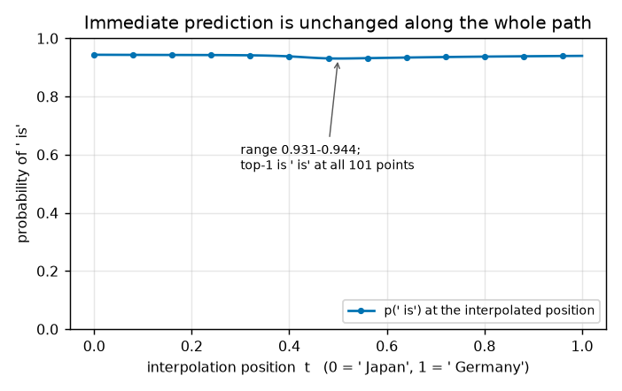

# Does an activation plateau hold information the model has not used yet?

## Summary

**The research question.** When you change a language model's input continuously, its internal
representation often does *not* change continuously: it sits still over a wide stretch of the change,
then swings across quickly. That flat-then-swing behaviour is called an **activation plateau**. This
report asks one narrow question about it: can a smooth interpolation between two input tokens produce
a plateau in a prediction the model makes *later*, at a point where the model's *current* next-token
prediction is essentially identical at both ends of the interpolation?

Why this matters for safety. Interpretability tools increasingly try to read off what a model is
"about to do" from its current activations. If plateaus organize only the token being emitted right
now, they say little about the model's further intentions. If a plateau can exist in information the
model has not yet used — information invisible in the immediate output — then the current
representation carries a discrete, auditable commitment about the future, and reading it out is a
meaningful thing to attempt.

**The answer, for one designed example: yes.** We interpolate the input embedding of ` Japan` into
that of ` Germany` inside `The capital of France is Paris. The capital of X is`. At both ends the
model predicts the same next token, ` is`, with almost the same probability, and it keeps predicting
` is` at all 101 interpolation positions (Figure 1). But the prediction one token later — the capital
city — holds ` Tokyo` across the first 40% of the path, switches within a few steps near the middle,
and holds ` Berlin` for the rest (Figures 2 and 3). The switch occupies 28% of the interpolation
(`w = 0.28`) against 80% for a linear response, and the model's actual top-1 output flips at
`t = 0.49`. This is conclusion 1 of the three pre-registered outcomes: **delayed plateau**.

## Methods

### Data & Model

Pretrained **GPT-2 Large** (774M parameters, 36 transformer blocks), evaluation mode, float32, greedy
readout with no sampling. No training or fine-tuning. There is no dataset: the experiment is one
hand-designed prompt, run at 101 evenly spaced interpolation positions `t` from 0 to 1.

The prompt supplies a fact the model must retrieve one token after the token we manipulate:

```text
prefix P    : "The capital of France is Paris. The capital of"
endpoint A  : " Japan"        endpoint B : " Germany"
shared successor S : " is"
expected after A + S : " Tokyo"        expected after B + S : " Berlin"
```

The first sentence (`The capital of France is Paris.`) is there to fix the format, so the model
continues with a capital city rather than an arbitrary continuation. All five of ` Japan`,
` Germany`, ` is`, ` Tokyo`, ` Berlin` are single GPT-2 tokens, and appending them does not
retokenize the prefix (both verified in code). The manipulated token occupies position 10.

**Hook point.** At each `t` we run the single sequence `P + [interpolated embedding] + " is"`. The
interpolated vector replaces the *input embedding* at position 10, before transformer block 0, so it
passes through the whole network; positional embeddings and all other tokens are untouched. From that
one forward pass we take two readouts:

- **immediate logits** — at the interpolated position itself, which predict ` is`;
- **delayed logits** — at the final ` is` position, which predict the capital city.

The delayed position never holds a copy of the manipulated embedding, so whatever it knows about the
interpolation must arrive through attention from position 10.

### Metrics

Each metric below answers one question, in the order the Results use them.

**Interpolation path.** We need a path between the two token embeddings that keeps vector length in
the range the model actually sees. Averaging the two vectors shrinks the norm in the middle of the
path, which would create an artificial "nothing here" region that could be mistaken for a plateau. We
therefore use the norm-corrected spherical interpolation (SLERP) of Matthew Shinkle's
activation-plateau experiment: interpolate the *direction* along the shortest arc of the unit sphere,
and interpolate the *length* linearly. With $e_A, e_B$ the two token embeddings,
$u = e_A/\lVert e_A \rVert$, $v = e_B/\lVert e_B \rVert$ and $\Omega = \arccos(u \cdot v)$ the angle
between them:

```math
e(t) = \big[(1-t)\lVert e_A\rVert + t\lVert e_B\rVert\big]\;
       \frac{\sin\!\big((1-t)\Omega\big)\, u + \sin\!\big(t\Omega\big)\, v}{\sin \Omega},
\qquad t \in \{0, 0.01, \dots, 1\}.
```

Here $\Omega = 1.115$ rad ($\cos = 0.44$) and the norms are 1.67 and 1.61, so the two embeddings are
far from parallel and the path is genuinely curved. At $t=0$ and $t=1$ this reproduces the original
embeddings exactly, so the sweep endpoints are the clean endpoint runs.

**Endpoint validity, measured by Jensen–Shannon divergence.** The whole design rests on a
precondition: the two endpoints must agree on the *immediate* next token and disagree on the
*delayed* one. Checking only the top-1 token would hide how close or far the full distributions are,
so we also quantify the distance between two probability distributions with the **Jensen–Shannon
divergence** (JSD), reported in bits. JSD is symmetric and bounded: 0 means the two distributions are
identical, 1 bit means they are effectively disjoint. With $m$ the average of the two distributions
and KL the Kullback–Leibler divergence:

```math
\mathrm{JSD}(p \Vert q) = \tfrac{1}{2}\mathrm{KL}(p \Vert m) + \tfrac{1}{2}\mathrm{KL}(q \Vert m),
\qquad m = \tfrac{1}{2}(p+q).
```

The endpoint-validation subsection reports the two JSD values; they establish that the example is
usable at all.

**Immediate stability.** For the delayed result to be interesting, the immediate prediction must not
move. We report the top-1 token at the interpolated position and the probability of ` is` there, at
every `t`. Figure 1 plots the probability.

**Relative logit distance.** To ask *where along the interpolation* the delayed output moves, we need
a quantity that is 0 at one endpoint, 1 at the other, and insensitive to the overall size of the
logit change — otherwise a readout with a small absolute swing would look flat for uninteresting
reasons. With $z(t)$ the delayed logit vector at position `t`, and $z_A = z(0)$, $z_B = z(1)$:

```math
d(t) = \frac{\lVert z(t) - z_A\rVert_2}{\lVert z(t) - z_A\rVert_2 + \lVert z(t) - z_B\rVert_2}.
```

Read it as "what fraction of the way from A to B the delayed output has travelled". Figure 2 plots
it. We do not compute this for the immediate readout: its two endpoints are nearly identical, so
normalising by a near-zero gap would amplify noise into a meaningless curve.

**Transition width.** The plateau claim is about *shape*, so we summarise the curve by how much of
the interpolation the crossing occupies. With $t_q$ the first interpolation position at which
$d(t) \ge q$:

```math
w = t_{0.9} - t_{0.1}.
```

Small `w` means flat regions at both ends and a fast swing between them, which is what "plateau"
means here. We also report the midpoint $t_{0.5}$, which says *where* the swing happens. The plan set
`w < 0.5` in advance as the threshold for calling the result a plateau.

**Endpoint separation.** Because `d(t)` is scale-free, it would report a dramatic-looking transition
even for a negligible change. We therefore also report the absolute size of the gap being normalised,
$\lVert z_A - z_B \rVert_2$, so the curve in Figure 2 can be read against how much signal is actually
there.

**Behavioural flip.** Logit geometry can move without changing what the model does. We therefore
track the top-1 token at the delayed readout and the probabilities of ` Tokyo` and ` Berlin` across
`t`, and record the position where the top-1 changes. Figure 3 plots this.

### Baselines

**Linear reference.** A model whose output moved uniformly with its input would trace $d(t) = t$,
giving

```math
w_{\mathrm{lin}} = t_{0.9} - t_{0.1} = 0.9 - 0.1 = 0.8 .
```

This is the "no plateau" null shape. It is the dotted line in Figure 2 and the number every measured
width is compared against.

**Endpoint predictions as the validity baseline.** The four clean endpoint runs (with no
interpolation) fix what the sweep must reproduce at `t = 0` and `t = 1`. If any of them had failed —
if the two endpoints had not agreed on ` is`, or had not diverged to ` Tokyo` and ` Berlin` — the
pre-registered plan called for stopping with conclusion 3, invalid example, and no prompt editing to
rescue it.

## Results

### The example is valid: identical now, different one token later

All four endpoint checks pass. After ` Japan` the top-1 next token is ` is` with probability 0.944;
after ` Germany` it is ` is` with 0.940. Once the shared ` is` is appended, the top-1 tokens are
` Tokyo` (0.928) and ` Berlin` (0.848). The runner-ups are sensible too — ` Kyoto` 0.025 and ` Osaka`
0.019 in the Japan branch, ` Munich` 0.067 and ` Frankfurt` 0.031 in the Germany branch — so the
model is doing capital-city retrieval, not landing on one lucky token.

The two JSD values make the size of the effect concrete: the immediate endpoint distributions differ
by **0.0014 bits**, the delayed ones by **0.9945 bits**, a factor of 690. A JSD near 1 bit is close to
the maximum, meaning the two delayed distributions put their mass on essentially disjoint tokens. The
precondition for the experiment therefore holds strongly: at the moment of the manipulation the two
contexts are indistinguishable in the model's output, and one token later they are as different as
they could be.

### The immediate prediction does not move

Across all 101 interpolation positions, the top-1 token at the interpolated position is ` is` every
time, and its probability stays inside a band of width 0.013 (0.931 to 0.944), dipping only slightly
at the middle of the path. Figure 1 shows this, and it is what licenses everything that follows: any
divergence found downstream cannot be explained by the model already behaving differently at the
manipulated position.



**Figure 1.** The immediate prediction is effectively constant along the whole path. x: interpolation
position `t` (0 = ` Japan`, 1 = ` Germany`); y: probability of ` is` at the interpolated position,
linear scale from 0 to 1. The single curve stays within 0.931–0.944, and ` is` is the top-1 token at
every `t`.

### The delayed prediction is flat, switches sharply, and is flat again

This is the central result. The delayed relative logit distance `d(t)` has the plateau shape: it
stays below 0.077 for the first 30% of the path, rises steeply through the middle, and is above 0.89
from `t = 0.60` onwards. The transition width is **`w = 0.28`** (`t₀.₁ = 0.34`, `t₀.₉ = 0.62`),
comfortably inside the pre-registered `w < 0.5` criterion and 2.9 times narrower than the linear
reference's 0.80. The curve is monotone at every one of the 101 steps, and its midpoint sits at
`t₅₀ = 0.48`, near the centre of the path.


**Figure 2.** The delayed logits sit still, switch quickly, then sit still again — the plateau shape.
x: interpolation position `t` (0 = ` Japan`, 1 = ` Germany`); y: relative logit distance `d(t)`, 0 at
the ` Japan` endpoint and 1 at the ` Germany` endpoint. Solid with triangles = delayed readout after
` is`; dotted gray = linear reference `d = t`. Thin horizontal lines mark the 0.1 and 0.9 levels that
define `w`; the shaded band spans the transition interval, of width 0.28.

The transition is not an artifact of the scale-free normalisation: the endpoint logit gap being
normalised is $\lVert z_A - z_B \rVert_2 = 462.5$, a large change in the delayed output, consistent
with the near-1-bit endpoint JSD. So the flat regions are flat relative to a genuinely large swing,
not relative to noise.

The strength of this result is that it isolates the plateau in information the model is not yet using.
The immediate readout is pinned (Figure 1) while the delayed readout traverses almost the entire
distance between two disjoint distributions (Figure 2), and it does so in one concentrated interval.
For an interpretability method that wants to audit a model's near-future behaviour from its current
state, this example shows there is something discrete to audit: at `t = 0.30` the network has already
committed to ` Tokyo` and at `t = 0.60` to ` Berlin`, and nothing in the token it is emitting at that
moment reveals which.

### The switch is behavioural, not just geometric

The change in logit geometry corresponds to a change in what the model actually predicts. The delayed
top-1 token is ` Tokyo` for `t ≤ 0.48` and ` Berlin` for `t ≥ 0.49` — a single flip, in the middle of
the path, with no oscillation. The probabilities move just as abruptly: p(` Tokyo`) is still 0.902 at
`t = 0.45` and has fallen to 0.070 by `t = 0.50`, while p(` Berlin`) rises from 0.002 at `t = 0.45`
to 0.833 by `t = 0.55` and stays flat thereafter.


**Figure 3.** The predicted capital swaps within a few interpolation steps rather than fading over
the path. x: interpolation position `t`; y: probability at the delayed readout, linear scale. Solid
with circles = p(` Tokyo`); dashed with squares = p(` Berlin`). The dash-dotted vertical line marks
`t = 0.49`, the position where the top-1 token flips.

Note that neither city's probability degrades much in its own region: the model is not becoming
uncertain as the input drifts away from a real token, it stays confident in one answer and then
confident in the other. The mixed-input regime that a smooth-response model would spread across the
whole path is compressed into roughly five interpolation steps.

## Conclusion

For this example, the verdict is **conclusion 1: a delayed plateau**. GPT-2 Large can preserve a
discrete, future-relevant distinction between two contexts even when their immediate next-token
outputs are almost identical. The evidence is the combination of three measurements on the same
101-point sweep: the immediate prediction is ` is` at every position with probability in a 0.013-wide
band (Figure 1); the delayed logits traverse the endpoint gap in a transition of width `w = 0.28`
against the linear null's 0.80, monotonically, over a genuinely large gap of 462.5 (Figure 2); and the
delayed top-1 token flips once, from ` Tokyo` to ` Berlin`, at `t = 0.49` (Figure 3).

Following the plan, we do not generalise beyond this single example. The limitations are real and
worth naming: one prompt, one model, one manipulated token, one downstream position, and no control
prompt or statistical test — the widths describe these curves and nothing more. In particular, this
experiment shows *that* the delayed distinction is plateau-shaped, not *how* the network maintains it;
identifying the mechanism would require the layerwise and attention analyses that this plan placed out
of scope. What the result does establish is that the effect exists and is large in a clean case, which
is the precondition for asking those questions.
