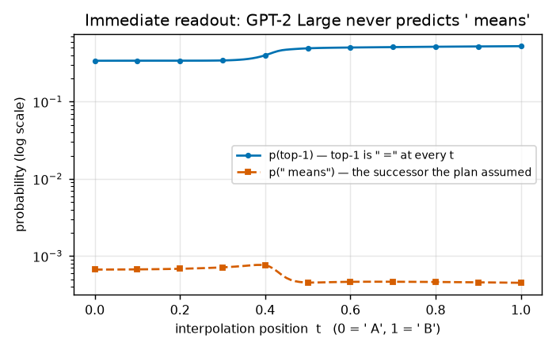
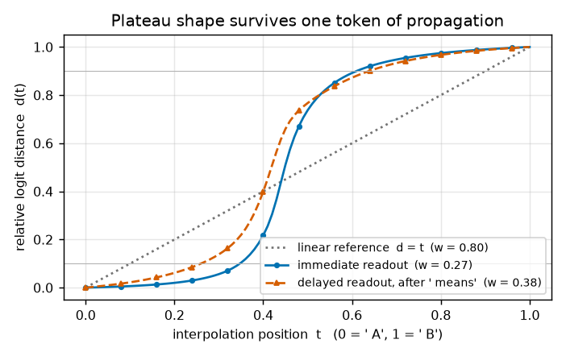
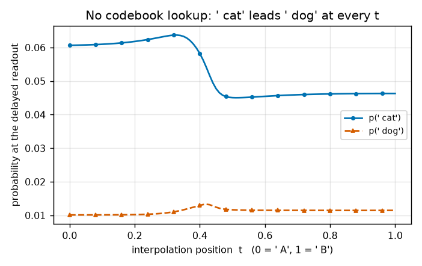

# RESULTS — Delayed-Successor Plateau (GPT-2 Large)

> CURRENT-BEST ONLY. One row per experiment. No history (that lives in CHANGELOG.md).

## Headline

The planned codebook example is **invalid** for GPT-2 Large: after ` A` the model predicts ` =`,
not ` means`, and after ` A means` / ` B means` it predicts a quote mark, never ` cat` / ` dog`.
The planned delayed-plateau test therefore cannot be run as designed (PLAN conclusion 3).

What the same sweep does show: the plateau shape **survives one token of propagation**. Injecting the
interpolated ` A`→` B` embedding and reading out *after* the shared successor ` means` — a position
that can only see the symbol through attention — gives a sharp, monotone transition
(width `w = 0.38`) instead of the linear `w = 0.80`, with its midpoint at the same place as the
immediate readout's. The divergence never reaches the model's output: the delayed top-1 token is the
same at every interpolation position.

## Metrics — endpoint validation (S1)

All four endpoint checks fail: the model continues the codebook listing with ` =` instead of the
assumed successor ` means`, and after the successor it opens a quotation instead of retrieving
` cat` / ` dog`. This is what makes the example invalid.

| Check | Sequence | Top-1 | p(top-1) | Planned token | p(planned) | Pass |
|---|---|---|---|---|---|---|
| Immediate | `…Symbol A` | ` =` | 0.340 | ` means` | 6.68e-4 | ✗ |
| Immediate | `…Symbol B` | ` =` | 0.525 | ` means` | 4.50e-4 | ✗ |
| Delayed | `…Symbol A means` | ` "` | 0.163 | ` cat` | 0.0606 | ✗ |
| Delayed | `…Symbol B means` | ` "` | 0.150 | ` dog` | 0.0115 | ✗ |

Endpoint Jensen–Shannon divergence (JSD, nats): immediate **0.0861**, delayed **0.0115**.

## Metrics — interpolation sweep (S2/S3, 101 points)

Both readouts are far sharper than a linear response and cross at the same interpolation position, so
the downstream position is tracking the same boundary rather than forming its own; propagation costs a
factor of 4.0 in signal and broadens the crossing by 0.11.

| Readout | Width `w` | Midpoint `t₅₀` | Endpoint separation ‖z_A−z_B‖₂ | Monotone | Top-1 changes? |
|---|---|---|---|---|---|
| Immediate (at the symbol) | **0.27** | 0.45 | 300.2 | yes | no (` =` throughout) |
| Delayed (after ` means`)  | **0.38** | 0.42 | 75.4 | yes | no (` "` throughout) |
| Linear reference `d = t`  | 0.80 | 0.50 | — | — | — |

Delayed top-2 logit margin stays in [0.43, 0.69] across all `t` — the sweep never approaches a
decision flip. p(` cat`) exceeds p(` dog`) at every `t` (ratio 6.0 at `t=0`, 4.0 at `t=1`).

## Figures

The endpoint check that decides the verdict: does the model predict the successor ` means` the plan
assumed?

**Figure 1.** The planned successor is three orders of magnitude below the actual prediction.
x: interpolation position `t` (0 = ` A`, 1 = ` B`); y: probability, log scale. Solid = probability of
the model's own top-1 token (` =` at every `t`); dashed = probability of ` means`.

Whether the plateau shape propagates one position downstream:

**Figure 2.** Both readouts are plateau-shaped and their transitions coincide. x: interpolation
position `t`; y: relative logit distance `d(t)` (0 at the ` A` endpoint, 1 at the ` B` endpoint).
Solid = immediate readout, dashed = delayed readout after ` means`, dotted = linear reference `d = t`.
Thin horizontal lines mark the 0.1 and 0.9 levels that define the width `w`.

Whether the interpolation ever produces the codebook lookup the plan predicted:

**Figure 3.** The intended semantic flip never happens. x: interpolation position `t`; y: probability
at the delayed readout. Solid = p(` cat`), dashed = p(` dog`). The two curves never cross.
