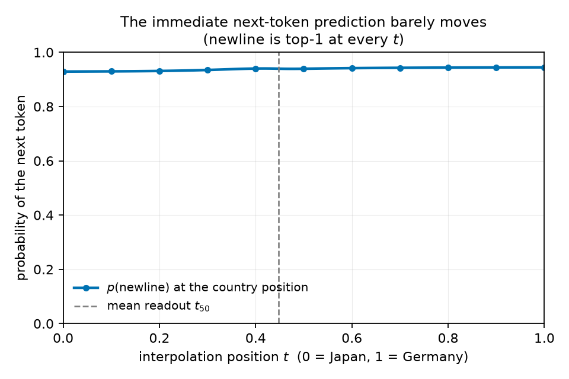
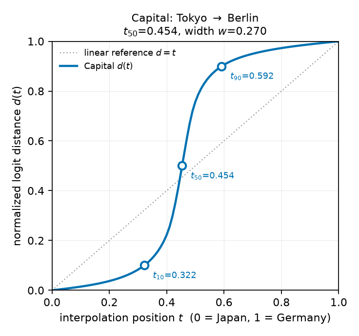
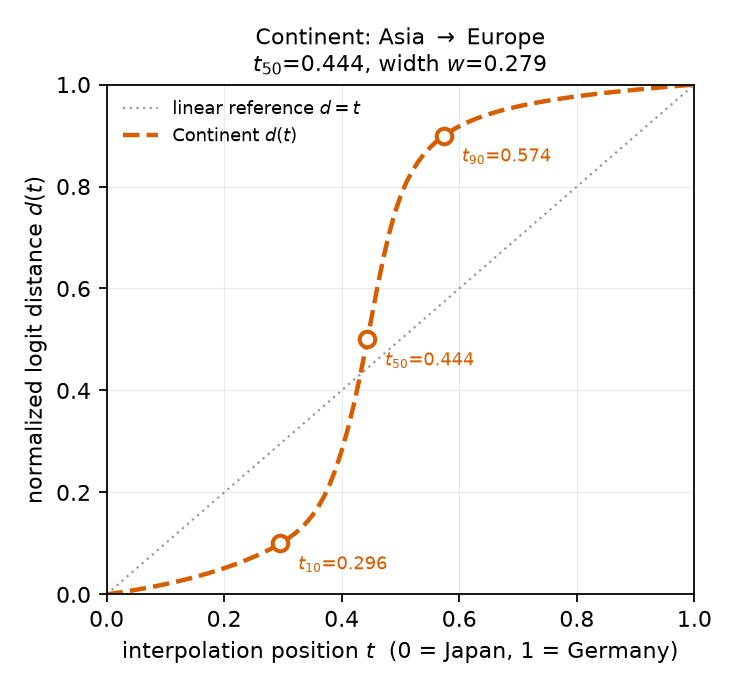
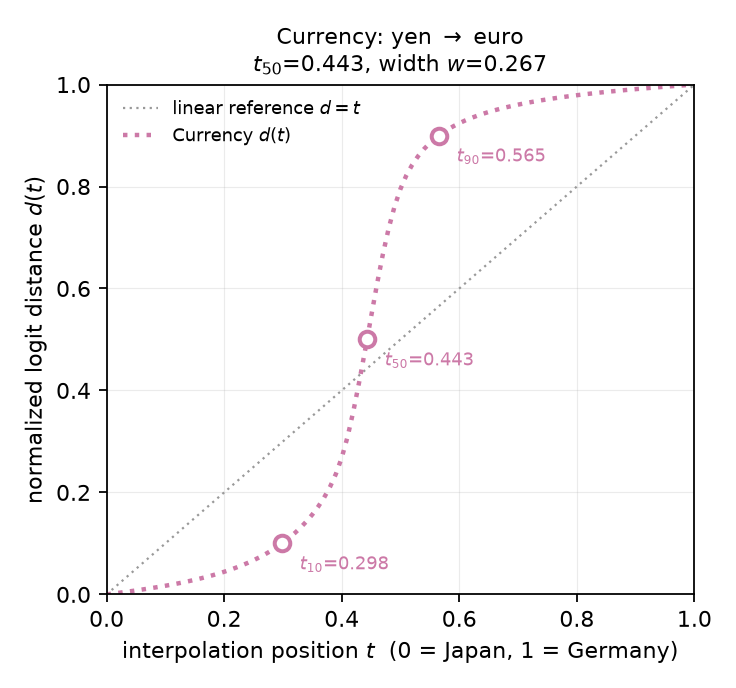
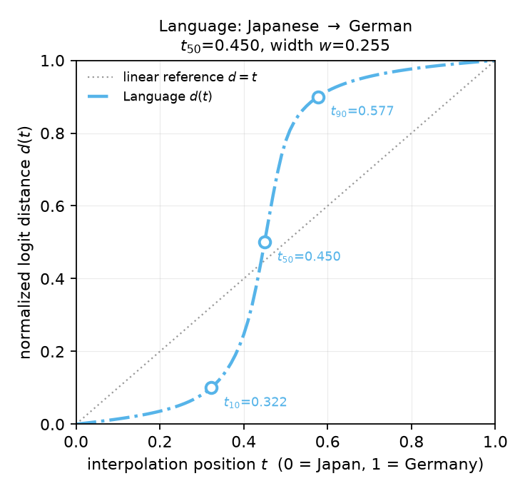
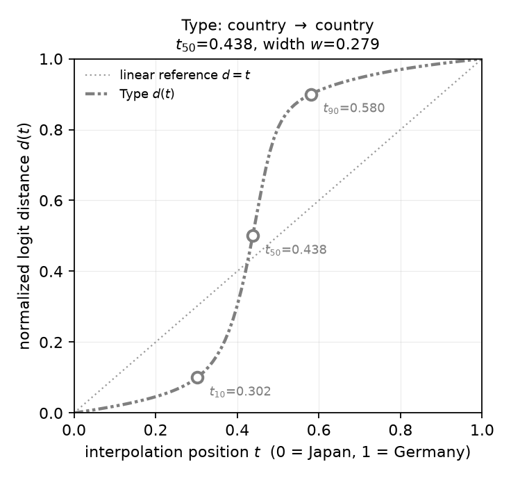
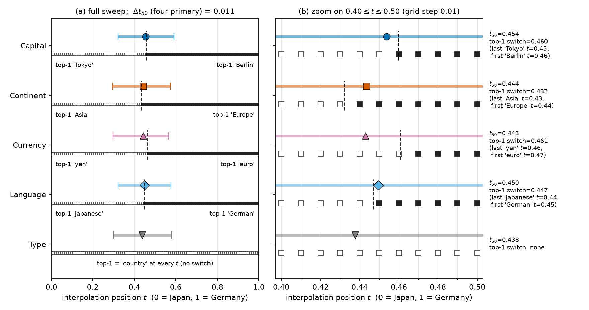

# Do different downstream readouts share the same plateau boundary?

## Summary

**Research question.** When we slide a single token embedding continuously from ` Japan` to ` Germany`
inside one fixed prompt, and then ask GPT-2 Large four different questions about that country —
its capital, its continent, its currency, its language — do the four answers switch over at the same
place along the slide, or does each question have its own switching point?

This matters because the immediate next-token prediction after the country token is essentially the
same for Japan and Germany (both predict a newline with ~93–94% probability). Whatever distinguishes
the two countries is therefore carried silently in the model's state and only becomes visible once a
later "readout" question is appended. If several such readouts flip at the same interpolation
position, the change behaves like one shared switch in a country representation that many later
questions consult. If they flip at different positions, each question has its own boundary.

**Headline result.** All four readouts switch at nearly the same place. Their midpoints
$t_{50}$ lie between 0.443 and 0.454, a spread of **Δt₅₀ = 0.011** — about one interpolation step out
of 101. Each curve is sharp (10–90% width ≈ 0.27, against 0.80 for a linear change), monotonic, and
crosses each threshold exactly once. The most likely answer token (top-1) switches exactly once per
readout, and Figure 7 plots where: ` Tokyo`→` Berlin` at t = 0.460, ` Asia`→` Europe` at 0.432,
` yen`→` euro` at 0.461, ` Japanese`→` German` at 0.447. For three readouts the switch lies within
0.012 of $t_{50}$; for Currency it comes 0.018 later.

**Verdict: aligned transitions.** Capital, continent, currency, and language become Germany-like at
approximately the same interpolation location. This is consistent with a shared transition in a
future-relevant country representation that is subsequently accessed by different downstream
readouts. It is one token pair in one model with one prompt, so it does not establish that plateaus
correspond to general semantic groups.

## Methods

### Data & model

**Model.** Pretrained GPT-2 Large (774M parameters, 36 layers, hidden size 1280), evaluation mode,
float32, no sampling, no training. Weights are frozen throughout.

**Prompt.** One fixed prompt gives the model a worked example so that a bare property name is enough
to elicit an answer. The prefix `P` is exactly:

```text
Country: France
 Capital: Paris
 Continent: Europe
 Currency: euro
 Language: French
 Type: country

Country:
```

The prefix is 27 GPT-2 tokens. Immediately after it comes the country token, which is the only thing
we manipulate: endpoint **A** is ` Japan` (id 2869) and endpoint **B** is ` Germany` (id 4486). Both
are single tokens, as are all expected answers (` Tokyo`, ` Berlin`, ` Asia`, ` Europe`, ` yen`,
` euro`, ` Japanese`, ` German`, ` country`).

**Readouts.** A *readout* is a short suffix appended after the country token that asks for one
property. We use five, each exactly three GPT-2 tokens (a newline, a property-name token, and a
colon): `\n Capital:`, `\n Continent:`, `\n Currency:`, `\n Language:`, `\n Type:`. The model's
prediction at the final colon is that readout's answer. `Type` is included as a control: both
countries answer ` country`, so it is expected not to discriminate between the endpoints.

**Interpolation.** We build 101 intermediate embeddings at evenly spaced positions
(t = 0.00, 0.01, …, 1.00) between the input embeddings of ` Japan` and ` Germany`, following the
procedure used elsewhere in this project: the *direction* follows the shortest arc on the unit sphere
(spherical linear interpolation, "slerp"), while the *length* is interpolated linearly between the two
endpoint norms. With unit vectors $u = e_A/\lVert e_A\rVert$, $v = e_B/\lVert e_B\rVert$ and angle
$\Omega = \arccos(u\cdot v)$:

```math
e(t) \;=\; \big[(1-t)\lVert e_A\rVert + t\lVert e_B\rVert\big]\;
\frac{\sin\big((1-t)\Omega\big)\,u + \sin\big(t\Omega\big)\,v}{\sin \Omega}
```

Here the two endpoint embeddings are far from parallel: $\cos\Omega = 0.440$, $\Omega = 1.115$ rad,
with norms 1.671 and 1.607. The interpolated vector is inserted at the country position *before the
first transformer layer*, replacing that token's input embedding. Positional embeddings, all prefix
and suffix tokens, and all weights stay fixed. The same 101 embeddings are built once and reused for
all five readouts, so any difference between readouts comes from the suffix alone, never from a
different input path.

### Metrics

**Endpoint Jensen–Shannon divergence (JSD)** — before interpolating, we need to know which readouts
actually distinguish Japan from Germany. JSD is a symmetric, bounded measure of how different two
probability distributions are; measured in bits it runs from 0 (identical) to 1 (disjoint supports).
We apply it to the two full next-token distributions at a readout's final colon, $p_A$ (Japan) and
$p_B$ (Germany), with $m = \tfrac12(p_A + p_B)$ and $H$ the Shannon entropy in bits:

```math
\mathrm{JSD}(p_A, p_B) \;=\; H(m) \;-\; \tfrac{1}{2}\big(H(p_A) + H(p_B)\big)
```

A readout with a JSD near 1 bit separates the two countries almost completely; one near 0 does not
separate them at all. This is what makes Capital/Continent/Currency/Language the four *primary*
readouts and Type the control (Table 1).

**Normalized logit distance $d(t)$** — this is the curve whose shape the whole study is about. We want
a single number per interpolation position saying "how far has this readout travelled from its
Japan behaviour to its Germany behaviour", comparable across readouts whose answer tokens and
confidence levels differ. Tracking the probability of one answer token would not be comparable
(` euro` peaks at 0.39 while ` Japanese` peaks at 0.95), so we use the whole 50257-dimensional logit
vector $z_r(t)$ at the final colon of readout $r$, with $z_{r,A} = z_r(0)$ and $z_{r,B} = z_r(1)$:

```math
d_r(t) \;=\; \frac{\lVert z_r(t) - z_{r,A}\rVert_2}
{\lVert z_r(t) - z_{r,A}\rVert_2 + \lVert z_r(t) - z_{r,B}\rVert_2}
```

By construction $d_r(0) = 0$ and $d_r(1) = 1$, so every readout is placed on the same 0-to-1 scale.
Read it as: 0 means "still behaving exactly as it did for Japan", 1 means "behaving exactly as it did
for Germany", 0.5 means "equidistant from both". A quantity that changed at a constant rate along the
slide would trace the straight line $d = t$; a curve that stays flat and then rises steeply indicates
a plateau followed by a sharp switch. Every figure below plots $d = t$ as a reference. Note that $d$
is normalized, so it always spans 0 to 1 even when the absolute change is tiny — the JSD column of
Table 1 is what tells us the change is large.

**Transition location $t_{50}$ and width $w$** — to compare readouts we reduce each curve to where it
switches and how abruptly. Let $t_{10}$, $t_{50}$, $t_{90}$ be the positions where $d_r(t)$ first
reaches 0.1, 0.5 and 0.9, obtained by linear interpolation between adjacent sampled points. The
transition location is $t_{50}$; the transition width is

```math
w_r \;=\; t_{90} - t_{10}
```

Smaller $w$ means a sharper switch. For calibration, a linear $d = t$ curve gives $w = 0.80$, so any
width well below that is a genuinely non-linear switch. No smoothing or curve fitting is applied, and
we count how many times each threshold is crossed so that a non-monotonic curve cannot be summarised
by a single misleading number.

**Agreement across readouts (Δt₅₀)** — the answer to the research question is simply the spread of
transition locations over the four primary readouts:

```math
\Delta t_{50} \;=\; \max_r t_{50,r} \;-\; \min_r t_{50,r}
```

Following the pre-registered plan, $\Delta t_{50} \le 0.05$ counts as descriptively aligned *at the
resolution of this experiment* (the grid step is 0.01). This is a descriptive threshold, not a
statistical significance test.

**Top-1 switch location $t_{\text{switch}}$** — $d(t)$ summarises the whole logit vector, so it does
not directly say *which answer the model would give*. To check whether the predicted answer changes at
the same place as $d(t)$, we also record, at every one of the 101 positions, the top-1 token: the
token with the highest probability under the readout-position logits $z_r(t)$ (the "delayed logits",
meaning the prediction made after the readout suffix, not directly after the country token). In
every primary readout the top-1 token is always either the Japan-side answer $a_A$ or the
Germany-side answer $a_B$, so it switches exactly where the two answer probabilities cross. The
switch location is the zero crossing of

```math
g_r(t) \;=\; p_r(a_A \mid t) \;-\; p_r(a_B \mid t)
```

found by linear interpolation between the last sampled position whose top-1 is $a_A$ and the first
whose top-1 is $a_B$ (the same interpolation used for $t_{50}$). The switch is observed only on the
0.01 grid, so the two bracketing grid points are reported alongside it. Comparing
$t_{\text{switch}}$ with $t_{50}$ (Figure 7) shows whether the discrete answer and the logit-distance
curve change at the same place.

### Baseline / reference

There is no competing method to beat here; the reference is the **linear change** $d(t) = t$, drawn on
every $d(t)$ figure. It is what a readout would look like if its logits moved at a constant rate as the
input embedding slid from Japan to Germany, with no plateau and no switch. A second reference is the
**immediate position**: the same 101 embeddings run without any readout suffix, scoring the next-token
prediction directly after the country token (Figure 1).

## Results

### The country identity is invisible in the immediate prediction

Before the readout suffix is appended, the two endpoints behave almost identically: newline is the
top-1 next token for both, with $p(\text{newline})$ = 0.929 after ` Japan` and 0.945 after ` Germany`,
and an endpoint JSD of 0.0076 bits — under 1% of the divergence seen at any of the four primary
readouts. To show that this near-identity holds all the way along the slide (and therefore that the
downstream switch reported below cannot be read off the immediate output), we plot
$p(\text{newline})$ at the country position for all 101 embeddings.



**Figure 1.** The immediate next-token prediction is flat and uninformative across the whole slide.
x: interpolation position $t$ (0 = Japan, 1 = Germany); y: probability of the newline token being
predicted immediately after the country token, on a 0–1 scale. Newline is top-1 at every one of the
101 positions and its probability only drifts from 0.929 to 0.945. The dashed vertical line marks the
mean transition location of the four primary readouts ($t_{50}$ = 0.448) — nothing happens there in the
immediate output.

### Every readout switches, and each switch is sharp

Each of the four primary readouts reproduces the expected endpoint answers, with the endpoint
divergences given in Table 1, and each moves from its Japan behaviour to its Germany behaviour in a
narrow band around t ≈ 0.45. Figures 2–5 show the four individual $d(t)$ curves; Figure 6 shows the
Type control. In each, the marked circles are $t_{10}$, $t_{50}$ and $t_{90}$, and the dotted diagonal
is the linear reference.



**Figure 2.** Capital readout (` Tokyo` → ` Berlin`). x: interpolation position $t$ (0 = Japan,
1 = Germany); y: normalized logit distance $d(t)$ from the Japan-side logits (0) to the Germany-side
logits (1). Dotted diagonal: the linear reference $d = t$. The curve hugs 0 until t ≈ 0.32, rises
steeply, and saturates by t ≈ 0.59 — a plateau, a switch, and a second plateau.



**Figure 3.** Continent readout (` Asia` → ` Europe`), axes as in Figure 2. Its transition midpoint
($t_{50}$ = 0.444) sits within 0.01 of the Capital readout's, despite asking about a completely
different property.



**Figure 4.** Currency readout (` yen` → ` euro`), axes as in Figure 2. This is the least confident
readout at both endpoints (` yen` reaches only 0.58 and ` euro` only 0.39), yet its transition is just
as sharp ($w$ = 0.267) and sits at the same location ($t_{50}$ = 0.443).



**Figure 5.** Language readout (` Japanese` → ` German`), axes as in Figure 2. $t_{50}$ = 0.450,
$w$ = 0.255 — the sharpest of the five.



**Figure 6.** Type control readout, axes as in Figure 2. Both endpoints answer ` country`, and
` country` stays top-1 at all 101 positions, yet the full logit vector still traverses from its
Japan-side to its Germany-side value over the same interval ($t_{50}$ = 0.438). Because Type's endpoint
divergence is only 0.111 bits, this curve tracks a much smaller absolute movement than Figures 2–5;
see the discussion below.

Table 1 collects the endpoint divergences and the transition statistics. All five curves are
monotonically increasing (no backward step anywhere on the grid) and cross each of the 0.1/0.5/0.9
levels exactly once, so a single $t_{50}$ summarises each curve without ambiguity.

**Table 1.** Endpoint divergence and transition statistics for all five readouts. JSD is measured
between the two endpoint next-token distributions; $t_{10}/t_{50}/t_{90}$ and $w$ come from the
$d(t)$ curves in Figures 2–6.

| Readout   | Endpoint JSD (bits) | $t_{10}$ | $t_{50}$ | $t_{90}$ | $w$ | Monotonic? |
| --------- | ------------------: | -------: | -------: | -------: | ----: | ---------- |
| Capital   | 0.991 | 0.322 | 0.454 | 0.592 | 0.270 | yes |
| Continent | 0.885 | 0.296 | 0.444 | 0.574 | 0.279 | yes |
| Currency  | 0.915 | 0.298 | 0.443 | 0.565 | 0.267 | yes |
| Language  | 0.968 | 0.322 | 0.450 | 0.577 | 0.255 | yes |
| Type      | 0.111 | 0.302 | 0.438 | 0.580 | 0.279 | yes |

The widths are the first substantive finding: at 0.255–0.279 they are roughly one third of the 0.80
a linear change would give. Sliding the input embedding two thirds of the way across the gap between
Japan and Germany therefore does *not* produce a two-thirds-blended answer; the readout stays
Japan-like, then flips over a window about a quarter of the path wide.

### The four transition locations coincide, and the answers switch there too

The direct answer to the research question is the comparison of the four transition locations. A
second question is whether the model's actual answer changes at that same place: $d(t)$ could pass
0.5 while the top-1 token is still the Japan answer. Figure 7 answers both. For each readout, the
upper row shows $t_{50}$ as a marker with its $[t_{10}, t_{90}]$ interval as a bar; the lower row
shows the top-1 token at each of the 101 positions, and a dashed line marks the observed top-1 switch
$t_{\text{switch}}$. Panel (b) zooms into $0.40 \le t \le 0.50$ so that the individual grid points
and the gap between $t_{50}$ and the switch are visible.



**Figure 7.** Transition location and top-1 answer per readout. x: interpolation position $t$
(0 = Japan, 1 = Germany); panel (a) shows the full sweep, panel (b) zooms into 0.40–0.50 (grid step
0.01). y: the five readouts, with the Type control at the bottom in gray. Upper row of each readout:
marker = $t_{50}$, bar = $[t_{10}, t_{90}]$ of $d(t)$. Lower row: one square per sampled $t$; open
square = top-1 token is the Japan-side answer (e.g. ` Tokyo`), filled square = top-1 token is the
Germany-side answer (e.g. ` Berlin`). Dashed vertical line = $t_{\text{switch}}$. Right-hand labels
give $t_{50}$, $t_{\text{switch}}$ and the last/first grid points on either side of the switch.

Across Capital, Continent, Currency, and Language, $\Delta t_{50} = 0.454 - 0.443 = 0.011$ — about one
grid step, and roughly a twenty-fifth of the transition width itself. This is far inside the
pre-registered alignment threshold of 0.05.

The top-1 answers tell the same story at the level of the discrete prediction, with small offsets
that we measured instead of assuming away. Each primary readout produces exactly two distinct top-1
tokens over the whole slide — the Japan answer, then the Germany answer, with no third token in
between — and it switches once (Figure 7, lower rows). Table 2 compares the switch with $t_{50}$.
Values come from `results/transitions.json` and `results/top1_tokens.csv`.

| Readout   | Top-1 switch            | Last Japan-answer $t$ | First Germany-answer $t$ | $t_{\text{switch}}$ | $t_{50}$ | $t_{\text{switch}} - t_{50}$ | $d(t_{\text{switch}})$ |
| --------- | ----------------------- | ----: | ----: | ----: | ----: | -----: | ----: |
| Capital   | ` Tokyo` → ` Berlin`    | 0.45 | 0.46 | 0.460 | 0.454 | +0.006 | 0.54 |
| Continent | ` Asia` → ` Europe`     | 0.43 | 0.44 | 0.432 | 0.444 | −0.011 | 0.43 |
| Currency  | ` yen` → ` euro`        | 0.46 | 0.47 | 0.461 | 0.443 | +0.018 | 0.61 |
| Language  | ` Japanese` → ` German` | 0.44 | 0.45 | 0.447 | 0.450 | −0.003 | 0.48 |
| Type      | none (` country` at every $t$) | — | — | — | 0.438 | — | — |

**Table 2.** Observed top-1 switch versus the $d(t)$ midpoint. $d(t_{\text{switch}})$ is the
normalized logit distance at the switch (0.5 would mean the switch sits exactly at $t_{50}$).

For Capital and Language the answer switches within one grid step of $t_{50}$ (offsets +0.006 and
−0.003). Continent switches slightly *before* its midpoint (−0.011), when $d$ is only 0.43. Currency
switches *after* it (+0.018), when $d$ is already 0.61: at $t_{50}$ = 0.443 the model still answers
` yen`, and ` euro` only takes over between $t$ = 0.46 and 0.47. The reason is visible in the answer
probabilities: near the switch neither currency token is confident (` yen` 0.22 and ` euro` 0.20 at
$t$ = 0.46; `results/top1_tokens.csv`), so the argmax can lag the overall logit movement. All four
switches still fall between $t$ = 0.432 and 0.461 — a spread of 0.029, inside the 0.05 alignment
threshold and well inside every $[t_{10}, t_{90}]$ interval. So the discrete answers switch in the
same narrow region as the logit-distance transitions, but they do not sit exactly on $t_{50}$; the
offsets of up to 0.018 are real at this grid resolution.

The practical significance is that these four questions probe genuinely different knowledge
(a city, a landmass, a currency, a language; their answer tokens share nothing) and are asked through
different suffixes, yet they do not each carry their own boundary. Whatever the country position
holds is consulted by all four in the same way, so locating the switch for one property locates it
for the others. That is what makes it reasonable to speak of a boundary belonging to the
representation rather than to the question.

### Reading the Type control

Type deserves separate comment because it is a weaker control than it may look. Both endpoints answer
` country` (with probability 0.726 for Japan and 0.823 for Germany) and ` country` remains top-1 at
all 101 positions, so by top-1 it does not discriminate. But its two endpoint distributions are not
identical — 0.111 bits of JSD remain, and the runner-up tokens differ (` Japan` at 0.086 on the
Japan side, ` Germany` at 0.023 on the Germany side). Type is therefore a *non-discriminating top-1
readout*, not an identical-distribution control. Its $d(t)$ curve in Figure 6 transitions at
$t_{50}$ = 0.438, close to the other four, but that curve is a normalized description of a much
smaller absolute movement, so it should not be read as a fifth independent confirmation.

## Conclusion

For the ` Japan` → ` Germany` input-embedding interpolation in GPT-2 Large, the verdict is **aligned
transitions**:

> Capital, continent, currency, and language become Germany-like at approximately the same
> interpolation location ($\Delta t_{50}$ = 0.011, Figure 7 and Table 1). This is consistent with a
> shared transition in the future-relevant country representation that is subsequently accessed by
> different downstream readouts.

The predicted answers switch in the same region: the top-1 token changes once per readout, between
$t$ = 0.432 and 0.461 (Figure 7, Table 2). The switch is not identical to $t_{50}$ — it is within
0.012 of $t_{50}$ for Capital, Continent and Language and 0.018 later for Currency.

Three qualifications bound that statement.

*On what "future-relevant" means here.* The country identity is not expressed in the immediate output
— the next-token distribution after the country token barely moves along the entire slide (Figure 1,
endpoint JSD 0.0076 bits). It becomes visible only once a readout suffix is appended, and those
delayed predictions are not the model's immediate outputs. This experiment does not show that GPT-2 is
explicitly planning an answer before it sees the readout suffix; it shows that a representation
sufficient to answer four different later questions is present at the country position, and that it
changes at one location.

*On what alignment can and cannot distinguish.* Because all five readouts consume the same 101
interpolated embeddings, their agreement says the switch is driven by a change at the country
position rather than by anything suffix-specific. It does not identify the mechanism: the study
separates "shared entity-state transition" from "readout-specific transition" and supports the former,
without ruling out every process that could produce that pattern. The alignment is descriptive at the
resolution of a 0.01 grid, and $\Delta t_{50}$ is a spread, not a significance test.

*On scope.* This is one token pair, one prompt, one model, and one hook point (the input embedding
before layer 0). It cannot show that plateaus correspond to general semantic groups, and it does not
establish discrete semantic categories in GPT-2. The strongest supported reading is that the model
preserves a future-relevant country representation whose change is reflected consistently across
several later readouts.

Full endpoint checks, top-5 predictions at both endpoints, the overlay of all five curves, and the
machine-readable per-$t$ data are in `RESULTS.md` and `results/`.
