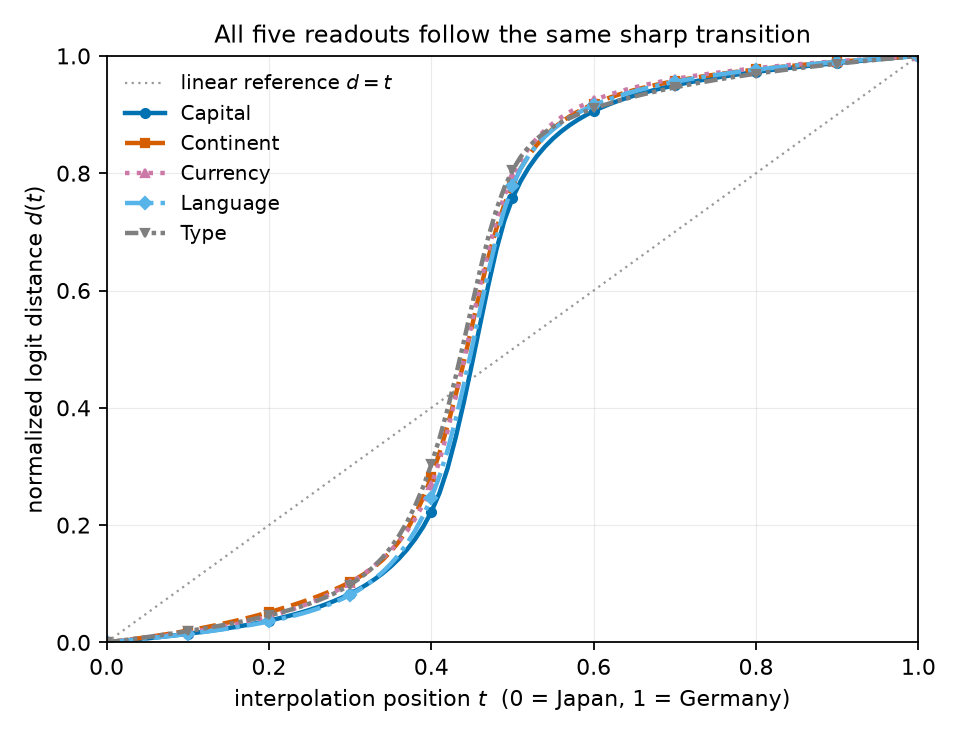

# RESULTS — Same ` Japan`→` Germany` embedding, five downstream readouts (GPT-2 Large)

Detailed evidence record for the question in `REPORT.md`: when one token embedding is interpolated
from ` Japan` to ` Germany` inside a fixed prompt, do the capital / continent / currency / language
readouts switch at the same interpolation position $t$? Metric definitions (endpoint JSD, normalized
logit distance $d(t)$, $t_{10}/t_{50}/t_{90}$, width $w$, $\Delta t_{50}$) are given in the Methods
section of `REPORT.md` and are not repeated here.

Setup: pretrained GPT-2 Large (774M), float32, eval mode; 27-token prefix; country token at index 27;
101 evenly spaced $t$; shortest-arc slerp of direction with linearly interpolated norm, inserted as
the input embedding before layer 0; the same 101 embeddings reused for all five readout suffixes.
Endpoint geometry: $\lVert e_A\rVert = 1.671$, $\lVert e_B\rVert = 1.607$, $\cos\Omega = 0.4398$,
$\Omega = 1.1155$ rad.

## S1 — Endpoint reproduction

Every value in the PLAN's preliminary table reproduces to the quoted precision, so the interpolation
was run on a verified setup. All tokenization checks pass: ` Japan` (2869), ` Germany` (4486),
` Tokyo`, ` Berlin`, ` Asia`, ` Europe`, ` yen`, ` euro`, ` Japanese`, ` German`, ` country` are each a
single GPT-2 token, and each readout suffix is exactly three tokens (newline, property name, colon).

Without a readout suffix, the two endpoints are nearly indistinguishable: newline is top-1 for both.

| Quantity | Japan side | Germany side | Expected (PLAN) |
| -------- | ---------: | -----------: | --------------- |
| top-1 immediate token | `\n` | `\n` | newline both |
| $p(\text{newline})$ | 0.9290 | 0.9445 | 0.929 / 0.945 |

The JSD between those two immediate distributions is symmetric and therefore a single number:
0.00761 bits (PLAN expected ≈0.0076).

With a readout suffix, each of the four primary readouts gives the expected top-1 answer at both
endpoints and a large endpoint divergence; Type gives ` country` on both sides.

| Readout | Japan top-1 (prob) | Germany top-1 (prob) | Endpoint JSD (bits) | PLAN expected JSD |
| ------- | ------------------ | -------------------- | ------------------: | ----------------: |
| Capital   | ` Tokyo` (0.925)    | ` Berlin` (0.743) | 0.991 | 0.991 |
| Continent | ` Asia` (0.743)     | ` Europe` (0.863) | 0.885 | 0.885 |
| Currency  | ` yen` (0.584)      | ` euro` (0.388)   | 0.915 | 0.915 |
| Language  | ` Japanese` (0.949) | ` German` (0.891) | 0.968 | 0.969 |
| Type      | ` country` (0.726)  | ` country` (0.823)| 0.111 | 0.111 |

Runner-up tokens matter for the Type control, because they show its two endpoint distributions are
not identical even though the top-1 answer is: on the Japan side the top-3 are ` country` 0.726,
` Japan` 0.086, ` Japanese` 0.020; on the Germany side ` country` 0.823, ` Germany` 0.023,
` Europe` 0.014. Full top-5 lists at both endpoints for every readout are in
`results/s1_endpoints.json`.

## S2/S4 — Transition statistics

Each readout's $d(t)$ curve is monotonically increasing over the whole grid (no backward step) and
crosses each of the 0.1 / 0.5 / 0.9 levels exactly once, so a single transition location per readout
is well defined. The widths are roughly a third of the 0.80 that a linear $d = t$ change would give,
i.e. each readout holds its Japan-side behaviour and then switches.

| Readout   | Endpoint JSD (bits) | $t_{10}$ | $t_{50}$ | $t_{90}$ | $w$ | Monotonic? | Crossings (0.1/0.5/0.9) |
| --------- | ------------------: | -------: | -------: | -------: | ----: | ---------- | ----------------------- |
| Capital   | 0.991 | 0.322 | 0.454 | 0.592 | 0.270 | yes | 1 / 1 / 1 |
| Continent | 0.885 | 0.296 | 0.444 | 0.574 | 0.279 | yes | 1 / 1 / 1 |
| Currency  | 0.915 | 0.298 | 0.443 | 0.565 | 0.267 | yes | 1 / 1 / 1 |
| Language  | 0.968 | 0.322 | 0.450 | 0.577 | 0.255 | yes | 1 / 1 / 1 |
| Type      | 0.111 | 0.302 | 0.438 | 0.580 | 0.279 | yes | 1 / 1 / 1 |

Across the four primary readouts: $\Delta t_{50} = 0.454 - 0.443 = 0.011$, inside the pre-registered
descriptive-alignment threshold of 0.05 (a descriptive comparison at a 0.01 grid resolution, not a
significance test). Mean primary $t_{50}$ = 0.4475, mean primary width = 0.268.

The discrete answers agree with the curve summary, and are the same observation without any metric:
each primary readout emits exactly two distinct top-1 tokens across all 101 positions, flipping once.

| Readout | Top-1 flip | $t$ of flip | Distinct top-1 tokens over the sweep |
| ------- | ---------- | ----------: | -----------------------------------: |
| Capital   | ` Tokyo` → ` Berlin`    | 0.46 | 2 |
| Continent | ` Asia` → ` Europe`     | 0.44 | 2 |
| Currency  | ` yen` → ` euro`        | 0.47 | 2 |
| Language  | ` Japanese` → ` German` | 0.45 | 2 |
| Type      | none                    | —    | 1 (` country` throughout) |

## Immediate position across the sweep

The immediate next-token prediction stays flat: newline is top-1 at all 101 positions and
$p(\text{newline})$ drifts monotonically from 0.9290 to 0.9445. Applying the same normalized-distance
formula to the immediate logits gives $t_{50}$ = 0.438 with width $w$ = 0.466 — a much broader curve
than any readout, and one describing an absolute change of only 0.0076 bits of JSD. This is the clearest
illustration of the normalization caveat: because $d$ is rescaled to span 0 to 1 by construction, a
$d(t)$ curve alone never establishes that a large change occurred, and must be read next to the
endpoint JSD.

## Figures

The overlay below is the compact version of the main finding: five curves, one shape, one location.

**Figure R1.** All five $d(t)$ curves on the same axes. x: interpolation position $t$ (0 = Japan,
1 = Germany); y: normalized logit distance $d(t)$; dotted diagonal: the linear reference $d = t$.
Series are distinguished by line style and marker as well as color (Capital solid/circle, Continent
dashed/square, Currency dotted/triangle, Language dash-dot/diamond, Type gray dash-dot-dot/down-triangle).
The five curves lie almost on top of one another.

Individual per-readout figures, each marking $t_{10}$, $t_{50}$, $t_{90}$ against the linear reference,
and the two comparison figures:

| File | Contents |
| ---- | -------- |
| `plots/distance_capital.png`    | Capital $d(t)$ (` Tokyo` → ` Berlin`) |
| `plots/distance_continent.png`  | Continent $d(t)$ (` Asia` → ` Europe`) |
| `plots/distance_currency.png`   | Currency $d(t)$ (` yen` → ` euro`) |
| `plots/distance_language.png`   | Language $d(t)$ (` Japanese` → ` German`) |
| `plots/distance_type.png`       | Type control $d(t)$ (` country` both sides) |
| `plots/distance_overlay.png`    | All five curves overlaid (Figure R1) |
| `plots/immediate_prediction.png`| $p(\text{newline})$ at the country position across $t$ |
| `plots/transition_comparison.png` | $t_{50}$ markers with $[t_{10}, t_{90}]$ intervals |

## Data and code

Everything above is reproducible from four scripts and four saved artefacts; the sweep takes about a
minute on one GPU. Re-running `s1_endpoints.py`, `s2_interp.py` and `s3_plots.py` in that order
regenerates every number and figure in this file.

| File | Contents |
| ---- | -------- |
| `results/s1_endpoints.json` | Tokenization checks, endpoint top-5 predictions, endpoint JSDs |
| `results/interp.csv`        | Per-$t$: $p(\text{newline})$, all five $d(t)$, and both answer-token probabilities per readout |
| `results/interp.npz`        | Same arrays plus per-$t$ top-1 token ids and the immediate $d(t)$ |
| `results/transitions.json`  | Per-readout $t_{10}/t_{50}/t_{90}/w$, crossing counts, monotonicity, top-1 flip positions, $\Delta t_{50}$ |
| `experiments/common.py`     | Prompt, readouts, slerp, JSD, distance and threshold-crossing helpers |
| `experiments/s1_endpoints.py` | S1 endpoint reproduction |
| `experiments/s2_interp.py`  | S2 interpolation sweep (full logits used in memory; derived curves saved) |
| `experiments/s3_plots.py`   | S3/S4 figures |

## Headline

Four downstream readouts that ask about unrelated properties — capital, continent, currency, language
— switch from Japan-like to Germany-like at the same point of a single input-embedding interpolation
($\Delta t_{50}$ = 0.011, widths 0.255–0.279), while the immediate next-token prediction never changes.
This is consistent with one shared transition in a future-relevant country representation, read out by
several different later questions; it is a single token pair in a single model and does not establish
general semantic groups.
