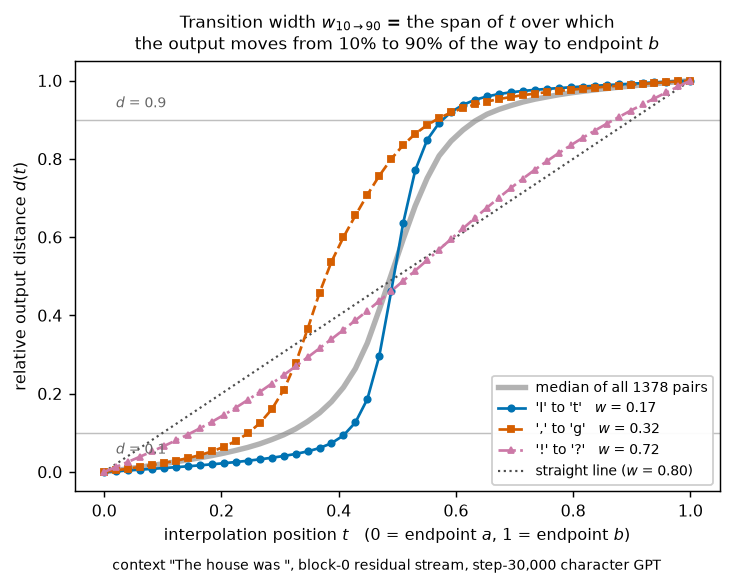
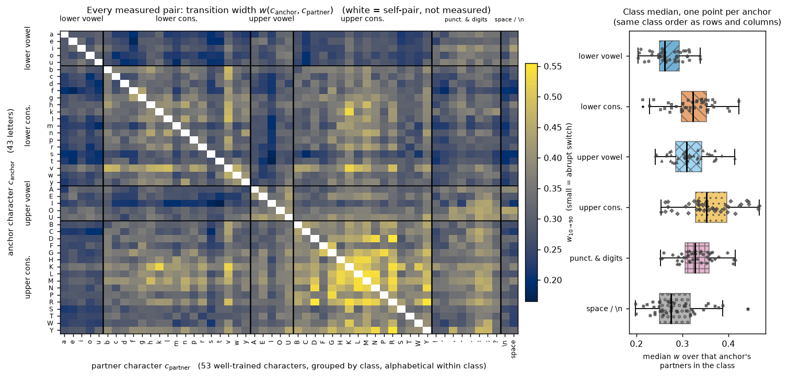
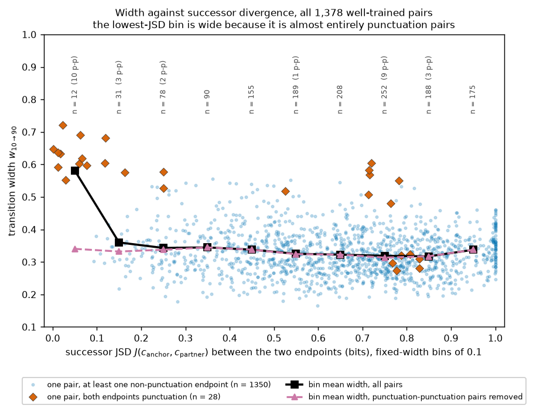

# What predicts how sharply a character GPT switches its output?

## Summary

With the prompt frozen, slide an internal activation vector from the state a model has for input X to
the state for input Y. The output can sit still, then flip. How abruptly it flips says how much a
nudge to an activation changes what the model does.

On one small character-level GPT trained on Shakespeare we ask two questions. **First:** with one
endpoint fixed to a letter, is the switch width organised by what *kind* of character sits at the other
endpoint (vowel, consonant, punctuation, whitespace)? **Second:** do endpoints followed by more different
characters in the training text switch more narrowly?

Both answers come from the raw pairwise measurements, before averaging.

## Methods

**Data and model.** A 12-block, 12-head decoder-only GPT (width 240, context 128, about 8.4M parameters)
trained for next-character prediction on Tiny Shakespeare (1,115,394 characters, first 90% for
training), at step 30,000. Widths come from a stored sweep in `../dir13_plateau_on_grok_gpt`
(commit `01d2501`), re-validated in `RESULTS.md` section 1.

**Interpolation and transition width.** Every measurement compares two characters, $c_{\mathrm{anchor}}$
and $c_{\mathrm{partner}}$. We run the prompt `"The house was "` (trailing space included) followed by one
character, then the other, and take the residual stream at the final position after block 0. The two
vectors are blended along a norm-preserving spherical path in 50 steps indexed by $t$ ($t=0$ = anchor,
$t=1$ = partner) and patched back in; we read the logits $z(t)$ and ask how far the *output* has moved:

```math
d(t)=\frac{\lVert z(t)-z(0)\rVert_2}{\lVert z(t)-z(0)\rVert_2+\lVert z(t)-z(1)\rVert_2}.
```

$d=0$ means the output still matches the anchor, $d=1$ the partner. The **transition width** is the span
of $t$ over which $d$ climbs from 0.1 to 0.9, read off a monotone (isotonic) fit:

```math
w(c_{\mathrm{anchor}},c_{\mathrm{partner}})=t(d=0.9)-t(d=0.1).
```

Small $w$ means an abrupt switch: an output tracking the state proportionally would give $w=0.8$,
whereas the median here is 0.320 (Figure 1). $w$ is symmetric.



**Figure 1.** The transition width. x: interpolation position $t$, anchor at 0, partner at 1; y: output
distance $d(t)$. Three pairs (solid, dashed, dash-dotted, labelled with their widths), the median over
all 1,378 pairs (thick gray), and the straight line $w=0.8$ (dotted).

**Which characters we use: 65, then 53, then 43.** The vocabulary has 65 characters. Rare characters have
unusually wide transitions, so we keep the earlier direction's frozen threshold of 1,000 training-split
occurrences; 53 pass and we call these *well-trained*. Those 53 give the 1,378 pairs used for question 2.
Question 1 needs a letter endpoint: 43 of the 53 are letters, each serving in turn as a fixed **anchor**
against the other 52 well-trained characters, its **partners**.

**Anchors and class medians, with a worked example.** Partners are sorted into six classes fixed before
any analysis: lower-case vowels, lower-case consonants, upper-case vowels, upper-case consonants,
punctuation and digits, and whitespace — surface classes of the character, not learned features. A
*class-level median* summarises several separate measurements. With `t` as the anchor, its value for the
lower-case-vowel class is

```math
\mathrm{median}\lbrace w(\texttt{t},\texttt{a}),\, w(\texttt{t},\texttt{e}),\, w(\texttt{t},\texttt{i}),\, w(\texttt{t},\texttt{o}),\, w(\texttt{t},\texttt{u})\rbrace.
```

The model never interpolates from `t` towards a "lower-case-vowel representation". It performs five
separate character-to-character interpolations — `t`→`a`, `t`→`e`, `t`→`i`, `t`→`o`, `t`→`u` — whose five
widths we summarise with a median, one number per class. Because a median can hide its underlying
values, Result 1 shows the individual measurements first.

**Successor divergence.** Question 2 needs a character property from the corpus, not the model, so we use
what follows it. Counting character bigrams in the training split without smoothing gives
$P(y \mid c)$, the distribution of the character right after `c`. We compare two characters'
distributions with the base-2 Jensen–Shannon divergence, $m$ their average:

```math
J(c_{\mathrm{anchor}},c_{\mathrm{partner}})=\tfrac{1}{2}D_{\mathrm{KL}}\big(P(\cdot \mid c_{\mathrm{anchor}})\,\Vert\,m\big)+\tfrac{1}{2}D_{\mathrm{KL}}\big(P(\cdot \mid c_{\mathrm{partner}})\,\Vert\,m\big).
```

$J=0$ bits means the two characters are followed by the same mix of characters, $J=1$ bit that their
successors never overlap. Estimated on each half of the training split, the pair values agree at Spearman
rank correlation 0.95 (`RESULTS.md` section 3).

## Results

### 1. Raw widths show class structure; the class median is only sometimes representative

Figure 2 shows every measurement behind question 1: one cell per pair, no averaging, columns grouped by
class so each block can be inspected.



**Figure 2.** Left: raw transition width for every measured pair. x: the 53 well-trained partners,
grouped into the six classes (black separators, names above), alphabetical within class; y: the 43
letter anchors, grouped the same way; colour: $w$, dark blue = abrupt, yellow = gradual, white =
self-pair. Right, same data: x: an anchor's median width over its partners in a class, y: the six
classes; one point per anchor, boxes give quartiles.

The lower-vowel and whitespace columns are dark for almost every anchor and the upper-consonant block is
brightest, so the class ordering in the right-hand panel is visible in the raw cells:
lower-case vowels are narrowest (0.270 averaged over anchors) and upper-case consonants widest (0.356),
a gap of 0.087 (Table 1).

The heatmap also shows where that median stops being fair. The lower-vowel and whitespace
blocks look flat and are: within one anchor their raw widths span an interquartile range of only 0.021
and 0.020 on average. The large letter blocks are not flat — 0.051 and 0.063, as large as the whole
0.087 gap between the extreme class averages. **For the two consonant
classes the median hides substantial pair-to-pair variation and should not be read as describing a
typical pair.** The variation runs down columns, which is why the blocks look striped: `s` averages 0.260
over the 43 anchors, `v` 0.386.

| partner class | members | mean class median $w$ | mean within-anchor IQR of raw $w$ |
|---|---|---|---|
| lower vowel | 5 | 0.270 | 0.021 |
| whitespace | 2 | 0.286 | 0.020 |
| upper vowel | 5 | 0.316 | 0.043 |
| lower consonant | 17 | 0.320 | 0.051 |
| punctuation & digits | 8 | 0.331 | 0.050 |
| upper consonant | 16 | 0.356 | 0.063 |

**Table 1.** Column 3 averages the per-anchor class median over the 43 anchors, narrowest first;
column 4 averages the interquartile range of the *raw* widths in that block, so small column 4 means the
median represents its cells.

The ordering is not driven by a few letters: 38 of 43 anchors put lower-case vowels below upper-case
consonants. Agreement statistics and a frequency control are in `RESULTS.md`.

### 2. Successor divergence: flat except for a punctuation cluster at the bottom

Figure 3 plots all 1,378 pairs, averaged in fixed-width divergence bins of 0.1 so the few
near-zero-divergence pairs are not absorbed into a larger group.



**Figure 3.** x: successor divergence $J$ between the endpoints in bits, in fixed bins of 0.1; y:
transition width $w$. Faint dots: pairs with at least one non-punctuation endpoint (n = 1,350). Diamonds:
both endpoints punctuation (n = 28). Solid line with squares: bin mean width, all pairs; dashed line with
triangles: the same with punctuation–punctuation pairs removed. Rotated text per bin: pair count, and how
many are punctuation–punctuation ("p-p").

From 0.1 upward the bin means barely move: each lies between 0.317 and 0.360, a range of 0.04 against a
pair-to-pair spread near 0.2. The lowest bin is the exception — below $J=0.1$ there are 12 pairs with
mean width 0.581, nearly double the rest. (Bins 1–3, n = 12 / 31 / 78, means 0.581 / 0.360 / 0.343,
recomputed here, match the review's values.)

That bin is not a general low-divergence effect. Ten of its 12 pairs are punctuation-to-punctuation —
every pair drawn from `! , . : ; ?` — as expected, since punctuation marks are followed by similar things
and so sit at low $J$ by construction. Those pairs are wide *wherever* they fall on the x-axis: mean
width 0.531 over all 28, against 0.327 for the other 1,350. The two non-punctuation pairs in the lowest
bin, `g`–`t` and `h`–`m`, have ordinary widths of 0.302 and 0.379, and removing the
punctuation–punctuation pairs flattens the lowest bin to 0.340 (dashed line). The excess is a
character-class cluster, not an effect of low divergence.

Holding the letter anchor fixed gives a second view, free of between-anchor differences. Done that way,
36 of the 43 anchors show the expected direction — more different successors, slightly narrower
transitions — but the trend is weak and explains little of the variation, as Figure 3's scatter shows.
Pooled over pairs it vanishes, the between-anchor component cancelling it. Rank statistics are in
`RESULTS.md`.

## Conclusion

**Character classes (question 1).** Figure 2 shows a genuine class tendency, consistent across anchors,
but the class median is a fair summary only for the small, homogeneous classes: in the consonant blocks
pair-to-pair variation within one anchor is as large as the gap between the extreme class averages
(Table 1); the individual partner character carries as much structure as the class does.

**Successor divergence (question 2).** Across most of the divergence range, transition width changes
little. Pairs with divergence below 0.1 have substantially wider transitions, but this small group of 12
is dominated by punctuation–punctuation pairs, which are wide at every divergence level. We therefore do
not find a general monotonic relationship between successor divergence and transition width. Within a
fixed letter anchor, larger successor divergence is weakly associated with narrower transitions, but the
trend explains little of the variation.

**What this does not show.** Nothing here is causal: we did not intervene on successor statistics or
class membership. All of it is one model at one checkpoint, prompt, block and position.
