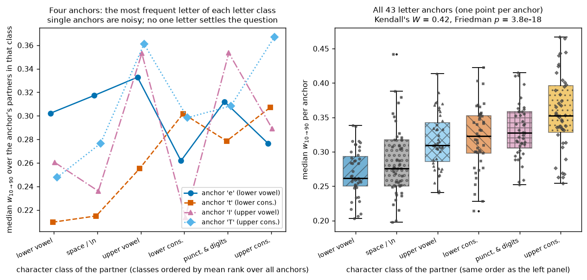
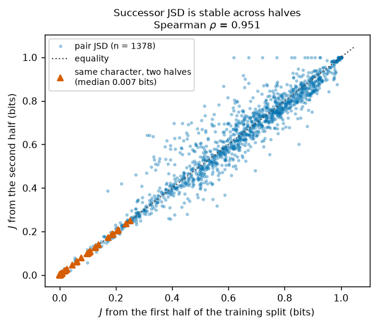

# RESULTS — character classes and successor divergence as predictors of transition width

Detailed evidence record for this direction. `REPORT.md` carries the short argument; this file holds the
source validation, the full numbers, and the checks that did not need to enter the report. All numbers
come from `results/analysis.json`, produced by `experiments/analysis.py` (CPU only, no model loaded).

Terms used below are defined in `REPORT.md` Methods: the transition width `w` (span of interpolation
position over which the output moves from 10% to 90% of the way between the two endpoint outputs; small
means abrupt, 0.8 means linear), the successor divergence `J` (base-2 Jensen–Shannon divergence between
the corpus distributions of the characters that immediately follow the two endpoint characters), and the
six character classes.

## 1. Source validation (S1)

Every width analysed here was computed in an earlier direction and is reused unchanged. Before using it
we re-derived its summary statistics and checked its recorded provenance, so that nothing downstream
depends on an unverified artefact.

| check | value |
|---|---|
| source | `../dir13_plateau_on_grok_gpt/results/allpairs_summary.json` + `allpairs_raw.npz` |
| source git commit | `01d2501db74cd829db2d9efeada16246b8ec1efe` |
| corpus SHA-256 | `86c4e6aa…dc565ed` (matches the value recorded at training time) |
| corpus / training split | 1,115,394 characters; first 1,003,854 used for training |
| vocabulary | 65 characters, order equals `sorted(set(corpus))` |
| context / interpolation | `"The house was "`, 50 positions, block-0 residual stream, final position patched |
| checkpoint | step 30,000 |
| pairs measured | 2,080; widths undefined: 0 |
| endpoint fidelity | max endpoint error 1.7e-05, max prefix error 0.0, max `d(0)` 3e-06, min `d(1)` 0.999998 |
| median `w`, all 2,080 pairs | 0.3549 |
| median `w`, 1,378 well-trained pairs | 0.3202 |
| median `w`, 702 pairs touching a rare character | 0.4819 |
| median `w`, step-0 checkpoint (control) | 0.8029 |
| well-trained characters (≥1,000 train occurrences) | 53; excluded: `$ & 3 J Q V X Z j q x z` |
| letter anchors | 43 |

The step-0 median of 0.803 is the straight-line value, so the sharp transitions are a property of the
trained network rather than of the interpolation procedure. The well-trained and rare-character medians
reproduce the earlier direction's figures exactly (0.3202 and 0.4819), which is why the sweep is reused
rather than rerun.

## 2. Character classes seen from letter anchors (S2)

For each of the 43 well-trained letters we grouped its 52 well-trained partners into the six classes and
took the median `w` in each. The table averages those per-anchor medians and gives the mean rank each
class received (1 = narrowest of the six for that anchor).

| partner class | well-trained members | mean per-anchor median `w` | median over anchors | IQR over anchors | mean rank |
|---|---|---|---|---|---|
| lower vowel | 5 | 0.270 | 0.262 | 0.250–0.293 | 1.79 |
| whitespace (space, newline) | 2 | 0.286 | 0.276 | 0.250–0.317 | 2.37 |
| upper vowel | 5 | 0.316 | 0.309 | 0.286–0.342 | 3.56 |
| lower consonant | 17 | 0.320 | 0.323 | 0.298–0.353 | 3.84 |
| punctuation and digits | 8 | 0.331 | 0.328 | 0.305–0.358 | 4.47 |
| upper consonant | 16 | 0.356 | 0.352 | 0.328–0.396 | 4.98 |

Agreement across anchors is measured with Kendall's coefficient of concordance `W` (0 = anchors rank the
classes independently, 1 = identical rankings) and the Friedman test over the 43 × 6 matrix of per-anchor
class medians:

- raw widths: `W` = 0.424, Friedman χ² = 91.2, p = 3.8e-18, 43 anchors;
- after removing each anchor's partner-frequency trend (rank of `w` residualised on rank of the
  partner's log training frequency, within the anchor): `W` = 0.267, χ² = 57.4, p = 4.3e-11;
- 38 of 43 anchors (88%) place lower-case vowels below upper-case consonants;
- per-anchor overall medians range from 0.258 to 0.404, i.e. the between-anchor spread is comparable to
  the whole class effect.

Both concordance values reproduce the earlier direction's numbers exactly, confirming the analysis is the
same one, now run over the anchor set rather than a single letter. The figure below is the one used in
the report.

**Figure 1.** Transition width by partner class from letter anchors. Both panels: x: partner class,
ordered by mean rank over anchors (narrowest left); y: median `w` over the anchor's partners in that
class. Left: the most frequent letter of each letter class (`e`, `t`, `I`, `T`), each with its own line
style and marker. Right: one point per anchor for all 43; boxes give median and quartiles.

## 3. Successor divergence and its reliability (S3)

`J` is only useful if it is estimated well enough that its ordering of pairs is stable. We therefore
re-estimated the successor distributions on each half of the training split and compared.

| quantity | value |
|---|---|
| bigrams counted (training split) | 1,003,853, no smoothing |
| smallest successor-count total among the 53 well-trained characters | 1,200 |
| median `J` over the 1,378 well-trained pairs | 0.667 bits (range 0.002–1.000) |
| split-half agreement of pair `J` (Spearman) | 0.951 |
| median same-character split-half `J` (noise floor) | 0.0072 bits |
| worst same-character split-half `J` | 0.250 bits |
| noise floor as a fraction of the median pair value | 1.1% |

The measurement is reliable: pair-to-pair ordering barely changes between halves, and the divergence a
character shows against *itself* across halves is about a hundredth of a typical pair value. The
analysis in section 4 is therefore not limited by sampling noise in the bigram counts.

**Figure 2.** Reliability of successor divergence. x: `J` estimated from the first half of the training
split (bits); y: the same pair from the second half. Round dots are the 1,378 well-trained pairs, the
dotted line is equality, and the triangles on the diagonal mark the same-character split-half values that
define the noise floor.

## 4. Successor divergence versus transition width (S4)

The question is whether pairs whose endpoints have more different continuations in the corpus have
narrower transitions. Because pairs share characters, significance is assessed by permuting the 53
character labels, which preserves both pairwise matrices and destroys only their alignment.

| analysis | n | Spearman ρ | p |
|---|---|---|---|
| pooled, well-trained pairs | 1,378 | −0.064 | 0.32 (character-relabel permutation, 5,000 draws) |
| per-anchor median ρ | 43 anchors × 52 partners | −0.205 (IQR −0.401 to −0.081) | 0.002 (permutation, 1,000 draws) |
| per-anchor, partner log-frequency partialled out | 43 anchors | −0.320 (IQR −0.435 to −0.181) | — |
| pooled, pairs touching a rare character (sensitivity) | 702 | +0.081 | 0.03 (naive, not permutation-corrected) |
| between anchors: median `J` vs median `w` | 43 | +0.255 | 0.10 |

Reading the rows: pooling over pairs shows nothing; holding the letter anchor fixed shows a consistent
weak negative relationship (36 of 43 anchors negative, 18 individually significant at 0.05, range −0.637
to +0.246); that relationship survives — indeed strengthens — when the partner's training frequency is
partialled out of both variables (39 of 43 negative), so it is not a restatement of the frequency effect.
The pooled null distribution of ρ has standard deviation 0.065 and a 95% interval of [−0.132, +0.126],
which is why the naive pooled p-value of 0.017 is misleading and is not used.

The between-anchor row explains the discrepancy: across anchors, higher average divergence goes with
slightly *wider* transitions, the opposite sign to the within-anchor trend, though this is weak and not
significant (p = 0.10). Pooling adds this component to the within-anchor one and the two roughly cancel.

The rare-character row is a labelled sensitivity check, not part of the primary estimate. Its sign is
positive rather than negative, but those 702 pairs have both unreliable successor estimates (as few as 1
occurrence for `$`) and systematically wider transitions (median `w` 0.482 versus 0.320), so we draw no
conclusion from it beyond noting that the primary sample's frequency threshold matters.

**Figure 3.** Successor divergence against transition width. Left: x: `J` in bits; y: `w`; one dot per
well-trained pair, with ten equal-count bin medians on the diamond-marked line. Right: x: the Spearman ρ
between `J` and `w` within one anchor across its 52 partners; y: number of anchors. Gray band: 95% range
of the median ρ under character-relabel permutation; dashed line: observed median; dash-dotted line:
pooled value.

Class averages of `J` (mean over anchors of the per-anchor median divergence to that class) are: lower
vowel 0.60, lower consonant 0.49, upper vowel 0.73, upper consonant 0.61, punctuation and digits 0.83,
whitespace 0.69 bits. This ordering does not match the width ordering in section 2 — lower consonants are
the least divergent class but only middling in width, punctuation the most divergent but among the widest
— so successor divergence does not account for the character-class pattern.

## Supporting figure used only for definitions

**Figure 4.** How the transition width is defined. x: interpolation position `t` from endpoint `a` to
endpoint `b`; y: relative output distance `d(t)`. Three single pairs (solid, dashed, dash-dotted; each
labelled with its width), the median over the 1,378 well-trained pairs (thick gray), and the
straight-line reference `w` = 0.8 (dotted).

## Headline

Transition widths from letter anchors are consistently ordered by the partner's character class
(Kendall's `W` = 0.424, p = 3.8e-18 over 43 anchors), with lower-case vowels narrowest and upper-case
consonants widest; successor divergence predicts width only within a fixed anchor and only weakly
(median ρ = −0.205, permutation p = 0.002), with no pooled relationship (ρ = −0.064, p = 0.32) and no
capacity to explain the class ordering.
