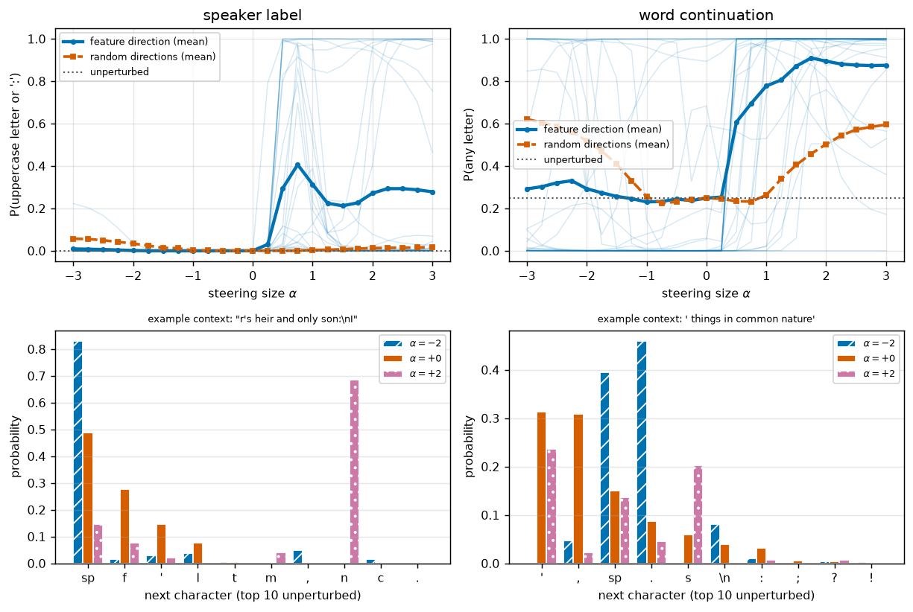
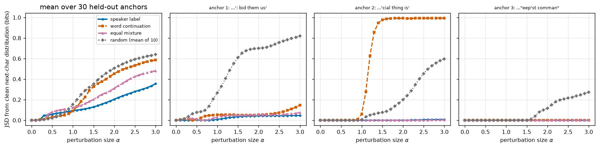
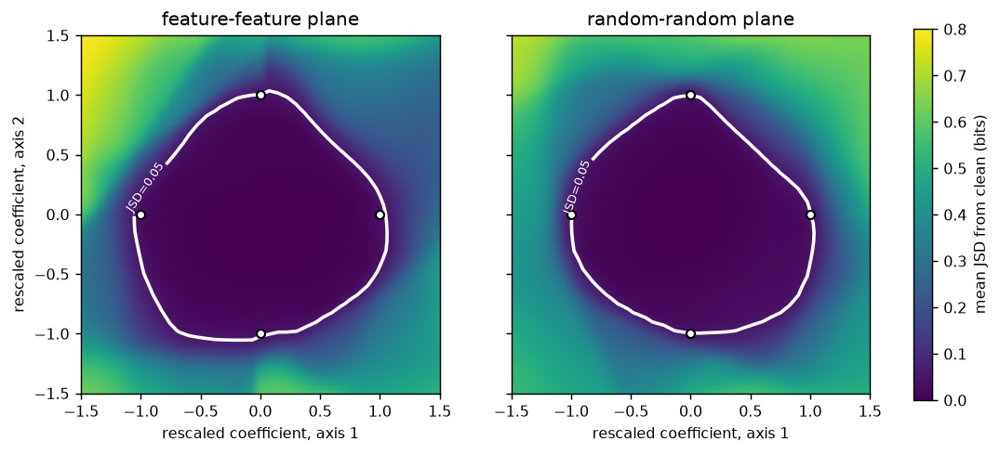

# RESULTS — feature-specific error correction, first-pass geometry test on a character-level GPT

Detailed evidence record for the question in `REPORT.md`: does this model treat two meaningful
linguistic directions differently from arbitrary directions? Current-best numbers only.

## Model and data

Every number below comes from one checkpoint of one model; this table fixes exactly which model, which
hook point and which data split, so each later result can be traced to them.

| item | value |
|---|---|
| corpus | tinyshakespeare, 1,115,394 characters, 65-character vocabulary (SHA-256 `86c4e6aa…c565ed`) |
| model | 12 layers, 12 heads, width 240, context 128, dropout 0.2 |
| training | Adam lr 1e-3 cosine → 1e-4, wd 0, batch 48×128, 30,000 steps, seeds 1337 / 42 |
| final | val loss 2.359, val next-character accuracy 0.550 (`results/train_meta_char.json`) |
| intervention | residual stream after block 0, last character position |
| readout | next-character distribution at the same position |
| splits | directions from corpus first 90%; all measurements on the held-out last 10% |

dir13's checkpoint and corpus were wiped from `/tmp`, so the model was retrained here with dir13's exact
recipe and seeds (`experiments/train_char_gpt.py`). The reproduction matched dir13's logged curve step
for step (step 2500: train 1.299 / val 1.504 / acc 0.552 in both logs).

## S0 — matched example counts

Matching is on the final character of the context, so a direction cannot be explained by character
identity alone (`results/feature_counts.json`, `results/feature_examples.txt`).

| feature | positives (train) | negatives (train) | matched pairs, train | matched pairs, held-out |
|---|---|---|---|---|
| speaker label | 46,324 | 28,589 | 23,010 | 2,742 |
| word continuation | 499,130 | 167,841 | 152,467 | 16,683 |

Both clear the 60-pair requirement by orders of magnitude. Each direction uses 30 training pairs; a
disjoint 30 held-out pairs test it.

**Known confound (speaker label).** Positives sit mid-word inside an all-caps label; matched negatives
are usually a capital at a line or sentence start. Requiring an uppercase *preceding* character as well
leaves only 2 usable held-out pairs, so the final-character matching is kept and the confound is
reported rather than removed.

## S1 — do the directions mean what we claim?

Metric: probability mass on the target character set $T$ (uppercase-or-colon for speaker label, any
letter for word continuation), averaged over 30 held-out contexts. Baseline: 10 random unit directions
at the same steering size. Source: `results/s1.json`.

| direction | clean | feature $\alpha{=}1$ | feature $\alpha{=}3$ | random $\alpha{=}1$ | random $\alpha{=}3$ |
|---|---|---|---|---|---|
| speaker label | 0.0002 | 0.313 | 0.278 | 0.004 | 0.017 |
| word continuation | 0.248 | 0.778 | 0.875 | 0.263 | 0.595 |

Both pass: the target mass rises far above the random baseline and in the predicted linguistic
direction, so both directions were kept and no line-ending replacement was needed. Cosine between the
two raw directions is −0.60; S2 and S3 orthogonalize before mixing.

The effect is **one-sided**: negative $\alpha$ leaves the target mass near its clean value (speaker label
0.008 and word continuation 0.292 at $\alpha = -3$) rather than suppressing it. Large random
perturbations also raise letter probability (0.595 at $\alpha = 3$), so only the low-$\alpha$ region
separates the feature direction from noise for word continuation.

**Figure 1.** x: steering size $\alpha$. Top y: probability mass on the target set — uppercase-or-colon
(left), any letter (right) — mean of 30 held-out contexts. Series: feature direction (solid/circles),
mean of 10 random directions (dashed/squares), unperturbed level (dotted), individual contexts (thin
translucent). Bottom: one context's next-character distribution over its ten likeliest characters at
$\alpha = -2, 0, +2$, separated by bar hatching.

## S2 — single directions versus their equal mixture

30 held-out anchors in ordinary running text; the same perturbation sizes along speaker label, word
continuation, their equal mixture (overlap removed) and 10 random directions. Metric: Jensen–Shannon
divergence in bits from the clean next-character distribution. Source: `results/s2.json`.

Averaged over the anchors, the mixture is not the last condition to move: it sits between the two single
directions at every size, and random directions produce the largest change beyond $\alpha \approx 1.2$.

| $\alpha$ | speaker label | word continuation | equal mixture | random |
|---|---|---|---|---|
| 0.3 | 0.046 | 0.011 | 0.009 | 0.006 |
| 0.6 | 0.068 | 0.038 | 0.092 | 0.035 |
| 1.2 | 0.104 | 0.182 | 0.144 | 0.251 |
| 1.8 | 0.171 | 0.400 | 0.268 | 0.457 |
| 2.4 | 0.265 | 0.520 | 0.406 | 0.580 |
| 3.0 | 0.355 | 0.585 | 0.481 | 0.640 |

Perturbation size is comparable across conditions by construction: mean relative displacement
$\lVert h(\alpha) - h_0 \rVert / \lVert h_0 \rVert$ at $\alpha = 1.2$ is 0.852 for speaker label and
0.831 for the mixture.

Where each mean curve first reaches JSD = 0.05 bits, and the per-anchor picture:

| condition | mean curve crosses 0.05 | median per-anchor crossing | anchors that cross (of 30) |
|---|---|---|---|
| speaker label | $\alpha = 0.38$ | 1.16 | 20 |
| word continuation | $\alpha = 0.79$ | 1.04 | 24 |
| equal mixture | $\alpha = 0.39$ | 1.00 | 20 |
| random (mean of 10) | $\alpha = 0.69$ | 0.82 | 30 |

The prediction — both singles leaving the low-change region before the mixture — is not supported. The
mixture falls *between* the two singles on the mean curve and has the lowest median per-anchor crossing
of the three. Per anchor, the single curve is above the mixture in 7 of 16 anchors (speaker label) and
12 of 19 (word continuation) among anchors where both cross; that is close to a coin flip in both cases.

Random directions are the most disruptive condition at every size beyond $\alpha \approx 1.2$ and have
the earliest median crossing (0.82). The model is not more output-sensitive along these two feature
directions than along arbitrary ones.

**Figure 2.** x: perturbation size $\alpha$; y: JSD in bits from the clean next-character distribution.
Series: speaker label (solid/circles), word continuation (dashed/squares), equal mixture
(dash-dotted/triangles), mean of 10 random directions (dotted gray/diamonds). Left: mean over the 30
held-out anchors. Right: three individual anchors on the same axes, context printed above each.
Anchor-to-anchor variation is large: at two of the three, the feature directions barely move the output
while random directions do.

## S3 — the two-dimensional planes

12 held-out anchors; a 41×41 grid over the plane spanned by the two orthogonalized feature directions,
and over a plane spanned by two random orthonormal directions at the same anchors. Each axis is rescaled
per anchor so the perturbation size at which that axis alone first reaches JSD = 0.05 bits sits at
$\pm 1$. Source: `results/s3.json`.

**Selection effect.** 4 of the 12 anchors are dropped because some axis never reaches 0.05 bits within
the scan ($\alpha \le 6$), leaving the rescaling undefined. Those are exactly the anchors where feature
directions are weakest, which biases the remaining figure *toward* the prediction, not against it.

| quantity | feature plane | random plane |
|---|---|---|
| fraction of grid below JSD 0.05 | 0.344 | 0.315 |
| mean JSD at the 45° point (0.68, 0.68) | 0.123 | 0.172 |
| mean JSD at (1, 1) | 0.299 | 0.489 |
| median crossing size per axis (+, −) | (1.22, 0.23), (0.87, 0.63) | (0.87, 0.80), (0.84, 0.91) |

The mean feature plane is slightly more stable between its axes than the random plane, which is the
predicted direction, but the per-anchor values do not support it: the feature plane is the lower of the
two at the 45° point in only 5 of 8 anchors, and per-anchor values span 0.008–0.47 (feature) and
0.007–0.76 (random). The anchor-to-anchor spread is an order of magnitude larger than the difference
between the means.

**Figure 3.** Both axes are rescaled coefficients: $\pm 1$ (white circles) marks where a perturbation
along that axis alone first reaches JSD = 0.05 bits. Color: mean JSD from the clean distribution in bits
(viridis, dark = unchanged), averaged over the 8 retained anchors; white contour = the 0.05-bit level.
Left: the plane spanned by the two feature directions. Right: a plane spanned by two random directions,
same anchors and same rescaling procedure.

## Headline

Both constructed directions steer the model in the expected linguistic way (S1), but the geometry test
gives **no visible support** for feature-specific error correction at this scale: the equal mixture
leaves the low-change region at the same perturbation size as the single directions (S2), the
feature-feature plane is not visibly broader between its axes than a random plane (S3), and random
directions change the output more than either feature direction. One model, one layer, two hand-built
difference-of-means directions; this is not evidence against error correction in general.
