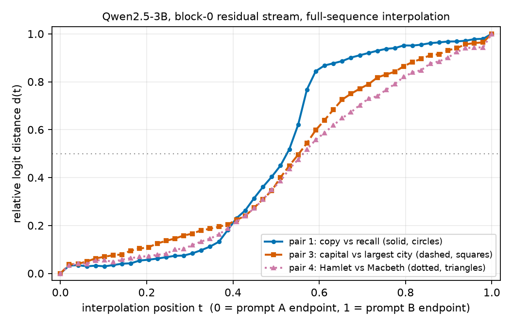
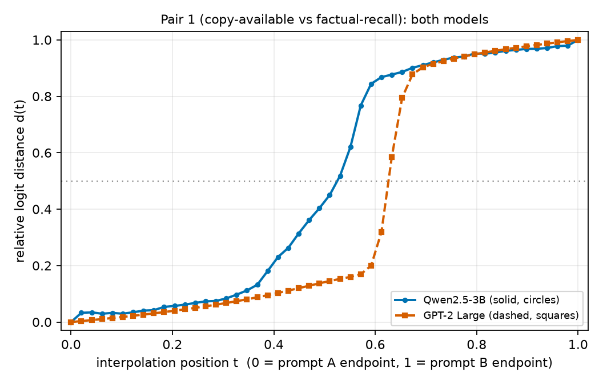

# Do "same answer, different route" prompt pairs produce an activation plateau? (GPT-2 Large and Qwen2.5-3B)

## Summary

Take the internal state a language model builds while reading one prompt, take the state it builds
for a second prompt, and slide continuously from the first to the second, feeding each intermediate
state back into the model. The output does not always change smoothly along the way. Sometimes it
barely moves for most of the path and then flips over a short stretch. That flat stretch is what this
project calls an **activation plateau**. Plateaus matter for safety work because they describe a model
that is insensitive to large internal changes and then abruptly very sensitive to a small one — the
regime in which model edits, steering vectors, or distribution shift produce surprises.

The research question is narrow and empirical: **do four specific hand-designed prompt pairs — pairs
that should give the model the same next word by two different routes — produce a visible plateau?**

An earlier version of this experiment ran on GPT-2 Large (774M parameters) and three of the four
pairs never reached the interpolation stage, because GPT-2 Large did not produce the intended answer.
Following reviewer feedback we repeated the whole experiment on a roughly four-times-larger model,
Qwen2.5-3B, and added a column to the screening table reporting the token each model actually
predicts. Two findings come out of that.

First, the failures were mostly a limitation of the small model. On Qwen2.5-3B, pairs 3 and 4 now
produce the intended answer and become testable, so three of four pairs reach the interpolation stage
instead of one. Pair 2 (`The number after six is` → `seven`) still fails, and the new prediction
column shows exactly how: Qwen2.5-3B puts its top probability on a blank-filler token, ` __`, treating
the prompt as a fill-in-the-blank exercise, with ` seven` only fourth at probability 0.07.

Second, and more interesting, having more testable pairs did not produce more plateaus. Only pair 1 —
"Paris" when the answer is already sitting in the context, versus "Paris" from stored knowledge —
shows the flat-then-sharp shape, and it shows it on both models (Figures 1 and 2). Pairs 3 and 4 move
steadily across the whole path. Whatever produces the plateau in pair 1 is not a generic property of
"same answer, different route" prompts.

## Methods

### Data & Model

**Models.** GPT-2 Large (`gpt2-large`, 774M parameters, 36 transformer blocks, float32) and
Qwen2.5-3B (`Qwen/Qwen2.5-3B`, 3.09B parameters, 36 blocks, bfloat16). Both are base language models
run with greedy decoding and no sampling. Qwen2.5-3B is the largest Qwen2.5 base model that fits this
project's GPU share; bfloat16 is required for the same reason.

**Data.** There is no dataset. The inputs are eight hand-written prompts forming four pairs, listed
verbatim in the Results section. Each pair is built so that both prompts should be followed by the
same word for different reasons (copying it from context versus recalling it, and so on).

**Hook point.** Interpolation happens at the *residual stream* — the running vector, one per token
position, that each transformer block reads from and writes back to. We use `resid_post` after block
0, the output of the first of the 36 blocks, in both models.

**What is interpolated.** The two prompts in a pair differ at more than one token position, so we
interpolate the **entire residual-stream sequence** (all positions), not only the final token. For
each position we interpolate the direction of the vector with SLERP (spherical linear interpolation:
moving along the arc between two unit vectors rather than the straight chord, so intermediate vectors
keep a sensible length and direction) and interpolate the L2 norm linearly. This is the interpolation
used by the activation-plateau reference implementation this project follows. The interpolated
sequence is written back into block 0's output and we read the logits — the model's raw pre-softmax
scores over the vocabulary — at the final token position.

**Sample size.** 50 interpolation positions, `t` evenly spaced from 0 to 1 inclusive, per tested pair:
three pairs on Qwen2.5-3B and one on GPT-2 Large. One layer, two models, four hand-designed pairs.
This is a small designed probe, not a survey, and nothing here estimates how common plateaus are.

**Screening rule.** Before interpolating, each prompt is continued greedily for 6 tokens. A pair is
interpolated only if both prompts yield the intended answer inside that continuation **and** the two
prompts tokenize to the same length, since a position-by-position interpolation between sequences of
different lengths is not defined. One minimal wording repair was permitted for a length mismatch; it
was used once, on pair 3, in both models.

**What the model actually predicts.** Reviewer feedback asked for this, and it is what turns "pair 2
failed" into a diagnosis. For every prompt we also record the top-1 next token at the end of the
prompt and its probability, plus the top 5 for the record (in `RESULTS.md`). The greedy continuation
alone hides *why* a screen failed; the top-1 token separates a model that lacks the fact from a model
that has the fact but is answering in a different format. Both screening tables in Results carry this
column, and it is what identifies pair 2's failure on Qwen2.5-3B as a formatting effect.

### Metrics

We need one number per interpolation position saying "how far along is the output?". The obvious
choice — the predicted word — is useless by construction here, because every pair is designed so both
prompts predict the *same* word, so the argmax never moves and reports nothing. We therefore measure
where the whole final-position logit vector sits between the two endpoints. Writing `x(t)` for the
final-position logit vector at interpolation position `t`, with `A = x(0)` and `B = x(1)` the endpoint
logit vectors, the relative logit distance is:

```math
d(t) = \frac{\lVert x(t) - A \rVert}{\lVert x(t) - A \rVert + \lVert x(t) - B \rVert}
```

Read it as a fraction of the journey: `d = 0` means the output equals the prompt-A output, `d = 1`
means it equals the prompt-B output, `d = 0.5` means equidistant. Neither end is "better" — the
*shape* of the curve is the result, not its level. A straight diagonal means the output tracks the
internal interpolation proportionally; a flat stretch followed by a sharp rise is a plateau. This
metric is consumed by Figures 1 and 2, the two quantitative results in this report.

**Plateau verdict.** This is deliberately a visual call with no fitted threshold: we report "plateau
visible" only when `d(t)` visibly hugs one endpoint over an extended part of the path and then changes
much faster over a shorter region, and "no clear plateau" otherwise. No change point is fitted, no
plateau score is computed, and no statistical test is run. The question is whether the effect is
visible at all in these four pairs.

### Baselines

There is no competing method to compare against; this is a screening question about four specific
prompt pairs. The reference point for each curve is the qualitative alternative to a plateau — a
`d(t)` that rises steadily across the whole path — and pairs 3 and 4 turn out to supply that
comparison from inside the experiment. The correctness control is the endpoint check reported in
Results: patching the full block-0 sequence overrides everything downstream, so the patched endpoints
must reproduce the clean runs.

## Results

### A bigger model rescues two of the three failed pairs

The table below gives every prompt verbatim on Qwen2.5-3B, its tokenized length, the greedy 6-token
continuation (`\n` stands for a newline), and the requested prediction column: the single token the
model actually assigns highest probability to at the end of the prompt, with that probability. Pairs 3
and 4 now answer as intended, so the screen keeps three of four pairs rather than one.

| Pair | Side | Exact prompt | Tokens | Top-1 next token (prob) | Greedy 6-token continuation | Intended | Verdict |
|---|---|---|---|---|---|---|---|
| 1 Copy vs recall | A | `The capital of France is Paris. The capital of France is` | 12 | ` Paris` (0.62) | ` Paris. The capital of France` | Paris | **pass** |
| 1 | B | `The capital of Spain is Madrid. The capital of France is` | 12 | ` Paris` (0.95) | ` Paris. The capital of Germany` | Paris | **pass** |
| 2 Successor vs predecessor | A | `The number after six is` | 5 | ` __` (0.19) | ` ____\nA. 5` | seven | fail |
| 2 | B | `The number before eight is` | 5 | ` seven` (0.18) | ` seven. The number after eight` | seven | pass |
| 3 Different relation | A | `The capital of France is` | 5 | ` Paris` (0.45) | ` Paris. The capital of the` | Paris | pass (length mismatch) |
| 3 | B | `The largest city in France is` | 6 | ` Paris` (0.26) | ` Paris. The largest city in` | Paris | pass |
| 4 Different entity | A | `The author of Hamlet is` | 6 | ` ______` (0.18) | ` ______.\nA. William Shakespeare` | Shakespeare | pass (see caveat) |
| 4 | B | `The author of Macbeth is` | 6 | ` ______` (0.14) | ` ______.\nA. William Shakespeare` | Shakespeare | pass (see caveat) |

Pair 3 was length-mismatched at 5 versus 6 tokens, so it received the one permitted wording repair,
`The capital city of France is` in place of `The capital of France is`. On Qwen2.5-3B that equalises
the lengths at 6 tokens and the repaired A side still predicts ` Paris` (probability 0.43), so pair 3
becomes testable. Every figure and number below for pair 3 uses the repaired A prompt.

The prediction column earns its place on pair 2. The greedy continuations say only that side A failed;
the top-1 token says why. Qwen2.5-3B reads `The number after six is` as a fill-in-the-blank quiz item
and puts 0.19 on ` __`, continuing ` ____\nA. 5`, while ` seven` sits fourth at 0.07 (`RESULTS.md`,
pair 2 top-5 table). The knowledge is present and mis-ranked behind a formatting habit. On the B
side the same model answers ` seven` outright, so the pair fails on one side only.

**Caveat on pair 4.** Both of its prompts produce the identical continuation
` ______.\nA. William Shakespeare`, so the intended answer does appear and the documented screen — the
intended answer occurs in the greedy continuation — passes it. The immediate next token is a
blank-filler rather than the answer itself, the same quiz-formatting habit as pair 2. Pair 4 is
therefore reported as tested, with the reading of its endpoints qualified: the two endpoint logit
vectors describe the model's blank-filler state, not a state that is about to emit "Shakespeare".

For comparison, the same screen on GPT-2 Large, with the same prediction column, shows failures of a
different kind — the small model does not have the answer available in any format:

| Pair | Side | Tokens | Top-1 next token (prob) | Greedy 6-token continuation | Intended | Verdict |
|---|---|---|---|---|---|---|
| 1 Copy vs recall | A | 12 | ` Paris` (0.65) | ` Paris.\n\nThe capital` | Paris | **pass** |
| 1 | B | 12 | ` Paris` (0.94) | ` Paris. The capital of Germany` | Paris | **pass** |
| 2 Successor vs predecessor | A | 5 | ` the` (0.28) | ` the number of times the player` | seven | fail |
| 2 | B | 5 | ` the` (0.27) | ` the number of times the player` | seven | fail |
| 3 Different relation | A | 5 | ` the` (0.10) | ` the capital of France.\n` | Paris | fail |
| 3 | B | 6 | ` the` (0.10) | ` the capital, Paris. It` | Paris | pass (length mismatch) |
| 4 Different entity | A | 6 | ` a` (0.13) | ` a man of the world,` | Shakespeare | fail |
| 4 | B | 7 | ` a` (0.11) | ` a man of the world,` | Shakespeare | fail |

GPT-2 Large's repaired pair-3 A prompt continues ` home to the world's largest` (top-1 ` home`, 0.08),
so the repair fixes its length without fixing its answer, and pair 3 stays untestable on GPT-2 Large.
Only pair 1 survives there.

### Only pair 1 shows a plateau, on either model

Before reading the curves, the interpolation machinery has to be shown to work. Patching the full
block-0 sequence overrides every downstream computation, so at `t = 0` and `t = 1` the patched logits
must reproduce the clean runs. On Qwen2.5-3B the patched-versus-clean L2 differences are 15.6 and 12.9
(pair 1), 10.3 and 11.8 (pair 3), 12.8 and 12.9 (pair 4) — around 3% of the endpoint separations of
543.2, 377.5 and 321.5, which is the expected size of bfloat16 rounding. On GPT-2 Large in float32 the
same differences are 0.0009 and 0.0012 against a separation of 445.2. The endpoints are far apart in
every case, so `d(t)` measures a real gap.

Figure 1 answers the report's question for all three testable pairs at once: as the internal state
slides from prompt A to prompt B, does the output move steadily, or wait and then jump?



**Figure 1.** Qwen2.5-3B, block-0 residual stream, full-sequence interpolation, 50 positions.
x: interpolation position `t` (0 = prompt A endpoint, 1 = prompt B endpoint). y: relative logit
distance `d(t)` as defined in Methods (0 = output equals the prompt-A endpoint, 1 = equals the
prompt-B endpoint). Three series: pair 1, copy-available versus factual-recall (solid, circles);
pair 3, `The capital city of France is` versus `The largest city in France is` (dashed, squares);
pair 4, `The author of Hamlet is` versus `The author of Macbeth is` (dotted, triangles). Dotted
horizontal line marks `d = 0.5`. Verdicts: pair 1 **plateau visible**, pairs 3 and 4 **no clear
plateau**.

Pair 1 is flat-then-steep. Over the first 40% of the path `d(t)` covers 21% of the endpoint gap; over
the next 20% of the path (`t = 0.4` to `t = 0.6`) it covers 64%, reaching `d = 0.85`; the remaining
40% of the path carries the last 15%. Pairs 3 and 4 cover much less ground in that same middle
region — from `d = 0.22` to `d = 0.62` and from `d = 0.21` to `d = 0.57` respectively over `t = 0.4`
to `t = 0.6`, so 40% and 36% of the gap against pair 1's 64% — and they keep climbing steadily to the
end instead of arriving early. Their
curves are gentle S-shapes with no extended flat stretch, which is what "no clear plateau" means here.

Throughout pair 1's path the top-1 predicted token is ` Paris` at all 50 positions, and the same holds
for pair 3. The movement in `d(t)` is a reorganisation of the full logit vector underneath a
prediction that never changes, which is exactly why the vector-level metric is needed rather than the
predicted word. For pair 4 the top-1 token is ` ______` at all 50 positions, consistent with the
caveat above.

Figure 2 asks whether pair 1's plateau is a quirk of one model. Pair 1 is the only pair testable on
both, so it is the only available check.



**Figure 2.** Pair 1 (copy-available versus factual-recall) on both models, same axes as Figure 1.
Qwen2.5-3B (solid, circles) and GPT-2 Large (dashed, squares). Both curves are flat-then-steep; the
GPT-2 Large transition is sharper and sits later along the path.

Both models show the shape. GPT-2 Large is the more extreme of the two: it covers 10% of the gap over
the first 40% of the path and then 70% between `t = 0.6` and `t = 0.8`. Qwen2.5-3B's transition is
slightly earlier and slightly gentler, but it is still a step rather than a ramp. A plateau in this
pair therefore survives a four-fold increase in model size and a change of model family.

### What this does and does not show

The practical result for anyone designing plateau experiments is that these two screening failures
have different causes and only one of them is fixed by scale. GPT-2 Large fails pairs 2, 3 and 4
because the answer is not available to it at all — its top-1 predictions are generic function words
(` the`, ` a`) at probabilities near 0.1. Qwen2.5-3B has the facts and fails pair 2 for a formatting
reason, ranking a blank-filler token above ` seven`. That distinction is visible only because the
screening tables report the actual top-1 prediction, and it tells a prompt designer to reword rather
than to grow the model.

The scientific result is a negative one and worth stating plainly. Making more pairs testable did not
make plateaus more common: pair 1 plateaus on both models, and pairs 3 and 4 — genuinely
"same answer, different route" contrasts on a model that answers both sides correctly — do not
(Figure 1). Pair 1's distinguishing feature is that its two prompts end with the identical clause
`The capital of France is` and differ only in earlier context, while pairs 3 and 4 differ in the final
clause itself. That is a hypothesis about what makes a plateau appear, not a demonstration: three
pairs at one layer cannot separate it from other differences between the prompts.

Two limits bound everything above. The evidence is three pairs, one layer, two models, so nothing here
estimates how common plateaus are in general. And a visible plateau does not show that the model uses
two different computational pathways for the two prompts. The experiment measures the shape of one
output curve along an interpolated path; a claim about internal mechanism would need causal
interventions this study did not run.

## Conclusion

Repeating the experiment on Qwen2.5-3B, four times the size of GPT-2 Large, changes the screening
outcome but not the plateau outcome. Three of four pairs now reach the interpolation stage instead of
one: pairs 3 and 4 produce the intended answer on the larger model, and pair 3 additionally needed the
one permitted wording repair to match token lengths. Pair 2 still fails, and the newly added
prediction column identifies the cause as formatting — Qwen2.5-3B puts 0.19 on the blank-filler token
` __` for `The number after six is`, with ` seven` fourth at 0.07 — where GPT-2 Large's failures are
outright ignorance, its top-1 predictions being ` the` and ` a`.

Of the three testable pairs, only pair 1 shows a plateau: `d(t)` covers 21% of the endpoint gap over
the first 40% of the path and then 64% over the next 20%, with the predicted token fixed at ` Paris`
throughout (Figure 1). The same pair plateaus on GPT-2 Large as well (Figure 2), so the effect is not
specific to one model. Pairs 3 and 4 produce steady S-shaped curves and are reported as **no clear
plateau**, and pair 4's endpoints additionally sit in a fill-in-the-blank state rather than at the
answer. The headline for follow-up work is that "same answer, different route" is not by itself enough
to produce a plateau, and that candidate prompt pairs must be screened — with their actual top-1
predictions inspected, not just their greedy text — before any interpolation is attempted.

Full per-pair evidence, top-5 predicted tokens, endpoint checks and per-position cosines are in
`RESULTS.md`.
