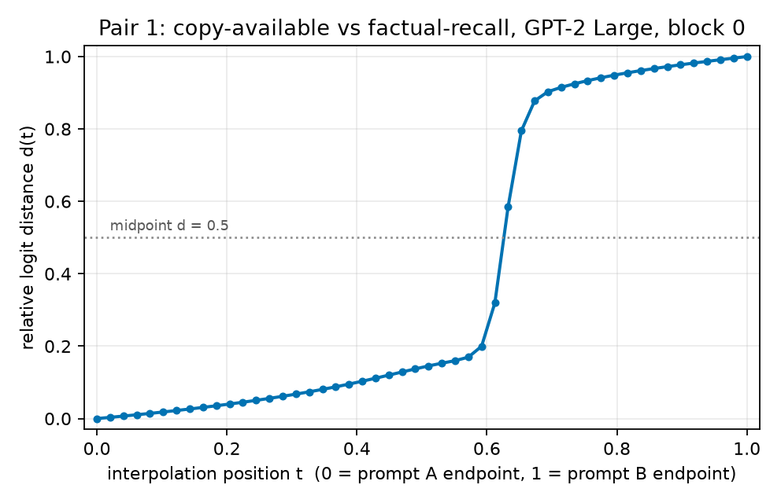

# RESULTS — Same continuation, different computational paths (GPT-2 Large)

> CURRENT-BEST ONLY. Detailed evidence record for `REPORT.md`. History lives in CHANGELOG.md.

## What was run

**Model.** GPT-2 Large (`gpt2-large`, 774M parameters, 36 transformer blocks), float32, single GPU.

**S1 — completion screen.** Each of the 8 prompts was continued greedily for 6 new tokens
(`do_sample=False`). A pair passes only if the intended answer appears in both continuations.
Script: `experiments/s1_completions.py`; raw output `results/s1_completions.json`.

**S1b — the single authorized wording repair** (PLAN.md allows at most one, and names the exact
wording to try for pair 3). Script: `experiments/s1b_repair.py`; raw output `results/s1b_repair.json`.

**S2 — interpolation.** For the one passing, length-matched pair: hook the output of block 0
(`resid_post` after block 0), take the whole 12-token residual-stream sequence for prompt A and for
prompt B, interpolate them position by position (SLERP on the direction, linear interpolation of the
L2 norm), patch the full interpolated sequence back in, and read the final-position logits.
50 interpolation positions, `t = numpy.linspace(0, 1, 50)`. Script: `experiments/s2_interp.py`;
raw output `results/p1_copy_vs_recall_interp.npz`, `results/s2_summary.json`.

## S1 completion screen — all 8 exact prompts

In the continuation column `\n` stands for a literal newline. Only pair 1 gives the intended answer from both sides. Pair 2 fails identically on both sides;
pairs 3 and 4 fail on the A side and are also length-mismatched.

| Pair | Side | Exact prompt | GPT-2 tokens | Greedy 6-token continuation | Intended |
|---|---|---|---|---|---|
| 1 Copy vs recall | A | `The capital of France is Paris. The capital of France is` | 12 | ` Paris.\n\nThe capital` | Paris |
| 1 | B | `The capital of Spain is Madrid. The capital of France is` | 12 | ` Paris. The capital of Germany` | Paris |
| 2 Successor vs predecessor | A | `The number after six is` | 5 | ` the number of times the player` | seven |
| 2 | B | `The number before eight is` | 5 | ` the number of times the player` | seven |
| 3 Different relation | A | `The capital of France is` | 5 | ` the capital of France.\n` | Paris |
| 3 | B | `The largest city in France is` | 6 | ` the capital, Paris. It` | Paris |
| 4 Different entity | A | `The author of Hamlet is` | 6 | ` a man of the world,` | Shakespeare |
| 4 | B | `The author of Macbeth is` | 7 | ` a man of the world,` | Shakespeare |

Combining the two eligibility conditions, pair 1 is the only pair carried forward to S2: it is the
only one whose two prompts both give the intended answer, and its two prompts already have equal
tokenized length.

| Pair | Completion check | Token lengths equal | Eligible for interpolation |
|---|---|---|---|
| 1 | pass | yes (12 = 12) | **yes** |
| 2 | fail (neither side says "seven") | yes (5 = 5) | no |
| 3 | fail (A side) | no (5 vs 6) | no |
| 4 | fail (both sides) | no (6 vs 7) | no |

## S1b — the one authorized wording repair (pair 3)

PLAN.md permits one minimal wording adjustment when token length blocks interpolation, and names
`The capital city of France is` as the variant to try. It fixes the length mismatch and not the
completion failure, so pair 3 remains ineligible and no further variants were tried.

| Side | Exact prompt | GPT-2 tokens | Greedy 6-token continuation |
|---|---|---|---|
| A (repaired) | `The capital city of France is` | 6 | ` home to the world's largest` |
| B (unchanged) | `The largest city in France is` | 6 | ` the capital, Paris. It` |

Pair 4 was not repaired: its failure is the answer itself (both sides continue
` a man of the world,`), so a length fix could not make it eligible.

## S2 — interpolation for pair 1

**Endpoint sanity.** Patching the full block-0 sequence overrides everything downstream of block 0,
so the endpoints should reproduce the clean runs exactly. They do: at `t = 0` the patched
final-position logit vector differs from the clean prompt-A logits by L2 = 0.0009, and at `t = 1`
from the clean prompt-B logits by L2 = 0.0012. The two endpoint logit vectors are far apart
(L2 = 445.2), so `d(t)` is informative rather than a ratio of two near-zero numbers.

**Curve shape.** `d(t)` rises from 0 to 0.170 over `t = 0` to `t = 0.571` (a rise of 0.17 across 57%
of the path), then rises from 0.170 to 0.878 over `t = 0.571` to `t = 0.673` (a rise of 0.71 across
10% of the path), then drifts from 0.878 to 1 over the remaining 33%. Verdict by eye:
**plateau visible**.

**Figure 1.** Relative logit distance for the copy-available vs factual-recall pair. x: interpolation
position `t`, 0 = prompt A endpoint, 1 = prompt B endpoint; y: `d(t)`, 0 = the logits equal the
prompt-A endpoint, 1 = they equal the prompt-B endpoint. Dotted horizontal line marks `d = 0.5`.
The single solid curve with markers is the measurement; there is no second series.

**Predicted word along the path.** The top-1 next token is ` Paris` at both endpoints and at all 50
interpolation positions. The jump in `d(t)` is a movement of the full logit vector while the
argmax prediction never changes.

**Which positions actually move.** Cosine similarity between the prompt-A and prompt-B block-0
states, per token position (0-indexed): 1.00, 1.00, 1.00, 0.651, 0.997, 0.541, 0.973, 0.940, 0.991,
0.961, 0.991, 0.995. The two low values sit at the positions where the prompts genuinely differ
(` France`/` Spain` and ` Paris`/` Madrid`); the rest are close to 1 because block-0 attention has
already mixed a little context. The interpolation therefore mostly moves two token positions.

## Headline

Of the four hand-designed same-continuation contrasts, only the copy-vs-recall pair (pair 1)
produced the intended answer from both prompts on GPT-2 Large; that pair shows a clearly visible
plateau in `d(t)` with a sharp transition near `t = 0.6`. The other three pairs are negative results
at the completion-screen stage, before any interpolation.
