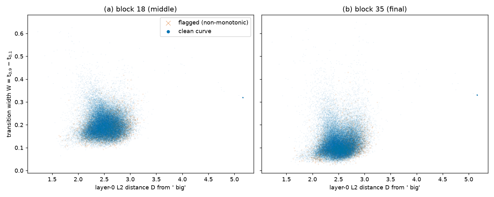
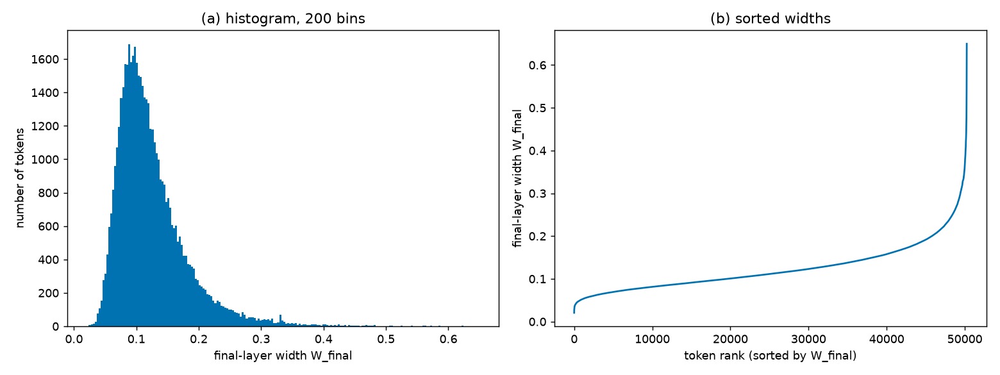
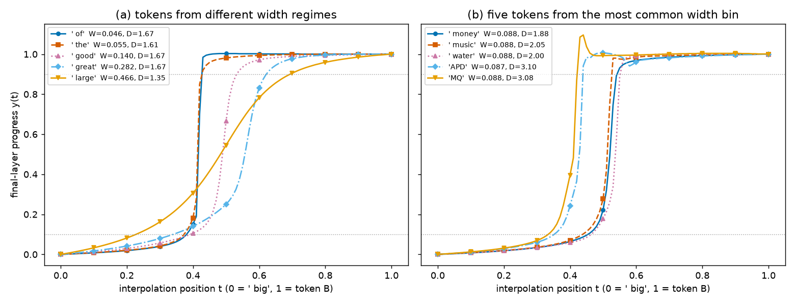

# Does embedding distance predict how sharply GPT-2 Large switches between two tokens?

## Summary

**Question.** Take the prompt "The house was big" and replace ` big` with another token B. Now move
the input smoothly from ` big` to B. Inside GPT-2 Large, the later layers sometimes switch from the
` big` state to the B state abruptly and sometimes gradually. We ask two things:

1. Does the distance between the two input embeddings predict how sharp that switch is?
2. Do the switch widths at the final layer fall into obvious groups?

This matters for the plateau experiments in this project. They interpolate between inputs and then
read "flat stretch, then jump" shapes in the outputs. If input distance alone set the jump width,
those shapes would say little about how the model processes the tokens.

**Answer.** We tested all 50,256 other tokens.
- **Distance.** Input distance does not visibly predict switch width for 97% of tokens (Figure 1).
  Five common words at nearly the same distance range from an almost vertical jump to a slow ramp
  (Figure 3a).
- **Where the widest switches are.** They occur mainly for size words such as ` huge`, ` giant` and
  ` large`, and for rarely seen, oddly formed tokens.
- **Depth.** The final layer switches more sharply than the middle layer for 97.7% of tokens.
- **Groups.** Final-layer widths form one broad peak with a long tail (Figure 2). The one tight
  group is 64 rarely seen tokens (byte-level characters and scraped fragments such as
  ` RandomRedditor`) that share almost the same embedding and the same width.

## Methods

**Data & Model.** We used GPT-2 Large (774M parameters, 36 transformer blocks) in float32. The base
input is the four-token prompt "The house was big". Endpoint A is the last token ` big`. Endpoint B
replaces that last token ID with another vocabulary ID; the text is never decoded and re-tokenized, so
A and B differ only in the last token. We swept all 50,256 other tokens, including `<|endoftext|>`.
No token needed to be excluded.

**Interpolation layer.** Layer 0 is the input embedding (token embedding plus position embedding). We
change only the last position. Both endpoints use the same position embedding, so interpolating the
layer-0 state is the same as interpolating the two token embeddings. The embeddings of ` big` and B
are called h_A and h_B. We feed the model the straight-line mix of the two, at 101 evenly spaced values
of t from 0 to 1:

```math
h(t) = (1-t)\,h_A + t\,h_B, \qquad t \in \lbrace 0, 0.01, \dots, 1 \rbrace
```

**Input distance D** is the size of the input change being interpolated. It is the plain Euclidean (L2)
distance between the two embeddings:

```math
D_B = \lVert h_A - h_B \rVert_2
```

**Readout layers.** We read the last-position output of block 18 (the middle of the network) and of
block 35 (the final block, before GPT-2's last layer norm).

**Progress y(t).** To compare tokens on one scale, we measure how far the readout has moved at step t,
as a fraction of the full distance between the two endpoint readouts. In the equation below, h_l(t) is
the readout at layer l for input h(t):

```math
y_l(t) = \frac{\lVert h_l(t) - h_l(0) \rVert_2}{\lVert h_l(1) - h_l(0) \rVert_2}
```

By construction y = 0 at the ` big` endpoint and y = 1 at the B endpoint.

**Transition width W.** We need one number for how sharp the switch is. We use the stretch of t over
which the readout goes from 10% to 90% of the way to B:

```math
W_l = t_{0.9} - t_{0.1}
```

Here t_0.1 and t_0.9 are the first points where y crosses 0.1 and 0.9. Each crossing is found by
straight-line interpolation between neighbouring sampled points; no smoothing or curve fitting is
used. Small W means an abrupt jump. W near 0.8 would mean a straight ramp. We write W_mid for block 18
and W_final for block 35.

**Flag.** A curve is flagged when it crosses 0.1 or 0.9 more than once, or when y falls by more than
0.05 between neighbouring steps (for example, it overshoots 1 and comes back). Flagged curves stay in
the data and are drawn with a different marker. 5.5% of tokens are flagged, almost all at the final
layer (2,686 there vs. 163 at block 18).

**Checking the measurement.** Before the full sweep, we ran 20 hand-picked tokens. In every case y(0) =
0 and y(1) = 1 exactly, and the marked crossing points sat on the plotted curves (RESULTS.md, S1).
This project uses no baselines and no statistical tests. The questions are descriptive and are
answered from plots.

## Results

### Finding 1 — Distance does not visibly predict switch width

If a larger input change produced a wider or narrower switch, the scatter of width against distance
would show a slope. We plot every token as one point:



**Figure 1.** Each point is one token B. x: layer-0 L2 distance D from ` big`; y: transition width W.
(a) block 18 (W_mid); (b) block 35 (W_final). Round dots = unflagged curves; crosses = flagged curves.
The isolated dot at D ≈ 5.17 is 64 rarely seen tokens drawn on top of each other.

**What is visible.**
- 97% of tokens have D between 2.0 and 3.0 and form one round cloud at both layers, with no visible
  slope. Median W_final is 0.109 for D in 2.0–2.5 and 0.114 for D in 2.5–3.0 (RESULTS.md, S3 table).
- At the sparse edges the median width is higher: 0.164 for D in 3.0–4.0 and 0.331 for the 64 tokens
  with D > 4.
- At a fixed D, widths spread over most of the range.

Figure 3a shows that spread with five common words. Their D lies between 1.35 and 1.67, yet W_final
runs from 0.046 (` of`) to 0.466 (` large`).

The widest switches are not the farthest tokens. The 100 widest final-layer tokens have median D 2.43,
slightly below the vocabulary median of 2.51. They are mostly size words (` huge` has the smallest D of
any token, 1.22, and W_final 0.56) and rarely seen, oddly formed tokens such as ` guiName` and
`Downloadha` (RESULTS.md, S4). This is an observation from one prompt; we did not test why these
tokens switch slowly.

### Finding 2 — The final layer switches more sharply than the middle layer

Figure 1 compares the two layers directly. The whole cloud sits lower at block 35 (median W_final
0.112) than at block 18 (median W_mid 0.195). 97.7% of tokens have a narrower switch at the final
layer. Neither layer shows a slope with D in the bulk.

The final layer is also where irregular curves appear: 2,686 of the 2,788 flagged tokens are flagged
there.

### Finding 3 — Final-layer widths form one broad peak, with one small tight group

If tokens fell into distinct switch types, the histogram would have separate peaks and the sorted
widths would show flat steps. We plot both:



**Figure 2.** (a) Histogram of W_final over all 50,256 tokens (200 bins); x: W_final, y: number of
tokens. (b) The same widths sorted; x: token rank, y: W_final.

**What is visible.**
- The histogram has a single peak near W_final ≈ 0.09–0.10 and a long tail to about 0.65.
- The sorted curve rises smoothly with no flat steps.
- The only separate feature is a small spike at W_final ≈ 0.33. It comes mostly from the 64 tokens with
  D > 4 (43 of the 65 tokens in the tallest bin). These tokens rarely or never appear in normal
  text: control characters, fragments of multi-byte characters, and scraped strings such as
  ` RandomRedditor`, `StreamerBot` and ` externalToEVA`. Their embeddings are nearly identical, so
  their curves nearly coincide (W_final 0.328–0.44, median 0.331).

Along the tail, the tokens change in a consistent way. The narrowest band (< 0.05) contains function
words such as ` of`, ` for` and ` a`. Wider bands contain more adjectives. The widest bands (≥ 0.30)
are dominated by size words: ` large`, ` massive`, ` enormous`, ` huge`, ` giant` (RESULTS.md, S4
table). This is a gradual shift along one tail, not a set of separate groups.

To check that W reflects visibly different curve shapes, we plot some final-layer curves directly:



**Figure 3.** Final-layer progress y(t). x: interpolation position t (0 = ` big`, 1 = token B); y:
y(t). Dotted lines mark 0.1 and 0.9; line style and marker identify each token, and the legend gives
its W_final and D. (a) Five common words with similar D but very different widths. (b) Five tokens
from the most common histogram bin (W_final 0.087–0.090).

In panel (a), small W is a near-vertical jump (` of`, ` the`) and large W is a slow ramp (` large`).
In panel (b), tokens with the same W have the same steep shape but switch at different points, from
about t = 0.40 to 0.53. `MQ` briefly overshoots y = 1 and is one of the flagged curves.

## Conclusion

For "The house was big" in GPT-2 Large, how far B's embedding is from ` big` does not visibly decide
how sharply the downstream representation switches between them.
- **Evidence.** The bulk of the vocabulary shows no slope in Figure 1, and Figure 3a shows words at the
  same distance with very different widths.
- **Depth.** The final layer switches more sharply than block 18 for almost every token (Finding 2).
- **Groups.** Final-layer widths show one broad peak and no separate groups, apart from 64 rarely seen
  tokens with near-identical embeddings (Figure 2).
- **Widest switches.** These come mainly from size words and from rarely seen tokens. That is a
  descriptive pattern; we did not test what causes it.

For the plateau experiments, this suggests that raw embedding distance is a poor stand-in for
switch sharpness.

**Limitations.**
- These results come from one prompt, one model, and one interpolation layer.
- W uses only the first crossing of each level, so it describes the 5.5% flagged curves less well.
