# Does the GPT-2 Large distance-vs-switch-width result hold in four other language models?

## Summary

**Question.** `REPORT.md` studied one prompt, "The house was big", in GPT-2 Large. It replaced the last
token ` big` with every other token B and moved the input smoothly from ` big` to B. It asked whether
the distance between the two input embeddings predicts how sharply the model's internal state switches
from the ` big` state to the B state. It found three things:

1. **Distance.** Embedding distance does not visibly predict switch width.
2. **Depth.** The final block switches more sharply than the middle block (97.7% of tokens).
3. **Shape.** Final-block widths form one broad peak with a long tail; the widest switches are mostly
   size words such as ` huge` and ` large`.

Here we ask: **do these three findings also hold in GPT2-XL, Pythia 1.4B, Llama-3.1-8B and
Qwen3-8B-Base?** For each model we repeat the experiment behind `REPORT.md` Figures 1–3 and the width
table in `RESULTS.md` section S4, over the model's whole vocabulary.

**Answer.** We swept every token of each model's vocabulary (50k–152k tokens per model).
- **Distance (holds in all four).** In every model the bulk of the vocabulary forms one cloud in which
  distance does not visibly predict width (Figures 1, 4, 7, 10). The median final-block width changes
  by at most 0.03 across distance quintiles.
- **Depth (holds in three of four).** The final block is sharper for 95.3% of tokens in GPT2-XL, 95.8%
  in Pythia and 88.8% in Llama. Qwen3-8B-Base is the exception: its median widths are equal at the two
  blocks, and only 56.2% of tokens are sharper at the final block.
- **Shape (holds in all four).** Final-block widths form one broad peak with a tail in every model
  (Figures 3, 6, 9, 12). The peak's position is model-specific (W_final ≈ 0.06 in GPT2-XL, 0.19–0.20 in
  Llama and Qwen3, 0.33 in Pythia). So the 0.30–0.50 band is the tail in the GPT-2 models but typical
  in the others.
- **Widest switches.** Size words are again among the widest: ` large` ranks 1st in Llama, 3rd in
  Pythia and 84th in GPT2-XL. In Qwen3 it ranks 281st, and the very widest tokens are Thai pieces.

## Methods

**Data & Model.** The experiment is the one in `REPORT.md`, repeated unchanged on four models. The
prompt is "The house was big", tokenized with each model's own tokenizer. In every model ` big` is a
single token and is the last token. (Llama's tokenizer also puts its begin-of-text token first; we
keep that default.) Endpoint A is ` big`. Endpoint B replaces that last token ID with another ID; the
text is never re-tokenized. We sweep every other token ID the tokenizer defines:

| Model | blocks | middle block | final block | tokens B swept | weights / arithmetic |
|---|---|---|---|---|---|
| GPT-2 Large (`REPORT.md`) | 36 | 18 | 35 | 50,256 | float32 |
| GPT2-XL | 48 | 24 | 47 | 50,256 | float32 |
| Pythia 1.4B | 24 | 12 | 23 | 50,276 | float32 |
| Llama-3.1-8B | 32 | 16 | 31 | 128,255 | bfloat16 weights, float32 residual |
| Qwen3-8B-Base | 36 | 18 | 35 | 151,668 | bfloat16 weights, float32 residual |

The table above lists what was run. Block numbers count from 0. The middle block is block
n_blocks/2, which matches block 18 of 36 in GPT-2 Large. The final block is the last transformer block,
read before the model's final normalization layer. The Llama-3.1-8B weights come from
`unsloth/Meta-Llama-3.1-8B`, an ungated copy of Meta's base model, because the official repository
needs an access token we do not have. Pythia is `EleutherAI/pythia-1.4b`.

**Interpolation.** Layer 0 is the input embedding of the last token. Call the embeddings of ` big` and
B h_A and h_B. We feed the model the straight-line mix of the two at 101 evenly spaced values of t:

```math
h(t) = (1-t)\,h_A + t\,h_B, \qquad t \in \lbrace 0, 0.01, \dots, 1 \rbrace
```

**Input distance D.** This is the size of the input change. It is the Euclidean (L2) distance between the
two embeddings:

```math
D_B = \lVert h_A - h_B \rVert_2
```

D is measured in each model's own embedding space, so its scale differs between models (for example,
median D is 2.34 in GPT2-XL and 1.39 in Pythia). We therefore compare the *shape* of the width-vs-D
cloud across models, never raw D values.

**Progress y(t) and transition width W.** To put every token on one scale, we measure how far the
readout at block l has moved at step t, as a fraction of the full distance between its two endpoint
readouts. Here h_l(t) is the last-position output of block l for input h(t):

```math
y_l(t) = \frac{\lVert h_l(t) - h_l(0) \rVert_2}{\lVert h_l(1) - h_l(0) \rVert_2}
```

By construction y = 0 at ` big` and y = 1 at B. The switch width is the stretch of t over which y goes
from 10% to 90%:

```math
W_l = t_{0.9} - t_{0.1}
```

t_0.1 and t_0.9 are the first points where y crosses 0.1 and 0.9, found by straight-line interpolation
between neighbouring steps. Small W means an abrupt jump; W near 0.8 means a straight ramp. W_mid is W at
the middle block and W_final is W at the final block.

**Flag.** A curve is flagged when it crosses 0.1 or 0.9 more than once, or when y falls by more than 0.05
between neighbouring steps. Flagged tokens stay in the data and are drawn as crosses.

**What each section shows.** Each model section has the three figures of `REPORT.md`, made the same way:

- *Distance-vs-width scatter* (`REPORT.md` Figure 1): one point per token, D against W at the middle
  and final blocks.
- *Zoom* (`REPORT.md` Figure 2): the same scatter restricted to the dense core. GPT-2 Large used D in
  1.6–3.3; because D scales differ, here the zoom is each model's 5th–95th percentile of D (90% of
  tokens), with the y range set to the min–max W inside it.
- *W_final distribution* (`REPORT.md` Figure 3): a 200-bin histogram of W_final and the same values
  sorted.

Each section also gives the **0.30–0.50 row of the `RESULTS.md` S4 table**: the number of tokens with
0.30 ≤ W_final < 0.50 and the seven with the lowest D. This is the band that contains W = 0.3. The full
tables for every band are in `RESULTS_generalization.md`.

**Comparison.** The reference is the GPT-2 Large result in `REPORT.md`. As there, the questions are
descriptive and are answered from plots; no statistical tests are used. To summarize a slope in one
line, we split each model's tokens into five equal-size groups by D (D quintiles) and report the
range of the five median W_final values.

**Checking the computation.** To fit the 8B models into a 14 GB GPU budget and finish in time, we run
only the last position. The attention keys and values of the first tokens (the vectors that later
positions look up) do not depend on B, so they are computed once and reused. For the two float32
models this matches a full run of the prompt to a relative difference below 3e-5.

The 8B models run in their native bfloat16, a 16-bit number format that rounds every step. Their
weights are not quantized. Blocks that do not fit on the GPU are copied in from CPU memory for each
pass, which changes speed but not results. We keep the residual stream (the hidden-state vector that
each block reads and adds its output to) in float32, which roughly halved the rounding error in a test
on Qwen3. On 32 random tokens we compared W from the reused-prefix run with W from a full run. The
median |ΔW| at the final block was 0.002 for Llama and 0.003 for Qwen3 (largest 0.008 and 0.105).
Differences this small do not change any conclusion below.

## Results

### GPT2-XL

GPT2-XL is the next size up in the GPT-2 family: same training data and tokenizer as GPT-2 Large, with 48
blocks instead of 36. It is the closest test of whether the GPT-2 Large result is a fluke of one model.
To check whether D predicts W, Figure 1 plots every token:

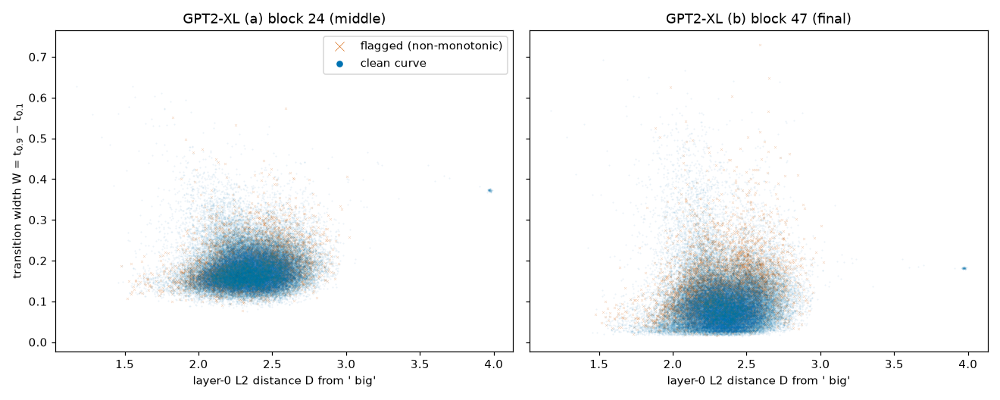

**Figure 1.** GPT2-XL, one point per token B (50,256). x: layer-0 L2 distance D from ` big`; y:
transition width W. (a) middle block 24 (W_mid); (b) final block 47 (W_final). Round dots = unflagged
curves; crosses = flagged curves.

The bulk of the vocabulary (D about 2.0–2.7) forms one cloud with no visible slope. Median W_final is
0.086, 0.090, 0.084 and 0.087 in the four lowest D quintiles and 0.101 in the highest
(`RESULTS_generalization.md`, G1). As in GPT-2 Large, one small group sits apart: 57 byte-level tokens at
D ≈ 3.97 with almost the same width (W_final ≈ 0.18). Figure 2 zooms into the core:

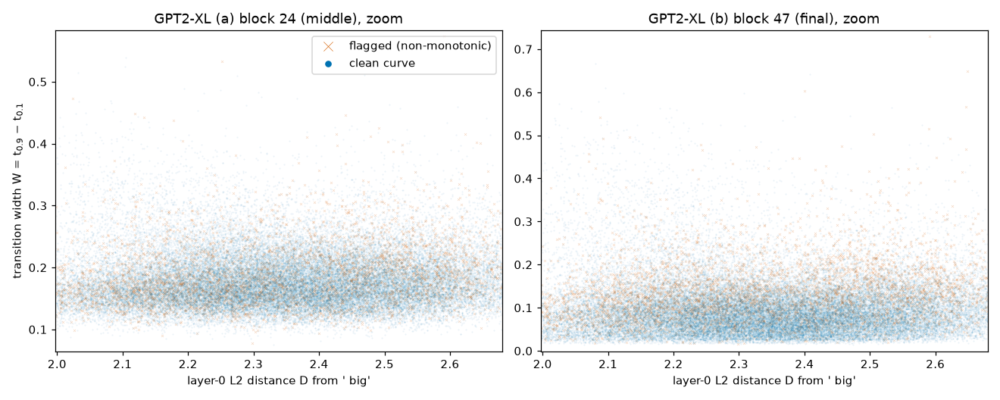

**Figure 2.** Zoom of Figure 1 on the 5th–95th percentile of D (1.998–2.680). x: D; y: W, limited to the
min–max W in that range (block 24: 0.075–0.573; block 47: 0.013–0.729). Markers as in Figure 1.

The zoom shows a flat band at both blocks. The final block is lower than the middle block: median W_final
is 0.089 against median W_mid 0.174, and 95.3% of tokens switch more sharply at the final block. 11.6% of
curves are flagged, almost all at the final block (5.5% in GPT-2 Large). To see whether the final-block
widths form groups, Figure 3 shows their distribution:

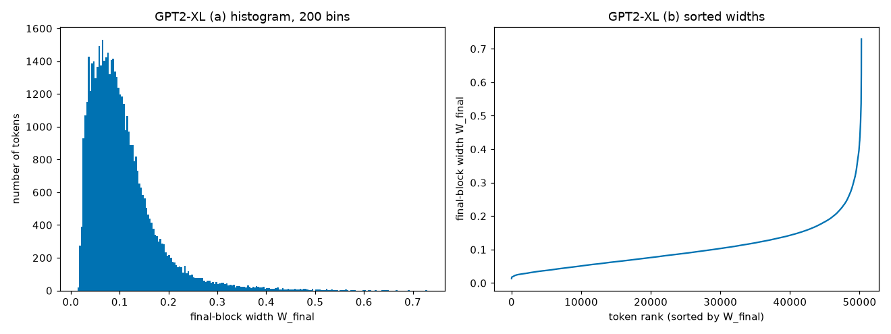

**Figure 3.** GPT2-XL. (a) Histogram of W_final (200 bins); x: W_final, y: number of tokens. (b) The same
values sorted; x: token rank, y: W_final.

There is one broad peak near W_final 0.06–0.07 and a long tail toward 0.7. The sorted curve rises smoothly
with no flat shelves, so there are no separate width groups. The 0.30–0.50 band of the S4 table is again
made of size and amount words, much as in GPT-2 Large (787 tokens there: ` large`, ` bigger`,
` biggest`, ` massive`, ` small`, ` gigantic`, ` enormous`):

| W_final band | tokens | lowest-D examples |
|---|---|---|
| 0.30–0.50 | 1,051 | ` bigger`, ` massive`, ` small`, ` gigantic`, ` enormous`, ` larger`, ` significant` |

The widest tokens mix size words (` giant`, ` monstrous`, ` tremendous`, ` vast`) with rare fragments
(`UGE`, ` externalToEVAOnly`), the same two kinds seen in GPT-2 Large. All three findings hold in GPT2-XL.

### Pythia 1.4B

Pythia 1.4B was trained by a different group on different data (the Pile) with a different tokenizer and
rotary position encoding. Its embeddings are also much smaller in norm, so D covers only 0.94–1.47.
Figure 4 plots every token:

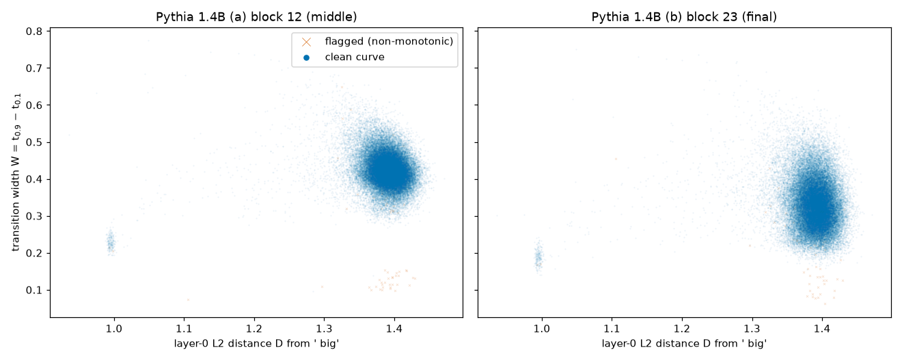

**Figure 4.** Pythia 1.4B, one point per token B (50,276). x: layer-0 L2 distance D from ` big`; y:
transition width W. (a) middle block 12 (W_mid); (b) final block 23 (W_final). Round dots = unflagged
curves; crosses = flagged curves.

Almost all tokens form one cloud near D ≈ 1.39. A separate tight group of 237 tokens sits at D ≈ 1.0 with
W_final ≈ 0.19; they are runs of spaces, tabs and newlines, byte tokens and the padding token. This is the
counterpart of GPT-2 Large's tight group of rarely seen tokens. Figure 5 zooms into the main cloud:

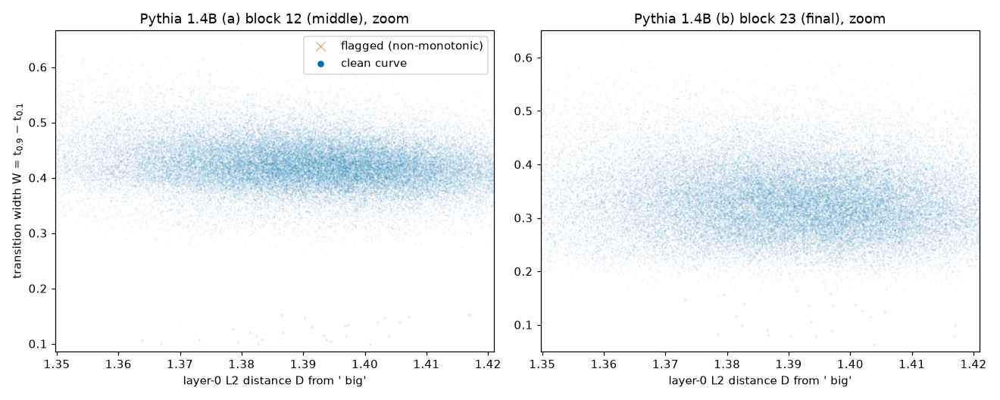

**Figure 5.** Zoom of Figure 4 on the 5th–95th percentile of D (1.350–1.421). x: D; y: W, limited to the
min–max W in that range (block 12: 0.098–0.655; block 23: 0.062–0.639). Markers as in Figure 4.

Inside the core there is a slight downward tilt: median W_final falls from 0.341 in the lowest D quintile
to 0.317 in the highest (G2). That shift is small next to the spread of widths at any one D (most tokens
lie between 0.25 and 0.45), so D still says little about a single token's width. The depth finding holds:
median W_final 0.328 against W_mid 0.423, and 95.8% of tokens switch more sharply at the final block.
Only 0.2% of curves are flagged. Figure 6 shows the distribution:

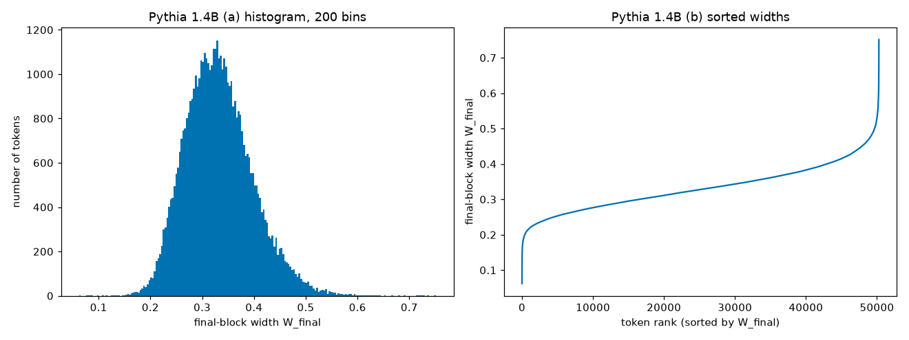

**Figure 6.** Pythia 1.4B. (a) Histogram of W_final (200 bins); x: W_final, y: number of tokens. (b) The
same values sorted; x: token rank, y: W_final.

Again there is one broad peak with a tail and no shelves. But the peak sits at W_final ≈ 0.33, about three
times wider than in GPT-2 Large: Pythia's switches are typically gradual rather than abrupt. As a result
the 0.30–0.50 band holds two thirds of the vocabulary, and its lowest-D examples are ordinary tokens,
not size words:

| W_final band | tokens | lowest-D examples |
|---|---|---|
| 0.30–0.50 | 33,147 | ` Big`, ` BIG`, `14514500`, ` careg`, `␣×8` (8 spaces), `big`, `Big` |

The size words moved up into the ≥ 0.50 band (617 tokens). All 15 widest tokens are size
words: ` huge` (0.75), ` giant`, ` large` (0.73), ` gigantic`, ` enormous`, ` immense`, ` massive`,
` vast`. So the distance and depth findings hold, the single-peak shape holds, and the "size words
are widest" pattern is even cleaner than in GPT-2 Large; only the overall width scale differs.

### Llama-3.1-8B

Llama-3.1-8B is a modern 8-billion-parameter model with 32 blocks and a 128,256-token vocabulary. It is
about ten times larger than GPT-2 Large. Its embeddings are small in norm, so D covers only about
0.58–1.13. Figure 7 plots every token:

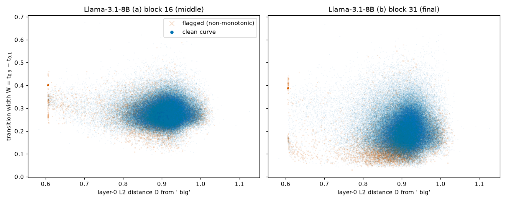

**Figure 7.** Llama-3.1-8B, one point per token B (128,255). x: layer-0 L2 distance D from ` big`; y:
transition width W. (a) middle block 16 (W_mid); (b) final block 31 (W_final). Round dots = unflagged
curves; crosses = flagged curves.

The main cloud (D ≈ 0.8–1.0) has no visible slope. Median W_final by D quintile is 0.199, 0.198, 0.204,
0.208 and 0.205 (`RESULTS_generalization.md`, G3). One tight group sits apart at D ≈ 0.606: 475 tokens,
namely the 256 special and reserved control tokens plus byte-level tokens (shown as `�`). They share
almost the same embedding and almost the same width (median W_final 0.389), and 81% of them are
flagged. This is the same kind of group as GPT-2 Large's 64 rarely seen tokens. Figure 8 zooms into
the main cloud:

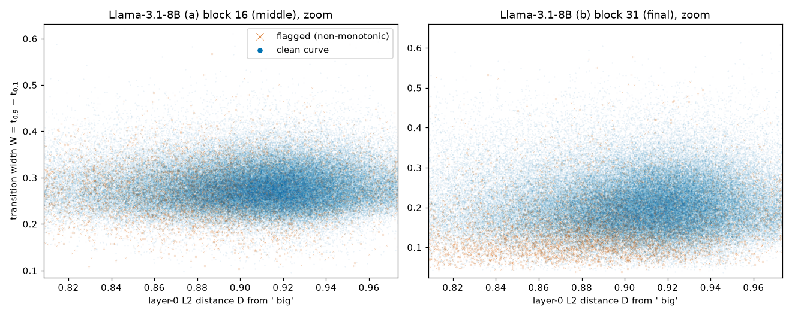

**Figure 8.** Zoom of Figure 7 on the 5th–95th percentile of D (0.809–0.973). x: D; y: W, limited to the
min–max W in that range (block 16: 0.095–0.621; block 31: 0.036–0.648). Markers as in Figure 7.

The zoom shows flat bands at both blocks, with the final-block band lower. Median W_final is 0.203
against W_mid 0.279, and 88.8% of tokens switch more sharply at the final block. That is weaker than
GPT-2 Large's 97.7% but clearly the same direction. 7.5% of final-block curves are flagged; in the zoom,
flagged crosses sit mostly at the narrow bottom edge of the final-block cloud. Figure 9 shows the
distribution:

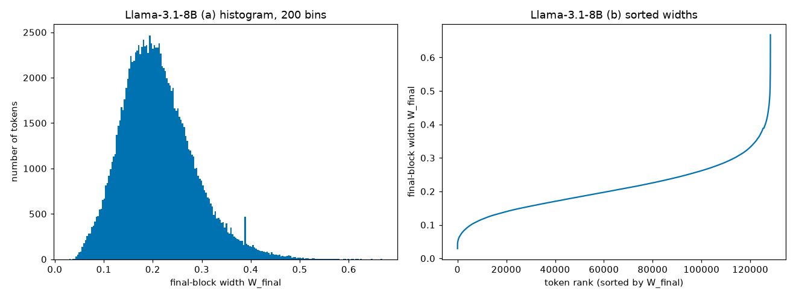

**Figure 9.** Llama-3.1-8B. (a) Histogram of W_final (200 bins); x: W_final, y: number of tokens. (b)
The same values sorted; x: token rank, y: W_final.

There is one broad peak near W_final 0.19–0.20 and a tail to 0.67. The only narrow spike, at W_final ≈
0.39, comes largely from the tight group of special and byte-level tokens (298 of the 682 tokens in
that bin). This matches GPT-2 Large, whose one spike (W_final ≈ 0.33) was also made by its tight group
of rarely seen tokens. The lowest-D examples in the 0.30–0.50 band are Turkish and Cyrillic word
pieces, which sit at the low-D side of the main cloud:

| W_final band | tokens | lowest-D examples |
|---|---|---|
| 0.30–0.50 | 14,583 | `ımda`, ` характериз`, `ючись`, `дивиду`, ` располаг`, `ılmaz`, `sahuje` |

The widest tokens bring back the GPT-2 Large pattern. ` large` has the widest final-block switch of
all 128,255 tokens (W_final 0.668), and ` oversized`, ` huge`, ` substantial`, ` massive` and ` chubby`
are among the 20 widest plain-English tokens. They are mixed with unrelated words and fragments such as ` defiance` and
` alertController`. All three findings hold in Llama-3.1-8B, with a weaker depth effect.

### Qwen3-8B-Base

Qwen3-8B-Base is the most different model in the set: 36 blocks, a 151,669-token multilingual
vocabulary, and very different training data. Figure 10 plots every token:

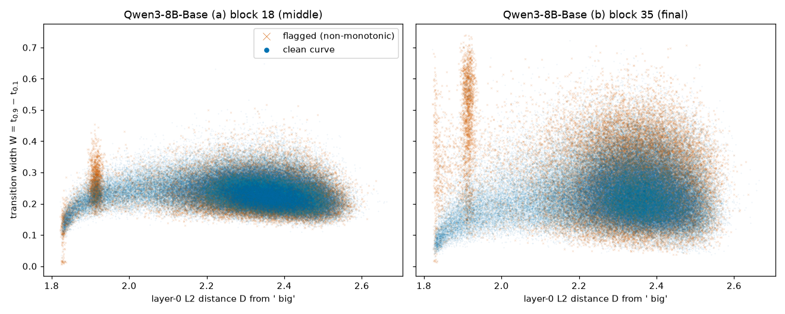

**Figure 10.** Qwen3-8B-Base, one point per token B (151,668). x: layer-0 L2 distance D from ` big`;
y: transition width W. (a) middle block 18 (W_mid); (b) final block 35 (W_final). Round dots =
unflagged curves; crosses = flagged curves.

The bulk (D ≥ 2.1, 88% of tokens) is one cloud with no slope: median W_final by D quintile is 0.215,
0.244, 0.238, 0.232 and 0.220, rising then falling (`RESULTS_generalization.md`, G4). The low-D edge is
different. It is made almost entirely of non-English pieces: Korean syllables, Thai, Hebrew and Arabic
fragments, emoji. There, two structures appear:

- For D below 1.9 (4,245 tokens), W rises with D along a curved ramp, from about 0.05 to 0.2. Inside
  this group, distance does track width.
- At D ≈ 1.91 there is a narrow column of 3,313 tokens with very spread-out final widths (0.2–0.75); half
  of them are flagged.

Figure 11 zooms into the 5th–95th percentile of D, which excludes most of that edge:

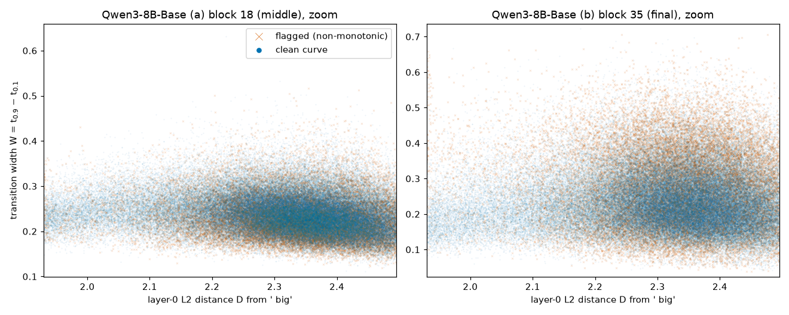

**Figure 11.** Zoom of Figure 10 on the 5th–95th percentile of D (1.930–2.495). x: D; y: W, limited to the
min–max W in that range (block 18: 0.111–0.648; block 35: 0.037–0.722). Markers as in Figure 10.

In the core the depth finding does **not** hold. The final block's cloud is no lower than the middle
block's, only more spread out: median W_final 0.230 against W_mid 0.233, and only 56.2% of tokens switch
more sharply at the final block (97.7% in GPT-2 Large). The final block is also much less regular: 21.2%
of final-block curves are flagged. Figure 12 shows the distribution:

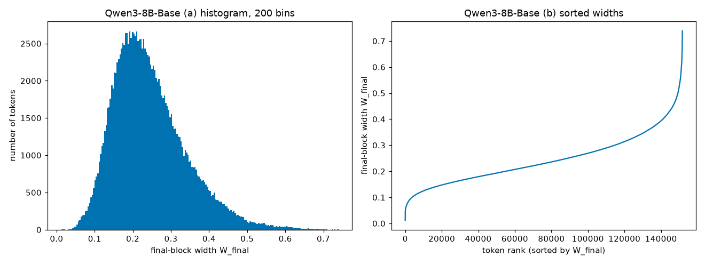

**Figure 12.** Qwen3-8B-Base. (a) Histogram of W_final (200 bins); x: W_final, y: number of tokens. (b)
The same values sorted; x: token rank, y: W_final.

The shape finding holds: one broad peak near W_final 0.19 with a tail to 0.74, and a smooth sorted curve
with no shelves. In the S4 table, the lowest-D tokens of every band are rarely used multilingual pieces,
because those sit at the low-D edge. So the example column says little about which words are wide:

| W_final band | tokens | lowest-D examples |
|---|---|---|
| 0.30–0.50 | 34,660 | `땧`, ` الديمقرا`, ` 오�`, `굠`, `칕`, `ᨹ`, `쩻` |

Size words are still among the widest tokens: ` large` (W_final 0.627) ranks 281st of 151,668, and
` giant` (0.615) and ` huge` (0.558) are also above the 99th percentile (0.534). But the very widest tokens
are Thai pieces, and the widest plain-English tokens mix a few size words (` tremendous`, ` widest`) with
code identifiers (` addslashes`, ` sessionFactory`).

## Conclusion — does the trend generalize?

The table below puts the numbers behind the three `REPORT.md` findings side by side. GPT-2 Large values
come from `REPORT.md` and `RESULTS.md`; the others from the sections above and `RESULTS_generalization.md`
(G1–G4). "Median W_final across D quintiles" is the range of the five quintile medians. A small range
means distance barely moves the typical width.

| Model | median W_final across D quintiles | median W_mid → W_final | final block sharper | final-block curves flagged | W_final peak | tokens in 0.30–0.50 | rank of ` large` by W_final |
|---|---|---|---|---|---|---|---|
| GPT-2 Large | flat core (0.109, 0.114 for D 2.0–3.0) | 0.195 → 0.112 | 97.7% | 5.3% | 0.09–0.10 | 787 | 53 |
| GPT2-XL | 0.084–0.101 | 0.174 → 0.089 | 95.3% | 11.5% | 0.06–0.07 | 1,051 | 84 |
| Pythia 1.4B | 0.317–0.341 | 0.423 → 0.328 | 95.8% | 0.2% | 0.33 | 33,147 | 3 |
| Llama-3.1-8B | 0.198–0.208 | 0.279 → 0.203 | 88.8% | 7.5% | 0.19–0.20 | 14,583 | 1 |
| Qwen3-8B-Base | 0.215–0.244 | 0.233 → 0.230 | 56.2% | 21.2% | 0.19 | 34,660 | 281 |

**Distance does not visibly predict width: generalizes to all four models.** In every model the bulk of
the vocabulary forms one cloud without a clear slope (Figures 2, 5, 8 and 11). The median width moves by
at most 0.03 across D quintiles, much less than the spread of widths at a single D. The two
exceptions are local: a slight downward tilt in Pythia (0.341 → 0.317), and a ramp where W rises with D
among Qwen3's low-D multilingual tokens (Figure 10).

**The final block is sharper than the middle block: generalizes to three of four.** It holds clearly in
GPT2-XL (95.3%) and Pythia (95.8%), and more weakly in Llama (88.8%). It does not hold in Qwen3-8B-Base,
where the median widths are equal and only 56.2% of tokens are sharper at the final block. Qwen3's final
block also has the most irregular curves (21.2% flagged).

**One broad peak with a tail: generalizes to all four.** No model shows separate width groups (Figures
3, 6, 9 and 12). In GPT2-XL, Pythia and Llama, the only tight group is again made of rarely seen tokens
(byte-level, whitespace or special tokens) that share almost the same embedding and width. The position
of the peak does not generalize: it ranges from W_final ≈ 0.06 (GPT2-XL) to 0.33 (Pythia). So a given
width, such as 0.3, is in the tail for the GPT-2 models and typical for Pythia. That is why the
0.30–0.50 row holds size words in GPT2-XL but ordinary tokens in Pythia, Llama and Qwen3.

**Size words are among the widest switches: holds in three of four, partly in Qwen3.** ` large` is the
widest token of all in Llama, 3rd in Pythia and 84th in GPT2-XL. In Qwen3 it is 281st of 151,668, while
the very widest tokens are Thai pieces.

In short, the GPT-2 Large picture is not specific to one model. In three of four models it holds
almost entirely, and Qwen3-8B-Base is the clear exception on depth. Two limits apply to every result
here. They come from one prompt with one starting token (` big`). They describe what the models do;
they do not show why a model switches sharply or gradually.
