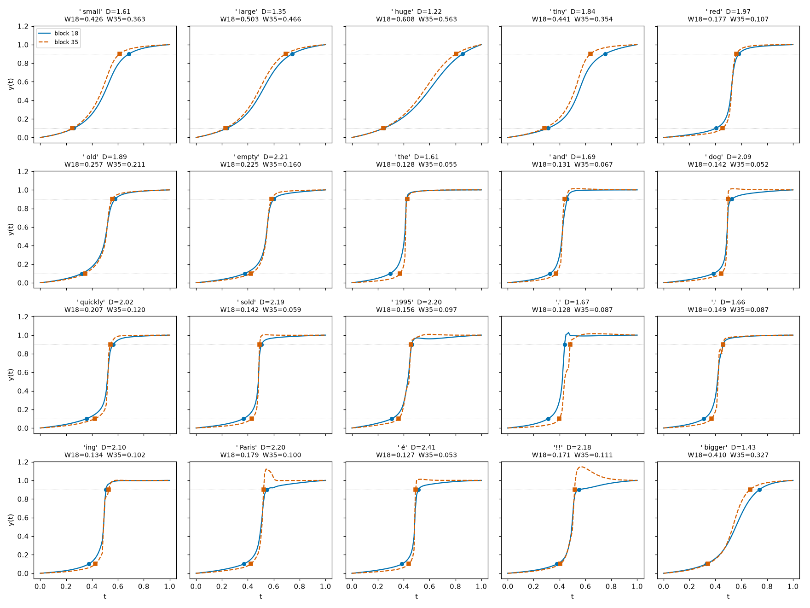
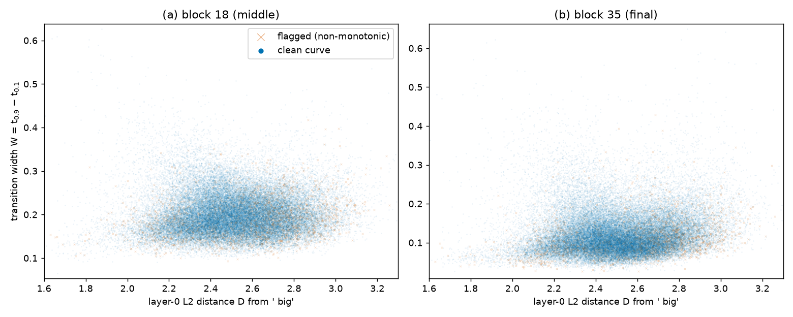

# RESULTS — Token distance vs. transition width (GPT-2 Large, "The house was big")

This file is the detailed evidence record. The concise write-up is `REPORT.md`, which also defines
every term used here.

**Setup in one line.** We replace the last token ` big` with each of the 50,256 other GPT-2 tokens (B).
At layer 0 (the token embedding) we move the last-position vector in a straight line from ` big`
(t = 0) to B (t = 1), using 101 evenly spaced steps. At block 18 (middle) and block 35 (final,
before the last layer norm) we measure how far the last-position output has moved, as a fraction of
the full A→B change. Call this y(t). The transition width is W = t_0.9 − t_0.1. D is the L2 distance
between the two layer-0 embeddings.

## S1 — Sanity check (20 tokens)

We ran 20 hand-picked tokens first to check the measurement. In every case y(0) = 0 and y(1) = 1
exactly, and the marked t_0.1 and t_0.9 points sit on the plotted curves. Data:
`results/s1_sanity.json`.

**Figure 1.** One panel per token (20 tokens). x: interpolation position t; y: progress y(t). Solid
line = block 18, dashed line = block 35. Markers show the measured t_0.1 and t_0.9.

## S2 — Full vocabulary sweep

The sweep covers all 50,256 tokens other than ` big`, including `<|endoftext|>`; no token needed to
be excluded. One row per token is in `results/sweep.csv` (token id, decoded token, D, W_mid,
W_final, crossing positions, flag). Raw y(t) curves are in `results/sweep/shard_*.npz`.

A curve is **flagged** when it crosses 0.1 or 0.9 more than once, or when y(t) drops by more than 0.05
between two neighbouring steps. The table below counts flags and summarizes each variable:

| Quantity | Value |
|---|---|
| Tokens swept | 50,256 |
| Flagged at block 18 / block 35 / either | 163 / 2,686 / 2,788 (5.5%) |
| D: min / 5% / median / 95% / max | 1.22 / 2.14 / 2.51 / 2.89 / 5.17 |
| W_mid: 5% / 25% / median / 75% / 95% | 0.138 / 0.168 / 0.195 / 0.229 / 0.293 |
| W_final: 5% / 25% / median / 75% / 95% | 0.061 / 0.087 / 0.112 / 0.148 / 0.232 |
| Tokens with W_final < W_mid | 97.7% |

## S3 — Distance vs. width

In the scatter plots, the typical-D range (2.0–3.0, which holds 97% of tokens) forms one cloud with no
visible slope. Two groups sit apart from that cloud:
- 64 rarely seen tokens have D ≈ 5.17 and nearly identical widths. These are control characters,
  multi-byte fragments, and scraped strings such as ` RandomRedditor`, `StreamerBot` and
  ` externalToEVA`.
- The tokens nearest to ` big` (D < 2) are split between very narrow widths (` of`, ` the`) and
  very wide widths (size adjectives).

**Figure 2.** Each point is one token B. x: layer-0 L2 distance D from ` big`; y: transition width W.
(a) block 18, (b) block 35. Round dots = unflagged curves; crosses = flagged curves.

To show the dense core at a readable scale, Figure 3 zooms in on D in 1.6–3.3 (50,164 of 50,256 tokens).

**Figure 3.** Zoom of Figure 2. x: D, limited to 1.6–3.3; y: W, limited in each panel to the min–max W
among tokens in that D range (block 18: 0.065–0.627; block 35: 0.021–0.650). (a) block 18, (b) block 35.
Round dots = unflagged curves; crosses = flagged curves. The core shows no clear slope at either layer.

The table below gives the median width within each D range. It only summarizes the cloud; it is not a
statistical test:

| D range | tokens | median W_mid | median W_final |
|---|---|---|---|
| 1.0–2.0 | 686 | 0.169 | 0.082 |
| 2.0–2.5 | 23,819 | 0.193 | 0.109 |
| 2.5–3.0 | 24,932 | 0.197 | 0.114 |
| 3.0–4.0 | 755 | 0.218 | 0.164 |
| 4.0–6.0 | 64 | 0.320 | 0.331 |

## S4 — Distribution of final-layer widths

The W_final histogram has a single peak near 0.09–0.10 and a long tail toward wider values. The sorted
curve rises smoothly and has no flat shelves. The only narrow spike is at W_final ≈ 0.33, made mostly
by the 64 rarely seen tokens with D > 4 (43 of the 65 tokens in the tallest bin; their W_final ranges from 0.328 to 0.44, median 0.331).

**Figure 4.** (a) Histogram of W_final (200 bins); x: W_final, y: number of tokens. (b) The same values
sorted; x: token rank, y: W_final.

To see which tokens fall at each width, the table below lists, for each W_final band, the tokens with
the lowest D. These are examples only; no clustering was run:

| W_final band | tokens | lowest-D examples |
|---|---|---|
| < 0.05 | 766 | ` a`, ` on`, ` for`, ` of`, ` as`, ` we`, ` I`, ` he` |
| 0.05–0.10 | 18,808 | ` the`, ` an`, ` to`, ` in`, ` it`, `,`, ` that`, `.` |
| 0.10–0.15 | 18,663 | ` Big`, `big`, ` good`, ` more`, ` much`, ` many`, ` really` |
| 0.15–0.20 | 7,560 | ` high`, ` lot`, ` bad`, ` extremely`, ` tough`, ` less` |
| 0.20–0.30 | 3,643 | ` major`, ` great`, ` larger`, ` significant`, ` BIG`, ` long`, ` smaller` |
| 0.30–0.50 | 787 | ` large`, ` bigger`, ` biggest`, ` massive`, ` small`, ` gigantic`, ` enormous` |
| ≥ 0.50 | 29 | ` huge`, ` giant`, ` tremendous`, ` substantial`, ` monumental`, ` whopping` |

The 40 widest tokens mix two kinds:
- size words: ` whopping` (0.62), ` HUGE`, ` giant`, ` huge`, ` tremendous`, ` oversized`;
- rarely seen, oddly formed tokens: ` guiName` (0.64), `Downloadha`, ` TheNitromeFan`,
  `rawdownloadcloneembedreportprint`, `TPPStreamerBot`.

The median D of the 100 widest tokens is 2.43, close to the vocabulary median of 2.51.

## S5 — Representative curves

**Figure 5.** Final-layer y(t) curves. x: interpolation position t; y: y(t). Dotted lines mark 0.1 and
0.9. (a) Five common words with nearly the same D (1.35–1.67) but W_final from 0.046 to 0.466. (b) Five
tokens from the most common width bin (W_final 0.087–0.090). Each token has its own line style and
marker.

In panel (a), the measured widths match the curves: ` of` and ` the` jump almost vertically, and
` large` rises gradually. In panel (b), all five tokens have the same steep shape, but they cross at
different t, from about 0.40 to 0.53. `MQ` overshoots to y ≈ 1.1 and is flagged.

## Headline

Layer-0 distance D does not visibly predict transition width in the bulk of the vocabulary. At the
final layer, tokens with nearly the same D range from very sharp to very gradual transitions. The
widest transitions belong to size words close in meaning to ` big`, and to rarely seen tokens.
Final-layer widths form one broad peak with a tail. The only tight group is 64 rarely seen tokens that
share nearly the same embedding and the same width.
