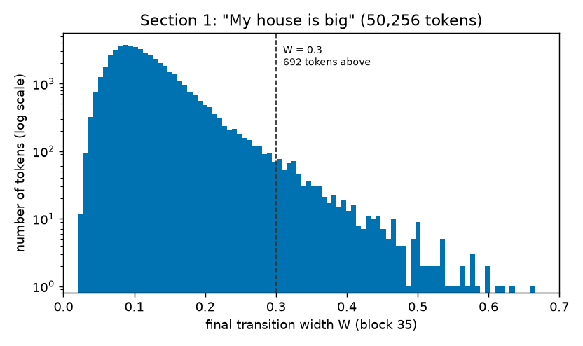
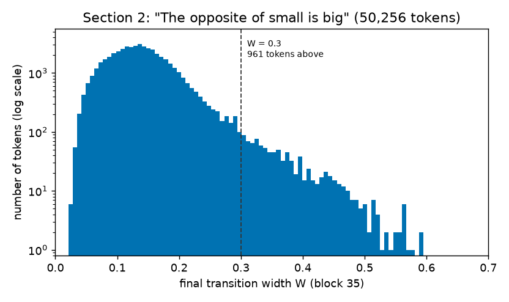
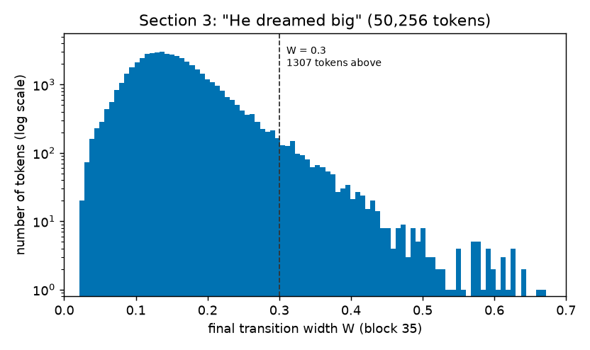
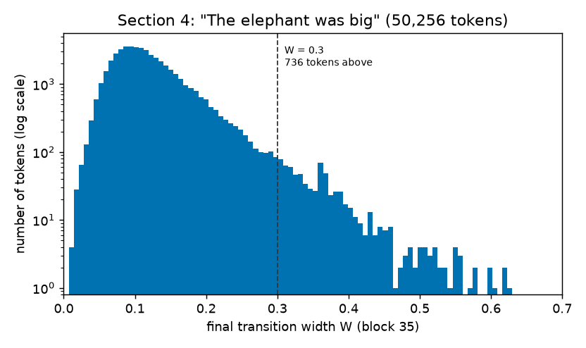
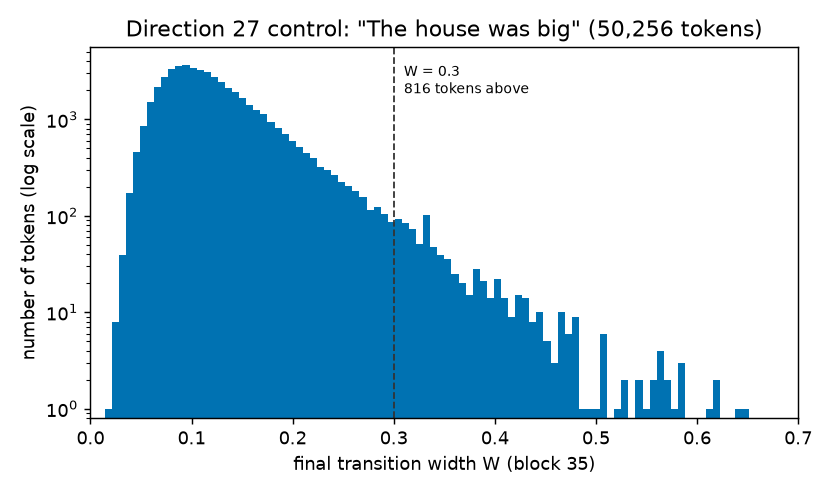

# RESULTS — Direction 28: does the context change which tokens transition smoothly from " big"?

Detailed evidence record. The narrative, method definitions and complete token lists are in `REPORT.md`.
Setup: GPT-2 Large, layer-0 (input embedding) interpolation from " big" to each of the other 50,256
vocabulary tokens at 101 steps, readout at block 35 (last position); W = t_0.9 − t_0.1 of the progress
curve y(t) (Direction 27 code, unchanged). Threshold W > 0.3 fixed in advance.

## Stage 0 — control

Re-running Direction 27's prompt "The house was big" through this direction's code reproduced Direction 27's
stored widths for token IDs 0–255 to within 6.9×10⁻⁷ (W_final) and 4.6×10⁻⁷ (W_mid).

## Per-context width summary

One row per context, computed over all 50,256 substitutions. "Flagged" = non-monotonic curve (Direction 27 rule).

| Context | Prompt | W > 0.3 | median W | 95th pct W | max W | flagged (all) | flagged (W > 0.3) |
|---|---|---|---|---|---|---|---|
| s1 | My house is big | 692 | 0.106 | 0.220 | 0.664 | 2,423 | 7 |
| s2 | The opposite of small is big | 961 | 0.135 | 0.244 | 0.592 | 4,074 | 21 |
| s3 | He dreamed big | 1,307 | 0.145 | 0.263 | 0.672 | 2,016 | 8 |
| s4 | The elephant was big | 736 | 0.110 | 0.225 | 0.627 | 2,303 | 5 |
| control (Direction 27) | The house was big | 816 | 0.112 | 0.232 | 0.650 | 2,788 | 12 |

**Figure 1.** W for all tokens, "My house is big". x: W, 100 shared bins; y: token count, log scale; dashed line W = 0.3.

**Figure 2.** Same for "The opposite of small is big".

**Figure 3.** Same for "He dreamed big".

**Figure 4.** Same for "The elephant was big".

The control row and Figure 5 use Direction 27's stored `results/sweep.csv` (`W_final` and `flag_nonmonotonic`,
four decimals); no sweep was rerun. Figure 5 uses the same bins and axis limits as Figures 1–4.

**Figure 5.** Same for Direction 27's control prompt "The house was big".

## Cross-context set comparison

Counts of tokens by the number of contexts in which W > 0.3 (2,167 distinct tokens in the union).

| Group | Tokens |
|---|---|
| all four contexts | 229 |
| exactly three | 262 (missing s2: 100, s3: 72, s4: 46, s1: 44) |
| exactly two | 318 |
| only s1 / s2 / s3 / s4 | 120 / 405 / 690 / 143 |

Most context-unique tokens sit just above the threshold, and many are close to it in another context too, so
the unique sets mostly reflect small shifts across W = 0.3 (widths from the 4-decimal CSV):

| Context | unique tokens | median own W | share with own W < 0.35 | median best W elsewhere | share with W > 0.25 elsewhere |
|---|---|---|---|---|---|
| s1 | 120 | 0.327 | 0.68 | 0.265 | 0.69 |
| s2 | 405 | 0.340 | 0.58 | 0.230 | 0.37 |
| s3 | 690 | 0.329 | 0.71 | 0.223 | 0.33 |
| s4 | 143 | 0.324 | 0.75 | 0.264 | 0.64 |

Stability of the widest tokens: of each context's 50 widest tokens, 34 (s1), 35 (s2), 24 (s3), 36 (s4)
pass W > 0.3 in all four contexts.

Glitch block (56 tokens with input distance D within 0.05 of 5.16): median W 0.322 (s1), 0.292 (s2), 0.317 (s3);
all 56 above 0.3 in s1 and s3, none in s2.

Selected single tokens (W): " small" 0.342 / 0.211 / 0.499 (s1/s2/s3); " huge" 0.577 / 0.517 / 0.629;
" large" 0.500 / 0.478 / 0.537.

## Files

- `results/<ctx>_tokens.csv` — every token: D, W_mid, W_final, t10, t90, flag.
- `results/<ctx>_W_gt_0.3.csv` — sorted W > 0.3 lists; `results/cross_context.csv` — union with per-context W.
- `results/fragments/*.md` — the list blocks pasted into REPORT.md Appendices A and B.
- `results/summary.json` — numbers in the tables above.

## Headline

In all four contexts the widest transitions come from the same tokens (size and magnitude words plus
rarely trained code-like strings; 229 tokens pass in all four). Context changes the size of the tail
(692–1,307 tokens above 0.3) and which near-threshold tokens pass.
