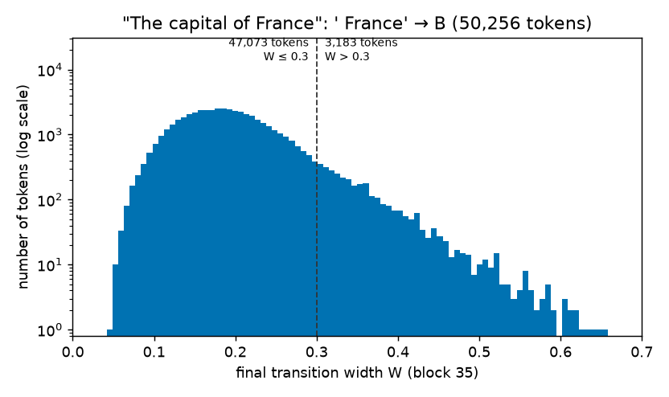
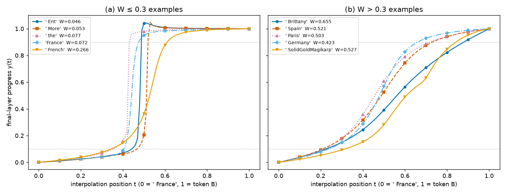

# RESULTS — ` France` → vocabulary sweep (GPT-2 Large, "The capital of France")

> Current-best only. History is in CHANGELOG.md. Definitions of d(t), W and the flag are in REPORT.md Methods
> (Direction 27's code, imported unchanged by `experiments/sweep.py`).

## Setup check

Direction 27's own prompt ("The house was big") was rerun through the imported code on its first 256 tokens.
It matches Direction 27's shard 0 to max |ΔW_final| = 6.9e-7 and max |ΔW_mid| = 4.6e-7 (`results/control_limit256`).

## Sweep counts

The table below gives simple descriptive counts over all 50,256 tokens B ≠ ` France` (`results/summary.json`).

| quantity | value |
|---|---:|
| tokens swept | 50,256 |
| W_final ≤ 0.3 | 47,073 (93.7%) |
| W_final > 0.3 | 3,183 (6.3%) |
| flagged (non-monotonic) | 537 (532 with W ≤ 0.3, 5 with W > 0.3) |
| W_final min / median / max | 0.046 / 0.188 / 0.655 |
| W_final 1st / 25th / 75th / 99th percentile | 0.083 / 0.151 / 0.229 / 0.404 |
| tokens with D > 4 (all have W > 0.3) | 61, W 0.33–0.43 |

**Figure 1.** W_final for all 50,256 tokens. x: W at block 35; y: tokens per bin (log scale). Dashed line marks W = 0.3.

## Token lists (machine-readable)

- `results/france_tokens.csv`: every token, with D, W_mid, W_final, t10, t90 and flag.
- `results/france_W_le_0.3.csv`: all 47,073 tokens with W ≤ 0.3, sorted from smallest to largest W.
- `results/france_W_gt_0.3.csv`: all 3,183 tokens with W > 0.3, sorted from largest to smallest W.
- `results/france_widest100_manual.csv`: the 100 widest tokens with a hand-assigned label (place / scraped / other).

## Inspection counts

These counts are simple descriptions of the two ends of the sorted list.

| slice | observation |
|---|---|
| 100 narrowest | 82 are a space plus a capitalized fragment (vocabulary rate 21%); 90 are ≤ 4 characters; 0 places by our reading |
| 200 narrowest | 153 space plus capitalized fragment; 180 ≤ 4 characters |
| 100 widest | 53 place, 17 scraped, 30 other (manual labels) |

Here are reference tokens, each with W_final and its percentile among the 50,256 tokens: `France` (no space) 0.072 (0.3),
` Fran` 0.158 (28.9), ` Franc` 0.153 (25.7), ` the` 0.077 (0.6), ` French` 0.266 (87.9), ` China` 0.262 (87.0),
` Russia` 0.309 (94.5), ` Japan` 0.324 (95.7), ` Britain` 0.355 (97.5), ` London` 0.399 (98.9), ` Germany` 0.423 (99.3),
` Berlin` 0.450 (99.6), ` Italy` 0.481 (99.7), ` Paris` 0.503 (99.8), ` Spain` 0.521 (99.9), ` Belgium` 0.560 (99.9).

## Representative curves

We plot curves from both sides of the threshold to check which side has the plateau shape.

**Figure 2.** d(t) at block 35. x: t (0 = ` France`, 1 = B); y: d(t). (a) W ≤ 0.3: ` Ent`, ` More`, ` the`, `France`,
` French`. (b) W > 0.3: ` Brittany`, ` Spain`, ` Paris`, ` Germany`, ` SolidGoldMagikarp`. Line style and marker
identify each token.

For these curves, (t10, t90) are as follows: ` Ent` (0.442, 0.488), ` More` (0.466, 0.520), ` the` (0.354, 0.432),
`France` (0.404, 0.475), ` French` (0.345, 0.610), ` Brittany` (0.225, 0.880), ` Spain` (0.209, 0.730), ` Paris`
(0.215, 0.719), ` Germany` (0.238, 0.661), ` SolidGoldMagikarp` (0.315, 0.842). The small-W curves are flat, then
jump. The large-W curves rise gradually.

## Headline

The smooth (large-W) switches away from ` France` are mostly place names, many of them tied to France, together
with rarely seen scraped tokens. The sharpest switches are short capitalized word starts. This is an observation
from one prompt and does not test a cause.
