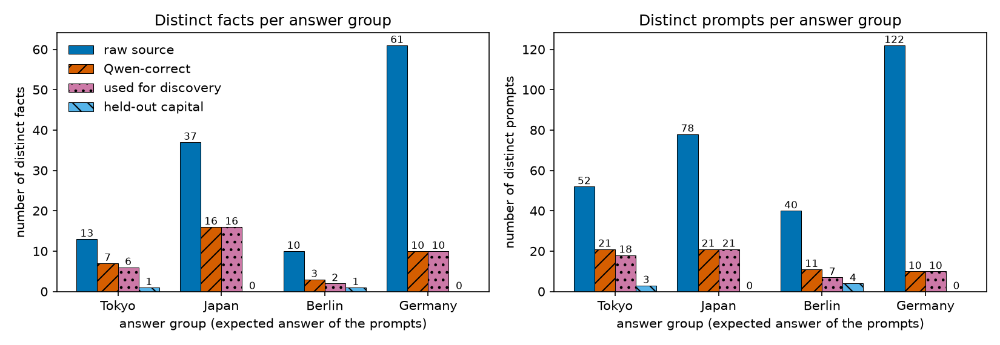
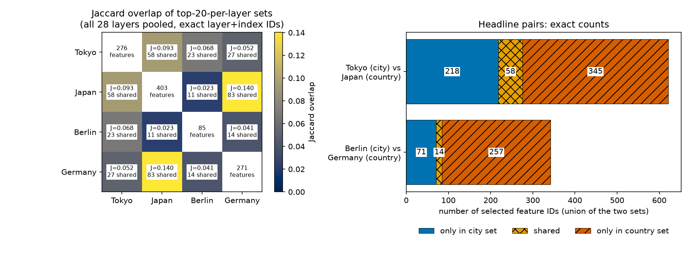
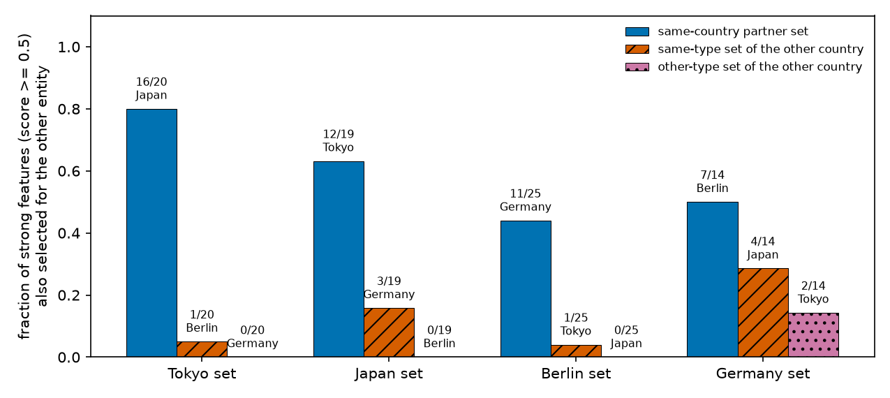
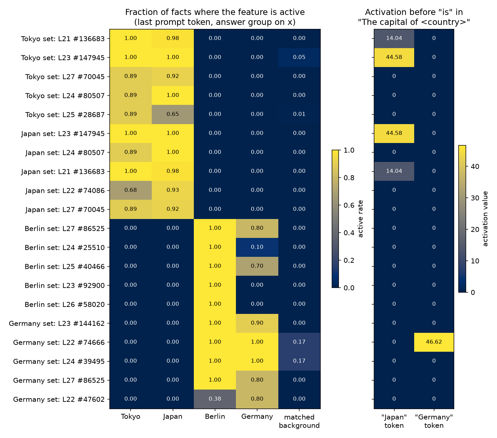
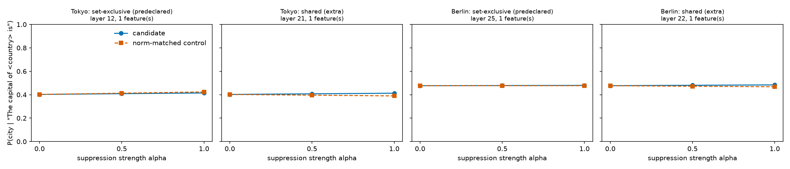

# REPORT — Do Tokyo and Japan (and Berlin and Germany) share transcoder features in Qwen3-0.6B?

## Summary

**Question.** When a small language model is about to answer "Tokyo", and when it is about to answer "Japan", does it use the same internal features or different ones? We ask the same for Berlin and Germany. This matters for interpretability-based safety work: if we want to inspect or edit what a model "knows" about one entity, we need to know whether that knowledge is carried by features specific to the entity or by features shared with related entities.

**What we did.** We took factual prompts whose correct answer is Tokyo, Japan, Berlin or Germany, kept only the ones Qwen3-0.6B answers correctly, and for each of the four answers selected the transcoder features (defined in Methods) that fire more often on those prompts than on matched prompts with other answers. We then counted how many selected features are shared.

**What we found.**

1. Few model-known examples survive: 6 Tokyo facts, 16 Japan facts, 2 Berlin facts and 10 Germany facts are available for feature selection (Table 1). The Berlin result rests on two facts and is exploratory.
2. Counting every selected feature, overlap is low: Tokyo and Japan share 58 feature IDs (21% of the 276 Tokyo features, 14% of the 403 Japan features); Berlin and Germany share 14 (16% of 85, 5% of 271) (Table 2, Figure 2).
3. Most selected features are only weakly selective. Among the strongly selective ones, sharing within a country is high and sharing across countries is near zero: 16 of the 20 strong Tokyo features are also Japan features, and 0 of 20 are Germany features (Figure 3). This split was added after seeing the scores, so treat it as a description of this data set.
4. A handful of selected features are already active on the country word in "The capital of Japan", before "is": 7 of 276 Tokyo features and 7 of 85 Berlin features (Table 3). The country-specific ones are mostly the shared, strongly selective features.
5. Removing one such feature's contribution at the country word did not change the model's answer: the probability of the capital moved by at most 0.013, no more than a control feature (Figure 5).

**Verdict.** In this model and this feature dictionary, the features that most cleanly separate Tokyo-answer prompts from other prompts are largely the same features that separate Japan-answer prompts. We observed this overlap; we did not show what these features do, and the one causal test we ran was null.

## Methods

### Data & Model

**Model.** `Qwen/Qwen3-0.6B` (0.6 billion parameters, 28 layers, hidden width 1024), revision `c1899de`, run in float32 as a plain text completer: no chat template, greedy decoding, seed 0, one prompt at a time.

**Features.** A *transcoder* is a wide, sparse, one-hidden-layer network trained to imitate one MLP block of the model: it reads the MLP's input and predicts the MLP's output through 163,840 units, of which only a few are non-zero on any token. Each unit is a *feature*. We use the published per-layer transcoders `mwhanna/qwen3-0.6b-transcoders-lowl0` (revision `28aefe6`), one per layer, for all layers 0–27. A feature is identified by the pair (layer, index); the same index in two layers is two different features. A feature is *active* on a token when its value is above zero. We read each layer's MLP input from the running, unmodified model (after the block's second normalisation) and pass it through that layer's transcoder encoder.

**Transcoder check.** On eight mixed prompts at layer 10, about 17 features are active per token and the transcoder's predicted MLP output differs from the true output by a relative L2 error of 0.63, excluding the first token of each prompt, where the transcoder fails (thousands of features active). At the prompt positions we analyse, the error ranges from 0.25 to 0.77 across layers. These transcoders therefore capture only part of each MLP's computation, and every result below describes the captured part.

**Prompts.** Facts come from the LRE relations data set (`evandez/relations`, revision `1b9ec3c`). A *fact* is a (subject, answer) pair such as (Mitsubishi Corporation, Tokyo); each fact is written out with 2–4 template sentences, giving several *prompts* per fact, e.g. "The headquarters of Mitsubishi Corporation are in the city of". The four *answer groups* are defined by the expected answer:

- **Tokyo** and **Berlin**: answer is that city, in the relations capital city, largest city and company headquarters.
- **Japan** and **Germany**: answer is that country, in the relations landmark-in-country and food-from-country.

"Japan group" therefore means *the expected answer is Japan*. It does not mean every prompt that mentions Japan. All four phrasings of "The capital of Japan is" and "The capital of Germany is" are *held out*: they are never used to select features. *Background* prompts are up to 32 randomly chosen facts per relation (seed 0) with other answers.

**Correctness filter.** A prompt is kept only when Qwen's greedy 16-token completion begins with the expected answer (ignoring case, leading punctuation and a leading "the"), followed by a word boundary.

### Metrics

**Selection score.** To find features tied to one answer, and not to the sentence template, we compare how often a feature is active on that answer's prompts with how often it is active on background prompts that use the same relation and template. All activations are read at the last token of the prompt, the position from which the model produces the answer. For answer group `g` and feature `f`:

```math
\mathrm{score}_g(f) = \underbrace{\frac{1}{|F_g|}\sum_{i \in F_g} \frac{1}{|P_i|}\sum_{p \in P_i} \mathbf{1}[a_f(p) > 0]}_{\text{positive rate}} \;-\; \underbrace{\sum_{c} w_{g,c}\, \frac{1}{|B_c|}\sum_{p \in B_c} \mathbf{1}[a_f(p) > 0]}_{\text{background rate}}
```

Here `F_g` is the set of facts in the group, `P_i` the kept prompts of fact `i`, and `a_f(p)` the feature's value at the last token of prompt `p`. Each fact counts once however many phrasings it has. `B_c` is the set of correct background prompts in cell `c` (one relation and template), and `w_{g,c}` is the share of the group's weight that falls in that cell. The score runs from −1 to 1; a score of 1 means the feature fires on every fact of the group and on no background prompt. A feature is *selected* for a group when its score is positive (above 1e-6, to exclude rounding noise), it is active in at least two distinct facts, and it is among the 20 highest-scoring such features in its layer. Each group is scored only against background; no group serves as another group's negative class, so a feature may be selected for several groups. Tables 2–3 and Figures 2–4 use these sets.

**Overlap.** To answer "how many features are shared", we count identical (layer, index) pairs in two selected sets `A` and `B`, and report the shared count, the shared fraction of each set, and the Jaccard overlap, which is the shared count divided by the size of the union:

```math
J(A,B) = \frac{|A \cap B|}{|A \cup B|}
```

`J` is 0 for disjoint sets and 1 for identical sets. Two different IDs can still represent similar directions, so a low `J` is a statement about dictionary IDs.

**Strong features.** Most selected features have small scores (median 0.13–0.20 per set), so Figure 3 repeats the shared-fraction count for features with score at least 0.5. We chose this split after seeing the score distribution; the 0.25 and 0.75 versions are in `results/overlap_by_score.csv`.

**Early activation.** To test whether selected features appear before the model is asked for the capital, we read the same features at the country token of "The capital of Japan" and "The capital of Germany", which precedes "is". We report how many members of each frozen set are active there.

**Suppression.** To test whether an early-active feature matters for the answer, we subtract its contribution from the MLP output at the country token and let the rest of the model run:

```math
y_{\text{new}} = y - \alpha \sum_i a_i d_i, \qquad \alpha \in \lbrace 0, 0.5, 1 \rbrace
```

where `y` is the true MLP output, `a_i` the feature's value in that run and `d_i` its decoder direction. We then measure the probability of the capital city as the next token after "is".

### Baselines

**Matched background** is the baseline inside the selection score: correct prompts from the same relation and template with other answers.

**Cross-country pairs** are the baseline for overlap. Tokyo with Japan is compared against Tokyo with Germany, Tokyo with Berlin, and so on, since two sets can share features merely because their prompts look alike.

**Other-country token** is the baseline for early activation: a feature active on both "Japan" and "Germany" in the capital prefix is not country-specific.

**Norm-matched control** is the baseline for suppression: a feature active at the same token and layer that belongs to neither entity set, with the closest available perturbation size.

## Results

### 1. Few facts survive the correctness filter

Qwen3-0.6B answers between 16% and 54% of the facts in each group, so the selection rests on small samples. Table 1 gives the counts and Figure 1 plots them. The country groups lose the most: only 10 of 61 Germany landmarks are answered correctly, each with a single phrasing. Berlin keeps two discovery facts (the largest city of Germany, and Deutsche Reichsbahn), the minimum we allow, and both mention Germany or a German name in the prompt. One Berlin fact was dropped before filtering because the source lists two different answers for it. Background prompts are also scarce (37 of 114 sampled facts correct), which makes the background rate coarse: the main Japan and Germany cell has six background prompts.

**Table 1.** Distinct facts / prompts per answer group at each stage. "Discovery" rows select features; "held-out" rows are the capital prompts.

| Group | Raw source | Qwen-correct | Discovery | Held-out |
|---|---:|---:|---:|---:|
| Tokyo | 13 / 52 | 7 / 21 | 6 / 18 | 1 / 3 |
| Japan | 37 / 78 | 16 / 21 | 16 / 21 | 0 / 0 |
| Berlin | 10 / 40 | 3 / 11 | 2 / 7 | 1 / 4 |
| Germany | 61 / 122 | 10 / 10 | 10 / 10 | 0 / 0 |



**Figure 1.** Number of distinct facts (left) and prompts (right) per answer group. x: answer group; y: count. Bars, left to right within each group: raw source (plain), Qwen-correct (diagonal hatch), used for discovery (dotted), held-out capital (back-diagonal hatch).

### 2. Over all selected features, overlap is low

Table 2 answers the headline question literally. Tokyo and Japan share 58 feature IDs, which is 21% of the Tokyo set and 14% of the Japan set. Berlin and Germany share 14, which is 16% of the Berlin set and 5% of the Germany set. The top-20-per-layer limit rarely binds, because only about 10 features are active per layer on a given prompt; the sets are close to "every feature with a positive score". The counts change little with the cutoff: with top-10 the Tokyo–Japan Jaccard is 0.091 and with top-50 it is 0.089.

The cross-country pairs in Figure 2 show how to read these numbers. Japan and Germany, whose prompts share the template "… is in the country of", have the highest overlap of all six pairs (83 shared, Jaccard 0.140). Tokyo–Japan (0.093) is above Tokyo–Germany (0.052), while Berlin–Germany (0.041) is below it. The pooled overlap therefore reflects prompt format at least as much as country.

**Table 2.** Selected feature IDs (top 20 per layer, all 28 layers pooled) and their overlap. Shared fractions show their denominators.

| Pair (A vs B) | A size | B size | Shared | Only A | Only B | Shared / A | Shared / B | Jaccard |
|---|---:|---:|---:|---:|---:|---:|---:|---:|
| Tokyo vs Japan | 276 | 403 | 58 | 218 | 345 | 58/276 = 0.21 | 58/403 = 0.14 | 0.093 |
| Berlin vs Germany | 85 | 271 | 14 | 71 | 257 | 14/85 = 0.16 | 14/271 = 0.05 | 0.041 |



**Figure 2.** Left: Jaccard overlap between every pair of selected sets; each cell also gives the shared count, and the diagonal gives the set size. Right: for the two headline pairs, the number of feature IDs only in the city set (plain), shared (cross-hatched) and only in the country set (diagonal hatch). x: number of feature IDs.

### 3. The strongly selective features are mostly shared within a country

The pooled count hides a clear pattern, because most selected features barely beat the background. Figure 3 restricts each set to features with score at least 0.5 (20 Tokyo, 19 Japan, 25 Berlin, 14 Germany features) and asks how many are also selected for each other entity. Of the 20 strong Tokyo features, 16 are in the Japan set, 1 in the Berlin set and 0 in the Germany set. Of the 19 strong Japan features, 12 are in the Tokyo set. For Berlin, 11 of 25 are in the Germany set and 0 in the Japan set; for Germany, 7 of 14 are in the Berlin set. The same direction holds at thresholds 0.25 and 0.75 (at 0.75, all 10 strong Tokyo features are Japan features).

This is the most informative result of the study: the features that best mark "about to answer Tokyo" in this dictionary also mark "about to answer Japan", and do not mark Germany or Berlin. It is an observed overlap in which prompts activate them. The Tokyo prompts include "The largest city in Japan is" and Japanese company names, and the Japan prompts name Japanese places, so these may be features for Japan-related context in general. The same caution applies more strongly to Berlin, whose two discovery facts both carry German context.



**Figure 3.** For each selected set (x), the fraction of its strong features (score at least 0.5) that are also selected for another entity (y). Plain bars: the same-country partner (Tokyo with Japan, Berlin with Germany). Diagonal hatch: the same kind of entity in the other country. Dotted: the other kind of entity in the other country. Labels give counts and the compared set.

Figure 4 shows the five highest-scoring features of each set, to make the pattern concrete. The Tokyo and Japan rows are largely the same features (layer 21 #136683, layer 23 #147945, layer 24 #80507, layer 27 #70045), each active on 89–100% of both Tokyo and Japan facts and on no Berlin or Germany fact. The Germany rows are active on all Berlin facts as well. Three of the top Berlin features (layer 23 #92900, layer 24 #25510, layer 26 #58020) fire on at most 10% of Germany facts, so some Berlin-selective features are not shared.



**Figure 4.** Rows: the five highest-scoring features of each set, labelled by set, layer (L) and index (#). Left panel: fraction of each answer group's facts on which the feature is active at the last prompt token, plus its matched background rate. Right panel: the feature's value at the country token of "The capital of Japan" and "The capital of Germany", before "is"; 0 means inactive.

### 4. A few selected features are already active on the country word

In "The capital of Japan", the model predicts " is" as the most likely next token (probability 0.69; 0.75 for Germany), and after " is" its top prediction is " Tokyo" (0.40) or " Berlin" (0.48), so the prompts behave as intended. Reading the country token in the prefix alone and in the full sentence gives the same values (largest difference 3e-5).

Table 3 shows that early activation is rare: 7 of 276 Tokyo features and 7 of 85 Berlin features are active on their own country's token. Several of these are also active on the other country's token, with similar values, so they respond to the capital-prompt context generally. The ones active only on their own country are few and are mostly the strong shared features of Result 3. For Japan these are layer 20 #18824, layer 21 #136683 and layer 23 #147945, all in both the Tokyo and Japan sets, plus one weak Tokyo-only feature. For Germany they are layer 22 #74666 (in both sets), layer 25 #28710 (Berlin set only, score 0.99) and layer 27 #131997. A feature found just before a Tokyo answer is therefore usually absent on the earlier country word, and those that are present are mostly not specific to the city.

**Table 3.** Members of each frozen selected set that are active at the country token before "is". "Shared" and "unique" refer to the same-country partner set. About 190 features in total are active at this token across the 28 layers.

| Country token | Feature set | Set size | Active | Of which shared | Of which unique | Active only on this country |
|---|---|---:|---:|---:|---:|---:|
| Japan | Tokyo | 276 | 7 | 3 | 4 | 4 |
| Japan | Japan | 403 | 5 | 3 | 2 | 3 |
| Germany | Berlin | 85 | 7 | 1 | 6 | 3 |
| Germany | Germany | 271 | 4 | 1 | 3 | 1 |

### 5. Suppressing an early-active feature did not change the answer

The plan fixed the rule before any intervention: take features in the city set but outside the country set that are active on the country token, pick the layer with the highest total score, and suppress up to five features there. This gave one feature per city: layer 12 #99286 for Tokyo (score 0.20, also active on the Germany token) and layer 25 #28710 for Berlin. As an extra we applied the same rule to the shared early-active features (layer 21 #136683 and layer 22 #74666).

Figure 5 shows a null result in all four cases. The probability of the capital changed by at most 0.013 at full suppression, its rank stayed first, and the generated continuation was unchanged. The control features moved the probability by up to 0.021. Suppression at the country token also left the currency and language prompts unchanged (largest change 0.017). The Berlin control is poorly matched (perturbation norm 0.75 against 10.95), because no closer feature was available at that token and layer. A single feature at a single position and layer is a weak intervention, so this result says only that these individual features are not necessary for the answer.



**Figure 5.** Probability of the capital city as the next token after "The capital of (country) is" (y) against suppression strength alpha (x), where alpha = 1 removes the feature's full contribution at the country token. Solid line with circles: the candidate feature. Dashed line with squares: the norm-matched control feature. Panels: Tokyo and Berlin, each with the predeclared set-exclusive candidate and the extra shared candidate.

## Conclusion

Counting all selected transcoder features, Tokyo and Japan share 58 of 276 and 403 IDs, and Berlin and Germany share 14 of 85 and 271 (Table 2). These pooled numbers are low and are no higher than the overlap between unrelated groups with similar prompt templates (Figure 2). Among strongly selective features the picture reverses: most strong Tokyo features are also Japan features and almost none are Germany or Berlin features (Figure 3, Figure 4). A few of these shared features are already active on the country word before "is" (Table 3). Suppressing one early-active feature per city did not change the answer (Figure 5).

**Limitations.** The samples are small, especially Berlin with two facts, and the background rate is computed from as few as one to six prompts per cell (Result 1). The strong-feature split was chosen after seeing the scores. The transcoders reconstruct the MLP outputs only partially, so features outside the dictionary are invisible here. Shared activation does not tell us what a feature represents: these results do not show that the model plans the capital in advance, that any feature is a pure "Tokyo" or "Japan" representation, or that the non-shared features encode something independent. The suppression test covered one feature, one position and one layer per case.

Detailed counts, per-layer overlap, rejected samples and all feature lists are in `RESULTS.md` and `results/`.
