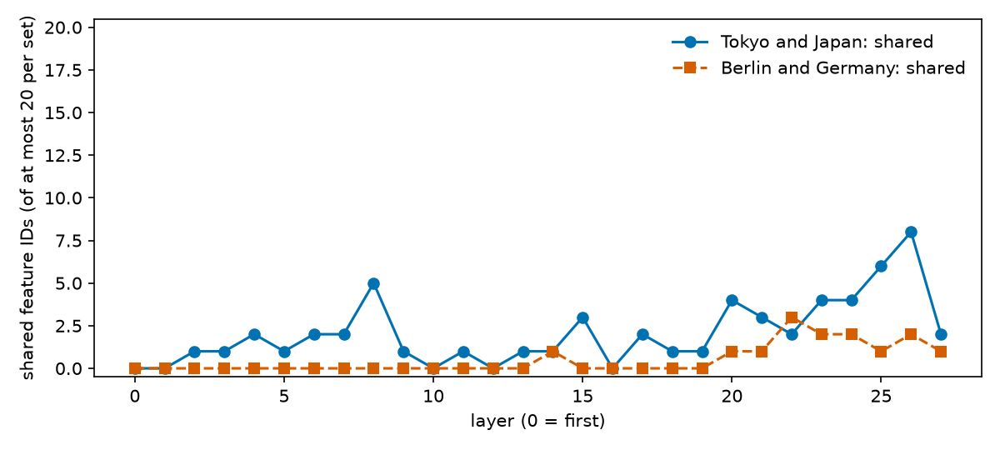

# RESULTS — Qwen3-0.6B: Tokyo/Japan and Berlin/Germany transcoder-feature overlap

> CURRENT-BEST ONLY. Detailed evidence record for `REPORT.md`. History lives in `CHANGELOG.md`.

## Headline

Counting every selected feature, Tokyo and Japan share 58 feature IDs (Jaccard 0.093) and Berlin and Germany share 14 (Jaccard 0.041). Among strongly selective features (score at least 0.5), 16 of 20 Tokyo features are also Japan features and 0 of 20 are Germany features. A few shared features are active on the country word before "is". Suppressing one early-active feature per city left the answer unchanged.

## Definitions used below

A **feature** is one unit of a per-layer transcoder (a sparse network that imitates one MLP block), identified by (layer, index). It is **active** when its value is above zero. A **fact** is a (subject, answer) pair; a **prompt** is one template sentence for a fact. The **score** of a feature for an answer group is its fact-averaged active rate on that group's prompts minus its active rate on matched background prompts (same relation and template, other answers), read at the last prompt token. A feature is **selected** when its score is positive (above 1e-6, to exclude rounding noise), it is active in at least two facts, and it is in the top 20 of its layer. **Jaccard overlap** is the shared count divided by the size of the union. Full equations are in `REPORT.md` Methods.

## Setup check (S0)

The hooks and the transcoder loader behave as expected, with a large reconstruction error that limits what the features capture. At layer 10 on eight mixed prompts (69 tokens), the MLP input equals the block's post-attention normalisation of the residual stream, encodings are finite, and the decoded output has the right shape. Excluding the first token of each prompt, 17.3 features are active per token and the relative L2 reconstruction error is 0.63. On the first token the transcoder fails (thousands of active features, error above 2000). Prepending a chat-start token left the error at 0.62 and prepending an end-of-text token made it far worse, so we kept plain prompts. Across layers at the last prompt token of the 156 kept prompts, 4.7 to 18.9 features are active and the error is 0.25 to 0.77 (`results/layer_stats.csv`).

## Sample counts (S1)

The table below gives distinct facts / prompts at every stage, for the primary groups by relation and for the controls. "Clean" removes source problems before the model is run.

| Group | Relation | Raw | Clean | Qwen-correct | Discovery | Held-out |
|---|---|---:|---:|---:|---:|---:|
| Tokyo | all | 13 / 52 | 13 / 52 | 7 / 21 | 6 / 18 | 1 / 3 |
| Tokyo | capital city | 1 / 4 | 1 / 4 | 1 / 3 | 0 / 0 | 1 / 3 |
| Tokyo | largest city | 1 / 4 | 1 / 4 | 1 / 3 | 1 / 3 | 0 / 0 |
| Tokyo | company headquarters | 11 / 44 | 11 / 44 | 5 / 15 | 5 / 15 | 0 / 0 |
| Japan | all | 37 / 78 | 37 / 78 | 16 / 21 | 16 / 21 | 0 / 0 |
| Japan | landmark in country | 35 / 70 | 35 / 70 | 14 / 15 | 14 / 15 | 0 / 0 |
| Japan | food from country | 2 / 8 | 2 / 8 | 2 / 6 | 2 / 6 | 0 / 0 |
| Berlin | all | 10 / 40 | 9 / 36 | 3 / 11 | 2 / 7 | 1 / 4 |
| Berlin | capital city | 1 / 4 | 1 / 4 | 1 / 4 | 0 / 0 | 1 / 4 |
| Berlin | largest city | 1 / 4 | 1 / 4 | 1 / 3 | 1 / 3 | 0 / 0 |
| Berlin | company headquarters | 8 / 32 | 7 / 28 | 1 / 4 | 1 / 4 | 0 / 0 |
| Germany | all (landmark in country) | 61 / 122 | 61 / 122 | 10 / 10 | 10 / 10 | 0 / 0 |
| Background | all four discovery relations | 114 / 392 | 114 / 392 | 37 / 83 | n/a | n/a |
| Japan context control | currency, language | 2 / 11 | 2 / 11 | 2 / 7 | n/a | n/a |
| Germany context control | language | 1 / 6 | 1 / 6 | 1 / 3 | n/a | n/a |
| Other Japanese city (Kyoto) | company headquarters | 3 / 12 | 3 / 12 | 0 / 0 | n/a | n/a |
| Excluded: answer "Japan" in a city relation | company headquarters | 7 / 28 | 0 / 0 | n/a | n/a | n/a |

Notes on the rows above:

- Neither country appears as an answer in the city-in-country relation, matching the pinned data.
- Rejection reasons: one Berlin fact (Heilmann & Littmann) has two conflicting answers in the source; every other rejection is "completion does not begin with the answer". Typical failures are invented cities for obscure companies and "the United States" for small German towns.
- For all three Kyoto facts Qwen answers "Tokyo" or evades, so there is no usable within-country city control. The source label "Nintendo, Kyoto" is correct; the model is wrong.
- Background per relation (facts correct / sampled): largest city 14 / 22, company headquarters 7 / 32, landmark 6 / 32, food 10 / 28.
- Germany has no currency fact in the source; none was added.
- Every discovery cell has at least one correct background prompt, except one Japan prompt (a food template with no correct background), which is excluded from scoring.

**Figure 1.** Distinct facts (left) and prompts (right) per answer group. x: answer group; y: count. Bars within each group, left to right: raw source (plain), Qwen-correct (diagonal hatch), used for discovery (dotted), held-out capital (back-diagonal hatch).

## Selected features (S2)

The number of features with a positive score and at least two active facts is 293 for Tokyo, 521 for Japan, 85 for Berlin and 275 for Germany. The top-20-per-layer sets contain 276, 403, 85 and 271 features. Median scores of the selected sets are 0.18, 0.13, 0.19 and 0.20, so most selected features are weakly selective; 20, 19, 25 and 14 features have a score of at least 0.5. The full ranking with all four groups' rates and mean activations is `results/feature_rankings.csv`; the sets for cutoffs 10, 20 and 50 are `results/feature_sets.json`; examples of activating prompts for the top five features per group are `results/candidates.json`.

On the held-out capital prompts, read at the last token, the strong Tokyo features are active on 77% of feature-prompt pairs on average and the strong Berlin features on 88%. The features selected without the capital prompts therefore transfer to them.

## Overlap (S3)

The table below lists all six pairs at the three cutoffs, pooled over the 28 layers as exact (layer, index) IDs. This is an overlap of dictionary IDs, and shared IDs need not have equal activation values.

| Cutoff per layer | Pair | Size A | Size B | Shared | Shared / A | Shared / B | Jaccard |
|---|---|---:|---:|---:|---:|---:|---:|
| 20 | Tokyo vs Japan | 276 | 403 | 58 | 0.210 | 0.144 | 0.093 |
| 20 | Berlin vs Germany | 85 | 271 | 14 | 0.165 | 0.052 | 0.041 |
| 20 | Tokyo vs Berlin | 276 | 85 | 23 | 0.083 | 0.271 | 0.068 |
| 20 | Tokyo vs Germany | 276 | 271 | 27 | 0.098 | 0.100 | 0.052 |
| 20 | Japan vs Berlin | 403 | 85 | 11 | 0.027 | 0.129 | 0.023 |
| 20 | Japan vs Germany | 403 | 271 | 83 | 0.206 | 0.306 | 0.140 |
| 10 | Tokyo vs Japan | 211 | 257 | 39 | 0.185 | 0.152 | 0.091 |
| 10 | Berlin vs Germany | 85 | 204 | 13 | 0.153 | 0.064 | 0.047 |
| 50 | Tokyo vs Japan | 293 | 518 | 66 | 0.225 | 0.127 | 0.089 |
| 50 | Berlin vs Germany | 85 | 275 | 14 | 0.165 | 0.051 | 0.040 |

**Figure 2.** Left: Jaccard overlap between every pair of top-20 sets, with shared counts; the diagonal gives set sizes. Right: for the two headline pairs, feature IDs only in the city set (plain), shared (cross-hatched), only in the country set (diagonal hatch). x: number of feature IDs.

Per layer, sharing sits in the later layers. Of the 58 Tokyo–Japan shared IDs, 34 are in layers 19–27 and none are in layers 0–1. Of the 14 Berlin–Germany shared IDs, 13 are in layers 20–27 and one is in layer 14. Per-layer rows are in `results/feature_overlap.csv`, and the shared and unique ID lists with each shared feature's four group rates are in `results/shared_unique_ids.json`.

**Figure 3.** Number of feature IDs shared within each headline pair (y, at most 20 per set per layer) against layer (x, 0 = first). Solid line with circles: Tokyo and Japan. Dashed line with squares: Berlin and Germany.

Splitting each set by score shows where the sharing is. The table gives, for features of set A, how many are also in set B, separately for strong (score at least the threshold) and weak features. The 0.5 threshold was chosen after seeing the score distribution; 0.25 and 0.75 are shown as a check.

| Threshold | Set A | Set B | Strong A also in B | Weak A also in B |
|---|---|---|---:|---:|
| 0.5 | Tokyo | Japan | 16 / 20 | 42 / 256 |
| 0.5 | Tokyo | Berlin | 1 / 20 | 22 / 256 |
| 0.5 | Tokyo | Germany | 0 / 20 | 27 / 256 |
| 0.5 | Japan | Tokyo | 12 / 19 | 46 / 384 |
| 0.5 | Japan | Germany | 3 / 19 | 80 / 384 |
| 0.5 | Japan | Berlin | 0 / 19 | 11 / 384 |
| 0.5 | Berlin | Germany | 11 / 25 | 3 / 60 |
| 0.5 | Berlin | Tokyo | 1 / 25 | 22 / 60 |
| 0.5 | Berlin | Japan | 0 / 25 | 11 / 60 |
| 0.5 | Germany | Berlin | 7 / 14 | 7 / 257 |
| 0.5 | Germany | Japan | 4 / 14 | 79 / 257 |
| 0.5 | Germany | Tokyo | 2 / 14 | 25 / 257 |
| 0.25 | Tokyo | Japan | 30 / 80 | 28 / 196 |
| 0.25 | Tokyo | Germany | 10 / 80 | 17 / 196 |
| 0.25 | Berlin | Germany | 11 / 36 | 3 / 49 |
| 0.25 | Berlin | Japan | 0 / 36 | 11 / 49 |
| 0.75 | Tokyo | Japan | 10 / 10 | 48 / 266 |
| 0.75 | Tokyo | Germany | 0 / 10 | 27 / 266 |
| 0.75 | Berlin | Germany | 11 / 19 | 3 / 66 |
| 0.75 | Berlin | Japan | 0 / 19 | 11 / 66 |

Strong features are shared mainly with the same-country partner. Weak features are shared mainly with the set that has the same prompt format (Japan with Germany, Tokyo with Berlin).

**Figure 4.** For each selected set (x), the fraction of its strong features (score at least 0.5) also selected for another entity (y). Plain: same-country partner. Diagonal hatch: same kind of entity in the other country. Dotted: other kind of entity in the other country. Labels give counts and the compared set.

**Figure 5.** Rows: the five highest-scoring features of each set (set, layer L, index #). Left: fraction of each answer group's facts on which the feature is active at the last prompt token, and its matched background rate. Right: its value at the country token of "The capital of Japan" / "The capital of Germany", before "is"; 0 means inactive.

## Early position (S4)

Both capital prefixes tokenise as "The", " capital", " of", " Japan" or " Germany", so the country is one token at position 3. The prefix's top next token is " is" (probability 0.693 for Japan, 0.751 for Germany). After " is" the top token is " Tokyo" (0.402) or " Berlin" (0.477). Values read at the country token in the prefix-only run and in the run that includes " is" differ by at most 3e-5.

The table counts members of each frozen top-20 set that are active at the country token, including the other country's sets as a comparison. About 190 features in total are active at this token across the 28 layers (192 for Japan, 189 for Germany).

| Country token | Feature set | Set size | Active | Shared with partner | Unique | Layers of active features |
|---|---|---:|---:|---:|---:|---|
| Japan | Tokyo | 276 | 7 | 3 | 4 | 10, 11, 12, 15, 20, 21, 23 |
| Japan | Japan | 403 | 5 | 3 | 2 | 10, 12, 20, 21, 23 |
| Japan | Berlin | 85 | 5 | 0 | 5 | 9, 10, 11, 17 |
| Japan | Germany | 271 | 3 | 0 | 3 | 8, 12, 13 |
| Germany | Berlin | 85 | 7 | 1 | 6 | 9, 10, 11, 17, 22, 25, 27 |
| Germany | Germany | 271 | 4 | 1 | 3 | 8, 12, 13, 22 |
| Germany | Tokyo | 276 | 3 | 0 | 3 | 11, 12, 15 |
| Germany | Japan | 403 | 3 | 0 | 3 | 10, 12 |

Most early-active members fire on both country tokens with similar values and have scores of 0.25 or below. The members active on one country only are: for Japan, layer 20 #18824 (value 2.97), layer 21 #136683 (14.04) and layer 23 #147945 (44.58), all shared by the Tokyo and Japan sets with scores 0.83–1.00, plus the weak Tokyo-only layer 10 #62097 (0.31); for Germany, layer 22 #74666 (46.62, shared), layer 25 #28710 (10.95, Berlin set only, score 0.99) and layer 27 #131997 (26.51, Berlin set only). All rows are in `results/early_target_features.csv`.

## Suppression (S5)

The predeclared rule selected one set-exclusive feature per city; the same rule on shared early-active features was run as a labelled extra. The table reports the probability of the capital after "The capital of (country) is" for suppression strengths 0, 0.5 and 1, with the perturbation L2 norm at strength 1 for the candidate and for the control feature.

| City | Candidate kind | Layer, feature | P(city) at 0 / 0.5 / 1 | Control P(city) at 0 / 0.5 / 1 | Norm: candidate / control |
|---|---|---|---|---|---|
| Tokyo | set-exclusive (predeclared) | 12, #99286 | 0.402 / 0.409 / 0.415 | 0.402 / 0.413 / 0.423 | 4.51 / 4.05 |
| Tokyo | shared (extra) | 21, #136683 | 0.402 / 0.408 / 0.413 | 0.402 / 0.396 / 0.390 | 14.04 / 15.25 |
| Berlin | set-exclusive (predeclared) | 25, #28710 | 0.477 / 0.478 / 0.480 | 0.477 / 0.477 / 0.477 | 10.95 / 0.75 |
| Berlin | shared (extra) | 22, #74666 | 0.477 / 0.481 / 0.484 | 0.477 / 0.472 / 0.468 | 46.62 / 55.74 |

The result is null. No edit changed the top token or the eight-token continuation, and candidate changes (at most 0.013) are no larger than control changes (at most 0.021). The probability of " is" after the prefix moved by at most 0.023. Strength 0 reproduced the baseline before and after the edits. The Berlin set-exclusive control is poorly norm-matched because only three other features were available at that token and layer.

Context controls (the same edit at the country token of the currency and language prompts that Qwen answers correctly) also stayed unchanged: the answer probability moved by at most 0.017 for Japan (seven prompts) and 0.0005 for Germany (three prompts), and the top token never changed. In four of these prompts the country is the first token, where the transcoder is unreliable. This is collateral evidence only; it does not show that country information is preserved in the capital prompt.

**Figure 6.** Probability of the capital city as the next token (y) against suppression strength alpha (x). Solid line with circles: candidate feature. Dashed line with squares: norm-matched control feature. One panel per city and candidate kind.

## Files

- Rerun: `bash experiments/run_all.sh` from `experiments/`.
- Configuration: `results/run_config.json`, `results/suppression_config.json`.
- Samples and counts: `results/samples.jsonl` (kept, rejected, background, controls, excluded anomalies), `results/sample_counts.csv`.
- Features: `results/feature_rankings.csv`, `results/feature_sets.json`, `results/candidates.json`, `results/acts/layer_*.npz` (sparse activations).
- Overlap: `results/feature_overlap.csv`, `results/shared_unique_ids.json`, `results/overlap_by_score.csv`.
- Early position and suppression: `results/early_baseline.json`, `results/early_target_features.csv`, `results/suppression.csv`.
- Source data and licence: `data/lre/` (MIT licence file included).

## Limitations

Small samples (Berlin has two discovery facts, both with German context in the prompt); coarse background rates (one to fourteen prompts per cell); a post-hoc score split; transcoders that reconstruct only part of each MLP output; exact-ID overlap that ignores similar directions under different IDs; and a suppression test of one feature at one position and layer. Nothing here shows planning, a pure entity representation, or preserved country information.
