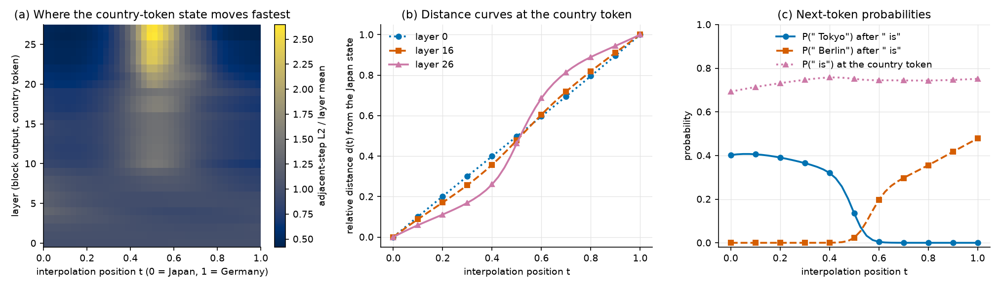
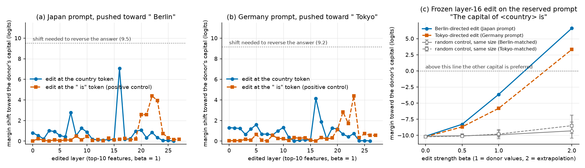
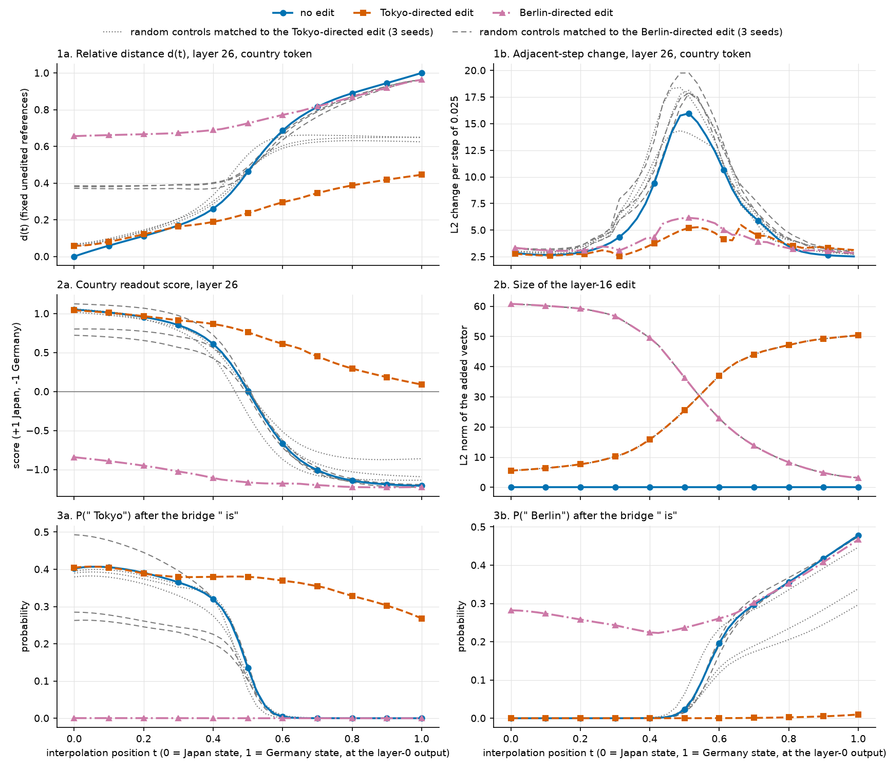

# REPORT — Does an activation plateau follow the country the model read or the capital it will say? (Qwen3-0.6B)

## Summary

**Why this matters.** When we slide a language model's internal state smoothly from "Japan" to "Germany",
the later layers do not change smoothly. They stay close to their Japan value, switch within a narrow range,
and then stay close to their Germany value. Such a flat-switch-flat pattern is called an *activation
plateau*. Interpretability tools that monitor or edit a model's internal states need to know what these
discrete values stand for. Two readings are possible here: the plateau marks which **country** the model has
read, or it marks which **capital** the model is going to say a token later. They suggest different things
to monitor and edit.

**Question.** In Qwen3-0.6B, for the prompt "The capital of Japan / Germany", does the plateau at the country
word follow the country identity or the later answer (Tokyo or Berlin)? To tell them apart we need an edit at
the country word that changes the answer while the country identity stays the same, and then to see whether
the plateau moves with the answer.

**What we did.** We reproduced the plateau, built an independent linear readout of country identity, searched
all 27 usable layers for a small edit at the country word that flips the capital answer, and reran the
interpolation under that edit and under random edits of the same size.

**What we found.**

1. The plateau is real but moderate, and it lives in layers 20–27 at the country word. Its switch point, the
   country readout's switch point and the answer's switch point all fall within about 0.03 of each other on a 0-to-1
   path (Figure 1).
2. No edit we tried at natural strength flips the answer (up to ten transcoder features, in one layer or two
   adjacent layers; terms are defined in Methods). One edit does at twice natural strength: ten features of
   the layer-16 MLP at the country word (Figure 2, Table 1).
3. That edit swaps the country as a whole. The country readout changes sign, and the model now answers
   "German mark" for Japan's currency and "Japanese" for Germany's language (Table 2). Eight of its features
   are active on the country word in every non-capital prompt we tried.
4. Under that edit the answer switch and the readout switch disappear, and the plateau's switch shrinks to
   34–39% of its size. Random edits of the same size leave all three in place (Figure 3, Table 3).

**Verdict.** We could not separate the two readings. The only early edit strong enough to change the answer
also changes country identity, so answer and country moved together in every test. The result is "not
disentangled", with one positive by-product: a small group of layer-16 features whose edit, at twice natural
strength, changes the capital, currency and language answers and flattens the late-layer plateau.

## Methods

### Data & Model

**Model.** `Qwen/Qwen3-0.6B` (0.6 billion parameters, 28 transformer blocks, hidden width 1024), revision
`c1899de`, float32, run as a plain text completer with no chat template. Each block contains an attention sub-layer and a multi-layer perceptron (MLP) sub-layer. Text is split into
*tokens*; the model outputs one score (*logit*) per possible next token. The *state* of a token after a block is its
1024-dimensional residual-stream vector, the running sum that every block reads from and adds to. We read
states at the output of each block.

**Prompts.** The target pair is `The capital of Japan` and `The capital of Germany`. The last token of each
is the *country token* (` Japan` or ` Germany`, one token each, position 3). After it we append a fixed
*bridge*, ` is`, and read the model's next-token prediction there; ` Tokyo` and ` Berlin` are single tokens.
Three phrasings are answered correctly for both countries. We use `The capital city of {country} is` to choose
the edit (the *tuning pair*) and keep `The capital of {country} is` (the *original pair*) and
`The capital of {country} is the city of` for evaluation (the *reserved pairs*). These are different
phrasings of the same two facts; the sample is two countries. To check side effects we reuse six currency and
language prompts from the earlier feature study in this project, such as `People in Japan speak`.

**Features.** A *transcoder* is a wide, sparse, one-hidden-layer network trained to imitate one MLP block: it
reads the MLP's input and predicts its output through 163,840 units called *features*, few of which are
non-zero on any token. A feature is *active* on a token when its value is above zero. Each feature has a *decoder direction*, the vector it adds to the MLP output. We use
the published transcoders `mwhanna/qwen3-0.6b-transcoders-lowl0` (revision `28aefe6`), one per layer. At the
country token about 7 features are active per layer, and the transcoder's prediction differs from the true
MLP output by a relative error of 0.21–0.71 (median 0.49). The native MLPs and attention always run; features
are used only to define edits.

### Metrics

**Interpolation path.** To move the model gradually from Japan to Germany we take the country token's state
after block 0 in each prompt, `h_J` and `h_G`, and build 41 intermediate states for `t` from 0 to 1. The
direction is rotated at constant angular speed and the length is interpolated linearly, the rule used in this
project's earlier plateau studies:

```math
h(t) = \big[(1-t)\,\lVert h_J\rVert + t\,\lVert h_G\rVert\big]\;\frac{\sin((1-t)\Omega)\,u_J + \sin(t\Omega)\,u_G}{\sin\Omega}
```

Here `u_J` and `u_G` are the unit vectors of `h_J` and `h_G`, and `Ω` is the angle between them (0.84 rad).
We overwrite the block-0 output at the country token with `h(t)` and recompute every later block. All results
along the path use this `t` axis.

**Adjacent-step change.** A plateau means the state barely moves for most of the path and moves a lot in a
narrow range. To see this directly we measure how far the country token's state `x_L` at block `L` moves
between neighbouring path points:

```math
s_L(k) = \lVert x_L(t_{k+1}) - x_L(t_k) \rVert_2, \qquad k = 0,\dots,39
```

A path moving at constant speed has equal steps. We summarise a layer by its largest step divided by its mean
step (1.0 means no plateau; larger means a sharper switch) and call the `t` of the largest step the
*boundary*. Figure 1a and Figure 3 (panel 1b) use this.

**Relative distance.** To show the same thing on a 0-to-1 scale, we compare the state with the two unedited
end states `x_L^J` (at `t = 0`) and `x_L^G` (at `t = 1`):

```math
d_L(t) = \frac{\lVert x_L(t) - x_L^{J}\rVert_2}{\lVert x_L(t) - x_L^{J}\rVert_2 + \lVert x_L(t) - x_L^{G}\rVert_2}
```

0 means "at the Japan state", 1 "at the Germany state", 0.5 "equally far from both". The references stay the
unedited ones even when the run is edited. Figure 1b and Figure 3 (panel 1a) use this.

**Answer margin.** To measure which capital the model prefers we take the two logits at the last bridge
token:

```math
m = z_{\text{Tokyo}} - z_{\text{Berlin}}
```

Positive `m` means Tokyo is preferred. Probabilities alone would hide progress, because an edit can remove
most of a 10-logit gap before the top token changes. The *answer boundary* is the `t` where `m` crosses zero.
Figure 2, Tables 1 and 3 use the margin; Figure 1c and Figure 3 (panel 3) show the two probabilities.

**Country readout.** The test needs a measure of country identity that does not depend on the capital answer.
We collect the country token's state in 16 non-capital prefixes per country, in four families (currency,
language, identity, general), for example `The official currency of {country}` and `I was born in {country}`.
For each layer, with class means `μ_L^J` and `μ_L^G`, the readout of a state `x` is its position along the
line joining the two means:

```math
r_L(x) = \frac{\big(x - \tfrac{1}{2}(\mu_L^{J} + \mu_L^{G})\big)^{\top}(\mu_L^{J} - \mu_L^{G})}{\tfrac{1}{2}\lVert \mu_L^{J} - \mu_L^{G}\rVert_2^2}
```

A score of +1 is the average Japan state and −1 the average Germany state. The readout is frozen after
fitting and never sees capital prompts or edited states. Fitted on three families, it gives the right sign
for every prompt of the fourth, at every layer. It has two limits: it is fitted on only two countries, and a
correct readout does not prove that all country information is intact. We therefore also check the model's
own currency and language answers. Table 2 and Figure 3 (panel 2a) use the readout.

**Feature edit.** To change the answer early we push a chosen set `F` of features at one layer, at the
country token, toward the values they take for the other country. The prompt being edited is the *recipient* and the other country's prompt is the *donor*. With `y` the true
MLP output, `a_i` the feature's value in the recipient run, `a_i^donor` its stored value in the donor's
tuning prompt, and `v_i` its decoder direction:

```math
y_{\text{new}} = y + \beta \sum_{i \in F} \big(a_i^{\text{donor}} - a_i\big)\, v_i
```

`β = 1` replaces the features with the donor's values (*natural strength*); `β = 2` goes twice as far and is
an *extrapolation* beyond anything the model produces itself. The part of the MLP output that the transcoder
does not explain is left untouched. A *Berlin-directed* edit uses Germany as donor and a *Tokyo-directed* edit
uses Japan.

**Choosing the features.** Testing every feature is too costly, so we rank the features active for either
country by a first-order estimate of how much the edit would move the margin, and then test the top ones with
real edits:

```math
e_i = \pm\,\big(a_i^{\text{donor}} - a_i^{\text{recipient}}\big)\,\big(\nabla_y m \cdot v_i\big)
```

The gradient `∇_y m` is taken in the unedited recipient prompt, and the sign is chosen so that positive `e_i`
means "toward the donor's capital". We edit the top 1, 5 or 10 features with positive `e_i` at `β` = 0.5, 1
and 2, at each of layers 0–26 and for pairs of adjacent layers. Layer 27 is excluded because no later
attention can carry its output to the bridge. Figure 2 reports the outcome.

**Selection rule.** Written down before the scan: take the setting that reverses the sign of `m` in both
directions on the tuning pair, preferring natural strength, then the fewest features. Layer, features, donor
values and strength are then frozen for every later test.

### Baselines

**No edit.** Every edited quantity is compared with the unedited run; `β = 0` and removing the edit reproduce
it exactly.

**Random control.** To check that an effect needs these particular features, we put the same coefficients on
10 random decoder directions from the same layer's dictionary and rescale the result to the real edit's L2
norm. Three seeds per direction.

**Bridge-token edit.** As a check that the method can move the answer at all, the same scan is run at the
` is` token, where the answer is produced.

**Constant-speed path.** At block 0 the path has equal steps by construction (largest step / mean = 1.01), so
any plateau at later layers is produced by the model.

## Results

### 1. The plateau sits in layers 20–27 and coincides with both candidate explanations

All six capital prompts are answered correctly without edits (` Tokyo` 0.40 and ` Berlin` 0.48 on the original
pair). Figure 1 shows the unedited path. In layers 0–9 the country token's state moves at nearly constant
speed (largest step at most 1.3 times the mean). From about layer 20 the movement concentrates near `t = 0.51`: at layer 26 the largest step is 2.65
times the mean step and the ten outermost steps average 0.44 times the mean. This is a moderate plateau, and
we use layer 26, the sharpest, for the comparison in Result 4. It is not visible in the model's immediate
output: the top next token at the country token is ` is` at all 41 points.

After the bridge the answer does switch. P(` Tokyo`) stays near 0.40 until `t = 0.40` and is below 0.01 from
`t = 0.60`; the margin crosses zero at `t = 0.531`. The country readout at layer 26 crosses zero at
`t = 0.501`, and the hidden-state boundary is at `t = 0.512`. The three switch points agree to within about
one grid step. This agreement is an observation about the unedited model. It is the reason an intervention is
needed: when country and answer switch at the same place, the path alone cannot say which one the plateau
follows.



**Figure 1.** Unedited Japan-to-Germany path. (a) Adjacent-step change of the country token's state divided
by that layer's mean step; x: interpolation position `t`, y: block; brighter means faster movement.
(b) Relative distance `d(t)` at block 0 (dotted, circles), block 16 (dashed, squares) and block 26 (solid,
triangles). (c) Probability of ` Tokyo` (solid, circles) and ` Berlin` (dashed, squares) after the bridge, and
of ` is` at the country token (dotted, triangles).

### 2. Only one early edit flips the answer, and only at twice natural strength

Figure 2 (a, b) shows the scan on the tuning pair. At natural strength no setting reverses the margin, at the
country token or at the bridge token. The bridge-token check is itself only partly successful: ten features
there move the margin by at most 4.4 of the 9.2–9.5 logits needed. Ten features of one MLP are a small lever
in a model where the transcoders miss about half of each MLP's output.

One site stands out. At the country token, layer 16 moves the margin by 7.1 logits (toward Berlin) and 4.1
(toward Tokyo) at natural strength; the next best single layers reach 2.8 and 1.9. At `β = 2`, layer 16 with
its top 10 features reverses the margin in both directions, and the selection rule picks this setting. It is
an extrapolated edit: the added vector has L2 norm 50–61, against 31–34 for the whole native MLP output at
that token.

On the tuning pair the frozen edit reverses the margin in both directions, although for the Japan prompt the
top token becomes ` a` (P(` Berlin`) = 0.09). On the reserved prompts the edit works as intended for the answer. Table 1 shows that it reverses the
margin on all four reserved prompts and makes the other capital the top token, with fluent continuations such
as "Berlin, and the capital of France is". Random controls of the same size move the margin by at most 3.4
logits and never reverse it. The probability of ` is` at the country token is preserved (0.69 to 0.73 for
Japan, 0.75 to 0.69 for Germany). Figure 2c shows how the margin depends on strength: the effect grows
steadily with `β`, and the sign changes between `β = 1` and `β = 2`.

**Table 1.** Reserved prompts under the frozen layer-16 edit (`β = 2`). Margin is logit(` Tokyo`) minus
logit(` Berlin`).

| Prompt | Pushed toward | Margin, no edit | Margin, edit | Margin, 3 random controls | Top token under edit (probability) |
|---|---|---:|---:|---|---|
| `The capital of Japan is` | Berlin | +10.15 | −6.61 | +7.96 to +10.44 | ` Berlin` (0.28) |
| `The capital of Germany is` | Tokyo | −10.23 | +3.32 | −9.73 to −6.85 | ` Tokyo` (0.27) |
| `The capital of Japan is the city of` | Berlin | +11.58 | −6.69 | +9.68 to +11.12 | ` Berlin` (0.34) |
| `The capital of Germany is the city of` | Tokyo | −11.01 | +2.34 | −10.02 to −8.84 | ` Tokyo` (0.27) |



**Figure 2.** (a, b) Tuning pair, top-10 features, `β = 1`. x: edited layer; y: margin shift toward the donor's
capital, in logits. Solid line with circles: edit at the country token. Dashed line with squares: edit at the
` is` token. The dotted horizontal line is the shift needed to reverse the answer. (c) Original pair, frozen
layer-16 features. x: edit strength `β`; y: margin toward the donor's capital, so points above the dotted zero
line mean the other capital is preferred. Filled circles, solid line: Berlin-directed edit on the Japan
prompt. Filled squares, dashed line: Tokyo-directed edit on the Germany prompt. Open markers: mean of the
three random controls for the matching edit, with bars from the smallest to the largest control.

### 3. The edit that flips the answer also swaps the country

The test requires country identity to stay put. Table 2 shows that it does not. On the original pair the
layer-26 readout goes from +1.05 to −0.84 under the Berlin-directed edit and from −1.21 to +0.09 under the
Tokyo-directed edit; controls stay between +0.72 and +1.13, and between −1.14 and −0.86. The model's own
answers agree with the readout. On all six currency and language prompts where the country word is
mid-sentence, the edited model gives the other country's attribute. None of the 18 control runs does. Four
further prompts that begin with the country word were unaffected by the edit and are left out, because this
model's first token has an abnormally large state on which neither the transcoders nor the readout work.

**Table 2.** Currency and language prompts under the frozen edit at the country token. The readout is at
layer 26 (+1 Japan, −1 Germany).

| Prompt | Pushed toward | P(correct answer), no edit → edit | Continuation under edit | Readout, no edit → edit |
|---|---|---|---|---|
| `The official currency of Japan is the` | Berlin | ` yen` 0.85 → 0.01 | `German mark, which is the same as` | +0.94 → −0.89 |
| `What is the official currency of Japan? It is called the` | Berlin | ` yen` 0.38 → 0.00 | `German mark. What is the official currency` | +0.82 → −0.84 |
| `People in Japan speak` | Berlin | ` Japanese` 0.36 → 0.00 | `German, but they are not German.` | +0.99 → −0.47 |
| `In Japan, the primary language is` | Berlin | ` Japanese` 0.72 → 0.00 | `German, and the primary language of the` | +1.05 → −0.73 |
| `People in Germany speak` | Tokyo | ` German` 0.58 → 0.09 | `Japanese as a second language, and Japanese` | −0.81 → +0.38 |
| `In Germany, the primary language is` | Tokyo | ` German` 0.86 → 0.18 | `Japanese, and the primary language of the` | −1.03 → +0.18 |

The selected features explain this outcome descriptively. Of the 13 distinct features in the two frozen sets,
eight are active at the country token on all 16 non-capital prefixes of one country and on none of the
other's (three for Germany, five for Japan), and these carry 97–98% of the summed estimated effect. They respond
to the country word in any context. The ranking looked for features that move the capital answer and found
general country features; no capital-specific feature at the country token had a comparable effect
(Figure 2 a, b). The edit therefore fails the requirement of the test, and the plan's stop condition for this
case applies.

### 4. On the path, answer, country readout and plateau move together

We still reran the path under the frozen edit, because it shows what happens to the plateau when these
features are pinned to one country. Figure 3 and Table 3 give the result at layer 26.

With the Tokyo-directed edit, ` Tokyo` stays preferred at every `t` (margin 10.1 down to 3.3) and the readout
stays positive (+1.04 down to +0.09). With the Berlin-directed edit, ` Berlin` is preferred at every `t`
(margin −6.5 to −10.2) and the readout stays negative (−0.84 to −1.22). In both cases the plateau's switch
shrinks: the largest step falls from 16.0 to 5.5 and 6.2, which is 34% and 39% of its unedited size. The six random
controls keep the answer boundary (`t` = 0.50–0.54), the readout crossing (0.46–0.51) and the largest step
(14.3–19.8). So the flattening is specific to these features and is not a side effect of adding a large
vector at layer 16.

**Table 3.** The path at layer 26, country token. "Largest step" is the largest adjacent-step change;
"never" means the quantity does not cross zero anywhere on the path.

| Condition | Answer boundary `t` | Readout crosses zero at `t` | Largest step (L2) | Largest step / no edit | `t` of largest step |
|---|---|---|---:|---:|---|
| No edit | 0.531 | 0.501 | 16.0 | 1.00 | 0.512 |
| Tokyo-directed edit | never | never | 5.5 | 0.34 | 0.662 |
| Berlin-directed edit | never | never | 6.2 | 0.39 | 0.512 |
| Random controls, Tokyo-matched (3) | 0.503–0.538 | 0.462–0.503 | 14.3–18.4 | 0.90–1.15 | 0.487–0.512 |
| Random controls, Berlin-matched (3) | 0.525–0.536 | 0.492–0.507 | 17.9–19.8 | 1.12–1.24 | 0.512 |

A reduced peak remains under both edits (5.5 and 6.2, against about 3 at the ends of the path). Neither the
answer nor the readout crosses under these edits, so this remainder cannot be assigned to either reading.
The edited states are also not copies of the other country's state: at `t = 0` the Berlin-directed edit
leaves the layer-26 state 86 away from the unedited Germany state, where the two unedited end states are 177
apart.



**Figure 3.** Japan-to-Germany path; x: interpolation position `t` in every panel. Solid line with circles:
no edit. Dashed line with squares: Tokyo-directed edit. Dash-dot line with triangles: Berlin-directed edit.
Thin lines without markers: random controls, dotted for those matched to the Tokyo-directed edit and
long-dashed for those matched to the Berlin-directed edit. Panel 1a: relative distance `d(t)` of the layer-26 country-token
state, with unedited references. Panel 1b: adjacent-step L2 change of the same state. Panel 2a: country
readout at layer 26. Panel 2b: L2 norm of the vector added at layer 16; each control has the same norm as its
edit by construction, so those lines coincide. Panels 3a and 3b: probability of ` Tokyo` and of ` Berlin`
after the bridge.

## Conclusion

**Answer to the question.** This study does not show whether the plateau follows country identity or the
later answer. The test needs an early edit that moves the answer and leaves the country alone, and no such
edit was found: natural-strength edits never reversed the answer (Figure 2 a, b), and the one extrapolated
edit that did also reversed the country readout and the currency and language answers (Table 2). Under that
edit, answer, readout and most of the plateau's switch disappeared together (Figure 3, Table 3). In the
plan's terms the outcome is "country and answer both change: not disentangled".

**What the experiments do establish.** These are intervention results with matched random controls, for two
countries and one model. (1) At the country token, ten layer-16 transcoder features pushed to twice their
natural range are enough to make the model answer with the other country's capital, currency or language:
on all four reserved capital prompts and all six mid-sentence currency and language prompts (Tables 1 and 2).
At natural strength the same features close about a third (toward Berlin) or a fifth (toward Tokyo) of the
gap between the two countries' margins without changing the top token (Figure 2c). (2) Pushing the same
features at this strength also flattens the late-layer plateau: the largest step at layer 26 falls by 61–66%,
while same-size random edits leave it at 90–124% of its unedited size (Table 3). These two facts are compatible with both
readings of the plateau, since a country swap changes everything downstream of the country at once.

**Limitations.** The sample is one country pair and three phrasings of one fact each. The working edit is an
extrapolation whose added vector is larger than the native MLP output, so the edited states lie outside what
the model produces; fluent outputs and null controls reduce this concern but do not remove it. The transcoders
miss roughly half of each MLP's output, and edits at the bridge token, where the answer is produced, also
failed to reverse it; a capital-specific signal may exist outside this dictionary or outside the MLPs. The
country readout separates only Japan from Germany. The plateau itself is moderate (largest step 2.65 times
the mean).

**What would be needed.** A decisive test needs an edit that moves the capital answer while the currency and
language answers stay correct. The scan found none among the top-ranked transcoder features at the country
token.

Full tables for every layer, all prompts, the feature list and the ` is`-token states are in `RESULTS.md`;
raw curves and the rerun command are in `results/` and `experiments/run_all.sh`.
