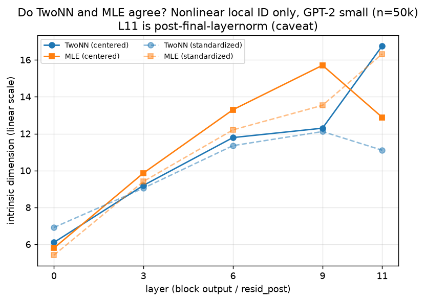
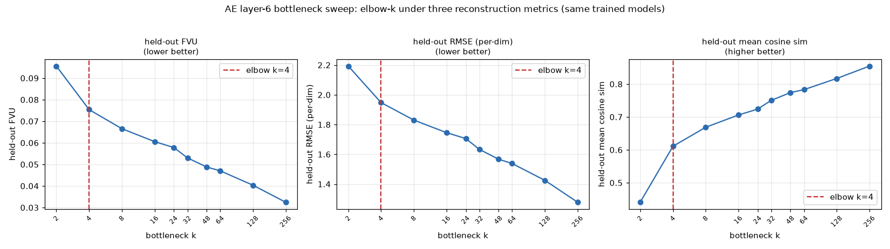

# REPORT — Manifold Characterization of the GPT-2 Residual Stream

**Direction #3.** Question: how many dimensions does the GPT-2-small residual stream actually
occupy, and does a nonlinear autoencoder bottleneck agree with nonlinear intrinsic-dimension (ID)
estimators about that number?

## Summary

On **one pooled FineWeb activation sample** from GPT-2 small, the **layer-6** residual stream has a
**low local intrinsic dimension ≈ 11–15** (TwoNN ≈ 11.7–12.7, MLE ≈ 13.4–15.2 over n = 50k→20k;
bootstrap *sampling* CI only ±0.1 at fixed n, so the spread is finite-sample n-dependence, not
noise). This is the trustworthy result: it is reproducible across subsample size, robust to per-dim
standardization, robust to exact duplicates / self-masking (explicit self-index masking moves it
≤ 0.17), low across coarse token-position buckets (TwoNN stable ~9.6–10; MLE estimator-dependent
~8.7–13.3), and the estimators are validated on *synthetic linear-Gaussian* data of known dimension.
It is far below the ambient **d_model = 768** and (at layer 6 specifically) far below the linear
**d95 = 94**.

A deep autoencoder (AE) bottleneck sweep gives only a **raw-variance reconstruction artifact
consistent with low ID — not independent corroboration**: on raw centered activations it bends from
steep to shallow near **k ≈ 8–16** (seed-stable, survives approximate param-matching, overlapping
the ID band), but it does **not** plateau and the bend **vanishes when activations are
standardized** — so it largely tracks the single "massive-activation" dimension rather than
independently measuring a manifold dimension.

**Bottom line: suggestive evidence of a low (~8–16) intrinsic dimension at layer 6, not strong proof
of a globally low-dimensional curved manifold.**

## Methods

### Data & Model
- **Model:** GPT-2 small (124M params, d_model = 768, 12 transformer blocks), HuggingFace
  `transformers`. Activations captured via `GPT2Model(output_hidden_states=True)`; `hidden_states[L+1]`
  is the residual stream after block L (resid_post). **Layers sampled: {0, 3, 6, 9, 11}.** The headline
  is **layer 6**.
- **Data:** FineWeb (CC-MAIN-2013-20), streamed via the HuggingFace datasets-server REST API (no full
  download). 912 sequences × seq_len 256 → **200,000 pooled token vectors per layer**, stored fp16.
  **What "pooled" means and where it happens:** at collection time we take `hidden_states[L+1]` and
  keep the residual vector at **every non-padding token position of every sequence**
  (`hidden_states[L+1][attention_mask]`), concatenating them all into one combined point cloud — so
  each token is its own data point. This is **not** per-sequence mean-pooling (we never average
  positions into a single per-document vector). We pool across positions because intrinsic dimension
  and the AE bottleneck are properties of the *set* of residual vectors the model emits, and pooling
  maximizes the sample size (200k) the kNN-based estimators need; the token-position-stratified check
  (Results) confirms coarse absolute position is not what drives the estimate.
- **Subsamples:** ID estimators use n = 10k / 20k / 50k subsamples; the AE sweep uses all 200k with a
  90/10 train/val split.
- **Compute:** activation collection + all ID estimators on **CPU (2 threads)**. The AE sweep ran on
  CPU first (1200 steps) and was re-run on an **NVIDIA A10 GPU** (sm_86, cu130 torch) with 10000 steps;
  VRAM capped at the shared-box per-agent fraction.
- **Layer-11 caveat:** for `GPT2Model`, the final `hidden_states` entry has the model's final
  LayerNorm (`ln_f`) applied, so **layer 11 is post-final-layernorm, not raw resid_post**. Layers
  0/3/6/9 (interior indices) are genuine resid_post; the layer-6 headline is unaffected.

### Metrics
Let $x \in \mathbb{R}^{768}$ be a residual-stream vector, $\hat{x}$ its AE reconstruction, and
$\mu_{\text{train}}$ the training mean.

**Fraction of variance unexplained (AE reconstruction quality), scored on held-out val:**

```math
\mathrm{FVU} = \frac{\mathbb{E}\,\lVert x - \hat{x}\rVert^2}{\mathbb{E}\,\lVert x - \mu_{\text{train}}\rVert^2}, \qquad \text{var\_expl} = 1 - \mathrm{FVU}.
```

The reported AE signal is the **bend location** $k^\star$ (where added latents stop paying off), found
by Kneedle on $\mathrm{FVU}$ vs $\log_2 k$, plus the per-doubling marginal gain
$\Delta\mathrm{FVU}(k) = \mathrm{FVU}(k/2) - \mathrm{FVU}(k)$ used to test for a plateau.
(**Kneedle** — Satopää et al. 2011 — locates a curve's "knee" as the point of maximum distance below
the straight chord joining the curve's first and last points, after normalizing both axes to
$[0,1]$; here that curve is $\mathrm{FVU}$ vs $\log_2 k$. It only reports *where* a curve turns; it
does not certify that a sharp turn exists — see the honest reading of the bend in Results.)

To check that the AE elbow is not an artifact of scoring reconstruction by FVU, we re-score the
same trained models with two further held-out metrics on the centered vectors $x' = x - \mu_{\text{train}}$
that the AE reconstructs. **Per-dimension reconstruction error (RMSE)** — the raw error scale, not
normalized by variance, lower is better:

```math
\mathrm{RMSE} = \sqrt{\frac{1}{N\,d}\sum_{i=1}^{N}\lVert x'_i - \hat{x}_i\rVert^2}, \qquad d = 768 .
```

**Mean cosine similarity** — angle-only agreement between each centered activation and its
reconstruction (magnitude-invariant, higher is better, in $[-1,1]$):

```math
\mathrm{cos} = \frac{1}{N}\sum_{i=1}^{N} \frac{\langle x'_i,\ \hat{x}_i\rangle}{\lVert x'_i\rVert\;\lVert \hat{x}_i\rVert} .
```

The same Kneedle rule is applied to each of the three curves ($\mathrm{FVU}\downarrow$,
$\mathrm{RMSE}\downarrow$, $\mathrm{cos}\uparrow$; for the increasing cosine curve the knee is the
point of maximum distance *above* the chord).

**TwoNN (Facco et al.) local ID.** Every point and its neighbours live in the **ambient
768-dimensional residual-stream space** $\mathbb{R}^{768}$ (the raw captured activation vectors),
under the standard Euclidean metric — TwoNN uses **no** projection or embedding; it reads the
*local* intrinsic dimension straight off the geometry of the ambient point cloud. For each point
$x_i$, let $r_1(i)$ and $r_2(i)$ be the Euclidean distances to its **1st and 2nd nearest neighbours**
among the other activation vectors, and let $\mu_i = r_2(i)/r_1(i) \ge 1$. Under a density that is
locally uniform on a $d$-dimensional manifold, this ratio is Pareto-distributed with parameter $d$,
so its cumulative distribution function is

```math
F(\mu) \;=\; \Pr[\,\mu_i \le \mu\,] \;=\; 1 - \mu^{-d}, \qquad \mu \ge 1 .
```

$F$ is thus the CDF **of the neighbour-distance ratios** $\mu_i$ (estimated empirically by the sorted
rank $F(\mu_{(j)}) = j/(N+1)$). Taking $-\log(1-F)$ of both sides rearranges this into a line through
the origin whose slope is the intrinsic dimension $d$; the fit discards the upper 10% of $\mu$ for
heavy-tail robustness:

```math
-\log\!\big(1 - F(\mu)\big) = d\,\log \mu .
```

**MLE — Maximum Likelihood Estimation (Levina–Bickel) local ID.** Using the $k$ nearest-neighbour distances $T_j(x)$ ($k = 20$),
the per-point estimator and the reported (MacKay–Ghahramani inverse-average) aggregate are

```math
\hat{d}_k(x) = \Bigg[\frac{1}{k-1}\sum_{j=1}^{k-1}\log\frac{T_k(x)}{T_j(x)}\Bigg]^{-1}, \qquad \hat{d} = \Bigg[\frac{1}{N}\sum_{i=1}^{N}\hat{d}_k(x_i)^{-1}\Bigg]^{-1}.
```

### Baselines
- **Ambient dimension** $d_{\text{model}} = 768$ — trivial upper bound.
- **Linear PCA participation ratio** (effective number of significant PCs), with eigenvalues
  $\lambda_i$ of the covariance: $\mathrm{PR} = \big(\sum_i \lambda_i\big)^2 \big/ \sum_i \lambda_i^2$.
- **Linear PCA d95 / d99** — smallest number of principal components whose cumulative variance ratio
  reaches 95% / 99%: $d_q = \min\big\lbrace m : \sum_{i=1}^{m}\lambda_i \big/ \sum_i \lambda_i \ge q \big\rbrace$, $q \in \lbrace 0.95, 0.99\rbrace$.
- **Synthetic-Gaussian validation** — isotropic Gaussians of known dimension $d \in \lbrace 5,10,20,50\rbrace$
  linearly embedded in 768-d, run through the same TwoNN/MLE code, to calibrate estimator bias.
- **AE param-count control** — a parameter-matched AE that holds total params fixed (spread 0.087%)
  by trading outer hidden width $h_1$ against bottleneck width $k$, isolating $k$ from capacity drift.

## Results

### Per-layer intrinsic dimension
Nonlinear local ID is **low (~6–16) at every layer**, grows gently with depth, and sits far below the
ambient 768. The linear PCA d95 baseline is **layer-dependent and erratic** — it is large at
layers 0/6/9 but collapses to 5–6 at layers 3/11 (driven by the massive-activation dimension), so the
clean "nonlinear ≪ linear" gap holds **at layer 6 specifically** (12–13 vs 94), not as a blanket
claim.


**Estimator agreement (TwoNN vs MLE only).** The figure above overlays the linear PCA d95 and the
ambient d_model = 768 on a log axis, which compresses the two nonlinear curves. The version below
plots **only** TwoNN and MLE (centered and standardized) on a **linear** y-axis, so the reader can
judge directly how closely the two nonlinear estimators agree: they track each other within ≈ 1.5
units at layers 0/3/6 (near-identical at layer 6, 11.8 vs 13.3), and diverge only at the deeper
layers 9/11 — most sharply at the **post-final-layernorm** layer 11, where standardization also flips
their order. So the two independent nonlinear estimators corroborate each other where it matters (the
layer-6 headline), and their disagreement is confined to the layers with known preprocessing
artifacts.



PCA participation ratio is **not** usable as an ID here: from layer 3 on, a single massive-activation
dimension carries 78–94% of total variance, collapsing $\mathrm{PR}$ to ≈ 1.

**Layer-6 dimension estimates:**

| Estimate | Method | Value | Notes |
|----------|--------|-------|-------|
| Ambient | — | **768** | $d_{\text{model}}$ |
| Linear, 95% var | PCA d95 | **94** | flat subspace for 95% variance (layer 6) |
| Linear, 99% var | PCA d99 | **479** | flat subspace for 99% variance (layer 6) |
| **Nonlinear local ID** | TwoNN / MLE | **≈11.7–12.7 / ≈13.4–15.2** | trustworthy; robust to std, position, duplicates; sampling CI ±0.1 |
| AE bottleneck bend | FVU knee (raw) | **≈8–16** | raw-variance artifact; vanishes under standardization |

### Estimator validation (synthetic)
On isotropic Gaussians of known dimension linearly embedded in 768-d (n = 20k), TwoNN/MLE are exact at
low d and acquire the known mild downward bias at high d (d = 50 → ~32–35). The layer-6 numbers
(~12–15) sit in the regime where the estimators were exact, **but this calibrates accuracy only on
that synthetic family** — real residual activations are curved, anisotropic and clustered. We
emphasize the **"isotropic Gaussian"** qualifier deliberately: an isotropic Gaussian on a flat linear
subspace is the *easiest possible* input for these estimators (uniform local density, no curvature,
no anisotropy, no clustering), so passing it is necessary but far from sufficient. It shows our
hand-rolled TwoNN/MLE code is correct and unbiased *in the regime the layer-6 estimate falls in* — it
does **not** prove the estimators are accurate on the harder real-activation geometry. Reading it as
"the estimators are validated" (full stop) would overclaim; "validated on synthetic linear-Gaussian
data" is the honest scope.


### ID diagnostics: bootstrap CIs and duplicate/self-masking
Bootstrap (B = 20 disjoint draws of n = 20k) gives a **tight sampling CI of ±0.1** at fixed n — the
estimate is not noise. The 11–13 → 11–15 band is finite-sample n-dependence (n = 50k → 20k).
Layer 6 has 92/50k exact duplicate rows (0.18%); explicit self-index masking shifts TwoNN by 0.00 and
MLE by +0.17 — the low ID is **not** a duplicate/self-masking artifact.


### Token-position-stratified ID (layer 6)
Re-collecting 80k layer-6 vectors *with* token position and estimating ID per bucket: ID is **low in
every bucket, roughly similar with estimator-dependent variation** (TwoNN ~9.6–10 stable; MLE
~8.7–13.3). This is evidence against **one** pooling artifact (coarse absolute-position mixing); it
does *not* control token identity, document/topic clustering, duplicate text, or local sequence
correlations, so the claim is scoped to "this pooled FineWeb sample."


### Does the AE elbow agree with the ID? — partially, and weakly
At a CPU budget (1200 steps) the Kneedle elbow is k ≈ 16; on GPU with **8.3× more optimizer steps and
16.7× more sampled training examples** (10000 steps × batch 4096, 3 seeds, seed-std ≤ 0.0018) the bend
tightens to k ≈ 8 and the FVU floor drops 0.051 → 0.033. Where it exists, the bend overlaps the
nonlinear ID band (12–13). But three checks show the AE signal is **fragile**, not strong:

1. **No plateau, and barely a bend at all.** Read honestly, the raw GPU curve is close to a straight
   line in $\log_2 k$: **only the very first doubling is visibly steep** ($\Delta\mathrm{FVU}$: 2→4
   = 0.0202), after which *every* later doubling is a flat, irregular ~0.006–0.009 (4→8 0.0089,
   8→16 0.0060, 16→24 0.0073, … 128→256 0.0067) with **no decay** out to k = 256 (e.g. 128→256 ≥
   8→16). So the "bend" is generous language — there is one steep step followed by a near-log-linear
   tail, not a knee where the curve turns and then plateaus. The original "flattens after k ≈ 16"
   claim is withdrawn; k = 8–16 is a **soft Kneedle output** (Kneedle always returns *some* point of
   maximum chord-distance even for a nearly straight curve), not a sharp knee. **This weak, hard-to-see
   bend is exactly why the AE is only "consistent with," not "evidence for," the ID** — a genuinely
   low-dimensional bottleneck would show a clear elbow followed by a plateau, and this does not.
2. **Disappears under standardization.** On z-scored activations FVU falls almost linearly in
   $\log k$ (var_expl 25% → 72% over k = 2→256) with **no knee at all**. The raw-data bend is mostly
   the AE capturing the one dominant dimension first (k = 2 already explains 90% of raw variance), not
   a manifold-dimension signature.
3. **Parameter count controlled (approximately).** The fixed architecture's param count drifts with k
   (1.052M → 1.182M), so a **parameter-matched** sweep holds the total fixed (spread 1024 = 0.087%) by
   trading outer width $h_1$ (576→512) against k. The matched curve is within ≤ 0.0021 of the unmatched
   curve at every k and shows the **same low-k bend** — so the bend is *not* a param-count artifact.
   Honest caveat: because $h_1$ also changes, k is not the "only varying channel"; this controls the
   param-count confound but not outer-width capacity.
4. **Metric-robust elbow (not an FVU artifact).** Re-scoring the same GPU models by per-dimension
   **RMSE** and by **mean cosine similarity** (definitions in Methods) returns the **same Kneedle
   elbow, k = 4, under all three metrics** (FVU, RMSE, cosine). So the AE "ID" does not depend on
   using FVU. But this pins down the *location*, not the *strength*: the cosine curve rises 0.44→0.61
   over the one steep step k = 2→4 and then climbs slowly and near-linearly to 0.86 at k = 256 with no
   saturation — the same near-straight, no-plateau tail. And absolute quality at the elbow is modest
   (k = 4: mean cosine only 0.61, RMSE still ~89% of the k = 256 floor), so a 4-D bottleneck does *not*
   reconstruct the stream well — the low-k elbow reflects the single massive-activation dimension being
   captured first, not a tight 4-D manifold.




The **TwoNN/MLE local ID is the robust signal**; the AE merely fails to contradict it.

### Cross-model check: what makes an AE elbow appear? (Qwen3-1.7B)
A colleague reported a reconstruction *elbow* on **Qwen3-1.7B** using a much larger deep autoencoder
(`2048→4096→4096→2048→k`, ≈ 67 M params) on last-token activations. We reproduced that setup to test
whether an AE elbow is a real intrinsic-dimension signature or the same raw-variance artifact we see in
GPT-2. **Full study in `REPORT_AE.md`; the high-level result:**

- **Faithful reproduction shows no elbow.** On Qwen3-1.7B last-token activations (layers 2 and 10,
  FineWeb-Edu, seq_len 10), held-out FVU falls **smoothly and never plateaus** (layer 2: 0.57 at k = 5
  → 0.40 at k = 30, still improving; layer 10 similar). At k = 30 the AE still leaves ~40% of variance
  unexplained.
- **Why: these activations are near-isotropic.** Qwen last-token clouds have a PCA participation ratio
  of **245 (layer 2)** and **42 (layer 10)** and put ≤ 3.4% of variance in any one direction — versus
  GPT-2 layer 6, which puts **90.4%** in a single "massive-activation" direction (PR ≈ 1.2). A narrow
  bottleneck cannot plateau on data this spread out.
- **A single factor switches the elbow on.** Taking the *same* isotropic Qwen activations and rescaling
  one coordinate to carry 90% of the variance (matching GPT-2's structure) makes the identical AE snap
  to a **sharp low-k knee with a flat plateau** (FVU ≈ 0.10 at k = 1, flat at ~0.066 by k = 16). So the elbow is a readout of
  **variance concentration (anisotropy)**, not of model, layer, token position, dataset, or AE size.

This confirms cross-model what the GPT-2 sweep already suggested: the AE "elbow" tracks the dominant
variance direction, so it is **consistent with, not proof of, a low-dimensional manifold**. The
trustworthy dimensionality signal remains the local ID estimators.

### Depth trend
Nonlinear ID grows gently with depth — mean(TwoNN, MLE) ≈ 6 (L0) → 9 (L3) → 12 (L6) → 14 (L9) → ~14
(L11). Standardization leaves the estimate close (Δ < 2) at layers 0/3/6/9 but **shifts layer 11
substantially** (TwoNN 16.8 → 11.1, MLE 12.9 → 16.3) — consistent with layer 11 being
post-final-layernorm (see Methods). The layer-6 result is robust to standardization.

## Conclusion

On a pooled FineWeb sample, GPT-2's **layer-6 residual stream has a low local intrinsic dimension
≈ 11–15** (TwoNN/MLE; bootstrap sampling CI ±0.1, the band being finite-sample n-dependence), an
estimate that survives standardization, holds across token positions, is robust to exact
duplicates / self-masking, and uses validated estimators — far below the ambient width (768) and the
layer-6 linear d95 (94). A longer-trained, multi-seed, parameter-matched autoencoder bottleneck bends
in the same ~8–16 range but provides only a raw-variance reconstruction artifact consistent with that
band: it does not plateau and disappears under standardization. So the residual stream **appears** to
occupy a low-dimensional set at layer 6, but "~12–16-dimensional curved manifold" should be read as a
**suggestive pilot finding, not a demonstrated property** of the full residual stream.

### Caveats
- The AE elbow is **preprocessing-sensitive and non-plateauing** — a raw-variance reconstruction
  artifact *consistent with* the ID band, not independent proof.
- TwoNN/MLE underestimate at large d (synthetic d = 50 → ~32–35), so a true ID modestly above the
  ~11–15 band is possible; still far below d95 = 94 / d_model = 768 at layer 6.
- **Layer 11 is post-final-layernorm**, not raw resid_post; all layer-11 numbers read accordingly.
- The linear-vs-nonlinear "≪" gap is **layer-6-specific**: at layers 3/11 the linear d95 collapses to
  5–6, below the nonlinear ID.
- One FineWeb slice, pooled tokens. Other corpora, removing the massive-activation dim before the AE,
  re-collecting raw block-11 resid_post via a forward hook, and a second model remain open follow-ups.

## Artifacts
- `results/pca_pr.json` — linear PCA per layer.
- `results/id_nonlinear.json` — TwoNN+MLE, 5 layers × {10k,50k} × {centered,std}.
- `results/id_validation.json` — synthetic-Gaussian validation of TwoNN/MLE.
- `results/id_by_position.json` — layer-6 ID stratified by token position.
- `results/id_diagnostics.json` — layer-6 duplicate/self-masking diagnostic + bootstrap CIs.
- `results/ae_results.json` / `ae_results_gpu.json` / `ae_results_gpu_v2.json` — AE FVU vs k
  (CPU, GPU, raw-seeds + standardized).
- `results/ae_results_matched.json` / `ae_matched_param_counts.json` — parameter-matched AE sweep.
- `results/ae_param_counts.json` — exact AE param count per k (drifting design).
- `plots/` — `id_per_layer.png`, `id_validation.png`, `id_diagnostics.png`, `id_by_position.png`,
  `ae_fvu_sweep.png`, `ae_marginal_gain.png`.
- `experiments/` — `collect_acts.py`, `pca_pr.py`, `id_estimate.py`, `validate_estimators.py`,
  `collect_by_position.py`, `id_diagnostics.py`, `ae_sweep.py`, `ae_sweep_gpu.py`,
  `ae_sweep_gpu_v2.py`, `ae_sweep_matched.py`, `make_plots.py`.
- `RESULTS.md` — full tables, headline, and caveats. `CHANGELOG.md` — dated change history.
- `REPORT_AE.md` — companion Qwen3-1.7B autoencoder-elbow study (when does an AE reconstruction elbow
  appear?); `ae_study/` — its code, caches, results, and figures (`plots/qwen_*.png`).
